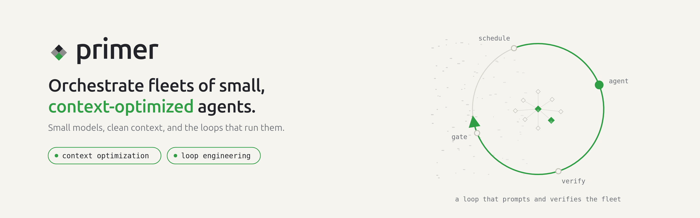

<div align="center">

<picture>
  <source media="(prefers-color-scheme: dark)" srcset="docs/assets/hero-dark.png">
  
</picture>

<br>

**An unopinionated, batteries-included agent-orchestration platform built around one bet: a small model given a clean, purpose-built context can rival a much larger one.**

<br>

[](LICENSE)
[](https://github.com/codemug/primer/actions/workflows/ci.yml)
[](https://codecov.io/gh/codemug/primer)
[](https://www.python.org/)
[](CONTRIBUTING.md)
[](https://github.com/codemug/primer/stargazers)

[Quickstart](#quickstart) · [Features](#what-you-can-build) · [How it works](#how-it-works) · [Docs](#documentation) · [Contributing](CONTRIBUTING.md)

</div>

---

## Why Primer

A language model spreads a fixed budget of attention across every token in its context at once. Keep the context tight and the few tokens that matter get most of that attention; bloat it with stale history, unused tool definitions, and irrelevant background and the signal thins out. Primer's core bet is that **you often do not need the biggest model if you give the model you have exactly what it needs and nothing more** - and that this is a lever on any model, large or small.

So instead of one giant agent with everything crammed into its prompt, Primer lets you orchestrate **fleets of small, focused agents**, each with a clean working context, wired together with the primitives a real deployment needs: LLM providers, workspaces, graphs, knowledge collections, channels, triggers, and semantic search - integrated from the start, runnable on your own hardware.

## What you can build

<table>
  <tr>
    <td width="33%" valign="top">

⏸️ **Yielding, event-driven agents**

Agents park on a slow tool or a human decision and resume when the event fires - freeing compute while they wait.

</td>
    <td width="33%" valign="top">

🔀 **Directed graphs**

Wire agents into cyclic graphs (producer-judge loops, fan-out/fan-in, conditional branches) that run as structured workflows.

</td>
    <td width="33%" valign="top">

📁 **Workspaces & sessions**

Materialised sandboxes (local, container, or Kubernetes) give each agent a persistent filesystem and git-backed state.

</td>
  </tr>
  <tr>
    <td width="33%" valign="top">

🔎 **Semantic search**

Ingest documents into vector collections; agents retrieve only the relevant chunks, not the whole corpus.

</td>
    <td width="33%" valign="top">

💬 **Channels**

Bridge agents to Slack, Telegram, and Discord - ask questions, request approvals, and trigger work from a message.

</td>
    <td width="33%" valign="top">

🔌 **MCP server**

Expose the full platform tool surface over the Model Context Protocol so external agents and MCP clients can use it.

</td>
  </tr>
  <tr>
    <td width="33%" valign="top">

✅ **Human approvals**

Gate sensitive tool calls behind an approval that a person grants from a channel or the console before the agent proceeds.

</td>
    <td width="33%" valign="top">

📦 **Harnesses**

Package a tuned set of agents, graphs, and collections into a git-backed, versioned bundle and deploy it anywhere in one step.

</td>
    <td width="33%" valign="top">

🧭 **Dynamic discovery**

Two meta-tools let an agent search for and invoke any tool or agent at runtime - without carrying the whole catalog in its context.

</td>
  </tr>
</table>

<!-- DEMO GIF: drop the ask_user -> channel reply -> resume capture here once recorded, e.g.
<div align="center"></div>
-->

<!-- SCREENSHOTS: add a framed-console section here (Dashboard / Session control room / Approvals / Graph editor) once the captures are produced. -->

## Built for loop engineering

Loop engineering is the shift from prompting an agent turn-by-turn to **designing the system that prompts it** - a loop that wakes on a schedule, works toward a stated goal, checks its own output against evidence, and escalates to a human only when it should. The leverage moves from writing a good prompt to designing a good loop.

A loop needs a specific set of primitives. Primer ships all of them, integrated and self-hostable:

| A loop needs... | Primer gives you |
|---|---|
| **A heartbeat** - work surfaced on a cadence, not by hand | **Triggers** that start a fresh session or graph run (or resume a parked one) on a cron schedule, a delay, or a webhook |
| **Isolation** - parallel agents that don't collide | **Workspaces** - a per-agent local, container, or Kubernetes sandbox with its own persistent, git-backed filesystem |
| **Durable memory** - the agent forgets, the repo doesn't | Git-backed workspace **state** plus **knowledge collections** agents retrieve from, so knowledge compounds across runs instead of resetting to zero |
| **A maker and a checker** - keep the writer away from the grader | **Directed cyclic graphs** with producer-judge loops, fan-out/fan-in, and runtime agent/graph invocation |
| **Connectors** - reach real tools and real people | A built-in **MCP server** (and MCP client), plus **Slack / Telegram / Discord** channels |
| **A human gate** - approve the risky, let the safe run | **Approval gates** and **park-and-resume**: an agent waits on a person for hours without holding compute, then continues when the reply lands |

Primer does not press "go" on the loop for you - it gives you the orchestration substrate to build one and to keep a human in it where that matters. And the same context discipline that makes a single agent accurate is what lets a loop run for a long time without drifting: each iteration gets a clean, purpose-built context instead of an ever-growing transcript.

## Quickstart

**Requirements:** Python 3.13, [`uv`](https://github.com/astral-sh/uv), and (optionally) Postgres - see `docker-compose.yml` for a one-command setup.

```bash
# 1. Clone and install
git clone https://github.com/codemug/primer.git
cd primer
uv sync

# 2. Start the API (includes an in-process worker)
uv run primer api

# 3. Verify, then open the console
curl http://localhost:8000/v1/health      # -> {"status":"ok"}
```

Open the operator console at **http://localhost:8000/console/**.

With no `--config` flag, Primer runs zero-config on an embedded SQLite database (`~/.primer/db/data.sqlite`, in-memory scheduling) - perfect for a first look. For multi-process or production use, point it at Postgres:

```bash
docker compose up -d postgres            # or: podman compose up -d postgres
cp config.example.yaml config.yaml       # set db.config.password to match
uv run primer api --config config.yaml
```

`config.example.yaml` documents every field. Environment variables override file values: every `AppConfig` field maps to `PRIMER_<FIELD>` (nested fields use `__`, e.g. `PRIMER_DB__CONFIG__PASSWORD`).

## How it works

Primer is a stack of layers, where each layer keeps the one below it from getting cluttered:

- **Context discipline** - tool selection, meta-tools, and internal collections keep each agent's prompt lean.
- **State** - workspaces give agents a shared, minimal surface to hand off results without carrying history in-context.
- **Sequencing** - directed cyclic graphs express multi-step reasoning as structure instead of one giant prompt.
- **Time** - event-driven park-and-resume frees compute while work waits on a slow tool or a human.
- **Sharing** - harnesses package a working configuration into a versioned, git-backed bundle.
- **Edges** - channels, web search, and approval gates handle where agents reach outside the platform.

At runtime, requests arrive from many edges (REST/console, MCP clients, chat channels, triggers), become **sessions / chats / graph runs** that a worker pool claims and drives; each turn calls LLM providers, tools, workspaces, and collections, and can park on a human or event and resume later - all backed by Postgres.

## Documentation

- **Operator docs** - served at `/docs` when the server is running (start with [Introduction](primer/user_docs/getting-started/introduction.md) and the [Quickstart](primer/user_docs/getting-started/quickstart.md)).
- **Agent-usage docs** - [`docs/agents/`](docs/agents/) - how to drive a running Primer instance from an AI agent over MCP.
- **Developer docs** - [`docs/dev/`](docs/dev/) - architecture patterns and subsystem references. Start at [`docs/dev/README.md`](docs/dev/README.md).

## Contributing

Read [AGENTS.md](AGENTS.md) first - it is the authoritative contributor contract (project layout, the Definition of Done, how to run the suites, and the hard rules). [CONTRIBUTING.md](CONTRIBUTING.md) is the human-facing summary.

```bash
uv sync
docker compose up -d postgres
# narrowed unit sweep (excludes e2e/distributed/ui_e2e):
uv run pytest tests/ -q --ignore=tests/distributed --ignore=tests/ui_e2e \
  --ignore=tests/e2e --ignore=tests/integration --ignore=tests/llm
```

See [`CODE_OF_CONDUCT.md`](CODE_OF_CONDUCT.md) for community expectations.

## Security

Please report vulnerabilities privately - see [SECURITY.md](SECURITY.md).

## License

Primer is licensed under the Apache License 2.0. See [LICENSE](LICENSE) for the full text.
