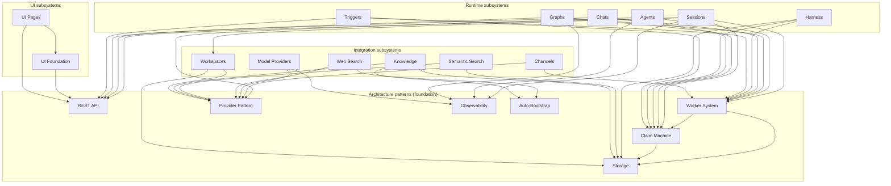

# Primer Developer Docs

## Overview

This doc set is the consolidated, current-state developer reference for the Primer
codebase. It is sourced from the design specs under `docs/superpowers/specs/`, but
it reflects what the code does now rather than what any one spec proposed: where
the implementation diverged from a spec, this set describes the implementation and
records the divergence in a per-doc "Historical decisions" callout. It is not a
changelog, not the spec archive, and not user-facing documentation. The changelog
lives in git history, the spec archive stays under `docs/superpowers/specs/`, and
the operator-facing and agent-facing docs live under `primer/ai_docs/` and the
`/docs` console surface. Read this set when you need to understand or extend a
subsystem; read the specs only when you need the original rationale behind a
decision this set summarises.

## Subsystem dependency graph

Each subsystem consumes one or more of the cross-cutting architecture patterns.
The architecture docs are the foundation; the arrows point from a subsystem to the
patterns it builds on.

## Table of contents

### Architecture

- [storage](architecture/storage.md) - the backend-agnostic interface (Postgres or
  SQLite) behind every persisted entity, with the predicate language, the `Q`
  builder, and the lazy per-model table rule.
- [rest-api](architecture/rest-api.md) - the single FastAPI HTTP surface: the
  `create_app` factory, middleware order, the RFC 7807 error envelope,
  `make_crud_router`, cookie-plus-bearer auth, and the lifespan wiring seam.
- [claim-machine](architecture/claim-machine.md) - the one polymorphic lease engine
  that decides which worker runs the next unit of work for a session, chat, harness,
  or trigger, and for how long.
- [worker-system](architecture/worker-system.md) - how Primer runs agent and graph
  work off the request path: the three coordination ABCs and the worker pool that
  drives them in both single-process and distributed mode.
- [provider-pattern](architecture/provider-pattern.md) - the uniform ABC-plus-adapter
  shape every external model family and tool source is reached through, with its
  config, registry, and lifecycle contract.
- [observability](architecture/observability.md) - the cross-cutting telemetry
  surface: OTEL traces, Prometheus metrics, trace-correlated JSON logs, and per-turn
  turn logs, all zero-overhead when off.
- [auto-bootstrap](architecture/auto-bootstrap.md) - the first-run provisioning seam
  that makes a fresh install immediately usable by idempotently creating a fixed set
  of reserved-id rows.

### Subsystems

- [workspaces](subsystems/workspaces.md) - the materialised sandbox an agent lives
  in: filesystem, shell, git-backed state repo, the seven workspace tools, and a
  registry of session handles, across local, container, and Kubernetes backends.
- [sessions](subsystems/sessions.md) - one execution of one agent or graph on one
  workspace: the seam where the claim machine, the executor, the workspace, and the
  REST plus WebSocket surface meet to run one turn at a time.
- [agents](subsystems/agents.md) - the runtime that drives one LLM turn end to end:
  prompt assembly, model streaming, tool dispatch, compaction, the approval gate, and
  turn persistence.
- [graphs](subsystems/graphs.md) - the Pregel-style executor for declarative directed
  graphs of agent nodes, with templated inputs, conditional routing, map-reduce
  fan-out/fan-in, and a tool-approval checkpoint protocol.
- [chats](subsystems/chats.md) - the WebSocket-driven conversational surface: a
  long-lived `Chat` plus append-only message log whose turns are detached onto the
  worker pool and reuse the yielding-tool park machinery.
- [channels](subsystems/channels.md) - the outbound and inbound bridge that forwards a
  parked session's `ask_user` and approval prompts to Slack, Telegram, and Discord and
  routes the human reply back onto the event bus.
- [knowledge](subsystems/knowledge.md) - how documents and the platform's own entities
  become searchable: the load-split-embed-store ingestion pipeline and the
  internal-collections semantic index of agents, graphs, collections, and tools.
- [semantic-search](subsystems/semantic-search.md) - the vector-retrieval half of the
  platform: the search-provider entity and registry, the vector-store backends, and
  the rerank-plus-MMR retrieval pipeline.
- [web-search](subsystems/web-search.md) - live web retrieval for agents: the search
  provider entity and registry, the active-config singleton with its fallback chain,
  and the `web` MCP toolset agents call.
- [triggers](subsystems/triggers.md) - "do something later, or on a schedule" as a
  first-class primitive: a fire source plus delivery subscriptions, riding the claim
  engine for timing and the park machinery for `subscribe_to_trigger`.
- [harness](subsystems/harness.md) - "Helm for Primer": git-backed, Jinja2-templated
  bundles of Primer entities installed and uninstalled with one click, with inbound
  install/sync and outbound build/push directions.
- [model-providers](subsystems/model-providers.md) - the adapter layer that converts
  Primer's universal model interfaces into concrete vendor SDK wire shapes for LLMs,
  embedders, and cross-encoder rerankers.
- [ui-foundation](subsystems/ui-foundation.md) - the shared browser substrate every
  console page builds on: the HTTP client, the polled-read and optimistic-write hooks,
  hash routing, the chrome shell, and the shared primitives.
- [ui-pages](subsystems/ui-pages.md) - the per-page layer of the operator console: the
  repeating list-and-detail page shapes, the loader and confirmation conventions, and a
  page-by-page route index.

### Vision and motivation

- [vision/](vision/README.md) - the origin story and design philosophy: why Primer
  exists, the hypothesis that context quality can substitute for model scale, and a
  chapter-by-chapter walk from a 16 GB VRAM constraint to a microagents platform, with
  worked examples. Read this for the "why" behind the subsystems.

### Contributing and deferred work

- [CONTRIBUTING.md](CONTRIBUTING.md) - the required reading order and the five-track
  completeness checklist every feature-bearing change must satisfy; read this first if
  you are adding a feature.

## How to read this

Humans: start here, skim the dependency graph above, then jump straight to the
subsystem doc nearest your task. When you hit a cross-cutting pattern a subsystem
leans on (leasing, storage, the provider shape, telemetry), follow the link to the
architecture doc it cites and read that for the underlying mechanism.

AI agents: read [CONTRIBUTING.md](CONTRIBUTING.md) first for the completeness
checklist, then read the relevant subsystem doc before touching code.

Both: the architecture docs explain the cross-cutting patterns that recur across
the codebase; the subsystem docs explain individual features. A subsystem doc names
the architecture docs it depends on and cross-links them rather than restating them.

## Conventions

The whole doc set follows one fixed style:

- File paths are cited without line numbers, so a citation stays valid as code
  moves; find the symbol by name, not by position.
- Visual content is mermaid. Diagrams are embedded as fenced `mermaid` blocks rather
  than linked images.
- No em dash characters appear anywhere. Use hyphens, semicolons, or sentence breaks
  instead.
- Prose is present tense for current behaviour. Past tense is confined to the per-doc
  "Historical decisions" callouts that record why the code diverged from a spec.
- Every doc follows a fixed heading template. Architecture docs have 8 sections;
  subsystem docs have 11. The shared section-1 "Purpose" is the source of the
  one-line descriptions in the table of contents above.
