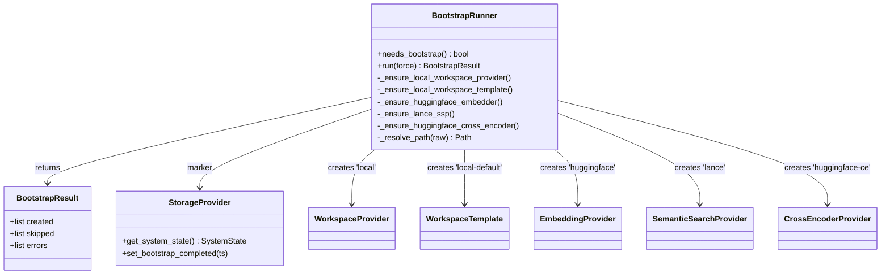
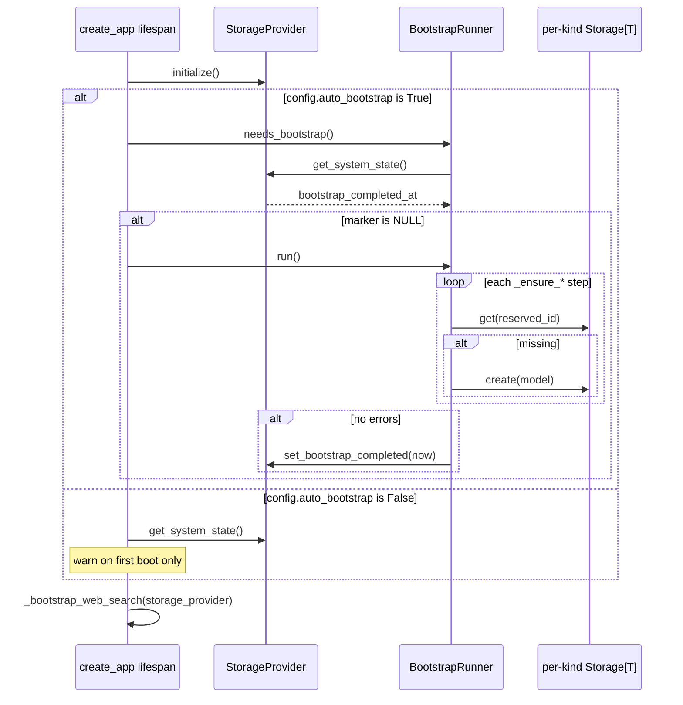

# Auto-Bootstrap

## 1. Purpose

Auto-bootstrap is the first-run provisioning seam that makes a fresh `primer api`
install immediately usable with zero operator setup. On a clean database the
provider tables are empty; without bootstrap the operator would have to hand-create
an embedder, a vector store, a cross-encoder, a workspace provider, and a workspace
template before anything worked. The `BootstrapRunner` (`primer/bootstrap/runner.py`)
closes that gap by idempotently creating a fixed set of reserved-id rows that are
on-disk, zero-cost, and zero-credential.

Two design constraints shape the whole subsystem:

- It runs synchronously in the API lifespan before the server accepts connections,
  so no request ever sees a half-provisioned system.
- It is idempotent and self-healing: each step is an independent get-then-create,
  and the completion marker (`system_state.bootstrap_completed_at`) is only stamped
  when every step succeeds, so a partial failure retries cleanly on the next boot or
  via `primer init --force`.

LLM providers are deliberately excluded because they require real API keys and a
cost decision; the same reasoning excludes a default workspace and Internal
Collections activation. The auto-bootstrap surface is intentionally limited to the
warm-disk path.

The reserved-web-search rows (`DuckDuckGo` provider plus the
`_active_web_search_config` singleton) are bootstrapped by a sibling path,
`_bootstrap_web_search` in `primer/api/app.py`, also covered here because it follows
the same first-run idempotent-upsert contract.

## 2. Visual overview

`BootstrapRunner` is constructed with per-kind `Storage[T]` handles and an
`_ensure_*` method per reserved kind. Each method writes one row type; the runner
itself owns the marker.

## 3. Public surface

`BootstrapRunner` (`primer/bootstrap/runner.py`) exposes a two-method contract:

- `needs_bootstrap() -> bool` returns `True` iff
  `system_state.bootstrap_completed_at IS NULL`. It is a primary-key fetch of the
  `singleton` row through `StorageProvider.get_system_state`.
- `run(*, force=False) -> BootstrapResult` performs the idempotent provisioning.
  When `force` is `False` and the marker is already set, it short-circuits and fills
  `result.skipped` with all five reserved ids without touching storage. Otherwise it
  runs each `_ensure_*` step in order and, only when `result.errors` is empty, calls
  `StorageProvider.set_bootstrap_completed(datetime.now(UTC))`.

`BootstrapResult` (`primer/bootstrap/runner.py`) is a dataclass with three lists:
`created` (reserved ids that were absent and created), `skipped` (ids already
present), and `errors` (`(reserved_id, repr(exception))` tuples). A non-empty
`errors` list means the marker is not stamped.

The constructor takes the top-level `StorageProvider` (for the marker only) plus
five per-kind `Storage[T]` handles (`embedder_storage`, `ssp_storage`,
`cross_encoder_storage`, `workspace_provider_storage`, `workspace_template_storage`)
and a `root_dir: Path` used to resolve tilde paths in the factory specs.

The state contract lives on the `StorageProvider` ABC
(`primer/int/storage_provider.py`): `get_system_state()` (never raises, always
returns the singleton row), `set_bootstrap_completed(ts)`, and `set_session_secret(secret)`.
The `SystemState` model (`primer/model/system_state.py`) carries `id` (default
`'singleton'`), `bootstrap_completed_at`, `schema_version` (default 1),
`last_migration_at`, and `session_secret`.

The reserved-id sets surfaced for router guards live in
`primer/api/registries/provider_registry.py`:
`RESERVED_EMBEDDER_IDS={'huggingface'}`, `RESERVED_SSP_IDS={'lance'}`,
`RESERVED_CROSS_ENCODER_IDS={'huggingface-ce'}`,
`RESERVED_WORKSPACE_PROVIDER_IDS={'local'}`, and
`RESERVED_LLM_IDS=frozenset()` (empty, defined for router symmetry).
`primer/bootstrap/defaults.py` exposes `ALL_RESERVED_IDS` and the per-kind factory
specs.

## 4. How to add a new implementation

To add a new reserved kind to auto-bootstrap:

1. Add a reserved-id constant and a factory-spec dict to
   `primer/bootstrap/defaults.py`. The spec dict keys must mirror the Pydantic
   model fields exactly so `Model(**spec)` works directly. Leave any `~/.primer/...`
   path templates unresolved; `BootstrapRunner._resolve_path` expands them against
   `root_dir`. Add the new id to `ALL_RESERVED_IDS`.
2. Add a matching `_ensure_*` method to `BootstrapRunner`
   (`primer/bootstrap/runner.py`) following the get-then-create pattern: call
   `storage.get(reserved_id)`; on a hit append to `result.skipped`; on a miss
   deep-copy the spec, resolve any paths, instantiate the model, call
   `storage.create()`, and append to `result.created`. Wrap the body so any
   exception is captured as `(reserved_id, repr(exc))` in `result.errors` and the
   other steps still run.
3. Call the new `_ensure_*` step from `run()` and add the id to `_skip_all_present`
   so the marker-already-set path reports a consistent `skipped` list.
4. Add a per-kind `Storage[T]` constructor argument and thread it from both call
   sites: the lifespan in `primer/api/app.py` and `primer init` in
   `primer/cli.py`.
5. Add the reserved-id frozenset to `primer/api/registries/provider_registry.py`
   (or the relevant router for non-provider kinds) and wire the router guards
   (see section 6) so the bootstrapped row cannot be overwritten or deleted via the
   API.

For a web-search-shaped bootstrap (a singleton config plus a referenced row),
follow `_bootstrap_web_search` in `primer/api/app.py` instead: write the referenced
row first, then the singleton that points at it, each guarded by a `get(...) is None`
check.

## 5. Existing implementations

Auto-bootstrap creates five reserved rows (the `BootstrapRunner` path), defined in
`primer/bootstrap/defaults.py`:

- `local` (`WorkspaceProvider`): local-filesystem backend, `root_path`
  `~/.primer/workspaces`.
- `local-default` (`WorkspaceTemplate`): references the `local` provider with a
  `{"kind": "local"}` backend, so a fresh install can materialise a workspace via
  `POST /v1/workspaces {"template_id": "local-default"}`.
- `huggingface` (`EmbeddingProvider`): `BAAI/bge-small-en-v1.5`,
  `max_concurrency=2`, `token=""` (empty string, not `None`, because
  `HuggingFaceConfig.token` is a mandatory `SecretStr`; the adapter converts the
  empty string to `None` since the model is public).
- `lance` (`SemanticSearchProvider`): LanceDB at `~/.primer/vector` with
  `hnsw_m=16`, `hnsw_ef_construction=64`, `hnsw_ef_search=40`,
  `index_min_rows=1000`.
- `huggingface-ce` (`CrossEncoderProvider`): `cross-encoder/ms-marco-MiniLM-L-6-v2`,
  `max_concurrency=2`, `token=None` (the cross-encoder config's `token` is optional,
  so `None` is supplied directly; this token-shape asymmetry with the embedder is
  load-bearing).

The web-search bootstrap (`_bootstrap_web_search` in `primer/api/app.py`) creates
two more rows: the reserved `DuckDuckGo` `WebSearchProvider` and the
`_active_web_search_config` `ActiveWebSearchConfig` singleton, which points at
`DuckDuckGo` via a `SingleProviderConfig`. The DuckDuckGo row is written first
because the singleton's reference validation runs at write time. Note the reserved
id is the readable mixed-case `DuckDuckGo`, matching the `lance` convention of
operator-visible reserved ids.

LLM providers have no reserved bootstrap row; `RESERVED_LLM_IDS` is intentionally
empty.

## 6. Wiring

Two call sites drive `BootstrapRunner` with the same five storage handles, and the
router layer enforces the reserved-id protections after the rows land.

The lifespan in `primer/api/app.py` (`_make_lifespan`) runs auto-bootstrap right
after `storage_provider.initialize()` and before the registries are constructed.
When `config.auto_bootstrap` is `True` and `needs_bootstrap()` returns `True`, it
logs `first boot detected; running auto-bootstrap`, awaits `run()`, and logs
`created` / `skipped` / `error_count` through the structured `extra` dict, with a
`partial failure` warning when `errors` is non-empty. When `config.auto_bootstrap`
is `False`, it fetches the system-state row and warns only if
`bootstrap_completed_at` is still null. `config.auto_bootstrap` defaults to `True`
(`primer/api/config.py`). The web-search bootstrap (`_bootstrap_web_search`) runs
later in the same lifespan, before the `web` toolset is built.

`primer init` (`primer/cli.py`, `run_init`) is the offline escape hatch. It reuses
`_load_config` + `_build_storage_provider`, constructs `BootstrapRunner` with the
same five storage handles and `root_dir=Path("~/.primer").expanduser()`, calls
`runner.run(force=force)`, prints the `Created` / `Skipped` / `Error` lines, exits
with code 1 if any errors were recorded, and closes the storage provider in a
`finally` block. The `--force` flag ignores the completion marker so a
partially-failed run can be retried; rows that already exist are still skipped.

Reserved-id protection is enforced at the router layer only; the registries do not
consult the factory specs at lookup time (after bootstrap a reserved row is an
ordinary storage row). The protection is split across three router modules:

- `primer/api/routers/providers.py` defines `_make_reserved_create_guard` (returns
  409 `{"error": "reserved_id", ...}`) and `_make_reserved_delete_guard` (returns
  403 `{"error": "reserved_id_protected", ...}`) and wires them as `on_pre_create`
  / `on_pre_delete_id` on the embedder, cross-encoder, and (empty-set) LLM CRUD
  routers. These routers wire create and delete guards only; there is no update
  guard.
- `primer/api/routers/semantic_search.py` carries its own bespoke 409/403 SSP
  guards against `RESERVED_SSP_IDS`.
- `primer/api/routers/workspaces.py` carries bespoke guards for workspace providers
  and workspace templates, and additionally rejects PUT/update on reserved ids with
  403 `reserved_id_protected`. It derives `RESERVED_WORKSPACE_TEMPLATE_IDS` from
  `RESERVED_WORKSPACE_TEMPLATES.keys()`.

The web-search router (`primer/api/routers/web_search.py`) applies the same shape to
the `DuckDuckGo` row: POST rejects reserved ids with 409, DELETE rejects with 403
and additionally runs a cascade-block against the active-config singleton.

## 7. Testing patterns

Tests live under `tests/bootstrap/`: `test_runner.py` (unit tests against a real
`SqliteStorageProvider` covering idempotency, force, and partial failure),
`test_reserved_ids.py`, `test_reserved_id_protections.py` (router-layer 409/403
tests), and `test_lifespan_integration.py`. The distributed harness
`tests/distributed/scenarios/test_auto_bootstrap.py` exercises first-boot bootstrap
end to end, and the web-search bootstrap is covered by
`tests/api/test_web_search_bootstrap.py`.

The key isolation pattern is the `root_dir` indirection: `_resolve_path` treats
`~/.primer/...` as a template against the runner's `root_dir` constructor argument,
not the actual `$HOME`. The lifespan and CLI both pass
`Path("~/.primer").expanduser()`, but tests pass a `tmp_path`-based root, so a
bootstrap run during tests never touches the operator's home directory.

Idempotency tests rely on the get-then-create contract: a second `run()` against a
populated store yields all ids in `skipped` and an empty `created`. Force tests
assert that `run(force=True)` re-attempts the ensure steps even when the marker is
set, while still skipping rows that already exist. Partial-failure tests assert that
when one `_ensure_*` step raises, the marker stays null and the error appears in
`result.errors`.

## 8. Historical decisions

- **Reserved ids are protected at the API layer only, not via lookup-time factory dispatch on the registries.** Why: treating bootstrapped rows as ordinary storage rows keeps storage the single source of truth and avoids two places to keep in sync. Spec: docs/superpowers/specs/2026-05-27-auto-bootstrap-design.md.
- **`BootstrapRunner` is wired with per-kind `Storage[T]` handles rather than the per-kind registries the spec drafted.** Why: bootstrap only needs to upsert rows, not run them, and Storage handles avoid a circular construction order with registries that themselves depend on bootstrapped rows. Spec: docs/superpowers/specs/2026-05-27-auto-bootstrap-design.md.
- **Marker stamping is all-or-nothing: `bootstrap_completed_at` is set only if every `_ensure_*` step succeeded.** Why: a partial failure leaves the marker null so a subsequent boot or `primer init --force` retries the failed steps without re-attempting the ones that already succeeded. Spec: docs/superpowers/specs/2026-05-27-auto-bootstrap-design.md.
- **LLM providers are not auto-created, and a default workspace and Internal Collections activation are also excluded.** Why: LLMs need real API keys and a cost decision, IC ingest carries embedding/storage cost, and a default workspace would prejudge the operator's first project. Spec: docs/superpowers/specs/2026-05-27-auto-bootstrap-design.md.
- **A fifth reserved row, the `local-default` `WorkspaceTemplate`, was added beyond the spec's four providers.** Why: it lets the operator create a usable workspace via `POST /v1/workspaces {"template_id": "local-default"}` immediately after first boot. Spec: docs/superpowers/specs/2026-05-27-auto-bootstrap-design.md.
- **`system_state` is a single-row table keyed on `id='singleton'` rather than a key-value config table.** Why: a single fixed row makes the marker check a primary-key fetch with no chance of duplicates or missing keys, and later singletons like `session_secret` consolidate onto the same row. Spec: docs/superpowers/specs/2026-05-27-auto-bootstrap-design.md.
- **Bootstrap runs synchronously in the lifespan before the server accepts connections.** Why: the warm-disk cost target is under 2 seconds (models download lazily on first use, not here), so blocking startup is preferable to serving requests against a partially-provisioned system. Spec: docs/superpowers/specs/2026-05-27-auto-bootstrap-design.md.
- **Update protection on reserved rows became immutability (PUT returns 403) rather than the spec's per-kind mutable-field allowlist.** Why: the implementation chose immutability over a field-level allowlist for workspace, workspace-template, and SSP rows; the LLM, embedder, and cross-encoder routers wire create and delete guards only. Spec: docs/superpowers/specs/2026-05-27-auto-bootstrap-design.md.
- **The `huggingface` embedder spec carries an empty-string `token` while the `huggingface-ce` cross-encoder carries `token=None`.** Why: `HuggingFaceConfig.token` is a mandatory `SecretStr` that the adapter converts from empty string to `None`, whereas the cross-encoder config's `token` is already optional. Spec: docs/superpowers/specs/2026-05-27-auto-bootstrap-design.md.
- **The reserved DuckDuckGo provider row and the `_active_web_search_config` singleton are both auto-bootstrapped at lifespan, DuckDuckGo first.** Why: writing the referenced row before the singleton keeps web search zero-config and keeps the bootstrap idempotent across restarts, since the singleton's reference validation runs at write time. Spec: docs/superpowers/specs/2026-06-03-web-search-providers-design.md.
- **The web-search reserved id is the readable mixed-case `DuckDuckGo` rather than a lower-case slug.** Why: it matches the SSP reserved-id convention (compare `lance`) because operators see this id in the UI. Spec: docs/superpowers/specs/2026-06-03-web-search-providers-design.md.
