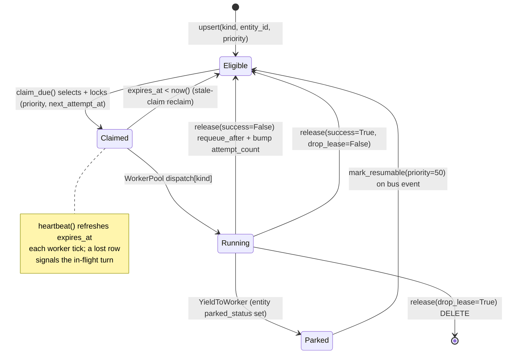
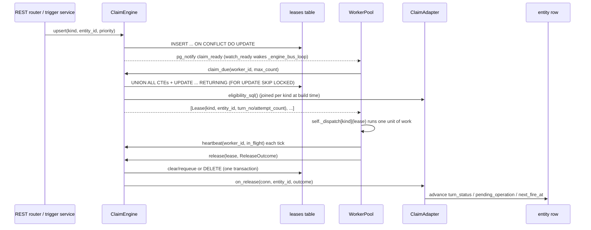

# Claim Machine

## 1. Purpose

The claim machine is the single piece of coordination that decides which background worker is allowed to run the next unit of work for a given entity, and for how long. Four entity kinds need exactly the same lease lifecycle: a `WorkspaceSession` waiting for its next turn, a `Chat` with a queued user message, a `Harness` with a pending install/sync/build operation, and a time-based `Trigger` whose moment has arrived. Rather than carry three (now four) parallel claim/heartbeat/release state machines, Primer collapses them into one polymorphic `ClaimEngine` (`primer/int/claim.py`) backed by a shared `leases` table, with per-kind eligibility and entity-side side effects supplied by `ClaimAdapter` implementations under `primer/claim/adapters/`.

The engine owns only the lease: who claims it, when it expires, when it next becomes eligible, how many times it has failed, and the last error. Everything entity-specific stays on the entity row and is joined in at claim time through an adapter-supplied SQL fragment (`eligibility_sql`), and is written back through an adapter hook (`on_release`). A lease is eligible, gets claimed by a worker, runs, and is then released back to eligible (with a `next_attempt_at` delay), parked, or deleted. The `WorkerPool` (`primer/worker/pool.py`) is the consumer that drives this loop; this document covers the engine and the adapter contract. The pool's loop-and-dispatch surface lives in `docs/dev/architecture/worker-system.md`, the `leases` table DDL is shared with `docs/dev/architecture/storage.md`, and per-entity behaviour lives in the sessions, chats, harness, and triggers subsystem docs.

## 2. Visual overview

A lease moves through a small state machine. A producer arms it (`upsert`); the engine's claim query makes it claimable when it is eligible and due; a worker claims it, runs one unit of work, and releases it. Release either requeues it (back to eligible after a delay), drops it, or the entity parks (yielding tools) and the lease is re-armed later by `mark_resumable`. A stale claim (worker crash) becomes claimable again once `expires_at` passes, with no explicit transition.

The four `ClaimKind` values (`SESSION`, `CHAT`, `HARNESS`, `TRIGGER`) all ride this single machine; the only per-kind difference is the `eligibility_sql` fragment that decides when a row counts as Eligible and the `on_release` hook that advances entity state on the Running to Eligible / terminal edges.

## 3. Public surface

`ClaimKind` (`primer/int/claim.py`) is a `StrEnum` with `SESSION`, `CHAT`, `HARNESS`, `TRIGGER`. Two frozen dataclasses carry the lease wire shape:

- `Lease(kind, entity_id, claimed_by, claimed_at, expires_at, attempt_count, last_error)` is what `claim_due` returns to a worker.
- `ReleaseOutcome(success, requeue_after=None, last_error=None, drop_lease=False)` is what a worker hands back to `release`. `success` drives whether `attempt_count` is reset or bumped; `requeue_after` sets the next eligibility delay; `drop_lease=True` deletes the row entirely (terminal).

`ClaimEngine` (ABC) is the lease surface:

- `claim_due(worker_id, *, max_count)` returns up to `max_count` `Lease` records across all kinds, atomically marking them claimed.
- `heartbeat(worker_id, kind_ids)` bulk-refreshes the TTL for the `(ClaimKind, entity_id)` pairs the worker still holds and returns the confirmed subset; anything missing from the return is a lost lease.
- `release(lease, *, outcome)` applies a `ReleaseOutcome` and runs the adapter's `on_release` hook.
- `upsert(kind, entity_id, *, priority=100, next_attempt_at=None)` arms or re-arms a lease. This is the producer entry point.
- `mark_resumable(kind, entity_id, *, priority=50)` re-arms a parked lease at resume priority and wakes consumers.
- `watch_ready()` is an async iterator yielding `(ClaimKind, entity_id)` pairs that just became claimable (the wake hint).
- `delete_lease(kind, entity_id)` removes a lease (force-delete / terminal transitions).

`ClaimAdapter` (ABC) is the extension point. A subclass sets two class attributes, `kind: ClaimKind` and `entity_table: str`, and implements `eligibility_sql() -> str` (a predicate over the entity row aliased as `e`, substituted into the claim CTE) and `on_release(conn, entity_id, *, outcome)` (an async hook that advances the entity's own state). On Postgres `on_release` runs inside the same transaction as the lease mutation, so entity state and lease state stay consistent; the in-memory engine calls it with `conn=None`.

## 4. How to add a new implementation

Two extension axes exist: a new `ClaimAdapter` for a new entity kind (the common case; chats, harnesses, and triggers each landed this way) and a new `ClaimEngine` backend (rare; the Postgres and in-memory pair already cover the deployment matrix).

Adding a new claim kind:

1. **Add the `ClaimKind` member** in `primer/int/claim.py`.
2. **Write a `ClaimAdapter`** under `primer/claim/adapters/`. Set `kind` and `entity_table`. Implement `eligibility_sql()` returning a predicate over the entity row aliased `e` (for JSONB-backed entities this reads through `e.data->>'field'`, as in `ChatClaimAdapter` and `HarnessClaimAdapter`). Implement `on_release(conn, entity_id, *, outcome)` to advance entity state on release; read the entity through the adapter's `Storage[T]` handle, branch on `outcome.success`, and `model_copy(update=...)` the row back.
3. **Wire it into `ClaimEngineFactory.create`** (`primer/claim/factory.py`) so the adapter is constructed with its `Storage[T]` handle alongside the existing four. The factory builds all adapters, so producers never touch adapter constructors.
4. **Add a per-kind handler on `WorkerPool`** and register it in the `self._dispatch` table (`ClaimKind.X -> self._run_engine_x`). The handler runs one unit of work and calls `engine.release(...)`. This lives in `docs/dev/architecture/worker-system.md`.
5. **Arm the claim from the producer.** A REST handler or trigger dispatcher calls `engine.upsert(ClaimKind.X, entity_id, priority=...)` so the engine's `claim_ready` NOTIFY (Postgres) or notify queue (in-memory) wakes the pool.
6. **Add tests** under `tests/claim/` (a `test_<kind>_adapter.py` pinning the eligibility fragment, plus engine coverage). Per project memory, smoke-test with `uv run primer api` in the background and read any keys from env vars.

Adding a new `ClaimEngine` backend:

1. **Subclass `ClaimEngine`** under `primer/claim/`, implementing every abstract method. The Postgres impl reuses the `StorageProvider` asyncpg pool rather than opening its own.
2. **Add a factory branch** in `ClaimEngineFactory.create`, which currently selects on the event-bus type (`InMemoryEventBus` to in-memory, anything else to Postgres), mirroring `CoordinatorFactory`.
3. **Keep the adapter contract intact**: `on_release` must run atomically with the lease mutation if the backend supports transactions.

## 5. Existing implementations

Two engines ship.

`InMemoryClaimEngine` (`primer/claim/in_memory.py`) holds `_LeaseRow` records in a dict keyed by `(kind, entity_id)`. `claim_due` filters for rows whose `claimed_by` is None or whose `expires_at` has passed (the stale-claim reclaim) and whose `next_attempt_at <= now()`, sorts by `(priority_score, next_attempt_at)`, and stamps a `LEASE_TTL` of 60 seconds. `heartbeat` refreshes the TTL only for rows the caller owns. `release` runs the adapter's `on_release` with `conn=None`, then resets or bumps `attempt_count`. `watch_ready` drains an `asyncio.Queue` fed by `upsert` / `mark_resumable`, and `_wake` is an `asyncio.Event` for the poll loop. It is the single-process / test backend.

`PostgresClaimEngine` (`primer/claim/postgres.py`) is the distributed backend. It pre-builds the claim query once at construction via `build_claim_query`. `upsert` and `mark_resumable` use `INSERT ... ON CONFLICT (kind, entity_id) DO UPDATE` with the insert target aliased `AS le` (so the `DO UPDATE SET` clause can reference the existing row unambiguously under a schema-qualified table name) and then `pg_notify('claim_ready', '<kind>:<entity_id>')`. `claim_due` runs the single composed `UPDATE ... RETURNING`. `heartbeat` uses `UNNEST($1::text[], $2::text[])` to match all owned pairs in one round-trip and only touches rows where `claimed_by` matches the worker. `release` runs the lease mutation and the adapter's `on_release` inside one transaction. `watch_ready` acquires a dedicated pool connection for the generator's lifetime and listens on `claim_ready` (LISTEN is per-connection state in Postgres).

`build_claim_query` (`primer/claim/sql.py`) composes one CTE per registered adapter: each CTE joins `leases l` to the adapter's `entity_table` (aliased `e`), filters `l.kind = '<kind>'`, applies the stale-claim guard `(l.claimed_by IS NULL OR l.expires_at < now())`, requires `l.next_attempt_at <= now()`, substitutes the adapter's `eligibility_sql()`, orders by `(l.priority_score, l.next_attempt_at)`, and takes `LIMIT $1 FOR UPDATE OF l SKIP LOCKED`. The CTEs are joined with `UNION ALL`, re-ordered and limited overall, then fed into a single `UPDATE ... RETURNING` that stamps `claimed_by`, `claimed_at`, `last_heartbeat_at`, and `expires_at`. An empty adapter registry yields a valid no-op `UPDATE` that returns zero rows.

The four shipped adapters:

- `SessionClaimAdapter` (`primer/claim/adapters/sessions.py`): `eligibility_sql()` returns `e.parked_status IS NULL` (sessions are typed columns, not JSONB). `on_release` clears the `parked_*` columns and `last_worker_id`, and bumps `turn_no` plus stamps `last_turn_at` only when `outcome.success` is true, so a failed release (reclaim, executor build failure, crash) leaves the counters untouched and the next claim re-runs the same turn. When a `workspace_io` is wired and the release failed, it appends a terminal `SessionMessageKind.ERROR` record to `messages.jsonl` as the user-visible breadcrumb for a reclaim or worker crash.
- `ChatClaimAdapter` (`primer/claim/adapters/chats.py`): `eligibility_sql()` reads JSONB, `e.data->>'status' = 'active' AND e.data->>'parked_status' IS NULL AND e.data->>'turn_status' IN ('claimable','resumable')`. `on_release` flips `turn_status` to `idle` on `(success AND drop_lease)` and to `claimable` otherwise. It does not clear `cancel_requested_at` (a known gap; see section 8).
- `HarnessClaimAdapter` (`primer/claim/adapters/harnesses.py`): `eligibility_sql()` is `e.data->>'pending_operation' IS NOT NULL`. `on_release` nulls `pending_operation`, sets `status` to `HarnessStatus.READY` or `HarnessStatus.ERROR`, stamps `last_operation_at`, and writes `last_operation_error` from the outcome.
- `TriggerClaimAdapter` (`primer/claim/adapters/triggers.py`): `eligibility_sql()` filters `(e.data->>'enabled')::boolean = true`, `e.data->>'next_fire_at' IS NOT NULL`, `e.data->'config'->>'kind' IN ('delayed', 'scheduled')`, and `(e.data->>'next_fire_at')::timestamptz <= now()`. `on_release` recomputes `next_fire_at`: cron-advance for `scheduled` via `primer.trigger.cron.next_fire_at`, disable plus null for one-off `delayed`, and a defensive null for unknown kinds.

The shared `leases` table is created by `PostgresStorageProvider` (`primer/storage/postgres.py`) with columns `kind` / `entity_id` (composite PK), `claimed_by`, `claimed_at`, `last_heartbeat_at`, `expires_at`, `next_attempt_at` (default `now()`), `priority_score` (default 100), `attempt_count` (default 0), and `last_error`, plus a partial index `leases_claim_order ON (priority_score, next_attempt_at) WHERE claimed_by IS NULL`. `SqliteStorageProvider` (`primer/storage/sqlite.py`) mirrors the same column shape and partial index for dev / sqlite-storage installs; Postgres is the production target. The engine consumes the schema-qualified table through the `leases_table` property.

## 6. Wiring

More than two indirections separate a producer from the worker that runs a claimed lease, so the flow below shows construction plus the steady-state claim. Nothing constructs the engine on the request path: the lifespan in `primer/api/app.py` builds it once via `ClaimEngineFactory.create` and stashes it on `app.state.claim_engine`, which `get_claim_engine` (`primer/api/deps.py`) resolves as a FastAPI dependency.

Three wiring facts are load-bearing:

- **Producers arm; they never claim.** Session transitions call `engine.upsert(ClaimKind.SESSION, ...)` on claimable transitions and `engine.delete_lease(ClaimKind.SESSION, ...)` on terminal ones (`primer/api/routers/sessions.py`). Chat operator ticks call `engine.upsert(ClaimKind.CHAT, chat_id, priority=10)` and archival calls `delete_lease` (`primer/api/routers/chats.py`). Every harness operation request upserts at `priority=10` (`primer/api/routers/harness.py`). The trigger service upserts `ClaimKind.TRIGGER` to seed and reschedule (`primer/trigger/service.py`). Priority is a small fixed table: 10 operator-triggered, 50 resume-from-park (`mark_resumable` default), 100 fresh work (`upsert` default).
- **Bus type drives backend selection.** `ClaimEngineFactory.create` selects `InMemoryClaimEngine` when the event bus is `InMemoryEventBus`, otherwise `PostgresClaimEngine`, mirroring `CoordinatorFactory`. One runtime-mode/config choice configures the whole stack.
- **Startup recovery re-arms leases.** Before the pool starts, the lifespan scans existing non-ENDED sessions and stuck chats and back-fills lease rows via `claim_engine.upsert(ClaimKind.SESSION, ...)` / `upsert(ClaimKind.CHAT, ...)`, so a process restart does not strand entities with no owner.

The `WorkerPool` is the consumer: a single `_engine_claim_loop` computes `free = concurrency - len(_in_flight)`, calls `engine.claim_due(worker_id, max_count=min(claim_batch_size, free))`, reserves `_in_flight` slots, and dispatches via `self._dispatch[ClaimKind]`. A single `_engine_bus_loop` consumes `engine.watch_ready()` and wakes the claim loop. The `_heartbeat_loop` calls `engine.heartbeat(in_flight)` once per tick; any pair the engine reports as no longer owned is a lost lease and the corresponding in-flight turn is signalled to cancel.

## 7. Testing patterns

- **Adapter eligibility is pinned per kind.** `tests/claim/test_session_adapter.py`, `test_chat_adapter.py`, and `test_harness_adapter.py` assert each adapter's `eligibility_sql()` fragment (substring checks) and exercise `on_release` entity-state transitions; `tests/trigger/test_claim_adapter.py` covers the trigger adapter's cron advance / delayed-disable branches.
- **Both engines run the same contract.** `tests/claim/test_in_memory_engine.py` and `tests/claim/test_postgres_engine.py` cover the `claim_due` / `heartbeat` / `release` / `upsert` / `mark_resumable` / `delete_lease` surface against each backend, with `tests/claim/test_types.py` covering the dataclasses and `tests/claim/test_factory.py` covering bus-type selection.
- **Lock amplification is exercised directly.** `tests/claim/test_lock_amplification.py` drives Postgres burst contention to confirm the `UNION ALL` CTEs plus `FOR UPDATE OF l SKIP LOCKED` let competing workers skip locked candidates rather than block.
- **Engine plus pool integration.** `tests/claim/test_worker_pool_integration.py` and `tests/claim/test_entity_storage_hooks.py` cover the engine driving the pool and the `on_release` storage hooks end-to-end; the per-kind engine loops are also covered from the worker side (`tests/worker/test_chat_claim_loop.py`, `test_harness_claim_loop.py`, `test_pool_trigger.py`).
- **Smoke and secrets hygiene.** Per project memory, smoke-test changes with `uv run primer api` in the background, and read any API keys or bearer tokens from env vars in gated tests rather than inlining them.

## 8. Historical decisions

- **One shared `leases` table with a polymorphic `kind` column replaced per-entity lease tables.** Why: chats and harnesses needed the same `FOR UPDATE SKIP LOCKED` plus LISTEN/NOTIFY machinery as sessions, so a per-kind `ClaimAdapter` over one engine collapsed roughly three duplicated claim/heartbeat/release method-sets into one. Spec: docs/superpowers/specs/2026-05-27-claim-machine-design.md.
- **A fourth `ClaimKind.TRIGGER` and `TriggerClaimAdapter` landed after the original three-kind spec.** Why: time-based triggers needed at-most-once claim and `FOR UPDATE SKIP LOCKED` already provided it, so adding a `TRIGGER` adapter reused the whole lease lifecycle rather than introducing a separate `LeaderElector`. Spec: docs/superpowers/specs/2026-06-01-triggers-and-subscriptions-design.md.
- **One claim loop with an integer `priority_score` column replaced separate per-kind queues.** Why: priority is a small fixed table (10 operator-triggered, 50 resume-from-park, 100 default) and ordering by `(priority_score, next_attempt_at)` gave cross-kind fairness without per-loop arbitration. Spec: docs/superpowers/specs/2026-05-27-claim-machine-design.md.
- **`UNION ALL` across per-kind CTEs accepts a documented lock-amplification trade-off.** Why: each CTE locks up to N candidates and the union picks the top N overall, so locks on unchosen rows are held until commit; workers see `SKIP LOCKED` and move on, which was judged acceptable versus a single global ordering scan. Spec: docs/superpowers/specs/2026-05-27-claim-machine-design.md.
- **The claim CTE tolerates expired leases via `(claimed_by IS NULL OR expires_at < now())`.** Why: a worker crash that leaves a lease pinned must not block re-claim forever, so the stale-claim guard reclaims the row once the TTL passes, separate from the heartbeat liveness path the original spec emphasised. Spec: docs/superpowers/specs/2026-05-27-claim-machine-design.md.
- **There was no backward-compatibility phase; the cutover was straight.** Why: the platform was not yet deployed, so `session_leases` was dropped, claim fields were removed from the `Chat` and `Harness` rows, and `attempt_count` / `last_error` moved off `WorkspaceSession` onto the lease row in one go rather than running a parallel-table migration. Spec: docs/superpowers/specs/2026-05-27-claim-machine-design.md.
- **Backend selection mirrors `CoordinatorFactory` by inspecting the event-bus type.** Why: the bus is already paired to the scheduler flavour, so routing the choice through one signal kept a single runtime-mode decision configuring the whole stack consistently. Spec: docs/superpowers/specs/2026-05-27-coordinator-design.md.
- **Park and resume stayed entity-specific on the `Scheduler`, not on the engine.** Why: parking semantics differ per kind and chats and harnesses do not park their own row (the session running inside them parks), so `park_turn` / `mark_resumable` / `clear_park` remained session-oriented while the engine kept the generic lease lifecycle. Spec: docs/superpowers/specs/2026-05-22-yielding-tools-design.md.
- **Lease ownership for chats lives on the engine, never on the `Chat` row.** Why: the claim machine landed first and absorbed ownership across all kinds, so `ChatClaimAdapter` exposes eligibility over existing `Chat` fields and `on_release` writes `turn_status` back rather than duplicating `claimed_by` / `claimed_at` / `last_heartbeat_at` columns. Spec: docs/superpowers/specs/2026-05-27-chat-turn-detachment-design.md.
- **`SQLite` gained a parallel `leases` table beyond the spec's Postgres-plus-in-memory scope.** Why: sqlite-storage dev installs needed the same lease shape and partial index, accepted as light drift with Postgres remaining the production target. Spec: docs/superpowers/specs/2026-05-27-claim-machine-design.md.
- **`ChatClaimAdapter.on_release` does not clear `cancel_requested_at` even though the spec called for it.** Why: the field still lives on the `Chat` model but the adapter never touches it, leaving a latent footgun flagged for follow-up rather than documented as intentional. Spec: docs/superpowers/specs/2026-05-27-claim-machine-design.md.
