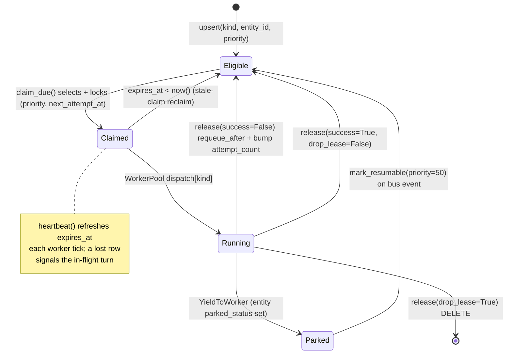
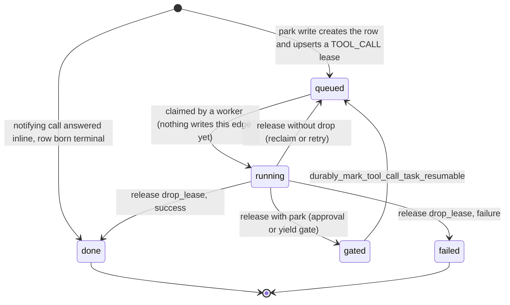
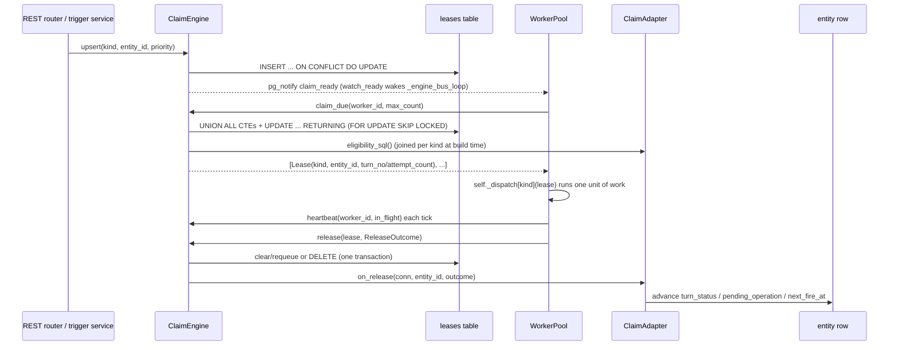

# Claim Machine

## 1. Purpose

The claim machine is the single piece of coordination that decides which background worker is allowed to run the next unit of work for a given entity, and for how long. Four entity kinds need exactly the same lease lifecycle: a `WorkspaceSession` waiting for its next turn, a `Harness` with a pending install/sync/build operation, a time-based `Trigger` whose moment has arrived, and a `ToolCallTask`, one tool call out of a batch the model emitted (Phase 3 stage 7a, behind a flag that defaults off). Rather than carry four parallel claim/heartbeat/release state machines, Primer collapses them into one polymorphic `ClaimEngine` (`primer/int/claim.py`) backed by a shared `leases` table, with per-kind eligibility and entity-side side effects supplied by `ClaimAdapter` implementations under `primer/claim/adapters/`.

The engine owns only the lease: who claims it, when it expires, when it next becomes eligible, how many times it has failed, and the last error. Everything entity-specific stays on the entity row and is joined in at claim time through an adapter-supplied SQL fragment (`eligibility_sql`), and is written back through an adapter hook (`on_release`). A lease is eligible, gets claimed by a worker, runs, and is then released back to eligible (with a `next_attempt_at` delay), parked, or deleted. The `WorkerPool` (`primer/worker/pool.py`) is the consumer that drives this loop; this document covers the engine and the adapter contract. The pool's loop-and-dispatch surface lives in `docs/dev/architecture/worker-system.md`, the `leases` table DDL is shared with `docs/dev/architecture/storage.md`, and per-entity behaviour lives in the sessions, harness, and triggers subsystem docs.

## 2. Visual overview

A lease moves through a small state machine. A producer arms it (`upsert`); the engine's claim query makes it claimable when it is eligible and due; a worker claims it, runs one unit of work, and releases it. Release either requeues it (back to eligible after a delay), drops it, or the entity parks (yielding tools) and the lease is re-armed later by `mark_resumable`. A stale claim (worker crash) becomes claimable again once `expires_at` passes, with no explicit transition.

```mermaid
stateDiagram-v2
    [*] --> Eligible: upsert(kind, entity_id, priority)
    Eligible --> Claimed: claim_due() selects + locks (priority, next_attempt_at)
    Claimed --> Running: WorkerPool dispatch[kind]
    Running --> Eligible: release(success=False) requeue_after + bump attempt_count
    Running --> Eligible: release(success=True, drop_lease=False)
    Running --> Parked: YieldToWorker (entity parked_status set)
    Running --> [*]: release(drop_lease=True) DELETE
    Parked --> Eligible: mark_resumable(priority=50) on bus event
    Claimed --> Eligible: expires_at < now() (stale-claim reclaim)
    note right of Claimed
        heartbeat() refreshes expires_at
        each worker tick; a lost row
        signals the in-flight turn
    end note
```

The four `ClaimKind` values (`SESSION`, `HARNESS`, `TRIGGER`, `TOOL_CALL`) all ride this single machine; the only per-kind difference is the `eligibility_sql` fragment that decides when a row counts as Eligible and the `on_release` hook that advances entity state on the Running to Eligible / terminal edges. `TOOL_CALL` differs in two further ways: its Parked edge is per task rather than per session (a gated tool call parks only its own row), and its `on_release` can return a `PostReleaseWake` (section 3). Its entity, `ToolCallTask`, has its own five-state lifecycle, drawn below with the one edge that no code drives today marked:

```mermaid
stateDiagram-v2
    [*] --> queued: park write creates the row and upserts a TOOL_CALL lease
    [*] --> done: notifying call answered inline, row born terminal
    queued --> running: claimed by a worker (nothing writes this edge yet)
    running --> gated: release with park (approval or yield gate)
    gated --> queued: durably_mark_tool_call_task_resumable
    running --> done: release drop_lease, success
    running --> failed: release drop_lease, failure
    running --> queued: release without drop (reclaim or retry)
    done --> [*]
    failed --> [*]
```

## 3. Public surface

`ClaimKind` (`primer/int/claim.py`) is a `StrEnum` with `SESSION`, `HARNESS`, `TRIGGER`, `TOOL_CALL`. Four frozen dataclasses carry the lease wire shape:

- `Lease(kind, entity_id, claimed_by, claimed_at, expires_at, attempt_count, last_error)` is what `claim_due` returns to a worker.
- `ReleaseOutcome(success, requeue_after=None, last_error=None, drop_lease=False, park=None, preserve_park=False, entity_noop=False, entity_update=None, claim_token=None)` is what a worker hands back to `release`. `entity_noop=True` makes it a LEASE-ONLY release: the engine drops or requeues the lease and does not call the kind's `on_release` at all, so the entity row is neither read nor written, and a requeue is lease-neutral (`attempt_count`, `last_error` and, without an explicit `requeue_after`, `next_attempt_at` are left as they were: a hand-back is not a run). It cannot be combined with `park` or `preserve_park` (used for a lease that never reached its handler, where any `on_release` would be wrong: the session adapter's non-park branch would clear a resumable session's park and bump `turn_no` for a turn that never ran). `success` drives whether `attempt_count` is reset or bumped; `requeue_after` sets the next eligibility delay; `drop_lease=True` deletes the row entirely (terminal); `park` carries a `ParkRequest` and `preserve_park=True` keeps an existing park untouched while the lease drops (the pause-while-parked path). `claim_token` is the per-claim token the releaser holds and `entity_update` is a mapping of entity fields the adapter writes in the same fenced release transaction (as one field-scoped `Storage.patch_if`); both are inert to every adapter except `ToolCallClaimAdapter`, and neither can be combined with `entity_noop`.
- `ParkRequest(parked_state, parked_event_key, parked_until, parked_at, parked_event_keys=None)` asks `on_release` to park the entity instead of completing it; the adapter writes the park columns, and the caller sets `drop_lease` on the same outcome so the lease is released.
- `PostReleaseWake(session_id, event_key, payload)` is an optional return value of `on_release` asking the engine to wake a session AFTER the release's own transaction has committed.

`ClaimEngine` (ABC) is the lease surface:

- `claim_due(worker_id, *, max_count, kinds=None)` returns up to `max_count` `Lease` records, atomically marking them claimed. `kinds=None` (the default) means all registered kinds; a list restricts the claim query to those adapters. Every claim loop of the worker pool passes one: the unified loop claims only the kinds it has a handler for, and the reserved loop carves a `TOOL_CALL` slice out of its concurrency.
- `heartbeat(worker_id, kind_ids)` bulk-refreshes the TTL for the `(ClaimKind, entity_id)` pairs the worker still holds and returns the confirmed subset; anything missing from the return is a lost lease.
- `release(lease, *, outcome)` applies a `ReleaseOutcome` and runs the adapter's `on_release` hook (except for an `entity_noop` outcome, which only moves the lease; see above). If the hook returns a `PostReleaseWake`, the engine invokes the callable registered with `bind_post_release_hook` once the release has committed.
- `upsert(kind, entity_id, *, priority=100, next_attempt_at=None)` arms or re-arms a lease. This is the producer entry point.
- `mark_resumable(kind, entity_id, *, priority=50)` re-arms a parked lease at resume priority and wakes consumers.
- `watch_ready()` is an async iterator yielding `(ClaimKind, entity_id)` pairs that just became claimable (the wake hint). The Postgres engine raises `ListenConnectionLost` (`primer/model/except_.py`, also a `ConnectionError`) out of it when its LISTEN connection is lost; the consumer re-subscribes (`WorkerPool._engine_bus_loop` does).
- `delete_lease(kind, entity_id)` removes a lease (force-delete / terminal transitions).
- `bind_post_release_hook(hook)` registers the plain async callable the engine invokes with a `PostReleaseWake`. `ClaimEngineFactory.create` binds the one that re-reads the session and calls `durably_mark_session_resumable`, so the engine itself never imports worker-layer code.
- `lease_exists(kind, entity_ids)` returns the subset of `entity_ids` that has a lease ROW of that kind (armed, claimed or expired) in one query; the caller arms the ids that are missing, so an engine that cannot answer returns all of them and nothing is armed.
- `prune_dead_leases(kind)` deletes the unheld lease rows of a kind whose entity is missing or finished and returns the count. "Finished" is the adapter's `dead_lease_sql()` (Postgres, one statement: a CTE that joins the leases to the entity table once, then a `DELETE` that re-checks the held-lease predicate) or `is_dead(entity_id)` (the in-memory engine, a walk over its rows); a kind whose adapter defines neither is never pruned, and a lease a worker holds (claimed and unexpired) is never deleted. The Postgres claim query joins the entity table, so such a lease is never claimed again and nothing else would remove it. The statement reads the entity table under its own snapshot: an entity reset from finished to queued inside that window loses its lease row. Nothing restores it today (a planned reconciler rule that re-arms a QUEUED task with no lease row would), but no production writer resets a finished task to queued: the adapter's retry branch only requeues a live one, and `durably_mark_tool_call_task_resumable`, which can flip a FAILED row from a stale GATED snapshot, has no production caller yet. An adapter that cannot read its entity (no storage) answers `is_dead` False, so the in-memory engine keeps its lease; the SQL rule is independent of that.
- `has_live_lease(kind, entity_id)` reports whether a worker holds an unexpired lease. The default answers `True` on purpose: its caller, `StuckSessionSweeper`, ends sessions, so an engine that cannot answer must make the sweeper do nothing.

`ClaimAdapter` (ABC) is the extension point. A subclass sets two class attributes, `kind: ClaimKind` and `entity_table: str`, and implements `eligibility_sql() -> str` (a predicate over the entity row aliased as `e`, substituted into the claim CTE) and `on_release(conn, entity_id, *, outcome)` (an async hook that advances the entity's own state and returns `None` or a `PostReleaseWake`). An adapter may also define `dead_lease_sql()` and `is_dead(entity_id)`, the two statements of one rule that tell `prune_dead_leases` which leases are garbage (default: none), and override `entity_indexes(qualified_table)` to declare `CREATE INDEX IF NOT EXISTS` statements backing its eligibility predicate; the Postgres engine creates them alongside the entity table. On Postgres `on_release` runs inside the same transaction as the lease mutation, so entity state and lease state stay consistent; the in-memory engine calls it with `conn=None`.

**The stuck-session sweeper ends a row with one field-scoped write.** `StuckSessionSweeper._tick` (`primer/bus/scheduler_tasks.py`) reads a never-started row, awaits `has_lease`, and only then writes. It used to write the whole row from its snapshot, so a park, a finished first turn or another ender that landed during the lease lookup was erased and ended over. It now does one `patch_if` of the four fields it owns (`status`, `ended_reason` `failed`, `ended_detail` `never_started`, `ended_at`), fenced on `status`, `turn_no` and `parked_status` as it read them, and on `last_turn_error` still being empty when it read it empty (a failure exit that stamps the row between the read and the write is left to finish). A refused write is logged and not counted, the row is left alone, and the first terminal reason wins. The site is no longer in the pinned whole-document writer set (`tests/session/session_writers.txt`). It still does not touch the on-disk slot: readers derive a session's end from the row (`primer/session/slot_view.py`). **Two check-then-write windows stay open, and a field-scoped fence cannot close them.** (1) The fence compares VALUES, not a version, and its values come from the re-read that precedes `_has_lease`, so the window runs from that re-read, across the lease lookup, to the write: a get, a lookup and a write, not the lookup and the write alone. If `status`, `turn_no` and `parked_status` leave those values and come back inside it (a park followed by its own resume, say), the write sees nothing changed and lands over a session that moved. That needs a worker to have run the session inside the window, so (1) can only follow a (2)-style arming. (1) is REASONED from the code, not observed. (2) The lease is not part of the fence. The sweeper acts on a row `has_lease` said has no lease, and a lease is armed on exactly such a `turn_no == 0` row by a new message enqueued into the session (`primer/session/enqueue.py`) or by a re-dispatch (`resume_session` in `primer/api/routers/sessions.py`, and the boot recovery pass in `primer/api/_app_lifespan_phases.py`), each through `claim_engine.upsert`; one that lands after the lookup is not seen, so the sweeper can end a session a worker was about to claim, and the lease row it armed is then on an ended session. The price of either is a session ended `failed` / `never_started` that was about to run or had just resumed; a real fix would put the lease check and the write in one transaction or give the row a version. No test drives either window.

**The stuck-session sweeper does not take a first turn that FAILED for one that never started (C-024).** `_never_started` is: not ENDED, `turn_no == 0`, no park, older than the grace; the lease check then finds no lease row. A failed turn does not bump `turn_no` and its release drops the lease, so a first turn that failed and left the session resting satisfies every clause. `WorkspaceSession.last_turn_error` (stamped by the failure exit, cleared at the next turn start) is the row-level mark that tells them apart: a row that carries it and is not RUNNING (a resting row is WAITING; the user can pause it, which keeps the stamp) is not selected, so the sweeper cannot replace the real failure code with `never_started` or end a session the operator can still continue. A stamped row that is still RUNNING is a failure exit that stamped and never finished (the status transition raised): nothing else would end it, so it is reaped, as `failed` / `failure_exit_unfinished` (not `never_started`: it did start), with a log line naming the stamped code. Pinned by `tests/bus/test_stuck_session_sweeper.py`.

## 4. How to add a new implementation

Two extension axes exist: a new `ClaimAdapter` for a new entity kind (the common case; harnesses and triggers each landed this way) and a new `ClaimEngine` backend (rare; the Postgres and in-memory pair already cover the deployment matrix).

Adding a new claim kind:

1. **Add the `ClaimKind` member** in `primer/int/claim.py`.
2. **Write a `ClaimAdapter`** under `primer/claim/adapters/`. Set `kind` and `entity_table`. Implement `eligibility_sql()` returning a predicate over the entity row aliased `e` (for JSONB-backed entities this reads through `e.data->>'field'`, as in `ChatClaimAdapter` and `HarnessClaimAdapter`). Implement `on_release(conn, entity_id, *, outcome)` to advance entity state on release; read the entity through the adapter's `Storage[T]` handle, branch on `outcome.success`, and write back only the fields the branch owns with one `Storage.patch_if` on `conn` (as the session and tool-call adapters do), not a whole-document `update` of the row read, which would put back whatever a concurrent writer committed in between.
3. **Wire it into `ClaimEngineFactory.create`** (`primer/claim/factory.py`) so the adapter is constructed with its `Storage[T]` handle alongside the existing four. The factory builds all adapters, so producers never touch adapter constructors.
4. **Add a per-kind handler on `WorkerPool`** and register it in the `self._dispatch` table (`ClaimKind.X -> self._run_engine_x`). The handler runs one unit of work and releases its lease through `WorkerPool._release_lease(lease, outcome)`, never `engine.release(...)` directly (the helper marks the execution's scope first so a lost-lease verdict from an in-flight heartbeat is not delivered to it). This lives in `docs/dev/architecture/worker-system.md`. `ClaimKind.TOOL_CALL` is the one kind that completed steps 1, 2, 3 and 5 but not this one: `self._dispatch` has no `TOOL_CALL` entry, so nothing claims a tool-call lease until a handler is registered (see "Tool-call claims: built and not built" in section 5).
5. **Arm the claim from the producer.** A REST handler or trigger dispatcher calls `engine.upsert(ClaimKind.X, entity_id, priority=...)` so the engine's `claim_ready` NOTIFY (Postgres) or notify queue (in-memory) wakes the pool.
6. **Add tests** under `tests/claim/` (a `test_<kind>_adapter.py` pinning the eligibility fragment, plus engine coverage). Per project memory, smoke-test with `uv run primer api` in the background and read any keys from env vars.

Adding a new `ClaimEngine` backend:

1. **Subclass `ClaimEngine`** under `primer/claim/`, implementing every abstract method. The Postgres impl reuses the `StorageProvider` asyncpg pool rather than opening its own.
2. **Add a factory branch** in `ClaimEngineFactory.create`, which currently selects on the event-bus type (`InMemoryEventBus` to in-memory, anything else to Postgres), mirroring `CoordinatorFactory`.
3. **Keep the adapter contract intact**: `on_release` must run atomically with the lease mutation if the backend supports transactions.

## 5. Existing implementations

Two engines ship.

`InMemoryClaimEngine` (`primer/claim/in_memory.py`) holds `_LeaseRow` records in a dict keyed by `(kind, entity_id)`. `claim_due` filters for rows whose `claimed_by` is None or whose `expires_at` has passed (the stale-claim reclaim) and whose `next_attempt_at <= now()`, sorts by `(priority_score, next_attempt_at)`, and stamps a `LEASE_TTL` of 60 seconds. `heartbeat` refreshes the TTL only for rows the caller owns. `release` runs the adapter's `on_release` with `conn=None`, then resets or bumps `attempt_count`. `watch_ready` drains an `asyncio.Queue` fed by `upsert` / `mark_resumable`, and `_wake` is an `asyncio.Event` for the poll loop. It is the single-process / test backend.

`PostgresClaimEngine` (`primer/claim/postgres.py`) is the distributed backend. It pre-builds the claim query once at construction via `build_claim_query`. `upsert` and `mark_resumable` use `INSERT ... ON CONFLICT (kind, entity_id) DO UPDATE` with the insert target aliased `AS le` (so the `DO UPDATE SET` clause can reference the existing row unambiguously under a schema-qualified table name) and then `pg_notify('claim_ready', '<kind>:<entity_id>')`. `claim_due` runs the single composed `UPDATE ... RETURNING`. `heartbeat` uses `UNNEST($1::text[], $2::text[])` to match all owned pairs in one round-trip and only touches rows where `claimed_by` matches the worker. Being one statement, it waits on the row lock of any of those pairs that an open `release` transaction holds, so a slow release stalls the heartbeat of EVERY lease the worker holds, not just its own; the pool bounds its releases below one lease TTL for that reason (see "The heartbeat decides "lost" from the keys it sent" in `worker-system.md`). `release` runs the lease mutation and the adapter's `on_release` inside one transaction. `watch_ready` acquires a dedicated pool connection for the generator's lifetime and listens on `claim_ready` (LISTEN is per-connection state in Postgres). asyncpg never raises into the NOTIFY queue when the server connection dies (a Postgres restart or failover, a network blip), so the watcher attaches a termination listener and turns a lost connection into a `ListenConnectionLost` once every wake received before the loss has been yielded. Wakes sent while it is down are lost, which only costs up to `poll_interval_seconds` of claim latency because the claim loop also polls.

`build_claim_query` (`primer/claim/sql.py`) composes one CTE per registered adapter: each CTE joins `leases l` to the adapter's `entity_table` (aliased `e`), filters `l.kind = '<kind>'`, applies the stale-claim guard `(l.claimed_by IS NULL OR l.expires_at < now())`, requires `l.next_attempt_at <= now()`, substitutes the adapter's `eligibility_sql()`, orders by `(l.priority_score, l.next_attempt_at)`, and takes `LIMIT $1 FOR UPDATE OF l SKIP LOCKED`. The CTEs are joined with `UNION ALL`, re-ordered and limited overall, then fed into a single `UPDATE ... RETURNING` that stamps `claimed_by`, `claimed_at`, `last_heartbeat_at`, and `expires_at`. An empty adapter registry yields a valid no-op `UPDATE` that returns zero rows.

The four shipped adapters:

- `SessionClaimAdapter` (`primer/claim/adapters/sessions.py`): `eligibility_sql()` returns `e.parked_status IS NULL` (sessions are typed columns, not JSONB). `on_release` clears the `parked_*` columns and `last_worker_id`, and bumps `turn_no` plus stamps `last_turn_at` only when `outcome.success` is true, so a failed release (reclaim, executor build failure, crash) leaves the counters untouched and the next claim re-runs the same turn. When a `workspace_io` is wired and the release failed, it appends a terminal `SessionMessageKind.ERROR` record to `messages.jsonl` as the user-visible breadcrumb for a reclaim or worker crash. Every branch is ONE field-scoped `Storage.patch_if` of only the fields it owns (park: the six `parked_*` columns and `last_worker_id`; preserve-park: `last_worker_id`; non-park: the park columns cleared and `last_worker_id`; plus `turn_no` and `last_turn_at` on a success), never a whole-document `update`: it never writes `turn_status`, `last_seq`, `status`, the drain cursor or the request flags, so a `wake_session` steer that commits between the release's read and its write keeps its `turn_status="claimable"` and `last_seq` (a whole-document write used to put them back, and the next turn's writer then reused a seq). The `turn_no` bump is fenced on the value read (`raw_generation`), so it applies exactly once; a branch with no counter write fences on the immutable `workspace_id`. A rejected fence re-reads and retries once, then raises `ConflictError`, which fails the release (and its transaction) rather than bumping a value that is no longer current. The reverse race, a stale whole-document writer that read the row before the release committed and writes the old `turn_no` back after it, cannot be seen from inside the release; the completed-turn guard below absorbs it. Not fixed here (a separate seq-reuse bug): the terminal `ERROR` record this hook appends, like the `PAUSE_SUPERSEDED` records of `wake_session` and the pending-steer cap (`primer/session/enqueue.py`, `primer/session/pending_messages.py`), takes the seq after the row's `last_seq` without writing `last_seq` back, so the next writer seeded from the row reuses that seq.
- **A completed session turn whose release never committed is not run again.** Everything a completed turn does is committed BEFORE its release (records, status, `last_seq`, the drain cursor); only `turn_no + 1` and `last_turn_at` are written inside the release transaction, so a release that is abandoned at the pool's bound or raises rolls them back while the lease stays claimed until it expires. The turn therefore records `WorkspaceSession.completed_turn_no = turn_no` (a `patch_if` fenced on its own `turn_no`) as the LAST write of its terminal lock block, at the clean completion and at the Stop/Cancel exit only, and only when its own outcome stands (never the failed exit, a park, an early exit or a row another path ended under the turn). A claim whose fresh row (read under the lifecycle lock, before the running flip and before `build_executor`) has `completed_turn_no == turn_no` takes the no-op path: no executor, no model call, `ReleaseOutcome(success=True, drop_lease=True)`, so its own release applies the lost bump once and the marker then trails `turn_no`. If work is unanswered it is armed for the pool's re-arm: `turn_status == "claimable"` already is; otherwise `has_open_turn` over `messages.jsonl` from the drain cursor decides, and an open USER_INPUT is armed with a `turn_status`-only patch to `claimable`; with no open input the skipped drain checkpoint runs (a queued binding switch, then one queued steer). Input waiting on a row the pool does not re-arm (not RUNNING or WAITING) runs the turn instead. A log that cannot be read runs the turn as before. Counted in `session_completed_turn_noop_total`. The details, the residuals and what is not covered are in `docs/dev/subsystems/sessions.md`.
- `HarnessClaimAdapter` (`primer/claim/adapters/harnesses.py`): `eligibility_sql()` is `e.data->>'pending_operation' IS NOT NULL`. `on_release` nulls `pending_operation`, sets `status` to `HarnessStatus.READY` or `HarnessStatus.ERROR`, stamps `last_operation_at`, and writes `last_operation_error` from the outcome.
- `TriggerClaimAdapter` (`primer/claim/adapters/triggers.py`): `eligibility_sql()` filters `(e.data->>'enabled')::boolean = true`, `e.data->>'next_fire_at' IS NOT NULL`, `e.data->'config'->>'kind' IN ('delayed', 'scheduled')`, and `(e.data->>'next_fire_at')::timestamptz <= now()`. `on_release` recomputes `next_fire_at`: cron-advance for `scheduled` via `primer.trigger.cron.next_fire_at`, disable plus null for one-off `delayed`, and a defensive null for unknown kinds.
- `ToolCallClaimAdapter` (`primer/claim/adapters/tool_calls.py`, `entity_table="toolcalltask"`): `eligibility_sql()` is `e.data->>'state' IN ('queued', 'running')`, so a `gated` task and both terminal states are invisible to claimers while the task's batch siblings stay claimable (`running` is admitted only so a crashed worker's expired lease can be reclaimed). Every `on_release` branch is ONE field-scoped `Storage.patch_if` whose fence is `state IN (queued, running)` AND `claim_token == outcome.claim_token`, so a release whose claim was cancelled, finished or taken over underneath it writes nothing and wakes nothing (it logs). A `None` token never matches: the adapter refuses the row write instead of reading it as "absent", so a token-less release cannot fail a fresh `queued` row. The branches: a `park` flips the task to `gated`, stores the gate payload in `gate_state`, bumps `gate_seq` (read, then written naming the value read) and clears `claim_token` (the outcome also sets `drop_lease`, so the lease is released); `drop_lease` writes `done` or `failed` (clearing `gate_state`) and then evaluates the last-sibling rule on the document the write returned; any other release is a retry and resets the row to `queued`, clearing `started_at`, `gate_state`, `result_state` and `claim_token`. `entity_update` is merged into the same write and validated per branch (terminal: `result_state`, `attempts`, `last_error`; retry: `attempts`, `last_error`, because a requeue clears `result_state` on purpose; gated: nothing); any other key fails the task TERMINALLY (state `failed`, `last_error` naming the rejected keys, an ERROR log, the usual last-sibling wake) instead of raising inside the release transaction, which would roll the release back and let a buggy handler be re-claimed and repeat it for ever; so a handler cannot overwrite `state`, `claim_token`, the gate fields or `finished_at` (the adapter stamps that itself). A value the release supplies fails the task the same way when the model refuses it (a pydantic `ValidationError` on the merged document, when the handler supplied `entity_update` values; with none supplied the stored row is the cause and it propagates) or when no backend can store it (a `PatchValueError`, the patch layer's value-check subclass of `PatchSpecError`, raised before any I/O: a lone surrogate or a non-finite number in `entity_update`, `last_error` or the park's payload), or when JSON has no form for it (an arbitrary object, or bytes that are not valid UTF-8: `to_jsonable_python` raises `PydanticSerializationError` or `UnicodeDecodeError` before `patch_if` is called, and the adapter turns that into the same failed task with its own reason). A claim token no backend can store does NOT fail the task: `_fail_rejected` fences on that same token, so its own write is refused as well, and the `_InvalidEntityUpdate` (caused by the `PatchValueError`) raises out of `on_release`. The release fails (on Postgres its transaction rolls back), the task stays as it was (`running`) and the lease stays claimed until it expires, when the task can be claimed again. The claiming handler is meant to mint the token itself (`ToolCallTask.claim_token`), so only a handler bug produces one. Any other `PatchSpecError` (an unknown field, a malformed `where`) is a spec the adapter built wrongly and propagates as the bug it is. `dead_lease_sql()` marks a `done` or `failed` task's lease as garbage (a `gated` task is waiting, not finished). `entity_indexes` declares a partial index on the queued/running state and an index on `(session_id, turn_no)`.

### Tool-call claims: built and not built

Phase 3 stage 7a makes each tool call of a model-emitted batch an independently claimable `ToolCallTask` (`primer/model/tool_call_task.py`). A call has three ids. The SCOPED call id (`<node>:tool:<turn_no>:<seq>`, never the provider's raw id, which collides across fan-out siblings; unique only within ONE session) is what the transcript's `TOOL_CALL` / `TOOL_RESULT` records carry and what every external surface should show. The row's `id`, its `TOOL_CALL` lease `entity_id`, the ids in `batch_task_ids` and in the parked blobs are the SESSION-QUALIFIED form `<session_id>/<scoped call id>` (`tool_call_task_id`; `ToolCallTask.scoped_call_id` and `external_call_id` strip it), because a row id is a global primary key and every agent session's first call of turn 0 is `x:tool:0:1`. The provider's raw id is `ToolCallTask.call_id` (`wire_call_id` falls back to the scoped id on a row written before the field existed): it is the only id the LLM knows the call by, so every result handed back to the model carries it. A row also carries `session_id`, `turn_no`, `tool_name`, `state` (`queued` / `gated` / `running` / `done` / `failed`), `record_seq` (the seq of the paired `TOOL_CALL` transcript record), `batch_task_ids`, the gate fields (`gate_event_key`, `gate_until`, `gate_state`, `gate_seq`), `result_state`, `last_error`, the executor bookkeeping the claim layer carries and no executor writes yet (`attempts`, the unclean-execution counter an executor will increment; `claim_token`, the per-claim write fence that `on_release` checks and a claiming handler will mint; `materialized_at`, which the resume coordinator will stamp when it persists the task's `TOOL_RESULT`) and timestamps. The whole path sits behind `WorkerConfig.tool_calls_as_claims_enabled`, which defaults to `False`; with it off nothing creates a task or a `TOOL_CALL` lease and every existing path is unchanged, with one disclosed exception (a stale-seed fix in `persist_resume_tool_result_record_for_graph`, see section 8).

What exists on main:

- **The dispatch seam.** With the flag on and a resolver bound, `_dispatch_tool_calls` (`primer/agent/loop.py`) partitions a batch into notifying calls (answered inline, as always) and claimable calls, and raises `ToolWaitPark` instead of executing the claimable ones. The park handler in `primer/session/dispatch.py` (graph surface: `primer/session/persistence.py`) creates one `ToolCallTask` per call, `queued` for the claimable calls and born `done` with `result_state` for the notifying ones, upserts a `TOOL_CALL` lease per claimable task, and parks the session with `parked_state.kind == "tool_wait"` (see `docs/dev/subsystems/sessions.md`). The durable `TOOL_CALL` transcript record is appended before any task becomes claimable.
- **Task-granular gating.** A task that hits an approval or yield gate is released with a `park`, becomes `gated` and drops its lease; its siblings stay `queued`. `durably_mark_tool_call_task_resumable` (`primer/claim/tool_call_resume.py`) is the guarded `gated -> queued` flip plus `mark_resumable` (priority 50) on the task's own lease.
- **Last-sibling wake.** When a `done` or `failed` release leaves every id in `batch_task_ids` terminal, `on_release` returns a `PostReleaseWake`; after the release commits, the hook bound by `ClaimEngineFactory.create` calls `durably_mark_session_resumable`, which re-arms the session lease at priority 50. The sibling check reads each task with `storage.get(id, conn=conn)` inside the release transaction. The wake key is `tool_wait:<session_id>:<turn_seg>:<node>` (`tool_wait_event_key`, `primer/session/yields.py`), a pure function of the releasing task's id: it takes no turn argument and reads no row. `parse_scoped_task_id` (`primer/model/tool_call_task.py`, the one parser of the `<node>:tool:<turn_seg>:<seq>` shape) splits the id from the right, so the node is the FULL node id (`x` on the single-agent session surface, the graph node id, `:` included, on the graph surface), and `turn_seg` is the turn the id was minted in, as written: `<turn_no>` for every id written today (`scoped_tool_call_id` formats an int turn number only). The parser also accepts `<turn_no>.<epoch>` (a retired-turn epoch, epoch > 0) so that a future writer's ids keep working; nothing writes one yet, and such an id's key would stay distinct from the retired turn's. An id that does not parse is never guessed at: the adapter logs ERROR, counts `tool_wait_malformed_scoped_id_total{site="adapter"}` and returns no wake, because a raise inside the release transaction would roll back the task's result; the release still commits and the park timeout is the backstop. In a multi-event park, `_dispatch_key_for` keeps a tool_wait key whole as its `resume_event_payloads` leaf key, so it cannot collide with a human gate's `<node>:<tool_call_id>` tail.
- **Resume.** `WorkerPool._select_resume_handler` routes a `tool_wait` park to `resume_engine_tool_wait` (`primer/worker/tool_wait_resume_coordinator.py`). It reads every task by id from the parked blob, builds one `ToolResultPart` per task from `result_state` (an error part, built from `last_error`, for a `failed` task with no `result_state`), injects `[assistant_tool_use, tool-role message]`, persists the `TOOL_RESULT` records and returns `ReleaseOutcome(success=True, drop_lease=False)`. Assembly walks the ids stored in the blob and pairs results by tool-call id, so it does not depend on completion order. A graph-bound park is delegated to `resume_graph_tool_wait`, which checks readiness per node.
- **Pool-class separation.** `WorkerConfig.tool_call_reserved_concurrency` carves slots out of `concurrency` for `TOOL_CALL` claims. The pool runs `_engine_claim_loop_reserved` exactly when `tool_calls_as_claims_enabled` is on and the reserve is set (`WorkerConfig` derives the reserve as `max(1, concurrency // 2)` when the flag is on and none is given; with `concurrency == 1` nothing is derived and the unified loop runs). It calls `claim_due` twice with complementary `kinds` lists, so a burst of tool-call tasks cannot starve session, harness and trigger claiming, nor the reverse. The tool slice skips its `claim_due` while no `TOOL_CALL` handler is registered (a lease nothing can run would only be abandoned to expire and claimed again), and a `claim_due` that raises backs off for one poll interval without counting as an empty poll. The reserve is an EXCLUSIVE cap (concurrency 3 gives a reserve of 1: one tool task at a time per worker). A reserve with the flag off selects the unified loop. No `TOOL_CALL` handler is registered yet (see below), so with the flag on the reserve sits idle (and still reduces the general slice): the flag stays off until the executor lands.
- **Scope cuts.** Subgraph children are built with the flag forced off (`WorkspaceGraphExecutor._build_sub_executor`), and the nested subagent entry points take no flag at all.
- **One membership helper, no caller yet.** `batches_referenced_by_park(parked_state)` (`primer/session/tool_wait_batches.py`) is the single answer to "which batches, and which task ids, does this park reference": one batch per `graph_checkpoint["pending_tool_waits"]` entry for a graph park, the top-level batch for an agent-surface tool_wait park, the pure graph park's flattened top-level lists ignored, keyed on the batch's first id exactly as stored (session-qualified since S1b, bare in a park written before that). The executor's liveness check, the wake hook, the reconciler and the timeout step are to call it; until they do, the seven modules that read the blob keys themselves are a frozen allowlist in `tests/session/test_tool_wait_batch_readers.py`, which fails any new reader. `WorkspaceSession.parked_tool_batches` (the selector marker, `True` or null, never `False`) and `resumable_at` (the wake's timestamp) exist with no writer, so they read null (see the sessions subsystem doc, section 5).

What is NOT built (state of main at 85d9d6d1, established by an audit of the 7a spec against main):

- **No executor.** Nothing claims and runs a `ToolCallTask`. `WorkerPool.start()` builds `self._dispatch` with `SESSION`, `HARNESS` and `TRIGGER` only; `_reserve_and_dispatch` would log "no handler for kind" for a claimed `TOOL_CALL` lease, but nothing claims one: the unified loop claims only the kinds in `_dispatch`, and the reserved loop's tool slice stays idle until a `TOOL_CALL` handler is registered. The lease stays in the table, even after the owning session has ended; nothing deletes the lease or the task. No code writes `running` or `started_at`, and the only production path that creates a `done` row is the inline-answered notifying call, which is born terminal; the adapter's own `done` / `failed` write runs only if something releases a `TOOL_CALL` lease, which today only tests do. `read_tool_call_record` (`primer/claim/tool_call_lookup.py`), which the executor would use to rehydrate a call from its transcript record, and `durably_mark_tool_call_task_resumable` have no production caller; the respond endpoints do not call the latter. The tests that cover the last-sibling wake and the resume simulate the missing worker by writing `result_state` and calling `engine.release` by hand.
- **Decisions do not carry `gate_seq`.** The adapter bumps `gate_seq` on every gated release, but the `gated -> queued` flip (`durably_mark_tool_call_task_resumable` in `primer/claim/tool_call_resume.py`) is a stale-snapshot whole-document `update_unless` guarded only by `state != done` (it compares neither `gate_seq` nor the claim token), and it has no production caller yet: it can null a LIVE `claim_token`, so on a double-delivered decision the executor's terminal release would be fenced out (no result written, no wake), and what happens to the task afterwards depends on the lease the flip re-arms, so it is lost work to prevent, not a retry. The slice that wires decisions rewrites it as a `patch_if` fenced on `state == [gated]` and `gate_seq == [the decision's value]`.
- **No cancel fan-out.** Nothing signals outstanding tasks when their session is cancelled: `ToolCallTask` has no cancel field, and the cancel scopes the pool tracks are session scopes only.
- **No retry cap.** `WorkerConfig.max_attempts` has no consumer. The engine bumps `attempt_count` on a failed release but nothing compares it to a limit, so the designed behaviour (a poisoned task writes a failed `TOOL_RESULT` rather than wedging the turn) has no write side; only the resume side, which synthesises the error part, exists.
- **Priority.** The seam arms `TOOL_CALL` leases at `CLAIM_PRIORITY_RESUME` (50, the resume tier), at both arm sites (`primer/session/dispatch.py` and `primer/session/persistence.py`), so a burst of fresh sessions (`CLAIM_PRIORITY_FRESH`, 100) cannot starve a mid-turn session waiting on its tools. The gate re-arm and the session wake use the same tier. Tests pin both arm sites.
- **Lost wakes.** If the last two siblings of a batch release concurrently on Postgres (READ COMMITTED), each release's pre-commit read sees the other as not yet terminal and neither fires the wake; a crash between the release commit and the hook has the same effect. Both degrade to the park timeout, which the tool_wait park hard-codes to 3600 seconds. Recovery-boot reconciliation (re-arming a park whose siblings are all terminal) is not built. A pinned test (`tests/claim/test_last_sibling_wake_visibility_race.py`) asserts the loss and is meant to flip when reconciliation lands.
- **Session-qualified ids (closed in S1b).** The seam qualifies every id it writes: the dispatch park and `materialize_pending_tool_wait_rows` create rows, leases, `batch_task_ids` and the parked blobs under `<session_id>/<scoped call id>` and rewrite the checkpoint's `pending_tool_waits` entries into that form, so two sessions' alike-shaped batches no longer share a row or a lease; `_create_tool_call_task_idempotent` also refuses to treat a row of another session as a replay. The park exception and the graph's `_PendingToolWait` carry `call_ids` (scoped -> raw provider id) so each row records its `call_id`; the resume coordinators hand every result back under it (a stored result written under the scoped or qualified id is restamped) and synthesise error parts under it. The durable `TOOL_RESULT` records keep the scoped id, `read_tool_call_record` compares against it, and `tool_wait_event_key` parses past the session prefix, so the wake key is byte-identical for either form. Not yet done: the external readers and parsers (channel button payloads, the respond and yield-cancel routes) are task-gate surfaces and land with them; `external_call_id` is the helper they strip with.
- **Pre-S1b crash-retry leftovers.** Flag-on only (`tool_calls_as_claims_enabled` defaults to `False`, `primer/model/scheduler.py`). Before S1b the seam wrote rows and `TOOL_CALL` leases under the BARE scoped id. A worker that crashed after the dispatch park created them but before the park was applied left the claimable rows `queued`, each with an armed lease when the claim engine is the Postgres one (the in-memory engine `ClaimEngineFactory.create` picks for an in-memory event bus, `primer/claim/factory.py`, keeps its leases in the process, so they die with it and only the rows are left), and the turn re-runs. A re-run after the upgrade mints the session-qualified ids: its create does not conflict with the bare row, so `_create_tool_call_task_idempotent` never sees it as a replay, and its park blob names only the qualified ids, so the resume (which reads tasks by the ids in the blob) never reads it either. The same holds for the orphans of a pre-S1b re-run that emitted a different batch. Nothing sweeps them: no production code lists `toolcalltask` rows, and the dead-lease prune (`prune_dead_leases`, which has no production caller) would keep a `queued` task's lease anyway, because `dead_lease_sql()` counts only `done` and `failed` as finished; the row stays indefinitely, and so does its lease on the Postgres engine. Until an executor exists they are inert, because nothing claims a `TOOL_CALL` lease. The executor slice must sweep them at boot (a reconciler or a boot step), not rely on its per-claim liveness check alone (`primer/worker/tool_wait_resume_coordinator.py`'s module docstring): once every row of an orphan batch is released `done` or `failed` (run, or failed by that check), the last-sibling wake flips the session's live park to `resumable` (`durably_mark_session_resumable` does not compare the wake key with the parked one), and the agent-only resume ends the session failed when any of the re-run's own tasks is not terminal yet. A park that was APPLIED under the bare scheme is not affected: its blob names the bare ids, so the resume finds its rows, and `materialize_pending_tool_wait_rows` keeps a carried-over bare id it skips in its stored form on a graph re-park instead of rewriting it to a qualified id its rows do not have.
- **Rows and leases of a turn the invariant ended.** When a `TurnInvariantError` raised by a park arm or by a graph re-park ends the session (`ENDED`/`failed`, no park written; see the sessions subsystem doc), the `ToolCallTask` rows and `TOOL_CALL` leases written before the raise stay, and which ones depends on what raised. (a) A row-creation break (a call with no `TOOL_CALL` record in the turn's coalesce state, a row of another session under the id, a `record_seq` mismatch) in the agent loop of the `tool_wait` arm or in `materialize_pending_tool_wait_rows` (the mixed arm and the graph surface): the rows created before the failing id, in the order the code creates them (the claimable calls, then the inline-answered ones; the materializer batch by batch), the claimable ones `queued`, the inline-answered ones `done`, and for each `queued` one the `TOOL_CALL` lease armed right after its create. (b) A pure `tool_wait` park arm with no wake key at all (no batch's task id parses as a scoped id; a mixed park always keeps its gate's key): the key is computed AFTER the rows, in the agent arm after both loops and in the graph arm after `materialize_pending_tool_wait_rows` returned, so EVERY row and lease of the park is left, as in (a). (c) A graph re-park (`_repark_graph_tool_wait_outcome` raises because no pending batch has a parseable id; both graph resume coordinators catch it and end the session failed): the rows and leases of EVERY pending batch stay in whatever state they have reached, a batch new to that resume having got them from `materialize_pending_tool_wait_rows` in `resume_graph_from_checkpoint` before the builder ran, and a carried-over batch having what the park that wrote it, and any task released since, left. Nothing deletes them. With `tool_calls_as_claims_enabled=False` (the default) none exist, because only the flag-on seam creates `ToolCallTask` rows and `TOOL_CALL` leases; with it on they are inert while nothing claims a `TOOL_CALL` lease (no executor). A last-sibling wake for one of them would not reopen the session either: `durably_mark_session_resumable` writes through `update_unless` guarded on `status` not `ENDED`. The executor slice must treat a claimed task whose owning session is `ENDED` as void: finish it terminal without running its tool, drop its lease, and fire no wake. Documented by decision; no sweep is built.
- **Cross-process write safety.** The workspace write lock is in-process only, so two write-capable tasks of one workspace claimed by different worker processes would not serialise. This is why the flag's field description warns against enabling it on a multi-process topology.
- **End-to-end coverage.** No test under `tests/e2e/`, `tests/ui_e2e/` or `tests/integration/` runs with the flag on. The scripted mock LLM (`tests/_support/mock_llm.py`) can now emit a multi-call batch (`Rule.emit_tools`, three wire chunkings, and the `parallel_tool_batch` preset), and `tests/llm/test_openchat_parallel_tools.py` drives the real OpenAI-compatible adapter over it, but no journey uses it yet. Two pins sit under the resume: the order of the tool-role message follows the park, not completion order, and a terminal task with no result is answered with a synthesised error part (`tests/worker/test_tool_wait_resume_assembly.py`). The claim query is executed against a real Postgres to show a `gated` task is never claimed (`tests/claim/test_postgres_tool_call_eligibility.py`, CI lane only).

Consequence: turning the flag on today does not parallelise anything. A batch with a claimable call parks the session with tasks nothing will run; by reading the code, the ordinary way out of that park is the timeout path (`TimeoutSweeper` wakes the park once `parked_until` passes, and the resume coordinator finds non-terminal tasks and ends the session as failed), while only a binding switch that abandons the gate closes the park immediately (it clears the park columns). An operator cancel or pause on such a session (its status is normally still `RUNNING`, because a park writes none) only sets a flag (`cancel_requested` / `pause_requested`) that is read when the session is next claimed, so both take effect at the timeout wake, not before. Treat the flag as a development switch, not an operator feature. The unit coverage that does exist pins each half in isolation (adapter transitions, the wake signal, the resume assembly, the park write).

The shared `leases` table is created by `PostgresStorageProvider` (`primer/storage/postgres.py`) with columns `kind` / `entity_id` (composite PK), `claimed_by`, `claimed_at`, `last_heartbeat_at`, `expires_at`, `next_attempt_at` (default `now()`), `priority_score` (default 100), `attempt_count` (default 0), and `last_error`, plus a partial index `leases_claim_order ON (priority_score, next_attempt_at) WHERE claimed_by IS NULL`. `SqliteStorageProvider` (`primer/storage/sqlite.py`) mirrors the same column shape and partial index for dev / sqlite-storage installs; Postgres is the production target. The engine consumes the schema-qualified table through the `leases_table` property.

## 6. Wiring

More than two indirections separate a producer from the worker that runs a claimed lease, so the flow below shows construction plus the steady-state claim. Nothing constructs the engine on the request path: the lifespan in `primer/api/app.py` builds it once via `ClaimEngineFactory.create` and stashes it on `app.state.claim_engine`, which `get_claim_engine` (`primer/api/deps.py`) resolves as a FastAPI dependency.

```mermaid
sequenceDiagram
    participant Producer as REST router / trigger service
    participant Engine as ClaimEngine
    participant Table as leases table
    participant Pool as WorkerPool
    participant Adapter as ClaimAdapter
    participant Entity as entity row

    Producer->>Engine: upsert(kind, entity_id, priority)
    Engine->>Table: INSERT ... ON CONFLICT DO UPDATE
    Engine-->>Pool: pg_notify claim_ready (watch_ready wakes _engine_bus_loop)
    Pool->>Engine: claim_due(worker_id, max_count)
    Engine->>Table: UNION ALL CTEs + UPDATE ... RETURNING (FOR UPDATE SKIP LOCKED)
    Engine->>Adapter: eligibility_sql() (joined per kind at build time)
    Engine-->>Pool: [Lease(kind, entity_id, turn_no/attempt_count), ...]
    Pool->>Pool: self._dispatch[kind](lease) runs one unit of work
    Pool->>Engine: heartbeat(worker_id, in_flight) each tick
    Pool->>Engine: release(lease, ReleaseOutcome)
    Engine->>Table: clear/requeue or DELETE (one transaction)
    Engine->>Adapter: on_release(conn, entity_id, outcome)
    Adapter->>Entity: advance turn_status / pending_operation / next_fire_at
```

Four wiring facts are load-bearing:

- **Producers arm; they never claim.** Session transitions call `engine.upsert(ClaimKind.SESSION, ...)` on claimable transitions and `engine.delete_lease(ClaimKind.SESSION, ...)` on terminal ones (`primer/api/routers/sessions.py`). Every harness operation request upserts at `CLAIM_PRIORITY_OPERATOR` (10) (`primer/api/routers/harness.py`). The trigger service upserts `ClaimKind.TRIGGER` to seed and reschedule (`primer/trigger/service.py`). Priority is a small fixed table of named constants in `primer/int/claim.py`: `CLAIM_PRIORITY_OPERATOR` 10 (operator-triggered), `CLAIM_PRIORITY_RESUME` 50 (resume-from-park, the `mark_resumable` default), `CLAIM_PRIORITY_FRESH` 100 (fresh work, the `upsert` default). Every `TOOL_CALL` arm (the tool-wait park write and the graph resume's materialization) uses `CLAIM_PRIORITY_RESUME`, as do the gate re-arm and the last-sibling session wake: a tool call continues a turn a human is waiting on and must not queue behind fresh sessions.
- **Bus type drives backend selection.** `ClaimEngineFactory.create` selects `InMemoryClaimEngine` when the event bus is `InMemoryEventBus`, otherwise `PostgresClaimEngine`, mirroring `CoordinatorFactory`. One runtime-mode/config choice configures the whole stack.
- **Startup recovery re-arms leases.** Before the pool starts, the lifespan scans existing non-ENDED sessions and back-fills lease rows via `claim_engine.upsert(ClaimKind.SESSION, ...)`, so a process restart does not strand entities with no owner.
- **The factory binds the post-release hook.** `ClaimEngineFactory.create` registers, via `bind_post_release_hook`, the closure that re-reads the session named in a `PostReleaseWake` and calls `durably_mark_session_resumable`. Anything that constructs an engine without the factory (some tests do) gets no hook, so a `PostReleaseWake` is silently dropped there.

The `WorkerPool` is the consumer: a single `_engine_claim_loop` computes `free = concurrency - len(_in_flight)`, calls `engine.claim_due(worker_id, max_count=min(claim_batch_size, free), kinds=list(self._dispatch))` (only kinds this pool has a handler for), reserves `_in_flight` slots, and dispatches via `self._dispatch[ClaimKind]`. A claimed lease whose key is already in `_in_flight` is a same-worker duplicate (typically a heartbeat stalled past the TTL and the pool re-claimed its own expired lease): it is skipped with the lease untouched, never dispatched a second time (see "A duplicate claim of an in-flight key is skipped and left alone" in `worker-system.md`). When `tool_calls_as_claims_enabled` is on and `tool_call_reserved_concurrency` is set, `_select_claim_loop` picks `_engine_claim_loop_reserved` instead (two `claim_due` calls with complementary `kinds`); the condition is deliberately not keyed on whether a `TOOL_CALL` handler is registered, so a reserve configured with the flag off never selects it. A single `_engine_bus_loop` consumes `engine.watch_ready()` and wakes the claim loop, and restarts the watcher whenever it ends. What ended the watcher decides the log line: a lost LISTEN connection (`ListenConnectionLost`) logs one WARNING; a failed connect or re-subscribe (an `OSError` such as a refused or reset connection or a timeout, or one of asyncpg's connection errors: `PostgresConnectionError` and its subclasses such as `ConnectionDoesNotExistError` mid-LISTEN, `CannotConnectNowError` while the server is starting up or shutting down, and `AdminShutdownError` / `CrashShutdownError` when a shutdown or `pg_terminate_backend` interrupts the LISTEN; all expected while the server is down or restarting) logs one "could not re-subscribe" WARNING naming the cause, because the watcher never reached a subscribed state, so this is not reported as a lost LISTEN connection (a connection may well have been lost during the subscribe itself); anything else is unexpected and logs an ERROR with the traceback. The restart wait starts at 1s, doubles while the watcher keeps failing up to a 30s cap, and starts over once a watcher has stayed up for the cap, so spaced-out drops never ratchet it up. The `_heartbeat_loop` calls `engine.heartbeat(in_flight)` once per tick, in its own try block (a failed scheduler heartbeat of the worker row no longer skips it); any pair the engine reports as no longer owned is a lost lease and the corresponding in-flight turn is signalled to cancel.

## 7. Testing patterns

- **Adapter eligibility is pinned per kind.** `tests/claim/test_session_adapter.py`, `test_chat_adapter.py`, and `test_harness_adapter.py` assert each adapter's `eligibility_sql()` fragment (substring checks) and exercise `on_release` entity-state transitions; `tests/trigger/test_claim_adapter.py` covers the trigger adapter's cron advance / delayed-disable branches.
- **Both engines run the same contract.** `tests/claim/test_in_memory_engine.py` and `tests/claim/test_postgres_engine.py` cover the `claim_due` / `heartbeat` / `release` / `upsert` / `mark_resumable` / `delete_lease` surface against each backend, with `tests/claim/test_types.py` covering the dataclasses and `tests/claim/test_factory.py` covering bus-type selection.
- **Lock amplification is exercised directly.** `tests/claim/test_lock_amplification.py` drives Postgres burst contention to confirm the `UNION ALL` CTEs plus `FOR UPDATE OF l SKIP LOCKED` let competing workers skip locked candidates rather than block.
- **Engine plus pool integration.** `tests/claim/test_worker_pool_integration.py` and `tests/claim/test_entity_storage_hooks.py` cover the engine driving the pool and the `on_release` storage hooks end-to-end; the per-kind engine loops are also covered from the worker side (`tests/worker/test_chat_claim_loop.py`, `test_harness_claim_loop.py`, `test_pool_trigger.py`).
- **Tool-call claims are pinned half by half.** `tests/claim/test_tool_call_adapter.py` covers the adapter's transitions and the wake signal (including that a `failed` sibling counts as terminal and that siblings are read with `get`, not `find`); `tests/claim/test_tool_call_resume.py` and `test_tool_call_lookup.py` cover the gate re-arm (priority 50) and the record lookup; `tests/claim/test_last_sibling_wake_visibility_race.py` pins the accepted concurrent-release loss with a transaction spy, no live database needed; `tests/session/test_tool_wait_seam_e2e.py` drives the park write, a hand-simulated worker and the resume coordinator through one flow. `tests/worker/test_tool_wait_resume_assembly.py` pins the resume's assembly (the park's order, the synthesised error part, fail-closed on a non-terminal or missing sibling) with the durable-record persistence stubbed, and `tests/claim/test_postgres_tool_call_eligibility.py` executes the claim query against a real Postgres. One limit matters when reading these: `InMemoryClaimEngine.claim_due` never evaluates `eligibility_sql`, so "a gated task is skipped while its sibling is claimed" is pinned at the SQL-string level (`test_tool_call_adapter.py`) and, for the rows it selects, only by the Postgres eligibility test, which like every live-Postgres test runs in the CI Postgres lane and skips without `PRIMER_TEST_POSTGRES_URL`.
- **Smoke and secrets hygiene.** Per project memory, smoke-test changes with `uv run primer api` in the background, and read any API keys or bearer tokens from env vars in gated tests rather than inlining them.

## 8. Historical decisions

- **One shared `leases` table with a polymorphic `kind` column replaced per-entity lease tables.** Why: several entity kinds needed the same `FOR UPDATE SKIP LOCKED` plus LISTEN/NOTIFY machinery as sessions, so a per-kind `ClaimAdapter` over one engine collapsed roughly three duplicated claim/heartbeat/release method-sets into one. Spec: docs/superpowers/specs/2026-05-27-claim-machine-design.md.
- **A fourth `ClaimKind.TRIGGER` and `TriggerClaimAdapter` landed after the original three-kind spec.** Why: time-based triggers needed at-most-once claim and `FOR UPDATE SKIP LOCKED` already provided it, so adding a `TRIGGER` adapter reused the whole lease lifecycle rather than introducing a separate `LeaderElector`. Spec: docs/superpowers/specs/2026-06-01-triggers-and-subscriptions-design.md.
- **One claim loop with an integer `priority_score` column replaced separate per-kind queues.** Why: priority is a small fixed table (10 operator-triggered, 50 resume-from-park, 100 default) and ordering by `(priority_score, next_attempt_at)` gave cross-kind fairness without per-loop arbitration. Spec: docs/superpowers/specs/2026-05-27-claim-machine-design.md.
- **`UNION ALL` across per-kind CTEs accepts a documented lock-amplification trade-off.** Why: each CTE locks up to N candidates and the union picks the top N overall, so locks on unchosen rows are held until commit; workers see `SKIP LOCKED` and move on, which was judged acceptable versus a single global ordering scan. Spec: docs/superpowers/specs/2026-05-27-claim-machine-design.md.
- **The claim CTE tolerates expired leases via `(claimed_by IS NULL OR expires_at < now())`.** Why: a worker crash that leaves a lease pinned must not block re-claim forever, so the stale-claim guard reclaims the row once the TTL passes, separate from the heartbeat liveness path the original spec emphasised. Spec: docs/superpowers/specs/2026-05-27-claim-machine-design.md.
- **There was no backward-compatibility phase; the cutover was straight.** Why: the platform was not yet deployed, so `session_leases` was dropped, claim fields were removed from the `Chat` and `Harness` rows, and `attempt_count` / `last_error` moved off `WorkspaceSession` onto the lease row in one go rather than running a parallel-table migration. Spec: docs/superpowers/specs/2026-05-27-claim-machine-design.md.
- **Backend selection mirrors `CoordinatorFactory` by inspecting the event-bus type.** Why: the bus is already paired to the scheduler flavour, so routing the choice through one signal kept a single runtime-mode decision configuring the whole stack consistently. Spec: docs/superpowers/specs/2026-05-27-coordinator-design.md.
- **Park and resume stayed entity-specific on the `Scheduler`, not on the engine.** Why: parking semantics differ per kind and a harness does not park its own row (the session running inside it parks), so `park_turn` / `mark_resumable` / `clear_park` remained session-oriented while the engine kept the generic lease lifecycle. Spec: docs/superpowers/specs/2026-05-22-yielding-tools-design.md.
- **`SQLite` gained a parallel `leases` table beyond the spec's Postgres-plus-in-memory scope.** Why: sqlite-storage dev installs needed the same lease shape and partial index, accepted as light drift with Postgres remaining the production target. Spec: docs/superpowers/specs/2026-05-27-claim-machine-design.md.
- **A fourth `ClaimKind.TOOL_CALL` over a `ToolCallTask` entity, behind a default-off flag.** Why: tool calls in one turn ran strictly sequentially, and one gated call parked the whole turn so the calls after it never started; making each call a claimable row lets gating, retry and (eventually) parallelism work at task granularity, and an additive entity means no migration and no change for sessions that never use it. Spec: docs/superpowers/2026-08-29-phase3-execution-topology-design.md.
- **`ToolWaitPark` is a separate exception, not a `YieldToWorker` subclass.** Why: every existing `except YieldToWorker` site would otherwise catch a batch park and write classic single-call park state with a bogus `tool_call_id`; a separate type makes an unwired catch site fail loudly instead of parking wrong. Spec: docs/superpowers/2026-08-29-phase3-execution-topology-design.md.
- **The last-sibling wake is a post-commit `PostReleaseWake` signal, not a direct call from the adapter.** Why: the adapter's task write and the session flip would otherwise commit on different connections, so a worker could claim the re-armed session while the release was still open, read a stale `parked_status`, fall through to the ordinary-turn branch and (for a graph session) restart the whole graph from Begin. The engine owns transaction boundaries, so it fires the wake after commit. Spec: docs/superpowers/2026-08-29-phase3-execution-topology-design.md.
- **The concurrent last-two-siblings wake loss is accepted and pinned rather than fixed.** Why: under READ COMMITTED each release's pre-commit sibling read sees the other as not yet terminal, so neither fires; the real fix moves the "am I last" decision to a post-commit re-check, an architectural change judged out of scope, and the loss degrades to the park timeout like the documented crash window. Recovery-boot reconciliation is the intended eventual fix and a prerequisite for turning the flag on. Spec: docs/superpowers/2026-09-08-7a-gate-verdict.md.
- **A task row is scheduling state, with `gate_state` and `result_state` as the two places it carries payload.** Why: the design kept the transcript record as the truth and the row as a status pointer, but a gate's live payload had no other durable home at task granularity (ruling 3), and the resume coordinator needs each task's `ToolResultPart` without a second transcript-spelunking assembly path, so the row doubles as the single reassembly source for notifying and claimable calls alike. Spec: docs/superpowers/2026-09-03-phase3-7a-ground-truth-remap.md.
- **Subgraph children and nested subagents never get the flag.** Why: a child graph's `ToolWaitPark` propagates to the parent's catch arm, where the dispatching node is a subgraph reference and a "structurally impossible" check raises from inside the except block, killing the node task before it queues its completion sentinel and deadlocking the superstep forever; the scope cut matches the nested-agent precedent and real subgraph support is a follow-up. Spec: docs/superpowers/2026-09-08-7a-gate-verdict.md.
- **The graph resume ready-set fix was reverted from the 7a arc and redone as one design.** Why: four consecutive point patches to the resume dispatch-set expression each introduced a new regression (two of them reachable with the flag off), so the arc reverted to merge-base semantics and the work moved to a single task that maintains the ready set incrementally (add on admission, discard on settle) instead of subtracting an accumulating set at read time. Spec: docs/superpowers/2026-09-08-7a-gate-verdict.md.
- **The 7a arc ships exactly one flag-off behaviour change, deliberately.** Why: `persist_resume_tool_result_record_for_graph` sits on the classic human-approval graph resume path and seeded its writer from a stale in-memory session, duplicating transcript seq numbers and rolling `last_seq` backwards on a multi-reply drain; the fix seeds from a fresh storage read, and reverting it would restore a strictly worse bug. Spec: docs/superpowers/2026-09-08-7a-gate-verdict.md.
- **The executor half of 7a was not built.** Why: the arc landed the seam, the park, the entity, the adapter, the wake and the resume in reviewable halves, each gated and merged, but the pool handler that claims and runs a task has not landed; the code and tests say so in several places (the resume coordinator's module docstring, the seam e2e test, the pool tests). Recorded here so the flag is not mistaken for a working feature. Source: the 7a spec-versus-main audit of 2026-10-04.
