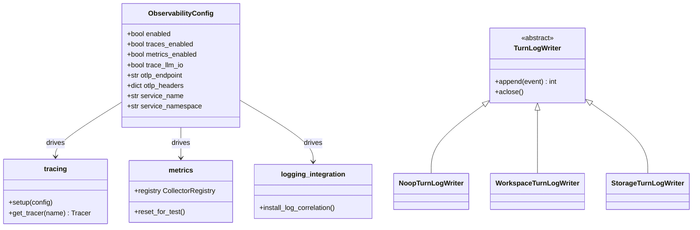
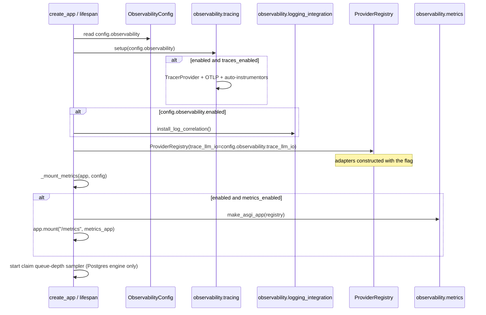

# Observability

## 1. Purpose

Observability is the cross-cutting telemetry surface that lets an operator see
what a running `primer` process is doing without attaching a debugger. It bundles
three first-class outputs plus one diagnostic record family:

- OTEL traces (with an OTLP exporter when configured) for request and turn flow.
- Prometheus metrics scraped via `GET /metrics` for counters, gauges, and
  histograms.
- Structured JSON logs enriched with the active OTEL `trace_id` and `span_id`,
  so log lines correlate to spans without any code change at the call site.
- Per-session and per-graph-node turn logs: structured turn-boundary events
  (`started` / `completed` / `failed` / `yielded` / `resumed` / `cancelled`,
  plus graph-only `superstep_started` / `superstep_ended`) captured to JSONL
  files or `TurnLogRecord` storage rows for operator diagnostics.

The whole surface is gated by `ObservabilityConfig` (`primer/api/config.py`) and
wired in the FastAPI lifespan (`primer/api/app.py`). The first three outputs are
"plumbing once, instrument everywhere" concerns; the modules in
`primer/observability/` own the plumbing, and the instrumentation call sites live
inside the subsystems they measure (LLM adapters, tool manager, claim engines, WS
routers). The turn-log family is a writer ABC plus implementations that the
session dispatch path and both graph executors share.

The design constraint shared across all four outputs is zero-overhead-when-off:
when `enabled=False` the tracer provider is never set, the metrics mount is
skipped (so `GET /metrics` returns 404 rather than an empty body), and the default
turn-log writer is a no-op.

## 2. Visual overview

The instrumentation modules under `primer/observability/` are the shared plumbing;
each one is configured once from `ObservabilityConfig` during the lifespan and then
consumed by call sites scattered across the codebase. The turn-log writer is a
small ABC with three implementations.

## 3. Public surface

The instrumentation plumbing lives in `primer/observability/`:

- `tracing.setup(config: ObservabilityConfig)` (`primer/observability/tracing.py`)
  builds a `TracerProvider` with `service.name` / `service.namespace` resource
  attributes, attaches an `OTLPSpanExporter` (gRPC) wrapped in a
  `BatchSpanProcessor` when `otlp_endpoint` is set, calls
  `trace.set_tracer_provider`, and installs the FastAPI / asyncpg / httpx
  auto-instrumentors (each in its own `try/except`). It is a no-op when `enabled`
  or `traces_enabled` is `False`. `get_tracer(name)` returns a named `Tracer`,
  routing to the module-level provider when `setup` ran and otherwise to the OTEL
  global proxy (a no-op tracer in unit tests).
- `metrics.registry` (`primer/observability/metrics.py`) is a dedicated
  `CollectorRegistry`; every metric is bound to it at module level. `reset_for_test()`
  rebinds the registry and re-creates every metric so tests start zeroed. The named
  metrics are imported directly and called via the prometheus_client API, for
  example `llm_tokens_total.labels(provider="anthropic", direction="in").inc(500)`.
- `logging_integration.install_log_correlation()`
  (`primer/observability/logging_integration.py`) installs
  `LoggingInstrumentor(set_logging_format=False)` with a `log_hook` that attaches
  `otelTraceID` / `otelSpanID` (hex strings) to every `LogRecord` produced inside a
  span. The existing `_JsonFormatter` (`primer/common/log.py`) emits any non-reserved
  record attribute as a top-level JSON field, so the IDs appear automatically.

The turn-log surface lives in `primer/observability/turn_log_writer.py`:

- `TurnLogWriter` (ABC) declares `append(event: TurnLogEvent) -> int` (returns the
  assigned seq) and an idempotent `aclose()`.
- `NoopTurnLogWriter` advances a counter and swallows every event; it is the
  default wherever a real writer is not wired.
- `WorkspaceTurnLogWriter` serialises each event to one JSON line and hands it to an
  injected `append_line` callable; an optional `read_existing` callable lets it
  bootstrap its `seq` counter from the existing file on first append.
- `StorageTurnLogWriter` persists `TurnLogRecord` rows via `Storage[T]`, scoped by
  `(run_id, node_id)`.
- `safe_append(writer, event)` wraps `writer.append` in a `try/except` plus
  `logger.exception` so a disk-full or IO failure never aborts the live dispatch or
  graph executor.
- `to_problem_details(exc)` translates a live exception into a `ProblemDetails`
  envelope using a copy of `_PRIMER_ERROR_MAP` (`NetworkError` -> 504,
  `AuthenticationError` -> 401, `ValidationError` -> 422, `ProviderError` -> 502,
  unknown -> generic 500); the traceback is truncated to the last 4 KB in
  `extensions`. The map is duplicated here so the module does not import upward into
  the api layer.

The event model is `TurnLogEvent` (`primer/model/turn_log.py`), a Pydantic
discriminated union over eight subclasses discriminated on `kind`, with
`parse_turn_log_event` for round-trip decode. `TurnLogRecord` (`Identifiable`) is
the storage entity carrying `run_id`, nullable `node_id`, per-`(run_id, node_id)`
`seq`, `kind`, `iteration`, `superstep_id`, a flattened `payload` dict, and
`created_at`.

## 4. How to add a new implementation

There are two extension points: adding a metric or span at a new call site, and
adding a turn-log writer backend.

To instrument a new code path:

1. For a metric, add the metric object at module level in
   `primer/observability/metrics.py` (bound to `registry`), add it to `__all__`,
   and mirror the declaration inside `reset_for_test()` so tests get a clean copy.
   Import the named metric where you measure and call the prometheus_client API
   directly. Keep label cardinality bounded (provider, kind, name, outcome).
2. For a span, call `get_tracer(__name__)` once at module scope and wrap the body in
   `with _tracer.start_as_current_span("<dotted.name>") as _span:`, setting
   attributes with `_span.set_attribute(...)`. Record failures with
   `_span.record_exception(...)` and observe duration from a `time.monotonic()`
   delta in a `finally` block. Follow the `llm.stream` shape in
   `primer/llm/anthropic.py`.
3. Do not gate the call site on `ObservabilityConfig`. When tracing is off,
   `get_tracer` returns a no-op tracer and the metric just accumulates on the
   in-process registry that is never scraped; the cost is negligible and the call
   sites stay branch-free.

To add a turn-log writer backend:

1. Subclass `TurnLogWriter` in `primer/observability/turn_log_writer.py`,
   implementing `append` (assign and return a monotonic `seq`) and an idempotent
   `aclose`. Add it to `__all__`.
2. Wire it from the construction site. For sessions, supply a
   `turn_log_writer_factory` on `SessionDispatchDeps` (`primer/session/dispatch.py`);
   `WorkerPool._run_engine_session` (`primer/worker/pool.py`) installs the real
   `WorkspaceTurnLogWriter`. For graphs, set `self._turn_log_factory` /
   `self._graph_turn_log` on `BaseGraphExecutor` (`primer/graph/base.py`).
3. Have callers append through `safe_append` rather than `writer.append` directly so
   IO failures stay best-effort.
4. If the new writer needs an IO seam, add the abstract method to `WorkspaceIO`
   (`primer/int/workspace.py`); `append_state_line` is the existing example.

## 5. Existing implementations

Tracing plus metrics are wired at these call sites:

- LLM adapters (`anthropic`, `gemini`, `ollama`, `openresponses`, `openrouter`,
  `openchat`) wrap their stream body in `tracer.start_as_current_span("llm.stream")`
  with attributes `llm.provider`, `llm.model`, `llm.request.max_tokens`, and
  (when `trace_llm_io` is on) `llm.request.messages` serialised via
  `_serialize_messages` (`primer/llm/_trace.py`). On success they set
  `llm.usage.tokens_in` / `tokens_out` and increment
  `llm_tokens_total{provider,direction}`; on exception they `record_exception` and
  bump `llm_failure_total{provider,error_type}`; a `finally` block records
  `llm_duration_seconds{provider}` from a monotonic clock.
- `ToolExecutionManager.dispatch_call` (`primer/agent/tool_manager.py`) wraps each
  call in `tracer.start_as_current_span("tool.exec")` with `tool.name`, increments
  `tool_calls_total{name,outcome}`, and observes `tool_duration_seconds{name}` in a
  `finally`. The standalone `invoke_one` helper used by the MCP endpoint opens the
  same `tool.exec` span with an added `tool.via='mcp'` attribute.
- Both claim engines (`primer/claim/postgres.py`, `primer/claim/in_memory.py`) wrap
  `claim_due` in `tracer.start_as_current_span("claim.due")`, set `claim.count`, add
  a `claim_assigned` span event per lease, and observe
  `claim_enqueue_latency_seconds{kind}`.
- The chat and session WS routers (`primer/api/routers/chats.py`,
  `primer/api/routers/sessions.py`) wrap their handler bodies in `ws.chat` / `ws.session`
  spans, increment `ws_connections_active{kind}` on entry and decrement in `finally`,
  observe `ws_session_duration_seconds{kind}`, set `ws.frames_sent`, and bump
  `ws_frames_sent_total{kind}` per frame.

The declared metric families (`primer/observability/metrics.py`) are LLM
(`llm_tokens_total`, `llm_duration_seconds`, `llm_failure_total`,
`llm_retry_total`), tools (`tool_calls_total`, `tool_duration_seconds`), claims
(`claim_enqueue_latency_seconds`, `claim_queue_depth`, `claim_active_count`), and
WebSockets (`ws_connections_active`, `ws_frames_sent_total`,
`ws_session_duration_seconds`, `ws_replay_backlog_seconds`).

Four declared metrics are not yet written by any call site and scrapers will see
them as never-incremented zeros: `llm_retry_total` (no adapter increments it),
`claim_active_count` (no writer), and `ws_replay_backlog_seconds` (neither WS router
measures the replayed-row age at connect). In addition, the Postgres
`claim_enqueue_latency_seconds` is always observed as `0.0` because the returned
`Lease` shape lacks a `next_attempt_at` / `created_at` field for the wait
computation; an inline comment in `primer/claim/postgres.py` marks this. Dashboard
builders must not read the Postgres latency series as "every lease is instant".

The turn-log writers have three live consumers:

- `WorkspaceTurnLogWriter`: the session dispatch path. `run_one_session_turn`
  (`primer/session/dispatch.py`) fires `TurnLogResumed` (before `started`, when
  `session.parked_at` is set), `TurnLogStarted`, `TurnLogYielded`, `TurnLogFailed`,
  `TurnLogCancelled`, and `TurnLogCompleted`. The `WorkspaceGraphExecutor`
  (`primer/graph/workspace_executor.py`) writes per-node and graph-level JSONL under
  `<state_path>/graphs/<gsid>/turns.jsonl` and
  `<state_path>/graphs/<gsid>/nodes/<nid>/turns.jsonl`, bypassing the git-backed
  commit path because turn logs are high-write-rate observability data with no
  audit-trail value.
- `StorageTurnLogWriter`: the `StorageGraphExecutor` (`primer/graph/executor.py`)
  when an optional `turn_log_storage: Storage[TurnLogRecord]` is supplied; it builds
  one writer per node plus a graph-level (`node_id=None`) writer and threads the same
  handle into subgraph children so nested runs share one table under the sub-thread's
  `run_id`.
- `NoopTurnLogWriter`: the default whenever no real writer is wired (unit tests and
  the `SessionDispatchDeps` default factory).

The failed-event hook drives both the new `TurnLogFailed` event and the legacy
`messages.jsonl` ERROR record off the same `ProblemDetails` envelope, so the
operator sees the real exception type, title, and detail in the Messages tab instead
of the old generic "unexpected executor error" string.

## 6. Wiring

The lifespan in `primer/api/app.py` (`_make_lifespan`) configures the
instrumentation plumbing, and the metrics ASGI app is mounted in `create_app`. More
than two indirections connect config to the live telemetry, so the flow is shown
below.

Specifics:

- `tracing.setup(config.observability)` runs as the first lifespan step so any
  span-emitting code below is covered. When traces are enabled the lifespan also
  calls `install_log_correlation()` so records inside spans carry the trace IDs.
- `trace_llm_io` is plumbed end to end:
  `config.observability.trace_llm_io` is passed into the `ProviderRegistry`
  constructor, which constructs every adapter with the flag; each adapter attaches
  `llm.request.messages` only when its `self._trace_llm_io` is `True`.
- `_mount_metrics(app, config)` mounts `prometheus_client.make_asgi_app(registry)` at
  `/metrics` when `enabled` and `metrics_enabled` are both `True`. The mount happens
  before the error handlers are registered, so `/metrics` does not pass through
  FastAPI's exception machinery, and it carries no auth (operators firewall it).
  When metrics are disabled the mount is skipped and `GET /metrics` returns 404.
- A background task in the lifespan samples `claim_queue_depth{kind}` every 10
  seconds when the claim engine is a `PostgresClaimEngine` and metrics are enabled,
  running `SELECT kind, COUNT(*) ... WHERE claimed_by IS NULL GROUP BY kind` against
  the storage pool. In-memory engines skip the sampler because the gauge would always
  be zero outside tests.

The turn-log writers reach their data sinks through their own wiring.
`WorkerPool._run_engine_session` (`primer/worker/pool.py`) builds a
`_turn_log_factory` closure that resolves the workspace via the IO shim, constructs
`sessions/<sid>/turns.jsonl` relative to the workspace state, and returns a
`WorkspaceTurnLogWriter` wired to `append_state_line` / `read_state_file` (the
abstract `WorkspaceIO.append_state_line` seam, `primer/int/workspace.py`). The
three REST read routes are GET `/v1/sessions/{session_id}/turn_log`
(`primer/api/routers/sessions.py`) and GET
`/v1/graphs/{graph_id}/runs/{run_id}/turn_log` plus the per-node variant
(`primer/api/routers/compute.py`), all paginating on `limit` / `offset` /
`since_seq`; the compute router picks the workspace-JSONL or storage-`TurnLogRecord`
backend by whether `run_id` resolves to a `WorkspaceSession` with a graph binding or
to a `GraphThread`, and returns an empty page when the file or workspace is gone.

## 7. Testing patterns

Test isolation for metrics hinges on `reset_for_test()`
(`primer/observability/metrics.py`): it rebinds the module-level `registry` to a
fresh `CollectorRegistry` and re-creates every metric, zeroing all counters between
tests so accumulation across the suite does not corrupt assertions. Tracing is
verified through the no-op fallback in `get_tracer`: a test that does not boot the
full app gets the OTEL proxy tracer, so span call sites run without a configured
provider.

Observability tests live under `tests/observability/` plus an end-to-end suite at
`tests/e2e/test_observability.py`: `test_config`, `test_tracing`, `test_metrics`,
`test_logging_integration`, `test_lifespan_integration`, `test_llm_instrumentation`,
`test_tool_instrumentation`, `test_claim_instrumentation`, `test_ws_instrumentation`,
and `test_trace_llm_io`. The turn-log writer family is covered by
`tests/observability/test_turn_log_writer.py` (both writer variants including the
seq-bootstrap-on-restart behaviour, `StorageTurnLogWriter` row creation,
`NoopTurnLogWriter` counter advance, idempotent `aclose`), with dispatch and graph
hooks in `tests/session/test_dispatch_turn_log.py`,
`tests/graph/test_workspace_turn_log.py`, and `tests/graph/test_storage_turn_log.py`,
the REST routes in `tests/api/test_turn_log_routes.py`, and the event model in
`tests/model/test_turn_log.py`.

The distributed harness (`tests/distributed/`) is run under the `distributed`
pytest marker; `pyproject.toml` sets `addopts = "-m 'not distributed'"` so a bare
`uv run pytest` skips the multi-process suite, and contributors opt in with
`uv run pytest tests/distributed/ -m distributed`. The cluster wires both storage
and the scheduler to one Postgres so the cross-process bus that the metrics
samplers and tick routers ride on is shared.

## 8. Historical decisions

- **Metrics live on a dedicated `CollectorRegistry`, not the prometheus_client global default.** Why: it keeps `GET /metrics` output limited to Primer-defined series and avoids leaking the process/platform collectors prometheus_client auto-registers globally, and it enables a clean `reset_for_test()` between tests. Spec: docs/superpowers/specs/2026-05-27-observability-design.md.
- **`trace_llm_io` is opt-in and off by default.** Why: recording prompt and response text on spans risks shipping sensitive user data to whatever third-party APM is on the other end of the OTLP exporter, so operators must explicitly enable it for debugging. Spec: docs/superpowers/specs/2026-05-27-observability-design.md.
- **Log correlation uses `LoggingInstrumentor(set_logging_format=False)` with a `log_hook` that sets `otelTraceID` / `otelSpanID` as record attributes.** Why: it preserves the existing Primer JSON formatter without a string-format hijack while still surfacing the trace IDs as top-level JSONL fields, so APMs correlate logs to traces with no other code changes. Spec: docs/superpowers/specs/2026-05-27-observability-design.md.
- **`/metrics` is unauthenticated and operators are expected to firewall it.** Why: it is the standard Prometheus pull pattern, adding auth would force every scraper to carry a bearer token and add latency to a hot scrape path, and the endpoint exposes only counters/gauges/histograms, never request bodies. Spec: docs/superpowers/specs/2026-05-27-observability-design.md.
- **Each auto-instrumentor (FastAPI, asyncpg, httpx) is installed in its own `try/except`.** Why: optional OTEL contrib packages can fail to load in trimmed deployments, and isolating them prevents one missing instrumentor from taking out tracing as a whole. Spec: docs/superpowers/specs/2026-05-27-observability-design.md.
- **`tracing.setup` is a no-op when `enabled` or `traces_enabled` is `False`, and the metrics mount is skipped when disabled.** Why: the spec required zero overhead in the disabled path, so the provider is never set (`get_tracer` falls back to the OTEL no-op proxy) and `GET /metrics` returns 404 rather than an empty body. Spec: docs/superpowers/specs/2026-05-27-observability-design.md.
- **The serialiser for `trace_llm_io` lives in a shared helper and reduces non-text Message parts to their type name.** Why: the same serialisation was needed by every LLM adapter and was previously duplicated across five modules, and reducing binary parts to a type name keeps large payloads out of spans. Spec: docs/superpowers/specs/2026-05-27-observability-design.md.
- **The claim queue-depth sampler is gated on `isinstance(claim_engine, PostgresClaimEngine)` and runs from inside the FastAPI lifespan.** Why: the in-memory engine's gauge would always read zero outside tests, so sampling it would only add noise; the Postgres engine's unclaimed-lease count is the operator-meaningful signal. Spec: docs/superpowers/specs/2026-05-27-observability-design.md.
- **The OTEL tracing plus dedicated Prometheus registry shipped as a first-class observability surface answering the audit's "observability story missing" finding.** Why: tracing covers FastAPI / asyncpg / httpx auto-instrumentation with an optional OTLP exporter, and the separate registry keeps `GET /metrics` returning only Primer counters rather than the prometheus_client default process metrics. Spec: docs/superpowers/specs/2026-05-27-backend-architecture-audit.md.
- **The `TurnLogWriter` family was placed under `primer/observability/` rather than `primer/session/`.** Why: the writer is shared by agent sessions and both graph executors, so keeping it under `primer/session/` would have made graph code import from the session subsystem; the observability module is the cross-cutting home neither subsystem owns. Spec: docs/superpowers/specs/2026-06-05-per-session-turn-log-design.md.
- **`WorkspaceTurnLogWriter` takes injected `append_line` / `read_existing` callables instead of a `WorkspaceIO` plus `relative_path` pair.** Why: it decouples the writer from the workspace runtime so test fakes do not spin up a `WorkspaceIO`, and it lets `WorkspaceGraphExecutor` bypass the git-backed commit path without leaking that decision into the writer. Spec: docs/superpowers/specs/2026-06-05-per-session-turn-log-design.md.
- **The writer bootstraps its `seq` counter by reading the existing file on first append.** Why: without it, a worker restart mid-session would write `seq=1` on top of the existing seq space and break `since_seq` pagination for any operator polling the route. Spec: docs/superpowers/specs/2026-06-05-per-session-turn-log-design.md.
- **`to_problem_details(exc)` was forked into the observability module with a copy of `_PRIMER_ERROR_MAP` rather than imported from `primer.api.errors`.** Why: it keeps the observability layer free of an upward import into the api layer while still rendering the same `ProblemDetails` shape the UI already knows. Spec: docs/superpowers/specs/2026-06-05-per-session-turn-log-design.md.
- **The legacy `messages.jsonl` ERROR record now carries the real `ProblemDetails` envelope off the same `to_problem_details(exc)` call that drives the `TurnLogFailed` event.** Why: operators viewing the Messages tab and the Last-error panel see the real exception type, title, and detail instead of the spec-era generic "unexpected executor error" string. Spec: docs/superpowers/specs/2026-06-05-per-session-turn-log-design.md.
- **`WorkspaceGraphExecutor` writes turn logs directly to the filesystem, bypassing the git-backed `state_repo.commit` pipeline.** Why: turn logs are high-write-rate observability data with no audit-trail value, so routing them through the commit pipeline would balloon the commit graph with one commit per turn boundary for no operator benefit. Spec: docs/superpowers/specs/2026-06-05-per-session-turn-log-design.md.
