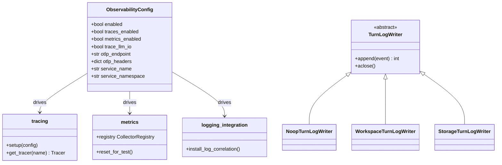
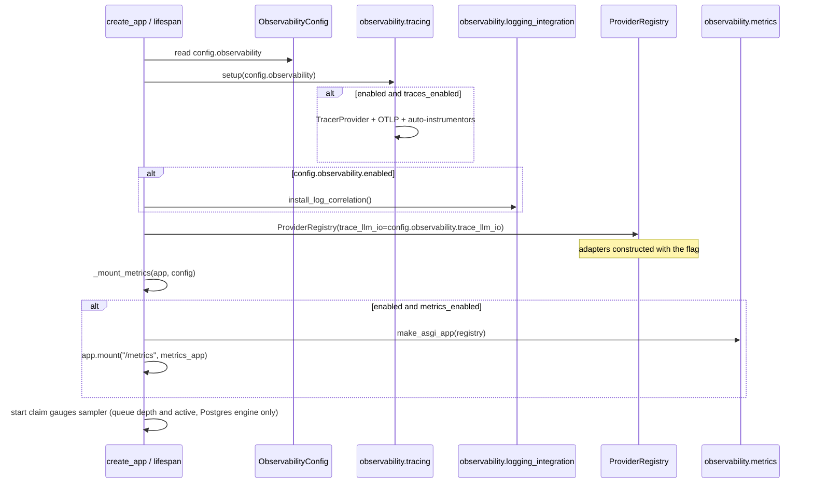

# Observability

## 1. Purpose

Observability is the cross-cutting telemetry surface that lets an operator see
what a running `primer` process is doing without attaching a debugger. It bundles
three first-class outputs plus one diagnostic record family:

- OTEL traces (with an OTLP exporter when configured) for request and turn flow.
- Prometheus metrics scraped via `GET /metrics` for counters, gauges, and
  histograms.
- Structured JSON logs enriched with the active OTEL `trace_id` and `span_id`,
  so log lines correlate to spans without any code change at the call site.
- Per-session and per-graph-node turn logs: structured turn-boundary events
  (`started` / `completed` / `failed` / `yielded` / `resumed` / `cancelled`,
  plus graph-only `superstep_started` / `superstep_ended`) captured to JSONL
  files or `TurnLogRecord` storage rows for operator diagnostics.

The whole surface is gated by `ObservabilityConfig` (`primer/api/config.py`) and
wired in the FastAPI lifespan (`primer/api/app.py`). The first three outputs are
"plumbing once, instrument everywhere" concerns; the modules in
`primer/observability/` own the plumbing, and the instrumentation call sites live
inside the subsystems they measure (LLM adapters, tool manager, claim engines). The turn-log family is a writer ABC plus implementations that the
session dispatch path and both graph executors share.

The design constraint shared across all four outputs is zero-overhead-when-off:
when `enabled=False` the tracer provider is never set, the metrics mount is
skipped (so `GET /metrics` returns 404 rather than an empty body), and the default
turn-log writer is a no-op.

## 2. Visual overview

The instrumentation modules under `primer/observability/` are the shared plumbing;
each one is configured once from `ObservabilityConfig` during the lifespan and then
consumed by call sites scattered across the codebase. The turn-log writer is a
small ABC with three implementations.

```mermaid
classDiagram
    class ObservabilityConfig {
        +bool enabled
        +bool traces_enabled
        +bool metrics_enabled
        +bool trace_llm_io
        +str otlp_endpoint
        +dict otlp_headers
        +str service_name
        +str service_namespace
    }
    class tracing {
        +setup(config)
        +get_tracer(name) Tracer
    }
    class metrics {
        +registry CollectorRegistry
        +reset_for_test()
    }
    class logging_integration {
        +install_log_correlation()
    }
    class TurnLogWriter {
        <<abstract>>
        +append(event) int
        +aclose()
    }
    class NoopTurnLogWriter
    class WorkspaceTurnLogWriter
    class StorageTurnLogWriter
    ObservabilityConfig --> tracing : drives
    ObservabilityConfig --> metrics : drives
    ObservabilityConfig --> logging_integration : drives
    TurnLogWriter <|-- NoopTurnLogWriter
    TurnLogWriter <|-- WorkspaceTurnLogWriter
    TurnLogWriter <|-- StorageTurnLogWriter
```

## 3. Public surface

The instrumentation plumbing lives in `primer/observability/`:

- `tracing.setup(config: ObservabilityConfig)` (`primer/observability/tracing.py`)
  builds a `TracerProvider` with `service.name` / `service.namespace` resource
  attributes, attaches an `OTLPSpanExporter` (gRPC) wrapped in a
  `RedactingSpanExporter` (`primer/observability/span_redaction.py`) and a
  `BatchSpanProcessor` when `otlp_endpoint` is set, calls
  `trace.set_tracer_provider`, and installs the FastAPI / asyncpg / httpx
  auto-instrumentors (each in its own `try/except`). It is a no-op when `enabled`
  or `traces_enabled` is `False`. `get_tracer(name)` returns a named `Tracer`,
  routing to the module-level provider when `setup` ran and otherwise to the OTEL
  global proxy (a no-op tracer in unit tests).
- `metrics.registry` (`primer/observability/metrics.py`) is a dedicated
  `CollectorRegistry`; every metric is bound to it at module level. `reset_for_test()`
  rebinds the registry and re-creates every metric so tests start zeroed. The named
  metrics are imported directly and called via the prometheus_client API, for
  example `llm_tokens_total.labels(provider="anthropic", direction="in").inc(500)`.
  Call sites bind the module (`import primer.observability.metrics as _metrics`)
  rather than the names, because `reset_for_test` REBINDS the globals and a
  `from`-import would keep writing to the dead registry after any reset.
- `compaction_outcomes_total{outcome}` is incremented by `CompactionStrategy` (`primer/agent/compaction.py`) once per
  compaction: `pruned` (tier 1 sufficed), `summarised`, `unreducible` (nothing could be summarised, so no marker was
  written), `skipped` (the trigger cannot be reached, and the prompt still fits the budget or has not grown since the last
  compaction left it, so it was deliberately not compacted) or `insufficient` (summarised, and the result is still at or over the trigger). `unreducible` and
  `insufficient` also log a WARNING and are in the session record (the marker's payload, or a `compaction_note`
  record when there is no marker); `skipped` logs at INFO and leaves ONE `compaction_note` per run of skips (the
  next marker ends the run), not one per turn. A skip is `cannot_reach_trigger` (the prompt, after the tier-1 prune, fits the budget) or
  `recently_compacted` (it does not fit the budget but fits the window, and has not grown by a summary allowance
  since the newest marker's `tokens_after`). The trigger, the tail budget and the
  re-measure count the FIXED overhead (system prompt and tool schemas), so a rising `unreducible` rate with reason
  `fixed_over_budget` is an agent whose fixed part does not fit its model's window (too many or too large tool
  schemas), and a steady `skipped` rate is one whose fixed part keeps it over the trigger without overflowing.
  `outcome` is a closed enum, so the label stays bounded.
- `metrics.ALLOWED_LABEL_NAMES` plus `metrics.registered_label_names()` are the
  cardinality guard. Every label on every instrument must be a reviewed name, and
  `session_id` is in neither set: a per-session dimension would grow the series
  count without bound, so session-scoped detail comes from the derived timeline
  below, never from a metric label.
- `primer/session/timeline.py` derives a turn's execution tree from the session's
  own on-disk record. No trace system backs it: `messages.jsonl` supplies the
  children and `turns.jsonl` the envelope, so it works on any historical session
  and adds no write path.
- `primer/worker/identity.py` exposes `stable_worker_label(config)`: hostname plus
  `WorkerConfig.worker_index` (or an explicit `worker_label`), bounded and stable
  across restarts. It is a SECOND identity, used only as a metric label; the
  lease-ownership `worker_id` stays a per-start uuid, because two pools on one host
  must hold distinct leases.
- `logging_integration.install_log_correlation()`
  (`primer/observability/logging_integration.py`) installs
  `LoggingInstrumentor(set_logging_format=False)` with a `log_hook` that attaches
  `otelTraceID` / `otelSpanID` (hex strings) to every `LogRecord` produced inside a
  span. It passes `enable_log_auto_instrumentation=False`: by default the instrumentor
  also attaches an OTel `LoggingHandler` to the root logger, which reads each record's
  raw `exc_info` and ships it as a log record, past the credential filter below
  (ticket 01a12171-2d5a). The existing `_JsonFormatter` (`primer/common/log.py`) emits any non-reserved
  record attribute as a top-level JSON field, so the IDs appear automatically.
- Spans carry none of the credential shapes below out of the process (ticket 01a12171-2d5a). The spans Primer
  opens itself go through `tracing.span` (section 5). The AUTO-instrumentors' spans do not: the httpx client span keeps the whole request URL in
  `http.url` (a Telegram call is `/bot<id>:<secret>/getMe`, a provider call may carry `?key=`), and with header capture on
  (`OTEL_INSTRUMENTATION_HTTP_CAPTURE_HEADERS_*`) it records the request and response headers; OTel's own URL redaction strips only userinfo and the AWS /
  Google signature parameters. A FastAPI server span would keep the path and query in `http.target` (`/v1/webhooks/<token>`) and record an exception
  that leaves a route with its message and a stacktrace with its causes, but production creates none today: `tracing.setup` runs in the lifespan, after
  `create_app` has built the app, and `FastAPIInstrumentor().instrument()` only patches apps built later (a ticket tracks instrumenting the app, and masking
  the webhook path structurally by `http.route`). `RedactingSpanExporter` wraps the OTLP exporter, so every finished span crosses it once whichever
  code created it: its name, attributes (a sequence or a mapping element by element, `bytes` as text), event and link attributes and status description
  pass through `redact_credentials` (URL credentials, Bearer and Basic tokens) and a query-name rule for the names it does not list (`signature`, `sig`,
  `code`, `auth_token`, `access_token` / `accessToken` / `access-token`, `api_token`, `access_key`, `oauth_token`, `session_token`, `id_token`, `id_token_hint`,
  `private_token`, `jwt`, `passwd`, `hm`, `hub.verify_token`, `subscription-key`, every `X-Amz-*` and `X-Goog-*`; case-insensitive, whole names, after a `?`,
  `&` or `#`, so the first parameter of a URL fragment, `#access_token=...`, is covered; `zipcode` or `country_code` is not a `code`); a Telegram token whose `:`
  is percent-encoded is masked; `url.query` / `http.query`, which hold a bare query string, are masked as a query. A captured header is masked unless its
  name is on a short safe list (`accept`, `accept_encoding`, `accept_language`, `cache_control`, `connection`, `content_encoding`, `content_length`,
  `content_type`, `host`, `traceparent`, `tracestate`, `user_agent`, `x_request_id`): a header Primer sends itself (`x-goog-api-key`) or an operator names
  (an MCP server's) has no shape to recognise. A span with nothing to mask is exported as the very object the SDK made; one with something to mask is
  exported as a thin view of it (the masked name, attributes, events, links and status; ids, timing, kind, resource, scope, trace state and every dropped count
  are the original's); a value the masker fails on is replaced, never exported, and a span it cannot handle at all is dropped alone (logged), not with the batch
  it travels in. Not covered: a query name outside the rule, or percent-encoded (`api%5Fkey=`); a capability token that is part of a URL path other than
  `/bot<token>/` and `/v1/webhooks/<token>` (an MCP server URL that embeds its key, a Slack or Discord webhook URL; ticket 01a1227f-ba04); header-shaped free
  text other than Bearer and Basic (`x-api-key: <key>`, `Authorization: Token <key>`, `Bot <token>`); a secret of no shape in an attribute a tool sets itself
  (the masker knows no provider); and `db.statement` text, which the asyncpg instrumentor records as the SQL with `$n` placeholders (its `capture_parameters`
  option, which would add values, is off and Primer does not set it). `OTEL_PYTHON_LOGGING_AUTO_INSTRUMENTATION_ENABLED` is read by the SDK's
  auto-configurator, which a plain primer process never runs (under it the SDK owns the provider and its exporters, and they bypass this wrapper), and by the
  logging instrumentor, only to skip attaching its own handler.
- Credentials of the shapes below never reach the log (URL-borne ones, and since ticket 01a1201c-8918 the Bearer and Basic tokens a library echoes back in an error: the filter applies `redact_credentials`, not only `redact_url_secrets`, and `_JsonFormatter` masks the finished JSON line once more, so an extra that is a dict, a list or an object is covered too; the dev formatter prints no extras). A secret of no such shape (a bare key in prose) is not recognised: the filter knows no provider. `configure_logging` puts
  `_UrlSecretFilter` on the root handler and on the `uvicorn.access` /
  `uvicorn.error` loggers (uvicorn logs those through its own handlers with
  `propagate=False`, so the root handler never sees them). It masks query
  credentials (`key`, `api_key`, `apikey`, `token`, `access_token`, `refresh_token`,
  `id_token`, `client_secret`, `secret`, `password` become `[REDACTED]`), the
  userinfo of a URL (`http://user:pw@host` becomes `http://[REDACTED]@host`: it runs
  to the last `@` before the first `/`, `?` or `#`, so a password with an apostrophe or
  a raw `@` is covered and an `@` in a path, query or fragment is left alone, ticket
  01a11c0d-dd9a). The pattern is linear (the scheme is `[a-z][a-z0-9]*`; a class with
  `+ . -` rescans a run like `a.a.a.` from every letter and took 24 s on 100k characters of an
  unauthenticated request path) and runs only when the text holds both `://` and `@`.
  Its limits: it needs a scheme, so `user:pw@host/v1` and `//user:pw@host` are not masked; the
  userinfo ends at the first `/`, `?` or `#`, so a hand-typed password holding a raw one of those
  leaves the rest of it readable (httpx and pydantic percent-encode what they print, but a string an
  application prints as typed is not), and whitespace ends it; the username is masked with the
  password (it cannot be told apart from a token). Where a value can be typed by a person the
  caller must not print it at all: the draft-validation detail of a provider probe omits pydantic's
  `input_value` for that reason. The mask also covers Telegram
  `/bot<id>:<secret>` segments (`/bot[REDACTED]`), webhook capability tokens
  (`/v1/webhooks/***<last4>`) and `Bearer <token>` / `Basic <base64 user:password>` tokens in the message (a non-str message such as
  `logger.warning(exc)` too), each arg, every string extra (`extra={"path": ...}`,
  which `_JsonFormatter` emits verbatim) and the exception text. Args are rewritten
  one by one, and collapsed into the message only when a credential spans the format
  string and its args, because uvicorn's `AccessFormatter` unpacks a 5-tuple. The
  filter never raises into the logging call (filters run outside
  `Handler.handleError`): an arg whose `__str__` raises is kept as is. Both entry
  points install it: `primer api` (`primer/cli.py`) and `python -m primer.api`
  (`primer/api/__main__.py`) call `configure_logging` before `uvicorn.run`. This covers the httpx `HTTP Request: ...` INFO
  line (httpx stays at its INFO floor) and `httpx.HTTPStatusError` text, which both
  embed the full URL. Call sites still keep credentials out of URLs where the
  upstream allows it: Gemini model discovery sends the key in `x-goog-api-key`.

The turn-log surface lives in `primer/observability/turn_log_writer.py`:

- `TurnLogWriter` (ABC) declares `append(event: TurnLogEvent) -> int` (returns the
  assigned seq) and an idempotent `aclose()`.
- `NoopTurnLogWriter` advances a counter and swallows every event; it is the
  default wherever a real writer is not wired.
- `WorkspaceTurnLogWriter` serialises each event to one JSON line and hands it to an
  injected `append_line` callable; an optional `read_existing` callable lets it
  bootstrap its `seq` counter from the existing file on first append.
- `StorageTurnLogWriter` persists `TurnLogRecord` rows via `Storage[T]`, scoped by
  `(run_id, node_id)`.
- `safe_append(writer, event)` wraps `writer.append` in a `try/except` plus
  `logger.exception` so a disk-full or IO failure never aborts the live dispatch or
  graph executor.
- `to_problem_details(exc)` translates a live exception into a `ProblemDetails`
  envelope using a copy of `_PRIMER_ERROR_MAP` (`NetworkError` -> 504,
  `AuthenticationError` -> 401, `ValidationError` -> 422, `ProviderError` -> 502,
  unknown -> generic 500). `extensions` carries `exception_class` and a fresh
  `error_id` (uuid4 hex), never the traceback: the envelope is served to every
  reader of the session (the messages `ERROR` record, the turn log, the tap), and a
  traceback exposes server file paths and internals. `detail` (and the top-level string
  values of the exception's `problem_extensions`) passes through `redact_credentials`, since an
  upstream error message can embed a `?key=` URL, the `user:password@` of a Base URL, or the
  Bearer or Basic token it was sent.
  `to_problem_details` logs the failure once on `primer.observability.turn_log_writer`
  as `error_id=<id> <Class>: <message>`, so an operator finds it in the server log by
  the id the console shows: a mapped `PrimerError` subclass (an expected failure
  class such as `NetworkError` or `ProviderError`) as one WARNING without a
  traceback, anything else (the bare `PrimerError` catch-all included) at ERROR with
  the traceback (no extra DEBUG traceback for mapped errors: `log_level` defaults to
  `debug`, so it would bring the traceback back on every default deployment). String
  values in `problem_extensions` are redacted like `detail`. Rows written before this
  change still hold `extensions.traceback` on disk; `record_without_traceback`
  (`primer/model/problem_details.py`) strips it in every reader of those rows: the
  REST JSONL reader, the tap's record parse and the TapEvent builder (see
  [sessions](../subsystems/sessions.md)). The map is duplicated here so the module does not import
  upward into the api layer.

The event model is `TurnLogEvent` (`primer/model/turn_log.py`), a Pydantic
discriminated union over eight subclasses discriminated on `kind`, with
`parse_turn_log_event` for round-trip decode. `TurnLogRecord` (`Identifiable`) is
the storage entity carrying `run_id`, nullable `node_id`, per-`(run_id, node_id)`
`seq`, `kind`, `iteration`, `superstep_id`, a flattened `payload` dict, and
`created_at`.

Two read endpoints expose derived detail the scrape format cannot carry:

- `GET /v1/sessions/{session_id}/turns/{turn_no}/timeline` returns one turn's tree
  (`{turn_no, terminal_seq, status, started_at, ended_at, duration_ms, waits,
  children}`), built by `primer/session/timeline.py`. `turn_no` is the window
  ordinal counted over the UNFOLDED record stream, so a compaction or a rewind
  folds what a turn renders without renumbering the turns or retargeting a URL
  already in circulation. A failed turn is ONE window however many error records
  it wrote (`terminals.TurnWindowScanner`: the first error of a failure ends it,
  dispatch's copy and the release marker are filed with it, ticket 01a11ca5), and a GRAPH turn is one window however many nodes finished inside it (a record with a
  `node_id` is inside the window; the graph's own end, a node-less `done` the writers append when the run ends (`payload.graph_end`), closes it, ticket 01a11f35), which
  is what keeps the join below right after a failed turn. The tree's envelope is the window's RUN of `turns.jsonl`
  envelopes (`envelopes_for_window`): window `n` takes the `n`-th run, so both sides
  must count turns alike. `turn_envelopes` groups by `turn_no`, and a FAILED turn
  does not bump it (the claim adapter bumps on success only), so the turn after a
  failed one (a message reopens the session) writes under the same `turn_no`; so
  does a turn whose end entry never landed (a worker crash, a lost lease). A new
  envelope therefore opens at an own event (no `node_id`) that is a `resumed` or a
  `started`, except a `started` that directly follows an own `resumed`. The node
  scoping covers the grouping only: a group's status, times and waits still read
  every event in it, a graph node's included. A group whose last END
  event (`phase` events follow a `yielded`) is `yielded` is continued by the next
  group when that carries a later `turn_no` (a park and its resume); a `yielded` and
  a `resumed` on ONE `turn_no` (`abandon_session_gate` leaves `parked_at` set and writes no event or release, so the next turn writes `resumed` on the `turn_no` the park never bumped) are two
  runs (ticket 01a11ce4; before it the failed turn's trace read as the turn that
  followed it). **Declared, and pinned by
  `test_interim_mapping_after_a_failed_turn_fail_retry_fail`:** this makes the RUNS
  right, one per turn, but the join is still by position and a failed turn is still
  more than one WINDOW (the failure exit's `ERROR`, then the release marker;
  ticket 01a11ca5), so after a failed turn the windows run ahead of their runs. With
  fail, retry, fail the windows are `[A, A's marker, B, C, C's marker]` against the
  runs `[A, B, C]`: A reads right, A's marker window reads B's envelope, and the
  successful retry B reads C's (`failed` with C's times; before the split it read
  `completed` only because it had no run at all). It moves the mis-join rather than
  closing it; the fold of 01a11ca5 closes it.
- `GET /v1/workers/stats` returns the per-lane task counters as JSON
  (`{worker, kind, status, tasks, duration_sum_seconds, duration_count}`), for the
  console's workers page. The Prometheus text format is a scrape target, not a UI
  API, which is why the console reads this instead.

## 4. How to add a new implementation

There are two extension points: adding a metric or span at a new call site, and
adding a turn-log writer backend.

To instrument a new code path:

1. For a metric, add the metric object at module level in
   `primer/observability/metrics.py` (bound to `registry`), add it to `__all__`,
   and mirror the declaration inside `reset_for_test()` so tests get a clean copy.
   Import the named metric where you measure and call the prometheus_client API
   directly. Keep label cardinality bounded (provider, kind, name, outcome).
2. For a span, call `get_tracer(__name__)` once at module scope and wrap the body in
   `with _tracing.span(_tracer, "<dotted.name>") as _span:`, setting
   attributes with `_span.set_attribute(...)`. Do not call `_span.record_exception(...)` and do not open the span with
   `_tracer.start_as_current_span(...)` where a tool's or a provider's exception can leave the block:
   the SDK exports the raw message and a stacktrace that ends in it, and an exception text carries what a library printed (a URL with
   `user:password@`, an `Authorization` header). `primer.observability.tracing.span` records an `Exception` that leaves the block itself
   (`record_failure`: the exception type and the message with credentials masked, ERROR status, no stacktrace; a cancellation is not recorded) and
   re-raises it (ticket 01a1201c-8918). The SDK's `exception.stacktrace` and `exception.escaped` are not recorded: the stacktrace ends in the raw message. If
   the frames are wanted back, record `traceback.format_tb(exc.__traceback__)` (frames only, no message) or the stacktrace through `redact_credentials`.
   Use `tracing.span` in a `with` statement only (as a decorator on an `async def` it would cover the creation of the coroutine, not its run).
   `tests/observability/test_span_exceptions_carry_no_credentials.py` scans every module under `primer/` and fails on a span opened the SDK's way
   (`start_as_current_span`, `start_span`, `record_exception`), except the two `claim.due` spans. Observe duration from a `time.monotonic()`
   delta in a `finally` block. Follow the `llm.stream` shape in
   `primer/llm/anthropic.py`.
3. Do not gate the call site on `ObservabilityConfig`. When tracing is off,
   `get_tracer` returns a no-op tracer and the metric just accumulates on the
   in-process registry that is never scraped; the cost is negligible and the call
   sites stay branch-free.

To add a turn-log writer backend:

1. Subclass `TurnLogWriter` in `primer/observability/turn_log_writer.py`,
   implementing `append` (assign and return a monotonic `seq`) and an idempotent
   `aclose`. Add it to `__all__`.
2. Wire it from the construction site. For sessions, supply a
   `turn_log_writer_factory` on `SessionDispatchDeps` (`primer/session/dispatch.py`);
   `WorkerPool._run_engine_session` (`primer/worker/pool.py`) installs the real
   `WorkspaceTurnLogWriter`. For graphs, set `self._turn_log_factory` /
   `self._graph_turn_log` on `BaseGraphExecutor` (`primer/graph/base.py`).
3. Have callers append through `safe_append` rather than `writer.append` directly so
   IO failures stay best-effort.
4. If the new writer needs an IO seam, add the abstract method to `WorkspaceIO`
   (`primer/int/workspace.py`); `append_state_line` is the existing example.

## 5. Existing implementations

Tracing plus metrics are wired at these call sites:

- LLM adapters (`anthropic`, `gemini`, `ollama`, `openresponses`, `openrouter`,
  `openchat`) wrap their stream body in `_tracing.span(_tracer, "llm.stream")`
  with attributes `llm.provider`, `llm.model`, `llm.request.max_tokens`, and
  (when `trace_llm_io` is on) `llm.request.messages` serialised via
  `_serialize_messages` (`primer/llm/_trace.py`). On success they set
  `llm.usage.tokens_in` / `tokens_out` and increment
  `llm_tokens_total{provider,direction}`; on exception the span records the failure (`tracing.record_failure`: type and masked message) and
  they bump `llm_failure_total{provider,error_type}`; a `finally` block records
  `llm_duration_seconds{provider}` from a monotonic clock.
- `ToolExecutionManager.execute` (`primer/agent/tool_manager.py`) wraps each
  call in `_tracing.span(_tracer, "tool.exec")` with `tool.name`, increments
  `tool_calls_total{name,outcome}`, and observes `tool_duration_seconds{name}` in a
  `finally`. The standalone `invoke_one` helper used by the MCP endpoint opens the
  same `tool.exec` span with an added `tool.via='mcp'` attribute.
- Both claim engines (`primer/claim/postgres.py`, `primer/claim/in_memory.py`) wrap
  `claim_due` in `tracer.start_as_current_span("claim.due")`, set `claim.count`, add
  a `claim_assigned` span event per lease, and observe
  `claim_enqueue_latency_seconds{kind}`.

The declared metric families (`primer/observability/metrics.py`) are LLM
(`llm_tokens_total`, `llm_duration_seconds`, `llm_failure_total`,
`llm_retry_total`), tools (`tool_calls_total`, `tool_duration_seconds`), claims
(`claim_enqueue_latency_seconds`, `claim_queue_depth`, `claim_active_count`), and
the worker / turn / session families. Every declared family has a writer:
`tests/observability/test_metric_families_are_written.py` fails when a family is declared
that no other `primer/` module mentions (its `KNOWN_UNWRITTEN` exception list is empty,
and a second test fails when a listed family gains a writer), so removing a route cannot
leave its families behind:

- `tool_wait_malformed_scoped_id_total{site}` counts tool-call task ids that did not parse as a scoped id (`parse_scoped_task_id`, `primer/model/tool_call_task.py`) where a tool_wait wake key was needed, through `tool_wait_event_key_or_none` (`primer/session/yields.py`, which also logs ERROR naming the id). `site` is a closed four-value enum, so it is on the label allowlist: `adapter` (the last-sibling release in `primer/claim/adapters/tool_calls.py` committed but woke nothing), `materializer` (`materialize_pending_tool_wait_rows` left that batch's key out of the park), `repark` (`_repark_graph_tool_wait_outcome` left that batch's key out of the park) and `dispatch` (the agent tool_wait park arm: no batch's id parsed, so the park is not written and the turn ends failed). A pure tool_wait graph park or re-park (no human gate) whose batches ALL fail to parse is not written either and ends the turn failed the same way, but it is counted under `materializer` (a pure graph park arm) or `repark` (a re-park), not `dispatch`, which only the agent arm counts. Only an id the code minted itself can be counted, so any non-zero value is a bug in the id mint.
  The counter is a rate signal, not an exact count. A graph resume computes keys in two places: `materialize_pending_tool_wait_rows`, which `resume_graph_from_checkpoint` (`primer/worker/graph_resume.py`) calls over EVERY entry of the checkpoint's `pending_tool_waits`, carried-over entries included (it discards the keys it computes there), and, when the resume re-parks on tool_wait batches only, `_repark_graph_tool_wait_outcome`, which computes every entry's key again. So ONE malformed batch is counted under `materializer` and again under `repark` by the same resume, and once more by each later resume that carries it over.
- `storage_cas_drift_total{model}` counts `Storage.patch_if` writes (through `primer.storage.cas.patch_if_checked`) that the database rejected although a fresh read still satisfies the guard in Python: a serialization disagreement rather than a lost race. Any non-zero rate means a compare-and-set can never apply and deserves attention.
- `worker_tasks_total{worker,kind,status}` and
  `worker_task_duration_seconds{worker,kind,status}` are written by
  `WorkerPool._run_engine` (`primer/worker/pool.py`). Lease acquire to release IS
  the task boundary, so one wrapper brackets every claim lane; `status` is `ok`,
  `error` or `cancelled`.
- `turns_total{binding_ref,status}` and
  `turn_duration_seconds{binding_ref,status}` are written by `_observe_turn` at all
  four exits of `run_one_session_turn` (`primer/session/dispatch.py`): parked,
  failed, cancelled, completed (and `overridden`, below). The completion exit counts a turn the agent's
  `max_tool_turns` stopped (`last_done_reason == "tool_turn_cap"`, interactive or
  autonomous) as `status="tool_turn_cap"`, neither a normal `completed` nor a
  `failed`: a dashboard that sums `completed` no longer includes those turns.
  A completion whose terminal write was skipped because another path ended the
  row meanwhile (a force-delete, the pool's preempt convergence, the reconciler)
  is counted once as `status="overridden"` and emits no `session.replied`
  (ticket 01a1134b-2cb8), so `completed` is not inflated by sessions that were
  ended under the turn.
  A failed turn is announced on the event log as `session.turn_failed` with `{code, ended}` (`primer/session/dispatch.py::_end_turn_failed`, and the clean-completion arm when it ends a turn `failed`; `code` = the failure's code: the stream's own, the code an adapter's raised error carries, `llm_stream_error` when the stream gave none, `turn_failed` for a crash; the clean arm's is the stop reason), whether the session then ended or, for a transport failure of an interactive session, RESTS (C-024; `ended` is false then): `session.ended` is only for an ended one, so an automation that watches for failed turns watches this. Counted in `turns_total{status="failed"}` as before.
  `binding_ref` is the bound agent or graph id,
  bounded by the number of definitions rather than by session volume.
- `sessions_active{workspace_id}` is inc/dec'd around the turn body in the same
  function. Six writers mutate `SessionStatus` outside the lifecycle lock, so a
  transition-delta gauge would drift; the streaming `try`/`finally` is the one
  exact chokepoint every exit passes through.
- `llm_calls_total{provider_id,profile_id,status}` and
  `llm_profile_tokens_total{profile_id,direction}` are written by
  `_observe_llm_call` in `primer/agent/loop.py`. That loop is the one model-call
  seam every executor shares, so instrumenting there counts every call exactly
  once. The pre-existing `llm_duration_seconds{provider}` keeps the per-provider
  view; the gap these close is the per-PROFILE dimension. `status` is `ok`,
  `error`, or `interrupted` (a Stop cut the call short while the loop waited for
  the model; like a stream that raises, it produces no `llm_call` record).
- `session_interrupts_via_poll_total{reason}` counts Stops the dispatch watcher
  found on the session row instead of on the bus. `reason="queued_before_turn"`
  means the flag was already set when the turn began (a Stop recorded while the
  session was queued): expected, not a fault. `reason="missed_while_running"`
  means the Stop was requested while the turn ran and its bus message never
  arrived: that one means the bus is dropping Stops, and the Stop was delayed (by
  at most the 2s poll interval, which applies while a turn is running), not lost.
  `session_interrupt_publish_failures_total` counts Stop requests whose bus
  publish failed (`POST .../interrupt` still answers 200: the flag on the row is
  durable and the running worker polls it); it has no labels. `reason` is a
  closed two-value enum, so it is on the label allowlist.
- `llm_prompt_estimate_ratio{provider_id}` (a histogram) is the provider's reported `usage.input_tokens` divided by our character-heuristic estimate of the prompt that was SENT, observed once per model call that came back with usage (`_observe_prompt_estimate` in `primer/agent/loop.py`, beside `_observe_llm_call`). The estimate is the figure the compaction trigger computes (the same per-part heuristic over the system prompt, the history and the tool schemas, `count_tokens_char_fallback`), taken from the outgoing prompt after any guard reduced it. 1.0 is a perfect estimate; above 1 the heuristic undercounts and a trigger running on it fires late; below 1 it overcounts. It is measurement only (Phase 0 of the prompt-size accounting work): provider usage is free, so it costs one local pass over the prompt and no counting, and nothing reads it. A call with no usage, or a usage of zero input tokens, records NOTHING (not a zero) and spends no pass. Only a call that completes is observed: one whose stream raises at any point, or that a Stop interrupts before the call's terminal event, even after a `Usage` event arrived (a cumulative Gemini usage chunk mid-stream), is still counted on `llm_calls_total` but records no ratio and no `estimated_input_tokens`, which is consistent with its trace, where such a call has no `llm_call` record either. The label is `provider_id` only (the profile id for an aggregated profile, as on `llm_calls_total`): no model, so it stays bounded. The same estimate rides on the `llm_call` event and record as `estimated_input_tokens` (omitted when there is none), beside `input_tokens`, so one call's error can be read off the trace.
- `session_completed_turn_noop_total` (no labels) counts session claims that found the previous turn completed
  (`completed_turn_no == turn_no`) but its release never committed, and released without calling the model
  again (`_noop_if_turn_already_completed` in `primer/session/dispatch.py`; see `docs/dev/subsystems/sessions.md`).
  That includes a claim that finds the row PAUSED or ENDED by another process (at the guard's first read or after a
  refused arming patch), which releases it without running the turn; a row that is gone (deleted) is NOT counted, it
  gets the vanished-before-dispatch outcome. Each one is a turn that would otherwise have run twice; a steady rate points at releases being abandoned at the
  worker's release bound (`primer_worker_release_timeouts_total`) or failing.
- `gate_respond_total{kind,gate_token}` counts decisions on a human gate (an approval or an `ask_user`; the REST respond and cancel routes and the channel inbox) by what each said about WHICH gate it answers: `matched` (it named the pending gate's `gate_id`), `stale` (it named a gate that is no longer the pending one under that tool call id, refused 409 `approval_stale`) or `absent` (it named none: a client or a channel button from before gates had ids; also logged once at INFO with the session id and no arguments). `kind` is `approval` or `ask_user`; `gate_token` is on the label allowlist as a closed three-value enum. When `absent` stays at zero the tokenless respond can be refused (ticket 01a11f52-9d98). A thread reply whose correlation row predates gate ids has no token and is counted `absent` once it reaches a pending prompt; a decision the approver check refuses is not counted (a stale one is, where it is refused). See `primer/session/gate_token.py` and the agents and channels subsystem docs.
- `session_wake_stale_refused_total` (no labels) counts machine wakes that the flip of a parked session refused because they belong to an earlier park than the one now pending on the same event key (`_wake_is_for_an_earlier_park` in `primer/session/yields.py`; tickets 01a1208d and 01a12151-b225): a timeout marker or a timer fire (a sleep's `TimerScheduler` publish) for a park whose deadline is still ahead, or a result that names the park its producer read (`__yield_parked_at__`) when that is not the pending one. Like the gate counter it is the replay protection working; a steady rate points at a dispatcher or a bus that redelivers a lot, a burst from one node at clock skew (the node's clock runs more than 5 s behind the publisher's; the publisher republishes while the park stays due, so the wake lands once inside the window), and a refusal that names a key shared across sessions at a park written before the key carried the session. It also counts a wake that answers another pending ENTRY than the one waiting on the key (a trigger fire or `wait_for_event` delivery for another subscription, an external result for another call row; a graph park included, ticket 01a1223f).
- `session_wake_gate_refused_total` (no labels) counts wakes of a human decision that the flip of a parked session refused because they decided another gate than the one now pending on the same event key (`_wake_names_another_gate` in `primer/session/yields.py`; see `docs/dev/subsystems/agents.md`): a `session.wake` redelivered after the session re-parked under the same provider tool_call_id. A non-zero count is the replay protection working; a steady rate points at a dispatcher or a bus that redelivers a lot.
- `discord_gate_token_dropped_total` (no labels) counts Discord approval prompts whose buttons carry no gate token because the token did not fit in the platform's 100-character `custom_id` (`_tcid_with_gate_token` in `primer/channel/discord/views.py`, which also logs a WARNING). It is counted once per posted prompt: the reject modal, rebuilt on every Reject click, logs but does not count. A click on such a button is decided as an old button, not fenced against a replaced gate, so a non-zero count means this deployment's workspace, session and tool_call ids are too long for the fence on Discord.
- `session_resume_noop_total` (no labels) counts session claims that found the resume of the parked turn already applied (`resumed_park_at == parked_at`) but its release never committed, and released without running the resume handler again (`resume_already_applied` in `primer/worker/session_resume_coordinator.py`, checked by `_run_engine_session`; see `docs/dev/subsystems/sessions.md`). Each one would otherwise have injected the reply, or run an approved tool, twice; a steady rate points at releases being abandoned at the worker's release bound (`primer_worker_release_timeouts_total`) or failing.
- `message_write_abandoned_total` (no labels) counts batches of session message records the workspace did not accept within the write
  bound (`session_message_write_timeout_seconds`, `PRIMER_SESSION_MESSAGE_WRITE_TIMEOUT_SECONDS`): each one is abandoned, its records are
  lost from the transcript and its writer closed (`WorkspaceMessageWriter._break_on` in `primer/session/persistence.py`; the warning log
  names the session and the seq range; see `docs/dev/subsystems/sessions.md`). A rate above zero means the workspace's runtime connection
  is dropping, or the bound is too tight for a slow reschedule.
- `llm_count_tokens_total{provider_id,source,outcome}` and
  `llm_count_tokens_seconds{provider_id,source}` are written by
  `count_prompt_tokens` in `primer/llm/counting.py`, the one wrapper that turns
  a counter's result or failure into a labelled number. `source` is what the
  figure stands on (`native`, `native_approx`, `native_plus_estimated`,
  `estimate`); `outcome` is `ok` or why it fell back to an estimate
  (`fallback_timeout`, `fallback_unavailable`, `fallback_transient`,
  `fallback_rejected`, `negative_cached`, `no_counter`, `legacy_counter`,
  `fallback_bug`). Alert on
  `fallback_bug`: it means a counter raised something unexpected, and the test
  suite fails on it too. `llm_tokenizer_ready{name}` (1/0) says whether a
  tokenizer vocabulary is loaded and verified in this process; the offline
  loader sets it on every `load_encoding` (1 on a load or a memoised hit, 0 on
  an unavailable vocabulary). `source` is a
  deliberately added label; it is a closed enum, so it stays bounded.

Per-CALL resolution inside a multi-call turn is a RECORD, not a metric: the agent
loop emits one `llm_call` event per model call, `translate_stream_event` persists
it as an `llm_call` record (`SessionMessageKind.LLM_CALL`), and the timeline folds
those into the turn tree. Both transcript renderers hide the kind, since it is
Trace material rather than conversation; the paged `/messages` read still returns
it. Beyond the call's identity, tokens, duration and status, a record carries, only
when there is one: `estimated_input_tokens` and `context_length` (the model profile's
window at the time, so the compaction trigger can be recomputed from the record
without joining a profile that has since changed) when the provider reported usage,
`cached_input_tokens` (the cached subset of `input_tokens`; the OpenAI-compatible
adapter reads it from `prompt_tokens_details.cached_tokens`), and `guard` (`kept` or
`reduced` when a prompt guard was installed, which today is only the replay after a
context overflow). A record for a call without usage and without a guard is exactly
what it was before these keys. They exist for the Phase 0 decision rule of the
prompt-size accounting work, which groups records by `(provider_id, model)` because
the `llm_prompt_estimate_ratio` label is `provider_id` only (one OpenRouter or
aggregated provider hides several tokenizers): `scripts/analyse_estimate_ratio.py DIR
...` reads the `messages.jsonl` files under the given directories and prints the
verdict of that rule with the figures it rests on. A session's log is
`<workspace root>/<state_path>/sessions/<id>/messages.jsonl` (`state_path` defaults to
`.state`): for the dogfood instance pass `~/.primer/workspaces`; a docker or k8s
workspace keeps its state inside the sandbox, so copy it out first (for example
`kubectl cp <namespace>/<pod>:<workspace root>/.state/sessions ./k3s-dump/<workspace>`)
and pass `./k3s-dump`. The record carries the provider's id and not its kind, so name an
Ollama provider with `--exclude-provider` (its `prompt_eval_count` leaves out the
KV-cached prefix); the script lists the provider ids it saw and warns when none is
excluded. It counts a turn from the `done` whose `stop_reason` is not `tool_use` (the
loop writes a `done` after every call; a turn that stopped at `max_tool_turns` ends on
`tool_turn_cap`, which counts), per file, node and delegated run: a subagent's
calls are recorded inline in the parent's log (`payload.delegated` and
`delegate_tool_call_id`), so a delegated run is a turn of its own and its final `done`
does not end the parent's (a run is keyed by the `delegate_run_id` the recorder stamps, minted when `run_subagent` starts the run and kept across a park/resume in the `AgentResumeContext`, next to `delegate_parent_run_id`, the run whose call delegated to it, and `delegate_depth`, 1 for a direct delegation of the parent turn, the number `AgentFrame.depth` carries; a log written before the ids existed is keyed by the delegating call's raw id, so there a delegation nested in a delegation with the same raw id at both levels still merges the two runs). The session timeline nests a delegated record under the call that delegated to it by `(delegate_parent_run_id, delegate_tool_call_id)`, exact when the ids are there, and by the raw id alone for an old record (a record with `delegate_node_id` is looked up by its node only). A graph adds one more key: two fan-out siblings can delegate under the same raw id at the same time, so the recorder also stamps `delegate_node_id`, the fan-out-instance-qualified node (`worker[0]`) whose agent made the call, read from `primer.graph._node_identity` (`current_toolcall_node_id` for a ToolCall node's dispatch) and kept in the `AgentResumeContext`, which is the `node_id` the parent's own call row carries. The console nests the same way (`SH_nestSubagentRows` in `ui/foundation/shell-turns.js`): a delegated record attaches to the call whose raw id (`raw_id`, else `id`) it names, in the run `delegate_parent_run_id` names (empty for a call the session's own turn made), exact when the ids are there, and, for a record that names a graph node, in that node only (a stamped record whose call is not there stays at the top level); by the raw id alone, the last call with it, for a record written before they existed or by a session that is not a graph. It measures the 7-day requirement over the calls the verdict
rests on, applies rules 1 and 2 to the material groups only, and uses the group's median
ratio as kappa in rule 3, which leans towards Phase 1b compared with the per-session EMA
Phase 1a would use.

The Postgres `claim_enqueue_latency_seconds` is always observed as `0.0` because the returned
`Lease` shape lacks a `next_attempt_at` / `created_at` field for the wait
computation; an inline comment in `primer/claim/postgres.py` marks this. Dashboard
builders must not read the Postgres latency series as "every lease is instant".

The turn-log writers have three live consumers:

- `WorkspaceTurnLogWriter`: the session dispatch path. `run_one_session_turn`
  (`primer/session/dispatch.py`) fires `TurnLogResumed` (before `started`, when
  `session.parked_at` is set), `TurnLogStarted`, `TurnLogYielded`, `TurnLogFailed`,
  `TurnLogCancelled`, and `TurnLogCompleted`. The `WorkspaceGraphExecutor`
  (`primer/graph/workspace_executor.py`) writes per-node and graph-level JSONL under
  `<state_path>/graphs/<gsid>/turns.jsonl` and
  `<state_path>/graphs/<gsid>/nodes/<nid>/turns.jsonl`, bypassing the git-backed
  commit path because turn logs are high-write-rate observability data with no
  audit-trail value.
- `StorageTurnLogWriter`: the `StorageGraphExecutor` (`primer/graph/executor.py`)
  when an optional `turn_log_storage: Storage[TurnLogRecord]` is supplied; it builds
  one writer per node plus a graph-level (`node_id=None`) writer and threads the same
  handle into subgraph children so nested runs share one table under the sub-thread's
  `run_id`.
- `NoopTurnLogWriter`: the default whenever no real writer is wired (unit tests and
  the `SessionDispatchDeps` default factory).

The failed-event hook drives both the new `TurnLogFailed` event and the legacy
`messages.jsonl` ERROR record off the same `ProblemDetails` envelope, so the
operator sees the real exception type, title, and detail in the Messages tab instead
of the old generic "unexpected executor error" string.

## 6. Wiring

The lifespan in `primer/api/app.py` (`_make_lifespan`) configures the
instrumentation plumbing, and the metrics ASGI app is mounted in `create_app`. More
than two indirections connect config to the live telemetry, so the flow is shown
below.

```mermaid
sequenceDiagram
    participant Boot as create_app / lifespan
    participant Cfg as ObservabilityConfig
    participant Trace as observability.tracing
    participant Log as observability.logging_integration
    participant Reg as ProviderRegistry
    participant Metrics as observability.metrics
    Boot->>Cfg: read config.observability
    Boot->>Trace: setup(config.observability)
    alt enabled and traces_enabled
        Trace->>Trace: TracerProvider + OTLP + auto-instrumentors
    end
    alt config.observability.enabled
        Boot->>Log: install_log_correlation()
    end
    Boot->>Reg: ProviderRegistry(trace_llm_io=config.observability.trace_llm_io)
    Note over Reg: adapters constructed with the flag
    Boot->>Boot: _mount_metrics(app, config)
    alt enabled and metrics_enabled
        Boot->>Metrics: make_asgi_app(registry)
        Boot->>Boot: app.mount("/metrics", metrics_app)
    end
    Boot->>Boot: start claim gauges sampler (queue depth and active, Postgres engine only)
```

Specifics:

- `tracing.setup(config.observability)` runs as the first lifespan step so any
  span-emitting code below is covered. When traces are enabled the lifespan also
  calls `install_log_correlation()` so records inside spans carry the trace IDs.
- `trace_llm_io` is plumbed end to end:
  `config.observability.trace_llm_io` is passed into the `ProviderRegistry`
  constructor, which constructs every adapter with the flag; each adapter attaches
  `llm.request.messages` only when its `self._trace_llm_io` is `True`.
- `_mount_metrics(app, config)` mounts `prometheus_client.make_asgi_app(registry)` at
  `/metrics` when `enabled` and `metrics_enabled` are both `True`. The mount happens
  before the error handlers are registered, so `/metrics` does not pass through
  FastAPI's exception machinery. It is wrapped in `MetricsGate` (`primer/api/metrics_gate.py`), so it is
  NOT anonymous by default (architecture review A-11; see the next bullet).
  When metrics are disabled the mount is skipped and `GET /metrics` returns 404.
- **`GET /metrics` needs a signed-in admin.** The registry names workspaces, providers, profiles, models,
  tools and workers and how busy each is, and an anonymous `GET` on the shipped ingress used to answer 200.
  `AuthMiddleware` runs first for the whole app, mounts included, and leaves the authenticated user on
  `scope["state"]`; `MetricsGate` answers `401` problem+json (with `WWW-Authenticate: Bearer`) when there is
  none, `403` when the user is below admin, and otherwise passes the request to the metrics app. The caller
  is a session cookie or an admin's API token as a bearer token, which is exactly what a Prometheus
  `authorization` block sends (mint the token as the admin, then
  `scrape_configs: [{job_name: primer, metrics_path: /metrics/, authorization: {type: Bearer, credentials_file: /etc/prometheus/primer.token}}]`;
  the path is `/metrics/` because the mount redirects the bare path). A refusal is answered by the gate, so
  its body carries no metric. With auth disabled the middleware's synthetic admin passes, as everywhere
  else. A deployment whose network already protects the port sets `observability.metrics_public: true`
  (default `false`) and the gate lets everything through. **Upgrade effect:** an existing anonymous scraper
  gets `401` until it is given a token or the switch is set. Pinned by `tests/observability/test_metrics_gate.py`.
- A background task in the lifespan (`sample_claim_gauges`,
  `primer/api/_app_lifespan_phases.py`) samples `claim_queue_depth{kind}` and
  `claim_active_count{kind}` every 10 seconds when the claim engine is a
  `PostgresClaimEngine` and metrics are enabled. One query per pass
  (`COUNT(*) FILTER ... GROUP BY kind`) against the storage pool counts the unclaimed
  leases (queued) and the leases a live worker holds (`claimed_by IS NOT NULL AND
  expires_at > now()`, the line `has_live_lease` draws). Every `ClaimKind` is set on
  every pass, so a kind with nothing queued or held reads 0 instead of keeping its last
  value. A lease whose claim has expired (its worker died) is a reclaimable orphan until a
  live worker's `claim_due` picks it up; it shows in neither gauge, so a stuck lease is
  invisible to both.
  `claim_active_count` is a database snapshot, not an inc/dec in the engines, because an
  expired lease that another worker re-claims never gets a dec. In-memory engines skip
  the sampler because the gauges would always be zero outside tests.

The turn-log writers reach their data sinks through their own wiring.
`WorkerPool._run_engine_session` (`primer/worker/pool.py`) builds a
`_turn_log_factory` closure that resolves the workspace via the IO shim, constructs
`sessions/<sid>/turns.jsonl` relative to the workspace state, and returns a
`WorkspaceTurnLogWriter` wired to `append_state_line` / `read_state_file` (the
abstract `WorkspaceIO.append_state_line` seam, `primer/int/workspace.py`). The
three REST read routes are GET `/v1/sessions/{session_id}/turn_log`
(`primer/api/routers/sessions.py`) and GET
`/v1/graphs/{graph_id}/runs/{run_id}/turn_log` plus the per-node variant
(`primer/api/routers/compute.py`), all paginating on `limit` / `offset` /
`since_seq`; the compute router picks the workspace-JSONL or storage-`TurnLogRecord`
backend by whether `run_id` resolves to a `WorkspaceSession` with a graph binding or
to a `GraphThread`, and returns an empty page when the file or workspace is gone.

## 7. Testing patterns

Test isolation for metrics hinges on `reset_for_test()`
(`primer/observability/metrics.py`): it rebinds the module-level `registry` to a
fresh `CollectorRegistry` and re-creates every metric, zeroing all counters between
tests so accumulation across the suite does not corrupt assertions. Tracing is
verified through the no-op fallback in `get_tracer`: a test that does not boot the
full app gets the OTEL proxy tracer, so span call sites run without a configured
provider.

The label allowlist is enforced by `tests/observability/test_label_allowlist.py`,
which walks the whole registry rather than a list of known instruments, so a new
metric with an unreviewed label fails the suite at declaration time.

Observability tests live under `tests/observability/` plus an end-to-end suite at
`tests/e2e/test_observability.py`: `test_config`, `test_tracing`, `test_metrics`,
`test_logging_integration`, `test_lifespan_integration`, `test_llm_instrumentation`,
`test_tool_instrumentation`, `test_claim_instrumentation`, and `test_trace_llm_io`. The turn-log writer family is covered by
`tests/observability/test_turn_log_writer.py` (both writer variants including the
seq-bootstrap-on-restart behaviour, `StorageTurnLogWriter` row creation,
`NoopTurnLogWriter` counter advance, idempotent `aclose`), with dispatch and graph
hooks in `tests/session/test_dispatch_turn_log.py`,
`tests/graph/test_workspace_turn_log.py`, and `tests/graph/test_storage_turn_log.py`,
the REST routes in `tests/api/test_turn_log_routes.py`, and the event model in
`tests/model/test_turn_log.py`.

The distributed harness (`tests/distributed/`) is run under the `distributed`
pytest marker; `pyproject.toml` sets `addopts = "-m 'not distributed'"` so a bare
`uv run pytest` skips the multi-process suite, and contributors opt in with
`uv run pytest tests/distributed/ -m distributed`. The cluster wires both storage
and the scheduler to one Postgres so the cross-process bus that the metrics
samplers and tick routers ride on is shared.

## 8. Historical decisions

- **Metrics live on a dedicated `CollectorRegistry`, not the prometheus_client global default.** Why: it keeps `GET /metrics` output limited to Primer-defined series and avoids leaking the process/platform collectors prometheus_client auto-registers globally, and it enables a clean `reset_for_test()` between tests. Spec: docs/superpowers/specs/2026-05-27-observability-design.md.
- **`trace_llm_io` is opt-in and off by default.** Why: recording prompt and response text on spans risks shipping sensitive user data to whatever third-party APM is on the other end of the OTLP exporter, so operators must explicitly enable it for debugging. Spec: docs/superpowers/specs/2026-05-27-observability-design.md.
- **Log correlation uses `LoggingInstrumentor(set_logging_format=False)` with a `log_hook` that sets `otelTraceID` / `otelSpanID` as record attributes.** Why: it preserves the existing Primer JSON formatter without a string-format hijack while still surfacing the trace IDs as top-level JSONL fields, so APMs correlate logs to traces with no other code changes. Spec: docs/superpowers/specs/2026-05-27-observability-design.md.
- **`/metrics` is unauthenticated and operators are expected to firewall it.** Why: it is the standard Prometheus pull pattern, adding auth would force every scraper to carry a bearer token and add latency to a hot scrape path, and the endpoint exposes only counters/gauges/histograms, never request bodies. Spec: docs/superpowers/specs/2026-05-27-observability-design.md.
- **Each auto-instrumentor (FastAPI, asyncpg, httpx) is installed in its own `try/except`.** Why: optional OTEL contrib packages can fail to load in trimmed deployments, and isolating them prevents one missing instrumentor from taking out tracing as a whole. Spec: docs/superpowers/specs/2026-05-27-observability-design.md.
- **`tracing.setup` is a no-op when `enabled` or `traces_enabled` is `False`, and the metrics mount is skipped when disabled.** Why: the spec required zero overhead in the disabled path, so the provider is never set (`get_tracer` falls back to the OTEL no-op proxy) and `GET /metrics` returns 404 rather than an empty body. Spec: docs/superpowers/specs/2026-05-27-observability-design.md.
- **The serialiser for `trace_llm_io` lives in a shared helper and reduces non-text Message parts to their type name.** Why: the same serialisation was needed by every LLM adapter and was previously duplicated across five modules, and reducing binary parts to a type name keeps large payloads out of spans. Spec: docs/superpowers/specs/2026-05-27-observability-design.md.
- **The claim gauges sampler (queue depth and active leases) is gated on `isinstance(claim_engine, PostgresClaimEngine)` and runs from inside the FastAPI lifespan.** Why: the in-memory engine's gauges would always read zero outside tests, so sampling them would only add noise; the Postgres engine's unclaimed-lease and live-lease counts are the operator-meaningful signals. Spec: docs/superpowers/specs/2026-05-27-observability-design.md.
- **The OTEL tracing plus dedicated Prometheus registry shipped as a first-class observability surface answering the audit's "observability story missing" finding.** Why: tracing covers FastAPI / asyncpg / httpx auto-instrumentation with an optional OTLP exporter, and the separate registry keeps `GET /metrics` returning only Primer counters rather than the prometheus_client default process metrics. Spec: docs/superpowers/specs/2026-05-27-backend-architecture-audit.md.
- **The `TurnLogWriter` family was placed under `primer/observability/` rather than `primer/session/`.** Why: the writer is shared by agent sessions and both graph executors, so keeping it under `primer/session/` would have made graph code import from the session subsystem; the observability module is the cross-cutting home neither subsystem owns. Spec: docs/superpowers/specs/2026-06-05-per-session-turn-log-design.md.
- **`WorkspaceTurnLogWriter` takes injected `append_line` / `read_existing` callables instead of a `WorkspaceIO` plus `relative_path` pair.** Why: it decouples the writer from the workspace runtime so test fakes do not spin up a `WorkspaceIO`, and it lets `WorkspaceGraphExecutor` bypass the git-backed commit path without leaking that decision into the writer. Spec: docs/superpowers/specs/2026-06-05-per-session-turn-log-design.md.
- **The writer bootstraps its `seq` counter by reading the existing file on first append.** Why: without it, a worker restart mid-session would write `seq=1` on top of the existing seq space and break `since_seq` pagination for any operator polling the route. Spec: docs/superpowers/specs/2026-06-05-per-session-turn-log-design.md.
- **`to_problem_details(exc)` was forked into the observability module with a copy of `_PRIMER_ERROR_MAP` rather than imported from `primer.api.errors`.** Why: it keeps the observability layer free of an upward import into the api layer while still rendering the same `ProblemDetails` shape the UI already knows. Spec: docs/superpowers/specs/2026-06-05-per-session-turn-log-design.md.
- **The legacy `messages.jsonl` ERROR record now carries the real `ProblemDetails` envelope off the same `to_problem_details(exc)` call that drives the `TurnLogFailed` event.** Why: operators viewing the Messages tab and the Last-error panel see the real exception type, title, and detail instead of the spec-era generic "unexpected executor error" string. Spec: docs/superpowers/specs/2026-06-05-per-session-turn-log-design.md.
- **`WorkspaceGraphExecutor` writes turn logs directly to the filesystem, bypassing the git-backed `state_repo.commit` pipeline.** Why: turn logs are high-write-rate observability data with no audit-trail value, so routing them through the commit pipeline would balloon the commit graph with one commit per turn boundary for no operator benefit. Spec: docs/superpowers/specs/2026-06-05-per-session-turn-log-design.md.
