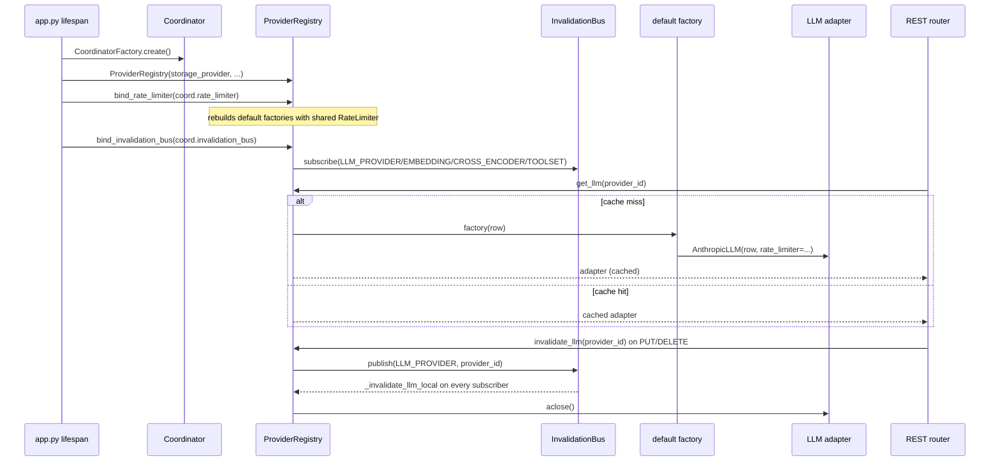

# Provider Pattern

## 1. Purpose

The provider pattern is how Primer talks to every external model family and tool source through a single, uniform shape. Each family is defined by an abstract base class (ABC) under `primer/int/`; each concrete integration is an *adapter* that subclasses the ABC and translates the universal interface onto one vendor SDK or wire protocol. A persisted `*Provider` row (Pydantic, discriminated by a provider-type enum) configures each adapter, and a per-row registry constructs, caches, and invalidates adapter instances on demand.

The same shape recurs across six independent families:

- LLMs (`primer.int.LLM`, adapters under `primer/llm/`).
- Embedders (`primer.int.Embedder`, adapters under `primer/embedder/`).
- Cross-encoder rerankers (`primer.int.CrossEncoder`, adapters under `primer/cross_encoder/`).
- Toolset providers (`primer.int.ToolsetProvider`, adapters under `primer/toolset/`).
- Vector stores / semantic-search providers (`VectorStoreProvider`, adapters under `primer/vector/`).
- Web-search backends (`primer.web_search.WebSearchAdapter`, adapters under `primer/web_search/`).
- Channel adapters (`primer.channel.adapter.ChannelAdapter`, adapters under `primer/channel/`).

This document describes the cross-cutting pattern that all of these share: the ABC surface, how to add a new implementation, the lifecycle contract (`aclose`), how concurrency is mediated through the Coordinator's `RateLimiter`, how configs are disambiguated, and how the registries wire adapters to their REST consumers. Per-family detail (per-event mapping tables, OAuth, the Lance catalogue, the web-search fallback chain) lives in the subsystem docs and the originating specs; this doc is the shared spine.

## 2. Visual overview

Each family is one ABC plus N adapters constructed from a discriminated config. The class diagram below shows the seven ABCs that follow the pattern and their current concrete implementations.

```mermaid
classDiagram
    class LLM {
        <<abstract>>
        +list_models() Iterable~str~
        +stream(...) AsyncIterator~StreamEvent~
        +count_tokens(...) int
        +aclose() None
    }
    class Embedder {
        <<abstract>>
        +list_models() Iterable~str~
        +embed(...) EmbedResponse
        +aclose() None
    }
    class CrossEncoder {
        <<abstract>>
        +list_models() Iterable~str~
        +score(...) list~float~
        +aclose() None
    }
    class ToolsetProvider {
        <<abstract>>
        +list_tools(...) AsyncIterator~Tool~
        +call(...) ToolCallResult
        +is_yielding(name) bool
        +requires_session(name) bool
        +aclose() None
    }
    class VectorStoreProvider {
        <<abstract>>
        +initialize() None
        +get_vector_store() VectorStore
        +aclose() None
    }
    class WebSearchAdapter {
        <<abstract>>
        +search(...) list~SearchHit~
        +aclose() None
    }
    class ChannelAdapter {
        <<abstract>>
        +initialize() None
        +verify() None
        +post_prompt(env) dict
        +aclose() None
    }

    LLM <|-- OpenResponsesLLM
    LLM <|-- OpenChatLLM
    LLM <|-- OpenRouterLLM
    LLM <|-- AnthropicLLM
    LLM <|-- GeminiLLM
    LLM <|-- OllamaLLM
    Embedder <|-- OpenAIEmbedder
    Embedder <|-- GeminiEmbedder
    Embedder <|-- HuggingFaceEmbedder
    CrossEncoder <|-- HuggingFaceCrossEncoder
    ToolsetProvider <|-- InternalToolsetProvider
    ToolsetProvider <|-- McpToolsetProvider
    VectorStoreProvider <|-- PgVectorStoreProvider
    VectorStoreProvider <|-- PgVectorScaleStoreProvider
    VectorStoreProvider <|-- LanceVectorStoreProvider
    WebSearchAdapter <|-- DuckDuckGoAdapter
    WebSearchAdapter <|-- TavilyAdapter
    WebSearchAdapter <|-- FirecrawlAdapter
    WebSearchAdapter <|-- ExaAdapter
    ChannelAdapter <|-- SlackChannelAdapter
    ChannelAdapter <|-- TelegramChannelAdapter
    ChannelAdapter <|-- DiscordChannelAdapter
```

## 3. Public surface

The ABCs live under `primer/int/` (plus `primer/web_search/adapter.py` and `primer/channel/adapter.py`). They share four conventions:

- **Bind at construction, select per call.** An adapter is bound to exactly one configured provider at `__init__` and may serve several models; the `model` argument on each method picks which one. `LLM.stream`, `Embedder.embed`, and `CrossEncoder.score` all take `model` per call and validate it against the declared list.
- **One typed result, one typed error vocabulary.** Methods return a Pydantic / dataclass result (`StreamEvent`, `EmbedResponse`, `ToolCallResult`, `SearchHit`, `PromptEnvelope`) and raise subclasses of `primer.model.except_.PrimerError`. Adapters wrap vendor SDK exceptions into `PrimerError` subclasses at the SDK boundary; see section 5.
- **`list_models()` is declarative.** For LLM / Embedder / CrossEncoder it returns the names from `provider.models`; no adapter queries upstream for its model list.
- **`aclose()` is a default-no-op lifecycle hook.** Defined on every ABC; idempotent; adapters that hold an HTTP pool, websocket, or subprocess override it. The registries call it on invalidation and shutdown.

Key abstract methods by family:

- `LLM` (`primer/int/llm.py`): `list_models`, `stream` (an async generator yielding `StreamEvent`; always emits exactly one terminal event, `Done` on success or `Error(fatal=True)` on failure), `count_tokens` (a hot-path best-effort token estimate used by compaction), and `aclose`.
- `Embedder` (`primer/int/embedder.py`): `list_models`, `embed` (one vector per input in input order; rejects unsupported `EmbeddingPart` types with a typed error rather than dropping them), and `aclose`.
- `CrossEncoder` (`primer/int/cross_encoder.py`): `list_models`, `score` (one relevance score per document, in input order; empty input means no model call), and `aclose`.
- `ToolsetProvider` (`primer/int/toolset.py`): `list_tools` (async generator of `Tool` descriptors), `call` (returns `ToolCallResult`), plus two non-abstract hooks `is_yielding` and `requires_session` the MCP server endpoint uses to filter exposable tools, and `aclose`. Both abstract methods accept an optional `principal: str | None`; `call` also accepts an optional `ctx: ToolContext`.
- `WebSearchAdapter` (`primer/web_search/adapter.py`): `search` (returns `list[SearchHit]`) and `aclose`. The two named exceptions `WebSearchUnavailable` (transient / quota; logged at INFO) and `WebSearchProviderError` (misconfiguration; logged at WARN) are the only signals the registry and service treat specially; any other exception class propagates so programmer bugs are not swallowed.
- `ChannelAdapter` (`primer/channel/adapter.py`): `initialize`, `verify` (credential smoke test), `post_prompt` (renders and posts a `PromptEnvelope`), and `aclose`. All four are abstract here because a channel adapter always holds a live connection.
- `VectorStoreProvider` (`primer/int/vector_store_provider.py`): `initialize`, `get_vector_store`, `aclose`; constructed by `VectorStoreProviderFactory.create` in `primer/vector/factory.py`.

The `extended: dict[str, Any]` escape hatch on `LLM.stream` (and `ExtendedEmbeddingConfig` on `Embedder.embed`) carries provider-specific knobs that do not map cleanly across vendors (`seed`, `top_k`, `reasoning_effort`, `thinking_budget`, ...). Adapters silently ignore unknown keys.

## 4. How to add a new implementation

The steps are the same across families. Using an LLM adapter as the worked example:

1. **Add the provider-type enum value and config class** in `primer/model/provider.py`. Add a member to the relevant `*ProviderType` enum (e.g. `LLMProviderType.OPENROUTER`) and a Pydantic `*Config` class carrying the adapter-init-only fields (credentials, base URL, flavor). Put the field on the config, not the adapter constructor. Secrets are `SecretStr` so list / get responses redact them while the storage round-trip preserves plaintext.
2. **Disambiguate the discriminated config union.** If the new config shares a shape with a sibling (the OpenResponses / OpenChat overlap is the canonical case), the `LLMProvider._coerce_config_to_provider` `model_validator` pre-parses the config dict against the concrete class matching `provider` before validating, so first-match-wins union parsing cannot coerce the wrong arm. If a config has no distinguishing field at all (the OpenRouter case, where the only required field is `api_key`), set `model_config = ConfigDict(extra="forbid")` so a mis-shaped dict is rejected up front rather than silently coerced. These two mechanisms are the same union-disambiguation problem at two layers.
3. **Write the adapter** under `primer/llm/` subclassing `LLM`. The constructor takes the provider config plus keyword-only `rate_limiter` and `trace_llm_io`. It validates that `provider.provider` matches the adapter type and that `provider.config` is the matching subclass (raising `ConfigError` on a mismatch), stores the provider, and lazily constructs the SDK client on first use via a private `_get_client()`. Hold `self._rate_limit_key = f"llm:{provider.id}"` and `self._max_concurrency = provider.limits.max_concurrency`; wrap the in-flight critical section in `async with await self._rate_limiter.acquire(key, max_concurrency=...)`. When no `rate_limiter` is injected, fall back to `InMemoryRateLimiter` so unit-test construction stays dependency-free. Implement `aclose()` to close the SDK client idempotently.
4. **Translate at the boundary and classify exceptions.** Convert universal `Message` / `Tool` / `response_format` / sampling params to the SDK wire format, reject unsupported `Part` types with `UnsupportedContentError` before opening the stream, then call the matching shared classifier (`primer/common/<sdk>_errors.py`) on every SDK exception so vendor errors become `PrimerError` subclasses. Pre-stream failures raise; mid-stream failures yield a terminal `Error(fatal=True)` and return.
5. **Register the factory branch** in `primer/api/registries/provider_registry.py` (a new `case` in `_build_default_llm_factory`). Web-search and vector-store factories follow the same lazy-import branch shape in their own factory functions.
6. **Add tests.** A `tests/llm/<provider>.py` unit suite driving mocked SDK clients, an entry in `tests/llm/test_adapters_no_local_semaphore.py` coverage (it pins that no adapter holds a local `asyncio.Semaphore`), and a gated `tests/integration/test_<provider>_smoke.py` behind the relevant API-key env var. Per the project memory, smoke-test the change with `uv run primer api` and never inline secrets in tests.

Embedder, CrossEncoder, ToolsetProvider, WebSearchAdapter, and VectorStoreProvider follow the identical recipe in their own packages; the only differences are the abstract method set and which factory function gains the new branch.

## 5. Existing implementations

LLM adapters (`primer/llm/`, re-exported from `primer.llm`):

- `OpenResponsesLLM` (`openresponses.py`) talks the OpenAI Responses API; `count_tokens` uses tiktoken via `primer/llm/_tokenizer/openai.py`.
- `OpenChatLLM` (`openchat.py`) covers the generic legacy `/v1/chat/completions` surface that OpenAI-compatible third parties (LM Studio, vLLM, Ollama shim, Together, Fireworks) actually support; flavor-discriminated.
- `OpenRouterLLM` (`openrouter.py`) is a thin OpenRouter specialisation adding `HTTP-Referer` / `X-Title` attribution headers. Importable but not in `__all__`.
- `AnthropicLLM` (`anthropic.py`) wraps `AsyncAnthropic`.
- `GeminiLLM` (`gemini.py`) and `OllamaLLM` (`ollama.py`).

The three OpenAI-family adapters share `primer/llm/_openai_common.py` (sampling-param builder) and `primer/llm/_openai_compat.py` (Chat Completions streaming compat). `count_tokens` is backed by per-provider tokenizers under `primer/llm/_tokenizer/` (anthropic, gemini, hf, openai, char_fallback); `_trace.py` holds the `trace_llm_io` debug-dump helper.

Embedder adapters (`primer/embedder/`): `OpenAIEmbedder` (flavor-routed OpenAI / LM Studio / OTHER), `GeminiEmbedder`, `HuggingFaceEmbedder`. A per-embedder task-prefix table lives at `primer/embedder/_prompts.py`.

Cross-encoder adapters (`primer/cross_encoder/`): `HuggingFaceCrossEncoder`, a third model family that landed after the shared-architecture spec and is held to the same no-local-semaphore invariant.

Toolset providers (`primer/toolset/`): `InternalToolsetProvider` (over a static registry; introspects each handler for `ctx` injection, and reads each tool's explicit `yields` / `requires_session` flags — declared at the `make_tool` call site — to answer `is_yielding` / `requires_session`) and `McpToolsetProvider` (long-lived stdio `ClientSession` under an `asyncio.Lock`, fresh `streamablehttp_client` per HTTP call, optional `PrimerOAuthHandler` preflight, `allowed_stdio_commands` allowlist enforcement, and the MCP 2025-11-25 tools/tasks extension). The MCP OAuth subsystem lives under `primer/toolset/oauth/`; see `docs/dev/subsystems/model-providers.md`.

Vector-store providers (`primer/vector/`): `PgVectorStoreProvider`, `PgVectorScaleStoreProvider`, `LanceVectorStoreProvider`. Constructed via `VectorStoreProviderFactory.create`.

Web-search adapters (`primer/web_search/`): `DuckDuckGoAdapter` (full safe-search vocabulary), `TavilyAdapter` (boolean safe-search collapse), `FirecrawlAdapter` and `ExaAdapter` (no safe-search support). See `docs/dev/subsystems/web-search.md`.

Channel adapters (`primer/channel/{slack,telegram,discord}/`): functional Slack, Telegram, and Discord adapters plus `NullChannelAdapter` for tests. See `docs/dev/subsystems/channels.md`.

## 6. Wiring

Adapters never construct themselves on the consumer path. A per-row registry sits between the persisted provider rows and the consumers (REST routers, the agent loop, the worker pool). Three registries follow the pattern:

- `ProviderRegistry` (`primer/api/registries/provider_registry.py`) caches LLM / Embedder / CrossEncoder / Toolset adapters keyed by row id under one `asyncio.Lock`; default factories dispatch on the provider-type enum.
- `SemanticSearchRegistry` and `WebSearchRegistry` each cache one provider instance per row id, running the storage lookup and factory call outside the lock so concurrent gets for different ids do not serialise; on a same-id race the loser is `aclose()`'d.

The registry contract is uniform: lazy `get_*` constructs on miss and caches; `invalidate_*` drops the cached entry after `aclose()`; `aclose()` closes every cached adapter. There are more than two indirections between an adapter and its consumer (lifespan to registry to bus to factory to adapter), so the sequence below shows the full wiring for the `ProviderRegistry` case.

Two wiring seams are worth calling out. First, **concurrency is global, not per-process.** Every LLM / embedder / cross-encoder adapter takes a `rate_limiter: RateLimiter` constructor kwarg and routes each in-flight request through `async with await self._rate_limiter.acquire(key, max_concurrency=...)` keyed on `f"llm:{provider.id}"` (or `embed:` / `cross_encoder:`). `ProviderRegistry.bind_rate_limiter` threads the Coordinator's shared `RateLimiter` into the factories so per-provider budgets hold across processes; `AnthropicLLM` is the representative shape. `tests/llm/test_adapters_no_local_semaphore.py` is the active source-level pin that no adapter reintroduces a local `asyncio.Semaphore`. Second, **invalidation routes through the bus when bound:** `invalidate_*` publishes on the matching `InvalidationTopic` so every API and worker process evicts its local cache; when no bus is bound (single-process tests) it evicts locally.

## 7. Testing patterns

- **Unit tests drive mocked SDK clients.** `tests/llm/<provider>.py` and `tests/embedder/<provider>.py` inject `AsyncMock` SDK clients (`AsyncOpenAI`, `AsyncAnthropic`, google-genai, httpx) so the translation and exception-classification logic is exercised without network. The same shape covers `tests/toolset/`, `tests/channel/`, `tests/web_search/`, and `tests/vector/`.
- **The no-local-semaphore pin.** `tests/llm/test_adapters_no_local_semaphore.py` is a source-level assertion that every LLM, embedder, and cross-encoder adapter routes concurrency through the injected `RateLimiter` and holds no `asyncio.Semaphore`; it is the durable record that the original per-adapter-semaphore design was superseded.
- **Exception classifiers are tested in one place.** Because the classifiers are shared (`primer/common/<sdk>_errors.py`), the mapping rules are pinned once in `tests/test_openai_errors.py`, `tests/test_anthropic_errors.py`, `tests/test_google_errors.py`, etc., instead of per adapter.
- **Config disambiguation is tested at the model layer.** `tests/model/` covers the discriminated-union validators (the channel before-hook, the LLM `_coerce_config_to_provider` validator, OpenRouter's `extra="forbid"`).
- **Registry behaviour is tested directly.** `tests/api/test_provider_registry.py` and `test_provider_registry_invalidation.py`, plus `tests/api/test_channel_registry.py` and the web-search / semantic-search registry suites, cover the get / invalidate / aclose triad and the same-id race.
- **Integration smoke tests are gated.** `tests/integration/test_<provider>_smoke.py` runs only when the relevant API-key env var is set or a TCP probe succeeds (LM Studio at `127.0.0.1:8080`); keys are read from the environment, never inlined.
- **Optional dependencies surface at the right place.** Backend-specific tests use `pytest.importorskip` (e.g. `tests/vector/test_lance.py` skips when `lancedb` is absent) and adapter factories use lazy imports so unused vendor SDKs stay out of the import graph.
- **Distributed-mode scenarios.** `tests/distributed/scenarios/test_invalidation_bus.py` and `test_rate_limit.py` verify cross-process cache eviction and the global concurrency cap across two API processes.
- **Coverage gate.** `pyproject.toml` carries `pytest-cov` with `[tool.coverage.report] fail_under = 90`.

## 8. Historical decisions

- **Adapter concurrency moved from a per-adapter `asyncio.Semaphore` to a shared `RateLimiter` ABC keyed by `llm:{provider.id}`.** Why: a local semaphore only caps in-flight requests inside one process, so two API or worker processes against the same provider would double the upstream load; `tests/llm/test_adapters_no_local_semaphore.py` pins the post-spec design. Spec: docs/superpowers/specs/2026-05-27-coordinator-design.md.
- **Exception classification was hoisted into per-SDK shared classifiers in `primer/common/<sdk>_errors.py` instead of inline per adapter.** Why: every adapter wrapping the same SDK needs identical mapping rules, so centralising them made the rules testable in one place and removed drift. Spec: docs/superpowers/specs/2026-04-26-provider-adapters-shared-arch-design.md.
- **The root exception was named `PrimerError` and the module `except_.py`.** Why: `except` is a Python keyword so a module named `except.py` cannot be imported, and the importable namespace settled on `primer` rather than `matrix`. Spec: docs/superpowers/specs/2026-04-26-provider-adapters-shared-arch-design.md.
- **`OpenChatLLM` and `OpenRouterLLM` were added as separate adapters alongside the four spec adapters.** Why: the legacy `/v1/chat/completions` surface is what every OpenAI-compatible third party actually supports, and keeping flavour discrimination at the wire-protocol level avoided proliferating provider-enum variants. Spec: docs/superpowers/specs/2026-04-26-provider-adapters-shared-arch-design.md.
- **`count_tokens(model, messages, tools)` became a mandatory abstract method on `LLM`, backed by per-provider tokenizers under `primer/llm/_tokenizer/`.** Why: `primer.agent.compaction_mixin.should_compact` needs a fast best-effort token count on the hot path, which is far too expensive to get through the streaming surface. Spec: docs/superpowers/specs/2026-04-26-provider-adapters-shared-arch-design.md.
- **`aclose()` was added as a lifecycle hook on every provider ABC.** Why: the registries cache adapter instances per row id and must drop and rebuild them when the underlying row is invalidated, and without `aclose()` the cached adapter's httpx pool would leak on every invalidation. Spec: docs/superpowers/specs/2026-05-08-rest-api-foundation-design.md.
- **`OpenRouterConfig` uses `ConfigDict(extra="forbid")` while sibling configs do not.** Why: OpenRouter's only required field is `api_key` with no url / flavor distinguisher, so the discriminated union could not tell an OpenRouter-shaped dict from a mis-shaped sibling by field presence alone. Spec: docs/superpowers/specs/2026-04-26-provider-adapters-shared-arch-design.md.
- **`LLMProvider` gained a `_coerce_config_to_provider` model_validator that pre-parses config against the concrete class matching `provider`.** Why: `OpenResponsesConfig` and `OpenChatConfig` share a shape and overlapping flavor values, so default first-match-wins union behaviour would silently coerce an openchat config into `OpenResponsesConfig`. Spec: docs/superpowers/specs/2026-04-26-provider-adapters-shared-arch-design.md.
- **Vector-store and web-search registries are per-row caches rather than a single-active registry.** Why: operators run multiple backends side by side (lance and pgvector per collection; a DuckDuckGo plus a fallback chain), so a single-active row did not match how providers are actually managed. Spec: docs/superpowers/specs/2026-05-08-rest-api-foundation-design.md.
- **MCP OAuth consent is hand-off-driven, never browser-driven: the library raises `AuthRequiredError(auth_url, state)` and the caller's UI feeds `(code, state)` back into `complete_oauth`.** Why: Primer is a library running in headless services and TUIs, so hosting a browser or callback server inside it would force every embedder to play along; the exception-and-callback shape keeps the library transport-agnostic. Spec: docs/superpowers/specs/2026-04-26-toolset-provider-oauth-design.md.
- **`AuthRequiredError` is a distinct `PrimerError` subclass from `AuthenticationError`.** Why: one signals consent is needed (an actionable handoff to 401 + `auth_url`); the other signals the server rejected credentials we already tried, and conflating them would force callers to inspect message text to decide whether to redirect. Spec: docs/superpowers/specs/2026-04-26-toolset-provider-oauth-design.md.
- **Web-search promotion to a `WebSearchAdapter` ABC made the previous structural-protocol backend a first-class provider peer of `primer.llm` and `primer.embedder`.** Why: it lets the per-row registry pattern compose uniformly, so web search gets its own registry, reserved-id bootstrap, and console page like every other provider family. Spec: docs/superpowers/specs/2026-06-03-web-search-providers-design.md.
- **The channels core kept its own `ChannelAdapter` ABC with an import-time factory registry rather than folding into the provider registry.** Why: each per-platform package self-registers on import so the core can land independently of any one platform, and `build_adapter` fails loudly with `ConfigError` at CRUD time when a row names an uninstalled provider. Spec: docs/superpowers/specs/2026-05-24-channels-core-design.md.
- **`LanceVectorStoreProvider` shares only `VectorStoreProvider` / `VectorStore` with the pgvector backends, with no intermediate base.** Why: sharing more would couple Postgres lifecycle (psycopg pools, schema search_path) to the embedded backend; the single ABC kept downstream consumers unchanged. Spec: docs/superpowers/specs/2026-05-25-lance-ssp-design.md.
