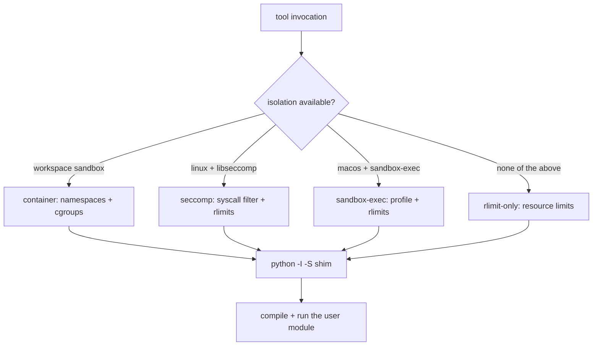

# Python tool isolation

## 1. Purpose

A python tool runs code an operator, or an agent, supplied. This page states
what each deployment actually enforces, and what it does not.

The honesty is the point. Every level below is a real, different guarantee,
and the weakest of them is one most deployments will land on. A single
"sandboxed" badge over all four would be a lie in three of them.

## 2. Visual overview

The level is computed at startup, reported on
`GET /v1/toolsets/{id}/runtime`, and shown in the console.

| Level | Enforced by | Where |
| --- | --- | --- |
| `container` | namespaces and cgroups, via the workspace `Sandbox` | container / k8s backends |
| `seccomp` | syscall filter via libseccomp, plus rlimits | Linux with libseccomp |
| `sandbox-exec` | macOS sandbox profile, plus rlimits | macOS with sandbox-exec |
| `rlimit-only` | resource limits only | anywhere else |

## 3. Public surface

`GET /v1/toolsets/{id}/runtime` reports the level this deployment resolved,
and the console renders it by name. A caller deciding whether to trust a
python toolset reads that field; there is no other supported way to ask.

## 4. How to add a new implementation

A new level is a new enforcement mechanism plus its detection. Detect it at
startup, name it in the table above, and report the name through the runtime
endpoint. Two rules bind any new level: it must sit ABOVE `rlimit-only` in
what it actually enforces (otherwise it is `rlimit-only` under another name),
and it must keep every guarantee in "What holds at every level" below, since
those are what the weakest level already promises.

## 5. Existing implementations

### What `rlimit-only` does NOT cover

It bounds CPU, memory, file size, descriptors and core dumps. It does **not**
stop a tool reading the filesystem, and it does **not** stop outbound network.
Treat a `rlimit-only` deployment as running the tool with the same filesystem
and network reach as the primer process itself.

The console labels this level explicitly rather than showing a generic
"sandboxed" badge, because that badge would be untrue here.

### What holds at every level

Primer's own packages are never importable from a tool. The local runner
executes `python -I -S` with no `PYTHONPATH`, so `sys.path` carries the
standard library and nothing else. This matters more than the resource limits:
a tool that could `import primer.storage` would reach the database with
ambient credentials, and no rlimit or syscall filter touches that.

Resource limits are set by the shim itself, before it compiles the user
module, with soft equal to hard. A soft-only limit is decorative, because the
tool could raise it straight back to the hard value.

## 6. Wiring

### Notes on the syscall filter

It is driven through `ctypes` against the system libseccomp rather than a
Python seccomp package. It has to be: the shim runs under `-I -S`, so no
site-package is importable there, and a pip dependency would never load.

The filter is default-allow with a deny list. A default-deny filter would have
to enumerate everything CPython touches to start, and one omission is a crash
rather than a contained tool.

`socket()` and `socketpair()` are deliberately allowed even when network is
denied. They create a descriptor and move no data, and asyncio builds its
event-loop self-pipe from one, so denying them breaks every async tool while
adding no safety. `connect`, `bind`, `listen`, `accept`, `sendto` and `sendmsg`
are denied instead.

## 7. Testing patterns

The level-detection logic is unit-tested per platform branch; the enforcement
itself is not, because asserting that a syscall is blocked requires the
platform that blocks it. What CI can assert, and does, is the invariant that
holds everywhere: a tool cannot import primer's own packages.

## 8. Historical decisions

- **`RLIMIT_NPROC` is not used.** Why: it caps processes per real UID rather
  than per process tree, so a value low enough to stop forking would be
  tripped by unrelated primer processes under the same UID. Forking is denied
  by the syscall filter and by container process limits instead.
- **The syscall filter is default-allow, not default-deny.** Why: a
  default-deny filter must enumerate everything CPython touches to start, and
  a single omission is a crash rather than a contained tool.
- **The level is reported rather than assumed.** Why: three of the four levels
  enforce materially less than "sandboxed" implies, and an operator choosing
  to run agent-supplied code deserves to know which one they have.
