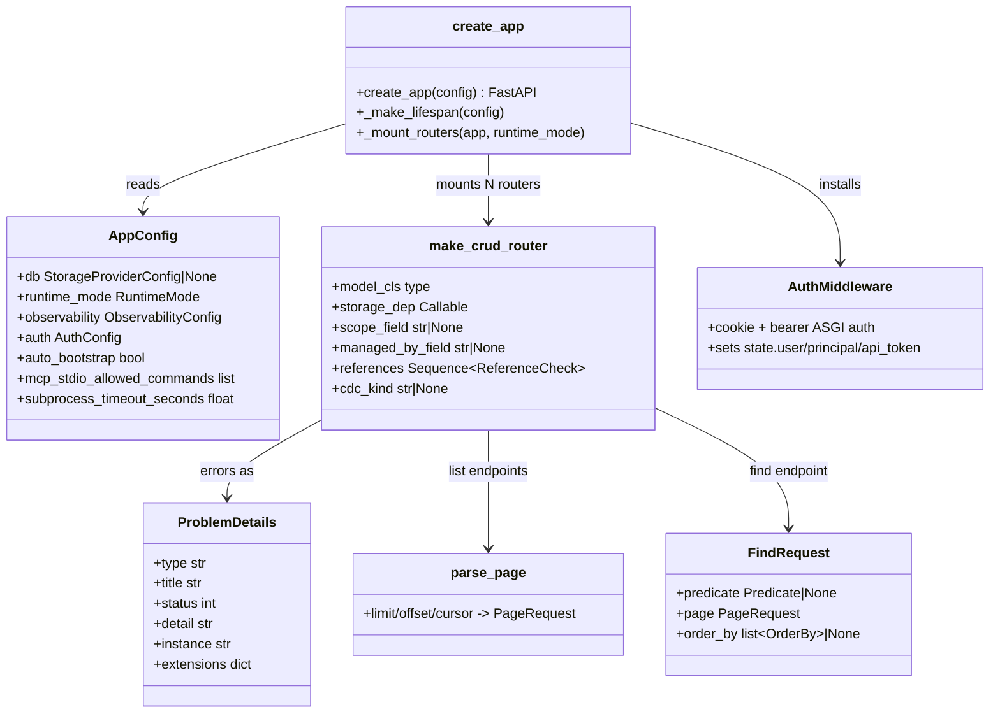
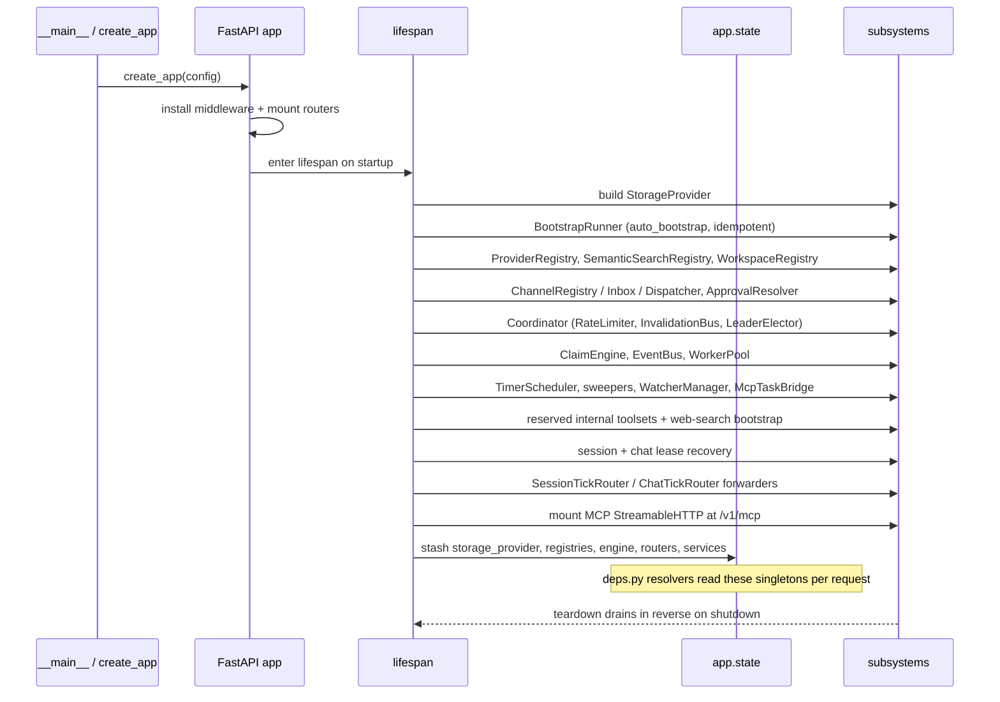

# REST API

## 1. Purpose

The REST API is the single HTTP surface in front of every Primer subsystem. It is a FastAPI application under `primer/api/` whose `create_app(config: AppConfig) -> FastAPI` factory installs the middleware stack, mounts every router under a `/v1` prefix, serves the operator console at `/console/`, exposes an inbound MCP server at `/v1/mcp`, and wires an `async` lifespan handler that stands up the whole runtime (storage, registries, claim engine, worker pool, background tasks, MCP mount) before the first request.

The doc describes the foundation that all routers share: the app factory and middleware order, the RFC 7807 error envelope, the pagination and predicate translators, the `make_crud_router` factory that most entity routers are built from, the cookie-plus-bearer authentication model, and the lifespan seam where everything is wired together. It does not re-document each subsystem's domain logic; per-subsystem detail lives in the subsystem docs and the originating specs. The single seam where sessions, chats, workspaces, channels, triggers, the worker system, observability, and auto-bootstrap all connect is the lifespan handler in `primer/api/app.py`, so this doc cross-links to `architecture/worker-system.md`, `architecture/observability.md`, `architecture/auto-bootstrap.md`, and the model-providers subsystem doc rather than duplicating them.

Code: `primer/api/app.py`, `primer/api/config.py`, `primer/api/errors.py`, `primer/api/pagination.py`, `primer/api/deps.py`, `primer/api/version.py`, `primer/api/__main__.py`, `primer/api/routers/`, `primer/api/registries/`, `primer/api/middleware/auth.py`.

## 2. Visual overview

The API is a request-flow surface: a request crosses the middleware stack, is authenticated, routed, and either handled by a `make_crud_router` instance or a hand-written router, with errors normalised into RFC 7807 problem+json on the way out. The class diagram below shows the factory and the shared building blocks the routers compose from.

## 3. Public surface

The HTTP contract has a few cross-cutting shapes that every router shares, plus a versioned route prefix.

**Versioning.** `API_VERSION = "v1"` is the URL-prefix segment; every router mounts under `/v1/<resource>` (`primer/api/version.py`). `APP_VERSION = "0.1.0"` is the semver surfaced in OpenAPI `info.version` and the `GET /v1/health` payload. Swagger (`/v1/docs`), ReDoc (`/v1/redoc`), and the OpenAPI JSON (`/v1/openapi.json`) are mounted unconditionally; an earlier plan to gate them behind a log level was reversed as security theatre (section 8).

**Errors (RFC 7807).** Every error is `application/problem+json` with a single `ProblemDetails` model (`type`, `title`, `status`, `detail`, `instance`, `extensions`), defined in `primer/model/problem_details.py` and re-exported from `primer/api/errors.py`. `_PRIMER_ERROR_MAP` maps each `PrimerError` subclass to a stable relative type URI and status, most-specific first: `BadRequestError` (400), `AuthenticationError` / `AuthRequiredError` (401), `ModelNotFoundError` / `NotFoundError` (404), `ConflictError` (409), `ValidationError` / `UnsupportedContentError` (422), `RateLimitError` (429), `ServerError` (502 provider-server-error), `ProviderError` (502), `NetworkError` (504), `ConfigError` (503 service-unavailable), and `PrimerError` (500 internal). `RequestValidationError` becomes a 422 `validation-error` with the field error list under `extensions.errors`. The request id from `request.state.request_id` is threaded into `extensions.request_id` on every 4xx/5xx envelope. `common_responses(*codes)` returns a FastAPI `responses=` map so routers declare their error responses uniformly in OpenAPI; contributors should reach for it rather than rolling their own per-route map.

**Pagination + predicates** (`primer/api/pagination.py`). The translation layer is identity over the storage types. `parse_page` accepts `?limit` (default 20, clamped `ge=1, le=200`), `?offset`, and `?cursor`, rejecting offset-plus-cursor with a 400 `BadRequestError`. `parse_order_by` parses repeated `?order_by=field[:asc|desc]` entries. `FindRequest` is the JSON body for `POST /v1/<resource>/find`: `predicate` (a `Predicate` tree, `null` to match all), `page` (offset or cursor, discriminated by `kind`), and `order_by`.

**Authentication.** `AuthMiddleware` (`primer/api/middleware/auth.py`) is a pure-ASGI middleware that authenticates both HTTP and WebSocket scopes. It runs the signed `primer_session` cookie path first, then falls back to `Authorization: Bearer <token>` (a sha256 lookup against `ApiToken` storage that rejects missing/revoked/expired rows). On success it populates `request.state.user`, `request.state.principal`, and `request.state.api_token`. The `get_principal` dependency reads `request.state.principal`; `require_auth` raises 401 when no `User` is in scope; `require_auth_ws` is the WebSocket counterpart; `require_scope(scope)` is a dependency factory that enforces bearer-token scopes (cookie sessions bypass because `api_token` is `None`). See section 8 for why this replaced the spec's `X-Primer-Principal` passthrough.

**Route surface.** About two dozen router modules ship under `primer/api/routers/`: `health`, `workers`, `auth`, `api_tokens`, `providers` (llm / embedding / cross_encoder / toolset / builtin_toolsets), `tools`, `semantic_search`, `web_search`, `web_fetch`, `webhooks`, `compute` (agent / graph), `knowledge` (collection / document), `internal_collections`, `workspaces` (provider / template / workspace / sessions / files / log), `sessions`, `chats`, `yields`, `tool_approval`, `channels`, `harness`, `triggers`, `mcp_exposure`, `artifact_storage`, and the env-gated `_test_endpoints`, plus the shared helpers `_crud`, `_managed`, `_references`, `_cdc_hooks`. Notable non-CRUD shapes: the session WebSocket at `/v1/workspaces/{wid}/sessions/{sid}/ws?cursor=N`, the chat WebSocket at `/v1/chats/{id}/ws?cursor=N`, the per-session and per-chat turn-log routes (`/v1/sessions/{id}/turn_log`, `/v1/graphs/{gid}/runs/{rid}/turn_log`), the ask_user / tool-approval pending+respond endpoints, the harness `build`/`push` and trigger `fire_now` operation endpoints, and the inbound MCP mount at `/v1/mcp`. A handful of UI-driven endpoints were deferred with recorded shapes (section 8): `GET /v1/health/recent_errors`, out-of-session tool invoke, multipart file upload, and SSE session/worker streams.

## 4. How to add a new implementation

Most persisted entities get a router from `make_crud_router` (`primer/api/routers/_crud.py`) rather than hand-written handlers. To add a new entity surface:

1. Define the persisted Pydantic model (an `Identifiable` subclass) and a per-model `Storage[T]` dependency in `primer/api/deps.py` (one of the `get_<model>_storage` helpers).
2. Call `make_crud_router(model_cls=..., storage_dep=..., plural="...", tag="...")`. This yields the six standard shapes: `POST /v1/<plural>` (201), `GET /v1/<plural>/{id}` (404 on miss), `PUT /v1/<plural>/{id}` (body id must match path id), `DELETE /v1/<plural>/{id}`, `GET /v1/<plural>` (paginated list), and `POST /v1/<plural>/find` (predicate body).
3. Opt into the factory's declarative extensions instead of hand-wiring hooks:
   - `scope_field` + `parent_path_segment` mount a scoped variant at `/v1/{parent}/{parent_id}/{plural}` that pins the scope field from the path (used by channel associations under `/v1/workspaces/{wid}/channel_associations`). The two params must be set together.
   - `managed_by_field` auto-wires three guards: 422 on CREATE if the body sets the field, 409 on UPDATE/DELETE if the existing row is owned (used by harness-managed Agent / Graph / Collection / Document / Toolset rows via `managed_by_field="harness_id"`).
   - `references=[ReferenceCheck(...)]` (`primer/api/routers/_references.py`) builds a pre-delete hook that returns 409 `{error, child_kind, count}` when a delete would orphan children.
   - `cdc_kind` registers the kind in the central `_CDC_KINDS` registry (`primer/api/routers/_cdc_hooks.py`) and auto-wires the CDC create/update/delete hooks ahead of any user hooks.
4. For pre-write validation beyond the declarative knobs, supply the composable hooks: `on_pre_create`, `on_pre_update`, `on_pre_delete`, `on_pre_delete_id` (fires before the storage lookup, for reserved-id 403 guards regardless of storage state), and the post-mutate `on_create` / `on_update` / `on_delete` (used by provider routers to invalidate cached adapters). Auto-wired guards always run before user-supplied hooks, which is what makes a router's reference/managed/CDC enforcement structurally impossible to silently disable.
5. Mount the router in `_mount_routers` (`primer/api/app.py`) with `dependencies=[Depends(require_auth)]`. Declare error responses with `common_responses(...)` so OpenAPI shows the ProblemDetails schema per code.

For surfaces that are not plain CRUD (WebSocket streams, operation endpoints, predicate-heavy lists like `sessions`), hand-write the router and reuse the shared pieces (`parse_page`, `FindRequest`, `common_responses`, the `Q[ModelT]` type-safe predicate builder in `primer/storage/q.py`).

## 5. Existing implementations

The factory and the foundation are consumed by these representative routers (full list in section 3):

- **CRUD-factory routers**: providers (llm / embedding / cross_encoder / toolset), `compute` (agent / graph with `managed_by_field` + `cdc_kind`), `knowledge` (collection / document), `semantic_search`, `web_search`, `channels` (provider / channel; the old association entities were removed - a workspace's outbound binding is now the `reply_binding` field, set via the channel binding tools), `tool_approval` policies, `api_tokens`, and `mcp_exposure`. These declare reference checks and managed-by guards through the factory parameters rather than bespoke handlers.
- **Hand-written routers**: `health` (liveness plus inline scheduler/worker-pool metric snapshots), `sessions` (still hand-rolls workspace-scoped predicates and the WebSocket stream rather than `scope_field`), `chats` (REST plus the detached-turn WebSocket), `yields` and `tool_approval` (ask_user / approval pending+respond, cancel), `harness` (inbound fetch/install/sync plus outbound build/push), `triggers` (CRUD plus `fire_now` and subscriptions), `workers` (list plus drain), and the turn-log routes on `sessions` and `compute`.
- **Reserved-id guards**: provider routers compose reserved-id create/delete guards (`_make_reserved_create_guard` / `_make_reserved_delete_guard` with `on_pre_delete_id`) so the auto-bootstrap rows (`huggingface` embedder, `lance` SSP, `huggingface-ce` cross-encoder, `local` workspace provider) reject POST 409 / DELETE 403.

## 6. Wiring

`create_app` installs middleware and mounts routers in a fixed order; the lifespan handler then builds the runtime. The middleware order (outermost first) is: `_GZipExceptMcp` (gzip with a `/v1/mcp` bypass to preserve SSE chunking), security headers, the `/console/*`-scoped CSP, request-id, then `AuthMiddleware`. After middleware, `_mount_routers` includes the routers under `/v1` (gated behind `require_auth` except `health`, `workers`, and `auth/*`; in `RuntimeMode.WORKER` only those three groups mount), then the JSX bundle route, the `/console/` static mount, the Prometheus `/metrics` mount (when observability is enabled), the `GET / -> 307 /console/` redirect, and the RFC 7807 error handlers.

The lifespan handler (`_make_lifespan` in `primer/api/app.py`) is the single seam where the subsystems wire together. There are more than two indirections between the routers and the runtime they consume, so the sequence below shows the wiring.

Per-request, the `Depends` helpers in `primer/api/deps.py` read the singletons stashed on `app.state` (`get_storage_provider`, `get_provider_registry`, `get_semantic_search_registry`, `get_workspace_registry`, `get_scheduler`, `get_event_bus`, `get_worker_pool`, `get_approval_resolver`, `get_channel_*`, `get_claim_engine`, the internal-collections subsystem) plus the per-model `Storage[T]` helpers. `_assert_app_state_initialized` guards that `storage_provider` and `provider_registry` are present; resolvers for optional subsystems raise their own 503 or `ConfigError` when their state is absent. `AppConfig` (pydantic-settings, `env_prefix="PRIMER_"`, `env_nested_delimiter="__"`) drives all of this; nested knobs use the delimiter, e.g. `PRIMER_AUTH__COOKIE_NAME` and `PRIMER_OBSERVABILITY__OTLP_ENDPOINT`. The zero-config path (no env, no TOML, no init args) boots on embedded SQLite at `~/.primer/db/data.sqlite`; `PRIMER_CONFIG_PATH` points at a TOML file, and `settings_customise_sources` orders init args over env over TOML over `.env` over the secrets file.

## 7. Testing patterns

Router and foundation tests live under `tests/api/` (about 60 modules). `tests/api/conftest.py` supplies the shared fixtures: `create_test_app`, `fake_storage_provider`, `fake_provider_registry`, `fake_semantic_search_registry`, plus the `app` and `client` fixtures that every router test consumes. The foundation suite covers the factory and the cross-cutting pieces (`test_app_factory`, `test_config`, `test_errors`, `test_pagination`, `test_provider_registry` and `test_provider_registry_invalidation`, `test_semantic_search_registry`, `test_deps`, `test_health`); the CRUD-factory extensions have dedicated coverage under `tests/api/routers/` (`test_crud_scope_field`, `test_crud_managed_by_field`, `test_crud_references`, `test_crud_cdc_kind`, `test_cdc_registry`). Per-entity router suites cover every Phase 1-3 router and the follow-on surfaces (channels, chats, sessions, yields, tool-approval, harness, triggers, mcp_exposure, api_tokens, auth, bugs, turn-log routes). WebSocket resilience and cursor replay are exercised in `tests/api/test_chat_resilience.py`, `tests/api/test_session_ws.py`, and the tick-forwarder tests; the inbound MCP mount auth gate in `tests/api/test_mcp_mount.py`; the bearer-scope contract in `tests/api/test_require_scope.py` and `tests/api/middleware/test_auth_bearer.py`. Cross-process behaviour (invalidation bus, rate-limit cap, claim arbitration, WS streaming across instances) is covered by the two-process harness under `tests/distributed/`.

## 8. Historical decisions

- **FastAPI with a single `create_app(config) -> FastAPI` factory and an asyncio lifespan handler was the framework shape.** Why: it generates OpenAPI/Swagger out of the box and integrates cleanly with the existing `Storage[T]` / Embedder / ToolsetProvider ABCs. Spec: docs/superpowers/specs/2026-05-08-rest-api-foundation-design.md.
- **Errors are RFC 7807 problem+json with one `ProblemDetails` model and a stable relative type URI per `PrimerError` subclass.** Why: RFC 7807 is the standard machine-readable envelope and permits relative type URIs, making UI error handling deterministic without hosting an ontology. Spec: docs/superpowers/specs/2026-05-08-rest-api-foundation-design.md.
- **`ProblemDetails` was moved out of `primer/api/errors.py` into `primer/model/problem_details.py`.** Why: non-API surfaces (WebSocket envelopes, turn logs, CLI exits) reuse the same schema and a shared model module avoids a circular import from `primer/api/`. Spec: docs/superpowers/specs/2026-05-08-rest-api-foundation-design.md.
- **The bare-exception handler was registered against HTTP status 500 rather than the `Exception` class.** Why: Starlette's `ServerErrorMiddleware` lives outside `ExceptionMiddleware` and consults only the status-code registry, so a class registration would silently miss anything escaping a route handler. Spec: docs/superpowers/specs/2026-05-08-rest-api-foundation-design.md.
- **Find endpoints take a POST JSON body and the translation layer is identity over `Storage[T].find()`.** Why: predicate trees are too complex for query params, and keeping the API shape identical to the storage shape avoids drift. Spec: docs/superpowers/specs/2026-05-08-rest-api-foundation-design.md.
- **Zero-config boot is supported: `AppConfig()` with no env, no TOML, and no init args lands on embedded SQLite.** Why: a first-time single-developer install must work without provisioning, with auto-bootstrap and reserved-id providers covering the warm-disk path; operators opt into Postgres plus worker mode for production. Spec: docs/superpowers/specs/2026-05-08-rest-api-foundation-design.md.
- **The cookie-plus-bearer `AuthMiddleware` replaced the spec's "no auth in v1, `X-Primer-Principal` passthrough" plan.** Why: a single-user console plus an LLM-callable bearer surface (MCP exposure, automation) needed real auth; cookie sessions carry full authority and bearer tokens carry scoped authority, and `get_principal`'s contract stayed stable even though its source of truth changed. Spec: docs/superpowers/specs/2026-06-02-api-tokens-bearer-auth-design.md.
- **sha256 (not argon2) hashes API tokens, the cookie path runs before the bearer fallback, cookie sessions bypass scope checks, and bearer tokens cannot mint or manage tokens.** Why: 256-bit `secrets.token_urlsafe` plaintext is not brute-forceable from a stolen hash, the cheap cookie path covers the console hot path, cookie operators have implicit admin authority, and a compromised bearer must not grant itself new credentials. Spec: docs/superpowers/specs/2026-06-02-api-tokens-bearer-auth-design.md.
- **A per-row `SemanticSearchRegistry` keyed by `SemanticSearchProvider` id replaced the spec's single-active `VectorStoreRegistry`, and `SemanticSearchProvider` rows replaced `VectorStoreConfig` as the configuration shape.** Why: the single-active activation API had not stabilised when Phase 3 landed, and operators were managing lance and pgvector side by side, switching per collection. Spec: docs/superpowers/specs/2026-05-08-rest-api-foundation-design.md.
- **`make_crud_router` grew `scope_field`, `parent_path_segment`, `managed_by_field`, `references`, and `cdc_kind`, with auto-wired guards composed before user hooks.** Why: new entities (channels, harnesses, triggers) were hand-rolling the same guard wiring, and deterministic hook ordering makes the silent-disable bug structurally impossible once a router opts in. Spec: docs/superpowers/specs/2026-05-27-crud-factory-levelup-design.md.
- **The inbound MCP server mounts at `/v1/mcp` over Streamable HTTP with a `_GZipExceptMcp` bypass and a cookie-or-bearer auth gate that enforces the `mcp` scope.** Why: gzip buffering breaks the chunked SSE stream the StreamableHTTP transport needs, and a runtime catalogue built from operator-managed Toolset rows needs a per-request deps factory rather than FastMCP's static registry. Spec: docs/superpowers/specs/2026-06-02-mcp-server-endpoint-design.md.
- **`tools/call` resolves the scoped id through a routing map cached on `McpExposure.updated_at`.** `build_routing_map` (`primer/mcp/exposure.py`) inverts the catalogue's scoped ids back to `(toolset_id, bare_name)`; rebuilding it per call enumerated the whole tool catalogue. It is now memoized per storage provider, keyed on the `McpExposure` singleton's `updated_at` stamp - a hit skips re-enumeration, a miss (first call or a stamp change) rebuilds. Safe because a tool is only dispatchable once it is in `allowed_tools`, and the allowlist only changes through `update_exposure`, which bumps `updated_at`; so any change that could make a new scoped id routable also invalidates the cache (a toolset added without an exposure edit is not yet allowlisted, so its absence from a stale map never affects a real dispatch). The validation path passes `use_cache=False` to always see an in-flight catalogue.
- **Chat and session turns were detached from the WebSocket connection: the WS handler is a thin storage tailer over a per-process tick router, and the worker pool's unified `ClaimEngine` loop runs the turn.** Why: a WS-bound turn could not survive reconnects, multi-process hosts, or client disconnects; storage is the source of truth and the bus is advisory. Spec: docs/superpowers/specs/2026-05-27-chat-turn-detachment-design.md and docs/superpowers/specs/2026-05-27-workspace-session-streaming-design.md.
- **Several UI-driven endpoints were deferred with recorded request/response shapes rather than left undefined: recent-errors aggregate, out-of-session tool invoke, multipart file upload, and SSE streams for sessions and workers.** Why: each needs its own sub-project or duplicates an existing surface (multipart duplicates PUT-with-base64; per-worker sessions duplicates `?worker_id` on `/v1/sessions`), and none blocked the v1 console ship; the WebSocket session stream is the live alternative for sessions. Spec: docs/superpowers/specs/2026-05-16-ui-backend-deferred-endpoints.md.
- **The `/v1/health` probe surfaces scheduler and worker-pool snapshots inline rather than being a bare 200, with `metrics_snapshot` failures degrading to empty dicts.** Why: dashboards can scrape `/v1/health` without a separate exporter, and an instrumentation glitch must never turn the probe red. Spec: docs/superpowers/specs/2026-05-16-ui-health-design.md.
- **Swagger, ReDoc, and OpenAPI JSON mount unconditionally under `/v1` regardless of log level.** Why: the API surface is exposed regardless of log level, so hiding the doc surface is security theatre and the console's "View OpenAPI" affordance needs it. Spec: docs/superpowers/specs/2026-05-08-rest-api-foundation-design.md.
- **`X-Request-Id` is honoured on inbound requests that match the expected pattern, otherwise minted fresh, and always echoed and threaded into the error envelope's `extensions.request_id`.** Why: clients correlate logs end-to-end while untrusted callers cannot poison the id space, and the console's "Copy request id" link works on both success and failure. Spec: docs/superpowers/specs/2026-05-16-ui-backend-additions-design.md.
