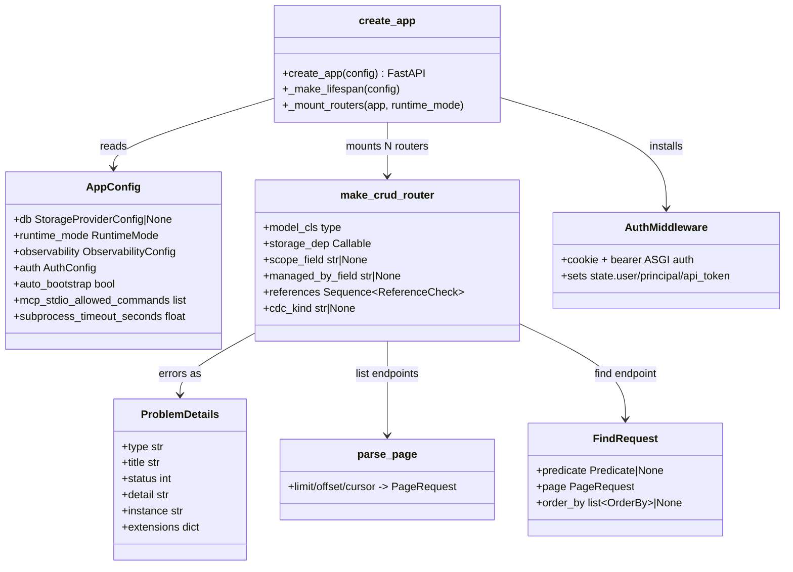
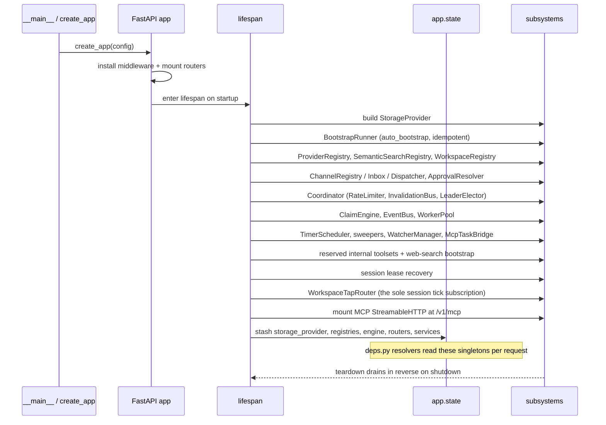

# REST API

## 1. Purpose

The REST API is the single HTTP surface in front of every Primer subsystem. It is a FastAPI application under `primer/api/` whose `create_app(config: AppConfig) -> FastAPI` factory installs the middleware stack, mounts every router under a `/v1` prefix, serves the operator console at `/console/`, exposes an inbound MCP server at `/v1/mcp`, and wires an `async` lifespan handler that stands up the whole runtime (storage, registries, claim engine, worker pool, background tasks, MCP mount) before the first request.

The doc describes the foundation that all routers share: the app factory and middleware order, the RFC 7807 error envelope, the pagination and predicate translators, the `make_crud_router` factory that most entity routers are built from, the cookie-plus-bearer authentication model, and the lifespan seam where everything is wired together. It does not re-document each subsystem's domain logic; per-subsystem detail lives in the subsystem docs and the originating specs. The single seam where sessions, workspaces, channels, triggers, the worker system, observability, and auto-bootstrap all connect is the lifespan handler in `primer/api/app.py`, so this doc cross-links to `architecture/worker-system.md`, `architecture/observability.md`, `architecture/auto-bootstrap.md`, and the model-providers subsystem doc rather than duplicating them.

Code: `primer/api/app.py`, `primer/api/config.py`, `primer/api/errors.py`, `primer/api/pagination.py`, `primer/api/deps.py`, `primer/api/version.py`, `primer/api/__main__.py`, `primer/api/routers/`, `primer/api/registries/`, `primer/api/middleware/auth.py`.

## 2. Visual overview

The API is a request-flow surface: a request crosses the middleware stack, is authenticated, routed, and either handled by a `make_crud_router` instance or a hand-written router, with errors normalised into RFC 7807 problem+json on the way out. The class diagram below shows the factory and the shared building blocks the routers compose from.

```mermaid
classDiagram
    class create_app {
        +create_app(config) FastAPI
        +_make_lifespan(config)
        +_mount_routers(app, runtime_mode)
    }
    class AppConfig {
        +db StorageProviderConfig|None
        +runtime_mode RuntimeMode
        +observability ObservabilityConfig
        +auth AuthConfig
        +auto_bootstrap bool
        +mcp_stdio_allowed_commands list
        +subprocess_timeout_seconds float
    }
    class make_crud_router {
        +model_cls type
        +storage_dep Callable
        +scope_field str|None
        +managed_by_field str|None
        +references Sequence~ReferenceCheck~
        +cdc_kind str|None
    }
    class AuthMiddleware {
        +cookie + bearer ASGI auth
        +sets state.user/principal/api_token
    }
    class ProblemDetails {
        +type str
        +title str
        +status int
        +detail str
        +instance str
        +extensions dict
    }
    class parse_page {
        +limit/offset/cursor -> PageRequest
    }
    class FindRequest {
        +predicate Predicate|None
        +page PageRequest
        +order_by list~OrderBy~|None
    }
    create_app --> AppConfig : reads
    create_app --> AuthMiddleware : installs
    create_app --> make_crud_router : mounts N routers
    make_crud_router --> ProblemDetails : errors as
    make_crud_router --> parse_page : list endpoints
    make_crud_router --> FindRequest : find endpoint
```

## 3. Public surface

The HTTP contract has a few cross-cutting shapes that every router shares, plus a versioned route prefix.

**Versioning.** `API_VERSION = "v1"` is the URL-prefix segment; every router mounts under `/v1/<resource>` (`primer/api/version.py`). `APP_VERSION = "0.1.0"` is the semver surfaced in OpenAPI `info.version` and the `GET /v1/health` payload. Swagger (`/v1/docs`), ReDoc (`/v1/redoc`), and the OpenAPI JSON (`/v1/openapi.json`) are mounted unconditionally; an earlier plan to gate them behind a log level was reversed as security theatre (section 8).

**Errors (RFC 7807).** Every error is `application/problem+json` with a single `ProblemDetails` model (`type`, `title`, `status`, `detail`, `instance`, `extensions`), defined in `primer/model/problem_details.py` and re-exported from `primer/api/errors.py`. `_PRIMER_ERROR_MAP` maps each `PrimerError` subclass to a stable relative type URI and status, most-specific first: `BadRequestError` (400), `AuthenticationError` / `AuthRequiredError` (401), `ModelNotFoundError` / `NotFoundError` (404), `ConflictError` (409), `ValidationError` / `UnsupportedContentError` (422), `RateLimitError` (429), `ServerError` (502 provider-server-error), `ProviderError` (502), `NetworkError` (504), `WorkspaceUnreachableError` (503 workspace-unreachable: a session's workspace exists but its runtime does not answer a read of the session's files; the messages, turn-log, turn-timeline and graph turn-log routes raise it for a read that fails in the transport or the OS (`OSError` including connection and permission errors, `TimeoutError`, the runtime client's own errors and aiohttp's), a log that was never written is still an empty 200, a domain error the workspace raised keeps its own status, and any other exception is a bug and stays a 500; an outage is logged once per workspace with its traceback until a read succeeds again, then as one short line per read), `ConfigError` (503 service-unavailable), and `PrimerError` (500 internal). `RequestValidationError` becomes a 422 `validation-error` with the field error list under `extensions.errors`. Raw `HTTPException`s (Starlette's and FastAPI's, including every `require_auth` / `require_user` / `require_admin` / `require_scope` rejection and 404-for-unknown-route) render the same envelope via `_http_exception_handler`, which maps the status onto a type URI with `_HTTP_STATUS_PROBLEM`: a string `detail` passes through verbatim, a dict `detail` (the `{"code": ..., "message": ...}` shape several routers raise) is preserved key-for-key under `extensions` with its human-readable message promoted to `detail`, and any `headers` on the exception (e.g. `WWW-Authenticate`) survive. The one deliberate exception is the `/v1/mcp` auth gate, which is raw ASGI and hand-rolls its own `{"detail": ...}` body before the exception machinery runs. The request id from `request.state.request_id` is threaded into `extensions.request_id` on every 4xx/5xx envelope. `common_responses(*codes)` returns a FastAPI `responses=` map so routers declare their error responses uniformly in OpenAPI; contributors should reach for it rather than rolling their own per-route map.

**Pagination + predicates** (`primer/api/pagination.py`). The translation layer is identity over the storage types. `parse_page` accepts `?limit` (default 20, clamped `ge=1, le=200`), `?offset`, and `?cursor`, rejecting offset-plus-cursor with a 400 `BadRequestError`. `parse_order_by` parses repeated `?order_by=field[:asc|desc]` entries. `FindRequest` is the JSON body for `POST /v1/<resource>/find`: `predicate` (a `Predicate` tree, `null` to match all), `page` (offset or cursor, discriminated by `kind`), and `order_by`.

**Authentication.** `AuthMiddleware` (`primer/api/middleware/auth.py`) is a pure-ASGI middleware that authenticates both HTTP and WebSocket scopes. It runs the signed `primer_session` cookie path first, then falls back to `Authorization: Bearer <token>` (a sha256 lookup against `ApiToken` storage that rejects missing/revoked/expired rows). On success it populates `request.state.user`, `request.state.principal`, and `request.state.api_token`. The `get_principal` dependency reads `request.state.principal`; `require_auth` raises 401 when no `User` is in scope; `require_auth_ws` is the WebSocket counterpart; `require_scope(scope)` is a dependency factory that enforces bearer-token scopes (cookie sessions bypass because `api_token` is `None`). See section 8 for why this replaced the spec's `X-Primer-Principal` passthrough.

**Session revocation (SEC-05).** The signed cookie payload carries `ep`, the user's `User.session_epoch` at mint time (`primer/auth/tokens.py`; a legacy cookie without `ep` counts as 0, a malformed one is rejected). The cookie path already re-reads the user on every request, so `AuthMiddleware._try_cookie_auth` compares `payload.epoch` with `user.session_epoch` there and treats a mismatch as no cookie: revocation adds no read and takes effect on the next request, in every process. Three writers bump the epoch and so end every session of the account: `POST /v1/auth/change-password` (which re-issues the caller's cookie at the new epoch), an admin password reset through `PATCH /v1/admin/users/{id}` (`password` or `generate_password`), and `POST /v1/auth/logout-all`. `POST /v1/auth/logout` deliberately clears only the caller's cookie. Bearer tokens are separate and unaffected. Every write to a `User` row from these routes and from login is field-scoped (`primer/auth/user_writes.py`): login stamps only `last_login_at` through `patch_if`, guarded on the password hash it verified and `disabled = false`, and signs the cookie with the epoch the row holds after that write; the other three write only their own fields through `write_user_fields`, a compare-and-set on `session_epoch` (`patch_if_checked` with `raw_generation`) that re-reads and retries when another bump won (8 attempts, then 409). The boot-time admin promotion (`primer/auth/bootstrap_admin.py`) is a one-field `patch_if` of `role` for the same reason, so a rolling deploy cannot undo a concurrent revocation. A login whose account is deleted, disabled or re-passworded while its hash is being verified answers 401. A whole-document `storage.update` of a row read before the argon2 await would put back an epoch a concurrent revocation had moved. `change-password` re-issues a cookie only when the request came in on one (`state.api_token is None`). The check runs when a request is authenticated, so an SSE stream or WebSocket that is already open stays open after a revocation until it reconnects.

**Sign-in throttle.** `POST /v1/auth/login` counts attempts per `(username, client address)` in `primer/auth/throttle.py` (`LoginThrottle`). The first five attempts in a row are free; from the fifth on, the next attempt must wait 2, 4, 8, ... seconds (capped at 15 minutes), and an attempt made during the wait is answered `429` problem+json (`extensions.error` = `too_many_attempts`, `extensions.retry_after_seconds`) with a `Retry-After` header, before the account is looked up: the refusal is the same for a real and an invented username, a correct password is refused too, and the refused attempt neither counts nor extends the wait. The attempt is counted when it STARTS (`reserve` never awaits), because the password check is slow and a count taken after it would let a burst of parallel guesses all through. A success forgets the key, a key idle for an hour starts again, and at most 10,000 keys are tracked (an idle one is evicted before a waiting one, but when the 64 oldest are all waiting the oldest of them goes, so an attacker who locks 64 keys and fills the table can steer eviction onto a locked key and give it its free attempts back; not closed, ticket 01a118e0). A refusal is logged once per wait (`LoginThrottle.first_refusal`), not once per refused request. Limits to know: the state is in this process only, so several API replicas (or uvicorn `--workers` above 1) each count on their own and the limit is multiplied until the state is shared; the address is `request.client.host` and never `X-Forwarded-For` (a client writes that), so behind a reverse proxy uvicorn must trust the proxy (`FORWARDED_ALLOW_IPS`) or every client shares the proxy's address and the key degrades to the username alone; and it is a brake on guessing one account, not a defence against one address spraying one password across many usernames. `change-password` verifies the current password and is not throttled. Pinned by `tests/auth/test_login_throttle.py` (through the route) and `tests/auth/test_login_throttle_unit.py` (the arithmetic on a fake clock).

**Route surface.** About two dozen router modules ship under `primer/api/routers/`: `health`, `workers`, `auth`, `api_tokens`, `providers` (llm / embedding / cross_encoder / toolset / builtin_toolsets), `tools`, `semantic_search`, `web_search`, `web_fetch`, `webhooks`, `compute` (agent / graph), `knowledge` (collection / document), `internal_collections`, `workspaces` (provider / template / workspace / sessions / files / log), `sessions`, `yields`, `tool_approval`, `channels`, `harness`, `triggers`, `mcp_exposure`, `artifact_storage`, `capabilities`, and the env-gated `_test_endpoints`, plus the shared helpers `_crud`, `_managed`, `_references`, `_cdc_hooks`. Notable non-CRUD shapes: the workspace tap, a read-only SSE stream at `GET /v1/workspaces/{wid}/tap` (optional `?selector=`, resumed from `Last-Event-ID` or `?cursor=`), the per-session turn-log routes (`/v1/sessions/{id}/turn_log`, `/v1/graphs/{gid}/runs/{rid}/turn_log`), the ask_user / tool-approval pending+respond endpoints, the harness `build`/`push` and trigger `fire_now` operation endpoints, and the inbound MCP mount at `/v1/mcp`. A handful of UI-driven endpoints were deferred with recorded shapes (section 8): `GET /v1/health/recent_errors`, out-of-session tool invoke, multipart file upload, and SSE session/worker streams (the session stream has since shipped as the workspace tap).

## 4. How to add a new implementation

Most persisted entities get a router from `make_crud_router` (`primer/api/routers/_crud.py`) rather than hand-written handlers. To add a new entity surface:

1. Define the persisted Pydantic model (an `Identifiable` subclass) and a per-model `Storage[T]` dependency in `primer/api/deps.py` (one of the `get_<model>_storage` helpers).
2. Call `make_crud_router(model_cls=..., storage_dep=..., plural="...", tag="...")`. This yields the six standard shapes: `POST /v1/<plural>` (201), `GET /v1/<plural>/{id}` (404 on miss), `PUT /v1/<plural>/{id}` (body id must match path id), `DELETE /v1/<plural>/{id}`, `GET /v1/<plural>` (paginated list), and `POST /v1/<plural>/find` (predicate body).
3. Opt into the factory's declarative extensions instead of hand-wiring hooks:
   - `scope_field` + `parent_path_segment` mount a scoped variant at `/v1/{parent}/{parent_id}/{plural}` that pins the scope field from the path (used by channel associations under `/v1/workspaces/{wid}/channel_associations`). The two params must be set together.
   - `managed_by_field` auto-wires three guards: 422 on CREATE if the body sets the field, 409 on UPDATE/DELETE if the existing row is owned (used by harness-managed Agent / Graph / Collection / Document / Toolset rows via `managed_by_field="harness_id"`).
   - `references=[ReferenceCheck(...)]` (`primer/api/routers/_references.py`) builds a pre-delete hook that returns 409 `{error, child_kind, count}` when a delete would orphan children.
   - `cdc_kind` registers the kind in the central `_CDC_KINDS` registry (`primer/api/routers/_cdc_hooks.py`) and auto-wires the CDC create/update/delete hooks ahead of any user hooks.
4. For pre-write validation beyond the declarative knobs, supply the composable hooks: `on_pre_create`, `on_pre_update`, `on_pre_delete`, `on_pre_delete_id` (fires before the storage lookup, for reserved-id 403 guards regardless of storage state), and the post-mutate `on_create` / `on_update` / `on_delete` (used by provider routers to invalidate cached adapters). Auto-wired guards always run before user-supplied hooks, which is what makes a router's reference/managed/CDC enforcement structurally impossible to silently disable. Provider-shaped entities with `SecretStr` fields wire `preserve_masked_secrets_on_update` as their `on_pre_update`: GET serves every secret masked (`**********` plus the last four characters) and PUT is a full replace, so a client that writes a row back unchanged would otherwise store the mask as the credential. The system toolset's generic `update_*` tools (`primer/toolset/_system_crud.py`) call the same pure helper, `primer.model.common.preserve_masked_secrets`, for every entity (a no-op where there are no secrets), so an agent's read-then-write cannot destroy a stored key; a secret it really changed still replaces the stored one.
5. Mount the router in `_mount_routers` (`primer/api/app.py`) with `dependencies=[Depends(require_auth)]`. Declare error responses with `common_responses(...)` so OpenAPI shows the ProblemDetails schema per code.

The system toolset's generic `create_` / `update_` / `delete_<entity>` tools carry the same guards, declared per entity as a `CrudGuards` (`primer/toolset/_system_guards.py`, applied in `_crud_tools_for`) and answering with the same classes of error: `bad-request` for a body that sets the managed field, `conflict` for creating a reserved id, for a managed row, and for a row another entity still references, `forbidden` for deleting a reserved id (checked before the row lookup, as `on_pre_delete_id`) and for updating a reserved workspace provider or template. The reference query (`primer/storage/references.py`) and the reserved toolset row ids (`RESERVED_TOOLSET_ROW_IDS`: every built-in provider the registry answers before it reads storage, plus the tool-manager scope ids `external`, `workspace`, `workspace_ext`) are single definitions the router and the tools both use; a stored row under one of those ids would be a ghost that `GET /v1/toolsets` lists and nothing runs. The `crud` (builder) toolset re-homes the agent and graph create and update tools from the same factory and passes the same `AGENT_GUARDS` / `GRAPH_GUARDS` declarations the system toolset's table uses; the factory's default is no guards, so every caller has to pass them, and a structural test requires `guards=` on every call of `_crud_tools_for`. The workspaces toolset's provider and template tools take the same `CrudGuards`; templates are deliberately not reference-guarded, as in REST (a template is a snapshot consumed at materialisation). One check is stricter than REST: a tool update that sets the managed field on a row that has none is refused. `update_model_profile` and `delete_model_profile` drop the cached aggregated LLM, as the model-profile router does. The routers' pre-create / pre-update validators are mirrored too (the paragraph after next). Deliberately NOT mirrored on the tool side: the cache invalidations for artifact-storage providers, channel providers and channels (next paragraph; no tool writes the web or speech providers).

Tool edits do NOT refresh the warm adapters of those three entities, on purpose. An edit through the REST route drops the cached `ArtifactStorage` instance, flushes the warm channel adapters and re-warms a channel whose `config.chats.enabled` is set (the routers' `on_update` / `on_delete` hooks). The system tools do not mirror those hooks, because the registries that hold the caches (`ArtifactStorageRegistry`, `ChannelRegistry`) invalidate only the cache of their OWN process, the warm inbound adapters (the Telegram long-poll, the Slack socket, the Discord gateway) live in the API process (a worker-only process deliberately does not warm them), and a tool runs in whichever process executes the session, which in a split deployment is a worker: a mirrored hook would call `invalidate` on the worker's registry and leave the API's adapters stale, looking like parity and doing nothing where it matters. A tool edit therefore takes effect after the next restart or after the row is edited through the REST route (which refreshes the API process), and the `update_` / `delete_` descriptors of those three entities say so (`cache_note` on `_crud_tools_for`). This differs from the provider registry, whose invalidations (LLM, embedder, cross-encoder, toolset, aggregated profile) are published on the invalidation bus and reach every process, which is why the tools for those entities do call it. Two existing limits to know: the bus declares topics for channel providers, semantic-search providers, workspace providers and the harness, but nothing publishes or subscribes to them, and a REST edit is likewise local to the process that served it (a second API replica keeps its warm adapters). Binding the channel and artifact-storage registries to the bus, with a topic that also carries the re-warm, and switching the REST hooks to publish, is the design ticket 01a11358; until it lands the descriptors are the contract.

The routers' pre-write validators are shared functions over `(entity, storage_provider)` that raise `EntityCheckError` (`primer/common/entity_checks.py`; `kind` `conflict`, `validation` or `forbidden` (a field the platform owns; REST 403, tool `forbidden`: `primer/knowledge/checks.py` refuses a client that sets or changes `Collection.system`), with the stable `code`, the `field` and any `extra`): `primer/agent/approval_checks.py` (a tool-approval policy: one per `(toolset_id, tool_name)`, Rego must compile, an LLM judge names a stored provider and a model it publishes), `primer/toolset/toolset_checks.py` (a python toolset's source must register, and `source_version` is server-owned: bumped when the source changes, kept when it does not, whatever the caller sends), `primer/model_profile/checks.py` (a single profile's provider exists; an aggregate names two or more distinct, existing, single members and not itself; a member cannot become an aggregate while another aggregate lists it) and `primer/channel/checks.py` (on create the provider exists, the channel declares that provider's platform, and `(provider_id, external_id)` is unique; on update the provider exists, the platform still matches, and no OTHER channel holds the pair, the row's own id being ignored). The router hook keeps its name and re-raises EXACTLY the exception it always raised (a `ConflictError`, a `RequestValidationError` with the `body.<field>` loc the console reads, or an `HTTPException(422)`), so the REST wire bodies of the moved checks are unchanged by construction. The channel platform rule and the channel router's pre-update hook are the exception: they are NEW REST behaviour, answering 422 (the detail names both platforms) when a create or a PUT declares another platform than its provider's, and when a PUT names a provider that does not exist, and a PUT onto ANOTHER channel's `(provider_id, external_id)` pair now answers 409 (the detail names the holder), where it answered 200 and left two rows on one pair (create always answered 409; two rows on a pair break inbound routing: events are dispatched by external id through a per-connection dict, the last adapter to initialise takes the key, and closing either adapter drops it). `_crud_tools_for` takes `pre_create` / `pre_update` hooks that run the same functions after the guards and the masked-secret restore and before the write, and answers `conflict` or `validation-error` naming the field. One difference is deliberate: the tool does not run the toolset router's reachability probe for http / sse MCP toolsets (an 8 s outbound call, which the router itself skips under `?allow_unreachable`, together with the python check), because a tool runs inside an agent turn; the tool has no `allow_unreachable` argument and always validates a python source.

For surfaces that are not plain CRUD (WebSocket streams, operation endpoints, predicate-heavy lists like `sessions`), hand-write the router and reuse the shared pieces (`parse_page`, `FindRequest`, `common_responses`, the `Q[ModelT]` type-safe predicate builder in `primer/storage/q.py`).

## 5. Existing implementations

The factory and the foundation are consumed by these representative routers (full list in section 3):

- **CRUD-factory routers**: providers (llm / embedding / cross_encoder / toolset), `compute` (agent / graph with `managed_by_field` + `cdc_kind`), `knowledge` (collection / document), `semantic_search`, `web_search`, `channels` (provider / channel; the old association entities were removed - a workspace's outbound binding is now the `reply_binding` field, set via the channel binding tools), `tool_approval` policies, `api_tokens`, and `mcp_exposure`. These declare reference checks and managed-by guards through the factory parameters rather than bespoke handlers.
- **Hand-written routers**: `capabilities` (`GET /v1/capabilities`: which optional extras this deployment has, computed live from importability rather than recorded, so a pip install plus restart is reflected without bookkeeping; see [subsystems/modularity.md](../subsystems/modularity.md)), `health` (liveness plus inline scheduler/worker-pool metric snapshots), `sessions` (still hand-rolls workspace-scoped predicates and the WebSocket stream rather than `scope_field`), `yields` and `tool_approval` (ask_user / approval pending+respond, cancel), `harness` (inbound fetch/install/sync plus outbound build/push), `triggers` (CRUD plus `fire_now` and subscriptions), `workers` (list plus drain), and the turn-log routes on `sessions` and `compute`.
- **OIDC provider checks** (`/v1/admin/oidc-providers`, `primer/api/routers/oidc_providers.py`): every enabled provider is a "Sign in with ..." button on the signed-out login screen, whose login start fetches the discovery document on every sign-in, so the router refuses what would put a dead button there. A discovery URL must be a full http(s) URL (422 `discovery_url_invalid`, checked on every save, no network; the URL is trimmed and stored trimmed, and the malformed ones that `urlsplit` alone lets through are refused the same way, not as a 500: a bracketed host such as `https://[idp.example.com/x`, a port that is not a number or is out of range such as `:abc` or `:80:90` (`urlsplit` only fails when `.port` is read), and a space or control character inside the URL); a provider that is enabled on create, being enabled, or enabled with a changed URL has its document fetched and parsed through `primer.auth.oidc.discover` (422 `discovery_failed`, nothing stored). `oidc.discover`, `fetch_jwks` and `exchange_code` turn any URL httpx cannot even build a request for (`httpx.InvalidURL`, which is not an `HTTPError`, and the `idna.IDNAError` a host such as `xn--` raises) into an `OidcError`, so a URL that passes the shape check but cannot be encoded is a 422 `discovery_failed` on the router and, in the login flow, the answer every other `OidcError` gets (502 `provider_unreachable` on the login start, 400 `sso_validation_failed` on the callback), never a 500; the IdP's own `jwks_uri` and `token_endpoint` take the same path. That function caches a document per URL for up to an hour, process-wide, so the check is "answered live or within the last hour": an IdP that answered a minute ago still counts, and re-enabling a provider inside that window does not reach the IdP again. A disabled provider saves without any network call, and an unrelated edit to an enabled one does not refetch, so an IdP outage never blocks a rename. `tests/api/test_oidc_provider_discovery_check.py` starts every test from an empty cache and clears it between the create and update steps of the tests that depend on whether a save reaches the IdP; without that, a refetch would be answered from the cache the create step filled.
- **Reserved-id guards**: provider routers compose reserved-id create/delete guards (`_make_reserved_create_guard` / `_make_reserved_delete_guard` with `on_pre_delete_id`) so the auto-bootstrap rows (`huggingface` embedder, `lance` SSP, `huggingface-ce` cross-encoder, `local` workspace provider) reject POST 409 / DELETE 403.

## 6. Wiring

`create_app` installs middleware and mounts routers in a fixed order; the lifespan handler then builds the runtime. The middleware order (outermost first) is: `_GZipExceptMcp` (gzip with a `/v1/mcp` bypass to preserve SSE chunking), security headers, the `/console/*`-scoped CSP, request-id, then `AuthMiddleware`. After middleware, `_mount_routers` includes the routers under `/v1` (gated by the role dependencies, `require_user` for features and `require_admin` for system configuration, except `health`, `auth/*` and the two public reads of `workers` (`GET /v1/workers`, `GET /v1/workers/stats`, kept public for liveness probes); `POST /v1/workers/{id}/drain`, `POST /v1/workers/purge_dead` and `DELETE /v1/workers/{id}` are admin-only (A-01: they were `require_auth`, so a restricted user could drain a worker); in `RuntimeMode.WORKER` only those three groups mount), then the JSX bundle route, the `/console/` static mount, the Prometheus `/metrics` mount (when observability is enabled), the `GET / -> 307 /console/` redirect, and the RFC 7807 error handlers.

The lifespan handler (`_make_lifespan` in `primer/api/app.py`) is the single seam where the subsystems wire together. There are more than two indirections between the routers and the runtime they consume, so the sequence below shows the wiring.

```mermaid
sequenceDiagram
    participant Main as __main__ / create_app
    participant App as FastAPI app
    participant Life as lifespan
    participant State as app.state
    participant Sub as subsystems

    Main->>App: create_app(config)
    App->>App: install middleware + mount routers
    App->>Life: enter lifespan on startup
    Life->>Sub: build StorageProvider
    Life->>Sub: BootstrapRunner (auto_bootstrap, idempotent)
    Life->>Sub: ProviderRegistry, SemanticSearchRegistry, WorkspaceRegistry
    Life->>Sub: ChannelRegistry / Inbox / Dispatcher, ApprovalResolver
    Life->>Sub: Coordinator (RateLimiter, InvalidationBus, LeaderElector)
    Life->>Sub: ClaimEngine, EventBus, WorkerPool
    Life->>Sub: TimerScheduler, sweepers, WatcherManager, McpTaskBridge
    Life->>Sub: reserved internal toolsets + web-search bootstrap
    Life->>Sub: session lease recovery
    Life->>Sub: WorkspaceTapRouter (the sole session tick subscription)
    Life->>Sub: mount MCP StreamableHTTP at /v1/mcp
    Life->>State: stash storage_provider, registries, engine, routers, services
    Note over State: deps.py resolvers read these singletons per request
    Sub-->>Life: teardown drains in reverse on shutdown
```

Per-request, the `Depends` helpers in `primer/api/deps.py` read the singletons stashed on `app.state` (`get_storage_provider`, `get_provider_registry`, `get_semantic_search_registry`, `get_workspace_registry`, `get_scheduler`, `get_event_bus`, `get_worker_pool`, `get_approval_resolver`, `get_channel_*`, `get_claim_engine`, the internal-collections subsystem) plus the per-model `Storage[T]` helpers. `_assert_app_state_initialized` guards that `storage_provider` and `provider_registry` are present; resolvers for optional subsystems raise their own 503 or `ConfigError` when their state is absent. `AppConfig` (pydantic-settings, `env_prefix="PRIMER_"`, `env_nested_delimiter="__"`) drives all of this; nested knobs use the delimiter, e.g. `PRIMER_AUTH__COOKIE_NAME` and `PRIMER_OBSERVABILITY__OTLP_ENDPOINT`. The zero-config path (no env, no TOML, no init args) boots on embedded SQLite at `~/.primer/db/data.sqlite`; `PRIMER_CONFIG_PATH` points at a TOML file, and `settings_customise_sources` orders init args over env over TOML over `.env` over the secrets file.

## 7. Testing patterns

Router and foundation tests live under `tests/api/` (about 60 modules). `tests/api/conftest.py` supplies the shared fixtures: `create_test_app`, `fake_storage_provider`, `fake_provider_registry`, `fake_semantic_search_registry`, plus the `app` and `client` fixtures that every router test consumes. The foundation suite covers the factory and the cross-cutting pieces (`test_app_factory`, `test_config`, `test_errors`, `test_pagination`, `test_provider_registry` and `test_provider_registry_invalidation`, `test_semantic_search_registry`, `test_deps`, `test_health`); the CRUD-factory extensions have dedicated coverage under `tests/api/routers/` (`test_crud_scope_field`, `test_crud_managed_by_field`, `test_crud_references`, `test_crud_cdc_kind`, `test_cdc_registry`). Per-entity router suites cover every Phase 1-3 router and the follow-on surfaces (channels, sessions, yields, tool-approval, harness, triggers, mcp_exposure, api_tokens, auth, bugs, turn-log routes). The workspace tap route (ordering with cursors, `Last-Event-ID` reconnect, live-from-connect, auth) is exercised in `tests/api/test_workspace_tap_sse.py` and `tests/tap/`; the inbound MCP mount auth gate in `tests/api/test_mcp_mount.py`; the bearer-scope contract in `tests/api/test_require_scope.py` and `tests/api/middleware/test_auth_bearer.py`. Cross-process behaviour (invalidation bus, rate-limit cap, claim arbitration) is covered by the two-process harness under `tests/distributed/`.

## 8. Historical decisions

- **FastAPI with a single `create_app(config) -> FastAPI` factory and an asyncio lifespan handler was the framework shape.** Why: it generates OpenAPI/Swagger out of the box and integrates cleanly with the existing `Storage[T]` / Embedder / ToolsetProvider ABCs. Spec: docs/superpowers/specs/2026-05-08-rest-api-foundation-design.md.
- **Errors are RFC 7807 problem+json with one `ProblemDetails` model and a stable relative type URI per `PrimerError` subclass.** Why: RFC 7807 is the standard machine-readable envelope and permits relative type URIs, making UI error handling deterministic without hosting an ontology. Spec: docs/superpowers/specs/2026-05-08-rest-api-foundation-design.md.
- **`GET /v1/auth/sso/{id}/login` and `/callback` answer a browser navigation with a `303` to `/console/?sso_error=<code>` instead of the problem document, and every other client keeps the JSON.** Why: both routes are top-level navigations (the login button sets `window.location`, the IdP sends the browser back), so an unreachable IdP, a person with no account or a cancelled consent used to end on a bare JSON page with no way back but the browser button. A request whose `Accept` contains `text/html` is the browser; the URL carries only the error code from `primer/api/routers/sso.py` (never the message, which can hold an exception text) and the login screen (`auth.jsx`, `_takeSsoSignInError`) maps it to a sentence and strips it from the address bar. A refusal in link mode (an authenticated user attaching an identity, flagged once the signed state is read) is not a login and keeps its JSON. `tests/api/test_sso_browser_failures.py` pins both sides; `tests/ui/test_login_sso_error.py` fails if a login can fail with a code the screen has no sentence for.
- **`ProblemDetails` was moved out of `primer/api/errors.py` into `primer/model/problem_details.py`.** Why: non-API surfaces (turn logs, CLI exits) reuse the same schema and a shared model module avoids a circular import from `primer/api/`. Spec: docs/superpowers/specs/2026-05-08-rest-api-foundation-design.md.
- **The bare-exception handler was registered against HTTP status 500 rather than the `Exception` class.** Why: Starlette's `ServerErrorMiddleware` lives outside `ExceptionMiddleware` and consults only the status-code registry, so a class registration would silently miss anything escaping a route handler. Spec: docs/superpowers/specs/2026-05-08-rest-api-foundation-design.md.
- **Find endpoints take a POST JSON body and the translation layer is identity over `Storage[T].find()`.** Why: predicate trees are too complex for query params, and keeping the API shape identical to the storage shape avoids drift. Spec: docs/superpowers/specs/2026-05-08-rest-api-foundation-design.md.
- **Zero-config boot is supported: `AppConfig()` with no env, no TOML, and no init args lands on embedded SQLite.** Why: a first-time single-developer install must work without provisioning, with auto-bootstrap and reserved-id providers covering the warm-disk path; operators opt into Postgres plus worker mode for production. Spec: docs/superpowers/specs/2026-05-08-rest-api-foundation-design.md.
- **The cookie-plus-bearer `AuthMiddleware` replaced the spec's "no auth in v1, `X-Primer-Principal` passthrough" plan.** Why: a single-user console plus an LLM-callable bearer surface (MCP exposure, automation) needed real auth; cookie sessions carry full authority and bearer tokens carry scoped authority, and `get_principal`'s contract stayed stable even though its source of truth changed. Spec: docs/superpowers/specs/2026-06-02-api-tokens-bearer-auth-design.md.
- **sha256 (not argon2) hashes API tokens, the cookie path runs before the bearer fallback, cookie sessions bypass scope checks, and bearer tokens cannot mint or manage tokens.** Why: 256-bit `secrets.token_urlsafe` plaintext is not brute-forceable from a stolen hash, the cheap cookie path covers the console hot path, cookie operators have implicit admin authority, and a compromised bearer must not grant itself new credentials. Spec: docs/superpowers/specs/2026-06-02-api-tokens-bearer-auth-design.md.
- **A per-row `SemanticSearchRegistry` keyed by `SemanticSearchProvider` id replaced the spec's single-active `VectorStoreRegistry`, and `SemanticSearchProvider` rows replaced `VectorStoreConfig` as the configuration shape.** Why: the single-active activation API had not stabilised when Phase 3 landed, and operators were managing lance and pgvector side by side, switching per collection. Spec: docs/superpowers/specs/2026-05-08-rest-api-foundation-design.md.
- **`make_crud_router` grew `scope_field`, `parent_path_segment`, `managed_by_field`, `references`, and `cdc_kind`, with auto-wired guards composed before user hooks.** Why: new entities (channels, harnesses, triggers) were hand-rolling the same guard wiring, and deterministic hook ordering makes the silent-disable bug structurally impossible once a router opts in. Spec: docs/superpowers/specs/2026-05-27-crud-factory-levelup-design.md.
- **The inbound MCP server mounts at `/v1/mcp` over Streamable HTTP with a `_GZipExceptMcp` bypass and a cookie-or-bearer auth gate that enforces the `mcp` scope.** Why: gzip buffering breaks the chunked SSE stream the StreamableHTTP transport needs, and a runtime catalogue built from operator-managed Toolset rows needs a per-request deps factory rather than FastMCP's static registry. Spec: docs/superpowers/specs/2026-06-02-mcp-server-endpoint-design.md.
- **`tools/call` resolves the scoped id through a routing map cached on `McpExposure.updated_at`.** `build_routing_map` (`primer/mcp/exposure.py`) inverts the catalogue's scoped ids back to `(toolset_id, bare_name)`; rebuilding it per call enumerated the whole tool catalogue. It is now memoized per storage provider, keyed on the `McpExposure` singleton's `updated_at` stamp - a hit skips re-enumeration, a miss (first call or a stamp change) rebuilds. Safe because a tool is only dispatchable once it is in `allowed_tools`, and the allowlist only changes through `update_exposure`, which bumps `updated_at`; so any change that could make a new scoped id routable also invalidates the cache (a toolset added without an exposure edit is not yet allowlisted, so its absence from a stale map never affects a real dispatch). The validation path passes `use_cache=False` to always see an in-flight catalogue.
- **Session turns were detached from the client connection: the live stream is a thin storage tailer (the workspace tap's SSE handler) over a per-process tick router (`WorkspaceTapRouter`), and the worker pool's unified `ClaimEngine` loop runs the turn.** Why: a connection-bound turn could not survive reconnects, multi-process hosts, or client disconnects; storage is the source of truth and the bus is advisory. (The tailer was first a per-session WebSocket handler; the tap replaced it.) Spec: docs/superpowers/specs/2026-05-27-chat-turn-detachment-design.md and docs/superpowers/specs/2026-05-27-workspace-session-streaming-design.md.
- **Several UI-driven endpoints were deferred with recorded request/response shapes rather than left undefined: recent-errors aggregate, out-of-session tool invoke, multipart file upload, and SSE streams for sessions and workers.** Why: each needs its own sub-project or duplicates an existing surface (multipart duplicates PUT-with-base64; per-worker sessions duplicates `?worker_id` on `/v1/sessions`), and none blocked the v1 console ship; the workspace tap (SSE) is the live stream for sessions. Spec: docs/superpowers/specs/2026-05-16-ui-backend-deferred-endpoints.md.
- **The `/v1/health` probe surfaces scheduler and worker-pool snapshots inline rather than being a bare 200, with `metrics_snapshot` failures degrading to empty dicts.** Why: dashboards can scrape `/v1/health` without a separate exporter, and an instrumentation glitch must never turn the probe red. Spec: docs/superpowers/specs/2026-05-16-ui-health-design.md.
- **`/v1/ready` checks the database with a real round-trip and is deliberately wired to no Kubernetes probe.** Why: `/v1/health` reads in-process state only, so it stays 200 with Postgres gone; `/v1/ready` issues one `SELECT 1` through `StorageProvider.ping()` (bounded at 3s, 503 with a stable error code on failure, exception text kept out of the unauthenticated response). It is not a readiness or startup probe because the deployment runs one API replica behind one Service, so failing readiness on a database blip would turn a self-healing run of 500s into a total outage, and with the database unreachable at boot the lifespan already exits the process (no probe-observable state exists). Wiring readiness to it becomes safe with more than one API replica. See the handler docstring in `primer/api/routers/health.py`.
- **Swagger, ReDoc, and OpenAPI JSON mount unconditionally under `/v1` regardless of log level.** Why: the API surface is exposed regardless of log level, so hiding the doc surface is security theatre and the console's "View OpenAPI" affordance needs it. Spec: docs/superpowers/specs/2026-05-08-rest-api-foundation-design.md.
- **`X-Request-Id` is honoured on inbound requests that match the expected pattern, otherwise minted fresh, and always echoed and threaded into the error envelope's `extensions.request_id`.** Why: clients correlate logs end-to-end while untrusted callers cannot poison the id space, and the console's "Copy request id" link works on both success and failure. Spec: docs/superpowers/specs/2026-05-16-ui-backend-additions-design.md.
