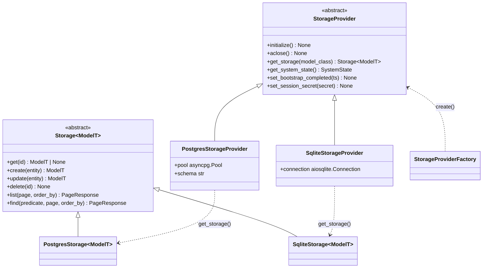
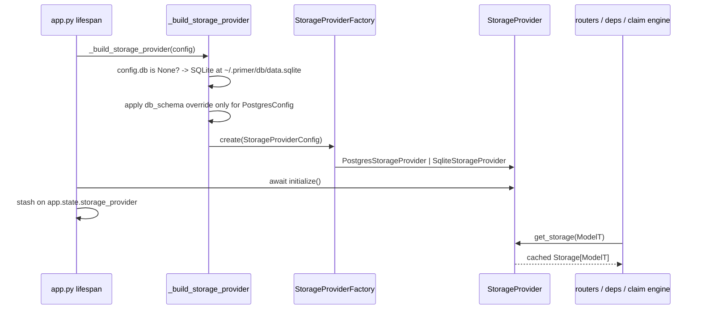

# Storage

## 1. Purpose

The storage layer is how Primer persists every addressable entity (providers, agents, graphs, collections, documents, sessions, chats, channels, triggers, API tokens, turn-log records, ...) behind a single backend-agnostic interface. Two ABCs define the contract: `StorageProvider` (`primer/int/storage_provider.py`) owns the shared backend state (connection pool or single embedded connection, schema setup) and hands out model-bound `Storage[ModelT]` handles; `Storage[ModelT]` (`primer/int/storage.py`) is the generic CRUD-plus-search surface for one Pydantic model type. Callers receive a concrete `Storage[Document]` or `Storage[Agent]` from `provider.get_storage(model_class)` and operate on it without knowing whether Postgres or SQLite is on the other side.

Two backends implement the contract: `PostgresStorageProvider` (`primer/storage/postgres.py`, asyncpg pool over JSONB tables with a GIN index per table) and `SqliteStorageProvider` (`primer/storage/sqlite.py`, a single embedded aiosqlite connection over JSON-as-TEXT tables). `StorageProviderFactory.create` (`primer/storage/factory.py`) dispatches on a discriminated `StorageProviderConfig`. SQLite is the zero-config default for clone-and-run; Postgres is the production path that also unlocks cross-process workers, the Postgres scheduler, and the Postgres coordinator. Predicate translation, cursor encoding, and the type-safe `Q[ModelT]` query builder are shared utilities layered on top.

This document covers the two ABCs, the two backend implementations, the predicate and pagination model that `find` consumes, the `Q` builder, and the wiring from `AppConfig` through the factory into the lifespan. Higher-level concerns that sit on top of storage (the claim engine's `leases` table, first-boot auto-bootstrap, the CRUD router factory, the semantic-search vector store) have their own docs and are cross-linked rather than re-described here.

## 2. Visual overview

`StorageProvider` is the factory ABC; `Storage[ModelT]` is the per-model handle. Each backend ships both halves as a pair.

A provider is constructed once per process at lifespan start, `initialize`-d, then queried for one `Storage` handle per model class. The provider caches handles by model class, so repeated `get_storage(Document)` calls return the same instance sharing the pool. Neither backend eagerly creates per-model tables; DDL runs lazily on first use of each handle.

## 3. Public surface

`StorageProvider` (`primer/int/storage_provider.py`) exposes:

- `initialize()` opens the pool or embedded connection and runs one-time schema setup. Idempotent; must be awaited before any handle is used.
- `aclose()` tears the backend down. Idempotent on a never-initialised or already-closed provider.
- `get_storage(model_class)` returns a cached `Storage[ModelT]` handle. The handle shares the pool with siblings and does not eagerly create its table.
- `get_content_store()` returns the backend's `DocumentContentStore` (`primer/int/document_content.py`): the path-keyed store for user-document bodies that sits beside the JSONB entity tables. See section 5.
- `get_system_state()` returns the singleton `system_state` row (`primer/model/system_state.py`), guaranteed non-null because the row is inserted during `initialize`.
- `set_bootstrap_completed(ts)` stamps `bootstrap_completed_at` on the singleton row; consumed by first-boot auto-bootstrap.
- `set_session_secret(secret)` persists the cookie-signing HMAC secret on the singleton row so sessions survive restarts.

`Storage[ModelT]` (`primer/int/storage.py`, `ModelT` bound to `Identifiable`) exposes six operations:

- `get(id)` returns the entity or `None` if missing; backend errors propagate rather than collapsing to `None`.
- `create(entity)` inserts and returns the stored entity; raises `ConflictError` on duplicate id.
- `update(entity)` replaces the row matching `entity.id`; raises `NotFoundError` if absent.
- `delete(id)` removes by id; raises `NotFoundError` if absent (callers wanting idempotent semantics suppress it).
- `list(page, order_by)` paginated enumeration of every row.
- `find(predicate, page, order_by)` paginated query filtered by a `Predicate` tree; `predicate=None` is equivalent to `list`. Raises `BadRequestError` when the predicate references an untranslatable field or an unsupported operand layout.

Pagination is bidirectional and discriminated on a `kind` tag (`primer/model/storage.py`). A request is either `OffsetPage(offset, length)` or `CursorPage(cursor, length)`; the response shape mirrors the request (`OffsetPageResponse[ModelT]` with a `total` count, or `CursorPageResponse[ModelT]` with an opaque `next_cursor`). Both backends must support both styles. `length` is clamped to 1..200 at the model level. Ordering is a left-to-right list of `OrderBy(field, direction)`; cursor pagination requires a stable total ordering, so both backends append an implicit `id ASC` tiebreaker.

The predicate language (`primer/model/storage.py`) is a strictly binary expression tree of `Predicate` nodes whose operands are `Predicate`, `FieldRef`, or `Value` (discriminated on `kind`). `Op` covers comparison (`EQ`, `NE`, `LIKE`, `GT`, `LT`, `GE`, `LE`), set membership (`IN`), null checks (`IS_NULL`, `IS_NOT_NULL`), and logical joins (`AND`, `OR`). `Value` is constrained to JSON-compatible scalars (or a list of scalars for `IN`) so the tree round-trips losslessly through any wire format.

`Q[ModelT]` (`primer/storage/q.py`) is the type-safe builder for assembling a `Predicate`. It validates every field name against `model_cls.model_fields` at `where` / `where_in` / `where_null` / `where_not_null` / `where_op` call time (raising `KeyError` on an unknown field), supports dotted JSONB paths whose top segment must exist on the model and whose subsequent segments must match `^[A-Za-z_][A-Za-z0-9_]*$` (`ValueError` otherwise), folds multiple clauses into a left-leaning AND tree via `build()`, and offers a `Q.or_(*qs)` classmethod that requires at least two `Q` instances sharing the same `model_cls`. `Q` is purely additive: hand-written `Predicate` construction still works for the rare dynamic-field-name case, but `Q` makes the field-name injection vector structurally impossible for its callers.

## 4. How to add a new implementation

A new backend (for example MongoDB) ships two classes plus a factory branch:

1. Subclass `StorageProvider`. Implement `initialize` (open the pool, run eager schema setup, create the `system_state` singleton row), `aclose`, `get_storage` (construct and cache a per-model handle), and the three `system_state` helpers (`get_system_state`, `set_bootstrap_completed`, `set_session_secret`).
2. Subclass `Storage[ModelT]`. Implement the six operations. Derive the table/collection name with the shared rule (see section 5), serialise via `dump_for_storage` so `SecretStr` fields round-trip as plaintext rather than the masked default, and translate `Predicate` trees and `OrderBy` lists into the backend's native query shape while preserving the same logical semantics.
3. Reuse the shared cursor helpers (`primer/storage/_cursor.py`): `_encode_cursor_for(entity, order_by)` and `_decode_cursor(cursor)` produce and parse the opaque base64-JSON payload; only the keyset-seek `WHERE` fragment that consumes the decoded keys is backend-specific.
4. Add a discriminated config arm. Extend `StorageProviderType` and the `StorageProviderConfig.config` union (`primer/model/provider.py`), and add a `model_validator` arm pairing the new provider discriminator to the new config class.
5. Add the dispatch branch in `StorageProviderFactory.create` (`primer/storage/factory.py`), importing the concrete provider lazily inside the branch so its dependency stays off the cold path of the other backends. Unknown provider values raise `ConfigError`.
6. Translate backend-native exceptions into the Primer domain exceptions (`ConflictError`, `NotFoundError`, `BadRequestError`, `ProviderError`, `ServerError`, `ConfigError`) the way `_wrap_sqlite_error` does for SQLite.

The contract test in `tests/storage/test_storage_contract.py` runs the same scenarios against every backend, so a new implementation gets parity coverage by being added to that harness.

## 5. Existing implementations

Two backends are live.

`PostgresStorageProvider` / `PostgresStorage` (`primer/storage/postgres.py`) own an asyncpg pool sized by `PoolConfig`. Each model lives in its own JSONB table: `id` (text) is hoisted out of the document to be the primary key, everything else lives under a `data` jsonb column, plus `created_at` / `updated_at` timestamps. Each table gets a GIN index `<table>_data_gin ON ... USING gin (data jsonb_path_ops)` so containment-style predicate scans stay fast. `initialize` is the only eager DDL: it creates the schema, the coordinator `rate_limit_lease` and `leader_lease` tables, the claim-engine `leases` table (plus its partial `leases_claim_order` index), and the `system_state` singleton; per-model tables defer to first handle use. The schema name comes from `PostgresConfig.db_schema` (named `db_schema` to avoid shadowing Pydantic's `BaseModel.schema()`), is sanitised against a safe-identifier regex, and isolates two deployments that share a cluster.

A GIN over `jsonb_path_ops` accelerates containment (`@>`) but NOT the scalar `data->>'field' = $1` equality fragments the predicate translator emits, so a few fields queried on hot paths get a dedicated B-tree expression index on the extracted scalar. These live in the `_HOT_FIELD_INDEXES` registry in `primer/storage/postgres.py`, keyed by table name, and `_ensure_table` creates them in the same transaction as the base table + GIN index. Current entries: `apitoken_token_hash_uniq` (UNIQUE, `((data->>'token_hash'))`) for the bearer-auth lookup that runs on every authenticated request; `sessions_status` (`((data->>'status'))`) for startup recovery and the live-session sweeps; and `channel_provider_external` (`((data->>'provider_id'), (data->>'external_id'))`) for inbound-channel routing. They mirror the JSONB expression-index style already used by the `channelcorrelation` UNIQUE index in `primer/channel/correlation.py`. All are `CREATE INDEX IF NOT EXISTS` (idempotent on existing DBs), **plain not `CONCURRENTLY`**: `CREATE INDEX CONCURRENTLY` cannot run inside a transaction and the table-create path is deliberately transactional (atomic table+indexes commit, which the cold-start race handling in `primer/storage/_ddl.py` depends on). On a fresh table the build is instant and lock-free because the table is empty; the tradeoff is that adding one of these indexes for the first time to an already-large pre-existing table briefly locks the table for the build. To add a hot-field index to a large production table without blocking writes, pre-create it out-of-band with `CREATE INDEX CONCURRENTLY IF NOT EXISTS` (same name + expression) before the upgrade; the in-path `IF NOT EXISTS` then no-ops.

Startup session recovery (`primer/api/app.py` lifespan) re-arms the claim engine from persisted `WorkspaceSession` rows after a restart. It uses `find()` with a `status IN (<every non-ENDED status>)` predicate (built via `Q`) rather than `list()`-ing every row and dropping ENDED in Python, so it never loads the full session history into memory at scale; the `sessions_status` index keeps that scan cheap. The IN-set is computed as "all statuses except `ENDED`" so a newly added live status is recovered (fail-safe) rather than silently skipped.

`SqliteStorageProvider` / `SqliteStorage` (`primer/storage/sqlite.py`) own a single `aiosqlite` connection (aiosqlite serialises every query through one background thread, so there is no pool). Tables are `id TEXT PRIMARY KEY, data TEXT NOT NULL` (JSON-encoded) plus text timestamps. `initialize` expands `~` in the path, `mkdir -p`s the parent, applies the `journal_mode` / `synchronous` / `busy_timeout` PRAGMAs plus `foreign_keys = ON`, and eagerly creates the `leases` table (plus its partial index), the `system_state` table, and the singleton row; a schema-evolution shim `PRAGMA table_info`s `system_state` and `ALTER TABLE ADD COLUMN session_secret` when missing. CRUD uses `RETURNING` for create/update and `cursor.rowcount` to raise `NotFoundError` on delete. `SqliteConfig` exposes `path`, `busy_timeout_ms` (5000), `synchronous` (`normal`), and `journal_mode` (`wal`); no pool knobs. `_wrap_sqlite_error` maps `IntegrityError` with `UNIQUE constraint failed` to `ConflictError`, other `IntegrityError` to `ProviderError`, `OperationalError` to `ServerError`, and `DatabaseError` / anything else to `ProviderError`.

Both backends share rules so an operator can swap providers without renaming anything:

- Table naming (`_table_name_for`) is the lowercased class name, with one special case: `Session` and `WorkspaceSession` both map to the `sessions` table (the Postgres scheduler hard-codes that name in its JOINs).
- Serialisation goes through `dump_for_storage` (`primer/model/common.py`), which dumps in JSON mode and then re-injects `SecretStr` plaintext so credentials round-trip instead of being written as the masked placeholder.
- Predicate translation is split between two sibling translators: `_PredicateTranslator` (`primer/storage/_predicate.py`) emits `data->>'field'` with `$N` placeholders for Postgres; `_SqlitePredicateTranslator` (`primer/storage/_sqlite_predicate.py`) emits `json_extract(data, '$.field')` with `?` placeholders for SQLite. Both resolve field annotations to apply numeric casts (`::bigint` / `::double precision` versus `CAST(... AS INTEGER|REAL)`), short-circuit an empty `IN` list to a constant-false clause, and raise `BadRequestError` for a field absent on the model. The two translators are independent visitors with substantial overlap; this duplication is a known, accepted state held honest by the contract test.
- Order-by rendering (`render_order_by` / `render_order_by_sqlite`) always appends the implicit `id ASC` tiebreaker for deterministic cursor seeks.

### The `document_content` table

Knowledge documents are path-addressed and their bodies are the source of truth, so the body does not live under the generic `data` JSONB column with the `Document` entity row, nor in the vector store. Instead each `StorageProvider` hands out a `DocumentContentStore` (`primer/int/document_content.py`) via `get_content_store()`, backed by a dedicated `document_content` table that is a sibling to the JSONB entity tables rather than another `Storage[ModelT]` handle. Its columns are `document_id` (PRIMARY KEY), `collection_id`, `path`, `content`, and `updated_at`, with a `UNIQUE(collection_id, path)` index (the authoritative `path -> document_id` resolver) plus a `(collection_id)` index for prefix listing. Postgres stores `content` as `text` and `updated_at` as `timestamptz`; SQLite stores both as `TEXT`. The store exposes path-keyed reads (`get`, `get_by_path`, `resolve_id`), `upsert`, `delete`, `move`, and a prefix `list`, and runs `ensure_schema()` at startup (see `docs/dev/subsystems/knowledge.md`). It is the only first-class table outside the one-table-per-model rule; the vector index over the same bodies is separate and optional.

The vector / semantic-search store is a separate provider family (`VectorStoreProvider` with pgvector, pgvectorscale, and lance backends, configured by `SemanticSearchProvider` rows) and is not part of this entity-storage layer; see the semantic-search subsystem and provider-pattern docs.

## 6. Wiring

Storage is selected once, at lifespan start, from `AppConfig`. `AppConfig` (`primer/api/config.py`) has no flat `db_*` fields: storage is a single `db: StorageProviderConfig | None` (default `None`) plus an optional `db_schema` string used only as a Postgres-schema override for test isolation. Because every field has a default, `AppConfig()` with no env vars and no TOML constructs successfully and lands on embedded SQLite. Env vars use the `PRIMER_` prefix with `__` as the nested delimiter, so `PRIMER_DB__PROVIDER` and `PRIMER_DB__CONFIG__PATH` map onto the discriminated `db` field; `settings_customise_sources` orders init args > env > TOML (`PRIMER_CONFIG_PATH`) > `.env` > secrets.

`_build_storage_provider` (`primer/api/app.py`) reads `config.db`; when `None` it constructs `StorageProviderConfig(provider=SQLITE, config=SqliteConfig(path=~/.primer/db/data.sqlite))`. The `db_schema` override is applied only when the resolved config wraps a `PostgresConfig` (SQLite has no schema concept). The lifespan then `initialize`s the provider, runs first-boot auto-bootstrap when `system_state.bootstrap_completed_at` is NULL, and stashes the provider on `app.state.storage_provider`. Routers and dependencies reach storage through `primer/api/deps.py`: `get_storage_provider` returns the singleton, and per-model `Storage[T]` helper deps (one per persisted type) call `get_storage(model_class)`. The CRUD router factory (`primer/api/routers/_crud.py`) and `Q` (`primer/storage/q.py`) are the two seams most router code uses on top of the bare `Storage` handle; routers across `channels`, `knowledge`, `chats`, `api_tokens`, `harness`, `tool_approval`, the auth middleware, and the trigger subsystem build their predicates through `Q` rather than hand-rolling `Predicate` trees.

Storage and scheduler are independent provider-factory configs. SQLite storage pairs only with the in-memory scheduler (single-process); the `leases` table already exists in the SQLite schema anticipating a future SQLite scheduler, but cross-process workers against SQLite are unsupported. When `config.scheduler` is `None` and the runtime is a worker mode, the lifespan injects an in-memory scheduler rather than failing fast, so the clone-and-run path never throws a config error.

## 7. Testing patterns

Storage tests live under `tests/storage/`. `test_storage_contract.py` runs the same CRUD, pagination, predicate, and ordering scenarios against both backends (Postgres skipped when no DSN is present), which is how the two backends stay behaviourally identical despite the duplicated translators. Backend-specific suites (`test_sqlite_provider.py`, `test_sqlite_storage.py`, `test_sqlite_predicate.py`) cover lifecycle, CRUD, and the SQLite translator; `test_factory.py` covers both factory branches plus the unknown-enum `ConfigError`; `test_cursor.py` covers the shared cursor helpers; `test_system_state.py` covers the singleton row; and `test_q.py` covers the `Q` builder (field validation, dotted-path regex, `or_` combinator, empty-build `ValueError`). The CRUD-factory extensions that sit on top of storage are covered under `tests/api/routers/` (`test_crud_scope_field.py`, `test_crud_managed_by_field.py`, `test_crud_references.py`, `test_crud_cdc_kind.py`, `test_cdc_registry.py`). The end-to-end SQLite journey at `tests/e2e/test_sqlite_multi_router_journey.py` boots the API against a `tmp_path`-resident SQLite file and exercises multiple routers. Per-test API-key and bearer-token values are read from env vars rather than inlined.

## 8. Historical decisions

- **Entity storage is pluggable behind a `StorageProvider` ABC with the provider owning the pool and handing out per-model `Storage` handles.** Why: one application constructs one provider per backend at startup and shares its pool across every model handle, keeping connection management in one place. Spec: docs/superpowers/specs/2026-05-24-sqlite-storage-and-optional-config-design.md.
- **A second SQLite backend was added behind the same ABC, configured through a discriminated `StorageProviderConfig` so the factory dispatches on `provider`.** Why: a first-time or single-developer install must work with no provisioning, which embedded SQLite at `~/.primer/db/data.sqlite` provides while Postgres remains the production opt-in. Spec: docs/superpowers/specs/2026-05-24-sqlite-storage-and-optional-config-design.md.
- **A single shared aiosqlite connection per provider was chosen over a pool.** Why: aiosqlite already serialises every query through one background thread and SQLite writes are exclusive, so pooling adds no throughput; WAL mode still lets external readers inspect the file concurrently. Spec: docs/superpowers/specs/2026-05-24-sqlite-storage-and-optional-config-design.md.
- **WAL plus `synchronous=normal` were picked as the default PRAGMA pair.** Why: the standard recommendation for embedded write-heavy workloads, trading one fsync per checkpoint for acceptable durability in the embedded and dev use case. Spec: docs/superpowers/specs/2026-05-24-sqlite-storage-and-optional-config-design.md.
- **Two backend-specific predicate translators were kept rather than a shared AST plus per-backend emitter.** Why: the SQLite port alone did not justify the maintenance cost of an abstract op tree, and a parametrised contract test keeps both backends honest on identical scenarios; revisit only when a third backend appears. Spec: docs/superpowers/specs/2026-05-24-sqlite-storage-and-optional-config-design.md.
- **The opaque base64-JSON cursor encode/decode was extracted into a shared module while the keyset-seek `WHERE` clause stayed backend-specific.** Why: the cursor payload is provider-agnostic and worth sharing, but the SQL fragment that consumes the decoded keys is backend-specific and belongs with each storage class. Spec: docs/superpowers/specs/2026-05-24-sqlite-storage-and-optional-config-design.md.
- **Per-model tables are created lazily on first handle use rather than as a single migration.** Why: it mirrors the Postgres backend, keeps unused models out of the schema, and avoids an Alembic dependency, at the cost of deferring a real schema-migration story. Spec: docs/superpowers/specs/2026-05-24-sqlite-storage-and-optional-config-design.md.
- **`AppConfig` collapsed the spec's flat Postgres-only `db_*` knobs into a single optional `db: StorageProviderConfig | None` field defaulting to SQLite.** Why: every config field needed a default so `AppConfig()` constructs with zero provisioning, and the provider-factory shape keeps the storage knobs in one discriminated place. Spec: docs/superpowers/specs/2026-05-24-sqlite-storage-and-optional-config-design.md.
- **Find endpoints accept a POST JSON body of `(predicate, page, order_by)` and the API translation is identity over `Storage.find`.** Why: predicate trees are too complex for query params and the storage ABC already returns clean page-response shapes, so keeping the translation as identity avoids drift between the API and storage shapes. Spec: docs/superpowers/specs/2026-05-08-rest-api-foundation-design.md.
- **`Q[ModelT]` was added to validate field names against `model_fields` at call time.** Why: `FieldRef.name` is interpolated into SQL because column references cannot be parameterised, so validating field names at the `Q.where` call site closes the field-name injection vector that the prior hardcoded-string convention only enforced informally. Spec: docs/superpowers/specs/2026-05-27-crud-factory-levelup-design.md.
- **Pagination defaults were standardised at 20 in `parse_page` with no per-router factory override.** Why: there are no entities that need a non-default page size through the factory, so the spec's `default_page_size` parameter was designed away and the few hand-built endpoints that need a different default override it inline. Spec: docs/superpowers/specs/2026-05-27-crud-factory-levelup-design.md.
- **The `TurnLogRecord` storage entity was added for the graph executor's turn-log path, materialised through the standard `Storage[T]` interface with no special semantics.** Why: turn-boundary observability data for the storage-backed graph executor fits the generic per-model table shape, so it needs no dedicated storage surface. Spec: docs/superpowers/specs/2026-06-05-per-session-turn-log-design.md.
- **The env-var prefix is `PRIMER_` with `__` as the nested delimiter and `PRIMER_CONFIG_PATH` as the TOML override, not the spec-era `MATRIX_`.** Why: the implementation standardised on the `PRIMER_` namespace, so `PRIMER_DB__PROVIDER` and `PRIMER_DB__CONFIG__PATH` are the canonical keys for selecting a backend. Spec: docs/superpowers/specs/2026-05-24-sqlite-storage-and-optional-config-design.md.
