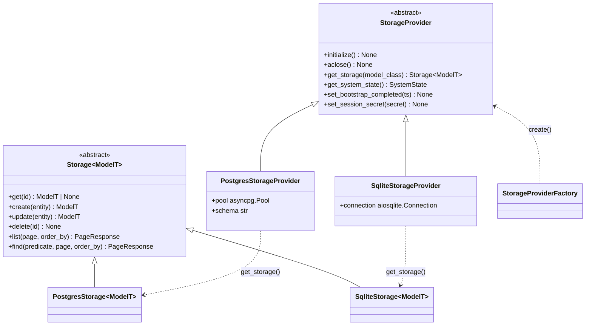
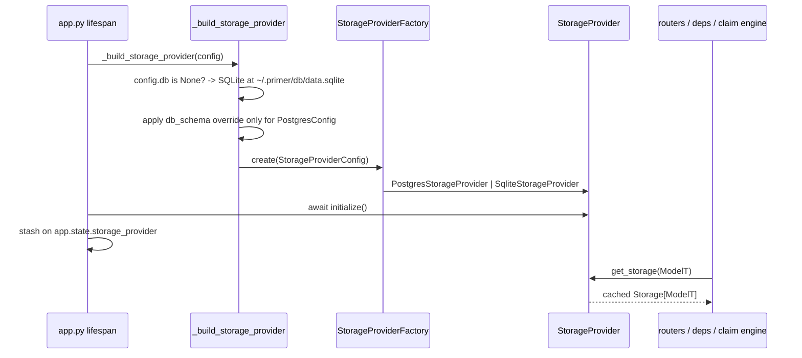

# Storage

## 1. Purpose

The storage layer is how Primer persists every addressable entity (providers, agents, graphs, collections, documents, sessions, channels, triggers, API tokens, turn-log records, ...) behind a single backend-agnostic interface. Two ABCs define the contract: `StorageProvider` (`primer/int/storage_provider.py`) owns the shared backend state (connection pool or single embedded connection, schema setup) and hands out model-bound `Storage[ModelT]` handles; `Storage[ModelT]` (`primer/int/storage.py`) is the generic CRUD-plus-search surface for one Pydantic model type. Callers receive a concrete `Storage[Document]` or `Storage[Agent]` from `provider.get_storage(model_class)` and operate on it without knowing whether Postgres or SQLite is on the other side.

Two backends implement the contract: `PostgresStorageProvider` (`primer/storage/postgres.py`, asyncpg pool over JSONB tables with a GIN index per table) and `SqliteStorageProvider` (`primer/storage/sqlite.py`, a single embedded aiosqlite connection over JSON-as-TEXT tables). `StorageProviderFactory.create` (`primer/storage/factory.py`) dispatches on a discriminated `StorageProviderConfig`. SQLite is the zero-config default for clone-and-run; Postgres is the production path that also unlocks cross-process workers, the Postgres scheduler, and the Postgres coordinator. Predicate translation, cursor encoding, and the type-safe `Q[ModelT]` query builder are shared utilities layered on top.

This document covers the two ABCs, the two backend implementations, the predicate and pagination model that `find` consumes, the `Q` builder, and the wiring from `AppConfig` through the factory into the lifespan. Higher-level concerns that sit on top of storage (the claim engine's `leases` table, first-boot auto-bootstrap, the CRUD router factory, the semantic-search vector store) have their own docs and are cross-linked rather than re-described here.

## 2. Visual overview

`StorageProvider` is the factory ABC; `Storage[ModelT]` is the per-model handle. Each backend ships both halves as a pair.

```mermaid
classDiagram
    class StorageProvider {
        <<abstract>>
        +initialize() None
        +aclose() None
        +get_storage(model_class) Storage~ModelT~
        +get_system_state() SystemState
        +set_bootstrap_completed(ts) None
        +set_session_secret(secret) None
    }
    class Storage~ModelT~ {
        <<abstract>>
        +get(id) ModelT | None
        +create(entity) ModelT
        +update(entity) ModelT
        +delete(id) None
        +list(page, order_by) PageResponse
        +find(predicate, page, order_by) PageResponse
    }
    class PostgresStorageProvider {
        +pool asyncpg.Pool
        +schema str
    }
    class SqliteStorageProvider {
        +connection aiosqlite.Connection
    }
    class PostgresStorage~ModelT~
    class SqliteStorage~ModelT~

    StorageProvider <|-- PostgresStorageProvider
    StorageProvider <|-- SqliteStorageProvider
    Storage~ModelT~ <|-- PostgresStorage~ModelT~
    Storage~ModelT~ <|-- SqliteStorage~ModelT~
    PostgresStorageProvider ..> PostgresStorage~ModelT~ : get_storage()
    SqliteStorageProvider ..> SqliteStorage~ModelT~ : get_storage()
    StorageProvider <.. StorageProviderFactory : create()
```

A provider is constructed once per process at lifespan start, `initialize`-d, then queried for one `Storage` handle per model class. The provider caches handles by model class, so repeated `get_storage(Document)` calls return the same instance sharing the pool. Neither backend eagerly creates per-model tables; DDL runs lazily on first use of each handle.

## 3. Public surface

`StorageProvider` (`primer/int/storage_provider.py`) exposes:

- `initialize()` opens the pool or embedded connection and runs one-time schema setup. Idempotent; must be awaited before any handle is used.
- `aclose()` tears the backend down. Idempotent on a never-initialised or already-closed provider.
- `get_storage(model_class)` returns a cached `Storage[ModelT]` handle. The handle shares the pool with siblings and does not eagerly create its table.
- `get_content_store()` returns the backend's `DocumentContentStore` (`primer/int/document_content.py`): the path-keyed store for user-document bodies that sits beside the JSONB entity tables. See section 5.
- `get_system_state()` returns the singleton `system_state` row (`primer/model/system_state.py`), guaranteed non-null because the row is inserted during `initialize`.
- `set_bootstrap_completed(ts)` stamps `bootstrap_completed_at` on the singleton row; consumed by first-boot auto-bootstrap.
- `set_session_secret(secret)` persists the cookie-signing HMAC secret on the singleton row so sessions survive restarts.

`Storage[ModelT]` (`primer/int/storage.py`, `ModelT` bound to `Identifiable`) exposes eight operations:

- `get(id)` returns the entity or `None` if missing; backend errors propagate rather than collapsing to `None`.
- `create(entity)` inserts and returns the stored entity; raises `ConflictError` on duplicate id.
- `update(entity)` replaces the row matching `entity.id`; raises `NotFoundError` if absent.
- `update_unless(entity, field=, forbidden=)` is `update` that the backend atomically skips when the row's CURRENT `field` already equals `forbidden`; returns `None` when skipped, raises `NotFoundError` if absent.
- `patch_if(id, patch, where=, set_paths=)` is the field-scoped compare-and-set, see below.
- `delete(id)` removes by id; raises `NotFoundError` if absent (callers wanting idempotent semantics suppress it).
- `list(page, order_by)` paginated enumeration of every row.
- `find(predicate, page, order_by)` paginated query filtered by a `Predicate` tree; `predicate=None` is equivalent to `list`. Raises `BadRequestError` when the predicate references an untranslatable field or an unsupported operand layout.

**`patch_if`** writes ONLY the fields the caller names, and only if the row's current document matches `where`, in one statement the database evaluates against the row's current version (no read-modify-write). A whole-document `update` from a snapshot silently erases a concurrent writer's other fields (a cancel flag, a human reply accumulated into a nested map); `patch_if` cannot. `patch` is a shallow top-level merge. `set_paths` maps tuple paths to values (`("parked_state", "resume_event_payloads", key) -> {...}`) and sets nested leaves after the patch: every parent is first ensured to be an object, shallowest first (an absent, null or scalar parent is replaced by `{}`, because `jsonb_set` and `json_set` silently do nothing under a non-container), so sibling keys written by others survive. Paths are at most four deep, a spec may name at most 32 patch keys, 16 leaves and 4 distinct parent objects (each parent is repeated three times in the compiled expression, so statement size grows as 3^parents), and path elements and patch keys may not contain a quote, a backslash or a control character (rejected with `PatchSpecError`, a `ValueError` subclass importable as `primer.storage.PatchSpecError`, on every backend before any SQL, so the backends stay identical; Postgres binds paths as `text[]`, SQLite quotes keys inside a `$` path). A key that can be arbitrary text (a graph node id, a provider `tool_call_id`) goes through `primer.session.yields.leaf_key_for` before it is used as a path element: it percent-encodes exactly `%`, `"`, `\` and the characters below U+0020 (injectively, so `a"b` and the literal `a%22b` stay two keys) and returns every other key unchanged; a surrogate code point is still refused, nothing can store it. A string that cannot be UTF-8 encoded (a surrogate code point, alone or half of a split pair) anywhere in a spec, in a key, a patch value or a `where` value, is rejected the same way: it would otherwise pass the JSON check and then fail as a backend error (differently per backend) or be silently stored. An array parent is replaced by `{}` like any other non-object, which destroys the array. `where` is required and non-empty, and maps top-level fields (never `id`, which is a column, not stored data) to a LIST of allowed values (a bare string is rejected: it would be read as its characters and never match): all fields must match, any listed value matches, and values are compared as typed JSON scalars with one rule on every backend (`True` is not `1` and not `"true"`; numbers compare by value, so `1` equals `1.0`); `None` matches an absent field or JSON null. The comparison value for "the row I read" must come from `primer.storage.raw_generation(row, field)`, the canonical stored value (`dump_for_storage`), never from a re-formatted Python value, or the guard never matches. That holds because `patch_if` stores canonical values: the caller's JSON (`"5"` for an int field, a `+00:00` timestamp, a mixed-case value a validator lower-cases) is written first, the resulting document is validated, and every top-level field the patch touched is then rewritten to the model's own dump, in the same transaction under the row lock (a second statement, issued only when the stored form differs). A guard that names the DEFAULT of a field that cannot hold null also matches a document that lacks the key, which is how the model reads a row older than the field; a nullable field is compared as stored (there `None` already means a stored null, so a stale read of the default could otherwise be applied over a newer null), and a factory or secret default is never consulted. The consequence for a document OLDER than a nullable field whose default is not null (the model reads it as that default): a guard naming the default never matches it, `raw_generation` of such a row returns the default, and so a guard built from that read is refused for that row until the key is written; guard it with `None` (which matches the absent key) or on another field, and write the key. A patch or path root that is not a field of the model is a `PatchSpecError` (a typo would otherwise write a key nothing reads), unless the model allows extras, and so is a `set_paths` leaf the validated model does not carry (a typo under a typed sub-model would be reported written and dropped by the rewrite): the write rolls back, including every OTHER field the same call patched. So is a touched field whose canonical dump strict JSON cannot hold (the string `"nan"` written into a float field, which the model reads as NaN and the rewrite could not store): `validate_patch` only sees the caller's raw JSON, so `canonical_fixup` runs the same JSON check on each value it is about to write and refuses it, naming the field and not echoing the value, instead of letting the driver fail with a backend error. The refusals that are about a supplied VALUE rather than the spec's shape (a value strict JSON cannot hold, a string or key that cannot be UTF-8 encoded, a canonical value that is one of those) raise `PatchValueError`, a `PatchSpecError` subclass importable as `primer.storage.PatchValueError`, so a caller writing values it was handed (the tool-call claim adapter) can tell an unstorable value from its own malformed spec. The backends re-raise `PatchSpecError` (and so `PatchValueError`) and a pydantic `ValidationError` as themselves; any other `ValueError` raised under the write (a corrupt stored document, a driver quirk) is wrapped as a backend failure, not reported as the caller's mistake. The rewrite replaces a touched top-level field wholesale with its canonical dump (so a typed sub-model drops keys it ignores), and treats `5` and `5.0` as different spellings. A field a validator DERIVES from its input (a lower-cased `tag`) is rewritten to the derived form like any touched field, so `raw_generation` returns the derived value; a model built with `model_copy(update=...)` runs no validators, so a value set that way and written with a whole-document `update` is stored as given and can differ from what the next read validates (`tag="MiXeD"` is stored as `"MiXeD"` and reads back as `"mixed"`). A guard built from that read (`"mixed"`) is then refused for ever, because the database compares the stored `"MiXeD"`, so a fresh read is not the remedy. Validate before writing instead (for example `Model.model_validate(copy.model_dump())`, so the stored value is the one a later read returns), or repair a row already written that way with a `patch_if` that names the field and is guarded on another field (the rewrite stores the derived form). A key the model ignores survives a patch (the patch is applied to the stored document) and is dropped by a whole-document `update`, which re-dumps the model. What a guard cannot know is a document that was written in a non-canonical form by something other than this layer (direct SQL, an older build that dumped a timestamp as `+00:00`): that guard is refused for ever, which is what the tripwire below is for. The document the write produces is validated against the model BEFORE it commits on both backends: a patch that leaves the row unreadable raises `ValidationError` and rolls back instead of poisoning every later read. It returns the stored entity when applied, `None` when `where` rejected it, and raises `NotFoundError` when the row does not exist ("someone else won" and "the row is gone" need different handling). A model with a registered event kind appends the same `<kind>.updated` event as `update`, with the new document as payload. `primer.storage.cas.patch_if_checked` adds a drift tripwire: after a rejection it re-reads the row and evaluates the same `where` in Python; if the fresh row still satisfies it, the refusal was a serialization disagreement rather than a race, which logs ERROR (naming the guarded fields, never their values) and increments `storage_cas_drift_total{model}` (the return value stays `None`). A single concurrent write that moves the row into the allowed set between the rejection and the re-read can raise a false alarm; it only catches over-rejection.

Pagination is bidirectional and discriminated on a `kind` tag (`primer/model/storage.py`). A request is either `OffsetPage(offset, length)` or `CursorPage(cursor, length)`; the response shape mirrors the request (`OffsetPageResponse[ModelT]` with a `total` count, or `CursorPageResponse[ModelT]` with an opaque `next_cursor`). Both backends must support both styles. `length` is clamped to 1..200 at the model level. Ordering is a left-to-right list of `OrderBy(field, direction)`; cursor pagination requires a stable total ordering, so both backends append an implicit `id ASC` tiebreaker.

**A secret-bearing field is not queryable, and a cursor is bound to its request (ticket 01a1212a).** A row is stored with its secrets in clear (`dump_for_storage`) and served with them masked, so a predicate, an `order_by` key or a cursor seek key, which every backend compares against the STORED document, would answer questions about the value a read hides: a `LIKE` prefix match, a sort, or a `>=` comparison on such a field is an oracle on the clear secret. `primer.storage.secret_fields.holds_secret(model, path)` classifies a (possibly dotted) field as secret-bearing when its type tree carries a masked type ANYWHERE, inside lists, dicts, nested models, unions and `Optional`: a pydantic secret (`SecretStr` / `SecretBytes` / `Secret[...]`), a URL whose serializer masks the password of its userinfo, a `@field_serializer`, or a self-serializing model. The whole field is compared as one JSON value, so a secret nested below a plain top-level field (a `list[FileMount]` whose source URL is masked, a `dict[str, SecretStr]`) taints the field above it. `refuse_secret_fields(model, predicate=, order_by=)` is called by the REST list / find routes and by the system and workspaces list / find tools before they query (it raises `ValidationError`, which the REST surface answers 422 and the tools report as `type=validation-error`); both backend field renderers (`_render_field_expr` in `primer/storage/_predicate.py` and `primer/storage/_sqlite_predicate.py`) call `refuse_secret_path` as the backstop, so no internal caller can reach the stored document through a secret path either. The opaque cursor (`primer/storage/_cursor.py`) carries only the SERVED values of the keys the request sorts by plus the `id` tiebreaker, never the storage form (a client can decode it); `_decode_cursor_for(cursor, order_by, model)` accepts a cursor only when its keys are exactly the ones `_encode_cursor_for` would emit for THIS request's `order_by` (the same fields, in the same order and directions, then `id`), each a JSON scalar whose Python type matches the key's declared type (a non-empty string `id`). Any other key, an extra or missing key, a wrong direction, a key that names another field, or a value of the wrong type for its key is refused as a bad cursor (`BadRequestError`, a 400); the type check matters because a mistyped value on an allowed key would otherwise bind against the backend's typed column expression and answer a 5xx on Postgres (and silently no rows on SQLite). This closes the forged-cursor seek (a client-chosen key would be a search on a field the client never sorted by) and removes the masked-vs-stored seek mismatch (a secret can no longer be an `order_by` key, so a cursor never carries one, and every allowed key's served and stored forms are equal).

The predicate language (`primer/model/storage.py`) is a strictly binary expression tree of `Predicate` nodes whose operands are `Predicate`, `FieldRef`, or `Value` (discriminated on `kind`). `Op` covers comparison (`EQ`, `NE`, `LIKE`, `GT`, `LT`, `GE`, `LE`), set membership (`IN`), null checks (`IS_NULL`, `IS_NOT_NULL`), and logical joins (`AND`, `OR`). `Value` is constrained to JSON-compatible scalars (or a list of scalars for `IN`) so the tree round-trips losslessly through any wire format.

`Q[ModelT]` (`primer/storage/q.py`) is the type-safe builder for assembling a `Predicate`. It validates every field name against `model_cls.model_fields` at `where` / `where_in` / `where_null` / `where_not_null` / `where_op` call time (raising `KeyError` on an unknown field), supports dotted JSONB paths whose top segment must exist on the model and whose subsequent segments must match `^[A-Za-z_][A-Za-z0-9_]*$` (`ValueError` otherwise), folds multiple clauses into a left-leaning AND tree via `build()`, and offers a `Q.or_(*qs)` classmethod that requires at least two `Q` instances sharing the same `model_cls`. `Q` is purely additive: hand-written `Predicate` construction still works for the rare dynamic-field-name case, but `Q` makes the field-name injection vector structurally impossible for its callers.

## 4. How to add a new implementation

A new backend (for example MongoDB) ships two classes plus a factory branch:

1. Subclass `StorageProvider`. Implement `initialize` (open the pool, run eager schema setup, create the `system_state` singleton row), `aclose`, `get_storage` (construct and cache a per-model handle), and the three `system_state` helpers (`get_system_state`, `set_bootstrap_completed`, `set_session_secret`).
2. Subclass `Storage[ModelT]`. Implement the six operations. Derive the table/collection name with the shared rule (see section 5), serialise via `dump_for_storage` so `SecretStr` fields round-trip as plaintext rather than the masked default, and translate `Predicate` trees and `OrderBy` lists into the backend's native query shape while preserving the same logical semantics.
3. Reuse the shared cursor helpers (`primer/storage/_cursor.py`): `_encode_cursor_for(entity, order_by)` and `_decode_cursor(cursor)` produce and parse the opaque base64-JSON payload; only the keyset-seek `WHERE` fragment that consumes the decoded keys is backend-specific.
4. Add a discriminated config arm. Extend `StorageProviderType` and the `StorageProviderConfig.config` union (`primer/model/provider.py`), and add a `model_validator` arm pairing the new provider discriminator to the new config class.
5. Add the dispatch branch in `StorageProviderFactory.create` (`primer/storage/factory.py`), importing the concrete provider lazily inside the branch so its dependency stays off the cold path of the other backends. Unknown provider values raise `ConfigError`.
6. Translate backend-native exceptions into the Primer domain exceptions (`ConflictError`, `NotFoundError`, `BadRequestError`, `ProviderError`, `ServerError`, `ConfigError`) the way `_wrap_sqlite_error` does for SQLite.

The contract test in `tests/storage/test_storage_contract.py` runs the same scenarios against every backend, so a new implementation gets parity coverage by being added to that harness.

## 5. Existing implementations

Two backends are live.

`PostgresStorageProvider` / `PostgresStorage` (`primer/storage/postgres.py`) own an asyncpg pool sized by `PoolConfig`. Each model lives in its own JSONB table: `id` (text) is hoisted out of the document to be the primary key, everything else lives under a `data` jsonb column, plus `created_at` / `updated_at` timestamps. Each table gets a GIN index `<table>_data_gin ON ... USING gin (data jsonb_path_ops)` so containment-style predicate scans stay fast. `initialize` is the only eager DDL: it creates the schema, the coordinator `rate_limit_lease` and `leader_lease` tables, the claim-engine `leases` table (plus its partial `leases_claim_order` index), and the `system_state` singleton; per-model tables defer to first handle use. The schema name comes from `PostgresConfig.db_schema` (named `db_schema` to avoid shadowing Pydantic's `BaseModel.schema()`), is sanitised against a safe-identifier regex, and isolates two deployments that share a cluster.

A GIN over `jsonb_path_ops` accelerates containment (`@>`) but NOT the scalar `data->>'field' = $1` equality fragments the predicate translator emits, so a few fields queried on hot paths get a dedicated B-tree expression index on the extracted scalar. These live in the `_HOT_FIELD_INDEXES` registry in `primer/storage/postgres.py`, keyed by table name, and `_ensure_table` creates them in the same transaction as the base table + GIN index. Current entries: `apitoken_token_hash_uniq` (UNIQUE, `((data->>'token_hash'))`) for the bearer-auth lookup that runs on every authenticated request; `sessions_status` (`((data->>'status'))`) for startup recovery and the live-session sweeps; and `channel_provider_external` (`((data->>'provider_id'), (data->>'external_id'))`) for inbound-channel routing. They mirror the JSONB expression-index style already used by the `channelcorrelation` UNIQUE index in `primer/channel/correlation.py`. All are `CREATE INDEX IF NOT EXISTS` (idempotent on existing DBs), **plain not `CONCURRENTLY`**: `CREATE INDEX CONCURRENTLY` cannot run inside a transaction and the table-create path is deliberately transactional (atomic table+indexes commit, which the cold-start race handling in `primer/storage/_ddl.py` depends on). On a fresh table the build is instant and lock-free because the table is empty; the tradeoff is that adding one of these indexes for the first time to an already-large pre-existing table briefly locks the table for the build. To add a hot-field index to a large production table without blocking writes, pre-create it out-of-band with `CREATE INDEX CONCURRENTLY IF NOT EXISTS` (same name + expression) before the upgrade; the in-path `IF NOT EXISTS` then no-ops.

Startup session recovery (`primer/api/app.py` lifespan) re-arms the claim engine from persisted `WorkspaceSession` rows after a restart. It uses `find()` with a `status IN (<every non-ENDED status>)` predicate (built via `Q`) rather than `list()`-ing every row and dropping ENDED in Python, so it never loads the full session history into memory at scale; the `sessions_status` index keeps that scan cheap. The IN-set is computed as "all statuses except `ENDED`" so a newly added live status is recovered (fail-safe) rather than silently skipped.

Both Postgres pools built from `PoolConfig` (this provider's and the pgvector provider's) turn on kernel TCP keepalive for every connection, through an asyncpg `init` hook in `primer/storage/_pg_pool.py`, because asyncpg has no keepalive option of its own. An idle connection sends no packets, and a LISTEN connection is idle for its whole life, so a peer that vanishes without a FIN or RST (a conntrack or NAT idle timeout, a network partition) would otherwise never be noticed: the socket never errors, asyncpg's termination listeners never fire, and whatever is parked on that connection stays deaf for good. The connection that dies is the one a NOTIFY was in flight on, which can be a user's cancel. With `tcp_keepalive_idle_seconds` / `tcp_keepalive_interval_seconds` / `tcp_keepalive_count` (defaults 60 / 10 / 3; an idle of 0 turns it off; bounded by the Linux limits, 32767 / 32767 / 127) the loss surfaces as an ordinary connection termination within `idle + interval * count` seconds, 90 by default. The probes also keep a conntrack or NAT entry alive, which matters behind kube-proxy (it expires idle entries after 24 hours). The hook reaches the socket through `Connection._transport`, a private asyncpg attribute, so it degrades with one warning per pool, never a failed pool creation, if the platform lacks the socket options or a future asyncpg moves it. Two tests make such an upgrade fail instead of silently turning keepalive off: a no-DB test in `tests/storage/test_pg_pool_keepalive.py` (it runs in CI) asserts that asyncpg's `Connection` still has the `_transport` slot and that the options land on a real TCP socket, and `tests/storage/test_postgres_tcp_keepalive_live.py` (it runs wherever a Postgres gate is set) reads them back from a connection out of a real pool. Keepalive cannot see a server process that is frozen while its kernel still answers; that case heals itself when the server resumes. `PoolConfig.max_lifetime` is accepted but NOT enforced: asyncpg has no maximum connection age, and an age limit could only ever recycle idle pooled connections (which `max_idle` already closes), never the LISTEN connections a worker holds checked out for its whole life. It is kept only so saved configs that set it still validate, and a non-default value logs one warning when the pool is created.

`SqliteStorageProvider` / `SqliteStorage` (`primer/storage/sqlite.py`) own a single `aiosqlite` connection (aiosqlite serialises every query through one background thread, so there is no pool). Tables are `id TEXT PRIMARY KEY, data TEXT NOT NULL` (JSON-encoded) plus text timestamps. `initialize` expands `~` in the path, `mkdir -p`s the parent, applies the `journal_mode` / `synchronous` / `busy_timeout` PRAGMAs plus `foreign_keys = ON`, and eagerly creates the `leases` table (plus its partial index), the `system_state` table, and the singleton row; a schema-evolution shim `PRAGMA table_info`s `system_state` and `ALTER TABLE ADD COLUMN session_secret` when missing. CRUD uses `RETURNING` for create/update and `cursor.rowcount` to raise `NotFoundError` on delete. `SqliteConfig` exposes `path`, `busy_timeout_ms` (5000), `synchronous` (`normal`), and `journal_mode` (`wal`); no pool knobs. `_wrap_sqlite_error` maps `IntegrityError` with `UNIQUE constraint failed` to `ConflictError`, other `IntegrityError` to `ProviderError`, `OperationalError` to `ServerError`, and `DatabaseError` / anything else to `ProviderError`.

Both backends share rules so an operator can swap providers without renaming anything:

- Table naming (`_table_name_for`) is the lowercased class name, with one special case: `Session` and `WorkspaceSession` both map to the `sessions` table (the Postgres scheduler hard-codes that name in its JOINs).
- Serialisation goes through `dump_for_storage` (`primer/model/common.py`), which dumps in JSON mode and then re-injects `SecretStr` plaintext so credentials round-trip instead of being written as the masked placeholder. A field that masks something else in the JSON-mode dump (a provider's Base URL, `MaskedUserinfoUrl`) reads the dump's `context`: `dump_for_storage` passes `STORAGE_DUMP_CONTEXT` and gets the real value, every other JSON dump gets the mask. Anything that fingerprints or compares a row must use this form.
- Predicate translation is split between two sibling translators: `_PredicateTranslator` (`primer/storage/_predicate.py`) emits `data->>'field'` with `$N` placeholders for Postgres; `_SqlitePredicateTranslator` (`primer/storage/_sqlite_predicate.py`) emits `json_extract(data, '$.field')` with `?` placeholders for SQLite. Both resolve field annotations to apply numeric casts (`::bigint` / `::double precision` versus `CAST(... AS INTEGER|REAL)`), short-circuit an empty `IN` list to a constant-false clause, and raise `BadRequestError` for a field absent on the model. The two translators are independent visitors with substantial overlap; this duplication is a known, accepted state held honest by the contract test.
- Order-by rendering (`render_order_by` / `render_order_by_sqlite`) always appends the implicit `id ASC` tiebreaker for deterministic cursor seeks.

### Data migrations

Per-model tables are still created lazily and there is still no Alembic
step: the DDL genuinely does not need versioning, because every entity
lives in the same `id` + `data` shape. What DOES need versioning is the
SHAPE OF THE DATA inside that column, and `primer/storage/migrations/`
owns that.

`run_migrations(sp, is_fresh_install=...)` runs from the API lifespan
after `initialize()` and BEFORE auto-bootstrap, so a migration only ever
transforms rows that were already there and never has to reason about
whether a reserved row exists yet. Three properties keep it safe:

- **Backend-agnostic.** Migrations operate through `Storage[T]` handles,
  never raw SQL, so Postgres and SQLite behave identically with no
  duplicated statements. The cost is paged reads plus per-row updates,
  irrelevant at the scale of providers, agents, and collections.
- **Idempotent.** Every migration is get-then-create, so a process death
  mid-run re-runs harmlessly.
- **Forward-only.** `system_state.schema_version` is stamped after each
  migration commits, so a crash resumes from the last completed version.
  A database reporting a version NEWER than the running build logs a
  warning and is left untouched; Primer has no rollback story, and
  guessing at one would be worse than refusing.

`schema_version = N` means migrations 1..N have been applied. The column
defaulted to `1` long before the runner existed, which correctly describes
every pre-runner install: `m001` wraps `migrate_document_content`, whose
ad-hoc lifespan call was unconditional on every boot. A fresh install
baselines straight to `LATEST_VERSION` rather than running the chain
against an empty database.

To add one: create `mNNN_<slug>.py` exposing a class with `version`,
`description`, and `async apply(sp)`, then append an instance to
`MIGRATIONS`. The contract test pins that versions stay contiguous and
unique and that applying the chain twice is a no-op.

A migration reads rows written by the OLD schema from inside a build where
the models have already changed, so it may need its own view classes. The
table name is derived from `model_class.__name__.lower()`, so a class
named `LLMProvider` declared inside the migration addresses the same
table; `extra="allow"` then keeps every field the migration does not care
about intact across the read-modify-write. `m002_model_profiles.py` is the
worked example.

### The `document_content` table

Knowledge documents are path-addressed and their bodies are the source of truth, so the body does not live under the generic `data` JSONB column with the `Document` entity row, nor in the vector store. Instead each `StorageProvider` hands out a `DocumentContentStore` (`primer/int/document_content.py`) via `get_content_store()`, backed by a dedicated `document_content` table that is a sibling to the JSONB entity tables rather than another `Storage[ModelT]` handle. Its columns are `document_id` (PRIMARY KEY), `collection_id`, `path`, `content`, and `updated_at`, with a `UNIQUE(collection_id, path)` index (the authoritative `path -> document_id` resolver) plus a `(collection_id)` index for prefix listing. Postgres stores `content` as `text` and `updated_at` as `timestamptz`; SQLite stores both as `TEXT`. The store exposes path-keyed reads (`get`, `get_by_path`, `resolve_id`), `upsert`, `delete`, `move`, and a prefix `list`, and runs `ensure_schema()` at startup (see `docs/dev/subsystems/knowledge.md`). It is the only first-class table outside the one-table-per-model rule; the vector index over the same bodies is separate and optional.

The vector / semantic-search store is a separate provider family (`VectorStoreProvider` with pgvector, pgvectorscale, and lance backends, configured by `SemanticSearchProvider` rows) and is not part of this entity-storage layer; see the semantic-search subsystem and provider-pattern docs.

## 6. Wiring

Storage is selected once, at lifespan start, from `AppConfig`. `AppConfig` (`primer/api/config.py`) has no flat `db_*` fields: storage is a single `db: StorageProviderConfig | None` (default `None`) plus an optional `db_schema` string used only as a Postgres-schema override for test isolation. Because every field has a default, `AppConfig()` with no env vars and no TOML constructs successfully and lands on embedded SQLite. Env vars use the `PRIMER_` prefix with `__` as the nested delimiter, so `PRIMER_DB__PROVIDER` and `PRIMER_DB__CONFIG__PATH` map onto the discriminated `db` field; `settings_customise_sources` orders init args > env > TOML (`PRIMER_CONFIG_PATH`) > `.env` > secrets.

```mermaid
sequenceDiagram
    participant Lifespan as app.py lifespan
    participant Build as _build_storage_provider
    participant Factory as StorageProviderFactory
    participant Provider as StorageProvider
    participant Consumer as routers / deps / claim engine

    Lifespan->>Build: _build_storage_provider(config)
    Build->>Build: config.db is None? -> SQLite at ~/.primer/db/data.sqlite
    Build->>Build: apply db_schema override only for PostgresConfig
    Build->>Factory: create(StorageProviderConfig)
    Factory->>Provider: PostgresStorageProvider | SqliteStorageProvider
    Lifespan->>Provider: await initialize()
    Lifespan->>Lifespan: stash on app.state.storage_provider
    Consumer->>Provider: get_storage(ModelT)
    Provider-->>Consumer: cached Storage[ModelT]
```

`_build_storage_provider` (`primer/api/app.py`) reads `config.db`; when `None` it constructs `StorageProviderConfig(provider=SQLITE, config=SqliteConfig(path=~/.primer/db/data.sqlite))`. The `db_schema` override is applied only when the resolved config wraps a `PostgresConfig` (SQLite has no schema concept). The lifespan then `initialize`s the provider, runs first-boot auto-bootstrap when `system_state.bootstrap_completed_at` is NULL, and stashes the provider on `app.state.storage_provider`. Routers and dependencies reach storage through `primer/api/deps.py`: `get_storage_provider` returns the singleton, and per-model `Storage[T]` helper deps (one per persisted type) call `get_storage(model_class)`. The CRUD router factory (`primer/api/routers/_crud.py`) and `Q` (`primer/storage/q.py`) are the two seams most router code uses on top of the bare `Storage` handle; routers across `channels`, `knowledge`, `api_tokens`, `harness`, `tool_approval`, the auth middleware, and the trigger subsystem build their predicates through `Q` rather than hand-rolling `Predicate` trees.

Storage and scheduler are independent provider-factory configs. SQLite storage pairs only with the in-memory scheduler (single-process); the `leases` table already exists in the SQLite schema anticipating a future SQLite scheduler, but cross-process workers against SQLite are unsupported. When `config.scheduler` is `None` and the runtime is a worker mode, the lifespan injects an in-memory scheduler rather than failing fast, so the clone-and-run path never throws a config error.

## 7. Testing patterns

Storage tests live under `tests/storage/`. `test_storage_contract.py` runs the same CRUD, pagination, predicate, ordering and `patch_if` scenarios (`_patch_scenarios.py`; the same scenarios also run against the shared in-memory test fake in `test_patch_if_fake.py`, so a fake that diverges fails a scenario instead of quietly misleading every test that uses it; the fake keeps the raw stored document per row, exactly as the backends do, and `test_patch_if_postgres_fixup.py` pins the Postgres statement sequence without a database) against both backends (Postgres skipped when no DSN is present), which is how the two backends stay behaviourally identical despite the duplicated translators. Backend-specific suites (`test_sqlite_provider.py`, `test_sqlite_storage.py`, `test_sqlite_predicate.py`) cover lifecycle, CRUD, and the SQLite translator; `test_factory.py` covers both factory branches plus the unknown-enum `ConfigError`; `test_cursor.py` covers the shared cursor helpers; `test_system_state.py` covers the singleton row; and `test_q.py` covers the `Q` builder (field validation, dotted-path regex, `or_` combinator, empty-build `ValueError`). The CRUD-factory extensions that sit on top of storage are covered under `tests/api/routers/` (`test_crud_scope_field.py`, `test_crud_managed_by_field.py`, `test_crud_references.py`, `test_crud_cdc_kind.py`, `test_cdc_registry.py`). The end-to-end SQLite journey at `tests/e2e/test_sqlite_multi_router_journey.py` boots the API against a `tmp_path`-resident SQLite file and exercises multiple routers. Per-test API-key and bearer-token values are read from env vars rather than inlined.

## 8. Historical decisions

- **Entity storage is pluggable behind a `StorageProvider` ABC with the provider owning the pool and handing out per-model `Storage` handles.** Why: one application constructs one provider per backend at startup and shares its pool across every model handle, keeping connection management in one place. Spec: docs/superpowers/specs/2026-05-24-sqlite-storage-and-optional-config-design.md.
- **A second SQLite backend was added behind the same ABC, configured through a discriminated `StorageProviderConfig` so the factory dispatches on `provider`.** Why: a first-time or single-developer install must work with no provisioning, which embedded SQLite at `~/.primer/db/data.sqlite` provides while Postgres remains the production opt-in. Spec: docs/superpowers/specs/2026-05-24-sqlite-storage-and-optional-config-design.md.
- **A single shared aiosqlite connection per provider was chosen over a pool.** Why: aiosqlite already serialises every query through one background thread and SQLite writes are exclusive, so pooling adds no throughput; WAL mode still lets external readers inspect the file concurrently. Spec: docs/superpowers/specs/2026-05-24-sqlite-storage-and-optional-config-design.md.
- **WAL plus `synchronous=normal` were picked as the default PRAGMA pair.** Why: the standard recommendation for embedded write-heavy workloads, trading one fsync per checkpoint for acceptable durability in the embedded and dev use case. Spec: docs/superpowers/specs/2026-05-24-sqlite-storage-and-optional-config-design.md.
- **Two backend-specific predicate translators were kept rather than a shared AST plus per-backend emitter.** Why: the SQLite port alone did not justify the maintenance cost of an abstract op tree, and a parametrised contract test keeps both backends honest on identical scenarios; revisit only when a third backend appears. Spec: docs/superpowers/specs/2026-05-24-sqlite-storage-and-optional-config-design.md.
- **The opaque base64-JSON cursor encode/decode was extracted into a shared module while the keyset-seek `WHERE` clause stayed backend-specific.** Why: the cursor payload is provider-agnostic and worth sharing, but the SQL fragment that consumes the decoded keys is backend-specific and belongs with each storage class. Spec: docs/superpowers/specs/2026-05-24-sqlite-storage-and-optional-config-design.md.
- **Per-model tables are created lazily on first handle use rather than as a single migration.** Why: it mirrors the Postgres backend, keeps unused models out of the schema, and avoids an Alembic dependency. The deferred half of this, versioning the data shape inside the JSONB column, is now covered by the migration runner described above; the DDL itself still needs no versioning. Spec: docs/superpowers/specs/2026-05-24-sqlite-storage-and-optional-config-design.md.
- **`AppConfig` collapsed the spec's flat Postgres-only `db_*` knobs into a single optional `db: StorageProviderConfig | None` field defaulting to SQLite.** Why: every config field needed a default so `AppConfig()` constructs with zero provisioning, and the provider-factory shape keeps the storage knobs in one discriminated place. Spec: docs/superpowers/specs/2026-05-24-sqlite-storage-and-optional-config-design.md.
- **Find endpoints accept a POST JSON body of `(predicate, page, order_by)` and the API translation is identity over `Storage.find`.** Why: predicate trees are too complex for query params and the storage ABC already returns clean page-response shapes, so keeping the translation as identity avoids drift between the API and storage shapes. Spec: docs/superpowers/specs/2026-05-08-rest-api-foundation-design.md.
- **`Q[ModelT]` was added to validate field names against `model_fields` at call time.** Why: `FieldRef.name` is interpolated into SQL because column references cannot be parameterised, so validating field names at the `Q.where` call site closes the field-name injection vector that the prior hardcoded-string convention only enforced informally. Spec: docs/superpowers/specs/2026-05-27-crud-factory-levelup-design.md.
- **Pagination defaults were standardised at 20 in `parse_page` with no per-router factory override.** Why: there are no entities that need a non-default page size through the factory, so the spec's `default_page_size` parameter was designed away and the few hand-built endpoints that need a different default override it inline. Spec: docs/superpowers/specs/2026-05-27-crud-factory-levelup-design.md.
- **The `TurnLogRecord` storage entity was added for the graph executor's turn-log path, materialised through the standard `Storage[T]` interface with no special semantics.** Why: turn-boundary observability data for the storage-backed graph executor fits the generic per-model table shape, so it needs no dedicated storage surface. Spec: docs/superpowers/specs/2026-06-05-per-session-turn-log-design.md.
- **The env-var prefix is `PRIMER_` with `__` as the nested delimiter and `PRIMER_CONFIG_PATH` as the TOML override, not the spec-era `MATRIX_`.** Why: the implementation standardised on the `PRIMER_` namespace, so `PRIMER_DB__PROVIDER` and `PRIMER_DB__CONFIG__PATH` are the canonical keys for selecting a backend. Spec: docs/superpowers/specs/2026-05-24-sqlite-storage-and-optional-config-design.md.
- **SQLite serves every request from one shared connection, and anything that unwinds on it rolls back without losing the exception it is unwinding.** Why: `SqliteStorageProvider` has one `aiosqlite` connection and one `_write_lock`; every writer holds the lock from its first statement to its commit (`_write_guard`, `transaction`, pinned structurally by `tests/storage/test_write_guard_coverage.py`) and `read_snapshot` holds it across a consistent pair of reads. `BEGIN` runs on aiosqlite's worker thread and a queued statement cannot be recalled, so a task cancelled while it awaits `BEGIN` (a browser leaving a page mid-request) used to leave the connection inside a transaction nothing tracked, after which every request failed with "cannot start a transaction within a transaction" until restart; `_begin` now rolls back on a cancellation, and `_rollback_while_unwinding` makes a rollback that itself fails log and let the original error or `CancelledError` propagate, on all four unwinding paths (`_begin`, `transaction`, `read_snapshot`, `_write_guard`). A `BEGIN` that fails on its own is untouched. The one residual is a future writer that executes on the connection without the guard: its uncommitted statement would be rolled back by a cancelled `BEGIN`, which the structural test exists to prevent. `tests/storage/test_sqlite_cancelled_begin.py` pins the mechanism with an injected cancellation and with a real task cancelled while `BEGIN` is queued behind a busy worker thread.
