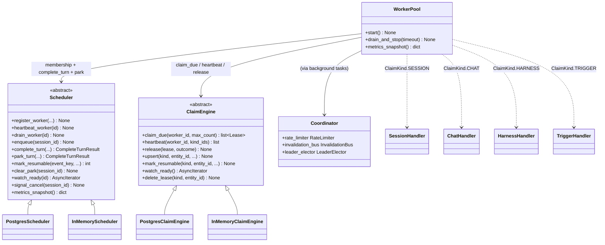
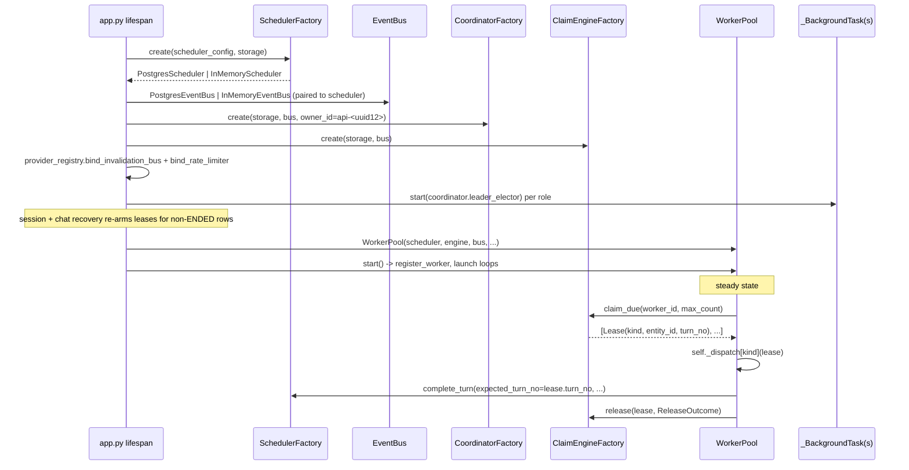

# Worker System

## 1. Purpose

The worker system is how Primer runs agent and graph work off the request path. An HTTP request never blocks on an LLM turn; instead the request persists an entity (a `WorkspaceSession`, a `Chat`, a `Harness` operation, a `Trigger`) and arms a claim, and a background worker pool picks the work up, runs exactly one turn, writes the result back to storage, and releases. The same machine runs in a single dev process and across a multi-node Postgres cluster with no code change; the only difference is which implementation of each coordination ABC the lifespan selects.

Three coordination ABCs carry the system, all under `primer/int/`:

- `Scheduler` (`primer/int/scheduler.py`) owns worker membership, the atomic turn-boundary write (`complete_turn`), the yielding-tool park lifecycle (`park_turn` / `mark_resumable` / `clear_park`), the best-effort `enqueue` / `watch_ready` wake hints, and `signal_cancel`.
- `ClaimEngine` (`primer/int/claim.py`) owns lease ownership for every claim kind: it answers `claim_due`, `heartbeat`, `release`, `upsert`, `mark_resumable`, `watch_ready`, and `delete_lease`. It absorbed the `SELECT ... FOR UPDATE SKIP LOCKED` lease machinery that the original scheduler spec drew inside `Scheduler`.
- `Coordinator` (`primer/int/coordinator.py`) bundles a `RateLimiter`, an `InvalidationBus`, and a `LeaderElector` so derived primitives (per-provider concurrency budgets, cross-process cache eviction, single-instance background tasks) share one selection seam.

The `WorkerPool` (`primer/worker/pool.py`) is the per-process consumer of all three: one claim loop, one bus loop, a heartbeat loop, and a cancel loop, dispatching each claimed lease by `ClaimKind` to a per-kind handler. Around the pool sit a family of leader-elected background tasks (`primer/bus/scheduler_tasks.py`, `primer/bus/watcher.py`, `primer/bus/mcp_tasks.py`, `primer/coordinator/sweeper.py`) that drive the parts of the system that have no external event source. This document covers that spine. The claim machine internals (the leases table, the per-kind `ClaimAdapter` contract, `build_claim_query` CTE composition) live in `docs/dev/architecture/claim-machine.md`; the Coordinator primitives live in `docs/dev/architecture/provider-pattern.md` and `docs/dev/architecture/observability.md`; per-entity behaviour lives in the sessions, chats, harness, and triggers subsystem docs.

## 2. Visual overview

The pool depends on three ABCs; each has an in-memory implementation for single-process dev and a Postgres implementation for distributed mode. The class diagram shows the spine plus the per-kind dispatch.

## 3. Public surface

`Scheduler` (`primer/int/scheduler.py`) is intentionally narrow. Its surface is worker membership (`register_worker` / `heartbeat_worker` / `drain_worker` / `deregister_worker` / `list_workers` returning `WorkerInfo`), `enqueue` (mark a session runnable and best-effort wake an idle worker), the strongly-atomic `complete_turn` (the only operation that must be transactional), the park trio `park_turn` / `mark_resumable` / `clear_park`, the `watch_ready` best-effort hint iterator, `signal_cancel`, and a synchronous `metrics_snapshot`. `complete_turn` and `park_turn` return `CompleteTurnResult` (`SUCCESS` / `LEASE_LOST` / `TURN_CONFLICT`); the worker uses `Lease.turn_no` as a fence token so a stale worker's write is rejected rather than overwriting a turn another worker already advanced. `FailureRecord` folds the failure write (`last_error` + `attempt_count`) into the same transaction as the lease release.

`ClaimEngine` (`primer/int/claim.py`) is the lease surface. `claim_due(worker_id, max_count)` returns a batch of `Lease` records across all kinds; `heartbeat(worker_id, kind_ids)` bulk-confirms ownership and returns the still-owned subset (anything dropped is a lost lease); `release(lease, outcome)` applies a `ReleaseOutcome` (`success`, optional `requeue_after`, `last_error`, `drop_lease`); `upsert` and `mark_resumable` arm or re-arm a claim; `watch_ready` yields `(ClaimKind, entity_id)` pairs that just became claimable; `delete_lease` removes a lease (used by force-delete). `ClaimKind` enumerates `SESSION`, `CHAT`, `HARNESS`, `TRIGGER`. The per-kind `ClaimAdapter` (eligibility SQL + `on_release` hook) is the extension point; its contract is documented in `docs/dev/architecture/claim-machine.md`.

`WorkerPool` (`primer/worker/pool.py`) exposes `start()` (generate `worker_id = wrk-<uuid12>`, register with the scheduler, push the lease TTL, launch the loops), `drain_and_stop(timeout)`, `metrics_snapshot()`, `worker_id`, and the test helper `run_one_turn_now(session_id)`. Configuration is `WorkerConfig` (`primer/model/scheduler.py`): `concurrency`, `claim_batch_size`, `heartbeat_interval_seconds`, `lease_ttl_seconds`, `poll_interval_seconds`, `drain_timeout_seconds`, `max_attempts`, `base_backoff_seconds`, `max_backoff_seconds`. A model validator enforces `lease_ttl_seconds >= 2 * heartbeat_interval_seconds` at construction so a single missed heartbeat cannot expire a lease. `RuntimeMode` (`api` / `worker` / `api+worker`, default `api+worker`) selects whether a process serves the API, runs the pool, or both.

The leader-elected background tasks share the `_BackgroundTask` base (`primer/bus/scheduler_tasks.py`): `start(elector)` either runs the loop unconditionally (no elector, legacy/test path) or supervises it under a `LeaderElector` lease so only the elected instance executes the work loop.

## 4. How to add a new implementation

There are two extension axes: a new backend for one of the coordination ABCs, and a new claim kind that the pool dispatches.

Adding a new `Scheduler` or `ClaimEngine` backend (rare; the Postgres and in-memory pair cover the deployment matrix):

1. **Subclass the ABC** under `primer/scheduler/` or `primer/claim/`, implementing every abstract method. The Postgres impls reuse the `StorageProvider` asyncpg pool rather than opening their own.
2. **Add a factory branch.** `SchedulerFactory.create` (`primer/scheduler/factory.py`) dispatches on `SchedulerProviderType`; `ClaimEngineFactory.create` (`primer/claim/factory.py`) dispatches on the event-bus type (`InMemoryEventBus` selects the in-memory engine; anything else selects Postgres), mirroring `CoordinatorFactory`.
3. **Keep weak-consistency boundaries.** Only `complete_turn` is allowed to require a single transaction; heartbeat, claim, and NOTIFY run out of band.

Adding a new claim kind (the common case; this is how chats, harnesses, and triggers each landed):

1. **Add the `ClaimKind` member** in `primer/int/claim.py`.
2. **Write a `ClaimAdapter`** under `primer/claim/adapters/` supplying `eligibility_sql()` (a JSONB predicate over the entity row) and `on_release(conn, entity_id, outcome)` (which advances the entity's own state, for example flipping `turn_status` back to `idle` or `claimable`). See `docs/dev/architecture/claim-machine.md`.
3. **Wire it into `ClaimEngineFactory.create`** so the new adapter is constructed with its `Storage[T]` handle alongside the existing four.
4. **Add a per-kind handler on `WorkerPool`** and register it in the `self._dispatch` table built in `start()` (`ClaimKind.X -> self._run_engine_x`). The handler claims, transitions the entity to a running state, runs one turn through the entity's dispatch module, and calls `engine.release(...)`.
5. **Arm the claim from the producer.** A REST handler or a trigger dispatcher calls `claim_engine.upsert(ClaimKind.X, entity_id, priority=...)` so the engine's `claim_ready` NOTIFY wakes the pool.
6. **Add tests** under `tests/claim/` (adapter eligibility) and `tests/worker/` (the engine-driven loop). Per the project memory, smoke-test the change with `uv run primer api` in the background and read keys from env vars in any gated tests.

## 5. Existing implementations

Scheduler (`primer/scheduler/`):

- `PostgresScheduler` reuses the `StorageProvider` asyncpg pool, owns the `workers` table (DDL emitted inline in `initialize()`), uses `LISTEN`/`NOTIFY` on `session_ready` and `session_cancel`, runs `complete_turn` / `park_turn` / `mark_resumable` / `clear_park` as `jsonb_set` updates against the session row, and exposes `metrics_snapshot` (notify-received and listen-reconnect counters) plus the async `metrics_db_snapshot` (sessions-by-status counts). It does not own the leases table; lease state lives in `primer/claim/postgres.py`.
- `InMemoryScheduler` mirrors the same surface with in-process dicts. It is not safe for multi-worker deployment; the lifespan logs a WARNING (not a hard reject) when it is paired with a worker runtime.

ClaimEngine (`primer/claim/`): `PostgresClaimEngine` (row-locked claim via `FOR UPDATE SKIP LOCKED`, NOTIFY on the engine-wide `claim_ready` channel) and `InMemoryClaimEngine` (single-process priority ordering). The four shipped adapters are `SessionClaimAdapter`, `ChatClaimAdapter`, `HarnessClaimAdapter`, and `TriggerClaimAdapter` under `primer/claim/adapters/`.

WorkerPool per-kind handlers (`primer/worker/pool.py`):

- `_run_engine_session` runs one workspace-session turn through `primer.session.dispatch.run_one_session_turn`, mediating workspace I/O through a `_WorkspaceIOShim` and installing the turn-log writer factory.
- `_run_engine_chat` atomically writes `Chat.turn_status='running'`, then drains the FIFO via `primer.chat.dispatch.run_one_chat_turn`.
- `_run_engine_harness` runs a harness fetch/install/sync/build/push operation.
- `_run_engine_trigger` fires a due trigger, enumerating missed cron ticks for `catchup='all'` via `iter_missed_fires` before firing the current tick.

The pool also still carries the legacy `_run_one_turn` (the pre-engine Scheduler-only path) which implements the same hot path (transient retry with `compute_backoff` exponential cap, fatal `-> ENDED/failed`, cancel/pause early-exit, yielding-tool park and resume, graph resume); the engine path is the production path.

Yielding-tool runtime (`primer/worker/yield_runtime.py`, `primer/worker/yield_resume_registry.py`, `primer/worker/graph_resume.py`): a tool returns a `Yielded` sentinel and the executor raises `YieldToWorker` carrying the in-progress `llm_messages`. The pool writes a `ParkedState` blob, releases the lease, and any worker resumes when an event flips the row to resumable. `classify_resume_payload` turns `__yield_timeout__` / `__yield_cancelled__` markers into `YieldTimeout` / `YieldCancelled`; `yield_resume_registry` resolves the resume hook purely from the parked blob's `tool_name`; `resume_graph_from_checkpoint` drives the approval-gate graph resume.

Background tasks (all `_BackgroundTask` subclasses, leader-elected): `TimerScheduler` (fans out `timer:*` parks on schedule), `TimeoutSweeper` (catches non-timer parks past `parked_until`), `ChatSweeper` and `HarnessSweeper` (legacy reconcilers), `WatcherManager` (`primer/bus/watcher.py`, resolves a per-workspace `HostInotifyProbe` or `WSWatchProbe` for `watch_files` parks), `McpTaskBridge` (`primer/bus/mcp_tasks.py`, polls parked `mcp_task:*` sessions), and `CoordinatorSweeper` (`primer/coordinator/sweeper.py`, deletes expired rate-limit and leader leases every 30s, started only when the bus is Postgres-backed). `YieldEventListener` (`primer/bus/listener.py`) is a non-elected per-process listener that flips parked rows to resumable on bus events.

## 6. Wiring

Nothing in the worker system constructs itself on the request path. The lifespan handler in `primer/api/app.py` is the single seam where storage, scheduler, event bus, coordinator, claim engine, worker pool, and the background tasks are stood up, in that dependency order, gated by `runtime_mode`. There are far more than two indirections between a producer (a REST handler) and the worker that runs the turn, so the sequence below shows the boot wiring and the steady-state claim flow.

Three wiring facts are load-bearing:

- **Bus type drives every selection.** `SchedulerFactory` dispatches on config; the event bus is paired to the scheduler flavour (`PostgresScheduler -> PostgresEventBus`, in-memory -> `InMemoryEventBus`); and both `CoordinatorFactory` and `ClaimEngineFactory` select their backend from `isinstance(event_bus, InMemoryEventBus)`. One runtime-mode/config choice configures the whole stack consistently.
- **Startup recovery makes persisted state usable across restarts.** Before the pool starts, the lifespan scans non-ENDED `WorkspaceSession` rows and stuck `Chat` rows and re-arms their `ClaimEngine` leases (and notifies the scheduler), so a process restart does not strand entities in a running state with no owner.
- **Cancel is dual-pathed.** The cancel API persists `cancel_requested_at` and publishes on `session:{sid}:cancel` (or `chat:{cid}:cancel`) for the engine-path `_cancel_watcher`, and also calls `scheduler.signal_cancel` (legacy `NOTIFY session_cancel`) which `_cancel_loop` fans out to local `_active_scopes`. Storage is the durable signal; the bus is the fast wake.

In `RuntimeMode.WORKER` the same FastAPI binary boots but `_mount_routers` mounts only `/v1/health`, `/v1/workers`, and `/v1/auth/*`; entity routers 404. Operators observe and control the pool through `GET /v1/workers` and `POST /v1/workers/{id}/drain`, and the `/v1/health` probe inlines `scheduler` and `worker_pool` snapshots (alive flag, in-flight / capacity counters, full `metrics_snapshot` dicts, degrading to empty dicts on instrumentation failure).

## 7. Testing patterns

- **Correctness suites parametrise across both backends.** `tests/scheduler/test_correctness.py` runs the scheduler contract against `InMemoryScheduler` and `PostgresScheduler`; the `tests/claim/` suite does the same for the claim engine. Keeping a real Postgres optional for everything except backend-specific tests is the point of shipping the in-memory peer.
- **Worker-pool integration tests live under `tests/worker/`.** `test_pool.py`, `test_cancel.py`, `test_retry.py`, and `test_turn.py` cover the core loop; `test_yield_park_resume.py`, `test_resume_branch.py`, `test_approval_resume.py`, and `test_pool_graph_resume.py` cover the yielding-tool and graph-resume paths; `test_chat_claim_loop.py`, `test_harness_claim_loop.py`, and `test_pool_trigger.py` exercise the per-kind engine dispatch. `WorkerPool.run_one_turn_now` is the deterministic single-step helper these tests use instead of waiting on the poll loop.
- **The distributed harness runs real subprocesses.** `tests/distributed/cluster.py` boots N API + M worker `primer` subprocesses against one session-scoped Postgres container with per-test `PRIMER_DB_SCHEMA` isolation. Scenarios under `tests/distributed/scenarios/` cover cross-process claim arbitration (`test_claim_engine.py`, asserting each of 50 directly-inserted leases is claimed exactly once), leader-election exclusivity for `ROLE_TIMER_SCHEDULER` (`test_leader_election.py`), the global rate-limit cap, the invalidation bus, WS streaming continuity, auto-bootstrap, and SIGTERM failure injection. The suite is gated behind the `distributed` pytest marker (`addopts = "-m 'not distributed'"`) and `testcontainers[postgres]`; run it with `uv run pytest tests/distributed/ -m distributed`.
- **Env-var spelling is `PRIMER_`.** The harness sets `PRIMER_RUNTIME_MODE` (`api` / `worker` / `api+worker`), `PRIMER_PORT`, and the nested `PRIMER_DB__CONFIG__*` / `PRIMER_SCHEDULER__CONFIG__*` keys (pydantic-settings `__` delimiter); workers also listen on a unique health port because the same FastAPI app underpins both modes.
- **The test-only instrumentation router** (`primer/api/routers/_test_endpoints.py`, `POST /v1/_test/acquire_rate_limit`) is mounted only when `PRIMER_ENABLE_TEST_ENDPOINTS=1` so the rate-limit scenario can hold a real coordinator lease without leaking into the production OpenAPI surface.

## 8. Historical decisions

- **Lease ownership migrated out of `Scheduler` into a polymorphic `ClaimEngine` covering session, chat, harness, and trigger.** Why: chats and harnesses needed the same `FOR UPDATE SKIP LOCKED` + LISTEN/NOTIFY lease machinery as sessions, so a per-kind `ClaimAdapter` over one engine replaced roughly three duplicated claim/heartbeat/release method-sets. Spec: docs/superpowers/specs/2026-05-10-background-execution-scheduler-design.md.
- **The unified `_engine_claim_loop` replaced three parallel claim loops.** Why: the backend-architecture audit measured ~18 methods and ~1500 LoC of duplicated claim semantics across sessions, chats, and harnesses; collapsing to one loop + a kind-to-handler dispatch table made adding `TRIGGER` one adapter rather than a new state machine. Spec: docs/superpowers/specs/2026-05-27-backend-architecture-audit.md.
- **`complete_turn` is the only strongly-atomic operation; everything else tolerates weak consistency.** Why: two-phase commit and strict ordering are expensive, so the at-least-once contract keeps the hot turn boundary in one Postgres transaction and runs heartbeat / claim / NOTIFY out of band, accepting occasional duplicate LLM calls. Spec: docs/superpowers/specs/2026-05-10-background-execution-scheduler-design.md.
- **Fence tokens (`turn_no` compare-and-set) with at-least-once execution mean `LEASE_LOST` / `TURN_CONFLICT` never escape the worker.** Why: this avoids cluster-wide locks while still preventing two workers from advancing the same turn; the worker discards its output when `complete_turn` rejects and the next claim re-runs the turn idempotently. Spec: docs/superpowers/specs/2026-05-10-background-execution-scheduler-design.md.
- **Hard cancel rides `asyncio.Task.cancel()` and accepts that uncommitted state is lost.** Why: cooperative cancel would have required every LLM stream and tool adapter to expose a cancel hook; riding `CancelledError` through the in-flight task and discarding anything not yet written to state was the simpler invariant. Spec: docs/superpowers/specs/2026-05-10-background-execution-scheduler-design.md.
- **`lease_ttl_seconds >= 2 * heartbeat_interval_seconds` is enforced at startup by a `WorkerConfig` validator.** Why: a single missed heartbeat must not expire a lease, which would cause a spurious `LEASE_LOST` and a duplicate turn; catching the misconfiguration before the worker starts beats flaky runtime behaviour. Spec: docs/superpowers/specs/2026-05-10-background-execution-scheduler-design.md.
- **`RuntimeMode` discriminates `api` / `worker` / `api+worker` so one binary runs as either or both.** Why: operators can colocate the pool with the API in single-node dev (default `api+worker`) and still split deployments; `_mount_routers` makes the difference observable by mounting only health + workers in `worker` mode. Spec: docs/superpowers/specs/2026-05-10-background-execution-scheduler-design.md.
- **`InMemoryScheduler` ships as a peer of `PostgresScheduler` rather than a Postgres-only path.** Why: unit tests and single-process dev need a scheduler without a real database, and parametrising the correctness suite across both impls keeps behaviour aligned while leaving real Postgres optional in CI. Spec: docs/superpowers/specs/2026-05-10-background-execution-scheduler-design.md.
- **An `InMemoryScheduler` paired with a worker runtime only warns; it is not hard-rejected.** Why: the backend-architecture audit flagged the silent-double-claim risk as a CRITICAL fix, but the lifespan still logs a WARNING rather than refusing to boot, so this remains a known limitation. Spec: docs/superpowers/specs/2026-05-27-backend-architecture-audit.md.
- **The yielding-tool park lives in five typed columns on the entity row, and parking releases the lease in the same atomic UPDATE.** Why: clean B-tree indexes and ops queries beat a single JSONB blob, and releasing the lease inside the park statement makes a worker restart between park and release impossible while a double-publish resumable flip is a no-op. Spec: docs/superpowers/specs/2026-05-22-yielding-tools-design.md.
- **Park state is re-read from storage on resume; the parked blob deliberately does not pin the agent or graph row.** Why: an operator hot-fixing a prompt during a long park sees the new prompt take effect on the next LLM call, and terminal sessions are never resumed. Spec: docs/superpowers/specs/2026-05-22-yielding-tools-design.md.
- **The `Coordinator` ABC bundles `RateLimiter` + `InvalidationBus` + `LeaderElector` selected off the event-bus flavour.** Why: derived primitives (adapter rate limiting, cache invalidation, background-task election) were silently per-process even after the underlying ABCs were promoted; one bundle gives every later abstraction a single selection seam and makes single-mode boot zero-config. Spec: docs/superpowers/specs/2026-05-27-coordinator-design.md.
- **Background tasks are leader-elected through `_BackgroundTask.start(elector)` rather than running on every process.** Why: `TimerScheduler`, the sweepers, `WatcherManager`, and `McpTaskBridge` would otherwise duplicate work on every API process in distributed mode; the supervisor loop races the work loop against lease loss and retries on every leadership transition, and tolerates a transient Postgres outage with a 15-second backoff. Spec: docs/superpowers/specs/2026-05-27-coordinator-design.md.
- **`CoordinatorSweeper` is gated on the event-bus type, not on runtime mode.** Why: an in-memory bus implies SQLite storage with no asyncpg pool, so the sweep `DELETE`s would crash every 30 seconds; the defensive `isinstance(event_bus, PostgresEventBus)` check stops that foot-gun. Spec: docs/superpowers/specs/2026-05-27-coordinator-design.md.
- **Per-session and per-chat startup recovery loops re-arm leases against persisted rows after a restart.** Why: persisted entities must survive a process restart, so the lifespan scans non-ENDED sessions and stuck chats and re-arms their claim leases rather than leaving them stranded with no owner. Spec: docs/superpowers/specs/2026-05-27-backend-architecture-audit.md.
- **Chats run as detached worker turns claimed via `ClaimKind.CHAT`; lease ownership never moved onto the `Chat` row.** Why: the cluster-2 `ClaimEngine` landed first and absorbed lease ownership, so a `ChatClaimAdapter` exposes eligibility over the existing `Chat` fields and `on_release` flips `turn_status` back to idle/claimable rather than carrying `claimed_by` / `claimed_at` / `last_heartbeat_at` columns in two places. Spec: docs/superpowers/specs/2026-05-27-chat-turn-detachment-design.md.
- **Time-based triggers ride the existing `ClaimEngine` (with `next_attempt_at = next_fire_at`) instead of a dedicated `LeaderElector`.** Why: `FOR UPDATE SKIP LOCKED` on Postgres (a single-process lock in-memory) already gives at-most-once claim, so adding `TRIGGER` as a fourth adapter reused the whole claim lifecycle. Spec: docs/superpowers/specs/2026-06-01-triggers-and-subscriptions-design.md.
- **Graph-bound sessions can park only at the tool-approval gate today via `ParkedState.graph_checkpoint` and `resume_graph_from_checkpoint`.** Why: arbitrary yielding tools inside a graph were deferred to a later milestone, so the code ships a narrow approval-only graph park that the worker resumes from the checkpoint with bypass-approval semantics. Spec: docs/superpowers/specs/2026-05-22-yielding-tools-design.md.
- **The distributed test harness boots real `primer` subprocesses against one session-scoped Postgres container with per-test schema isolation.** Why: cross-process claim arbitration, leader-election exclusivity, and the global rate limiter cannot be exercised in-process, and a session-scoped container with `CREATE SCHEMA` / `DROP SCHEMA CASCADE` per test keeps the whole suite inside its runtime budget. Spec: docs/superpowers/specs/2026-05-27-distributed-test-harness-design.md.
- **The turn-log writer family was placed under `primer/observability/`, not the session subsystem.** Why: the writer is shared by agent sessions and both graph executors, so keeping it in the session package would force graph code to import upward into sessions; the cross-cutting observability module is owned by neither. Spec: docs/superpowers/specs/2026-06-05-per-session-turn-log-design.md.
