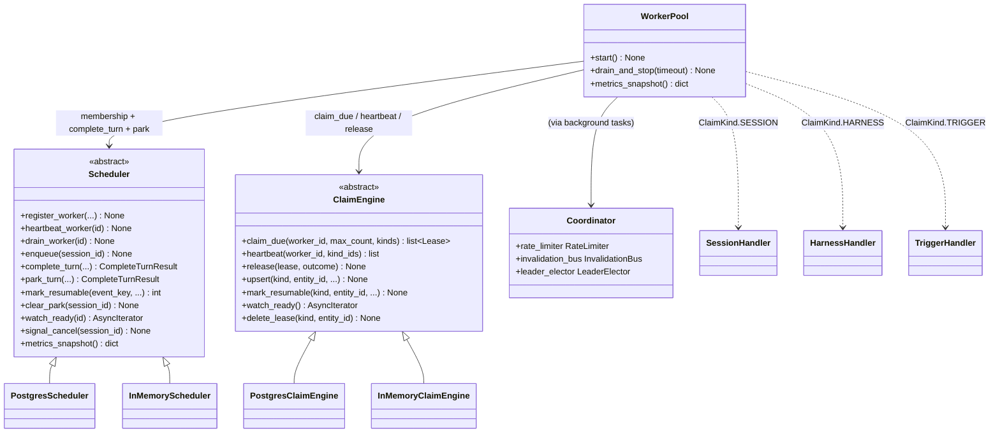
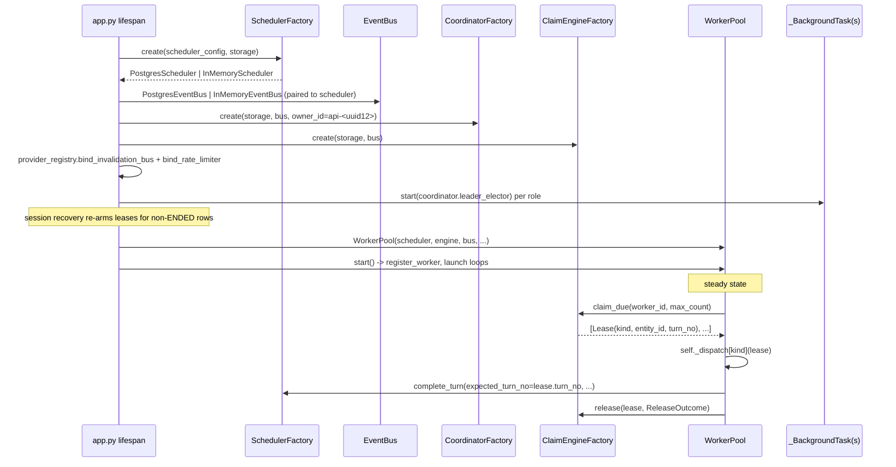
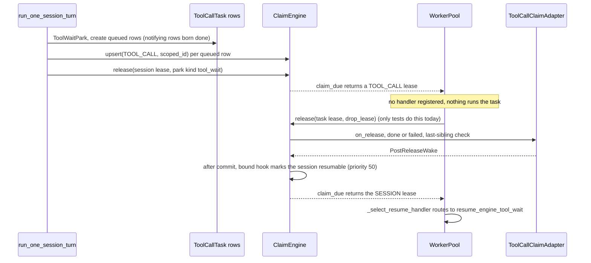

# Worker System

## 1. Purpose

The worker system is how Primer runs agent and graph work off the request path. An HTTP request never blocks on an LLM turn; instead the request persists an entity (a `WorkspaceSession`, a `Harness` operation, a `Trigger`) and arms a claim, and a background worker pool picks the work up, runs exactly one turn, writes the result back to storage, and releases. The same machine runs in a single dev process and across a multi-node Postgres cluster with no code change; the only difference is which implementation of each coordination ABC the lifespan selects.

Three coordination ABCs carry the system, all under `primer/int/`:

- `Scheduler` (`primer/int/scheduler.py`) owns worker membership, the atomic turn-boundary write (`complete_turn`), the yielding-tool park lifecycle (`park_turn` / `mark_resumable` / `clear_park`), the best-effort `enqueue` / `watch_ready` wake hints, and `signal_cancel`.
- `ClaimEngine` (`primer/int/claim.py`) owns lease ownership for every claim kind: it answers `claim_due`, `heartbeat`, `release`, `upsert`, `mark_resumable`, `watch_ready`, and `delete_lease`. It absorbed the `SELECT ... FOR UPDATE SKIP LOCKED` lease machinery that the original scheduler spec drew inside `Scheduler`.
- `Coordinator` (`primer/int/coordinator.py`) bundles a `RateLimiter`, an `InvalidationBus`, and a `LeaderElector` so derived primitives (per-provider concurrency budgets, cross-process cache eviction, single-instance background tasks) share one selection seam.

The `WorkerPool` (`primer/worker/pool.py`) is the per-process consumer of all three: one claim loop, one bus loop, a heartbeat loop, a cancel loop, and a cancel-reconcile loop, dispatching each claimed lease by `ClaimKind` to a per-kind handler. Around the pool sit a family of leader-elected background tasks (`primer/bus/scheduler_tasks.py`, `primer/bus/watcher.py`, `primer/bus/mcp_tasks.py`, `primer/coordinator/sweeper.py`) that drive the parts of the system that have no external event source. This document covers that spine. The claim machine internals (the leases table, the per-kind `ClaimAdapter` contract, `build_claim_query` CTE composition) live in `docs/dev/architecture/claim-machine.md`; the Coordinator primitives live in `docs/dev/architecture/provider-pattern.md` and `docs/dev/architecture/observability.md`; per-entity behaviour lives in the sessions, harness, and triggers subsystem docs.

## 2. Visual overview

The pool depends on three ABCs; each has an in-memory implementation for single-process dev and a Postgres implementation for distributed mode. The class diagram shows the spine plus the per-kind dispatch.

```mermaid
classDiagram
    class Scheduler {
        <<abstract>>
        +register_worker(...) None
        +heartbeat_worker(id) None
        +drain_worker(id) None
        +enqueue(session_id) None
        +complete_turn(...) CompleteTurnResult
        +park_turn(...) CompleteTurnResult
        +mark_resumable(event_key, ...) int
        +clear_park(session_id) None
        +watch_ready(id) AsyncIterator
        +signal_cancel(session_id) None
        +metrics_snapshot() dict
    }
    class ClaimEngine {
        <<abstract>>
        +claim_due(worker_id, max_count, kinds) list~Lease~
        +heartbeat(worker_id, kind_ids) list
        +release(lease, outcome) None
        +upsert(kind, entity_id, ...) None
        +mark_resumable(kind, entity_id, ...) None
        +watch_ready() AsyncIterator
        +delete_lease(kind, entity_id) None
    }
    class Coordinator {
        +rate_limiter RateLimiter
        +invalidation_bus InvalidationBus
        +leader_elector LeaderElector
    }
    class WorkerPool {
        +start() None
        +drain_and_stop(timeout) None
        +metrics_snapshot() dict
    }

    Scheduler <|-- PostgresScheduler
    Scheduler <|-- InMemoryScheduler
    ClaimEngine <|-- PostgresClaimEngine
    ClaimEngine <|-- InMemoryClaimEngine

    WorkerPool --> Scheduler : membership + complete_turn + park
    WorkerPool --> ClaimEngine : claim_due / heartbeat / release
    WorkerPool --> Coordinator : (via background tasks)

    WorkerPool ..> SessionHandler : ClaimKind.SESSION
    WorkerPool ..> HarnessHandler : ClaimKind.HARNESS
    WorkerPool ..> TriggerHandler : ClaimKind.TRIGGER
```

## 3. Public surface

`Scheduler` (`primer/int/scheduler.py`) is intentionally narrow. Its surface is worker membership (`register_worker` / `heartbeat_worker` / `drain_worker` / `deregister_worker` / `list_workers` returning `WorkerInfo`), `enqueue` (mark a session runnable and best-effort wake an idle worker), the strongly-atomic `complete_turn` (the only operation that must be transactional), the park trio `park_turn` / `mark_resumable` / `clear_park`, the `watch_ready` best-effort hint iterator, `signal_cancel`, and a synchronous `metrics_snapshot`. `complete_turn` and `park_turn` return `CompleteTurnResult` (`SUCCESS` / `LEASE_LOST` / `TURN_CONFLICT`); the worker uses `Lease.turn_no` as a fence token so a stale worker's write is rejected rather than overwriting a turn another worker already advanced. `FailureRecord` folds the failure write (`last_error` + `attempt_count`) into the same transaction as the lease release.

`ClaimEngine` (`primer/int/claim.py`) is the lease surface. `claim_due(worker_id, max_count, kinds=None)` returns a batch of `Lease` records (all kinds by default, or only the listed kinds); `heartbeat(worker_id, kind_ids)` bulk-confirms ownership and returns the still-owned subset (anything dropped is a lost lease); `release(lease, outcome)` applies a `ReleaseOutcome` (`success`, optional `requeue_after`, `last_error`, `drop_lease`, `park`, `preserve_park`, `entity_noop`); `upsert` and `mark_resumable` arm or re-arm a claim; `watch_ready` yields `(ClaimKind, entity_id)` pairs that just became claimable; `delete_lease` removes a lease (used by force-delete); `bind_post_release_hook` registers the callable the engine runs after a release commits. `ClaimKind` enumerates `SESSION`, `HARNESS`, `TRIGGER`, `TOOL_CALL`. The per-kind `ClaimAdapter` (eligibility SQL + `on_release` hook) is the extension point; its contract is documented in `docs/dev/architecture/claim-machine.md`.

`WorkerPool` (`primer/worker/pool.py`) exposes `start()` (generate `worker_id = wrk-<uuid12>`, register with the scheduler, push the lease TTL, launch the loops), `drain_and_stop(timeout)`, `metrics_snapshot()`, `worker_id`, and the test helper `run_one_turn_now(session_id)`. Configuration is `WorkerConfig` (`primer/model/scheduler.py`): `concurrency`, `claim_batch_size`, `heartbeat_interval_seconds`, `lease_ttl_seconds`, `poll_interval_seconds`, `drain_timeout_seconds`, `max_attempts`, `base_backoff_seconds`, `max_backoff_seconds`, plus two Phase 3 stage 7a fields: `tool_calls_as_claims_enabled` (default `False`; each tool call of a batch becomes its own claimable `ToolCallTask`) and `tool_call_reserved_concurrency` (default `None`; slots carved out of `concurrency` for `TOOL_CALL` claims; takes effect only when the pool has a `TOOL_CALL` handler, which none registers today). A model validator enforces `lease_ttl_seconds >= 2 * heartbeat_interval_seconds` at construction so a single missed heartbeat cannot expire a lease. `RuntimeMode` (`api` / `worker` / `api+worker`, default `api+worker`) selects whether a process serves the API, runs the pool, or both.

The leader-elected background tasks share the `_BackgroundTask` base (`primer/bus/scheduler_tasks.py`): `start(elector)` either runs the loop unconditionally (no elector, legacy/test path) or supervises it under a `LeaderElector` lease so only the elected instance executes the work loop.

## 4. How to add a new implementation

There are two extension axes: a new backend for one of the coordination ABCs, and a new claim kind that the pool dispatches.

Adding a new `Scheduler` or `ClaimEngine` backend (rare; the Postgres and in-memory pair cover the deployment matrix):

1. **Subclass the ABC** under `primer/scheduler/` or `primer/claim/`, implementing every abstract method. The Postgres impls reuse the `StorageProvider` asyncpg pool rather than opening their own.
2. **Add a factory branch.** `SchedulerFactory.create` (`primer/scheduler/factory.py`) dispatches on `SchedulerProviderType`; `ClaimEngineFactory.create` (`primer/claim/factory.py`) dispatches on the event-bus type (`InMemoryEventBus` selects the in-memory engine; anything else selects Postgres), mirroring `CoordinatorFactory`.
3. **Keep weak-consistency boundaries.** Only `complete_turn` is allowed to require a single transaction; heartbeat, claim, and NOTIFY run out of band.

Adding a new claim kind (the common case; this is how harnesses and triggers each landed):

1. **Add the `ClaimKind` member** in `primer/int/claim.py`.
2. **Write a `ClaimAdapter`** under `primer/claim/adapters/` supplying `eligibility_sql()` (a JSONB predicate over the entity row) and `on_release(conn, entity_id, outcome)` (which advances the entity's own state, for example flipping `turn_status` back to `idle` or `claimable`). See `docs/dev/architecture/claim-machine.md`.
3. **Wire it into `ClaimEngineFactory.create`** so the new adapter is constructed with its `Storage[T]` handle alongside the existing four.
4. **Add a per-kind handler on `WorkerPool`** and register it in the `self._dispatch` table built in `start()` (`ClaimKind.X -> self._run_engine_x`). The handler claims, transitions the entity to a running state, runs one turn through the entity's dispatch module, and calls `engine.release(...)`. `ClaimKind.TOOL_CALL` has steps 1 to 3 and 5 but no step 4 today; see "Tool-call claims" in section 5.
5. **Arm the claim from the producer.** A REST handler or a trigger dispatcher calls `claim_engine.upsert(ClaimKind.X, entity_id, priority=...)` so the engine's `claim_ready` NOTIFY wakes the pool.
6. **Add tests** under `tests/claim/` (adapter eligibility) and `tests/worker/` (the engine-driven loop). Per the project memory, smoke-test the change with `uv run primer api` in the background and read keys from env vars in any gated tests.

## 5. Existing implementations

Scheduler (`primer/scheduler/`):

- `PostgresScheduler` reuses the `StorageProvider` asyncpg pool, owns the `workers` table (DDL emitted inline in `initialize()`), uses `LISTEN`/`NOTIFY` on `session_ready` and `session_cancel`, runs `complete_turn` / `park_turn` / `mark_resumable` / `clear_park` as `jsonb_set` updates against the session row, and exposes `metrics_snapshot` (notify-received and listen-reconnect counters) plus the async `metrics_db_snapshot` (sessions-by-status counts). Its LISTEN watchers learn of a dropped connection (a Postgres restart or failover, a network blip) from asyncpg's termination listener, because asyncpg never raises into the NOTIFY queue: the watcher logs a WARNING naming the channel, releases the dead connection, waits `listen_reconnect_seconds` (default 2.0), and reopens. `primer_scheduler_listen_reconnects_total` counts every open attempt after the first one, failed or successful, so an outage that outlasts several intervals reads as several reconnects. NOTIFYs sent meanwhile are lost; for `session_cancel` that costs the hard preempt of a running turn until the pool's cancel reconciler (section 6) finds the cancel on the session row, and the cancel is also published on the event bus. It does not own the leases table; lease state lives in `primer/claim/postgres.py`.
- `InMemoryScheduler` mirrors the same surface with in-process dicts. It is not safe for multi-worker deployment; the lifespan logs a WARNING (not a hard reject) when it is paired with a worker runtime.

ClaimEngine (`primer/claim/`): `PostgresClaimEngine` (row-locked claim via `FOR UPDATE SKIP LOCKED`, NOTIFY on the engine-wide `claim_ready` channel) and `InMemoryClaimEngine` (single-process priority ordering). The four shipped adapters are `SessionClaimAdapter`, `HarnessClaimAdapter`, `TriggerClaimAdapter` and `ToolCallClaimAdapter` under `primer/claim/adapters/`.

WorkerPool per-kind handlers (`primer/worker/pool.py`):

- `_run_engine_session` runs one workspace-session turn through `primer.session.dispatch.run_one_session_turn`, mediating workspace I/O through a `_WorkspaceIOShim` and installing the turn-log writer factory.
- `_run_engine_harness` runs a harness fetch/install/sync/build/push operation.
- `_run_engine_trigger` fires a due trigger, enumerating missed cron ticks for `catchup='all'` via `iter_missed_fires` before firing the current tick.

The pool also still carries the legacy `_run_one_turn` (the pre-engine Scheduler-only path) which implements the same hot path (transient retry with `compute_backoff` exponential cap, fatal `-> ENDED/failed`, cancel/pause early-exit, yielding-tool park and resume, graph resume); the engine path is the production path.

Yielding-tool runtime (`primer/worker/yield_runtime.py`, `primer/worker/yield_resume_registry.py`, `primer/worker/graph_resume.py`): a tool returns a `Yielded` sentinel and the executor raises `YieldToWorker` carrying the in-progress `llm_messages`. The pool writes a `ParkedState` blob, releases the lease, and any worker resumes when an event flips the row to resumable. `classify_resume_payload` turns `__yield_timeout__` / `__yield_cancelled__` markers into `YieldTimeout` / `YieldCancelled`; `yield_resume_registry` resolves the resume hook purely from the parked blob's `tool_name`; `resume_graph_from_checkpoint` drives the approval-gate graph resume.

Background tasks (all `_BackgroundTask` subclasses, leader-elected): `TimerScheduler` (fans out `timer:*` parks on schedule), `TimeoutSweeper` (catches non-timer parks past `parked_until`), `ChatSweeper` and `HarnessSweeper` (legacy reconcilers), `WatcherManager` (`primer/bus/watcher.py`, resolves a per-workspace `HostInotifyProbe` or `WSWatchProbe` for `watch_files` parks), `McpTaskBridge` (`primer/bus/mcp_tasks.py`, polls parked `mcp_task:*` sessions), and `CoordinatorSweeper` (`primer/coordinator/sweeper.py`, deletes expired rate-limit and leader leases every 30s, started only when the bus is Postgres-backed). `YieldEventListener` (`primer/bus/listener.py`) is a non-elected per-process listener that flips parked rows to resumable on bus events.

### Tool-call claims

The pool side of Phase 3 stage 7a (the `ToolCallTask` entity, its adapter, the flag and the dispatch seam are described in `docs/dev/architecture/claim-machine.md`, section 5) is three pieces plus one gap.

- **Resume routing.** When a resumable session is claimed, `_select_resume_handler` peeks at `parked_state["kind"]`: `"tool_wait"` goes to `_resume_engine_tool_wait`, which delegates to `resume_engine_tool_wait` in `primer/worker/tool_wait_resume_coordinator.py`; everything else goes to `_resume_engine_session`. The peek happens before `session_resume_coordinator` is entered because that module rehydrates a `Yielded`-shaped blob and must never see a batch park; it also carries a tripwire that fails loudly if the routing is bypassed.
- **The coordinator** is read-and-materialise only. Every sibling `ToolCallTask` is terminal by construction (the last release re-armed the session), so it assembles one tool-role message from the tasks' `result_state`, injects it through the executor, writes the `TOOL_RESULT` records and releases with `drop_lease=False`, so the next claim runs an ordinary continuation turn. It fails the session if a task is missing or not terminal. A graph-bound park (`parked_state.graph_checkpoint` present) goes to `resume_graph_tool_wait`, which checks readiness per node because a fan-out sibling's last-task wake can fire while another node's batch is still outstanding; ready nodes resume and the rest re-park.
- **Reserved capacity.** `_select_claim_loop` (decided once, in `start()`) returns `_engine_claim_loop_reserved` only when `tool_call_reserved_concurrency` is set and `self._dispatch` contains a `TOOL_CALL` handler. That loop counts free slots separately for a `TOOL_CALL` reserve and for everything else and calls `claim_due(kinds=...)` for each, so a burst of delegate-tool tasks (which can block on an untimed provider-slot acquire while holding a pool slot) cannot starve session claims, nor the reverse.
- **The gap: the handler.** `start()` registers `_run_engine_session`, `_run_engine_harness` and `_run_engine_trigger` only. There is no `_run_engine_tool_call`, so the reserved loop is unreachable, a claimed `TOOL_CALL` lease is logged as `no handler for kind` and abandoned to expire, and nothing executes a queued task. A handler would have to verify that the task id is still referenced by the owning session's live `tool_wait` `parked_state` before executing (a crash-retry that re-emits a different batch orphans the earlier rows; the invariant is recorded in the coordinator's module docstring), rehydrate the call with `read_tool_call_record`, restore the graph node scope for graph-bound calls, and release with a `park`, a terminal outcome or a retry.

## 6. Wiring

Nothing in the worker system constructs itself on the request path. The lifespan handler in `primer/api/app.py` is the single seam where storage, scheduler, event bus, coordinator, claim engine, worker pool, and the background tasks are stood up, in that dependency order, gated by `runtime_mode`. There are far more than two indirections between a producer (a REST handler) and the worker that runs the turn, so the sequence below shows the boot wiring and the steady-state claim flow.

```mermaid
sequenceDiagram
    participant Lifespan as app.py lifespan
    participant Sched as SchedulerFactory
    participant Bus as EventBus
    participant Coord as CoordinatorFactory
    participant Engine as ClaimEngineFactory
    participant Pool as WorkerPool
    participant BG as _BackgroundTask(s)

    Lifespan->>Sched: create(scheduler_config, storage)
    Sched-->>Lifespan: PostgresScheduler | InMemoryScheduler
    Lifespan->>Bus: PostgresEventBus | InMemoryEventBus (paired to scheduler)
    Lifespan->>Coord: create(storage, bus, owner_id=api-<uuid12>)
    Lifespan->>Engine: create(storage, bus)
    Lifespan->>Lifespan: provider_registry.bind_invalidation_bus + bind_rate_limiter
    Lifespan->>BG: start(coordinator.leader_elector) per role
    Note over Lifespan: session recovery re-arms leases for non-ENDED rows
    Lifespan->>Pool: WorkerPool(scheduler, engine, bus, ...)
    Lifespan->>Pool: start() -> register_worker, launch loops

    Note over Pool: steady state
    Pool->>Engine: claim_due(worker_id, max_count)
    Engine-->>Pool: [Lease(kind, entity_id, turn_no), ...]
    Pool->>Pool: self._dispatch[kind](lease)
    Pool->>Sched: complete_turn(expected_turn_no=lease.turn_no, ...)
    Pool->>Engine: release(lease, ReleaseOutcome)
```

The load-bearing wiring facts:

- **Bus type drives every selection.** `SchedulerFactory` dispatches on config; the event bus is paired to the scheduler flavour (`PostgresScheduler -> PostgresEventBus`, in-memory -> `InMemoryEventBus`); and both `CoordinatorFactory` and `ClaimEngineFactory` select their backend from `isinstance(event_bus, InMemoryEventBus)`. One runtime-mode/config choice configures the whole stack consistently.
- **Startup recovery makes persisted state usable across restarts.** Before the pool starts, the lifespan scans non-ENDED `WorkspaceSession` rows and re-arms their `ClaimEngine` leases (and notifies the scheduler), so a process restart does not strand entities in a running state with no owner.
- **Cancel is dual-pathed, and the session row is the backstop.** The cancel API persists `cancel_requested` (and `cancel_requested_at`) on the session row and publishes on `session:{sid}:cancel` for the engine-path `_cancel_watcher` (cooperative: it is checked between stream events). It also calls `scheduler.signal_cancel` (`NOTIFY session_cancel`), which `_cancel_loop` fans out to the local `_active_scopes` as a hard preempt of a turn blocked in a long LLM or tool call. NOTIFY is not durable: one sent while the scheduler's LISTEN watcher is reconnecting, on a half-open connection that has not been detected yet, or before the first LISTEN, reaches nobody. So `_cancel_reconcile_loop` re-reads `cancel_requested` for every SESSION scope this worker holds and preempts the ones that are set. It runs every `heartbeat_interval_seconds` (default 10; there is no separate setting, the cadence follows the heartbeat interval), so a lost NOTIFY delays the hard preempt by about that long instead of losing it. It is its own task and never a step of `_heartbeat_loop`: a row read can block for the pool's `command_timeout` (30s), which inside the heartbeat loop would delay lease heartbeats past the lease TTL. Each preempt it makes increments `primer_worker_cancels_reconciled_total` (in `WorkerPool.metrics_snapshot()` and under `worker_pool.metrics` in `/v1/health`); a rate above zero means NOTIFYs are being lost. Only `cancel_requested` is reconciled: Interrupt (Stop) publishes only the bus key and stays cooperative.
- **A user cancel is delivered to a turn once.** `_CancelScope.cancel_once` (used by `_cancel_loop` and the reconciler) cancels at most once per scope. A second cancel landing while `_run_engine_session` is converging a preempted session to ENDED would skip the convergence and strand the session RUNNING with its lease dropped, which a double-clicked Cancel could already cause. The forced paths (a lease lost in `_heartbeat_loop`, `worker_drain_timeout`) keep the unconditional `_CancelScope.cancel`, because they must be able to push a turn that is stuck unwinding.
- **A duplicate claim of an in-flight key is skipped and left alone.** `claim_due` re-claims any lease whose `expires_at` has passed, including this worker's own claim, so when a heartbeat stalls past `lease_ttl_seconds` while a turn is still running, the pool's own claim loop claims the same `(kind, id)` again. `worker_id` is minted per pool start, so that can only happen in the pool that is still running the first execution. `WorkerPool._reserve_and_dispatch` skips any lease whose key is already in `_in_flight` and does nothing else with it: no dispatch, no new cancel scope, no release, no requeue (a requeue clears `claimed_by`, the next heartbeat then reports the key lost and cancels the only executor). The re-claim already re-stamped the row the in-flight execution's heartbeat keeps alive, so the execution carries on and is confirmed by its next heartbeat. Before this, a second executor was dispatched for the same session: two concurrent copies of one turn (duplicate LLM calls and tool runs, racing transcript and session-row writes) with the first copy's cancel scope orphaned. Each skip logs a WARNING and increments `primer_worker_duplicate_claims_total` (in `WorkerPool.metrics_snapshot()` and under `worker_pool.metrics` in `/v1/health`); a rate above zero typically means heartbeats are stalling past the TTL (an event-loop block or a slow database); the two residual cases below also count. The engine release fence stays `claimed_by` only, with no `claimed_at` term, because of a pool invariant: every `engine.release` of a lease completes before its key leaves `_in_flight` (each handler releases from inside itself, before `_run_engine`'s `finally`), so a release carrying an older `claimed_at` is the sole execution finishing, never a zombie, and a `claimed_at` term would only drop its `on_release`. The invariant holds on every normal and exception path; on an abnormal one (a release that raises, a second cancel landing inside the handler's `finally`, a harness handler that fails before its release) the key is discarded without the release, which cannot create a concurrent executor (the task is dead): the lease stays claimed by this worker, is no longer heartbeated, expires after one lease TTL and is claimed again. Two residuals. (1) Bounded by one lease TTL of latency, no work lost: a duplicate that lands between the release commit and the discard of the key (the window spans the session handler's re-arm) is skipped and leaves a claimed lease with no executor, which expires and is claimed again. (2) NOT bounded by a TTL, and it can lose work (tracked as task 01a1084f): a preempted execution that is still unwinding keeps its key in `_in_flight`. If a peer meanwhile finished the work and re-armed the row, and this worker's claim loop claimed that fresh row, the duplicate is skipped and the unwinding handler's release (`success=False, drop_lease=True`) then matches the fresh row on `claimed_by` alone and DELETES it. A session recovers only if something re-arms it; a harness lease has no re-arm. It needs a stalled heartbeat, a peer's claim and a full claim cycle inside the unwind window; before the skip, the same sequence ran a second executor instead.
- **The heartbeat decides "lost" from the keys it sent.** `_heartbeat_loop` sends the in-flight keys to `ClaimEngine.heartbeat` and cancels (`"preempted"`) the execution of every SENT key the engine does not confirm. It diffs against a snapshot taken before the call, and captures each key's cancel scope with it. A key dispatched while the round trip is outstanding was never sent, so it is not reported lost (it used to be cancelled at its start, and for a session the default `success=False` outcome then appended a terminal ERROR message record), and a key that finished and was dispatched again during the round trip keeps its new scope. A sent key whose `_run_engine` task had not registered its scope yet has nothing to cancel in that round trip and is caught one heartbeat interval later. The lost-lease cancel stays unconditional (`scope.cancel`, not `cancel_once`) so a lease lost mid-turn can still push a turn that is stuck unwinding.
- **A draining pool starts nothing new.** `drain_and_stop` sets `_stopping`, then stops claiming before it waits for anything: the bus loop is cancelled, the claim loop is given up to a few seconds to finish the iteration it is in (it exits on `_stopping` at its next check, and re-checks it after clearing the wake event so a long poll interval cannot hide the signal; cancelling a `claim_due` mid-flight would leave rows claimed here with nothing running them until their TTL), and the leases handed back are awaited, bounded by the same grace. A claim already inside `claim_due` when shutdown begins returns its leases afterwards; `_reserve_and_dispatch` used to dispatch them anyway, so a rolling deploy that coincided with a claim started turns that then had to finish inside whatever drain budget remained or be killed (failed or half-run turns). It now returns each such lease untouched: `ReleaseOutcome(success=True, entity_noop=True)`, so no `on_release` runs and the entity is not read or written (a resumable session keeps its park; a harness operation and a trigger are not marked done or advanced without having run), the lease is claimable at once (a peer takes it at its next poll; there is no `pg_notify` on release), and its `attempt_count`, `last_error` and place in line are unchanged. A same-worker duplicate of an in-flight key is still skipped and left alone (see above). Each hand-back that succeeds is counted in `primer_worker_claims_returned_on_drain_total`, and each that fails in `primer_worker_claim_returns_failed_on_drain_total` (both in `WorkerPool.metrics_snapshot()`; the first also under `worker_pool.metrics` in `/v1/health`). If a hand-back fails or is still pending when the grace ends, or the claim task is stuck in the database past it and is cancelled, the lease stays claimed by this worker with nothing heartbeating it, expires after one lease TTL and is claimed by a peer: slower, not lost.
- **A draining pool keeps what it already runs.** Stopping claims is not stopping keeping: the lease heartbeat, lost-lease detection (`_heartbeat_loop`, which also keeps the worker row's `last_heartbeat` fresh, because a stale one is what marks a worker dead and a draining worker is still alive) and both cancel loops (`_cancel_loop`, `_cancel_reconcile_loop`) run until `_keepalive_done` is set, which `drain_and_stop` does after the turn tasks have finished, or until an absolute deadline (`drain_timeout_seconds` plus 30 s, set when the drain starts) passes, so a turn task that ignores its cancel cannot hold a lease alive for ever. They used to exit on `_stopping`, within one heartbeat interval of the drain starting, while a drain waits up to `drain_timeout_seconds` (default 120) for running turns and a lease lives `lease_ttl_seconds` (default 30): a turn still running 30 s into a rollout lost its lease, a peer's `claim_due` took it (an expired lease is eligible) and ran a DUPLICATE execution, the draining worker never learned of it (lost-lease detection ran in the same loop) and its final release was fence-skipped silently, and a user Cancel during the drain was only cooperative.

The tool_wait path (flag on) crosses the same seams, with the step nothing performs today marked:

```mermaid
sequenceDiagram
    participant Turn as run_one_session_turn
    participant Rows as ToolCallTask rows
    participant Engine as ClaimEngine
    participant Pool as WorkerPool
    participant Adapter as ToolCallClaimAdapter

    Turn->>Rows: ToolWaitPark, create queued rows (notifying rows born done)
    Turn->>Engine: upsert(TOOL_CALL, scoped_id) per queued row
    Turn->>Engine: release(session lease, park kind tool_wait)
    Engine-->>Pool: claim_due returns a TOOL_CALL lease
    Note over Pool: no handler registered, nothing runs the task
    Pool->>Engine: release(task lease, drop_lease) (only tests do this today)
    Engine->>Adapter: on_release, done or failed, last-sibling check
    Adapter-->>Engine: PostReleaseWake
    Engine->>Engine: after commit, bound hook marks the session resumable (priority 50)
    Engine-->>Pool: claim_due returns the SESSION lease
    Pool->>Pool: _select_resume_handler routes to resume_engine_tool_wait
```

In `RuntimeMode.WORKER` the same FastAPI binary boots but `_mount_routers` mounts only `/v1/health`, `/v1/ready`, `/v1/workers`, and `/v1/auth/*`; entity routers 404. Operators observe and control the pool through `GET /v1/workers` and `POST /v1/workers/{id}/drain`, and the `/v1/health` probe inlines `scheduler` and `worker_pool` snapshots (alive flag, in-flight / capacity counters, full `metrics_snapshot` dicts, degrading to empty dicts on instrumentation failure).

## 7. Testing patterns

- **Correctness suites parametrise across both backends.** `tests/scheduler/test_correctness.py` runs the scheduler contract against `InMemoryScheduler` and `PostgresScheduler`; the `tests/claim/` suite does the same for the claim engine. Keeping a real Postgres optional for everything except backend-specific tests is the point of shipping the in-memory peer.
- **Worker-pool integration tests live under `tests/worker/`.** `test_pool.py`, `test_cancel.py`, `test_retry.py`, and `test_turn.py` cover the core loop; `test_cancel_reconcile.py` covers the cancel reconciler and the once-only user cancel, with a live-Postgres twin (`test_cancel_reconcile_live.py`, gated on `PRIMER_TEST_POSTGRES_URL`) that kills the scheduler's LISTEN backend and cancels during the reconnect sleep; `test_yield_park_resume.py`, `test_resume_branch.py`, `test_approval_resume.py`, and `test_pool_graph_resume.py` cover the yielding-tool and graph-resume paths; `test_chat_claim_loop.py`, `test_harness_claim_loop.py`, and `test_pool_trigger.py` exercise the per-kind engine dispatch. `WorkerPool.run_one_turn_now` is the deterministic single-step helper these tests use instead of waiting on the poll loop.
- **Tool-call claims.** `tests/worker/test_pool.py` pins `_select_claim_loop` (a reserve without a `TOOL_CALL` handler stays on the unreserved loop) and `_claim_slice` (the per-slice claim helper); the body of `_engine_claim_loop_reserved` is not run by any test; `test_engine_session_resume.py` covers the `tool_wait` tripwire in `resume_engine_session`; `test_resume_graph_tool_wait.py`, `test_resolve_ready_graph_tool_waits.py`, `test_repark_graph_tool_wait_outcome.py`, `test_resume_claims_seam_e2e.py` and `test_resume_drain_tap.py` cover the graph-bound resume, partial wakes and re-parks; `tests/session/test_tool_wait_seam_e2e.py` runs the park write and the resume coordinator around a hand-simulated task worker, because no real one exists.
- **The distributed harness runs real subprocesses.** `tests/distributed/cluster.py` boots N API + M worker `primer` subprocesses against one session-scoped Postgres container with per-test `PRIMER_DB_SCHEMA` isolation. Scenarios under `tests/distributed/scenarios/` cover cross-process claim arbitration (`test_claim_engine.py`, asserting each of 50 directly-inserted leases is claimed exactly once), leader-election exclusivity for `ROLE_TIMER_SCHEDULER` (`test_leader_election.py`), the global rate-limit cap, the invalidation bus, WS streaming continuity, auto-bootstrap, and SIGTERM failure injection. The suite is gated behind the `distributed` pytest marker (`addopts = "-m 'not distributed'"`) and `testcontainers[postgres]`; run it with `uv run pytest tests/distributed/ -m distributed`.
- **Env-var spelling is `PRIMER_`.** The harness sets `PRIMER_RUNTIME_MODE` (`api` / `worker` / `api+worker`), `PRIMER_PORT`, and the nested `PRIMER_DB__CONFIG__*` / `PRIMER_SCHEDULER__CONFIG__*` keys (pydantic-settings `__` delimiter); workers also listen on a unique health port because the same FastAPI app underpins both modes.
- **The test-only instrumentation router** (`primer/api/routers/_test_endpoints.py`, `POST /v1/_test/acquire_rate_limit`) is mounted only when `PRIMER_ENABLE_TEST_ENDPOINTS=1` so the rate-limit scenario can hold a real coordinator lease without leaking into the production OpenAPI surface.

## 8. Historical decisions

- **Lease ownership migrated out of `Scheduler` into a polymorphic `ClaimEngine` covering session, harness, and trigger.** Why: several entity kinds needed the same `FOR UPDATE SKIP LOCKED` + LISTEN/NOTIFY lease machinery as sessions, so a per-kind `ClaimAdapter` over one engine replaced roughly three duplicated claim/heartbeat/release method-sets. Spec: docs/superpowers/specs/2026-05-10-background-execution-scheduler-design.md.
- **The unified `_engine_claim_loop` replaced three parallel claim loops.** Why: the backend-architecture audit measured ~18 methods and ~1500 LoC of duplicated claim semantics across the entity kinds of the time; collapsing to one loop + a kind-to-handler dispatch table made adding `TRIGGER` one adapter rather than a new state machine. Spec: docs/superpowers/specs/2026-05-27-backend-architecture-audit.md.
- **`complete_turn` is the only strongly-atomic operation; everything else tolerates weak consistency.** Why: two-phase commit and strict ordering are expensive, so the at-least-once contract keeps the hot turn boundary in one Postgres transaction and runs heartbeat / claim / NOTIFY out of band, accepting occasional duplicate LLM calls. Spec: docs/superpowers/specs/2026-05-10-background-execution-scheduler-design.md.
- **Fence tokens (`turn_no` compare-and-set) with at-least-once execution mean `LEASE_LOST` / `TURN_CONFLICT` never escape the worker.** Why: this avoids cluster-wide locks while still preventing two workers from advancing the same turn; the worker discards its output when `complete_turn` rejects and the next claim re-runs the turn idempotently. Spec: docs/superpowers/specs/2026-05-10-background-execution-scheduler-design.md.
- **Hard cancel rides `asyncio.Task.cancel()` and accepts that uncommitted state is lost.** Why: cooperative cancel would have required every LLM stream and tool adapter to expose a cancel hook; riding `CancelledError` through the in-flight task and discarding anything not yet written to state was the simpler invariant. Spec: docs/superpowers/specs/2026-05-10-background-execution-scheduler-design.md.
- **`lease_ttl_seconds >= 2 * heartbeat_interval_seconds` is enforced at startup by a `WorkerConfig` validator.** Why: a single missed heartbeat must not expire a lease, which would cause a spurious `LEASE_LOST` and a duplicate turn; catching the misconfiguration before the worker starts beats flaky runtime behaviour. Spec: docs/superpowers/specs/2026-05-10-background-execution-scheduler-design.md.
- **`RuntimeMode` discriminates `api` / `worker` / `api+worker` so one binary runs as either or both.** Why: operators can colocate the pool with the API in single-node dev (default `api+worker`) and still split deployments; `_mount_routers` makes the difference observable by mounting only health + workers in `worker` mode. Spec: docs/superpowers/specs/2026-05-10-background-execution-scheduler-design.md.
- **`InMemoryScheduler` ships as a peer of `PostgresScheduler` rather than a Postgres-only path.** Why: unit tests and single-process dev need a scheduler without a real database, and parametrising the correctness suite across both impls keeps behaviour aligned while leaving real Postgres optional in CI. Spec: docs/superpowers/specs/2026-05-10-background-execution-scheduler-design.md.
- **An `InMemoryScheduler` paired with a worker runtime only warns; it is not hard-rejected.** Why: the backend-architecture audit flagged the silent-double-claim risk as a CRITICAL fix, but the lifespan still logs a WARNING rather than refusing to boot, so this remains a known limitation. Spec: docs/superpowers/specs/2026-05-27-backend-architecture-audit.md.
- **The yielding-tool park lives in five typed columns on the entity row, and parking releases the lease in the same atomic UPDATE.** Why: clean B-tree indexes and ops queries beat a single JSONB blob, and releasing the lease inside the park statement makes a worker restart between park and release impossible while a double-publish resumable flip is a no-op. Spec: docs/superpowers/specs/2026-05-22-yielding-tools-design.md.
- **Park state is re-read from storage on resume; the parked blob deliberately does not pin the agent or graph row.** Why: an operator hot-fixing a prompt during a long park sees the new prompt take effect on the next LLM call, and terminal sessions are never resumed. Spec: docs/superpowers/specs/2026-05-22-yielding-tools-design.md.
- **The `Coordinator` ABC bundles `RateLimiter` + `InvalidationBus` + `LeaderElector` selected off the event-bus flavour.** Why: derived primitives (adapter rate limiting, cache invalidation, background-task election) were silently per-process even after the underlying ABCs were promoted; one bundle gives every later abstraction a single selection seam and makes single-mode boot zero-config. Spec: docs/superpowers/specs/2026-05-27-coordinator-design.md.
- **Background tasks are leader-elected through `_BackgroundTask.start(elector)` rather than running on every process.** Why: `TimerScheduler`, the sweepers, `WatcherManager`, and `McpTaskBridge` would otherwise duplicate work on every API process in distributed mode; the supervisor loop races the work loop against lease loss and retries on every leadership transition, and tolerates a transient Postgres outage with a 15-second backoff. Spec: docs/superpowers/specs/2026-05-27-coordinator-design.md.
- **`CoordinatorSweeper` is gated on the event-bus type, not on runtime mode.** Why: an in-memory bus implies SQLite storage with no asyncpg pool, so the sweep `DELETE`s would crash every 30 seconds; the defensive `isinstance(event_bus, PostgresEventBus)` check stops that foot-gun. Spec: docs/superpowers/specs/2026-05-27-coordinator-design.md.
- **Startup recovery re-arms leases against persisted rows after a restart.** Why: persisted entities must survive a process restart, so the lifespan scans non-ENDED sessions and re-arms their claim leases rather than leaving them stranded with no owner. Spec: docs/superpowers/specs/2026-05-27-backend-architecture-audit.md.
- **Time-based triggers ride the existing `ClaimEngine` (with `next_attempt_at = next_fire_at`) instead of a dedicated `LeaderElector`.** Why: `FOR UPDATE SKIP LOCKED` on Postgres (a single-process lock in-memory) already gives at-most-once claim, so adding `TRIGGER` as a fourth adapter reused the whole claim lifecycle. Spec: docs/superpowers/specs/2026-06-01-triggers-and-subscriptions-design.md.
- **Graph-bound sessions can park only at the tool-approval gate today via `ParkedState.graph_checkpoint` and `resume_graph_from_checkpoint`.** Why: arbitrary yielding tools inside a graph were deferred to a later milestone, so the code ships a narrow approval-only graph park that the worker resumes from the checkpoint with bypass-approval semantics. Spec: docs/superpowers/specs/2026-05-22-yielding-tools-design.md.
- **The distributed test harness boots real `primer` subprocesses against one session-scoped Postgres container with per-test schema isolation.** Why: cross-process claim arbitration, leader-election exclusivity, and the global rate limiter cannot be exercised in-process, and a session-scoped container with `CREATE SCHEMA` / `DROP SCHEMA CASCADE` per test keeps the whole suite inside its runtime budget. Spec: docs/superpowers/specs/2026-05-27-distributed-test-harness-design.md.
- **The turn-log writer family was placed under `primer/observability/`, not the session subsystem.** Why: the writer is shared by agent sessions and both graph executors, so keeping it in the session package would force graph code to import upward into sessions; the cross-cutting observability module is owned by neither. Spec: docs/superpowers/specs/2026-06-05-per-session-turn-log-design.md.
- **A `tool_wait` park is routed to its own resume handler before `session_resume_coordinator` is entered.** Why: that coordinator's rehydration assumes a `Yielded`-shaped blob, so widening it to understand a batch park would blur its contract; peeking at `parked_state["kind"]` in `_select_resume_handler` keeps what-kind-of-work-is-this dispatch in the pool (the same pattern as `_select_claim_loop`), and a tripwire in `resume_engine_session` turns a bypassed route into a loud error instead of a silent misparse. Spec: docs/superpowers/2026-08-29-phase3-execution-topology-design.md.
- **Tool-call capacity is carved out of the shared pool instead of deferred as a soak-observed risk.** Why: the provider slot is held only while an LLM stream is consumed, and a delegate tool's nested stream never overlaps its parent's slot today only because tool dispatch is sequential; once a delegate call is its own claimed task, a worker holds a pool slot while blocking on an untimed provider-slot acquire, and the undifferentiated pool lets a burst starve all other work. `tool_call_reserved_concurrency` plus the two-call `claim_due(kinds=...)` split is the minimal form of that separation. Spec: docs/superpowers/2026-09-03-phase3-7a-ground-truth-remap.md.
- **The claim loop variant is chosen once at `start()`, and only when a `TOOL_CALL` handler exists.** Why: with the reserve configured but no handler, the reserved loop would shrink general capacity for a slice nothing can claim into and issue a pointless `claim_due` every poll, so the unreserved default path stays exactly the loop it always was. Today no handler exists, so the reserved loop is never selected. Spec: docs/superpowers/2026-09-08-7a-gate-verdict.md.
