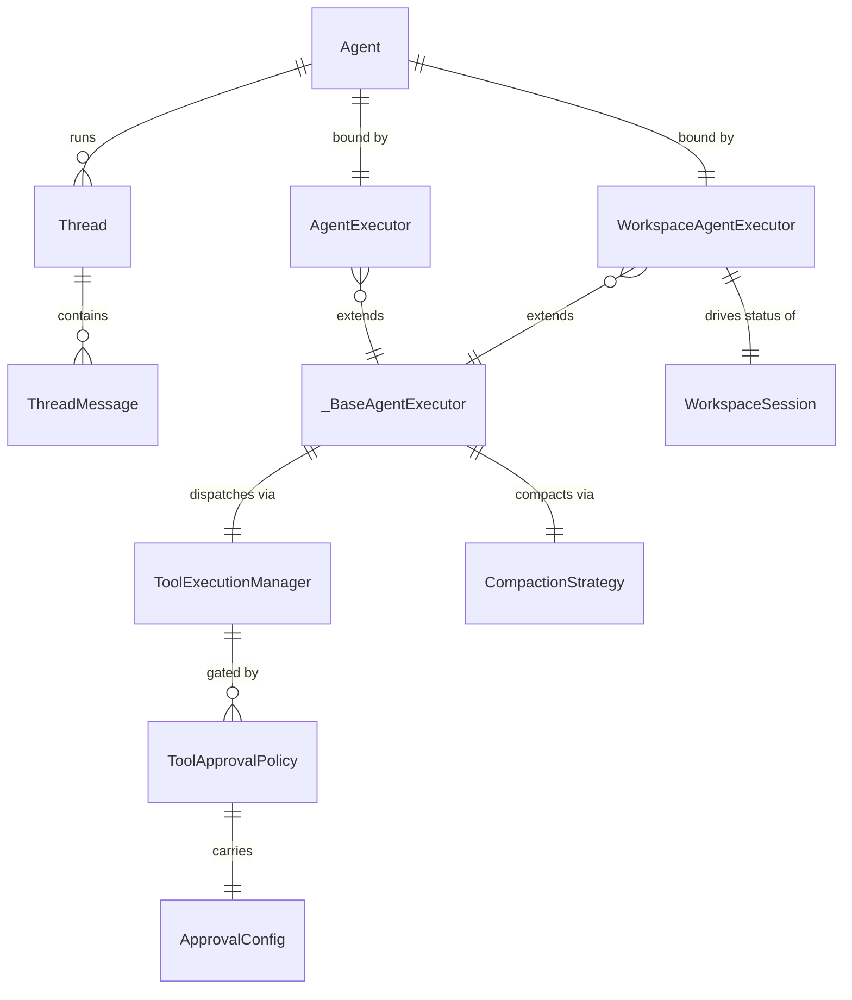
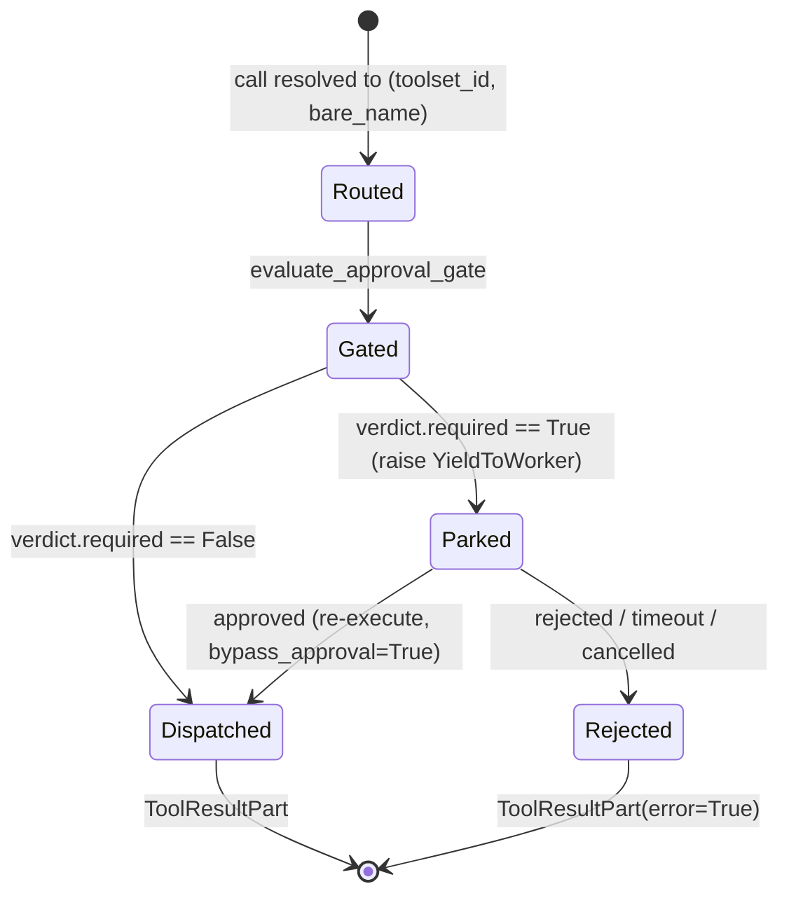

# Agents

## 1. Purpose

The agent subsystem is the runtime that drives one LLM turn end to end: it assembles a prompt, streams the model, dispatches the tool calls the model asks for, feeds the tool results back, repeats until the model stops, and persists the materialised turn. It is the layer that sits between an `Agent` definition (system prompt, model, tool allowlist) and the raw LLM and tool primitives.

The subsystem lives in `primer/agent/` and is organised around a single shared abstract base, `_BaseAgentExecutor` (`primer/agent/base.py`), with two concrete executors that differ only in where conversation state is persisted:

- `AgentExecutor` (`primer/agent/executor.py`) persists to `Storage[Thread]` plus `Storage[ThreadMessage]`. This is the chat-on-thread surface.
- `WorkspaceAgentExecutor` (`primer/agent/workspace_executor.py`) persists to a workspace's `messages.jsonl` via `AgentSession.commit_state(op='message')`, one git commit per turn, and drives `SessionStatus` transitions for the worker pool.

Around the executors sit the cross-cutting concerns that every turn touches: tool routing and dispatch (`ToolExecutionManager`), context compaction (`CompactionStrategy` plus the stateless `compaction_mixin`), the tool-call approval gate (`approval.py`, `rego.py`), and the per-turn loop helper (`loop.run_agent_turn`) that the graph executor reuses verbatim.

This document covers the agent runtime. The WebSocket-driven chat surface (`primer.chat.executor.ChatTurnRunner` over `Chat` plus `ChatMessage`) is a distinct runner documented under `docs/dev/subsystems/chats.md`; it shares only the `compaction_mixin` module with the agent executors. Worker-pool ownership of parked sessions, the event bus, and the timer/sweeper background tasks live in `docs/dev/architecture/worker-system.md`. Turn-boundary logging lives in `docs/dev/architecture/observability.md`.

## 2. Conceptual model

An `Agent` is an immutable definition: a system prompt, a model, and a tool allowlist. An executor binds that definition to an `LLM` adapter, an `LLMModel`, and a `ToolExecutionManager`, then drives turns. A turn produces an ordered list of `Message` rows (assistant text, tool calls, tool results) that the subclass persists to its backing store. Tool calls route through the `ToolExecutionManager`, which resolves scoped tool ids back to a `ToolsetProvider` or a workspace tool, runs the approval gate, and dispatches. When history grows past a token threshold, `CompactionStrategy` summarises the head into a single synthetic message.

The entities and their relationships:



`Thread` plus `ThreadMessage` (`primer/model/thread.py`) back `AgentExecutor`. `WorkspaceSession` (`primer/model/workspace_session.py`) backs `WorkspaceAgentExecutor`. `ToolApprovalPolicy` (`primer/model/tool_approval.py`) is keyed by `(toolset_id, tool_name)` and carries a discriminated `ApprovalConfig` union.

## 3. Architecture patterns implemented

- **Shared base, divergent persistence.** `_BaseAgentExecutor` owns the invoke flow, compaction integration, streaming fan-out, and hard-overflow recovery; subclasses implement only three hooks (`_load_history`, `_persist_turn`, `_replace_compacted_head`). The base class is deliberately non-public (leading underscore) rather than an exported ABC.
- **Extracted free helper for the inner loop.** The per-turn stream-buffer-dispatch loop is factored out of the base class into `primer.agent.loop.run_agent_turn`, which mutates a caller-provided `messages_out` list. The graph executor reuses this same helper, so agent and graph turns share tool-dispatch semantics.
- **Stateless mixin for compaction.** `compaction_mixin` exposes `should_compact`, `apply_compaction`, and `force_compact` as free async functions consumed by both `_BaseAgentExecutor` and `primer.chat.executor.ChatTurnRunner`, sharing compaction across two unrelated runner classes without a common base.
- **Scoped tool ids with a single catalogue.** `ToolExecutionManager` surfaces every tool to the LLM as `toolset_id__bare_name` (separator `__`), so colliding bare names across toolsets, MCP servers, and workspace tools stay routable from one flat catalogue.
- **Yield-as-control-flow for parking.** When the approval gate trips, `ToolExecutionManager.execute` raises `YieldToWorker` carrying a `Yielded` record; the base executor stamps the in-progress turn messages onto the exception so the worker can park and later resume.
- **Fail-closed approval gate.** `evaluate_approval_gate` dispatches by `ApprovalType` (required / Rego policy / LLM judge); any failure path returns `required=True` with a diagnostic reason rather than letting the call through.

## 4. Code layout

| Path | Responsibility |
| --- | --- |
| `primer/agent/base.py` | `_BaseAgentExecutor` ABC: `invoke`, proactive compaction, hard-overflow retry, streaming-tap fan-out, three abstract hooks. |
| `primer/agent/executor.py` | `AgentExecutor` over `Storage[Thread]` plus `Storage[ThreadMessage]`; static helpers `open_thread` / `delete_thread` / `list_threads`. |
| `primer/agent/workspace_executor.py` | `WorkspaceAgentExecutor` over `messages.jsonl`; drives `SessionStatus`; `inject_resume_messages` for the worker resume path. |
| `primer/agent/loop.py` | `run_agent_turn` shared inner loop; reused by the graph executor. |
| `primer/agent/tool_manager.py` | `ToolExecutionManager`: scoped-id catalogue, routing, approval gate, dispatch, truncation envelope, OTel + Prometheus; `invoke_one` for MCP-direct dispatch. |
| `primer/agent/compaction.py` | `CompactionStrategy`, `CompactedTurn`, `lookup_context_length`, `MODEL_CONTEXT_FALLBACK`. |
| `primer/agent/compaction_mixin.py` | Stateless `should_compact` / `apply_compaction` / `force_compact`, `CompactionResult` dataclass. |
| `primer/agent/approval.py` | `ApprovalContext`, `ApprovalResolver`, `ApprovalVerdict`, `evaluate_approval_gate`. |
| `primer/agent/rego.py` | `RegoEvaluator` backing `PolicyApprovalConfig`. |
| `primer/agent/events.py` | `AgentEventSubscriber` protocol, `Subscription` handle. |
| `primer/agent/prompts.py` | `DEFAULT_COMPACTION_PROMPT`. |
| `primer/agent/tail.py` | `tail_split` helper for head/tail history partitioning. |
| `primer/model/thread.py` | `Thread` plus `ThreadMessage` Pydantic models. |
| `primer/model/tool_approval.py` | `ToolApprovalPolicy` plus the discriminated `ApprovalConfig` union. |

## 5. Data model

`Thread` (`primer/model/thread.py`) extends `Identifiable` and carries `agent_id`, optional `title`, `created_at`, and `last_activity_at` (stamped at end of every turn). The `agent_id` is a snapshot: a thread keeps its original id but picks up the current agent definition's system prompt, tools, and model on each subsequent turn.

`ThreadMessage` (`primer/model/thread.py`) carries `thread_id`, `role` (`user` / `assistant` / `system` / `tool`), `parts: list[Part]`, `created_at`, and a monotonic per-thread `sequence: int` (`ge=0`) assigned incrementally as messages are appended.

`ToolApprovalPolicy` (`primer/model/tool_approval.py`) is keyed by `(toolset_id, tool_name)` and carries `enabled`, an optional `timeout_seconds`, and an `approval: ApprovalConfig` discriminated on `type`:

- `RequiredApprovalConfig` (`type=required`): gate trips unconditionally.
- `PolicyApprovalConfig` (`type=policy`): evaluates Rego source that must produce a `required` boolean plus optional `reason`.
- `LlmApprovalConfig` (`type=llm`): asks an LLM judge resolved through `provider_id` plus `model` for a `{required, reason?}` verdict.

The approval gate is a small state machine over one tool call: a call resolves, the gate evaluates, and either dispatch proceeds or the call parks pending an operator verdict.



## 6. Lifecycle

`_BaseAgentExecutor.invoke` (`primer/agent/base.py`) runs one user-driven turn: it loads history, runs proactive compaction, drives the inner loop, and falls back to force-compaction on a hard context overflow. Persistence is end-of-turn only; streaming chunks fan out to subscribers but never land in storage. The inner loop delegates to `run_agent_turn`, which appends the assistant message before tool dispatch and synthesises an `ExtendedEvent(_ExecutorToolResult)` per tool round-trip so taps see results.

```mermaid
sequenceDiagram
    participant Caller
    participant Exec as _BaseAgentExecutor
    participant Loop as run_agent_turn
    participant LLM
    participant TM as ToolExecutionManager
    participant Store as persist hook

    Caller->>Exec: invoke(messages)
    Exec->>Exec: _load_history + maybe_compact
    Exec->>Loop: run_agent_turn(prompt, messages_out)
    Loop->>LLM: stream turn
    LLM-->>Loop: tool_use stop
    Loop->>TM: execute(call)
    alt approval required
        TM-->>Loop: raise YieldToWorker
        Loop-->>Exec: stamp llm_messages, re-raise
        Exec-->>Caller: park (worker resumes later)
    else dispatched
        TM-->>Loop: ToolResultPart
        Loop->>LLM: re-send with tool result
        LLM-->>Loop: final stop
    end
    Loop->>Store: _persist_turn(turn_messages)
    Store-->>Exec: persisted
    Exec-->>Caller: stream complete
```

`WorkspaceAgentExecutor.invoke` overrides this flow to drive session status: it handles `PAUSED -> RUNNING` and `WAITING -> RUNNING` at turn entry, rejects `ENDED` sessions with `ConflictError`, and maps `Done.stop_reason` plus the trailing assistant text to a post-turn transition (`tool_use` stays running; `error` ends the session as failed; a trailing `?` moves to `WAITING`). It publishes `last_done_reason` on the instance so the worker pool's post-turn mapper can re-enqueue or wait without re-iterating events.

Tool dispatch errors become `ToolResultPart(error=True)` rather than aborting the turn, so the model can react and recover; only `AuthRequiredError` propagates (the workspace executor handles it by transitioning to `WAITING`).

## 7. Persistence

`AgentExecutor` persists via per-row `Storage.create` calls in `_persist_turn`; there is no end-of-turn transaction primitive today. `_replace_compacted_head` matches tail rows structurally, deletes the head rows, inserts the summary at sequence 0, and resequences the tail from 1 (an un-transactional sequence in v1).

`WorkspaceAgentExecutor` persists via `AgentSession.commit_state(op='message')`, writing `messages.jsonl` with one git commit per turn. The commit subject is built from an excerpt of the last assistant message text or the tool-use names, capped at 72 characters. Workspace-tool output that exceeds the truncation envelope (50 KiB / 2000 lines, with a 50-line preview head) is written in full to `session.cache_output` and referenced by path in the truncated tool result.

Compaction persistence differs by backend: chat threads replace head rows in storage, while workspace sessions retain the prefix-string convention (`[earlier conversation compacted on <ts>]` on a synthetic assistant message in `messages.jsonl`); structured compaction-marker rows are a chats-only concern.

Parked turns persist outside the executor: when `YieldToWorker` is raised, the worker pool writes the stamped `llm_messages` into the session's `parked_state` blob so the resume path can re-pair the assistant tool_use with a synthesised tool result. `WorkspaceAgentExecutor.inject_resume_messages` appends that rehydrated `[assistant_tool_use, tool_result]` pair without driving a new turn.

## 8. Public surfaces

`_BaseAgentExecutor.invoke(messages, *, response_format=None)` is the single entry point; it returns an async iterator of `StreamEvent`. `subscribe(subscriber)` / `unsubscribe(subscription)` register streaming taps that receive every event concurrently with the caller's iterator; subscribers that raise are logged and isolated.

`AgentExecutor` exposes static thread-management helpers `open_thread`, `delete_thread`, and `list_threads` alongside the inherited `invoke`.

`WorkspaceAgentExecutor` adds `inject_resume_messages` and the `last_done_reason` instance attribute consumed by the worker pool.

`ToolExecutionManager` exposes `list_tools` (scoped catalogue, collision detection), `execute(call, *, principal, bypass_approval=False)` (route, gate, dispatch), and `invoke_one(*, provider, tool_name, arguments, principal)` for MCP-direct dispatch with no approval gate or workspace branch. Both `execute` and `invoke_one` are wrapped in an OpenTelemetry span and increment `tool_calls_total` / `tool_duration_seconds`. The MCP server endpoint (`primer/mcp/`) consumes `invoke_one` after applying its own allowlist filters; that surface is documented in `docs/dev/architecture/rest-api.md` and `docs/dev/subsystems/model-providers.md`.

`evaluate_approval_gate(ctx, cfg, *, provider_registry)` and `ApprovalResolver` are the approval surface; the REST endpoints (`/tool_approval_policies` CRUD, `tool_approval/pending`, `tool_approval/respond`) live in `primer/api/routers/tool_approval.py` and are documented in `docs/dev/architecture/rest-api.md`.

## 9. Internal contracts

The three subclass hooks form the persistence contract: `_load_history` returns prior conversation in chronological order, `_persist_turn` appends the turn's messages, and `_replace_compacted_head` swaps the persisted history for its compacted form. `_BaseAgentExecutor` calls these and owns everything else.

`run_agent_turn` (`primer/agent/loop.py`) is the inner-loop contract shared with the graph executor: callers pass `messages_out` (mutated in place with the assistant and tool-result messages) and `last_input_tokens_out` (a one-element holder). On a clean end-of-stream the base class persists; on `YieldToWorker` it stamps `exc.llm_messages` with the turn delta (slicing off the caller-supplied `new_messages`) and re-raises.

`ToolExecutionManager` enforces the scoped-id invariant: bare ids containing `__` raise `ConfigError` at `list_tools`; the agent allowlist (the `tools=[...]` constructor arg) filters toolset tools from the catalogue and rejects out-of-allowlist `execute` calls with `UnsupportedContentError`, while workspace tools bypass the allowlist. The approval gate runs after routing and before dispatch; `bypass_approval=True` is the worker resume path's signal to skip the gate after operator approval lands.

The compaction contract has two convergent paths: `_BaseAgentExecutor` calls `CompactionStrategy.maybe_compact` (character heuristic), while the mixin's `should_compact` uses native `LLM.count_tokens`; both converge on `CompactionStrategy._tier2` for the actual summarisation pass. `DEFAULT_TRIGGER_RATIO` is `0.90`, `DEFAULT_TAIL_TURNS` is `4`, and `summary_max_tokens` defaults to `4096`. Note the mixin's `DEFAULT_RESERVED_OUTPUT_TOKENS` is `2000` while `CompactionStrategy.DEFAULT_RESERVED_OUTPUT` is `8192`, so the two paths compute slightly different trigger thresholds for the same context length.

## 10. Testing patterns

Tests live under `tests/agent/`. The data models are covered by `test_thread_models.py`. The tool manager has `test_tool_manager.py`, `test_tool_manager_approval_gate.py`, and `test_invoke_one.py` (MCP-direct dispatch). Compaction is split across `test_compaction.py`, `test_compaction_mixin.py` (threshold math, apply, force), and `test_base_executor_compaction_via_mixin.py` (binding check). The executors are covered by `test_executor.py` and `test_workspace_executor.py`. The approval system has `test_approval_gate.py`, `test_approval_resolver.py`, and `test_rego.py`, with the worker resume path in `tests/worker/test_approval_resume.py` and graph-run rejection in `tests/graph/test_toolcall_approval_reject.py`. Streaming taps and the tail helper have `test_events.py` and `test_tail.py`. Per the project memory, smoke-test changes with `uv run primer api` in the background and read any API keys or bearer tokens from environment variables in gated tests.

## 11. Historical decisions

- **Two concrete executors share a non-public base, and the inner per-turn loop is a free helper.** Why: the spec rejected new ABCs for the executor and factoring `run_agent_turn` out lets the graph executor reuse the same tool-dispatch semantics. Spec: `docs/superpowers/specs/2026-05-03-agent-executor-design.md`.
- **Persistence is end-of-turn only; streaming chunks fan out to subscribers but never reach storage.** Why: storage stays append-only and UI taps drive live rendering without a per-delta storage round-trip. Spec: `docs/superpowers/specs/2026-05-03-agent-executor-design.md`.
- **Compaction summarisation calls back into the same LLM and model the agent uses, not a cheaper sidekick.** Why: a user-confirmed design decision; the surface is shaped to accept a secondary LLM later but ships with the simpler path. Spec: `docs/superpowers/specs/2026-05-03-agent-executor-design.md`.
- **Tool ids surfaced to the LLM are scoped `toolset_id__bare_name`, and bare ids containing the separator are rejected at `list_tools`.** Why: different toolsets, MCP servers, and workspace tools can share bare names, so scoping keeps every call routable from one catalogue. Spec: `docs/superpowers/specs/2026-05-03-agent-executor-design.md`.
- **Tool dispatch errors become `ToolResultPart(error=True)` instead of aborting the turn; only `AuthRequiredError` propagates.** Why: it lets the model recover instead of crashing the executor, while the workspace executor handles auth failures with a `WAITING` transition. Spec: `docs/superpowers/specs/2026-05-03-agent-executor-design.md`.
- **The shipped trigger ratio is `0.90`, not the spec's `0.85`.** Why: the in-code default was tuned upward and the spec value is stale. Spec: `docs/superpowers/specs/2026-05-30-auto-compaction-token-counting-design.md`.
- **Compaction logic ships as a stateless free-function mixin module rather than a method on the runners.** Why: both `ChatTurnRunner` and `_BaseAgentExecutor` consume the same functions without forcing a shared base-class hierarchy. Spec: `docs/superpowers/specs/2026-05-30-auto-compaction-token-counting-design.md`.
- **`LLM.count_tokens` is an abstract method, not a default char-heuristic on the base class.** Why: every adapter is forced to make a conscious choice between a native counter and an explicit char fallback on the auto-trigger hot path. Spec: `docs/superpowers/specs/2026-05-30-auto-compaction-token-counting-design.md`.
- **Approval-gated tool calls raise `YieldToWorker` mid-execute, and the base executor stamps the partial turn onto the exception.** Why: it implements durable in-flight approval without restructuring `invoke` into a state machine; resume re-invokes after operator approval using `bypass_approval`. Spec: `docs/superpowers/specs/2026-05-24-tool-approval-system-design.md`.
- **Approval config lives on a new `ToolApprovalPolicy` entity keyed by `(toolset_id, tool_name)`, not on the runtime `Tool` model or the `Toolset` row.** Why: it keeps the lookup key stable across toolset re-registrations and lets operators edit gates without re-deploying toolset providers. Spec: `docs/superpowers/specs/2026-05-24-tool-approval-system-design.md`.
- **Every approval gate strategy fails closed: any unexpected error returns `required=True` with a diagnostic reason.** Why: an unhealthy judge or broken Rego policy must park rather than silently let a sensitive call through. Spec: `docs/superpowers/specs/2026-05-24-tool-approval-system-design.md`.
- **The worker special-cases `tool_name=="_approval"` inline rather than registering a resume hook in the registry.** Why: the resume needs the live `ToolExecutionManager` to re-dispatch the original call, and the registry passes only the parked blob plus payload. Spec: `docs/superpowers/specs/2026-05-24-tool-approval-system-design.md`.
- **`ToolExecutionManager.invoke_one` collapses to dispatch plus metrics plus tracing, trusting the MCP dispatcher's filters.** Why: MCP cannot park, resume, or bind a workspace context, so the inbound endpoint reuses a thinner path than the agent-side `execute`. Spec: `docs/superpowers/specs/2026-06-02-mcp-server-endpoint-design.md`.
- **The failed-turn path drives both the new `TurnLogFailed` event and the legacy `messages.jsonl` ERROR record off one `ProblemDetails` envelope.** Why: operators now see the real exception type, title, and detail in both the Turn-log tab and the Messages tab, retiring the generic "unexpected executor error" string. Spec: `docs/superpowers/specs/2026-06-05-per-session-turn-log-design.md`.
