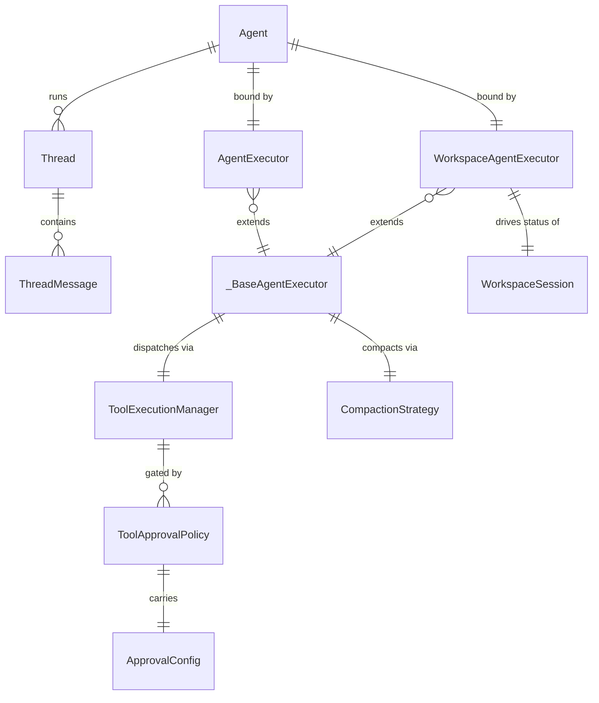
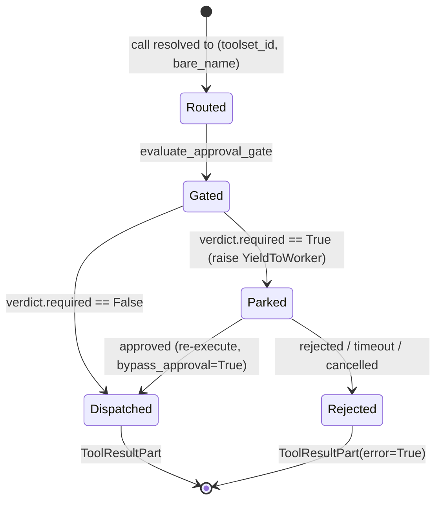

# Agents

## 1. Purpose

The agent subsystem is the runtime that drives one LLM turn end to end: it assembles a prompt, streams the model, dispatches the tool calls the model asks for, feeds the tool results back, repeats until the model stops, and persists the materialised turn. It is the layer that sits between an `Agent` definition (system prompt, model, tool allowlist) and the raw LLM and tool primitives.

The subsystem lives in `primer/agent/` and is organised around a shared abstract base, `_BaseAgentExecutor` (`primer/agent/base.py`), with one concrete executor:

- `WorkspaceAgentExecutor` (`primer/agent/workspace_executor.py`) persists to a workspace's `messages.jsonl` via `AgentSession.commit_state(op='message')`, one git commit per turn, and drives `SessionStatus` transitions for the worker pool. It runs a COPY of the agent whose `system_prompt` is extended with the session's workspace fragment (`agent.model_copy(update={"system_prompt": ...}, deep=True)`): every other field is carried over as configured, so `max_tool_turns` and `compaction_tool_access` take effect in workspace sessions (an earlier version rebuilt the agent from eight named fields and silently reset the rest to their defaults). The workspace graph executor's per-node agent resolver (`WorkspaceGraphExecutor._wrap_agent_resolver`) does the same, for the same reason.

The base stays abstract because the graph executor reuses its turn loop verbatim, not because a second persistence backend is expected. A thread-backed executor existed alongside it while the chat surface did, and went with it.

Around the executors sit the cross-cutting concerns that every turn touches: tool routing and dispatch (`ToolExecutionManager`), context compaction (`CompactionStrategy` plus the stateless `compaction_mixin`), the tool-call approval gate (`approval.py`, `rego.py`), and the per-turn loop helper (`loop.run_agent_turn`) that the graph executor reuses verbatim.

This document covers the agent runtime. Worker-pool ownership of parked sessions, the event bus, and the timer/sweeper background tasks live in `docs/dev/architecture/worker-system.md`. Turn-boundary logging lives in `docs/dev/architecture/observability.md`.

## 2. Conceptual model

An `Agent` is an immutable definition: a system prompt, a model, and a tool allowlist. An executor binds that definition to an `LLM` adapter, an `LLMModel`, and a `ToolExecutionManager`, then drives turns. A turn produces an ordered list of `Message` rows (assistant text, tool calls, tool results) that the subclass persists to its backing store. Tool calls route through the `ToolExecutionManager`, which resolves scoped tool ids back to a `ToolsetProvider` or a workspace tool, runs the approval gate, and dispatches. When history grows past a token threshold, `CompactionStrategy` summarises the head into a single synthetic message.

The entities and their relationships:

```mermaid
erDiagram
    Agent ||--o{ Thread : "runs"
    Thread ||--o{ ThreadMessage : "contains"
    Agent ||--|| AgentExecutor : "bound by"
    Agent ||--|| WorkspaceAgentExecutor : "bound by"
    AgentExecutor }o--|| _BaseAgentExecutor : "extends"
    WorkspaceAgentExecutor }o--|| _BaseAgentExecutor : "extends"
    _BaseAgentExecutor ||--|| ToolExecutionManager : "dispatches via"
    _BaseAgentExecutor ||--|| CompactionStrategy : "compacts via"
    ToolExecutionManager ||--o{ ToolApprovalPolicy : "gated by"
    ToolApprovalPolicy ||--|| ApprovalConfig : "carries"
    WorkspaceAgentExecutor ||--|| WorkspaceSession : "drives status of"
```

`Thread` plus `ThreadMessage` (`primer/model/thread.py`) back `AgentExecutor`. `WorkspaceSession` (`primer/model/workspace_session.py`) backs `WorkspaceAgentExecutor`. `ToolApprovalPolicy` (`primer/model/tool_approval.py`) is keyed by `(toolset_id, tool_name)` and carries a discriminated `ApprovalConfig` union and an optional `preview_args` (the dotted paths its approval card may show). The card's allowlist is resolved where the park is built: `resolve_preview(policy, tool)` in `primer/agent/approval.py` takes the policy's list, else the tool's `Tool.preview_args` (declared at `make_tool(preview_args=...)`, in memory only), else the closed-set default of the tool's schema (`primer/common/preview_paths.py`), and `approval_resume_metadata` stamps it as `resume_metadata["preview"] = {paths, source}` for every park site: the tool manager (which keeps a descriptor map of every tool, visible to the agent or not), `call_tool` (the inner tool's descriptor, looked up through the registry by `primer/agent/tool_schemas.py`), and the graph checkpoint's two `original_call` blocks, which pass the key on (`tests/agent/test_original_call_writers.py` names every writer). A policy write checks each path against the gated tool's schema (`check_preview_args` in `primer/agent/approval_checks.py`, shared by the REST router and the system tools).

## 3. Architecture patterns implemented

- **Shared base, divergent persistence.** `_BaseAgentExecutor` owns the invoke flow, compaction integration, streaming fan-out, and hard-overflow recovery; subclasses implement only three hooks (`_load_history`, `_persist_turn`, `_replace_compacted_head`). The base class is deliberately non-public (leading underscore) rather than an exported ABC.
- **Extracted free helper for the inner loop.** The per-turn stream-buffer-dispatch loop is factored out of the base class into `primer.agent.loop.run_agent_turn`, which mutates a caller-provided `messages_out` list. The graph executor reuses this same helper, so agent and graph turns share tool-dispatch semantics.
- **Stateless mixin for compaction.** `compaction_mixin` exposes `should_compact`, `apply_compaction`, and `force_compact` as free async functions rather than base-class methods, so compaction can be shared by runner classes that have no common base. It was written when two such runners existed; the shape still earns its keep for the graph executor.
- **Scoped tool ids with a single catalogue.** `ToolExecutionManager` surfaces every tool to the LLM as `toolset_id__bare_name` (separator `__`), so colliding bare names across toolsets, MCP servers, and workspace tools stay routable from one flat catalogue.
- **Yield-as-control-flow for parking.** When the approval gate trips, `ToolExecutionManager.execute` raises `YieldToWorker` carrying a `Yielded` record; the base executor stamps the in-progress turn messages onto the exception so the worker can park and later resume.
- **Fail-closed approval gate.** `evaluate_approval_gate` dispatches by `ApprovalType` (required / Rego policy / LLM judge); any failure path returns `required=True` with a diagnostic reason rather than letting the call through.

## 4. Code layout

| Path | Responsibility |
| --- | --- |
| `primer/agent/base.py` | `_BaseAgentExecutor` ABC: `invoke`, proactive compaction, hard-overflow retry, streaming-tap fan-out, three abstract hooks. |
| `primer/agent/executor.py` | `AgentExecutor` over `Storage[Thread]` plus `Storage[ThreadMessage]`; static helpers `open_thread` / `delete_thread` / `list_threads`. |
| `primer/agent/workspace_executor.py` | `WorkspaceAgentExecutor` over `messages.jsonl`; drives `SessionStatus`; `inject_resume_messages` for the worker resume path. |
| `primer/agent/loop.py` | `run_agent_turn` shared inner loop; reused by the graph executor. |
| `primer/common/context_overflow.py` | `is_context_overflow` / `is_context_overflow_error`: the one classifier for "the prompt does not fit the context window" (raised, yielded and summariser-wrapped shapes); the loop also uses `is_context_overflow_error` to hold a yielded overflow back from a caller that recovers it. |
| `primer/agent/tool_manager.py` | `ToolExecutionManager`: scoped-id catalogue, routing, approval gate, dispatch, truncation envelope, OTel + Prometheus; `invoke_one` for MCP-direct dispatch. |
| `primer/agent/compaction.py` | `CompactionStrategy`, `CompactedTurn`, `lookup_context_length`, `MODEL_CONTEXT_FALLBACK`. |
| `primer/agent/compaction_mixin.py` | Stateless `should_compact` / `apply_compaction` / `force_compact`, `CompactionResult` dataclass. |
| `primer/agent/approval.py` | `ApprovalContext`, `ApprovalResolver`, `ApprovalVerdict`, `evaluate_approval_gate`. |
| `primer/agent/rego.py` | `RegoEvaluator` backing `PolicyApprovalConfig`. |
| `primer/agent/events.py` | `AgentEventSubscriber` protocol, `Subscription` handle. |
| `primer/agent/prompts.py` | `DEFAULT_COMPACTION_PROMPT`. |
| `primer/agent/tail.py` | `tail_split` (the plain turn-based head/tail split) and `split_for_compaction` (what tier 2 uses: the same tail made unit-atomic, protected around unanswered input, and bounded by size). |
| `primer/agent/summary_input.py` | `reduce_summary_input`: pure reduction of the head a summariser whose call overflowed is retried on (tool results left out, a bounded rolling fold, single units cut) and the `SummaryInputReduction` the marker records. |
| `primer/model/thread.py` | `Thread` plus `ThreadMessage` Pydantic models. |
| `primer/model/tool_approval.py` | `ToolApprovalPolicy` plus the discriminated `ApprovalConfig` union. |

## 5. Data model

`Thread` (`primer/model/thread.py`) extends `Identifiable` and carries `agent_id`, optional `title`, `created_at`, and `last_activity_at` (stamped at end of every turn). The `agent_id` is a snapshot: a thread keeps its original id but picks up the current agent definition's system prompt, tools, and model on each subsequent turn.

`ThreadMessage` (`primer/model/thread.py`) carries `thread_id`, `role` (`user` / `assistant` / `system` / `tool`), `parts: list[Part]`, `created_at`, and a monotonic per-thread `sequence: int` (`ge=0`) assigned incrementally as messages are appended.

`ToolApprovalPolicy` (`primer/model/tool_approval.py`) is keyed by `(toolset_id, tool_name)` and carries `enabled`, an optional `timeout_seconds`, and an `approval: ApprovalConfig` discriminated on `type`:

- `RequiredApprovalConfig` (`type=required`): gate trips unconditionally.
- `PolicyApprovalConfig` (`type=policy`): evaluates Rego source that must produce a `required` boolean plus optional `reason`.
- `LlmApprovalConfig` (`type=llm`): asks an LLM judge resolved through `provider_id` plus `model` for a `{required, reason?}` verdict.

**Who may decide a gate** (ticket 01a11b64). A policy carries `approvers` (an `ApproverSpec`: `anyone`, `roles` or `users`; admins are always admitted, whatever the kind), and a Rego or judge verdict can return its own per-call `approvers`. Every approval park stamps the EFFECTIVE spec (the verdict's, else the policy row's; `None` means anyone) into its `resume_metadata["approvers"]`, and every park site builds that metadata through ONE function, `approval_resume_metadata` (`primer/agent/approval.py`: the agent loop in `tool_manager.py` and the `call_tool` meta-dispatch in `primer/toolset/_system_crud.py`), so a site cannot forget the stamp (the `call_tool` park did, which let any user approve what a policy restricted). Every path that ANSWERS a gate judges the answer against the stamp of the SPECIFIC gate it names (a graph park can hold several), through ONE function, `primer.session.approvers.may_decide`: the REST respond route and the yield-cancel route on an `_approval` gate (`POST /v1/sessions/{id}/yields/{tcid}/cancel`: a cancel payload is classified as a REJECTION, so cancelling is deciding), both through `primer.api.approver_guard.enforce_approvers` (`403 approver_mismatch`, deciding user from the session), and the channel inbox, which resolves the gate ONCE and uses that entry for the check, the publish key and the audit record. The metadata a route judges is ALWAYS the `resume_metadata` of the gate resolved by `resolve_pending_gate(blob, tool_call_id=..., kind="_approval")`, never the top-level `parked_state["yielded"]`: for a graph park that is a projection of the primary gate (`_CheckpointMixin._build_pending_park_yield`) and, when the primary is a ToolCall node's approval, it holds `original_call` only, so it is key-less and reads as "anyone". The cancel route fails CLOSED when no gate resolves (`ADMIN_ONLY_METADATA`). The effect: a session owner who is not an approver can no longer cancel their own approval yield (cancelling the session is unchanged). A stamped spec that cannot be read fails CLOSED to admin-only, and so does a `call_tool` park (it carries `via_call_tool`) whose `approvers` KEY is absent: it was parked before the stamp existed (an explicit `None` means anyone; agent-loop parks have always written the key). `approval_resume_metadata` refuses an `extra` key that collides with a stamped one. The channel inbox cannot identify who clicked (the reply carries only a messaging-platform user id, which maps to no primer account), so a channel reply decides a gate with no restriction and is REFUSED on a restricted one (`ApproverRefusedError`, nothing is published, no record is written): that gate is decided in the console by an approver or an admin. If the session cannot be read, the reply is refused too (it cannot be shown that the gate is unrestricted), and so is a reply for a gate the checkpoint names (`pending_dispatch`) when no pending entry carries its spec, which includes a pending ToolCall whose `tool_name` is neither `_approval` nor a registered value-yield tool (`_toolcall_dispatch_entry` gives it an approval-shaped prompt, but the resolver reads it as that other kind); a nameless (`tool_name` None) entry is not an approval gate, and a nameless park whose event key is the reconstructed `tool_approval:<sid>:<tcid>` is refused (the fallback publish would wake it unchecked). A graph park's top-level `yielded.tool_name` is `"_approval"` whatever its primary is (`_build_pending_park_yield`), so the cancel route resolves the pending entry by `tool_call_id` alone and judges it only when ITS kind is `_approval`. The adapters tell the clicker (ticket 01a11b6c): `ChannelAdapter._handle_decision` returns `False` for a refused decision instead of raising, and each platform answers with `APPROVAL_ROUTED_NOTICE` ("routed to specific approvers ... decide it in the console") and leaves the message as it is: Slack posts an ephemeral message to the clicker (for a refused rejection reason too, from the modal submit), Telegram answers the click with an alert only the clicker sees and replies to a refused rejection reason, and Discord defers the click, relays, and only then edits the message ("Approved by", or "Rejection recorded" for the modal) or sends an ephemeral notice, where it used to edit first and so showed "Approved" for a refused approval. Known limit: the buttons are still rendered on a gate the clicker cannot decide.

**Which gate a decision answers** (ticket 01a11f52-9d98, console review C-033). A provider repeats its `tool_call_id` across rounds (`call_0` in round 1 and again in round 3), and the approval and `ask_user` event keys are built from it, so neither the key nor the id says WHICH gate a decision is for: a card left open for round 1 decided whatever gate was pending under the same id later. Every approval park and every `ask_user` park therefore carries a `gate_id` (uuid4 hex), minted when the gate is created: `approval_resume_metadata` stamps it (the one builder, so every park site gets it and an `extra` key cannot overwrite it) and the `ask_user` handler puts it in its `Yielded.resume_metadata` (`primer.model.yield_.new_gate_id` / `gate_id_of`). It lives in the pending entry's `resume_metadata`, which the graph checkpoint round-trips verbatim, so it survives every re-park while the gate stays pending and a later gate under the same raw id gets another. It is NOT the session's `parked_at`: answering one gate of a multi-gate graph park re-parks the graph on the remaining gates with a fresh `parked_at` (`_repark_graph_yield_outcome`), which would turn every sibling's card stale at once (pinned by `tests/graph/test_gate_id_survives_partial_resume.py`: the sibling's id is unchanged across that re-park, the `parked_at` is not). The pending responses serve it (`tool_approval/pending`, `ask_user/pending`, `yields/pending` per session and per workspace, and the cross-workspace Inbox row; for a graph park the top-level projection carries the PRIMARY gate's id, like its `tool_call_id`), and the respond bodies and the yield-cancel body take it back as an optional `gate_id` (`^[0-9a-f]{32}$`, else 422). `resolve_pending_gate(blob, tool_call_id=..., kind=..., gate_id=...)` then returns the entry that carries it, which also tells apart two fan-out siblings that share a raw id; a call id that is pending but not under the named gate is stale: `409` problem+json with `extensions.code = "approval_stale"` (`primer.api.gate_fence.stale_gate_error`), raised BEFORE the approver check and before anything is published, flipped or recorded. A respond naming none is accepted for one release (`primer.session.gate_token.count_gate_token` logs one INFO line with the session id and no arguments and counts `gate_respond_total{kind,gate_token}` with `gate_token` in `matched`, `stale`, `absent`); the flip to a 422 is ticketed for when the `absent` count is zero. A park from before gates had ids has none: a respond naming one against it is stale (it cannot have come from that gate), a respond naming none works as before. The `ToolApprovalRecord` is keyed by the gate too (C-033 PR 2): `record_from_parked_blob` stores `gate_event_key` as `<event_key>@<gate_id>` (`primer.agent.approval_record.gate_record_key`), derived from the gate's own `resume_metadata`, which every writer (the respond route, the channel inbox, the session and graph resume fallbacks) passes, so one gate gets one key whichever site writes it and a retried respond or the resume-time fallback collapses into the existing row through the unique index, while the second approval of a repeated raw `tool_call_id` writes its own record (it used to collide with the first and be dropped, so the append-only trail claimed the first decision for both). A park from before gates had ids keeps the bare event key, and so do its records. Deploy note: a pod still running the previous version writes the BARE key, so during a rolling deploy one decision whose respond-time write and resume-time write land on pods of different versions can leave two rows (one bare, one suffixed); nothing is lost, no migration rewrites old rows, and no deploy removes the window: the api and the worker roll as separate Deployments (k3s), so shipping #670 (which mints the ids) and this change together narrows it to the rollout, and inside it `warn_on_decision_mismatch` cannot compare a bare row with a suffixed one (they are different keys), so a disagreement between the two writes of one decision is not detected there. `GET /v1/tool_approval/records?gate_event_key=` takes the stored key, suffix included. Yields that are not a human gate (`sleep`, `watch_files`, external waits) have no gate id: their cancel takes the optional `expected_tool_name` of the yield the card was drawn for, and a cancel naming a kind that is not what is parked is the same `409 approval_stale`. A `parked_session` trigger subscription wakes only a park whose own yield carries `resume_metadata.subscription_id == sub.id`, so a subscription left behind by an earlier round cannot publish onto a later park (an approval gate included) that reused the raw id. Fan-out siblings (ticket 01a11fc6-0cce): two nodes of one superstep can park on the same raw `tool_call_id`, and the engine used to cut the FIRED event key down to its last segment and select every pending entry that carried it, so B's decision also resumed A. The fired key now rides with each reply (`replies` in `resume_graph_engine` are `(tcid, payload, event_key)`) through `resume_graph_from_checkpoint(resumed_event_key=)` into `resume_from_checkpoint`, which resumes ONLY the entry that waits on it (`_PendingToolCall.parked_event_key` / `_PendingAgentYield.event_key`); the helpers that look an entry up by the raw id (`graph_nested_agent_yield`, `graph_value_yield_toolcall`, `graph_agent_tool_result`, the resume-time TOOL_RESULT record and `write_approval_record_for_graph`, the last of which is also why the audit record of a decided sibling carries ITS gate key) take the same key through `primer.session.pending_gates.pending_entries` / `resolve_pending_gate(event_key=)`. The raw id decides only for a key-less drain (which resumes every pending entry, as the legacy single-event drain always did) or when the key names no pending entry (a park written before keys were node-scoped), as before; a raw id WITH NO KEY and no drain (a caller that knows only the id) resumes only the FIRST entry that carries it, the primary the park projects, and logs that several share it. The same key rides down every path that reaches an entry: a child graph resumed through `GraphFrame` gets the key of the entry that was ANSWERED (`resume_invoke_graph(resumed_event_key=)`, `graph_agent_tool_result(event_key=)`, the approval-gate check and the audit record of the resume), so one reply cannot drain both siblings of the child's superstep. An agent session parked on an `invoke_graph` child is parked on the child's PRIMARY gate (`parked_state['yielded']`) but offers every pending gate of the child, so the leaf is not what was answered: the key the reply FIRED (the row's `resume_event_key`, stamped by the flip with the payload) rides `resume_continuation(fired_key=)` into `GraphFrame.resume_leaf(fired_key=)`, which selects that entry, takes its `tool_call_id`, and `_leaf_is_an_approval_gate` and the resume-time record (`write_approval_record_for_session`) are judged and built from the same entry; a key that names none of the child's pending entries (a row flipped before the key was stamped) falls back to the leaf. The re-park of such a session after one gate was answered (`repark_continuation`) writes the first park's shape: the child's ADVANCED checkpoint on the blob (every gate the child still waits on is listed with its own approvers, so the routes and the channel inbox judge each gate by its own routing) and the new primary's `tool_call_id`; the resume-time record is looked up in the innermost frame's checkpoint, the one the resume reads. `GraphFrame.resume` (a finished deeper frame's result, which no live path reaches) has neither key nor leaf and fails closed when several pending entries share its node id. A thread reply routed by the channel router (`ChannelEventRouter`) goes through `ChannelInbox.handle_response` with the correlation's `gate_id`, so the key the pending gate waits on is resolved from the row (a graph node's `ask_user` waits on the node-scoped key) and a reply to a prompt that has been replaced is refused by the stale fence instead of answering the newer question (the text then steers); and a nested re-park (`repark_graph_continuation`) rewrites the entry the reply resolved (its node and event key), not the first entry with the outer raw id. Graph `ask_user` siblings parked BEFORE this change share one unscoped key (`ask_user:<session>:<tool_call_id>`), so one answer resumes both: that cannot be told apart after the fact and ends with the in-flight parks. An `ask_user` inside a graph node (the built-in tool and a `python_runner` yield alike) is scoped by the node, `ask_user:<session>:<node>:<tool_call_id>`, as the approval gate's key is (`current_graph_node_id`), because two siblings that shared one key could not be told apart by their answers; and the channel inbox publishes an ask_user reply to the key of the gate it resolved, not the first entry with that raw id. Replayed wakes (PR 4, ticket 01a12042): a decision's wake is delivered by event key alone and at least once (the bus and the event dispatcher both replay), so a `session.wake` redelivered after the session resumed and PARKED AGAIN under the same provider id flipped the new gate with the old decision. Every human-decision wake now carries `__yield_gate_id__` (`primer.model.yield_.WAKE_GATE_ID_KEY`), the id of the gate that was resolved when the decision was made, whether or not the request named it: the approval and `ask_user` respond routes (including the graph agent-node and tool_call branches, each with the sibling's own id), the yield cancel of a human gate and the channel inbox publish. `durably_mark_session_resumable` (the one place a wake becomes `resumable`; the bus listener, the dispatcher's flip sink and the REST handlers all use it) refuses a wake whose id is set and is not the id of the pending entry that waits on the wake's event key: nothing is written, one WARNING, `session_wake_gate_refused_total`. A wake with no id (written before this release, a decision on a yield that is not a human gate) and a pending entry with no id are judged by the event key alone, as before. The key has the primer-internal `__yield_` prefix, so the resume classification strips it from a real reply and no hook or approval classifier sees it. Machine wakes (ticket 01a1208d) carry no gate, and the same redelivery hit them: the timeout marker (`__yield_timeout__`, published by the timeout sweeper for a park past its deadline) timed out a LATER gate the moment it arrived, although that gate's own deadline was still ahead. The `sleep` tool's timer had the same flaw from a different side (ticket 01a12151-b225): it parked on `timer:{tool_call_id}`, with no session in the key, and a provider repeats `call_0` in every conversation, so the `TimerScheduler`'s fire for one session's due sleep woke every other session sleeping on the same id, hours early. The key is now `timer:{session_id}:{tool_call_id}`, with the graph node before the tool call id inside a graph node as `ask_user`'s key has it (`timer_event_key`, `primer/model/yield_.py`; used by `sleep` and a python tool's timer yield). The `trigger:{trigger_id}` key of `subscribe_to_trigger` and `subscribe_to_channel_event` had the same flaw, and a graph park is exempt from the stamp below, so one session's fire woke another session's graph park with the first one's payload, past the second's own subscription checks (the A-20 rank guard, a channel subscription's matcher): it is `trigger:{session_id}:{trigger_id}` now, and the dispatcher publishes the key the park stored, so a park in flight keeps the key it has. `_wake_is_for_an_earlier_park` (`primer/session/yields.py`, run by the same flip) refuses a timeout marker, and a timer fire (the empty payload the `TimerScheduler` publishes on a `timer:` key), for a park whose `parked_until` is more than a few seconds ahead of the flipping node's clock (the publisher selected the row on its clock; a park with no deadline is judged as before; a node whose clock runs more than that behind the publisher's refuses a due wake, and the publisher republishes on its next tick, so it lands once the skew is inside the window; a sleep of 5 s or less can therefore be ended early by a stale fire inside the window, which is accepted: the scheduler's own granularity is about 2 s and the sleep's `elapsed_seconds` stays true), and a wake that names the park its producer READ, `__yield_parked_at__` (`WAKE_PARK_KEY`, stamped by these producers: `respond_to_yield` for a trigger fire, the external tool results, the cancel of a non-gate yield, the steer route's cancel of pending external calls and the `wait_for_event` sink; a cancel is judged by its stamp and is exempt from the deadline rule), when that is not the park now pending: nothing is written, one WARNING, `session_wake_stale_refused_total`. A graph park is not judged by the stamp (resolving one sibling re-parks the graph with a fresh `parked_at`); the deadline check applies to it too, and so does the entry identity: a wake that answers one specific pending entry names it (`__yield_entry__`, `WAKE_ENTRY_KEY`: the subscription of a trigger fire, of a `wait_for_event` delivery or of the cancel of a trigger or `wait_for_event` yield, `resume_metadata.subscription_id`; the call row of an external result or of the cancel of an external yield, `external_call_row_id`: the row the pending entry names, not another pending row under the same raw id, which is also the row the result completes, and which must itself be pending (a result whose entry names a row that is no longer pending is refused with 409, nothing applied, whatever other pending row shares its raw id); the cancel reads the id from the pending entry it resolved, since a graph park's top-level projection of a ToolCall node's yield carries `original_call` only), and `_wake_names_another_entry` refuses a wake that names none of the entries waiting on the key when those carry an identity (the entry survives a graph park's re-park as a gate's id does; a wake or an entry with no id is judged as before; a park in flight on the old shared `trigger:{trigger_id}` key is fenced the same way, by its subscription id, except against a fire dispatched by a pod still on the previous build, which names no entry, so such a graph park stays exposed during the rollout). The fence does not tell two graph siblings that share a key apart: it admits a wake that names either of them, and the resume then takes every entry waiting on the fired key (Not covered, below). The `wait_for_event` sink goes one step further: it delivers only into a park whose entries on its key include the wait its own subscription created, so a subscription whose wait timed out (and whose session waited again under the same tool_call_id) is collected and delivers nothing (a park whose entry on the key names no subscription, written by an older build, is delivered into by the key alone). The flip itself is one `patch_if` of `parked_status` and its own leaves of `parked_state` (the singular `resume_event_payload` and `resume_event_key` and, on a multi-event park, its entry in `resume_event_payloads`, set as nested `set_paths` on the row's current document), guarded on the park it read (`parked_at`, in the canonical spelling the storage layer writes or in the `isoformat()` spelling of the same instant, which a park written outside the storage layer, by raw SQL or an older build, can hold), a `parked_status` it may advance from (`parked`; `parked` or `resumable` for a multi-event park) and a status that is not ENDED: the fences above judge the row `find()` returned, so the write must not land on a park the session entered meanwhile, nor rewrite the columns another writer changed in the gap. Because a wake writes only its own leaves, two wakes on two keys of one multi-event park that read the same row keep both replies (two replies to two gates of one superstep, two steer requests' results, two instruction steers' cancels; ticket 01a122cc-effa): the whole `parked_state` a wake built from its snapshot dropped the reply the other wake wrote in between. A producer that wakes several keys of one multi-event park (the external results of one steer, the steer route's cancel of external calls) still re-reads the row before each further wake: when the re-read park no longer waits on that call under the same key and row (it moved on between the two wakes: the call was resolved elsewhere and the graph parked on another entry under the same raw id), the wake and its publish are skipped and the call row is still written: the wake would otherwise land there (no entry waits on its key, so the entry fence admits it) and the resume would answer that entry by the raw id. Not covered: a file-watcher event (`WatcherManager.on_change`, keyed by the event key alone), `notify_workspace_write` and the MCP task bridge's results carry no park stamp or entry identity, so a copy redelivered after a re-park under the same key is still judged by the event key alone (ticket 01a1223f-4697; a timer fire needs no stamp: the deadline tells a sleep that is due from one that is not); a fire or event that names one sibling still resumes every entry waiting on the shared key (two graph siblings subscribed to one trigger; two siblings' `wait_for_event` under one raw id), ticket 01a122cc-e699; the steer route's cancel of external calls names the park it read but not the call rows (a graph park does not judge the park stamp); a wake written before this release is judged as before. The fence is end to end for a human gate: what a client says (the REST routes, the yield cancel, the channel inbox and the console), which sibling the worker resumes (ticket 01a11fc6-0cce; for a graph session's own gates and for the gates of a child graph an agent session invoked) and which gate a replayed wake may decide (this). The console and the channels send the id back; see [channels](channels.md) for how each platform keeps it with its button. A card left open for the FIRST gate of a graph ToolCall node that has since re-parked on a second gate (a two-phase park) names an id that is pending nowhere, so its respond is a `404` (`NotFoundError`, nothing pending under it) and not the `409 approval_stale`; the desktop decision card and the legacy banner treat the two alike through `SH_isMovedOnGate` (the same words, "This approval was replaced; the list is reloaded.", and the list reloaded), as the mobile Inbox already did, where before they showed the raw "Approve failed: No pending tool_approval" toast (board task 01a124e2-4550). `SH_isStaleGate` stays the 409 alone, which the question cards read.

The approval gate is a small state machine over one tool call: a call resolves, the gate evaluates, and either dispatch proceeds or the call parks pending an operator verdict.

```mermaid
stateDiagram-v2
    [*] --> Routed : call resolved to (toolset_id, bare_name)
    Routed --> Gated : evaluate_approval_gate
    Gated --> Dispatched : verdict.required == False
    Gated --> Parked : verdict.required == True (raise YieldToWorker)
    Parked --> Dispatched : approved (re-execute, bypass_approval=True)
    Parked --> Rejected : rejected / timeout / cancelled
    Dispatched --> [*] : ToolResultPart
    Rejected --> [*] : ToolResultPart(error=True)
```

## 6. Lifecycle

`_BaseAgentExecutor.invoke` (`primer/agent/base.py`) runs one user-driven turn: it loads history, runs proactive compaction, drives the inner loop, and falls back to force-compaction on a hard context overflow. Persistence is end-of-turn, with ONE chokepoint for every other exit (below); streaming chunks fan out to subscribers but never land in storage. `invoke` owns a `_TurnRecord` (the turn's input and every round it completes, appended by the loop) that its attempts share. **Recovery from a context overflow** (`_recover_from_overflow`): the whole tool rounds the rejected attempt completed (`completed_rounds`) are cut down to the reduced form with ALREADY RAN placeholders (the default prune placeholder tells the model to call the tool again, which would run a side effect twice) and folded into the history the forced compaction works on, so a single turn that reads many files can be shrunk (its early rounds summarised, the opening question and the newest round kept; see section 9) and the compaction marker holds them. The replay is then a fresh record built on the compacted history plus the lines written since it was read (mid-turn steers) and the steers deferred while it ran, with `initial_tool_round` set to the rounds already spent so `max_tool_turns` bounds the TURN, under a `ReplayGuard` (a `PromptGuard`: the forced `prune_prompt`, ALREADY RAN text, to its target, sticky across the replay's calls, outgoing prompt only; the turn still records the raw results). The guard's target counts everything the call carries, the messages (the rendered system prompt is one) AND the tool schemas, which go out on every call, and is `fixed + 0.6 * (budget - fixed)`: the fixed part plus a fraction of what the budget leaves after it, not a fraction of the whole budget (on the builder shape that would be 14.3k for a call that carries 22k before any history, so every result was shed whatever the history held); the fold counts the fixed part too: the forced compaction protects the opening user input and the NEWEST folded round whole, so with the fixed part counted they have to fit what the budget leaves (`CompactionStrategy.newest_round_cap`: budget minus the fixed part, the protected input and a summary allowance, 0 when nothing is left), and the newest round is cut to that (`cap_newest_round`, down to its placeholders; its results already ran) before the compaction runs, rather than being declared `protected_over_budget`. On the builder shape (a fixed part of about 22k tokens in a 32k window) only about 1.8k tokens of messages fit beside it, so any round that is not tiny is reduced to its placeholders. Nothing the turn already ran runs again (the one exception is a hard cancel that lands during the marker commit and finds it unfinished a grace later, below). If the replay is rejected too, if the compaction cannot shrink the prompt, or (decided before any compaction, from the configuration; `forced_compaction` and `replay_attempted` are both false then) the agent's own `max_output_tokens` is not below the model's context window, the turn ends with `ContextOverflowUnrecoverable` (`code` and `ended_detail` `context_overflow_unrecoverable`, `__cause__` the provider's rejection, and `forced_compaction`, `replay_attempted`, `persisted_rounds`, `summarised_rounds` in the ERROR record's extensions: `persisted_rounds` is the rounds that are in the history as messages (the newest folded round the marker kept whole, plus the rounds the chokepoint wrote), `summarised_rounds` those only in the marker's summary, and both are set again once the chokepoint has written or failed to write, so the record says what happened, not what was about to). A replay is a normal turn and can yield: a tool that parks in it stamps (`llm_messages`) only the replay's own rounds, the rounds of the rejected attempt are in the marker, and the resume appends the stamped call and its result after the marker, so every tool call is in the history once. Without a marker (nothing before the question to summarise, but the rounds were reduced) the rejected attempt's rounds are not in a compaction but in the turn's record, so the stamp holds their reduced form too, ahead of the parking call, and the resume appends the whole slice (`test_the_park_stamps_the_rejected_attempts_reduced_rounds_and_the_resume_holds_every_call_once`). **The persistence chokepoint**: any exit that is not a park (`YieldToWorker`, `ToolWaitPark`: the worker keeps the stamped rounds) or a normal finish (the end of `_run_loop` persists, as before) goes through `_persist_failed_turn`: an exception, a failed stream, the generator closed (`WorkspaceAgentExecutor.invoke` closes the inner generator with `aclosing`, so the close runs now and not when the garbage collector gets to it), or a hard cancel (the write is shielded, except for a cancel whose reason is `CANCEL_REASON_PREEMPTED`, the lease was lost: the session may belong to another worker by then, and a write from here could interleave with its own). It writes only WHOLE completed rounds (a call with its result), in the REDUCED form the model last saw (the replay guard's recorded reductions, applied over the history the replay was sent so that the occurrence indices of its keys line up, then cut further when still large): the raw output stays in the event log, and persisting it raw would let the next turn overflow on it again and wedge the session. It is best effort: a write that fails (an ENDED slot, a broken mount) is logged and never masks the error that ended the turn. A compaction marker written by the workspace executor takes its seq from the turn's event-log writer when the dispatch layer bound one (`bind_event_log`, `WorkspaceMessageWriter.reserve_seq`: flush what is buffered, then hand out the next seq), so a marker written mid-turn cannot collide with the events the writer buffers. The forced compaction's marker commit runs under `asyncio.shield`: a hard cancel that lands after the commit but before `invoke` has accounted for it waits for the commit to finish, through any further cancel, and then tells the record (the rounds are in the marker), so the chokepoint does not write them a second time and no tool_use id is in the history twice. That wait is bounded: `_MARKER_COMMIT_GRACE_S` (30s, the figure of the dispatch's `_TERMINAL_EXIT_GRACE_S`) from the FIRST cancel, not from the latest, so a drain can still abort a turn whose commit hangs on a dead storage or workspace; a cancel that says the lease was lost (`CANCEL_REASON_PREEMPTED`) is not held up at all, whether it is the first cancel or arrives while an earlier one is waiting (it is the exception the turn then raises, so the chokepoint sees it: told only of the earlier cancel, it would write the rounds as a worker that no longer owns the session), since the chokepoint writes no rounds for it; the lost lease is also remembered on the turn (`_TurnRecord.lease_lost`), so a later cancel that replaces the exception (the drain timeout's) cannot make the chokepoint write the rounds after the marker landed. The bound holds in production, where the commit holds the session's `messages_lock` across `commit_state` and closing the compaction window takes the same lock: a turn that left its commit unfinished does not close the window itself (that would wait for the commit and keep the cancel from ending the turn), it chains the close to the commit's completion, and the steers deferred meanwhile are applied then (a steer that arrived during the compaction is queued in this worker's memory; a turn that lost its lease still applies it when the commit lands, by this old worker, because dropping it would lose a user message). The close that is chained to a commit can run after a LATER turn on the same session has opened its own window (that turn queued for the messages lock first), so the `compacting` flag is OWNED by the window that set it: `begin_compaction` returns a token and `end_compaction(token)` closes only that window, which makes the stale close a no-op, neither clearing the later turn's flag nor draining the steers deferred inside it: the next window's own close applies them, so a steer deferred under an abandoned window is drained after the later turn's own input (that turn's snapshot was already taken without it), in FIFO order among the deferred steers. The token and the pending steers live in primer's memory beside the messages lock, for the sandbox repo as for the local one (nothing goes over the runtime protocol), so a restart loses them together. A commit that NEVER finishes leaves the window open and those steers queued in memory: the commit holds the messages lock, so the session is wedged on this worker until it restarts either way, and a restart loses a queued steer (the deferral is not durable). A lost lease that leaves an unfinished commit behind is logged at WARNING. A commit still unfinished at the grace is TAKEN AS LANDED: the record is told the rounds are in the marker and an ERROR is logged, because writing them again would put every tool_use id in the history twice (a 400 on every later request) whereas rounds that never land are only run again. That is the loss mode: if the commit then fails (or is cancelled) the turn's completed rounds are in neither the marker nor messages.jsonl, a second ERROR says how many tool rounds went, and the next turn runs those tool calls again. A commit that lands after the grace is not written twice. The inner loop delegates to `run_agent_turn`, which appends the assistant message before tool dispatch and synthesises an `ExtendedEvent(_ExecutorToolResult)` per tool round-trip so taps see results.

```mermaid
sequenceDiagram
    participant Caller
    participant Exec as _BaseAgentExecutor
    participant Loop as run_agent_turn
    participant LLM
    participant TM as ToolExecutionManager
    participant Store as persist hook

    Caller->>Exec: invoke(messages)
    Exec->>Exec: _load_history + maybe_compact
    Exec->>Loop: run_agent_turn(prompt, messages_out)
    Loop->>LLM: stream turn
    LLM-->>Loop: tool_use stop
    Loop->>TM: execute(call)
    alt approval required
        TM-->>Loop: raise YieldToWorker
        Loop-->>Exec: stamp llm_messages, re-raise
        Exec-->>Caller: park (worker resumes later)
    else dispatched
        TM-->>Loop: ToolResultPart
        Loop->>LLM: re-send with tool result
        LLM-->>Loop: final stop
    end
    Loop->>Store: _persist_turn(turn_messages)
    Store-->>Exec: persisted
    Exec-->>Caller: stream complete
```

`WorkspaceAgentExecutor.invoke` overrides this flow to drive session status: it handles `PAUSED -> RUNNING` and `WAITING -> RUNNING` at turn entry, rejects `ENDED` sessions with `ConflictError`, and maps `Done.stop_reason` plus the trailing assistant text to a post-turn transition (`tool_use` stays running; `error` ends the session as failed; a trailing `?` moves to `WAITING`). It publishes `last_done_reason` on the instance so the worker pool's post-turn mapper can re-enqueue or wait without re-iterating events. Its exception arms: a `YieldToWorker` or a `ToolWaitPark` raised through it propagates with the session slot untouched (the park is written by the dispatch arm that catches it, and ending the slot as failed here would end a session that is only waiting); any other exception ends the slot as failed.

Tool dispatch errors become `ToolResultPart(error=True)` rather than aborting the turn, so the model can react and recover; only `AuthRequiredError` propagates (the workspace executor handles it by transitioning to `WAITING`).

## 7. Persistence

`AgentExecutor` persists via per-row `Storage.create` calls in `_persist_turn`; there is no end-of-turn transaction primitive today. `_replace_compacted_head` matches tail rows structurally, deletes the head rows, inserts the summary at sequence 0, and resequences the tail from 1 (an un-transactional sequence in v1).

`WorkspaceAgentExecutor` persists via `AgentSession.commit_state(op='message')`, writing `messages.jsonl` with one git commit per turn. The commit subject is built from an excerpt of the last assistant message text or the tool-use names, capped at 72 characters. Workspace-tool output that exceeds the truncation envelope (50 KiB / 2000 lines, with a 50-line preview head) is written in full to `session.cache_output` and referenced by path in the truncated tool result.

Compaction persistence uses the prefix-string convention: `[earlier conversation compacted on <ts>]` on a synthetic assistant message in `messages.jsonl`. The marker also carries the tail tier 2 kept verbatim (`kept_tail_messages`, the messages after the summary in the compacted history, each serialised exactly as a Message line is). `reconstruct_compacted_history` returns `[summary, *kept_tail_messages, *lines after the marker]`, carrying the tail at the marker's own seq so a rewind treats it as written with the marker, and drops a tail with any unreadable entry whole (a half tail could hold a tool call without its result). A marker written before the tail was recorded has no such field and reads as it always did. The tail in the marker is the tier-1 pruned copy of those messages, so this is the one place a prune becomes durable (for the kept tail only; the raw Message lines stay on disk, and the model is told where a tool result was omitted). The marker folds every line before it, so a Message line written between the compaction's snapshot and the marker (a steer drained after an earlier marker in the same turn, a mid-turn steer before an overflow's forced compaction) would be lost with it: `_replace_compacted_head` reads the history again under the messages lock, and appends the lines that are not in the snapshot to the kept tail, after the strategy's own tail. The marker's payload also carries the compaction's verdict (`outcome`, `unreducible`, `trigger_tokens`) and the fixed overhead its figures include (`fixed_overhead_tokens`). A `compaction_note` record (written by the normal event path, so with a real seq) carries the same verdict when no marker was written. A tail with an unreadable entry is dropped whole and replaced by a synthetic assistant note saying so (a half tail could hold a tool call without its result).

Parked turns persist outside the executor: when `YieldToWorker` is raised, the worker pool writes the stamped `llm_messages` into the session's `parked_state` blob so the resume path can re-pair the assistant tool_use with a synthesised tool result. `WorkspaceAgentExecutor.inject_resume_messages` appends that rehydrated `[assistant_tool_use, tool_result]` pair without driving a new turn.

## 8. Public surfaces

`_BaseAgentExecutor.invoke(messages, *, response_format=None)` is the single entry point; it returns an async iterator of `StreamEvent`. `subscribe(subscriber)` / `unsubscribe(subscription)` register streaming taps that receive every event concurrently with the caller's iterator; subscribers that raise are logged and isolated.

`AgentExecutor` exposes static thread-management helpers `open_thread`, `delete_thread`, and `list_threads` alongside the inherited `invoke`.

`WorkspaceAgentExecutor` adds `inject_resume_messages` and the `last_done_reason` instance attribute consumed by the worker pool.

`ToolExecutionManager` exposes `list_tools` (scoped catalogue, collision detection), `execute(call, *, principal, bypass_approval=False)` (route, gate, dispatch), and `invoke_one(*, provider, tool_name, arguments, principal)` for MCP-direct dispatch with no approval gate or workspace branch. Both `execute` and `invoke_one` are wrapped in an OpenTelemetry span and increment `tool_calls_total` / `tool_duration_seconds`. The MCP server endpoint (`primer/mcp/`) consumes `invoke_one` after applying its own allowlist filters; that surface is documented in `docs/dev/architecture/rest-api.md` and `docs/dev/subsystems/model-providers.md`.

`evaluate_approval_gate(ctx, cfg, *, provider_registry)` and `ApprovalResolver` are the approval surface; the REST endpoints (`/tool_approval_policies` CRUD, `tool_approval/pending`, `tool_approval/respond`) live in `primer/api/routers/tool_approval.py` and are documented in `docs/dev/architecture/rest-api.md`. **More than one enabled policy for one `(toolset_id, tool_name)`** is refused at write time (REST and the system tools share `check_policy_unique`) but is not a storage constraint, so a raced pair of creates or a row from before the check can leave one. `ApprovalResolver` used to take the first row of an unordered `find`, so which policy gated the call depended on the backend's row order and a weaker duplicate could shadow a strict one. It now reads every enabled candidate and chooses by the SET, never the order (`_choose_policy`): MOST RESTRICTIVE WINS, on both axes a policy controls (newest is not an option, a policy carries no timestamp). *Whether the call is gated:* one row is returned as stored; an unconditional (`required`) policy among several wins; when all are conditional (Rego, LLM judge) which is stricter depends on the call, so the tool is gated unconditionally, failing closed as the evaluator does on an error. *Who may decide it:* a conditional verdict can route a call to specific approvers per call, which a replaced gate loses, and rows can carry different `approvers`; unless every candidate is unconditional with one identical approver spec, ONLY AN ADMIN may decide the call (`ApproverSpec` always admits an admin whatever its kind, so this is never wider than any single duplicate, and can be narrower than all of them, the safe side, until the extra row is deleted). The chosen copy keeps the id and `timeout_seconds` of the lowest-id candidate (of the unconditional ones if there are any), a stored row, so the record and the card still name a real policy; its gate reason says it stands for duplicate policies, names their ids and who may decide. The ids are also logged at WARNING on each cache miss (at most once per cache TTL per tool per process, and again after an invalidate). A storage-level unique index (which would also close the create race) is not built: creating it on a database that already holds a duplicate would fail, so it needs a report-first migration (ticket 01a11354).

## 9. Internal contracts

The three subclass hooks form the persistence contract: `_load_history` returns prior conversation in chronological order, `_persist_turn` appends the turn's messages, and `_replace_compacted_head` swaps the persisted history for its compacted form. `_BaseAgentExecutor` calls these and owns everything else.

`run_agent_turn` (`primer/agent/loop.py`) is the inner-loop contract shared with the graph executor: callers pass `messages_out` (mutated in place with the assistant and tool-result messages). On a clean end-of-stream the base class persists; on `YieldToWorker` it stamps `exc.llm_messages` with the turn delta (slicing off the caller-supplied `new_messages`) and re-raises.

`run_agent_turn` takes `interrupt=` (an `asyncio.Event`, the session's Stop signal) and `interrupted_out=` (an output list, like `messages_out`). The loop wraps every wait for the model's next event in `primer.agent.interrupt.interruptible(interrupt)`, so a Stop lands before the first token as well as between chunks; when it fires the loop closes the provider stream, appends `True` to `interrupted_out` and RETURNS cleanly (no exception), and `_BaseAgentExecutor` reports it as `was_interrupted` (the dispatch path binds the event with `bind_interrupt_event`). Only completed rounds stay in `messages_out`, so an interrupted round's partial assistant text never reaches the persisted history. A call that is already running is stopped too (stop slice B1): `_dispatch_tool_calls` runs it through `run_stoppable` (`primer/agent/stoppable_call.py`), as its own task raced against the event, so an interruptible call is cancelled (and given 3 s to unwind), one whose tool is not interruptible (`WorkspaceTool.interruptible` / `Tool.interruptible` false: a file write, a document mutator) is waited for up to 5 s, and a call that finishes first, or in the same wake-up, keeps its real result; a call with no result to give is answered `interrupted: stopped by user ...` and reported through `stopped_calls_out` (details in `docs/dev/subsystems/sessions.md`). The calls of the same batch that have not started are answered `not run: stopped by user` instead of running (`_dispatch_tool_calls` checks `interrupt` before each call of the in-process batch; the claims path parks the batch and is not covered), and the loop ends before the next model call (unless the batch parks, which consumes the Stop: see `docs/dev/subsystems/sessions.md`). A Stop that has landed BEFORE a round's batch starts runs none of it: the loop checks `interrupt` just before `_dispatch_tool_calls` and, if set, answers every call of the round with a synthetic error result, `not run: stopped by user`, through `_answer_undispatched` (the one helper that builds the `tool` message for `messages_out` and the `_ExecutorToolResult` events to yield, so the history and the durable log both stay paired), appends `True` to `interrupted_out` and returns. A Stop that lands after the model's terminal event, while the provider has not yet closed the stream, closes the stream and treats it as the end of the stream: the completed round is processed as above (its tool calls are NOT run, they are answered), and the turn ends before the next model call, so a provider that never closes a stream cannot hold a Stop for the stall timeout. One cost of that: a provider that sends its `Usage` chunk AFTER the terminal event loses it to a Stop that lands in this drain, so that call's `llm_call` is recorded `ok` with no token counts (the Stop is not made to wait for a trailing chunk). An interrupted call is counted on `llm_calls_total` with `status="interrupted"`. Graph node turns do not pass the event yet.

**The tool-turn cap answers what it does not run.** The loop appends the assistant message (with its tool calls) to `messages_out` before it checks `Agent.max_tool_turns`. `tool_round` counts the rounds the model asked for and the check is `tool_round >= max_tool_turns`, so the round that REACHES the cap is the one that is answered, not run: `max_tool_turns=N` runs at most N-1 tool rounds (the default 50 runs 49). The loop does not dispatch that round, and it first answers EVERY call of it with a synthetic error `ToolResultPart` (`"not executed: tool-turn cap reached"`, one `tool` message for the whole round) before returning. The same results are yielded as `_ExecutorToolResult` events, so the durable log is paired as well as the persisted history. Both halves are done by ONE helper, `_answer_undispatched` (`primer/agent/loop.py`), which appends the `tool` message to `messages_out` before it yields anything and then yields one event per call, so a caller cannot do one half and forget the other. The history half is complete as soon as the helper is first iterated (the append comes first); the durable-log half is one event per `yield`, so its pairing assumes the generator is DRAINED, which both call sites do (`for event in ...: yield event`), and a consumer that closes the stream partway leaves the log short of the remaining events while the history stays paired. The Stop check that runs just before dispatch (`not run: stopped by user`) uses the same helper, and when a Stop and the cap land on the same round the Stop wins and is reported as one (the cap is decided after the round's `llm_call` event, the last point a Stop can land in first; see below). Without the answer the persisted history ends in a tool call nothing answers: Anthropic then rejects every later request with a 400 (`tool_use` ids without matching `tool_result` blocks), the OpenAI Chat Completions API rejects an assistant `tool_calls` that no tool message follows, and the session is wedged (a 400 that is not an overflow recovers nothing). A synthetic error result, rather than dropping the call, keeps the model told that it asked and was refused. The trip is also RECORDED: the loop yields the capped round's terminal event as `Done(stop_reason="tool_turn_cap", raw_reason="tool_use")` (the model's own reason stays in `raw_reason`; every earlier round keeps `tool_use`; `tool_turn_cap` is the one `StopReason` no adapter produces). It decides that BEFORE it delivers the `Done` (the `Done` is yielded before the tool calls are looked at, and a durable `done` record cannot be rewritten afterwards), in the order the later checks use: a Stop that already landed beats the cap and the `Done` stays `tool_use`; the `Done` is delivered last, from inside the cap branch, so by the time a consumer holds it the turn has already ended as capped (`capped_out`, not `interrupted_out`) and the record and the outcome agree. The `and not will_cap` on the loop's Stop re-check is defensive only: nothing suspends between the decision and that check, so it is not covered by a test. Before this the durable `done` of a capped turn was the model's `tool_use`, which `closes_turn` (`primer/session/timeline.py`) does not count as a turn boundary, so a capped turn's window ran on into the next turn and every later turn's ordinal pointed at another turn's turn-log envelope; the console hid it as a tool round, so an interactive session that capped looked like any other rest. The capped round's `Done` is delivered AFTER the refusal results (not before them, as the model's `tool_use` was), because it now closes the window and the results belong inside it. The persisted `done` now closes the window, the console draws it as `■ stopped at the tool-turn cap` (`SH_lifecycleLabel`, and the live frame in `session-frame.jsx`), and a graph node or subagent turn that caps writes the same record. The trip is also SIGNALLED to the executors, not left looking like a mid-chain turn: the model's own last event is `Done(tool_use)`, which `_post_turn_status` maps to `RUNNING` ("the executor will queue the next turn itself"), and nothing queues one after a cap trip (an executor that reads the rewritten `Done` sees `tool_turn_cap` itself; the out-parameter below is what every caller can rely on, and what a caller that drops the events needs). A `RUNNING` row with no lease is re-armed by boot recovery on every restart, and now that the history is valid the model would resume with no user input and run up to `max_tool_turns - 1` more rounds each time. So `run_agent_turn` reports the trip through `capped_out` (the same output-parameter shape as `interrupted_out`; a Stop on the same round wins and is reported as a Stop), `_BaseAgentExecutor` keeps it as `hit_tool_turn_cap`, and `WorkspaceAgentExecutor` publishes it as `last_done_reason == "tool_turn_cap"`. `_post_turn_status` maps that to `WAITING` for an interactive session (the user can send another message) and to `ENDED` with `ended_reason="tool_turn_cap"` for an autonomous one, which has nobody to resume it; the session list reads it as "Stopped at the tool-turn cap", not "Completed".

**A caller that hands back a result does not read a cap trip as a finished answer.** A graph agent node and a subagent (`run_subagent`, `resume_subagent`) pass `capped_out` too and raise `ToolTurnCapReached` (`primer/model/chat.py`) once the turn is over and persisted, with the last assistant text as `partial_text`. A node ends FAILED with `ended_detail="tool_turn_cap"`; `invoke_agent` (`primer/toolset/system.py`) and `AgentFrame.resume` (`primer/worker/frames.py`) answer the calling agent with an error result whose body is `ToolTurnCapReached.result_body()` (`type` `tool-turn-cap`, `message`, `agent_id`, `max_tool_turns`, `partial_output`); a Stop on the subagent still wins (`interrupted_out` is checked first).

`run_agent_turn` also takes two optional seams, both neutral when omitted. `tools=` is a tool catalogue the caller already fetched; the loop uses it instead of calling `tool_manager.list_tools`, so a caller that must size the prompt before the turn fetches the catalogue once. `budget=` is a `PromptGuard` (`primer/agent/loop.py`): the loop calls `before_call(prompt, tools=...)` before EVERY `llm.stream` call, the first included, sends what it returns, and calls `after_call(usage)` when the call ends. The guard sees and returns only the OUTGOING prompt: `messages_out` (what is persisted and what a park stamps onto its exception) is never touched, and the loop keeps accumulating its own unreduced prompt, so a guard cannot rely on the loop carrying its previous output. No guard is wired into any executor yet.

**The tool-dispatch seam (flag-gated).** `run_agent_turn` accepts `tool_calls_as_claims_enabled` (default `False`), `resolve_scoped_call` (default `None`) and `await_dispatch_barrier` (default `None`), plus `turn_no`. `_dispatch_tool_calls` takes the claims path only when the flag is on AND a resolver is bound; otherwise it runs the original in-process loop unchanged, one call at a time. On the claims path `_partition_notifying` splits the batch into notifying calls (those the runner answers itself with a synthetic success; they are never claimed; their results are recorded as born-terminal task rows) and claimable calls; if there are no claimable calls the batch falls through to the in-process loop. `_dispatch_as_claims` first awaits the barrier once (graph surface only, so the drainer has caught up with the batch's already-queued events), answers every notifying call inline, calls `resolve_scoped_call` for every call (the raw provider id maps to the scoped `<node>:tool:<turn_no>:<seq>` id and the seq of the durable `TOOL_CALL` record; a successful return is the proof that record is flushed), and then always raises `ToolWaitPark(outstanding_task_ids, event_key, notifying_results)`; it never returns normally. `_BaseAgentExecutor._run_loop` has its own `except ToolWaitPark` arm that stamps the turn's accumulated messages onto the exception (the same slice the `YieldToWorker` arm stamps), so the resume can inject tool results paired with their tool uses. Nested subagent turns (`system__invoke_agent`) are excluded: `run_subagent` and `resume_subagent` do not accept the flag, so a nested batch always dispatches in-process whatever the enclosing turn's setting. See `docs/dev/architecture/claim-machine.md` (section 5) for what happens after the raise and what is not built.

`ToolExecutionManager` enforces the scoped-id invariant: bare ids containing `__` raise `ConfigError` at `list_tools`; the agent allowlist (the `tools=[...]` constructor arg) filters toolset tools from the catalogue and rejects out-of-allowlist `execute` calls with `UnsupportedContentError`, while workspace tools bypass the allowlist. The approval gate runs after routing and before dispatch; `bypass_approval=True` is the worker resume path's signal to skip the gate after operator approval lands.

The compaction contract has two convergent paths: `_BaseAgentExecutor` calls `CompactionStrategy.maybe_compact` (character heuristic), while the mixin's `should_compact` uses native `LLM.count_tokens`; both converge on `CompactionStrategy._tier2` for the actual summarisation pass. `DEFAULT_TRIGGER_RATIO` is `0.90`, `DEFAULT_TAIL_TURNS` is `4`, and `summary_max_tokens` defaults to `4096`. Tier 2 cuts the history with `split_for_compaction` (`primer/agent/tail.py`), not `tail_split` alone. The tail starts at the `tail_turns`-th most recent assistant message and then: (1) always keeps the CURRENT turn's opening user run (the user messages the model has not answered) verbatim, because a summary of the question deletes the question, and the turn's NEWEST tool round (a unit, so a tool call is never separated from its result). The turn's EARLIER rounds are summarised, oldest first, whole units, once the tail is over budget (the single-turn runaway that reads many files must be shrinkable; protecting every round of it made it unreducible and the overflow replay could not help): the compacted history reads `[user run, summary, newest rounds]`, with the summary AFTER the question so the question stays first, and the marker records where the summary sits (`summary_after`, absent or 0 meaning in front, which is what every older marker means). The summariser reads the question with the rounds it summarises. The summary is a `CompactionSummary` (`primer/model/chat.py`, a `Message` subclass: to a provider or a store it is an ordinary assistant message, the type is only a structural tag, built by the compactor and by `reconstruct_compacted_history`; it is never written as a message line or stamped into a parked state, because the tag does not survive JSON and the next turn would read it as a reply the model wrote: `refuse_compaction_summaries` fails loudly at `_persist_turn` and at the park stamp), and `pending_from` looks through it: after that compaction the history is `[question, summary, newest round]`, and a second compaction in the same turn (a forced one after the overflow of the turn's own call, or the next proactive one after a marker write and reconstruct) must still see the question as the unanswered input and fold the first summary into the second, giving `[question, summary 2, newest round]`; only the compactor's own summary is transparent, a reply the model wrote still ends the pending turn. The adjacency in that layout, the summary (an assistant message) followed by the newest round's assistant tool-call message, is not new: a kept tail that starts at an assistant message has always followed the summary with one. The adapters pass the two messages through unchanged (none of them merges or alternates roles, and no test here sends it to a live provider). It was recorded in review as accepted by the Anthropic, OpenAI and Gemini APIs; a local server whose chat template insists on strict user/assistant alternation can reject it, and the only remedy today is a template that does not. It is the current turn only: tool rounds of an EARLIER turn that ended without a final text reply (a Stop, the `max_tool_turns` cap, an empty completion) are ordinary history once a later user message follows them, or a session that ended that way once could never be compacted again. (2) The tail is only ever cut on a UNIT boundary, an assistant message with tool calls and every tool message that answers it being one unit. (3) It is bounded by `min(tail_budget_fraction * room, room - summary_max_tokens)` where `room` is the trigger minus everything that is not history (the fixed overhead and the new messages), `tail_budget_fraction` defaults to `0.5`, so a summary of the full allowance plus the tail stays under the trigger; the formula is 0 whenever `room` is no larger than the summary allowance (a context under about 4.6k tokens at the defaults, or a fixed part that takes most of the trigger), where the tail shrinks to its floor and the result is usually `insufficient`. While the tail is over the budget its oldest unit moves into the head, never past the opening user run or the newest unit (except that `tail_turns=0`, which the manual route uses for a history with at most one assistant message, asks for no tail at all and summarises the newest unit of an idle history too). (4) When that leaves nothing to summarise, the tail shrinks to its floor (the opening user run plus the newest round, or the newest unit of an idle history), so a forced compaction of a history that fits its budget still summarises. Every measure is over the same population: `history + new_messages + the fixed overhead`. The FIXED overhead is what goes out on every call and no history can give back, the rendered system prompt and the tool schemas, estimated by `CompactionStrategy.estimate_fixed_overhead` (the heuristic `scripts/measure_fixed_overhead.py` reports) and computed once per `invoke` (`_BaseAgentExecutor.fixed_overhead_tokens`, from the same tool catalogue the loop is then handed, so it is fetched once). It is in the trigger, the tail budget, the figures a marker records (`tokens_before` / `tokens_after`, and `fixed_overhead_tokens` beside them) and the re-measure. Only the head is summarised. The compaction ends in one of five counted outcomes (`compaction_outcomes_total{outcome}`): `pruned` (tier 1 sufficed), `summarised`, `unreducible` (nothing summarised, no marker, no summariser call, a WARNING and a `compaction_note` record: `empty_head`; `fixed_over_budget` when the fixed part alone fills the budget, the window minus the output reserve; `protected_over_budget` when the fixed part plus the protected input (the opening user run and the newest round) fills it, so no summary of the rest could make the prompt fit), `skipped` (no marker, no call, an INFO log; a skipped or unreducible verdict gets ONE `compaction_note` per run, not one per turn: the executor reads from `messages.jsonl` the newest note since the newest marker (`last_compaction_state`: its outcome and reason), and a compaction that reaches the same verdict again is part of that run; a different reason, or a new marker, starts a new one, and a rewind that cuts the note away forgets it. `cannot_reach_trigger`, when even the smallest result, fixed + protected + a summary of the full allowance, is at or over the trigger while the prompt still fits the window, so compacting would only run again every turn; and `recently_compacted`, the hysteresis for a prompt that does not fit the budget: the newest compaction already left it at about this size (its marker's `tokens_after`, passed to `maybe_compact` as `last_compaction_tokens`) and it has not grown by a summary allowance, `summary_max_tokens`, since (every size in the skip rules is the prompt AFTER the tier-1 prune, which is what is sent and what `tokens_after` measures; the size before the prune is a prompt that is never sent), so summarising the summary again would gain nothing (only a figure this window could have left: one above the context window was left under a larger profile and is not trusted); a prompt that does not fit and has grown is compacted again, one that does not fit the context window at all is compacted whatever it grew by, and a forced compaction never skips), and `insufficient` (summarised and still at or over the trigger). Before concluding `insufficient` the result is measured again and, if the tail can still shrink, the head is summarised once more with only the protected part kept (one bounded escalation, in memory, TEXT-ONLY so a tool-enabled summariser does not run its tools twice, and exactly ONE marker is written for the result that is returned). The summariser is a model call too, and a head over the window makes it overflow; that is recovered once, in `_full_compact`, so the proactive compaction, the forced one and the manual route all get it. A context overflow of the summariser's call (`is_context_overflow`, which also accepts the yielded `Error` re-raised as a `ServerError`) is retried ONCE, TEXT-ONLY (no tools: no tool runs twice and the tool schemas stop counting), on an input reduced by `reduce_summary_input` (`primer/agent/summary_input.py`, pure), sized by `size_summariser_input`: `SUMMARISER_SAFETY` (0.8) of the room the WINDOW leaves after this call's own output (the summary allowance, not the turn's larger reserve) and its prompt, or, when OUR count says the call that overflowed fitted (the head, and for a tool-enabled summariser its tool schemas and what its earlier rounds added, within that room), `PROVIDER_COUNTED_MORE` (0.6) of our own count however close to the room the head is (the provider counted more than we did, so the input must still shrink; an overflow only the tool schemas explain retries the head unchanged, text only); a window with no room for any input fails at once: (1) tool results are left out, biggest first and only until it fits, with a placeholder saying the output was left out of the summariser's input; (2) what is still too large is split at unit boundaries into at most 4 chunks of at most `SUMMARISER_CHUNK_FRACTION` (0.5) of the budget each (and never more than that goal: a chunk the size of the head is the input just rejected, and each call after the first carries the summary so far, which the chunk leaves room for; on a window too small for that the retry is ONE call) and folded; (3) a single unit over a chunk has its largest part cut head and tail (text, a tool result, a long string in a tool call's arguments) and media becomes a text placeholder. A head that cannot be held in 4 chunks, or a retry that overflows too, raises `SummariserOverflow` (`primer/model/except_.py`, a `ContextOverflowUnrecoverable`: the same 413 problem type, `code` and `ended_detail` `summariser_overflow`, `__cause__` the provider's rejection; raised from the forced compaction it also says `forced_compaction`, and the chokepoint writes the turn's completed rounds as it does for any failure; its problem extensions carry `code` always, so the 413 of the manual route names it, and the turn-recovery fields only in that case) at once, naming the summariser; one summarising pass is never tried a third time (the escalation above is a second pass of its own, text-only, with its own single retry). A tool-enabled summariser (`compaction_tool_access`) that overflows in round one is retried text-only like the rest; one that overflows in a LATER round ends its loop with the last non-empty summary text it wrote (the tool loop is never restarted, its tools have run), and the marker records the round as `tool_loop_cut_round` (that summary is whatever the earlier rounds wrote, which can be less than a summary of the head), and with none yet it is retried text-only; when the earlier rounds were accepted with the head in them the retry sends the head whole (`head_known_to_fit`). The marker records what was done as `summary_input_reduced` (`pruned`, `folded_chunks`, `truncated_parts`; present only when the summariser's call overflowed; zeros mean the retry was text-only on an input that needed nothing taken out; `tool_loop_cut_round` is added only when a tool loop was cut), and the tap compaction frame carries it; the manual route's response carries it as `summary_input_reduced` (`null` when the call did not overflow) and the console's compaction divider says the summary read a reduced input and what was cut (`SA_dividerLabel`), so a summary of less than the whole head is not shown as an ordinary compaction. The verdict is in the session record: a marker carries `outcome`, `unreducible` and `trigger_tokens` in its payload, and a compaction that writes no marker yields a `_CompactionNote` event that the dispatch path persists as a `compaction_note` record. `unreducible` and `insufficient` also log a WARNING (`skipped` logs at INFO; the executor also logs one INFO line, `compaction fired`, for every non-empty result, a skip included). On the proactive path the prompt is sent anyway (the provider may accept it, and the overflow handler is the net), so the verdict is a signal and not a stop. On the FORCED path (the overflow handler) a compaction that comes back `unreducible` cannot shrink the prompt, and replaying the byte-identical prompt would be rejected the same way, so `invoke` raises `ContextOverflowUnrecoverable` (`code` `context_overflow_unrecoverable`, `__cause__` the provider's rejection) without a summariser call or a replay, when the replay would send the prompt the provider just rejected (`_BaseAgentExecutor._replay_is_futile`): nothing could be summarised (`empty_head`) AND the replay would be that prompt: the forced tier-1 prune changed no tool output and neither did the recovery's own reduction of the rounds the turn ran (a change makes the replay a different, smaller prompt, so it gets its call). `fixed_over_budget` and `protected_over_budget` always end the turn: the compaction itself judged that the part no history can give back fills the budget. A fresh session whose first round was huge is the case the reduction decides: there is nothing before the question to summarise (`empty_head`), but folding the round (ALREADY RAN placeholders) took the prompt from, say, 150k tokens to a few hundred, so the turn CONTINUES without a marker: no marker holds the input and the rounds, so they stay in the turn's record in their reduced form (`record.messages`), the replay is sent them under the guard, and a normal finish or the persistence chokepoint writes them once. The typed failure's message gives the size before and after our reduction when they differ, and says the estimate undercounts only when nothing was reduced. Our own estimate does NOT decide it: an estimate under the budget (`CompactedTurn.budget_tokens`) only says that the heuristic undercounts what the provider counted (an image or a document is a flat guess, dense text runs over chars/4), and a byte-identical prompt is rejected again whatever the estimate says; the error's message says so when they disagree. The error has its own problem type in both mappers (`/errors/context-overflow-unrecoverable`, status 413, not `service-unavailable`) and sets the session's `ended_detail` to its code (`ended_detail_code`, read by dispatch for any exception that has one). The manual route (`compact_session`) counts the fixed part as far as the route can see it: the system prompt as the executor renders it (the agent's own plus the workspace fragment the executor appends, `workspace_system_prompt_fragment`), passed as `fixed_overhead` to `force_compact` and recorded as the marker's `fixed_overhead_tokens`. The tool schemas live behind the session's executor, which the route does not build, so they are NOT counted there (the figures are a floor, and the marker says what they include); its `tokens_before` is the measured history plus that part (it used to be a flat 0). It writes the same `kept_tail_messages` from `CompactionResult.kept_tail`, re-reads the history just before the write so a steer that landed while the summariser ran is carried into the marker's tail, and answers 422 when nothing could be summarised instead of writing an empty marker, which would fold the whole history into nothing. Note the mixin's `DEFAULT_RESERVED_OUTPUT_TOKENS` is `2000` while `CompactionStrategy.DEFAULT_RESERVED_OUTPUT` is `8192`, so the two paths compute slightly different trigger thresholds for the same context length. The system prompt and the tool schemas go out on every call and no history can give them back, which is why the trigger counts them; `scripts/measure_fixed_overhead.py` measures that fixed part (the workspace system fragment plus the workspace tool set, built from a real session, and optionally an agent's rendered system prompt and an exported tool list) in characters, by the `len/4` heuristic and in exact o200k and cl100k tokens, and prints its share of the live trigger for a given `--context-length`. For the workspace fixed part alone it reports about 3.0k tokens (2,984 o200k, 2,985 cl100k, 3,110 heuristic when last measured, 7 workspace tools), which is 1.6x the trigger of a 4096-context model and 0.13x that of a 32768-context one; a fixed part of 0.5x the trigger or more is where pruning or summarising history cannot bring a prompt under the trigger. The dogfood builder agent is the live case (fixed part 22,013 tokens against a 32,000 window: budget 23,808, trigger 21,427): with a small history it is `skipped` every turn rather than compacted every turn, with a history that no longer fits it is compacted (it must be) and reports `insufficient`, and `test_fixed_overhead_compaction.py` pins that shape.

**Hard-overflow recovery uses one shared classifier.** `invoke` catches a raised `BadRequestError`, asks `is_context_overflow` (`primer/common/context_overflow.py`) whether the prompt did not fit, and only then force-compacts and replays once; anything else re-raises untouched. **A yielded overflow is recovered the same way, with one terminal record.** Ollama and Gemini deliver the 400 as a fatal `Error` event (their request opens lazily) instead of raising it. Yielded, that `Error` is streamed to subscribers and recorded as the turn's ERROR, a terminal record, so a turn that recovered would end with a second terminal after it. `_run_loop` therefore opts into `run_agent_turn(intercept_context_overflow=True)`: when the call's stream carried no assistant content and ended in a fatal `Error` that `is_context_overflow_error` classifies as an overflow (events that are not content, such as `Usage`, may come before it and were yielded as usual), the loop does not yield it, still yields the `llm_call` telemetry (the call did fail, and its trace row says so), and raises `TurnStreamOverflow` (a `TurnStreamFailure` subclass, so anything that handles those still does). `invoke` turns it into the `BadRequestError` a raising adapter would have sent (`_overflow_of`: the provider's message and code) and runs the same recovery (so it passes the output-cap guard below too); a second yielded overflow in the replay ends the turn with `ContextOverflowUnrecoverable`, whose `__cause__` is that rebuilt `BadRequestError`, and the dispatch layer writes the one terminal record. Content streamed before the error is already out, so that case is NOT held back and fails as a plain `TurnStreamFailure` with its ERROR record, and no recovery; an error that does not classify as an overflow is never held back. The default (`False`) changes nothing, so a graph node or a subagent that calls the loop directly is unchanged. A false positive is destructive (the persisted head becomes a summary and the replay hits the same 400, on every turn), so the classifier is conservative: it prefers a provider code (`context_length_exceeded`), matches only phrases about the INPUT not fitting (Anthropic `prompt is too long` and `exceed context limit`, OpenAI `maximum context length`, Gemini `input token count`, llama.cpp `context size`, and so on), and never matches a bare `max_tokens`, the name of the OUTPUT cap (Anthropic's `max_tokens: N > M ... maximum allowed number of output tokens` and OpenAI's `Unsupported parameter: 'max_tokens'` are not overflows). Budget phrases that do not say which side overflowed (`token limit`, `too many tokens`) count only when the message does not talk about output tokens. A message that says an output-cap parameter "is too large" is an output-cap error unless its own numbers show the cap fits the context window. vLLM raises `'max_tokens' or 'max_completion_tokens' is too large: 4096. This model's maximum context length is 32768 tokens and your request has 29000 input tokens (4096 > 32768 - 29000)` whenever input plus the cap exceeds the model length; primer always sends `max_output_tokens`, so on a vLLM-backed profile that is the normal overflow form, and compaction can fix it because the cap alone fits. So the classifier compares the two numbers (the trailing `(cap > context - input)` group, or `is too large: N` with `maximum context length is M`): a cap at or above the context length is an output-cap error (no history can fit), a smaller one is an overflow. Newer vLLM (`vllm/renderers/params.py`) words the same condition without "is too large" ("This model's maximum context length is N tokens. However, you requested M output tokens and your prompt contains K input tokens, for a total of T tokens."; the text form says "K characters (more than ... for J input tokens)"): it states both numbers, so the same arithmetic applies and a requested output at or above the context length is not an overflow (before, that form was a destructive false positive). vLLM's input processor ("The decoder prompt (length N) is longer than the maximum model length of M.") is an input-side overflow (`maximum model length` is an input phrase). Its ENCODER twin is not: the same f-string says "The encoder prompt (length N) is longer than the maximum model length of M" with M the multimodal encoder cache size, and what is too long is an image or an audio clip that compacting the text history cannot shrink, so a message containing `encoder prompt` is never an overflow. Numbers are read with their thousands separators ("1,000,000", not 1; truncating at the comma read a cap of 2,000 against a 1,000,000 window as 2 against 1 and called a recoverable overflow an output-cap error), and a comma belongs to a number only before exactly three digits ("4096,8192" is 4096 and then something else, not 40968192). The configured side of the same arithmetic is `output_cap_never_fits(max_output_tokens, context_length)`: when the agent's own cap is not below the profile's window no history can fit beside it, whatever the provider's message says, so the executor does not force-compact for it: the first thing `_recover_from_overflow` does is ask the helper, from the agent's `max_output_tokens` and the model's `context_length`, and if the cap alone fills the window it raises `ContextOverflowUnrecoverable` (`forced_compaction` and `replay_attempted` both false, `__cause__` the provider's rejection, the message naming the cap and the window) before any rounds are folded or the compaction runs. It is decided from the configuration, so it holds whatever the rejection says: a provider code (`context_length_exceeded`) or a text the classifier takes for an input overflow (a proxy that rewrites the provider's words) is no proof the history is what is too big. The rounds the turn completed stay in the record and the chokepoint writes them on the way out. An unset cap, an unknown window and a cap below the window prove nothing, and recover as before. Which case is which: the guard acts on a rejection the classifier DOES call an overflow, when the configuration says the cap fills the window; a rejection whose own numbers say so (vLLM's `is too large: 32768 ... maximum context length is 32768`) is classified an output-cap error by the message arithmetic above, is never recovered, and surfaces as the provider's own rejection, so it never reaches the guard and does not end as `context_overflow_unrecoverable`: when the adapter RAISED it (vLLM, Anthropic) it is a plain `BadRequestError`, problem type `/errors/bad-request` (HTTP 400) with no `ended_detail`; when the adapter YIELDED it as a fatal stream error (Ollama, Gemini) it is a `TurnStreamFailure` whose `ended_detail` is the error's own code (`bad_request`, else `llm_stream_error`). OpenAI's `max_tokens is too large: N. This model supports at most M completion tokens` carries no context length and stays an output-cap error. The check is anchored to `<parameter> is too large`, not to the two words appearing anywhere, because the OpenAI SDK embeds the response body in the exception text. An overflow reaches the executor in three shapes, all classified: a raised `BadRequestError` (Anthropic, OpenChat, OpenResponses and OpenRouter open the request with an awaited call that raises; `invoke` recovers this shape); a yielded fatal `Error(code="bad_request")` that `run_agent_turn` raises as a `TurnStreamFailure` (Ollama and Gemini report their 400 as a yielded error; recovered the same way, see above); and that same yielded error re-raised by the summariser as a `ServerError` carrying the `Error`'s code. A yielded error with any other code (`rate_limit`, `server_error`, no code) is never an overflow whatever its text. An aggregated profile whose members ALL failed because the prompt did not fit re-raises the last member's `BadRequestError` (built from the `Error` when the member yielded it) instead of wrapping it as `RateLimitError("all N aggregated members failed")`; a pool with any other failure in it (a rate limit, a missing member) stays a `RateLimitError`, and an overflow on one member still fails over to a member that fits. An aggregated pool whose members all overflowed now reaches `invoke` as a raised `BadRequestError`, so it takes the same recovery as an eager adapter (the replay continues the turn: no tool runs twice). The recovery and the summariser's own retry both call this classifier. A yielded overflow that is NOT held back (content was streamed before it) is a plain `TurnStreamFailure`: it is not recovered, because that content is out and the `Error` is recorded as the turn's `ERROR`.

**An output cap that fills the window is warned about, not refused.** The guard above is reactive: it acts after a provider rejected the prompt, so the first call (and any tool rounds before it) is spent first. `output_cap_warning` (`primer/common/context_overflow.py`, built on `output_cap_never_fits`) words the situation once, and two places say it up front (01a10c6b item 2): `GET /v1/agents/{id}/status` (`primer/api/routers/compute.py`) returns it in a `warnings` list next to `issues` (a warning never makes `ok` false; the agent page shows it in the status panel), and `_BaseAgentExecutor.invoke` logs one WARNING at the start of a turn (`agent_id`, `max_output_tokens`, `context_length` as extras). Neither refuses: some servers (local OpenAI-compatible ones) clamp an oversized cap instead of rejecting it, so a refusal would break configurations that work. An AGGREGATED profile is checked against its LARGEST member window in the status endpoint (a cap between the windows is served by the larger member) and is skipped by the turn-start log (`ResolvedModel.context_length` is the MIN member window and the executor has no better number; the guard's own use of that MIN is the held 01a10c6b item 1 finding).

## 10. Testing patterns

Tests live under `tests/agent/`. The Agent model is covered by `tests/model/test_agent.py`. The tool manager has `test_tool_manager.py`, `test_tool_manager_approval_gate.py`, and `test_invoke_one.py` (MCP-direct dispatch). Tool-result pruning primitives (`primer/agent/prune.py`: `prune_prompt` takes the RAW messages and a sticky `PruneSet` whose keys are position-stable (tool-call id, output hash and occurrence index) and which is valid only for the raw sequence it was recorded against and its appends, so a caller discards it on a compaction or any history rewrite, sizes results with a caller-supplied function, never replaces a result in the newest `keep_rounds` tool messages with a recorded placeholder, decides "already reduced" from the set rather than from output text, and has a `force` truncation mode) are covered by `test_prune.py`, and the loop seam by `test_run_agent_turn_seam.py`. The tool-turn cap (`test_max_tool_turns.py`) and the history it leaves behind (`test_tool_turn_cap_history.py`: every call of the capped round answered, the result yielded, the persisted history valid for both the Anthropic and the OpenAI Chat Completions converters, the next turn accepted by a provider that 400s on an unanswered call) have their own files. Compaction is split across `test_compaction.py`, `test_compaction_mixin.py` (threshold math, apply, force), and `test_base_executor_compaction_via_mixin.py` (binding check). The summariser's own overflow is covered by `test_summary_input.py` (the pure reduction) and `test_summariser_overflow_recovery.py` (the real executor over a workspace, a model with a window that rejects what is over it: the shed, the fold, the single-unit cut, the typed failure, a tool-enabled summariser counting tool executions, the forced path), with the manual route in `tests/api/test_session_compact.py`. `test_off_mode_golden.py` pins today's compaction behaviour byte for byte (`tests/_support/off_golden.py` runs one scripted workspace session through tier 1 pruning, tier 2 summarising, the overflow replay and steers deferred during a compaction window, and a fixture records every prompt, every call's keyword arguments by value, each tool as a digest of its schema, every marker, the LLM call count and the persisted `messages.jsonl` after each turn, plus two boundary turns at one token under and exactly at the trigger); the fixture is captured by `scripts/capture_off_golden.py` from a clean checkout of the commit it pins and is the proof that the prompt-budget work's `off` mode changes nothing. `off` is "today minus the standalone live-defect fixes", so the fixture is re-captured, in the same commit as the fix, whenever such a fix changes what a turn sends or records (the tier-2 tail fix was the first). The re-capture is guarded: every scenario turn owns its session, so a turn's record depends only on its own seed and the code, and `scripts/capture_off_golden.py` refuses to write when a turn changed that was not declared with `--expect-changed`, when a declared turn did not change, or when no `--reason` is given; each re-capture is recorded on the fixture's `recaptures` list (`tests/tooling/test_capture_off_golden.py`). Turn 1 and the first call are also pinned by digest constants in `test_off_mode_golden.py`, so moving them takes a visible edit, and the test lists every differing path rather than the first. To prove the machinery reproduces an old fixture, run the script with `--check` on a checkout of the merge base with the new scenario and script copied in (the recipe is in its docstring). `test_overflow_replay_characterisation.py` (the overflow recovery and the chokepoint on a real executor and workspace, with a reactive model: no tool runs twice, the budget and the steers carry over, every exit persists the completed rounds in the reduced form, the typed failure, the marker seq), `test_overflow_helpers.py`, `tests/session/test_message_writer_reserve.py` and the adapter shape test `tests/llm/test_tool_round_then_user_message.py`. `test_fixed_overhead_compaction.py` (the fixed overhead in the trigger, the tail budget and the re-measure, the budget rules, the dogfood shape, the named forced failure), `test_tier2_keeps_the_turn.py` (end to end on a real workspace session, plus the strategy rules), `test_split_for_compaction.py` and `tests/workspace/test_compaction_marker_kept_tail.py` pin the tier-2 tail rules and the marker's kept tail (tier 2 used to drop the kept tail and the turn's own input from every later turn). `test_compaction_characterisation.py` characterises the rules, limitations included: the heuristic's constants and that it measures messages only, the trigger and its ctx//2 clamp, and the exact tier-1 rule with both inclusive boundaries (and that it is re-derived each turn and applied in memory only). An overflow in the summariser's own call is recovered once inside the compaction (`test_summariser_overflow_recovery.py`); only an unrecoverable one ends the turn, as `summariser_overflow`. The executors are covered by `test_executor.py` and `test_workspace_executor.py`. The approval system has `test_approval_gate.py`, `test_approval_resolver.py`, and `test_rego.py`, with the worker resume path in `tests/worker/test_approval_resume.py` and graph-run rejection in `tests/graph/test_toolcall_approval_reject.py`. The flag-gated claims seam is covered by `test_loop_claims_seam.py` (routing fires only with flag and resolver, the barrier is awaited once, the resolver is called for every call, notifying results carry scoped ids, the dispatch always raises), `test_notifying_dispatch.py`, `test_chat_surface_tool_wait_stamp.py` (the `_run_loop` stamp) and `test_tool_calls_as_claims_scope_cut.py` (the nested subagent entry points take no flag). The overflow classifier is table-tested against the real provider texts in both directions (`tests/common/test_context_overflow.py`), the executor recovery is driven end to end with a scripted LLM and a spy compaction (`test_overflow_recovery.py`: an output-cap 400 never force-compacts, a raised overflow does, once, and a yielded overflow is classified but propagates without a replay), and aggregated exhaustion is in `tests/llm/test_aggregated.py`. Streaming taps and the tail helper have `test_events.py` and `test_tail.py`. Per the project memory, smoke-test changes with `uv run primer api` in the background and read any API keys or bearer tokens from environment variables in gated tests.

## 11. Historical decisions

- **Two concrete executors share a non-public base, and the inner per-turn loop is a free helper.** Why: the spec rejected new ABCs for the executor and factoring `run_agent_turn` out lets the graph executor reuse the same tool-dispatch semantics. Spec: `docs/superpowers/specs/2026-05-03-agent-executor-design.md`.
- **Persistence is end-of-turn only; streaming chunks fan out to subscribers but never reach storage.** Why: storage stays append-only and UI taps drive live rendering without a per-delta storage round-trip. Spec: `docs/superpowers/specs/2026-05-03-agent-executor-design.md`.
- **Compaction summarisation calls back into the same LLM and model the agent uses, not a cheaper sidekick.** Why: a user-confirmed design decision; the surface is shaped to accept a secondary LLM later but ships with the simpler path. Spec: `docs/superpowers/specs/2026-05-03-agent-executor-design.md`.
- **Tool ids surfaced to the LLM are scoped `toolset_id__bare_name`, and bare ids containing the separator are rejected at `list_tools`.** Why: different toolsets, MCP servers, and workspace tools can share bare names, so scoping keeps every call routable from one catalogue. Spec: `docs/superpowers/specs/2026-05-03-agent-executor-design.md`.
- **Tool dispatch errors become `ToolResultPart(error=True)` instead of aborting the turn; only `AuthRequiredError` propagates.** Why: it lets the model recover instead of crashing the executor, while the workspace executor handles auth failures with a `WAITING` transition. Spec: `docs/superpowers/specs/2026-05-03-agent-executor-design.md`.
- **The shipped trigger ratio is `0.90`, not the spec's `0.85`.** Why: the in-code default was tuned upward and the spec value is stale. Spec: `docs/superpowers/specs/2026-05-30-auto-compaction-token-counting-design.md`.
- **Compaction logic ships as a stateless free-function mixin module rather than a method on the runners.** Why: both `ChatTurnRunner` and `_BaseAgentExecutor` consume the same functions without forcing a shared base-class hierarchy. Spec: `docs/superpowers/specs/2026-05-30-auto-compaction-token-counting-design.md`.
- **`LLM.count_tokens` is an abstract method, not a default char-heuristic on the base class.** Why: every adapter is forced to make a conscious choice between a native counter and an explicit char fallback on the auto-trigger hot path. Spec: `docs/superpowers/specs/2026-05-30-auto-compaction-token-counting-design.md`.
- **Approval-gated tool calls raise `YieldToWorker` mid-execute, and the base executor stamps the partial turn onto the exception.** Why: it implements durable in-flight approval without restructuring `invoke` into a state machine; resume re-invokes after operator approval using `bypass_approval`. Spec: `docs/superpowers/specs/2026-05-24-tool-approval-system-design.md`.
- **Approval config lives on a new `ToolApprovalPolicy` entity keyed by `(toolset_id, tool_name)`, not on the runtime `Tool` model or the `Toolset` row.** Why: it keeps the lookup key stable across toolset re-registrations and lets operators edit gates without re-deploying toolset providers. Spec: `docs/superpowers/specs/2026-05-24-tool-approval-system-design.md`.
- **Every approval gate strategy fails closed: any unexpected error returns `required=True` with a diagnostic reason.** Why: an unhealthy judge or broken Rego policy must park rather than silently let a sensitive call through. Spec: `docs/superpowers/specs/2026-05-24-tool-approval-system-design.md`.
- **The worker special-cases `tool_name=="_approval"` inline rather than registering a resume hook in the registry.** Why: the resume needs the live `ToolExecutionManager` to re-dispatch the original call, and the registry passes only the parked blob plus payload. Spec: `docs/superpowers/specs/2026-05-24-tool-approval-system-design.md`.
- **`ToolExecutionManager.invoke_one` collapses to dispatch plus metrics plus tracing, trusting the MCP dispatcher's filters.** Why: MCP cannot park, resume, or bind a workspace context, so the inbound endpoint reuses a thinner path than the agent-side `execute`. Spec: `docs/superpowers/specs/2026-06-02-mcp-server-endpoint-design.md`.
- **The failed-turn path drives both the new `TurnLogFailed` event and the legacy `messages.jsonl` ERROR record off one `ProblemDetails` envelope.** Why: operators now see the real exception type, title, and detail in both the Turn-log tab and the Messages tab, retiring the generic "unexpected executor error" string. Spec: `docs/superpowers/specs/2026-06-05-per-session-turn-log-design.md`.
- **Tool calls can be dispatched as claims instead of sequentially, behind a default-off flag and only when a resolver is bound.** Why: sequential dispatch meant one gated call parked the whole turn and the calls after it never started. The seam needs the scoped tool-call id (the provider's raw id collides across fan-out siblings and multi-round turns), which only the transcript layer mints, so it is passed in as `resolve_scoped_call` and a successful lookup doubles as proof the record is durable; requiring both flag and resolver keeps every caller that never opted in on today's loop. Spec: docs/superpowers/2026-08-29-phase3-execution-topology-design.md.
- **Notifying calls are never claimed.** Why: the runner answers a notifying call itself with a synthetic success and never enters the park machinery, so routing it through the claim path would add cost for no behavioural difference; its result rides on `ToolWaitPark.notifying_results` and is recorded as a born-terminal task row so the batch has a single reassembly source. Spec: docs/superpowers/2026-08-29-phase3-execution-topology-design.md.
- **Nested subagent turns are permanently excluded from the claims path.** Why: a delegate turn run through `system__invoke_agent` has no session row of its own to park on, so `run_subagent` and `resume_subagent` do not accept the flag at all and a nested batch always runs in-process. Spec: docs/superpowers/2026-09-08-7a-gate-verdict.md.

## Cross-reference: external tools

Invoker-supplied tools ride the tool manager as a per-invocation
`external` pseudo-toolset that bypasses the agent allowlist and the
approval gate and always yields; see
[external-tools](external-tools.md).
