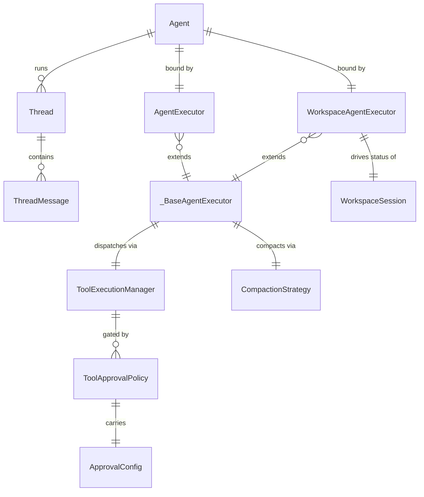
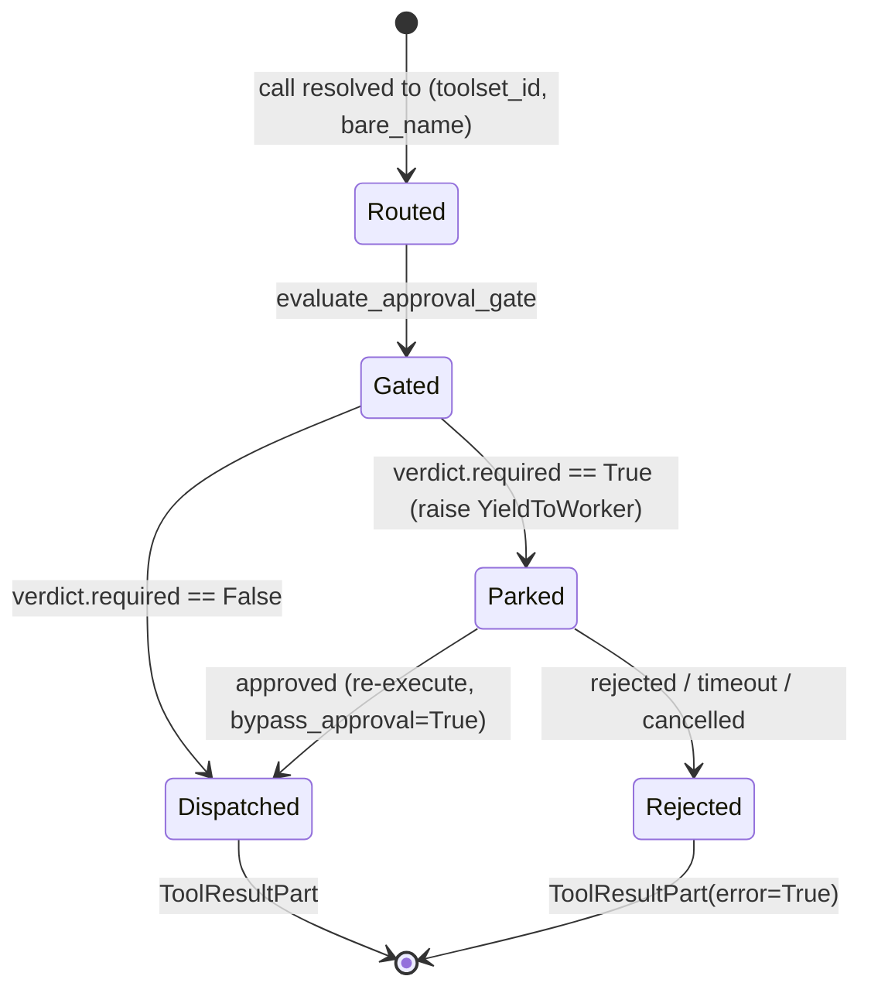

# Agents

## 1. Purpose

The agent subsystem is the runtime that drives one LLM turn end to end: it assembles a prompt, streams the model, dispatches the tool calls the model asks for, feeds the tool results back, repeats until the model stops, and persists the materialised turn. It is the layer that sits between an `Agent` definition (system prompt, model, tool allowlist) and the raw LLM and tool primitives.

The subsystem lives in `primer/agent/` and is organised around a shared abstract base, `_BaseAgentExecutor` (`primer/agent/base.py`), with one concrete executor:

- `WorkspaceAgentExecutor` (`primer/agent/workspace_executor.py`) persists to a workspace's `messages.jsonl` via `AgentSession.commit_state(op='message')`, one git commit per turn, and drives `SessionStatus` transitions for the worker pool.

The base stays abstract because the graph executor reuses its turn loop verbatim, not because a second persistence backend is expected. A thread-backed executor existed alongside it while the chat surface did, and went with it.

Around the executors sit the cross-cutting concerns that every turn touches: tool routing and dispatch (`ToolExecutionManager`), context compaction (`CompactionStrategy` plus the stateless `compaction_mixin`), the tool-call approval gate (`approval.py`, `rego.py`), and the per-turn loop helper (`loop.run_agent_turn`) that the graph executor reuses verbatim.

This document covers the agent runtime. Worker-pool ownership of parked sessions, the event bus, and the timer/sweeper background tasks live in `docs/dev/architecture/worker-system.md`. Turn-boundary logging lives in `docs/dev/architecture/observability.md`.

## 2. Conceptual model

An `Agent` is an immutable definition: a system prompt, a model, and a tool allowlist. An executor binds that definition to an `LLM` adapter, an `LLMModel`, and a `ToolExecutionManager`, then drives turns. A turn produces an ordered list of `Message` rows (assistant text, tool calls, tool results) that the subclass persists to its backing store. Tool calls route through the `ToolExecutionManager`, which resolves scoped tool ids back to a `ToolsetProvider` or a workspace tool, runs the approval gate, and dispatches. When history grows past a token threshold, `CompactionStrategy` summarises the head into a single synthetic message.

The entities and their relationships:

```mermaid
erDiagram
    Agent ||--o{ Thread : "runs"
    Thread ||--o{ ThreadMessage : "contains"
    Agent ||--|| AgentExecutor : "bound by"
    Agent ||--|| WorkspaceAgentExecutor : "bound by"
    AgentExecutor }o--|| _BaseAgentExecutor : "extends"
    WorkspaceAgentExecutor }o--|| _BaseAgentExecutor : "extends"
    _BaseAgentExecutor ||--|| ToolExecutionManager : "dispatches via"
    _BaseAgentExecutor ||--|| CompactionStrategy : "compacts via"
    ToolExecutionManager ||--o{ ToolApprovalPolicy : "gated by"
    ToolApprovalPolicy ||--|| ApprovalConfig : "carries"
    WorkspaceAgentExecutor ||--|| WorkspaceSession : "drives status of"
```

`Thread` plus `ThreadMessage` (`primer/model/thread.py`) back `AgentExecutor`. `WorkspaceSession` (`primer/model/workspace_session.py`) backs `WorkspaceAgentExecutor`. `ToolApprovalPolicy` (`primer/model/tool_approval.py`) is keyed by `(toolset_id, tool_name)` and carries a discriminated `ApprovalConfig` union.

## 3. Architecture patterns implemented

- **Shared base, divergent persistence.** `_BaseAgentExecutor` owns the invoke flow, compaction integration, streaming fan-out, and hard-overflow recovery; subclasses implement only three hooks (`_load_history`, `_persist_turn`, `_replace_compacted_head`). The base class is deliberately non-public (leading underscore) rather than an exported ABC.
- **Extracted free helper for the inner loop.** The per-turn stream-buffer-dispatch loop is factored out of the base class into `primer.agent.loop.run_agent_turn`, which mutates a caller-provided `messages_out` list. The graph executor reuses this same helper, so agent and graph turns share tool-dispatch semantics.
- **Stateless mixin for compaction.** `compaction_mixin` exposes `should_compact`, `apply_compaction`, and `force_compact` as free async functions rather than base-class methods, so compaction can be shared by runner classes that have no common base. It was written when two such runners existed; the shape still earns its keep for the graph executor.
- **Scoped tool ids with a single catalogue.** `ToolExecutionManager` surfaces every tool to the LLM as `toolset_id__bare_name` (separator `__`), so colliding bare names across toolsets, MCP servers, and workspace tools stay routable from one flat catalogue.
- **Yield-as-control-flow for parking.** When the approval gate trips, `ToolExecutionManager.execute` raises `YieldToWorker` carrying a `Yielded` record; the base executor stamps the in-progress turn messages onto the exception so the worker can park and later resume.
- **Fail-closed approval gate.** `evaluate_approval_gate` dispatches by `ApprovalType` (required / Rego policy / LLM judge); any failure path returns `required=True` with a diagnostic reason rather than letting the call through.

## 4. Code layout

| Path | Responsibility |
| --- | --- |
| `primer/agent/base.py` | `_BaseAgentExecutor` ABC: `invoke`, proactive compaction, hard-overflow retry, streaming-tap fan-out, three abstract hooks. |
| `primer/agent/executor.py` | `AgentExecutor` over `Storage[Thread]` plus `Storage[ThreadMessage]`; static helpers `open_thread` / `delete_thread` / `list_threads`. |
| `primer/agent/workspace_executor.py` | `WorkspaceAgentExecutor` over `messages.jsonl`; drives `SessionStatus`; `inject_resume_messages` for the worker resume path. |
| `primer/agent/loop.py` | `run_agent_turn` shared inner loop; reused by the graph executor. |
| `primer/common/context_overflow.py` | `is_context_overflow` / `is_context_overflow_error`: the one classifier for "the prompt does not fit the context window" (raised, yielded and summariser-wrapped shapes). |
| `primer/agent/tool_manager.py` | `ToolExecutionManager`: scoped-id catalogue, routing, approval gate, dispatch, truncation envelope, OTel + Prometheus; `invoke_one` for MCP-direct dispatch. |
| `primer/agent/compaction.py` | `CompactionStrategy`, `CompactedTurn`, `lookup_context_length`, `MODEL_CONTEXT_FALLBACK`. |
| `primer/agent/compaction_mixin.py` | Stateless `should_compact` / `apply_compaction` / `force_compact`, `CompactionResult` dataclass. |
| `primer/agent/approval.py` | `ApprovalContext`, `ApprovalResolver`, `ApprovalVerdict`, `evaluate_approval_gate`. |
| `primer/agent/rego.py` | `RegoEvaluator` backing `PolicyApprovalConfig`. |
| `primer/agent/events.py` | `AgentEventSubscriber` protocol, `Subscription` handle. |
| `primer/agent/prompts.py` | `DEFAULT_COMPACTION_PROMPT`. |
| `primer/agent/tail.py` | `tail_split` (the plain turn-based head/tail split) and `split_for_compaction` (what tier 2 uses: the same tail made unit-atomic, protected around unanswered input, and bounded by size). |
| `primer/model/thread.py` | `Thread` plus `ThreadMessage` Pydantic models. |
| `primer/model/tool_approval.py` | `ToolApprovalPolicy` plus the discriminated `ApprovalConfig` union. |

## 5. Data model

`Thread` (`primer/model/thread.py`) extends `Identifiable` and carries `agent_id`, optional `title`, `created_at`, and `last_activity_at` (stamped at end of every turn). The `agent_id` is a snapshot: a thread keeps its original id but picks up the current agent definition's system prompt, tools, and model on each subsequent turn.

`ThreadMessage` (`primer/model/thread.py`) carries `thread_id`, `role` (`user` / `assistant` / `system` / `tool`), `parts: list[Part]`, `created_at`, and a monotonic per-thread `sequence: int` (`ge=0`) assigned incrementally as messages are appended.

`ToolApprovalPolicy` (`primer/model/tool_approval.py`) is keyed by `(toolset_id, tool_name)` and carries `enabled`, an optional `timeout_seconds`, and an `approval: ApprovalConfig` discriminated on `type`:

- `RequiredApprovalConfig` (`type=required`): gate trips unconditionally.
- `PolicyApprovalConfig` (`type=policy`): evaluates Rego source that must produce a `required` boolean plus optional `reason`.
- `LlmApprovalConfig` (`type=llm`): asks an LLM judge resolved through `provider_id` plus `model` for a `{required, reason?}` verdict.

The approval gate is a small state machine over one tool call: a call resolves, the gate evaluates, and either dispatch proceeds or the call parks pending an operator verdict.

```mermaid
stateDiagram-v2
    [*] --> Routed : call resolved to (toolset_id, bare_name)
    Routed --> Gated : evaluate_approval_gate
    Gated --> Dispatched : verdict.required == False
    Gated --> Parked : verdict.required == True (raise YieldToWorker)
    Parked --> Dispatched : approved (re-execute, bypass_approval=True)
    Parked --> Rejected : rejected / timeout / cancelled
    Dispatched --> [*] : ToolResultPart
    Rejected --> [*] : ToolResultPart(error=True)
```

## 6. Lifecycle

`_BaseAgentExecutor.invoke` (`primer/agent/base.py`) runs one user-driven turn: it loads history, runs proactive compaction, drives the inner loop, and falls back to force-compaction on a hard context overflow. Persistence is end-of-turn only; streaming chunks fan out to subscribers but never land in storage. The inner loop delegates to `run_agent_turn`, which appends the assistant message before tool dispatch and synthesises an `ExtendedEvent(_ExecutorToolResult)` per tool round-trip so taps see results.

```mermaid
sequenceDiagram
    participant Caller
    participant Exec as _BaseAgentExecutor
    participant Loop as run_agent_turn
    participant LLM
    participant TM as ToolExecutionManager
    participant Store as persist hook

    Caller->>Exec: invoke(messages)
    Exec->>Exec: _load_history + maybe_compact
    Exec->>Loop: run_agent_turn(prompt, messages_out)
    Loop->>LLM: stream turn
    LLM-->>Loop: tool_use stop
    Loop->>TM: execute(call)
    alt approval required
        TM-->>Loop: raise YieldToWorker
        Loop-->>Exec: stamp llm_messages, re-raise
        Exec-->>Caller: park (worker resumes later)
    else dispatched
        TM-->>Loop: ToolResultPart
        Loop->>LLM: re-send with tool result
        LLM-->>Loop: final stop
    end
    Loop->>Store: _persist_turn(turn_messages)
    Store-->>Exec: persisted
    Exec-->>Caller: stream complete
```

`WorkspaceAgentExecutor.invoke` overrides this flow to drive session status: it handles `PAUSED -> RUNNING` and `WAITING -> RUNNING` at turn entry, rejects `ENDED` sessions with `ConflictError`, and maps `Done.stop_reason` plus the trailing assistant text to a post-turn transition (`tool_use` stays running; `error` ends the session as failed; a trailing `?` moves to `WAITING`). It publishes `last_done_reason` on the instance so the worker pool's post-turn mapper can re-enqueue or wait without re-iterating events.

Tool dispatch errors become `ToolResultPart(error=True)` rather than aborting the turn, so the model can react and recover; only `AuthRequiredError` propagates (the workspace executor handles it by transitioning to `WAITING`).

## 7. Persistence

`AgentExecutor` persists via per-row `Storage.create` calls in `_persist_turn`; there is no end-of-turn transaction primitive today. `_replace_compacted_head` matches tail rows structurally, deletes the head rows, inserts the summary at sequence 0, and resequences the tail from 1 (an un-transactional sequence in v1).

`WorkspaceAgentExecutor` persists via `AgentSession.commit_state(op='message')`, writing `messages.jsonl` with one git commit per turn. The commit subject is built from an excerpt of the last assistant message text or the tool-use names, capped at 72 characters. Workspace-tool output that exceeds the truncation envelope (50 KiB / 2000 lines, with a 50-line preview head) is written in full to `session.cache_output` and referenced by path in the truncated tool result.

Compaction persistence uses the prefix-string convention: `[earlier conversation compacted on <ts>]` on a synthetic assistant message in `messages.jsonl`. The marker also carries the tail tier 2 kept verbatim (`kept_tail_messages`, the messages after the summary in the compacted history, each serialised exactly as a Message line is). `reconstruct_compacted_history` returns `[summary, *kept_tail_messages, *lines after the marker]`, carrying the tail at the marker's own seq so a rewind treats it as written with the marker, and drops a tail with any unreadable entry whole (a half tail could hold a tool call without its result). A marker written before the tail was recorded has no such field and reads as it always did. The tail in the marker is the tier-1 pruned copy of those messages, so this is the one place a prune becomes durable (for the kept tail only; the raw Message lines stay on disk, and the model is told where a tool result was omitted). The marker folds every line before it, so a Message line written between the compaction's snapshot and the marker (a steer drained after an earlier marker in the same turn, a mid-turn steer before an overflow's forced compaction) would be lost with it: `_replace_compacted_head` reads the history again under the messages lock, and appends the lines that are not in the snapshot to the kept tail, after the strategy's own tail. The marker's payload also carries the compaction's verdict (`outcome`, `unreducible`, `trigger_tokens`). A `compaction_note` record (written by the normal event path, so with a real seq) carries the same verdict when no marker was written. A tail with an unreadable entry is dropped whole and replaced by a synthetic assistant note saying so (a half tail could hold a tool call without its result).

Parked turns persist outside the executor: when `YieldToWorker` is raised, the worker pool writes the stamped `llm_messages` into the session's `parked_state` blob so the resume path can re-pair the assistant tool_use with a synthesised tool result. `WorkspaceAgentExecutor.inject_resume_messages` appends that rehydrated `[assistant_tool_use, tool_result]` pair without driving a new turn.

## 8. Public surfaces

`_BaseAgentExecutor.invoke(messages, *, response_format=None)` is the single entry point; it returns an async iterator of `StreamEvent`. `subscribe(subscriber)` / `unsubscribe(subscription)` register streaming taps that receive every event concurrently with the caller's iterator; subscribers that raise are logged and isolated.

`AgentExecutor` exposes static thread-management helpers `open_thread`, `delete_thread`, and `list_threads` alongside the inherited `invoke`.

`WorkspaceAgentExecutor` adds `inject_resume_messages` and the `last_done_reason` instance attribute consumed by the worker pool.

`ToolExecutionManager` exposes `list_tools` (scoped catalogue, collision detection), `execute(call, *, principal, bypass_approval=False)` (route, gate, dispatch), and `invoke_one(*, provider, tool_name, arguments, principal)` for MCP-direct dispatch with no approval gate or workspace branch. Both `execute` and `invoke_one` are wrapped in an OpenTelemetry span and increment `tool_calls_total` / `tool_duration_seconds`. The MCP server endpoint (`primer/mcp/`) consumes `invoke_one` after applying its own allowlist filters; that surface is documented in `docs/dev/architecture/rest-api.md` and `docs/dev/subsystems/model-providers.md`.

`evaluate_approval_gate(ctx, cfg, *, provider_registry)` and `ApprovalResolver` are the approval surface; the REST endpoints (`/tool_approval_policies` CRUD, `tool_approval/pending`, `tool_approval/respond`) live in `primer/api/routers/tool_approval.py` and are documented in `docs/dev/architecture/rest-api.md`.

## 9. Internal contracts

The three subclass hooks form the persistence contract: `_load_history` returns prior conversation in chronological order, `_persist_turn` appends the turn's messages, and `_replace_compacted_head` swaps the persisted history for its compacted form. `_BaseAgentExecutor` calls these and owns everything else.

`run_agent_turn` (`primer/agent/loop.py`) is the inner-loop contract shared with the graph executor: callers pass `messages_out` (mutated in place with the assistant and tool-result messages). On a clean end-of-stream the base class persists; on `YieldToWorker` it stamps `exc.llm_messages` with the turn delta (slicing off the caller-supplied `new_messages`) and re-raises.

`run_agent_turn` takes `interrupt=` (an `asyncio.Event`, the session's Stop signal) and `interrupted_out=` (an output list, like `messages_out`). The loop wraps every wait for the model's next event in `primer.agent.interrupt.interruptible(interrupt)`, so a Stop lands before the first token as well as between chunks; when it fires the loop closes the provider stream, appends `True` to `interrupted_out` and RETURNS cleanly (no exception), and `_BaseAgentExecutor` reports it as `was_interrupted` (the dispatch path binds the event with `bind_interrupt_event`). Only completed rounds stay in `messages_out`, so an interrupted round's partial assistant text never reaches the persisted history. Tool dispatch is not interruptible: a Stop that lands during a tool batch lets the batch finish and be recorded, and the loop ends before the next model call (unless the batch parks, which consumes the Stop: see `docs/dev/subsystems/sessions.md`). A Stop that has landed BEFORE a round's batch starts runs none of it: the loop checks `interrupt` just before `_dispatch_tool_calls` and, if set, answers every call of the round with a synthetic error result, `not run: stopped by user`, through `_answer_undispatched` (the one helper that builds the `tool` message for `messages_out` and the `_ExecutorToolResult` events to yield, so the history and the durable log both stay paired), appends `True` to `interrupted_out` and returns. A Stop that lands after the model's terminal event, while the provider has not yet closed the stream, closes the stream and treats it as the end of the stream: the completed round is processed as above (its tool calls are NOT run, they are answered), and the turn ends before the next model call, so a provider that never closes a stream cannot hold a Stop for the stall timeout. One cost of that: a provider that sends its `Usage` chunk AFTER the terminal event loses it to a Stop that lands in this drain, so that call's `llm_call` is recorded `ok` with no token counts (the Stop is not made to wait for a trailing chunk). An interrupted call is counted on `llm_calls_total` with `status="interrupted"`. Graph node turns do not pass the event yet.

**The tool-turn cap answers what it does not run.** The loop appends the assistant message (with its tool calls) to `messages_out` before it checks `Agent.max_tool_turns`. When a round would exceed the cap the loop does not dispatch it, and it first answers EVERY call of that round with a synthetic error `ToolResultPart` (`"not executed: tool-turn cap reached"`, one `tool` message for the whole round) before returning. The same results are yielded as `_ExecutorToolResult` events, so the durable log is paired as well as the persisted history. Both halves are done by ONE helper, `_answer_undispatched` (`primer/agent/loop.py`), which appends the `tool` message to `messages_out` before it yields anything and then yields one event per call, so a caller cannot do one half and forget the other; the Stop check that runs just before dispatch (`not run: stopped by user`) uses the same helper, and when a Stop and the cap land on the same round the Stop wins and is reported as one. Without the answer the persisted history ends in a tool call nothing answers: Anthropic then rejects every later request with a 400 (`tool_use` ids without matching `tool_result` blocks), the OpenAI Chat Completions API rejects an assistant `tool_calls` that no tool message follows, and the session is wedged (a 400 that is not an overflow recovers nothing). A synthetic error result, rather than dropping the call, keeps the model told that it asked and was refused.

`run_agent_turn` also takes two optional seams, both neutral when omitted. `tools=` is a tool catalogue the caller already fetched; the loop uses it instead of calling `tool_manager.list_tools`, so a caller that must size the prompt before the turn fetches the catalogue once. `budget=` is a `PromptGuard` (`primer/agent/loop.py`): the loop calls `before_call(prompt, tools=...)` before EVERY `llm.stream` call, the first included, sends what it returns, and calls `after_call(usage)` when the call ends. The guard sees and returns only the OUTGOING prompt: `messages_out` (what is persisted and what a park stamps onto its exception) is never touched, and the loop keeps accumulating its own unreduced prompt, so a guard cannot rely on the loop carrying its previous output. No guard is wired into any executor yet.

**The tool-dispatch seam (flag-gated).** `run_agent_turn` accepts `tool_calls_as_claims_enabled` (default `False`), `resolve_scoped_call` (default `None`) and `await_dispatch_barrier` (default `None`), plus `turn_no`. `_dispatch_tool_calls` takes the claims path only when the flag is on AND a resolver is bound; otherwise it runs the original in-process loop unchanged, one call at a time. On the claims path `_partition_notifying` splits the batch into notifying calls (those the runner answers itself with a synthetic success; they are never claimed; their results are recorded as born-terminal task rows) and claimable calls; if there are no claimable calls the batch falls through to the in-process loop. `_dispatch_as_claims` first awaits the barrier once (graph surface only, so the drainer has caught up with the batch's already-queued events), answers every notifying call inline, calls `resolve_scoped_call` for every call (the raw provider id maps to the scoped `<node>:tool:<turn_no>:<seq>` id and the seq of the durable `TOOL_CALL` record; a successful return is the proof that record is flushed), and then always raises `ToolWaitPark(outstanding_task_ids, event_key, notifying_results)`; it never returns normally. `_BaseAgentExecutor._run_loop` has its own `except ToolWaitPark` arm that stamps the turn's accumulated messages onto the exception (the same slice the `YieldToWorker` arm stamps), so the resume can inject tool results paired with their tool uses. Nested subagent turns (`system__invoke_agent`) are excluded: `run_subagent` and `resume_subagent` do not accept the flag, so a nested batch always dispatches in-process whatever the enclosing turn's setting. See `docs/dev/architecture/claim-machine.md` (section 5) for what happens after the raise and what is not built.

`ToolExecutionManager` enforces the scoped-id invariant: bare ids containing `__` raise `ConfigError` at `list_tools`; the agent allowlist (the `tools=[...]` constructor arg) filters toolset tools from the catalogue and rejects out-of-allowlist `execute` calls with `UnsupportedContentError`, while workspace tools bypass the allowlist. The approval gate runs after routing and before dispatch; `bypass_approval=True` is the worker resume path's signal to skip the gate after operator approval lands.

The compaction contract has two convergent paths: `_BaseAgentExecutor` calls `CompactionStrategy.maybe_compact` (character heuristic), while the mixin's `should_compact` uses native `LLM.count_tokens`; both converge on `CompactionStrategy._tier2` for the actual summarisation pass. `DEFAULT_TRIGGER_RATIO` is `0.90`, `DEFAULT_TAIL_TURNS` is `4`, and `summary_max_tokens` defaults to `4096`. Tier 2 cuts the history with `split_for_compaction` (`primer/agent/tail.py`), not `tail_split` alone. The tail starts at the `tail_turns`-th most recent assistant message and then: (1) always includes the PENDING suffix, the CURRENT turn's unanswered part: the run of user messages the model has not answered plus the tool rounds that follow it (a turn still in flight, or one a park will resume). Pending is never summarised, because a summary of the question deletes the question. It is the current turn only: tool rounds of an EARLIER turn that ended without a final text reply (a Stop, the `max_tool_turns` cap, an empty completion) are ordinary history once a later user message follows them, or a session that ended that way once could never be compacted again. (2) The tail is only ever cut on a UNIT boundary, an assistant message with tool calls and every tool message that answers it being one unit. (3) It is bounded by `min(tail_budget_fraction * trigger, trigger - summary_max_tokens)` (`tail_budget_fraction` defaults to `0.5`), so a summary of the full allowance plus the tail stays under the trigger; the formula is 0 whenever the trigger is no larger than the summary allowance (a context under about 4.6k tokens at the defaults), where the tail shrinks to its floor and the result is usually `insufficient`. While the tail is over the budget its oldest unit moves into the head, never past the pending suffix or the newest unit. (4) When that leaves nothing to summarise, the tail shrinks to its floor (the pending suffix, or the newest unit), so a forced compaction of a history that fits its budget still summarises. The budget counts MESSAGES only: the fixed overhead (system prompt, tool schemas) is not in the trigger, the tail budget or the re-measure (task 01a10914). Only the head is summarised. The compaction ends in one of four counted outcomes (`compaction_outcomes_total{outcome}`): `pruned` (tier 1 sufficed), `summarised`, `unreducible` (nothing summarised, no marker: `empty_head`, or `protected_over_trigger` when the protected suffix alone is at or over the trigger, in which case no summariser call is made either), and `insufficient` (summarised and still at or over the trigger). Before concluding `insufficient` the result is measured again and, if the tail can still shrink, the head is summarised once more with only the protected part kept (one bounded escalation, in memory, TEXT-ONLY so a tool-enabled summariser does not run its tools twice, and exactly ONE marker is written for the result that is returned). The verdict is in the session record: a marker carries `outcome`, `unreducible` and `trigger_tokens` in its payload, and a compaction that writes no marker yields a `_CompactionNote` event that the dispatch path persists as a `compaction_note` record. Each also logs a WARNING. The prompt is sent anyway (the provider may accept it, and the overflow handler is the net), so the verdict is a signal and not a stop. The manual route (`compact_session`) writes the same `kept_tail_messages` from `CompactionResult.kept_tail`, re-reads the history just before the write so a steer that landed while the summariser ran is carried into the marker's tail, and answers 422 when nothing could be summarised instead of writing an empty marker, which would fold the whole history into nothing. Note the mixin's `DEFAULT_RESERVED_OUTPUT_TOKENS` is `2000` while `CompactionStrategy.DEFAULT_RESERVED_OUTPUT` is `8192`, so the two paths compute slightly different trigger thresholds for the same context length. The trigger compares the HISTORY's size with the budget, but the system prompt and the tool schemas go out on every call and no history can give them back; `scripts/measure_fixed_overhead.py` measures that fixed part (the workspace system fragment plus the workspace tool set, built from a real session, and optionally an agent's rendered system prompt and an exported tool list) in characters, by the `len/4` heuristic and in exact o200k and cl100k tokens, and prints its share of the live trigger for a given `--context-length`. For the workspace fixed part alone it reports about 3.0k tokens (2,984 o200k, 2,985 cl100k, 3,110 heuristic when last measured, 7 workspace tools), which is 1.6x the trigger of a 4096-context model and 0.13x that of a 32768-context one; a fixed part of 0.5x the trigger or more is where pruning or summarising history cannot bring a prompt under the trigger.

**Hard-overflow recovery uses one shared classifier.** `invoke` catches a raised `BadRequestError`, asks `is_context_overflow` (`primer/common/context_overflow.py`) whether the prompt did not fit, and only then force-compacts and replays once; anything else re-raises untouched. A false positive is destructive (the persisted head becomes a summary and the replay hits the same 400, on every turn), so the classifier is conservative: it prefers a provider code (`context_length_exceeded`), matches only phrases about the INPUT not fitting (Anthropic `prompt is too long` and `exceed context limit`, OpenAI `maximum context length`, Gemini `input token count`, llama.cpp `context size`, and so on), and never matches a bare `max_tokens`, the name of the OUTPUT cap (Anthropic's `max_tokens: N > M ... maximum allowed number of output tokens` and OpenAI's `Unsupported parameter: 'max_tokens'` are not overflows). Budget phrases that do not say which side overflowed (`token limit`, `too many tokens`) count only when the message does not talk about output tokens. A message that says an output-cap parameter "is too large" is an output-cap error unless its own numbers show the cap fits the context window. vLLM raises `'max_tokens' or 'max_completion_tokens' is too large: 4096. This model's maximum context length is 32768 tokens and your request has 29000 input tokens (4096 > 32768 - 29000)` whenever input plus the cap exceeds the model length; primer always sends `max_output_tokens`, so on a vLLM-backed profile that is the normal overflow form, and compaction can fix it because the cap alone fits. So the classifier compares the two numbers (the trailing `(cap > context - input)` group, or `is too large: N` with `maximum context length is M`): a cap at or above the context length is an output-cap error (no history can fit), a smaller one is an overflow. OpenAI's `max_tokens is too large: N. This model supports at most M completion tokens` carries no context length and stays an output-cap error. The check is anchored to `<parameter> is too large`, not to the two words appearing anywhere, because the OpenAI SDK embeds the response body in the exception text. An overflow reaches the executor in three shapes, all classified: a raised `BadRequestError` (Anthropic, OpenChat, OpenResponses and OpenRouter open the request with an awaited call that raises; `invoke` recovers this shape); a yielded fatal `Error(code="bad_request")` that `run_agent_turn` raises as a `TurnStreamFailure` (Ollama and Gemini report their 400 as a yielded error; classified but NOT recovered, see below); and that same yielded error re-raised by the summariser as a `ServerError` carrying the `Error`'s code. A yielded error with any other code (`rate_limit`, `server_error`, no code) is never an overflow whatever its text. An aggregated profile whose members ALL failed because the prompt did not fit re-raises the last member's `BadRequestError` (built from the `Error` when the member yielded it) instead of wrapping it as `RateLimitError("all N aggregated members failed")`; a pool with any other failure in it (a rate limit, a missing member) stays a `RateLimitError`, and an overflow on one member still fails over to a member that fits. An aggregated pool whose members all overflowed now reaches `invoke` as a raised `BadRequestError`, so it takes the same replay-from-scratch recovery as an eager adapter, with the same exposure to re-running tools, until the overflow-replay unit lands. The overflow-replay and summariser-retry units are meant to call the same classifier. `invoke` does NOT recover a yielded overflow (`TurnStreamFailure`): the replay restarts the turn from scratch, which re-runs tools the turn already executed; the yielded `Error` has already been streamed and recorded as an `ERROR` record; and a `TurnStreamFailure` can carry a partial assistant message. That recovery belongs to the overflow-replay unit.

## 10. Testing patterns

Tests live under `tests/agent/`. The Agent model is covered by `tests/model/test_agent.py`. The tool manager has `test_tool_manager.py`, `test_tool_manager_approval_gate.py`, and `test_invoke_one.py` (MCP-direct dispatch). Tool-result pruning primitives (`primer/agent/prune.py`: `prune_prompt` takes the RAW messages and a sticky `PruneSet` whose keys are position-stable (tool-call id, output hash and occurrence index) and which is valid only for the raw sequence it was recorded against and its appends, so a caller discards it on a compaction or any history rewrite, sizes results with a caller-supplied function, never replaces a result in the newest `keep_rounds` tool messages with a recorded placeholder, decides "already reduced" from the set rather than from output text, and has a `force` truncation mode) are covered by `test_prune.py`, and the loop seam by `test_run_agent_turn_seam.py`. The tool-turn cap (`test_max_tool_turns.py`) and the history it leaves behind (`test_tool_turn_cap_history.py`: every call of the capped round answered, the result yielded, the persisted history valid for both the Anthropic and the OpenAI Chat Completions converters, the next turn accepted by a provider that 400s on an unanswered call) have their own files. Compaction is split across `test_compaction.py`, `test_compaction_mixin.py` (threshold math, apply, force), and `test_base_executor_compaction_via_mixin.py` (binding check). `test_off_mode_golden.py` pins today's compaction behaviour byte for byte (`tests/_support/off_golden.py` runs one scripted workspace session through tier 1 pruning, tier 2 summarising, the overflow replay and steers deferred during a compaction window, and a fixture records every prompt, every call's keyword arguments by value, each tool as a digest of its schema, every marker, the LLM call count and the persisted `messages.jsonl` after each turn, plus two boundary turns at one token under and exactly at the trigger); the fixture is captured by `scripts/capture_off_golden.py` from a clean checkout of the commit it pins and is the proof that the prompt-budget work's `off` mode changes nothing. `off` is "today minus the standalone live-defect fixes", so the fixture is re-captured, in the commit after the fix and naming it, whenever such a fix changes what a turn sends or records (the tier-2 tail fix was the first). `test_tier2_keeps_the_turn.py` (end to end on a real workspace session, plus the strategy rules), `test_split_for_compaction.py` and `tests/workspace/test_compaction_marker_kept_tail.py` pin the tier-2 tail rules and the marker's kept tail (tier 2 used to drop the kept tail and the turn's own input from every later turn). `test_compaction_characterisation.py` and `test_overflow_replay_characterisation.py` characterise the rules, limitations included: the heuristic's constants and that it measures messages only, the trigger and its ctx//2 clamp, the exact tier-1 rule with both inclusive boundaries (and that it is re-derived each turn and applied in memory only), tools that run again when an overflowing turn is replayed from scratch, and an overflow in the replay or in the summariser failing the turn. The executors are covered by `test_executor.py` and `test_workspace_executor.py`. The approval system has `test_approval_gate.py`, `test_approval_resolver.py`, and `test_rego.py`, with the worker resume path in `tests/worker/test_approval_resume.py` and graph-run rejection in `tests/graph/test_toolcall_approval_reject.py`. The flag-gated claims seam is covered by `test_loop_claims_seam.py` (routing fires only with flag and resolver, the barrier is awaited once, the resolver is called for every call, notifying results carry scoped ids, the dispatch always raises), `test_notifying_dispatch.py`, `test_chat_surface_tool_wait_stamp.py` (the `_run_loop` stamp) and `test_tool_calls_as_claims_scope_cut.py` (the nested subagent entry points take no flag). The overflow classifier is table-tested against the real provider texts in both directions (`tests/common/test_context_overflow.py`), the executor recovery is driven end to end with a scripted LLM and a spy compaction (`test_overflow_recovery.py`: an output-cap 400 never force-compacts, a raised overflow does, once, and a yielded overflow is classified but propagates without a replay), and aggregated exhaustion is in `tests/llm/test_aggregated.py`. Streaming taps and the tail helper have `test_events.py` and `test_tail.py`. Per the project memory, smoke-test changes with `uv run primer api` in the background and read any API keys or bearer tokens from environment variables in gated tests.

## 11. Historical decisions

- **Two concrete executors share a non-public base, and the inner per-turn loop is a free helper.** Why: the spec rejected new ABCs for the executor and factoring `run_agent_turn` out lets the graph executor reuse the same tool-dispatch semantics. Spec: `docs/superpowers/specs/2026-05-03-agent-executor-design.md`.
- **Persistence is end-of-turn only; streaming chunks fan out to subscribers but never reach storage.** Why: storage stays append-only and UI taps drive live rendering without a per-delta storage round-trip. Spec: `docs/superpowers/specs/2026-05-03-agent-executor-design.md`.
- **Compaction summarisation calls back into the same LLM and model the agent uses, not a cheaper sidekick.** Why: a user-confirmed design decision; the surface is shaped to accept a secondary LLM later but ships with the simpler path. Spec: `docs/superpowers/specs/2026-05-03-agent-executor-design.md`.
- **Tool ids surfaced to the LLM are scoped `toolset_id__bare_name`, and bare ids containing the separator are rejected at `list_tools`.** Why: different toolsets, MCP servers, and workspace tools can share bare names, so scoping keeps every call routable from one catalogue. Spec: `docs/superpowers/specs/2026-05-03-agent-executor-design.md`.
- **Tool dispatch errors become `ToolResultPart(error=True)` instead of aborting the turn; only `AuthRequiredError` propagates.** Why: it lets the model recover instead of crashing the executor, while the workspace executor handles auth failures with a `WAITING` transition. Spec: `docs/superpowers/specs/2026-05-03-agent-executor-design.md`.
- **The shipped trigger ratio is `0.90`, not the spec's `0.85`.** Why: the in-code default was tuned upward and the spec value is stale. Spec: `docs/superpowers/specs/2026-05-30-auto-compaction-token-counting-design.md`.
- **Compaction logic ships as a stateless free-function mixin module rather than a method on the runners.** Why: both `ChatTurnRunner` and `_BaseAgentExecutor` consume the same functions without forcing a shared base-class hierarchy. Spec: `docs/superpowers/specs/2026-05-30-auto-compaction-token-counting-design.md`.
- **`LLM.count_tokens` is an abstract method, not a default char-heuristic on the base class.** Why: every adapter is forced to make a conscious choice between a native counter and an explicit char fallback on the auto-trigger hot path. Spec: `docs/superpowers/specs/2026-05-30-auto-compaction-token-counting-design.md`.
- **Approval-gated tool calls raise `YieldToWorker` mid-execute, and the base executor stamps the partial turn onto the exception.** Why: it implements durable in-flight approval without restructuring `invoke` into a state machine; resume re-invokes after operator approval using `bypass_approval`. Spec: `docs/superpowers/specs/2026-05-24-tool-approval-system-design.md`.
- **Approval config lives on a new `ToolApprovalPolicy` entity keyed by `(toolset_id, tool_name)`, not on the runtime `Tool` model or the `Toolset` row.** Why: it keeps the lookup key stable across toolset re-registrations and lets operators edit gates without re-deploying toolset providers. Spec: `docs/superpowers/specs/2026-05-24-tool-approval-system-design.md`.
- **Every approval gate strategy fails closed: any unexpected error returns `required=True` with a diagnostic reason.** Why: an unhealthy judge or broken Rego policy must park rather than silently let a sensitive call through. Spec: `docs/superpowers/specs/2026-05-24-tool-approval-system-design.md`.
- **The worker special-cases `tool_name=="_approval"` inline rather than registering a resume hook in the registry.** Why: the resume needs the live `ToolExecutionManager` to re-dispatch the original call, and the registry passes only the parked blob plus payload. Spec: `docs/superpowers/specs/2026-05-24-tool-approval-system-design.md`.
- **`ToolExecutionManager.invoke_one` collapses to dispatch plus metrics plus tracing, trusting the MCP dispatcher's filters.** Why: MCP cannot park, resume, or bind a workspace context, so the inbound endpoint reuses a thinner path than the agent-side `execute`. Spec: `docs/superpowers/specs/2026-06-02-mcp-server-endpoint-design.md`.
- **The failed-turn path drives both the new `TurnLogFailed` event and the legacy `messages.jsonl` ERROR record off one `ProblemDetails` envelope.** Why: operators now see the real exception type, title, and detail in both the Turn-log tab and the Messages tab, retiring the generic "unexpected executor error" string. Spec: `docs/superpowers/specs/2026-06-05-per-session-turn-log-design.md`.
- **Tool calls can be dispatched as claims instead of sequentially, behind a default-off flag and only when a resolver is bound.** Why: sequential dispatch meant one gated call parked the whole turn and the calls after it never started. The seam needs the scoped tool-call id (the provider's raw id collides across fan-out siblings and multi-round turns), which only the transcript layer mints, so it is passed in as `resolve_scoped_call` and a successful lookup doubles as proof the record is durable; requiring both flag and resolver keeps every caller that never opted in on today's loop. Spec: docs/superpowers/2026-08-29-phase3-execution-topology-design.md.
- **Notifying calls are never claimed.** Why: the runner answers a notifying call itself with a synthetic success and never enters the park machinery, so routing it through the claim path would add cost for no behavioural difference; its result rides on `ToolWaitPark.notifying_results` and is recorded as a born-terminal task row so the batch has a single reassembly source. Spec: docs/superpowers/2026-08-29-phase3-execution-topology-design.md.
- **Nested subagent turns are permanently excluded from the claims path.** Why: a delegate turn run through `system__invoke_agent` has no session row of its own to park on, so `run_subagent` and `resume_subagent` do not accept the flag at all and a nested batch always runs in-process. Spec: docs/superpowers/2026-09-08-7a-gate-verdict.md.

## Cross-reference: external tools

Invoker-supplied tools ride the tool manager as a per-invocation
`external` pseudo-toolset that bypasses the agent allowlist and the
approval gate and always yields; see
[external-tools](external-tools.md).
