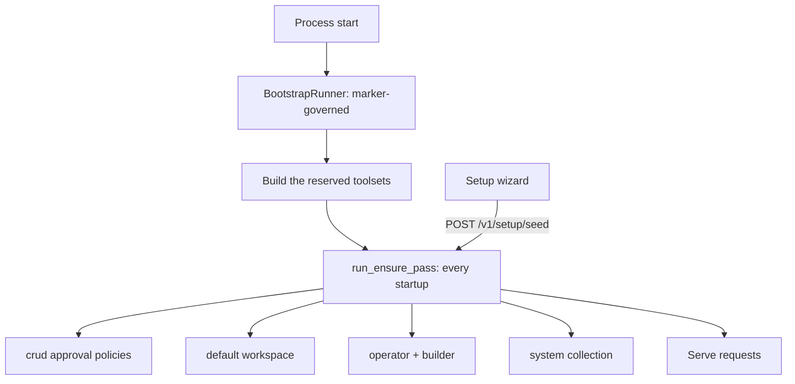

# Bootstrap and the seeded operator

## 1. Purpose

A fresh primer install is useless until someone tells it which model to talk to. This subsystem closes that gap from both ends: first run collects the irreducible minimum through a two-step wizard (one LLM provider, one model profile), and every boot afterwards repairs whatever is missing from the seeded world so an install cannot rot into a half-configured state.

What gets seeded is deliberately agent-first. An operator arrives to a default workspace, an `operator` agent that can answer questions about the install, a `builder` agent that can construct new agents and graphs, and a system collection describing everything that exists. The point is that the first useful thing a new user does is talk to an agent, not fill in forms.

## 2. Conceptual model

There are TWO independent seeding mechanisms and conflating them is the classic mistake.

`BootstrapRunner` (`primer/bootstrap/runner.py`) is MARKER-GOVERNED: it consults `bootstrap_completed_at` and, when unset, creates the five reserved provider rows (local workspace provider and template, the huggingface embedder and cross-encoder, the lance vector store). It runs once per install by design, because an operator who deletes a reserved provider meant to delete it.

The ENSURE PASS (`primer/bootstrap/seed.py::run_ensure_pass`) is MARKER-INDEPENDENT: it runs at every startup and owns the crud approval policies, the default workspace, the `operator` and `builder` agents, `SystemState.default_agent_id`, and the system collection. Ensure means create-when-absent: it never overwrites a row a human has edited, so an operator who repoints an agent at a better model keeps that choice across restarts.

Setup completeness is DERIVED, never stamped. `evaluate_setup_state` probes storage live and returns the ordered list of what is still missing (`llm_provider`, `model_profile`, `default_workspace`, `operator_agent`, `builder_agent`, `system_collection`). There is no `setup_complete` column: a stamp would go stale the moment an operator deleted the thing it claimed existed.

## 3. Architecture patterns implemented

- **Ensure seeding on a reserved id.** Every seeded object has a fixed id (`primer`, `operator`, `builder`, `system`), so "does it exist" is a `get`, not a search, and re-running is free.
- **Derived state over stamped state.** The setup fact is computed from the rows it describes.
- **Reserved internal toolset.** `crud` is resolved by the provider registry without a storage row, exactly like `system` and `workspace_ext`.
- **Approval by policy row, not by gate code.** The per-tool gate already runs for every internal toolset; making the crud tools approval-gated is a matter of seeding `ToolApprovalPolicy` rows, which keeps the operator's ability to relax them.
- **Embeddable UI gate.** The wizard's step sequence is props-only so a different shell can re-host it without inheriting the console's chrome.

## 4. Code layout

| Path | Role |
| --- | --- |
| `primer/bootstrap/defaults.py` | Reserved-id constants, including the S5 seeded-world ids. |
| `primer/bootstrap/runner.py` | The marker-governed first-boot provider seeding. |
| `primer/bootstrap/seed.py` | The ensure pass and its four steps. |
| `primer/bootstrap/setup_state.py` | The derived setup predicate and its missing codes. |
| `primer/bootstrap/operator_defaults.py` | Prompts, descriptions and tool grants for the two seeded agents. |
| `primer/toolset/crud.py` | The `crud` reserved toolset: nine construction tools. |
| `primer/toolset/_python_tools.py` | The python-toolset trio, factored out so `crud` can scope them. |
| `primer/knowledge/system_collection.py` | The regenerated map of the install. |
| `primer/api/routers/setup.py` | `POST /v1/setup/seed` and `POST /v1/setup/reset_agents`. |
| `ui/components/setup-wizard.jsx` | The three wizard globals: steps, gate, waiting screen. |

## 5. Data model

The seeded-world reserved ids live in `primer/bootstrap/defaults.py` as `RESERVED_OPERATOR_AGENT`, `RESERVED_BUILDER_AGENT` and `RESERVED_DEFAULT_WORKSPACE`. They are deliberately NOT in `ALL_RESERVED_IDS`: that frozenset is consumed by the provider router guards, and these are not provider rows. They stay user-editable and deletable.

`SystemState.default_agent_id` is a real column on the `system_state` singleton (both the sqlite and postgres DDLs carry it, with an ALTER guard). The ensure pass stamps it at `operator`; a binding-less session create resolves it.

The crud approval policies are ordinary `ToolApprovalPolicy` rows with the deterministic id `tool-approval-policy-crud-<tool_name>`, `enabled=True` and `approval={"type": "required"}`. One per crud tool.

The two seeded agents are ordinary `Agent` rows. Their `model.profile_id` is resolved from the default model profile at creation and PRESERVED thereafter.

The system collection is a `Collection` with `system=True` at id `system`, holding a document tree: `/agents`, `/graphs`, `/tools`, `/collections`, `/docs`, `/workspaces`, `/providers`, `/how-to` and a root index.

## 6. Lifecycle

Startup order: storage init, migrations, `run_first_boot_bootstrap`, `ensure_admin_exists`, the reserved toolset construction (the ensure pass needs the built toolsets to describe them), then `run_ensure_pass`, then serving. The pass is best-effort per step: a step that raises is recorded in `EnsureResult.errors` and logged, and the next boot retries it, because a half-seeded install that still serves is better than one that refuses to start.

Agent seeding is a no-op until a model profile exists. On a genuinely fresh install the first pass therefore records `skipped=["operator", "builder"]`, the wizard collects a provider and a profile, and the wizard's completion calls `POST /v1/setup/seed` to run the pass again rather than making the operator wait for a restart.

The console gate chain is: register or login, then the forced password change, then the restricted-user screen, then the setup gate (admins get the wizard, everyone else a waiting screen), then the app. The setup gate keys on the derived fact and never on users, so auth-disabled mode (which injects a synthetic admin) behaves identically.

## 7. Persistence

Everything is ordinary storage rows through the generic `Storage` layer, plus the `system_state` singleton columns. The system collection's documents live in the content store like any other collection's, which is why an operator can grep and read it with the same tools they use on their own collections.

Nothing here writes a marker of its own. Re-running the pass is the repair mechanism, so there is no state to get out of step.

## 8. Public surfaces

- `GET /v1/auth/status` carries `setup_complete: bool` and `setup_missing: list[str]` alongside the auth facts. It is the console's single boot probe, which is exactly why the setup fact rides it rather than getting an endpoint of its own.
- `POST /v1/setup/seed` (admin) runs the ensure pass and returns `{created, skipped, errors, setup_complete, setup_missing}`.
- `POST /v1/setup/reset_agents` (admin) restores the two seeded agents' defaults and returns `{reset: ["operator", "builder"]}`.
- The `crud` toolset exposes nine tools: create and update for agents, graphs and triggers, plus the python-toolset trio. Every one is approval-gated by a seeded policy.

## 9. Internal contracts

- Ensure NEVER overwrites a user edit. It creates when absent and returns.
- `reset_agents` overwrites exactly three fields (`description`, `system_prompt`, `tools`) on exactly two rows. `model.profile_id` is preserved when the row exists, and resolved from the default profile only when the row is being created. Nothing else in storage is touched.
- Agent seeding requires a default model profile; without one it skips and repairs on the next pass.
- The operator does NOT hold the crud toolset. It reads, searches and delegates; the builder constructs. That split is what makes the approval gate meaningful, since the agent a human talks to cannot itself mutate the platform.
- The system collection is regenerated from live state at every pass, and pruned: a deleted workspace or provider disappears from the map on the next boot.

## 10. Testing patterns

The ensure functions are driven against `_FakeStorageProvider` with a stubbed workspace registry, which by construction cannot seed sessions, so no test here asserts one exists. The system-collection tests use a real sqlite provider because they exercise the document tree.

The wizard and the gate chain are checked by static source assertions in `tests/ui`, never in `tests/ui_e2e`: that directory collect-ignores itself unless `PRIMER_RUN_UI_E2E=1`, so a source-reading test placed there would silently collect nothing in the unit lane.

The wizard's two POSTs get a real integration test against a monkeypatched model probe, asserting the provider-then-profile ordering the router guard enforces. The full loop (grep, delegate, approve, invoke, answer) is a live-server journey.

## 11. Historical decisions

- **The seeded operator is user-editable, against the system-managed recommendation.** Why: an operator who cannot tune the agent they talk to every day will replace it, and a system-managed row would make that a fork rather than an edit. The risk of drift is mitigated from both sides: the system collection is regenerated at every boot so the agent's map never goes stale, and `reset_agents` restores the defaults on demand. Added: S5 (2026-08-19).
- **The wizard collects two things, not ten.** Why: every additional first-run field is a reason to abandon setup, and everything else has a working default or can be added later from the console. Added: S5 (2026-08-19).
- **The crud toolset re-homes existing handlers rather than duplicating them.** Why: `_crud_tools_for` already built create and update descriptors for agents and graphs, and the trigger toolset already had its own. Re-scoping the descriptors with `model_copy` keeps one implementation and one set of error codes. Added: S5 (2026-08-19).
- **The python-toolset trio moved from `system` to `crud`.** Why: a tool that registers arbitrary python is a tool that runs arbitrary python, so it belongs behind the same approval gate as the rest of the construction surface. The bare names are unchanged; only the scope moved. Added: S5 (2026-08-19).
- **Setup completeness is derived rather than stamped.** Why: a stamp claims something exists; deleting the row it described would leave the claim standing and the install permanently past a gate it no longer satisfies. Added: S5 (2026-08-19).
