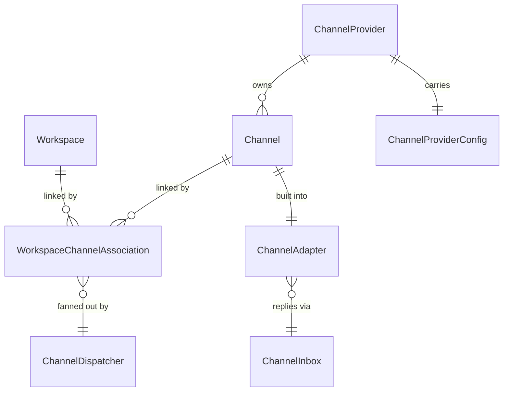
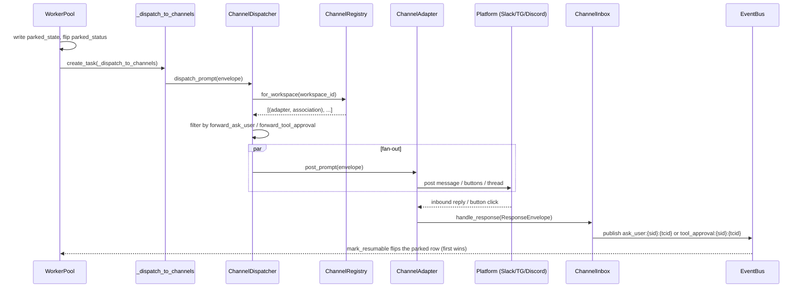

# Channels

## 1. Purpose

The channels subsystem forwards a parked worker session's `ask_user` and `_approval` prompts out to external messaging platforms (Slack, Telegram, Discord) and routes the human's reply back into the session, so an operator can answer a prompt or approve a tool call from their phone instead of the Primer console.

It is the outbound and inbound bridge between two existing machines that it deliberately does not own: the yielding-tools park flow (a session that calls `ask_user` or trips an approval gate parks on an event-bus key) and the event bus itself. Channels never invents its own park state or its own race-arbitration. When a session parks, the worker fires a fan-out to every channel the session's workspace is associated with; when any reply arrives on any platform, the inbound side republishes it onto the same `ask_user:{sid}:{tcid}` / `tool_approval:{sid}:{tcid}` event-bus key the REST surface already uses, and the existing atomic `mark_resumable` flip on the parked row guarantees first-response-wins.

The provider-agnostic core lives in `primer/channel/` (`adapter.py`, `dispatcher.py`, `inbox.py`, `factory.py`, `null_adapter.py`). Three persisted entities live in `primer/model/channel.py`. Per-platform adapters live under `primer/channel/{slack,telegram,discord}/`. The in-process adapter cache is `primer/api/registries/channel_registry.py`. The worker-side fan-out trigger is `_dispatch_to_channels` in `primer/worker/yield_runtime.py`, scheduled by `primer/worker/pool.py`.

The park/resume mechanics themselves are documented in the yielding-tools and worker-system docs; this document covers only the channels bridge. End-user-facing behaviour notes (for example that a resolved prompt's button is not retracted) live in `primer/ai_docs/channels.md` and are cross-referenced rather than restated.

## 2. Conceptual model

A `ChannelProvider` is a credential set for one messaging platform (one Slack team, one Telegram bot, one Discord bot). A `Channel` is one conversational target inside that provider (a Slack channel id, a Telegram chat id, a Discord channel id), addressed by its `external_id`. A `WorkspaceChannelAssociation` is the many-to-many link that says "prompts from this workspace's sessions should fan out to this channel," carrying the per-link `enabled`, `forward_ask_user`, and `forward_tool_approval` toggles.

At runtime a `ChannelAdapter` is the live, per-`Channel` object that knows how to post a `PromptEnvelope` to its platform and turn an inbound platform event into a `ResponseEnvelope`. The `ChannelDispatcher` fans one envelope out to every eligible adapter for a workspace; the `ChannelInbox` fans every adapter's responses back in onto the event bus.

`ChannelProviderConfig` is a discriminated union over the three concrete config classes (`SlackChannelProviderConfig`, `TelegramChannelProviderConfig`, `DiscordChannelProviderConfig`) in `primer/model/channel.py`. A `Channel` row holds no live connection; the `ChannelRegistry` lazily builds and caches one `ChannelAdapter` per `Channel` on first use.

## 3. Architecture patterns implemented

- **Provider-agnostic envelopes over a thin ABC.** `ChannelAdapter` (`primer/channel/adapter.py`) declares exactly four async methods (`initialize`, `aclose`, `verify`, `post_prompt`). The core only ever speaks `PromptEnvelope` (outbound) and `ResponseEnvelope` (inbound); all platform-specific rendering and decoding stay inside the per-platform packages.
- **Import-time factory registry.** `primer/channel/factory.py` keeps a module-level `_FACTORIES: dict[ChannelProviderType, AdapterFactory]`. Each per-platform package self-registers by calling `register_adapter_factory` at import, and `primer/api/app.py` imports the three factory modules at module load. `build_adapter` raises `ConfigError` ("adapter for provider X is not installed; see Spec 3.N") when an operator creates a row for an unregistered provider, so the failure surfaces loudly rather than after a session parks.
- **Lazy per-row adapter cache with double-checked locking.** `ChannelRegistry.get_adapter` (`primer/api/registries/channel_registry.py`) caches one adapter per `Channel` id under an `asyncio.Lock`, mirroring `ProviderRegistry` / `SemanticSearchRegistry`. There is no `warm_up`; adapters are built on first `get_adapter`.
- **Fire-and-forget fan-out off the critical path.** After a session parks, `primer/worker/pool.py` schedules `_dispatch_to_channels` via `asyncio.create_task` so a slow Slack post never delays the worker releasing its lease. The dispatcher runs every eligible adapter in parallel via `asyncio.gather`, catches per-adapter exceptions, logs them as warnings, and returns an `{"error": str(exc)}` sentinel for the failed adapter so one broken channel never blocks its siblings.
- **Reuse the event bus as the response join point.** `ChannelInbox.handle_response` (`primer/channel/inbox.py`) does not arbitrate races; it republishes onto the same event-bus key shape REST uses, and the existing `mark_resumable` atomic flip on the parked row is the only first-wins guarantee.
- **Refcounted shared connection per provider.** Each per-platform adapter shares one platform connection per `ChannelProvider.id` via a refcounted, `asyncio.Lock`-guarded registry (`SLACK_CONNECTIONS`, `TELEGRAM_CONNECTIONS`, `DISCORD_CONNECTIONS`), because each platform caps concurrent connections per token (Slack ~2 Socket Mode connections; Telegram one `getUpdates` poll; Discord one gateway).
- **Deferred platform-SDK imports.** `slack_bolt`, `python-telegram-bot`, and `discord.py` are imported lazily inside the connection-build path, so an API that configures no channels of a given platform pays no import cost for it.

## 4. Code layout

| Path | Responsibility |
| --- | --- |
| `primer/model/channel.py` | The three entities + `ChannelProviderType` enum + the three config classes + the `model_validator` that coerces a dict config into the right concrete type. |
| `primer/channel/adapter.py` | `ChannelAdapter` ABC; `PromptEnvelope` / `ResponseEnvelope` dataclasses. |
| `primer/channel/dispatcher.py` | `ChannelDispatcher.dispatch_prompt`: workspace fan-out, forward-flag filtering, parallel post, per-adapter error isolation; `_flag` helper. |
| `primer/channel/inbox.py` | `ChannelInbox.handle_response`: response-to-event-bus-key translation and publish. |
| `primer/channel/factory.py` | Module-level adapter-factory registry; `register_adapter_factory`, `build_adapter`, `clear_factories_for_tests`. |
| `primer/channel/null_adapter.py` | `NullChannelAdapter` test stub that records every `PromptEnvelope` in `posted`. |
| `primer/channel/slack/` | Slack adapter: `adapter.py`, `connection.py`, `factory.py`, `render.py`. |
| `primer/channel/telegram/` | Telegram adapter: `adapter.py`, `connection.py`, `factory.py`, `render.py`. |
| `primer/channel/discord/` | Discord adapter: `adapter.py`, `connection.py`, `factory.py`, `views.py`. |
| `primer/api/registries/channel_registry.py` | `ChannelRegistry`: lazy per-row adapter cache, `for_workspace`, `invalidate`, `aclose`. |
| `primer/api/routers/channels.py` | Three CRUD routers (providers, channels, associations) plus the scoped association router. |
| `primer/api/deps.py` | `get_channel_registry` / `get_channel_dispatcher` / `get_channel_inbox` FastAPI deps. |
| `primer/worker/yield_runtime.py` | `_dispatch_to_channels`: builds the `PromptEnvelope` from a `Yielded` sentinel. |
| `primer/worker/pool.py` | Schedules `_dispatch_to_channels` post-park; accepts an optional `channel_dispatcher`. |
| `primer/toolset/system.py` | `channel_provider` / `channel` / `workspace_channel_association` in-session CRUD tools. |
| `ui/components/channels.jsx` | Console UI for the three entities; `ui/components/chrome.jsx` adds the sidebar entries. |

## 5. Data model

`ChannelProvider` (`primer/model/channel.py`) extends `Identifiable` and carries `provider: ChannelProviderType` plus `config: ChannelProviderConfig`. The config is a discriminated union over three concrete classes:

- `SlackChannelProviderConfig`: `app_token` (`SecretStr`, validated to start with `xapp-`), `bot_token` (`SecretStr`, validated to start with `xoxb-`), optional `signing_secret`.
- `TelegramChannelProviderConfig`: `bot_token` (`SecretStr`, validated to contain `:` and be at least 20 chars), `poll_timeout_seconds` (default 25, `ge=1`, `le=60`).
- `DiscordChannelProviderConfig`: `bot_token` (`SecretStr`, validated to be at least 30 chars with no `Bot ` prefix), `enable_dms` (default `True`).

Each token validator is a per-field `@field_validator` (not a combined `@model_validator`) so Pydantic's `loc` tuple carries the field name and the UI modal can render an inline error under the offending field. A `model_validator(mode="before")` coerces a raw dict `config` into the concrete class keyed off the `provider` value, because Pydantic union parsing otherwise always selects the first arm regardless of the sibling `provider` field; a `model_validator(mode="after")` asserts the chosen config matches the declared provider.

`Channel` carries `provider_id` (`min_length=1`), `external_id` (`min_length=1`, the platform's channel/chat id string), and `label` (default `""`, `max_length=200`).

`WorkspaceChannelAssociation` carries `workspace_id`, `channel_id`, and three booleans all defaulting to `True`: `enabled`, `forward_ask_user`, `forward_tool_approval`.

There is no state-machine column on any channel entity; the relevant state machine (`parked` to `resumable`) lives on the session row and is owned by the yielding-tools subsystem, not here. The only runtime state is the in-memory adapter cache, whose lifecycle is covered in section 6.

## 6. Lifecycle

The end-to-end flow from park to resume crosses the worker, the dispatcher, an adapter, the platform, the inbox, and the event bus.

Outbound, `_dispatch_to_channels` (`primer/worker/yield_runtime.py`) inspects the `Yielded` sentinel. For `tool_name == "ask_user"` it reads `prompt` and `response_schema` from `resume_metadata` and builds an `ask_user` envelope; for `tool_name == "_approval"` it formats `"Approve <name>(<args>)?"` (appending the gate reason on a second line when present), sets `choices=["Approve", "Reject"]`, and pulls `tool_call_id` from `resume_metadata.original_call.id`, falling back to the last segment of the event key. It awaits `dispatcher.dispatch_prompt` and swallows any exception via `logger.exception`, so the worker never raises on a channel failure.

Adapter lifecycle: `ChannelRegistry.get_adapter` builds an adapter on first touch, calls `adapter.initialize()` (which acquires the shared platform connection and registers the adapter on the connection for inbound routing), and caches it. `invalidate(channel_id=...)` flushes one or all cached entries and calls `aclose` on each (releasing the refcounted connection); `aclose` delegates to `invalidate()`. The lifespan calls `channel_registry.aclose()` on shutdown.

Inbound, each adapter's platform handlers decode the platform event back to `(workspace_id, session_id, tool_call_id)` and call `inbox.handle_response`. `ChannelInbox.handle_response` builds `ask_user:{sid}:{tcid}` (payload `{"response": ...}`) or `tool_approval:{sid}:{tcid}` (payload `{"decision": ..., "reason": ...}`) and publishes; an unknown envelope kind raises `BadRequestError`. The first response to land (from any channel or from REST) wins via the existing `mark_resumable` atomic flip; every loser is silently absorbed by the scheduler's "already resumable" branch.

## 7. Persistence

The three entities are persisted as `Identifiable` rows through the generic `Storage` layer, exactly like every other CRUD resource; there is no bespoke channel table or migration. `SecretStr` tokens on the config classes keep credentials out of logs and serialised dumps.

Live adapter state is process-local and not persisted: the `ChannelRegistry` adapter cache and each per-platform connection registry hold only in-memory objects, rebuilt lazily after a restart. Per-adapter inbound-correlation caches (Slack's `_thread_payload_cache`, Telegram's `_tag_cache`, Discord's `_thread_to_ids`) are likewise in-process and lost on restart. The Slack adapter has a `conversations.history` cold-lookup fallback for its thread cache; the Telegram and Discord adapters do not recover their caches after a restart, so an open `ask_user` prompt whose adapter has restarted can only be answered via REST or the console. The Telegram cold-start storage-scan fallback described in its spec is a TODO comment, not live code.

Workspace deletion cascades the link rows: `WorkspaceRegistry.destroy` (`primer/api/registries/workspace_registry.py`) deletes every `WorkspaceChannelAssociation` whose `workspace_id` matches before deleting the workspace row itself, so the sweep is one atomic operation rather than a router-layer hook.

## 8. Public surfaces

The REST surface is three CRUD routers built via `make_crud_router` in `primer/api/routers/channels.py`, mounted under the `/v1` prefix by `primer/api/app.py`:

- `channel_providers`: full CRUD, with a `ReferenceCheck` on `Channel.provider_id` that returns 409 when a delete would orphan channels.
- `channels`: `on_pre_create` asserts the referenced provider exists (422) and enforces `(provider_id, external_id)` uniqueness (409); a `ReferenceCheck` on `WorkspaceChannelAssociation.channel_id` cascade-blocks deletes.
- `workspace_channel_associations`: exposed twice off a single storage base, namely a flat `/v1/workspace_channel_associations` CRUD (the UI's GET/PUT/DELETE-by-id paths) and a scoped `/v1/workspaces/{wid}/channel_associations` CRUD whose `scope_field="workspace_id"` pins the workspace from the path. Both enforce `(workspace_id, channel_id)` uniqueness (409). The flat router is not dead code; it exists so the UI can address an association by its own id without the workspace in the URL.

No `/probe` endpoint is mounted. The `adapter.verify()` hook exists and the per-platform adapters implement it (for example Slack runs `auth.test` plus `conversations.info`), but it is not reachable over REST, and there is no health/probe state surfaced to the UI.

In-session, `primer/toolset/system.py` registers `channel_provider`, `channel`, and `workspace_channel_association` CRUD tools so an agent can manage routing from inside a session. The FastAPI deps `get_channel_registry`, `get_channel_dispatcher`, and `get_channel_inbox` (`primer/api/deps.py`) read `app.state` and raise `ConfigError` if the subsystem was not initialised. The console UI is `ui/components/channels.jsx` wired into the sidebar from `ui/components/chrome.jsx`, plus the `channels-prompt` user-docs embed (`ui/components/docs/embeds/channels-prompt.jsx`).

## 9. Internal contracts

The `ChannelAdapter` ABC is the single seam every platform implements: `initialize` / `aclose` / `verify` / `post_prompt`. Adapters communicate with the core only through `PromptEnvelope` (fields `kind`, `workspace_id`, `session_id`, `tool_call_id`, `prompt`, `response_schema`, `choices`, `timeout_at_iso`) and `ResponseEnvelope` (fields `kind`, `workspace_id`, `session_id`, `tool_call_id`, `response`, `decision`, `reason`, `platform_metadata` with a `default_factory=dict`).

The factory contract is `AdapterFactory = Callable[[ChannelProvider, Channel, object], Awaitable[ChannelAdapter]]`; the third positional argument is the `ChannelInbox`. Registration is idempotent for the same callable and raises `ConfigError` if a second, different factory tries to claim the same provider type.

The dispatcher's `_flag` helper deliberately accepts either a Pydantic `WorkspaceChannelAssociation` row or a plain dict so test stubs can pass a dict. This polymorphism is load-bearing for the test fixtures and should not be "fixed" into a row-only signature.

Each per-platform inbound handler resolves the target adapter by the platform's channel/chat id against the shared connection's `adapters_by_channel_id` map; an id with no registered adapter is silently dropped, which is the cross-tenant safety boundary (a bot added to an unregistered chat publishes nothing). The encoding of `(workspace_id, session_id, tool_call_id)` differs per platform: Slack embeds it in message metadata and in each button's `value` string; Telegram embeds a 16-char `[primer:<tag>]` token (a truncated `sha256(ws|sid|tcid)`) in the message body and reuses it as `a:<tag>` / `r:<tag>` callback data to stay under the 64-byte limit; Discord encodes the full tuple verbatim in a `timeout=None` persistent-view button `custom_id` (`approve:<ws>:<sid>:<tcid>`) so clicks survive a bot restart. All three converge on the same `ResponseEnvelope` and the same `ChannelInbox`.

`ChannelInbox` is constructed before the event bus exists in the lifespan and its `_event_bus` is rebound once the bus is built; consumers should treat the inbox as fully wired only after lifespan startup completes.

## 10. Testing patterns

`NullChannelAdapter` (`primer/channel/null_adapter.py`) is the in-process stand-in: `verify` is a no-op and `post_prompt` records the envelope in `posted` and returns `{"posted": True, "kind": ...}`, letting the park-to-resume journey run with no network. `clear_factories_for_tests` resets the module-level factory registry between tests.

Coverage spans every layer:

- Model validation: `tests/model/test_channels_model.py` (the provider/config discriminator and per-field validators).
- CRUD: `tests/api/test_channel_providers_crud.py`, `tests/api/test_channels_crud.py`, `tests/api/test_workspace_channel_associations_crud.py` (both flat and scoped paths), `tests/api/test_workspace_delete_cascades_channels.py`.
- Core units: `tests/api/test_channel_registry.py`, `tests/channel/test_dispatcher.py` (fan-out, forward-flag filtering, single-failure isolation), `tests/channel/test_inbox.py`, `tests/channel/test_null_adapter.py`.
- Worker: `tests/worker/test_post_park_channel_dispatch.py` (the ask_user vs `_approval` envelope construction after park).
- Per-platform offline: `tests/channel/slack/`, `tests/channel/telegram/`, `tests/channel/discord/` each cover render shapes, refcounted connection sharing, and offline adapter behaviour with stub clients.
- End-to-end: `tests/e2e/test_channels_null_adapter_inprocess_journey.py`, `test_channels_tool_approval_inprocess_journey.py`, `test_channels_fanout_primer_journey.py`, `test_channels_cascade_lattice_journey.py`, `test_channels_cross_platform_validation_journey.py`.

Live platform smoke tests (`tests/integration/test_slack_smoke.py`, `test_telegram_smoke.py`, `test_discord_smoke.py`) are env-gated opt-in and skip when their credential env vars are unset; the Slack one is currently a skip stub, so live cross-platform coverage is manual until the portable stub harness lands.

## 11. Historical decisions

- **Channels piggyback on the existing event bus and `mark_resumable` park flow instead of a dedicated channels event stream.** Why: republishing on the same `ask_user:{sid}:{tcid}` / `tool_approval:{sid}:{tcid}` key means the existing atomic `mark_resumable` flip makes the first response win with no new race-arbitration code. Spec: docs/superpowers/specs/2026-05-24-channels-core-design.md.
- **Post-park dispatch runs as a fire-and-forget `asyncio.create_task` from the worker pool, never on the lease-holding turn.** Why: a slow Slack post must not delay the worker releasing its lease, and channel errors are logged rather than propagated. Spec: docs/superpowers/specs/2026-05-24-channels-core-design.md.
- **`ChannelProvider` uses a `model_validator(mode="before")` to coerce the dict config into the concrete config type keyed off the provider enum.** Why: Pydantic union parsing always picks the first variant for an ambiguous dict regardless of the `provider` field, silently building an unusable row. Spec: docs/superpowers/specs/2026-05-24-channels-core-design.md.
- **Per-platform token validators are field-scoped rather than a single model-level validator.** Why: a per-field validator's `loc` tuple carries the field name so the UI modal can render an inline error under the offending field. Spec: docs/superpowers/specs/2026-05-24-channels-slack-design.md.
- **`WorkspaceChannelAssociation` carries two forward flags instead of one "forward kinds" set.** Why: operators want approval pings on Slack but free-form `ask_user` prompts in the console only, and two default-true booleans keep the simple case zero-config. Spec: docs/superpowers/specs/2026-05-24-channels-core-design.md.
- **The adapter-factory registry is module-level globals populated at import time, with `build_adapter` raising `ConfigError` for an uninstalled provider.** Why: each platform package self-registers on import so the core lands independently of any one provider and an unusable row fails loudly at CRUD time. Spec: docs/superpowers/specs/2026-05-24-channels-core-design.md.
- **`WorkspaceChannelAssociation` is reachable via both a flat and a scoped CRUD router off one storage base.** Why: the UI addresses associations by id without a workspace in the URL while the agent-facing creation path is naturally scoped under the workspace. Spec: docs/superpowers/specs/2026-05-24-channels-core-design.md.
- **Workspace deletion cascades associations via `WorkspaceRegistry.destroy` rather than a CRUD-router hook.** Why: the workspace lifecycle already owns `backend.destroy`, so folding the association sweep into the same coroutine keeps "kill a workspace" atomic. Spec: docs/superpowers/specs/2026-05-24-channels-core-design.md.
- **Each platform shares one refcounted connection per `ChannelProvider`, not one per `Channel`.** Why: Slack caps an app at roughly two Socket Mode connections, Telegram permits one `getUpdates` poll per token, and Discord serves all channels over one gateway, so per-channel connections would breach platform limits. Spec: docs/superpowers/specs/2026-05-24-channels-slack-design.md.
- **Telegram encodes a 16-char `[primer:<tag>]` token in the message body instead of the full id tuple.** Why: Telegram's `reply_to_message` only carries the parent text and callback data is capped at 64 bytes, so a truncated `sha256` tag fits both the reply binding and the inline-button payload with a collision-free keyspace for active parks. Spec: docs/superpowers/specs/2026-05-24-channels-telegram-design.md.
- **Discord encodes the full `(ws, sid, tcid)` tuple in a `timeout=None` persistent-view button `custom_id`.** Why: persistent views let the bot recognise approval clicks after a restart with zero per-process state, and short Primer ids fit comfortably under Discord's 100-char `custom_id` limit. Spec: docs/superpowers/specs/2026-05-24-channels-discord-design.md.
- **The `event_type` / `callback_id` literals were renamed from the spec's `matrix_*` to `primer_*` (for example `primer_ask`, `primer_approval`, `primer_reject_modal`).** Why: the brand changed from Matrix to Primer and the wire literals followed. Spec: docs/superpowers/specs/2026-05-24-channels-slack-design.md.
- **The Slack/Telegram/Discord adapters shipped functional alongside the core rather than only `NullChannelAdapter`.** Why: the core and all three platforms landed together, so the doc reflects the three-adapter layout rather than the spec's null-only 3.0 framing. Spec: docs/superpowers/specs/2026-05-24-channels-core-design.md.
- **The spec's `/probe` endpoints, a `ChannelRegistry.warm_up`, and an adapter restart-with-backoff loop were not built; adapters build lazily and `verify()` is not exposed over REST.** Why: lazy construction on first dispatch was sufficient for the current single-process deployment and the probe surface was deferred as follow-up. Spec: docs/superpowers/specs/2026-05-24-channels-core-design.md.
- **There is no post-resolve hook, so a resolved prompt's channel button or thread is not retracted.** Why: it was deferred as a follow-up and is documented for end users in `primer/ai_docs/channels.md`. Spec: docs/superpowers/specs/2026-05-24-channels-core-design.md.
