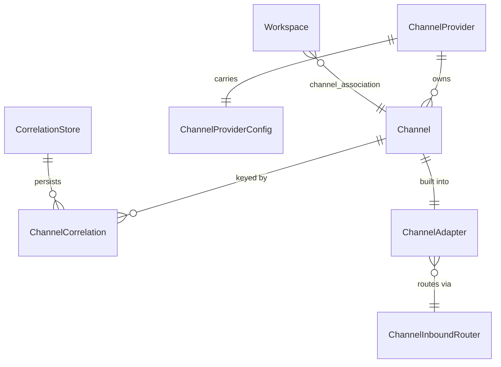
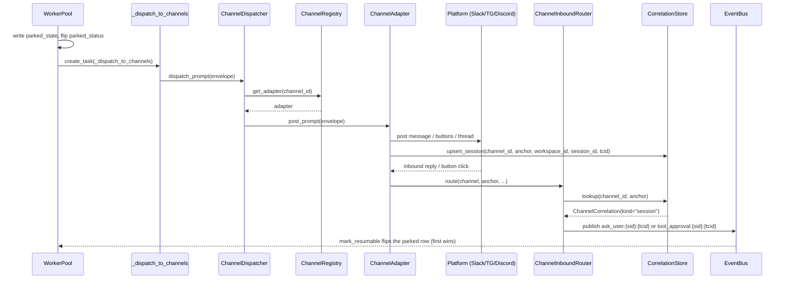

# Channels

## 1. Purpose

The channels subsystem bridges a parked worker session's `ask_user` and `_approval` prompts out to external messaging platforms (Slack, Telegram, Discord) and routes the human's reply back into the session, so an operator can answer a prompt or approve a tool call from their phone instead of the Primer console. It also handles the chat surface: incoming messages on a channel room start or continue a primer chat with an agent.

It deliberately does not own the park flow or race-arbitration. When a session parks, the worker fires a dispatch to the channel the session's workspace is associated with; when a reply arrives, the inbound side republishes it onto the same `ask_user:{sid}:{tcid}` / `tool_approval:{sid}:{tcid}` event-bus key the REST surface already uses, and the existing atomic `mark_resumable` flip on the parked row guarantees first-response-wins.

The provider-agnostic core lives in `primer/channel/` (`adapter.py`, `dispatcher.py`, `inbox.py` [legacy], `factory.py`, `null_adapter.py`, `inbound_router.py`, `correlation.py`, `chat_router.py`, `commands.py`). Three persisted operator entities live in `primer/model/channel.py`; the routing record lives in `primer/model/channel_correlation.py`; the workspace association field lives on `primer/model/workspace.py::Workspace`. Per-platform adapters live under `primer/channel/{slack,telegram,discord}/`. The in-process adapter cache is `primer/api/registries/channel_registry.py`. The worker-side dispatch trigger is `_dispatch_to_channels` in `primer/worker/yield_runtime.py`.

The park/resume mechanics themselves are documented in the yielding-tools and worker-system docs; this document covers only the channels bridge.

## 2. Conceptual model

Two persisted operator entities configure the routing fabric:

A `ChannelProvider` is a credential set for one messaging platform (one Slack team, one Telegram bot, one Discord bot). A `Channel` is one conversational room inside that provider (a Slack channel id, a Telegram chat id, a Discord channel id), addressed by its `external_id`. A Channel carries `provider: ChannelProviderType` (which discriminates the `config` union) and a `config` block (`SlackChannelConfig | DiscordChannelConfig | TelegramChannelConfig`) each carrying a `chats: ChatConfig` block that controls whether incoming messages on the room start primer chats.

The `Workspace.channel_association: WorkspaceChannelLink | None` field names the single Channel that all session gates (`ask_user`, tool approval, `inform`) from that workspace's sessions forward to. It is mutable at any time.

A `ChannelCorrelation` (in `primer/model/channel_correlation.py`) is the persistent routing record, keyed `(channel_id, anchor)`. The anchor is the thread id (Slack/Discord) or gate message id (Telegram) or the sentinel `"__active_chat__"` for single-type channels. `kind` is `"chat"` or `"session"`; session records carry `workspace_id`, `session_id`, `tool_call_id`. A single channel can serve many workspaces and standalone chats simultaneously; ChannelCorrelation is what keeps them separated.

At runtime a `ChannelAdapter` is the live, per-Channel object that knows how to post a `PromptEnvelope` to its platform and turn an inbound platform event into an action. The `ChannelDispatcher` fans one envelope out to the channel the workspace is associated with. `ChannelInboundRouter` resolves the inbound anchor against `CorrelationStore` and dispatches to either a session-gate resume or a chat turn.

`ChannelProviderConfig` is a discriminated union over the three concrete provider config classes in `primer/model/channel.py`. A `Channel` carries its own discriminated `config` union (`SlackChannelConfig | DiscordChannelConfig | TelegramChannelConfig`), coerced by a `model_validator(mode="before")` that inspects the `provider` field. The `ChannelRegistry` lazily builds and caches one `ChannelAdapter` per Channel on first use.

## 3. Architecture patterns implemented

- **Provider-agnostic envelopes over a thin ABC.** `ChannelAdapter` (`primer/channel/adapter.py`) declares exactly four async methods (`initialize`, `aclose`, `verify`, `post_prompt`). The core only ever speaks `PromptEnvelope` (outbound) and `ResponseEnvelope` (inbound); all platform-specific rendering and decoding stay inside the per-platform packages.
- **Import-time factory registry.** `primer/channel/factory.py` keeps a module-level `_FACTORIES: dict[ChannelProviderType, AdapterFactory]`. Each per-platform package self-registers by calling `register_adapter_factory` at import, and `primer/api/app.py` imports the three factory modules at module load. `build_adapter` raises `ConfigError` for an unregistered provider.
- **Lazy per-row adapter cache with double-checked locking.** `ChannelRegistry.get_adapter` (`primer/api/registries/channel_registry.py`) caches one adapter per Channel id under an `asyncio.Lock`. There is no `warm_up`; adapters are built on first `get_adapter`.
- **Fire-and-forget dispatch off the critical path.** After a session parks, `primer/worker/pool.py` schedules `_dispatch_to_channels` via `asyncio.create_task` so a slow post never delays the worker releasing its lease.
- **CorrelationStore as the durable routing table.** `primer/channel/correlation.py` wraps `ChannelCorrelation` storage. Adapters write correlation rows when they post a session gate or open a chat thread; `ChannelInboundRouter` reads them to route replies. In-memory caches are optimisations only; the DB is truth.
- **`(channel_id, anchor)` is unique and writes are atomic.** `upsert_session` / `upsert_chat` are NOT a lookup-then-create read-modify-write. The store lazily creates a DB-level unique index over the JSONB-extracted `data->>'channel_id'` / `data->>'anchor'` columns of the `channelcorrelation` table (`channelcorrelation_channel_anchor_uniq`) and writes via an atomic `INSERT ... ON CONFLICT (...) DO UPDATE`. Two workers that both observe "no row" for one gate can no longer each insert their own record: the second insert collapses onto the first row (last writer wins on `data`; the row id is preserved). Without this, a multi-worker deployment could create two correlations for one parked gate and double-resume the session. A storage backend with no raw connection (in-memory test double) falls back to the lookup-then-write path, which is still single-row within one process.
- **Thread-to-chat resolution is a keyed lookup, not a scan.** `ChatChannelRouter._find_thread_chat` (`primer/channel/chat_router.py`) resolves the live `Chat` bound to a `(channel_id, thread_external_id)` by looking the thread anchor up in the `CorrelationStore` (the record `resolve_or_create` writes when the thread's chat is created), then fetching that one chat - no full `Chat`-table scan on the inbound hot path. The historical full scan is retained only as a slow-path fallback for legacy chats with no correlation record (or a stale/ended correlated chat); a scan hit refreshes the correlation so the next lookup is keyed. The return value is identical to the old scan in every case.
- **ChannelInboundRouter as the single routing seam.** `primer/channel/inbound_router.py` sits behind every adapter's inbound handler. It resolves the anchor, checks ChannelCorrelation, and either publishes a session-gate event or delegates to `ChatChannelRouter` for chat delivery.
- **Reuse the event bus as the response join point.** `ChannelInboundRouter` publishes onto the same `ask_user:{sid}:{tcid}` / `tool_approval:{sid}:{tcid}` key shape REST uses, and the existing `mark_resumable` atomic flip is the only first-wins guarantee.
- **The Postgres event bus survives a dropped LISTEN connection.** `PostgresEventBus` (`primer/bus/postgres.py`) supervises each subscriber's dedicated LISTEN connection with a reconnect loop that mirrors the scheduler's (`PostgresScheduler._watch_channel` in `primer/scheduler/postgres.py`): on a connection drop it re-acquires a pool connection, re-registers the `primer_yield_events` LISTEN, and resumes delivering events, backing off `reconnect_seconds` (default 2.0s) between attempts. NOTIFY messages emitted during a reconnect window are lost (LISTEN/NOTIFY is not durable); this matches the scheduler's best-effort wake-up contract, since the worker's claim loop is the safety net for any missed resume. Reconnects are counted in `PostgresEventBus.metrics_snapshot()['primer_yield_bus_listen_reconnects_total']`, the sibling of the scheduler's `primer_scheduler_listen_reconnects_total`.
- **Refcounted shared connection per provider.** Each per-platform adapter shares one platform connection per `ChannelProvider.id` via a refcounted, `asyncio.Lock`-guarded registry, because each platform caps concurrent connections per token.
- **Deferred platform-SDK imports.** `slack_bolt`, `python-telegram-bot`, and `discord.py` are imported lazily inside the connection-build path, so an API that configures no channels of a given platform pays no import cost for it.

## 4. Code layout

| Path | Responsibility |
| --- | --- |
| `primer/model/channel.py` | `ChannelProvider`, `Channel`, `ChannelProviderType`; provider config classes; `ChatConfig`; per-platform channel config classes (`SlackChannelConfig`, `DiscordChannelConfig`, `TelegramChannelConfig`); model validators that coerce dict config into the right concrete type. |
| `primer/model/channel_correlation.py` | `ChannelCorrelation`: the durable routing record keyed `(channel_id, anchor)`. |
| `primer/model/workspace.py` | `WorkspaceChannelLink` (carries `channel_id`); `Workspace.channel_association: WorkspaceChannelLink | None`. |
| `primer/channel/adapter.py` | `ChannelAdapter` ABC; `PromptEnvelope` / `ResponseEnvelope` dataclasses. |
| `primer/channel/correlation.py` | `CorrelationStore`: `upsert_session`, `upsert_chat` (atomic `INSERT ... ON CONFLICT` on the `(channel_id, anchor)` unique index), `lookup`, `delete`; `ACTIVE_CHAT_ANCHOR` sentinel. |
| `primer/channel/inbound_router.py` | `ChannelInboundRouter.route`: resolves anchor -> session gate or chat; `open_thread_chat`. |
| `primer/channel/chat_router.py` | `ChatChannelRouter.deliver_message`: resolve-or-create a chat on the channel, drive the chat turn. |
| `primer/channel/commands.py` | In-chat command parser: `/new`, `/list`, `/switch`, `/agent`. |
| `primer/channel/dispatcher.py` | `ChannelDispatcher.dispatch_prompt`: workspace -> channel lookup, post, per-adapter error isolation. |
| `primer/channel/factory.py` | Module-level adapter-factory registry; `register_adapter_factory`, `build_adapter`. |
| `primer/channel/null_adapter.py` | `NullChannelAdapter` test stub. |
| `primer/channel/slack/` | Slack adapter: `adapter.py`, `connection.py`, `factory.py`, `render.py`. |
| `primer/channel/telegram/` | Telegram adapter: `adapter.py`, `connection.py`, `factory.py`, `render.py`. |
| `primer/channel/discord/` | Discord adapter: `adapter.py`, `connection.py`, `factory.py`, `views.py`. |
| `primer/api/registries/channel_registry.py` | `ChannelRegistry`: lazy per-row adapter cache, `for_workspace`, `invalidate`, `aclose`. |
| `primer/api/routers/channels.py` | CRUD routers (providers, channels) + workspace association PUT/DELETE routes. |
| `primer/api/deps.py` | `get_channel_registry` / `get_channel_dispatcher` FastAPI deps. |
| `primer/worker/yield_runtime.py` | `_dispatch_to_channels`: builds the `PromptEnvelope` from a `Yielded` sentinel. |
| `primer/worker/pool.py` | Schedules `_dispatch_to_channels` post-park. |
| `primer/toolset/system.py` | `channel_provider` / `channel` CRUD tools + `set_workspace_channel_association` / `clear_workspace_channel_association`. |
| `ui/components/channels.jsx` | Console UI for channel entities; `ui/components/chrome.jsx` adds sidebar entries. |

## 5. Data model

`ChannelProvider` (`primer/model/channel.py`) extends `Identifiable` and carries `provider: ChannelProviderType` plus `config: ChannelProviderConfig`. The config is a discriminated union:

- `SlackChannelProviderConfig`: `app_token` (`SecretStr`, validated to start with `xapp-`), `bot_token` (`SecretStr`, validated to start with `xoxb-`), optional `signing_secret`.
- `TelegramChannelProviderConfig`: `bot_token` (`SecretStr`, validated to contain `:` and be at least 20 chars), `poll_timeout_seconds` (default 25, `ge=1`, `le=60`).
- `DiscordChannelProviderConfig`: `bot_token` (`SecretStr`, validated to be at least 30 chars with no `Bot ` prefix), `enable_dms` (default `True`).

`Channel` (`primer/model/channel.py`) carries `provider_id`, `provider: ChannelProviderType`, `external_id` (the platform's room id), optional `label`, and `config: SlackChannelConfig | DiscordChannelConfig | TelegramChannelConfig`. Each config type carries a single `chats: ChatConfig` field. `ChatConfig` carries `enabled` (bool), `default_agent` (str | None, required when enabled), `allow_agent_switch` (bool, default false; gates whether `/agent` may reassign a chat's agent at all), `allowed_agents` (list of agent ids; empty means any; applies only when `allow_agent_switch` is on), and `relay_mode` (`"final"` | `"all"`). A `model_validator(mode="before")` coerces the `config` dict to the right concrete class keyed on `provider`; a second `model_validator(mode="after")` asserts the chosen config matches the declared provider.

`ChannelCorrelation` (`primer/model/channel_correlation.py`) extends `Identifiable` and carries `channel_id`, `anchor` (thread id / gate message id / `"__active_chat__"`), `kind` (`"chat"` | `"session"`), `chat_id` (kind=chat), `workspace_id` + `session_id` + `tool_call_id` (kind=session), and `updated_at`.

`WorkspaceChannelLink` (`primer/model/workspace.py`) is a simple model carrying `channel_id`. `Workspace.channel_association: WorkspaceChannelLink | None` holds it as a nullable embedded field. Mutable via `PUT /v1/workspaces/{id}/channel_association` / `DELETE /v1/workspaces/{id}/channel_association` and the `set_workspace_channel_association` / `clear_workspace_channel_association` system toolset tools.

There is no state-machine column on any channel entity. The only runtime state is the in-memory adapter cache and per-provider connection registries, whose lifecycle is covered in section 6.

## 6. Lifecycle

The end-to-end flow from park to resume crosses the worker, the dispatcher, an adapter, the platform, the inbound router, and the event bus.

Outbound, `_dispatch_to_channels` (`primer/worker/yield_runtime.py`) inspects the `Yielded` sentinel. For `tool_name == "ask_user"` it reads `prompt` and `response_schema` from `resume_metadata` and builds an `ask_user` envelope; for `tool_name == "_approval"` it formats `"Approve <name>(<args>)?"`, sets `choices=["Approve", "Reject"]`, and pulls `tool_call_id` from `resume_metadata.original_call.id`. It resolves the workspace's `channel_association.channel_id`, fetches the adapter, and awaits `dispatcher.dispatch_prompt`. Exceptions are swallowed via `logger.exception`.

Adapter lifecycle: `ChannelRegistry.get_adapter` builds an adapter on first touch, calls `adapter.initialize()` (acquires the shared platform connection and registers the adapter on the connection for inbound routing), and caches it. `invalidate(channel_id=...)` flushes one or all cached entries and calls `aclose`; `aclose` delegates to `invalidate()`. The lifespan calls `channel_registry.aclose()` on shutdown.

Inbound, each adapter's platform handlers decode the platform event to a `(channel, anchor, text, sender, ...)` tuple and call `ChannelInboundRouter.route`. The router does a `CorrelationStore.lookup(channel_id, anchor)`. If `kind="session"`, it publishes the event-bus resume key. If `kind="chat"`, it delivers to `ChatChannelRouter`. If no record and the channel has `config.chats.enabled`, it opens or resolves the active chat. An anchor with no correlation record on a thread channel is silently dropped (cross-tenant safety: a bot added to an unregistered chat publishes nothing).

## 7. Persistence

`ChannelProvider` and `Channel` are persisted as `Identifiable` rows through the generic `Storage` layer. `SecretStr` tokens on provider config classes keep credentials out of logs and serialised dumps.

`ChannelCorrelation` is persisted through the same `Storage` layer, written by adapters when they post a session gate or open a chat thread, read by `ChannelInboundRouter` on every inbound message. It is the truth for routing; in-process caches (Slack `_thread_payload_cache`, Telegram `_tag_cache`, Discord `_thread_to_ids`) are optimisations only and are lost on restart. The Slack adapter has a `conversations.history` cold-lookup fallback; the Telegram and Discord adapters rely on `ChannelCorrelation` for cold-start recovery.

`Workspace.channel_association` is a field on the workspace row, mutated atomically via the workspace update route.

## 8. Public surfaces

The REST surface is two CRUD routers plus workspace association routes, mounted under the `/v1` prefix by `primer/api/app.py`:

- `channel_providers`: full CRUD, with a `ReferenceCheck` on `Channel.provider_id` that returns 409 when a delete would orphan channels.
- `channels`: `on_pre_create` asserts the referenced provider exists (422) and enforces `(provider_id, external_id)` uniqueness (409).
- `PUT /v1/workspaces/{id}/channel_association {"channel_id": "<id>"}` - sets `Workspace.channel_association`; validates the channel exists.
- `DELETE /v1/workspaces/{id}/channel_association` - clears `Workspace.channel_association`.

No `/probe` endpoint is mounted. `adapter.verify()` exists and per-platform adapters implement it (Slack runs `auth.test` plus `conversations.info`), but it is not reachable over REST.

In-session, `primer/toolset/system.py` registers `channel_provider` and `channel` CRUD tools plus `set_workspace_channel_association` (sets `Workspace.channel_association`) and `clear_workspace_channel_association` (clears it). The FastAPI deps `get_channel_registry` and `get_channel_dispatcher` (`primer/api/deps.py`) read `app.state` and raise `ConfigError` if the subsystem was not initialised.

## 9. Internal contracts

The `ChannelAdapter` ABC is the single seam every platform implements: `initialize` / `aclose` / `verify` / `post_prompt`. Adapters communicate with the core only through `PromptEnvelope` (fields `kind`, `workspace_id`, `session_id`, `tool_call_id`, `prompt`, `response_schema`, `choices`, `timeout_at_iso`) and write `ChannelCorrelation` rows via `CorrelationStore` for inbound routing.

The factory contract is `AdapterFactory = Callable[[ChannelProvider, Channel, object], Awaitable[ChannelAdapter]]`; the third positional argument is the `ChannelInbox` (legacy gate-resume path). Registration is idempotent for the same callable and raises `ConfigError` if a second, different factory tries to claim the same provider type.

`ChannelInboundRouter.route` is the single routing seam every adapter's inbound handler calls. It is stateless beyond the `CorrelationStore` and event bus it holds; adapters must pass the resolved `Channel` object, the anchor, and whether the channel is thread-based. The `is_thread_channel` flag controls whether a top-level message (no existing anchor) opens a new thread-chat or routes to the single active chat for the room.

## 10. Testing patterns

`NullChannelAdapter` (`primer/channel/null_adapter.py`) is the in-process stand-in: `verify` is a no-op and `post_prompt` records the envelope in `posted` and returns `{"posted": True, "kind": ...}`. `clear_factories_for_tests` resets the module-level factory registry between tests.

Coverage spans every layer:

- Model validation: `tests/model/test_channels_model.py` (the provider/config discriminator and per-field validators; Channel config coercion).
- CRUD: `tests/api/test_channel_providers_crud.py`, `tests/api/test_channels_crud.py`, `tests/api/test_workspace_channel_association.py`.
- Toolset: `tests/toolset/test_system_channel.py` (set/clear workspace channel association tools, exposure guards).
- Core units: `tests/api/test_channel_registry.py`, `tests/channel/test_dispatcher.py`, `tests/channel/test_inbound_router.py`, `tests/channel/test_null_adapter.py`.
- Worker: `tests/worker/test_post_park_channel_dispatch.py`.
- Per-platform offline: `tests/channel/slack/`, `tests/channel/telegram/`, `tests/channel/discord/`.
- End-to-end: `tests/e2e/test_channels_null_adapter_inprocess_journey.py`, `test_channels_tool_approval_inprocess_journey.py`, `test_channels_fanout_primer_journey.py`, `test_channels_cascade_lattice_journey.py`.

Live platform smoke tests (`tests/integration/test_slack_smoke.py`, `test_telegram_smoke.py`, `test_discord_smoke.py`) are env-gated opt-in and skip when their credential env vars are unset.

## 11. Historical decisions

- **Channels piggyback on the existing event bus and `mark_resumable` park flow instead of a dedicated channels event stream.** Why: republishing on the same `ask_user:{sid}:{tcid}` key means the existing atomic `mark_resumable` flip makes the first response win with no new race-arbitration code.
- **Post-park dispatch runs as a fire-and-forget `asyncio.create_task` from the worker pool, never on the lease-holding turn.** Why: a slow post must not delay the worker releasing its lease.
- **`ChannelCorrelation` replaces in-memory per-adapter correlation caches as the durable routing store.** Why: in-memory caches are lost on restart, leaving open gates unanswerable via channel. A DB row survives restarts and lets one channel route to many workspaces simultaneously.
- **`(channel_id, anchor)` is enforced unique at the DB and written atomically (`INSERT ... ON CONFLICT`).** Why: with no DB uniqueness, two workers writing a correlation for the same gate could each observe "no row" and both insert, producing two routing records for one gate and double-resuming the parked session. A unique index plus an atomic upsert makes the second write collapse onto the first row, so the routing table has exactly one row per gate even under concurrent multi-worker writes.
- **`Workspace.channel_association` replaces the old `WorkspaceChannelAssociation` entity.** Why: the old entity was a separate CRUD resource with `forward_ask_user` / `forward_tool_approval` flags that operators had to manage independently; the new design folds the association onto the workspace row directly, with no per-gate flags (the association implies all gates forward).
- **`ChatConfig` (with `chats.enabled`, `chats.default_agent`, `chats.allowed_agents`, `chats.relay_mode`) replaces `ChatChannelAssociation`.** Why: chat routing config belongs on the room (Channel), not on a separate many-to-many association entity. The Channel is the natural owner of "can this room start chats and with which agent".
- **A single channel can serve many workspaces and chats simultaneously.** Why: operators want to route multiple workspace sessions through one Slack channel and still run standalone chats on the same channel. `ChannelCorrelation` keyed on `(channel_id, anchor)` isolates each conversation thread or gate.
- **`Channel` gains a `provider: ChannelProviderType` field (not just `provider_id`).** Why: the config union discriminator needs the platform enum at parse time; reading `provider` off the row avoids a FK join on every config coercion.
- **`ChannelProvider` uses a `model_validator(mode="before")` to coerce the dict config into the concrete config type keyed off the provider enum.** Why: Pydantic union parsing always picks the first variant for an ambiguous dict regardless of the `provider` field, silently building an unusable row. Channel carries the same pattern for its own config.
- **Per-platform token validators are field-scoped rather than a single model-level validator.** Why: a per-field validator's `loc` tuple carries the field name so the UI modal can render an inline error under the offending field.
- **Each platform shares one refcounted connection per `ChannelProvider`, not one per `Channel`.** Why: Slack caps an app at roughly two Socket Mode connections, Telegram permits one `getUpdates` poll per token, and Discord serves all channels over one gateway, so per-channel connections would breach platform limits.
- **The spec's `/probe` endpoints, a `ChannelRegistry.warm_up`, and an adapter restart-with-backoff loop were not built; adapters build lazily and `verify()` is not exposed over REST.** Why: lazy construction on first dispatch was sufficient for the current single-process deployment and the probe surface was deferred as follow-up.
- **There is no post-resolve hook, so a resolved prompt's channel button or thread is not retracted.** Why: deferred as follow-up; documented for end users in the agent-facing channels doc.
