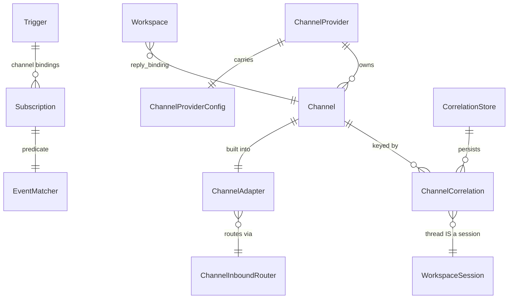
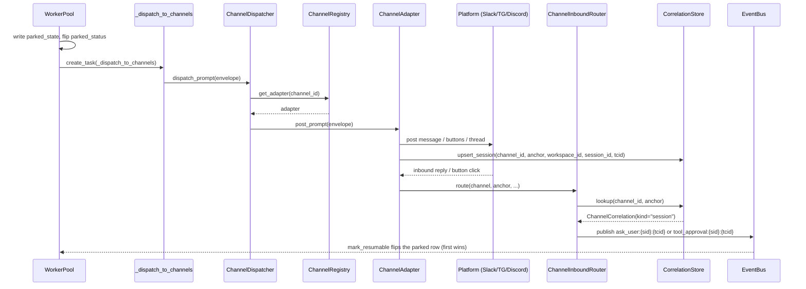

# Channels

## 1. Purpose

The channels subsystem bridges a parked worker session's `ask_user` and `_approval` prompts out to external messaging platforms (Slack, Telegram, Discord) and routes the human's reply back into the session, so an operator can answer a prompt or approve a tool call from their phone instead of the Primer console. It also owns the inbound conversation surface: a platform thread IS a session, 1:1, so an incoming message either steers the session that thread is already mapped to or fires the channel triggers that create one. More broadly it implements the event-to-action surface: a raw provider event is normalized into a `ChannelEvent`, matched against `channel`-trigger bindings, and dispatched to a platform action, while the outbound side folds the workspace association into a unified reply binding.

It deliberately does not own the park flow or race-arbitration. When a session parks, the worker fires a dispatch to the channel resolved by the session's reply binding; when a reply arrives, the inbound side republishes it onto the same `ask_user:{sid}:{tcid}` / `tool_approval:{sid}:{tcid}` event-bus key the REST surface already uses, and the existing atomic `mark_resumable` flip on the parked row guarantees first-response-wins.

The provider-agnostic core lives in `primer/channel/` (`adapter.py`, `dispatcher.py`, `inbox.py` [legacy], `factory.py`, `null_adapter.py`, `inbound_router.py`, `event_dispatch.py`, `reply_binding.py`, `session_relay.py`, `normalizer.py`, `correlation.py`, `media_in.py`). Three persisted operator entities live in `primer/model/channel.py`; the normalized event + matcher live in `primer/model/channel_event.py` and `primer/model/event_matcher.py`; the routing record lives in `primer/model/channel_correlation.py`; the workspace `reply_binding` field lives on `primer/model/workspace.py::Workspace`. Per-platform adapters live under `primer/channel/{slack,telegram,discord}/`. The in-process adapter cache is `primer/api/registries/channel_registry.py`. The worker-side dispatch trigger is `_dispatch_to_channels` in `primer/worker/yield_runtime.py`.

The park/resume mechanics themselves are documented in the yielding-tools and worker-system docs; this document covers only the channels bridge.

## 2. Conceptual model

The core insight is that a channel is one credential set and one room used by two independent surfaces. **Inbound (event to action):** a raw provider event is normalized into a `ChannelEvent`, matched against bindings, and dispatched to a platform action (steer the thread's mapped session, run a fresh one, resume a parked gate). **Outbound (reply binding):** whatever a session sends back (an `ask_user` yield, a tool-approval gate, an `inform`, the start ack, the final result) follows a reply binding to a channel and thread. The two surfaces resolve through two different links and never conflate. Every inbound message is a routed event: there is no chat fallback and no matcher pre-pass, because an unmatched message in a brand-new thread must still create its session rather than fall through to a surface that no longer exists.

The inbound surface reuses the trigger system: a `channel`-kind `Trigger` is the event-source anchor, and each binding is a `Subscription` on it pairing an `EventMatcher` with an action config and a `reply_target`. The outbound surface is the unified reply binding, resolved by precedence (session-scoped, then workspace-standing, then none).

Two persisted operator entities configure the routing fabric:

A `ChannelProvider` is a credential set for one messaging platform (one Slack team, one Telegram bot, one Discord bot). A `Channel` is one conversational room inside that provider (a Slack channel id, a Telegram chat id, a Discord channel id), addressed by its `external_id`. A Channel carries `provider: ChannelProviderType` (which discriminates the `config` union) and a `config` block (`SlackChannelConfig | DiscordChannelConfig | TelegramChannelConfig`) each carrying a `chats: ChatConfig` block that controls whether incoming messages on the room start sessions.

The `Workspace.reply_binding: WorkspaceChannelLink | None` field (renamed from `channel_association`; a stored row carrying the old key is aliased forward by a model validator) names the single Channel that all session gates (`ask_user`, tool approval, `inform`) plus the lifecycle relay (start ack, final result) from that workspace's sessions forward to. It is the standing, workspace-scoped form of the unified reply binding and is mutable at any time.

A `ChannelCorrelation` (in `primer/model/channel_correlation.py`) is the persistent routing record, keyed `(channel_id, anchor)`. The anchor is the thread id (Slack/Discord) or gate message id (Telegram); a DM has no thread, so `mapping_anchor` synthesises `dm:<sender>` and the DM itself becomes the thread for mapping purposes. `kind` is `"session"` and nothing else. `tool_call_id` is the single field that tells the two readings apart: set, the record additionally names an OPEN gate and the next reply resumes it; `None`, the record is a plain thread-to-session mapping and the next reply steers the session. Answering a gate clears the field via `clear_gate`, so the thread stays mapped for the message after it. A single channel can serve many workspaces simultaneously; ChannelCorrelation is what keeps them separated.

At runtime a `ChannelAdapter` is the live, per-Channel object that knows how to post a `PromptEnvelope` to its platform and turn an inbound platform event into an action. The `ChannelDispatcher` fans one envelope out to the channel resolved by the session's reply binding (`for_session`, session-scoped then workspace-standing). `ChannelInboundRouter` resolves the inbound anchor against `CorrelationStore` and delegates to `ChannelEventRouter`, which returns a `ChannelRouteOutcome` naming what it did (`gate`, `steer`, `fired` or `ignored`).

```mermaid
erDiagram
    ChannelProvider ||--o{ Channel : "owns"
    Channel ||--o{ ChannelCorrelation : "keyed by"
    ChannelCorrelation }o--|| WorkspaceSession : "thread IS a session"
    Workspace }o--|| Channel : "reply_binding"
    Trigger ||--o{ Subscription : "channel bindings"
    Subscription ||--|| EventMatcher : "predicate"
    Channel ||--|| ChannelAdapter : "built into"
    ChannelProvider ||--|| ChannelProviderConfig : "carries"
    ChannelAdapter }o--|| ChannelInboundRouter : "routes via"
    CorrelationStore ||--o{ ChannelCorrelation : "persists"
```

`ChannelProviderConfig` is a discriminated union over the three concrete provider config classes in `primer/model/channel.py`. A `Channel` carries its own discriminated `config` union (`SlackChannelConfig | DiscordChannelConfig | TelegramChannelConfig`), coerced by a `model_validator(mode="before")` that inspects the `provider` field. The `ChannelRegistry` lazily builds and caches one `ChannelAdapter` per Channel on first use.

## 3. Architecture patterns implemented

- **Provider-agnostic envelopes over a thin ABC.** `ChannelAdapter` (`primer/channel/adapter.py`) declares exactly four async methods (`initialize`, `aclose`, `verify`, `post_prompt`). The core only ever speaks `PromptEnvelope` (outbound) and `ResponseEnvelope` (inbound); all platform-specific rendering and decoding stay inside the per-platform packages.
- **Import-time factory registry.** `primer/channel/factory.py` keeps a module-level `_FACTORIES: dict[ChannelProviderType, AdapterFactory]`. Each per-platform package self-registers by calling `register_adapter_factory` at import, and `primer/api/app.py` imports the three factory modules at module load. `build_adapter` raises `ConfigError` for an unregistered provider.
- **Lazy per-row adapter cache with double-checked locking.** `ChannelRegistry.get_adapter` (`primer/api/registries/channel_registry.py`) caches one adapter per Channel id under an `asyncio.Lock`. There is no `warm_up`; adapters are built on first `get_adapter`.
- **Fire-and-forget dispatch off the critical path.** After a session parks, `primer/worker/pool.py` schedules `_dispatch_to_channels` via `asyncio.create_task` so a slow post never delays the worker releasing its lease.
- **CorrelationStore as the durable routing table.** `primer/channel/correlation.py` wraps `ChannelCorrelation` storage. Adapters write correlation rows when they post a session gate or open a chat thread; `ChannelInboundRouter` reads them to route replies. In-memory caches are optimisations only; the DB is truth.
- **`(channel_id, anchor)` is unique and writes are atomic.** `upsert_session` / `upsert_chat` are NOT a lookup-then-create read-modify-write. The store lazily creates a DB-level unique index over the JSONB-extracted `data->>'channel_id'` / `data->>'anchor'` columns of the `channelcorrelation` table (`channelcorrelation_channel_anchor_uniq`) and writes via an atomic `INSERT ... ON CONFLICT (...) DO UPDATE`. Two workers that both observe "no row" for one gate can no longer each insert their own record: the second insert collapses onto the first row (last writer wins on `data`; the row id is preserved). Without this, a multi-worker deployment could create two correlations for one parked gate and double-resume the session. A storage backend with no raw connection (in-memory test double) falls back to the lookup-then-write path, which is still single-row within one process.
- **Thread-to-session resolution is a keyed lookup, never a scan.** `CorrelationStore.lookup(channel_id, anchor)` is one indexed read on the inbound hot path; the mapping is written once, when the fire that created the session returns.
- **ChannelInboundRouter as the single routing seam.** `primer/channel/inbound_router.py` sits behind every adapter's inbound handler. It builds the dispatch deps and hands the normalized event to `ChannelEventRouter`, driving the matched/dispatched metrics off the returned outcome.
- **Provider-interface unification via a per-provider normalizer plus capabilities descriptor.** Every provider implements a `ChannelEventNormalizer` (`normalize(raw) -> ChannelEvent | None`) and a `ProviderCapabilities` (declared supported `NormalizedEventType`s plus a `prerequisites` map: Discord MESSAGE CONTENT intent, Telegram privacy-mode-off, Slack scopes). Nothing downstream of the normalizer ever sees an SDK type, so the matcher, actions, and reply binding are provider-agnostic; adding a provider is one normalizer plus one capabilities descriptor.
- **Inbound precedence: correlation-first, then rule match.** `ChannelEventRouter` (`primer/channel/event_dispatch.py`) runs the inbound precedence on a normalized `ChannelEvent`: a correlated reply (a known thread with a parked session or a bound chat) is handled by the correlation store and never fans out; only fresh events are matched against `channel`-trigger bindings via the injected `fire_trigger`. This reuses `fire_trigger`'s per-subscription failure isolation and idempotency, adding only matcher evaluation (a no-op when `event_matcher is None`) and `reply_target` propagation.
- **Outbound fold: the unified reply binding.** `resolve_reply_binding` (`primer/channel/reply_binding.py`) resolves a session's outbound destination by precedence (session-ephemeral binding in `session.metadata['reply_binding']`, then `Workspace.reply_binding`, then none), and `ChannelDispatcher.for_session` posts to it. The session lifecycle relay (`primer/channel/session_relay.py`) posts a start ack and final result symmetric with the chat relay, honoring a per-binding `quiet` flag.
- **Reuse the event bus as the response join point.** `ChannelInboundRouter` publishes onto the same `ask_user:{sid}:{tcid}` / `tool_approval:{sid}:{tcid}` key shape REST uses, and the existing `mark_resumable` atomic flip is the only first-wins guarantee.
- **The Postgres event bus survives a dropped LISTEN connection.** `PostgresEventBus` (`primer/bus/postgres.py`) supervises each subscriber's dedicated LISTEN connection with a reconnect loop that mirrors the scheduler's (`PostgresScheduler._watch_channel` in `primer/scheduler/postgres.py`): on a connection drop it re-acquires a pool connection, re-registers the `primer_yield_events` LISTEN, and resumes delivering events, backing off `reconnect_seconds` (default 2.0s) between attempts. NOTIFY messages emitted during a reconnect window are lost (LISTEN/NOTIFY is not durable); this matches the scheduler's best-effort wake-up contract, since the worker's claim loop is the safety net for any missed resume. Reconnects are counted in `PostgresEventBus.metrics_snapshot()['primer_yield_bus_listen_reconnects_total']`, the sibling of the scheduler's `primer_scheduler_listen_reconnects_total`.
- **Refcounted shared connection per provider.** Each per-platform adapter shares one platform connection per `ChannelProvider.id` via a refcounted, `asyncio.Lock`-guarded registry, because each platform caps concurrent connections per token.
- **Deferred platform-SDK imports.** `slack_bolt`, `python-telegram-bot`, and `discord.py` are imported lazily inside the connection-build path, so an API that configures no channels of a given platform pays no import cost for it.

## 4. Code layout

| Path | Responsibility |
| --- | --- |
| `primer/model/channel.py` | `ChannelProvider`, `Channel`, `ChannelProviderType`; provider config classes; `ChatConfig`; per-platform channel config classes (`SlackChannelConfig`, `DiscordChannelConfig`, `TelegramChannelConfig`); model validators that coerce dict config into the right concrete type. |
| `primer/model/channel_correlation.py` | `ChannelCorrelation`: the durable routing record keyed `(channel_id, anchor)`. |
| `primer/model/workspace.py` | `WorkspaceChannelLink` (carries `channel_id`); `Workspace.reply_binding: WorkspaceChannelLink | None` (renamed from `channel_association`, with a back-compat alias validator). |
| `primer/model/channel_event.py` | `ChannelEvent` unified envelope; `NormalizedEventType` taxonomy; `EventSender`. |
| `primer/model/event_matcher.py` | `EventMatcher` predicate + `matches()` AND-evaluator. |
| `primer/channel/normalizer.py` | `ChannelEventNormalizer` Protocol; `ProviderCapabilities`. |
| `primer/channel/{slack,telegram,discord}/normalizer.py` | Per-provider normalizer + capabilities descriptor. |
| `primer/channel/event_dispatch.py` | `ChannelEventRouter`: correlation-first then `channel`-trigger rule match. |
| `primer/channel/reply_binding.py` | `ReplyBinding`, `ReplyTarget`, `SESSION_REPLY_BINDING_KEY`, `resolve_reply_binding`. |
| `primer/channel/session_relay.py` | `post_session_start_ack` / `post_session_final_result` lifecycle relay. |
| `primer/trigger/sources/channel.py` | `ChannelSource`: the `channel` trigger event-source anchor (not claim-driven). |
| `primer/trigger/subscribers/start_chat.py` | `start_chat` action: open a thread-bound chat seeded with the event text. |
| `primer/model/envelope.py` | `PromptEnvelope` / `ResponseEnvelope` dataclasses. They live in core model, not here, so the agent and worker layers can name them without importing `primer.channel`; an import-linter contract enforces that. |
| `primer/channel/adapter.py` | `ChannelAdapter` ABC; re-exports both envelopes for the per-platform adapters that import them from here. |
| `primer/channel/correlation.py` | `CorrelationStore`: `upsert_session`, `upsert_chat` (atomic `INSERT ... ON CONFLICT` on the `(channel_id, anchor)` unique index), `lookup`, `delete`; `ACTIVE_CHAT_ANCHOR` sentinel. |
| `primer/channel/inbound_router.py` | `ChannelInboundRouter.route`: resolves anchor -> session gate or chat; `open_thread_chat`. |
| `primer/channel/media_in.py` | Land inbound attachments as workspace files, compose the steer text, and fork a voice note through the active STT provider. |
| `primer/channel/dispatcher.py` | `ChannelDispatcher.dispatch_prompt`: workspace -> channel lookup, post, per-adapter error isolation. |
| `primer/channel/factory.py` | Module-level adapter-factory registry; `register_adapter_factory`, `build_adapter`. |
| `primer/channel/null_adapter.py` | `NullChannelAdapter` test stub. |
| `primer/channel/slack/` | Slack adapter: `adapter.py`, `connection.py`, `factory.py`, `render.py`. |
| `primer/channel/telegram/` | Telegram adapter: `adapter.py`, `connection.py`, `factory.py`, `render.py`. |
| `primer/channel/discord/` | Discord adapter: `adapter.py`, `connection.py`, `factory.py`, `views.py`. |
| `primer/api/registries/channel_registry.py` | `ChannelRegistry`: lazy per-row adapter cache, `for_session` (reply-binding resolution), `invalidate`, `aclose`. |
| `primer/api/routers/channels.py` | CRUD routers (providers, channels). |
| `primer/api/routers/workspaces.py` | `PUT` / `DELETE /v1/workspaces/{id}/reply_binding` routes. |
| `primer/api/routers/triggers.py` | `channel` trigger CRUD + `event_matcher` / `reply_target` on subscription bodies. |
| `primer/api/deps.py` | `get_channel_registry` / `get_channel_dispatcher` FastAPI deps. |
| `primer/worker/yield_runtime.py` | `_dispatch_to_channels`: builds the `PromptEnvelope` from a `Yielded` sentinel. |
| `primer/worker/pool.py` | Schedules `_dispatch_to_channels` post-park. |
| `primer/toolset/system.py` | `channel_provider` / `channel` CRUD tools + `set_reply_binding` / `clear_reply_binding` + `create_channel_binding` / `list_channel_bindings` / `delete_channel_binding`. |
| `primer/toolset/workspace_ext.py` | `subscribe_to_channel_event` yielding tool (parks a session until a matching channel event). |
| `ui/components/channel_rules.jsx` | Console rule editor (capability-aware event picker + binding list). |
| `ui/components/channels.jsx` | Console UI for channel entities, hosted by the shell's `channels` overlay. |

## 5. Data model

`ChannelProvider` (`primer/model/channel.py`) extends `Identifiable` and carries `provider: ChannelProviderType` plus `config: ChannelProviderConfig`. The config is a discriminated union:

- `SlackChannelProviderConfig`: `app_token` (`SecretStr`, validated to start with `xapp-`), `bot_token` (`SecretStr`, validated to start with `xoxb-`), optional `signing_secret`.
- `TelegramChannelProviderConfig`: `bot_token` (`SecretStr`, validated to contain `:` and be at least 20 chars), `poll_timeout_seconds` (default 25, `ge=1`, `le=60`).
- `DiscordChannelProviderConfig`: `bot_token` (`SecretStr`, validated to be at least 30 chars with no `Bot ` prefix), `enable_dms` (default `True`).

`Channel` (`primer/model/channel.py`) carries `provider_id`, `provider: ChannelProviderType`, `external_id` (the platform's room id), optional `label`, and `config: SlackChannelConfig | DiscordChannelConfig | TelegramChannelConfig`. Each config type carries a single `chats: ChatConfig` field. `ChatConfig` carries exactly two fields: `enabled` (bool, whether inbound messages on this room start sessions) and `relay_mode` (`"final"` | `"all"`). The per-channel agent fields are gone: a thread IS a session, so the channel trigger's subscription names the agent. A `model_validator(mode="before")` coerces the `config` dict to the right concrete class keyed on `provider`; a second `model_validator(mode="after")` asserts the chosen config matches the declared provider.

`ChannelCorrelation` (`primer/model/channel_correlation.py`) extends `Identifiable` and carries `channel_id`, `anchor` (thread id / gate message id / the synthetic `dm:<sender>`), `kind` (`"session"`, the only value), `workspace_id`, `session_id`, `tool_call_id` (set only while a gate is open) and `updated_at`.

`WorkspaceChannelLink` (`primer/model/workspace.py`) is a simple model carrying `channel_id`. `Workspace.reply_binding: WorkspaceChannelLink | None` (renamed from `channel_association`; a `model_validator(mode="before")` aliases a stored `channel_association` forward when the new key is absent) holds it as a nullable embedded field. Mutable via `PUT /v1/workspaces/{id}/reply_binding` / `DELETE /v1/workspaces/{id}/reply_binding` and the `set_reply_binding` / `clear_reply_binding` system toolset tools.

`ChannelEvent` (`primer/model/channel_event.py`) is the normalized inbound envelope: `provider`, `provider_id`, `event_id` (idempotency), `type: NormalizedEventType`, `occurred_at`, `room_external_id`, resolved `channel_id`, `surface` (`dm | channel | thread`), `thread_anchor`, `message_id`, `sender: EventSender` (`external_id`, `roles`, `is_bot`), `text`, `mentions_bot`, `command` / `component` / `reaction` dicts, `media`, and a `raw` escape hatch. `NormalizedEventType` is the taxonomy enum; the v1 core values are `message.posted` and `command.invoked` (the rest are declared for later promotion; `component.acted` stays internal to the approval / agent-pick flows in v1).

`EventMatcher` (`primer/model/event_matcher.py`) is the binding predicate: required `event_type` plus optional `surface`, `room_external_ids`, `command_name`, `mentions_bot`, `sender_roles_any`, `sender_ids_any`, `text_pattern` (regex). The module-level `matches(matcher, event)` is the AND-evaluator (omitted fields are unconstrained).

`ProviderCapabilities` (`primer/channel/normalizer.py`) declares a provider's supported normalized types and a `prerequisites` map (Discord MESSAGE CONTENT intent, Telegram privacy-mode-off / admin, Slack scopes), which drives the rule editor's capability-aware event picker. `ChannelEventNormalizer` is the per-provider Protocol (`normalize(raw) -> ChannelEvent | None`, `capabilities()`), implemented under `primer/channel/{slack,telegram,discord}/normalizer.py`.

`ReplyBinding` (`primer/channel/reply_binding.py`) is the resolved outbound destination (`channel_id`, optional `anchor`, `quiet`). `ReplyTarget` is the value carried on a `Subscription`: one of the relative literals `source_thread` (default) / `source_room` / `dm_sender` / `none`, or an explicit `{channel_id, anchor}`. `SESSION_REPLY_BINDING_KEY` is the `WorkspaceSession.metadata` key holding the ephemeral session-scoped binding.

`Trigger.config` gains `ChannelTriggerConfig{kind: "channel", provider_id, channel_id?, interactive}` and `Subscription` gains `event_matcher: EventMatcher | None` and `reply_target` (both `None` for time/webhook triggers); these live in `primer/model/trigger.py` and are detailed in the triggers subsystem doc.

There is no state-machine column on any channel entity. The only runtime state is the in-memory adapter cache and per-provider connection registries, whose lifecycle is covered in section 6.

## 6. Lifecycle

The end-to-end flow from park to resume crosses the worker, the dispatcher, an adapter, the platform, the inbound router, and the event bus.

```mermaid
sequenceDiagram
    participant Worker as WorkerPool
    participant YR as _dispatch_to_channels
    participant Disp as ChannelDispatcher
    participant Reg as ChannelRegistry
    participant Ad as ChannelAdapter
    participant Plat as Platform (Slack/TG/Discord)
    participant IR as ChannelInboundRouter
    participant CS as CorrelationStore
    participant Bus as EventBus

    Worker->>Worker: write parked_state, flip parked_status
    Worker->>YR: create_task(_dispatch_to_channels)
    YR->>Disp: dispatch_prompt(envelope)
    Disp->>Reg: get_adapter(channel_id)
    Reg-->>Disp: adapter
    Disp->>Ad: post_prompt(envelope)
    Ad->>Plat: post message / buttons / thread
    Ad->>CS: upsert_session(channel_id, anchor, workspace_id, session_id, tcid)
    Plat-->>Ad: inbound reply / button click
    Ad->>IR: route(channel, anchor, ...)
    IR->>CS: lookup(channel_id, anchor)
    CS-->>IR: ChannelCorrelation(kind="session")
    IR->>Bus: publish ask_user:{sid}:{tcid} or tool_approval:{sid}:{tcid}
    Bus-->>Worker: mark_resumable flips the parked row (first wins)
```

Outbound, `_dispatch_to_channels` (`primer/worker/yield_runtime.py`) inspects the `Yielded` sentinel. For `tool_name == "ask_user"` it reads `prompt` and `response_schema` from `resume_metadata` and builds an `ask_user` envelope; for `tool_name == "_approval"` it formats `"Approve <name>(<args>)?"`, sets `choices=["Approve", "Reject"]`, and pulls `tool_call_id` from `resume_metadata.original_call.id`. The destination is resolved through `ChannelDispatcher.for_session` (via `ChannelRegistry.for_session`), which calls `resolve_reply_binding(session)`: the session-ephemeral binding in `session.metadata[SESSION_REPLY_BINDING_KEY]` wins, else `Workspace.reply_binding`, else none (a non-channel session stays silent). It then fetches the adapter and awaits `dispatcher.dispatch_prompt`. Exceptions are swallowed via `logger.exception`.

The full lifecycle relay for a channel-triggered session is symmetric with the chat relay: `post_session_start_ack` posts a short "started" acknowledgement on the first turn and `post_session_final_result` posts the last-turn assistant text on clean completion (`primer/channel/session_relay.py`), both resolved through the same reply binding and both no-ops when no binding resolves or the binding is `quiet`.

Inbound, the precedence runs in `ChannelEventRouter.route_event` (`primer/channel/event_dispatch.py`) over a normalized `ChannelEvent`, and it returns a `ChannelRouteOutcome`. Correlation-first, keyed on `mapping_anchor(event)` so a DM correlates too: when a `ChannelCorrelation` exists for `(channel_id, anchor)` and carries a `tool_call_id`, the reply answers that gate (publish `ask_user:{sid}:{tcid}`, then `clear_gate` so the NEXT reply steers instead of re-publishing onto a dead key) and the outcome is `gate`. When the record exists with no open gate, the reply is the next user message on the mapped session, delivered through `deliver_steer` with `parallelism="queue"`, and the outcome is `steer`. A mapping whose session has been deleted reports `missing` and falls through to the fresh-thread path, which is the "session deleted but the thread lives on" case. Either way a correlated reply never fans out to rules. Otherwise it is a fresh event: every `channel`-kind `Trigger` whose `provider_id` matches (and whose `channel_id` is unset or equal to this channel) is fired via the injected `fire_trigger` with the event under `fire_context["event"]`. `fire_trigger` evaluates each subscription's `event_matcher` against the event (skipping non-matches), renders the payload, dispatches the action, and establishes the `reply_target` (for session actions, stamped into `session.metadata` as the session-scoped reply binding). Per-trigger and per-subscription failures are isolated.

The FIRST session a fresh fire creates binds the thread (`_map_thread`): the inbound index (anchor to session) and the outbound one (the session's `reply_binding` metadata, anchored on the real platform thread) are written together, so the 1:1 holds from both directions. A conversation maps to exactly one session, and an unthreaded room post that opened no thread has no conversation to bind, so it is left unmapped. An interactive channel trigger also stamps `metadata["relay_every_turn"]`; a non-interactive one stamps `quiet: True` on the binding, so the thread ingests silently.

Outbound, `PromptEnvelope.thread_anchor` carries the resolved binding's anchor, and the Slack and Discord adapters resolve it instead of opening a new per-session thread. The relay gate in `primer/session/dispatch.py` fires when the turn finished cleanly AND (the session is thread-mapped-interactive OR the session ended completed), so a channel conversation answers turn by turn rather than only at session end.

Attachments land before the steer. `land_media_in_workspace` writes each part to `media/<fire_id>/<filename>` in the mapped session's workspace and `compose_steer_text` puts the paths into the text the session receives; a voice note additionally forks through the active STT provider (S4's `ActiveSpeechConfig`) and its transcript joins the text. No provider configured, or a transcription failure, degrades to attach-as-is with a note rather than dropping the message.

A mapping never outlives its session: `delete_session` calls `CorrelationStore.clear_for_session` immediately before removing the row, best-effort so an unreachable correlation table cannot block the delete.

Adapter lifecycle: `ChannelRegistry.get_adapter` builds an adapter on first touch, calls `adapter.initialize()` (acquires the shared platform connection and registers the adapter on the connection for inbound routing), and caches it. `invalidate(channel_id=...)` flushes one or all cached entries and calls `aclose`; `aclose` delegates to `invalidate()`. The lifespan calls `channel_registry.aclose()` on shutdown.

Inbound, each adapter's platform handlers normalize the platform event and call `ChannelInboundRouter.route_event`, passing any attachments the adapter collected through its `collect_inbound_media(raw)` hook. The router builds the dispatch deps and delegates to `ChannelEventRouter`, whose precedence is described above.

## 7. Persistence

`ChannelProvider` and `Channel` are persisted as `Identifiable` rows through the generic `Storage` layer. `SecretStr` tokens on provider config classes keep credentials out of logs and serialised dumps.

`ChannelCorrelation` is persisted through the same `Storage` layer, written when a fire maps a thread to its session and when an adapter posts a session gate, read by `ChannelEventRouter` on every inbound message. It is the truth for routing; in-process caches (Slack `_thread_payload_cache`, Telegram `_tag_cache`, Discord `_thread_to_ids`) are optimisations only and are lost on restart. The Slack adapter has a `conversations.history` cold-lookup fallback; the Telegram and Discord adapters rely on `ChannelCorrelation` for cold-start recovery.

`Workspace.reply_binding` is a field on the workspace row, mutated atomically via the workspace update route. The session-scoped reply binding is not a persisted entity: it lives in `WorkspaceSession.metadata[SESSION_REPLY_BINDING_KEY]`, stamped when a channel event spawns the session. Channel `Trigger` rows and their binding `Subscription` rows persist through the trigger subsystem's storage (see the triggers doc). Inbound attachments are workspace files, not rows: they land at `media/<fire_id>/<filename>` under the mapped session's workspace.

## 8. Public surfaces

The REST surface is two CRUD routers plus reply-binding and channel-trigger routes, mounted under the `/v1` prefix by `primer/api/app.py`:

- `channel_providers`: full CRUD, with a `ReferenceCheck` on `Channel.provider_id` that returns 409 when a delete would orphan channels.
- `channels`: `on_pre_create` asserts the referenced provider exists (422) and enforces `(provider_id, external_id)` uniqueness (409).
- `PUT /v1/workspaces/{id}/reply_binding {"channel_id": "<id>"}` - sets `Workspace.reply_binding`; validates the channel exists.
- `DELETE /v1/workspaces/{id}/reply_binding` - clears `Workspace.reply_binding`.
- The triggers router (`primer/api/routers/triggers.py`) accepts `config.kind="channel"` (`ChannelTriggerConfig`) and carries `event_matcher` / `reply_target` on subscription create/update bodies, so a channel binding is a `Subscription` on a channel trigger over the standard `/v1/triggers/{id}/subscriptions` routes.

No `/probe` endpoint is mounted. `adapter.verify()` exists and per-platform adapters implement it (Slack runs `auth.test` plus `conversations.info`), but it is not reachable over REST.

In-session, `primer/toolset/system.py` registers `channel_provider` and `channel` CRUD tools, `set_reply_binding` / `clear_reply_binding` (mutate `Workspace.reply_binding`), and the inbound-binding tools `create_channel_binding` / `list_channel_bindings` / `delete_channel_binding`. `primer/toolset/workspace_ext.py` registers the yielding `subscribe_to_channel_event` tool (a channel-event variant of `subscribe_to_trigger`). The FastAPI deps `get_channel_registry` and `get_channel_dispatcher` (`primer/api/deps.py`) read `app.state` and raise `ConfigError` if the subsystem was not initialised.

## 9. Internal contracts

The `ChannelAdapter` ABC is the single seam every platform implements: `initialize` / `aclose` / `verify` / `post_prompt`. Adapters communicate with the core only through `PromptEnvelope` (fields `kind`, `workspace_id`, `session_id`, `tool_call_id`, `prompt`, `response_schema`, `choices`, `timeout_at_iso`) and write `ChannelCorrelation` rows via `CorrelationStore` for inbound routing.

The factory contract is `AdapterFactory = Callable[[ChannelProvider, Channel, object], Awaitable[ChannelAdapter]]`; the third positional argument is the `ChannelInbox` (legacy gate-resume path). Registration is idempotent for the same callable and raises `ConfigError` if a second, different factory tries to claim the same provider type.

`ChannelInboundRouter.route` is the single routing seam every adapter's inbound handler calls. It is stateless beyond the `CorrelationStore` and event bus it holds; adapters must pass the resolved `Channel` object, the anchor, and whether the channel is thread-based. The `is_thread_channel` flag controls whether a top-level message (no existing anchor) opens a new thread-chat or routes to the single active chat for the room.

## 10. Testing patterns

`NullChannelAdapter` (`primer/channel/null_adapter.py`) is the in-process stand-in: `verify` is a no-op and `post_prompt` records the envelope in `posted` and returns `{"posted": True, "kind": ...}`. `clear_factories_for_tests` resets the module-level factory registry between tests.

Coverage spans every layer:

- Model validation: `tests/model/test_channels_model.py` (the provider/config discriminator and per-field validators; Channel config coercion).
- CRUD: `tests/api/test_channel_providers_crud.py`, `tests/api/test_channels_crud.py`, `tests/api/test_workspace_reply_binding_routes.py`.
- Toolset: `tests/toolset/test_system_channel.py` (channel CRUD, exposure guards), `tests/toolset/test_system_reply_binding.py` (set/clear reply binding), `tests/toolset/test_system_channel_binding_tools.py` (create/list/delete binding), `tests/toolset/test_subscribe_to_channel_event.py`.
- Normalization + mapping: `tests/channel/test_normalizer_protocol.py` (per-provider normalizer + capabilities), `tests/channel/test_event_dispatch.py` (correlation-first then rule match), `tests/channel/test_reply_binding.py` (resolution precedence), plus the matcher/start_chat units under `tests/model/` and `tests/trigger/`.
- Core units: `tests/api/test_channel_registry.py`, `tests/channel/test_dispatcher.py`, `tests/channel/test_inbound_router.py`, `tests/channel/test_null_adapter.py`.
- Worker: `tests/worker/test_post_park_channel_dispatch.py`.
- Per-platform offline: `tests/channel/slack/`, `tests/channel/telegram/`, `tests/channel/discord/`.
- End-to-end: `tests/e2e/test_channels_null_adapter_inprocess_journey.py`, `test_channels_tool_approval_inprocess_journey.py`, `test_channels_fanout_primer_journey.py`, `test_channels_cascade_lattice_journey.py`.

Live platform smoke tests (`tests/integration/test_slack_smoke.py`, `test_telegram_smoke.py`, `test_discord_smoke.py`) are env-gated opt-in and skip when their credential env vars are unset.

## 11. Historical decisions

- **Channels piggyback on the existing event bus and `mark_resumable` park flow instead of a dedicated channels event stream.** Why: republishing on the same `ask_user:{sid}:{tcid}` key means the existing atomic `mark_resumable` flip makes the first response win with no new race-arbitration code.
- **Post-park dispatch runs as a fire-and-forget `asyncio.create_task` from the worker pool, never on the lease-holding turn.** Why: a slow post must not delay the worker releasing its lease.
- **`ChannelCorrelation` replaces in-memory per-adapter correlation caches as the durable routing store.** Why: in-memory caches are lost on restart, leaving open gates unanswerable via channel. A DB row survives restarts and lets one channel route to many workspaces simultaneously.
- **`(channel_id, anchor)` is enforced unique at the DB and written atomically (`INSERT ... ON CONFLICT`).** Why: with no DB uniqueness, two workers writing a correlation for the same gate could each observe "no row" and both insert, producing two routing records for one gate and double-resuming the parked session. A unique index plus an atomic upsert makes the second write collapse onto the first row, so the routing table has exactly one row per gate even under concurrent multi-worker writes.
- **`Workspace.channel_association` replaces the old `WorkspaceChannelAssociation` entity.** Why: the old entity was a separate CRUD resource with `forward_ask_user` / `forward_tool_approval` flags that operators had to manage independently; the new design folds the association onto the workspace row directly, with no per-gate flags (the association implies all gates forward).
- **`channel_association` is renamed `Workspace.reply_binding` (pre-release).** Why: the field is the standing, workspace-scoped form of the unified reply binding, so the honest name is used; a back-compat alias validator moves a stored `channel_association` key forward. Spec: docs/superpowers/specs/2026-06-20-channel-event-action-mapping-design.md (Section 14 decision 1, Section 8).
- **The default "new message -> session" stays correlation-only, with no rule row.** Why: an inbound-enabled channel implies the default behavior; the inbound precedence is correlation-first, so a reply that continues a conversation wins over rule evaluation and only fresh events reach the bindings. No explicit binding is created for the default. Spec: Section 14 decision 2, Section 7.
- **`component.acted` stays internal to the approval / agent-pick flows in v1.** Why: it is declared in the `NormalizedEventType` taxonomy so a later release can promote it, but it is not exposed as an operator-mappable event yet. Spec: Section 14 decision 3, Section 4.
- **The inbound mapping reuses the trigger system rather than a parallel router.** Why: a `channel` trigger is the uniform event-source anchor and a binding is a `Subscription` carrying `event_matcher` + `reply_target`, so matcher evaluation and `reply_target` propagation are the only additions to `fire_trigger`'s existing per-subscription isolation and idempotency. Spec: Section 10 decision 7, Section 6.
- **`ChatConfig` (`chats.enabled`, `chats.relay_mode`) replaces `ChatChannelAssociation`.** Why: inbound routing config belongs on the room (Channel), not on a separate many-to-many association entity. The Channel is the natural owner of "can this room start sessions".
- **A single channel can serve many workspaces simultaneously.** Why: operators want to route multiple workspace sessions through one Slack channel. `ChannelCorrelation` keyed on `(channel_id, anchor)` isolates each conversation thread or gate.
- **A platform thread IS a session, 1:1.** Why: the chat surface was a second conversation model layered on the same rooms, with its own engine, claim lane, relay and command vocabulary, and it answered a question sessions already answer. S6 P3 mapped threads to sessions directly and P5 deleted the whole chat plumbing: the relay, inbox and router modules, the in-chat command parser and its constraints, the CHAT claim lane, and the headless engine under `primer/chat/`. What survives is the thin receive/send adapter per platform and the channels extra. Added: S6 (2026-08-19).
- **`kind="session"` with `tool_call_id=None` MEANS "thread-mapped, no open gate".** Why: the gate-resume branch and the steer branch need to be told apart, and one nullable field does it without a new `kind` literal or a migration. Answering a gate clears the field so the thread stays mapped. Added: S6 (2026-08-19).
- **Every inbound message routes as an event; the matcher pre-pass is gone.** Why: the pre-pass existed to decide whether the rule path or the chat fallback owned a message. With no fallback left, gating on it would silently drop the first message of a brand-new thread. Added: S6 (2026-08-19).
- **A DM is its own thread for mapping purposes.** Why: a DM carries no `thread_anchor`, so without a synthetic `dm:<sender>` key every DM message would fire a brand-new session instead of continuing one. Added: S6 (2026-08-19).
- **Stored Channel rows carrying the dropped `chats` keys fail to validate on read.** Why: the programme decided on a clean break with no migrations; an operator re-saves the channel from the console. Added: S6 (2026-08-19).
- **`Channel` gains a `provider: ChannelProviderType` field (not just `provider_id`).** Why: the config union discriminator needs the platform enum at parse time; reading `provider` off the row avoids a FK join on every config coercion.
- **`ChannelProvider` uses a `model_validator(mode="before")` to coerce the dict config into the concrete config type keyed off the provider enum.** Why: Pydantic union parsing always picks the first variant for an ambiguous dict regardless of the `provider` field, silently building an unusable row. Channel carries the same pattern for its own config.
- **Per-platform token validators are field-scoped rather than a single model-level validator.** Why: a per-field validator's `loc` tuple carries the field name so the UI modal can render an inline error under the offending field.
- **Each platform shares one refcounted connection per `ChannelProvider`, not one per `Channel`.** Why: Slack caps an app at roughly two Socket Mode connections, Telegram permits one `getUpdates` poll per token, and Discord serves all channels over one gateway, so per-channel connections would breach platform limits.
- **The spec's `/probe` endpoints, a `ChannelRegistry.warm_up`, and an adapter restart-with-backoff loop were not built; adapters build lazily and `verify()` is not exposed over REST.** Why: lazy construction on first dispatch was sufficient for the current single-process deployment and the probe surface was deferred as follow-up.
- **There is no post-resolve hook, so a resolved prompt's channel button or thread is not retracted.** Why: deferred as follow-up; documented for end users in the agent-facing channels doc.
