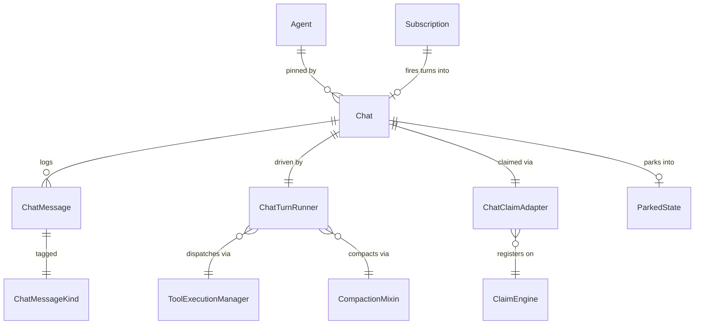
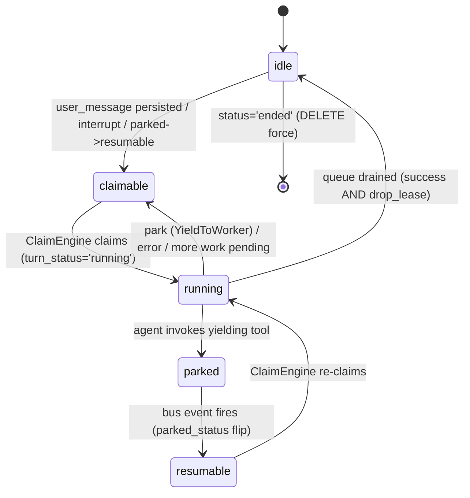
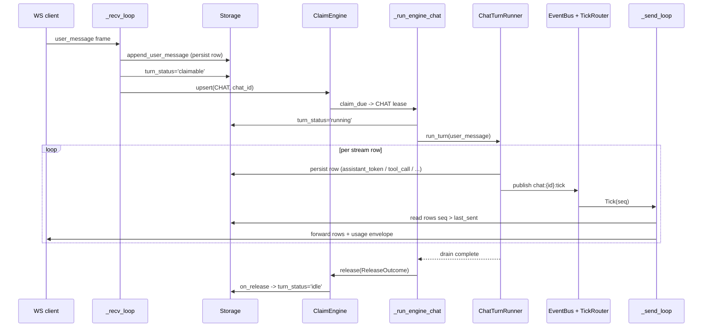

# Chats

## 1. Purpose

The chats subsystem is the WebSocket-driven conversational surface: a long-lived `Chat` row pairs one agent with an append-only `ChatMessage` log, and a worker drives each user turn through the LLM plus tool stack detached from any single client connection. It is lighter than a workspace session (no workspace, no graph binding, no git-backed message store), but it reuses the same yielding-tool park machinery, the same `ClaimEngine` lease model, and the same compaction mixin that the agent runtime uses.

Two design moves define the subsystem. First, **turn detachment**: a `user_message` frame arriving over the WebSocket is persisted to storage and the chat is flipped `claimable`; the worker pool's `ClaimEngine` claims it and runs the LLM turn, so the WebSocket connection's lifetime no longer gates execution. Reconnects, multi-process API hosts, and cancellations all work because storage is the source of truth and the bus is advisory. Second, **protocol reuse for parking**: when a chat agent invokes a yielding tool (`sleep`, `ask_user`, `watch_files`, `subscribe_to_trigger`, an MCP task, or the `_approval` gate), the chat row parks under the identical five-column shape that sessions use, and the same bus listener, timer scheduler, sweeper, and channel dispatcher wake it.

The subsystem lives in `primer/chat/` (runner, dispatch, enqueue, tick router, usage cache), `primer/model/chats.py` (the two storage models), `primer/claim/adapters/chats.py` (the claim adapter), and `primer/api/routers/chats.py` (the REST plus WebSocket surface). The worker side lives in `primer/worker/pool.py`. The yielding-tool runtime, event bus, and background tasks are shared infrastructure documented under `docs/dev/architecture/worker-system.md`; channel fan-out of `ask_user` and `_approval` parks is documented under `docs/dev/subsystems/channels.md`.

## 2. Conceptual model

A `Chat` is a top-level entity (addressable directly by the WebSocket, not nested under a workspace) that pins one `Agent` at creation. Every turn appends rows to a per-chat `ChatMessage` log keyed by a monotonic `seq`; the highest seq is mirrored onto `Chat.last_seq` as the cursor for replay. A turn is one `user_message` driven to a terminal row (`done` / `error` / `cancelled` / `yielded`); the FIFO queue of pending turns is implicit in the log rather than a separate table. When the agent invokes a yielding tool, the chat parks under the M1 yielding-tool protocol, sharing `parked_*` columns and the resume runtime with `WorkspaceSession`.

`Agent` (`primer/model/agent.py`) is pinned via `Chat.agent_id`; switching agents mid-chat is disallowed because it would discard the accumulated system prompt and tool context. `ParkedState` (`primer/worker/yield_runtime.py`) is the JSONB blob the chat parks into, identical to the session shape. `Subscription` (`primer/model/trigger.py`) can drive `user_message` turns into an existing chat through the canonical enqueue plus claim path.

## 3. Architecture patterns implemented

- **Turn detachment via storage plus claim.** The WebSocket recv loop persists `user_message` and flips `turn_status` to `claimable`; the worker pool's unified `_engine_claim_loop` claims the chat and calls `run_one_chat_turn`. The WebSocket becomes a thin storage-tailer plus frame router, not the execution owner (`primer/api/routers/chats.py`, `primer/chat/dispatch.py`, `primer/worker/pool.py`).
- **Implicit FIFO queue in the message log.** `_find_next_user_message` (`primer/chat/dispatch.py`) pages `ChatMessage` rows in ascending seq, counts terminal rows (`done` / `error` / `cancelled` / `yielded`), and returns the `(terminal_count + 1)`th `user_message`. There is no `pending_user_messages` table. A `Chat.next_unprocessed_seq` cursor (default 0) bounds the scan: it records a seq below which the chat is known fully drained, so the scan only considers rows at or after it and is advanced to `max_scanned_seq + 1` whenever the chat drains. This is behaviour-equivalent to a full scan (at the checkpoint the prefix holds equal counts of non-excluded `user_message`s and terminals, which cancel in the index arithmetic), and a cursor of 0 reproduces the original full scan exactly - so legacy chat rows (which lack the field) behave unchanged on their first drain.
- **Storage is truth, bus is advisory.** Every row is persisted before a `chat:{id}:tick` event is published; WebSocket handlers re-read from storage on each tick using `seq > last_sent_seq`, and reconnects start with a cursor replay (`primer/chat/executor.py`, `primer/api/routers/chats.py`).
- **Per-process tick router.** Each process owns one `ChatTickRouter` (`primer/chat/tick_router.py`) and one bus subscription; tick events fan out to per-chat in-process subscriber queues so a thousand WebSockets do not each open a Postgres `LISTEN`.
- **Yielding-tool park reuse.** The chat row carries the same `parked_status` / `parked_event_key` / `parked_until` / `parked_at` / `parked_state` columns as `WorkspaceSession`; the shared bus listener, `TimerScheduler`, `TimeoutSweeper`, watcher, and `McpTaskBridge` wake parked chats without caring whether the row lives in `chats` or `sessions`.
- **Stateless compaction mixin.** `ChatTurnRunner` consumes the same `compaction_mixin.should_compact` / `apply_compaction` / `force_compact` free functions as `_BaseAgentExecutor`, with no shared base class (`primer/agent/compaction_mixin.py`, `primer/chat/executor.py`).
- **Canonical enqueue helper.** `append_user_message` (`primer/chat/enqueue.py`) is the single persist path for a `user_message`, shared by the WebSocket recv loop and the trigger `ChatMessageDispatcher` so attribution and title-derivation stay in lockstep.

## 4. Code layout

| Path | Responsibility |
| --- | --- |
| `primer/model/chats.py` | `Chat`, `ChatMessage`, `ChatMessageKind`, `ChatStatus`. The two storage models plus the `(chat_id, seq)` id encoding. |
| `primer/chat/dispatch.py` | `run_one_chat_turn` plus `ChatDispatchDeps`: the worker-side drain loop, `_find_next_user_message` terminal-counting algorithm, cancel watcher, release helper, and the legacy no-op `sweep_chats`. |
| `primer/chat/executor.py` | `ChatTurnRunner`: streams the LLM, persists every row, runs the tool round-trip loop (cap 8), pre-turn auto-compaction, usage recording, attachment-rejection diagnosis plus history sanitisation. |
| `primer/chat/enqueue.py` | `append_user_message`: canonical `user_message` persist, title derivation, optional trigger attribution. |
| `primer/chat/tick_router.py` | `ChatTickRouter` plus `Tick` plus `_Subscription`: per-process in-process fan-out of tick events. |
| `primer/chat/usage_cache.py` | Thread-safe per-chat last-`Usage` cache: `set_usage` / `get_usage` / `clear_usage` / `reset_cache`. |
| `primer/claim/adapters/chats.py` | `ChatClaimAdapter`: JSONB eligibility SQL plus `on_release` `turn_status` advance. |
| `primer/api/routers/chats.py` | REST CRUD, `/messages` cursor surface, `/compact`, and the `WS /v1/chats/{id}/ws` endpoint with recv plus send loops, cursor replay, and frame routing. |
| `primer/worker/pool.py` | `_run_engine_chat`: the CHAT lease handler that transitions `turn_status='running'` and invokes `run_one_chat_turn`. |
| `primer/trigger/subscribers/chat_message.py` | `ChatMessageDispatcher`: trigger-driven `user_message` turns into an existing chat. |
| `ui/components/chats.jsx` | Chat detail page, TokenMeter, inline approval banner, compaction-marker rendering. |

## 5. Data model

`Chat` (`primer/model/chats.py`) carries `agent_id`, `created_at`, `status` (`active` / `ended`), `title` (derived from the first `user_message`, stamped once), `last_seq`, `turn_status` (`idle` / `claimable` / `running`), `cancel_requested_at`, and the five M1 park columns (`parked_status`, `parked_event_key`, `parked_until`, `parked_at`, `parked_state`). It does NOT carry `claimed_by` / `claimed_at` / `last_heartbeat_at`; lease ownership lives on the `ClaimEngine` leases row, not on the chat.

`ChatMessage` carries `chat_id`, `seq` (`>= 1`, per-chat monotonic), `kind`, a kind-specific `payload` JSON blob, and `created_at`. Its `id` is the deterministic `"{chat_id}:{seq:020d}"` (zero-padded so lexicographic order matches numeric order), letting the generic `Storage[T]` interface key on `id` without a custom backend. `ChatMessageKind` is the union `user_message`, `assistant_token`, `tool_call`, `tool_result`, `yielded`, `resumed`, `done`, `cancelled`, `error`, `compaction_marker`.

`turn_status` is orthogonal to `parked_status`: a `running` chat that parks on a yielding tool keeps `turn_status` where it is while `parked_status` flips, and the claim predicate gates on `parked_status` so the parked row stays invisible to claimers.

The `parked` and `resumable` states above are the `parked_status` values; `turn_status` remains `running` across the park boundary until the worker releases the lease. `ChatClaimAdapter.eligibility_sql()` selects rows where `status='active' AND parked_status IS NULL AND turn_status IN ('claimable','resumable')`, and `on_release` writes `turn_status='idle'` on `(success AND drop_lease)` else `claimable`.

## 6. Lifecycle

A turn flows from a WebSocket frame through storage, the claim engine, a worker, and back to every connected client over ticks. The recv loop persists the `user_message` via `append_user_message`, flips `turn_status='claimable'`, publishes the legacy `chat-claimable` bus event, AND calls `claim_engine.upsert(ClaimKind.CHAT, chat_id, priority=10)` (the canonical wakeup). The worker pool's `_run_engine_chat` transitions `turn_status='running'` and invokes `run_one_chat_turn`, which drains the FIFO queue: per `user_message` it builds a `ChatTurnRunner`, runs the LLM stream, persists each row, and publishes a `chat:{id}:tick` per persisted row. The send loop re-reads storage on each tick and forwards new rows to the client, re-emitting a `usage` envelope after every `done` row.

On a park the runner raises `YieldToWorker`; `run_one_chat_turn` releases the chat with `next_turn_status='claimable'` and returns. The shared bus listener flips `parked_status` to `resumable` on event arrival and the next `claim_due` re-claims the chat. On cancel (an `interrupt` frame sets `cancel_requested_at` and publishes `chat:{id}:cancel`) the runner persists a `cancelled` row mid-stream and exits cleanly; cancel is per-turn, so a queued `user_message` proceeds normally after the dispatch loop clears `cancel_requested_at`. On reconnect the WebSocket replays rows with `seq > cursor` via `_replay_since_cursor` before subscribing to live ticks.

## 7. Persistence

Chats persist to `Storage[Chat]` plus `Storage[ChatMessage]`; there is no git-backed message file and no workspace. The `ChatMessage` log is append-only and the chat title is stamped once on the first turn and never overwritten. The `id` encoding `"{chat_id}:{seq:020d}"` makes `(chat_id, seq)` a natural primary key over the generic storage interface.

Compaction is persisted as a structured `compaction_marker` row (unlike workspace sessions, which keep the prefix-string convention in `messages.jsonl`). When `ChatTurnRunner._load_history` walks rows in seq order it finds the LAST `compaction_marker`, replaces every row at or before it with one synthetic assistant `Message` carrying the marker's summary text, and translates everything after it normally; the original rows stay on disk for audit. Rows flagged `_history_excluded` by attachment-rejection sanitisation are dropped from the rebuilt prompt but kept in storage for replay. Park state lives in the same five-column shape as sessions, wrapped by `ParkedState`; on resume the agent, tools, and system prompt are re-read from storage rather than pinned in the blob.

`DELETE /v1/chats/{id}?force=true` drains every `ChatMessage` row (paged at 200), deletes the `Chat` row, calls `engine.delete_lease(ClaimKind.CHAT, chat_id)`, and clears the per-chat usage-cache entry. A non-force delete ends the chat (`status='ended'`) without removing history.

## 8. Public surfaces

REST endpoints (prefix `/v1/chats`, in `primer/api/routers/chats.py`):

- `POST /v1/chats` create, `GET /v1/chats` list, `GET /v1/chats/{id}` get (returns the whole `Chat` model including `turn_status`), `DELETE /v1/chats/{id}?force=...` end or force-delete.
- `GET /v1/chats/{id}/messages` with `after_seq` and `before_seq` cursors for lazy-loading older history (tail mode) in addition to the WebSocket cursor-replay surface.
- `POST /v1/chats/{id}/compact` operator-forced compaction; refuses with `409` while `turn_status='running'` (avoids racing the runner's own pre-turn compaction); returns `compaction_marker_seq`, `summary`, `tokens_before`, `tokens_after`.

WebSocket endpoint `WS /v1/chats/{id}/ws?cursor=N`:

- Auth via `require_auth_ws`; close codes `4401` (auth required), `4404` (chat not found), `4410` (chat ended), `4500` (server error).
- Client-to-server frames: `ping`/`pong`, `user_message` (two payload shapes, `{content}` legacy and `{parts}` structured/multimodal), and `interrupt` (sets `cancel_requested_at`, publishes cancel). There is no `tool_approval_decide` frame: chat approval is conversational (see below).
- Server-to-client envelopes: `assistant_token`, `tool_call`, `tool_result`, `done`, `error`, `cancelled`, `yielded`, `resumed`, plus `compaction` (translated from `compaction_marker` rows by `_compaction_envelope`) and `usage` (`input_tokens`, `output_tokens`, `context_length`, `used_pct`, emitted on connect and after every `done` row).

Tool-call approval on chats is conversational (the "conversational yield" model). When a `required` verdict gates a tool call, the chat agent ends its turn with a normal assistant message asking the operator to approve the call. The operator replies with a normal `user_message` ("yes"/"no"), which resumes the turn the same way an `ask_user` answer does. There is no chat `tool_approval/{pending,respond}` REST endpoint, no `tool_approval_decide` WebSocket frame, and no `_approval` park on chats. (Sessions still use the parked-approval gate and the REST/WS decide path.)

## 9. Internal contracts

- `run_one_chat_turn(deps, *, chat_id, worker_id)` requires the chat to already be in `turn_status='running'` (the caller transitions it atomically via the `ClaimEngine`). On clean drain it leaves `idle`; on park it releases with `turn_status='claimable'` and the claim predicate gates resumption on `parked_status`; on cancel it persists a `cancelled` row and releases to idle; on lease loss it exits without further writes.
- `ChatTurnRunner.run_turn(chat, user_input, *, already_persisted_user_msg=...)` accepts a string or a list of `Part` objects. When `already_persisted_user_msg` is supplied (the worker dispatch path), the runner skips persisting the row, yields it as-is, and aligns `last_seq`, so the recv loop and the worker do not race to write the same row.
- Every row is persisted to storage BEFORE the dispatch path publishes its `chat:{id}:tick`. Subscribers treat the tick as advisory and re-read storage with `seq > last_sent_seq`.
- `_find_next_user_message` relies on terminal rows to advance; a worker death with no terminal row written can stall the drain until the `ClaimEngine` reclaims and the next turn produces a terminal. The legacy `sweep_chats` no longer writes a synthetic `error` row (it is a no-op shim).
- `ChatClaimAdapter.on_release` advances entity-side state (`turn_status` to `idle` or `claimable`) because lease state lives on the `ClaimEngine` row, not on the chat. The `chat-claimable` bus event the recv loop still publishes is legacy; the engine consumes its own `claim_ready` NOTIFY instead.
- `usage_cache` is process-local: `set_usage` is called by the runner per `Usage` event and `get_usage` by the WebSocket layer; counters do not survive a process restart and the WebSocket `usage` envelope degrades to `used_pct=0.0` on a miss.

## 10. Testing patterns

Unit and integration coverage lives under `tests/chat/` (`test_dispatch.py`, `test_dispatch_queue_while_compacting.py`, `test_enqueue.py`, `test_executor_compaction.py`, `test_runner_cancel.py`, `test_tick_router.py`, `test_usage_cache.py`, and `test_sweeper.py` which pins that `sweep_chats` is a no-op). The claim adapter is pinned by `tests/claim/test_chat_adapter.py` (asserts the eligibility SQL substrings) and exercised end to end by `tests/worker/test_chat_claim_loop.py`. WebSocket behaviour is covered by `tests/api/test_chat_resilience.py` (disconnect mid-stream, cursor reconnect, cancel mid-stream, FIFO ordering), `tests/api/test_chat_tick_forwarder.py` (the lifespan bus-to-router forwarder), and `tests/api/test_chat_ws_envelopes.py` (on-the-wire user_message persistence, replay-since-cursor, usage envelope, compaction envelope). Compaction REST contracts live in `tests/api/test_compact_endpoints.py`. Conversational approval on chats is covered by `tests/e2e/test_chats_ask_user_journey.py` (`test_chat_approval_softyield_yes_executes_no_rejects`). The reload heuristic is exercised by `tests/ui_e2e/test_chat_resume_journey.py`.

## 11. Historical decisions

- **Lease ownership for chats lives on the polymorphic `ClaimEngine`, not on `Chat` columns.** Why: cluster 2 landed the `ClaimEngine` first and absorbed lease ownership across SESSION / CHAT / HARNESS / TRIGGER, so the spec's `claimed_by` / `claimed_at` / `last_heartbeat_at` columns were never added and `ChatClaimAdapter` exposes eligibility SQL over existing fields instead. Spec: docs/superpowers/specs/2026-05-27-chat-turn-detachment-design.md.
- **The FIFO queue is implicit in the `ChatMessage` log; there is no `pending_user_messages` table.** Why: `user_messages` and their terminals already live in one seq-keyed log, so counting terminal rows identifies the next unprocessed turn at the cost of a paged scan. Spec: docs/superpowers/specs/2026-05-27-chat-turn-detachment-design.md.
- **Cancel is per-turn, not per-queue, matching ChatGPT and Claude.ai Stop semantics.** Why: operators expect Stop to abort the response they are watching, not to flush every queued message they typed while it ran. Spec: docs/superpowers/specs/2026-05-27-chat-turn-detachment-design.md.
- **The cancel signal is dual-pathed: a `chat:{id}:cancel` bus event plus a durable `cancel_requested_at` DB flag.** Why: bus delivery is best-effort, so persisting the flag makes cancellation survive bus drops and worker restarts while the event provides the fast wake-up. Spec: docs/superpowers/specs/2026-05-27-chat-turn-detachment-design.md.
- **Storage is the source of truth and the bus is advisory; the WebSocket re-reads on every tick and reconnects with a cursor replay.** Why: tick events can be dropped (NOTIFY queue full, listener restart, cross-process race), so clients never need to dedupe across bus and storage. Spec: docs/superpowers/specs/2026-05-27-chat-turn-detachment-design.md.
- **One per-process `ChatTickRouter` replaces one bus subscription per WebSocket.** Why: on Postgres one `LISTEN` per WebSocket would mean a database connection per WebSocket, unacceptable at scale; the router collapses all chat fan-out to one subscription per process. Spec: docs/superpowers/specs/2026-05-27-chat-turn-detachment-design.md.
- **The WebSocket handler was rewritten as recv loop plus send loop plus cursor replay while `ChatTurnRunner.run_turn` stayed put.** Why: keeping the runner interface stable meant the only call-site change was invoking it from the worker rather than the WebSocket handler, which is what makes detachment cheap. Spec: docs/superpowers/specs/2026-05-27-chat-turn-detachment-design.md.
- **Chats carry their own table and reuse the M1 yielding-tool protocol unchanged for parking.** Why: the bus listener, timer, sweeper, watcher, and MCP bridge already wake parked rows by `parked_event_key` regardless of whether the row lives in `sessions` or `chats`, so chats inherited park-resume for free. Spec: docs/superpowers/specs/2026-05-22-yielding-tools-design.md.
- **Tool-call approval on chats is conversational: the agent ends its turn asking for approval as a normal assistant message and the operator replies with a normal `user_message`.** Why: a chat already has a human in the loop on the same WebSocket, so a yes/no reply is the natural channel; this avoids a separate park/decide protocol (no `_approval` park, no `tool_approval_decide` frame, no chat `tool_approval/{pending,respond}` endpoint). Sessions, which may run unattended, keep the parked-approval gate. Spec: docs/superpowers/plans/2026-06-09-chat-conversational-yield.md.
- **Chats persist compaction as a structured `compaction_marker` row while workspace sessions keep the prefix-string convention.** Why: workspace-session storage migration was an explicit non-goal; only chat storage got the dedicated marker plus the on-the-wire `compaction` envelope and per-chat usage cache. Spec: docs/superpowers/specs/2026-05-30-auto-compaction-token-counting-design.md.
- **On-demand `POST /v1/chats/{id}/compact` returns 409 when a turn is in flight; manual compaction is chat-only.** Why: reusing the turn-in-flight lock keeps manual compaction from racing the runner's own pre-turn auto-compaction, and workspace sessions remain auto-only with no REST surface. Spec: docs/superpowers/specs/2026-05-30-auto-compaction-token-counting-design.md.
- **Triggers drive `user_message` turns into an existing chat through the canonical `append_user_message` plus `ClaimEngine.upsert` path.** Why: routing the `chat_message` subscriber through the same enqueue plus claim path as a WebSocket `user_message` keeps persistence, title derivation, and attribution single-sourced. Spec: docs/superpowers/specs/2026-06-01-triggers-and-subscriptions-design.md.
- **The multi-process plus SQLite startup guard was not implemented; the constraint is documentation-only.** Why: the in-memory event bus cannot bridge processes, so a multi-process deployment must move to Postgres LISTEN/NOTIFY, but the intended boot-time guard refusing SQLite under multi-process never landed. Spec: docs/superpowers/specs/2026-05-27-chat-turn-detachment-design.md.
