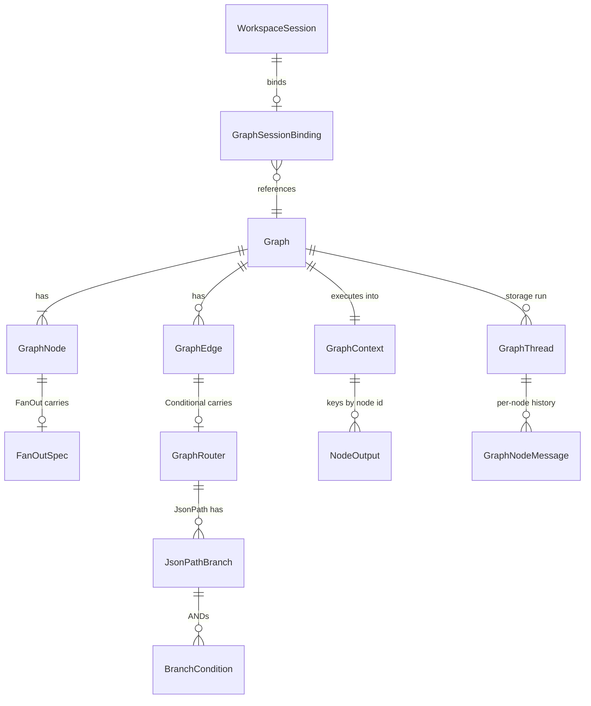
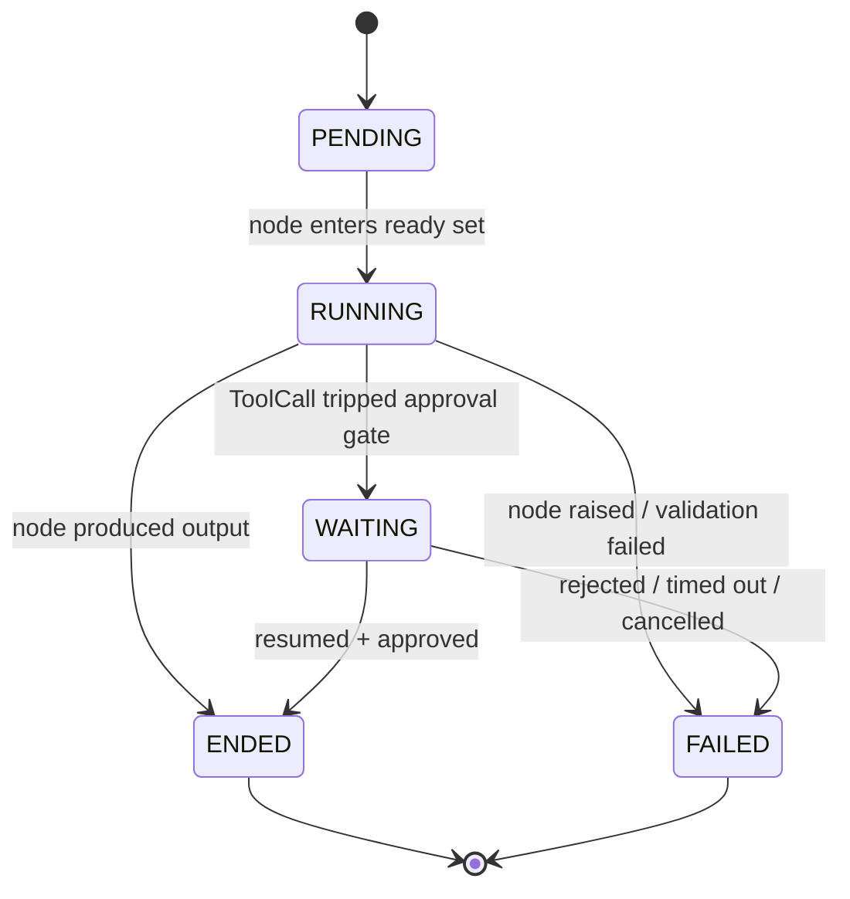

# Graphs

## 1. Purpose

The graphs subsystem runs declarative, directed graphs of agent nodes. A `Graph` is a JSON-serialisable topology of nodes (agents, sub-graphs, pure data-shaping Begin/End nodes, fan-out/fan-in map-reduce nodes, and direct tool-call nodes) connected by static or conditional edges. A Pregel-style executor walks the graph in supersteps: each superstep runs every ready node concurrently, records each node's `NodeOutput` into a shared `GraphContext`, evaluates outgoing edges, recomputes the frontier, and repeats until the ready set drains, a cap is hit, or a failure code terminates the run.

The subsystem ships two concrete executors over one shared base. `GraphExecutor` (`primer/graph/executor.py`) persists a `GraphThread` plus per-node `GraphNodeMessage` rows through `Storage[T]` and is used for standalone, storage-backed runs and tests. `WorkspaceGraphExecutor` (`primer/graph/workspace_executor.py`) persists per-node `messages.jsonl` and `state.json` into the workspace's git-backed `.state/` repo and is the production path: the worker pool builds one for any `WorkspaceSession` bound to a graph via `GraphSessionBinding`. Both share the Pregel loop, Jinja2 input templating, JSON-path and callable routers, structured I/O contracts on Begin/End, the fan-out/fan-in map-reduce machinery, a tool-approval checkpoint/resume protocol, and turn-log emission.

Adjacent surfaces are documented elsewhere and cross-linked here rather than duplicated: how a graph run is created from a session (`docs/dev/subsystems/sessions.md`), the turn-log writer family as a cross-cutting observability concern (`docs/dev/architecture/observability.md`), the worker pool's claim/park integration (`docs/dev/architecture/worker-system.md` and `docs/dev/architecture/claim-machine.md`), the REST endpoint catalogue (`docs/dev/architecture/rest-api.md`), and the graph builder UI (`docs/dev/subsystems/ui-pages.md`).

## 2. Conceptual model

A `Graph` (a `Describeable` subclass) carries a list of `nodes` (a discriminated union of seven node kinds), a list of `edges` (static or conditional), an optional `max_iterations` cap, and an optional `harness_id` marking the row as harness-managed. The entry point is the unique Begin node; there is no separate `entry_node_id` field. At runtime the executor builds a `GraphContext` whose `nodes` dict holds each completed node's `NodeOutput` (or, for fan-out targets, a `list[NodeOutput]`). Templates and routers read from this context.

The seven node kinds are:

- `_BeginNode` (`kind="begin"`): pure data-shaping entry node carrying the graph's input contract (`input_schema`).
- `_EndNode` (`kind="end"`): pure data-shaping sink carrying the graph's output contract (`output_template` + `output_schema`).
- `_AgentNodeRef` (`kind="agent"`): runs a stored `Agent` with an `input_template`, optional `response_format`, and designer-only `input_schema`.
- `_GraphNodeRef` (`kind="graph"`): delegates to a sub-graph (recursive composition).
- `_FanOutNode` (`kind="fan_out"`): pure dispatcher; spawns parallel downstream instances per `FanOutSpec`.
- `_FanInNode` (`kind="fan_in"`): wait-for-all aggregator with an `aggregate_template` + optional `output_schema`.
- `_ToolCallNode` (`kind="tool_call"`): invokes a tool by scoped id with `arguments` or an `arguments_template` + optional `output_schema`.



`GraphContext.initial_input` is typed `Any` so a run can be seeded by a dict / str / list / any JSON-serialisable value (the workspace executor seeds it from `session.metadata['graph_input']`); the Begin node materialises a `NodeOutput` from it. `GraphContext.nodes` is `dict[str, NodeOutput | list[NodeOutput]]`: a fan-out target id holds the aggregator list and individual synthesized instances live at `nodes['target[i]']`.

## 3. Architecture patterns implemented

- **Pregel-style supersteps.** `_BaseGraphExecutor._run_superstep_loop` (`primer/graph/base.py`) computes the ready set, runs every ready node concurrently via `asyncio.create_task` draining a shared `asyncio.Queue`, applies results to `GraphContext`, evaluates outgoing edges through `_compute_next_ready`, increments the iteration, and repeats. The same loop serves acyclic and cyclic graphs; cyclic graphs bound themselves with `max_iterations`.
- **Two executors over one base.** `GraphExecutor` and `WorkspaceGraphExecutor` subclass `_BaseGraphExecutor`, overriding only `_load_node_history`, `_persist_node_turn`, `_save_state`, `_build_sub_executor`, and `_dispatch_toolcall`. This mirrors the `AgentExecutor` / `WorkspaceAgentExecutor` split.
- **Sandboxed Jinja2 templating.** `render_input_template` and `render_template_safely` (`primer/graph/template.py`) render against a module-level `SandboxedEnvironment` with `StrictUndefined` and `autoescape=False`. The input-template path wraps Jinja errors as `BadRequestError`; the `render_template_safely` path propagates the raw `jinja2.TemplateError` so End / FanIn / ToolCall callers can map specific failure codes.
- **Two router kinds, not one ABC.** `_JsonPathRouter` (declarative `BranchCondition` predicates evaluated against the source node's `NodeOutput.parsed`) and `_CallableRouter` (a `callable_id` resolved against a `RouterRegistry`). Graph definitions stay JSON-serialisable; application code registers Python callables. Re-registering a `callable_id` raises `ConfigError` so typos fail loudly (`primer/graph/router.py`).
- **Structured I/O contract on Begin/End.** Begin validates `graph_input` against `input_schema` at session-create time; End renders `output_template` and validates against `output_schema` at runtime, emitting structured output through a `_GraphEndOutputEvent`.
- **Map-reduce via fan-out/fan-in.** `_FanOutNode` synthesizes per-instance ids (`target[i]`), `_FanInNode` waits for every upstream source before firing, and the `on_failure` trichotomy (`fail_fast` / `drain_then_fail` / `collect`) governs partial-failure behaviour.
- **Mid-graph checkpoint/resume for tool approval.** When a `_ToolCallNode` trips an approval gate, the executor checkpoints its full mid-flight state, parks the session WAITING, and resumes from the checkpoint on approval (`snapshot_state` / `restore_state` / `resume_from_checkpoint`).
- **Best-effort turn-log emission.** Per-node and graph-level `TurnLogWriter` instances record turn-boundary events; emission is wrapped in `safe_append` so a logging failure never aborts execution.

## 4. Code layout

| Path | Responsibility |
| --- | --- |
| `primer/model/graph.py` | All Pydantic models: `Graph`, the `GraphNode` discriminated union (seven kinds), `FanOutSpec`, `BranchCondition`, `JsonPathBranch`, the `GraphRouter` and `GraphEdge` unions, `NodeOutput`, `GraphContext`, `NodeRuntimeStatus`/`State`, `GraphThread`, `GraphNodeMessage`, and the `Graph._validate_topology` model-validator. |
| `primer/graph/base.py` | `_BaseGraphExecutor`: the Pregel loop, ready-set computation, fan-out resolution, fan-in wait-for-all, conditional-edge evaluation, checkpoint/resume, turn-log hooks, the `_GraphNodeEvent` wrapping, and the internal exception channels. |
| `primer/graph/executor.py` | `GraphExecutor` (storage-backed): `GraphThread` + `GraphNodeMessage` persistence, `open_thread` / `delete_thread` / `list_threads`, cursor-paginated history, optional `tool_dispatcher`, optional `turn_log_storage`. |
| `primer/graph/workspace_executor.py` | `WorkspaceGraphExecutor`: git-backed per-node `messages.jsonl` + `state.json`, workspace agent/tool augmentation, `graph_input` seeding, ToolCall dispatch through the workspace `ToolExecutionManager`. |
| `primer/graph/router.py` | `RouterRegistry`, `_resolve_path`, `evaluate_branch_condition`, `first_matching_branch`. |
| `primer/graph/template.py` | `render_input_template`, `render_template_safely`, the shared `SandboxedEnvironment`. |
| `primer/graph/__init__.py` | Public re-exports for the graph package. |
| `primer/model/turn_log.py` | `TurnLogEvent` union (eight kinds), `TurnLogRecord` storage entity. |
| `primer/model/chat.py` | `_GraphNodeEvent` on the `ExtendedStreamContent` union. |
| `primer/model/workspace_session.py` | `SessionStatus`, `GraphSessionBinding`. |
| `primer/worker/graph_resume.py` | `resume_graph_from_checkpoint` resume adapter for the ToolCall approval flow. |
| `primer/api/routers/compute.py` | `graph_router` CRUD, `/graphs/{id}/status`, graph-level and per-node turn-log readers. |
| `tests/graph/` | Models, templates, routers, end-to-end executor flows, every node kind, branch operators, fan-out modes, checkpoint round-trip, workspace executor, turn-log storage, ToolCall approval/reject/resume, spec-B topology. |

## 5. Data model

`NodeOutput` (`primer/model/graph.py`) carries `text` (the node's last assistant text, or a rendered template), `parsed` (the `json.loads` of `text` when structured output is in play, dict-only), `history` (the node's message list), and `iteration`. Two optional fields, `error` and `ended_detail`, are populated only on the fan-out `collect` path; every other failure mode terminates the graph rather than leaving an error-stamped `NodeOutput` in the context.

`NodeRuntimeStatus` is the per-node state machine. It adds `PENDING` (not yet reached) and `FAILED` (errored out) over the session-level `SessionStatus`; the graph's aggregate status is derived from these.



`Graph._validate_topology` is a Pydantic `model_validator(mode="after")` enforcing: unique node ids; exactly one Begin; at least one End; Begin has no incoming edges; End nodes have no outgoing edges; every End reachable from Begin via forward BFS (the BFS walks fan-out implicit edges through a separate adjacency map); every static/branch/`default_to` target references an existing node id; a FanOut node has no outgoing edges in `graph.edges` (its targets live on `specs`); FanOut spec targets exist and are neither Begin nor another FanOut; a `map` spec's `source_node_id` exists and is not itself a fan-out target; and a FanIn has at least one incoming edge. Callable-router targets are unknown at validation time, so they are treated conservatively as reaching every non-Begin node for reachability and skipped from incoming-edge tracking.

`BranchCondition` carries `path` (dotted segments with bracket indexing, e.g. `a.b[2].c`), `op` (`eq`/`ne`/`gt`/`gte`/`lt`/`lte`/`in`/`not_in`/`exists`), and `value` (unused for `exists`; a list for `in`/`not_in`). `JsonPathBranch.conditions` is a list of `BranchCondition` ANDed together; an empty list is a catch-all. `evaluate_branch_condition` (`primer/graph/router.py`) implements the missing-path rule: when the path does not resolve, every operator returns `False` (including `ne` and `not_in`); use `exists` to test presence. Non-numeric operands on either side of an ordering operator return `False`; a non-list `value` for `in`/`not_in` returns `False`.

`FanOutSpec` is a self-validating discriminator. `broadcast` requires `target_node_id` + `count`; `tee` requires `target_node_ids`; `map` requires `target_node_id` + `source_node_id` + `source_path`. Each spec carries an `on_failure` mode defaulting to `fail_fast`. Malformed JSON Schemas on any node (`input_schema`, `response_format`, `output_schema`) are rejected at save time via `Draft202012Validator.check_schema`, surfaced as a field-level `ValidationError` (422 on CRUD).

## 6. Lifecycle

A graph run begins when a `WorkspaceSession` is created with a `GraphSessionBinding` and a `graph_input` value (validated against the Begin node's `input_schema` at session-create time and folded onto `session.metadata['graph_input']`; see `docs/dev/subsystems/sessions.md`). The worker pool builds a `WorkspaceGraphExecutor` and calls `invoke`. The Begin node materialises a seed `NodeOutput`; each superstep then runs ready nodes concurrently, streams events, applies results, and recomputes the frontier. When a `_ToolCallNode` trips an approval gate the run suspends; an operator decision wakes it.

```mermaid
sequenceDiagram
    participant Caller as Session create
    participant Worker as WorkerPool
    participant Exec as WorkspaceGraphExecutor
    participant Loop as _run_superstep_loop
    participant Node as ready node(s)
    participant Op as Operator

    Caller->>Worker: WorkspaceSession + GraphSessionBinding + graph_input
    Worker->>Exec: build executor, invoke(seed)
    Exec->>Loop: seed ready={Begin}
    loop each superstep
        Loop->>Node: run ready nodes concurrently
        Node-->>Loop: stream events + _NodeDone
        Loop->>Loop: apply results, compute next ready
    end
    Note over Loop,Node: ToolCall trips approval gate
    Node-->>Loop: YieldToWorker (suspended sentinel)
    Loop->>Exec: snapshot_state(); save WAITING
    Exec-->>Worker: re-raise YieldToWorker(graph_checkpoint)
    Worker->>Op: park session, fan out approval prompt
    Op-->>Worker: approve / reject
    Worker->>Exec: resume_graph_from_checkpoint(checkpoint, payload)
    Exec->>Loop: restore_state; re-dispatch with bypass_approval; drain
    Loop-->>Worker: graph ENDED (completed / failed)
```

Termination paths: the loop ends `completed` when the ready set drains naturally; every End fires independently when reached (there is no first-End-wins rule). It ends `failed` with a specific `ended_detail` code on a node failure carrying a §5.4 code, a routing failure, a fan-out source-invalid, a `drain_then_fail` upstream failure, a ToolCall output/execution failure, or `max_iterations_exceeded`. Each superstep boundary persists state, so a run is recoverable.

## 7. Persistence

`GraphExecutor` persists a `GraphThread` row (graph-level state: `iteration`, `node_states`, `status`, `ended_reason`, `ended_detail`) and per-node `GraphNodeMessage` rows (each scoped by `node_id`, ordered by `iteration` then `sequence`). History reads are cursor-paginated with `CursorPage.length` capped at 200, looping until `next_cursor` is `None`. `GraphThread.ended_reason` is one of `completed` / `failed` / `cancelled` / `max_iterations_exceeded`; `ended_detail` carries the specific §5.4 failure code.

`WorkspaceGraphExecutor` commits graph state into the workspace's git-backed `.state/` repo via `StateRepo.commit_arbitrary`, one commit per turn, with traceable trailers (`X-Primer-Graph`, `X-Primer-Op`, `X-Primer-Graph-Node`, `X-Primer-Graph-Iteration`, plus status/ended trailers). Per-node histories live at `<state_repo>/graphs/<gsid>/nodes/<node_id>/messages.jsonl`; graph-level state at `<state_repo>/graphs/<gsid>/state.json`; an optional graph-definition snapshot at `<state_root>/graph.json` via `write_graph_binding`. Operators can grep history per graph (`git log --grep='X-Primer-Graph: <gsid>'`) or per node.

Turn logs are observability data, not audit data, and bypass the git pipeline. The workspace executor writes them directly to `<state_root>/turns.jsonl` (graph-level) and `<state_root>/nodes/<nid>/turns.jsonl` (per-node) through `WorkspaceTurnLogWriter`. The storage executor, when given an optional `turn_log_storage`, writes `TurnLogRecord` rows through `StorageTurnLogWriter`. Either way the `TurnLogWriter` is bootstrapped to resume its monotonic `seq` across worker restarts, and per-node writers are cached on `_node_turn_logs` so a node firing across multiple supersteps keeps one seq stream. The graph executors emit `TurnLogStarted` / `TurnLogCompleted` / `TurnLogFailed` per node and `TurnLogSuperstepStarted` / `TurnLogSuperstepEnded` at the graph level; the suspended-sentinel (approval-yield) path defers the terminal event until resume. The writer family itself is documented in `docs/dev/architecture/observability.md`.

Sub-graph runs propagate their parent's turn-log surface: `GraphExecutor` threads `turn_log_storage` into children so nested runs land in the same `TurnLogRecord` table under the sub-thread's `run_id`; the workspace variant uses `<parent_gsid>__<parent_node_id>` as the child's gsid.

## 8. Public surfaces

The graph package re-exports `Graph`, `GraphExecutor`, `WorkspaceGraphExecutor`, `RouterRegistry`, `render_input_template`, `evaluate_branch_condition`, `first_matching_branch`, and the model types from `primer/graph/__init__.py`.

REST endpoints live in `primer/api/routers/compute.py`:

- Standard CRUD under `/v1/graphs` via `make_crud_router` with `cdc_kind='graph'` and `managed_by_field='harness_id'` (rows with a `harness_id` reject direct CRUD mutation with 409).
- `GET /v1/graphs/{id}/status` resolves agent-node and subgraph-node references and returns `{"ok", "issues"}`. Topology validity is enforced by the Pydantic validator at read time, so broken topologies never reach storage.
- `GET /v1/graphs/{id}/runs/{run_id}/turn_log` (graph-level superstep events) and `GET /v1/graphs/{id}/runs/{run_id}/nodes/{node_id}/turn_log` (per-node), each accepting `limit` (default 200, max 1000), `offset`, and `since_seq`. The handler dispatches workspace-backed vs storage-backed by checking whether `run_id` resolves to a `WorkspaceSession` with a graph binding or to a `GraphThread`; a missing workspace or file returns an empty page so the UI can still render the tab. Full REST coverage is in `docs/dev/architecture/rest-api.md`.

A run is created through the session-create surface (`docs/dev/subsystems/sessions.md`), not a graph-specific run endpoint. Streaming events are wrapped as `ExtendedEvent(_GraphNodeEvent(node_id, iteration, inner_type, inner_payload))` on the `ExtendedStreamContent` union (`primer/model/chat.py`). The graph builder UI (`ui/components/graphs.jsx`) is covered in `docs/dev/subsystems/ui-pages.md`.

## 9. Internal contracts

`_BaseGraphExecutor` defines four abstract hooks (`_load_node_history`, `_persist_node_turn`, `_save_state`, `_build_sub_executor`) plus an overridable `_dispatch_toolcall` (default raises `NotImplementedError`) and `_dispatch_toolcall_with_bypass` (default falls back to `_dispatch_toolcall`). The storage executor wires `_dispatch_toolcall` to an injected `tool_dispatcher` (introspecting its signature to optionally pass `bypass_approval`); the workspace executor builds a `ToolCallPart` and forwards to a workspace-bound `ToolExecutionManager.execute(call, principal, bypass_approval)`, lazily constructing a workspace-only manager when none was wired.

Node dispatch routes through `_stream_node`, which resolves synthesized fan-out instance ids (`worker[2]`) to their underlying target node and injects `fanout_index` / `fanout_item` into the per-instance Jinja scope via the `extra_scope` argument. Agent nodes run through the shared `run_agent_turn` loop so in-graph tool dispatch is identical to a standalone agent's. A FanOut node produces a bookkeeping `NodeOutput` whose `text` is `json.dumps({"node_id", "specs"})` so downstream conditional edges from a FanOut can still read `nodes.<fanout>.text`.

The executor uses internal exception channels rather than return codes: `_RoutingFailed` (no branch matched and no `default_to`), `_FanoutSourceInvalid` (`map` source path did not resolve to a list), `_GraphToolCallYield` / `YieldToWorker` (approval gate), and `_ToolApprovalRejected` (operator rejected on the resume path). Terminal events are dataclasses `_GraphErrorEvent` (`{code, message, node_id, path}`) and `_GraphEndOutputEvent` (`{text, parsed, end_node_id}`); the session-layer translator (`primer/session/persistence.py`) converts them into `SessionMessageRecord` rows.

The `ended_detail` failure codes the executor emits are: `begin_input_invalid`, `end_output_invalid`, `template_error`, `routing_failed`, `max_iterations_exceeded`, `fanout_source_invalid`, `fanin_upstream_failed`, `tool_output_invalid`, and `tool_execution_failed`. All surface as `ended_reason='failed'` with the specific code in `ended_detail`.

The `on_failure` trichotomy on `FanOutSpec` is the most surprising contract. `fail_fast` (default) propagates the first failure up the normal path and terminates the graph. `drain_then_fail` suppresses the immediate failure, bumps a `_FanoutDrainState.completed_count` for every sibling (success or failure), and once `expected_count` is reached terminates `failed` with `fanin_upstream_failed`. `collect` stamps the failed instance's `NodeOutput.error` / `ended_detail`, appends it to the aggregator list at `nodes[target]`, and lets the graph continue so a downstream FanIn `aggregate_template` author can branch on `n.error`.

The checkpoint contract: when a ToolCall yields, `_stream_node` records a `_PendingToolCall` and posts a suspended `_NodeDone`; after the superstep settles, the loop saves state WAITING, calls `snapshot_state()` (serialising context, ready set, node states, all fan-out bookkeeping, and pending tool-calls), attaches it onto the `YieldToWorker` as `graph_checkpoint`, and re-raises. The worker persists it onto `ParkedState.graph_checkpoint`; `resume_graph_from_checkpoint` (`primer/worker/graph_resume.py`) restores state, re-dispatches each pending ToolCall with `bypass_approval=True`, and drains the rest of the loop. A rejected/timed-out/cancelled decision monkeypatches the bypass dispatch to raise `_ToolApprovalRejected`, which the resume drain converts into `ended_detail='tool_execution_failed'`. Graph parks today are limited to the tool-approval gate; the broader worker/park integration is documented in `docs/dev/architecture/worker-system.md`.

## 10. Testing patterns

Tests live under `tests/graph/`. Model tests round-trip every node kind and exercise topology rules (`test_topology.py`, `test_spec_b_topology.py`, `test_begin_end_node_model.py`, `test_fanout_spec_model.py`). Router and template tests cover every branch operator, the missing-path rule, bracket-index path resolution, first-match-wins, `default_to` fallback, and the fan-out Jinja scope (`test_branch_condition_evaluation.py`, `test_router_path_resolution.py`, `test_first_matching_branch.py`, `test_template_fanout_scope.py`). End-to-end executor tests drive Begin/End firing across str/list/dict seeds, End output validation, routing failure, max-iterations, and the full fan-out broadcast/tee/map plus `fail_fast`/`drain_then_fail`/`collect` modes (`test_begin_firing.py`, `test_executor_end_termination.py`, `test_routing_failed.py`, `test_max_iterations.py`, `test_fanout_broadcast_e2e.py`, `test_fanout_drain_then_fail.py`, `test_fanout_collect.py`, `test_multi_end_independent.py`). ToolCall tests cover argument resolution, dispatch, result mapping, and the approval/reject/resume round-trip (`test_toolcall_arg_resolution.py`, `test_toolcall_approval_reject.py`, `test_graph_checkpoint_roundtrip.py`). Workspace and storage variants are covered by `test_workspace_executor_graph_input.py`, `test_workspace_turn_log.py`, and `test_storage_turn_log.py`. REST coverage is in `tests/api/test_graphs.py`, `tests/api/test_turn_log_routes.py`, and `tests/api/test_tools_endpoint.py`; the worker resume path in `tests/worker/test_pool_graph_resume.py`.

## 11. Historical decisions

- **Pregel-style supersteps were chosen over fully-explicit DAG scheduling.** Why: one loop serves cyclic and acyclic graphs, runs all ready nodes concurrently, recomputes the frontier from edge outputs, and pauses/resumes between supersteps for free. Spec: docs/superpowers/specs/2026-05-03-agent-graph-design.md.
- **Two concrete executors sat on a shared `_BaseGraphExecutor` instead of one polymorphic class.** Why: it mirrors the AgentExecutor / WorkspaceAgentExecutor split, letting the storage variant persist rows and the workspace variant git-commit each turn while subclasses override only history, persistence, and sub-executor construction. Spec: docs/superpowers/specs/2026-05-03-agent-graph-design.md.
- **Jinja2 templates rendered against a sandboxed environment with StrictUndefined, not a bespoke DSL.** Why: every node carries a template, so reusing Jinja2 avoided the maintenance cost of a mini-language while SandboxedEnvironment blocked dunder access and StrictUndefined surfaced typos immediately. Spec: docs/superpowers/specs/2026-05-03-agent-graph-design.md.
- **`Graph.entry_node_id` was replaced by an "exactly one Begin node" topology rule.** Why: treating the entry as a node-kind collapsed the input contract and the entry point into one canvas-visible object the executor finds deterministically. Spec: docs/superpowers/specs/2026-05-31-agent-graphs-spec-a-builder-completeness-design.md.
- **`_TerminalNode` was replaced by `_EndNode` carrying `output_template` + `output_schema`.** Why: it gives the graph an explicit output contract mirroring Begin's input contract, rendered through the existing sandbox and validated against a schema. Spec: docs/superpowers/specs/2026-05-31-agent-graphs-spec-a-builder-completeness-design.md.
- **The flat-dict `when` router was replaced by `BranchCondition` with explicit `op` + `path` + `value`.** Why: a flat dict only expressed AND-of-equalities, but users needed `ne`/`gt`/`in`/`exists`, and the structured form stays JSON-serialisable and UI-editable. Spec: docs/superpowers/specs/2026-05-31-agent-graphs-spec-a-builder-completeness-design.md.
- **Branch evaluation treats a missing path as `False` for every operator, including `ne` and `not_in`.** Why: it avoids the confusing "missing == not-equal" trap and reserves `exists` as the single presence test. Spec: docs/superpowers/specs/2026-05-31-agent-graphs-spec-a-builder-completeness-design.md.
- **Graph failure codes surface through `ended_detail` rather than new `ended_reason` literals.** Why: the existing `ended_reason` set stayed stable for the rest of the session machinery while graphs added specific codes without rippling literal unions through downstream consumers. Spec: docs/superpowers/specs/2026-05-31-agent-graphs-spec-a-builder-completeness-design.md.
- **`graph_input` flows through `session.metadata['graph_input']` and is validated at session-create time, not first turn.** Why: a 422 carrying jsonschema's `absolute_path` tells the caller exactly which field is wrong before the session ever reaches RUNNING, and it avoids inventing a new persistence column. Spec: docs/superpowers/specs/2026-05-31-agent-graphs-spec-a-builder-completeness-design.md.
- **Spec A's first-End-wins / lex-smallest tie-break rule was reversed to multi-End independent termination.** Why: fan-out branches that each terminate at their own End would otherwise race, with the first End short-circuiting and cancelling the rest; every End now fires independently and the loop terminates only when the ready set drains. Spec: docs/superpowers/specs/2026-05-31-agent-graphs-spec-b-mapreduce-toolcall-design.md.
- **FanOut implicit edges live on `node.specs`, not in `graph.edges`.** Why: per-instance dispatch wiring is dispatch information, not topology, so keeping it inline on the node makes the `FanOutSpec` discriminator self-validating and validation rejects any `graph.edge` from a FanOut. Spec: docs/superpowers/specs/2026-05-31-agent-graphs-spec-b-mapreduce-toolcall-design.md.
- **ToolCall arguments default to per-leaf Jinja rendering with `arguments_template` as the escape hatch.** Why: the structured key/value editor is the ergonomic default, and `arguments_template` is reserved for callers needing dynamic argument structure such as variable-length lists. Spec: docs/superpowers/specs/2026-05-31-agent-graphs-spec-b-mapreduce-toolcall-design.md.
- **The mid-graph checkpoint is stored on the `YieldToWorker` exception, not a side-channel.** Why: attaching `snapshot_state()` directly onto the yield keeps the agent-yield and graph-yield resume contracts symmetric and avoids a separate persistence call between the snapshot and the park. Spec: docs/superpowers/specs/2026-05-31-agent-graphs-spec-b-mapreduce-toolcall-design.md.
- **Graph + yield interaction shipped narrowly as an approval-only park rather than the deferred general design.** Why: the executor's per-node state commit and superstep loop needed a resume entry point, so today's code ships `ParkedState.graph_checkpoint` plus `resume_graph_from_checkpoint` covering only the approval gate, not arbitrary yielding tools inside a graph. Spec: docs/superpowers/specs/2026-05-22-yielding-tools-design.md.
- **Workspace graph turn logs bypass the git-backed commit pipeline and write directly to the filesystem.** Why: turn logs are high-write-rate observability data with no audit-trail value, so routing them through one commit per turn boundary would balloon the commit graph for no operator benefit. Spec: docs/superpowers/specs/2026-06-05-per-session-turn-log-design.md.
- **Per-node turn-log writers are cached on the executor and bootstrap their seq from the existing file.** Why: a node firing across multiple supersteps must share one writer to keep its `seq` stream monotonic, and reading the file once on first append makes the stream survive worker restarts without breaking `since_seq` pagination. Spec: docs/superpowers/specs/2026-06-05-per-session-turn-log-design.md.
- **Sub-graph runs inherit the parent's turn-log storage so nested timelines stay in one table.** Why: without threading `turn_log_storage` into children, subgraphs would emit silently and operators would see a partial timeline. Spec: docs/superpowers/specs/2026-06-05-per-session-turn-log-design.md.
</content>
</invoke>
