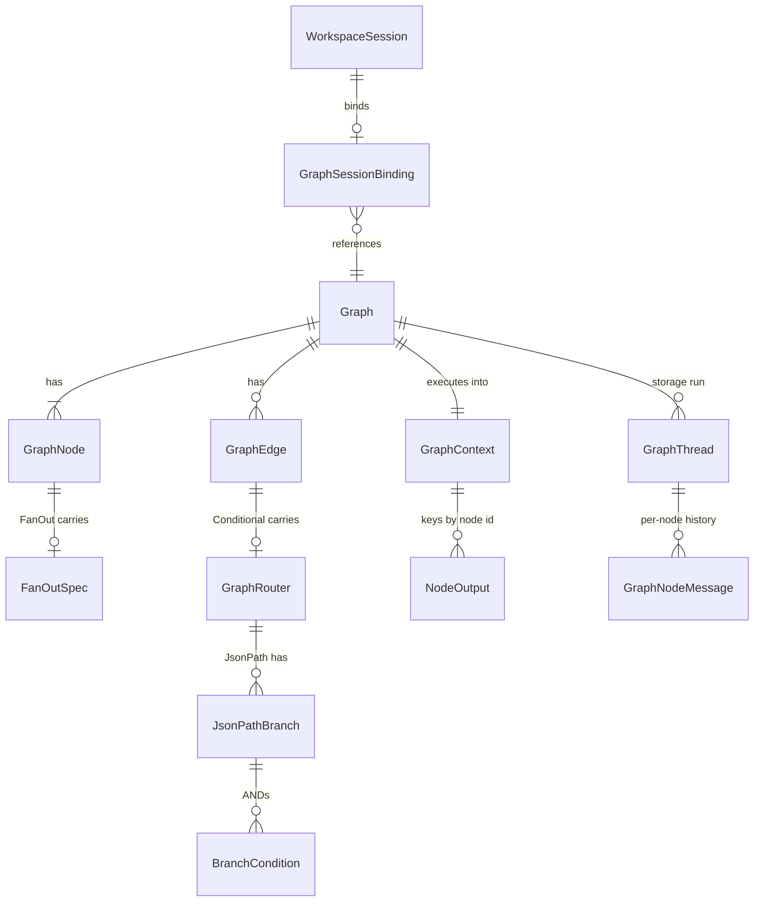
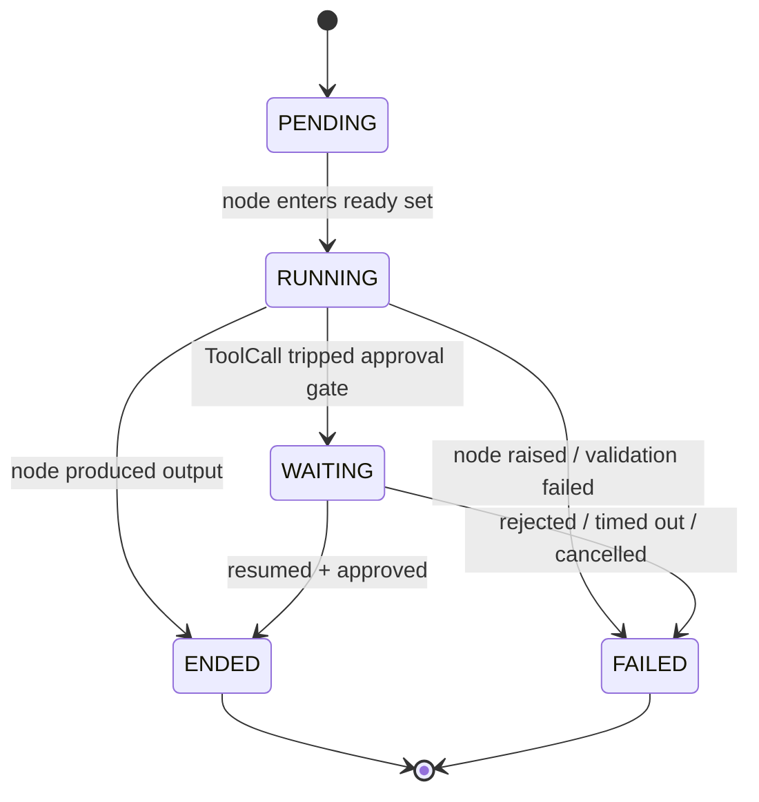

# Graphs

## 1. Purpose

The graphs subsystem runs declarative, directed graphs of agent nodes. A `Graph` is a JSON-serialisable topology of nodes (agents, sub-graphs, pure data-shaping Begin/End nodes, fan-out/fan-in map-reduce nodes, and direct tool-call nodes) connected by static or conditional edges. A Pregel-style executor walks the graph in supersteps: each superstep runs every ready node concurrently, records each node's `NodeOutput` into a shared `GraphContext`, evaluates outgoing edges, recomputes the frontier, and repeats until the ready set drains, a cap is hit, or a failure code terminates the run.

The subsystem ships two concrete executors over one shared base. `GraphExecutor` (`primer/graph/executor.py`) persists a `GraphThread` plus per-node `GraphNodeMessage` rows through `Storage[T]` and is used for standalone, storage-backed runs and tests. `WorkspaceGraphExecutor` (`primer/graph/workspace_executor.py`) persists per-node `messages.jsonl` and `state.json` into the workspace's git-backed `.state/` repo and is the production path: the worker pool builds one for any `WorkspaceSession` bound to a graph via `GraphSessionBinding`. Both share the Pregel loop, Jinja2 input templating, JSON-path and callable routers, structured I/O contracts on Begin/End, the fan-out/fan-in map-reduce machinery, a tool-approval checkpoint/resume protocol, and turn-log emission.

Adjacent surfaces are documented elsewhere and cross-linked here rather than duplicated: how a graph run is created from a session (`docs/dev/subsystems/sessions.md`), the turn-log writer family as a cross-cutting observability concern (`docs/dev/architecture/observability.md`), the worker pool's claim/park integration (`docs/dev/architecture/worker-system.md` and `docs/dev/architecture/claim-machine.md`), the REST endpoint catalogue (`docs/dev/architecture/rest-api.md`), and the graph builder UI (`docs/dev/subsystems/ui-pages.md`).

## 2. Conceptual model

A `Graph` (a `Describeable` subclass) carries a list of `nodes` (a discriminated union of seven node kinds), a list of `edges` (static or conditional), an optional `max_iterations` cap, and an optional `harness_id` marking the row as harness-managed. The entry point is the unique Begin node; there is no separate `entry_node_id` field. At runtime the executor builds a `GraphContext` whose `nodes` dict holds each completed node's `NodeOutput` (or, for fan-out targets, a `list[NodeOutput]`). Templates and routers read from this context.

The seven node kinds are:

- `_BeginNode` (`kind="begin"`): pure data-shaping entry node carrying the graph's input contract (`input_schema`).
- `_EndNode` (`kind="end"`): pure data-shaping sink carrying the graph's output contract (`output_template` + `output_schema`).
- `_AgentNodeRef` (`kind="agent"`): runs a stored `Agent` with an `input_template`, optional `response_format`, designer-only `input_schema`, and an optional `profile_id` overriding the agent's DEFAULT model profile for this node only. The override reaches the executor through `_resolve_node_llm`, which passes the profile to the caller-supplied `llm_resolver` ONLY when the node declares one: the seam is a plain callable and nearly every resolver in the codebase takes a single `agent`, so calling them with two arguments would break every graph that never wanted an override.
- `_GraphNodeRef` (`kind="graph"`): delegates to a sub-graph (recursive composition).
- `_FanOutNode` (`kind="fan_out"`): pure dispatcher; spawns parallel downstream instances per `FanOutSpec`.
- `_FanInNode` (`kind="fan_in"`): wait-for-all aggregator with an `aggregate_template` + optional `output_schema`.
- `_ToolCallNode` (`kind="tool_call"`): invokes a tool by scoped id with `arguments` or an `arguments_template` + optional `output_schema`.

```mermaid
erDiagram
    Graph ||--|{ GraphNode : "has"
    Graph ||--o{ GraphEdge : "has"
    GraphNode ||--o| FanOutSpec : "FanOut carries"
    GraphEdge ||--o| GraphRouter : "Conditional carries"
    GraphRouter ||--o{ JsonPathBranch : "JsonPath has"
    JsonPathBranch ||--o{ BranchCondition : "ANDs"
    Graph ||--|| GraphContext : "executes into"
    GraphContext ||--o{ NodeOutput : "keys by node id"
    Graph ||--o{ GraphThread : "storage run"
    GraphThread ||--o{ GraphNodeMessage : "per-node history"
    WorkspaceSession ||--o| GraphSessionBinding : "binds"
    GraphSessionBinding }o--|| Graph : "references"
```

`GraphContext.initial_input` is typed `Any` so a run can be seeded by a dict / str / list / any JSON-serialisable value (the workspace executor seeds it from `session.metadata['graph_input']`); the Begin node materialises a `NodeOutput` from it. `GraphContext.nodes` is `dict[str, NodeOutput | list[NodeOutput]]`: a fan-out target id holds the aggregator list and individual synthesized instances live at `nodes['target[i]']`.

## 3. Architecture patterns implemented

- **Pregel-style supersteps.** `_BaseGraphExecutor._run_superstep_loop` (`primer/graph/base.py`) computes the ready set, runs every ready node concurrently via `asyncio.create_task` draining a shared `asyncio.Queue`, applies results to `GraphContext`, evaluates outgoing edges through `_compute_next_ready`, increments the iteration, and repeats. The same loop serves acyclic and cyclic graphs; cyclic graphs bound themselves with `max_iterations`.
- **Two executors over one base.** `GraphExecutor` and `WorkspaceGraphExecutor` subclass `_BaseGraphExecutor`, overriding only `_load_node_history`, `_persist_node_turn`, `_save_state`, `_build_sub_executor`, and `_dispatch_toolcall`. This mirrors the `AgentExecutor` / `WorkspaceAgentExecutor` split.
- **Sandboxed Jinja2 templating.** `render_input_template` and `render_template_safely` (`primer/graph/template.py`) render against a module-level `SandboxedEnvironment` with `StrictUndefined` and `autoescape=False`. The input-template path wraps Jinja errors as `BadRequestError`; the `render_template_safely` path propagates the raw `jinja2.TemplateError` so End / FanIn / ToolCall callers can map specific failure codes.
- **Two router kinds, not one ABC.** `_JsonPathRouter` (declarative `BranchCondition` predicates evaluated against the source node's `NodeOutput.parsed`) and `_CallableRouter` (a `callable_id` resolved against a `RouterRegistry`). Graph definitions stay JSON-serialisable; application code registers Python callables. Re-registering a `callable_id` raises `ConfigError` so typos fail loudly (`primer/graph/router.py`).
- **Structured I/O contract on Begin/End.** Begin validates `graph_input` against `input_schema` at session-create time; End renders `output_template` and validates against `output_schema` at runtime, emitting structured output through a `_GraphEndOutputEvent`.
- **Map-reduce via fan-out/fan-in.** `_FanOutNode` synthesizes per-instance ids (`target[i]`), `_FanInNode` waits for every upstream source before firing, and the `on_failure` trichotomy (`fail_fast` / `drain_then_fail` / `collect`) governs partial-failure behaviour.
- **Mid-graph checkpoint/resume for human-in-the-loop.** When a node reaches a human-interaction point, the executor checkpoints its full mid-flight state, parks the session WAITING, and resumes from the checkpoint when the human answers (`snapshot_state` / `restore_state` / `resume_from_checkpoint`). Three triggers park a graph: a `_ToolCallNode` that trips a tool-approval gate, a `_ToolCallNode` whose tool is the value-yielding `system__ask_user`, and an `_AgentNodeRef` whose turn raises `YieldToWorker` from an `ask_user` / approval gate. Multiple nodes in one superstep can park together (multi-event park): the executor accumulates `_pending_toolcalls` and `_pending_agent_yields`, parks on all of them, and re-parks (`_build_pending_park_yield`) until every pending human-interaction node has been answered, so concurrent branches that each need a human do not serialise.
- **Best-effort turn-log emission.** Per-node and graph-level `TurnLogWriter` instances record turn-boundary events; emission is wrapped in `safe_append` so a logging failure never aborts execution.

## 4. Code layout

| Path | Responsibility |
| --- | --- |
| `primer/model/graph.py` | All Pydantic models: `Graph`, the `GraphNode` discriminated union (seven kinds), `FanOutSpec`, `BranchCondition`, `JsonPathBranch`, the `GraphRouter` and `GraphEdge` unions, `NodeOutput`, `GraphContext`, `NodeRuntimeStatus`/`State`, `GraphThread`, `GraphNodeMessage`, and the `Graph._validate_topology` model-validator. |
| `primer/graph/base.py` | `_BaseGraphExecutor`: the Pregel loop, ready-set computation, fan-out resolution, fan-in wait-for-all, conditional-edge evaluation, checkpoint/resume, turn-log hooks, the `_GraphNodeEvent` wrapping, and the internal exception channels. |
| `primer/graph/executor.py` | `GraphExecutor` (storage-backed): `GraphThread` + `GraphNodeMessage` persistence, `open_thread` / `delete_thread` / `list_threads`, cursor-paginated history, optional `tool_dispatcher`, optional `turn_log_storage`. |
| `primer/graph/workspace_executor.py` | `WorkspaceGraphExecutor`: git-backed per-node `messages.jsonl` + `state.json`, workspace agent/tool augmentation, `graph_input` seeding, ToolCall dispatch through the workspace `ToolExecutionManager`. |
| `primer/graph/router.py` | `RouterRegistry`, `_resolve_path`, `evaluate_branch_condition`, `first_matching_branch`. |
| `primer/graph/template.py` | `render_input_template`, `render_template_safely`, the shared `SandboxedEnvironment`. |
| `primer/graph/__init__.py` | Public re-exports for the graph package. |
| `primer/model/turn_log.py` | `TurnLogEvent` union (eight kinds), `TurnLogRecord` storage entity. |
| `primer/model/chat.py` | `_GraphNodeEvent` on the `ExtendedStreamContent` union. |
| `primer/model/workspace_session.py` | `SessionStatus`, `GraphSessionBinding`. |
| `primer/worker/graph_resume.py` | `resume_graph_from_checkpoint` resume adapter for the ToolCall approval flow. |
| `primer/api/routers/compute.py` | `graph_router` CRUD, `/graphs/{id}/status`, graph-level and per-node turn-log readers. |
| `tests/graph/` | Models, templates, routers, end-to-end executor flows, every node kind, branch operators, fan-out modes, checkpoint round-trip, workspace executor, turn-log storage, ToolCall approval/reject/resume, spec-B topology. |

## 5. Data model

`NodeOutput` (`primer/model/graph.py`) carries `text` (the node's last assistant text, or a rendered template), `parsed` (the `json.loads` of `text` when structured output is in play, dict-only), `history` (the node's message list), and `iteration`. Two optional fields, `error` and `ended_detail`, are populated only on the fan-out `collect` path; every other failure mode terminates the graph rather than leaving an error-stamped `NodeOutput` in the context.

`NodeRuntimeStatus` is the per-node state machine. It adds `PENDING` (not yet reached) and `FAILED` (errored out) over the session-level `SessionStatus`; the graph's aggregate status is derived from these.

```mermaid
stateDiagram-v2
    [*] --> PENDING
    PENDING --> RUNNING: node enters ready set
    RUNNING --> ENDED: node produced output
    RUNNING --> FAILED: node raised / validation failed
    RUNNING --> WAITING: ToolCall tripped approval gate
    WAITING --> ENDED: resumed + approved
    WAITING --> FAILED: rejected / timed out / cancelled
    ENDED --> [*]
    FAILED --> [*]
```

`Graph._validate_topology` is a Pydantic `model_validator(mode="after")` enforcing: unique node ids; exactly one Begin; at least one End; Begin has no incoming edges; End nodes have no outgoing edges; every End reachable from Begin via forward BFS (the BFS walks fan-out implicit edges through a separate adjacency map); every static/branch/`default_to` target references an existing node id; a FanOut node has no outgoing edges in `graph.edges` (its targets live on `specs`); FanOut spec targets exist and are neither Begin nor another FanOut; a `map` spec's `source_node_id` exists and is not itself a fan-out target; and a FanIn has at least one incoming edge. Callable-router targets are unknown at validation time, so they are treated conservatively as reaching every non-Begin node for reachability and skipped from incoming-edge tracking.

`BranchCondition` carries `path` (dotted segments with bracket indexing, e.g. `a.b[2].c`), `op` (`eq`/`ne`/`gt`/`gte`/`lt`/`lte`/`in`/`not_in`/`exists`), and `value` (unused for `exists`; a list for `in`/`not_in`). `JsonPathBranch.conditions` is a list of `BranchCondition` ANDed together; an empty list is a catch-all. `evaluate_branch_condition` (`primer/graph/router.py`) implements the missing-path rule: when the path does not resolve, every operator returns `False` (including `ne` and `not_in`); use `exists` to test presence. Non-numeric operands on either side of an ordering operator return `False`; a non-list `value` for `in`/`not_in` returns `False`.

`FanOutSpec` is a self-validating discriminator. `broadcast` requires `target_node_id` + `count`; `tee` requires `target_node_ids`; `map` requires `target_node_id` + `source_node_id` + `source_path`. Each spec carries an `on_failure` mode defaulting to `fail_fast`. Malformed JSON Schemas on any node (`input_schema`, `response_format`, `output_schema`) are rejected at save time via `Draft202012Validator.check_schema`, surfaced as a field-level `ValidationError` (422 on CRUD).

## 6. Lifecycle

A graph run begins when a `WorkspaceSession` is created with a `GraphSessionBinding` and a `graph_input` value (validated against the Begin node's `input_schema` at session-create time and folded onto `session.metadata['graph_input']`; see `docs/dev/subsystems/sessions.md`). The worker pool builds a `WorkspaceGraphExecutor` and calls `invoke`. The Begin node materialises a seed `NodeOutput`; each superstep then runs ready nodes concurrently, streams events, applies results, and recomputes the frontier. When a node reaches a human-interaction point (a tool-approval gate, a value-yielding `ask_user` ToolCall, or an agent node that calls `ask_user`) the run suspends; an operator decision wakes it.

```mermaid
sequenceDiagram
    participant Caller as Session create
    participant Worker as WorkerPool
    participant Exec as WorkspaceGraphExecutor
    participant Loop as _run_superstep_loop
    participant Node as ready node(s)
    participant Op as Operator

    Caller->>Worker: WorkspaceSession + GraphSessionBinding + graph_input
    Worker->>Exec: build executor, invoke(seed)
    Exec->>Loop: seed ready={Begin}
    loop each superstep
        Loop->>Node: run ready nodes concurrently
        Node-->>Loop: stream events + _NodeDone
        Loop->>Loop: apply results, compute next ready
    end
    Note over Loop,Node: ToolCall trips approval gate
    Node-->>Loop: YieldToWorker (suspended sentinel)
    Loop->>Exec: snapshot_state(); save WAITING
    Exec-->>Worker: re-raise YieldToWorker(graph_checkpoint)
    Worker->>Op: park session, fan out approval prompt
    Op-->>Worker: approve / reject
    Worker->>Exec: resume_graph_from_checkpoint(checkpoint, payload)
    Exec->>Loop: restore_state; re-dispatch with bypass_approval; drain
    Loop-->>Worker: graph ENDED (completed / failed)
```

Termination paths: the loop ends `completed` when the ready set drains naturally; every End fires independently when reached (there is no first-End-wins rule). It ends `failed` with a specific `ended_detail` code on a node failure carrying a §5.4 code, a routing failure, a fan-out source-invalid, a `drain_then_fail` upstream failure, a ToolCall output/execution failure, or `max_iterations_exceeded`. Each superstep boundary persists state, so a run is recoverable.

**Tool-wait parks on the graph surface (flag-gated).** With `WorkerConfig.tool_calls_as_claims_enabled` on, an agent node's tool-call batch can raise `ToolWaitPark` from `run_agent_turn` (see `docs/dev/subsystems/agents.md`) instead of executing in-process. The node settles as a suspended `_NodeDone` carrying a pending tool-wait entry (`_PendingToolWait`: the node id, its outstanding task ids, the notifying results already answered inline, `call_ids` (each scoped id mapped to the provider's raw id, the only id the model knows the call by), the in-progress `llm_messages` and the iteration; the park blob also carries `node_tool_call_seq` so a resumed node does not re-mint a scoped id it already used). After the superstep settles, `_build_pending_park_exception` picks the outer exception: any co-pending human gate (tool-approval or agent-node yield) wins and the classic `YieldToWorker` is raised, its `snapshot_state()` carrying the `pending_tool_waits` list along; only a tool-wait-only mix raises `ToolWaitPark`. The checkpoint additionally round-trips the incrementally maintained ready set and the sticky `pending_ended_reason` / `pending_ended_detail` pair (a failure discovered before a park is not lost when the park raises). Per-node `ToolCallTask` rows and `TOOL_CALL` leases are created for these pending entries by `materialize_pending_tool_wait_rows` (`primer/session/persistence.py`), called both from the dispatch park arms and from the re-park path, so a resumed node's second batch is wakeable too.

The wake is per node. Each task id is scoped by the node (`<node>:tool:<turn_seg>:<seq>`; the row, lease and parked-blob ids carry the session in front, `<session_id>/<scoped id>`), the wake key is `tool_wait:<session_id>:<turn_seg>:<node id>`, a pure function of a task id of the batch: the FULL node id (node ids are free-form, so the id is parsed from the right and a node id containing `:` keeps it; nodes `a:b` and `a:c` get two keys) and the turn segment exactly as the id carries it (the turn that materialized the batch, so a carried-over batch keeps its key after the session's turn moves on). A batch whose ids do not parse loses only its own key (ERROR plus `tool_wait_malformed_scoped_id_total`); a pure tool-wait park or re-park left with no key at all is not written and the turn ends failed. A mixed park (a human gate plus tool-wait batches) always has its gate's key, so when EVERY tool-wait batch of one is malformed the park is still written, on the gate key alone (there is no tool_wait key to drop to), and the session ends failed not at the park but at the resume that follows the human's answer, which then has no batch with a parseable key left to re-park on (`_repark_graph_tool_wait_outcome` raises `TurnInvariantError`, and the graph resume coordinator ends the session failed). On the wake, `resume_graph_tool_wait` (`primer/worker/tool_wait_resume_coordinator.py`) checks readiness node by node through `resolve_ready_graph_tool_waits`: a fan-out sibling whose batch is done resumes through `resume_from_checkpoint(resolved_tool_wait=...)` while a sibling whose batch is still outstanding stays parked (a partial wake). A `tool_wait`-keyed wake is filtered out of the approval-reply loop in the graph resume coordinator, so it can never be misread as an operator rejection of a co-pending gate. Subgraph children are built with the flag forced off (`WorkspaceGraphExecutor._build_sub_executor`): a child's `ToolWaitPark` would reach the parent's catch arm with a subgraph node as the dispatching node and deadlock the superstep. The same executor-half gap described in `docs/dev/architecture/claim-machine.md` applies here: nothing runs the queued tasks.

## 7. Persistence

`GraphExecutor` persists a `GraphThread` row (graph-level state: `iteration`, `node_states`, `status`, `ended_reason`, `ended_detail`) and per-node `GraphNodeMessage` rows (each scoped by `node_id`, ordered by `iteration` then `sequence`). History reads are cursor-paginated with `CursorPage.length` capped at 200, looping until `next_cursor` is `None`. `GraphThread.ended_reason` is one of `completed` / `failed` / `cancelled` / `max_iterations_exceeded`; `ended_detail` carries the specific §5.4 failure code.

`WorkspaceGraphExecutor` commits graph state into the workspace's git-backed `.state/` repo via `StateRepo.commit_arbitrary`, one commit per turn, with traceable trailers (`X-Primer-Graph`, `X-Primer-Op`, `X-Primer-Graph-Node`, `X-Primer-Graph-Iteration`, plus status/ended trailers). Per-node histories live at `<state_repo>/graphs/<gsid>/nodes/<node_id>/messages.jsonl`; graph-level state at `<state_repo>/graphs/<gsid>/state.json`; an optional graph-definition snapshot at `<state_root>/graph.json` via `write_graph_binding`. Operators can grep history per graph (`git log --grep='X-Primer-Graph: <gsid>'`) or per node.

Turn logs are observability data, not audit data, and bypass the git pipeline. The workspace executor writes them directly to `<state_root>/turns.jsonl` (graph-level) and `<state_root>/nodes/<nid>/turns.jsonl` (per-node) through `WorkspaceTurnLogWriter`. The storage executor, when given an optional `turn_log_storage`, writes `TurnLogRecord` rows through `StorageTurnLogWriter`. Either way the `TurnLogWriter` is bootstrapped to resume its monotonic `seq` across worker restarts, and per-node writers are cached on `_node_turn_logs` so a node firing across multiple supersteps keeps one seq stream. The graph executors emit `TurnLogStarted` / `TurnLogCompleted` / `TurnLogFailed` per node and `TurnLogSuperstepStarted` / `TurnLogSuperstepEnded` at the graph level; the suspended-sentinel (approval-yield) path defers the terminal event until resume. The writer family itself is documented in `docs/dev/architecture/observability.md`.

Sub-graph runs propagate their parent's turn-log surface: `GraphExecutor` threads `turn_log_storage` into children so nested runs land in the same `TurnLogRecord` table under the sub-thread's `run_id`; the workspace variant uses `<parent_gsid>__<parent_node_id>` as the child's gsid.

## 8. Public surfaces

The graph package re-exports `Graph`, `GraphExecutor`, `WorkspaceGraphExecutor`, `RouterRegistry`, `render_input_template`, `evaluate_branch_condition`, `first_matching_branch`, and the model types from `primer/graph/__init__.py`.

REST endpoints live in `primer/api/routers/compute.py`:

- Standard CRUD under `/v1/graphs` via `make_crud_router` with `cdc_kind='graph'` and `managed_by_field='harness_id'` (rows with a `harness_id` reject direct CRUD mutation with 409).
- `GET /v1/graphs/{id}/status` resolves agent-node and subgraph-node references and returns `{"ok", "issues"}`. Topology validity is enforced by the Pydantic validator at read time, so broken topologies never reach storage. A dangling reference is therefore no longer something deleting an agent or a graph through the API can cause: `DELETE /v1/agents/{id}` and `DELETE /v1/graphs/{id}` (and the system `delete_agent` / `delete_graph` tools) answer 409 `in_use_by` while a graph node, a session that is not ended or a trigger subscription names the row (`primer/storage/references.py`). `/status` still reports a graph that names something that never existed, or whose target was removed behind the API (a harness uninstall, a direct storage edit).
- `GET /v1/graphs/{id}/runs/{run_id}/turn_log` (graph-level superstep events) and `GET /v1/graphs/{id}/runs/{run_id}/nodes/{node_id}/turn_log` (per-node), each accepting `limit` (default 200, max 1000), `offset`, and `since_seq`. The handler dispatches workspace-backed vs storage-backed by checking whether `run_id` resolves to a `WorkspaceSession` with a graph binding or to a `GraphThread`; a missing workspace or file returns an empty page so the UI can still render the tab. Full REST coverage is in `docs/dev/architecture/rest-api.md`.

A run is created through the session-create surface (`docs/dev/subsystems/sessions.md`), not a graph-specific run endpoint. Streaming events are wrapped as `ExtendedEvent(_GraphNodeEvent(node_id, iteration, inner_type, inner_payload))` on the `ExtendedStreamContent` union (`primer/model/chat.py`). The graph builder UI (`ui/components/graphs.jsx`) is covered in `docs/dev/subsystems/ui-pages.md`.

## 9. Internal contracts

`_BaseGraphExecutor` defines four abstract hooks (`_load_node_history`, `_persist_node_turn`, `_save_state`, `_build_sub_executor`) plus an overridable `_dispatch_toolcall` (default raises `NotImplementedError`) and `_dispatch_toolcall_with_bypass` (default falls back to `_dispatch_toolcall`). The storage executor wires `_dispatch_toolcall` to an injected `tool_dispatcher` (introspecting its signature to optionally pass `bypass_approval`); the workspace executor builds a `ToolCallPart` and forwards to a workspace-bound `ToolExecutionManager.execute(call, principal, bypass_approval)`, lazily constructing a workspace-only manager when none was wired.

Node dispatch routes through `_stream_node`, which resolves synthesized fan-out instance ids (`worker[2]`) to their underlying target node and injects `fanout_index` / `fanout_item` into the per-instance Jinja scope via the `extra_scope` argument. Agent nodes run through the shared `run_agent_turn` loop so in-graph tool dispatch is identical to a standalone agent's. A FanOut node produces a bookkeeping `NodeOutput` whose `text` is `json.dumps({"node_id", "specs"})` so downstream conditional edges from a FanOut can still read `nodes.<fanout>.text`.

The executor uses internal exception channels rather than return codes: `_RoutingFailed` (no branch matched and no `default_to`), `_FanoutSourceInvalid` (`map` source path did not resolve to a list), `_GraphToolCallYield` / `YieldToWorker` (approval gate), and `_ToolApprovalRejected` (operator rejected on the resume path). Terminal events are dataclasses `_GraphErrorEvent` (`{code, message, node_id, path}`) and `_GraphEndOutputEvent` (`{text, parsed, end_node_id}`); the session-layer translator (`primer/session/persistence.py`) converts them into `SessionMessageRecord` rows.

The `ended_detail` failure codes the executor emits are: `begin_input_invalid`, `end_output_invalid`, `template_error`, `routing_failed`, `max_iterations_exceeded`, `fanout_source_invalid`, `fanin_upstream_failed`, `tool_output_invalid`, `tool_execution_failed`, and `tool_turn_cap`. All surface as `ended_reason='failed'` with the specific code in `ended_detail`. `tool_execution_failed` is a `tool_call` node whose tool RAISED or RETURNED an error result (`ToolResultPart.error`, e.g. bad arguments, an unavailable tool, a provider error, a value-yielding tool's resume hook returning `is_error`): `_map_toolcall_result` (`primer/graph/_node_refs.py`) judges the result of every path that maps one (live dispatch, the approved re-dispatch on resume, the resume hook) before `output_schema` is looked at, and the tool's own output is the node's error message (so a failed fan-out instance under `on_failure: collect` carries it in `.error` and `tool_execution_failed` in `.ended_detail`); `tool_output_invalid` is only a SUCCESSFUL result that does not conform to the node's `output_schema`. Before 01a10b50 an error result ended the node with the error text as its output and the graph ran on it (a raised exception failed the node, a returned error did not). `tool_turn_cap` is an agent node whose turn stopped at its agent's `max_tool_turns` (01a1095e): `_stream_agent_node` and `_resume_agent_node` pass `capped_out` to `run_agent_turn`, persist the turn (every call of the capped round is already answered, so the node's history stays valid) and then raise `ToolTurnCapReached` (`primer/model/chat.py`), whose `ended_detail_code` the dispatch and the two resume loops of `graph/base.py` read like a `TurnStreamFailure`'s; before this the node ended COMPLETED with the last round's text and the graph carried on with it.

The `on_failure` trichotomy on `FanOutSpec` is the most surprising contract. `fail_fast` (default) propagates the first failure up the normal path and terminates the graph. `drain_then_fail` suppresses the immediate failure, bumps a `_FanoutDrainState.completed_count` for every sibling (success or failure), and once `expected_count` is reached terminates `failed` with `fanin_upstream_failed`. `collect` stamps the failed instance's `NodeOutput.error` / `ended_detail`, appends it to the aggregator list at `nodes[target]`, and lets the graph continue so a downstream FanIn `aggregate_template` author can branch on `n.error`.

`_pending_tool_waits` is the third pending list beside `_pending_toolcalls` and `_pending_agent_yields`; it is serialised into the checkpoint as `pending_tool_waits`. The executor's `_ready_set` (nodes awaiting dispatch or holding an unresolved, possibly parked, turn) is maintained incrementally and round-trips as `ready_set`; `_pending_ended_reason` / `_pending_ended_detail` round-trip as `pending_ended_reason` / `pending_ended_detail`. A checkpoint written before `pending_ended_reason` existed restores with it `None` (no failure discovered yet). A parked agent node's `llm_messages` stamp is its in-progress turn WITHOUT the node's own user message (every resume re-renders `input_template`, with a fan-out instance's `fanout_index` and `fanout_item` in scope exactly as on the first dispatch, and prepends it), so a node that parks any number of times sees its user input once in each prompt and in its persisted history; a stamp written by earlier code that begins with that user input is stripped on resume.

The checkpoint contract: when a node hits a human-interaction point, `_stream_node` records a `_PendingToolCall` (for a ToolCall) or a `_PendingAgentYield` (for an agent node's `ask_user` / approval gate) and posts a suspended `_NodeDone`; after the superstep settles, the loop saves state WAITING, calls `snapshot_state()` (serialising context, ready set, node states, all fan-out bookkeeping, and both pending sets), attaches it onto the `YieldToWorker` as `graph_checkpoint`, and re-raises. The worker persists it onto `ParkedState.graph_checkpoint`. `resume_from_checkpoint` restores state and, given a `resumed_tcid`, resumes only the matching entry: a pending ToolCall re-dispatches with `bypass_approval=True` for an approval gate, or feeds the operator reply back through the tool's resume hook for a value-yielding `ask_user` (`_is_value_yield_toolcall`, no re-dispatch), giving that hook the same `ResumeContext` as the agent-node path: the executor holds neither the session nor the registry, so `resume_graph_from_checkpoint` derives the session id and the registry's toolset resolver from its `session` and `pool` and passes them as `resume_session_id` and `resolve_provider` (the hook may be sync or async, so a python toolset's tool can yield from a tool_call node), and a tool_call node inside an invoked child graph gets the same from the continuation walk, where `GraphFrame.resume_leaf` passes the operator's reply (`toolcall_payload`) and the `InvocationServices` bundle's `session_id` and `resolve_provider` (bound in `build_invocation_services` to the session being resumed and the registry's `get_toolset`) through `resume_invoke_graph`; a pending agent-node yield resumes via `_resume_agent_node` with the operator's `agent_tool_result`, which the worker builds in `graph_agent_tool_result` (`primer/worker/graph_resume_coordinator.py`) by calling the yield's resume hook with the same `ResumeContext` the agent-session resume builds (tool name, tool call id, session id, and the provider registry's toolset resolver; the session id is always the session being resumed, on the GraphFrame leaf path too, where `build_invocation_services` binds it in the closure). Every registered hook takes that context and the registry refuses one that does not; a call without it raises a `TypeError` that the handler turns into a "resume failed" error result, so the call is pinned through the real hooks by `tests/worker/test_graph_agent_tool_result_real_hooks.py`. If other human-interaction nodes remain pending afterwards, the executor re-raises a `YieldToWorker` so the worker re-parks on the remaining keys (drain-until-empty). A rejected/timed-out/cancelled decision raises `_ToolApprovalRejected`, which the resume drain converts into a failed node whose `ended_detail` is `tool_approval_rejected`, `tool_approval_timeout` or `tool_approval_cancelled` (a tool that crashes stays `tool_execution_failed`). A CHILD graph invoked through `workspace_ext__invoke_graph` that ends failed (any `_GraphErrorEvent` on its stream: a refused gate, a crashed tool, a routing error) is an ERROR to the invoking agent, not an empty output: `run_invoke_graph` and `resume_invoke_graph` capture the first terminal error event and raise `ChildGraphFailed` (a re-park still wins over a failure), and the delivery site turns it into `ToolResultPart(error=True)` (`GraphFrame.resume_leaf` and `GraphFrame.resume`) or `ToolCallResult(is_error=True)` (the tool handler on a first run) with one body from `ChildGraphFailed.result_json()`: for a refusal the flat agent-session approval gate's shape `{"rejected": true, "reason", "tool_name"}` (the tool name is the parked entry's `original_call`, `"unknown"` when it recorded none), for anything else `{"error": <code>, "message", "node_id"}`; before this the agent received `{"output": ""}` with `error=False` for every one of those failures (pinned through the real `run_invoke_graph` and the continuation walk by `tests/worker/test_child_graph_failure_delivery.py`). The REST resume surface for these parks (`ask_user/pending`, `ask_user/respond`, `yields/{tcid}/cancel`) consults the `graph_checkpoint`'s `pending_dispatch` / `pending_agent_yields` / `pending_toolcalls` entries (`primer/api/routers/yields.py`); the broader worker/park integration is documented in `docs/dev/architecture/worker-system.md`.

The worker's multi-event drain. A graph park waits on its whole key set (`parked_event_keys`; the initial park, the re-park on the remaining keys and the tool-wait re-parks all write one, and only a nested continuation re-park whose new leaf carries no `event_keys` is still single-event), so every reply, timeout and cancel is accumulated into `parked_state.resume_event_payloads` (dict key: the dispatch key; value: `{"event_key", "payload"}`), and `resume_graph_engine` (`primer/worker/graph_resume_coordinator.py`) drains those entries one by one (its `payloads_map` branch). In order: (1) `tool_wait:` entries are dropped first (the per-cycle readiness re-check resolves those batches); (2) ONE entry is kept per `event_key`: when two entries carry the same `event_key`, the one stored under the raw dispatch key (`_dispatch_key_for(event_key)`) wins whatever the order, which is the leaf an older build wrote beside the duplicate a resend or an echo lands under the percent-encoded key once the durable flip encodes leaf keys (jsonb does not keep key order, so the first entry seen says nothing about age); (3) each kept payload is classified by `classify_marker_payload` (`primer/worker/yield_runtime.py`, the body of the single-event path's `classify_resume_payload`, which delegates to it): a `__yield_timeout__` / `__yield_cancelled__` marker, recognised by the key being present, becomes `YieldTimeout` / `YieldCancelled` with `elapsed_seconds` measured from the session's `parked_at`, and a real reply loses the internal `__yield_*` and `cancelled_at` keys. So a value-yielding tool_call node, an agent node and a nested leaf behind the continuation walk all see a timeout or a cancel as one (`ask_user` returns `timed_out` / `cancelled`, the `_external` hook its `timed_out` / `cancelled` result). Before this, the drain passed the stored marker dict through unchanged, and the hooks that recognise a marker only by `isinstance` (`ask_user`, `_external`) read it as an operator reply with no response; approval gates were never affected, since `classify_approval_payload` reads both shapes. `reply_payloads_equal` (same module) is the one rule for "this stored reply is the same reply as that one": a cancel marker compares by its reason (its `cancelled_at` is stamped when the marker is built), a timeout marker as the bare marker, anything else as it is, through storage's `json_equal` (the typed rule a `where` uses: `True` is not `1`, `1` equals `1.0`). It has no caller yet; the durable flip's no-write rule is its first.

## 10. Testing patterns

Tests live under `tests/graph/`. Model tests round-trip every node kind and exercise topology rules (`test_topology.py`, `test_spec_b_topology.py`, `test_begin_end_node_model.py`, `test_fanout_spec_model.py`). Router and template tests cover every branch operator, the missing-path rule, bracket-index path resolution, first-match-wins, `default_to` fallback, and the fan-out Jinja scope (`test_branch_condition_evaluation.py`, `test_router_path_resolution.py`, `test_first_matching_branch.py`, `test_template_fanout_scope.py`). End-to-end executor tests drive Begin/End firing across str/list/dict seeds, End output validation, routing failure, max-iterations, and the full fan-out broadcast/tee/map plus `fail_fast`/`drain_then_fail`/`collect` modes (`test_begin_firing.py`, `test_executor_end_termination.py`, `test_routing_failed.py`, `test_max_iterations.py`, `test_fanout_broadcast_e2e.py`, `test_fanout_drain_then_fail.py`, `test_fanout_collect.py`, `test_multi_end_independent.py`). ToolCall tests cover argument resolution, dispatch, result mapping, and the approval/reject/resume round-trip (`test_toolcall_arg_resolution.py`, `test_toolcall_approval_reject.py`, `test_graph_checkpoint_roundtrip.py`). Workspace and storage variants are covered by `test_workspace_executor_graph_input.py`, `test_workspace_turn_log.py`, and `test_storage_turn_log.py`. REST coverage is in `tests/api/test_graphs.py`, `tests/api/test_turn_log_routes.py`, and `tests/api/test_tools_endpoint.py`; the worker resume path in `tests/worker/test_pool_graph_resume.py`; the multi-event drain's typed markers and its one-reply-per-`event_key` rule in `tests/worker/test_graph_resume_typed_markers.py` (through the real coordinator, continuation walk, re-park builder, claim adapter and durable flip), and `reply_payloads_equal` / `classify_marker_payload` in `tests/worker/test_yield_runtime_reply_payloads.py`. The flag-gated tool-wait path is covered by `tests/graph/test_tool_wait_graph_park.py` (partial wakes, no re-execution of completed or failed siblings, cyclic loop-backs across several partial resumes, and a failure verdict that survives a park), `test_tool_wait_llm_messages_stamp.py`, `test_agent_node_claims_resolver_wiring.py`, `test_graph_checkpoint_roundtrip.py` (the 01a0812c checkpoint fields) and `test_workspace_executor.py` (the subgraph flag scope cut), plus `tests/worker/test_resume_graph_tool_wait.py`, `test_resolve_ready_graph_tool_waits.py`, `test_repark_graph_tool_wait_outcome.py`, `test_resume_claims_seam_e2e.py` and `tests/session/test_dispatch_park_arms_e2e.py`.

## 11. Historical decisions

- **Pregel-style supersteps were chosen over fully-explicit DAG scheduling.** Why: one loop serves cyclic and acyclic graphs, runs all ready nodes concurrently, recomputes the frontier from edge outputs, and pauses/resumes between supersteps for free. Spec: docs/superpowers/specs/2026-05-03-agent-graph-design.md.
- **Two concrete executors sat on a shared `_BaseGraphExecutor` instead of one polymorphic class.** Why: it mirrors the AgentExecutor / WorkspaceAgentExecutor split, letting the storage variant persist rows and the workspace variant git-commit each turn while subclasses override only history, persistence, and sub-executor construction. Spec: docs/superpowers/specs/2026-05-03-agent-graph-design.md.
- **Jinja2 templates rendered against a sandboxed environment with StrictUndefined, not a bespoke DSL.** Why: every node carries a template, so reusing Jinja2 avoided the maintenance cost of a mini-language while SandboxedEnvironment blocked dunder access and StrictUndefined surfaced typos immediately. Spec: docs/superpowers/specs/2026-05-03-agent-graph-design.md.
- **`Graph.entry_node_id` was replaced by an "exactly one Begin node" topology rule.** Why: treating the entry as a node-kind collapsed the input contract and the entry point into one canvas-visible object the executor finds deterministically. Spec: docs/superpowers/specs/2026-05-31-agent-graphs-spec-a-builder-completeness-design.md.
- **`_TerminalNode` was replaced by `_EndNode` carrying `output_template` + `output_schema`.** Why: it gives the graph an explicit output contract mirroring Begin's input contract, rendered through the existing sandbox and validated against a schema. Spec: docs/superpowers/specs/2026-05-31-agent-graphs-spec-a-builder-completeness-design.md.
- **The flat-dict `when` router was replaced by `BranchCondition` with explicit `op` + `path` + `value`.** Why: a flat dict only expressed AND-of-equalities, but users needed `ne`/`gt`/`in`/`exists`, and the structured form stays JSON-serialisable and UI-editable. Spec: docs/superpowers/specs/2026-05-31-agent-graphs-spec-a-builder-completeness-design.md.
- **Branch evaluation treats a missing path as `False` for every operator, including `ne` and `not_in`.** Why: it avoids the confusing "missing == not-equal" trap and reserves `exists` as the single presence test. Spec: docs/superpowers/specs/2026-05-31-agent-graphs-spec-a-builder-completeness-design.md.
- **Graph failure codes surface through `ended_detail` rather than new `ended_reason` literals.** Why: the existing `ended_reason` set stayed stable for the rest of the session machinery while graphs added specific codes without rippling literal unions through downstream consumers. Spec: docs/superpowers/specs/2026-05-31-agent-graphs-spec-a-builder-completeness-design.md.
- **`graph_input` flows through `session.metadata['graph_input']` and is validated at session-create time, not first turn.** Why: a 422 carrying jsonschema's `absolute_path` tells the caller exactly which field is wrong before the session ever reaches RUNNING, and it avoids inventing a new persistence column. Spec: docs/superpowers/specs/2026-05-31-agent-graphs-spec-a-builder-completeness-design.md.
- **Spec A's first-End-wins / lex-smallest tie-break rule was reversed to multi-End independent termination.** Why: fan-out branches that each terminate at their own End would otherwise race, with the first End short-circuiting and cancelling the rest; every End now fires independently and the loop terminates only when the ready set drains. Spec: docs/superpowers/specs/2026-05-31-agent-graphs-spec-b-mapreduce-toolcall-design.md.
- **FanOut implicit edges live on `node.specs`, not in `graph.edges`.** Why: per-instance dispatch wiring is dispatch information, not topology, so keeping it inline on the node makes the `FanOutSpec` discriminator self-validating and validation rejects any `graph.edge` from a FanOut. Spec: docs/superpowers/specs/2026-05-31-agent-graphs-spec-b-mapreduce-toolcall-design.md.
- **ToolCall arguments default to per-leaf Jinja rendering with `arguments_template` as the escape hatch.** Why: the structured key/value editor is the ergonomic default, and `arguments_template` is reserved for callers needing dynamic argument structure such as variable-length lists. Spec: docs/superpowers/specs/2026-05-31-agent-graphs-spec-b-mapreduce-toolcall-design.md.
- **The mid-graph checkpoint is stored on the `YieldToWorker` exception, not a side-channel.** Why: attaching `snapshot_state()` directly onto the yield keeps the agent-yield and graph-yield resume contracts symmetric and avoids a separate persistence call between the snapshot and the park. Spec: docs/superpowers/specs/2026-05-31-agent-graphs-spec-b-mapreduce-toolcall-design.md.
- **Graph + yield interaction shipped narrowly as an approval-only park, then broadened to full human-in-the-loop.** Why: the executor's per-node state commit and superstep loop first needed a resume entry point, so the initial code shipped `ParkedState.graph_checkpoint` plus a resume path covering only the tool-approval gate. It was since extended to the rest of the human-interaction surface: value-yielding `ask_user` ToolCall nodes (feed the operator reply back through the tool's resume hook instead of re-dispatching) and agent-node `ask_user` / approval yields, with multi-event park (`_pending_toolcalls` + `_pending_agent_yields`, re-park-until-drained) for concurrent branches, all answerable over the channel relay and the `ask_user/pending` + `ask_user/respond` REST endpoints. Spec: docs/superpowers/specs/2026-05-22-yielding-tools-design.md.
- **Workspace graph turn logs bypass the git-backed commit pipeline and write directly to the filesystem.** Why: turn logs are high-write-rate observability data with no audit-trail value, so routing them through one commit per turn boundary would balloon the commit graph for no operator benefit. Spec: docs/superpowers/specs/2026-06-05-per-session-turn-log-design.md.
- **Per-node turn-log writers are cached on the executor and bootstrap their seq from the existing file.** Why: a node firing across multiple supersteps must share one writer to keep its `seq` stream monotonic, and reading the file once on first append makes the stream survive worker restarts without breaking `since_seq` pagination. Spec: docs/superpowers/specs/2026-06-05-per-session-turn-log-design.md.
- **Sub-graph runs inherit the parent's turn-log storage so nested timelines stay in one table.** Why: without threading `turn_log_storage` into children, subgraphs would emit silently and operators would see a partial timeline. Spec: docs/superpowers/specs/2026-06-05-per-session-turn-log-design.md.
- **A tool-wait park raises the classic `YieldToWorker` whenever a human gate is co-pending, and `ToolWaitPark` only for a tool-wait-only superstep.** Why: the classic park path already snapshots the executor and resumes through the shared graph resume driver, and its `snapshot_state()` carries `pending_tool_waits`, so a mixed superstep loses nothing; the tool-wait half is handled by the readiness re-check once the gate resolves, rather than by a second park type the pool would have to arbitrate between. Spec: docs/superpowers/2026-08-29-phase3-execution-topology-design.md.
- **The resume ready set is one incrementally maintained set (`_ready_set`: add on admission, discard on settle), after four point patches to a read-time expression each regressed.** Why: patching "ready minus an accumulating exclusion set" at resume time re-executed completed siblings, then dropped loop-back successors, then swallowed a failed sibling's failure; a single set with no second accumulating set cannot go stale relative to itself, and a failure discovered before a park is persisted in the checkpoint instead of living in a local that the park's exception unwinds. Spec: docs/superpowers/2026-09-08-7a-gate-verdict.md.
- **Subgraph children never get `tool_calls_as_claims_enabled`.** Why: the child's `ToolWaitPark` propagates into the parent's catch arm, where the dispatching node is a subgraph reference and a "structurally impossible" check raises from inside the except block, killing the node task before its completion sentinel and blocking the superstep consumer forever; real subgraph support needs the parent to recognise a re-raised child park, and is a follow-up. Spec: docs/superpowers/2026-09-08-7a-gate-verdict.md.

## Cross-reference: external tools

Agent-node calls to invoker-supplied tools park through
`pending_agent_yields` under the `_external` marker and resolve
individually via the steer endpoint's `tool_results`, riding the generic
value-yield resume path. See [external-tools](external-tools.md).
