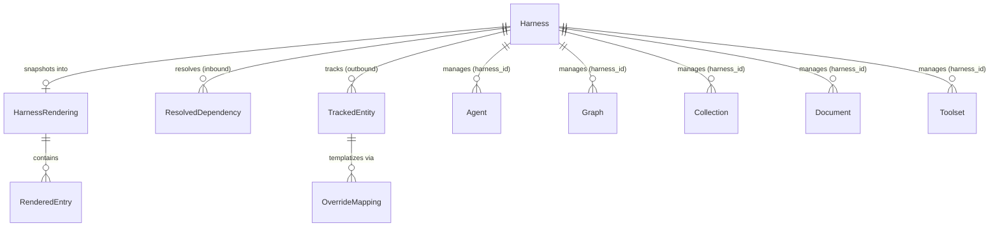
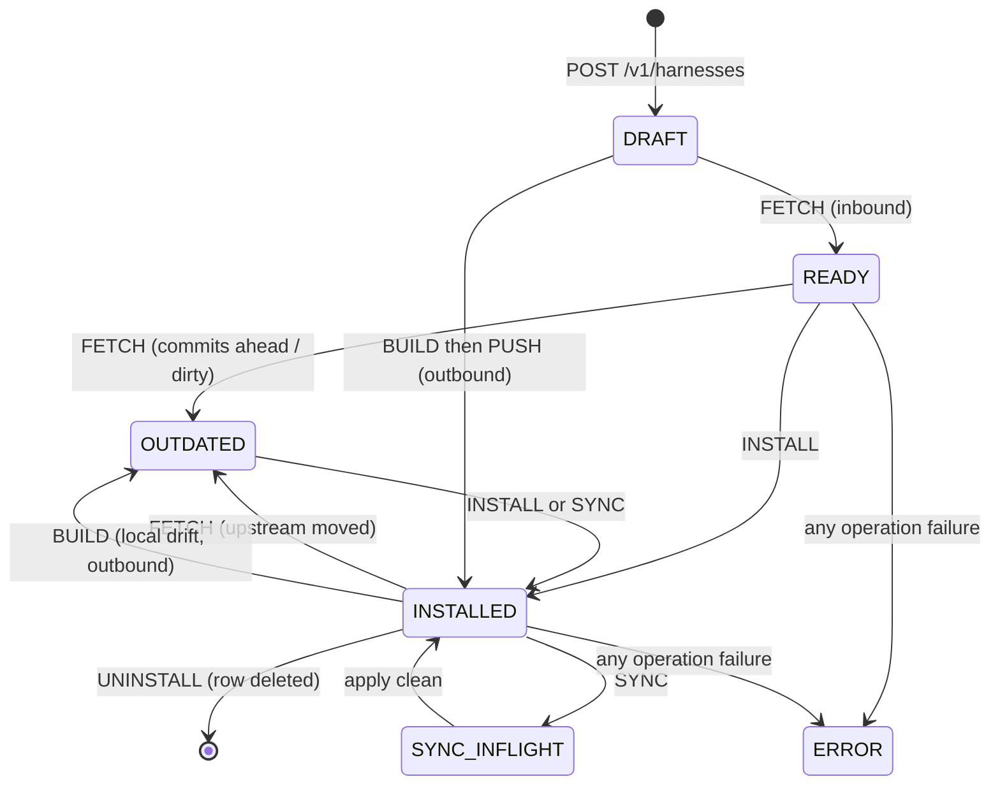
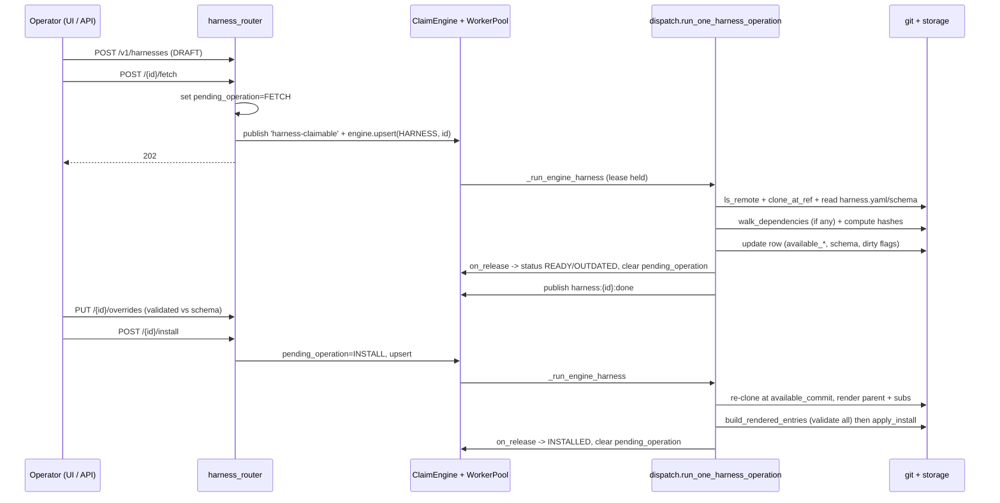

# Harness

## 1. Purpose

The harness subsystem is "Helm for Primer": a git-backed, Jinja2-templated bundle of Primer entities (Agents, Graphs, Collections, Documents, Toolsets) that an operator can install into a deployment with one click and uninstall just as cleanly. An operator registers a harness by pasting a git URL plus an optional ref, subpath, and per-repo token; a worker fetches `harness.yaml` and `overrides.schema.json`, the operator fills out the overrides form, and a single install renders every entity (each id auto-prefixed with the harness slug) into storage with a `harness_id` back-pointer that locks the row against direct edits.

The subsystem has two directions on one shared row. An inbound harness pulls a remote bundle into local storage (FETCH / INSTALL / SYNC / UNINSTALL). An outbound harness does the reverse: it points at live local entities, templatizes selected fields into overrides, and pushes a renderable bundle back to a git remote (BUILD / PUSH). Inbound harnesses additionally support transitive subharness dependencies: a parent `harness.yaml` may declare a `dependencies` list of git references that are walked, deduplicated, and rendered into the same parent-owned bundle.

The provider-agnostic core lives in `primer/harness/` (`dispatch.py`, `service.py`, `git.py`, `template.py`, `templatize.py`, `outbound.py`, `dependencies.py`, `diff.py`, `hashes.py`). The persisted models live in `primer/model/harness.py`. Worker execution is owned by the unified `ClaimEngine` via `primer/claim/adapters/harnesses.py`; the worker pool dispatches a claimed lease into `run_one_harness_operation`. The REST surface is `primer/api/routers/harness.py`; the in-session toolset is `primer/toolset/harness.py`. This document covers the harness machinery; the claim engine itself is documented in the claim-machine architecture doc and is cross-referenced rather than restated.

## 2. Conceptual model

A `Harness` row is the single unit of state for both directions, discriminated by its `direction` field (`INBOUND` default, `OUTBOUND`). The row carries git coordinates (`git_url`, `ref`, `subpath`, `git_token`), the operator's `overrides` plus the cached `overrides_schema`, a set of content hashes used for drift detection, a `status`, and a `pending_operation` that is the sole signal the claim engine watches.

A `HarnessRendering` is the persisted snapshot of the last applied bundle: a list of `RenderedEntry` rows keyed by `(kind, template_name)`. It is the diff baseline for inbound SYNC and the per-row drift baseline the outbound UI reads. Each managed entity (`Agent`, `Graph`, `Collection`, `Document`, `Toolset`) carries a nullable `harness_id` back-pointer.

For inbound subharnesses, a `DependencyRef` is one declared dependency in a parent `harness.yaml`; a `ResolvedDependency` is the node the transitive walk produces, carrying the resolved slug, commit, bundle hash, depth, and `parent_name`. For outbound harnesses, a `TrackedEntity` names one live local entity plus a list of `OverrideMapping` rows; each mapping marks a JSON-pointer `field_path` on that entity to replace with a `{{ overrides.<override_path> }}` token at build time.

The identity rule is `resolved_id(slug, template_name) = f"{slug}__{template_name}"` (`primer/harness/service.py`). The slug regex is `[a-z][a-z0-9-]{1,63}` with an explicit rejection of `__` (the resolved-id separator). For subharnesses, identity is bundled helm-style: a sub has no separate `Harness` row, its templates render under the sub's own slug (so a sub's `docs__guide` does not become `parent__guide`), but every entity that lands in storage is stamped with the parent's `harness_id` so one uninstall removes the whole subtree.

## 3. Architecture patterns implemented

- **One row, one table, one router for both directions.** `HarnessDirection` is the only branching axis; inbound and outbound share the status enum, claim adapter, worker dispatch, storage migrations, and REST router. A direction guard at the top of `run_one_harness_operation` rejects outbound operations on inbound rows and vice versa with a structured `direction_mismatch` error before any work begins.
- **`pending_operation` is the claim trigger.** `HarnessClaimAdapter.eligibility_sql` returns `e.data->>'pending_operation' IS NOT NULL`. Setting `pending_operation` on the row (by the REST router or the toolset) is what makes a harness claimable; clearing it on release is what makes it idle again. There is no harness-specific scheduler protocol.
- **Build-before-apply atomicity.** `service.build_rendered_entries` renders, cross-reference-rewrites, and Pydantic-validates every entity payload before any storage write, collecting all errors into a `build_errors` payload; a single failure aborts the whole install so a partial, half-locked bundle is never left behind.
- **Ordered apply / reverse uninstall.** `apply_install` writes in dependency order toolset to collection to document to agent to graph; `apply_uninstall` walks the reverse. `apply_sync` deletes in reverse order then creates in forward order.
- **Content-hash drift detection.** Every input is reduced to a SHA-256 hex over a canonicalised form (`primer/harness/hashes.py`). `available_bundle_hash` (last fetched) and `bundle_hash` (last applied) are separate persisted fields so the UI can show OUTDATED and the sync fast path can skip when both halves are stable.
- **Token redaction at every error surface.** `primer/harness/git.py::_redact` strips both the injected `oauth2:<token>@` prefix and any literal token before any `HarnessGitError` is raised, and `dispatch._safe_error_message` passes any third-party exception text through the same redactor before it reaches `last_operation_error`.
- **Async-purity offloading.** The filesystem walk (`_collect_bundle_files`), YAML and JSON parses, and the Jinja2 render (`render_template`) are wrapped in `asyncio.to_thread`; the git client uses `asyncio.create_subprocess_exec`. CPU and blocking IO never run on the event loop.
- **Sandboxed templating.** `primer/harness/template.py` renders with `jinja2.sandbox.SandboxedEnvironment` plus `StrictUndefined`, exposing only `overrides` and the harness context (`slug`, `name`, `description`) to templates.

## 4. Code layout

| Path | Responsibility |
| --- | --- |
| `primer/model/harness.py` | All harness models: `HarnessStatus`, `HarnessDirection`, `HarnessOperation`, `Harness`, `HarnessRendering`, `RenderedEntry`, `DependencyRef`, `ResolvedDependency`, `TrackedEntity`, `OverrideMapping`. |
| `primer/harness/dispatch.py` | Worker-side `run_one_harness_operation`; the `_do_fetch` / `_do_install` / `_do_sync` / `_do_uninstall` / `_do_build` / `_do_push` branches; subharness render helpers; the no-op `sweep_harnesses` shim. |
| `primer/harness/service.py` | `resolved_id`; cross-reference rewrite map keyed by `(kind, template_name, source_slug)`; Pydantic validation; `apply_install` / `apply_sync` / `apply_uninstall`; `build_rendered_entries`. |
| `primer/harness/git.py` | Thin async git wrapper: `ls_remote`, `clone_at_ref`, `fetch_harness_metadata`, `push_bundle`; `HarnessGitError`; `_inject_token` / `_redact`. |
| `primer/harness/template.py` | `RenderedFile`; sandboxed `render_template` / `render_bundle`; `compose_overrides_schema` / `slice_overrides_for_dep` for subharnesses. |
| `primer/harness/templatize.py` | Outbound point-to-templatize core: JSON-pointer resolve/set, `apply_override_mappings`, `infer_schema_fragment`, `compose_overrides_schema_from_mappings`. |
| `primer/harness/outbound.py` | `build_outbound`: walk tracked entities, strip system fields, substitute override tokens, emit `templates/*.yaml` + `harness.yaml` + `overrides.schema.json`, compute `bundle_hash`; `OutboundBuildError`. |
| `primer/harness/dependencies.py` | `canonical_key`; `walk_dependencies` post-order DFS with cycle and version-conflict detection; `DependencyCycleError`, `DependencyVersionConflictError`. |
| `primer/harness/diff.py` | 3-way `diff_renderings` keyed by `(kind, template_name)`. |
| `primer/harness/hashes.py` | Canonical SHA-256 helpers: `hash_bundle`, `hash_overrides`, `hash_schema`, `hash_template_source`, `hash_rendered_payload`. |
| `primer/claim/adapters/harnesses.py` | `HarnessClaimAdapter`: `eligibility_sql` + `on_release` (clears `pending_operation`, sets READY or ERROR). |
| `primer/worker/pool.py` | The unified `_claim_loop` dispatch table maps `ClaimKind.HARNESS` to `_run_engine_harness`, which builds `HarnessDispatchDeps` and calls `run_one_harness_operation`. |
| `primer/api/routers/harness.py` | REST router at `/v1/harnesses`. |
| `primer/api/routers/_crud.py` | `make_crud_router(managed_by_field='harness_id')`: the CRUD-level lock for managed entities. |
| `primer/toolset/harness.py` | `harness` internal toolset (9 tools mirroring the REST API). |
| `primer/bus/scheduler_tasks.py` | `HarnessSweeper` (leader-elected, now a no-op). |
| `ui/components/harnesses.jsx`, `harness_form.jsx`, `harness_outbound_builder.jsx` | List + detail + registration wizard, JSON-Schema form renderer, outbound entity-picker wizard. |
| `tests/distributed/cluster.py` | `TestCluster` multi-process harness used by the distributed-mode scenarios. |

## 5. Data model

`Harness` (`primer/model/harness.py`) is an `Identifiable` whose fields fall into groups: git coordinates (`git_url`, `git_token`, `subpath`, `ref`), overrides (`overrides`, `overrides_schema`, `overrides_hash`, `schema_hash`), inbound resolution (`resolved_commit`, `available_commit`, `bundle_hash`, `available_bundle_hash`, `dependencies_resolved`), drift flags (`commits_ahead`, `overrides_dirty`, `schema_missing_input`), operation state (`status`, `pending_operation`, `last_operation_at`, `last_operation_error`), and outbound state (`direction`, `tracked_entities`, `last_pushed_commit`, `last_pushed_bundle_hash`, `last_pushed_at`).

`HarnessStatus` has five values: `DRAFT`, `READY`, `INSTALLED`, `OUTDATED`, `ERROR`. The outbound flow deliberately reuses `INSTALLED` to mean "in sync with remote" and `OUTDATED` to mean "drifted" rather than adding new states, so the claim machine is identical for both directions. The status transitions are driven by the worker operations:

Inbound next-status is computed in `_do_fetch`: from `DRAFT` it becomes `READY`; if `commits_ahead`, `overrides_dirty`, or `schema_missing_input` is set it becomes `OUTDATED`; otherwise `INSTALLED`. Outbound `_do_build` next-status is `DRAFT` until the first push, `INSTALLED` when the freshly built `bundle_hash` equals `last_pushed_bundle_hash`, else `OUTDATED`. On any operation failure the claim release sets `ERROR` with the JSON-encoded `last_operation_error`.

`RenderedEntry` carries `kind`, `template_name`, `resolved_id`, two source hashes (`template_source_hash`, `rendered_hash`), the `rendered_payload`, plus `source_dependency` (the dep-name path for sub-contributed entries, `None` for the parent) and `source_entity_id` (the originating local entity id for outbound entries, `None` for inbound). `HarnessRendering` is stored with `id == harness_id` so there is exactly one snapshot per harness.

## 6. Lifecycle

The inbound register to install flow crosses three actors: the REST router (or toolset), the claim engine plus worker pool, and the `dispatch` module that does the git and storage work.

Each enqueue endpoint writes `pending_operation`, publishes `harness-claimable` to the event bus (retained for backwards compatibility), and calls `engine.upsert(ClaimKind.HARNESS, id, priority=10)` (the authoritative wakeup for the unified claim loop). `run_one_harness_operation` re-reads the row, runs the direction guard, branches on the operation, and on completion the claim engine's `on_release` clears `pending_operation` and sets the terminal status. UNINSTALL is the exception: `_do_uninstall` deletes every managed entity (reverse order), the `HarnessRendering`, and finally the `Harness` row itself, so there is no release call; it just publishes `harness:{id}:done`.

The outbound flow mirrors this with BUILD and PUSH. `_do_build` calls `build_outbound` to render tracked entities into templates, stamps `bundle_hash` / `overrides_schema` / `schema_hash`, and persists a per-entity `HarnessRendering` snapshot so the UI can flag drift. `_do_push` re-builds and then calls `git.push_bundle` with `expected_remote_sha = last_pushed_commit` for optimistic concurrency; on success it stamps `last_pushed_commit` / `last_pushed_bundle_hash` / `last_pushed_at` and resolves to `INSTALLED`.

## 7. Persistence

Three model classes persist through the storage abstraction: `Harness` (one row per harness), `HarnessRendering` (one row per harness, `id == harness_id`), and the five managed entity kinds, each of which gains a nullable `harness_id` column. There is no harness-specific lease table; claim state (`claimed_by`, `claimed_at`, `last_heartbeat_at`) lives on the shared lease row owned by the `ClaimEngine`, not on the `Harness` row.

Drift state is carried entirely in persisted hash fields rather than a background poll. For inbound, `available_bundle_hash` (composite over the parent bundle plus each dependency's `bundle_hash` in canonical-key order) and `bundle_hash` (last applied) are compared to detect OUTDATED; the SYNC fast path skips all work when `available_bundle_hash == bundle_hash` and the overrides hash matches the stored rendering. For outbound, `bundle_hash` versus `last_pushed_bundle_hash` is the drift signal, and the `HarnessRendering.entries` (each carrying `source_entity_id`) are the only persisted per-row drift baseline the UI reads.

Managed-entity CRUD locking is enforced at the storage seam through `make_crud_router(managed_by_field='harness_id')` (`primer/api/routers/_crud.py`), wired into the knowledge, compute, and providers routers. When set, it auto-rejects POST bodies that try to set `harness_id` and returns 409 on PUT/DELETE against any row whose `harness_id` is non-null, so a managed entity can only be changed by re-running the harness. Outbound harnesses deliberately never stamp `harness_id` on their tracked entities, so those stay user-owned and mutable; drift detection is the contract there instead of a CRUD lock.

## 8. Public surfaces

The REST router (`primer/api/routers/harness.py`) is mounted at `/v1/harnesses`:

- `POST /v1/harnesses` creates a DRAFT row. Accepts `direction` and `tracked_entities`, rejecting `tracked_entities_on_inbound` (422) when tracked entities are supplied on an inbound row and `outbound_template_name_collision` (422) on duplicate template names. Slug uniqueness is enforced (409).
- `GET /v1/harnesses` lists with `?slug`, `?status`, and `?direction` filters.
- `GET /v1/harnesses/{id}` returns the serialised row (including `dependencies_resolved`); 404 on miss.
- `PUT /v1/harnesses/{id}` updates `name` / `description` / `ref` / `subpath` / `git_token`; changing `ref` or `subpath` sets `overrides_dirty`.
- `DELETE /v1/harnesses/{id}` enqueues UNINSTALL (202).
- `PUT /v1/harnesses/{id}/overrides` validates the body against the cached composite schema (422 `overrides_invalid` / `overrides_schema_missing`) and recomputes `overrides_dirty` against the stored rendering.
- `POST /v1/harnesses/{id}/fetch` / `/install` / `/sync` enqueue inbound operations (202); 409 `direction_mismatch` on outbound rows, 409 on an in-flight `pending_operation`, 422 on missing schema or unfetched bundle.
- `PUT /v1/harnesses/{id}/tracked_entities` (outbound only) atomically replaces `tracked_entities`, clears `bundle_hash`, and resets status to DRAFT.
- `POST /v1/harnesses/{id}/build` / `/push` enqueue outbound operations (202); 409 `direction_mismatch` on inbound rows, 409 `operation_in_flight`, 422 `outbound_no_entities`.

The `harness` internal toolset (`primer/toolset/harness.py`) exposes nine tools mirroring the inbound REST API without the HTTP layer: `harness__list`, `harness__get`, `harness__register`, `harness__update`, `harness__update_overrides`, `harness__fetch`, `harness__install`, `harness__sync`, `harness__uninstall`. It is built in the app lifespan and registered on the `ProviderRegistry`; each enqueue tool publishes `harness-claimable` exactly as the router does.

The operator UI surfaces are the harness list/detail page with a two-step registration wizard (`harnesses.jsx`), the JSON-Schema form renderer (`harness_form.jsx`, supporting `x-primer-widget` picker widgets and nested subharness dependency cards), and the four-step outbound builder wizard (`harness_outbound_builder.jsx`).

Historical decisions:

- **The harness-specific Scheduler protocol was dropped in favour of the unified `ClaimEngine`.** Why: the cluster-2 generalisation collapsed claim, lease, and heartbeat into one per-kind `ClaimAdapter`, so a parallel scheduler path would have been redundant. Spec: docs/superpowers/specs/2026-05-27-harness-design.md.
- **Managed-entity locking moved from hand-rolled per-router guards to a single `managed_by_field='harness_id'` parameter on `make_crud_router`.** Why: the cluster-7 CRUD-factory work made the lock a first-class concept that auto-wires both the POST-reject and the PUT/DELETE 409, so it is impossible to forget on a new router. Spec: docs/superpowers/specs/2026-05-27-harness-design.md.
- **Swagger and the REST surface were the original ship target; WebSocket tick streaming was deferred to polling.** Why: the spec marked `WS /v1/harnesses/{id}/ws` optional in v1, and the dispatch only publishes a single `harness:{id}:done` event per operation rather than progress ticks. Spec: docs/superpowers/specs/2026-05-27-harness-design.md.

## 9. Internal contracts

- **Fetcher signature for the dependency walk.** `walk_dependencies` takes `parent_deps: list[dict]` and an injected `async fetcher(url, ref, subpath, token) -> (slug, child_deps, bundle_hash, resolved_commit)` so the walker stays pure modulo IO and tests can avoid git. `dispatch._do_fetch` provides a closure wrapping `git.fetch_harness_metadata` that side-channels each sub's `overrides.schema.json` into a `schemas_by_key` dict and records the current fetch target so a failure can name which dependency broke.
- **Canonical key is the sole identity primitive for dependencies.** `canonical_key(url, ref, subpath)` lowercases the host, strips a trailing `.git` and the scheme, and posix-normalises the subpath; it drives dedup, cycle detection, and the deterministic ordering of the composite `available_bundle_hash`. Two different refs of the same sub slug are intentionally not canonical-equal, so a divergent-ref diamond surfaces as `DependencyVersionConflictError`.
- **Composite schema and overrides slicing.** `compose_overrides_schema` mounts each direct sub's schema under `properties.dependencies.properties.<name>`. `render_bundle` is single-level; `dispatch._slice_overrides_along_path` walks the `ResolvedDependency.parent_name` chain to slice the operator's overrides per nesting level before calling `render_bundle`, so the renderer never needs dep-tree topology.
- **Cross-reference rewrite map keyed by `(kind, template_name, source_slug)`.** `service._build_rewrite_map` uses a three-element key so a parent and N subs can declare overlapping `template_name`s without collision; `_lookup_resolved` falls back to the lexicographically-first slug for parent-to-sub cross references so resolution is deterministic.
- **`harness_id` is stamped last when reconstructing an entity.** `service._entity_from_entry` orders `{"id": ..., **rendered_payload, "harness_id": harness_id}` so a template carrying a `harness_id` in its payload can never override the dispatch's own value.
- **Cross-harness id collision returns `apply_id_conflict`.** `apply_install` catches `ConflictError`, inspects the existing row's `harness_id`, and if it belongs to another harness rolls back every row written in the attempt and returns `apply_id_conflict` with `conflicting_id` and `existing_harness_id`.
- **Structured `last_operation_error` codes.** Errors are JSON-encoded `{code, message, ...}`. Inbound codes include `harness_yaml_missing`, `harness_yaml_invalid`, `dependency_cycle`, `dependency_version_conflict`, `dependency_fetch_failed`, `dependency_yaml_invalid`, `overrides_invalid`, `fetch_required`, `bundle_hash_mismatch`, `template_render_failed`, `build_errors`, `apply_id_conflict`, `install_failed`, `sync_failed`, `direction_mismatch`, `dispatch_unhandled`. Outbound codes include `outbound_no_entities`, `outbound_entity_missing`, `outbound_entity_managed`, `outbound_field_path_invalid`, `outbound_template_name_collision`, `push_remote_diverged`, `git_push_failed`, `build_failed`. Git-layer codes from `HarnessGitError` are `auth_failed`, `ref_not_found`, `clone_failed`, `subprocess_error`, plus the prefixed `git_*` variants `clone_at_ref` emits.
- **The `harness` toolset cannot ship internal toolsets.** A `kind: toolset` template must declare `provider=mcp` with a full `McpConfig`; internal toolsets are code, not config, so bundling them would let a harness ship arbitrary Python into a deployment.

## 10. Testing patterns

Unit tests under `tests/harness/` pin each pure helper in isolation: `test_template.py`, `test_hashes.py`, `test_diff.py`, `test_compose_schema.py` (composite schema + `slice_overrides_for_dep`), `test_dependencies_dfs.py` (canonical key, direct and indirect cycles, diamond dedup, divergent-ref conflict, post-order), `test_templatize.py` and `test_outbound_build.py` (schema inference, widget propagation, `schema_override` merge, collisions), and the model tests `test_model_dependencies.py` / `test_model_outbound.py`. Git is exercised against file-protocol bare repos in `test_git.py`, `test_git_metadata.py`, and `test_outbound_push.py` (clone-write-commit-push plus the `push_remote_diverged` and token-redaction branches).

Integration tests drive the worker dispatch end to end with file-protocol git fixtures: `test_dispatch.py` plus the per-operation variants `test_dispatch_fetch_deps.py`, `test_dispatch_install_deps.py`, `test_dispatch_sync_deps.py`, and `test_dispatch_outbound.py` (register to build to push to mutate to rebuild). The REST surface is covered by `tests/api/test_harness_router.py`, `test_harness_outbound_router.py`, and `test_harness_dependency_errors.py`; the claim path by `tests/claim/test_harness_adapter.py` and `tests/worker/test_harness_claim_loop.py`; the toolset by `tests/toolset/test_harness_toolset.py`; and the full journey by `tests/ui_e2e/test_harness_journey.py`.

The distributed test harness (`tests/distributed/cluster.py`) is the cross-process counterpart. `TestCluster` boots N API plus M worker subprocesses (`primer api --no-worker` / `primer worker`) against a shared Postgres URL, waits on `/v1/health` for each API in parallel, and tears them down with SIGTERM then SIGKILL while collecting logs. It uses the `PRIMER_` env prefix with the pydantic-settings `__` nested delimiter (for example `PRIMER_DB__CONFIG__HOSTNAME`), wires both storage and the scheduler to the same Postgres so the cross-process event bus rides the Postgres scheduler, isolates each run via `PRIMER_DB_SCHEMA`, and pins `PRIMER_AUTO_BOOTSTRAP=false` except in the bootstrap-race fixture. The harness-relevant scenario, S4 in `tests/distributed/scenarios/test_claim_engine.py`, inserts harness leases directly via asyncpg with `pending_operation='fetch'` because that is exactly what `HarnessClaimAdapter.eligibility_sql` looks for, then asserts each row is claimed by exactly one worker; future changes to that eligibility predicate would silently break this scenario. The whole `tests/distributed/` suite is gated behind the `distributed` pytest marker (default `addopts = "-m 'not distributed'"`), so contributors opt in with `uv run pytest tests/distributed/ -m distributed`.

## 11. Historical decisions

- **One `Harness` model with a `direction` discriminator rather than a separate `OutboundHarness`.** Why: a single row, table, router, and UI list lets inbound and outbound share the lifecycle, claim machine, worker dispatch, and storage migrations. Spec: docs/superpowers/specs/2026-06-01-harness-outbound-design.md.
- **Claiming, leasing, and heartbeating live in the unified `ClaimEngine`; there is no harness-specific scheduler protocol.** Why: cluster-2 generalised the chat-detachment pattern into one per-kind `ClaimAdapter`, so a second parallel scheduler path would have been redundant maintenance. Spec: docs/superpowers/specs/2026-05-27-harness-design.md.
- **`available_bundle_hash` and `bundle_hash` are separate persisted fields, not one live-mutated value.** Why: keeping the last-fetched and last-applied hashes apart is what lets the UI show OUTDATED with a commits-ahead indicator and lets the sync fast path skip when both halves are stable. Spec: docs/superpowers/specs/2026-05-27-harness-design.md.
- **`HarnessSweeper` was converted to a documented no-op kept under leader election.** Why: lease TTL and heartbeating moved to the `ClaimEngine`, so per-row scanning is no longer needed, but the class is retained for API compatibility and possible future re-use. Spec: docs/superpowers/specs/2026-05-27-harness-design.md.
- **Subharness identity is bundled helm-style: subs render under their own slug but every entity is stamped with the parent's `harness_id`.** Why: giving each sub its own `Harness` row would multiply claim bookkeeping and break one-click uninstall, while preserving the sub's slug keeps a sub's internal cross-references working. Spec: docs/superpowers/specs/2026-06-01-harness-subharness-deps-design.md.
- **Subharness credentials are per-dependency (`DependencyRef.git_token`) and the parent's token does not propagate.** Why: different deps may live in repos with different access scopes, so explicit per-dep tokens make the trust boundary visible in `harness.yaml` and avoid over- or under-granting. Spec: docs/superpowers/specs/2026-06-01-harness-subharness-deps-design.md.
- **Cross-harness id collisions surface as a structured `apply_id_conflict` with a best-effort rollback.** Why: without rollback a half-installed harness would leave rows owned by another harness and locked by the managed-entity guard, making the failed install un-retryable. Spec: docs/superpowers/specs/2026-06-01-harness-subharness-deps-design.md.
- **Outbound never stamps `harness_id` on local entities; drift is on-demand via BUILD with no force-push.** Why: tracked entities stay user-owned and editable, and PUSH refuses when the live `ls-remote` SHA differs from `last_pushed_commit` (`push_remote_diverged`) so operators resolve divergence manually rather than overwriting. Spec: docs/superpowers/specs/2026-06-01-harness-outbound-design.md.
- **Outbound bundles are built by pointing at live entities, not by hand-writing templates.** Why: operators select a JSON-pointer field and the schema fragment, default, and widget are inferred from the current value, so editing the rendered YAML by hand is an explicit non-goal. Spec: docs/superpowers/specs/2026-06-01-harness-outbound-design.md.
- **All four async-purity audit fixes (filesystem walk, git subprocess, YAML/JSON parse, Jinja2 render) offload off the event loop.** Why: a large harness with many templates would otherwise stall the loop during render and the post-fetch bundle walk. Spec: docs/superpowers/specs/2026-05-27-harness-design.md.
- **The distributed harness uses a session-scoped Postgres container with per-test `PRIMER_DB_SCHEMA` isolation rather than a fresh container per test.** Why: paying the container boot once and creating/dropping a schema per test keeps the multi-process suite inside its runtime budget. Spec: docs/superpowers/specs/2026-05-27-distributed-test-harness-design.md.
- **`/v1/_test/*` is mounted only when `PRIMER_ENABLE_TEST_ENDPOINTS=1`, with the env var itself as the access gate.** Why: the instrumentation router acquires real coordinator rate-limiter leases on demand, which is intentionally hostile to production safety, so gating it behind an env var production never sets keeps the prod OpenAPI surface clean. Spec: docs/superpowers/specs/2026-05-27-distributed-test-harness-design.md.
