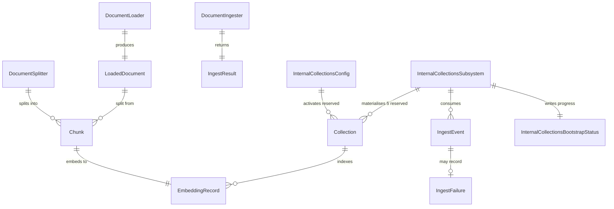
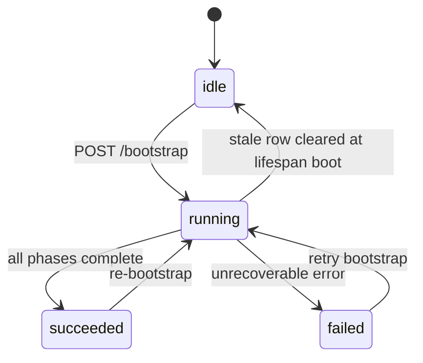
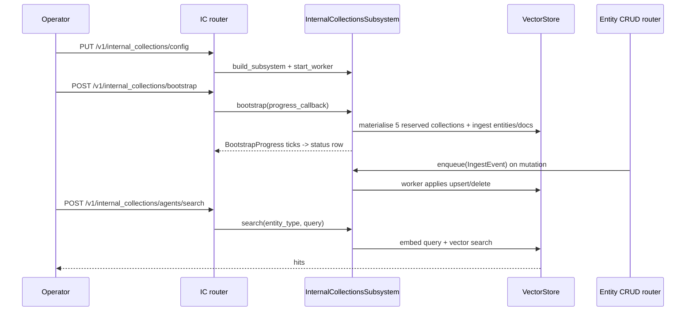

# Knowledge

## 1. Purpose

The knowledge subsystem is how the platform stores reference material and turns it (and its own internal entities) into searchable meaning. Three related capabilities live here. The first is **path-addressed documents**: a user `Collection` holds documents addressed by a `path` that is unique within the collection, and each document's body is the source of truth stored in a first-class **content store** keyed by `(collection_id, path)`, separate from the entity row and the vector index. The `DocumentService` is the chokepoint that keeps the entity row, the content-store body, and (when search is on) the derived vector index consistent on every write, move, and delete. The second is a document-ingestion pipeline: hand it a PDF, DOCX, HTML page, or markdown file, and it loads the bytes, splits them into overlapping chunks, embeds each chunk into a vector, and stores those vectors so an operator or an agent can later ask "which part of this document talks about X" and get the relevant subsection back. In this release search is still on, so the vector store is a derived, optional index over the content-store body rather than the place the body lives: the body no longer sits in the vector table or in `Document.meta['content']`. The third is the internal-collections subsystem: a background machine that keeps a live semantic index of the platform's own building blocks (agents, graphs, collections, and tools) plus a shelf of agent-facing platform documentation, so an agent can ask "which agent reviews code" or "which tool searches the web" and find it by description rather than by exact id. All three sit on top of the embedder adapters and the semantic-search providers documented in `docs/dev/subsystems/semantic-search.md`; this doc covers what is built on top of them.

## 2. Conceptual model

A user `Document` is path-addressed. The `Document` entity row (`primer/model/collection.py`) carries `collection_id`, a required `path` (unique within the collection; segments cannot be empty, `.`, or `..`, and the path cannot start or end with `/`), an optional `title` (defaults to the path leaf), and a `meta` bag. The body is not on the row: it lives in the content store as a `ContentRow` (`document_id`, `collection_id`, `path`, `content`) keyed authoritatively by `(collection_id, path)`. The `DocumentService` (`primer/knowledge/document_service.py`) is the write/read chokepoint: `upsert` writes the entity row and the content-store row in one `StorageProvider.transaction()` then indexes best-effort; `read` returns a `ReadResult` resolved through the content store by path; `list` returns `ContentListEntry` rows (`path`, `document_id`, `size`); `move` and `delete` keep the row, body, and index aligned.

Document ingestion has three intermediate domain types. A `LoadedDocument` is what a `DocumentLoader` produces from a raw source: the document's text (usually markdown), an optional `structure` blob a structure-aware splitter can read, and loader `meta`. A `Chunk` is what a `DocumentSplitter` produces: one span of text, its 0-indexed `position`, and per-chunk `meta` (heading path, page). An `IngestResult` is the telemetry the orchestrator returns. The `DocumentIngester` drives one `Document` through `load -> split -> embed -> store`, turning each `Chunk` into one `EmbeddingRecord` in a `VectorStore`.

The internal-collections subsystem maps each of the four `Describeable` entity types to a reserved system `Collection` row: `agent` to `_internal_agents`, `graph` to `_internal_graphs`, `collection` to `_internal_collections`, `tool` to `_internal_tools`. A fifth reserved collection, `_internal_ai_docs`, holds chunked platform documentation and is not entity-backed. An `InternalCollectionsConfig` singleton row activates the subsystem; an `InternalCollectionsBootstrapStatus` singleton row tracks the last bootstrap; an `IngestFailure` row is written whenever a single CDC event fails. The runtime is the `InternalCollectionsSubsystem`, which owns a queue of `IngestEvent` DTOs consumed by one CDC worker.

Two implementations of the "semantic index over Describeable entities" idea live side by side in the tree. `primer/catalog/` (`SemanticCatalog`, `SemanticEntityType`, `SemanticHit`) is a thin, event-source-agnostic lower layer that indexes the four entity types under `_catalog_*` collection ids; it is currently exercised only by its own unit tests and is not wired into the live application. `primer/internal_collections.py` (`InternalCollectionsSubsystem`) is the larger production runtime that the API actually constructs and drives at request time. This doc describes the production runtime as the live subsystem; the `SemanticCatalog` module is the reusable lower layer.

## 3. Architecture patterns implemented

- **Provider pattern (consumer).** Ingestion and the internal-collections subsystem consume the `Embedder` adapters and the `VectorStore` / `SemanticSearchProvider` plumbing documented in `docs/dev/subsystems/semantic-search.md` and `docs/dev/architecture/provider-pattern.md`. The knowledge subsystem never talks to a model SDK or a vector backend directly; it resolves an embedder through the `ProviderRegistry` and a store through the `SemanticSearchRegistry`.
- **Pluggable ABCs with a single concrete orchestrator.** `DocumentLoader` and `DocumentSplitter` are ABCs (`primer/ingest/loader.py`, `primer/ingest/splitter.py`); `DocumentIngester` is one concrete orchestrator with no ABC, since the variability lives in the loader and splitter, not the pipeline.
- **Change-data-capture worker.** The internal-collections runtime applies entity mutations to the index through an `asyncio.Queue[IngestEvent]` drained by a single worker task, following the worker pattern in `docs/dev/architecture/worker-system.md`. The CRUD routers fan mutations into the queue via the hooks in `primer/api/routers/_cdc_hooks.py`.
- **Bootstrap state machine.** `InternalCollectionsSubsystem.bootstrap()` walks an explicit `BootstrapPhase` sequence and emits `BootstrapProgress` ticks, integrating with the auto-bootstrap surface in `docs/dev/architecture/auto-bootstrap.md`.
- **Storage abstraction (consumer).** All persisted state rides the `Storage[T]` interface from `docs/dev/architecture/storage.md` with no special semantics; reserved rows are located by stable ids.
- **Best-effort observability.** Per-event failures are swallowed into `IngestFailure` rows rather than aborting the bootstrap, so one bad entity does not fail the whole run.

## 4. Code layout

| Path | Responsibility |
| --- | --- |
| `primer/ingest/__init__.py` | Re-exports the public ingestion surface: `DocumentLoader`, `DocumentSplitter`, `DocumentIngester`, `DoclingLoader`, `DoclingSplitter`, `RecursiveSplitter`, `Chunk`, `LoadedDocument`, `IngestResult`. |
| `primer/ingest/loader.py` | `DocumentLoader` ABC. Single async `load(source: bytes | Path | str) -> LoadedDocument`. Docstring enumerates `BadRequestError` / `UnsupportedContentError` / `ConfigError` as typed raises. |
| `primer/ingest/splitter.py` | `DocumentSplitter` ABC. Single synchronous `split(document) -> list[Chunk]`. |
| `primer/ingest/ingester.py` | `DocumentIngester` orchestrator. `DEFAULT_BATCH_SIZE = 32`. Embeds the first chunk alone to learn dimensionality, lazy-creates the collection, then batch-embeds the rest. |
| `primer/int/document_content.py` | `DocumentContentStore` ABC plus the `ContentRow` / `ContentListEntry` DTOs. Path-keyed CRUD over document bodies: `get(document_id)`, `get_by_path(collection_id, path)`, `resolve_id(collection_id, path)`, `upsert(...)`, `delete(...)`, `move(...)`, `list(collection_id, prefix)`, and `ensure_schema()`. Backed by a `document_content` table, handed out by `StorageProvider.get_content_store()`; see `docs/dev/architecture/storage.md`. |
| `primer/knowledge/document_service.py` | `DocumentService`: the path-addressed write/read chokepoint. `upsert` writes the `Document` row and the content-store body in one `StorageProvider.transaction()` then indexes best-effort; `read` returns a `ReadResult` from the content store by path; `list` returns `ContentListEntry` rows; `move` / `delete` keep row, body, and vector index aligned. Used by the path-addressed REST routes and the `system` document tools. |
| `primer/knowledge/indexing.py` | The user-collection embed-on-write path: `index_document` reads the indexable body from the content store, chunks it, runs a single-input dimensionality probe (early `create_collection` + `DimensionMismatchError` on a stored-dim mismatch), then batch-embeds the chunks at `_EMBED_BATCH_SIZE = 32` (mirroring `DocumentIngester`) - one embed call per 32 chunks, one `EmbeddingRecord` per chunk in order. `backfill_missing_document_vectors` is the startup self-heal pass. |
| `primer/ingest/loaders/docling.py` | `DoclingLoader` (the default loader). Wraps `docling.document_converter.DocumentConverter`; resolves bytes / `Path` / URL string; exports markdown plus the serialised `DoclingDocument`; runs blocking work in `asyncio.to_thread`. |
| `primer/ingest/splitters/docling.py` | `DoclingSplitter` (the default splitter). Wraps `docling.chunking.HybridChunker`; raises `ConfigError` when `LoadedDocument.structure` is `None`. |
| `primer/ingest/splitters/recursive.py` | `RecursiveSplitter`. Pure-Python, zero-dependency recursive character splitter with `chunk_size` / `chunk_overlap` / `separators`. |
| `primer/model/ingest.py` | Pydantic models `LoadedDocument`, `Chunk`, `IngestResult`. |
| `primer/model/internal.py` | Persisted models and constants for the internal-collections runtime: `InternalCollectionsConfig`, `InternalCollectionsBootstrapStatus`, `BootstrapPhase`, `IngestFailure`, `INTERNAL_COLLECTION_IDS`, `AI_DOCS_COLLECTION_ID`, the reserved-id constants. |
| `primer/internal_collections.py` | `InternalCollectionsSubsystem` (the live runtime): CDC worker, `IngestEvent` DTO, `BootstrapProgress`, per-entity embedding-text builders, the bootstrap state machine, AI-docs ingest, `search()` and `search_ai_docs()`, `build_subsystem` / `load_config_or_none` factories. |
| `primer/catalog/` | `SemanticCatalog`, `SemanticEntityType`, `SemanticHit`: the reusable lower-layer catalog over the four entity types, currently exercised only by its own tests. |
| `primer/api/routers/internal_collections.py` | Activation + bootstrap + per-entity search REST surface. |
| `primer/api/routers/knowledge.py` | Collection / Document CRUD, per-collection document search, and the `_convert_file` markdown-conversion endpoint. |
| `primer/api/routers/_cdc_hooks.py` | `register_cdc_kind` plus the create/update/delete hook factory that enqueues `IngestEvent` rows on the live subsystem. |
| `primer/toolset/search.py` | The `search` internal toolset (`SEARCH_TOOLSET_ID`) exposing `search_agents` / `search_graphs` / `search_collections` / `search_tools` / `search_ai_docs`. |

## 5. Data model

A user `Document` body is persisted in the content store as a `ContentRow`, addressed by `(collection_id, path)`; the body is the source of truth, the entity row mirrors `path` / `title` / `meta` for queries and display, and the vector store holds only the derived chunk index. The content store is the `document_content` table described in `docs/dev/architecture/storage.md`.

The ingestion models in `primer/model/ingest.py` are not persisted directly; they are in-flight DTOs that become `EmbeddingRecord` rows in a vector store. `LoadedDocument` carries `text`, optional `mime_type`, optional `structure`, and `meta`. `Chunk` carries `text`, `position` (`ge=0`), and `meta`. `IngestResult` carries `collection_id`, `document_id`, `chunks_indexed` (`ge=0`), `dimensions` (`gt=0`), `replaced`, and optional `bytes_loaded`.

The internal-collections runtime persists three entities (`primer/model/internal.py`). `InternalCollectionsConfig` is a singleton at id `_internal_collections_config` carrying `embedding_provider_id`, `embedding_model`, optional `cross_encoder`, required `search_provider_id`, optional `mmr`, and `activated_at` (`None` until the first bootstrap completes). `InternalCollectionsBootstrapStatus` is a singleton at id `_internal_collections_bootstrap_status` carrying `status`, `phase`, `phase_done` / `phase_total`, `counts`, `started_at` / `finished_at`, `error`, and `attempt_id`. `IngestFailure` is an append-only audit row carrying `entity_type`, `entity_id`, `op`, `error`, `failed_at`, and `retry_count`. The reserved `Collection` rows the bootstrap materialises carry `system=True` and `search_provider_id` so future Collection-CRUD endpoints can refuse to delete or repoint them.

The bootstrap status row is a state machine over `status` (`idle` / `running` / `succeeded` / `failed`) with `phase` walking the `BootstrapPhase` sequence while running. The router refuses a new bootstrap while `status == 'running'`, and the lifespan handler clears stale `running` rows at boot, giving "exactly one active bootstrap at a time" without an in-memory mutex.

## 6. Lifecycle

Document ingestion for one document runs synchronously inside `DocumentIngester.ingest`. It validates that `document.collection_id` matches the bound collection, optionally deletes prior chunks when `replace=True`, loads the source through the bound `DocumentLoader`, splits it through the bound `DocumentSplitter`, and short-circuits with `chunks_indexed=0` (placeholder `dimensions=1`) when the document yields no chunks. Otherwise it embeds the first chunk alone to learn the vector dimensionality, rejects a zero-length first vector with `BadRequestError`, lazy-creates the vector-store collection at that dimension, stores the first record, then batch-embeds the remaining chunks `DEFAULT_BATCH_SIZE` at a time and rejects any later vector whose length differs from the first. Each `EmbeddingRecord` stores `chunk_id=f"chunk-{position:06d}"`, the chunk text, the vector, the chunk's own `meta` at the top level, and the loader's `meta` nested under `source_doc`.

The internal-collections subsystem has a longer multi-actor lifecycle. An operator activates it by PUT-ing an `InternalCollectionsConfig`; the lifespan handler builds the subsystem and starts the CDC worker so live mutations are captured immediately. A POST to the bootstrap endpoint runs `bootstrap()` in the background: it drains any queued events, materialises the five reserved collections, probes the embedding dimension, ingests every persisted agent / graph / collection / tool page by page, ingests the AI-docs markdown, and finalises by stamping `activated_at` and persisting the config row. Progress ticks flow to the status row. Afterwards, every entity mutation routed through the CRUD routers fans an `IngestEvent` into the queue, and the worker upserts or deletes the corresponding index record. Search requests (HTTP or via the `search` toolset) embed the query with `task_type='retrieval_query'` and query the per-entity collection.

## 7. Persistence

| What | Where | Notes |
| --- | --- | --- |
| User document bodies | `ContentRow` rows in the `document_content` table via `StorageProvider.get_content_store()` | Source of truth, keyed by `UNIQUE(collection_id, path)`; sibling to the JSONB entity tables, separate from the vector store. See `docs/dev/architecture/storage.md`. |
| Chunk vectors for ingested documents | `EmbeddingRecord` rows in the collection's `VectorStore` | Derived, optional index over the body. Created lazily at the dimension learned from the first chunk; `chunk_id=f"chunk-{position:06d}"`. |
| Reserved internal collection vectors | `EmbeddingRecord` rows under `_internal_agents` / `_internal_graphs` / `_internal_collections` / `_internal_tools` / `_internal_ai_docs` | Entity records use `chunk_id="0"`; AI-docs records are multi-chunk via `DocumentIngester`. |
| Activation config | `InternalCollectionsConfig` row at `_internal_collections_config` via `Storage[T]` | Singleton; presence at startup activates the subsystem. |
| Bootstrap progress | `InternalCollectionsBootstrapStatus` row at `_internal_collections_bootstrap_status` via `Storage[T]` | Singleton; survives navigation and process restart. |
| Per-event ingest failures | `IngestFailure` rows via `Storage[T]` | Append-only audit; the future global retry scheduler reads them. |
| Reserved `Collection` metadata rows | `Collection` rows via `Storage[T]` | Stamped `system=True` and `search_provider_id`. |
| AI-docs source | Markdown files shipped under `primer/ai_docs/*.md` | Walked at bootstrap; files starting with `_` are skipped; `content_hash` in `Document.meta` skips unchanged files. |
| Operator config (embedder, model, SSP, rerank) | Fields on `InternalCollectionsConfig` | Configured at runtime via the activation API. |

## 8. Public surfaces

- **Activation API** (`primer/api/routers/internal_collections.py`, mounted under `/v1`): `PUT` / `GET` / `DELETE /v1/internal_collections/config`, `POST /v1/internal_collections/bootstrap` (runs in the background), and `GET /v1/internal_collections/bootstrap/status`.
- **Internal-collection search routes** (`primer/api/routers/internal_collections.py`): `POST /v1/internal_collections/{plural}/search` per entity type (`agents` / `graphs` / `collections` / `tools`), each returning a `503` envelope when the subsystem is inactive or unbootstrapped.
- **Collection CRUD and path-addressed documents** (`primer/api/routers/knowledge.py`): Collection CRUD plus the path-addressed document surface, all keyed by a `?path=` query param and backed by `DocumentService`: `GET /v1/collections/{id}/documents?path=
` (single document body + metadata), `GET /v1/collections/{id}/documents?prefix=
` (list of `{path, document_id, size}`, no bodies), `PUT /v1/collections/{id}/documents?path=
` (create/replace body), `DELETE /v1/collections/{id}/documents?path=
`, and `POST /v1/collections/{id}/documents/move` (body `{from, to}`). `POST /v1/collections/{id}/search` runs per-collection document search resolving the store through `SemanticSearchRegistry.get_store`. `POST /v1/collections/{id}/documents/_convert_file` converts an uploaded binary to markdown via `DoclingLoader` for the create form; it is loader-only and persists no `Document` row, and passes through already-textual uploads verbatim. There is no live multipart endpoint that drives the full `DocumentIngester` pipeline yet.
- **Search toolset** (`primer/toolset/search.py`, `SEARCH_TOOLSET_ID = "search"`): agent-facing tools `search_agents`, `search_graphs`, `search_collections`, `search_tools`, and `search_ai_docs`, each wrapping the subsystem's search so HTTP and toolset paths share embedder and rerank semantics. Registered only once the subsystem is activated and bootstrapped.
- **CDC fan-out hooks** (`primer/api/routers/_cdc_hooks.py`): `register_cdc_kind` plus a create/update/delete hook factory the CRUD routers register so entity mutations enqueue `IngestEvent` rows.
- **Operator UI** for the activation and bootstrap lifecycle is documented in `docs/dev/subsystems/ui-pages.md`.

## 9. Internal contracts

- **`DocumentLoader`** (`primer/ingest/loader.py`): single async `load(source: bytes | Path | str) -> LoadedDocument`. Implementations bind a backend at construction, run blocking I/O in `asyncio.to_thread`, and raise `BadRequestError` / `UnsupportedContentError` / `ConfigError` rather than emitting empty text. `DoclingLoader` is the default.
- **`DocumentSplitter`** (`primer/ingest/splitter.py`): single synchronous `split(document: LoadedDocument) -> list[Chunk]`. Must emit at least one chunk for any non-empty document and an empty list for an empty document. `DoclingSplitter` is the structure-aware default; `RecursiveSplitter` is the zero-dependency fallback.
- **`IngestEvent`** (`primer/internal_collections.py`): a frozen-slots DTO carrying `op` (`upsert` / `delete`), `entity_type`, `entity_id`, and an optional `payload`; the unit of work the CDC worker applies.
- **`BootstrapProgressCallback`** (`primer/internal_collections.py`): `Callable[[BootstrapProgress], Awaitable[None]]` awaited at every phase transition and per ingest page, letting the router persist status without coupling the runtime to storage.
- **`ToolsetProviderLike`** (`primer/internal_collections.py`): a structural protocol with `list_tools()` that the subsystem enumerates during tool ingest; the live `_system` and `_search` providers satisfy it and are injected by the caller.
- **`embedding_text_for`** (`primer/internal_collections.py`): the per-entity-type embedding-text builder set (`_agent_embedding_text` folds in `system_prompt`, `_graph_embedding_text` appends `node <id>` per node, `_tool_embedding_text` uses `name: description`, `_collection_embedding_text` falls back to id) so search embeds the same text ingest did.

## 10. Testing patterns

Ingestion is tested with in-file fakes. `tests/ingest/test_ingester.py` drives `DocumentIngester` end to end against an in-file `_FakeLoader`, `_FakeEmbedder`, and `_InMemoryVectorStore` (the shared `_doubles.py` the spec proposed was not built; the fakes are inlined). It covers collection-id mismatch, the empty-document path, single and batched many-chunk runs, `replace=True` deletion, and loader-meta propagation under `source_doc`. `tests/ingest/test_recursive_splitter.py` covers constructor validation and split behaviour (empty input, short input, long input with overlap, no-separator hard split, position monotonicity). `tests/ingest/test_models.py` round-trips the Pydantic models.

The internal-collections runtime is tested across layers: `tests/test_internal_collections.py` covers the CDC pipeline and bootstrap state machine, `tests/api/test_internal_collections.py` covers the `/v1/internal_collections` routes, and `tests/e2e/test_internal_collections.py` covers the full lifecycle. The lower-layer `SemanticCatalog` is tested in isolation under `tests/catalog/` against fake embedder, fake vector store, and fake collection storage doubles. Integration smokes against live embedding providers are gated on environment variables (for example `GEMINI_API_KEY`, `OPENAI_API_KEY`, `HUGGINGFACE_SMOKE=1`) and skip when unset, consistent with the no-hardcoded-secrets convention.

## 11. Historical decisions

- **`EmbeddingModel.length` was dropped; the ingester learns the vector dimension from the first chunk at run time and propagates it to `VectorStore.create_collection`.** Why: recording the dimension in the registry and deriving it from real output is a redundancy that silently drifts when models swap. Spec: `docs/superpowers/specs/2026-05-03-document-ingestion-design.md`.
- **The loader and splitter are pluggable ABCs but the ingester is a single concrete orchestrator with no ABC.** Why: the interesting variability lives in the loader and splitter, so one concrete pipeline avoids speculative interface complexity. Spec: `docs/superpowers/specs/2026-05-03-document-ingestion-design.md`.
- **Splitting is synchronous while loading is async.** Why: splitting is pure CPU work over text so async would force needless awaits, whereas loading does real I/O and may fetch URLs. Spec: `docs/superpowers/specs/2026-05-03-document-ingestion-design.md`.
- **Re-indexing is full delete-and-replace via `replace=True`, not incremental upsert.** Why: delete-and-replace is the simplest correct semantics and incremental diffing was deferred. Spec: `docs/superpowers/specs/2026-05-03-document-ingestion-design.md`.
- **Docling shipped as a core dependency and the Docling loader/splitter became the package defaults; MarkItDown and the optional-extras plan never landed.** Why: the AI-docs bootstrap ships with the platform and needs structure-aware chunking out of the box, so Docling-as-baseline replaced the two-extras plan. Spec: `docs/superpowers/specs/2026-05-03-document-ingestion-design.md`.
- **The internal-collections runtime reuses real `Collection` rows marked `system=True` rather than building a parallel index.** Why: `CollectionEmbedder`, `VectorStore`, and `CollectionSearcher` then apply for free, so MMR and cross-encoder reranking can later be enabled by toggling the system rows. Spec: `docs/superpowers/specs/2026-05-08-semantic-catalog-design.md`.
- **Entity embedding text places the id first (`f"{entity.id}\n\n{entity.description}"` in the catalog layer) so machine-readable ids stay discoverable.** Why: ids like `code-reviewer` or `web-search` carry real semantic content even when the description is generic or empty. Spec: `docs/superpowers/specs/2026-05-08-semantic-catalog-design.md`.
- **The production runtime added an activation API, a bootstrap state machine, a CDC worker, an `IngestFailure` audit table, and a fifth `_internal_ai_docs` collection that the catalog spec deferred or omitted.** Why: the live system needs operator-driven activation, durable progress, live mutation capture, and agent-facing platform docs, which the thin catalog module did not cover. Spec: `docs/superpowers/specs/2026-05-08-semantic-catalog-design.md`.
- **Search embeds queries with `task_type='retrieval_query'` and ingest with `retrieval_document`.** Why: asymmetric-retrieval models (BGE, E5, nomic-embed-text) embed queries and documents in different sub-spaces, and the hint recovers cosine scores from roughly 0.25 to 0.7 on BGE. Spec: `docs/superpowers/specs/2026-05-08-semantic-catalog-design.md`.
- **Per-event CDC failures are swallowed into `IngestFailure` rows instead of aborting the bootstrap.** Why: one bad entity should not fail the whole run, and re-bootstrap is the reconciliation path for dropped or failed events. Spec: `docs/superpowers/specs/2026-05-08-semantic-catalog-design.md`.
- **Reserved internal collections are bound to a specific `SemanticSearchProvider` via a required `search_provider_id` rather than a process-wide store.** Why: promoting the vector store into a runtime-CRUD `SemanticSearchProvider` entity lets the four reserved collections plus `_internal_ai_docs` resolve their backend through the `SemanticSearchRegistry` per call. Spec: `docs/superpowers/specs/2026-05-24-semantic-search-subsystem-design.md`.
