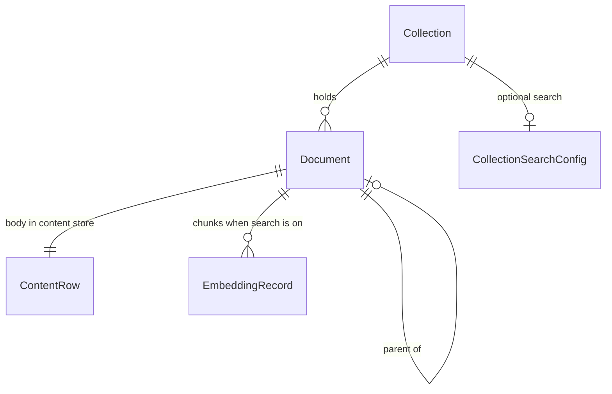

# Knowledge

## 1. Purpose

The knowledge subsystem is how the platform stores reference material and, optionally, makes it searchable by meaning. A `Collection` is a wiki: a tree of pure-text documents addressed by slug paths. It is useful the moment a document lands in it, because reading, listing, and grep need no embedder, no vector store, and no indexing pass. Semantic search is an opt-in block on the collection, enabled deliberately and reported honestly when it fails. A second, system-owned collection describes the platform to its own agents: the agents, graphs, tools and collections that exist, plus the shipped agent-facing docs, regenerated from live state on every boot.

## 2. Conceptual model

A `Document` is a node in one collection's tree. The entity row (`primer/model/collection.py`) carries `collection_id`, an optional `parent_id` (absent at the root), a `slug` segment, a derived `path` mirror of the slug chain, an optional `title` defaulting to the slug, and a `meta` bag. The body is not on the row: it lives in the content store as a `ContentRow` keyed by `(collection_id, path)`, which is the single body location. There is no second place a body can hide.

`DocumentTreeService` (`primer/knowledge/tree.py`) is the write chokepoint. Every mutation writes the entity row and the content row inside one `StorageProvider.transaction()`, so the two never diverge. Paths are derived from the parent chain rather than supplied, which is why a move rewrites a whole subtree's paths in one transaction while keeping document ids stable: links and indexed chunks survive a reorganisation.

A `CollectionSearchConfig` on the collection turns semantic search on. It names the embedder, the vector store, an optional cross encoder, the chunk sizing, and a `state` of `indexing`, `ready`, or `error` with a message. `None` means grep-only, which is the default.

```mermaid
erDiagram
    Collection ||--o{ Document : "holds"
    Document ||--o| Document : "parent of"
    Document ||--|| ContentRow : "body in content store"
    Collection ||--o| CollectionSearchConfig : "optional search"
    Document ||--o{ EmbeddingRecord : "chunks when search is on"
```

## 3. Architecture patterns implemented

Transactional pairing: entity row and content row commit or roll back together, so a torn write cannot leave an addressable document with no body.

Derived state: `path` mirrors the parent chain and chunk metadata mirrors `path`. Both are rebuilt rather than edited, which is why a move rewrites metadata instead of re-embedding.

Explicit lifecycle over ambient work: indexing happens when an operator enables search, not on every boot. A failure leaves a partial index and an error state rather than retrying invisibly.

Degrade with a pointer: a surface that cannot serve a request says what will. Semantic search on a grep-only collection returns a conflict naming `grep_collection`; a document read that misses names the siblings it did find.

## 4. Code layout

| Path | Responsibility |
| --- | --- |
| `primer/model/collection.py` | `Collection`, `CollectionSearchConfig`, `ChunkingConfig`, `Document`. |
| `primer/knowledge/tree.py` | `DocumentTreeService`: create, read, update, tree walk, move, recursive delete. |
| `primer/knowledge/grep.py` | `grep_collection`: regex line scan with a cap and a truncated flag. |
| `primer/knowledge/splitter.py` | `split_text`: markdown heading-aware chunking with breadcrumbs. |
| `primer/knowledge/indexing.py` | `index_document`, `remove_document_index`, `rewrite_document_path_meta`. |
| `primer/knowledge/lifecycle.py` | `enable_search`, `disable_search`, `search_status`, `validate_search_config`. |
| `primer/knowledge/importer.py` | `import_zip`: archive directories mapped onto the tree. |
| `primer/knowledge/system_collection.py` | `regenerate_system_collection`: the platform's self-description. |
| `primer/api/routers/knowledge.py` | Collection CRUD plus the docs, grep, import and search-lifecycle routes. |
| `primer/toolset/collections.py` | The always-on `collections` toolset agents navigate with. |

## 5. Data model

`Collection` carries `description`, an optional `search` block, `system`, and `harness_id`. A system collection is read-only through every user-facing path.

`Document` carries `collection_id`, `parent_id`, `slug`, `title`, `path`, `meta`, `harness_id`, `created_at`, `updated_at`. The model accepts `[a-z0-9._-]` slugs so transitional and harness-managed rows validate; the API edge enforces the stricter `[a-z0-9-]`, and the system-collection regenerator opts out of that stricter check because entity ids are the thing users search by.

`CollectionSearchConfig` carries `embedder`, `vector_store_provider_id`, an optional `cross_encoder`, a `ChunkingConfig` of `max_chars` and `overlap`, plus `state` and `error`.

## 6. Lifecycle

A collection is created with a description alone and is immediately usable: create documents, read them, grep them.

Enabling search is a deliberate act. `PUT /v1/collections/{id}/search` validates the referenced providers first, so an unregistered embedder or vector store comes back as a conflict naming the id and where to register it. The backfill then runs inline, because collections are text-only and bounded, and the caller learns the outcome from the response rather than polling. A failure leaves the partial index in place and the state in `error` with the message attached; re-issuing the same request retries.

Disabling always succeeds, even when the provider or namespace is already gone, so a collection can never get stuck enabled.

Writes keep the index honest without re-embedding more than they must. A create or update indexes the new body; a delete unindexes every removed document; a move rewrites each chunk's path metadata, because a rename changes no vectors.

## 7. Persistence

Entity rows go through the normal `Storage` interface. Bodies live in the content store, which enforces `UNIQUE(collection_id, path)`; that uniqueness is what makes sibling-slug collisions a clean conflict rather than a silent overwrite. Vectors live in the collection's configured `SemanticSearchProvider` namespace, keyed by `(collection_id, document_id, chunk_id)` where `chunk_id` is `str(index)` and nothing else.

## 8. Public surfaces

| Surface | Purpose |
| --- | --- |
| `GET /v1/collections/{id}/docs?path=` | Read one document with its children. |
| `GET /v1/collections/{id}/docs?parent=&depth=` | Walk the tree under a parent. |
| `POST /v1/collections/{id}/docs` | Create a node under a parent. |
| `PATCH /v1/collections/{id}/docs?path=` | Update body and/or title. |
| `POST /v1/collections/{id}/docs/move` | Move a node and its subtree. |
| `DELETE /v1/collections/{id}/docs?path=&recursive=` | Delete, optionally recursively. |
| `GET /v1/collections/{id}/grep?q=&path_prefix=` | Regex line search over bodies. |
| `POST /v1/collections/{id}/import` | Import a zip archive as a tree. |
| `PUT/GET/DELETE /v1/collections/{id}/search` | Enable, report, disable semantic search. |
| `collections` toolset | `collections_list`, `collection_tree`, `read_document`, `grep_collection`, `semantic_search`, and the write tools. |

Writes to a system collection answer 403 on every one of these.

## 9. Internal contracts

The content store is the only body location. An entity row without a content row is not a document: it is neither served nor listed.

`chunk_id` is `str(index)`. No other shape exists.

A miss carries alternatives. `DocumentTreeService.resolve` raises with the siblings of the parent it searched, and the toolset passes that message through, so a wrong guess teaches the right path.

The regenerator writes through the service directly rather than the API, because the 403 guards users, not the platform describing itself.

## 10. Testing patterns

Tree behaviour is tested against a real sqlite provider rather than a fake, because the transactional pairing and the `UNIQUE` constraint are the things under test.

`tests/knowledge/test_delete_unindexes.py` pins the three defects the v2 model was built to close: a delete removes its vectors, a delete removes its content row, and only one chunk-id shape exists. They pass against the implementation, which is the point: they fail loudly if a refactor reintroduces the orphaning.

`tests/docs/test_s2_grep_clean.py` pins the deletions, so a removed surface cannot creep back by import.

## 11. Historical decisions

Bodies once lived in `Document.meta` and in the vector table, and a migration copied them into the content store. v2 made the content store the single location by clean break: the migration is retired to a no-op that keeps its version slot.

Binary document conversion is gone. The loader, splitter and ingester that turned PDFs into chunks were removed along with the optional extra that powered them; a collection holds text, and converting a binary is a job for a tool run before the file reaches primer.

MMR was removed when the collection model changed shape: its config became unreachable from any live model, and an unreachable-but-tested code path is worse than a deleted one.

The five reserved `_internal_*` collections and their search toolset were replaced by one system collection reachable through the ordinary collections tools. Indexing the platform's own entities no longer requires a separate subsystem, and the toggle that used to gate the whole thing now governs vectorisation only.
