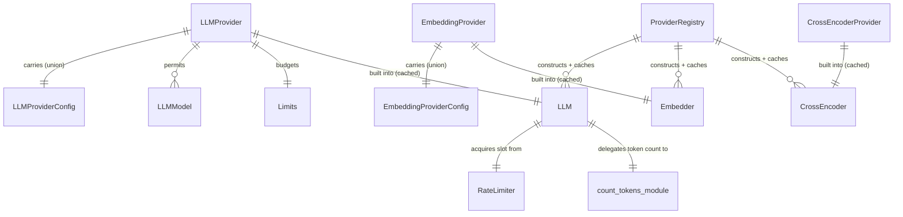
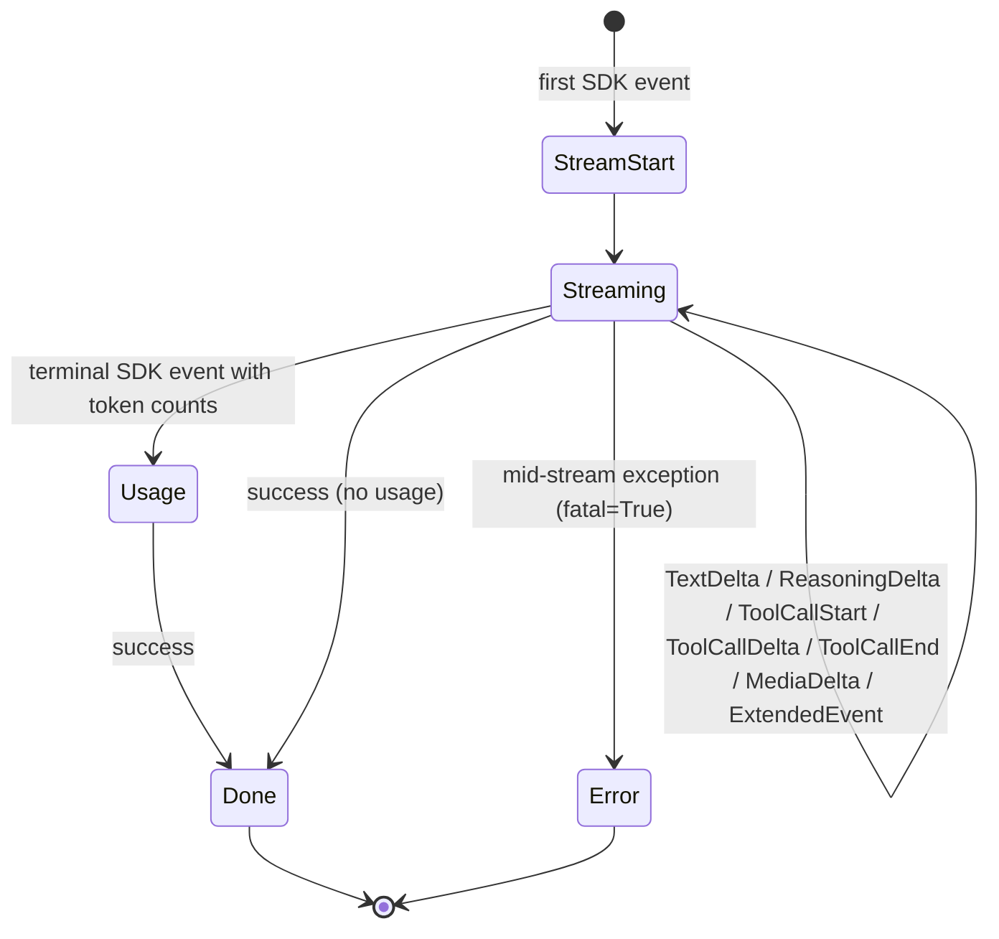
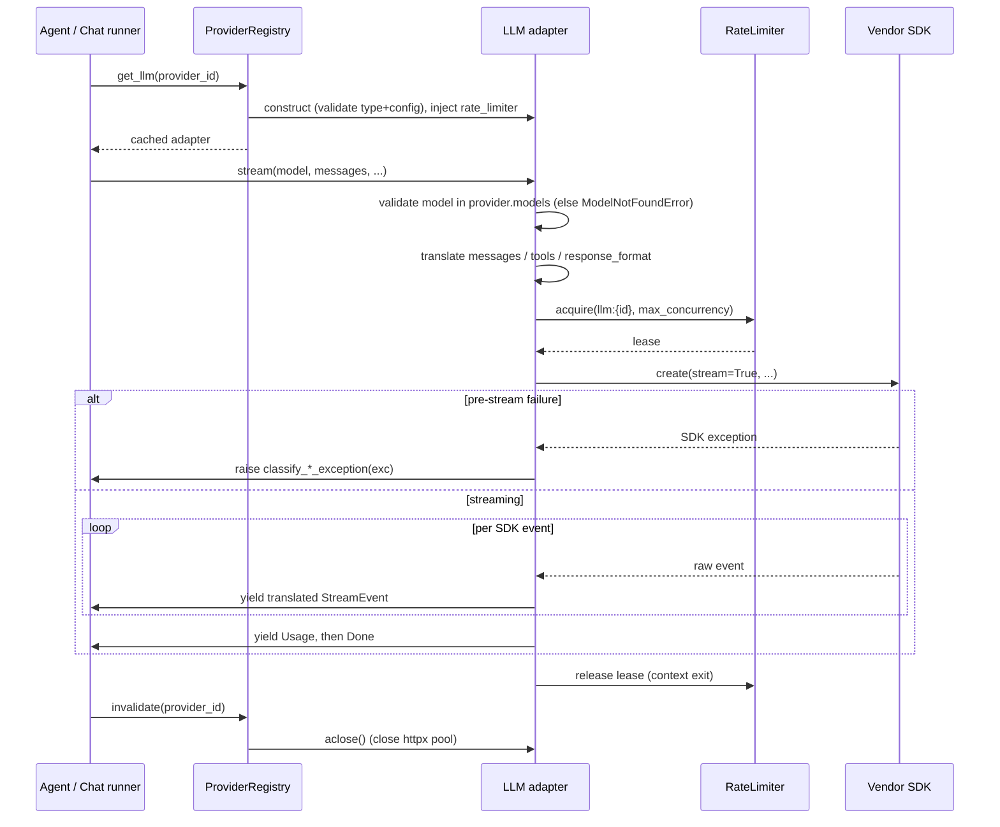

# Model Providers

## 1. Purpose

The model-providers subsystem is the adapter layer that converts Primer's universal, provider-agnostic model interfaces into the wire shapes of concrete vendor SDKs. It owns three model families: streaming chat LLMs (`primer/llm/`), text embedders (`primer/embedder/`), and cross-encoder rerankers (`primer/cross_encoder/`). Each adapter binds to one configured provider row at construction time, validates that the row's type and config class match, lazily constructs the underlying SDK client on first use, and translates the universal `Message` / `Tool` / `EmbeddingPart` types into and out of the provider's native format.

Callers (the agent loop, the chat turn runner, the ingest path, the collections subsystem) depend only on the abstract base classes `primer.int.LLM`, `primer.int.Embedder`, and `primer.int.CrossEncoder`; they never import a concrete adapter. The `ProviderRegistry` (`primer/api/registries/provider_registry.py`) is the single construction seam: it builds and caches one adapter per provider row, threads in the shared `RateLimiter` and `trace_llm_io` flag, and calls `aclose()` when a row is invalidated. This document covers the adapters and their shared contract; the coordinator's distributed rate-limiting and invalidation machinery is documented under the provider-pattern and coordinator design docs and is referenced here rather than restated.

## 2. Conceptual model

A provider row (`LLMProvider`, `EmbeddingProvider`, or `CrossEncoderProvider` in `primer/model/provider.py`) is a configuration record: which backend (`provider` enum), which models are permitted (`models`), the backend-specific connection details (`config`, a discriminated union), and the concurrency budget (`limits`). An adapter is the live object built from that row. The adapter serves every model the row declares; model selection happens per call, validated against `provider.models` with a `ModelNotFoundError` raised when the caller passes an unknown name.

The universal types the adapters translate are defined in `primer/model/chat.py` and `primer/model/embedding.py`: `Message` (a role plus a list of `Part`s), `Tool`, `ToolChoice`, the `StreamEvent` union that `LLM.stream` yields, and `EmbeddingPart` / `EmbedResponse` for embedders. Provider-specific knobs that do not map cleanly across vendors ride in an open-ended `extended: dict[str, Any]` slot the adapter interprets and silently drops unknown keys from.

Six LLM backends ship today (`primer/model/provider.py` `LLMProviderType`): `openresponses`, `openchat`, `gemini`, `anthropic`, `ollama`, `openrouter`. Three embedder backends (`EmbeddingProviderType`): `huggingface`, `openai`, `gemini`. One cross-encoder backend (`CrossEncoderProviderType`): `huggingface`. The package re-exports five LLM adapters in `primer/llm/__init__.py.__all__` (`AnthropicLLM`, `GeminiLLM`, `OllamaLLM`, `OpenChatLLM`, `OpenResponsesLLM`); `OpenRouterLLM` is importable from `primer/llm/openrouter.py` but is not in `__all__`.

## 3. Architecture patterns implemented

- **Thin ABC, fat adapter.** `primer.int.LLM` declares four methods (`list_models`, `stream`, `count_tokens`, `aclose`); `primer.int.Embedder` declares three (`list_models`, `embed`, `aclose`). `aclose()` defaults to a no-op on both bases so adapters that hold no resources inherit cheaply. The signatures were derived from the cross-SDK comparison in `research/abc_interface.md` and `research/embedding_interface.md`.
- **Validate-then-stream construction.** Every adapter `__init__` checks `provider.provider` against its expected enum and `isinstance(provider.config, …)` against its expected config class, raising `ConfigError` on a mismatch. See `AnthropicLLM.__init__`, `HuggingFaceEmbedder.__init__`.
- **Lazy SDK client.** The SDK client (`AsyncAnthropic`, `AsyncOpenAI`, `google.genai.Client`, `ollama.AsyncClient`, `SentenceTransformer`) is constructed on first use via `_get_client()` / `_get_model()` and cached on the instance, so importing or constructing an adapter never opens a connection.
- **Shared `RateLimiter` instead of a per-adapter semaphore.** Concurrency is mediated through an injected `RateLimiter` (`primer.int.coordinator`) keyed `llm:{provider.id}` / `embedder:{provider.id}` / `cross_encoder:{provider.id}` with `max_concurrency` from `provider.limits`. When no limiter is injected the adapter falls back to `primer.coordinator.in_memory.InMemoryRateLimiter`. `tests/llm/test_adapters_no_local_semaphore.py` is a source-level pin asserting no adapter constructs its own `asyncio.Semaphore`.
- **Shared per-SDK exception classifiers.** `primer/common/openai_errors.py`, `anthropic_errors.py`, `google_errors.py`, and `mcp_errors.py` each expose one `classify_*_exception` function mapping the vendor SDK hierarchy onto the `primer.model.except_.PrimerError` tree. Adapters that wrap the same SDK (OpenResponses, OpenChat, OpenRouter, OpenAIEmbedder all wrap `openai`) share one classifier so the universal error surface does not drift.
- **Shared OpenAI-family helper modules.** `primer/llm/_openai_common.py` (`build_sampling_params(target=…)`) is shared by the Responses and Chat Completions adapters; `primer/llm/_openai_compat.py` (request/response shaping for Chat Completions) is shared by `OpenChatLLM` and `OpenRouterLLM`. Both modules are pure and do no network IO.
- **Flavor strategy table over enum-per-flavor.** OpenAI-compatible adapters carry a frozen `_FlavorPolicy` dataclass selected from a `_POLICY_BY_FLAVOR` table keyed by the config's flavor enum, so a new OpenAI-compatible server lands as one table row rather than a new adapter class.
- **Native token counting on the compaction hot path.** `count_tokens` is a mandatory abstract method backed by per-provider modules under `primer/llm/_tokenizer/`. The agent's `compaction_mixin.should_compact` calls it before every turn, so network-backed counters (Anthropic, Gemini) cache aggressively and fall back to the char heuristic rather than raising.
- **Observability woven into every stream.** Each `stream()` opens an OpenTelemetry span `llm.stream` and increments Prometheus counters (`llm_tokens_total`, `llm_failure_total`, `llm_duration_seconds`); the cross-cutting instrumentation is identical across adapters.

## 4. Code layout

| Path | Responsibility |
| --- | --- |
| `primer/int/llm.py` | `LLM` ABC: `list_models`, `stream`, `count_tokens`, `aclose`. |
| `primer/int/embedder.py` | `Embedder` ABC: `list_models`, `embed`, `aclose`. |
| `primer/int/cross_encoder.py` | `CrossEncoder` ABC for rerankers. |
| `primer/int/coordinator.py` | `RateLimiter` / `RateLimiterLease` ABCs and the `Coordinator` bundle. |
| `primer/coordinator/in_memory.py` | `InMemoryRateLimiter` fallback used when no limiter is injected. |
| `primer/model/provider.py` | Provider entities, provider-type enums, flavor enums, config classes, the `LLMProvider._coerce_config_to_provider` validator. |
| `primer/model/except_.py` | `PrimerError` hierarchy every classifier maps into. |
| `primer/llm/__init__.py` | Re-exports the five named LLM adapters. |
| `primer/llm/anthropic.py` | `AnthropicLLM` over `anthropic.AsyncAnthropic` Messages API. |
| `primer/llm/gemini.py` | `GeminiLLM` over `google.genai` `generate_content_stream`. |
| `primer/llm/ollama.py` | `OllamaLLM` over `ollama.AsyncClient` chat. |
| `primer/llm/openresponses.py` | `OpenResponsesLLM` over the OpenAI Responses API. |
| `primer/llm/openchat.py` | `OpenChatLLM` over the OpenAI Chat Completions API. |
| `primer/llm/openrouter.py` | `OpenRouterLLM` over the OpenRouter gateway (Chat Completions wire). |
| `primer/llm/_openai_common.py` | `build_sampling_params(target=…)` shared by Responses + Chat Completions. |
| `primer/llm/_openai_compat.py` | Chat Completions request/response shaping shared by OpenChat + OpenRouter. |
| `primer/llm/_trace.py` | `_serialize_messages` for the `trace_llm_io` span payload. |
| `primer/llm/_tokenizer/` | Per-provider token counters (`anthropic`, `gemini`, `hf`, `openai`, `char_fallback`). |
| `primer/common/openai_errors.py` | `classify_openai_exception`, shared by every `openai`-SDK adapter. |
| `primer/common/anthropic_errors.py` | `classify_anthropic_exception`. |
| `primer/common/google_errors.py` | `classify_google_exception`. |
| `primer/embedder/openai.py` | `OpenAIEmbedder` (flavors OPENAI / LMSTUDIO / OTHER). |
| `primer/embedder/gemini.py` | `GeminiEmbedder` over `google.genai` `embed_content`. |
| `primer/embedder/huggingface.py` | `HuggingFaceEmbedder` over local sentence-transformers. |
| `primer/embedder/_prompts.py` | Model-family query/document prompt registry (BGE, E5, nomic-embed-text), shared by HuggingFace + OpenAI embedders. |
| `primer/cross_encoder/huggingface.py` | `HuggingFaceCrossEncoder` local reranker. |
| `primer/api/registries/provider_registry.py` | `ProviderRegistry`: per-row adapter cache, factory dispatch, rate-limiter binding, invalidation, `aclose`. |
| `primer/api/routers/providers.py` | Provider CRUD plus the `_discover_models` live-probe endpoint. |
| `ui/components/providers.jsx` | Console provider catalogue + per-backend config forms. |

## 5. Data model

### Limits

`Limits` (in `primer/model/provider.py`) carries two fields:

| Field | Type | Default | Description |
| --- | --- | --- | --- |
| `max_concurrency` | `PositiveInt` | required | Maximum in-flight requests held at once via the shared `RateLimiter`. |
| `request_timeout_seconds` | `float \| None` | `300.0` | Per-event inactivity timeout for LLM streaming calls. If no event arrives within this window the stream is aborted with `ProviderTimeoutError`. `None` disables it. See section 9 for enforcement details. |

### Provider entities

`LLMProvider`, `EmbeddingProvider`, and `CrossEncoderProvider` (`primer/model/provider.py`) all extend `Identifiable` and carry `provider` (the backend enum), `models` (a non-empty list of `LLMModel` / `EmbeddingModel` / `CrossEncoderModel`), `config` (a discriminated config union), and `limits` (a `Limits` with `max_concurrency` and `request_timeout_seconds`).

The `LLMProvider.config` union is `OpenResponsesConfig | OpenChatConfig | GoogleConfig | AnthropicConfig | OllamaConfig | OpenRouterConfig`. Because `OpenResponsesConfig` and `OpenChatConfig` share the `_HttpApiKeyConfig` shape and overlapping flavor values (`openai`, `other`), Pydantic's first-match-wins union dispatch would silently coerce an `openchat` row into `OpenResponsesConfig`. The `_coerce_config_to_provider` model-validator (mode `before`) defends against this by selecting the concrete config class from a `provider`-enum lookup before validation runs. `OpenRouterConfig` is not an `_HttpApiKeyConfig` subclass; it sets `ConfigDict(extra="forbid")`, hard-codes the base URL (no `url` field), requires `api_key`, and adds optional `app_name` / `app_url` attribution fields. The two defenses (validator plus `extra="forbid"`) are the same union-disambiguation problem at two layers.

Across the HTTP-keyed configs `api_key` is `Optional[SecretStr]` defaulting to `None`, so operators can register endpoints fronted by an auth-injecting proxy; a real provider that needs the key surfaces a 401 at call time rather than the schema rejecting the row. `OpenRouterConfig.api_key` is the exception (required), since OpenRouter is always remote and authenticated. The `EmbeddingProvider.config` union is `OpenAIConfig | HuggingFaceConfig | GoogleConfig`; `GoogleConfig` backs both the Gemini LLM and the Gemini embedder.

Flavor discriminators live on the config rather than the provider enum: `OpenResponsesFlavor` (OPENAI / LMSTUDIO / OTHER), `OpenChatFlavor` (OPENAI / LMSTUDIO / OLLAMA / VLLM / OTHER), `OpenAIEmbeddingFlavor` (OPENAI / LMSTUDIO / OTHER). The adapter resolves each flavor to a frozen `_FlavorPolicy`; only `require_api_key` is consulted at runtime today (the OpenResponses policy also carries `drop_encrypted_reasoning` and `expect_reasoning_under_store_true` as forward-compat scaffolding).

The streaming surface is a small state machine. `LLM.stream` is an async generator that always yields exactly one terminal event. A per-stream `_StreamState` dataclass tracks request id, model, accumulated tool-call argument fragments, token counts, and the final stop reason; a pure `_translate_event` / `_translate_chunk` dispatch maps each SDK event onto the universal `StreamEvent` union (`primer/model/chat.py`).

## 6. Lifecycle

An adapter is built lazily by `ProviderRegistry` on first lookup of a provider row, cached under the row id, and dropped (with `aclose()`) when the row is invalidated. A single `stream()` call walks the validate, translate, acquire, iterate, classify sequence below. Pre-stream exceptions are classified and re-raised; once the iterator has opened, mid-stream exceptions are classified and yielded as a terminal `Error(fatal=True)` so the consumer's `async for` always closes cleanly.

Embedders follow the mirror flow: validate model, map every `EmbeddingPart` to its input type before acquiring the lease (so unsupported parts fast-fail without holding a slot), acquire, call the SDK, classify exceptions, and translate the response into `EmbedResponse`. The local `HuggingFaceEmbedder` and `HuggingFaceCrossEncoder` differ only in that the SDK call is a synchronous `SentenceTransformer.encode` / `.predict` wrapped in `asyncio.to_thread` so the event loop is never blocked by weight loading.

## 7. Persistence

Provider rows (`LLMProvider`, `EmbeddingProvider`, `CrossEncoderProvider`) are persisted as CRUD-able entities through the storage layer and edited via `primer/api/routers/providers.py`; the adapters themselves hold no durable state. The one persistence concern the adapters touch is auto-bootstrap: on first boot the `BootstrapRunner` (`primer/bootstrap/runner.py`, `primer/bootstrap/defaults.py`) seeds a reserved HuggingFace embedder row (id `huggingface`, empty `SecretStr` token so public Hub models load with zero configuration) and a reserved HuggingFace cross-encoder row (id `huggingface-ce`). The provider registry reserves those ids (`RESERVED_EMBEDDER_IDS`, `RESERVED_CROSS_ENCODER_IDS`) so operators cannot shadow the built-in adapters. LLM providers have no reserved ids and are always operator-provided; OpenRouter rows in particular are added explicitly with no bootstrap. Token-counter caches (LRU keyed on content hashes for the network counters, a per-process tokenizer cache for HuggingFace) are in-memory only and never persisted.

## 8. Public surfaces

The abstract surface callers consume:

- `LLM.list_models()` returns the configured model names; no adapter queries upstream at call time. `LLM.stream(model, messages, temperature, top_p, max_output_tokens, stop, response_format, tools, tool_choice, extended)` is the async generator. `LLM.count_tokens(model, messages, tools)` returns a best-effort prompt estimate. `LLM.aclose()` releases the SDK client.
- `Embedder.list_models()` and `Embedder.embed(model, inputs, output_dimensions, config)` returning `EmbedResponse`.
- `CrossEncoder` exposes the reranker surface.

The construction surface is `ProviderRegistry` (`primer/api/registries/provider_registry.py`). Its `_build_default_llm_factory` dispatches each `LLMProviderType` to its adapter, forwarding `rate_limiter` and `trace_llm_io`; `_build_default_embedder_factory` and `_build_default_cross_encoder_factory` do the same for their families. `bind_rate_limiter` rebuilds the factories with the coordinator's limiter once it is available.

The REST surface (`primer/api/routers/providers.py`) carries provider CRUD plus `POST /v1/llm_providers/_discover_models`, a live-probe endpoint with per-backend arms. The Ollama arm probes `ollama.AsyncClient.list` and seeds a default `context_length`; the OpenRouter arm uses a plain `httpx.AsyncClient` against `/models` (not the openai SDK, which strips OpenRouter-specific catalogue fields like pricing and modality) and skips default `context_length` seeding because the catalogue carries it verbatim. The Anthropic arm returns 400 to signal the UI to fall back to a curated suggested-model list, because Anthropic has no useful list-models API. The console form catalogue lives in `ui/components/providers.jsx`.

Inbound MCP is the mirror of the outbound MCP toolset client and is a peer surface to this subsystem: `primer/mcp/server.py` builds an `mcp.server.lowlevel.Server` exposing Primer's own tool catalogue over Streamable HTTP at `/v1/mcp`, gated by `is_exposable` filtering (`primer/mcp/safety.py`, denying `yielding_unsupported` and `needs_session`), a cookie-only exposure-config rule, and the `primer/agent/tool_manager.py` `invoke_one` helper that bypasses the approval gate and workspace dispatch. Full detail lives in the MCP and rest-api docs.

## 9. Internal contracts

- **Per-event inactivity timeout (`Limits.request_timeout_seconds`).** Each LLM adapter reads `provider.limits.request_timeout_seconds` at construction time and stores it as `self._request_timeout_seconds`. During streaming the adapter passes the SDK iterator through `primer.llm._timeout._iter_with_timeout`, which wraps every `__anext__` call with `asyncio.timeout(seconds)`. If no event arrives within the window `asyncio.TimeoutError` is raised, the adapter catches it before the generic `except Exception` clause, and re-raises it as `primer.model.except_.ProviderTimeoutError` (a `ProviderError` subclass). This propagates out of the async generator to the chat executor / agent loop, which catches it as a generic `Exception` and records it as an error row / turn failure -- releasing the concurrency slot and ending the turn cleanly. `None` disables the timeout entirely. The default is 300 s. LM Studio guidance: LM Studio can stall mid-generation on large models or low-memory hardware; 300 s covers most real runs. Lower to 60 s for faster failure detection if hardware is fast enough.
- **Always exactly one terminal event.** Every successful `stream()` ends with one `Done`; every failed stream ends with one `Error(fatal=True)`. Pre-stream exceptions (the iterator never opened) re-raise the classified `PrimerError` instead. Exception: a timeout raises `ProviderTimeoutError` out of the generator rather than yielding a terminal event, because `asyncio.TimeoutError` fires asynchronously and the generator is already unwinding.
- **Stop-reason normalisation.** Each adapter maps its vendor finish reason onto the universal `StopReason`. The shared rule across Anthropic, Gemini, Ollama, and the Chat Completions adapters: a natural stop collapses to `tool_use` when the stream emitted any tool call, otherwise `stop`, so downstream callers get a consistent signal to dispatch tools. Unknown reasons collapse to `other`.
- **Tool-call id synthesis.** Adapters whose protocol omits stable tool-call ids (Gemini, Ollama) synthesise `call_{index}` so the universal `ToolCallStart` / `ToolCallDelta` / `ToolCallEnd` triple and round-trip `ToolResultPart` correlation have an id to pair on.
- **`response_format` translation.** OpenAI, Gemini, and Ollama have native structured-output surfaces; the adapter routes the Pydantic class or dict schema to them. Anthropic has no JSON mode, so `AnthropicLLM` emulates it with a forced single synthetic tool named `structured_output`, and raises `ConfigError` if `response_format` is combined with caller-supplied tools or an explicit `tool_choice`.
- **Unsupported parts raise, never drop.** An adapter that cannot transmit a `Part` modality raises `UnsupportedContentError` rather than silently dropping it, so input/output index correspondence is never corrupted. Embedders run this check before acquiring a rate-limit slot.
- **Unknown extended kwargs are dropped with one DEBUG line.** Each adapter whitelists the extended keys its wire format accepts and logs the dropped remainder once, so an operator diagnosing "my knob is not taking effect" has a discoverable signal.
- **`count_tokens` never blocks a turn.** Network counters (`primer/llm/_tokenizer/anthropic.py`, `gemini.py`) fall back to `count_tokens_char_fallback` on any exception, log a WARNING, and return an estimate. The per-adapter wiring is: OpenResponses and OpenChat call `count_tokens_openai` (tiktoken); OpenRouter reuses the same tiktoken path; Anthropic calls `count_tokens_anthropic`; Gemini calls `count_tokens_gemini`; Ollama wraps `count_tokens_hf` (transformers `AutoTokenizer`) in `asyncio.to_thread`.
- **Exception classification is centralised.** Adapters call the matching `classify_*_exception` at the SDK boundary. The OpenAI/Anthropic classifiers map by SDK exception subclass; the Google classifier dispatches on the HTTP status carried by `google.genai.errors.APIError.code` (the SDK only distinguishes 4xx vs 5xx by subclass); the HuggingFace embedder uses an inline string-match classifier because sentence-transformers and huggingface_hub share no common base exception.

## 10. Testing patterns

Each adapter has a unit suite under `tests/llm/<provider>.py` or `tests/embedder/<provider>.py` driving a mocked SDK client (`AsyncMock` for the `openai` / `anthropic` / `google-genai` clients; `respx` for the OpenRouter transport; stubbed `SentenceTransformer` for the local adapters). The suites share a class layout: constructor validation, `list_models`, per-Part input mapping, tool/tool-choice/response-format translation, sampling and extended-kwargs handling, stop-reason mapping, full-stream translation, exception wrapping, concurrency, package re-export, and `count_tokens`.

`tests/llm/test_adapters_no_local_semaphore.py` is a source-level pin asserting every LLM, embedder, and cross-encoder adapter routes concurrency through the shared `RateLimiter` with no local `asyncio.Semaphore`. The shared classifiers have dedicated tests (`tests/test_openai_errors.py`, `tests/test_anthropic_errors.py`, `tests/test_google_errors.py`); the shared OpenAI helpers have direct coverage (`tests/llm/test_openai_compat.py`, `tests/llm/test_openai_common.py`). Per-provider token counters are tested under `tests/llm/_tokenizer/`.

Integration smokes live under `tests/integration/test_<provider>_smoke.py`, each gated behind the relevant API-key env var (`ANTHROPIC_API_KEY`, `GEMINI_API_KEY`, `OPENAI_API_KEY`, `HUGGINGFACE_SMOKE=1`) or a TCP probe (LM Studio, a reachable Ollama at `localhost:11434`). They stream a single prompt and assert at least one `TextDelta` plus a terminal `Done` with a stop reason in `{stop, max_tokens}`. The project pins coverage at `fail_under = 90` in `pyproject.toml`. API keys and bearer tokens in tests are read from env vars and the test skips when unset, never inlined.

## 11. Historical decisions

- **Adapter concurrency moved from a per-adapter `asyncio.Semaphore` to a shared `RateLimiter` keyed `llm:{provider.id}`.** Why: a local semaphore only caps in-flight requests inside one process, so two primer-api / primer-worker processes against the same provider would double the upstream load. Spec: docs/superpowers/specs/2026-04-26-provider-adapters-shared-arch-design.md.
- **The root exception class is `PrimerError` and the module is `except_.py`.** Why: `except` is a Python keyword that cannot name an importable module, and the project namespace settled on `primer` rather than `matrix`. Spec: docs/superpowers/specs/2026-04-26-provider-adapters-shared-arch-design.md.
- **Per-SDK exception classifiers were hoisted into `primer/common/<sdk>_errors.py` instead of being inlined per adapter.** Why: adapters that wrap the same SDK need identical mapping rules, so centralising them removed drift risk and made the rules testable in one place. Spec: docs/superpowers/specs/2026-04-26-provider-adapters-shared-arch-design.md.
- **`OpenChatLLM` and `OpenRouterLLM` were added as separate adapters alongside the original four.** Why: OpenResponses talks only to the OpenAI Responses API, but the legacy `/v1/chat/completions` surface is what every OpenAI-compatible third party actually supports, and OpenRouter adds gateway attribution headers. Spec: docs/superpowers/specs/2026-05-30-openchat-llm-provider-design.md.
- **OpenRouter ships as its own `LLMProviderType` variant rather than an `openchat` flavor.** Why: an operator-facing "add an OpenRouter row" affordance must drive its own Pydantic shape, registry factory arm, discover-route arm, and UI picker; muxing it under `openchat` would smuggle flavor checks through every layer. Spec: docs/superpowers/specs/2026-06-04-openrouter-llm-provider-design.md.
- **`count_tokens` became a mandatory abstract method backed by per-provider tokenizers under `primer/llm/_tokenizer/`.** Why: the compaction mixin needs a fast best-effort token count before every turn, and measuring by sending is far too expensive for a hot-path check. Spec: docs/superpowers/specs/2026-05-30-auto-compaction-token-counting-design.md.
- **`aclose()` was added to both the `LLM` and `Embedder` ABCs as a lifecycle hook.** Why: `ProviderRegistry` caches adapter instances per provider id and must drop and rebuild them on row invalidation; without `aclose()` the cached adapter's httpx pool would leak on every edit. Spec: docs/superpowers/specs/2026-04-26-provider-adapters-shared-arch-design.md.
- **Anthropic `max_tokens` defaults to 4096 with an INFO log when the caller leaves `max_output_tokens` unset.** Why: the Anthropic API requires `max_tokens`, so the adapter picks a sensible value and logs once rather than refusing the call or choosing silently. Spec: docs/superpowers/specs/2026-04-26-anthropic-llm-design.md.
- **Anthropic `response_format` is emulated by forcing a single synthetic `structured_output` tool, and combining it with caller tools or `tool_choice` raises `ConfigError`.** Why: Anthropic has no native JSON mode, and the synthetic tool fully owns the tools / tool_choice slots so silently overriding caller intent would be surprising. Spec: docs/superpowers/specs/2026-04-26-anthropic-llm-design.md.
- **Mid-stream exceptions yield a terminal `Error(fatal=True)` while pre-stream exceptions re-raise.** Why: once events are flowing the consumer is already iterating and a terminal error lets it close cleanly; pre-stream failures cannot be observed by the consumer so re-raising surfaces them through the caller's `try`/`except`. Spec: docs/superpowers/specs/2026-04-26-anthropic-llm-design.md.
- **Gemini uses the stateless `generate_content_stream` and lifts system messages to `system_instruction`; Vertex AI is out of scope.** Why: the universal interface always sends full history so the stateless surface fits, and Vertex's GCP application-default-credentials auth model warrants its own provider type. Spec: docs/superpowers/specs/2026-04-26-gemini-llm-design.md.
- **The Google classifier dispatches on `APIError.code` rather than the `google-api-core` subclass hierarchy.** Why: `google-genai` only distinguishes 4xx vs 5xx by subclass, so the granular auth / rate-limit / bad-request distinctions Primer cares about live in the HTTP status code. Spec: docs/superpowers/specs/2026-04-26-gemini-llm-design.md.
- **Ollama silently drops caller `tool_choice` (DEBUG log only) and maps `response_format` natively to its `format=` parameter.** Why: Ollama's HTTP surface has no `tool_choice` parameter, and raising would force every orchestrator to special-case Ollama; Ollama enforces structured-output schemas server-side so emulation would duplicate work. Spec: docs/superpowers/specs/2026-04-26-ollama-llm-design.md.
- **OpenAI-compatible servers are distinguished by a `flavor` discriminator on the config rather than new provider-enum variants per server.** Why: the wire protocol is identical across OpenAI, LM Studio, vLLM, and friends; only server expectations (LM Studio's empty-api_key tolerance) differ, and those live as adapter-internal `_FlavorPolicy` rows. Spec: docs/superpowers/specs/2026-04-26-openai-embedder-design.md.
- **`_get_client` substitutes a `no-key-required` sentinel when the OpenAI api_key is empty or `None`.** Why: `AsyncOpenAI` rejects `api_key=None` outright, so the sentinel keeps the SDK constructor happy for unauthenticated LM Studio / Ollama / vLLM endpoints. Spec: docs/superpowers/specs/2026-04-26-openresponses-llm-adapter-design.md.
- **OpenResponses hardcodes `store=False`, keeps system messages inline as `system` input items, and silently ignores the `stop` knob with a WARNING.** Why: the universal interface always sends full history so server-side retention has no benefit; `instructions` accepts only one string and would lose ordering across multiple system messages; OpenAI Responses has no `stop` parameter and the foundation contract ignores unsupported knobs. Spec: docs/superpowers/specs/2026-04-26-openresponses-llm-adapter-design.md.
- **The Chat Completions request/response shaping was factored out of `OpenChatLLM` into `primer/llm/_openai_compat.py` once `OpenRouterLLM` arrived.** Why: the two adapters would otherwise duplicate every translation (messages, tools, tool_choice, response_format, SSE chunk parsing); the sampling builder lifted earlier into `_openai_common.py` while the rest of the shaping stayed adapter-local until a second consumer existed. Spec: docs/superpowers/specs/2026-05-30-openchat-llm-provider-design.md.
- **OpenRouter hard-codes its base URL, requires `api_key`, sets `extra="forbid"`, and `list_models` returns the configured slugs verbatim.** Why: OpenRouter is a single always-authenticated hosted endpoint, its only field overlapping with sibling configs is `api_key` so `extra="forbid"` is the only union discriminator, and operator-typed slugs may be gated or post-date the last catalogue fetch so calling the catalogue per dispatch is wasted IO. Spec: docs/superpowers/specs/2026-06-04-openrouter-llm-provider-design.md.
- **The HuggingFace embedder L2-normalises every output vector and prepends model-family query/document prompt prefixes.** Why: every vector store Primer ships ranks by cosine similarity, which is only well-defined after L2 normalisation, and asymmetric-retrieval models (BGE, E5, nomic-embed-text) were trained to expect different prefixes on queries versus documents. Spec: docs/superpowers/specs/2026-04-26-huggingface-embedder-design.md.
- **The HuggingFace embedder id `huggingface` is reserved and auto-bootstrapped with an empty-string token.** Why: local embeddings should work out of the box for a new operator with no API key and no config, and an empty `SecretStr` becomes `token=None` on the `SentenceTransformer` call, which is correct for public Hub models. Spec: docs/superpowers/specs/2026-04-26-huggingface-embedder-design.md.
- **The Gemini embedder reuses `GoogleConfig` and `classify_google_exception` and honours Google-only knobs (`task_type`, `document_ocr`, `audio_track_extraction`) that the OpenAI embedder ignores.** Why: sharing the config and classifier keeps the Gemini LLM and embedder consistent, and the Gemini endpoint actually consumes those knobs while the OpenAI endpoint does not. Spec: docs/superpowers/specs/2026-04-26-gemini-embedder-design.md.
- **The OpenAI embedder forwards `dimensions` without validating it against the model name.** Why: older models (text-embedding-ada-002) reject `dimensions`, and forwarding plus letting the API surface a `BadRequestError` keeps the adapter model-agnostic instead of maintaining a per-model capability table. Spec: docs/superpowers/specs/2026-04-26-openai-embedder-design.md.
- **`classify_openai_exception` was lifted into a shared `primer/common/openai_errors.py` module.** Why: both `OpenResponsesLLM` and `OpenAIEmbedder` wrap the same `openai.AsyncOpenAI` client, so one shared mapping prevents drift across adapters that share an SDK. Spec: docs/superpowers/specs/2026-04-26-openai-embedder-design.md.
- **The `LLMProvider._coerce_config_to_provider` validator and `OpenRouterConfig`'s `extra="forbid"` solve the same union-disambiguation problem at two layers.** Why: `OpenResponsesConfig` and `OpenChatConfig` are nominally identical (`_HttpApiKeyConfig` plus overlapping flavor values) so the provider enum is the natural discriminator, and `OpenRouterConfig` has no distinguishing field beyond the shared `api_key`. Spec: docs/superpowers/specs/2026-05-30-openchat-llm-provider-design.md.
- **The cross-encoder reranker family landed after the shared-architecture spec and is held to the same no-local-semaphore invariant.** Why: rerankers are a third model family that reuses the adapter contract (validate, lazy load, shared `RateLimiter`, classify) and the source-level pin keeps new adapters on the post-spec design. Spec: docs/superpowers/specs/2026-05-27-backend-architecture-audit.md.
