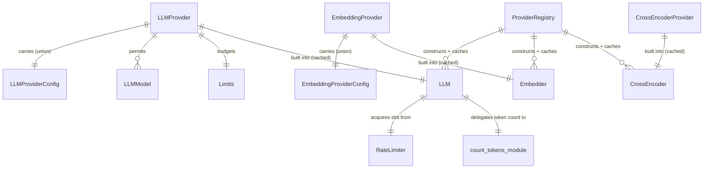
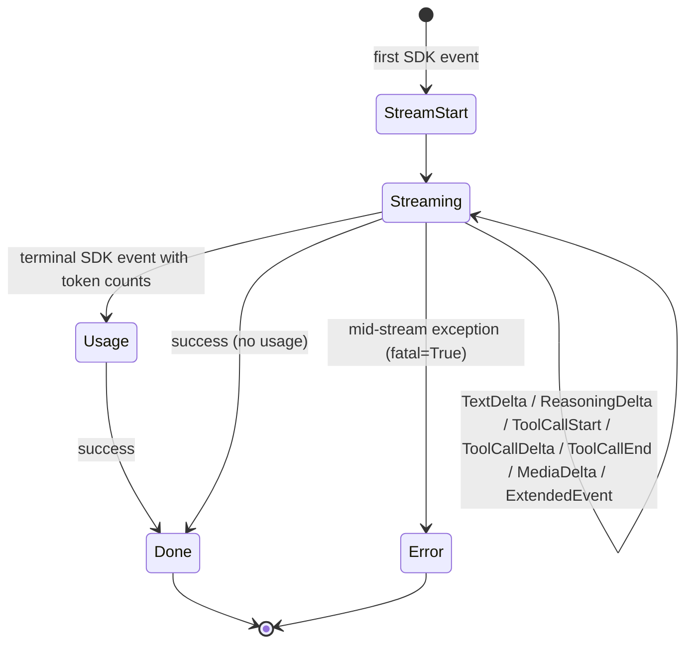
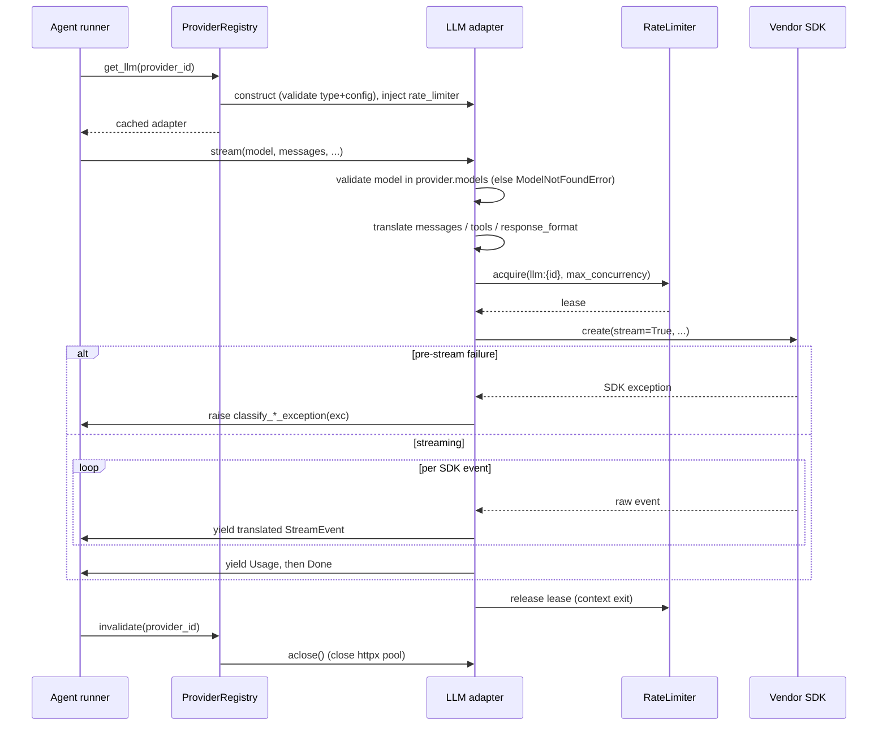

# Model Providers

## 1. Purpose

The model-providers subsystem is the adapter layer that converts Primer's universal, provider-agnostic model interfaces into the wire shapes of concrete vendor SDKs. It owns three model families: streaming chat LLMs (`primer/llm/`), text embedders (`primer/embedder/`), and cross-encoder rerankers (`primer/cross_encoder/`). Each adapter binds to one configured provider row at construction time, validates that the row's type and config class match, lazily constructs the underlying SDK client on first use, and translates the universal `Message` / `Tool` / `EmbeddingPart` types into and out of the provider's native format.

Callers (the agent loop, the ingest path, the collections subsystem) depend only on the abstract base classes `primer.int.LLM`, `primer.int.Embedder`, and `primer.int.CrossEncoder`; they never import a concrete adapter. The `ProviderRegistry` (`primer/api/registries/provider_registry.py`) is the single construction seam: it builds and caches one adapter per provider row, threads in the shared `RateLimiter` and `trace_llm_io` flag, and calls `aclose()` when a row is invalidated. This document covers the adapters and their shared contract; the coordinator's distributed rate-limiting and invalidation machinery is documented under the provider-pattern and coordinator design docs and is referenced here rather than restated.

## 2. Conceptual model

A provider row (`LLMProvider`, `EmbeddingProvider`, or `CrossEncoderProvider` in `primer/model/provider.py`) is a configuration record: which backend (`provider` enum), which models are permitted (`models`), the backend-specific connection details (`config`, a discriminated union), and the concurrency budget (`limits`). An adapter is the live object built from that row. The adapter serves every model the row declares; model selection happens per call, validated against `provider.models` with a `ModelNotFoundError` raised when the caller passes an unknown name.

The universal types the adapters translate are defined in `primer/model/chat.py` and `primer/model/embedding.py`: `Message` (a role plus a list of `Part`s), `Tool`, `ToolChoice`, the `StreamEvent` union that `LLM.stream` yields, and `EmbeddingPart` / `EmbedResponse` for embedders. Provider-specific knobs that do not map cleanly across vendors ride in an open-ended `extended: dict[str, Any]` slot the adapter interprets and silently drops unknown keys from.

```mermaid
erDiagram
    LLMProvider ||--|| LLMProviderConfig : "carries (union)"
    LLMProvider ||--o{ LLMModel : "permits"
    LLMProvider ||--|| Limits : "budgets"
    LLMProvider ||--|| LLM : "built into (cached)"
    EmbeddingProvider ||--|| EmbeddingProviderConfig : "carries (union)"
    EmbeddingProvider ||--|| Embedder : "built into (cached)"
    CrossEncoderProvider ||--|| CrossEncoder : "built into (cached)"
    LLM ||--|| RateLimiter : "acquires slot from"
    LLM ||--|| count_tokens_module : "delegates token count to"
    ProviderRegistry ||--o{ LLM : "constructs + caches"
    ProviderRegistry ||--o{ Embedder : "constructs + caches"
    ProviderRegistry ||--o{ CrossEncoder : "constructs + caches"
```

Six LLM backends ship today (`primer/model/provider.py` `LLMProviderType`): `openresponses`, `openchat`, `gemini`, `anthropic`, `ollama`, `openrouter`. Three embedder backends (`EmbeddingProviderType`): `huggingface`, `openai`, `gemini`. One cross-encoder backend (`CrossEncoderProviderType`): `huggingface`. The package re-exports five LLM adapters in `primer/llm/__init__.py.__all__` (`AnthropicLLM`, `GeminiLLM`, `OllamaLLM`, `OpenChatLLM`, `OpenResponsesLLM`); `OpenRouterLLM` is importable from `primer/llm/openrouter.py` but is not in `__all__`.

## 3. Architecture patterns implemented

- **Thin ABC, fat adapter.** `primer.int.LLM` declares `stream`, `count_tokens` and `aclose` as abstract, plus `count_tokens_detailed` with a default (see below) -- it lost `list_models` when `ModelProfile` rows became the registry of what an LLM provider serves; `primer.int.Embedder` declares three (`list_models`, `embed`, `aclose`) and keeps its own `models[]`. `aclose()` defaults to a no-op on both bases so adapters that hold no resources inherit cheaply. The signatures were derived from the cross-SDK comparison in `research/abc_interface.md` and `research/embedding_interface.md`.
- **Validate-then-stream construction.** Every adapter `__init__` checks `provider.provider` against its expected enum and `isinstance(provider.config, …)` against its expected config class, raising `ConfigError` on a mismatch. See `AnthropicLLM.__init__`, `HuggingFaceEmbedder.__init__`.
- **Lazy SDK client.** The SDK client (`AsyncAnthropic`, `AsyncOpenAI`, `google.genai.Client`, `ollama.AsyncClient`, `SentenceTransformer`) is constructed on first use via `_get_client()` / `_get_model()` and cached on the instance, so importing or constructing an adapter never opens a connection.
- **Shared `RateLimiter` instead of a per-adapter semaphore.** Concurrency is mediated through an injected `RateLimiter` (`primer.int.coordinator`) keyed `llm:{provider.id}` / `embedder:{provider.id}` / `cross_encoder:{provider.id}` with `max_concurrency` from `provider.limits`. When no limiter is injected the adapter falls back to `primer.coordinator.in_memory.InMemoryRateLimiter`. `tests/llm/test_adapters_no_local_semaphore.py` is a source-level pin asserting no adapter constructs its own `asyncio.Semaphore`.
- **Shared per-SDK exception classifiers.** `primer/common/openai_errors.py`, `anthropic_errors.py`, `google_errors.py`, and `mcp_errors.py` each expose one `classify_*_exception` function mapping the vendor SDK hierarchy onto the `primer.model.except_.PrimerError` tree. Adapters that wrap the same SDK (OpenResponses, OpenChat, OpenRouter, OpenAIEmbedder all wrap `openai`) share one classifier so the universal error surface does not drift.
- **Shared OpenAI-family helper modules.** `primer/llm/_openai_common.py` (`build_sampling_params(target=…)`) is shared by the Responses and Chat Completions adapters; `primer/llm/_openai_compat.py` (request/response shaping for Chat Completions) is shared by `OpenChatLLM` and `OpenRouterLLM`. Both modules are pure and do no network IO.
- **Flavor strategy table over enum-per-flavor.** OpenAI-compatible adapters carry a frozen `_FlavorPolicy` dataclass selected from a `_POLICY_BY_FLAVOR` table keyed by the config's flavor enum, so a new OpenAI-compatible server lands as one table row rather than a new adapter class.
- **Native token counters are groundwork, not yet on a turn path.** `count_tokens` is a mandatory abstract method backed by per-provider modules under `primer/llm/_tokenizer/`, and `primer.llm.counting.count_prompt_tokens` is the one wrapper meant to call it (see "Token counter contract" below). Nothing in the live turn path calls either yet: agent compaction still decides on a character heuristic (`CompactionStrategy.maybe_compact`), and `compaction_mixin.should_compact`, the only caller, has no production caller.
- **Observability woven into every stream.** Each `stream()` opens an OpenTelemetry span `llm.stream` and increments Prometheus counters (`llm_tokens_total`, `llm_failure_total`, `llm_duration_seconds`); the cross-cutting instrumentation is identical across adapters.

## 4. Code layout

| Path | Responsibility |
| --- | --- |
| `primer/int/llm.py` | `LLM` ABC: `stream`, `count_tokens`, `count_tokens_detailed` (default), `aclose`. |
| `primer/int/embedder.py` | `Embedder` ABC: `list_models`, `embed`, `aclose`. |
| `primer/int/cross_encoder.py` | `CrossEncoder` ABC for rerankers. |
| `primer/int/coordinator.py` | `RateLimiter` / `RateLimiterLease` ABCs and the `Coordinator` bundle. |
| `primer/coordinator/in_memory.py` | `InMemoryRateLimiter` fallback used when no limiter is injected. |
| `primer/model/provider.py` | Provider entities, provider-type enums, flavor enums, config classes, the `LLMProvider._coerce_config_to_provider` validator. |
| `primer/model/except_.py` | `PrimerError` hierarchy every classifier maps into. |
| `primer/llm/__init__.py` | Re-exports the five named LLM adapters. |
| `primer/llm/anthropic.py` | `AnthropicLLM` over `anthropic.AsyncAnthropic` Messages API. |
| `primer/llm/gemini.py` | `GeminiLLM` over `google.genai` `generate_content_stream`. |
| `primer/llm/ollama.py` | `OllamaLLM` over `ollama.AsyncClient` chat. |
| `primer/llm/openresponses.py` | `OpenResponsesLLM` over the OpenAI Responses API. |
| `primer/llm/openchat.py` | `OpenChatLLM` over the OpenAI Chat Completions API. |
| `primer/llm/openrouter.py` | `OpenRouterLLM` over the OpenRouter gateway (Chat Completions wire). |
| `primer/llm/_openai_common.py` | `build_sampling_params(target=…)` shared by Responses + Chat Completions. |
| `primer/llm/_openai_compat.py` | Chat Completions request/response shaping shared by OpenChat + OpenRouter. |
| `primer/llm/_trace.py` | `_serialize_messages` for the `trace_llm_io` span payload. |
| `primer/llm/_tokenizer/` | Per-provider token counters (`anthropic`, `gemini`, `hf`, `openai`, `char_fallback`), the offline tiktoken loader (`_tiktoken_offline`), the counter executor (`_executor`) and the vocabulary pins (`vocab_pins`). |
| `primer/llm/counting.py` | `count_prompt_tokens`: the one wrapper that owns timeout, fallback, labelling and negative caching. |
| `primer/model/token_count.py`, `primer/model/media_tokens.py` | `TokenCount` (a count plus what stands behind it) and the shared flat estimates for media blocks. |
| `primer/common/openai_errors.py` | `classify_openai_exception`, shared by every `openai`-SDK adapter. |
| `primer/common/anthropic_errors.py` | `classify_anthropic_exception`. |
| `primer/common/google_errors.py` | `classify_google_exception`. |
| `primer/llm/_failure.py` | `describe_failure`, `provider_label`, `scrub`: the message of a classified model-call failure. |
| `primer/embedder/openai.py` | `OpenAIEmbedder` (flavors OPENAI / LMSTUDIO / OTHER). |
| `primer/embedder/gemini.py` | `GeminiEmbedder` over `google.genai` `embed_content`. |
| `primer/embedder/huggingface.py` | `HuggingFaceEmbedder` over local sentence-transformers. |
| `primer/embedder/_prompts.py` | Model-family query/document prompt registry (BGE, E5, nomic-embed-text), shared by HuggingFace + OpenAI embedders. |
| `primer/cross_encoder/huggingface.py` | `HuggingFaceCrossEncoder` local reranker. |
| `primer/api/registries/provider_registry.py` | `ProviderRegistry`: per-row adapter cache, factory dispatch, rate-limiter binding, invalidation, `aclose`. |
| `primer/api/routers/providers.py` | Provider CRUD plus the `_discover_models` live-probe endpoint. |
| `ui/components/providers.jsx` | Console provider catalogue + per-backend config forms. |

## 5. Data model

### Limits

`Limits` (in `primer/model/provider.py`) carries two fields:

| Field | Type | Default | Description |
| --- | --- | --- | --- |
| `max_concurrency` | `PositiveInt` | required | Maximum in-flight requests held at once via the shared `RateLimiter`. |
| `request_timeout_seconds` | `float \| None` | `300.0` | Per-event inactivity timeout for LLM streaming calls. If no event arrives within this window the stream is aborted with `ProviderTimeoutError`. `None` disables it. See section 9 for enforcement details. |

### Provider entities

`LLMProvider`, `EmbeddingProvider`, and `CrossEncoderProvider` (`primer/model/provider.py`) all extend `Identifiable` and carry `provider` (the backend enum), `models` (a non-empty list of `LLMModel` / `EmbeddingModel` / `CrossEncoderModel`), `config` (a discriminated config union), and `limits` (a `Limits` with `max_concurrency` and `request_timeout_seconds`).

The `LLMProvider.config` union is `OpenResponsesConfig | OpenChatConfig | GoogleConfig | AnthropicConfig | OllamaConfig | OpenRouterConfig`. Because `OpenResponsesConfig` and `OpenChatConfig` share the `_HttpApiKeyConfig` shape and overlapping flavor values (`openai`, `other`), Pydantic's first-match-wins union dispatch would silently coerce an `openchat` row into `OpenResponsesConfig`. The `_coerce_config_to_provider` model-validator (mode `before`) defends against this by selecting the concrete config class from a `provider`-enum lookup before validation runs. `OpenRouterConfig` is not an `_HttpApiKeyConfig` subclass; it sets `ConfigDict(extra="forbid")`, hard-codes the base URL (no `url` field), requires `api_key`, and adds optional `app_name` / `app_url` attribution fields. The two defenses (validator plus `extra="forbid"`) are the same union-disambiguation problem at two layers.

Across the HTTP-keyed configs `api_key` is `Optional[SecretStr]` defaulting to `None`, so operators can register endpoints fronted by an auth-injecting proxy; a real provider that needs the key surfaces a 401 at call time rather than the schema rejecting the row. `OpenRouterConfig.api_key` is the exception (required), since OpenRouter is always remote and authenticated. The `EmbeddingProvider.config` union is `OpenAIConfig | HuggingFaceConfig | GoogleConfig`; `GoogleConfig` backs both the Gemini LLM and the Gemini embedder.

Flavor discriminators live on the config rather than the provider enum: `OpenResponsesFlavor` (OPENAI / LMSTUDIO / OTHER), `OpenChatFlavor` (OPENAI / LMSTUDIO / OLLAMA / VLLM / OTHER), `OpenAIEmbeddingFlavor` (OPENAI / LMSTUDIO / OTHER). The adapter resolves each flavor to a frozen `_FlavorPolicy`; only `require_api_key` is consulted at runtime today (the OpenResponses policy also carries `drop_encrypted_reasoning` and `expect_reasoning_under_store_true` as forward-compat scaffolding).

`require_api_key` is `True` for the OPENAI flavor only. Every other flavor, including the OTHER catch-all, tolerates a missing key and lets the upstream 401 surface at call time, which is the same contract the schema-level `Optional[SecretStr]` expresses. OTHER is the flavor an operator lands on for any OpenAI-compatible server that is not explicitly modelled, and that population is dominated by self-hosted backends (vLLM, SGLang, llama.cpp, TGI, LiteLLM) which are commonly unauthenticated, so "unknown server" cannot be read as "authenticated server". This matters most on the Responses API, where OTHER is the only flavor available for a non-LM-Studio self-hosted endpoint.

The streaming surface is a small state machine. `LLM.stream` is an async generator that always yields exactly one terminal event. A per-stream `_StreamState` dataclass tracks request id, model, accumulated tool-call argument fragments, token counts, and the final stop reason; a pure `_translate_event` / `_translate_chunk` dispatch maps each SDK event onto the universal `StreamEvent` union (`primer/model/chat.py`).

```mermaid
stateDiagram-v2
    [*] --> StreamStart : first SDK event
    StreamStart --> Streaming
    Streaming --> Streaming : TextDelta / ReasoningDelta / ToolCallStart / ToolCallDelta / ToolCallEnd / MediaDelta / ExtendedEvent
    Streaming --> Usage : terminal SDK event with token counts
    Usage --> Done : success
    Streaming --> Done : success (no usage)
    Streaming --> Error : mid-stream exception (fatal=True)
    Done --> [*]
    Error --> [*]
```

### Aggregated LLM provider

`LLMProviderType.AGGREGATED` ("aggregated") is a config-only provider that
wraps a pool of other LLM providers behind one LLM interface. Its
`AggregatedLLMConfig` carries:

- `members`: an ordered list of `(provider_id, model_name)` pairs, deduped
  on the pair preserving first-seen order (min length 1). Each member must
  reference an existing NON-aggregated provider; existence is checked at
  resolve time, not at write time.
- `strategy`: `sequential` (always start at members[0]) or `round_robin`
  (rotate the starting member once per call; per-process, load-spreading).
- `failover_point`: `before_first_token` (default; never re-emits tokens)
  or `mid_stream` (opt-in; may duplicate already-shown tokens).
- `failover_on`: `transient` (rate-limit / 5xx / timeout / network) or
  `transient_and_config` (default; also auth / bad-request).

The aggregated provider still carries `models` - the virtual model name(s)
an agent selects. `stream(model=<virtual>)` dispatches to each member using
that member's own `model_name`; the virtual name is not forwarded
downstream.

**Two failover channels.** A member surfaces a failure two ways, and the
aggregated adapter handles each:

- Connect phase (before the first event): the member RAISES a typed
  exception. Matched by class - the reliable channel.
- Mid-stream (after at least one event): the member usually YIELDS a
  terminal `Error(fatal=True)`, but a mid-stream timeout is RAISED instead.
  The adapter inspects the FIRST event before forwarding anything, so a
  first-event fatal error fails over without emitting tokens. Yielded errors
  carry a `code` that is often null for transient failures, so yielded-error
  eligibility is best-effort by code (known timeout codes and null are
  always eligible; other codes are eligible only under
  `transient_and_config`).

**The commit point is the first event of any kind.** The failover window
closes at the first event the member yields, including a `StreamStart`. In
practice rate-limit and auth failures RAISE at connect, before any event,
so they fail over cleanly; a fatal error that arrives only after the first
event is surfaced (default mode) rather than retried.

**Class coarsening on the yielded channel.** Because the classify_*
functions erase the exception class to `code=null` for rate-limit, server,
auth, and network failures, the yielded channel cannot honor the
`transient` policy's "exclude auth" guarantee: a null-code fatal error is
treated as eligible under either policy. This is safe because the
yielded-error failover window ends before any token is emitted, and auth
failures also RAISE at connect (where the class is preserved and `transient`
correctly excludes them). The all-members-failed error is an aggregated
`RateLimitError` whose message lists each member and its failure class;
that per-member class summary is the coarsened record of what went wrong.
The one exception is a pool in which EVERY member failed because the prompt
did not fit the context window (`primer.common.context_overflow`): that is
not "rate limited, retry later", and the executor's overflow recovery keys on
it, so the last member's own `BadRequestError` is re-raised instead (for a
member that YIELDED its 400, one is built from the `Error`). Any other mix of
failures, a rate limit or a missing member among them, stays the aggregated
`RateLimitError`. An overflow on a single member still fails over to the next.
Because the re-raised `BadRequestError` is what the executor's hard-overflow
recovery catches, an aggregated pool takes the same recovery as an eager
adapter: the replay continues the turn, so no tool runs twice (see
`docs/dev/subsystems/agents.md`).

**Safety constraint.** Clean failover is only possible before the first
non-terminal event reaches the subscriber; retrying after partial output
was streamed would re-emit shown tokens. That is why `before_first_token`
is the default. Under `mid_stream`, both a yielded fatal eligible Error and
a raised eligible exception (e.g. a mid-stream timeout) after tokens were
shown restart on the next member, and the already-streamed tokens may be
duplicated in the output; this is the documented trade-off of the mode.

**No nesting.** A member that resolves to another aggregated provider (or
to itself) is rejected at resolve time with `BadRequestError`.

**Ownership.** Downstream adapters are owned and cached by the
`ProviderRegistry`; `AggregatedLLM.aclose()` is a no-op. Members resolve
lazily per `stream` call through the registry, so editing a member is
picked up transparently on the next call.

### Model profiles

`LLMProvider.models[]` no longer exists. What a provider can serve is
expressed by :class:`~primer.model.model_profile.ModelProfile` rows
pointing at it, each naming one `(provider, model)` pair plus its
API-level config. Several profiles may share a model name; that is the
point, and it is what lets one model be registered twice with different
reasoning settings. An Agent references a profile id, and session
create may override it per run.

`ModelProfileConfig.reasoning` is a vendor-neutral level mapped per adapter
in `primer/llm/_reasoning.py`, the same normalisation the adapters already
do for stop reasons. Where a vendor has no true off, the closest setting is
used:

| Adapter | Wire shape | OFF maps to |
| --- | --- | --- |
| `openresponses` | `reasoning.effort` | `minimal` (no true off) |
| `openchat` (openai) | `reasoning_effort` | `minimal` |
| `openchat` (vllm/ollama/lmstudio) | `chat_template_kwargs.enable_thinking` | `false` |
| `anthropic` | `thinking.type` + `budget_tokens` | `disabled` |
| `gemini` | `thinking_config.thinking_budget` | `0` |
| `ollama` | `think` | `false` |

**vLLM is asymmetric and this was verified against a live server, not
assumed.** On Chat Completions, `chat_template_kwargs.enable_thinking:
false` works: the response carries `reasoning: null` and real content. On
the Responses endpoint, that key, `extra_body.chat_template_kwargs`, a
top-level `enable_thinking`, and a native `reasoning.effort` are all
accepted WITHOUT error and all ignored, with reasoning emitted regardless.
So `openresponses` + `vllm` maps nothing and logs a warning naming the
`openchat` provider type as the way to get the control. An operator who
needs reasoning control against vLLM must use `openchat`.

### Transport retries

Every adapter except `aggregated` is wrapped in
:class:`~primer.llm.retrying.RetryingLLM` by the registry factory. It
replays a stream that failed at the TRANSPORT level (`NetworkError`,
`ProviderTimeoutError`, `ServerError`, `RateLimitError`) and never replays
one the API explicitly rejected, because that reproduces the same rejection
and only delays the error. Retries stop at the first streamed event: once
output has reached the consumer, re-running would duplicate tokens.
Backoff is exponential with full jitter, tuned by `Limits.max_retries` /
`retry_backoff_seconds` / `retry_backoff_max_seconds`.

`aggregated` is excluded deliberately: it already fails over across
members, and wrapping it would retry the whole pool before trying the next
member. Its members resolve through the same factory, so each is wrapped
individually.

### Baked tokenizer vocabularies

The OpenAI-family token counter needs two tiktoken vocabularies (`o200k_base`, `cl100k_base`). tiktoken's own loader fetches them over the network, with no timeout, whenever its cache misses or fails its hash check, whatever `TIKTOKEN_CACHE_DIR` says. The Docker image therefore bakes them: a `tokenizer-vocab` stage in the `Dockerfile` runs `scripts/bake_tokenizers.py`, which downloads each file under one hard wall-clock deadline (the download runs on a daemon thread the script stops waiting for, so a slow DNS lookup, a stalled TLS handshake or a server trickling one byte at a time cannot hold the build), verifies its sha256 against the pins in `primer/llm/_tokenizer/vocab_pins.py` (directly, not through tiktoken) and writes it atomically in tiktoken's own cache layout (`sha1(url)` file names). The final stage (below both `uv sync` layers, so a pin or script change never invalidates the dependency install) copies the directory to `/opt/primer/tiktoken-cache`, sets `TIKTOKEN_CACHE_DIR` to it and re-runs the script with `--check`, which verifies bytes on disk and never touches the network. `python3 /opt/primer/bake/bake_tokenizers.py --check` also works inside a running container as a readiness check. A stock `tiktoken.get_encoding` loads both encodings offline from that directory.

The pins mirror `tiktoken_ext.openai_public`; `tests/tooling/test_bake_tokenizers.py` fails if the installed tiktoken disagrees, so a tiktoken bump that moves a vocabulary is caught in CI, not at runtime. Re-pin by updating `vocab_pins.py` from the new `openai_public` source. The full image build itself runs only at release (`release.yml`, after the PyPI publish); `docker build --target tokenizer-vocab .` exercises the bake alone in seconds. Installs outside the image (pip, `uv run primer api`) do not get the baked directory.

### Token counter contract

A counter is a function that is meant to raise when it cannot count; the wrapper is what a turn calls. Nothing in the live turn path calls either yet.

- **Counters raise; they do not estimate.** `LLM.count_tokens_detailed` returns a `TokenCount` (`total`, `exact`, `estimated_components`, `encoding`, `declared`) or raises `TokenCounterUnavailable` (`primer/model/except_.py`; `transient` says whether a retry can help) or a mapped provider error. `exact` is True only for the model's own tokenizer or a vendor count endpoint; an OpenAI encoding applied to an unknown model is `exact=False`, and media blocks are reported as an estimated component (flat constants in `primer/model/media_tokens.py`, shared with the compaction heuristic). `declared` is False only on the ABC default, which wraps `count_tokens` and vouches for nothing: the wrapper reports such a number as `source=estimate`, `outcome=legacy_counter`, never as native. Every shipped counter (OpenAI family, Anthropic, Gemini, HF, aggregated) raises on failure and declares what it counted. A test (`tests/llm/test_counting_not_wired.py`) keeps a returned heuristic out of the three formerly swallowing counters once anything wires the wrapper.
- **`count_prompt_tokens` never raises** (`CancelledError` aside) and never blocks past a backstop. It returns a `CountResult` whose `source` is `native`, `native_approx`, `native_plus_estimated` or `estimate`, and whose `outcome` says why an estimate was used (`legacy_counter` for an adapter that declares nothing). Transient failures (timeout, network, 5xx, 429, 408, 425, a counter queue that did not start) are negative-cached per `(provider, model)` for 60 s with one WARNING per window; a deterministic rejection (400, auth, unsupported content, any other unclassified 4xx such as 413 or 422) is reported and never cached, so one conversation's failure cannot disable counting for every session on a model. Anything unexpected is `fallback_bug`: an ERROR with the traceback, a counter the test suite asserts stays at zero, never a count.
- **tiktoken never fetches.** `primer/llm/_tokenizer/_tiktoken_offline.py` reads the vocabulary from the cache directory (resolved as tiktoken resolves it), verifies its sha256 against the pins, builds the `Encoding` from the verified bytes by running tiktoken's own constructor against a copy of its globals, memoises successes, and the failures that cannot cure themselves (file absent, hash mismatch, unbuildable, no cache directory), for the life of the process (a transient OS error such as EMFILE, EACCES or EIO is not memoised and is retried on the next count), and raises `TokenCounterUnavailable` when anything is missing. It never calls `tiktoken.get_encoding` and leaves a bad file where it is. Counting uses `encode_ordinary`, because `encode` raises on content that spells a special token (`<|endoftext|>` in a web page a tool fetched).
- **Synchronous counters run off the event loop** on a dedicated two-thread executor (`primer/llm/_tokenizer/_executor.py`) so a burst of counts cannot starve the shared default pool; a count that has not started within the queue-wait bound is a transient `TokenCounterUnavailable`.
- **Aggregated profiles** count with the first member that can and never claim the result is exact (the member that counted may not be the one that serves). When none can, the failure is `TokenCounterUnavailable`, not `ConfigError`.
- **What each counter sends, and how it is bounded.**

  | Adapter | Counter | Bound | System text | Tools | Media | Result |
  | --- | --- | --- | --- | --- | --- | --- |
  | OpenAI / OpenChat / OpenRouter | tiktoken, offline | CPU only, counter executor | counted | counted | flat estimate | `exact` only for a model in `_MODEL_TO_ENCODING` |
  | Anthropic | `messages.count_tokens` | 3 s per attempt and 3 s for the whole call (`asyncio.wait_for`), `max_retries=0`: the SDK's `timeout` is applied to each connect, write, read and pool wait separately, so a server that keeps trickling bytes is never cut off by it | the `system` parameter | sent | stripped, flat estimate | exact, `media` estimated |
  | Gemini | `models.count_tokens` | 3 s per attempt (`http_options`) and 3 s for the whole call (`asyncio.wait_for`): google-genai's aiohttp path sleeps 1 to 10 s and retries once after a connection error, so the per-attempt timeout alone is not a bound | estimated, never sent | estimated, never sent | dropped, flat estimate | exact over contents, `system`/`tools`/`media` estimated |
  | Ollama | local `AutoTokenizer` | CPU only, counter executor | counted | counted | flat estimate | never exact; unavailable unless a repo-id tokenizer is cached |

  Gemini never sends `system_instruction`, `tools` or `generation_config` on a count: the Developer-API client raises `ValueError` for all three. Anthropic never sends an empty base64 placeholder for media. Both vendor counters raise on failure; neither falls back inside the adapter.
- **Metrics** (`llm_count_tokens_total`, `llm_count_tokens_seconds`, `llm_tokenizer_ready`) are described in `docs/dev/architecture/observability.md`.

### What `Usage.input_tokens` means

`Usage.input_tokens` is the whole prompt the provider processed, cached tokens included; `cached_input_tokens` is a subset of it. Anything that reads provider usage as the size of the prompt depends on each adapter honouring that, so the mapping is pinned from payloads in `tests/llm/test_usage_semantics.py`:

| Kind | Source field | Includes cached tokens? | Status |
| --- | --- | --- | --- |
| Anthropic | `usage.input_tokens` + `cache_read_input_tokens` + `cache_creation_input_tokens` | the API's `input_tokens` EXCLUDES them (documented); the adapter adds them back | pinned |
| Gemini | `prompt_token_count` | yes (documented) | pinned |
| OpenResponses | `input_tokens`, cached from `input_tokens_details` | yes | pinned |
| OpenChat, OpenRouter | `prompt_tokens` | OpenAI spec: yes; LM Studio, llama.cpp, vLLM and OpenRouter not verified | mapping pinned, semantics unverified |
| Ollama | `prompt_eval_count` | docs list `prompt_eval_cached_count` separately; reports say a warm cache lowers it and a prompt past `num_ctx` is silently truncated and reported post-truncation | mapping pinned, not reproduced, do not trust as the prompt size |

Cost note: `Usage.input_tokens` (and so `llm_profile_tokens_total{direction="in"}`) now counts Anthropic cache reads and cache creation at FULL weight, because it is the size of the prompt. Providers bill cache reads at a fraction, so any cost derived from `input_tokens` alone over-costs cached traffic; subtract or discount `cached_input_tokens`. primer does not enable Anthropic prompt caching today, so no deployment sees a difference yet.

## 6. Lifecycle

An adapter is built lazily by `ProviderRegistry` on first lookup of a provider row, cached under the row id, and dropped (with `aclose()`) when the row is invalidated. A single `stream()` call walks the validate, translate, acquire, iterate, classify sequence below. Pre-stream exceptions are classified and re-raised; once the iterator has opened, mid-stream exceptions are classified and yielded as a terminal `Error(fatal=True)` so the consumer's `async for` always closes cleanly.

```mermaid
sequenceDiagram
    participant Caller as Agent runner
    participant Reg as ProviderRegistry
    participant Adp as LLM adapter
    participant RL as RateLimiter
    participant SDK as Vendor SDK

    Caller->>Reg: get_llm(provider_id)
    Reg->>Adp: construct (validate type+config), inject rate_limiter
    Reg-->>Caller: cached adapter
    Caller->>Adp: stream(model, messages, ...)
    Adp->>Adp: validate model in provider.models (else ModelNotFoundError)
    Adp->>Adp: translate messages / tools / response_format
    Adp->>RL: acquire(llm:{id}, max_concurrency)
    RL-->>Adp: lease
    Adp->>SDK: create(stream=True, ...)
    alt pre-stream failure
        SDK-->>Adp: SDK exception
        Adp->>Caller: raise classify_*_exception(exc)
    else streaming
        loop per SDK event
            SDK-->>Adp: raw event
            Adp->>Caller: yield translated StreamEvent
        end
        Adp->>Caller: yield Usage, then Done
    end
    Adp->>RL: release lease (context exit)
    Caller->>Reg: invalidate(provider_id)
    Reg->>Adp: aclose() (close httpx pool)
```

Embedders follow the mirror flow: validate model, map every `EmbeddingPart` to its input type before acquiring the lease (so unsupported parts fast-fail without holding a slot), acquire, call the SDK, classify exceptions, and translate the response into `EmbedResponse`. The local `HuggingFaceEmbedder` and `HuggingFaceCrossEncoder` differ only in that the SDK call is a synchronous `SentenceTransformer.encode` / `.predict` wrapped in `asyncio.to_thread` so the event loop is never blocked by weight loading.

- Aggregated providers resolve members lazily per call via
  `ProviderRegistry.get_llm`, so a member edit (which invalidates that
  member's own cache entry) is picked up on the next aggregated call with
  no cross-invalidation wiring.

## 7. Persistence

Provider rows (`LLMProvider`, `EmbeddingProvider`, `CrossEncoderProvider`) are persisted as CRUD-able entities through the storage layer and edited via `primer/api/routers/providers.py`; the adapters themselves hold no durable state. The one persistence concern the adapters touch is auto-bootstrap: on first boot the `BootstrapRunner` (`primer/bootstrap/runner.py`, `primer/bootstrap/defaults.py`) seeds a reserved HuggingFace embedder row (id `huggingface`, empty `SecretStr` token so public Hub models load with zero configuration) and a reserved HuggingFace cross-encoder row (id `huggingface-ce`). The provider registry reserves those ids (`RESERVED_EMBEDDER_IDS`, `RESERVED_CROSS_ENCODER_IDS`) so operators cannot shadow the built-in adapters. LLM providers have no reserved ids and are always operator-provided; OpenRouter rows in particular are added explicitly with no bootstrap. Token-counter caches (LRU keyed on content hashes for the network counters, a per-process tokenizer cache for HuggingFace) are in-memory only and never persisted.

## 8. Public surfaces

The abstract surface callers consume:

- `LLM` has no `list_models()`: what an LLM provider serves is its `ModelProfile` rows, not a list on the adapter, so the question is answered from storage (`GET /v1/llm_providers/{id}/models`) or by a live probe (`GET /v1/llm_providers/{id}/discovered_models`). The embedder and cross-encoder families still carry their own `models[]` and keep `list_models()`. `LLM.stream(model, messages, temperature, top_p, max_output_tokens, stop, response_format, tools, tool_choice, extended)` is the async generator. `LLM.count_tokens(model, messages, tools)` returns a best-effort prompt estimate. `LLM.aclose()` releases the SDK client.
- `Embedder.list_models()` and `Embedder.embed(model, inputs, output_dimensions, config)` returning `EmbedResponse`.
- `CrossEncoder` exposes the reranker surface.

The construction surface is `ProviderRegistry` (`primer/api/registries/provider_registry.py`). Its `_build_default_llm_factory` dispatches each `LLMProviderType` to its adapter, forwarding `rate_limiter` and `trace_llm_io`; `_build_default_embedder_factory` and `_build_default_cross_encoder_factory` do the same for their families. `bind_rate_limiter` rebuilds the factories with the coordinator's limiter once it is available.

The REST surface (`primer/api/routers/providers.py`) carries provider CRUD plus two live-probe endpoints sharing one dispatch (`_probe_llm_models`): `POST /v1/llm_providers/_discover_models` takes a DRAFT config, for the create form before anything is persisted, and `GET /v1/llm_providers/{id}/discovered_models` reads the SAVED row's config server-side, for the detail page. The second exists because secrets are redacted on the wire: replaying a config the console fetched would authenticate upstream with `"**********"`. It also unwraps `SecretStr` before probing, since the helpers interpolate config values straight into an `Authorization` header. Every message a probe builds from text a library produced is built by `_probe_failure`, which masks URL-borne credentials (`redact_url_secrets`) first (the Gemini 401/403 and the "not supported" arms carry text of ours, with no URL, and are plain `BadRequestError`s): httpx prints the whole request URL in its error, so a Base URL `http://user:pw@host/v1` would otherwise come back as `for url 'http://user:pw@host/v1/models'` in the 400, in the `last_error` stamped on the saved row (kept until the next probe, so a row stamped before this change keeps its old text until it is probed again) and in the `detail` of the `llm_provider` predicate of `GET /v1/setup/state`; it reads `http://[REDACTED]@host/v1/models` now (ticket 01a11c0d-dd9a). A draft that fails validation is described by `_validation_detail`, pydantic's own layout (`N validation error(s) for <Model>`, each field on its own line with the reason indented under it, `[type=..., input_type=...]`) WITHOUT `input_value`: pydantic cuts a long input to its first 25 and last 24 characters, which removes the `@` and leaves a slice of a password readable, and a raw `/`, `?` or `#` in a password ends the userinfo for any URL-shaped mask, so the typed value is never printed. Note the pair `GET /{id}/models` (what is REGISTERED here, derived from `ModelProfile` rows) versus `GET /{id}/discovered_models` (what the upstream OFFERS) -- the difference is exactly what the console's Fetch action turns into new profiles. The probe has per-backend arms. The Ollama arm probes `ollama.AsyncClient.list` and seeds a default `context_length`; the OpenRouter arm uses a plain `httpx.AsyncClient` against `/models` (not the openai SDK, which strips OpenRouter-specific catalogue fields like pricing and modality) and skips default `context_length` seeding because the catalogue carries it verbatim. The Anthropic arm returns 400 to signal the UI to fall back to a curated suggested-model list, because Anthropic has no useful list-models API. The console form catalogue lives in `ui/components/providers.jsx`, which also hosts `PR_LlmProfilesPanel`: the LLM provider detail page has no models table, because an LLM provider has no `models[]`. The panel lists the profiles pointing at that provider and turns a fetch result into new ones, synthesising ids with the same `<provider>--<model-slug>` rule as the m002 migration so a created profile collides with rather than duplicates a migrated one. Already-registered models stay selectable: a second profile for the same model is the point of the entity.

Creating or changing an MCP toolset on the `stdio` transport, or a python toolset, is admin-only, although the toolset routes and the `create_toolset` / `update_toolset` system tools sit on the user tier: a stdio toolset names a command the primer process launches on the server host when the toolset is probed or called, and a python toolset's source runs on the server host (`LocalHardenedRunner`, a child of the API or worker process), which is system configuration of the same class as the provider rows. So is an update that changes an http / sse toolset's URL or OAuth endpoints (`redirect_uri`, `resource_uri`) while a secret (a header, the OAuth `client_secret`) is sent back as the served mask: `preserve_masked_secrets` would restore the stored secret, and it would go to the new endpoint, which the caller never had to know the secret to choose. A caller below admin re-enters the secrets when it changes the URL; an update that keeps the endpoint keeps its masked secrets as before. The rule is one predicate, `toolset_admin_reason(entity, existing=None)` in `primer/toolset/toolset_checks.py`, which answers the reason or `None`: the stdio and python checks count either side of an update (so a user can neither turn an http toolset into a stdio or python one nor edit one, even to point it at http), and the repoint check compares the endpoints and then runs `preserve_masked_secrets` on a copy to see whether a mask would be restored. A delete launches nothing and is not gated: deleting a stdio or a python toolset stays user-tier, a conscious decision (removing code from the server host grants no power over it; the lead scoped A-02, and then AUTHZ-01, to creating and changing). Both writers apply it. The REST pre-write hooks (`_toolset_on_pre_create` / `_toolset_on_pre_update`) call `require_admin(request)` first, before the reserved-id check, the reachability probe and the restoring of masked secrets, and answer 403 `forbidden_role` with the reason as the detail. The system tools cannot lean on the tool manager's floor, which compares only the tool's static `required_role`, so `_crud_tools_for` takes an `admin_when` predicate (which may answer the reason as a string, then used as the refusal message) and its create / update handlers read the run's identity from `ToolContext.initiated_by` under the floor's own predicate (`primer.authz._role_allows`: an admin, or the internal `system` actor; a trigger-fired run is ranked by its owners' roles, see `docs/dev/subsystems/triggers.md` section 9) and answer `type=forbidden` before any guard or write. A call that carries no `ToolContext` has no known role and is refused: the `/v1/mcp` endpoint dispatches handlers without one, so an MCP client cannot create a stdio or python toolset through the system tool at all (an admin uses `POST /v1/toolsets`). The dedicated `create_python_toolset` / `update_python_toolset_source` tools are statically `required_role="admin"`, which agrees. The command allowlist (`mcp_stdio_allowed_commands`) is unchanged and still applies on top. Pinned by `tests/api/test_toolset_stdio_admin.py`, `tests/toolset/test_system_toolset_stdio_admin.py`, `tests/api/test_toolset_write_privilege.py` and `tests/toolset/test_system_toolset_write_privilege.py`; a test that writes such a toolset through a system tool says who is writing with `tests/_support/caller.py`.

Inbound MCP is the mirror of the outbound MCP toolset client and is a peer surface to this subsystem: `primer/mcp/server.py` builds an `mcp.server.lowlevel.Server` exposing Primer's own tool catalogue over Streamable HTTP at `/v1/mcp`, gated by `is_exposable` filtering (`primer/mcp/safety.py`, denying `yielding_unsupported` and `needs_session`), a cookie-only exposure-config rule, and the `primer/agent/tool_manager.py` `invoke_one` helper that bypasses the approval gate and workspace dispatch. Full detail lives in the MCP and rest-api docs.

## 9. Internal contracts

- **Per-event inactivity timeout (`Limits.request_timeout_seconds`).** Each LLM adapter reads `provider.limits.request_timeout_seconds` at construction time and stores it as `self._request_timeout_seconds`. During streaming the adapter passes the SDK iterator through `primer.llm._timeout._iter_with_timeout`, which wraps every `__anext__` call with `asyncio.timeout(seconds)`. If no event arrives within the window `asyncio.TimeoutError` is raised, the adapter catches it before the generic `except Exception` clause, and re-raises it as `primer.model.except_.ProviderTimeoutError` (a `ProviderError` subclass). This propagates out of the async generator to the agent loop, which catches it as a generic `Exception` and records it as an error row / turn failure, releasing the concurrency slot and ending the turn cleanly. `None` disables the timeout entirely. The default is 300 s. LM Studio guidance: LM Studio can stall mid-generation on large models or low-memory hardware; 300 s covers most real runs. Lower to 60 s for faster failure detection if hardware is fast enough.
- **Always exactly one terminal event.** Every successful `stream()` ends with one `Done`; every failed stream ends with one `Error(fatal=True)`. Pre-stream exceptions (the iterator never opened) re-raise the classified `PrimerError` instead. Exception: a timeout raises `ProviderTimeoutError` out of the generator rather than yielding a terminal event, because `asyncio.TimeoutError` fires asynchronously and the generator is already unwinding.
- **Stop-reason normalisation.** Each adapter maps its vendor finish reason onto the universal `StopReason`. The shared rule across Anthropic, Gemini, Ollama, and the Chat Completions adapters: a natural stop collapses to `tool_use` when the stream emitted any tool call, otherwise `stop`, so downstream callers get a consistent signal to dispatch tools. Unknown reasons collapse to `other`. `tool_turn_cap` is in the same `StopReason` literal but no adapter produces it: the agent loop sets it on the `Done` of the round that tripped `Agent.max_tool_turns` (the model's own reason stays in `raw_reason`; see `docs/dev/subsystems/agents.md`). The Chat Completions adapters (`openchat`, `openrouter`; the shared code is `_map_finish_reason` in `primer/llm/_openai_compat.py`) did NOT apply that rule until it was fixed: they mapped the server's `finish_reason` alone, so a server that is not OpenAI (LM Studio, llama.cpp, vLLM, some gateways) that ends a tool round with `"stop"` was recorded as `Done(stop_reason="stop")`, which the readers that take a `done` that is not `tool_use` for the end of a turn (the persisted `done` record, `scripts/analyse_estimate_ratio.py`) read as the turn ending. Now only a `"stop"` is reinterpreted (to `tool_use` when the stream emitted a tool call); `"tool_calls"` and the legacy `"function_call"` are `tool_use`; `"length"` with tool calls stays `max_tokens` (the call may be truncated, which is not a clean tool round); `content_filter` and unknown reasons stay what they were (`raw_reason` keeps the server's string). Gemini, Ollama and the Responses adapter already looked at the calls.
- **Tool-call id synthesis.** Adapters whose protocol omits stable tool-call ids (Gemini, Ollama) synthesise `call_{index}` so the universal `ToolCallStart` / `ToolCallDelta` / `ToolCallEnd` triple and round-trip `ToolResultPart` correlation have an id to pair on.
- **Chat Completions tool calls are tracked by stream index, and a new id on a live index starts a new call.** `_translate_chunk` (`primer/llm/_openai_compat.py`, shared by `openchat` and `openrouter`) keeps one in-progress call per `index` of the stream. A gateway that numbers EVERY parallel call with the same index (they are streamed one after the other, each header carrying its own id and the argument chunks that follow carrying none) used to lose the second call: its header was dropped and its arguments were appended to the first's, which then ended with `{}`. Now a header with another id on an index already in progress ends the call in progress (`ToolCallEnd`) and starts the new one; a chunk that repeats the same id (some servers send the id and name on every chunk) is a continuation. Not handled: parallel calls that share an index AND interleave their argument chunks, which cannot be told apart without ids on the chunks, and a new call whose id and name arrive in different chunks. Which gateways number parallel calls per index (vLLM, LM Studio, the Ollama flavors, OpenRouter routes) is UNVERIFIED: the fix is defensive and rests on the wire shape, not on a live capture.
- **`response_format` translation.** OpenAI, Gemini, and Ollama have native structured-output surfaces; the adapter routes the Pydantic class or dict schema to them. Anthropic has no JSON mode, so `AnthropicLLM` emulates it with a forced single synthetic tool named `structured_output`, and raises `ConfigError` if `response_format` is combined with caller-supplied tools or an explicit `tool_choice`.
- **Unsupported parts raise, never drop.** An adapter that cannot transmit a `Part` modality raises `UnsupportedContentError` rather than silently dropping it, so input/output index correspondence is never corrupted. Embedders run this check before acquiring a rate-limit slot.
- **Assistant history replays as string content on the Responses API.** `_finalize_message_item` (`primer/llm/openresponses.py`) collapses a text-only assistant item to `{"role": "assistant", "content": "<text>"}` before it is appended to the `input` list. A list of `output_text` parts matches only the `ResponseOutputMessageParam` union arm, which also requires `id` and `status`; real OpenAI infers those but a strict reimplementation of the schema rejects every arm and returns a 400 enumerating the whole union. String content matches `EasyInputMessageParam`, which accepts `role="assistant"`, and validates against both. Tool calls are split into separate `function_call` items before this runs, so the text-only case is the common one and the collapse is lossless; an assistant message carrying non-text parts keeps the list form.
- **Unknown extended kwargs are dropped with one DEBUG line.** Each adapter whitelists the extended keys its wire format accepts and logs the dropped remainder once, so an operator diagnosing "my knob is not taking effect" has a discoverable signal.
- **A counter raises; the wrapper keeps a turn safe.** No adapter returns a heuristic number from `count_tokens`; a failure is a mapped provider error or `TokenCounterUnavailable`, and `primer.llm.counting.count_prompt_tokens` is the one place that turns it into a labelled estimate (see "Token counter contract"). The per-adapter wiring: OpenResponses, OpenChat and OpenRouter call `count_tokens_openai_detailed` (tiktoken, offline, off the loop); Anthropic calls `count_tokens_anthropic_detailed` (the vendor endpoint); Gemini calls `count_tokens_gemini_detailed` (the vendor endpoint over the contents only); Ollama runs `count_tokens_hf_detailed` (a local `AutoTokenizer`) on the counter executor. `transformers` ships in the optional `huggingface` extra and is imported lazily, so an install without it reports the Ollama counter as unavailable instead of returning a number.
- **A failed model call names the provider and carries the provider's own words (C-024).** The classifiers choose the exception class, `code` and `status_code`; the message used to be a fixed vendor label ("OpenAI server error"), which dropped what the provider said and called every OpenAI-compatible endpoint OpenAI. Each adapter now passes the classified error through `describe_failure` (`primer/llm/_failure.py`), which keeps all three and rewrites the message of the four shapes that lost the provider's text (server error, rate limit, authentication, network): `Model provider 'lm-studio-box' (openchat/lmstudio) had a server error (HTTP 500): upstream exploded`. The label is the configured provider id and the backend kind (plus the flavor of an OpenAI-compatible one); the text is the body's `error.message` (else a bounded slice of the body: nested `error` objects are walked iteratively, at most 8 levels, and a body that nests deeper or has no message is dumped to a depth of 4), whitespace collapsed, non-whitespace control characters (NUL, ESC) stripped, and capped at 300 characters; a network failure ALWAYS takes the transport's own reason (the exception it was raised from, or the context it was raised in unless `from None` suppressed it, else ollama's `.error`, else a builtin `ConnectionError`'s text: ollama's "Failed to connect to Ollama..." is raised `from None`, so it is the sentence, not the transport's "All connection attempts failed"), never the SDK's class label, and a body nobody can read leaves the sentence without its text instead of crashing the classification. A 4xx the provider rejected, a mid-stream provider error and any other shape keep the SDK's message, because `primer.common.context_overflow` reads it; it is masked and capped at 4000 characters, so a multi-megabyte body cannot land whole in the session record. The text is normalised FIRST (control characters such as NUL and ESC stripped, and for the provider's own text whitespace collapsed), then cut to the first 64,000 characters of the normalised text, then credentials are masked, and only then is it capped (300 characters, 4000 for an untouched message). That order is what keeps a secret from being cut in half and left partly readable: the message shows the first characters of the normalised text, so anything it can show lies far inside the prefix that is scrubbed (cut before normalising, a key echoed behind padding that straddled the limit lost its first characters to the cut and the collapse brought the rest to the front), and a NUL inside an echoed key does not defeat the exact match. Stripping uses `str.translate` and collapsing `split`/`join`, both linear: about 0.35 s for a 32 MB body on the event loop at worst. Masked: the provider's configured API key and Base URL password as exact values (4 or more characters; a value of 8 or more is masked wherever it appears, one of 4 to 7 only as a token, where it is not part of a longer run of letters or digits, so a short key does not blank a number the overflow veto reads; a `%XX` or `\uXXXX` escape before it counts as a boundary, so `Bearer%20sk-1234` is masked), the `Authorization: Basic` token a Base URL with credentials is sent as (`base64(user:password)`, exact, padded and unpadded, so a bare echo of it is masked too), any other `Basic <token>` whose token base64-decodes to printable text containing a `:` (credentials primer did not configure; the words after "Basic" in prose do not decode to one and are left alone), URL-borne credentials (`redact_url_secrets`: query keys, Telegram tokens, the `user:password@` of a URL) and `Bearer` tokens. A configured key that is one of the keyless placeholders a local server accepts (`EMPTY`, `none`, `dummy`, `ollama`, `lm-studio`, `no-key-required`, `not-needed`, `sk-no-key-required`, any case) is not a secret and is never masked, so it cannot blank ordinary words; a key of 1 to 3 characters is below the floor and is not masked. Known limits: a configured key of 4 to 7 characters that a provider echoes GLUED to letters or digits (`xsk-1234`, `Bearersk-1234`) is not masked, because the same rule is what spares the numbers the overflow veto reads; a credential that primer was not configured with and that is not a `Bearer` / `Basic` token, a URL credential or a query key is not recognised; and the message is a courtesy, not a log: it carries at most 300 characters (4000 untouched) of what the provider said. The embedders and the speech adapters share `classify_openai_exception` and keep their old labels (follow-up ticket 01a11d5a-9e30). Pinned by `tests/llm/test_failure_messages.py` (all six adapters, with real SDK exceptions) and `tests/llm/test_failure_description.py`.
- **Exception classification is centralised.** Adapters call the matching `classify_*_exception` at the SDK boundary. The OpenAI/Anthropic classifiers map by SDK exception subclass; the Google classifier dispatches on the HTTP status carried by `google.genai.errors.APIError.code` (the SDK only distinguishes 4xx vs 5xx by subclass); the HuggingFace embedder uses an inline string-match classifier because sentence-transformers and huggingface_hub share no common base exception.

## 10. Testing patterns

Each adapter has a unit suite under `tests/llm/<provider>.py` or `tests/embedder/<provider>.py` driving a mocked SDK client (`AsyncMock` for the `openai` / `anthropic` / `google-genai` clients; `respx` for the OpenRouter transport; stubbed `SentenceTransformer` for the local adapters). The suites share a class layout: constructor validation, per-Part input mapping, tool/tool-choice/response-format translation, sampling and extended-kwargs handling, stop-reason mapping, full-stream translation, exception wrapping, concurrency, package re-export, and `count_tokens`.

`tests/llm/test_adapters_no_local_semaphore.py` is a source-level pin asserting every LLM, embedder, and cross-encoder adapter routes concurrency through the shared `RateLimiter` with no local `asyncio.Semaphore`. The shared classifiers have dedicated tests (`tests/test_openai_errors.py`, `tests/test_anthropic_errors.py`, `tests/test_google_errors.py`); the shared OpenAI helpers have direct coverage (`tests/llm/test_openai_compat.py`, `tests/llm/test_openai_common.py`). Per-provider token counters are tested under `tests/llm/_tokenizer/`.

Integration smokes live under `tests/integration/test_<provider>_smoke.py`, each gated behind the relevant API-key env var (`ANTHROPIC_API_KEY`, `GEMINI_API_KEY`, `OPENAI_API_KEY`, `HUGGINGFACE_SMOKE=1`) or a TCP probe (LM Studio, a reachable Ollama at `localhost:11434`). They stream a single prompt and assert at least one `TextDelta` plus a terminal `Done` with a stop reason in `{stop, max_tokens}`. The project pins coverage at `fail_under = 90` in `pyproject.toml`. API keys and bearer tokens in tests are read from env vars and the test skips when unset, never inlined.

## 11. Historical decisions

- **Adapter concurrency moved from a per-adapter `asyncio.Semaphore` to a shared `RateLimiter` keyed `llm:{provider.id}`.** Why: a local semaphore only caps in-flight requests inside one process, so two primer-api / primer-worker processes against the same provider would double the upstream load. Spec: docs/superpowers/specs/2026-04-26-provider-adapters-shared-arch-design.md.
- **The root exception class is `PrimerError` and the module is `except_.py`.** Why: `except` is a Python keyword that cannot name an importable module, and the project namespace settled on `primer` rather than `matrix`. Spec: docs/superpowers/specs/2026-04-26-provider-adapters-shared-arch-design.md.
- **Per-SDK exception classifiers were hoisted into `primer/common/<sdk>_errors.py` instead of being inlined per adapter.** Why: adapters that wrap the same SDK need identical mapping rules, so centralising them removed drift risk and made the rules testable in one place. Spec: docs/superpowers/specs/2026-04-26-provider-adapters-shared-arch-design.md.
- **`OpenChatLLM` and `OpenRouterLLM` were added as separate adapters alongside the original four.** Why: OpenResponses talks only to the OpenAI Responses API, but the legacy `/v1/chat/completions` surface is what every OpenAI-compatible third party actually supports, and OpenRouter adds gateway attribution headers. Spec: docs/superpowers/specs/2026-05-30-openchat-llm-provider-design.md.
- **OpenRouter ships as its own `LLMProviderType` variant rather than an `openchat` flavor.** Why: an operator-facing "add an OpenRouter row" affordance must drive its own Pydantic shape, registry factory arm, discover-route arm, and UI picker; muxing it under `openchat` would smuggle flavor checks through every layer. Spec: docs/superpowers/specs/2026-06-04-openrouter-llm-provider-design.md.
- **`count_tokens` became a mandatory abstract method backed by per-provider tokenizers under `primer/llm/_tokenizer/`.** Why: the compaction mixin needs a fast best-effort token count before every turn, and measuring by sending is far too expensive for a hot-path check. Spec: docs/superpowers/specs/2026-05-30-auto-compaction-token-counting-design.md.
- **`aclose()` was added to both the `LLM` and `Embedder` ABCs as a lifecycle hook.** Why: `ProviderRegistry` caches adapter instances per provider id and must drop and rebuild them on row invalidation; without `aclose()` the cached adapter's httpx pool would leak on every edit. Spec: docs/superpowers/specs/2026-04-26-provider-adapters-shared-arch-design.md.
- **Anthropic `max_tokens` defaults to 4096 with an INFO log when the caller leaves `max_output_tokens` unset.** Why: the Anthropic API requires `max_tokens`, so the adapter picks a sensible value and logs once rather than refusing the call or choosing silently. Spec: docs/superpowers/specs/2026-04-26-anthropic-llm-design.md.
- **Anthropic `response_format` is emulated by forcing a single synthetic `structured_output` tool, and combining it with caller tools or `tool_choice` raises `ConfigError`.** Why: Anthropic has no native JSON mode, and the synthetic tool fully owns the tools / tool_choice slots so silently overriding caller intent would be surprising. Spec: docs/superpowers/specs/2026-04-26-anthropic-llm-design.md.
- **Mid-stream exceptions yield a terminal `Error(fatal=True)` while pre-stream exceptions re-raise.** Why: once events are flowing the consumer is already iterating and a terminal error lets it close cleanly; pre-stream failures cannot be observed by the consumer so re-raising surfaces them through the caller's `try`/`except`. Spec: docs/superpowers/specs/2026-04-26-anthropic-llm-design.md.
- **Gemini uses the stateless `generate_content_stream` and lifts system messages to `system_instruction`; Vertex AI is out of scope.** Why: the universal interface always sends full history so the stateless surface fits, and Vertex's GCP application-default-credentials auth model warrants its own provider type. Spec: docs/superpowers/specs/2026-04-26-gemini-llm-design.md.
- **The Google classifier dispatches on `APIError.code` rather than the `google-api-core` subclass hierarchy.** Why: `google-genai` only distinguishes 4xx vs 5xx by subclass, so the granular auth / rate-limit / bad-request distinctions Primer cares about live in the HTTP status code. Spec: docs/superpowers/specs/2026-04-26-gemini-llm-design.md.
- **Ollama silently drops caller `tool_choice` (DEBUG log only) and maps `response_format` natively to its `format=` parameter.** Why: Ollama's HTTP surface has no `tool_choice` parameter, and raising would force every orchestrator to special-case Ollama; Ollama enforces structured-output schemas server-side so emulation would duplicate work. Spec: docs/superpowers/specs/2026-04-26-ollama-llm-design.md.
- **`require_api_key` was narrowed to the OPENAI flavor only; OTHER no longer hard-fails at adapter construction.** Why: OTHER is the catch-all for any OpenAI-compatible server that is not explicitly modelled, and that population is dominated by unauthenticated self-hosted backends, so requiring a key there left no valid configuration for a keyless server on the Responses API (LMSTUDIO was the only keyless flavor, and selecting it also flips `drop_encrypted_reasoning`). The `no-key-required` sentinel in `_get_client` already existed to support exactly this case but was unreachable for OTHER. A genuinely-missing key now surfaces as an upstream 401 at call time, matching the schema-level contract.
- **Assistant turns replay as string content rather than a list of `output_text` parts.** Why: the list form matches only `ResponseOutputMessageParam`, which additionally requires `id` and `status`. Real OpenAI infers them, so the bug was invisible against the reference implementation; a strict server rejects the entire union with a 400 listing every arm. String content matches `EasyInputMessageParam` and validates on both, and the unit suites could not catch it because they drive mocked SDK clients that never validate the request body.
- **OpenAI-compatible servers are distinguished by a `flavor` discriminator on the config rather than new provider-enum variants per server.** Why: the wire protocol is identical across OpenAI, LM Studio, vLLM, and friends; only server expectations (LM Studio's empty-api_key tolerance) differ, and those live as adapter-internal `_FlavorPolicy` rows. Spec: docs/superpowers/specs/2026-04-26-openai-embedder-design.md.
- **`_get_client` substitutes a `no-key-required` sentinel when the OpenAI api_key is empty or `None`.** Why: `AsyncOpenAI` rejects `api_key=None` outright, so the sentinel keeps the SDK constructor happy for unauthenticated LM Studio / Ollama / vLLM endpoints. Spec: docs/superpowers/specs/2026-04-26-openresponses-llm-adapter-design.md.
- **OpenResponses hardcodes `store=False`, keeps system messages inline as `system` input items, and silently ignores the `stop` knob with a WARNING.** Why: the universal interface always sends full history so server-side retention has no benefit; `instructions` accepts only one string and would lose ordering across multiple system messages; OpenAI Responses has no `stop` parameter and the foundation contract ignores unsupported knobs. Spec: docs/superpowers/specs/2026-04-26-openresponses-llm-adapter-design.md.
- **The Chat Completions request/response shaping was factored out of `OpenChatLLM` into `primer/llm/_openai_compat.py` once `OpenRouterLLM` arrived.** Why: the two adapters would otherwise duplicate every translation (messages, tools, tool_choice, response_format, SSE chunk parsing); the sampling builder lifted earlier into `_openai_common.py` while the rest of the shaping stayed adapter-local until a second consumer existed. Spec: docs/superpowers/specs/2026-05-30-openchat-llm-provider-design.md.
- **OpenRouter hard-codes its base URL, requires `api_key`, and sets `extra="forbid"`.** Why: OpenRouter is a single always-authenticated hosted endpoint, and its only field overlapping with sibling configs is `api_key`, so `extra="forbid"` is the only union discriminator. Spec: docs/superpowers/specs/2026-06-04-openrouter-llm-provider-design.md.
- **The HuggingFace embedder L2-normalises every output vector and prepends model-family query/document prompt prefixes.** Why: every vector store Primer ships ranks by cosine similarity, which is only well-defined after L2 normalisation, and asymmetric-retrieval models (BGE, E5, nomic-embed-text) were trained to expect different prefixes on queries versus documents. Spec: docs/superpowers/specs/2026-04-26-huggingface-embedder-design.md.
- **The HuggingFace embedder id `huggingface` is reserved and auto-bootstrapped with an empty-string token.** Why: local embeddings should work out of the box for a new operator with no API key and no config, and an empty `SecretStr` becomes `token=None` on the `SentenceTransformer` call, which is correct for public Hub models. Spec: docs/superpowers/specs/2026-04-26-huggingface-embedder-design.md.
- **The Gemini embedder reuses `GoogleConfig` and `classify_google_exception` and honours Google-only knobs (`task_type`, `document_ocr`, `audio_track_extraction`) that the OpenAI embedder ignores.** Why: sharing the config and classifier keeps the Gemini LLM and embedder consistent, and the Gemini endpoint actually consumes those knobs while the OpenAI endpoint does not. Spec: docs/superpowers/specs/2026-04-26-gemini-embedder-design.md.
- **The OpenAI embedder forwards `dimensions` without validating it against the model name.** Why: older models (text-embedding-ada-002) reject `dimensions`, and forwarding plus letting the API surface a `BadRequestError` keeps the adapter model-agnostic instead of maintaining a per-model capability table. Spec: docs/superpowers/specs/2026-04-26-openai-embedder-design.md.
- **`classify_openai_exception` was lifted into a shared `primer/common/openai_errors.py` module.** Why: both `OpenResponsesLLM` and `OpenAIEmbedder` wrap the same `openai.AsyncOpenAI` client, so one shared mapping prevents drift across adapters that share an SDK. Spec: docs/superpowers/specs/2026-04-26-openai-embedder-design.md.
- **The `LLMProvider._coerce_config_to_provider` validator and `OpenRouterConfig`'s `extra="forbid"` solve the same union-disambiguation problem at two layers.** Why: `OpenResponsesConfig` and `OpenChatConfig` are nominally identical (`_HttpApiKeyConfig` plus overlapping flavor values) so the provider enum is the natural discriminator, and `OpenRouterConfig` has no distinguishing field beyond the shared `api_key`. Spec: docs/superpowers/specs/2026-05-30-openchat-llm-provider-design.md.
- **The cross-encoder reranker family landed after the shared-architecture spec and is held to the same no-local-semaphore invariant.** Why: rerankers are a third model family that reuses the adapter contract (validate, lazy load, shared `RateLimiter`, classify) and the source-level pin keeps new adapters on the post-spec design. Spec: docs/superpowers/specs/2026-05-27-backend-architecture-audit.md.
