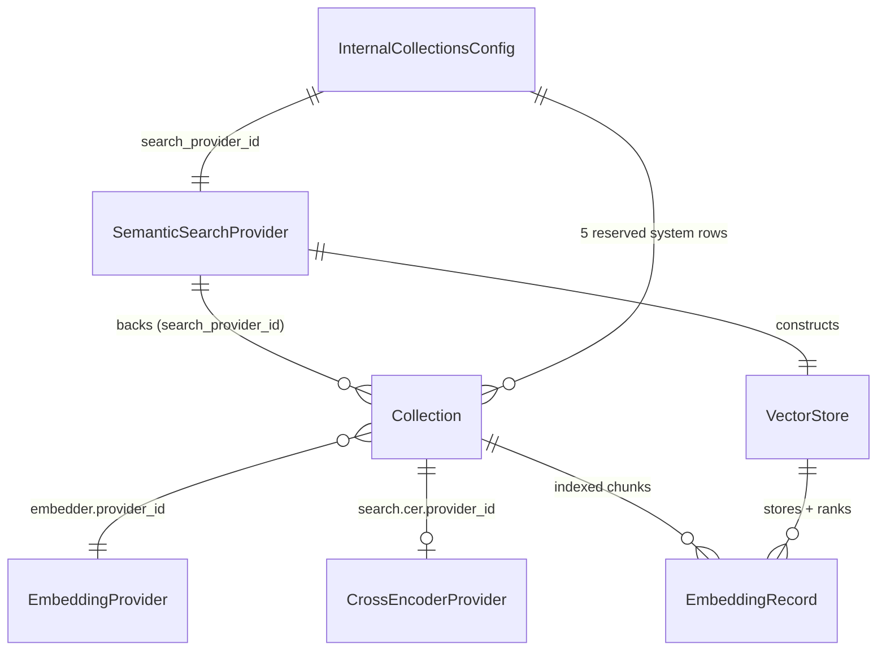
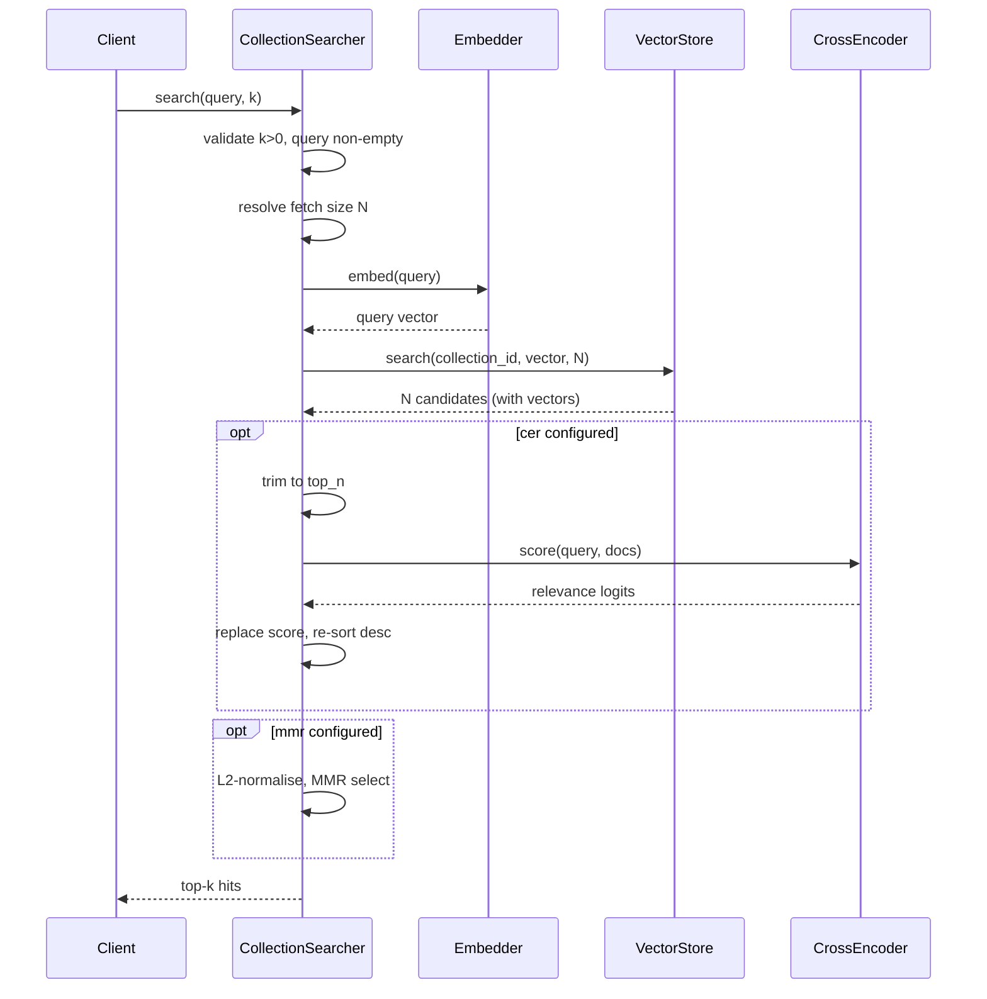

# Semantic search

## 1. Purpose

The semantic-search subsystem owns the vector-retrieval half of the platform: it
turns text queries into ranked hits over indexed document chunks. It covers four
concerns:

- The **SemanticSearchProvider (SSP)** entity and its per-row registry, which
  promote a vector-store backend (pgvector, pgvectorscale, LanceDB) into an
  operator-managed CRUD row rather than a single process-wide config field.
- The **vector stores** themselves (the `VectorStore` ABC plus the pgvector and
  Lance backends) that physically hold and rank embeddings.
- The **retrieval-augmentation pipeline** in `CollectionSearcher`: optional
  cross-encoder reranking (CER) and Maximal Marginal Relevance (MMR)
  diversification layered on top of raw vector search.
- The **internal collections** (the self-describing capability catalog): a set
  of reserved system collections that index the platform's own agents, graphs,
  collections, tools, and AI docs so an agent can semantically discover its own
  capabilities.

Embedders and the `Collection` / `Document` models live in the adjacent
knowledge subsystem; see [knowledge.md](knowledge.md). This subsystem consumes
embedders but does not define them.

## 2. Conceptual model

A `SemanticSearchProvider` row describes one backend. Every `Collection` binds to
exactly one SSP through a required, immutable `search_provider_id`; the
collection's embedded chunks live in that SSP's vector store. A search resolves
the collection, embeds the query with the collection's configured embedder,
retrieves candidates from the SSP's `VectorStore`, and optionally reranks and
diversifies them. The internal-collections subsystem reuses the same machinery:
its reserved collections are ordinary `Collection` rows (with `system=True`)
bound to an SSP named by `InternalCollectionsConfig.search_provider_id`.

The entities:

- `SemanticSearchProvider` (`primer/model/provider.py`) is `Identifiable` with a
  `provider` discriminator (`SemanticSearchProviderType`: `PGVECTOR`,
  `PGVECTORSCALE`, `LANCE`) and a discriminated `config` union
  (`PgVectorConfig | PgVectorScaleConfig | LanceConfig`); a `model_validator`
  enforces that the config class matches the discriminator.
- `Collection` (`primer/model/collection.py`) carries `search_provider_id`
  (required, immutable), an embedder reference, an optional `search`
  (`CollectionSearch`), plus `system: bool` and `harness_id`.
- `VectorStore` (`primer/int/vector_store.py`) is the backend interface holding
  `EmbeddingRecord` rows keyed by `(collection_id, document_id, chunk_id)`.
- `CrossEncoderProvider` (`primer/model/provider.py`) is a sibling provider row
  for rerankers, referenced from `CollectionSearch.cer`.
- The internal collections are real `Collection` rows under reserved ids in
  `INTERNAL_COLLECTION_IDS` plus `AI_DOCS_COLLECTION_ID`
  (`primer/model/internal.py`).

## 3. Architecture patterns implemented

- **Provider pattern (registry + factory).** The SSP entity, the
  `SemanticSearchRegistry`, and the `CrossEncoderProvider` follow the same
  per-row cache + lazy-construct + `invalidate` / `aclose` discipline as the LLM
  and embedding providers. See
  [provider-pattern.md](../architecture/provider-pattern.md). The
  `SemanticSearchRegistry` (`primer/api/registries/semantic_search_registry.py`)
  caches one `VectorStoreProvider` per SSP id and runs slow construction outside
  its `asyncio.Lock`, `aclose()`-ing the race-loser; the cross-encoder cache and
  factory live on `ProviderRegistry` (`primer/api/registries/provider_registry.py`).
- **Storage abstraction.** SSP rows, cross-encoder provider rows, and the
  internal-collections singletons persist through the generic `Storage[T]`
  interface; the registry takes a `Storage[SemanticSearchProvider]` (not the
  `StorageProvider`) at construction. See
  [storage.md](../architecture/storage.md).
- **REST API conventions.** SSP CRUD mounts under `/v1/ssp` via
  `make_crud_router`, with reference-integrity cascade-block on delete and an
  explicit `POST /v1/ssp/{id}/invalidate`. Document search is
  `POST /v1/collections/{id}/search`. See [rest-api.md](../architecture/rest-api.md).
- **Auto-bootstrap.** The reserved `lance` SSP row is seeded at first boot so
  semantic search works zero-config; the internal-collections bootstrap is a
  separate state machine. See [auto-bootstrap.md](../architecture/auto-bootstrap.md).
- **Adjacent subsystem.** Embedders, the prompt registry, the `Collection` /
  `Document` models, and the ingestion pipeline are documented in
  [knowledge.md](knowledge.md).

## 4. Code layout

- `primer/model/provider.py` -- `SemanticSearchProviderType`,
  `SemanticSearchProvider`, the config classes (`PgVectorConfig`,
  `PgVectorScaleConfig`, `LanceConfig`), the retained internal
  `VectorStoreProviderType` / `VectorStoreProviderConfig` adapter shapes, and the
  `CrossEncoderProvider` family (`CrossEncoderProviderType`,
  `HuggingFaceCrossEncoderConfig`, `CrossEncoderModel`).
- `primer/model/search.py` -- `MmrConfig`, `CollectionCrossEncoder`, and the
  umbrella `CollectionSearch` per-collection toggle.
- `primer/int/vector_store.py` -- the `VectorStore` ABC.
- `primer/int/cross_encoder.py` -- the `CrossEncoder` ABC.
- `primer/vector/factory.py` -- `VectorStoreProviderFactory.create` dispatches on
  the backend enum (lazy imports keep `lancedb` off the pgvector cold path).
- `primer/vector/pgvector.py`, `primer/vector/lance.py` -- the two shipped
  backends.
- `primer/cross_encoder/huggingface.py` -- the local `HuggingFaceCrossEncoder`.
- `primer/search/searcher.py` -- `CollectionSearcher`, the vector -> CER -> MMR
  orchestrator.
- `primer/api/registries/semantic_search_registry.py` -- `SemanticSearchRegistry`.
- `primer/api/registries/provider_registry.py` -- cross-encoder cache + factory,
  and the reserved-id sets (`RESERVED_SSP_IDS = {'lance'}`,
  `RESERVED_CROSS_ENCODER_IDS = {'huggingface-ce'}`).
- `primer/api/routers/semantic_search.py` -- `/v1/ssp` CRUD.
- `primer/api/routers/providers.py` -- `CrossEncoderProvider` CRUD.
- `primer/api/routers/knowledge.py` -- `POST /v1/collections/{id}/search`.
- `primer/catalog/catalog.py`, `primer/catalog/types.py` -- the lower-layer
  `SemanticCatalog` (exercised by its own unit tests).
- `primer/internal_collections.py` -- the live `InternalCollectionsSubsystem`
  (CDC worker, bootstrap state machine, AI-docs ingest, `search` /
  `search_ai_docs`).
- `primer/model/internal.py` -- `InternalCollectionsConfig`,
  `InternalCollectionsBootstrapStatus`, `INTERNAL_COLLECTION_IDS`,
  `AI_DOCS_COLLECTION_ID`.
- `primer/api/routers/internal_collections.py` -- the activation / bootstrap /
  search REST surface.
- `primer/toolset/search.py` -- the agent-facing `search` internal toolset.

## 5. Data model

- `SemanticSearchProvider`: `id`, `provider` (`SemanticSearchProviderType`),
  `config`. `LanceConfig` exposes `path` (required, absolute; the directory is
  created with mode `0o700` on first use), `hnsw_m` (16), `hnsw_ef_construction`
  (64), `hnsw_ef_search` (40), and `index_min_rows` (1000). There is no
  per-config distance field; `distance` is a per-collection argument on
  `create_collection` and stored on the Lance catalogue row.
  The pgvector / pgvectorscale config family shares `_PgVectorBaseConfig`, which
  exposes `use_halfvec` (default `false`). When enabled, NEW collections are
  created with pgvector's `halfvec` column type (half precision, up to 4000
  dimensions) instead of the standard `vector` type (max 2000); enable it for
  embedding models above 2000 dims, e.g. `text-embedding-3-large` (3072). The
  flag only affects collections created while it is on -- existing collections
  keep their original type (tracked per collection, see section 7).
- `Collection`: `search_provider_id` (required, `min_length=1`, immutable after
  create), `system: bool`, `harness_id`, plus the embedder reference and optional
  `search`.
- `CollectionSearch` (`primer/model/search.py`): independently optional `mmr`
  (`MmrConfig`) and `cer` (`CollectionCrossEncoder`). `MmrConfig` carries
  `lambda_mult` (default 0.5, clamped to `[0, 1]`) and optional `fetch_k`
  (`PositiveInt`). `CollectionCrossEncoder` carries `provider_id`, `model`,
  `top_n` (default 100), and `batch_size` (default 32).
- `CrossEncoderProvider`: `provider` (`CrossEncoderProviderType`, only
  `HUGGINGFACE` today), a non-empty `models` list of `CrossEncoderModel`
  (`name` plus optional `max_pair_length`), `HuggingFaceCrossEncoderConfig`
  (optional `SecretStr` token), and a required `Limits` row.
- `EmbeddingRecord` (`primer/model/vector.py`): keyed by
  `(collection_id, document_id, chunk_id)` with `text`, `vector`, and `meta`. MMR
  requires `record.vector` to be populated on every `SearchResult` the store
  returns, since it reuses candidate vectors rather than re-embedding.
- Internal-collections persistence: `InternalCollectionsConfig` (singleton id
  `_internal_collections_config`; `embedding_provider_id`, `embedding_model`,
  `search_provider_id`, `cross_encoder`, `mmr`, `activated_at`),
  `InternalCollectionsBootstrapStatus` (singleton id
  `_internal_collections_bootstrap_status`), and `IngestFailure` audit rows. The
  five reserved collection ids are `_internal_agents`, `_internal_graphs`,
  `_internal_collections`, `_internal_tools`, and `_internal_ai_docs`.

## 6. Lifecycle

A document search resolves the collection, picks the SSP-backed vector store, and
runs the pipeline. The fetch size `N` is resolved once so a single retrieval
feeds both optional stages: no config gives `N = k`; CER alone gives
`N = cer.top_n`; MMR alone gives `N = mmr.fetch_k or max(50, 10*k)`; both give the
max of all sources (`CollectionSearcher._resolve_fetch_size`).

Notes on the stages (`primer/search/searcher.py`):

- The cross-encoder is required iff `collection.search.cer` is set; this is
  checked eagerly in `CollectionSearcher.__init__`, so a misconfiguration raises
  `ConfigError` at construction rather than mid-query. CER trims candidates to
  `top_n` before scoring, replaces `SearchResult.score` with the raw logit, and
  re-sorts.
- MMR (`_mmr_select`) L2-normalises the query and candidate vectors on the fly so
  cosine is well-defined regardless of the store's distance metric, then runs the
  `lambda_mult * sim(d, q) - (1 - lambda_mult) * max sim(d, d_j)` loop. Empty or
  zero-magnitude query / candidate vectors raise `ConfigError`.
- `k <= 0` and an empty query raise `BadRequestError`.

Provider lifecycle: `SemanticSearchRegistry.get_provider(id)` lazy-resolves the
row, calls the factory, runs `initialize()`, and caches the `VectorStoreProvider`;
`invalidate(id)` and `aclose()` close instances. The `/v1/ssp` router's
`on_update` / `on_delete` hooks call `invalidate`.

Internal-collections lifecycle: `InternalCollectionsSubsystem.bootstrap()` walks
an explicit `BootstrapPhase` state machine (`drain_queue` ->
`materialise_collections` -> `ingest_agents` -> `ingest_graphs` ->
`ingest_collections` -> `ingest_tools` -> `ingest_ai_docs` -> `finalize`),
isolating per-item failures into `IngestFailure` rows. At runtime a CDC worker
task consumes an `asyncio.Queue[IngestEvent]` fed by the CRUD routers' after-hooks
(`primer/api/routers/_cdc_hooks.py`).

## 7. Persistence

Vector data is physically persisted by the SSP backend:

- **pgvector / pgvectorscale** (`primer/vector/pgvector.py`) persist embeddings in
  Postgres tables. A catalogue table `primer_collections` records
  `{collection_id, table_name, index_name, index_kind, dimensions, distance,
  vector_type}`; `vector_type` (`vector` or `halfvec`, default `vector` via an
  idempotent `ADD COLUMN IF NOT EXISTS` migration) is set from the provider's
  `use_halfvec` flag at create time and then drives the index opclass and the
  put / search codec (`halfvec` values are wrapped as `pgvector.HalfVector`),
  so a collection keeps its type regardless of later flag changes. Creating a
  collection whose dimensions exceed the type's ceiling (2000 for `vector`,
  4000 for `halfvec`) raises `BadRequestError` before any DDL runs.
- **LanceDB** (`primer/vector/lance.py`) persists to an on-disk directory (default
  `~/.primer/vector` for the reserved row). A catalogue table `_primer_collections`
  co-locates with the per-collection tables and records
  `{collection_id, table_name, dimensions, distance, indexed}`. Per-collection
  tables are named `embeddings_<sanitised collection_id>` with a PyArrow schema of
  `{document_id, chunk_id, text, vector: FixedSizeList(float32, dims), meta: utf8}`;
  `meta` is a JSON string because Arrow has no open-ended struct type. `put()`
  upserts via `merge_insert` on `(document_id, chunk_id)` and lazily builds an ANN
  index (trying `HnswSq` -> `HnswPq` -> `IvfPq`) once row count crosses
  `index_min_rows`. A known quirk: LanceDB 0.30.2 returns squared L2 distance even
  for a `cosine` catalogue entry, so `_similarity()` recovers cosine as
  `1 - raw/2`, which is correct only because upstream embedders L2-normalise their
  vectors.

The provider rows, cross-encoder rows, and internal-collections singletons persist
through the generic `Storage[T]` interface with no special semantics.
`AppConfig.vector_store` no longer exists; operators configure backends at runtime
via `POST /v1/ssp`.

## 8. Public surfaces

REST:

- `/v1/ssp` -- `SemanticSearchProvider` CRUD via `make_crud_router`
  (`primer/api/routers/semantic_search.py`). `DELETE` returns 409 when a
  `Collection` still references the SSP; `POST` / `DELETE` on the reserved id
  `lance` return 409 / 403; `POST /v1/ssp/{id}/invalidate` returns 204.
- `/v1/cross_encoder_providers` -- `CrossEncoderProvider` CRUD plus
  `GET /v1/cross_encoder_providers/{id}/models` (`primer/api/routers/providers.py`).
- `POST /v1/collections/{id}/search` -- document search; resolves the store via
  `SemanticSearchRegistry.get_store(coll.search_provider_id)` and calls
  `VectorStore.search` directly. Note: this path does not yet run
  `CollectionSearcher`, so per-collection `Collection.search` (MMR / CER) toggles
  do not affect external clients today.
- `/v1/internal_collections/config` (PUT / GET / DELETE),
  `POST /v1/internal_collections/bootstrap`, and
  `GET /v1/internal_collections/bootstrap/status` plus per-entity search routes
  (`primer/api/routers/internal_collections.py`).

Agent-facing tools: the `_system` toolset exposes seven SSP CRUD tools
(`create_semantic_search_provider` ... `invalidate_semantic_search_provider`,
`primer/toolset/system.py`); the `search` internal toolset exposes
`search_agents` / `search_graphs` / `search_collections` / `search_tools`
(`primer/toolset/search.py`), registered only once the subsystem is activated and
bootstrapped.

Python: `CollectionSearcher` (`primer/search/searcher.py`), the `VectorStore` and
`CrossEncoder` ABCs, and `SemanticSearchRegistry`.

## 9. Internal contracts

- **`VectorStore` ABC** (`primer/int/vector_store.py`): `create_collection`
  (idempotent; sanitises ids to `[A-Za-z0-9_-]`; conflicting dimensionality
  raises `ConflictError`), `put` (upsert on the composite key), `search`
  (top-`k`, scores normalised so higher = more similar but only comparable within
  one result list), `search_by_meta`, `get`, `delete`, `drop_collection`.
  Backends must populate `SearchResult.record.vector` when MMR is in play.
- **`CrossEncoder` ABC** (`primer/int/cross_encoder.py`): `list_models` and
  `score(model, query, documents, batch_size=32)` returning one score per
  document in input order. Scores are explicitly backend-relative (raw logits for
  sentence-transformers / bge; sigmoided `[0,1]` for hosted Cohere / Jina), usable
  only to sort or threshold within one call. `aclose()` is a default no-op.
- **Distance / normalisation contract**: every shipped embedder L2-normalises its
  output (HuggingFace and OpenAI adapters), so cosine ranking is well-defined and
  MMR's on-the-fly normalisation matches the on-disk vectors.
  See [knowledge.md](knowledge.md) for the embedder prompt registry.
- **Asymmetric retrieval**: the internal-collections subsystem embeds with
  `task_type='retrieval_document'` on ingest and `'retrieval_query'` on search
  (`InternalCollectionsSubsystem._embed_text`) so BGE / E5 / nomic models apply
  the correct instruction prefix.
- **SSP registry race contract**: `get_provider` constructs outside the lock;
  concurrent gets for the same id may build twice but only one wins the cache and
  the loser is `aclose()`-ed.
- **Reserved ids**: `RESERVED_SSP_IDS = {'lance'}` and
  `RESERVED_CROSS_ENCODER_IDS = {'huggingface-ce'}`
  (`primer/api/registries/provider_registry.py`) gate the router create / delete
  paths.

## 10. Testing patterns

- `tests/search/test_searcher.py` drives `CollectionSearcher` against
  `_FakeEmbedder` / `_FakeVectorStore` / `_FakeCrossEncoder`: construction guards
  (cer-without-cross-encoder raises, mmr-only does not), arg validation
  (`k<=0`, empty query), vanilla passthrough, CER score replacement and overfetch,
  MMR endpoints (`lambda=1` relevance-only, `lambda=0` first pick most relevant,
  fewer-than-`k`, missing-vector `ConfigError`), and both-enabled composition
  (CER before MMR).
- `tests/cross_encoder/test_huggingface.py` covers the local reranker: constructor
  guards, `list_models`, scoring (empty-docs short-circuit, unknown model, lazy
  load + cache, score order, size-mismatch `ProviderError`).
- `tests/api/test_semantic_search.py` and `test_semantic_search_registry.py` cover
  the `/v1/ssp` CRUD round-trip (redacted secrets, invalidate 204) and the
  registry cache / invalidate / aclose / race-loser triad;
  `tests/api/test_ssp_lance_router.py` asserts the reserved-`lance` 409 / 403
  guards; `tests/api/test_collection_reference_validation.py` covers unknown-SSP
  404 and immutable-`search_provider_id` 422.
- `tests/vector/test_lance.py` (`pytest.importorskip('lancedb')`) exercises the
  Lance lifecycle, catalogue, CRUD, search, the lazy index-build threshold,
  apostrophe escaping, and `maintain_indexes`.
- `tests/catalog/*` test the `SemanticCatalog` lower layer against fakes;
  `tests/test_internal_collections.py`, `tests/api/test_internal_collections.py`,
  and `tests/e2e/test_internal_collections*.py` cover the live CDC + bootstrap
  path. `tests/e2e/test_lance_ssp_collection_search_journey.py` walks a full
  SSP -> Collection -> embed -> search journey.

## 11. Historical decisions

- **The vector-store backend was promoted from a single `AppConfig.vector_store` field into a CRUD-able `SemanticSearchProvider` entity with a per-row registry.** Why: operators need to manage multiple backends at runtime and scope each collection to one, which a process-wide config field could not express. Spec: docs/superpowers/specs/2026-05-24-semantic-search-subsystem-design.md.
- **`Collection.search_provider_id` was made required and immutable after create, with delete reference-blocked at 409 rather than cascaded.** Why: mutating the binding would silently strand the existing vector index, and cascade-delete would destroy collections and their documents. Spec: docs/superpowers/specs/2026-05-24-semantic-search-subsystem-design.md.
- **LanceDB shipped as a third embedded backend and was reserved under the auto-bootstrapped id `lance`.** Why: it offered a zero-config, single-node, sub-30MB-footprint vector store (backup is copying a directory) so semantic search works out of the box. Spec: docs/superpowers/specs/2026-05-25-lance-ssp-design.md.
- **LanceDB's `meta` column was stored as a utf8 JSON string and `search_by_meta` fell back to a Python-side linear scan.** Why: Arrow has no open-ended struct type and LanceDB 0.30.2's `json_extract` requires a LargeBinary column, so SQL-level filtering on the utf8 column was unavailable. Spec: docs/superpowers/specs/2026-05-25-lance-ssp-design.md.
- **The two retrieval techniques were composed in the fixed order vector then cross-encoder then MMR, with the composition hard-coded.** Why: the reranker needs a relevance-rich pool while MMR diversifies an already-relevant pool, so reversing would waste reranker compute on diverse-but-irrelevant items. Spec: docs/superpowers/specs/2026-05-05-mmr-cross-encoder-reranking-design.md.
- **Cross-encoder scores were returned as raw logits and documented as backend-relative, with the cross-encoder required at `CollectionSearcher` construction.** Why: different rerankers normalise differently so a uniform scale would invent meaning, and failing fast surfaces a typed `ConfigError` pointing at the offending collection rather than an opaque mid-query error. Spec: docs/superpowers/specs/2026-05-05-mmr-cross-encoder-reranking-design.md.
- **MMR L2-normalised vectors on the fly rather than trusting the vector store's distance metric.** Why: the orchestrator does not know which metric the backend ranks under, so normalising both query and candidate vectors makes cosine well-defined across pgvector, Lance, and future backends. Spec: docs/superpowers/specs/2026-05-05-mmr-cross-encoder-reranking-design.md.
- **The default reserved cross-encoder shipped as `cross-encoder/ms-marco-MiniLM-L-6-v2` rather than the spec's `BAAI/bge-reranker-v2-m3`.** Why: the lighter English-only MiniLM model (~80MB) keeps the zero-config disk footprint small versus the multilingual ~2.3GB bge model. Spec: docs/superpowers/specs/2026-05-05-mmr-cross-encoder-reranking-design.md.
- **The self-describing catalog reused the existing `Collection` / embedder / vector-store plumbing as `system=True` rows instead of a parallel index.** Why: it avoids divergent embedding pipelines and lets future MMR / CER apply to the catalog for free by toggling `Collection.search`. Spec: docs/superpowers/specs/2026-05-08-semantic-catalog-design.md.
- **A larger production `InternalCollectionsSubsystem` (CDC worker, bootstrap state machine, AI-docs ingest, activation API) absorbed the activation surface the catalog spec deferred, leaving the smaller `primer/catalog` module as a lower layer exercised only by its own tests.** Why: the live runtime needed event-driven reconciliation, progress reporting, and a fifth AI-docs collection that the thin event-agnostic catalog deliberately did not cover. Spec: docs/superpowers/specs/2026-05-08-semantic-catalog-design.md.
- **A fifth reserved collection `_internal_ai_docs` was added and ingested with asymmetric `retrieval_query` / `retrieval_document` task types.** Why: agent-facing platform docs needed semantic discovery alongside the four entity types, and the asymmetric task types ensure BGE / E5 / nomic embedders apply the right instruction prefix. Spec: docs/superpowers/specs/2026-05-03-document-ingestion-design.md.
