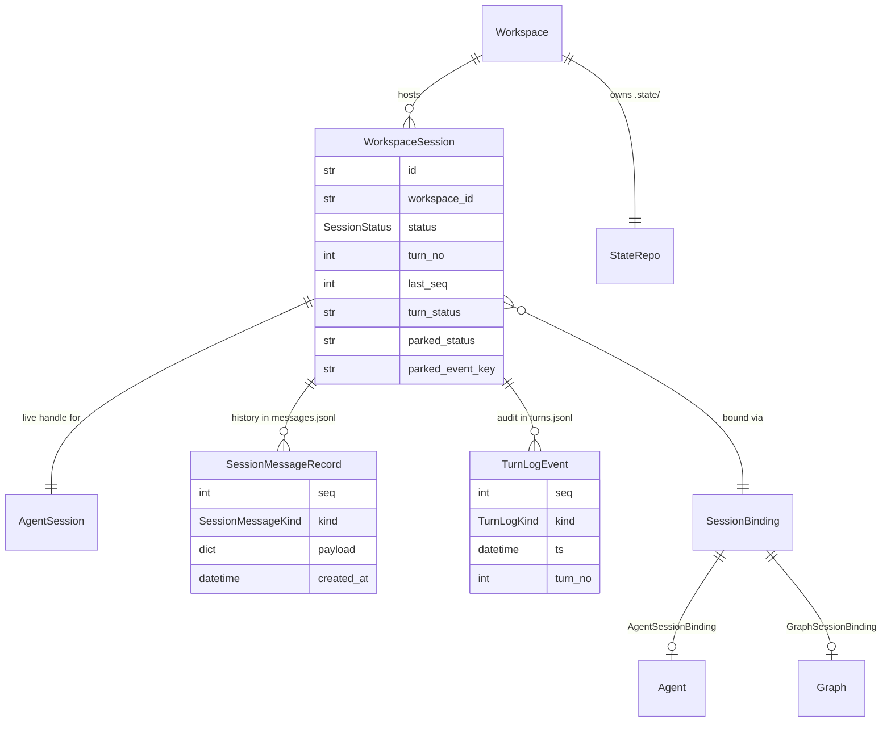
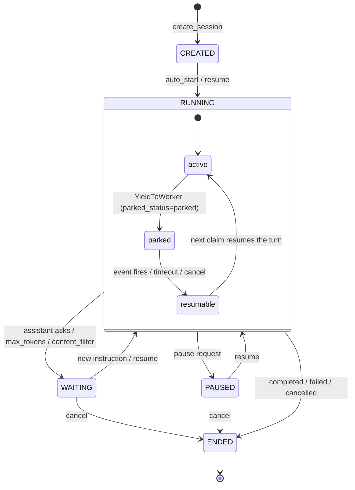

# Sessions

## 1. Purpose

A session is one execution of one agent (or one graph) on one workspace. The same agent can run many sessions against the same workspace; each session owns its own state slot under `.state/sessions/<sid>/` and its own truncation-cache subdirectory under `.tmp/<sid>/` inside the workspace.

The sessions subsystem is the seam where four other subsystems meet:

- The **claim machine** hands a worker an exclusive lease on a session row.
- The **agent / graph executor** drives the LLM-and-tool loop and streams events.
- The **workspace** hosts the per-session `messages.jsonl` history and `turns.jsonl` turn log.
- The **REST + WebSocket surface** lets operators create, stream, interrupt, pause, resume, and inspect sessions.

The subsystem's job is to glue those together for exactly one turn at a time: claim a session, build its executor, translate the executor's stream into durable per-session message records, publish ticks so live WebSocket clients see real-time deltas, park the turn when a yielding tool suspends it, resume it when the event fires, and write a structured per-turn audit log on every boundary. Storage (`messages.jsonl` in the workspace, plus the scheduler-visible `WorkspaceSession` row) is the source of truth; the WebSocket is a tail and the event bus is advisory.

## 2. Conceptual model

A session has two persisted faces that are reconciled at turn boundaries:

- `WorkspaceSession` (`primer/model/workspace_session.py`) is the scheduler-visible row in storage. It carries lifecycle state (`status`), claim/streaming bookkeeping (`turn_no`, `last_seq`, `turn_status`, `cancel_requested_at`, `pause_requested_at`), and the yielding-tool park columns (`parked_status`, `parked_event_key`, `parked_until`, `parked_at`, `parked_state`). It is the row the `ClaimEngine` claims and the row the REST surface mutates.
- `SessionInfo` (`primer/model/workspace_session.py`) is the on-disk projection inside the workspace's git-backed `.state/` repo, written as `.state/sessions/<sid>/session.json`. It plus `agent.json` (an `AgentBinding` snapshot) and, when blocked, `waiting.json` (a `WaitingState` discriminated union) describe the session from inside the workspace.

The two are allowed to diverge for at most one turn (the at-least-once trade-off of the background-execution scheduler). The `AgentSession` (`primer/workspace/session.py`) is the live in-process handle the executor drives; it owns status transitions and the read-before-write tracking.

History and the per-turn audit log live as two append-only JSONL files inside the workspace, not in the database. The `WorkspaceSession` row holds only lifecycle and claim state.



The discriminated `SessionBinding` (`AgentSessionBinding` / `GraphSessionBinding`) selects which executor runs. Each binding may carry an optional frozen `agent_snapshot` / `graph_snapshot` so a long-running session is insulated from later edits to the Agent or Graph row.

## 3. Architecture patterns implemented

The sessions subsystem consumes five cross-cutting architecture surfaces rather than reimplementing them:

- **Claim machine** ([architecture/claim-machine.md](../architecture/claim-machine.md)). A session turn runs under a `Lease` from the unified `ClaimEngine`. `SessionClaimAdapter` (`primer/claim/adapters/sessions.py`, `kind=ClaimKind.SESSION`, `entity_table="sessions"`) supplies the eligibility predicate (`e.parked_status IS NULL`, so parked sessions are invisible to claimers) and the `on_release` hook that clears the park columns and `last_worker_id`, bumps `turn_no` / `last_turn_at` only on a successful release, and writes a synthetic terminal `ERROR` record on a failed release.
- **Worker system** ([architecture/worker-system.md](../architecture/worker-system.md)). `WorkerPool._run_engine_session` is the dispatch wrapper that builds the `SessionDispatchDeps` bundle and calls `run_one_session_turn`. The pool also owns the park/resume hooks (`YieldToWorker` handling, `ParkedState` write, `_handle_resume`) and the startup recovery loop that re-arms leases for non-ENDED rows.
- **Storage** ([architecture/storage.md](../architecture/storage.md)). The `WorkspaceSession` row is a JSONB-backed `Identifiable`. The streaming and park columns are indexed for the claim predicate.
- **Observability** ([architecture/observability.md](../architecture/observability.md)). The per-turn structured log (`TurnLogWriter` family + `to_problem_details` + `safe_append`) is a cross-cutting observability surface shared with the graph executors; it is best-effort and never aborts a live turn.
- **REST API** ([architecture/rest-api.md](../architecture/rest-api.md)). The nested and top-level session routers, the cursor-replay WebSocket, and the RFC 7807 `ProblemDetails` error envelope all ride the FastAPI foundation.

## 4. Code layout

| Path | Responsibility |
| --- | --- |
| `primer/model/workspace_session.py` | `WorkspaceSession`, `SessionStatus`, `SessionInfo`, `AgentBinding`, the `SessionBinding` union (`AgentSessionBinding` / `GraphSessionBinding`), `WaitingState` union, `SessionMessageKind`, `SessionMessageRecord`, `Instruction`. |
| `primer/workspace/session.py` | Concrete `AgentSession`: status transitions, `waiting.json` create/delete, `take_pending_messages`, `system_prompt_fragment`, `workspace_tools`, `commit_state`, read-before-write tracking. |
| `primer/session/dispatch.py` | `run_one_session_turn` + `SessionDispatchDeps`: the worker entry point for one lease. |
| `primer/session/persistence.py` | `WorkspaceMessageWriter` (buffered jsonl appender), `WorkspaceIO` protocol, `translate_stream_event` + `_CoalesceState`. |
| `primer/session/tick_router.py` | `SessionTickRouter` + `Tick`: process-local fan-out of `session:{sid}:tick`. |
| `primer/session/yields.py` | `respond_to_yield` + `RespondToYieldDeps`: shared park-resume publish helper. |
| `primer/observability/turn_log_writer.py` | `TurnLogWriter` ABC + `NoopTurnLogWriter` / `WorkspaceTurnLogWriter` / `StorageTurnLogWriter`, `safe_append`, `to_problem_details`. |
| `primer/model/turn_log.py` | `TurnLogKind`, the eight `TurnLog*` event classes + `TurnLogEvent` union, `TurnLogRecord` storage entity, `parse_turn_log_event`. |
| `primer/claim/adapters/sessions.py` | `SessionClaimAdapter`: eligibility SQL + `on_release` bookkeeping. |
| `primer/workspace/session_factory.py` | Canonical create path: persist the row, allocate the on-disk slot, register the claim lease on auto-start. Shared by the REST handler and the trigger dispatcher. |
| `primer/agent/workspace_executor.py` | `WorkspaceAgentExecutor`: drives the agent LLM loop, sets `AgentSession` status, publishes `last_done_reason`, `inject_resume_messages` for the resume path. |
| `primer/graph/workspace_executor.py` | `WorkspaceGraphExecutor`: runs a graph against a workspace and writes per-node + graph-level turn logs. |
| `primer/api/routers/sessions.py` | `nested_session_router` (create / resume / pause / cancel / delete / WebSocket under `/v1/workspaces/{wid}/sessions/...`) + `top_session_router` (list / find / get / `turn_log`). |
| `primer/worker/pool.py` | `_run_engine_session` shim, `_WorkspaceIOShim`, park/resume hooks. |

## 5. Data model

`SessionStatus` (`primer/model/workspace_session.py`) is the lifecycle enum: `CREATED` (pre-execution; the row exists but no worker has been told to run it), `RUNNING` (a turn is in flight), `WAITING` (blocked on user input or an approval), `PAUSED` (operator-requested suspend), and the terminal `ENDED`. `WAITING` is intentionally one state regardless of what blocks the session; the distinction is recorded in `waiting.json` via the `WaitingState` discriminated union (`_UserInputWaiting` / `_ToolApprovalWaiting`, keyed on `kind`), written only while `status == WAITING` and deleted on transition out.

`ended_reason` (on both `WorkspaceSession` and `SessionInfo`) is one of `completed` / `failed` / `cancelled` / `workspace_lost` / `force_deleted`, set when `status == ENDED`. `ended_detail` carries finer graph-only codes (e.g. `begin_input_invalid`, `max_iterations_exceeded`).

The lifecycle status enum is distinct from `turn_status` (`idle` / `claimable` / `running`), which tracks the FIFO-queue and worker-claim state, and from `parked_status` (`parked` / `resumable` / `None`), which tracks the yielding-tool park. These three axes are orthogonal: a `RUNNING` session that parks on a yielding tool keeps its `turn_status` while `parked_status` flips to `parked`.



The park sub-states (`parked` -> `resumable`) live under `RUNNING`: parking releases the lease and clears `last_lease_at` in the same statement, the claim predicate excludes `parked_status IS NOT NULL`, and the bus listener atomically flips `parked` to `resumable` when the yield event arrives so the next claim picks the row up. The safety-net sweeps that catch parks whose event never fires - `TimerScheduler` (`timer:*` deadlines) and `TimeoutSweeper` (non-timer deadlines) in `primer/bus/scheduler_tasks.py` - page through ALL parked sessions (a 200-row window per round-trip) rather than only the first 200, so no park beyond the 200th is ever silently left stuck.

`SessionMessageKind` enumerates the wire-level history kinds: `user_input`, `assistant_token`, `tool_call`, `tool_result`, `yielded`, `resumed`, `done`, `cancelled`, `error`. `SessionMessageRecord` (`seq`, `kind`, `payload`, `created_at`) is one line in `messages.jsonl`; `seq` is monotonic per session and the composite `(session_id, seq)` is the natural key.

## 6. Lifecycle

`run_one_session_turn` (`primer/session/dispatch.py`) drives exactly one turn per claimed lease. The flow:

1. **Load + early exit.** Read the `WorkspaceSession` row. If `status == ENDED`, drop the lease. If `cancel_requested` is set (a REST cancel that landed before any worker observed it, or carried over from a process that died mid-turn), transition the row straight to `ENDED`/`cancelled` and drop the lease. This is what makes "I cancelled it but nothing happened" actually terminate after an API restart.
2. **Build executor.** `deps.build_executor(session)` constructs a `WorkspaceAgentExecutor` or graph executor.
3. **Open writers + cancel watcher.** A `WorkspaceMessageWriter` for `messages.jsonl`, a `TurnLogWriter` from `turn_log_writer_factory`, and a cancel watcher subscribed to `session:{sid}:cancel`.
4. **Emit boundary turn-log events.** If `session.parked_at` is set, emit `TurnLogResumed` (with `wait_ms`) before `TurnLogStarted`; otherwise just `TurnLogStarted`.
5. **Stream.** Iterate `executor.invoke([])`. Each `StreamEvent` is run through `translate_stream_event`; every produced `SessionMessageRecord` is appended (the writer assigns `seq`) and a `session:{sid}:tick` is published with that seq. Cancel is checked between events.
6. **Terminal arms.** A `YieldToWorker` writes a `TurnLogYielded` + `yielded` record, flushes, publishes a tick, and returns `ReleaseOutcome(success=True, drop_lease=False)` so the worker parks the row. An unexpected exception builds one `ProblemDetails` via `to_problem_details` and reuses it for both the `TurnLogFailed` event and the `messages.jsonl` `ERROR` record, then transitions to `ENDED`/`failed`. A cancel writes `TurnLogCancelled` + a `cancelled` record and transitions to `ENDED`/`cancelled`.
7. **Clean completion.** Flush, read the executor's `last_done_reason` and the `AgentSession` status, map them via `_post_turn_status` to the final `WorkspaceSession.status`, write `TurnLogCompleted`, close the turn log.

```mermaid
sequenceDiagram
    participant E as ClaimEngine
    participant P as WorkerPool._run_engine_session
    participant D as run_one_session_turn
    participant X as Executor
    participant W as WorkspaceMessageWriter
    participant B as EventBus
    participant L as TurnLogWriter

    E->>P: claim_due -> Lease(SESSION)
    P->>D: SessionDispatchDeps + lease
    D->>D: load row, early-exit checks
    D->>X: build_executor(session)
    D->>L: TurnLogResumed? -> TurnLogStarted
    loop per StreamEvent
        X-->>D: StreamEvent
        D->>W: append(SessionMessageRecord) -> seq
        D->>B: publish session:{sid}:tick {seq}
    end
    alt YieldToWorker (park)
        D->>L: TurnLogYielded
        D->>W: append yielded; flush
        D-->>P: ReleaseOutcome(success, drop_lease=False)
        P->>P: write ParkedState; clear lease
        Note over P,E: claim predicate skips parked rows
        B-->>P: yield event fires -> mark_resumable
        E->>P: re-claim -> resume turn (inject_resume_messages)
    else clean / cancel / error
        D->>L: TurnLogCompleted | Cancelled | Failed
        D-->>P: ReleaseOutcome(success, drop_lease=True)
        P->>E: engine.release(lease, outcome)
    end
```

On the park path the worker pool snapshots the in-flight turn into a `ParkedState` blob (LLM message history stamped onto `YieldToWorker.llm_messages`, the pending `tool_call_id`, the yield's `resume_metadata`, and an optional `graph_checkpoint` for graph-bound parks). When the event fires, `_handle_resume` rehydrates the blob and routes either to the graph resume adapter or to `WorkspaceAgentExecutor.inject_resume_messages`, which appends the rehydrated `[assistant_tool_use, tool_result]` pair so the next turn continues against the augmented history. `respond_to_yield` (`primer/session/yields.py`) is the shared publish helper that both the REST yield endpoints and the trigger `parked_session` dispatcher use to wake a park.

## 7. Persistence

History is `messages.jsonl` inside the workspace, written through `WorkspaceMessageWriter` (`primer/session/persistence.py`). The writer:

- Owns the monotonic `seq` counter and overwrites each record's `seq` so the stored value is authoritative.
- Buffers up to 16 KB or 100 ms, flushing on size, age, explicit `flush()`, or `aclose()`. Per-line flush on container/k8s exec would cost roughly 50 ms per record; buffering keeps that under a few percent of turn time. The trade-off is that a worker crash mid-buffer loses unflushed records, which the reclaim then re-emits.
- Fires the `session:{sid}:tick` publish per record (done by the dispatch layer, not the writer itself), so live WebSocket subscribers see real-time deltas even when a batch coalesces into one I/O write.

`translate_stream_event(event, _CoalesceState)` implements the chat-selective persistence cadence: `TextDelta`s coalesce into a text buffer; `ToolCallEnd` flushes the buffer as one `assistant_token` then emits a `tool_call`; an `ExtendedEvent` wrapping `_ExecutorToolResult` becomes a `tool_result`; `Done` flushes the buffer then emits `done`; `Error` becomes an `error`. Graph runtime `_GraphErrorEvent` and `_GraphEndOutputEvent` are translated by the same function so graph sessions stream through the same path. `StreamStart`, `ReasoningDelta`, `ToolCallStart`, `ToolCallDelta`, `MediaDelta`, and `Usage` are silently dropped. The worker synthesises `user_input`, `cancelled`, and `yielded` records itself.

The per-turn structured log is `turns.jsonl` under `.state/sessions/<sid>/` (graph runs use `.state/graphs/<gsid>/turns.jsonl` and per-node `.../nodes/<nid>/turns.jsonl`). It is written through `WorkspaceTurnLogWriter`, which takes injected `append_line` / `read_existing` callables; `WorkerPool._run_engine_session` builds the factory pointed through `_WorkspaceIOShim.append_state_line` / `read_state_file` at `sessions/<sid>/turns.jsonl`. The writer lazily bootstraps its `seq` counter from the existing file on first append so a worker restart resumes the monotonic stream instead of clobbering disk and breaking `since_seq` pagination. The graph storage executor uses `StorageTurnLogWriter`, which persists `TurnLogRecord` rows instead, scoped by `(run_id, node_id)`.

The scheduler-visible `WorkspaceSession` row holds only lifecycle and claim state; it survives process restart and is re-armed into the claim engine by the lifespan recovery loop. `WorkspaceSession.last_seq` is the cursor authority for WebSocket replay.

Compaction of session history retains the prefix-string convention: a synthetic assistant message in `messages.jsonl` carries `[earlier conversation compacted on <ts>]`. Workspace sessions are auto-compaction only (the `compaction_mixin.should_compact` pre-turn pass in the executor); there is no on-demand `/compact` REST endpoint and no structured `compaction_marker` row, both of which are chat-only.

## 8. Public surfaces

The REST + WebSocket surface lives in `primer/api/routers/sessions.py`, split across `nested_session_router` (workspace-scoped) and `top_session_router` (top-level).

Nested under `/v1/workspaces/{wid}/sessions`:

- `POST` create a session (binding to an agent or graph; `auto_start` enqueues with the scheduler). Goes through `primer/workspace/session_factory.py` so the trigger dispatcher and the REST handler share one canonical create path. Returns 404 (no workspace), 422 (binding can't be resolved, or `graph_input` fails the Begin `input_schema`).
- `POST .../resume`, `POST .../pause`, `POST .../cancel`, `DELETE .../{sid}` lifecycle controls.
- `WebSocket .../{sid}/ws?cursor=N`. Authenticates via `require_auth_ws` (closes 4401 if missing), rejects 4404 on workspace mismatch / not found, 4410 when the row is already `ENDED`. It replays records with `seq > cursor` from `messages.jsonl`, then runs a recv loop and an instrumented send loop concurrently subscribed to `SessionTickRouter`.

Inbound WebSocket frames (`_session_recv_loop`): `ping` (pong), `interrupt` (sets `cancel_requested_at`, publishes `session:{sid}:cancel`), and `tool_approval_decide` (validates the decision against the parked `original_call` id and publishes on the parked `event_key`, with structured error frames `tool_approval_bad_decision` / `tool_approval_mismatch` / `tool_approval_missing_event_key`). Outbound frames flatten each `SessionMessageRecord` onto the wire as `{kind, seq, payload fields, created_at}` in `seq` order.

Top-level under `/v1/sessions`:

- `GET /` list, `POST /find` predicate find, `GET /{sid}` get.
- `GET /{sid}/turn_log?limit&offset&since_seq` reads `turns.jsonl` via the workspace runtime (`_read_workspace_turn_log`); a missing file or a vanished workspace returns an empty page so the UI can still render the Turn-log tab.

The session WebSocket mirrors the chat WebSocket at `/v1/chats/{id}/ws`; see [chats.md](./chats.md) for the symmetric surface.

## 9. Internal contracts

- **`SessionDispatchDeps`** (`primer/session/dispatch.py`) is the dependency bundle the worker injects per turn: `storage_provider`, `workspace_io`, `event_bus`, a `build_executor` callable that maps a `WorkspaceSession` to an executor whose `invoke(messages)` is an async generator of `StreamEvent`s, and a `turn_log_writer_factory` (default `NoopTurnLogWriter`).
- **`WorkspaceIO`** (`primer/session/persistence.py`) is the protocol the writers persist through: `append_message_line(session_id, line)` for history and `append_state_line(workspace_id, relative_path, line)` for the turn log. Implementations must be safe for concurrent callers writing distinct paths.
- **`ReleaseOutcome`** is the return contract: `success=True, drop_lease=True` for normal completion, `success=True, drop_lease=False` for a park, `success=False, drop_lease=True` for a build failure or crash. `SessionClaimAdapter.on_release` bumps `turn_no` / `last_turn_at` only when `outcome.success`, so a failed release leaves the counters untouched and the next claim sees the same turn rather than drifting `turn_no` ahead of the `messages.jsonl` entries.
- **Executor coupling.** The dispatch path reads `executor.last_done_reason` and the inner `AgentSession.status()` after a clean turn and maps them via `_post_turn_status`: an executor-set `ENDED` is authoritative; an executor-set `WAITING` (assistant-asked-a-question heuristic) stays `WAITING`; otherwise the LLM's last stop reason maps through `_STOP_REASON_TO_STATUS` (`tool_use` stays `RUNNING`, `error` ends `failed`, `max_tokens` / `content_filter` go `WAITING`, the rest end `completed`). The default when nothing is informative is `ENDED`/`completed` so a one-shot session does not loop forever.
- **Yield classification.** `_classify_yield_kind` buckets a `YieldToWorker.event_key` prefix into `approval` (`tool_approval:`), `ask_user` (`ask_user:`), or `subscribe_to_trigger` (everything else: `timer:`, `watch:`, `mcp_task:`, `trigger:`) for the turn log.
- **Tick publish responsibility is split.** `WorkspaceMessageWriter.append` carries a comment marking where a per-record tick could publish, but the actual `session:{sid}:tick` publish lives in `run_one_session_turn`. Writer callers outside the dispatch path (notably `SessionClaimAdapter`'s terminal-error write) therefore do not publish ticks; subscribers wake on the next dispatch-driven tick or on reconnect.
- **Failure envelope.** `to_problem_details(exc)` (`primer/observability/turn_log_writer.py`) translates a live exception into an RFC 7807 `ProblemDetails` using a copy of `_PRIMER_ERROR_MAP` (duplicated to avoid the observability module importing upward into the API layer). The same envelope drives both `TurnLogFailed.error` and the `messages.jsonl` `ERROR` payload, so the legacy generic "unexpected executor error" string is gone and the Messages tab shows the real exception type/title/detail.

## 10. Testing patterns

Session tests live under `tests/session/` and `tests/observability/`:

- `tests/session/test_dispatch.py` exercises the full turn flow; `tests/session/test_dispatch_turn_log.py` pins that each dispatch hook fires on the right path (started+completed, started+failed, started+yielded, started+cancelled, resumed-prepended-when-parked) and that the default factory falls back to `NoopTurnLogWriter`.
- `tests/session/test_persistence.py` covers `WorkspaceMessageWriter` buffering and `translate_stream_event` cadence; tests inject a list-capturing `FakeWorkspaceIO` rather than a live workspace.
- `tests/session/test_tick_router.py` covers `SessionTickRouter` fan-out and deregistration.
- `tests/observability/test_turn_log_writer.py` covers all three writer variants, including the `WorkspaceTurnLogWriter` seq-bootstrap-on-restart behaviour and `to_problem_details` mapping.
- `tests/api/test_session_ws.py` and `tests/api/test_session_tick_forwarder.py` cover the WebSocket frame schema, cursor replay, and the lifespan bus-to-router forwarder; `tests/api/test_turn_log_routes.py` covers the `turn_log` REST routes (pagination, `since_seq`, empty-page fallback).
- Worker-side park/resume coverage lives in `tests/worker/test_yield_park_resume.py`; the UI journey is `tests/ui_e2e/test_session_lifecycle_journey.py`.

Per the project convention, smoke-test session changes with `uv run primer api` in the background after each change, and read any API keys or bearer tokens from env vars in tests rather than inlining them.

## 11. Historical decisions

- **The persisted row is named `WorkspaceSession`, not `Session`.** Why: the entity is workspace-anchored (the URL is `/v1/workspaces/{wid}/sessions/{sid}` and `messages.jsonl` lives inside the workspace), so the name signals the DB row is the scheduler-visible projection of a workspace-owned entity. Spec: docs/superpowers/specs/2026-05-27-workspace-session-streaming-design.md.
- **`messages.jsonl` in the workspace is the source of truth, not the database.** Why: it co-locates session history with the workspace git slot it describes and lets local/container/k8s backends carry the filesystem semantics without a parallel DB schema. Spec: docs/superpowers/specs/2026-05-27-workspace-session-streaming-design.md.
- **`SessionStatus` gained a `CREATED` pre-execution state and `WAITING` was collapsed to a single value backed by the `WaitingState` union.** Why: `CREATED` lets a row exist before a worker is told to run it, and one `WAITING` value plus a forward-compatible `kind`-keyed union means adding new wait reasons needs no enum or storage change. Spec: docs/superpowers/specs/2026-05-02-workspace-design.md.
- **Park state lives entirely in DB columns (`parked_status` / `parked_event_key` / `parked_until` / `parked_at` / `parked_state`) and deliberately does not pin the agent/graph row.** Why: clean B-tree indexes keep the non-parked majority out of the claim predicate, and re-reading the agent/tools/system prompt on resume lets an operator hot-fix a prompt during a long park. Spec: docs/superpowers/specs/2026-05-22-yielding-tools-design.md.
- **Workers do not own parks: the park UPDATE releases the lease in the same statement and the claim predicate excludes parked rows.** Why: a worker restart between park and lease-release is impossible (single statement) and any worker can resume. Spec: docs/superpowers/specs/2026-05-22-yielding-tools-design.md.
- **Cancel is dual-signalled (a `cancel_requested_at` DB flag plus a `session:{sid}:cancel` bus event) and the early-exit check honours `cancel_requested` before building an executor.** Why: the bus event wakes the running worker fast while the DB flag survives an API or worker restart so a cancel is not silently lost. Spec: docs/superpowers/specs/2026-05-27-workspace-session-streaming-design.md.
- **Streaming writes are buffered (16 KB or 100 ms) with per-record ticks instead of a synchronous per-line flush.** Why: per-line flush on container/k8s exec costs roughly 50 ms per record; buffering keeps overhead under a few percent while ticks still fan out in real time, at the cost of losing unflushed records on a crash (the reclaim re-emits them). Spec: docs/superpowers/specs/2026-05-27-workspace-session-streaming-design.md.
- **History persistence is chat-selective: only logical events land in `messages.jsonl`, deltas and lifecycle events are dropped.** Why: it matches the chat surface byte-for-byte so the UI's coalescing logic ports directly and keeps the per-session log bounded by logical events rather than token granularity. Spec: docs/superpowers/specs/2026-05-27-workspace-session-streaming-design.md.
- **One bus subscription per process plus a per-process `SessionTickRouter` fans out to per-session queues.** Why: a per-WebSocket bus subscription would mean one `LISTEN` per socket on Postgres; process-scoped routing keeps a long-running multi-subscriber session from multiplying backend connections. Spec: docs/superpowers/specs/2026-05-27-workspace-session-streaming-design.md.
- **The turn-log writer family lives in `primer/observability/`, not `primer/session/`.** Why: it is shared by agent sessions and both graph executors, so housing it under the session subsystem would force graph code to import from sessions; the observability module is owned by neither. Spec: docs/superpowers/specs/2026-06-05-per-session-turn-log-design.md.
- **The resumed turn-log event is emitted from `run_one_session_turn` keyed on `session.parked_at`, not from the claim adapter.** Why: the dispatch path already owns the turn boundary and has the writer open, so it can compute `wait_ms` without coordinating with the claim engine. Spec: docs/superpowers/specs/2026-06-05-per-session-turn-log-design.md.
- **The failed-turn `ProblemDetails` envelope is reused for both the `TurnLogFailed` event and the legacy `messages.jsonl` `ERROR` record.** Why: operators viewing the Messages tab or the Last-error panel see the real exception type/title/detail instead of the spec-era generic string, and any future provider-error type added to the error map lands in both surfaces automatically. Spec: docs/superpowers/specs/2026-06-05-per-session-turn-log-design.md.
- **The `WorkspaceTurnLogWriter` bootstraps its seq counter by reading the existing file on first append.** Why: without it a worker restart mid-session would write `seq=1` over the existing seq space and break `since_seq` pagination for any polling operator. Spec: docs/superpowers/specs/2026-06-05-per-session-turn-log-design.md.
- **Sessions are single-use; resuming after `ENDED` is not supported in v1.** Why: it avoids designing reanimation semantics before they are needed; `parent_session_id` is reserved for fork/spawn attribution without committing to a resume API. Spec: docs/superpowers/specs/2026-05-02-workspace-design.md.
