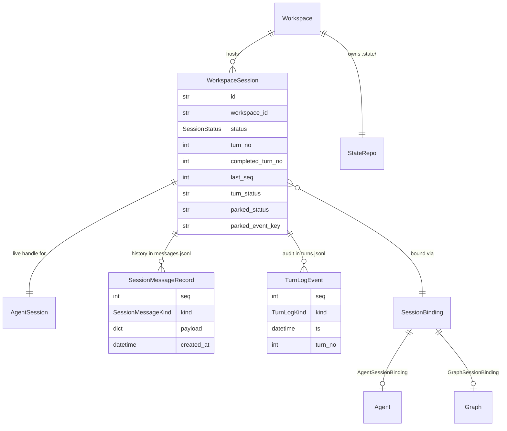
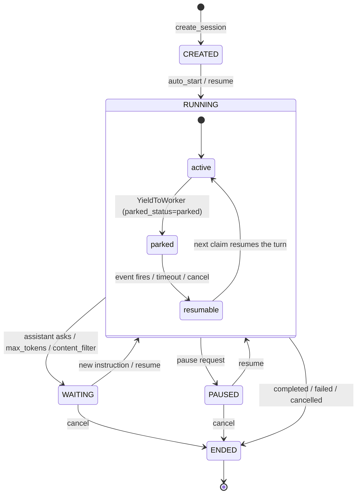

# Sessions

## 1. Purpose

A session is one execution of one agent (or one graph) on one workspace. The same agent can run many sessions against the same workspace; each session owns its own state slot under `.state/sessions/<sid>/` and its own truncation-cache subdirectory under `.tmp/<sid>/` inside the workspace.

The sessions subsystem is the seam where four other subsystems meet:

- The **claim machine** hands a worker an exclusive lease on a session row.
- The **agent / graph executor** drives the LLM-and-tool loop and streams events.
- The **workspace** hosts the per-session `messages.jsonl` history and `turns.jsonl` turn log.
- The **REST surface** (plus the read-only workspace tap stream) lets operators create, stream, interrupt, pause, resume, and inspect sessions.

The subsystem's job is to glue those together for exactly one turn at a time: claim a session, build its executor, translate the executor's stream into durable per-session message records, publish ticks so live WebSocket clients see real-time deltas, park the turn when a yielding tool suspends it, resume it when the event fires, and write a structured per-turn audit log on every boundary. Storage (`messages.jsonl` in the workspace, plus the scheduler-visible `WorkspaceSession` row) is the source of truth; the WebSocket is a tail and the event bus is advisory.

## 2. Conceptual model

A session has two persisted faces that are reconciled at turn boundaries:

- `WorkspaceSession` (`primer/model/workspace_session.py`) is the scheduler-visible row in storage. It carries lifecycle state (`status`), claim/streaming bookkeeping (`turn_no`, `completed_turn_no`, `last_seq`, `next_unprocessed_seq`, `turn_status`, `cancel_requested_at`, `pause_requested_at`), and the yielding-tool park columns (`parked_status`, `parked_event_key`, `parked_until`, `parked_at`, `parked_state`). It is the row the `ClaimEngine` claims and the row the REST surface mutates.
- `SessionInfo` (`primer/model/workspace_session.py`) is the on-disk projection inside the workspace's git-backed `.state/` repo, written as `.state/sessions/<sid>/session.json`. It plus `agent.json` (an `AgentBinding` snapshot) and, when blocked, `waiting.json` (a `WaitingState` discriminated union) describe the session from inside the workspace.

The two are allowed to diverge for at most one turn (the at-least-once trade-off of the background-execution scheduler). The `AgentSession` (`primer/workspace/session.py`) is the live in-process handle the executor drives; it owns status transitions and the read-before-write tracking.

History and the per-turn audit log live as two append-only JSONL files inside the workspace, not in the database. The `WorkspaceSession` row holds only lifecycle and claim state.

### The v2 model: a session is a workstream, not an agent's conversation

A session is no longer bound to one agent for its lifetime. `binding` is a
mutable pointer (`AgentSessionBinding` or `GraphSessionBinding`, each
carrying an optional `profile_id` override), and `binding_epoch` counts
every reapplication. History belongs to the SESSION: whichever agent runs
the next turn sees the whole transcript, attributed per turn.

Four rules make that safe:

- **Switch timing is next-turn.** A switch requested mid-turn is queued on
  `pending_binding_switch` and applied at the drain checkpoint, so the
  running turn finishes under the binding it started with.
- **The checkpoint order is switch-then-drain.** The applier runs
  immediately before a queued steer is realized, at all three terminal
  exits (executor failure, cancel/interrupt, clean completion), so a
  follow-up runs under the INCOMING binding. Every cancelled turn, a Stop,
  a Cancel, or a Cancel found after the stream's last event, takes the one
  shared exit `_land_cancelled_turn`, so that exit drains once.
- **Epochs fence stale writes.** A terminal status, a park and a resume
  each carry the epoch they began under; the row rejects a write from an
  epoch it has moved past, so a turn finishing under a replaced binding
  cannot clobber the switch.
- **An ENDED row keeps the reason it was ended with.** A turn writes its
  outcome through `_transition_session_status`, and a session can be ended
  by something else while the turn runs: a force-delete (ENDED/`force_deleted`),
  the pool's preempt convergence (ENDED/`cancelled`), the reconciler
  (ENDED/`workspace_lost`). The first terminal reason wins: the helper leaves a
  row that is already ENDED alone (no new status or reason, no `ended_detail`;
  the on-disk slot is brought in line with the row's own reason, see below)
  and logs it at INFO. Before, only an
  IDENTICAL write was skipped, so a clean completion landing a moment later
  wrote ENDED/`completed` over ENDED/`force_deleted`, or a `WAITING` over an
  ENDED row (resurrecting it with a stale reason). A turn never reopens a
  session; that is `wake_session`'s job. The guard is a CONDITIONAL write
  (`update_unless`, forbidden status ENDED, as `yields.py` does for a park),
  not a check on the helper's own snapshot: the lifecycle lock is
  process-local (a force-delete on another API process does not serialize with
  this worker) and the reconciler and the pool's `_end_session` do not take it
  at all, so the row can be ended between the helper's read and its write. The
  helper returns what the
  row says afterwards (`_TerminalWrite`: whether it landed, the status and the
  ended reason), and the callers that announce the outcome use that, not the
  outcome they computed: the terminal event (and so `session.ended` in the
  durable event log) carries the row's own reason, and the final-result relay
  stays quiet for a session that was ended under the turn. What is NOT
  changed: the turn is still counted by its own outcome, and the
  `session.replied` event still describes the turn's own reply (its
  `finish_reason`); only the terminal event and the relay follow the row. The
  on-disk slot follows the ROW when the write is skipped: the pool's
  `_end_session` ends a row without touching the slot, so the reason is
  mirrored onto `session.json` when the slot accepts it (`completed`, `failed`,
  `cancelled`, `tool_turn_cap`); `force_deleted` and `workspace_lost` are not
  mirrored (the slot of a deleted session is being removed, and an unknown
  reason would be written as `completed`). The cancelled exit's early branch
  (the row is already ENDED when it takes the lock) applies the same mirror
  through the same helper, so a row gets the same slot treatment whichever side
  of the race the turn saw it on.
- **One run per session.** A steer arriving while a turn is open becomes a
  seq-less `PendingSessionMessage`, realized at the checkpoint. Allocating
  a seq at receipt is what collided with in-flight token seqs on the older
  surface.

The message log stays append-only under all of this. Compaction appends a
`compaction_marker` carrying its summary, the span it replaced and the tail it kept verbatim (`kept_tail_messages`, read back by `reconstruct_compacted_history` right after the summary) its verdict (`outcome`, `unreducible`, `trigger_tokens`, `fixed_overhead_tokens`) and where the summary sits among the kept messages (`summary_after`, absent or 0 meaning in front); a compaction that could not reduce the prompt, or deliberately skipped, and wrote no marker leaves a `compaction_note` record instead (display and derivation only, never history; a verdict that repeats (skipped or unreducible) is noted once per run, and the reader that tells the executor so, `last_compaction_state`, reports the newest note's outcome and reason since the newest marker, and also the newest marker's `tokens_after`, which the strategy uses to avoid summarising a summary it just wrote); rewind
appends a `rewind_marker` naming the seq to keep. Neither deletes a line,
so the read-time replay walk (`primer/session/replay.py`) computes what a
reader currently sees by folding markers in order. That is why rewind is
auditable but not undoable, and why a rewind whose target lies inside a
compacted span is rejected rather than performed: the folded rows are
already gone from the visible set, so the turn would rebuild from nothing.

Usage is folded from the same records rather than counted into a column,
which is what makes a rewound turn stop counting for free.

```mermaid
erDiagram
    WorkspaceSession ||--|| AgentSession : "live handle for"
    WorkspaceSession ||--o{ SessionMessageRecord : "history in messages.jsonl"
    WorkspaceSession ||--o{ TurnLogEvent : "audit in turns.jsonl"
    Workspace ||--o{ WorkspaceSession : "hosts"
    Workspace ||--|| StateRepo : "owns .state/"
    WorkspaceSession }o--|| SessionBinding : "bound via"
    SessionBinding ||--o| Agent : "AgentSessionBinding"
    SessionBinding ||--o| Graph : "GraphSessionBinding"

    WorkspaceSession {
        str id
        str workspace_id
        SessionStatus status
        int turn_no
        int completed_turn_no
        int last_seq
        str turn_status
        str parked_status
        str parked_event_key
    }
    SessionMessageRecord {
        int seq
        SessionMessageKind kind
        dict payload
        datetime created_at
    }
    TurnLogEvent {
        int seq
        TurnLogKind kind
        datetime ts
        int turn_no
    }
```

The discriminated `SessionBinding` (`AgentSessionBinding` / `GraphSessionBinding`) selects which executor runs. Each binding may carry an optional frozen `agent_snapshot` / `graph_snapshot` so a long-running session is insulated from later edits to the Agent or Graph row.

## 3. Architecture patterns implemented

The sessions subsystem consumes five cross-cutting architecture surfaces rather than reimplementing them:

- **Claim machine** ([architecture/claim-machine.md](../architecture/claim-machine.md)). A session turn runs under a `Lease` from the unified `ClaimEngine`. `SessionClaimAdapter` (`primer/claim/adapters/sessions.py`, `kind=ClaimKind.SESSION`, `entity_table="sessions"`) supplies the eligibility predicate (`e.parked_status IS NULL`, so parked sessions are invisible to claimers) and the `on_release` hook that clears the park columns and `last_worker_id`, bumps `turn_no` / `last_turn_at` only on a successful release, and writes a synthetic terminal `ERROR` record on a failed release. Each branch is one field-scoped `patch_if` of only the fields it owns, with the `turn_no` bump fenced on the value read, so it never overwrites a concurrent steer's `turn_status` or `last_seq`.
- **Worker system** ([architecture/worker-system.md](../architecture/worker-system.md)). `WorkerPool._run_engine_session` is the dispatch wrapper that builds the `SessionDispatchDeps` bundle and calls `run_one_session_turn`. The pool also owns the park/resume hooks (`YieldToWorker` handling, `ParkedState` write, `_handle_resume`) and the startup recovery loop that re-arms leases for non-ENDED rows.
- **Storage** ([architecture/storage.md](../architecture/storage.md)). The `WorkspaceSession` row is a JSONB-backed `Identifiable`. The streaming and park columns are indexed for the claim predicate.
- **Observability** ([architecture/observability.md](../architecture/observability.md)). The per-turn structured log (`TurnLogWriter` family + `to_problem_details` + `safe_append`) is a cross-cutting observability surface shared with the graph executors; it is best-effort and never aborts a live turn.
- **REST API** ([architecture/rest-api.md](../architecture/rest-api.md)). The nested and top-level session routers, the cursor-replay WebSocket, and the RFC 7807 `ProblemDetails` error envelope all ride the FastAPI foundation.

## 4. Code layout

| Path | Responsibility |
| --- | --- |
| `primer/model/workspace_session.py` | `WorkspaceSession`, `SessionStatus`, `SessionInfo`, `AgentBinding`, the `SessionBinding` union (`AgentSessionBinding` / `GraphSessionBinding`), `WaitingState` union, `SessionMessageKind`, `SessionMessageRecord`, `Instruction`. |
| `primer/workspace/session.py` | Concrete `AgentSession`: status transitions, `waiting.json` create/delete, `take_pending_messages`, `system_prompt_fragment`, `workspace_tools`, `commit_state`, read-before-write tracking. |
| `primer/session/dispatch.py` | `run_one_session_turn` + `SessionDispatchDeps`: the worker entry point for one lease. |
| `primer/session/persistence.py` | `WorkspaceMessageWriter` (buffered jsonl appender), `WorkspaceIO` protocol, `translate_stream_event` + `_CoalesceState`. |
| `primer/session/tick_router.py` | `SessionTickRouter` + `Tick`: process-local fan-out of `session:{sid}:tick`. |
| `primer/session/yields.py` | `respond_to_yield` + `RespondToYieldDeps`: shared park-resume publish helper. |
| `primer/observability/turn_log_writer.py` | `TurnLogWriter` ABC + `NoopTurnLogWriter` / `WorkspaceTurnLogWriter` / `StorageTurnLogWriter`, `safe_append`, `to_problem_details`. |
| `primer/model/turn_log.py` | `TurnLogKind`, the eight `TurnLog*` event classes + `TurnLogEvent` union, `TurnLogRecord` storage entity, `parse_turn_log_event`. |
| `primer/claim/adapters/sessions.py` | `SessionClaimAdapter`: eligibility SQL + `on_release` bookkeeping. |
| `primer/workspace/session_factory.py` | Canonical create path: persist the row, allocate the on-disk slot, register the claim lease on auto-start. Shared by the REST handler and the trigger dispatcher. |
| `primer/agent/workspace_executor.py` | `WorkspaceAgentExecutor`: drives the agent LLM loop, sets `AgentSession` status, publishes `last_done_reason`, `inject_resume_messages` for the resume path. |
| `primer/graph/workspace_executor.py` | `WorkspaceGraphExecutor`: runs a graph against a workspace and writes per-node + graph-level turn logs. |
| `primer/api/routers/sessions.py` | `nested_session_router` (create / resume / pause / cancel / delete / WebSocket under `/v1/workspaces/{wid}/sessions/...`) + `top_session_router` (list / find / get / `turn_log`). |
| `primer/worker/pool.py` | `_run_engine_session` shim, `_WorkspaceIOShim`, park/resume hooks. |
| `primer/model/tool_call_task.py` | `ToolCallTask` and `ToolCallTaskState`: one tool call of a `tool_wait` batch as a claimable row (flag-gated, see the Lifecycle section). |
| `primer/claim/adapters/tool_calls.py` | `ToolCallClaimAdapter`: eligibility, gate / terminal / retry bookkeeping and the last-sibling wake signal. |
| `primer/worker/tool_wait_resume_coordinator.py` | `resume_engine_tool_wait` and the graph-bound sibling: assemble the batch's tool results and continue the turn. |

## 5. Data model

`SessionStatus` (`primer/model/workspace_session.py`) is the lifecycle enum: `CREATED` (pre-execution; the row exists but no worker has been told to run it), `RUNNING` (a turn is in flight), `WAITING` (blocked on user input or an approval), `PAUSED` (operator-requested suspend), and the terminal `ENDED`. `WAITING` is intentionally one state regardless of what blocks the session; the distinction is recorded in `waiting.json` via the `WaitingState` discriminated union (`_UserInputWaiting` / `_ToolApprovalWaiting`, keyed on `kind`), written only while `status == WAITING` and deleted on transition out.

`ended_reason` (on both `WorkspaceSession` and `SessionInfo`) is one of `completed` / `failed` / `cancelled` / `workspace_lost` / `force_deleted` / `tool_turn_cap`, set when `status == ENDED` (`tool_turn_cap`: an autonomous session whose turn the agent's `max_tool_turns` stopped; it is restartable like `completed`, because a reopen needs a new human or trigger message and starts a fresh round count; the dispatch mirrors it onto the on-disk `AgentSession` slot with the same reason, which is what the MCP workspace tools read, so a reason missing from `_sync_agent_session_ended`'s list would read `completed` over MCP while REST said `tool_turn_cap`). `ended_detail` carries finer graph-only codes (e.g. `begin_input_invalid`, `max_iterations_exceeded`).

The lifecycle status enum is distinct from `turn_status` (`idle` / `claimable` / `running`), which tracks the FIFO-queue and worker-claim state, and from `parked_status` (`parked` / `resumable` / `None`), which tracks the yielding-tool park. These three axes are orthogonal: a `RUNNING` session that parks on a yielding tool keeps its `turn_status` while `parked_status` flips to `parked`.

A `tool_wait` park (Phase 3 stage 7a, behind `WorkerConfig.tool_calls_as_claims_enabled`, default off) is a second kind of park on the same axis, not a fourth axis value: `parked_status` is still `parked` / `resumable`, and the kind lives in `parked_state["kind"] == "tool_wait"`. The derived `session_state` therefore reads `"parked"` for the whole wait (the design's `running` / `waiting` split by task state is not produced), and the `"waiting"` agent phase appears only as a transient phase frame and turn-log entry at the park write (the stored `agent_phase` is cleared to `None` when the turn ends, as for any park).

```mermaid
stateDiagram-v2
    [*] --> CREATED : create_session
    CREATED --> RUNNING : auto_start / resume
    RUNNING --> WAITING : assistant asks / max_tokens / content_filter
    RUNNING --> PAUSED : pause request
    RUNNING --> ENDED : completed / failed / cancelled
    WAITING --> RUNNING : new instruction / resume
    PAUSED --> RUNNING : resume
    WAITING --> ENDED : cancel
    PAUSED --> ENDED : cancel

    state RUNNING {
        [*] --> active
        active --> parked : YieldToWorker (parked_status=parked)
        parked --> resumable : event fires / timeout / cancel
        resumable --> active : next claim resumes the turn
    }

    ENDED --> [*]
```

The park sub-states (`parked` -> `resumable`) live under `RUNNING`: parking releases the lease and clears `last_lease_at` in the same statement, the claim predicate excludes `parked_status IS NOT NULL`, and the bus listener atomically flips `parked` to `resumable` when the yield event arrives so the next claim picks the row up. The safety-net sweeps that catch parks whose event never fires - `TimerScheduler` (`timer:*` deadlines) and `TimeoutSweeper` (non-timer deadlines) in `primer/bus/scheduler_tasks.py` - page through ALL parked sessions (a 200-row window per round-trip) rather than only the first 200, so no park beyond the 200th is ever silently left stuck.

`SessionMessageKind` enumerates the wire-level history kinds: `user_input`, `assistant_token`, `tool_call`, `tool_result`, `yielded`, `resumed`, `done`, `cancelled`, `error`. `SessionMessageRecord` (`seq`, `kind`, `payload`, `created_at`) is one line in `messages.jsonl`; `seq` is monotonic per session and the composite `(session_id, seq)` is the natural key.

## 6. Lifecycle

`run_one_session_turn` (`primer/session/dispatch.py`) drives exactly one turn per claimed lease. The flow:

1. **Load + early exit.** Read the `WorkspaceSession` row. If `status == ENDED`, drop the lease. If `cancel_requested` is set (a REST cancel that landed before any worker observed it, or carried over from a process that died mid-turn), transition the row straight to `ENDED`/`cancelled` and drop the lease. This is what makes "I cancelled it but nothing happened" actually terminate after an API restart.
2. **Build executor.** `deps.build_executor(session)` constructs a `WorkspaceAgentExecutor` or graph executor.
3. **Open writers + cancel watcher.** A `WorkspaceMessageWriter` for `messages.jsonl`, a `TurnLogWriter` from `turn_log_writer_factory`, and a cancel watcher (`_cancel_watcher`) that sets one `cancel_event` from two independent sources: the bus key `session:{sid}:cancel` (the fast path) and a poll of the session row's `interrupt_requested` flag every `_INTERRUPT_POLL_S` (2s; the first read is immediate), the durable fallback. An executor that offers `bind_interrupt_event` (the agent executors) is handed the event.
4. **Emit boundary turn-log events.** If `session.parked_at` is set, emit `TurnLogResumed` (with `wait_ms`) before `TurnLogStarted`; otherwise just `TurnLogStarted`.
5. **Stream.** Iterate `executor.invoke([])`. Each `StreamEvent` is run through `translate_stream_event`; every produced `SessionMessageRecord` is appended (the writer assigns `seq`) and a `session:{sid}:tick` is published with that seq. A Stop or Cancel is honoured one of two ways. An executor that bound the event decides where the turn stops (see "Stop (interrupt)" below) and dispatch reads `executor.was_interrupted` when the stream ends. Any other executor (graph sessions, test fakes) is stopped by dispatch itself, which checks the event between events and breaks.
6. **Terminal arms.** A `YieldToWorker` writes a `TurnLogYielded` + `yielded` record, flushes, publishes a tick, and returns `ReleaseOutcome(success=True, drop_lease=False)` so the worker parks the row. An unexpected exception builds one `ProblemDetails` via `to_problem_details` and reuses it for both the `TurnLogFailed` event and the `messages.jsonl` `ERROR` record, then transitions to `ENDED`/`failed`. A cancel writes `TurnLogCancelled` + a `cancelled` record and transitions to `ENDED`/`cancelled`. A Stop takes the same arm but lands `WAITING` with `interrupt_requested` cleared; Cancel wins if both flags are set. Whatever text or reasoning the model had already streamed is first written as durable records (`flush_partial_output`), because it would otherwise exist only in the live view.
7. **Clean completion.** Flush, read the executor's `last_done_reason` and the `AgentSession` status, map them via `_post_turn_status` to the final `WorkspaceSession.status`, write `TurnLogCompleted`, close the turn log.

```mermaid
sequenceDiagram
    participant E as ClaimEngine
    participant P as WorkerPool._run_engine_session
    participant D as run_one_session_turn
    participant X as Executor
    participant W as WorkspaceMessageWriter
    participant B as EventBus
    participant L as TurnLogWriter

    E->>P: claim_due -> Lease(SESSION)
    P->>D: SessionDispatchDeps + lease
    D->>D: load row, early-exit checks
    D->>X: build_executor(session)
    D->>L: TurnLogResumed? -> TurnLogStarted
    loop per StreamEvent
        X-->>D: StreamEvent
        D->>W: append(SessionMessageRecord) -> seq
        D->>B: publish session:{sid}:tick {seq}
    end
    alt YieldToWorker (park)
        D->>L: TurnLogYielded
        D->>W: append yielded; flush
        D-->>P: ReleaseOutcome(success, drop_lease=False)
        P->>P: write ParkedState; clear lease
        Note over P,E: claim predicate skips parked rows
        B-->>P: yield event fires -> mark_resumable
        E->>P: re-claim -> resume turn (inject_resume_messages)
    else clean / cancel / error
        D->>L: TurnLogCompleted | Cancelled | Failed
        D-->>P: ReleaseOutcome(success, drop_lease=True)
        P->>E: _release_lease marks the scope, then engine.release(lease, outcome)
    end
```

On the park path the worker pool snapshots the in-flight turn into a `ParkedState` blob (LLM message history stamped onto `YieldToWorker.llm_messages`, the pending `tool_call_id`, the yield's `resume_metadata`, and an optional `graph_checkpoint` for graph-bound parks). When the event fires, `_handle_resume` rehydrates the blob and routes either to the graph resume adapter or to `WorkspaceAgentExecutor.inject_resume_messages`, which appends the rehydrated `[assistant_tool_use, tool_result]` pair so the next turn continues against the augmented history. `respond_to_yield` (`primer/session/yields.py`) is the shared publish helper that both the REST yield endpoints and the trigger `parked_session` dispatcher use to wake a park.

**Stop (interrupt).** `POST .../interrupt` flags `interrupt_requested` on the row and publishes `session:{sid}:cancel`; `_cancel_watcher` turns either into the turn's `cancel_event`. The agent loop (`run_agent_turn` in `primer/agent/loop.py`) races that event against every wait for the model's next event through `primer.agent.interrupt.interruptible`, so a Stop lands before the first token (a cold model load has no timeout by default) as well as between chunks. The scope is built on `asyncio.timeout` and runs in the same task as the provider stream, like the stall timeout in `primer/llm/_timeout.py`, and it reuses `uncancel()`'s accounting: a hard Cancel racing the Stop is never swallowed, and a provider stall `TimeoutError` is never mistaken for a Stop. When it fires the provider stream is closed and the loop ends cleanly with `interrupted_out` set; the executor reports `was_interrupted` and dispatch takes the soft cancel exit above. What a Stop does and does not cover:

- A Stop that lands BEFORE a round's tool batch starts (as the model finishes, or while its terminal event drains) runs none of it: the loop answers every call with a synthetic error result, `not run: stopped by user`, through one helper (`_answer_undispatched` in `primer/agent/loop.py`), so a destructive call the user stopped never executes and every `tool_use` stays paired. The model sees those results on the next turn. A tool call that is already RUNNING is handled by `run_stoppable` (`primer/agent/stoppable_call.py`, stop slice B1; see "A running call" below). The calls of the same batch that have not started do not run: the in-process batch runs its calls one after another and checks the Stop before each (`_dispatch_tool_calls`), answering every remaining call `not run: stopped by user`, so a Stop pressed during call 1 does not see calls 2..N execute and every `tool_use` stays paired; the turn then ends before the next model call. The claims path parks the whole batch and is not covered by this check.
- **A running call (stop slice B1).** `_dispatch_tool_calls` runs each in-process call through `run_stoppable` when the turn has a Stop event: the call is its own task (a copy of the turn's context; every primer context variable is set and reset inside one call, so nothing is expected back) raced against the event. A call that finishes first, or in the same wake-up as the Stop (decided by `task.done()` right after waking), gives its REAL result. When the Stop fires first, `ToolExecutionManager.is_interruptible(call.name)` (asked only then) decides: an interruptible call is cancelled and given `UNWIND_BOUND_S` (3 s) to unwind, so its own cleanup and any records it writes land BEFORE the answer is recorded (the bound has a margin over the MCP SDK's stdio client, which waits up to `PROCESS_TERMINATION_TIMEOUT`, 2.0 s, for a server to exit once its stdin is closed before it terminates it; a bound equal to that abandoned a cancelled stdio MCP call before its process was reaped, and `tests/agent/test_stoppable_call.py` pins the margin); a call whose tool declares `interruptible=False` is not cancelled and is waited for up to `NON_INTERRUPTIBLE_GRACE_S` (5 s). "Interrupted" is decided by whether the Stop fired and not by the exception type: whatever a cancelled or waited-for call ends with after the Stop (a `CancelledError`, the MCP stdio handshake turning the cancel into a `ConfigError`, an `AuthRequiredError`) is answered `interrupted: stopped by user (the call may have run, and its result was not recorded)` (the park wording, one text), except a park (`YieldToWorker` / `ToolWaitPark`), which propagates to the handler below, and a normal result, which is used. A call that does not finish inside its bound is ABANDONED: its `CallScope` (`primer/agent/call_scope.py`) is flipped first, the task is kept in a module-level strong set (asyncio holds tasks weakly) with a done-callback that retrieves and logs its exception, and the answer is recorded. The scope is how abandonment follows the call's TASK TREE and not one id: `run_stoppable` creates a `CallScope` per call (chained to the enclosing call's scope, if any) and binds it inside the call task, so it is inherited by everything the call starts; `DelegationRecorder.on_event` drops an event whenever the scope of the context it is called from is abandoned (the scope or any enclosing one). A subagent that itself delegated (`invoke_agent` inside `invoke_agent`) tags its events with the INNER call's id, which an exact-id filter on the abandoned call would miss, and its events are dropped all the same, never appended after the pair. A hard Cancel of the turn task cancels the call, waits for it (shielded, bounded by `UNWIND_BOUND_S`) so its cleanup has run when the task ends, abandons a call that still has not gone through the same scope and hook (so a subagent cannot write after the cancelled turn's terminal record), and re-raises: the `CancelledError` is never swallowed, and a second cancel is not held up. What abandonment does NOT do: it hides the call's log records, it does not stop the call. A subagent's own tool calls run inline (its `run_agent_turn` is not given the Stop event), so a subagent that is cut off where a cancel is swallowed (the MCP stdio handshake clears every pending cancel and raises `ConfigError`, which becomes an error result) carries on with its next model call and tools after the Stop; giving the subagent turn the parent's Stop event, or stopping the handshake from swallowing an outer cancel, is tracked as a follow-up. The flag is `WorkspaceTool.interruptible` (a `ClassVar`; false for the local and sandbox `write` and `edit`) and `Tool.interruptible` (a capability field set through `make_tool(interruptible=...)`, in-memory like `yields`, served through `tool_catalogue_flags` so every tool-listing route and the MCP exposure table carry it); a system tool is declared false only after its handler was read (two or more durable writes with no single transaction, or a write in a lock that outlives the await): the collections `create_document`, `update_document`, `move_document` and `delete_document`, `put_document`, and `write_workspace_file` and `delete_workspace_file`; `tests/toolset/test_interruptible_declarations.py` pins the set both ways. The loop reports the cancelled or abandoned calls through `stopped_calls_out` (the executor's `stopped_calls`), which the cancelled exit uses to cancel the pending row of an invoker-supplied tool (below). A sandbox `exec` is only really stopped ON THE RUNTIME when the runtime protocol has an exec-cancel op: until then the cancel completes on the primer side (the client's stream is dropped) and the command in the container runs on until its own timeout or until the connection closes.
- That "ends before the next model call" holds only when the batch completes. A call that is RUNNING when the Stop lands is cancelled (or waited for) as above, so it can reach a park only in the same wake-up as the Stop or, for a call that is not interruptible, within the grace; calls later in the batch are refused once the Stop is set, so a later timer, gated or notifying call neither parks nor emits a client action (a Cancel sets the same event and refuses them the same way). If the running call asks to PARK, what happens depends on whether a person is being asked. A park that waits on no human decision (a timer, a trigger, a remote task, a claimed `tool_wait` batch) is ended as a Stop: `run_agent_turn` catches the park exception when the turn's Stop event is set, answers the round, appends to `interrupted_out` and returns, so the executor persists the paired round and dispatch takes the ordinary soft exit (CANCELLED(`operator_interrupt`), WAITING; a Cancel pending too wins, as everywhere, because that exit decides from the row). The round is answered with what holds for each call: the calls that finished before the one that asked to wait keep their REAL results (a delivered notifying call, a completed write: `_dispatch_tool_calls` stamps the park exception with the batch position and the finished results as it leaves, `YieldToWorker.batch_index` and `completed_results`), the call that asked to wait says `interrupted: stopped by user (the call may have run, and its result was not recorded)`, the calls after it `not run: stopped by user`, and a `tool_wait` batch keeps the real results of its notifying calls (their client actions already went out) and answers the claimable ones `not run`. The yielding call is found by its POSITION in the batch and not by `park.tool_call_id`: for a nested yield (`invoke_agent`, `invoke_graph`) that id is the inner call's raw provider id, which restarts every stream and can equal an earlier outer id (the outermost loop stamps last, so a nested yield carries the outer position); with no stamp every call is answered `may have run`, never `not run`. No row, claim or park column has been written for the park by then: the arms of `run_one_session_turn` write their YIELDED record, `ToolCallTask` rows, claims and park columns only after the loop, so the dispatch has nothing of its own to undo. What the park's TOOL wrote before it yielded is another matter. An `external_tool` park (an invoker-supplied tool, a no-person park like the others, so a Stop ends it) leaves its pending `ExternalToolCall` row, which the cancelled exit therefore cancels (`_cancel_the_stopped_external_call`, the same `cancel_pending_external` the cancel, delete, restart and steer routes use, reason `stopped by user`; the loop hands the park over through `stopped_park_out` and the executor exposes it as `stopped_park`, and it also runs when a call of an invoker-supplied tool (`is_external_tool_name`) was cancelled or abandoned by the Stop before it reached its yield, whose provider may already have written the row (`stopped_calls_out` / `stopped_calls`); it runs just BEFORE the terminal publish, outside the lock and bounded by `_BEST_EFFORT_IO_TIMEOUT_S`, so a listener that waits for the terminal event never sees a pending row for a turn that has ended, and a dead storage adds at most that bound to what precedes the publish), or it would stay listed as pending and answering it would be a 409. Anything else the tool started is not cancelled (an MCP task submitted upstream, a timer key): the turn just stops waiting for it. A park that asks a PERSON (an approval, an `ask_user` answer; `primer.model.yield_.YIELD_KIND_PREFIXES` is the one table the loop and the turn log's classifier share) still parks, `interrupt_requested` is cleared as before and the Stop is dropped, because what the person answers later wins; `POST .../interrupt` then answers 409 for the parked row. What stays open: graph sessions (their nodes are not given the Stop event; a Stop for graph sessions is ticket 01a10831), and a Stop that lands after the loop has looked at the event, in the window before the park arm finishes, which parks and is then the PARKED half of Stop (the 7a plan's interrupt CAS).
- Graph sessions, and the compaction call that runs before the first model call, are not interruptible: they stay cooperative (a graph session is stopped only between events). The graph-node case is tracked as its own task.
- History rule. The completed rounds of an interrupted turn (the assistant message and its tool results, always paired) are persisted to the model's history. The interrupted round's partial assistant text is not, so the model does not see it. The durable transcript does keep it (`flush_partial_output`), and the model is not otherwise told it was stopped (the one exception is a round whose tool calls were answered `not run: stopped by user`, above).
- A Stop is not lost to the bus. The row flag is the durable record and the watcher polls it, so a failed publish, a bus that cannot subscribe, a Stop recorded before the turn began and the window before the subscription is live all still land. A failed publish is logged and counted by `session_interrupt_publish_failures_total`; a Stop the poll had to deliver is counted by `session_interrupts_via_poll_total{reason}` (`queued_before_turn`: the flag was already set when the turn began, not a fault; `missed_while_running`: requested during the turn and its bus message never arrived, the one that means the bus is dropping Stops). While a turn is running the poll costs one point read of the session row every 2s, per worker; a Stop recorded while no turn is running is picked up by the first poll of the next turn that starts.
- A session that is PARKED (waiting on an approval, an answer or a timer) has no turn to stop, so `POST .../interrupt` refuses it with 409 ("no turn is running; the session is waiting for you ... Use Cancel to end it") and records nothing. A session whose park has already fired (`parked_status == "resumable"`) gets its own 409 text ("the session is resuming; Stop is not available during a resume. Use Cancel to end it"), because a graph or subagent resume runs model calls inline, so "no turn is running" would be false there. A flag left on the row would outlive the park and kill the continuation after a later decision (approve hours later, the approved tool runs, then the continuation dies before its first token). The same rule holds from the other side: a later explicit human action wins over an earlier Stop. Resuming a park clears `interrupt_requested` (`clear_interrupt_for_resume`, at the one place the pool turns a resumable park into a resume, so it covers approvals, answers, `tool_wait` and the graph variants), and `wake_session` clears it when a human's message wakes a session that is not executing a turn (a message sent while a turn runs is queued behind it and does not cancel the Stop aimed at that turn; an automated wake never overrides a human's Stop). A Stop on a session that is merely queued for its next turn is still recorded and honoured by that turn's first poll.
- A Cancel that lands after the model's terminal event is not lost: before the clean-completion transition dispatch re-reads the row, and a `cancel_requested` flag there takes the cancel arm (ENDED/cancelled), also inside the lifecycle lock. A Cancel that lands even later, in the window between that read and the lock, is a WHOLE cancel arm too, not just a status: the `CANCELLED` record is written inside the lock (before the transition, so `last_seq` covers it), the turn is counted `cancelled` rather than `completed`, and `session.replied`, `TurnLogCompleted` and the channel relay are skipped, so a thread-mapped session never posts its answer after the user cancelled. This closes a window that already existed and that an executor owning the Stop event would otherwise have widened.
- Every cancelled turn takes ONE exit, `_land_cancelled_turn` (the cancel arm and the arm that lands a Cancel found after the stream's last event used to be two copies that drifted apart). It decides Stop-versus-Cancel from the row INSIDE the lifecycle lock and writes the `CANCELLED` record there too, after the decision and before the status transition, so a Cancel that lands between the turn noticing the signal and the lock is seen (a decision taken before the lock could land the row WAITING with `cancel_requested` already set), and a reader that sees the new status finds the record that explains it. The workspace write happens under the lock, which the Cancel and steer routes also take for that session, so it is bounded: a workspace whose runtime connection dropped (a common reason to press Stop) would otherwise hold the lock for as long as it stays unreachable, and every Cancel, Stop, steer, pause, resume and switch of the session would queue behind it. The write (the append and the flush together) gets `_CANCELLED_RECORD_WRITE_TIMEOUT_S` (10s); on a timeout the exit logs a warning, skips the record and still decides, transitions and releases (the row's status and `ended_reason` say how the turn ended, the transcript just has no marker, and no tick is published for it). A write that fails outright still raises. The ENDED transition's mirror onto the on-disk slot (`_sync_agent_session_ended`: `AgentSession.status()` is an in-memory read, and `set_status` commits `session.json` over the same runtime connection; with no executor, the fallback that re-resolves the slot through the workspace registry goes over it too) also runs inside this lock on a Cancel, so it is bounded the same way by `_SLOT_MIRROR_TIMEOUT_S` (10s): on a timeout it logs a warning and the row stays ENDED while the slot may still read running (the mirror was already best-effort and swallowed every other error). Without that bound a Cancel on a session whose workspace connection is dead would hang here after the record write timed out, and the clear-interrupt, the cursor, the terminal publish and the release would never run. The two bounds are independent, not one shared deadline, so the worst case a dead connection holds the lock is about their sum (~20s). The exit's other best-effort workspace I/O runs outside the lock (the output the model had streamed when the Stop landed, the `TurnLogCancelled` entry, the turn log's close): nothing else waits on it, but the terminal publish and the lease release come after it, so each is bounded by `_BEST_EFFORT_IO_TIMEOUT_S` (5s), logs a warning and carries on. In the worst case the sheltered exit is 20s under the lock plus 5s plus 5s, which is `_TERMINAL_EXIT_GRACE_S` (30s) with no margin: a step that is merely slow lets the grace cancel the tail, which skips only what comes after the terminal publish. The build-failure path is not this exit, but it can hold the lock for two mirror bounds (loading the slot through the workspace registry, then the mirror). A row that is already ENDED when the exit takes the lock, or already gone (a force-delete wrote ENDED/`force_deleted` and is removing the row and its slot), is left alone: no `CANCELLED` record (it would recreate a transcript in a deleted session's workspace), no overwrite of the ended reason (ENDED/`force_deleted` used to become ENDED/`cancelled`). The slot follows the row's own reason when it accepts one (`completed`, `failed`, `cancelled`, `tool_turn_cap`: the same helper as the terminal write's skip, bounded by the same `_SLOT_MIRROR_TIMEOUT_S`, and this branch writes no record, so it stays inside the budget above), and a force-deleted or gone row gets none (an orphan `session.json`). The terminal event, which then carries the row's own reason, the turn-log entry, the metric and the lease release still happen.
- Stop versus Cancel is decided from `cancel_requested` alone: a Cancel always sets it before it publishes, so the cancel arm treats "not set" as a Stop. There are three publishers of `session:{sid}:cancel`, and they differ in which flag they set first: the interrupt route (`POST .../interrupt`, a Stop) sets `interrupt_requested` and never `cancel_requested`; the cancel route (`cancel_session`) sets `cancel_requested`; and the force-delete of a RUNNING session sets `cancel_requested` too, then writes ENDED/`force_deleted`. The cancel route and force-delete do it under the session's lifecycle lock on the row read inside it (force-delete used to write a snapshot read before its awaits, outside the lock, so a worker's concurrent write could be lost; and it forces the row only if it is still RUNNING by then, otherwise it takes the ordinary path for the status it finds). Because force-delete takes the lock, a request that arrives while a worker's cancelled exit is holding it on a dead workspace connection waits for it, up to about 20 seconds (the record-write and slot-mirror bounds, below), before it flags and ends the row; a row that is gone by the time it holds the lock is a 404 and nothing is written. A new publisher of the key must set the flag that says what it means BEFORE it publishes. It does not read `interrupt_requested`, because a human steer that lands mid-turn flips `turn_status` to claimable and `wake_session` then clears that flag, which would turn a Stop followed by a steer into a hard End. The decision is what the `CANCELLED` record and `TurnLogCancelled` carry as their `reason`: `operator_interrupt` for a Stop, `operator_cancel` for a Cancel (the arm that lands after the stream and the one that lands inside the completion lock alike). The console reads that reason to label the transcript marker "stopped" or "cancelled"; before this the arm wrote `operator_interrupt` for both, so a Cancel could read as a Stop.
- The cancelled exit is sheltered from the pool's hard preempt. The pool cancels the turn's task from three places: `_cancel_loop` and the row reconciler (`cancel_once`, the hard path of a Cancel: the Cancel route keeps a RUNNING session's lease and only flags the row, publishes the key and sends the NOTIFY), the heartbeat loop (`scope.cancel("preempted")` when the lease is lost: a force-delete drops it, or it was really stolen or expired) and the drain timeout. A cancel can land at any `await` of the exit, after the model has stopped: it would cut `_land_cancelled_turn` between the status transition and the terminal publish, the `TurnLogCancelled`, the metric or the drain-cursor advance. Both call sites therefore run the exit through `_finish_despite_cancel`, which runs it as its own task and absorbs the caller's cancellation (every one the heartbeat re-delivers) until the exit finishes. What the pool sees depends on how the exit ended. If it finished, the cancellations are consumed (`uncancel`, down to the task's `cancelling()` count on entry: it counts `cancel()` requests, and two requests before the task runs again deliver one `CancelledError`) and the exit's own `ReleaseOutcome` is returned, so the pool releases with `success=True` exactly as for a cancel that was never preempted; re-raising instead would drop the outcome, the pool's convergence skips a row that is already ENDED, and `on_release` would write a terminal ERROR record after a clean exit. If it raised, the pool gets a `CancelledError` chained to the exit's error (logged), not the error: the preempt convergence in `_run_engine_session` runs only on a `CancelledError`, and the error would skip it and leave the session RUNNING with no lease. The shelter is bounded by `_TERMINAL_EXIT_GRACE_S` (30s) from the first cancel: an exit that hangs past it is cancelled and the cancellation propagates, so a drain or shutdown can still abort a stuck turn; the abandoned exit is not awaited, so a done-callback retrieves and logs whatever it dies of. The first absorbed preempt of an exit is logged at INFO. Limits: a hard cancel that lands BEFORE the exit starts (during the stream) still skips it, since the shelter covers only the exit (the one stream-time shelter is the executor's wait for a forced compaction's marker commit: a cancel landing on it is absorbed until the commit finishes or `_MARKER_COMMIT_GRACE_S`, the same 30s, after the first cancel, except a lost-lease one, whichever cancel carries it (the turn leaves an unfinished commit to close the compaction window when it is done, instead of waiting for the lock the commit holds); the two do not compound, because a hard cancel that leaves the stream skips the exit); a drain (or a lost-lease verdict) takes up to the grace longer to take effect on a turn that is in its exit, so a drain can run up to 30s past its budget; and an exit abandoned at the grace that LATER finishes cleanly (it swallowed its cancel, or was past its last await) was already released by the pool as a failure, so its effects landed but the claim was not released as a success.

**The `tool_wait` park (flag-gated).** With `tool_calls_as_claims_enabled` on and a batch that contains at least one non-notifying tool call, the agent loop does not execute the batch; it raises `ToolWaitPark` and `run_one_session_turn` takes a batch-granular sibling of the `YieldToWorker` arm. It writes a `TurnLogYielded` with `yield_kind="tool_wait"`, emits the transient `"waiting"` phase frame, appends a `yielded` record whose payload is `{event_key, kind: "tool_wait", outstanding_task_ids, notifying_task_ids}` (its `event_key` is the observability-only `tool_wait:<first outstanding task id>`, never looked up by anything), emits `session.parked` (with the outstanding and notifying task counts), creates one `ToolCallTask` per call (`queued` for the claimable calls, born `done` with `result_state` for the notifying ones that were answered inline), upserts a `TOOL_CALL` lease per queued row, and returns a park outcome whose `parked_state` is a `ToolWaitParkedState` blob (`kind: "tool_wait"`, the two id lists, `llm_messages`, `turn_no`, and `graph_checkpoint` plus `node_tool_call_seq` for graph-bound parks). The functional wake key, written to `parked_event_key`, is `tool_wait:<session_id>:<turn_no>:<node segment>` (a pure function of the session, the turn and the batch's node segment), and the park timeout is a hard-coded 3600 seconds. The durable `TOOL_CALL` transcript record of every call is appended before its task becomes claimable.

Tasks are claimed independently of the session. A gated task parks alone and its siblings are unaffected; when the last task of the batch goes terminal, the claim engine re-arms the session at priority 50 after the release commits (`docs/dev/architecture/claim-machine.md`, section 5). The next claim of the session routes to `resume_engine_tool_wait` (`primer/worker/tool_wait_resume_coordinator.py`), which builds one tool-role message from the tasks' `result_state` (an error part for a failed task with no result), injects `[assistant_tool_use, tool results]` through `inject_resume_messages`, writes the `TOOL_RESULT` records and lets the next ordinary claim continue the turn. The resume is read-and-materialise only; it never re-executes a tool.

Status: the seam, the park write, the wake and the resume exist; the worker handler that claims and runs a queued task does not, so on main a flag-on session parks on tasks nothing runs (details and the other gaps are in the claim-machine doc). Treat the path as a development switch.

## 7. Persistence

History is `messages.jsonl` inside the workspace, written through `WorkspaceMessageWriter` (`primer/session/persistence.py`). The writer:

- Owns the monotonic `seq` counter and overwrites each record's `seq` so the stored value is authoritative.
- Buffers up to 16 KB or 100 ms, flushing on size, age, explicit `flush()`, or `aclose()`. Per-line flush on container/k8s exec would cost roughly 50 ms per record; buffering keeps that under a few percent of turn time. The trade-off is that a worker crash mid-buffer loses unflushed records, which the reclaim then re-emits.
- Fires the `session:{sid}:tick` publish per record (done by the dispatch layer, not the writer itself), so live WebSocket subscribers see real-time deltas even when a batch coalesces into one I/O write.

`translate_stream_event(event, _CoalesceState)` implements the selective persistence cadence: `TextDelta`s coalesce into a text buffer; `ToolCallEnd` flushes the buffer as one `assistant_token` then emits a `tool_call`; an `ExtendedEvent` wrapping `_ExecutorToolResult` becomes a `tool_result`; `Done` flushes the buffer then emits `done`; `Error` becomes an `error`. Graph runtime `_GraphErrorEvent` and `_GraphEndOutputEvent` are translated by the same function so graph sessions stream through the same path. `StreamStart`, `ReasoningDelta`, `ToolCallStart`, `ToolCallDelta`, `MediaDelta`, and `Usage` are silently dropped. The worker synthesises `user_input`, `cancelled`, and `yielded` records itself.

The per-turn structured log is `turns.jsonl` under `.state/sessions/<sid>/` (graph runs use `.state/graphs/<gsid>/turns.jsonl` and per-node `.../nodes/<nid>/turns.jsonl`). It is written through `WorkspaceTurnLogWriter`, which takes injected `append_line` / `read_existing` callables; `WorkerPool._run_engine_session` builds the factory pointed through `_WorkspaceIOShim.append_state_line` / `read_state_file` at `sessions/<sid>/turns.jsonl`. The writer lazily bootstraps its `seq` counter from the existing file on first append so a worker restart resumes the monotonic stream instead of clobbering disk and breaking `since_seq` pagination. The graph storage executor uses `StorageTurnLogWriter`, which persists `TurnLogRecord` rows instead, scoped by `(run_id, node_id)`.

The scheduler-visible `WorkspaceSession` row holds only lifecycle and claim state; it survives process restart and is re-armed into the claim engine by the lifespan recovery loop. `WorkspaceSession.last_seq` is the cursor authority for WebSocket replay.

Compaction of session history retains the prefix-string convention: a synthetic assistant message in `messages.jsonl` carries `[earlier conversation compacted on <ts>]`. Workspace sessions auto-compact through the `compaction_mixin.should_compact` pre-turn pass in the executor.

## 8. Public surfaces

S1 adds, on the workspace-scoped sessions router:

| endpoint | purpose |
| --- | --- |
| `POST .../sessions/{sid}/binding` | switch which agent or graph runs the next turn; applies immediately when idle, queues when busy, and abandons an open gate first when parked |
| `POST .../sessions/{sid}/rewind` | append a rewind marker; 409 when busy or when the target lies inside compacted history, 422 for a malformed target |
| `POST .../sessions/{sid}/compact` | summarise the visible history into a fold marker; 409 for a graph binding or a turn in flight |
| `PUT .../sessions/{sid}/response_format` | persist a structured-output schema for later turns; a steer may carry a one-turn override that outranks it |

`GET /v1/sessions/{sid}` returns the row plus its unrealized
`pending_messages`, flat rather than wrapped, so existing readers of
`WorkspaceSession` are unaffected. `GET /v1/sessions/{sid}/messages`
takes `visible=true` to fold the log through the replay walk, and the
tap carries derived usage, compaction and queued-steer envelopes that
never advance its cursor.

The `switch_binding` tool gives an agent the same hand-off, and never
yields: it records the request and the checkpoint applies it.

The REST surface lives in `primer/api/routers/sessions.py`, split across `nested_session_router` (workspace-scoped) and `top_session_router` (top-level).

Nested under `/v1/workspaces/{wid}/sessions`:

- `POST` create a session (binding to an agent or graph; `auto_start` enqueues with the scheduler). Goes through `primer/workspace/session_factory.py` so the trigger dispatcher and the REST handler share one canonical create path. Returns 404 (no workspace), 422 (binding can't be resolved, or `graph_input` fails the Begin `input_schema`).
- `POST .../resume`, `POST .../pause`, `POST .../cancel`, `DELETE .../{sid}` lifecycle controls.
- Rename (`PATCH .../{sid}`), `PUT .../response_format` and `POST .../resume` write only their own fields, each as one field-scoped `patch_if`, so a park, the hook's `parked -> resumable` flip or a cancel committed between the route's read and its write is no longer written back over: rename and the response-format PUT patch their one field fenced on the immutable `workspace_id` (a running or parked session still renames; the PUT keeps its mid-turn 409, decided on the row it read); resume patches `status`, `pause_requested` and `started_at` (only when the row it read has none) fenced on the status it read alone (a PAUSED row with a `resumable` park still resumes), re-reads once when that status moved (ENDED is 409, RUNNING the no-op, another resumable status retries once, a second move is 409) and enqueues and upserts the lease only after a write that landed. A non-force `DELETE` of a RUNNING session, parked or not, is still 409.
- `POST .../interrupt` is Stop: it flags `interrupt_requested` (and stamps `cancel_requested_at`) on a RUNNING session and publishes `session:{sid}:cancel`, answering 200 even when that publish fails (the flag is durable and the worker polls it; see "Stop (interrupt)" in section 6). A non-running session is a 200 no-op, and an ENDED or a PARKED one is 409 (a parked session has no turn to stop; nothing is recorded).

There is no per-session WebSocket and so no inbound control channel: the live stream is the workspace tap, a read-only SSE stream (`GET /v1/workspaces/{wid}/tap`, `primer/api/routers/tap.py`) of the sessions' durable records that resumes from a cursor, and every control (Stop, cancel, pause, resume, tool approval) is a REST call. The only WebSocket left in the API is the workspace terminal.

Top-level under `/v1/sessions`:

- `GET /` list, `POST /find` predicate find, `GET /{sid}` get.
- `GET /{sid}/turn_log?limit&offset&since_seq` reads `turns.jsonl` via the workspace runtime (`_read_workspace_turn_log`); a missing file or a vanished workspace returns an empty page so the UI can still render the Turn-log tab.

The chat surface was retired in S6, when a platform thread became a session.

## 9. Internal contracts

- **`SessionDispatchDeps`** (`primer/session/dispatch.py`) is the dependency bundle the worker injects per turn: `storage_provider`, `workspace_io`, `event_bus`, a `build_executor` callable that maps a `WorkspaceSession` to an executor whose `invoke(messages)` is an async generator of `StreamEvent`s, and a `turn_log_writer_factory` (default `NoopTurnLogWriter`).
- **`WorkspaceIO`** (`primer/session/persistence.py`) is the protocol the writers persist through: `append_message_line(session_id, line)` for history and `append_state_line(workspace_id, relative_path, line)` for the turn log. Implementations must be safe for concurrent callers writing distinct paths.
- **`ReleaseOutcome`** is the return contract: `success=True, drop_lease=True` for normal completion, `success=True, drop_lease=False` for a park, `success=False, drop_lease=True` for a build failure or crash. `SessionClaimAdapter.on_release` bumps `turn_no` / `last_turn_at` only when `outcome.success`, so a failed release leaves the counters untouched and the next claim sees the same turn rather than drifting `turn_no` ahead of the `messages.jsonl` entries.
- **A completed turn is not run twice (`completed_turn_no`).** A completed turn commits everything it does BEFORE its release (records, status, `last_seq`, the drain cursor, the checkpoint's realized steer); only `turn_no + 1` and `last_turn_at` are written inside the release transaction. A release abandoned at the pool's bound, or one that raises, rolls those back while the lease stays claimed until it expires, and the re-claim used to run a NEW turn over the same history (a second model call and its tool runs; for a Stop, the turn the user stopped). The guard:
  - **The marker.** `_mark_turn_completed` writes `completed_turn_no = session.turn_no` with a dedicated, unconditional `patch_if` fenced on that `turn_no`, as the LAST write of the two terminal lock blocks of a turn that ran: the clean completion (after `_persist_last_seq` and `_advance_drain_cursor`) and the Stop/Cancel exit of `_land_cancelled_turn`, and only when the turn's own outcome stands: not in the cancelled exit's early branch (the row was already ENDED), and not when `_transition_session_status` reports the write skipped because another path ended the row first (`_ended_by_another_path`; an identical repeat or an epoch-voided write also does not land, yet the turn's outcome stands there, so those are marked). So a marker present means the cursor already advanced. It is not part of `_advance_drain_cursor` (shared with the failed exit, and it writes only when the cursor moves). The failed exit (`_end_turn_failed`: its release does not bump, so a reopened session would match its own marker), parks and the ENDED/cancel/pause early exits write none. Best-effort: a rejected fence or a storage error is a WARNING, and the turn's outcome stands. The marker equals `turn_no` only between that write and the release's commit; nothing clears it.
  - **The decision.** After the ENDED/cancel/pause exits and before the running flip and `build_executor`, `_noop_if_turn_already_completed` reads the row FRESH under `session_lifecycle_lock` (never the row read at the top of the turn). `completed_turn_no == turn_no` takes the no-op path: no executor, no model call, nothing flipped, `ReleaseOutcome(success=True, drop_lease=True)`. Its release applies the lost bump (once: the adapter fences it), the marker then trails `turn_no` and later claims run normally; a lost no-op release just makes the next claim no-op again. The no-op never bumps `turn_no` itself.
  - **What it leaves armed.** `turn_status == "claimable"`: nothing to do, the pool's `_maybe_rearm_session` re-arms after the release. Otherwise `messages.jsonl` is read (only on this path) and `has_open_turn(lines, cursor=next_unprocessed_seq)` (`primer/session/turns.py`, the 1:1 USER_INPUT/terminal pairing) decides: an open USER_INPUT is armed with a `turn_status`-only `patch_if` to `claimable` (guarded on `turn_status` idle/running and a RUNNING or WAITING status), so the pool re-arms it and the next claim, now at `turn_no + 1`, answers it once. The pool's `_maybe_rearm_session` re-arms only RUNNING and WAITING rows, so input waiting on any other row (CREATED or PAUSED after a reset or a stale write, whether open in the log or already `claimable`) is not left to it: the claim runs the turn, as before the guard. So does an arming patch the row refuses (it changed under the patch). With no open input the drain checkpoint the turn would have run is run (`_apply_pending_switch_at_checkpoint`, then `_realize_pending_at_checkpoint`: one queued steer becomes a USER_INPUT and arms itself), recovering a crash between the marker and the checkpoint; with nothing queued nothing is armed. `next_unprocessed_seq <= last_seq` is deliberately NOT the work test: compaction, rewind, reopen and abandon raise `last_seq` with a marker record without moving the cursor (it would re-run the turn), and a double stale revert can leave the cursor past `last_seq` (it would strand the input). A log that cannot be read (bounded like the other exit I/O) runs the turn, as before the guard: it never swallows a turn it cannot see. The checkpoint realizes a queued steer ONLY when nothing is armed or open: realizing a second one next to an armed or open input would put two USER_INPUTs before one turn, leave an open turn that never closes, and send every later steer to the pending queue. Each no-op logs a WARNING and counts in `session_completed_turn_noop_total`.
  - **Stale writers.** Many routes write the whole session document from a snapshot. One that read the row after the marker and writes it back after the release committed puts the old `turn_no` back: the next claim no-ops once (harmless, and it repairs the bump) and, if that write also reverted a steer's `claimable` and `last_seq`, the log read still finds the unanswered USER_INPUT and arms it. What remains: such a write that reverts `last_seq` makes the next turn's writer reuse seqs already in `messages.jsonl` (only the log shows it), and one that drops the marker (an older build, or a snapshot from before the marker) falls back to the old re-run. A stale marker with no release pending (the lease removed by a cancel's `delete_lease`, a sweeper or an operator) is healed by the next claim: a no-op bump, plus arming if work is unanswered, so it cannot swallow a later crash-takeover.
  - **Not covered.** A crash between the turn's last flush and the marker write re-runs the turn as before; a crash after the marker and before the channel relay loses that relay, like any relay lost after a completed turn. A park release that rolls back (ticket 01a10b54-3212) or a resume release that rolls back (ticket 01a10b54-425b) is not guarded: neither path writes the marker. A separate seq-reuse bug, not fixed here: the `PAUSE_SUPERSEDED` records (`primer/session/enqueue.py`, `primer/session/pending_messages.py`) and the adapter's terminal `ERROR` record take the seq after the row's `last_seq` without writing it back.
- **`ToolWaitPark` is not a `YieldToWorker`.** It is a separate exception, so a catch site that was never taught about batch parks fails loudly instead of writing classic single-call park state. Every layer that should understand it has its own `except ToolWaitPark` arm: the session dispatch arm above, the graph node dispatch (graph-bound parks, see `docs/dev/subsystems/graphs.md`), and the single-agent `_run_loop`, which stamps the interrupted assistant message so the resume can inject tool results paired with their tool uses. Nested subagent turns and subgraph children never receive the flag.
- **Scoped ids, durable-first.** The transcript's tool-call id is the scoped one minted for it (`<node>:tool:<turn_no>:<seq>`), never the provider's raw id; a `ToolCallTask.id` is that id qualified with the session (`<session_id>/<scoped>`, unique across sessions; no API field a client acts on carries it, but `parked_state`, which session reads serve, stores the qualified form) and the task's `call_id` is the raw provider id the model sees. The park write raises if a task has no matching `TOOL_CALL` record in the turn's `_CoalesceState` (the durable-append-before-claimable invariant). That raise, a row of another session under a task's id, and a row of this session under it with a different `record_seq` are `TurnInvariantError`s (`primer/session/persistence.py`): running the turn again would meet the same state, so both park arms end the session `ENDED`/`failed` through the same exit as an executor error (an `ERROR` record naming it, a `failed` turn-log event, `success=False, drop_lease=True`). A storage error while parking is not one: it propagates out of the turn unchanged and the worker drops the lease with a failed outcome, which leaves the row `RUNNING` with no lease, no park and `turn_no` unchanged. What happens next depends on the row: any new message re-arms it (`wake_session` sets `turn_status="claimable"` and upserts the lease); in the first turn (`turn_no == 0`) `StuckSessionSweeper` (`primer/bus/scheduler_tasks.py`) ends it `failed` / `never_started` once its `started_at` (else `created_at`) is 600 s old; only a later turn with no new input waits for boot recovery (`recover_sessions`) to re-arm it at the next process start. Before the S1b follow-up that introduced `TurnInvariantError`, the invariant raises were plain `RuntimeError`s and took that same path: raised inside the park arm's `except` handler, which the turn's `except Exception` exit never sees, they left `run_one_session_turn`, `_run_engine_session` logged them and released with its default `ReleaseOutcome(success=False, drop_lease=True)` (the lease dropped, not left to expire; the session adapter's failed-release path appended its generic terminal `ERROR` record), and whatever re-armed the row ran the turn again into the same row. Now the same raise ends the session at once. A mixed park (an `ask_user` or approval gate with a co-pending tool_wait batch) sends its channel prompt only after the batch's rows are created, so a park that breaks the invariant there sends no prompt and ends the session. A worker that dies mid-park-write is unchanged: its lease expires, a worker claims it again, the turn re-runs, and `_create_tool_call_task_idempotent` still accepts an identical replay (same session, same id, same `record_seq`); only a re-run that meets a different `record_seq`, or a row of another session, now ends the session instead of stranding it. The rows and leases such a turn created before the raise are left behind (see "Tool-call claims: built and not built" in [claim-machine](../architecture/claim-machine.md)). The flush of that record is gated on the flag, so the default path writes records exactly as before.
- **Stop coupling.** An executor that wants to own where a Stop lands exposes `bind_interrupt_event(event)` and `was_interrupted`. Dispatch binds its `cancel_event` right after building the executor and, for such an executor, no longer breaks out of the stream on its own (it would cut a tool batch's results short): it reads `was_interrupted` when the stream ends and takes the soft cancel exit. An executor without `bind_interrupt_event` keeps the old behaviour (dispatch checks the event between events and breaks). `_BaseAgentExecutor` implements both and passes the event to `run_agent_turn(interrupt=..., interrupted_out=...)`.
- **Executor coupling.** The dispatch path reads `executor.last_done_reason` and the inner `AgentSession.status()` after a clean turn and maps them via `_post_turn_status`: an executor-set `ENDED` is authoritative; an executor-set `WAITING` (assistant-asked-a-question heuristic) stays `WAITING`; otherwise the LLM's last stop reason maps through `_STOP_REASON_TO_STATUS` (`tool_use` stays `RUNNING`, `error` ends `failed`, `max_tokens` / `content_filter` go `WAITING`, the rest end `completed`), except that a `max_tool_turns` trip arrives as `last_done_reason == "tool_turn_cap"` and is mapped before that table: `WAITING` for an interactive session, `ENDED` with `ended_reason="tool_turn_cap"` for an autonomous one (its last model event is still `tool_use`, which would otherwise rest the row `RUNNING` with no lease for boot recovery to re-arm on every restart). The default when nothing is informative is `ENDED`/`completed` so a one-shot session does not loop forever.
- **Yield classification.** `_classify_yield_kind` buckets a `YieldToWorker.event_key` prefix into `approval` (`tool_approval:`), `ask_user` (`ask_user:`), or `subscribe_to_trigger` (everything else: `timer:`, `watch:`, `mcp_task:`, `trigger:`) for the turn log.
- **Tick publish responsibility is split.** `WorkspaceMessageWriter.append` carries a comment marking where a per-record tick could publish, but the actual `session:{sid}:tick` publish lives in `run_one_session_turn`. Writer callers outside the dispatch path (notably `SessionClaimAdapter`'s terminal-error write) therefore do not publish ticks; subscribers wake on the next dispatch-driven tick or on reconnect.
- **Failure envelope.** `to_problem_details(exc)` (`primer/observability/turn_log_writer.py`) translates a live exception into an RFC 7807 `ProblemDetails` using a copy of `_PRIMER_ERROR_MAP` (duplicated to avoid the observability module importing upward into the API layer). The same envelope drives both `TurnLogFailed.error` and the `messages.jsonl` `ERROR` payload, so the legacy generic "unexpected executor error" string is gone and the Messages tab shows the real exception type/title/detail.

## 10. Testing patterns

Session tests live under `tests/session/` and `tests/observability/`:

- `tests/session/test_dispatch.py` exercises the full turn flow; `tests/session/test_dispatch_turn_log.py` pins that each dispatch hook fires on the right path (started+completed, started+failed, started+yielded, started+cancelled, resumed-prepended-when-parked) and that the default factory falls back to `NoopTurnLogWriter`.
- `tests/session/test_persistence.py` covers `WorkspaceMessageWriter` buffering and `translate_stream_event` cadence; tests inject a list-capturing `FakeWorkspaceIO` rather than a live workspace.
- `tests/session/test_tick_router.py` covers `SessionTickRouter` fan-out and deregistration.
- `tests/observability/test_turn_log_writer.py` covers all three writer variants, including the `WorkspaceTurnLogWriter` seq-bootstrap-on-restart behaviour and `to_problem_details` mapping.
- `tests/api/test_session_ws.py` and `tests/api/test_session_tick_forwarder.py` cover the WebSocket frame schema, cursor replay, and the lifespan bus-to-router forwarder; `tests/api/test_turn_log_routes.py` covers the `turn_log` REST routes (pagination, `since_seq`, empty-page fallback).
- Worker-side park/resume coverage lives in `tests/worker/test_yield_park_resume.py`; the UI journey is `tests/ui_e2e/test_session_lifecycle_journey.py`.
- `tests/api/test_session_idle_writers.py` drives rename, the response-format PUT and resume against a write committed between the route's read and its write (a park, the hook's flip, a cancel, a status move) on a real SQLite storage, counting the route's write attempts, and pins that a non-force delete refuses a running or parked session.
- The `tool_wait` park is covered by `tests/session/test_dispatch_park_arms_e2e.py` (the mixed and pure-graph park arms driven through `run_one_session_turn`), `test_materialize_pending_tool_wait_rows.py`, `test_tool_call_record_flush_gating.py` (the flag-off flush is inert) and `test_tool_wait_seam_e2e.py` (park write, hand-simulated task worker, last-sibling wake, resume). There is no end-to-end test with the flag on against a live stack.
- The completed-turn guard is covered end to end by `tests/worker/test_completed_turn_reclaim.py`: a real `WorkerPool` and `run_one_session_turn` over the in-memory engine, a counting executor (one `invoke()` is one model call) and a release that never reaches the real one (the state a rolled-back Postgres release leaves). It pins the no-op (zero calls, the bump applied once), a Stop, a lost no-op release, a queued steer (one call, at the next `turn_no`), a pending steer a skipped checkpoint left (realized, then answered once), the stale-revert races, compaction and rewind markers, a stale marker with a crash-takeover and with `/resume` at rest, and the unreadable log. `tests/session/test_completed_turn_marker.py` pins where the marker is and is not written, and `tests/claim/test_session_adapter_owned_fields.py` pins the adapter's field-scoped release against a write committed between its read and its write.

Per the project convention, smoke-test session changes with `uv run primer api` in the background after each change, and read any API keys or bearer tokens from env vars in tests rather than inlining them.

## 11. Historical decisions

- **The persisted row is named `WorkspaceSession`, not `Session`.** Why: the entity is workspace-anchored (the URL is `/v1/workspaces/{wid}/sessions/{sid}` and `messages.jsonl` lives inside the workspace), so the name signals the DB row is the scheduler-visible projection of a workspace-owned entity. Spec: docs/superpowers/specs/2026-05-27-workspace-session-streaming-design.md.
- **`messages.jsonl` in the workspace is the source of truth, not the database.** Why: it co-locates session history with the workspace git slot it describes and lets local/container/k8s backends carry the filesystem semantics without a parallel DB schema. Spec: docs/superpowers/specs/2026-05-27-workspace-session-streaming-design.md.
- **`SessionStatus` gained a `CREATED` pre-execution state and `WAITING` was collapsed to a single value backed by the `WaitingState` union.** Why: `CREATED` lets a row exist before a worker is told to run it, and one `WAITING` value plus a forward-compatible `kind`-keyed union means adding new wait reasons needs no enum or storage change. Spec: docs/superpowers/specs/2026-05-02-workspace-design.md.
- **Park state lives entirely in DB columns (`parked_status` / `parked_event_key` / `parked_until` / `parked_at` / `parked_state`) and deliberately does not pin the agent/graph row.** Why: clean B-tree indexes keep the non-parked majority out of the claim predicate, and re-reading the agent/tools/system prompt on resume lets an operator hot-fix a prompt during a long park. Spec: docs/superpowers/specs/2026-05-22-yielding-tools-design.md.
- **Workers do not own parks: the park UPDATE releases the lease in the same statement and the claim predicate excludes parked rows.** Why: a worker restart between park and lease-release is impossible (single statement) and any worker can resume. Spec: docs/superpowers/specs/2026-05-22-yielding-tools-design.md.
- **Cancel is dual-signalled (a `cancel_requested_at` DB flag plus a `session:{sid}:cancel` bus event) and the early-exit check honours `cancel_requested` before building an executor.** Why: the bus event wakes the running worker fast while the DB flag survives an API or worker restart so a cancel is not silently lost. The worker also re-reads the flag for the sessions it is running every heartbeat interval (`WorkerPool._cancel_reconcile_loop`, see worker-system.md), because the hard-preempt NOTIFY is not durable. Spec: docs/superpowers/specs/2026-05-27-workspace-session-streaming-design.md.
- **Streaming writes are buffered (16 KB or 100 ms) with per-record ticks instead of a synchronous per-line flush.** Why: per-line flush on container/k8s exec costs roughly 50 ms per record; buffering keeps overhead under a few percent while ticks still fan out in real time, at the cost of losing unflushed records on a crash (the reclaim re-emits them). Spec: docs/superpowers/specs/2026-05-27-workspace-session-streaming-design.md.
- **History persistence is selective: only logical events land in `messages.jsonl`, deltas and lifecycle events are dropped.** Why: it matched the streaming surface byte-for-byte so the UI's coalescing logic ported directly, and it keeps the per-session log bounded by logical events rather than token granularity. Spec: docs/superpowers/specs/2026-05-27-workspace-session-streaming-design.md.
- **One bus subscription per process plus a per-process `SessionTickRouter` fans out to per-session queues.** Why: a per-WebSocket bus subscription would mean one `LISTEN` per socket on Postgres; process-scoped routing keeps a long-running multi-subscriber session from multiplying backend connections. Spec: docs/superpowers/specs/2026-05-27-workspace-session-streaming-design.md.
- **The turn-log writer family lives in `primer/observability/`, not `primer/session/`.** Why: it is shared by agent sessions and both graph executors, so housing it under the session subsystem would force graph code to import from sessions; the observability module is owned by neither. Spec: docs/superpowers/specs/2026-06-05-per-session-turn-log-design.md.
- **The resumed turn-log event is emitted from `run_one_session_turn` keyed on `session.parked_at`, not from the claim adapter.** Why: the dispatch path already owns the turn boundary and has the writer open, so it can compute `wait_ms` without coordinating with the claim engine. Spec: docs/superpowers/specs/2026-06-05-per-session-turn-log-design.md.
- **The failed-turn `ProblemDetails` envelope is reused for both the `TurnLogFailed` event and the legacy `messages.jsonl` `ERROR` record.** Why: operators viewing the Messages tab or the Last-error panel see the real exception type/title/detail instead of the spec-era generic string, and any future provider-error type added to the error map lands in both surfaces automatically. Spec: docs/superpowers/specs/2026-06-05-per-session-turn-log-design.md.
- **The `WorkspaceTurnLogWriter` bootstraps its seq counter by reading the existing file on first append.** Why: without it a worker restart mid-session would write `seq=1` over the existing seq space and break `since_seq` pagination for any polling operator. Spec: docs/superpowers/specs/2026-06-05-per-session-turn-log-design.md.
- **Sessions are single-use; resuming after `ENDED` is not supported in v1.** Why: it avoids designing reanimation semantics before they are needed; `parent_session_id` is reserved for fork/spawn attribution without committing to a resume API. Spec: docs/superpowers/specs/2026-05-02-workspace-design.md.
- **A tool-call batch parks the session once (`tool_wait`) instead of once per gated call.** Why: the classic path raised `YieldToWorker` from the sequential dispatch loop, so one gated call parked the whole turn and the calls after it never started; a batch-granular park whose wake is "the last task went terminal" lets a gated call hold only its own row. The kind is carried in `parked_state` rather than a new `parked_status` value, so the claim predicate, the sweepers and `session_state` needed no change. Spec: docs/superpowers/2026-08-29-phase3-execution-topology-design.md.
- **The `tool_wait` path ships behind a default-off flag with the executor half unbuilt.** Why: the arc landed in gated, flag-inert halves (seam, park, entity, wake, resume); the pool handler that runs a queued task did not land, so the flag is a development switch until it does. Source: the 7a spec-versus-main audit of 2026-10-04.

## Cross-reference: external tools

The steer endpoint doubles as the resume path for invoker-supplied tool
calls: `tool_results` in the body resolves pending external calls
(409-atomic), message content cancels them with a synthetic result, and
`external_tools` registers the next turn's defs; see
[external-tools](external-tools.md).
