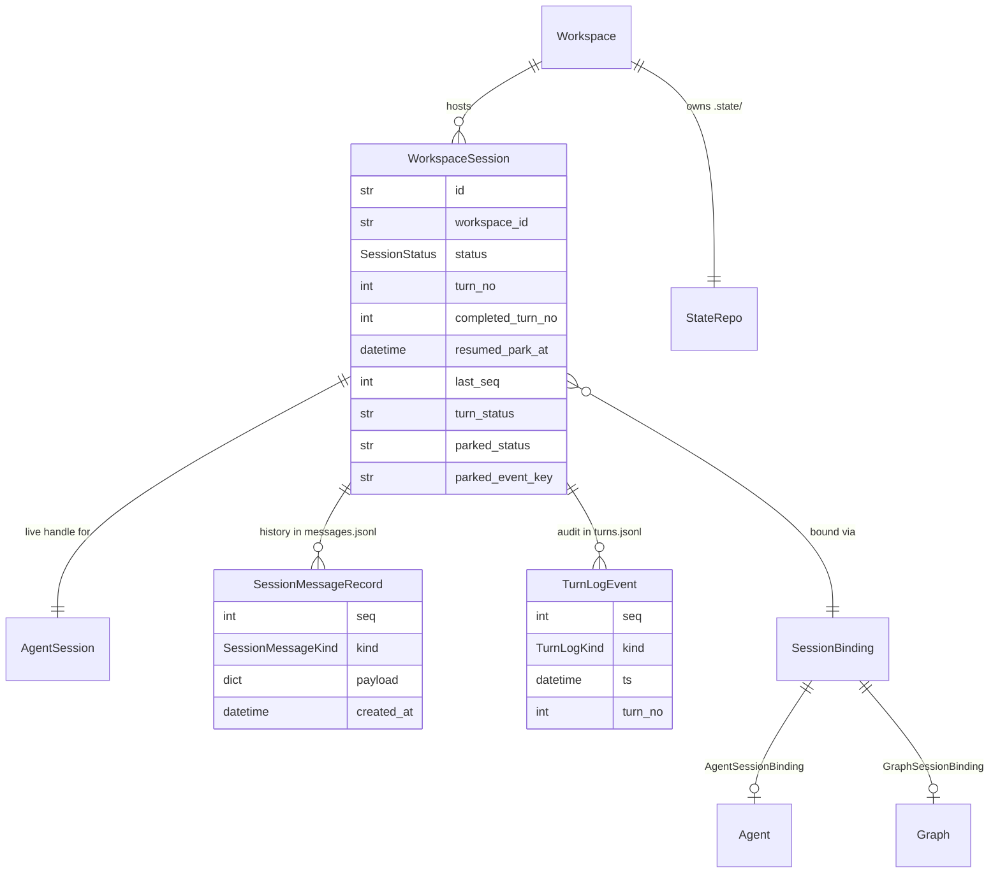
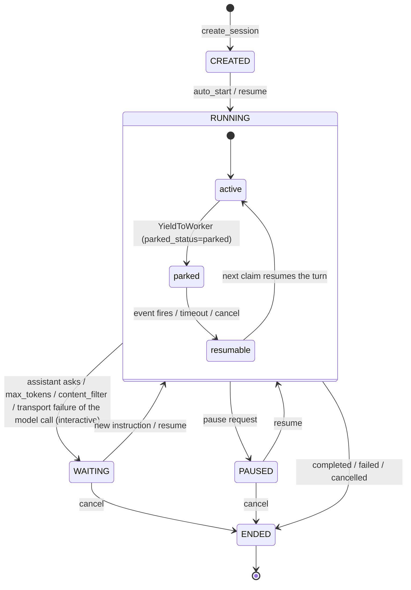

# Sessions

## 1. Purpose

A session is one execution of one agent (or one graph) on one workspace. The same agent can run many sessions against the same workspace; each session owns its own state slot under `.state/sessions/<sid>/` and its own truncation-cache subdirectory under `.tmp/<sid>/` inside the workspace.

The sessions subsystem is the seam where four other subsystems meet:

- The **claim machine** hands a worker an exclusive lease on a session row.
- The **agent / graph executor** drives the LLM-and-tool loop and streams events.
- The **workspace** hosts the per-session `messages.jsonl` history and `turns.jsonl` turn log.
- The **REST surface** (plus the read-only workspace tap stream) lets operators create, stream, interrupt, pause, resume, and inspect sessions.

The subsystem's job is to glue those together for exactly one turn at a time: claim a session, build its executor, translate the executor's stream into durable per-session message records, publish ticks so the workspace tap sees new records in real time, park the turn when a yielding tool suspends it, resume it when the event fires, and write a structured per-turn audit log on every boundary. Storage (`messages.jsonl` in the workspace, plus the scheduler-visible `WorkspaceSession` row) is the source of truth; the tap (a read-only SSE stream over those records) is a tail and the event bus is advisory.

## 2. Conceptual model

A session has two persisted faces that are reconciled at turn boundaries:

- `WorkspaceSession` (`primer/model/workspace_session.py`) is the scheduler-visible row in storage. It carries lifecycle state (`status`), claim/streaming bookkeeping (`turn_no`, `completed_turn_no`, `last_seq`, `next_unprocessed_seq`, `turn_status`, `cancel_requested_at`, `pause_requested_at`), the yielding-tool park columns (`parked_status`, `parked_event_key`, `parked_until`, `parked_at`, `parked_state`), the resumed-park marker (`resumed_park_at`), and the tool_wait park's marker and wake stamp (`parked_tool_batches`, `resumable_at`; nothing writes them yet, so both read null, see section 5). It is the row the `ClaimEngine` claims and the row the REST surface mutates.
- `SessionInfo` (`primer/model/workspace_session.py`) is the on-disk projection inside the workspace's git-backed `.state/` repo, written as `.state/sessions/<sid>/session.json`. It plus `agent.json` (an `AgentBinding` snapshot) and, when blocked, `waiting.json` (a `WaitingState` discriminated union) describe the session from inside the workspace.

The two are allowed to diverge for at most one turn (the at-least-once trade-off of the background-execution scheduler). The `AgentSession` (`primer/workspace/session.py`) is the live in-process handle the executor drives; it owns status transitions and the read-before-write tracking.

**The row is the one truth about how a session ended; the slot is derived (architecture review A1).** The sentence above is not what the code does: the slot does not converge at the next turn boundary, it stays wrong until something rewrites it, and three paths leave it wrong. It says `completed` for a row that ended some other way (the dispatch mirror `_sync_agent_session_ended` writes `completed` for any reason outside the four an `AgentSession` accepts, and `Workspace.aclose`, which runs when a workspace handle is closed at shutdown or on a provider invalidate, USED TO end every cached non-ended slot as `completed` whatever the row says: A-24 stopped that, so `aclose` only releases the handle now, but slots it ended before the fix are still on disk and this overlay stays for them and for the other causes); it still says `running` or `waiting` for a row ended by a path that never touches the slot (the stuck-session sweeper, the pool's `_end_session`, the reconciler); and it says `ended` for a row that is alive. So every reader that SERVES the slot to a person or a tool passes it through `primer/session/slot_view.py` first: `overlay_row_on_info` (one rule), `overlay_row_on_slot_info` (one session, one `get`) and `overlay_rows_on_infos` (a page, one `find` with `Op.IN` per 200 sessions). The row owns the lifecycle fields only: an ENDED row gives `status`, `ended_reason`, `ended_detail` and `ended_at`; a live row un-ends a slot that says ENDED; a WAITING row shows through a slot still RUNNING (a clean rest, which the row records and the slot never learns); a slot with no row, or a row of another workspace, is served unchanged. That is the whole list: any OTHER disagreement between two live states (a slot `waiting` or `paused` under a `running` row, a slot `running` under a `created` row) is left alone on purpose, because those are in-turn states the executor writes to the slot first and nothing shows the row is more current there. The applied readers are `GET /v1/workspaces/{wid}/sessions/{sid}`, `GET /v1/workspaces/{wid}/sessions` and the `get_workspace_session` / `list_workspace_sessions` tools, so they agree with `GET /v1/sessions/{sid}`. `SessionInfo.ended_detail` exists for this: the runtime does not set it, so `session.json` carries `null` there and the overlay fills it from the row. The overlay is advisory: a storage failure, including a provider that cannot hand out the row store, serves the slot as it is and logs a warning. What this does NOT do: `session.json` itself is not rewritten, so code that DECIDES from the slot (`WorkspaceAgentExecutor.invoke` refuses an ENDED slot, a wake's `append_instruction` raises on one) still sees the wrong file; the write-side finding A-24 (closing a workspace handle ending live slots) is fixed, and the other causes listed above still leave the file behind the row. Pinned by `tests/session/test_slot_view.py` (the rule and the one-query-per-page bound) and `tests/api/test_session_end_one_truth.py` (every route and the list, against slots that lie in each of the three ways).

History and the per-turn audit log live as two append-only JSONL files inside the workspace, not in the database. The `WorkspaceSession` row holds only lifecycle and claim state.

### The v2 model: a session is a workstream, not an agent's conversation

A session is no longer bound to one agent for its lifetime. `binding` is a
mutable pointer (`AgentSessionBinding` or `GraphSessionBinding`, each
carrying an optional `profile_id` override), and `binding_epoch` counts
every reapplication. History belongs to the SESSION: whichever agent runs
the next turn sees the whole transcript, attributed per turn.

Four rules make that safe:

- **Switch timing is next-turn.** A switch requested mid-turn is queued on
  `pending_binding_switch` and applied at the drain checkpoint, so the
  running turn finishes under the binding it started with.
- **The checkpoint order is switch-then-drain.** The applier runs
  immediately before a queued steer is realized, at all three terminal
  exits (executor failure, cancel/interrupt, clean completion), so a
  follow-up runs under the INCOMING binding. Every cancelled turn, a Stop,
  a Cancel, or a Cancel found after the stream's last event, takes the one
  shared exit `_land_cancelled_turn`, so that exit drains once. The pool's
  `_end_session` (every engine-path end: a failed resume, a cancelled park, a
  finished graph resume) has no turn behind it and so no checkpoint, so it
  applies a queued switch itself through `apply_queued_binding_switch`
  (best effort; nothing queued writes nothing). Without that, a switch queued
  on a parked session survived a failed resume on the ENDED row and, after a
  reopen, the user's next message was answered by the OUTGOING binding. It
  then realizes ONE queued steer through `realize_queued_steer` (the
  checkpoint's body, best effort), on every reason (failed, completed,
  cancelled), as the dispatch exits do: `route_steer` counts a parked session
  as busy, so a steer sent to it is queued, and without this it waited behind
  the ended session for some later message (then ran after it) or forever. The
  realized steer reopens the ended session through `wake_session` and arms a
  turn; the pool re-arms the claim after the release.
- **The switch itself is ONE protocol for every caller of
  `apply_binding_switch`, under the session's lifecycle lock (held by the
  caller; the function never takes it): reserve, append, fence.** (1) RESERVE
  the marker's seq with a guarded `patch_if({"last_seq": old + 1})` whose
  `where` is the caller's guard plus `last_seq == old` (`reserve_seq`,
  `primer/session/seq_reservation.py`); a rejection means the row changed
  since the caller read it and NOTHING has been written (the route answers 409,
  the checkpoint leaves the switch queued). (2) Append the marker AT the
  reserved seq and flush. (3) ONE fenced `patch_if` of `binding`,
  `binding_epoch`, `pending_binding_switch: None` and `next_unprocessed_seq`,
  guarded by the same caller guard plus `last_seq == the reserved seq`. The
  guards: the idle route `{"turn_status": ["idle"], "parked_status": [None]}`
  (from a row read INSIDE the lock), the abandon-then-switch branch
  `{"parked_status": [None]}`, a turn's checkpoint `{"parked_status": [None]}`,
  and the pool's `_end_session` `{"status": ["ended"]}` (it ends a session whose
  park columns the claim's release has not cleared yet). The old code appended
  from the `last_seq` of a row read earlier and wrote the whole row back, so a
  steer that landed in between had its seq repeated by the marker and its
  `last_seq` and armed turn erased. The in-lock resolve, append and flush of the
  checkpoint and of the route share ONE deadline,
  `mutation_lock.IN_LOCK_IO_TIMEOUT_S` (10 s; the cancelled exit's
  `_CANCELLED_RECORD_WRITE_TIMEOUT_S` is the same value): an unreachable
  workspace must not hold the lock Cancel and every steer queue behind. The
  deadline covers the whole protocol, the guarded `patch_if`s included, so a
  timeout that lands just after the closing write committed still answers the
  route's 409 although the switch took effect (a retry then writes one more
  marker and bumps the epoch again); on the abandon-then-switch branch the 409
  says the gate is already closed (its parked turn was rejected). A
  timeout leaves the switch queued and a reserved gap in the seqs (readers
  tolerate gaps); a marker that lands late after its timeout can precede a
  second marker of the same epoch on the next attempt (declared; the retry's
  orphan detection is the next change). A rejected closing write leaves
  the marker in the log unapplied. A park committed by another process does
  that, and so does, in ONE process, the busy-queue branch of
  `switch_session_binding`, which still writes the WHOLE row outside the lock
  from a row it read earlier (S2a PR-12b makes it a `patch_if` of
  `pending_binding_switch` alone): a stale write landing after the reservation,
  or after the closing write, puts `last_seq` back below the marker, so the
  next record any writer appends takes the marker's seq. It is pinned as a
  strict xfail in `tests/api/test_session_binding_reservation.py`. Also
  declared, and older than this change: the closing write sets
  `next_unprocessed_seq` to `seq + 1` unconditionally, so when a steer's
  USER_INPUT at `seq - 1` is still unprocessed the drain cursor passes it.
- **Epochs fence stale writes.** A terminal status, a park and a resume
  each carry the epoch they began under; the row rejects a write from an
  epoch it has moved past, so a turn finishing under a replaced binding
  cannot clobber the switch.
- **An ENDED row keeps the reason it was ended with.** A turn writes its
  outcome through `_transition_session_status`, and a session can be ended
  by something else while the turn runs: a force-delete (ENDED/`force_deleted`),
  the pool's preempt convergence (ENDED/`cancelled`), the reconciler
  (ENDED/`workspace_lost`). The first terminal reason wins: the helper leaves a
  row that is already ENDED alone (no new status or reason, no `ended_detail`;
  the on-disk slot is brought in line with the row's own reason, see below)
  and logs it at INFO. Before, only an
  IDENTICAL write was skipped, so a clean completion landing a moment later
  wrote ENDED/`completed` over ENDED/`force_deleted`, or a `WAITING` over an
  ENDED row (resurrecting it with a stale reason). A turn never reopens a
  session; that is `wake_session`'s job. The guard is a CONDITIONAL write
  (`update_unless`, forbidden status ENDED; the park flip in `yields.py` is
  guarded the same way, by a `patch_if` whose `where` admits every status but
  ENDED),
  not a check on the helper's own snapshot: the lifecycle lock is
  process-local (a force-delete on another API process does not serialize with
  this worker) and the reconciler and the pool's `_end_session` do not take it
  at all, so the row can be ended between the helper's read and its write. The
  helper returns what the
  row says afterwards (`_TerminalWrite`: whether it landed, the status and the
  ended reason), and the callers that announce the outcome use that, not the
  outcome they computed: the terminal event (and so `session.ended` in the
  durable event log) carries the row's own reason, and the final-result relay
  stays quiet for a session that was ended under the turn. The same turn
  emits no `session.replied` (the durable event log must not say a session
  replied that it also says was ended by something else) and is counted once
  under `turns_total{status="overridden"}`, not `completed` (ticket
  01a1134b-2cb8); `TurnLogCompleted` is still written, as the model call did
  finish. A turn nobody ended replies and counts as before. The
  on-disk slot follows the ROW when the write is skipped: the pool's
  `_end_session` ends a row without touching the slot, so the reason is
  mirrored onto `session.json` when the slot accepts it (`completed`, `failed`,
  `cancelled`, `tool_turn_cap`); `force_deleted` and `workspace_lost` are not
  mirrored (the slot of a deleted session is being removed, and an unknown
  reason would be written as `completed`). The cancelled exit's early branch
  (the row is already ENDED when it takes the lock) applies the same mirror
  through the same helper, so a row gets the same slot treatment whichever side
  of the race the turn saw it on.
- **One run per session.** A steer arriving while a turn is open becomes a
  seq-less `PendingSessionMessage`, realized at the checkpoint. Allocating
  a seq at receipt is what collided with in-flight token seqs on the older
  surface.

The message log stays append-only under all of this. Compaction appends a
`compaction_marker` carrying its summary, the span it replaced and the tail it kept verbatim (`kept_tail_messages`, read back by `reconstruct_compacted_history` right after the summary) its verdict (`outcome`, `unreducible`, `trigger_tokens`, `fixed_overhead_tokens`) and where the summary sits among the kept messages (`summary_after`, absent or 0 meaning in front); a compaction that could not reduce the prompt, or deliberately skipped, and wrote no marker leaves a `compaction_note` record instead (display and derivation only, never history; a verdict that repeats (skipped or unreducible) is noted once per run, and the reader that tells the executor so, `last_compaction_state`, reports the newest note's outcome and reason since the newest marker, and also the newest marker's `tokens_after`, which the strategy uses to avoid summarising a summary it just wrote); rewind
appends a `rewind_marker` naming the seq to keep. Neither deletes a line,
so the read-time replay walk (`primer/session/replay.py`) computes what a
reader currently sees by folding markers in order. That is why rewind is
auditable but not undoable, and why a rewind whose target lies inside a
compacted span is rejected rather than performed: the folded rows are
already gone from the visible set, so the turn would rebuild from nothing.

Usage is folded from the same records rather than counted into a column,
which is what makes a rewound turn stop counting for free.

```mermaid
erDiagram
    WorkspaceSession ||--|| AgentSession : "live handle for"
    WorkspaceSession ||--o{ SessionMessageRecord : "history in messages.jsonl"
    WorkspaceSession ||--o{ TurnLogEvent : "audit in turns.jsonl"
    Workspace ||--o{ WorkspaceSession : "hosts"
    Workspace ||--|| StateRepo : "owns .state/"
    WorkspaceSession }o--|| SessionBinding : "bound via"
    SessionBinding ||--o| Agent : "AgentSessionBinding"
    SessionBinding ||--o| Graph : "GraphSessionBinding"

    WorkspaceSession {
        str id
        str workspace_id
        SessionStatus status
        int turn_no
        int completed_turn_no
        datetime resumed_park_at
        int last_seq
        str turn_status
        str parked_status
        str parked_event_key
    }
    SessionMessageRecord {
        int seq
        SessionMessageKind kind
        dict payload
        datetime created_at
    }
    TurnLogEvent {
        int seq
        TurnLogKind kind
        datetime ts
        int turn_no
    }
```

The discriminated `SessionBinding` (`AgentSessionBinding` / `GraphSessionBinding`) selects which executor runs. Each binding may carry an optional frozen `agent_snapshot` / `graph_snapshot` so a long-running session is insulated from later edits to the Agent or Graph row.

## 3. Architecture patterns implemented

The sessions subsystem consumes five cross-cutting architecture surfaces rather than reimplementing them:

- **Claim machine** ([architecture/claim-machine.md](../architecture/claim-machine.md)). A session turn runs under a `Lease` from the unified `ClaimEngine`. `SessionClaimAdapter` (`primer/claim/adapters/sessions.py`, `kind=ClaimKind.SESSION`, `entity_table="sessions"`) supplies the eligibility predicate (`e.parked_status IS NULL`, so parked sessions are invisible to claimers) and the `on_release` hook that clears the park columns and `last_worker_id`, bumps `turn_no` / `last_turn_at` only on a successful release, and writes a synthetic terminal `ERROR` record on a failed release. Each branch is one field-scoped `patch_if` of only the fields it owns, with the `turn_no` bump fenced on the value read, so it never overwrites a concurrent steer's `turn_status` or `last_seq` (its one other row write is the failure marker's seq reservation, below).
- **Worker system** ([architecture/worker-system.md](../architecture/worker-system.md)). `WorkerPool._run_engine_session` is the dispatch wrapper that builds the `SessionDispatchDeps` bundle and calls `run_one_session_turn`. The pool also owns the park/resume hooks (`YieldToWorker` handling, `ParkedState` write, `_handle_resume`) and the startup recovery loop that re-arms leases for non-ENDED rows.
- **Storage** ([architecture/storage.md](../architecture/storage.md)). The `WorkspaceSession` row is a JSONB-backed `Identifiable`. The streaming and park columns are indexed for the claim predicate.
- **Observability** ([architecture/observability.md](../architecture/observability.md)). The per-turn structured log (`TurnLogWriter` family + `to_problem_details` + `safe_append`) is a cross-cutting observability surface shared with the graph executors; it is best-effort and never aborts a live turn.
- **REST API** ([architecture/rest-api.md](../architecture/rest-api.md)). The nested and top-level session routers, the workspace tap (a cursor-resumable, read-only SSE stream), and the RFC 7807 `ProblemDetails` error envelope all ride the FastAPI foundation.

## 4. Code layout

| Path | Responsibility |
| --- | --- |
| `primer/model/workspace_session.py` | `WorkspaceSession`, `SessionStatus`, `SessionInfo`, `AgentBinding`, the `SessionBinding` union (`AgentSessionBinding` / `GraphSessionBinding`), `WaitingState` union, `SessionMessageKind`, `SessionMessageRecord`, `Instruction`. |
| `primer/workspace/session.py` | Concrete `AgentSession`: status transitions, `waiting.json` create/delete, `take_pending_messages`, `system_prompt_fragment`, `workspace_tools`, `commit_state`, read-before-write tracking. |
| `primer/session/dispatch.py` | `run_one_session_turn` + `SessionDispatchDeps`: the worker entry point for one lease. |
| `primer/session/persistence.py` | `WorkspaceMessageWriter` (buffered jsonl appender), `WorkspaceIO` protocol, `translate_stream_event` + `_CoalesceState`. |
| `primer/session/terminals.py` | `closes_turn`, `is_session_terminal`, `is_non_fatal_error`, `is_bare_marker`, `is_delegated`, and `TurnWindowScanner`: the rule for "this record ends a session turn" (per record) and for "this record ends a WINDOW" (the scanner: a failed turn is one), shared by the timeline, `session_usage.turns` and `count_turn_state`; the final-result relay keeps the per-record `is_session_terminal`. Mirrored by the console's `SH_closesTurn`, `SH_newWindowScanner` and `SH_windowsOfSeq`. |
| `primer/tap/router.py` | `WorkspaceTapRouter` + `WorkspaceTick`: the process's sole `session:*:tick` bus subscription, fanned out to per-workspace tap subscribers (bounded queues; the oldest tick is dropped on overflow). |
| `primer/session/yields.py` | `respond_to_yield` + `RespondToYieldDeps`: shared park-resume publish helper. |
| `primer/observability/turn_log_writer.py` | `TurnLogWriter` ABC + `NoopTurnLogWriter` / `WorkspaceTurnLogWriter` / `StorageTurnLogWriter`, `safe_append`, `to_problem_details`. |
| `primer/model/turn_log.py` | `TurnLogKind`, the eight `TurnLog*` event classes + `TurnLogEvent` union, `TurnLogRecord` storage entity, `parse_turn_log_event`. |
| `primer/claim/adapters/sessions.py` | `SessionClaimAdapter`: eligibility SQL + `on_release` bookkeeping. |
| `primer/workspace/session_factory.py` | Canonical create path: persist the row, allocate the on-disk slot, register the claim lease on auto-start. Shared by the REST handler and the trigger dispatcher. |
| `primer/agent/workspace_executor.py` | `WorkspaceAgentExecutor`: drives the agent LLM loop, sets `AgentSession` status, publishes `last_done_reason`, `inject_resume_messages` for the resume path. |
| `primer/graph/workspace_executor.py` | `WorkspaceGraphExecutor`: runs a graph against a workspace and writes per-node + graph-level turn logs. |
| `primer/api/routers/sessions.py` | `nested_session_router` (create / resume / pause / cancel / delete under `/v1/workspaces/{wid}/sessions/...`) + `top_session_router` (list / find / get / `turn_log`). |
| `primer/worker/pool.py` | `_run_engine_session` shim, `_WorkspaceIOShim`, park/resume hooks. |
| `primer/model/tool_call_task.py` | `ToolCallTask` and `ToolCallTaskState`: one tool call of a `tool_wait` batch as a claimable row (flag-gated, see the Lifecycle section). |
| `primer/claim/adapters/tool_calls.py` | `ToolCallClaimAdapter`: eligibility, gate / terminal / retry bookkeeping and the last-sibling wake signal. |
| `primer/worker/tool_wait_resume_coordinator.py` | `resume_engine_tool_wait` and the graph-bound sibling: assemble the batch's tool results and continue the turn. |

## 5. Data model

`SessionStatus` (`primer/model/workspace_session.py`) is the lifecycle enum: `CREATED` (pre-execution; the row exists but no worker has been told to run it), `RUNNING` (a turn is in flight), `WAITING` (blocked on user input or an approval), `PAUSED` (operator-requested suspend), and the terminal `ENDED`. `WAITING` is intentionally one state regardless of what blocks the session; the distinction is recorded in `waiting.json` via the `WaitingState` discriminated union (`_UserInputWaiting` / `_ToolApprovalWaiting`, keyed on `kind`), written only while `status == WAITING` and deleted on transition out.

`ended_reason` (on both `WorkspaceSession` and `SessionInfo`) is one of `completed` / `failed` / `cancelled` / `workspace_lost` / `force_deleted` / `tool_turn_cap`, set when `status == ENDED` (`tool_turn_cap`: an autonomous session whose turn the agent's `max_tool_turns` stopped; it is restartable like `completed`, because a reopen needs a new human or trigger message and starts a fresh round count; the dispatch mirrors it onto the on-disk `AgentSession` slot with the same reason, which is what the MCP workspace tools read, so a reason missing from `_sync_agent_session_ended`'s list would read `completed` over MCP while REST said `tool_turn_cap`). `ended_detail` carries finer graph-only codes (e.g. `begin_input_invalid`, `max_iterations_exceeded`).

The lifecycle status enum is distinct from `turn_status` (`idle` / `claimable` / `running`), which tracks the FIFO-queue and worker-claim state, and from `parked_status` (`parked` / `resumable` / `None`), which tracks the yielding-tool park. These three axes are orthogonal: a `RUNNING` session that parks on a yielding tool keeps its `turn_status` while `parked_status` flips to `parked`.

**`last_turn_error {code, at}`: the row says its last turn failed (C-024).** A failed turn does not bump `turn_no` (the release bumps on success only) and its release drops the lease, so a row that is not ended has no other mark of it. The EXCEPTION exit of `run_one_session_turn` (`_end_turn_failed`) stamps `last_turn_error` with ONE field-scoped `patch_if` (`_record_last_turn_error`: guarded on the row not being ENDED and on the binding epoch the turn ran under, advisory, before the status transition under the lifecycle lock) whose `code` is the failure's own (`TurnStreamFailure.ended_detail_code`, or the `code` of the classified error an adapter raised, else its class: `server_error`, `rate_limit`, `network_error`, `auth_error`, the timeouts, `bad_request`..., or `llm_stream_error` when the stream gave none) and `turn_failed` for a turn that raised something that is not known to be a model error. The running flip of the next turn clears it in the write that already clears `workspace_refusal` (`_flip_to_running`), and a reopen (`_reopen_ended_locked`) clears it. Only that exit sets it: a failure that never reaches it (a `build_executor` failure, a clean completion that maps to `failed` such as `Done(stop_reason="error")` or `graph_failed`, a resume hook that failed) leaves it empty, so an absent value does not mean the last turn succeeded; the console WILL read it, so it says so. A session that rests after a failed turn (next paragraph) has no `ended_reason`, so this field is how the row says it; it is also what keeps the stuck-session sweeper from reading a first turn that failed (WAITING, `turn_no` 0, no lease) as one that never started: `_never_started` returns false for a row that carries it and is not RUNNING (WAITING, or PAUSED: `pause_session` keeps the stamp), while a stamped row that is still RUNNING is one whose failure exit did not finish and stays reapable, ended `failed` / `failure_exit_unfinished` with a log line naming the stamped code, and the sweeper's write is fenced on the field still being empty when it read it empty, or on `started_at` as it read it for a stamped row it reaps. A wake or a resume of a row that carries the stamp restarts `started_at` (the sweeper's age check reads it), because that row is RUNNING with no lease row in the instant before the claim is armed; the fence is in the data and the sweeper takes no lock, since it is leader-elected and can run on another pod than the API doing the wake. A patch_if site is not a writer of the pinned whole-document set (`tests/session/session_writers.txt`), so that file did not change. Pinned by `tests/session/test_last_turn_error.py`, `tests/session/test_reset.py` and `tests/bus/test_stuck_session_sweeper.py`.

**A transport failure of the model call leaves an INTERACTIVE session resting, it does not end it (C-024, the lead's ruling of 2026-10-09; design note `c024-retryable-failure-design.md`, a local document).** After the llm layer's own retries are spent (`max_retries`, default 2, only before the first event), a failed model call used to end the session `ended / failed`, and a Retry or a new message reopened it as a fresh invocation (`_reopen_ended_locked`: an `INVOCATION_DIVIDER`, `metadata.invocation` + 1, status CREATED). `_end_turn_failed` now lands `WAITING` with no `ended_reason` and no `ended_detail` when the failure's code is in `_RESTING_FAILURE_CODES` (`server_error`, `rate_limit`, `network_error`, `connect_timeout`, `stream_timeout`, `generation_timeout`, and `llm_stream_error`, the code of a stream that died WITHOUT one: most often a broken connection, by the lead's second ruling) AND the session is not autonomous (a graph binding whatever `autonomous` says, or `session_is_autonomous`: an explicit `autonomous=True`, i.e. a trigger or webhook one-shot, which has nobody to resume it and whose resting would hold a `parallelism="skip"` subscription gate shut forever). The code is `_failure_code(exc)`: a stream that failed carries its own; an error an adapter RAISED before a stream opened (the common shape of an upstream 5xx) carries `PrimerError.code`, and one that carries none (the exhausted-pool `RateLimitError` of `AggregatedLLM`) is classified by its CLASS (rate limit, server, network, timeout), so a generic `PrimerError` with no code is `turn_failed`. The rest itself is ONE field-scoped `patch_if` of `status` to WAITING (`_rest_session`), and its `where` carries the conditions, so they hold on any process (the lifecycle lock is this one's): the row is still RUNNING or WAITING, `cancel_requested` is false (resting would leave the flag on a WAITING row and the next send would end the session cancelled without calling the model; a Cancel that another process sets after the exit's own read refuses the write) and the binding epoch is the one the turn started under. Before it, the failure's stamp must have LANDED (a rested first-turn failure without it has every mark of a session that never started). A refused write, a missing stamp or any other status ends the session as before. A rest also reopens the executor's on-disk slot (`_reopen_agent_session_slot`): `WorkspaceAgentExecutor.invoke` ends the slot on every failed turn, and `wake_session` reopens an ENDED slot under a live row too (`_reopen_a_stale_ended_slot`), so the next send, a `session_append` trigger, a bare resume and a follow-up queued during the failing turn (realized at the failure exit) are not refused by an ENDED slot; pinned with the REAL executor and slot. Everything else still ends it as before: a rejection the operator has to fix (`auth_error`, `bad_request`, `model_not_found`, `unsupported_content`, `context_overflow_unrecoverable`), a code that IS set and that nobody classified, and a turn that raised something that is not known to be a model error (`turn_failed`; an MCP toolset's `NetworkError` escaping `list_tools` is reported the same way as a model's, with the code it carries). Resting retries nothing by itself: the pool re-arms only a `claimable` row (`_maybe_rearm_session`) and the failed turn left `idle`; the failed turn's USER_INPUT is closed by its ERROR records, so the next send opens a new window. The log a failed turn writes is the same either way (the stream's ERROR, dispatch's ERROR, then the release marker; pinned), which is what the turn windows and the planned fold-on-read of ticket 01a11ca5 read. What changes for readers: `session_state` is `parked` after a turn that completed before (`turn_no` > 0) and `waiting` after a first-turn failure (a failed turn does not bump `turn_no`), neither is "ended", so the row's failure is `last_turn_error` (served on every session read; cleared when the next turn starts); the next send takes `wake_session`'s in-place path for a WAITING row (no reopen, no divider, the same invocation), which is what the console's Retry does; `session.ended` is not emitted for it, so EVERY failed turn now emits `session.turn_failed` with `{code, ended}` (`ended` false when it rests) from `_end_turn_failed` (before `session.ended`, so a consumer reacting to the end already has the failure), and from the clean-completion arm when it ends a turn `failed` (`Done(stop_reason="error")`, a failed graph run; `code` is the stop reason, and that arm stamps no `last_turn_error`), and the bus `session:{id}:terminal` key still publishes for every terminal. The interactive webhook hold is unaffected by outcome: it releases on that terminal key whether the session ended or rests, and `final_text` is `null` either way, because the last terminal record of a failed turn is an `error`. The MCP workspace tools, which read the slot, serve `last_turn_error` too (`slot_view.overlay_row_on_info` copies it from the row onto `SessionInfo`). `turns_total{status="failed"}` and `llm_failure_total` are unchanged. Not done here: the console's failed-turn indicator on a rested session (it reads `last_turn_error`; a ticket for Dev-Prime), a "this run failed" post to a bound channel (the relay lives in the clean-completion arm and posts nothing on a failure, ended or resting; its own ticket), and unifying `primer/llm/_retry.py`'s two retryable lists with this set (its own ticket). Pinned by `tests/session/test_retryable_failure_rests_the_session.py`.

A `tool_wait` park (Phase 3 stage 7a, behind `WorkerConfig.tool_calls_as_claims_enabled`, default off) is a second kind of park on the same axis, not a fourth axis value: `parked_status` is still `parked` / `resumable`, and the kind lives in `parked_state["kind"] == "tool_wait"`. The derived `session_state` therefore reads `"parked"` for the whole wait (the design's `running` / `waiting` split by task state is not produced), and the `"waiting"` agent phase appears only as a transient phase frame and turn-log entry at the park write (the stored `agent_phase` is cleared to `None` when the turn ends, as for any park).

**The park-batch marker, the wake stamp and the membership helper (Phase 3 stage 7a; no writer or caller yet).** `WorkspaceSession.parked_tool_batches` is `Literal[True] | None`: a SELECTOR-only marker meaning "this park references at least one tool_wait batch", derived from the blob, never trusted for a readiness decision (readiness is always recomputed from the task rows), and cleared by writing `None` (JSON null), never `False`, so a cleared row is not a second "unset" spelling a partial index or selector would have to exclude. `resumable_at` is the timestamp the wake will stamp when it flips the park to `resumable`, the anchor for the tool_wait reconciler's grace (`parked_at` is the park time, the wrong anchor). Both fields are additive and optional; until the claim adapter's park branch and the wake hook write them in later S2a changes, every session read serves them as null. Which batches a park references is answered by ONE function, `batches_referenced_by_park(blob)` (`primer/session/tool_wait_batches.py`), which returns `{key: BatchRef(node_id, outstanding_ids, notifying_ids)}`. A batch is one `graph_checkpoint["pending_tool_waits"]` entry for a graph park (the classic `ParkedState` blob of a mixed park, which has no top-level `kind`, and the pure tool_wait blob's own checkpoint; an entry's notifying ids are the first elements of its `notifying_results` pairs), or the single top-level `outstanding_task_ids` / `notifying_task_ids` batch of a tool_wait blob with no `graph_checkpoint` (the agent surface, `node_id` `None`). A pure graph tool_wait blob also stores those top-level lists flattened across its nodes; whenever a `graph_checkpoint` is present they are a projection and the helper ignores them. The key is the batch's first stored id (`outstanding[0]`, else `notifying[0]`) exactly as stored (session-qualified since S1b, bare in a park written before that); the helper parses nothing and imports no primer module. It returns `{}` for no park, a park without batches, a foreign blob and a blob with no well-formed batch; a partly malformed blob yields its well-formed batches (a value of the wrong type contributes nothing), and no blob makes it raise. A hygiene test, `tests/session/test_tool_wait_batch_readers.py`, holds the seven modules that read those three blob keys themselves on main as a frozen allowlist with a reason each, fails a new reader, and fails an entry whose module stopped reading them, so the list only shrinks as readers move onto the helper. Write guards that must refuse an ENDED row name `NON_ENDED_STATUSES()` (every status but `ended`) or `NON_ENDED_STATUSES_NOT_PAUSED()` (also refusing `paused`), both in `primer/model/workspace_session.py` and computed from `SessionStatus` on each call, so a status added later is included without editing a list.

```mermaid
stateDiagram-v2
    [*] --> CREATED : create_session
    CREATED --> RUNNING : auto_start / resume
    RUNNING --> WAITING : assistant asks / max_tokens / content_filter / transport failure of the model call (interactive)
    RUNNING --> PAUSED : pause request
    RUNNING --> ENDED : completed / failed / cancelled
    WAITING --> RUNNING : new instruction / resume
    PAUSED --> RUNNING : resume
    WAITING --> ENDED : cancel
    PAUSED --> ENDED : cancel

    state RUNNING {
        [*] --> active
        active --> parked : YieldToWorker (parked_status=parked)
        parked --> resumable : event fires / timeout / cancel
        resumable --> active : next claim resumes the turn
    }

    ENDED --> [*]
```

The park sub-states (`parked` -> `resumable`) live under `RUNNING`: parking releases the lease and clears `last_lease_at` in the same statement, the claim predicate excludes `parked_status IS NOT NULL`, and the bus listener atomically flips `parked` to `resumable` when the yield event arrives so the next claim picks the row up. The flip (`durably_mark_session_resumable` in `primer/session/yields.py`, shared by the listener, the reply routes and the producers that wake a park themselves) is one `patch_if` guarded on the park it read (`parked_at`), a `parked_status` it may advance from and a status that is not ENDED. It writes `parked_status` and only its own leaves of `parked_state`, as nested `set_paths` the backend applies to the row's current document: the singular `resume_event_payload` and `resume_event_key` and, on a multi-event park, its own entry in `resume_event_payloads` (under the dispatch key through `leaf_key_for`). Two wakes on two keys of one multi-event park that read the same row therefore keep both replies; the whole `parked_state` a wake built from its snapshot, which the flip used to write, dropped the reply the other wake wrote in between (ticket 01a122cc-effa). The safety-net sweeps that catch parks whose event never fires - `TimerScheduler` (`timer:*` deadlines) and `TimeoutSweeper` (non-timer deadlines) in `primer/bus/scheduler_tasks.py` - page through ALL parked sessions (a 200-row window per round-trip) rather than only the first 200, so no park beyond the 200th is ever silently left stuck.

`SessionMessageKind` enumerates the wire-level history kinds: `user_input`, `assistant_token`, `tool_call`, `tool_result`, `yielded`, `resumed`, `done`, `cancelled`, `error`. `SessionMessageRecord` (`seq`, `kind`, `payload`, `created_at`) is one line in `messages.jsonl`; `seq` is monotonic per session and the composite `(session_id, seq)` is the natural key.

## 6. Lifecycle

`run_one_session_turn` (`primer/session/dispatch.py`) drives exactly one turn per claimed lease. The flow:

1. **Load + early exit.** Read the `WorkspaceSession` row. If `status == ENDED`, drop the lease. If `cancel_requested` is set (a REST cancel that landed before any worker observed it, or carried over from a process that died mid-turn), transition the row straight to `ENDED`/`cancelled` and drop the lease. This is what makes "I cancelled it but nothing happened" actually terminate after an API restart.
2. **Build executor.** `deps.build_executor(session)` constructs a `WorkspaceAgentExecutor` or graph executor.
3. **Open writers + cancel watcher.** A `WorkspaceMessageWriter` for `messages.jsonl`, a `TurnLogWriter` from `turn_log_writer_factory`, and a cancel watcher (`_cancel_watcher`) that sets one `cancel_event` from two independent sources: the bus key `session:{sid}:cancel` (the fast path) and a poll of the session row's `interrupt_requested` flag every `_INTERRUPT_POLL_S` (2s; the first read is immediate), the durable fallback. An executor that offers `bind_interrupt_event` (the agent executors) is handed the event.
4. **Emit boundary turn-log events.** If `session.parked_at` is set, emit `TurnLogResumed` (with `wait_ms`) before `TurnLogStarted`; otherwise just `TurnLogStarted`.
5. **Stream.** Iterate `executor.invoke([])`. Each `StreamEvent` is run through `translate_stream_event`; every produced `SessionMessageRecord` is appended (the writer assigns `seq`) and a `session:{sid}:tick` is published with that seq. That tick is an early pointer: it goes out right after the append, while the record can still sit in the writer's buffer, so a tap woken by it may find nothing new yet; the tick that announces the tail of a turn is the one after the flush (step 7). A Stop or Cancel is honoured one of two ways. An executor that bound the event decides where the turn stops (see "Stop (interrupt)" below) and dispatch reads `executor.was_interrupted` when the stream ends. Any other executor (graph sessions, test fakes) is stopped by dispatch itself, which checks the event between events and breaks.
6. **Terminal arms.** A `YieldToWorker` writes a `TurnLogYielded` + `yielded` record, flushes, publishes a tick, and returns `ReleaseOutcome(success=True, drop_lease=False)` so the worker parks the row. An unexpected exception builds one `ProblemDetails` via `to_problem_details` and reuses it for both the `TurnLogFailed` event and the `messages.jsonl` `ERROR` record, then transitions to `ENDED`/`failed`, EXCEPT that a transport failure of the model call (`_RESTING_FAILURE_CODES`, below) in an interactive session lands `WAITING` with no `ended_reason` (C-024). A cancel writes `TurnLogCancelled` + a `cancelled` record and transitions to `ENDED`/`cancelled`. A Stop takes the same arm but lands `WAITING` with `interrupt_requested` cleared; Cancel wins if both flags are set. Whatever text or reasoning the model had already streamed is first written as durable records (`flush_partial_output`), because it would otherwise exist only in the live view. A FAILED turn does the same, ahead of its ERROR record: the stream's own fatal `Error` event flushes the coalesce buffers inside `translate_stream_event` (`_after_the_partial_output`): ONLY the failing node's when the error is scoped to a node (a healthy parallel sibling keeps its buffers and its live part, and flushes them at its own `Done` or tool call, so its answer is one record), and every node's when it is not scoped (the agent-only path, or the run itself failing) and for a graph's terminal `_GraphErrorEvent` (`flush_partial_output(node_id=...)`); a delegated subagent's fatal `Error` drains the subagent's own coalesce state in `DelegationRecorder` (both records stamped `delegated`) and never the parent turn's; and `_end_turn_failed` flushes before it writes its ERROR record for an exception raised out of the stream (a timeout, a bug); both are best effort and bounded like the cancel path. Before this a model that died mid-answer left `user_input, llm_call, error, error` in the log and the half answer the user had watched stream in was gone after a refresh. A lost lease flushes nothing (the session may belong to another worker now), and a non-fatal `Error` leaves the buffers alone.
7. **Clean completion.** Flush and publish a final tick (`_flush_and_tick`: flush, bounded by the writer's write timeout so a workspace that never answers cannot hold the exit, then `session:{sid}:tick` carrying `writer.last_seq`), read the executor's `last_done_reason` and the `AgentSession` status, map them via `_post_turn_status` to the final `WorkspaceSession.status`, write `TurnLogCompleted`, close the turn log.

```mermaid
sequenceDiagram
    participant E as ClaimEngine
    participant P as WorkerPool._run_engine_session
    participant D as run_one_session_turn
    participant X as Executor
    participant W as WorkspaceMessageWriter
    participant B as EventBus
    participant L as TurnLogWriter

    E->>P: claim_due -> Lease(SESSION)
    P->>D: SessionDispatchDeps + lease
    D->>D: load row, early-exit checks
    D->>X: build_executor(session)
    D->>L: TurnLogResumed? -> TurnLogStarted
    loop per StreamEvent
        X-->>D: StreamEvent
        D->>W: append(SessionMessageRecord) -> seq
        D->>B: publish session:{sid}:tick {seq}
    end
    alt YieldToWorker (park)
        D->>L: TurnLogYielded
        D->>W: append yielded; flush
        D-->>P: ReleaseOutcome(success, drop_lease=False)
        P->>P: write ParkedState; clear lease
        Note over P,E: claim predicate skips parked rows
        B-->>P: yield event fires -> mark_resumable
        E->>P: re-claim -> resume turn (inject_resume_messages)
    else clean / cancel / error
        D->>L: TurnLogCompleted | Cancelled | Failed
        D-->>P: ReleaseOutcome(success, drop_lease=True)
        P->>E: _release_lease marks the scope, then engine.release(lease, outcome)
    end
```

On the park path the worker pool snapshots the in-flight turn into a `ParkedState` blob (LLM message history stamped onto `YieldToWorker.llm_messages`, the pending `tool_call_id`, the yield's `resume_metadata`, and an optional `graph_checkpoint` for graph-bound parks). When the event fires, `_handle_resume` rehydrates the blob and routes either to the graph resume adapter or to `WorkspaceAgentExecutor.inject_resume_messages`, which appends the rehydrated `[assistant_tool_use, tool_result]` pair so the next turn continues against the augmented history. `respond_to_yield` (`primer/session/yields.py`) is the shared publish helper that both the REST yield endpoints and the trigger `parked_session` dispatcher use to wake a park.

**Stop (interrupt).** `POST .../interrupt` and the `workspaces__interrupt_workspace_session` tool both call `primer.workspace.session_factory.interrupt_session` (the route's body, moved there verbatim as Cancel's was), which flags `interrupt_requested` on the row and publishes `session:{sid}:cancel`; `_cancel_watcher` turns either into the turn's `cancel_event`. The agent loop (`run_agent_turn` in `primer/agent/loop.py`) races that event against every wait for the model's next event through `primer.agent.interrupt.interruptible`, so a Stop lands before the first token (a cold model load has no timeout by default) as well as between chunks. The scope is built on `asyncio.timeout` and runs in the same task as the provider stream, like the stall timeout in `primer/llm/_timeout.py`, and it reuses `uncancel()`'s accounting: a hard Cancel racing the Stop is never swallowed, and a provider stall `TimeoutError` is never mistaken for a Stop. When it fires the provider stream is closed and the loop ends cleanly with `interrupted_out` set; the executor reports `was_interrupted` and dispatch takes the soft cancel exit above. What a Stop does and does not cover:

- A Stop that lands BEFORE a round's tool batch starts (as the model finishes, or while its terminal event drains) runs none of it: the loop answers every call with a synthetic error result, `not run: stopped by user`, through one helper (`_answer_undispatched` in `primer/agent/loop.py`), so a destructive call the user stopped never executes and every `tool_use` stays paired. The model sees those results on the next turn. A tool call that is already RUNNING is handled by `run_stoppable` (`primer/agent/stoppable_call.py`, stop slice B1; see "A running call" below). The calls of the same batch that have not started do not run: the in-process batch runs its calls one after another and checks the Stop before each (`_dispatch_tool_calls`), answering every remaining call `not run: stopped by user`, so a Stop pressed during call 1 does not see calls 2..N execute and every `tool_use` stays paired; the turn then ends before the next model call. The claims path parks the whole batch and is not covered by this check.
- **A running call (stop slice B1).** `_dispatch_tool_calls` runs each in-process call through `run_stoppable` when the turn has a Stop event: the call is its own task (a copy of the turn's context; every primer context variable is set and reset inside one call, so nothing is expected back) raced against the event. A call that finishes first, or in the same wake-up as the Stop (decided by `task.done()` right after waking), gives its REAL result. When the Stop fires first, `ToolExecutionManager.is_interruptible(call.name)` (asked only then) decides: an interruptible call is cancelled and given `UNWIND_BOUND_S` (3 s) to unwind, so its own cleanup and any records it writes land BEFORE the answer is recorded (the bound has a margin over the MCP SDK's stdio client, which waits up to `PROCESS_TERMINATION_TIMEOUT`, 2.0 s, for a server to exit once its stdin is closed before it terminates it; a bound equal to that abandoned a cancelled stdio MCP call before its process was reaped, and `tests/agent/test_stoppable_call.py` pins the margin); a call whose tool declares `interruptible=False` is not cancelled and is waited for up to `NON_INTERRUPTIBLE_GRACE_S` (5 s). "Interrupted" is decided by whether the Stop fired and not by the exception type: whatever a cancelled or waited-for call ends with after the Stop (a `CancelledError`, the MCP stdio handshake turning the cancel into a `ConfigError`, an `AuthRequiredError`) is answered `interrupted: stopped by user (the call may have run, and its result was not recorded)` (the park wording, one text), except a park (`YieldToWorker` / `ToolWaitPark`), which propagates to the handler below, and a normal result, which is used. A call that does not finish inside its bound is ABANDONED: its `CallScope` (`primer/agent/call_scope.py`) is flipped first, the task is kept in a module-level strong set (asyncio holds tasks weakly) with a done-callback that retrieves and logs its exception, and the answer is recorded. The scope is how abandonment follows the call's TASK TREE and not one id: `run_stoppable` creates a `CallScope` per call (chained to the enclosing call's scope, if any) and binds it inside the call task, so it is inherited by everything the call starts; `DelegationRecorder.on_event` drops an event whenever the scope of the context it is called from is abandoned (the scope or any enclosing one). A subagent that itself delegated (`invoke_agent` inside `invoke_agent`) tags its events with the INNER call's id, which an exact-id filter on the abandoned call would miss, and its events are dropped all the same, never appended after the pair. A hard Cancel of the turn task cancels the call, waits for it (shielded, bounded by `UNWIND_BOUND_S`) so its cleanup has run when the task ends, abandons, through the same scope, a call that still has not gone (so a subagent cannot write after the cancelled turn's terminal record), and re-raises: the `CancelledError` is never swallowed, and a second cancel is not held up. What abandonment does NOT do: it hides the call's log records, it does not stop the call. A subagent is given the Stop too, and not only the parent's cancel of its task, because that cancel can land where it is swallowed (the MCP stdio handshake clears every pending cancel and raises `ConfigError`, which becomes an error result): `run_stoppable` carries the turn's Stop event in the call's `CallScope` (`primer.agent.call_scope.current_interrupt`, inherited by everything the call starts) and `run_subagent` passes it to the subagent's own `run_agent_turn`, so the subagent's loop ends at its next check (before its next model call, before a round's tool batch and before each call of it) even when its cancel was swallowed; before this it carried on with its next model call and tools (an `exec`, a write) after the Stop. A subagent whose turn ended on the Stop does not return its partial text: `run_subagent` raises `CancelledError` (a value returned after the Stop would be used as the call's REAL result), the call ends cancelled and the parent answers it `interrupted: stopped by user`. Limits: a subagent that is already inside a tool call that does not stop finishes that one call in the background (it is abandoned after `UNWIND_BOUND_S`, as above) and ends at the next check; a subagent resumed after a park (`resume_subagent`, from the worker's resume path) runs outside any call scope and is not given the event; the handshake itself still swallows a cancel (it cannot tell the cancel of its own cancel scope from an outer one). The flag is `WorkspaceTool.interruptible` (a `ClassVar`; false for the local and sandbox `write` and `edit`) and `Tool.interruptible` (a capability field set through `make_tool(interruptible=...)`, in-memory like `yields`, served through `tool_catalogue_flags` so every tool-listing route and the MCP exposure table carry it); a system tool is declared false only after its handler was read (two or more durable writes with no single transaction, or a write in a lock that outlives the await): the collections `create_document`, `update_document`, `move_document` and `delete_document`, `put_document`, the system `create_document` and `delete_document` (they delegate to `DocumentTreeService`: a transaction over the entity and content rows, then the indexer or unindexer; the system `update_document` changes one row and stays interruptible), `write_workspace_file` and `delete_workspace_file`, the trigger `create`, `update`, `delete` and `fire_now` (the `crud` toolset's `create_trigger` and `update_trigger` are `model_copy` copies of the first two and keep the flag), the workspaces `create_workspace`, `delete_workspace` and `create_`, `cancel_`, `steer_` and `restart_workspace_session`, and the `update_` and `delete_` tools of the five entities that carry a cache-invalidation hook (`llm_provider`, `embedding_provider`, `cross_encoder_provider`, `toolset`, `semantic_search_provider`; `_crud_tools_for` sets the flag from whether the hook exists); `tests/toolset/test_interruptible_declarations.py` pins the set both ways, with the reason for each tool and for the neighbours examined and left interruptible (`invoke_agent`, `invoke_graph`, `workspace_tap`, single-row writes). The flag governs a Stop only: past `NON_INTERRUPTIBLE_GRACE_S` the call is abandoned and runs on, but a hard Cancel of the turn cancels every call whatever it declares, so `create_workspace` rolls its live instance back on any exception including the cancel (the REST route's `except BaseException` rollback) and `delete_workspace` runs its teardown (instance, session reconcile, row) as its own task behind a shield (`_carry_on`): the caller sees the cancellation, the teardown finishes. `system__call_tool` forwards inline to another toolset's tool, so the loop asks `ToolExecutionManager.is_interruptible_call(call)` and not `is_interruptible(call.name)`: it looks through `call_tool` to the wrapped `toolset_id__tool_name` (a `call_tool` wrapping a `call_tool` is followed up to `_CALL_TOOL_LOOKTHROUGH_DEPTH`, beyond which the call is treated as protected), against an index that holds every declaration whether or not the agent's allowlist shows the tool (`call_tool` reaches tools outside it), falls back to the outer tool's own flag when the arguments name no tool, and treats an unknown wrapped tool as interruptible; before this, every declaration was bypassable through `call_tool`. The loop reports the cancelled or abandoned calls through `stopped_calls_out` (the executor's `stopped_calls`), which the cancelled exit uses to cancel the pending row of an invoker-supplied tool (below). A sandbox `exec` on a container or k8s workspace is stopped ON THE RUNTIME by the `exec_cancel` op (runtime protocol 1.4, `docs/dev/subsystems/workspaces.md` section 11): `RuntimeClient.exec` sends it, fire-and-forget from a separate task, whenever it is left before the exit event, so the command's process group is stopped and the workspace write lock freed. Against a runtime image from before 1.4 (not rebuilt) nothing is sent: the cancel completes on the primer side (the client's stream is dropped) and the command in the container runs on until its own timeout or until the connection closes.
- That "ends before the next model call" holds only when the batch completes. A call that is RUNNING when the Stop lands is cancelled (or waited for) as above, so it can reach a park only in the same wake-up as the Stop or, for a call that is not interruptible, within the grace; calls later in the batch are refused once the Stop is set, so a later timer, gated or notifying call neither parks nor emits a client action (a Cancel sets the same event and refuses them the same way). If the running call asks to PARK, what happens depends on whether a person is being asked. A park that waits on no human decision (a timer, a trigger, a remote task, a claimed `tool_wait` batch) is ended as a Stop: `run_agent_turn` catches the park exception when the turn's Stop event is set, answers the round, appends to `interrupted_out` and returns, so the executor persists the paired round and dispatch takes the ordinary soft exit (CANCELLED(`operator_interrupt`), WAITING; a Cancel pending too wins, as everywhere, because that exit decides from the row). The round is answered with what holds for each call: the calls that finished before the one that asked to wait keep their REAL results (a delivered notifying call, a completed write: `_dispatch_tool_calls` stamps the park exception with the batch position and the finished results as it leaves, `YieldToWorker.batch_index` and `completed_results`), the call that asked to wait says `interrupted: stopped by user (the call may have run, and its result was not recorded)`, the calls after it `not run: stopped by user`, and a `tool_wait` batch keeps the real results of its notifying calls (their client actions already went out) and answers the claimable ones `not run`. The yielding call is found by its POSITION in the batch and not by `park.tool_call_id`: for a nested yield (`invoke_agent`, `invoke_graph`) that id is the inner call's raw provider id, which restarts every stream and can equal an earlier outer id (the outermost loop stamps last, so a nested yield carries the outer position); with no stamp every call is answered `may have run`, never `not run`. No row, claim or park column has been written for the park by then: the arms of `run_one_session_turn` write their YIELDED record, `ToolCallTask` rows, claims and park columns only after the loop, so the dispatch has nothing of its own to undo. What the park's TOOL wrote before it yielded is another matter. An `external_tool` park (an invoker-supplied tool, a no-person park like the others, so a Stop ends it) leaves its pending `ExternalToolCall` row, which the cancelled exit therefore cancels (`_cancel_the_stopped_external_call`, the same `cancel_pending_external` the cancel, delete, restart and steer routes use, reason `stopped by user`; the loop hands the park over through `stopped_park_out` and the executor exposes it as `stopped_park`, and it also runs when a call of an invoker-supplied tool (`is_external_tool_name`) was cancelled or abandoned by the Stop before it reached its yield, whose provider may already have written the row (`stopped_calls_out` / `stopped_calls`); it runs just BEFORE the terminal publish, outside the lock and bounded by `_BEST_EFFORT_IO_TIMEOUT_S`, so a listener that waits for the terminal event never sees a pending row for a turn that has ended, and a dead storage adds at most that bound to what precedes the publish), or it would stay listed as pending and answering it would be a 409. Anything else the tool started is not cancelled (an MCP task submitted upstream, a timer key): the turn just stops waiting for it. A park that asks a PERSON (an approval, an `ask_user` answer; `primer.model.yield_.YIELD_KIND_PREFIXES` is the one table the loop and the turn log's classifier share) still parks, `interrupt_requested` is cleared as before and the Stop is dropped, because what the person answers later wins; `POST .../interrupt` then answers 409 for the parked row. What stays open: graph sessions (their nodes are not given the Stop event; a Stop for graph sessions is ticket 01a10831), and a Stop that lands after the loop has looked at the event, in the window before the park arm finishes, which parks and is then the PARKED half of Stop (the 7a plan's interrupt CAS).
- Graph sessions, and the compaction call that runs before the first model call, are not interruptible: they stay cooperative (a graph session is stopped only between events). The graph-node case is tracked as its own task.
- **A session that stops itself (the tool).** `workspaces__interrupt_workspace_session` can be called by the turn it stops (its `ToolContext.session_id` is the target; over MCP `ctx` is None, so an MCP client is never "itself") and by a subagent running in it (the subagent's manager is bound to the OUTER session id, and its loop is given the turn's Stop event through `current_interrupt`). The tool is interruptible (one guarded row write, then a best-effort publish; `tests/toolset/test_interruptible_declarations.py`), but the handler returns right after its publish, so in practice the call finishes in the same wake-up as the Stop and keeps its real result; if the Stop wins the race the call is answered `interrupted: stopped by user`, which is true. Every later call of the round is answered `not run: stopped by user`, and the turn ends before the next model call. From inside a subagent the same holds for the subagent's later calls, and the parent's `invoke_agent` call is answered `interrupted` because the subagent ended on the Stop (`tests/agent/test_self_stop.py`, with a control for each case). The row write is the whole-document `update` the route always had, moved and not changed (the registry line in `tests/session/session_writers.txt` moved with it; its conversion to a field-scoped `patch_if` stays with S4). The per-session lifecycle lock around it is process-local, which never protected a Stop across processes: the REST route runs on the API process and races a park on a worker the same way, so the tool adds no new exposure. A Stop of a session on another host reaches it through the durable flag and the bus. An autonomous session that stops itself lands WAITING and stays there until a message wakes it.
- History rule. The completed rounds of an interrupted turn (the assistant message and its tool results, always paired) are persisted to the model's history. The interrupted round's partial assistant text is not, so the model does not see it. The durable transcript does keep it (`flush_partial_output`), and the model is not otherwise told it was stopped (the one exception is a round whose tool calls were answered `not run: stopped by user`, above).
- A Stop is not lost to the bus. The row flag is the durable record and the watcher polls it, so a failed publish, a bus that cannot subscribe, a Stop recorded before the turn began and the window before the subscription is live all still land. A failed publish is logged and counted by `session_interrupt_publish_failures_total`; a Stop the poll had to deliver is counted by `session_interrupts_via_poll_total{reason}` (`queued_before_turn`: the flag was already set when the turn began, not a fault; `missed_while_running`: requested during the turn and its bus message never arrived, the one that means the bus is dropping Stops). While a turn is running the poll costs one point read of the session row every 2s, per worker; a Stop recorded while no turn is running is picked up by the first poll of the next turn that starts.
- A session that is PARKED (waiting on an approval, an answer or a timer) has no turn to stop, so `POST .../interrupt` refuses it with 409 ("no turn is running; the session is waiting for you ... Use Cancel to end it") and records nothing. A session whose park has already fired (`parked_status == "resumable"`) gets its own 409 text ("the session is resuming; Stop is not available during a resume. Use Cancel to end it"), because a graph or subagent resume runs model calls inline, so "no turn is running" would be false there. A flag left on the row would outlive the park and kill the continuation after a later decision (approve hours later, the approved tool runs, then the continuation dies before its first token). The same rule holds from the other side: a later explicit human action wins over an earlier Stop. Resuming a park clears `interrupt_requested` (`clear_interrupt_for_resume`, at the one place the pool turns a resumable park into a resume, so it covers approvals, answers, `tool_wait` and the graph variants), and `wake_session` clears it when a human's message wakes a session that is not executing a turn (a message sent while a turn runs is queued behind it and does not cancel the Stop aimed at that turn; an automated wake never overrides a human's Stop). A Stop on a session that is merely queued for its next turn is still recorded and honoured by that turn's first poll.
- A Cancel that lands after the model's terminal event is not lost: before the clean-completion transition dispatch re-reads the row, and a `cancel_requested` flag there takes the cancel arm (ENDED/cancelled), also inside the lifecycle lock. A Cancel that lands even later, in the window between that read and the lock, is a WHOLE cancel arm too, not just a status: the `CANCELLED` record is written inside the lock (before the transition, so `last_seq` covers it), the turn is counted `cancelled` rather than `completed`, and `session.replied`, `TurnLogCompleted` and the channel relay are skipped, so a thread-mapped session never posts its answer after the user cancelled. This closes a window that already existed and that an executor owning the Stop event would otherwise have widened.
- Every cancelled turn takes ONE exit, `_land_cancelled_turn` (the cancel arm and the arm that lands a Cancel found after the stream's last event used to be two copies that drifted apart). It decides Stop-versus-Cancel from the row INSIDE the lifecycle lock and writes the `CANCELLED` record there too, after the decision and before the status transition, so a Cancel that lands between the turn noticing the signal and the lock is seen (a decision taken before the lock could land the row WAITING with `cancel_requested` already set), and a reader that sees the new status finds the record that explains it. The workspace write happens under the lock, which the Cancel and steer routes also take for that session, so it is bounded: a workspace whose runtime connection dropped (a common reason to press Stop) would otherwise hold the lock for as long as it stays unreachable, and every Cancel, Stop, steer, pause, resume and switch of the session would queue behind it. The write (the append and the flush together) gets `_CANCELLED_RECORD_WRITE_TIMEOUT_S` (10s); on a timeout the exit logs a warning, skips the record and still decides, transitions and releases (the row's status and `ended_reason` say how the turn ended, the transcript just has no marker, and no tick is published for it). A write that fails outright still raises. The ENDED transition's mirror onto the on-disk slot (`_sync_agent_session_ended`: `AgentSession.status()` is an in-memory read, and `set_status` commits `session.json` over the same runtime connection; with no executor, the fallback that re-resolves the slot through the workspace registry goes over it too) also runs inside this lock on a Cancel, so it is bounded the same way by `_SLOT_MIRROR_TIMEOUT_S` (10s): on a timeout it logs a warning and the row stays ENDED while the slot may still read running (the mirror was already best-effort and swallowed every other error). Without that bound a Cancel on a session whose workspace connection is dead would hang here after the record write timed out, and the clear-interrupt, the cursor, the terminal publish and the release would never run. The two bounds are independent, not one shared deadline, so the worst case a dead connection holds the lock is about their sum (~20s). The exit's other best-effort workspace I/O runs outside the lock (the output the model had streamed when the Stop landed, the `TurnLogCancelled` entry, the turn log's close): nothing else waits on it, but the terminal publish and the lease release come after it, so each is bounded by `_BEST_EFFORT_IO_TIMEOUT_S` (5s), logs a warning and carries on. In the worst case the sheltered exit is 20s under the lock plus 5s plus 5s, which is `_TERMINAL_EXIT_GRACE_S` (30s) with no margin: a step that is merely slow lets the grace cancel the tail, which skips only what comes after the terminal publish. The build-failure path is not this exit, but it can hold the lock for two mirror bounds (loading the slot through the workspace registry, then the mirror). A row that is already ENDED when the exit takes the lock, or already gone (a force-delete wrote ENDED/`force_deleted` and is removing the row and its slot), is left alone: no `CANCELLED` record (it would recreate a transcript in a deleted session's workspace), no overwrite of the ended reason (ENDED/`force_deleted` used to become ENDED/`cancelled`). The slot follows the row's own reason when it accepts one (`completed`, `failed`, `cancelled`, `tool_turn_cap`: the same helper as the terminal write's skip, bounded by the same `_SLOT_MIRROR_TIMEOUT_S`, and this branch writes no record, so it stays inside the budget above), and a force-deleted or gone row gets none (an orphan `session.json`). The terminal event, which then carries the row's own reason, the turn-log entry, the metric and the lease release still happen.
- Stop versus Cancel is decided from `cancel_requested` alone: a Cancel always sets it before it publishes, so the cancel arm treats "not set" as a Stop. There are three publishers of `session:{sid}:cancel`, and they differ in which flag they set first: the interrupt helper (`interrupt_session`, reached from `POST .../interrupt` and from the `interrupt_workspace_session` tool; a Stop) sets `interrupt_requested` and never `cancel_requested`; the cancel route (`cancel_session`) sets `cancel_requested`; and the force-delete of a RUNNING session sets `cancel_requested` too, then writes ENDED/`force_deleted`. The cancel route and force-delete do it under the session's lifecycle lock on the row read inside it (force-delete used to write a snapshot read before its awaits, outside the lock, so a worker's concurrent write could be lost; and it forces the row only if it is still RUNNING by then, otherwise it takes the ordinary path for the status it finds). Because force-delete takes the lock, a request that arrives while a worker's cancelled exit is holding it on a dead workspace connection waits for it, up to about 20 seconds (the record-write and slot-mirror bounds, below), before it flags and ends the row; a row that is gone by the time it holds the lock is a 404 and nothing is written. A new publisher of the key must set the flag that says what it means BEFORE it publishes. It does not read `interrupt_requested`, because a human steer that lands mid-turn flips `turn_status` to claimable and `wake_session` then clears that flag, which would turn a Stop followed by a steer into a hard End. The decision is what the `CANCELLED` record and `TurnLogCancelled` carry as their `reason`: `operator_interrupt` for a Stop, `operator_cancel` for a Cancel (the arm that lands after the stream and the one that lands inside the completion lock alike). The console reads that reason to label the transcript marker "stopped" or "cancelled"; before this the arm wrote `operator_interrupt` for both, so a Cancel could read as a Stop.
- The cancelled exit is sheltered from the pool's hard preempt. The pool cancels the turn's task from three places: `_cancel_loop` and the row reconciler (`cancel_once`, the hard path of a Cancel: the Cancel route keeps a RUNNING session's lease and only flags the row, publishes the key and sends the NOTIFY), the heartbeat loop (`scope.cancel("preempted")` when the lease is lost: a force-delete drops it, or it was really stolen or expired) and the drain timeout. A cancel can land at any `await` of the exit, after the model has stopped: it would cut `_land_cancelled_turn` between the status transition and the terminal publish, the `TurnLogCancelled`, the metric or the drain-cursor advance. Both call sites therefore run the exit through `_finish_despite_cancel`, which runs it as its own task and absorbs the caller's cancellation (every one the heartbeat re-delivers) until the exit finishes. What the pool sees depends on how the exit ended. If it finished, the cancellations are consumed (`uncancel`, down to the task's `cancelling()` count on entry: it counts `cancel()` requests, and two requests before the task runs again deliver one `CancelledError`) and the exit's own `ReleaseOutcome` is returned, so the pool releases with `success=True` exactly as for a cancel that was never preempted; re-raising instead would drop the outcome, the pool's convergence skips a row that is already ENDED, and `on_release` would write a terminal ERROR record after a clean exit. If it raised, the pool gets a `CancelledError` chained to the exit's error (logged), not the error: the preempt convergence in `_run_engine_session` runs only on a `CancelledError`, and the error would skip it and leave the session RUNNING with no lease. The shelter is bounded by `_TERMINAL_EXIT_GRACE_S` (30s) from the first cancel: an exit that hangs past it is cancelled and the cancellation propagates, so a drain or shutdown can still abort a stuck turn; the abandoned exit is not awaited, so a done-callback retrieves and logs whatever it dies of. The first absorbed preempt of an exit is logged at INFO. A user Cancel that preempts the STREAM takes the exit as well: a turn blocked in a long model call never reaches dispatch's cooperative `cancel_event` check, which only looks between events, so for a slow turn the hard cancel is how a Cancel always arrives. `run_one_session_turn` catches that `CancelledError`, re-reads the row (`_row_holds_a_cancel`: `cancel_requested` set and the row not ended, the same test as the pool's convergence) and, for a Cancel, sets `cancel_requested` (so the cleanup makes the streamed-but-unrecorded output durable first), consumes the cancellation down to the count the task carried on entry, and falls through to the exit above; the outcome is returned and the pool releases it as for any cancelled turn. Before this a hard Cancel of a slow turn left no CANCELLED record, tick, terminal event, turn-log entry or metric, lost the dead turn's buffered and streamed output, and the console showed the turn as running for good (the pool's convergence ended the row behind the tap's back). What decides whether the turn lands it: a cancel whose reason is a lost lease (`CANCEL_REASON_PREEMPTED`, from the heartbeat) ALWAYS propagates, even when the row is flagged, because the session may belong to another worker now and this execution must not write to it on its way out (the pool's convergence handles it as before); a drain timeout (`worker_drain_timeout`) on a flagged, non-ENDED row is landed like any Cancel (this worker still holds the lease and the user asked for it), which can keep a drain up to the exit's grace past its budget; and a cancel on an unflagged row, a force-deleted (already ENDED) row, or a row that cannot be read propagates exactly as before. Limits: a hard cancel that lands BEFORE the exit starts and is not a user Cancel still skips it, as does one that lands inside the park arms' own handlers, since the shelter covers only the exit (the one stream-time shelter is the executor's wait for a forced compaction's marker commit: a cancel landing on it is absorbed until the commit finishes or `_MARKER_COMMIT_GRACE_S`, the same 30s, after the first cancel, except a lost-lease one, whichever cancel carries it (the turn leaves an unfinished commit to close the compaction window when it is done, instead of waiting for the lock the commit holds); the two do not compound, because a hard cancel that leaves the stream skips the exit); a drain (or a lost-lease verdict) takes up to the grace longer to take effect on a turn that is in its exit, so a drain can run up to 30s past its budget; and an exit abandoned at the grace that LATER finishes cleanly (it swallowed its cancel, or was past its last await) was already released by the pool as a failure, so its effects landed but the claim was not released as a success.

**The `tool_wait` park (flag-gated).** With `tool_calls_as_claims_enabled` on and a batch that contains at least one non-notifying tool call, the agent loop does not execute the batch; it raises `ToolWaitPark` and `run_one_session_turn` takes a batch-granular sibling of the `YieldToWorker` arm. It writes a `TurnLogYielded` with `yield_kind="tool_wait"`, emits the transient `"waiting"` phase frame, appends a `yielded` record whose payload is `{event_key, kind: "tool_wait", outstanding_task_ids, notifying_task_ids}` (its `event_key` is the observability-only `tool_wait:<first outstanding task id>`, never looked up by anything), emits `session.parked` (with the outstanding and notifying task counts), creates one `ToolCallTask` per call (`queued` for the claimable calls, born `done` with `result_state` for the notifying ones that were answered inline), upserts a `TOOL_CALL` lease per queued row, and returns a park outcome whose `parked_state` is a `ToolWaitParkedState` blob (`kind: "tool_wait"`, the two id lists, `llm_messages`, `turn_no`, and `graph_checkpoint` plus `node_tool_call_seq` for graph-bound parks). The functional wake key, written to `parked_event_key`, is `tool_wait:<session_id>:<turn_seg>:<node>` (`tool_wait_event_key`, a pure function of a task id of the batch: the full node id and the turn segment the id was minted with, parsed by `parse_scoped_task_id` in `primer/model/tool_call_task.py`; it takes no turn argument), and the park timeout is a hard-coded 3600 seconds. An id that does not parse is never guessed at: it is logged at ERROR and counted (`tool_wait_malformed_scoped_id_total{site}`), a graph batch with such an id is left out of `parked_event_keys`, and a park with no wake key at all is not written (it would have no timeout backstop either): the turn ends failed with the reason. The key is computed after the rows are created, so row creation is unchanged. The durable `TOOL_CALL` transcript record of every call is appended before its task becomes claimable.

Tasks are claimed independently of the session. A gated task parks alone and its siblings are unaffected; when the last task of the batch goes terminal, the claim engine re-arms the session at priority 50 after the release commits (`docs/dev/architecture/claim-machine.md`, section 5). The next claim of the session routes to `resume_engine_tool_wait` (`primer/worker/tool_wait_resume_coordinator.py`), which builds one tool-role message from the tasks' `result_state` (an error part for a failed task with no result), injects `[assistant_tool_use, tool results]` through `inject_resume_messages`, writes the `TOOL_RESULT` records and lets the next ordinary claim continue the turn. The resume is read-and-materialise only; it never re-executes a tool.

Status: the seam, the park write, the wake and the resume exist; the worker handler that claims and runs a queued task does not, so on main a flag-on session parks on tasks nothing runs (details and the other gaps are in the claim-machine doc). Treat the path as a development switch.

## 7. Persistence

History is `messages.jsonl` inside the workspace, written through `WorkspaceMessageWriter` (`primer/session/persistence.py`). The writer:

- Owns the monotonic `seq` counter and overwrites each record's `seq` so the stored value is authoritative.
- Buffers up to 16 KB or 100 ms, flushing on size, age, explicit `flush()`, or `aclose()`. Per-line flush on container/k8s exec would cost roughly 50 ms per record; buffering keeps that under a few percent of turn time. The trade-off is that a worker crash mid-buffer loses unflushed records, which the reclaim then re-emits. A CANCEL does not lose records: a batch that has left the buffer is written even if the task flushing it is cancelled while it waits (the append runs as its own task and the flusher waits for it without cancelling it; before this, `_do_flush` emptied the buffer and then awaited the append, so a cancel in that await, for example while waiting for `messages_lock` behind a git commit, dropped the batch, and the writer is shared with a subagent's recorder, so a cancelled call could drop the parent turn's records too). A later flush waits for an append still in flight, so the file stays in seq order, and `append` buffers the new record before any flush it triggers, so a cancel there cannot drop a record whose seq is already spent. An append that fails still raises in the task that is awaiting it; if that task was cancelled, the failure is logged.
- Never waits for a workspace that does not answer without limit (ticket 01a11b58). A flush waits for a batch (its own, or one a cancelled flusher left in flight, which a later flush must wait for to keep seq order) until its limit, then ABANDONS it: it logs the loss once (session, the batch's seq range, the number of buffered records dropped), counts it (`message_write_abandoned_total`), drops the buffer, marks the writer BROKEN and raises `WorkspaceWriteTimeout`. The limit is `_WRITE_TIMEOUT_S` after the request was SENT: the backends that take the session's `messages_lock` (the local and sandbox workspaces) say when they took it through `primer.session.write_clock.locked_for_write`, because that lock is held across a turn persist's read, rewrite and git commit and a wait for it is not a dead workspace; a batch is also abandoned `_QUEUE_CAP_FACTOR` (4) bounds after the hand-over whatever the lock does, so a holder stuck on the same dead connection cannot hold it for ever (the one exception: a request sent only just before that cap still gets a quarter of a bound to answer, so a healthy slow commit that held the lock for nearly the whole cap does not lose its records; the limit is `max(min(sent + bound, cap), sent + bound / 4)`, at the latest 4 1/4 bounds after the hand-over); a backend that does not report keeps the clock from the hand-over. The bound is a setting, `AppConfig.session_message_write_timeout_seconds` (`PRIMER_SESSION_MESSAGE_WRITE_TIMEOUT_SECONDS`, default 30 s, applied by `create_app`, which both the API and the worker boot through); a reconnect after a pod reschedule counts as not answering, so a deployment that reschedules slowly raises it. `WorkspaceWriteTimeout` is a `TimeoutError` (the exits that already carry on without a write that never returns take it as they take their own bound) and a `WorkspaceUnreachableError` (a route that lets it out answers 503, not 500); it is also an `OSError`, so a handler that maps `OSError` to "the workspace was removed" must let it through first (`wake_session` does). A broken writer starts no write for the rest of its life and its `append`, `flush` and `reserve_seq` raise at once without taking a seq: that keeps the file in order (nothing the writer holds can overtake the abandoned batch) and stops each later flush from waiting the bound again. The batch is neither cancelled nor re-sent: if the workspace answers late it is in the log exactly once (logged), and nothing was queued to be written a second time. The next turn builds a new writer, which probes the workspace afresh (that is the reconnect). A write that FAILS outright (an `OSError`) is not a timeout: it raises as itself and leaves the writer open. `_flush_and_tick` takes the record a park arm appends (YIELDED, tool_wait) and catches the timeout around the append AND the flush (the append runs the age flush, and the park arms call it inside an `except YieldToWorker` / `except ToolWaitPark` handler, where nothing else would catch it), logs that the turn's last records were not made durable and still publishes the tick, so the clean-completion, failure and park exits land: the row is transitioned or parked as it would have been, but the transcript lacks the turn's last records (possibly its DONE record), so a reader of the log can see an open turn on a row that says it finished. The turn log is bounded the same way: dispatch wraps it in `BoundedTurnLogWriter` (`primer/observability/turn_log_writer.py`), whose appends and bootstrap read go over the same connection; the first entry that misses `_BEST_EFFORT_IO_TIMEOUT_S` breaks it for the turn (the rest are skipped at once) and closing it never raises. The cancelled exit keeps its own bounds (`_BEST_EFFORT_IO_TIMEOUT_S`, `_CANCELLED_RECORD_WRITE_TIMEOUT_S`), which are shorter than the default write bound, so with the default it behaves as before; with a shorter write bound the first wait breaks the writer and the rest fail at once. A flush that must be durable raises instead of carrying on: `stash_and_flush_tool_call_record` (before a claim is armed) and `reserve_seq` (compaction), so that turn fails. The graph resume drain's tap (`_ResumeDrainTap`) keeps the seqs its writer spent when it disables itself or its flush raises, and `finish` advances the row's `last_seq` to them (re-reading the row, advance-only), or the next writer would reuse them. Declared: the lost records are gone from the transcript (their seqs are spent: `last_seq` is persisted from the writer, so the next turn continues past them); a mid-turn append that meets the timeout fails the turn; a write slower than the bound is treated as a dead workspace; every `WorkspaceMessageWriter` has the bound, the short-lived ones (reset, enqueue, rewind, abandon, binding switch, compaction marker, claim adapter, pending messages) included; a batch that is accepted late lands after any records a later turn wrote, so the file is not strictly in seq order in that case, and live clients never see it (its tick was never published).
- Fires the `session:{sid}:tick` publish per record (done by the dispatch layer, not the writer itself), so tap subscribers (`WorkspaceTapRouter` consumes the tick) see new records in real time even when a batch coalesces into one I/O write. A tick published before the flush points at records the tap cannot read yet, and the tap does not look again until the next tick, so every exit that flushes a turn's tail goes through `_flush_and_tick` (flush, THEN tick with `writer.last_seq`): the clean completion, a failed stream and both parks; the cancelled exit flushes inside `_write_cancelled_record` and ticks after the lifecycle lock is released. Without that last tick a finished turn's final `assistant_token` and `done` reached live clients only with the next message's tick, and the console showed the turn as still running. `tests/session/test_tap_sees_the_final_flush.py` runs the real dispatch, writer and tap stream (woken only by ticks) over a real workspace with a realistic write latency, and a static test keeps `dispatch.py` to the two sanctioned `writer.flush()` calls.

`translate_stream_event(event, _CoalesceState)` implements the selective persistence cadence: `TextDelta`s coalesce into a text buffer; `ToolCallEnd` flushes the buffer as one `assistant_token` then emits a `tool_call`; an `ExtendedEvent` wrapping `_ExecutorToolResult` becomes a `tool_result`; `Done` flushes the buffer then emits `done`; `Error` becomes an `error`. Graph runtime `_GraphErrorEvent` and `_GraphEndOutputEvent` are translated by the same function so graph sessions stream through the same path. `StreamStart`, `ReasoningDelta`, `ToolCallStart`, `ToolCallDelta`, `MediaDelta`, and `Usage` are silently dropped. The worker synthesises `user_input`, `cancelled`, and `yielded` records itself.

The per-turn structured log is `turns.jsonl` under `.state/sessions/<sid>/` (graph runs use `.state/graphs/<gsid>/turns.jsonl` and per-node `.../nodes/<nid>/turns.jsonl`). It is written through `WorkspaceTurnLogWriter`, which takes injected `append_line` / `read_existing` callables; `WorkerPool._run_engine_session` builds the factory pointed through `_WorkspaceIOShim.append_state_line` / `read_state_file` at `sessions/<sid>/turns.jsonl`. The writer lazily bootstraps its `seq` counter from the existing file on first append so a worker restart resumes the monotonic stream instead of clobbering disk and breaking `since_seq` pagination. The graph storage executor uses `StorageTurnLogWriter`, which persists `TurnLogRecord` rows instead, scoped by `(run_id, node_id)`.

The scheduler-visible `WorkspaceSession` row holds only lifecycle and claim state; it survives process restart and is re-armed into the claim engine by the lifespan recovery loop. `WorkspaceSession.last_seq` is the high-water mark the tap starts a cursor-less stream from; a client that sends a cursor catches up from it gap-free.

Compaction of session history retains the prefix-string convention: a synthetic assistant message in `messages.jsonl` carries `[earlier conversation compacted on <ts>]`. Workspace sessions auto-compact through the `compaction_mixin.should_compact` pre-turn pass in the executor.

## 8. Public surfaces

S1 adds, on the workspace-scoped sessions router:

| endpoint | purpose |
| --- | --- |
| `POST .../sessions/{sid}/binding` | switch which agent or graph runs the next turn; applies immediately when idle (under the session's lifecycle lock, by the reserve-append-fence protocol below; a 409 and nothing written when the session changed under it or the workspace did not answer within the in-lock bound), queues when busy, and abandons an open gate first when parked |
| `POST .../sessions/{sid}/rewind` | append a rewind marker; 409 when busy or when the target lies inside compacted history, 422 for a malformed target |
| `POST .../sessions/{sid}/compact` | summarise the visible history into a fold marker; 409 for a graph binding or a turn in flight |
| `PUT .../sessions/{sid}/response_format` | persist a structured-output schema for later turns; a steer may carry a one-turn override that outranks it |

`GET /v1/sessions/{sid}` returns the row plus its unrealized
`pending_messages`, flat rather than wrapped, so existing readers of
`WorkspaceSession` are unaffected. `GET /v1/sessions/{sid}/messages`
takes `visible=true` to fold the log through the replay walk. The tap
carries RECORDS (and their deltas); it does not emit usage, compaction or
queued-steer envelopes. Usage is served by the detail endpoint above, in
its `usage` object (`primer/session/usage.py`, built by `build_usage_frame`
in `primer/api/routers/tap.py`), folded at read time from the VISIBLE
records so rewinds and compactions are right for free:

- `turns`: the turns in view. A turn ends at a session `done` that is not a
  tool round, an `error`, or a `cancelled` (the shared rule
  `primer/session/terminals.py::TurnWindowScanner`: a failed turn is one however many error records it wrote, so it equals the trace's turn
  ordinals); a subagent's own terminals do not count. A `done` followed by the
  `cancelled` of a Stop that landed after the model finished counts as TWO,
  as the trace splits it into two windows. After a compaction or a rewind it is
  the turns still in view, not the lifetime count, which is the row's
  `turn_no`.
- `model_calls`: every visible `done`, tool rounds and delegated (subagent)
  runs included, with or without a usage envelope. It is the population the
  token totals are summed over.
- `last_input_tokens` / `last_output_tokens`: the newest `done` that carried a
  usage envelope; `total_*`: the sums over every `done` that did, delegated
  runs included (they cost the session).

**The detail read folds the log only when the log changed (architecture review A-05).** The usage is a pure function of `messages.jsonl`, and every `GET /v1/sessions/{sid}` used to read, parse and replay-fold the whole file (across the sandbox boundary on a docker or k8s workspace). `_session_usage_totals` (`primer/api/routers/sessions.py`) now keeps the totals in a bounded process-local cache (`primer/session/usage_cache.py`, 512 entries, least recently used out) keyed by the identity of the log: the workspace, the session, the file's `size_bytes` and `modified_at` as `Workspace.file_info` reports them, and the row's `last_seq` and `turn_no`. The stat is taken BEFORE the read, so a log that grows in between is stored under the older identity and refolded by the next request, never the reverse. A workspace that cannot stat the file, or has no `file_info`, is never cached and takes the full read and fold as before. A log read that fails with `NotFoundError` (a session that never ran a turn wrote no `messages.jsonl`) is an empty log: the fold returns the empty frame, nothing is cached, and the detail read stays out of its ERROR path. The key is sufficient only because the log GROWS: every writer appends, and the whole-file rewrites (the state repo's commit of a turn's persist or a steer) write the earlier content followed by the new records, so a changed log differs in size, and the size is the field that matters (two appends inside one coarse modification tick, 1 s on some network and FUSE filesystems, differ only in size). A future trim, rotation or any rewrite that keeps the size or shrinks the file must change this key (a content hash or a generation counter). A network filesystem with an attribute cache (NFS) can lag the stat by up to `acregmax`; that is moot while local workspaces are not used with remote workers. Each API process has its own cache; an entry is a handful of integers and a hit returns a copy.

**`turns` changed meaning with 01a1138d.** It used to count every visible
`done`, so a one-tool-round turn read `turns: 2`; that number is now
`model_calls`. A client that read `usage.turns` for the old number must read
`model_calls`.

The `switch_binding` tool gives an agent the same hand-off, and never
yields: it records the request and the checkpoint applies it.

The REST surface lives in `primer/api/routers/sessions.py`, split across `nested_session_router` (workspace-scoped) and `top_session_router` (top-level).

Nested under `/v1/workspaces/{wid}/sessions`:

- `POST` create a session (binding to an agent or graph; `auto_start` enqueues with the scheduler). Goes through `primer/workspace/session_factory.py` so the trigger dispatcher and the REST handler share one canonical create path. Returns 404 (no workspace), 422 (binding can't be resolved, or `graph_input` fails the Begin `input_schema`).
- `POST .../resume`, `POST .../pause`, `POST .../cancel`, `DELETE .../{sid}` lifecycle controls.
- Rename (`PATCH .../{sid}`), `PUT .../response_format` and `POST .../resume` write only their own fields, each as one field-scoped `patch_if`, so a park, the hook's `parked -> resumable` flip or a cancel committed between the route's read and its write is no longer written back over: rename and the response-format PUT patch their one field fenced on the immutable `workspace_id` (a running or parked session still renames; the PUT keeps its mid-turn 409, decided on the row it read); resume patches `status`, `pause_requested` and `started_at` (only when the row it read has none, or carries a `last_turn_error`: a rested failure restarts the clock the stuck-session sweeper's age check reads and its write is fenced on; `wake_session` does the same for a stamped row of ANY status, a RUNNING one included, while resuming a RUNNING row stays the no-op below) fenced on the status it read alone (a PAUSED row with a `resumable` park still resumes), re-reads once when that status moved (ENDED is 409, RUNNING the no-op, another resumable status retries once, a second move is 409) and enqueues and upserts the lease only after a write that landed. A non-force `DELETE` of a RUNNING session, parked or not, is still 409.
- `POST .../interrupt` (and the `workspaces__interrupt_workspace_session` tool, through the same helper) is Stop: it flags `interrupt_requested` (and stamps `cancel_requested_at`) on a RUNNING session and publishes `session:{sid}:cancel`, answering 200 even when that publish fails (the flag is durable and the worker polls it; see "Stop (interrupt)" in section 6). A non-running session is a 200 no-op, and an ENDED or a PARKED one is 409 (a parked session has no turn to stop; nothing is recorded).

There is no per-session WebSocket and so no inbound control channel: the live stream is the workspace tap, a read-only SSE stream (`GET /v1/workspaces/{wid}/tap`, `primer/api/routers/tap.py`) of the sessions' durable records that resumes from a cursor, and every control (Stop, cancel, pause, resume, tool approval) is a REST call. The only WebSocket left in the API is the workspace terminal.

Top-level under `/v1/sessions`:

- `GET /` list, `POST /find` predicate find, `GET /{sid}` get.
- `GET /` filters (`status`, `session_state`, `workspace_id`, `agent_id`, `graph_id`, `parent_session_id`, `worker_id`) AND together. `session_state` (`waiting`, `running`, `parked`, `ended`) filters on the derived state every row serves, which is how a caller asks for "a turn is in flight right now" (C-036): `status=running` is the stored axis and also holds a session parked on a yielding tool (the park write leaves `status` as it was) and one queued for a worker that has not claimed it yet (an `auto_start` create), so it is left meaning what it meant. `session_state_predicate` (`primer/model/workspace_session.py`, next to the property) is the second statement of the property's rule as a storage predicate, with "not running" spelled `IS NULL OR !=` so a row written before an axis existed is not dropped by SQL's NULL; `tests/storage/test_session_state_filter_parity.py` stores all 135 combinations of the four axes (`turn_no` 0, 1 and 3: 1 is the boundary of the resting rule) and requires the predicate and the property to agree on every backend and on the in-memory test double; a second test strips each of the three pre-existing axis keys from the stored documents on its own and counts the raw documents that still hold the key, so a strip that removed nothing fails it. It never reads the stored `session_state` key (a snapshot from the last whole-row write that a field-scoped patch does not refresh).
- `GET /{sid}/turn_log?limit&offset&since_seq` reads `turns.jsonl` via the workspace runtime (`_read_workspace_turn_log`); a missing file or a vanished workspace returns an empty page so the UI can still render the Turn-log tab.

The chat surface was retired in S6, when a platform thread became a session.

## 9. Internal contracts

- **`SessionDispatchDeps`** (`primer/session/dispatch.py`) is the dependency bundle the worker injects per turn: `storage_provider`, `workspace_io`, `event_bus`, a `build_executor` callable that maps a `WorkspaceSession` to an executor whose `invoke(messages)` is an async generator of `StreamEvent`s, and a `turn_log_writer_factory` (default `NoopTurnLogWriter`).
- **`WorkspaceIO`** (`primer/session/persistence.py`) is the protocol the writers persist through: `append_message_line(session_id, line)` for history and `append_state_line(workspace_id, relative_path, line)` for the turn log. Implementations must be safe for concurrent callers writing distinct paths.
- **`ReleaseOutcome`** is the return contract: `success=True, drop_lease=True` for normal completion, `success=True, drop_lease=False` for a park, `success=False, drop_lease=True` for a build failure or crash. `SessionClaimAdapter.on_release` bumps `turn_no` / `last_turn_at` only when `outcome.success`, so a failed release leaves the counters untouched and the next claim sees the same turn rather than drifting `turn_no` ahead of the `messages.jsonl` entries.
- **A subagent's terminal ends the subagent's turn, never the session's (`primer/session/terminals.py`).** A subagent's records are written inline into the parent's `messages.jsonl` and carry `payload.delegated`; each delegated run ends with a `done` / `error` / `cancelled` of its own. `closes_turn` (the timeline's turn windows and the trace's turn ordinals), `count_turn_state` / `has_open_turn` and the final-result relay's boundary scan all decide "this ends a turn" through the same `is_session_terminal` / `closes_turn`, so a delegated terminal counts for none of them, and a model call that ended in a tool call (`done` with `stop_reason="tool_use"`) ends a round, not the turn. The relay is the one reader that keeps a tool round as a boundary on purpose (what it posts is the text after the last round), and it leaves a subagent's own assistant text out of the window it joins. The console mirrors the rule in `SH_closesTurn` / `SH_turnOfSeq` (`ui/foundation/shell-turns.js`), because the trace is requested under the ordinal it counts; change the two together. `session_usage` is a different question and is unchanged: it folds EVERY `done` for token spend (delegated runs included, as they cost the session), so its `turns` is a count of model calls. **What the drain cursor does and does not depend on:** `next_unprocessed_seq` is set by `_advance_drain_cursor` to the row's `last_seq + 1` at a drained checkpoint, never from a count of terminals, so it was never wrong; what a miscounted terminal could mislead is `has_open_turn`, whose production callers are the completed-turn guard (cursor already past the turn) and `route_steer`'s optional `raw_lines` path (no production caller passes it), so the over-count was latent.
- **A failed subagent keeps what it streamed, under its own run (ticket 01a11ca9).** `DelegationRecorder` (`primer/session/delegation.py`) keeps a coalescing state PER RUN (keyed by `delegate_run_id`, else the delegating call's id), because text only becomes a record at a `Done` or a tool call and the call ids are not unique. A fatal `Error` flushes the run's buffered reasoning and text ahead of its own ERROR record (`translate_stream_event` does it, the same translator the main path uses, so the recorder has no flush of its own for it; a non-fatal one does not split the answer), and `finish_run` does the same for a run that ended some other way, an exception, a Stop or a park: `run_subagent` calls it in a `finally` (so does `resume_subagent`, but a resumed run is not recorded in production: only the dispatch publishes a recorder, `set_delegation_sink` in `dispatch.py`, and the resume coordinators run with none), and it writes nothing for a call a Stop abandoned (stop slice B1). A run that ends by a CANCELLATION is only forgotten (`flush=False`): a lost lease, a cancel the row does not flag and a force-deleted row all leave the log alone (the session may belong to another worker now), and when the turn does land a cancel, dispatch's cancelled exit decides what partial output is written. Before this the recorder had ONE state for every run: a subagent that streamed text and then failed wrote only its error, the text waited in the shared buffer and surfaced glued onto the next run's text under that run's id ("grandchild ...child ..."), and two runs streaming at once mixed their text.
- **An ERROR record carries no URL credential (ticket 01a11f35-ad20).** `messages.jsonl` is served whole by `GET /v1/sessions/{sid}/messages`, so `translate_stream_event` redacts URL credentials (`primer.common.log.redact_url_secrets`: userinfo, query keys, Telegram tokens) from the message of a stream `Error` event and of a graph node's failure text before it writes the record, whatever produced the event; dispatch's own failure ERROR and the turn log already did. The adapters mask the provider's configured credentials before that (`describe_failure` for an exception, `scrubbed_event_text` for the OpenResponses `error` event); the record writer knows no provider, so only URL-shaped credentials are its job. Pinned by `tests/session/test_error_records_carry_no_url_credentials.py`.
- **A delegated run says which graph node delegated to it (ticket 01a11cca).** The delegating call's id on a delegated record (`delegate_tool_call_id`) is the call's RAW provider id, and providers that synthesise ids (`call_0`) reuse them, so two fan-out siblings of a graph that both delegate could not be told apart: a reader that has both calls before the runs' records nests every row under the LAST call with that id (the first node's call gets no children, the second's every row). Two things were wrong. The READERS keyed by the raw id alone, and the PRODUCER wrote a delegated run's records before the call row that started it (found in review with a real `GraphExecutor`, two broadcast workers that both call a delegating tool: both runs' first records, worker 0's call, the rest of both runs, worker 1's call): `_stream_agent_node` only `queue.put()`s the `ToolCallEnd`, the loop ran the tool without waiting for the drainer, and `run_subagent`'s recorder appends straight to the log. `_dispatch_tool_calls` (`primer/agent/loop.py`) now awaits the bound `await_dispatch_barrier` ONCE per batch before the in-process tool loop too (the claims path, off in production, always did, inside `_dispatch_as_claims`), so each call row is in the log before the records of its OWN run; session dispatch binds the graph executor's coalesce state every turn (`dispatch.py`), which is what binds the barrier, and a session that is not a graph binds none and is unchanged. The same holds for a fan-out inside a SUBGRAPH node, at any depth: the child executor shares the coalesce state, but its drainer only forwards the events to the PARENT's queue, so by itself it would release a node before dispatch had written anything. A subgraph node therefore hands the child a barrier on its own queue (`bind_parent_dispatch_barrier`, `primer/graph/_node_dispatch.py`), and the child's drainer awaits it before it releases the node (the parent's drainer resolves it after its own parent's, if it has one); closing or cancelling the outer stream cancels the waiting node through the same task tree, and `invoke` iterates the superstep loop under `contextlib.aclosing` so that cancel is made by the closing task. Nothing orders a call row against the OTHER node's, so the readers still need the node. `run_subagent` reads the ambient fan-out-instance-qualified node id (`current_graph_node_id`, `primer/graph/_node_identity.py`; concurrent sibling tasks each have their own), `DelegationRecorder.on_event` and `finish_run` stamp it as `payload["delegate_node_id"]` on every record of the run, and the `AgentResumeContext` carries it (`delegate_node_id`) across a park. It is the `node_id` the parent's call row carries, and the console keys the nesting on it: a record that carries the stamp nests under THAT node's call or nowhere (it stays at the top level; another node's call is the wrong answer, not a fallback). Outside a graph, and on records written before this, there is no field and the old rule (the last call with the raw id) applies. The session timeline reads it the same way (`_attach` in `primer/session/timeline.py` looks a stamped record up by `(delegate_parent_run_id, delegate_node_id, raw id)` only). `tests/graph/test_fanout_delegation_order.py` drives a real `GraphExecutor` fan-out, flat and inside one and two subgraph nodes, and asserts the order, both readers and that a close or cancel with a node waiting at the barrier leaves no task behind. A graph tool_call NODE is a call too (ticket 01a11faa): `_stream_node` mints the call id, writes the call row (`ToolCallStart` and `ToolCallEnd` under the node's id) and awaits the same dispatch barrier before the tool runs; `WorkspaceGraphExecutor._dispatch_toolcall` builds the manager's `ToolCallPart` with that id (`current_toolcall_id`, `primer/graph/_node_identity.py`); `run_subagent` stamps `delegate_node_id` from `current_toolcall_node_id`, else `current_graph_node_id`, and the INNERMOST node wins (a ToolCall node inside a subgraph node is stamped with its own id, not the subgraph node's, which the child's tasks inherit; a graph node entered inside a ToolCall node's dispatch, such as an agent node of a graph the tool runs in-process, hides the ToolCall's value through `set_current_graph_node_id` and is read instead); the ToolCall value is separate from `current_graph_node_id` on purpose, because that one also scopes the approval gate's event key, which the channel inbox rebuilds for a ToolCall node without a node scope; and the tool's answer, an error answer included, is written as the call's `tool_result`. A node that parked (an approval gate, `ask_user`) keeps its row open, and the resume drain answers it (approved, rejected, failed, or the operator's reply) under the scoped id the park stashed, which `resume_graph_from_checkpoint` seeds the drain's coalesce state with. The approved re-dispatch runs under a FRESH call id, not the parked one: a gate's event key is built from the id it is called with and a reply that names an id selects the gate by it, so a second gate raised inside the approved dispatch under the first gate's id would answer to a token-less reply for the first (C-033). The id of the row is carried as `row_call_id` on the pending entry (the checkpoint, the re-park, `stash_graph_scoped_ids` and the drain's seeding all go by it); a park written before nodes wrote a row has none, and is not answered. `tests/graph/test_tool_call_node_call_row.py` (the real `WorkspaceGraphExecutor`, a manager that runs the real `run_subagent` under the id it was handed, both readers) and `tests/worker/test_tool_call_node_resume_answers_its_call.py` pin it. NOT done: a resumed run is not recorded in production at all (no sink on the resume coordinators), so a delegating tool that runs after an approval has no records to nest, and a resumed graph node is a pull chain that needs no barrier, so the field on the resume path only keeps the context complete; `abandon_session_gate` answers a parked ToolCall node's gate with the RAW id (a result next to the row, under another id); a Stop or a cancel in the middle of the call leaves the row unanswered; a parked ToolCall node inside a subgraph node is failed as a node error with its row left open; and a delegating tool whose SUBAGENT parks records the inner call's id as the park's and drops the frames (the resume answers under the inner id and the approved re-dispatch restarts the subagent: ticketed). A ToolCall node's static arguments and its successful output are in `messages.jsonl` unredacted, as an agent node's calls are.
- **The timeline pairs a result with the call of its own run (ticket 01a11cd4).** `_tree` (`primer/session/timeline.py`) kept the turn's calls in one map keyed by `(node_id, scoped call id)` and paired a TOOL_RESULT (and a client action) with `calls[(node_id, call_id)]`. The recorder numbers a delegated run's scoped ids from a counter of its own (`x:tool:1:1` for its first call), so a delegated call and its parent's, or the calls of two runs that overlap, share one, and the later call replaced the earlier: on the real delegation seed the PARENT's `invoke_agent` call ended with no status and no result while the child's call showed the parent's answer. The map is keyed by `(scope, node_id, scoped call id)` now, where the scope is `_call_scope(payload)`, the twin of the console's `SH_callScope`: a delegated record's run id, `call:<delegating raw id>` for a delegated record from before run ids, and none for the parent turn's own records, so a delegated call and its parent's that share a scoped id each get their own result in both readers. The timeline also registered a tool call in its raw-id map BEFORE it placed it, so a delegated call whose raw id equals its delegating call's (the synthesised `call_0`) attached to itself and vanished with its subtree (a bug on main since the nesting by raw id; calls are registered after they are placed now). `_call_scope` joins the delegating id into the scope as the console does, so a number in a malformed log gives `call:7` and does not fail the route. `tests/session/test_timeline_agrees_with_the_console.py` folds the seeds' records, with and without their run ids, through both readers and compares every call's parent, result and status. The console already pairs by run (`SH_callScope` in `shell-turns.js`, #575). `tests/session/test_timeline_pairs_results_by_run.py` pins it (a shared id, an error result, two overlapping runs, the real seed).
- **A non-fatal stream Error is not a turn end (`primer/session/terminals.py`, ticket 01a11bf6).** `Error.fatal` (`primer/model/chat.py`) is "no further events will follow", so an ERROR record with an EXPLICIT `payload.fatal` of `false` is a recoverable error the stream went on from. `is_session_terminal` (and so `closes_turn`) no longer counts it: it stays inside its turn's timeline window (the later turns keep their trace ordinals), `session_usage.turns` counts the turn once, the open-turn count keeps the turn open, the final-result relay joins the text on both sides of it, and the timeline reads a log that ends in it as running, not failed. An `error` with no `fatal` (records from before the flag, the graph runtime's errors, the dispatch failure exit's own ERROR), `fatal: true` and `fatal: null` are still terminals: only an explicit false is a notice. The console mirrors the rule in `SH_closesTurn`, and `tests/ui/test_shell_turns.py` compares `SH_turnOfSeq` with the real `closes_turn` over every variant; the two change together. Records on disk are unchanged, and the tap serves the payload (`fatal` included), so the console can tell a notice from a failure wherever it derives a status. **Declared:** the agent loop (`primer/agent/loop.py`) still holds the first `Done` / `Error` of a stream as the call's terminal whatever its `fatal` and raises `TurnStreamFailure` for an Error terminal (`tests/agent/test_yielded_overflow_recovery.py::test_a_non_fatal_error_is_not_an_overflow` pins it), so a turn whose stream reported a non-fatal Error still FAILS server-side, and the dispatch failure exit's own ERROR (no `fatal`) is what ends it in the log. Whether the loop should carry on from a non-fatal Error was decided (ticket 01a11c07): it does not. The only producer is the OpenResponses `error` event, which per the Open Responses specification (not observed against a real provider) is followed by `response.failed`, so the turn is correctly failed and the loop and the producer are unchanged. For OpenResponses the held Error's record lands AFTER the `done(error)` that followed it, because the loop yields later events as they arrive and the held terminal last; the console's retry-notice logic (PR #562) is built on that order, so do not change it without changing the console in the same PR. **Edge:** when the dispatch failure exit cannot write its own ERROR (the workspace is unreachable), the log ends in whatever the stream wrote last; if that was a non-fatal `error`, the log readers (`has_open_turn`, steer routing, the timeline windows, `session_usage.turns`) see the turn as still open, and the session row's `ENDED / failed` is the authority (the completed-turn guard reads the row before it reads the log, and the timeline status reads the turn-log events first).
- **A failed turn is ONE window (`primer/session/terminals.py::TurnWindowScanner`, ticket 01a11ca5).** One failed user turn leaves up to four terminal-looking records: the stream's own (an `error`, or `done` with `stop_reason: "error"` for OpenResponses `response.failed`), dispatch's failure-exit ERROR with the same words, the claim adapter's release marker (`error {reason, terminal: true}`, the only record of a crash) and, for a graph, one ERROR per failing node. `closes_turn` is per record, so each of them ended a window of its own: the timeline's windows, the trace's ordinals, `session_usage.turns` and the open-turn count saw two or three turns. The windowing readers now walk the log through the scanner, which says per record `closes` / `copy` / `inside`: `user_input` starts a new turn; a `done` or `cancelled` that closes the turn ends a window (a `done` with `stop_reason: "error"` is a FAILURE end that later errors of the turn can copy, any other end closes the turn); an `error` with an explicit `fatal: false` ends nothing but its words are remembered (for OpenResponses it is the cause that arrives AFTER the `done(error)` it belongs to); a bare release marker is a copy once the turn has failed and the only evidence, so it ends the window, when nothing has; dispatch's own failure ERROR (`is_dispatch_failure_record`: a `title` and an integer `status`, no `fatal`, no node) is a copy once the turn has failed whatever its words, because logs written before ticket 01a11f35-ad20 hold the stream's message raw while dispatch's copy is the problem detail, so comparing the words would take a copy for a new failure (the stream's error is redacted at write time now, but old logs are not migrated); any other `error` ends a window unless the turn has failed and an earlier error of the turn has the same non-empty message from the same node (a record that names no node matches any node's), so a graph with two failing nodes keeps two windows. A delegated record is always `inside`. A notice alone does not make a turn failed: with no `response.failed` the dispatch error that follows it is the turn's only end. `turn_windows` files a copy with the window it copies, together with whatever was written since that window ended, so the next turn's window does not open with the last turn's leftovers; `terminal_seq` is the first error's seq. `is_session_terminal` is unchanged, so a turn's status, the final text and the last-record tests still read a copy at the END of the log as a terminal (a failed turn whose last record is the marker is not running), and the final-result relay keeps its per-record boundaries (it posts nothing for a failed turn, ticket 01a11dbe-4fa5). Folded on READ: logs written before the rule fold the same way and no writer changed. The visible effect is on history: a failed turn that read as two or three turns reads as one, so the ordinal of every LATER turn in such a session, and `session_usage.turns`, drop by one or two (after a REWIND `session_usage.turns` still counts the turns in view, while the window ordinals keep counting the rewound ones). No ordinal is stored or shared anywhere (no row, event payload, channel post, notification or console URL carries one); the one address is `GET /v1/sessions/{sid}/turns/{n}/timeline` (the REST handler `get_session_turn_timeline`; there is no tool for it), whose `n` always comes from a fresh listing, so a script holding an `n` across this change is served a different turn. With the envelope grouping split at each `started` (ticket 01a11ce4) the failed turn is one window and one envelope run, which is what makes the positional join of window `n` to the `n`-th run right after fail, retry, fail (`tests/session/test_failed_turn_is_one_window.py`). The console mirrors the scanner (`SH_newWindowScanner`, `SH_windowsOfSeq`, `SH_turnOfSeq(rows, windows)` in `ui/foundation/shell-turns.js`) over ALL the raw records (a rewound turn still counts, as it does in `turn_windows`; `SA_visibleRecords` would number every turn after a rewind too low), and `foldedSeqs` is gone; `tests/ui/test_shell_turns.py` compares the two verdict for verdict over every shape. Not folded: a bare marker written BEFORE its cause (not an order any writer produces) ends a window, and then so does the cause; a `done(error)` that follows a failed close is a close of its own.
- **A completed turn is not run twice (`completed_turn_no`).** A completed turn commits everything it does BEFORE its release (records, status, `last_seq`, the drain cursor, the checkpoint's realized steer); only `turn_no + 1` and `last_turn_at` are written inside the release transaction. A release abandoned at the pool's bound, or one that raises, rolls those back while the lease stays claimed until it expires, and the re-claim used to run a NEW turn over the same history (a second model call and its tool runs; for a Stop, the turn the user stopped). The guard:
  - **The marker.** `_mark_turn_completed` writes `completed_turn_no = session.turn_no` with a dedicated, unconditional `patch_if` fenced on that `turn_no`, as the LAST write of the two terminal lock blocks of a turn that ran: the clean completion (after `_persist_last_seq` and `_advance_drain_cursor`) and the Stop/Cancel exit of `_land_cancelled_turn`, and only when the turn's own outcome stands: not in the cancelled exit's early branch (the row was already ENDED), and not when `_transition_session_status` reports the write skipped because another path ended the row first (`_ended_by_another_path`; an identical repeat or an epoch-voided write also does not land, yet the turn's outcome stands there, so those are marked). So a marker present means the cursor already advanced. It is not part of `_advance_drain_cursor` (shared with the failed exit, and it writes only when the cursor moves). The failed exit (`_end_turn_failed`: its release does not bump, so a reopened session would match its own marker), parks and the ENDED/cancel/pause early exits write none. Best-effort: a rejected fence or a storage error is a WARNING, and the turn's outcome stands. The marker equals `turn_no` only between that write and the release's commit; nothing clears it.
  - **The decision.** After the ENDED/cancel/pause exits and before the running flip and `build_executor`, `_noop_if_turn_already_completed` reads the row FRESH under `session_lifecycle_lock` (never the row read at the top of the turn). `completed_turn_no == turn_no` takes the no-op path: no executor, no model call, nothing flipped, `ReleaseOutcome(success=True, drop_lease=True)`. Its release applies the lost bump (once: the adapter fences it), the marker then trails `turn_no` and later claims run normally; a lost no-op release just makes the next claim no-op again. The no-op never bumps `turn_no` itself.
  - **The running flip.** Once the guard has passed, the turn marks itself running with ONE `patch_if` (`_flip_to_running` in `primer/session/dispatch.py`: `turn_status`, `turn_started_at` and the `agent_phase` stamps, guarded on the row not being PAUSED or ENDED), where it used to be a whole-document `update` of a second read. So a pause or an end another process committed after the turn's top read (the ENDED, cancel and pause exits decided from that read, and the pause route writes PAUSED directly on a WAITING or CREATED row) is not written back over and the turn does not run on it, a `last_seq` a steer committed since survives, and the turn's writer is seeded from the row the flip WROTE. A refused flip reads the row again and judges it like the guard does: gone gets the vanished exit (`ReleaseOutcome(success=False, drop_lease=True)`), ENDED the ENDED exit, PAUSED the pause exit (`preserve_park=True`; a stale `running` healed, a stale `interrupt_requested` cleared); a row that reads live again is tried again, and three refusals in a row requeue the claim unrun. A CREATED row is not refused (the flip is allowed on a created, running or waiting row, as before).
  - **What it leaves armed.** `turn_status == "claimable"`: nothing to do, the pool's `_maybe_rearm_session` re-arms after the release. Otherwise `messages.jsonl` is read (only on this path) and `has_open_turn(lines, cursor=next_unprocessed_seq)` (`primer/session/turns.py`, the 1:1 USER_INPUT/terminal pairing, counted in log order: a terminal closes an input before it, and with none open it closes nothing, so the release marker of a failed turn, written at the cursor, cannot cancel the USER_INPUT of the message that reopens the session after it) decides: an open USER_INPUT is armed with a `turn_status`-only `patch_if` to `claimable` (guarded on `turn_status` idle/running and a RUNNING or WAITING status), so the pool re-arms it and the next claim, now at `turn_no + 1`, answers it once. The pool's `_maybe_rearm_session` re-arms only RUNNING and WAITING rows, so input waiting on a CREATED row (after a reset or a stale write, whether open in the log or already `claimable`) is not left to it: the claim runs the turn, as before the guard. A row another process PAUSED or ENDED after the turn's own top read is settled first, whatever its `turn_status` and input (the turn's ENDED, cancel and pause exits decided from that top read and nothing re-checks the status afterwards, so running the turn would undo the pause, or answer an ended session, and its running flip is a whole-document update over the stale snapshot). The same rule applies after an arming patch the row refuses, which means another process changed the row under the patch (the lifecycle lock is per-process): the row is read again under the same lock acquisition and judged the same way. ENDED: the lease is dropped as the ENDED exit of `run_one_session_turn` drops it (a stale `turn_status == "running"` healed with `_clear_turn_running`, the same `ReleaseOutcome(success=True, drop_lease=True)`). PAUSED: the no-op with the pause exit's outcome, `ReleaseOutcome(success=True, drop_lease=True, preserve_park=True)`, so a park survives for /resume and the input waits for /resume; the adapter's preserve-park branch still bumps `turn_no` on success, so the lost bump is applied once (a stale `running` is healed here too, and a stale `interrupt_requested` is cleared as the pause exit clears it, so a Stop does not leak into the turn that resumes the row). Still RUNNING or WAITING (the `turn_status` clause refused it, typically a steer that set `claimable`), or CREATED: the turn runs, as before. A row that is GONE (deleted) at the first read, at the patch (`NotFoundError`) or at the re-read gets the vanished-before-dispatch outcome of the turn's own top, `ReleaseOutcome(success=False, drop_lease=True)`, logged as a vanished row, not counted as a no-op. An arming patch that raises any other error runs the turn. With no open input the drain checkpoint the turn would have run is run (`_apply_pending_switch_at_checkpoint`, then `_realize_pending_at_checkpoint`: one queued steer becomes a USER_INPUT and arms itself), recovering a crash between the marker and the checkpoint; with nothing queued nothing is armed. `next_unprocessed_seq <= last_seq` is deliberately NOT the work test: compaction, rewind, reopen and abandon raise `last_seq` with a marker record without moving the cursor (it would re-run the turn), and a double stale revert can leave the cursor past `last_seq` (it would strand the input). A log that cannot be read (bounded like the other exit I/O) runs the turn, as before the guard: it never swallows a turn it cannot see. The checkpoint realizes a queued steer ONLY when nothing is armed or open: realizing a second one next to an armed or open input would put two USER_INPUTs before one turn, leave an open turn that never closes, and send every later steer to the pending queue. Each no-op logs a WARNING and counts in `session_completed_turn_noop_total`, including the ENDED and PAUSED releases (at the guard's first read or after a refused arming patch: the guard found the completed turn and released it without a model call); neither of those runs the drain checkpoint.
  - **Stale writers.** Many routes write the whole session document from a snapshot. One that read the row after the marker and writes it back after the release committed puts the old `turn_no` back: the next claim no-ops once (harmless, and it repairs the bump) and, if that write also reverted a steer's `claimable` and `last_seq`, the log read still finds the unanswered USER_INPUT and arms it. What remains: such a write that reverts `last_seq` makes the next turn's writer reuse seqs already in `messages.jsonl` (only the log shows it), and one that drops the marker (an older build, or a snapshot from before the marker) falls back to the old re-run. A stale marker with no release pending (the lease removed by a cancel's `delete_lease`, a sweeper or an operator) is healed by the next claim: a no-op bump, plus arming if work is unanswered, so it cannot swallow a later crash-takeover.
  - **Not covered.** A crash between the turn's last flush and the marker write re-runs the turn as before; a crash after the marker and before the channel relay loses that relay, like any relay lost after a completed turn. A park release that rolls back (ticket 01a10b54-3212) is not guarded: the park path writes no marker. A resume release that rolls back has its own marker, `resumed_park_at` (the next item). The `PAUSE_SUPERSEDED` records (`primer/session/enqueue.py`, `primer/session/pending_messages.py`) and the adapter's terminal `ERROR` record RESERVE their seq on the row (`primer/session/seq_reservation.py::reserve_next_seq`, one fenced `patch_if` of `last_seq`) before they write it, so the next writer seeded from the row does not repeat it (ticket 01a11cd8; they used to take `last_seq + 1` and leave the row behind it, and a failed turn that was then reopened wrote its release marker and the reopen divider at one seq). The adapter reserves through the release's own `conn`. That holds between writers that both RESERVE: `wake_session` takes its USER_INPUT's seq from the `last_seq` it read and writes the row back whole, so in the API process (its lock is per process) it can read L, a failed release on a worker can reserve L+1 for its marker, and the USER_INPUT then also takes L+1 (this predates 01a11cd8). Three gaps remain (review of 01a11cd8). (1) The marker APPEND is a workspace write the release transaction does not cover, and the pool bounds a release (the lease TTL minus a heartbeat, about 20 s by default) below the writer's bound (`_WRITE_TIMEOUT_S`, 30 s): a slow workspace lets the bound cancel the release, the transaction ROLLS BACK (the reservation is undone) while the marker can still land at the seq it took, and the next writer repeats it (ticket 01a11d16; writing the marker after the commit, with its own committed reservation, is the alternative). (2) A reservation taken while a turn is RUNNING still collides: the turn's writer writes `last_seq` back only at its exits, so a `PAUSE_SUPERSEDED` record reserved mid-turn (a queued automated wake, a cap drop) takes a seq the turn has already numbered; `test_midturn_concurrent_steer_seq_collision_is_known_gap` (`tests/session/test_dispatch.py`) pins the same gap for a steer. (3) A turn whose exception escapes its exits leaves `last_seq` stale: a storage error in the park arm after its `_flush_and_tick` and before the `_persist_last_seq` that follows it means the turn's records hold seqs the row does not know, and the failed release's marker then reserves one of them (the same family as (1), ticket 01a11d16).
- **A resumed park is not applied twice (`resumed_park_at`).** A resume handler does its effects (it injects the operator's reply, appends the TOOL_RESULT record, runs an approved tool) and only the release that follows clears the park, so a release abandoned at the pool's bound, or raising, rolled back and the re-claim took the resume branch again: the reply was injected twice and an approved tool ran twice (ticket 01a10b54-425b). `inject_resume_and_continue` (`primer/worker/session_resume_coordinator.py`) now records the park it applied, `WorkspaceSession.resumed_park_at = parked_at`, as one field-scoped `patch_if` fenced on what the marker names (`parked_at` still the park the resume ran for, `parked_status` still `resumable`, so nothing is written once the release committed or the row parked again), after the TOOL_RESULT record write and before the release; the record write is a field-scoped `last_seq` advance as well (it used to put the pool-start copy of the whole row back, which restored a Stop the pool had just cleared), so the two writes do not depend on their order; the marker is best-effort, a failure is logged and the resume goes on, and a whole-document writer that read the row before the marker was written drops it (the pause route, `wake_session`, the durable flip's `update_unless`, an older build). The pool's resume branch (`_run_engine_session`) treats a row whose `resumed_park_at` equals its `parked_at` as already applied: after the ENDED, cancel and pause exits and before the workspace check and the Stop clear it does not run the handler, logs a WARNING, counts `session_resume_noop_total` and returns the handler's own outcome (`success=True, drop_lease=False`), so its release clears the park and applies the lost `turn_no` bump once. The skip also does not repeat `session.resumed` or the approval record writes the first attempt made. A later park stamps a new `parked_at`, so an old marker names nothing; nothing clears it. Not covered (ticket 01a1206e-0acc): only the continue path writes the marker, so a resume that RE-PARKS still runs again after a rolled-back release (an approved tool that yields runs twice; the nested-frames re-park re-runs the subagent turns; a graph resume that re-parks on still-pending gates re-runs from the old checkpoint and re-dispatches the approved call with `bypass_approval`), as does a handler that raises out of `_run_engine_session` and the `tool_wait` resume (its own coordinator, behind a flag); a crash between the handler's first effect and the marker write runs it again too (at least once, as before). An exit through `_end_session` (ENDED, failed) is not a gap: it commits ENDED before the release, so a re-claim finds a finished session.
- **`ToolWaitPark` is not a `YieldToWorker`.** It is a separate exception, so a catch site that was never taught about batch parks fails loudly instead of writing classic single-call park state. Every layer that should understand it has its own `except ToolWaitPark` arm: the session dispatch arm above, the graph node dispatch (graph-bound parks, see `docs/dev/subsystems/graphs.md`), and the single-agent `_run_loop`, which stamps the interrupted assistant message so the resume can inject tool results paired with their tool uses. Nested subagent turns and subgraph children never receive the flag.
- **Scoped ids, durable-first.** The transcript's tool-call id is the scoped one minted for it (`<node>:tool:<turn_no>:<seq>`), never the provider's raw id; a `ToolCallTask.id` is that id qualified with the session (`<session_id>/<scoped>`, unique across sessions; no API field a client acts on carries it, but `parked_state`, which session reads serve, stores the qualified form) and the task's `call_id` is the raw provider id the model sees. The park write raises if a task has no matching `TOOL_CALL` record in the turn's `_CoalesceState` (the durable-append-before-claimable invariant). That raise, a row of another session under a task's id, and a row of this session under it with a different `record_seq` are `TurnInvariantError`s (`primer/session/persistence.py`): running the turn again would meet the same state, so both park arms end the session `ENDED`/`failed` through the same exit as an executor error (an `ERROR` record naming it, a `failed` turn-log event, `success=False, drop_lease=True`). A storage error while parking is not one: it propagates out of the turn unchanged and the worker drops the lease with a failed outcome, which leaves the row `RUNNING` with no lease, no park and `turn_no` unchanged. What happens next depends on the row: any new message re-arms it (`wake_session` sets `turn_status="claimable"` and upserts the lease); in the first turn (`turn_no == 0`) `StuckSessionSweeper` (`primer/bus/scheduler_tasks.py`) ends it `failed` / `never_started` once its `started_at` (else `created_at`) is 600 s old; only a later turn with no new input waits for boot recovery (`recover_sessions`) to re-arm it at the next process start. Before the S1b follow-up that introduced `TurnInvariantError`, the invariant raises were plain `RuntimeError`s and took that same path: raised inside the park arm's `except` handler, which the turn's `except Exception` exit never sees, they left `run_one_session_turn`, `_run_engine_session` logged them and released with its default `ReleaseOutcome(success=False, drop_lease=True)` (the lease dropped, not left to expire; the session adapter's failed-release path appended its generic terminal `ERROR` record), and whatever re-armed the row ran the turn again into the same row. Now the same raise ends the session at once. A mixed park (an `ask_user` or approval gate with a co-pending tool_wait batch) sends its channel prompt only after the batch's rows are created, so a park that breaks the invariant there sends no prompt and ends the session. A worker that dies mid-park-write is unchanged: its lease expires, a worker claims it again, the turn re-runs, and `_create_tool_call_task_idempotent` still accepts an identical replay (same session, same id, same `record_seq`); only a re-run that meets a different `record_seq`, or a row of another session, now ends the session instead of stranding it. The rows and leases such a turn created before the raise are left behind (see "Tool-call claims: built and not built" in [claim-machine](../architecture/claim-machine.md)). The flush of that record is gated on the flag, so the default path writes records exactly as before.
- **Stop coupling.** An executor that wants to own where a Stop lands exposes `bind_interrupt_event(event)` and `was_interrupted`. Dispatch binds its `cancel_event` right after building the executor and, for such an executor, no longer breaks out of the stream on its own (it would cut a tool batch's results short): it reads `was_interrupted` when the stream ends and takes the soft cancel exit. An executor without `bind_interrupt_event` keeps the old behaviour (dispatch checks the event between events and breaks). `_BaseAgentExecutor` implements both and passes the event to `run_agent_turn(interrupt=..., interrupted_out=...)`.
- **Executor coupling.** The dispatch path reads `executor.last_done_reason` and the inner `AgentSession.status()` after a clean turn and maps them via `_post_turn_status`: an executor-set `ENDED` is authoritative; an executor-set `WAITING` (assistant-asked-a-question heuristic) stays `WAITING`; otherwise the LLM's last stop reason maps through `_STOP_REASON_TO_STATUS` (`tool_use` stays `RUNNING`, `error` ends `failed`, `max_tokens` / `content_filter` go `WAITING`, the rest end `completed`), except that a `max_tool_turns` trip arrives as `last_done_reason == "tool_turn_cap"` and is mapped before that table: `WAITING` for an interactive session, `ENDED` with `ended_reason="tool_turn_cap"` for an autonomous one (its last model event is still `tool_use`, which would otherwise rest the row `RUNNING` with no lease for boot recovery to re-arm on every restart). The default when nothing is informative is `ENDED`/`completed` so a one-shot session does not loop forever.
- **Yield classification.** `_classify_yield_kind` buckets a `YieldToWorker.event_key` prefix into `approval` (`tool_approval:`), `ask_user` (`ask_user:`), or `subscribe_to_trigger` (everything else: `timer:`, `watch:`, `mcp_task:`, `trigger:`) for the turn log.
- **Tick publish responsibility is split.** `WorkspaceMessageWriter.append` carries a comment marking where a per-record tick could publish, but the actual `session:{sid}:tick` publish lives in `run_one_session_turn`. Writer callers outside the dispatch path (notably `SessionClaimAdapter`'s terminal-error write) therefore do not publish ticks; subscribers wake on the next dispatch-driven tick or on reconnect. Inside dispatch, publish AFTER the flush, not after the append, for any record that must be readable when the tick lands (`_flush_and_tick`).
- **Failure envelope.** `to_problem_details(exc)` (`primer/observability/turn_log_writer.py`) translates a live exception into an RFC 7807 `ProblemDetails` using a copy of `_PRIMER_ERROR_MAP` (duplicated to avoid the observability module importing upward into the API layer). The same envelope drives both `TurnLogFailed.error` and the `messages.jsonl` `ERROR` payload, so the legacy generic "unexpected executor error" string is gone and the Messages tab shows the real exception type/title/detail. The `ERROR` payload is `{message, code, title, status, extensions}` with `extensions = {exception_class, error_id, ...the exception's problem_extensions}`. It carries no traceback: any reader of the session gets it through `GET /v1/sessions/{sid}/messages` and the tap, and a traceback exposes server paths and internals. The traceback of an unexpected exception is in the server log, logged once at ERROR by `to_problem_details` under the same `error_id` (a mapped `PrimerError` subclass logs one WARNING without a traceback), and the dispatch's own "executor raised unexpected error" line names that `error_id` too. `message` is passed through `redact_url_secrets`. String `problem_extensions` values get the same redaction. Records written before this change still hold `extensions.traceback` on disk. One helper strips it, `without_traceback` / `record_without_traceback` (`primer/model/problem_details.py`), and every reader of ERROR records goes through it: the REST JSONL reader `_read_workspace_turn_log` (messages and turn-log routes), the storage-backed turn-log reader `_record_to_event_dict` (`primer/api/routers/compute.py`), the tap's record parse `_parse_record` (`read_session_since` for the SSE tap, `read_batch` for the MCP `workspace_tap` drain, `read_record_by_seq`) and the TapEvent builder `record_to_tap_event`. A tap reconnect with an old cursor or a drain from seq 0 therefore never returns a traceback.
- **A failed tool call's text carries no credential (ticket 01a11fbc-d6de).** The text of a tool result that is an ERROR is whatever the tool's exception printed (httpx prints the whole request URL, `user:password@` and `?api_key=` included) or a child agent's or graph's failure body (`invoke_agent`'s `subagent ... LLM stream failed: ...`, `ChildGraphFailed.result_json()`), and it goes three places: the model's context as the tool result, the `TOOL_RESULT` record in `messages.jsonl` (served whole by `GET /v1/sessions/{sid}/messages`) and, for an exposed tool, the MCP answer. It is redacted with `primer.common.log.redact_credentials` (URL credentials, Bearer and Basic tokens; the same rules `primer.llm._failure.scrub` ends in) where it is made and where it leaves: `ToolExecutionManager.execute` redacts every error result (which covers a tool that raises, one that returns `is_error`, `invoke_agent` and `invoke_graph`), the loop's belt-and-braces catch, the compaction round and the continuation frames (`primer/worker/frames.py`) redact the exceptions they turn into results, `ChildGraphFailed.result_json()` and `invoke_agent` redact the child's message, and the MCP server redacts both of its error exits. The park and resume tails build their error results outside the manager (the approved `call_tool` re-dispatch, the `resume failed` syntheses, the resume-hook error outputs `mcp_task_resume` and `python_tool_resume`), so the choke point is the MODEL: a `ToolResultPart` with `error=True` masks its `output` when it is built (a rehydrated parked message and a stored `ToolCallTask.result_state` pass through the same validation), and `WorkspaceMessageWriter.append` masks an error `TOOL_RESULT` record written as a dict (`tool_wait_resume_coordinator`, `session/abandon`). Masking a JSON envelope keeps it valid JSON (the query-key value class stops at a backslash, so an escaped closing quote survives, but consumes a backslash that starts a four-digit unicode escape, because `json.dumps` writes every non-ASCII character of a secret that way) and is idempotent across the JSON boundary. A SUCCESSFUL result is data (a fetched page, a file) and is stored and returned as it was: a URL with userinfo in a file the operator asked for is theirs. A refusal's reason is what a person typed and is not redacted where it is built, but it is delivered in an ERROR result (`invoke_graph`'s refusal body, the approval refusal), so `ToolResultPart` masks it when it is credential-shaped (a reason that holds a pasted `?api_key=` or a Bearer token is masked, an ordinary reason is untouched). An ERROR that carries data (`ToolTurnCapReached`'s text so far) is redacted like any other error; a failure a tool returns success-shaped (`_python_tools.py`'s `_ok({"ok": False, "error": str(exc)})`) is a success to the manager and is not. Records already written keep their text. The same text is also kept out of the server log (the log filter applies `redact_credentials`), out of the exception event of an OTLP span (`primer.observability.tracing.span` records the type and the masked message, no stacktrace) and out of the `session.wake` payload the MCP task bridge persists (ticket 01a1201c-8918); see [observability](../architecture/observability.md). Pinned by `tests/agent/test_tool_failure_text_carries_no_credentials.py`, `tests/session/test_tool_result_record_carries_no_credentials.py` and `tests/mcp/test_server_failure_text_carries_no_credentials.py`.

## 10. Testing patterns

Session tests live under `tests/session/` and `tests/observability/`:

- `tests/session/test_dispatch.py` exercises the full turn flow; `tests/session/test_dispatch_turn_log.py` pins that each dispatch hook fires on the right path (started+completed, started+failed, started+yielded, started+cancelled, resumed-prepended-when-parked) and that the default factory falls back to `NoopTurnLogWriter`.
- `tests/session/test_persistence.py` covers `WorkspaceMessageWriter` buffering and `translate_stream_event` cadence; tests inject a list-capturing `FakeWorkspaceIO` rather than a live workspace. `tests/session/test_persistence_hung_write.py` pins the abandon-and-break rule against a workspace whose batch never returns, and `tests/session/test_dispatch_hung_writer.py` runs the done, failure, park and Stop exits of `run_one_session_turn` against one.
- `tests/tap/test_router.py` covers `WorkspaceTapRouter`: a tick reaches only its own workspace's subscribers, a session added after start resolves its workspace on a cache miss, an unsubscribed consumer stops receiving, a garbage key or a missing row does not kill the loop, `aclose` is idempotent, and the session-to-workspace cache is a bounded LRU.
- `tests/observability/test_turn_log_writer.py` covers all three writer variants, including the `WorkspaceTurnLogWriter` seq-bootstrap-on-restart behaviour and `to_problem_details` mapping.
- `tests/api/test_workspace_tap_sse.py` covers the tap route (events in order with cursors, selector filtering, a gap-free `Last-Event-ID` reconnect, live-from-connect, auth, a session moving into scope); `tests/api/test_turn_log_routes.py` covers the `turn_log` REST routes (pagination, `since_seq`, empty-page fallback).
- Worker-side park/resume coverage lives in `tests/worker/test_yield_park_resume.py`; the UI journey is `tests/ui_e2e/test_session_lifecycle_journey.py`.
- The flip's leaf writes are pinned by `tests/session/test_park_flip_writes_leaves.py` (real SQLite: wakes of two and three keys of one park that read one snapshot, node ids `patch_if` cannot take as a path element, a key with an empty tail) and its live twin `tests/session/test_park_flip_writes_leaves_live.py` (the Postgres lane: two wakes race on a real row lock); the producers' own races are in `tests/session/test_external_row_guarded_writes.py` (two requests' results) and `tests/api/test_external_tools_guarded_writes.py` (two instruction steers' cancels).
- `tests/api/test_session_idle_writers.py` drives rename, the response-format PUT and resume against a write committed between the route's read and its write (a park, the hook's flip, a cancel, a status move) on a real SQLite storage, counting the route's write attempts, and pins that a non-force delete refuses a running or parked session.
- The `tool_wait` park is covered by `tests/session/test_dispatch_park_arms_e2e.py` (the mixed and pure-graph park arms driven through `run_one_session_turn`, including a malformed scoped id at each arm), `tests/model/test_parse_scoped_task_id.py` and `tests/session/test_yields.py` (the parser and the wake key), `test_materialize_pending_tool_wait_rows.py`, `test_tool_call_record_flush_gating.py` (the flag-off flush is inert) and `test_tool_wait_seam_e2e.py` (park write, hand-simulated task worker, last-sibling wake, resume). There is no end-to-end test with the flag on against a live stack. `test_tool_wait_batches.py` covers the membership helper over blobs the real graph executor and the real park arms produce, `test_tool_wait_batch_readers.py` is the reader allowlist, and `tests/model/test_workspace_session_park_marker.py` pins the two new fields and the derived status lists.
- The completed-turn guard is covered end to end by `tests/worker/test_completed_turn_reclaim.py`: a real `WorkerPool` and `run_one_session_turn` over the in-memory engine, a counting executor (one `invoke()` is one model call) and a release that never reaches the real one (the state a rolled-back Postgres release leaves). It pins the no-op (zero calls, the bump applied once), a Stop, a lost no-op release, a queued steer (one call, at the next `turn_no`), a pending steer a skipped checkpoint left (realized, then answered once), the stale-revert races, compaction and rewind markers, a stale marker with a crash-takeover and with `/resume` at rest, and the unreadable log. `tests/session/test_completed_turn_marker.py` pins where the marker is and is not written, and `tests/claim/test_session_adapter_owned_fields.py` pins the adapter's field-scoped release against a write committed between its read and its write.

Per the project convention, smoke-test session changes with `uv run primer api` in the background after each change, and read any API keys or bearer tokens from env vars in tests rather than inlining them.

## 11. Historical decisions

- **The persisted row is named `WorkspaceSession`, not `Session`.** Why: the entity is workspace-anchored (the URL is `/v1/workspaces/{wid}/sessions/{sid}` and `messages.jsonl` lives inside the workspace), so the name signals the DB row is the scheduler-visible projection of a workspace-owned entity. Spec: docs/superpowers/specs/2026-05-27-workspace-session-streaming-design.md.
- **`messages.jsonl` in the workspace is the source of truth, not the database.** Why: it co-locates session history with the workspace git slot it describes and lets local/container/k8s backends carry the filesystem semantics without a parallel DB schema. Spec: docs/superpowers/specs/2026-05-27-workspace-session-streaming-design.md.
- **`SessionStatus` gained a `CREATED` pre-execution state and `WAITING` was collapsed to a single value backed by the `WaitingState` union.** Why: `CREATED` lets a row exist before a worker is told to run it, and one `WAITING` value plus a forward-compatible `kind`-keyed union means adding new wait reasons needs no enum or storage change. Spec: docs/superpowers/specs/2026-05-02-workspace-design.md.
- **Park state lives entirely in DB columns (`parked_status` / `parked_event_key` / `parked_until` / `parked_at` / `parked_state`) and deliberately does not pin the agent/graph row.** Why: clean B-tree indexes keep the non-parked majority out of the claim predicate, and re-reading the agent/tools/system prompt on resume lets an operator hot-fix a prompt during a long park. Spec: docs/superpowers/specs/2026-05-22-yielding-tools-design.md.
- **Workers do not own parks: the park UPDATE releases the lease in the same statement and the claim predicate excludes parked rows.** Why: a worker restart between park and lease-release is impossible (single statement) and any worker can resume. Spec: docs/superpowers/specs/2026-05-22-yielding-tools-design.md.
- **Cancel is dual-signalled (a `cancel_requested_at` DB flag plus a `session:{sid}:cancel` bus event) and the early-exit check honours `cancel_requested` before building an executor.** Why: the bus event wakes the running worker fast while the DB flag survives an API or worker restart so a cancel is not silently lost. The worker also re-reads the flag for the sessions it is running every heartbeat interval (`WorkerPool._cancel_reconcile_loop`, see worker-system.md), because the hard-preempt NOTIFY is not durable. Spec: docs/superpowers/specs/2026-05-27-workspace-session-streaming-design.md.
- **Streaming writes are buffered (16 KB or 100 ms) with per-record ticks instead of a synchronous per-line flush.** Why: per-line flush on container/k8s exec costs roughly 50 ms per record; buffering keeps overhead under a few percent while ticks still fan out in real time, at the cost of losing unflushed records on a crash (the reclaim re-emits them). The cost to the live view is that a per-record tick can precede its record's flush, which is why the exits of a turn tick again after flushing. Spec: docs/superpowers/specs/2026-05-27-workspace-session-streaming-design.md.
- **History persistence is selective: only logical events land in `messages.jsonl`, deltas and lifecycle events are dropped.** Why: it matched the streaming surface byte-for-byte so the UI's coalescing logic ported directly, and it keeps the per-session log bounded by logical events rather than token granularity. Spec: docs/superpowers/specs/2026-05-27-workspace-session-streaming-design.md.
- **One bus subscription per process: `WorkspaceTapRouter` consumes `session:*:tick` and fans out to per-workspace subscriber queues.** Why: a per-connection bus subscription would mean one `LISTEN` per client on Postgres; process-scoped routing keeps many tap clients from multiplying backend connections, and a tick is only a pointer ("new data up to seq N"), so a bounded queue that drops the oldest tick loses nothing the durable log cannot replay. (The fan-out was first per session, behind a per-session WebSocket; the workspace tap replaced both.) Spec: docs/superpowers/specs/2026-06-30-workspace-tap-design.md.
- **The turn-log writer family lives in `primer/observability/`, not `primer/session/`.** Why: it is shared by agent sessions and both graph executors, so housing it under the session subsystem would force graph code to import from sessions; the observability module is owned by neither. Spec: docs/superpowers/specs/2026-06-05-per-session-turn-log-design.md.
- **The resumed turn-log event is emitted from `run_one_session_turn` keyed on `session.parked_at`, not from the claim adapter.** Why: the dispatch path already owns the turn boundary and has the writer open, so it can compute `wait_ms` without coordinating with the claim engine. Spec: docs/superpowers/specs/2026-06-05-per-session-turn-log-design.md.
- **The failed-turn `ProblemDetails` envelope is reused for both the `TurnLogFailed` event and the legacy `messages.jsonl` `ERROR` record.** Why: operators viewing the Messages tab or the Last-error panel see the real exception type/title/detail instead of the spec-era generic string, and any future provider-error type added to the error map lands in both surfaces automatically. Spec: docs/superpowers/specs/2026-06-05-per-session-turn-log-design.md.
- **The `WorkspaceTurnLogWriter` bootstraps its seq counter by reading the existing file on first append.** Why: without it a worker restart mid-session would write `seq=1` over the existing seq space and break `since_seq` pagination for any polling operator. Spec: docs/superpowers/specs/2026-06-05-per-session-turn-log-design.md.
- **A session with no `initiated_by` runs as `PrincipalRef.unattributed()` (an ordinary `user`), never as the system principal.** Why: the system principal clears every role floor, and two user-reachable paths produced unattributed runs: the "main" session `POST /v1/workspaces` seeds (now stamped with the caller) and the `create_workspace_session` / `invoke_agent` tools called over `/v1/mcp`, which hands handlers no `ToolContext`. The worker's fallback (`primer/worker/executor_builders.py`, agent and graph builders) and the `create_workspace_session` tool's fallback (`primer/toolset/workspaces.py`) fail closed now, and `system__invoke_agent` (`primer/toolset/system.py`) passes the unattributed principal to `run_subagent` when it has no `ToolContext` (the subagent builder's own system fallback in `primer/agent/invoke.py` is reached only by callers that thread a real identity). Rows saved before attribution landed (including every "main" session seeded before this change) lose admin-only tools; a new session is attributed to its creator. Security review A-20.
- **Sessions are single-use; resuming after `ENDED` is not supported in v1.** Why: it avoids designing reanimation semantics before they are needed; `parent_session_id` is reserved for fork/spawn attribution without committing to a resume API. Spec: docs/superpowers/specs/2026-05-02-workspace-design.md.
- **A tool-call batch parks the session once (`tool_wait`) instead of once per gated call.** Why: the classic path raised `YieldToWorker` from the sequential dispatch loop, so one gated call parked the whole turn and the calls after it never started; a batch-granular park whose wake is "the last task went terminal" lets a gated call hold only its own row. The kind is carried in `parked_state` rather than a new `parked_status` value, so the claim predicate, the sweepers and `session_state` needed no change. Spec: docs/superpowers/2026-08-29-phase3-execution-topology-design.md.
- **The `tool_wait` path ships behind a default-off flag with the executor half unbuilt.** Why: the arc landed in gated, flag-inert halves (seam, park, entity, wake, resume); the pool handler that runs a queued task did not land, so the flag is a development switch until it does. Source: the 7a spec-versus-main audit of 2026-10-04.

## Cross-reference: external tools

The steer endpoint doubles as the resume path for invoker-supplied tool
calls: `tool_results` in the body resolves pending external calls
(409-atomic), message content cancels them with a synthetic result, and
`external_tools` registers the next turn's defs; see
[external-tools](external-tools.md).
