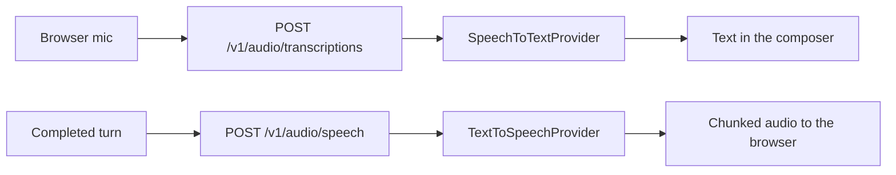

# Speech

## 1. Purpose

Speech is how an operator talks to primer and hears it answer. Two provider families sit behind it: speech-to-text turns a recorded segment into a draft message, and text-to-speech reads a completed reply aloud. Both are edge transforms. Agents stay text-in and text-out, nothing about the runtime changes when speech is configured, and an install with no speech providers is a normal steady state rather than a broken one.

## 2. Conceptual model

A `SpeechToTextProvider` and a `TextToSpeechProvider` each describe one OpenAI-audio-shaped endpoint: a base URL, an optional API key, the default model, and for TTS the default voice. Every self-hosted ASR or TTS server worth targeting imitates that shape, so one adapter serves them all and anything outside it (ElevenLabs, Deepgram, Azure) would need its own adapter rather than another enum member.

There are no speech profile rows. `ModelProfile` is LLM-only by design, so `default_model`, and `default_voice` for TTS, live inline on the provider row the way `EmbeddingProvider` carries its model list.

`ActiveSpeechConfig` is the install-wide answer to "which providers are the defaults", a singleton row with every field optional.

## 3. Architecture patterns implemented

Errors as values: adapters never raise on provider failure. `ASR.transcribe` returns a `SpeechError` and `TTS.stream` yields one as its terminal item, so a caller can always complete the call cleanly. A retriable flag separates "still loading its model" from "this failed".

Yield-through streaming: `TTS.stream` is an async generator and the proxy pumps chunks straight to the browser. Collecting chunks and returning the join is the mistake the interface exists to prevent, because it reintroduces the whole synthesis wait while still looking like streaming.

Server-side credentials: the browser never sees a provider URL or key. It posts to the proxy and the server holds the configuration.

Enumeration over hardcoding: model and voice lists come off the configured endpoint. Voice names are not portable between providers, so a shipped table would be wrong for everyone but its author.

## 4. Code layout

| Path | Responsibility |
| --- | --- |
| `primer/model/providers/speech.py` | The two provider rows and their config classes. |
| `primer/model/speech.py` | `ActiveSpeechConfig`, `Transcription`, `SpeechError`. |
| `primer/int/asr.py`, `primer/int/tts.py` | The provider-agnostic interfaces. |
| `primer/speech/openai_asr.py` | Transcription adapter. |
| `primer/speech/openai_tts.py` | Streaming synthesis adapter with connect-only retry. |
| `primer/speech/discovery.py` | Live model and voice enumeration. |
| `primer/speech/resolution.py` | Which voice a synthesis call should use. |
| `primer/api/registries/speech_registry.py` | Per-row adapter caches. |
| `primer/api/routers/speech.py` | Provider CRUD, `_test` / `_types`, active config. |
| `primer/api/routers/audio.py` | The browser-facing proxy and enumeration passthroughs. |

## 5. Data model

`SpeechToTextProvider`: `id`, `provider`, `default_model`, `config` (url plus optional api key), `limits`.

`TextToSpeechProvider`: the same plus `default_voice`.

`ActiveSpeechConfig`: `stt_provider_id`, `tts_provider_id`, `tts_voice`, all optional.

`Agent.tts_voice` overrides the install default for one agent.

## 6. Lifecycle

An adapter is built lazily per provider row and cached in its registry. Editing a row invalidates just that row's adapter; shutdown closes every live client.

A transcription is one request: audio in, text out, or a `SpeechError`. A synthesis is a stream: the adapter opens the response and yields chunks as they arrive. A failed connect is retried within the row's limits; a stream that has already emitted audio is never retried, because replaying it would concatenate two partial syntheses into one incoherent clip.

## 7. Persistence

Provider rows and the active-config singleton go through the normal `Storage` interface. Audio is ephemeral: recordings and synthesised output are never written to storage or to a session transcript. Text is the record.

## 8. Public surfaces

| Surface | Purpose |
| --- | --- |
| `/v1/stt_providers`, `/v1/tts_providers` | Provider CRUD, plus `_test` and `_types`. |
| `/v1/speech_active_config` | Read and replace the install-wide defaults. |
| `POST /v1/audio/transcriptions` | Browser-facing transcription proxy. |
| `POST /v1/audio/speech` | Browser-facing streaming synthesis proxy. |
| `GET /v1/audio/models`, `GET /v1/audio/voices` | Live enumeration for the pickers. |
| `GET /v1/capabilities` | `speech.stt_configured` / `speech.tts_configured`. |

Provider CRUD is admin; the audio proxy is a feature surface any signed-in operator may use.

## 9. Internal contracts

The transcription file part is a `(filename, fileobj, mimetype)` triple. A bare handle sends no filename and servers then reject it or guess the container wrong.

Timeouts are a connect/read pair, never a scalar: a scalar kills a slow transcription that is still making progress.

Voice resolution is agent, then install default, then the provider row's own default.

`speech.stt_configured` and `speech.tts_configured` come from provider storage, not from importability: speech needs no optional extra.

## 10. Testing patterns

Adapter tests stub the SDK client and assert the wire shape, because the file-part triple and the timeout pair are the details that break against real servers.

The streaming cadence test drives the pump generator directly rather than through httpx: `ASGITransport` accumulates the whole body before building a response, so an in-process HTTP client can never observe chunk timing.

## 11. Historical decisions

Only the OpenAI audio shape is modelled. Every self-hosted server imitates it, and a second shape means a second adapter rather than another enum member.

Speech has no profile rows, because the profiles router hardcodes an LLM provider check and generalising it would change a surface this work does not own.

MMR-style client buffering was rejected for playback: the browser consumes the response incrementally through `MediaSource`, since awaiting a blob would discard the server's chunk-by-chunk pump.
