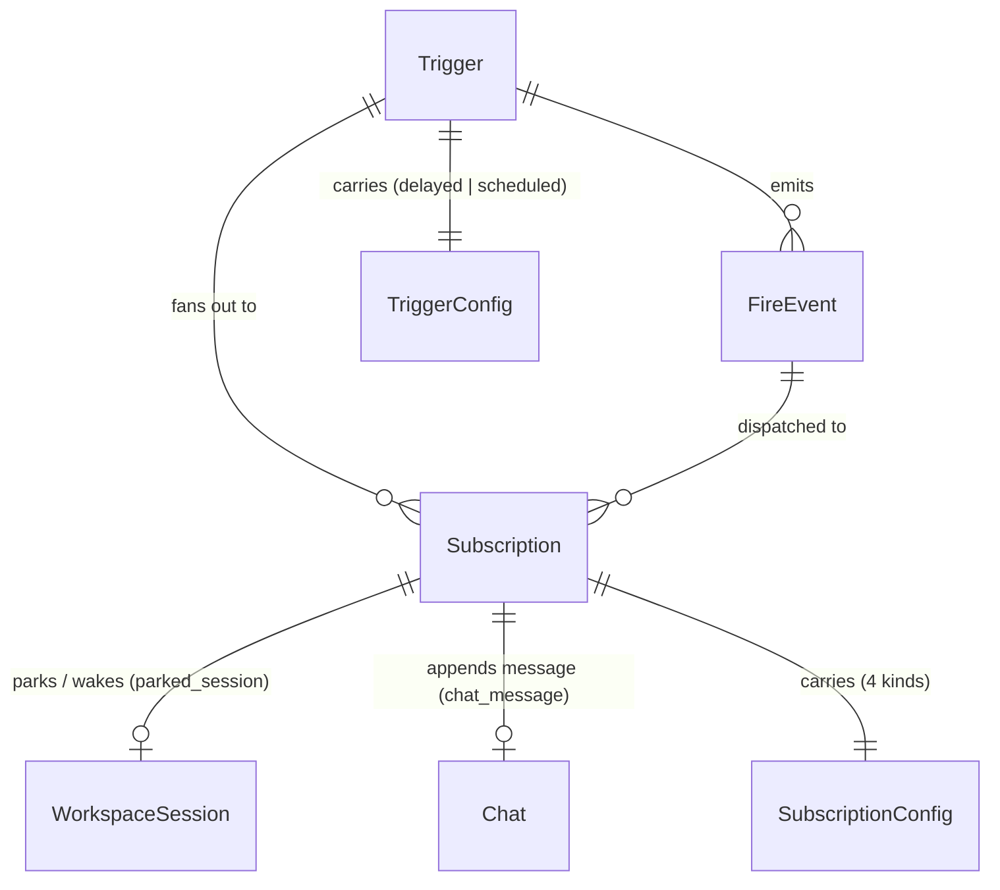
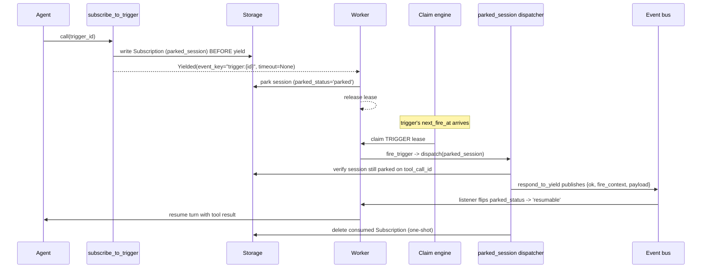

# Triggers

## 1. Purpose

The triggers subsystem turns "do something later, on a schedule, or on an inbound HTTP event" into a first-class persisted primitive. A `Trigger` is a fire source (a one-off `delayed` instant, a recurring `scheduled` cron expression, or an inbound `webhook` POST); a `Subscription` is a delivery rule bound to a trigger that says where a fire should land (append a message to a chat, spin up a fresh agent or graph session, or wake a session that is parked on the `subscribe_to_trigger` yielding tool). When a trigger fires, the orchestrator fans every enabled subscription out to its kind-specific dispatcher.

Time-based triggers (`delayed` and `scheduled`) ride the existing claim engine: a `Trigger` row with `enabled=true` and a non-null `next_fire_at` becomes an eligible `ClaimKind.TRIGGER` lease, a worker claims it when its moment arrives, fires it, and the claim adapter's `on_release` hook recomputes `next_fire_at`. `webhook` triggers are event-driven: they fire when an authenticated HTTP POST arrives at `POST /v1/webhooks/{token}` and are never picked up by the claim engine (`eligible_for_claim=False`, `next_fire_at` is always null).

The `subscribe_to_trigger` yielding tool is the bridge into the park/resume machinery: an agent yields against a trigger, the worker parks the turn on the event bus, and the trigger fire reaches back through `respond_to_yield` to wake it.

The Trigger and Subscription models live in `primer/model/trigger.py`. All mutation flows through one service module, `primer/trigger/service.py`, shared by the REST router (`primer/api/routers/triggers.py`) and the internal toolset (`primer/toolset/trigger.py`) so behaviour stays in lockstep across surfaces. The park/resume mechanics themselves are owned by the yielding-tools flow and documented in the worker-system and sessions docs; this document covers the trigger model, the fire path, and the trigger-to-park integration.

## 2. Conceptual model

A `Trigger` carries fire-time context only (timestamps, slug, kind). A `Subscription` carries the delivery rule and the payload template. Payload lives on the subscription, never on the trigger, so one trigger can fan out to many destinations with different rendered payloads.

`Trigger.config` is a discriminated union over `kind`: `DelayedTriggerConfig` (`{kind: 'delayed', fire_at}`), `ScheduledTriggerConfig` (`{kind: 'scheduled', cron, timezone, catchup}`), and `WebhookTriggerConfig` (`{kind: 'webhook', token, hmac_secret?}`). `Subscription.config` is a discriminated union over four kinds: `ChatMessageSubConfig`, `AgentFreshSubConfig`, `GraphFreshSubConfig`, and `ParkedSessionSubConfig`. The `parked_session` config is special: it is the one the `subscribe_to_trigger` yielding tool writes, and it points back at the parked session by `(session_id, tool_call_id, parked_at)`.

When a trigger fires, the source builds a `fire_context` dict (`trigger_id`, `trigger_slug`, `kind`, `fired_at`, `scheduled_for`, and an injected `fire_id`). Each subscription renders its `payload_template` against that context and the dispatcher delivers the result.

A `FireEvent` here is the logical fire identified by the deterministic `fire_id` (`fire-{trigger_id}-{ms}`); it is not a persisted row. It is the correlation token threaded through every dispatch so downstream artefacts (chat messages, fresh-session metadata) can be attributed back to a single fire.

## 3. Architecture patterns implemented

- **Time-based firing rides the claim machine.** A trigger is a claim kind, not a bespoke scheduler. See [claim-machine.md](../architecture/claim-machine.md). `ClaimKind.TRIGGER` is registered in `primer/int/claim.py` and `primer/claim/factory.py` wires `TriggerClaimAdapter` (`primer/claim/adapters/triggers.py`). The adapter's `eligibility_sql` filters `enabled=true AND next_fire_at IS NOT NULL AND kind IN ('delayed','scheduled') AND next_fire_at <= now()`; `on_release` advances or disables the row. Webhook triggers set `eligible_for_claim=False` and always have `next_fire_at=null`; they are never picked up by this path.
- **Workers fire leases, not a timer.** The fire path runs inside the worker pool's claim loop via `WorkerPool._run_engine_trigger` (`primer/worker/pool.py`). See [worker-system.md](../architecture/worker-system.md). Scheduled catchup replay (`catchup='all'`) is handled there too.
- **Storage-backed Identifiables with discriminated-union configs.** `Trigger` and `Subscription` are Pydantic `Identifiable`s persisted through the storage provider. See [storage.md](../architecture/storage.md). Polymorphic kinds plug new fire sources and delivery rules into the same dispatch core.
- **One service layer behind two REST/tool surfaces.** Every mutation flows through `primer/trigger/service.py`; the REST router and toolset are thin adapters over it. See [rest-api.md](../architecture/rest-api.md).
- **Yielding-tool park integration.** `subscribe_to_trigger` parks the calling session on a `trigger:{trigger_id}` event-bus key; the `parked_session` dispatcher republishes the fire onto that key through `respond_to_yield`. Adjacent subsystems: yielding tools park sessions documented under [sessions.md](sessions.md), and trigger fires that target chats or fan out alongside channel-mediated prompts relate to [channels.md](channels.md).
- **Self-registering dispatcher registry.** Each subscriber module calls `register(kind, instance)` at import; `primer/trigger/dispatch.py` force-imports all four siblings so `get_dispatcher` resolves every kind.

## 4. Code layout

| Path | Responsibility |
| --- | --- |
| `primer/model/trigger.py` | `Trigger`, `Subscription`, the three `TriggerConfig` and four `SubscriptionConfig` variants, slug validation. |
| `primer/trigger/service.py` | The single mutation path: trigger/subscription CRUD, `fire_now`, typed exceptions, claim-lease upsert. |
| `primer/trigger/dispatch.py` | `fire_trigger` orchestrator + `FireResult`; force-imports the four dispatchers. |
| `primer/trigger/cron.py` | `validate_cron`, `validate_timezone`, `next_fire_at`, `iter_missed_fires` (timezone-aware croniter wrapper). |
| `primer/trigger/payload.py` | `render_payload` (Jinja2 `SandboxedEnvironment`, `StrictUndefined`, `tojson`); `PayloadTemplateError`. |
| `primer/trigger/fire_id.py` | `make_fire_id` (deterministic `fire-{trigger_id}-{ms}`). |
| `primer/trigger/sources/` | `DelayedSource`, `ScheduledSource`, `WebhookSource`, the `SOURCES` registry and `get_source`. Sources compute `next_fire_at` and build the `fire_context`. |
| `primer/api/routers/webhooks.py` | Public `POST /v1/webhooks/{token}` endpoint (no auth dep); HMAC verification; per-token rate limit; body cap; fire-and-forget dispatch. |
| `primer/trigger/subscribers/__init__.py` | `Dispatcher` protocol, `SubscriptionDispatchResult`, `DispatchDeps`, `register` / `get_dispatcher`. |
| `primer/trigger/subscribers/chat_message.py` | Appends a user message to a `Chat` and pulses `ClaimKind.CHAT`. |
| `primer/trigger/subscribers/agent_fresh_session.py` | Creates a fresh agent-bound `WorkspaceSession` via the session factory. |
| `primer/trigger/subscribers/graph_fresh_session.py` | Parses the payload as a JSON object and creates a fresh graph-bound session. |
| `primer/trigger/subscribers/parked_session.py` | Wakes a parked session through `respond_to_yield`; one-shot delete. |
| `primer/claim/adapters/triggers.py` | `TriggerClaimAdapter`: eligibility SQL + `on_release` next-fire recompute. |
| `primer/worker/pool.py` | `_run_engine_trigger`: routes a `TRIGGER` lease to `fire_trigger`, handles catchup replay. |
| `primer/api/routers/triggers.py` | REST router under `/v1/triggers`. |
| `primer/toolset/trigger.py` | The `trigger` internal toolset: 11 management tools + `subscribe_to_trigger`. |
| `primer/session/yields.py` | `respond_to_yield`: the shared wake path the `parked_session` dispatcher reuses. |
| `ui/components/triggers.jsx` | Operator UI (list grid, create wizard, detail page, subscription dialog). |

## 5. Data model

`Trigger` (an `Identifiable`) fields: `slug` (unique, validated against `^[a-z][a-z0-9-]{1,63}$` and may not contain `__`), `name`, `description`, `config` (the discriminated `TriggerConfig`), `enabled`, `next_fire_at` (null when disabled, a terminal one-off, or a webhook trigger), `last_fired_at`, `last_fire_error` (JSON-encoded `{code, message}`), `created_at`.

`TriggerConfig` variants:

- `DelayedTriggerConfig`: `fire_at` (a UTC `datetime`). Fires once.
- `ScheduledTriggerConfig`: `cron` (validated by croniter), `timezone` (IANA name, default `UTC`), `catchup` (`one` | `all` | `none`, default `one`).
- `WebhookTriggerConfig`: `token` (server-minted 32-hex-char capability URL token; never returned after initial creation response), `hmac_secret` (`SecretStr | None`; when set, callers must include `X-Primer-Signature: sha256=<hex>` over the raw body). Webhook triggers always have `next_fire_at=null` and `eligible_for_claim=False`.

`Subscription` (an `Identifiable`) fields: `trigger_id`, `config` (the discriminated `SubscriptionConfig`), `payload_template` (Jinja2, nullable), `parallelism` (`skip` | `queue`, default `skip`), `enabled`, `description`, `last_fired_at`, `last_fire_error`, `created_at`.

`SubscriptionConfig` variants:

- `ChatMessageSubConfig`: `chat_id`.
- `AgentFreshSubConfig`: `workspace_id`, `agent_id`.
- `GraphFreshSubConfig`: `workspace_id`, `graph_id`.
- `ParkedSessionSubConfig`: `session_id`, `tool_call_id`, `parked_at`. Only written by `subscribe_to_trigger`.

The `fire_context` dict produced by each source carries `trigger_id`, `trigger_slug`, `kind`, `fired_at` (ISO), `scheduled_for` (ISO or null), plus the `fire_id` injected by the orchestrator. `parallelism` is unused for `parked_session` subscriptions.

## 6. Lifecycle

A trigger's time-based lifecycle: `create_trigger` computes the initial `next_fire_at` from the source and best-effort upserts a `ClaimKind.TRIGGER` lease (no-op when no claim engine is wired or the source is not `eligible_for_claim`). The engine claims the lease once `next_fire_at <= now()`; the worker fires it; `TriggerClaimAdapter.on_release` recomputes `next_fire_at` (cron advance for `scheduled`, disable + null for `delayed`, defensive null for unknown kinds). `fire_trigger` loads enabled subscriptions (paged in batches of 200, capped at 10k), renders each payload, dispatches per kind with per-subscription failure isolation, and updates `last_fired_at` / `last_fire_error`.

The `subscribe_to_trigger` park/resume flow:

The subscription row is written before the `Yielded` sentinel is returned so a fire racing the park still finds the row; the dispatcher's park-state check (session exists, not ENDED, `parked_status == 'parked'`, matching `tool_call_id`) guards against a stale fire and skips with `skipped_session_unparked` if any check fails.

## 7. Persistence

`Trigger` and `Subscription` are persisted as JSONB-backed `Identifiable` rows through the storage provider's `get_storage(Trigger)` / `get_storage(Subscription)` handles; there is no bespoke trigger table schema beyond what the storage layer provides. Slug uniqueness is enforced by a pre-write `find` in `create_trigger` (the storage `create` only protects the surrogate `id`). Cascade delete is manual: `delete_trigger` pages through and deletes every bound subscription before deleting the trigger. The claim lease lives in the shared leases table managed by the claim engine, keyed by `ClaimKind.TRIGGER` + the trigger id, with `next_attempt_at` set to `next_fire_at`. The `parked_session` dispatcher deletes its subscription row after a successful wake (one-shot); a failed delete is logged, not propagated, since the orphan row fail-skips on its next attempt.

## 8. Public surfaces

REST router `primer/api/routers/triggers.py` under prefix `/v1/triggers`:

- `POST /`, `GET /` (`?kind`, `?enabled`), `GET /{id}`, `PUT /{id}`, `DELETE /{id}`, `POST /{id}/fire_now`, `POST /{id}/rotate_token` (webhook only).
- `POST /{id}/subscriptions`, `GET /{id}/subscriptions`, `GET /{id}/subscriptions/{sid}`, `PUT /{id}/subscriptions/{sid}`, `DELETE /{id}/subscriptions/{sid}`.

Public webhook inbound endpoint `primer/api/routers/webhooks.py` (mounted without auth dep):

- `POST /v1/webhooks/{token}` -- resolves the trigger by its capability token, optionally verifies `X-Primer-Signature` HMAC-SHA256, then dispatches subscriptions fire-and-forget; returns 202 + `{delivery_id, status}`. Guardrails: 1 MB body cap, 60 req/min per-token rate limit (in-process sliding window), no internal error leakage.

Error envelope is `HTTPException(detail={code, message})` with codes `trigger_slug_conflict` (409), `trigger_kind_immutable` (409), `trigger_not_found` / `subscription_not_found` (404), `parked_session_only_from_yield` (422), `cron_invalid` (422), `timezone_invalid` (422), `not_a_webhook_trigger` (422). Webhook inbound codes: `webhook_not_found` (404), `webhook_disabled` (403), `hmac_mismatch` (401), `payload_too_large` (413), `rate_limited` (429).

Internal toolset `primer/toolset/trigger.py`, toolset id `trigger`, built by `build_trigger_toolset_provider` (wired in `primer/api/app.py` lifespan): `trigger__list`, `trigger__get`, `trigger__create`, `trigger__update`, `trigger__delete`, `trigger__fire_now`, `trigger__list_subscriptions`, `trigger__get_subscription`, `trigger__create_subscription`, `trigger__update_subscription`, `trigger__delete_subscription`, and the yielding tool `subscribe_to_trigger`. Management tools share `service.py` with the router so error codes map one to one. `subscribe_to_trigger` validates the trigger exists and is enabled, refuses chat-only (sessionless) callers with `trigger_not_found_or_disabled`, persists a `parked_session` Subscription, and returns `Yielded(tool_name='subscribe_to_trigger', event_key='trigger:{id}', timeout=None, resume_metadata={subscription_id, trigger_id})`.

The operator UI is `ui/components/triggers.jsx` (TR_-prefixed components) with a `triggers` nav entry registered in `ui/components/chrome.jsx`: list grid, three-step create wizard (now includes webhook kind), detail page with a Fire now button and -- for webhook triggers -- a copyable URL, HMAC secret set/clear dialog (`TR_HmacSecretDialog`), and a rotate token action. The cron preview is computed client-side.

## 9. Internal contracts

`Source` (in `primer/trigger/sources/`) exposes `kind`, `eligible_for_claim`, `compute_next_fire_at(trigger, now)`, and `build_fire_context(trigger, fired_at, scheduled_for)`; looked up via `get_source(kind)`. Both shipped sources set `eligible_for_claim = True`.

`Dispatcher` (protocol in `primer/trigger/subscribers/__init__.py`) exposes one async `dispatch(sub, rendered_payload, fire_context, fire_id, deps)` returning a `SubscriptionDispatchResult(ok, skipped, error_code, error_message, artefact_id)`. `ok=True` covers both delivery and deliberate skips; `skipped` distinguishes them. Dispatchers self-register via `register(kind, instance)`. Per-kind error codes include `chat_not_found` / `chat_ended` / `skipped_chat_busy` (chat_message), `skipped_subscription_busy` / `dispatch_failed` (fresh-session), `graph_input_invalid` (graph_fresh), and `skipped_session_unparked` (parked_session).

`fire_trigger` returns `FireResult(skipped, fire_id, results)`; `skipped=True` when the trigger is missing or disabled. `ServiceDeps` (storage_provider, claim_engine, event_bus) and `DispatchDeps` (storage_provider, claim_engine, scheduler, workspace_registry, event_bus) bundle collaborators; both tolerate `None` claim_engine / event_bus by treating lease upserts and bus pulses as no-ops. `respond_to_yield` (`primer/session/yields.py`) is the contract the `parked_session` dispatcher reuses to wake a park: it looks up the session, validates parked status and matching `tool_call_id`, pulls `event_key` from `parked_state['yielded']`, and publishes the result; the worker pool's bus listener owns the atomic `mark_resumable` flip.

Update guards: `update_trigger` rejects a change to `config.kind` with `TriggerKindImmutable` (delete + recreate is the operator path); partial subscription updates distinguish an omitted key from an explicit null via `model_fields_set` (router) and an `_UNSET` sentinel (service).

## 10. Testing patterns

Unit and integration tests live under `tests/trigger/`: cron helpers (`test_cron.py`), the three sources and the source registry (`test_sources_delayed.py`, `test_sources_scheduled.py`, `test_sources_registry.py`, `test_webhook_trigger.py`), payload rendering (`test_payload.py`), the claim adapter (`test_claim_adapter.py`), the fire orchestrator (`test_dispatch.py`), each dispatcher (`test_subscribers_chat_message.py`, `test_subscribers_fresh_session.py`, `test_subscribers_parked_session.py`), the model (`test_model.py`), and the end-to-end park-fire-resume path (`test_parked_session_e2e.py`). The REST surface is covered by `tests/api/test_triggers_router.py`; the webhook endpoint by `tests/api/test_webhook_endpoint.py`; the `subscribe_to_trigger` yielding tool by `tests/toolset/test_subscribe_to_trigger.py`. E2E coverage lives in `tests/e2e/test_webhook_trigger_e2e.py`. UI static tests live at `tests/ui/test_triggers_list_page.py`, `test_triggers_create_dialog.py`, `test_triggers_detail_page.py`, and `test_triggers_sub_dialog.py`. The common pattern is to drive the service or dispatcher directly with a `ServiceDeps` / `DispatchDeps` built over in-memory storage and an in-memory event bus, asserting on the structured `SubscriptionDispatchResult` / `FireResult` envelopes rather than on side-effect logs.

## 11. Historical decisions

- **One Trigger primitive instead of a separate Schedule resource.** Why: a schedule is exposed as a UI flow that creates one Trigger plus one static Subscription, so a second resource would duplicate the model. Spec: docs/superpowers/specs/2026-06-01-triggers-and-subscriptions-design.md.
- **Payload lives on Subscription, not on Trigger.** Why: the trigger only carries fire-time context, so one trigger can fan out to many destinations with different rendered payloads. Spec: docs/superpowers/specs/2026-06-01-triggers-and-subscriptions-design.md.
- **Trigger and subscription kinds are polymorphic discriminated unions.** Why: future event sources (channel, webhook, file watcher, MCP events) plug into the same dispatch core without a schema change. Spec: docs/superpowers/specs/2026-06-01-triggers-and-subscriptions-design.md.
- **Time-based triggers ride the existing ClaimEngine with next_attempt_at = next_fire_at instead of a LeaderElector.** Why: FOR UPDATE SKIP LOCKED on Postgres gave at-most-once claim without a new coordination primitive. Spec: docs/superpowers/specs/2026-06-01-triggers-and-subscriptions-design.md.
- **Fresh-session subscriptions use live snapshots, reading the agent or graph from storage at fire time.** Why: operators hot-fixing an agent or graph see the edit take effect on the next fire rather than being pinned at create time. Spec: docs/superpowers/specs/2026-06-01-triggers-and-subscriptions-design.md.
- **Parallelism is a two-valued knob (skip | queue) with per-kind detection.** Why: richer queueing primitives were deferred until observed traffic justified them; parked_session subs ignore the field. Spec: docs/superpowers/specs/2026-06-01-triggers-and-subscriptions-design.md.
- **The module path is primer/trigger/, not primer/scheduler/.** Why: the scheduler name was reserved for the session claim scheduler. Spec: docs/superpowers/specs/2026-06-01-triggers-and-subscriptions-design.md.
- **A single service layer is the only place trigger and subscription mutations happen.** Why: the REST router and the internal toolset stay in lockstep on validation and error codes. Spec: docs/superpowers/specs/2026-06-01-triggers-and-subscriptions-design.md.
- **parked_session subscriptions can only be created through the subscribe_to_trigger yielding tool.** Why: operator-create paths have no parked session to point at, so they reject the kind with parked_session_only_from_yield. Spec: docs/superpowers/specs/2026-06-01-triggers-and-subscriptions-design.md.
- **The subscription row is written before the Yielded sentinel returns.** Why: a fire racing the park still finds the row, and the dispatcher's park-state check guards staleness. Spec: docs/superpowers/specs/2026-06-01-triggers-and-subscriptions-design.md.
- **subscribe_to_trigger shipped as a yielding tool not in the original milestone list.** Why: it demonstrated a fourth event-key family on the park/resume protocol beyond the spec's enumerated tools. Spec: docs/superpowers/specs/2026-05-22-yielding-tools-design.md.
- **fire_id idempotency is documented but best-effort in v1.** Why: the deterministic fire-{trigger_id}-{ms} token threads through every dispatch, but sub-dispatchers do not yet query for an existing artefact by fire_id before writing one; full idempotency tokens are deferred. Spec: docs/superpowers/specs/2026-06-01-triggers-and-subscriptions-design.md.
- **The 64-fire catchup cap is a hard-coded constant rather than a per-trigger field.** Why: the spec called for a configurable catchup_limit, but the cap currently lives as the iter_missed_fires default and in WorkerPool._run_engine_trigger. Spec: docs/superpowers/specs/2026-06-01-triggers-and-subscriptions-design.md.
- **Webhook triggers use the same TriggerConfig discriminated union, not a separate resource.** Why: the subscription and dispatch machinery are identical -- only the fire source differs. Adding a third TriggerConfig variant with `eligible_for_claim=False` plugs into the existing source registry with zero changes to subscribers, fire_trigger, or the claim adapter. Added: user-4 (2026-06-14).
- **The webhook token is always server-minted; callers cannot choose it.** Why: callers may choose weak or predictable tokens. The service replaces any caller-supplied token at create time. Rotation via `POST /{id}/rotate_token` gives operators explicit control. Added: user-4.
- **Dispatch is fire-and-forget via BackgroundTasks; the 202 is returned before subscriptions run.** Why: subscription dispatch (especially fresh-session creation) can take hundreds of milliseconds. The caller's timeout budget should not constrain this; a delivery_id lets operators correlate the fire to later events. Added: user-4.
- **Rate limiting is in-process (sliding window per token).** Why: a full Redis-backed limit was disproportionate for v1; multi-worker deployments accept approximate counting (each process maintains its own window). The token itself is already the primary authentication layer. Added: user-4.
- **HMAC uses SHA-256 over the raw body (not JSON-normalised).** Why: normalising JSON before signing is implementation-dependent and adds parser-differential risk. Raw-body HMAC is the industry-standard pattern (GitHub, Stripe, Twilio). Added: user-4.
