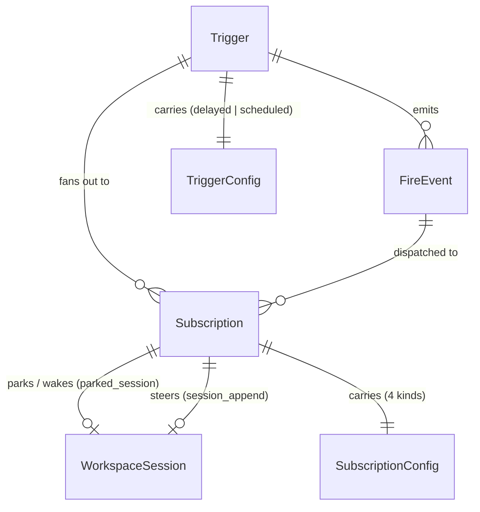
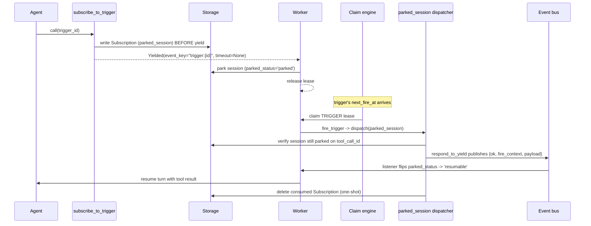

# Triggers

## 1. Purpose

The triggers subsystem turns "do something later, on a schedule, or on an inbound HTTP event" into a first-class persisted primitive. A `Trigger` is a fire source (a one-off `delayed` instant, a recurring `scheduled` cron expression, or an inbound `webhook` POST); a `Subscription` is a delivery rule bound to a trigger that says where a fire should land (append a message to an existing session, spin up a fresh agent or graph session, or wake a session that is parked on the `subscribe_to_trigger` yielding tool). When a trigger fires, the orchestrator fans every enabled subscription out to its kind-specific dispatcher.

Time-based triggers (`delayed` and `scheduled`) ride the existing claim engine: a `Trigger` row with `enabled=true` and a non-null `next_fire_at` becomes an eligible `ClaimKind.TRIGGER` lease, a worker claims it when its moment arrives, fires it, and the claim adapter's `on_release` hook recomputes `next_fire_at`. `webhook` triggers are event-driven: they fire when an authenticated HTTP POST arrives at `POST /v1/webhooks/{token}` and are never picked up by the claim engine (`eligible_for_claim=False`, `next_fire_at` is always null).

The `subscribe_to_trigger` yielding tool is the bridge into the park/resume machinery: an agent yields against a trigger, the worker parks the turn on the event bus, and the trigger fire reaches back through `respond_to_yield` to wake it.

The Trigger and Subscription models live in `primer/model/trigger.py`. All mutation flows through one service module, `primer/trigger/service.py`, shared by the REST router (`primer/api/routers/triggers.py`) and the internal toolset (`primer/toolset/trigger.py`) so behaviour stays in lockstep across surfaces. The park/resume mechanics themselves are owned by the yielding-tools flow and documented in the worker-system and sessions docs; this document covers the trigger model, the fire path, and the trigger-to-park integration.

## 2. Conceptual model

A `Trigger` carries fire-time context only (timestamps, slug, kind). A `Subscription` carries the delivery rule and the payload template. Payload lives on the subscription, never on the trigger, so one trigger can fan out to many destinations with different rendered payloads.

`Trigger.config` is a discriminated union over `kind`: `DelayedTriggerConfig` (`{kind: 'delayed', fire_at}`), `ScheduledTriggerConfig` (`{kind: 'scheduled', cron, timezone, catchup}`), `WebhookTriggerConfig` (`{kind: 'webhook', token, hmac_secret?, interactive, wait_timeout_seconds}`), and `ChannelTriggerConfig` (`{kind: 'channel', provider_id, channel_id?, interactive}`). `Subscription.config` is a discriminated union over four kinds: `AgentFreshSubConfig`, `GraphFreshSubConfig`, `ParkedSessionSubConfig`, and `SessionAppendSubConfig`. The `parked_session` config is special: it is the one the `subscribe_to_trigger` yielding tool writes, and it points back at the parked session by `(session_id, tool_call_id, parked_at)`.

A fire is either interactive or not, and only two kinds get to choose. A webhook or a channel trigger carries an `interactive` flag; delayed and scheduled triggers are intrinsically non-interactive (nobody is waiting on the other end of a cron tick), so their configs set `extra="forbid"` and the API rejects the field with a 422 rather than accepting and ignoring it. `interactive` defaults to `False` on webhooks (today's 202-immediately behaviour is unchanged) and `True` on channels (a channel conversation that never answers is not a conversation).

When a trigger fires, the source builds a `fire_context` dict (`trigger_id`, `trigger_slug`, `kind`, `fired_at`, `scheduled_for`, and an injected `fire_id`). Each subscription renders its `payload_template` against that context and the dispatcher delivers the result.

```mermaid
erDiagram
    Trigger ||--o{ Subscription : "fans out to"
    Subscription ||--o| WorkspaceSession : "parks / wakes (parked_session)"
    Subscription ||--o| WorkspaceSession : "steers (session_append)"
    Trigger ||--o{ FireEvent : "emits"
    FireEvent ||--o{ Subscription : "dispatched to"
    Trigger ||--|| TriggerConfig : "carries (delayed | scheduled)"
    Subscription ||--|| SubscriptionConfig : "carries (4 kinds)"
```

A `FireEvent` here is the logical fire identified by the deterministic `fire_id` (`fire-{trigger_id}-{ms}`); it is not a persisted row. It is the correlation token threaded through every dispatch so downstream artefacts (fresh-session metadata, queued steers) can be attributed back to a single fire.

## 3. Architecture patterns implemented

- **Time-based firing rides the claim machine.** A trigger is a claim kind, not a bespoke scheduler. See [claim-machine.md](../architecture/claim-machine.md). `ClaimKind.TRIGGER` is registered in `primer/int/claim.py` and `primer/claim/factory.py` wires `TriggerClaimAdapter` (`primer/claim/adapters/triggers.py`). The adapter's `eligibility_sql` filters `enabled=true AND next_fire_at IS NOT NULL AND kind IN ('delayed','scheduled') AND next_fire_at <= now()`; `on_release` advances or disables the row. Webhook triggers set `eligible_for_claim=False` and always have `next_fire_at=null`; they are never picked up by this path.
- **Workers fire leases, not a timer.** The fire path runs inside the worker pool's claim loop via `WorkerPool._run_engine_trigger` (`primer/worker/pool.py`). See [worker-system.md](../architecture/worker-system.md). Scheduled catchup replay (`catchup='all'`) is handled there too.
- **Storage-backed Identifiables with discriminated-union configs.** `Trigger` and `Subscription` are Pydantic `Identifiable`s persisted through the storage provider. See [storage.md](../architecture/storage.md). Polymorphic kinds plug new fire sources and delivery rules into the same dispatch core.
- **One service layer behind two REST/tool surfaces.** Every mutation flows through `primer/trigger/service.py`; the REST router and toolset are thin adapters over it. See [rest-api.md](../architecture/rest-api.md).
- **Yielding-tool park integration.** `subscribe_to_trigger` parks the calling session on a `trigger:{trigger_id}` event-bus key; the `parked_session` dispatcher republishes the fire onto that key through `respond_to_yield`. Adjacent subsystems: yielding tools park sessions documented under [sessions.md](sessions.md), and trigger fires that fan out alongside channel-mediated prompts relate to [channels.md](channels.md).
- **Self-registering dispatcher registry.** Each subscriber module calls `register(kind, instance)` at import; `primer/trigger/dispatch.py` force-imports all four siblings so `get_dispatcher` resolves every kind.

## 4. Code layout

| Path | Responsibility |
| --- | --- |
| `primer/model/trigger.py` | `Trigger`, `Subscription`, the three `TriggerConfig` and four `SubscriptionConfig` variants, slug validation. |
| `primer/trigger/service.py` | The single mutation path: trigger/subscription CRUD, `fire_now`, typed exceptions, claim-lease upsert. |
| `primer/trigger/dispatch.py` | `fire_trigger` orchestrator + `FireResult`; force-imports the four dispatchers. |
| `primer/trigger/cron.py` | `validate_cron`, `validate_timezone`, `next_fire_at`, `iter_missed_fires` (timezone-aware croniter wrapper). |
| `primer/trigger/payload.py` | `render_payload` (Jinja2 `SandboxedEnvironment`, `StrictUndefined`, `tojson`); `PayloadTemplateError`. |
| `primer/trigger/owner.py` | `principal_for_fire`: who a fresh-session run runs as (its owners, ranked by their current roles; see section 9). |
| `primer/trigger/fire_id.py` | `make_fire_id` (deterministic `fire-{trigger_id}-{ms}`). |
| `primer/trigger/sources/` | `DelayedSource`, `ScheduledSource`, `WebhookSource`, `ChannelSource`, the `SOURCES` registry and `get_source`. Sources compute `next_fire_at` and build the `fire_context`. |
| `primer/channel/event_dispatch.py` | `ChannelEventRouter`: correlation-first inbound precedence then fires matching `channel` triggers via `fire_trigger`. |
| `primer/api/routers/webhooks.py` | Public `POST /v1/webhooks/{token}` endpoint (no auth dep); HMAC verification; per-token rate limit; body cap; fire-and-forget dispatch. |
| `primer/trigger/subscribers/__init__.py` | `Dispatcher` protocol, `SubscriptionDispatchResult`, `DispatchDeps`, `register` / `get_dispatcher`. |
| `primer/trigger/subscribers/chat_message.py` | Appends a user message to a `Chat` and pulses `ClaimKind.CHAT`. |
| `primer/trigger/subscribers/agent_fresh_session.py` | Creates a fresh agent-bound `WorkspaceSession` via the session factory. |
| `primer/trigger/subscribers/graph_fresh_session.py` | Parses the payload as a JSON object and creates a fresh graph-bound session. |
| `primer/trigger/subscribers/parked_session.py` | Wakes a parked session through `respond_to_yield`; one-shot delete. |
| `primer/claim/adapters/triggers.py` | `TriggerClaimAdapter`: eligibility SQL + `on_release` next-fire recompute. |
| `primer/worker/pool.py` | `_run_engine_trigger`: routes a `TRIGGER` lease to `fire_trigger`, handles catchup replay. |
| `primer/api/routers/triggers.py` | REST router under `/v1/triggers`. |
| `primer/toolset/trigger.py` | The `trigger` internal toolset: 11 management tools + `subscribe_to_trigger`. |
| `primer/session/yields.py` | `respond_to_yield`: the shared wake path the `parked_session` dispatcher reuses. |
| `ui/components/triggers.jsx` | Operator UI (list grid, create wizard, detail page, subscription dialog). |

## 5. Data model

`Trigger` (an `Identifiable`) fields: `slug` (unique, validated against `^[a-z][a-z0-9-]{1,63}$` and may not contain `__`), `name`, `description`, `config` (the discriminated `TriggerConfig`), `enabled`, `next_fire_at` (null when disabled, a terminal one-off, or a webhook trigger), `last_fired_at`, `last_fire_error` (JSON-encoded `{code, message}`), `created_at`, `owner` (`PrincipalRef | None`: who last saved the trigger; see section 9).

`TriggerConfig` variants:

- `DelayedTriggerConfig`: `fire_at` (a UTC `datetime`). Fires once.
- `ScheduledTriggerConfig`: `cron` (validated by croniter), `timezone` (IANA name, default `UTC`), `catchup` (`one` | `all` | `none`, default `one`).
- `WebhookTriggerConfig`: `token` (server-minted 32-hex-char capability URL token; never returned after initial creation response), `hmac_secret` (`SecretStr | None`; when set, callers must include `X-Primer-Signature: sha256=<hex>` over the raw body), `interactive` (default `False`), `wait_timeout_seconds` (default 60, `ge=1`, `le=600`: how long an interactive POST holds before falling back to 202). Webhook triggers always have `next_fire_at=null` and `eligible_for_claim=False`. The service rebuilds this config with `model_copy(update={"token": ...})` on mint, update and rotate, so every current and future field survives all three.
- `ChannelTriggerConfig`: `kind="channel"`, `provider_id`, `channel_id` (optional; omit for a provider-wide trigger), `interactive` (default `True`; when off the thread ingests silently and the reply binding is stamped `quiet`). The event-source anchor that channel subscriptions attach to. Like webhook, channel triggers always have `next_fire_at=null` and `eligible_for_claim=False`; they fire from the inbound channel router, not the claim engine. `TriggerKind.CHANNEL` is the fourth member of the kind enum.

`Subscription` (an `Identifiable`) fields: `trigger_id`, `config` (the discriminated `SubscriptionConfig`), `event_matcher` (`EventMatcher | None`; channel bindings only, `None` for time/webhook), `reply_target` (a `ReplyTarget`; channel bindings only), `payload_template` (Jinja2, nullable), `parallelism` (`skip` | `queue`, default `skip`), `enabled`, `description`, `last_fired_at`, `last_fire_error`, `created_at`. `last_fired_at` / `last_fire_error` are the subscription's LATEST delivery outcome, written by `fire_trigger` for every attempted delivery (a skipped one was never attempted, so it touches neither): `last_fire_error` is a JSON-encoded `{code, message, fire_id, scheduled_for}` blob on a failed delivery and cleared by the next clean one. They are latest-state, not history; the history is the `trigger.delivery_failed` event below. `EventMatcher` (`primer/model/event_matcher.py`) is an AND-of-present-fields predicate over a normalized `ChannelEvent` (event type, surface, command name, sender roles/ids, text pattern, room); `ReplyTarget` (`primer/channel/reply_binding.py`) is `source_thread` (default) | `source_room` | `dm_sender` | `none` or an explicit `{channel_id, anchor}`. Both are detailed in the channels subsystem doc.

`Subscription` also carries `owner` (`PrincipalRef | None`), with the same meaning as on `Trigger`.

`SubscriptionConfig` variants:

- `AgentFreshSubConfig`: `workspace_id`, `agent_id`.
- `GraphFreshSubConfig`: `workspace_id`, `graph_id`.
- `ParkedSessionSubConfig`: `session_id`, `tool_call_id`, `parked_at`. Written by `subscribe_to_trigger` and `subscribe_to_channel_event`.
- `SessionAppendSubConfig`: `session_id`. Steers an EXISTING session instead of creating one: the rendered payload becomes a user message on it (dispatcher in `primer/trigger/subscribers/session_append.py`).

`WebhookDelivery` gained `fire_id` (the correlation token of the fire this delivery dispatched, `None` while pending) and `results` (per-run `{artefact_id, final_text}` envelopes for an interactive webhook, empty for fire-and-forget). Both are written by `_finalize_delivery`, which the poll endpoint reads.

The `fire_context` dict produced by each source carries `trigger_id`, `trigger_slug`, `kind`, `fired_at` (ISO), `scheduled_for` (ISO or null), plus the `fire_id` injected by the orchestrator. `parallelism` is unused for `parked_session` subscriptions.

## 6. Lifecycle

A trigger's time-based lifecycle: `create_trigger` computes the initial `next_fire_at` from the source and best-effort upserts a `ClaimKind.TRIGGER` lease (no-op when no claim engine is wired or the source is not `eligible_for_claim`). The engine claims the lease once `next_fire_at <= now()`; the worker fires it; `TriggerClaimAdapter.on_release` recomputes `next_fire_at` (cron advance for `scheduled`, disable + null for `delayed`, defensive null for unknown kinds). `fire_trigger` loads enabled subscriptions (paged in batches of 200, capped at 10k), renders each payload, dispatches per kind with per-subscription failure isolation, and updates `last_fired_at` / `last_fire_error`. The read-side `list_triggers` / `list_subscriptions` service helpers (`primer/trigger/service.py`) page through every row (a 200-row window per round-trip, accumulated until exhausted) rather than returning only the first 200 - so a deployment with more than 200 triggers or more than 200 subscriptions on one trigger lists them all. `delete_trigger` takes that full subscription list BEFORE deleting any of them (deleting while paging by offset shifts the remaining rows down, so the old cascade skipped 200 rows after the first page and a trigger with more than 200 subscriptions kept the rest as orphans), and tolerates only `NotFoundError` from a subscription delete (a concurrent delete): any other failure propagates before the trigger row is deleted, so the delete can be retried instead of leaving a silent orphan.

The channel fire path is event-driven, not claim-driven. `ChannelEventRouter` (`primer/channel/event_dispatch.py`) receives a normalized `ChannelEvent`, applies the correlation-first precedence (a reply that continues an existing conversation is handled by the correlation store and never fans out), and for a fresh event fires every matching `channel` trigger through `fire_trigger` with the event under `fire_context["event"]`. `fire_trigger` adds two channel-only steps to its normal dispatch loop: it evaluates each subscription's `event_matcher` against the event and skips non-matches (a no-op when `event_matcher is None`), and it propagates the subscription's `reply_target` so a session action establishes the session-scoped reply binding. The `ChannelSource.build_fire_context` accepts the firing `event` kwarg and serializes it (`model_dump(mode="json")`) into the context; `compute_next_fire_at` always returns `None` (`eligible_for_claim=False`).

The interactive webhook hold (`primer/trigger/hold.py`): an interactive `POST /v1/webhooks/{token}` does not answer 202 immediately. It opens a bus subscription BEFORE firing (so a run that terminates while `fire_trigger` is still returning cannot be missed), fires, then awaits `session:{sid}:terminal` for every artefact the fire actually created. `_publish_terminal` in `primer/session/dispatch.py` publishes that key at all three terminal turn exits, next to the drain checkpoint; the publish is advisory and a failure is logged rather than blocking the lease release, so a lost event degrades to the wait cap. When every target has answered, the hold derives each run's final text exactly as the channel relay does (`read_session_final_text`) and the endpoint returns 200 `{fire_id, results}`. A run whose LATEST turn did not complete has `final_text: null`: the last terminal record in its transcript is a `cancelled`, an `error` or a `done` whose `stop_reason` is `error` (a turn that failed mid-stream can end that way with no `error` record before it; a `max_tokens` done is a truncated answer and is relayed), or when assistant text follows the last terminal record (a turn that streamed output and never ended; a user message after the `done` does not count, and neither does a graph End node's output, below), or, in the hold, when the session row itself says the run did not complete (`ended_reason` `cancelled`, `failed`, `force_deleted` or `workspace_lost`). The row is checked as well as the transcript because the `cancelled` record is best-effort: the cancelled exit skips it when the workspace does not take the write in time, and without it the log reads as a completed turn. Both rules include a Cancel that landed after the model's last event (`tokens, done, cancelled`), whose answer is in the log but must not be handed back as the result of a run the user cancelled. A completed GRAPH run is the exception to "text after the last `done`": its End node writes its own `assistant_token` (with `end_node_id`) from `output_template` AFTER the last node's `done`, and that record is the graph's canonical output, so it is returned as the final text instead of the last node's raw answer (several top-level End outputs are joined with a blank line, in order). A pass-through template writes no such record and the last node's answer is the text. Only TOP-LEVEL End outputs count: a subgraph's End output that its parent forwards is persisted with `payload.nested` set (the transcript keeps it, the final text leaves it out, so a transforming inner End is not joined as "Inner: ...\n\nOuter: ..."); the one exception is a parent End that echoed the subgraph's output, whose record is suppressed as a duplicate of the nested one, so with no top-level End output the last nested one stands in (the last, not the first: with three levels the nearest level's text is the one the outer graph forwarded). The duplicate check does not tell a nested record from a top-level one, so the exception has a known gap: when the graph has SEVERAL top-level Ends and one of them echoes a subgraph's output, that echo is suppressed, a top-level output exists, the nested fallback does not fire, and the echoing End's text is missing from the joined result. Only End outputs written AFTER the last `done` are returned: End nodes reached in different supersteps, where another node's `done` follows an earlier End's record, are not collected. Known race: the hold reads the log after the terminal event and `read_session_final_text` is not anchored on the run's turn, so if a queued steer has already started the NEXT turn by then, the result is that next turn's answer when it has already finished, or null while it is still streaming (the trailing-text rule sees its text), rather than the run that did complete. The fix is anchoring the read on the run's `turn_no`, which the records do not carry today.

The wait cap is the caller-visible bound, not the hold's. The hold runs as its own task; when `wait_timeout_seconds` expires the endpoint answers 202 `{delivery_id, status: "pending"}` and a BackgroundTask keeps awaiting the task and writes its outcome onto the delivery row. The caller finishes the exchange with `GET /v1/webhooks/{token}/deliveries/{id}`, which reads `fire_id` and `results` off that row. `HOLD_MAX_SECONDS` (3600) only stops an orphaned wait living forever.

The `subscribe_to_trigger` park/resume flow:

```mermaid
sequenceDiagram
    participant Agent
    participant Tool as subscribe_to_trigger
    participant Store as Storage
    participant Worker
    participant Engine as Claim engine
    participant Disp as parked_session dispatcher
    participant Bus as Event bus

    Agent->>Tool: call(trigger_id)
    Tool->>Store: write Subscription (parked_session) BEFORE yield
    Tool-->>Worker: Yielded(event_key="trigger:{id}", timeout=None)
    Worker->>Store: park session (parked_status='parked')
    Worker-->>Worker: release lease
    Note over Engine: trigger's next_fire_at arrives
    Engine->>Worker: claim TRIGGER lease
    Worker->>Disp: fire_trigger -> dispatch(parked_session)
    Disp->>Store: verify session still parked on tool_call_id
    Disp->>Bus: respond_to_yield publishes {ok, fire_context, payload}
    Bus->>Worker: listener flips parked_status -> 'resumable'
    Worker->>Agent: resume turn with tool result
    Disp->>Store: delete consumed Subscription (one-shot)
```

The subscription row is written before the `Yielded` sentinel is returned so a fire racing the park still finds the row; the dispatcher's park-state check (session exists, not ENDED, `parked_status == 'parked'`, matching `tool_call_id`) guards against a stale fire and skips with `skipped_session_unparked` if any check fails.

## 7. Persistence

`Trigger` and `Subscription` are persisted as JSONB-backed `Identifiable` rows through the storage provider's `get_storage(Trigger)` / `get_storage(Subscription)` handles; there is no bespoke trigger table schema beyond what the storage layer provides. Slug uniqueness is enforced by a pre-write `find` in `create_trigger` (the storage `create` only protects the surrogate `id`). Cascade delete is manual: `delete_trigger` pages through and deletes every bound subscription before deleting the trigger. The claim lease lives in the shared leases table managed by the claim engine, keyed by `ClaimKind.TRIGGER` + the trigger id, with `next_attempt_at` set to `next_fire_at`. The `parked_session` dispatcher deletes its subscription row after a successful wake (one-shot); a failed delete is logged, not propagated, since the orphan row fail-skips on its next attempt.

## 8. Public surfaces

REST router `primer/api/routers/triggers.py` under prefix `/v1/triggers`:

- `POST /`, `GET /` (`?kind`, `?enabled`), `GET /{id}`, `PUT /{id}`, `DELETE /{id}`, `POST /{id}/fire_now`, `POST /{id}/rotate_token` (webhook only). `POST /` accepts `config.kind="channel"` (`ChannelTriggerConfig`).
- `POST /{id}/subscriptions`, `GET /{id}/subscriptions`, `GET /{id}/subscriptions/{sid}`, `PUT /{id}/subscriptions/{sid}`, `DELETE /{id}/subscriptions/{sid}`. The subscription create/update bodies carry the optional `event_matcher` and `reply_target` fields used by channel bindings (a partial update distinguishes omitted from explicit-null via `model_fields_set`). The `system::create_channel_binding` / `list_channel_bindings` / `delete_channel_binding` toolset tools are thin wrappers over these same subscription routes.

Public webhook inbound endpoint `primer/api/routers/webhooks.py` (mounted without auth dep):

- `POST /v1/webhooks/{token}`: resolves the trigger by its capability token, optionally verifies `X-Primer-Signature` HMAC-SHA256, then dispatches subscriptions. A non-interactive trigger dispatches fire-and-forget and returns 202 + `{delivery_id, status: "accepted"}`. An interactive one holds up to `wait_timeout_seconds` and returns 200 + `{fire_id, results}`, or 202 + `{delivery_id, status: "pending"}` when the cap expires first. Guardrails: 1 MB body cap, 60 req/min per-token rate limit (in-process sliding window), no internal error leakage.
- `GET /v1/webhooks/{token}/deliveries/{delivery_id}`: polls one delivery for `{delivery_id, status, fire_id, results}`. Same capability token and same per-token rate-limit bucket as the POST, so a caller that received a 202 finishes the exchange with the credentials it already has. 404 `webhook_not_found` for a bad token, 404 `delivery_not_found` for a row that is missing or belongs to another trigger.

Error envelope is `HTTPException(detail={code, message})` with codes `trigger_slug_conflict` (409), `trigger_kind_immutable` (409), `trigger_not_found` / `subscription_not_found` (404), `parked_session_only_from_yield` (422), `cron_invalid` (422), `timezone_invalid` (422), `not_a_webhook_trigger` (422). Webhook inbound codes: `webhook_not_found` (404), `webhook_disabled` (403), `hmac_mismatch` (401), `payload_too_large` (413), `rate_limited` (429).

Internal toolset `primer/toolset/trigger.py`, toolset id `trigger`, built by `build_trigger_toolset_provider` (wired in `primer/api/app.py` lifespan): `trigger__list`, `trigger__get`, `trigger__create`, `trigger__update`, `trigger__delete`, `trigger__fire_now`, `trigger__list_subscriptions`, `trigger__get_subscription`, `trigger__create_subscription`, `trigger__update_subscription`, `trigger__delete_subscription`, and the yielding tool `subscribe_to_trigger`. Management tools share `service.py` with the router so error codes map one to one. `subscribe_to_trigger` validates the trigger exists and is enabled, refuses sessionless callers with `trigger_not_found_or_disabled`, persists a `parked_session` Subscription, and returns `Yielded(tool_name='subscribe_to_trigger', event_key='trigger:{id}', timeout=None, resume_metadata={subscription_id, trigger_id})`. The channel variant `subscribe_to_channel_event` (re-homed into the `workspace_ext` toolset, `primer/toolset/workspace_ext.py`) is the same pattern over a `channel` trigger plus an optional `event_matcher`: it persists a one-shot `parked_session` binding carrying the matcher and parks the session until a matching channel event fires.

The operator UI is `ui/components/triggers.jsx` (TR_-prefixed components) hosted by the shell's `triggers` overlay: list grid, three-step create wizard (now includes webhook kind), detail page with a Fire now button and (for webhook triggers) a copyable URL, HMAC secret set/clear dialog (`TR_HmacSecretDialog`), and a rotate token action. The cron preview is computed client-side.

On the wire the code of a trigger refusal is in the RFC 7807 envelope's `extensions.code` (with `extensions.message`), and `detail` is the message string, not the `{code, message}` object the router raises: a client that reads `detail.code` finds nothing (the create wizard did, and so could not tell a refused cron from any other failure). The wizard now reads `extensions.code` for `cron_invalid` and `timezone_invalid` and returns to its schedule step with the message under the field; it also checks the shape of a cron expression locally on Next (the aliases or 5 to 7 fields, never stricter than croniter), leaving invalid VALUES to the server. Every write error of `triggers.jsx` (the create wizard, the edit, subscription and HMAC dialogs, Fire now, Rotate token, Clear HMAC, the delete modal and the subscription panel) now reads a refusal through one function, `TR_refusal`, and shows `TR_refusalText`: the server's message worked into one sentence about what to do, picked by the code from `TR_REMEDIES` (the code itself is never shown, and a test keeps the table in step with the codes this router raises). The auth gate's refusals (`require_user`: 401 `auth_required`, 403 `forbidden_role`) carry the code in `extensions.error` and no message; they read as "Your session has ended; sign in again." and "Your role does not allow this.".

## 9. Internal contracts

`Source` (in `primer/trigger/sources/`) exposes `kind`, `eligible_for_claim`, `compute_next_fire_at(trigger, now)`, and `build_fire_context(trigger, fired_at, scheduled_for)`; looked up via `get_source(kind)`. The time-based sources (`delayed`, `scheduled`) set `eligible_for_claim = True`; `webhook` and `channel` set it `False` and are fired from their own inbound paths. `ChannelSource.build_fire_context` additionally accepts an `event` kwarg (the firing `ChannelEvent`) and serializes it into the context under `event`.

`Dispatcher` (protocol in `primer/trigger/subscribers/__init__.py`) exposes one async `dispatch(sub, rendered_payload, fire_context, fire_id, deps)` returning a `SubscriptionDispatchResult(ok, skipped, error_code, error_message, artefact_id)`. `ok=True` covers both delivery and deliberate skips; `skipped` distinguishes them. Dispatchers self-register via `register(kind, instance)`. Per-kind error codes include `skipped_subscription_busy` / `dispatch_failed` (fresh-session), `graph_input_invalid` (graph_fresh), `skipped_session_busy` / `skipped_session_missing` / `dispatch_failed` (session_append), and `skipped_session_unparked` (parked_session).

`deliver_steer` (`primer/session/steer_delivery.py`) is the ONE steer-delivery path. A trigger's `session_append` subscription and a channel thread reply both mean "put this text on that session", so both go through it and the S1 routing rule (a steer that lands while a turn is open becomes a `PendingSessionMessage`, never a second `USER_INPUT`) is applied in exactly one place. It reports `woken`, `queued`, `skipped_busy` or `missing`; `missing` covers both "no such row" and "row exists but cannot take a message", so a thread whose session was deleted falls through to a fresh one instead of raising.

A fire carrying an inbound channel event never busy-skips. `check_subscription_busy` takes the `fire_context` and returns `None` when it carries an `"event"` key: channel dispatch is thread-mapped, so a fire only reaches a fresh-session subscriber when the thread has no session yet, and skipping there would silently drop the user's first message in a brand-new thread.

`fire_trigger` returns `FireResult(skipped, fire_id, results)`; `skipped=True` when the trigger is missing or disabled. `ServiceDeps` (storage_provider, claim_engine, event_bus) and `DispatchDeps` (storage_provider, claim_engine, scheduler, workspace_registry, event_bus) bundle collaborators; both tolerate `None` claim_engine / event_bus by treating lease upserts and bus pulses as no-ops. `respond_to_yield` (`primer/session/yields.py`) is the contract the `parked_session` dispatcher reuses to wake a park: it looks up the session, validates parked status and matching `tool_call_id`, pulls `event_key` from `parked_state['yielded']`, and publishes the result; the worker pool's bus listener owns the atomic `mark_resumable` flip.

**A fired run is its owners', never an internal actor (security review A-20).** The triggers, agents and toolsets routes are open to `role=user`, and a fired run used to carry `PrincipalRef(type="trigger", role=None)`, which `primer.authz._role_allows` waved through every role floor: an ordinary account could subscribe an agent with `system__create_toolset` to a trigger and have the run create a stdio MCP toolset (a command on the host). Now:

- `Trigger.owner` and `Subscription.owner` record who last saved the row. They are server-set, never read from a body: the REST routes take `request.state.actor` on create AND update (`_owner` in `primer/api/routers/triggers.py`), the `trigger` toolset tools and the system `create_channel_binding` tool take the calling run's `ctx.initiated_by`. A tool called with no `ToolContext` (the `/v1/mcp` endpoint dispatches handlers without one) records no owner. Re-saving a row hands it to the saver, so a user who edits an admin's subscription demotes it to their own rank rather than borrowing the admin's.
- `principal_for_fire(sub, storage_provider)` (`primer/trigger/owner.py`) builds the fresh-session run's `initiated_by`: the subscription owner's identity, ranked by the LOWER of the subscription owner's and the trigger owner's roles. Roles are re-read at fire time (a `user` owner by id, an `api_token` owner through its token to the token's user), so a demoted admin's triggers demote with them, and the role recorded on the owner is a CEILING the current role cannot exceed: a capped run (an admin's identity ranked `user` because a user owns the trigger) that saves a trigger or subscription through a tool records `role="user"`, and that row keeps firing as `user`. Without the ceiling such a run re-saved its own trigger and the next fire re-read the admin's row and ran as admin. A later promotion therefore needs a re-save. An owner that cannot be resolved (deleted or disabled user, revoked or expired token) and a row with no owner (saved before owners were recorded) rank at most `user`: fail closed. A `system` owner (an auth-disabled deployment, where every request is `system`) imposes no cap; when both rows are system-owned the run is `PrincipalRef.system()`. A subscription with no owner keeps the trigger-typed attribution (`type="trigger"`, the trigger id) with `role="user"`. The provenance (`trigger_id`, `subscription_id`, `fire_id`, `fired_at`) is in the session metadata.
- There is no data migration: rows saved before this change fire as an ordinary user until an admin re-saves both the trigger and the subscription. Stamping them with an admin would turn any row a `role=user` account planted earlier into an admin-ranked one.
- `session_append` and `parked_session` subscriptions steer an EXISTING session, which runs at that session's own `initiated_by`. Their dispatchers call `refuse_steer_above_fire` first: when the target session's initiator outranks `principal_for_fire(sub)` (system above every role; a session with no initiator counts as an ordinary user) the fire is refused with `ok=False`, `error_code="steer_outranks_fire"` and a reason naming both principals, logged at warning and recorded on the subscription like any failed delivery. Nothing is delivered; a refused `parked_session` row is kept, so the session stays parked until its yield cap or a fire that may wake it. A session that no longer exists is left to the dispatcher's existing missing-session handling.
- **A webhook token is served and changed only by the trigger's owner or an admin.** The token is the webhook's only credential, and a webhook POST's body becomes the first message of every run the trigger's subscriptions start, at the owners' rank, so whoever holds it drives those runs. `may_manage_trigger` (`primer/trigger/owner.py`) is true for an admin, the system principal, or the owner: the same underlying user (an `api_token` resolves to its user) at no lower rank than the owner was recorded with, so a capped run carrying an admin's id is not that admin, and `PrincipalRef.unattributed()` names nobody (two unattributed callers are not the same owner). The caller's role is the one it carries: a REST request's is the user's current role, a run's is the role recorded when its session started, so a long-running session of an admin who has since been demoted keeps managing until it ends. `view_for` builds what a read serves: for everyone else it masks `config.token` (with `primer.events.redaction.MASK`) and reduces `owner` to `display` and `role`, on `GET /v1/triggers`, `GET /v1/triggers/{id}`, the subscription list / get routes and the matching `trigger__*` tools; a tool call with no `ToolContext` (MCP) always gets the reduced view. `update_trigger` on a webhook trigger and `rotate_webhook_token` raise `TriggerForbidden` for anyone else (REST 403 `forbidden_role`, tool `type=forbidden`), and rotate records the caller as the owner. A save that hands a webhook trigger to a different owner (including an ownerless legacy row re-saved by an admin) mints a new token, so nobody who knew the old one rides along at the new owner's rank; a caller-chosen token is kept. An empty token, the mask, or the stored token echoed back from a read all keep the stored token, and the change-of-owner re-mint still applies to them (a GET then a modified PUT by a new owner gets a new token); only a token that differs from the stored one counts as caller-chosen. The `hmac_secret` mask (`**********`, a `SecretStr` as a read serialises it) sent back in a PUT keeps the stored secret. Updates and rotates are read-modify-write with no version check: two concurrent saves are last-writer-wins, so a rotate racing a save by a different owner can leave either token and either owner (the one written last). The console shows "visible only to the trigger's owner or an admin" in place of the webhook URL.
- Not covered here: the trigger routes still have no per-row access control for non-webhook triggers (any `user` may edit, fire or delete any delayed, scheduled or channel trigger, and fire or delete a webhook one), and a plain message posted to someone else's session still runs as that session's initiator. Pinned by `tests/trigger/test_trigger_runs_as_owner.py`, `tests/trigger/test_steer_rank_guard.py`, `tests/api/test_trigger_owner_recorded.py` and `tests/toolset/test_trigger_toolset_owner.py`.

Update guards: `update_trigger` rejects a change to `config.kind` with `TriggerKindImmutable` (delete + recreate is the operator path); partial subscription updates distinguish an omitted key from an explicit null via `model_fields_set` (router) and an `_UNSET` sentinel (service).

## 10. Testing patterns

Unit and integration tests live under `tests/trigger/`: cron helpers (`test_cron.py`), the three sources and the source registry (`test_sources_delayed.py`, `test_sources_scheduled.py`, `test_sources_registry.py`, `test_webhook_trigger.py`), payload rendering (`test_payload.py`), the claim adapter (`test_claim_adapter.py`), the fire orchestrator (`test_dispatch.py`), each dispatcher (`test_subscribers_chat_message.py`, `test_subscribers_fresh_session.py`, `test_subscribers_parked_session.py`), the model (`test_model.py`), and the end-to-end park-fire-resume path (`test_parked_session_e2e.py`). The REST surface is covered by `tests/api/test_triggers_router.py`; the webhook endpoint by `tests/api/test_webhook_endpoint.py`; the `subscribe_to_trigger` yielding tool by `tests/toolset/test_subscribe_to_trigger.py`. E2E coverage lives in `tests/e2e/test_webhook_trigger_e2e.py`. UI static tests live at `tests/ui/test_triggers_list_page.py`, `test_triggers_create_dialog.py`, `test_triggers_detail_page.py`, and `test_triggers_sub_dialog.py`. The common pattern is to drive the service or dispatcher directly with a `ServiceDeps` / `DispatchDeps` built over in-memory storage and an in-memory event bus, asserting on the structured `SubscriptionDispatchResult` / `FireResult` envelopes rather than on side-effect logs.

## 11. Historical decisions

- **One Trigger primitive instead of a separate Schedule resource.** Why: a schedule is exposed as a UI flow that creates one Trigger plus one static Subscription, so a second resource would duplicate the model. Spec: docs/superpowers/specs/2026-06-01-triggers-and-subscriptions-design.md.
- **Payload lives on Subscription, not on Trigger.** Why: the trigger only carries fire-time context, so one trigger can fan out to many destinations with different rendered payloads. Spec: docs/superpowers/specs/2026-06-01-triggers-and-subscriptions-design.md.
- **Trigger and subscription kinds are polymorphic discriminated unions.** Why: future event sources (channel, webhook, file watcher, MCP events) plug into the same dispatch core without a schema change. Spec: docs/superpowers/specs/2026-06-01-triggers-and-subscriptions-design.md.
- **Time-based triggers ride the existing ClaimEngine with next_attempt_at = next_fire_at instead of a LeaderElector.** Why: FOR UPDATE SKIP LOCKED on Postgres gave at-most-once claim without a new coordination primitive. Spec: docs/superpowers/specs/2026-06-01-triggers-and-subscriptions-design.md.
- **Fresh-session subscriptions use live snapshots, reading the agent or graph from storage at fire time.** Why: operators hot-fixing an agent or graph see the edit take effect on the next fire rather than being pinned at create time. Spec: docs/superpowers/specs/2026-06-01-triggers-and-subscriptions-design.md.
- **Parallelism is a two-valued knob (skip | queue) with per-kind detection.** Why: richer queueing primitives were deferred until observed traffic justified them; parked_session subs ignore the field. Spec: docs/superpowers/specs/2026-06-01-triggers-and-subscriptions-design.md.
- **The module path is primer/trigger/, not primer/scheduler/.** Why: the scheduler name was reserved for the session claim scheduler. Spec: docs/superpowers/specs/2026-06-01-triggers-and-subscriptions-design.md.
- **A single service layer is the only place trigger and subscription mutations happen.** Why: the REST router and the internal toolset stay in lockstep on validation and error codes. Spec: docs/superpowers/specs/2026-06-01-triggers-and-subscriptions-design.md.
- **parked_session subscriptions can only be created through the subscribe_to_trigger yielding tool.** Why: operator-create paths have no parked session to point at, so they reject the kind with parked_session_only_from_yield. Spec: docs/superpowers/specs/2026-06-01-triggers-and-subscriptions-design.md.
- **The subscription row is written before the Yielded sentinel returns.** Why: a fire racing the park still finds the row, and the dispatcher's park-state check guards staleness. Spec: docs/superpowers/specs/2026-06-01-triggers-and-subscriptions-design.md.
- **subscribe_to_trigger shipped as a yielding tool not in the original milestone list.** Why: it demonstrated a fourth event-key family on the park/resume protocol beyond the spec's enumerated tools. Spec: docs/superpowers/specs/2026-05-22-yielding-tools-design.md.
- **fire_id idempotency is documented but best-effort in v1.** Why: the deterministic fire-{trigger_id}-{ms} token threads through every dispatch, but sub-dispatchers do not yet query for an existing artefact by fire_id before writing one; full idempotency tokens are deferred. What holds today: `fire_trigger` records the dedup marker (`last_fired_id`) AFTER the whole fan-out, so a redelivery of a fire that finished is a logged skip, while a fire that died part way through leaves no marker and its redelivery dispatches every subscription again, including those already served (at-least-once; recording the marker first would instead lose the unserved ones on a crash; `tests/trigger/test_fire_idempotency.py` pins it). `fire_now` has no logical tick, so its `fire_id` comes from the wall clock in milliseconds: a retried `fire_now` is a new fire, not a redelivery, and reaches every subscription again. Spec: docs/superpowers/specs/2026-06-01-triggers-and-subscriptions-design.md.
- **A failed delivery is recorded in two places that answer two different questions.** `fire_trigger` isolates every per-subscription failure and RETURNS it as an `ok=False` result instead of raising, so nothing upstream sees an exception. It therefore persists each attempted delivery's outcome onto the Subscription row (`last_fired_at` / `last_fire_error`: latest state, cleared by a later clean fire) and emits one `trigger.delivery_failed` event per failed delivery (`entity_kind=trigger`, `entity_id=<trigger id>`, payload `fire_id`, `subscription_id`, `scheduled_for`, `error_code`, `error_message`). The event log is the only history: a `catchup=all` run fires the same trigger up to 64 times plus the current tick, and each fire overwrites `Trigger.last_fire_error`, so without the events N failed replays followed by one healthy tick left no trace. `error_message` is the `str()` of a caught exception, which can embed URLs with credentials, so it is scrubbed (URLs become `<url>`, bearer tokens are masked) and capped at 300 chars before it is stored or emitted; payload redaction is key-name based and never inspects string values. The event is admin-readable only (not in the non-admin safe list). `run_engine_trigger` reads the returned results and releases the lease `success=False` with a summary when any delivery failed; that flag is claim-row bookkeeping only, since `TriggerClaimAdapter.on_release` advances `next_fire_at` whatever the outcome. There is no re-delivery: replay-once is the contract, and a retry would need per-subscription idempotency keys and a backoff design. Spec: none; added with 01a08bfb item 2.
- **The 64-fire catchup cap is a hard-coded constant rather than a per-trigger field.** Why: the spec called for a configurable catchup_limit, but the cap currently lives as the iter_missed_fires default and in WorkerPool._run_engine_trigger. Spec: docs/superpowers/specs/2026-06-01-triggers-and-subscriptions-design.md.
- **Webhook triggers use the same TriggerConfig discriminated union, not a separate resource.** Why: the subscription and dispatch machinery are identical; only the fire source differs. Adding a third TriggerConfig variant with `eligible_for_claim=False` plugs into the existing source registry with zero changes to subscribers, fire_trigger, or the claim adapter. Added: user-4 (2026-06-14).
- **The webhook token is always server-minted; callers cannot choose it.** Why: callers may choose weak or predictable tokens. The service replaces any caller-supplied token at create time. Rotation via `POST /{id}/rotate_token` gives operators explicit control. Added: user-4.
- **Dispatch is fire-and-forget via BackgroundTasks; the 202 is returned before subscriptions run.** Why: subscription dispatch (especially fresh-session creation) can take hundreds of milliseconds. The caller's timeout budget should not constrain this; a delivery_id lets operators correlate the fire to later events. Added: user-4.
- **Rate limiting is in-process (sliding window per token).** Why: a full Redis-backed limit was disproportionate for v1; multi-worker deployments accept approximate counting (each process maintains its own window). The token itself is already the primary authentication layer. Added: user-4.
- **The interactive hold is an async wait on a completion bus event, never a poll.** Why: polling the session row costs a query per tick per held request and still races the terminal write. `_publish_terminal` fires at the same checkpoint that drains pending steers, so the hold wakes exactly once per run. Added: S6 (2026-08-19).
- **The wait cap bounds the caller's wait, not the hold.** Why: cancelling the hold at the cap would abandon a run nobody is left to record. The task keeps running past the cap and a BackgroundTask writes its result onto the delivery row, so the poll endpoint eventually serves the real answer instead of a row stuck at pending. Added: S6 (2026-08-19).
- **interactive is rejected, not ignored, on delayed and scheduled triggers.** Why: silently dropping a flag the operator set is how a config lies. Those two kinds set `extra="forbid"` so the API answers 422. Added: S6 (2026-08-19).
- **chat_message and start_chat were deleted, not deprecated.** Why: S1 P7 carved the chat engine out and kept it alive only until channels had a replacement; S6 P3 landed thread-mapped sessions, so P5 deleted both subscriber kinds along with the engine. `session_append` covers the one thing `chat_message` was used for. Added: S6 (2026-08-19).
- **HMAC uses SHA-256 over the raw body (not JSON-normalised).** Why: normalising JSON before signing is implementation-dependent and adds parser-differential risk. Raw-body HMAC is the industry-standard pattern (GitHub, Stripe, Twilio). Added: user-4.
- **The webhook token is masked in the server log.** Why: it is the capability, and uvicorn's access line logs every request path at INFO. `configure_logging`'s `_UrlSecretFilter` (`primer/common/log.py`) sits on the `uvicorn.access` logger and rewrites `/v1/webhooks/<token>` to `/v1/webhooks/***<last4>`, enough to correlate a delivery without replaying it. See [observability](../architecture/observability.md). Added: SEC-06.
- **A woken `wait_for_event` gets a redacted envelope.** Why: CRUD event payloads are the stored row with `SecretStr` unwrapped, and the envelope becomes the agent's tool result, i.e. its transcript. `EventDispatcher._deliver_session_wake` publishes `redact_event(event)` (the masking `GET /v1/events` applies) and `wait_for_event_resume` masks the payload again before it returns. `secret_field_names()` walks `primer.model` subpackages, so the toolset's MCP `headers` / `env` and OAuth `client_secret` (declared in `primer.model.providers.toolset`) are in the set. Added: SEC-04.
