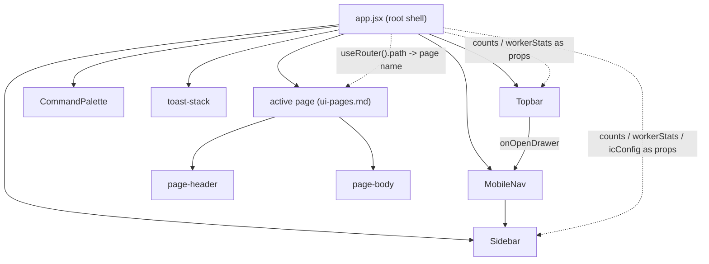
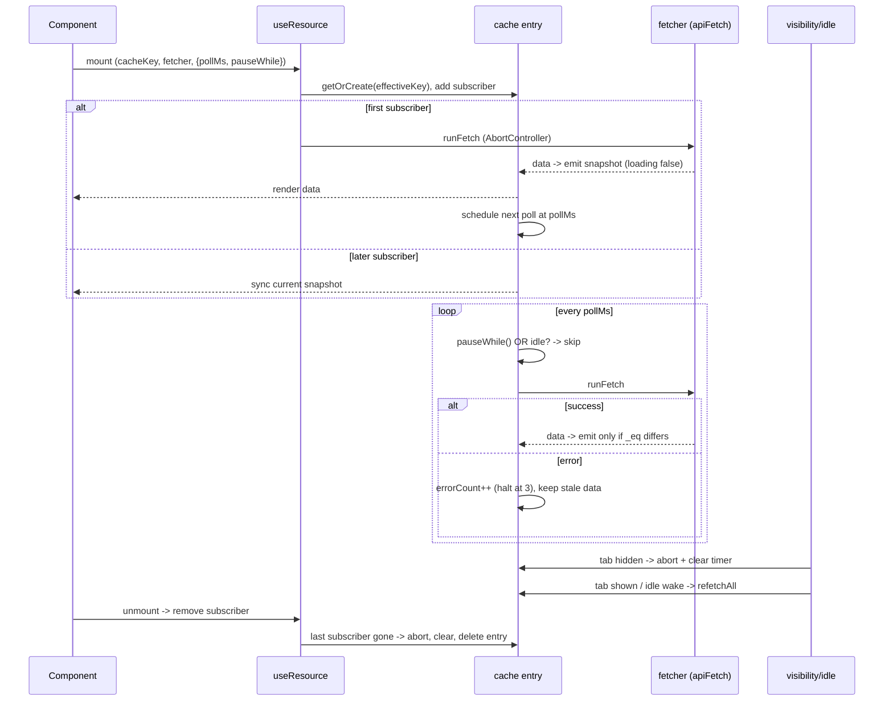

# UI Foundation

## 1. Purpose

The UI foundation is the shared substrate every operator-console page is built on. It is a small set of hand-written browser primitives under `ui/foundation/` plus the console chrome and shared components, all of which attach to a single global namespace, `window.primerApi`. The foundation owns the cross-cutting concerns so that no page has to reinvent them: HTTP against the REST + ProblemDetails contract (`apiFetch`, `ApiError`), polled read state with dedupe and cancellation (`useResource`), optimistic write state (`useMutation`), hash routing (`useRouter`), the toast queue (`useToast`), client-side preferences (`useTweaks`), idle-pause and viewport breakpoints (`idle.js`, `useViewport`), the chrome shell (`Topbar`, `Sidebar`, `MobileNav`, `CommandPalette`), the shared primitives (`Modal`, `Banner`, `Btn`, `Icon`, `StatusPill`, the toast stack, and the mobile shells), the user-docs renderer at `/docs` with its markdown-directive dispatch, and the theme tokens.

This doc is about the shared foundation only. Per-page composition (dashboard tiles, session detail panels, the graph editor, channel forms, the per-page mobile retrofits) lives in the companion doc [ui-pages.md](ui-pages.md). The foundation is deliberately thin: each module is a self-invoking function with no build step, no imports, and no framework beyond React loaded as a global.

A hard rule the spec set and the code enforces: pages must route all I/O through the hook layer rather than calling `apiFetch` directly, so that polling, cancellation, dedupe, and stale-while-error live in exactly one place.

## 2. Conceptual model

The console is a single-page React app served from the same FastAPI origin as the REST API. There is no bundler and no `package.json`; `ui/index.html` lists every source file as an inert `<script type="text/babel">` tag, and the backend (`primer/api/_jsx_bundle.py`) reads that list at startup, transpiles each file inside an embedded V8 isolate, and serves the concatenated result as a single `/console/_app.js`. The browser only loads three vendored UMD scripts (React, ReactDOM, html2canvas) plus that one bundle. The `text/babel` tags are the source-of-truth bundle order; the browser ignores them.

Every foundation module attaches its public surface to `window.primerApi`. There is no React context provider wrapping the tree; shared state lives at module scope (the `useResource` cache, the toast queue, the tweaks store) so that non-React callers can read and write it too. Modules load in dependency order from `ui/index.html`: `api.js` then `toast.js` then `use-resource.js` then `use-mutation.js` then `router.js` then `tweaks.js` then `idle.js` then `viewport.js`, followed by the vendor helpers, shared primitives, and page components.

The chrome wraps the active page. `ui/app.jsx` is the root shell: it reads the route from `useRouter()`, derives a page name from the path, owns most of the live polling (sidebar counts, worker stats, IC config, palette docs), and renders the chrome around the page body.

On a mobile viewport the desktop `Sidebar` is hidden by CSS and the `MobileNav` drawer (opened by the topbar hamburger) wraps the same `Sidebar` inside an overlay; `app.jsx` owns the `drawerOpen` state and auto-closes the drawer on route change.

## 3. Architecture patterns implemented

- **Same-origin REST client with the ProblemDetails contract.** `apiFetch` (`ui/foundation/api.js`) resolves bare or `/v1`-prefixed paths to `/v1/*`, sets `credentials: "same-origin"`, and parses every error response as an RFC 7807 envelope into an `ApiError` (`type`, `status`, `title`, `detail`, `requestId`, `fieldErrors`). This is the consumer side of the contract documented in [architecture/rest-api.md](../architecture/rest-api.md): the backend emits `application/problem+json` with `extensions.request_id` and `extensions.errors`, and `ApiError` reads exactly those fields. The console's "Copy request id" affordance depends on `requestId` being threaded through on both success and failure.

- **Polling-only reactivity.** There is no SSE or push for read state (the chat WebSocket is the one exception, owned by a page, not the foundation). `useResource` is a module-level cache that polls on an interval, dedupes concurrent subscribers behind one fetch, retains stale data on error (stale-while-error), and suppresses re-renders when a poll returns structurally-identical data.

- **Optimistic-write-with-rollback.** `useMutation` snapshots affected cache keys, applies an optimistic transform, awaits the fetcher, refetches the invalidated keys on success, and rolls back plus refetches on error. Destructive or cascading edits skip the optimistic path and wait for the 200.

- **Module-scope state instead of React context.** The cache, toast queue, idle flag, and tweaks store all live at module scope on `window.primerApi`. This lets `useMutation` enqueue an error toast from outside the React tree and lets `idle.js` re-arm every poll on wake without a provider.

- **Hash routing.** `useRouter` is a hash router (`#/path?query`) with a first-match-wins routes table. Hash routing was chosen over `history.pushState` so the backend never has to rewrite console URLs back to `index.html`, the app works on `file://`, and the security-headers middleware needs no special casing.

- **Single bundle, viewport-aware components.** Mobile support is one bundle and one CSS file with viewport-aware components, not a separate mobile SPA. `useViewport` re-emits only when the viewport crosses a band boundary, so placing it in every page is cheap.

## 4. Code layout

The foundation primitives, all self-invoking and all contributing to `window.primerApi`:

- `ui/foundation/api.js` - `apiFetch`, `ApiError`, path resolution, the T0103a retry, the 422 humanizer, the network-error envelope, FormData support.
- `ui/foundation/use-resource.js` - `useResource`, the shared cache `Map`, `_eq` structural equality, the page-wide `visibilitychange` listener, and the internal helpers (`findKeys`, `peekData`, `replaceData`, `refetchKey`, `refetchAll`) exposed under `window.primerApi._resource` and `window.primerApi._refetchAll`.
- `ui/foundation/use-mutation.js` - `useMutation`.
- `ui/foundation/router.js` - `useRouter`, the routes table on `window.primerApi.routes`, `parseHash`/`buildHash`/`navigate`, and `matchRoute`/`_router` test helpers.
- `ui/foundation/toast.js` - `useToast` plus the module-level `toastPush`/`toastDismiss` entry points.
- `ui/foundation/tweaks.js` - `useTweaks`, the `localStorage` persistence of `theme`, and the synchronous flash-prevention theme apply.
- `ui/foundation/idle.js` - the global idle flag and the wake-up `_refetchAll` call.
- `ui/foundation/viewport.js` - `useViewport` with the mobile/tablet/desktop bands and the `?force-desktop=1` escape hatch.

The chrome and shared components:

- `ui/components/chrome.jsx` - `Sidebar`, `MobileNav`, `Topbar`, `CommandPalette`, and the private `ThemeToggle`/`UserMenu`. `NAV` is a hard-coded section table; the chrome is presentational and receives counts/workerStats/page as props from `ui/app.jsx`.
- `ui/components/shared.jsx` - the shared primitives `Icon`, `Btn`, `Modal`, `StatusPill`, `Banner`, plus `Sparkline`/`relativeTime`/`fmtDate`, all attached to `window`. `Modal` reads `window.primerApi.useViewport` and renders as a bottom sheet on mobile.
- `ui/components/shared/` - the mobile shells `bottom-sheet.jsx`, `card-list.jsx`, `mobile-tabs.jsx`, `floating-action.jsx`, and `token-meter.jsx`, loaded after `shared.jsx`.
- `ui/app.jsx` - the root shell: routing, chrome-level polling, the toast stack, and the page dispatch.

The bundling and serving glue lives on the API side (`primer/api/app.py`: `_mount_console`, `_install_console_csp`, `_install_jsx_bundle`, `_install_root_redirect`, `_CachingStaticFiles`; `primer/api/_jsx_bundle.py`: the `JSXBundler`). The vendored dependencies and their audit trail are under `ui/vendor/` with `ui/vendor/MANIFEST.md`.

The user-docs renderer: `ui/components/docs.jsx` (`DocsPage`), the markdown-directive dispatch in `ui/vendor/markdown.jsx` (`window.MarkdownDirectives.register`), the six directive handlers under `ui/components/docs/` (`directives-callout`, `directives-ref`, `directives-ai-doc`, `directives-code-tabs`, `directives-mermaid`, `directives-mockup`), and the embed registry `ui/components/docs/embeds.jsx` (`window.DocsEmbeds`).

## 5. Data model

Not applicable as a server-persisted data model: the foundation holds no persistent server data of its own. It does hold a small amount of client-side state.

- The `useResource` cache is a module-level `Map` keyed by `cacheKey + "::" + JSON.stringify(deps)`. Each entry is `{data, error, loading, errorCount, subscribers, abortCtrl, timer, fetcher, pollMs, pauseWhile}` plus a `_lastSnap` used by the structural-equality emit gate. Entries are reaped when their subscriber count reaches zero.
- The toast queue is a module-level `{toasts, listeners}` with `MAX_VISIBLE = 5` and FIFO drop.
- The tweaks store is a module-level `{values, listeners, seeded}`; `DEFAULT_DEFAULTS` covers `theme`, `accent`, `density`, `demoState`, `subsystemOn`, `icState`, and `instanceLabel`.
- The `ApiError` shape is the client mirror of the ProblemDetails envelope: `type`, `status`, `title`, `detail`, `requestId` (from `extensions.request_id`), `fieldErrors` (from `extensions.errors`), and the raw `envelope`.

## 6. Lifecycle

The two load-bearing lifecycles are the `useResource` polling loop and the route-to-page dispatch.

A `useResource` consumer mounts, the hook creates or joins the cache entry for its effective key, and the first subscriber triggers an immediate fetch; later subscribers sync to the current snapshot without a new fetch. Each fetch runs under a fresh `AbortController`; a superseded fetch (the entry's `abortCtrl` changed) discards its result. `loading=true` is emitted only on the first fetch for a key, so background polls never flicker the consumer between data and loading. After a successful fetch the entry schedules the next poll at `pollMs`. Polling halts when any of: `pollMs <= 0`, `errorCount >= MAX_ERRORS` (3 consecutive failures), or `pauseWhile()` returns true. `pauseWhile` is OR-ed with the global `window.primerApi.idle` flag, and a single page-wide `visibilitychange` listener aborts inflight fetches and clears timers when the tab hides and refetches every active entry when it shows. `refetch()` clears `errorCount` and fires immediately, which is the operator-driven recovery from the three-error halt. On unmount the subscriber is removed, and the last unmount aborts inflight, clears the timer, and deletes the cache entry.

Route-to-page dispatch: a hash change fires `hashchange`, `useRouter` re-parses `location.hash` into `{path, params, query}`, resolves the path against the first-match-wins routes table (unknown paths become `/__notfound__`), and `ui/app.jsx` maps the resolved path to a page name in a single match block and renders the matching page component. Navigation is always `window.primerApi.useRouter().navigate(path, query)`, called directly by leaf pages and the chrome; there is no prop-drilled navigate callback. A missing initial hash is forced to `#/`.

The bundle lifecycle runs once at server startup: `_install_jsx_bundle` reads the `text/babel` script list from `ui/index.html`, transpiles each file (applying a Babel plugin that rewrites top-level `const`/`let` to `var` so the concatenated files share one global scope), and serves the result at `/console/_app.js` with a strong ETag and a 5-minute `must-revalidate` cache.

## 7. Persistence

The frontend persists no server data. It persists a small set of client preferences to `localStorage`:

- `primer.tweaks` holds the `theme` key only (the persisted subset of the tweaks store). The persisted theme is applied to `document.documentElement` synchronously at script load to avoid a dark-mode flash on a light-theme reload. Mockup-era knobs (`demoState`, `subsystemOn`, `icState`) are deliberately not persisted so an operator cannot strand themselves in a broken demo state.
- `primer.sidebar.collapsed` (per-group collapsed state) and `primer.sidebar.iconsOnly` (the icons-only collapse mode) hold sidebar layout state.
- `primer.force-desktop` records the `?force-desktop=1` opt-out so it survives navigation.

The `useResource` cache is an in-memory polling cache, not durable storage; it is rebuilt from the API on every page load and reaped per cache key as subscribers unmount.

## 8. Public surfaces

Everything the foundation exposes is on `window.primerApi`:

- `apiFetch(method, path, body?, opts?)` - returns parsed JSON, `null` on 204, throws `ApiError` on any non-ok response. Resolves bare paths to `/v1/*`, sends `credentials: "same-origin"`, honours `opts.signal`, and sends a `FormData` body as multipart (letting fetch set the boundary Content-Type).
- `ApiError` - the thrown error class; consumers read `status`, `type`, `title`, `detail`, `requestId`, `fieldErrors`.
- `useResource(cacheKey, fetcher, {pollMs, pauseWhile, deps})` - returns `{data, error, loading, refetch}`.
- `useMutation(fetcher, {optimistic, invalidates, onSuccess, onError})` - returns `{mutate, loading, error, data}`; `mutate(body)` returns the fetcher's promise.
- `useRouter()` - returns `{path, params, query, navigate}`. `routes` is the mutable routes array; sub-projects may push entries.
- `useToast()` - returns `{toasts, push, dismiss}`. `toastPush`/`toastDismiss` are the non-hook entry points.
- `useTweaks(defaults?)` - returns `[values, setTweak]`. First caller with a `defaults` map seeds the store.
- `useViewport()` - returns `{width, isMobile, isTablet, isDesktop}` over the 639px / 1023px bands.
- `idle` - the boolean idle flag; `_refetchAll()` re-fires every active entry.

The chrome components exported as globals are `Sidebar`, `MobileNav`, `Topbar`, and `CommandPalette`; the shared primitives are `Icon`, `Btn`, `Modal`, `StatusPill`, `Banner`, plus `Sparkline`/`relativeTime`/`fmtDate`. The mobile shells `CardList`/`Card`, `BottomSheet`, `MobileTabs`, and `Fab` are exposed for page consumption. The markdown layer exposes `window.MarkdownDirectives.register(prefix, handler)` and `window.DocsEmbeds`.

The bundle and console are served at the HTTP level: `GET /console/` serves `ui/index.html`, `GET /console/_app.js` serves the transpiled bundle, `GET /` 307-redirects to `/console/`, and a strict Content-Security-Policy is applied to `/console/*` responses only (never to `/v1/*` JSON).

## 9. Internal contracts

- **Pages route I/O through hooks, never `apiFetch` directly.** The hook layer is where polling, dedupe, cancellation, and stale-while-error live; a page that calls `apiFetch` directly bypasses all of it.
- **`useMutation` coordinates with `useResource` through `window.primerApi._resource`.** `useMutation` calls `findKeys` (prefix-expands a base key to every deps-suffixed variant), `peekData`, `replaceData`, and `refetchKey` to apply optimistic transforms and invalidations without React context.
- **`idle.js` re-arms polls through `window.primerApi._refetchAll`.** The idle flag flipping false does not by itself reschedule polls (they are scheduled per settle); idle.js calls `_refetchAll()` on the first input after idle.
- **The T0103a cold-start retry.** `apiFetch` retries exactly once on a 502 whose envelope `type` is `/errors/provider-error` and whose detail matches `/pg_type_typname_nsp_index|relation .* does not exist/i`. This is the only automatic retry; it covers a known transient CREATE-TABLE race and does not mask other failures.
- **422 humanizing.** Any 422 envelope is reshaped to `title: "Data is incomplete"` and a `detail` of `Missing or invalid: a, b (+N more).` synthesized from the `extensions.errors` loc paths, so form fallbacks show something useful instead of "Validation Error". Modals still read `fieldErrors` for per-field inline display.
- **Network failures become a uniform envelope.** When `fetch()` itself throws (offline, DNS, TLS), `apiFetch` synthesizes an `ApiError` with `type: "/errors/network-error"` and `status: 0` so consumers see one shape regardless of transport failure.
- **The IC-config 404 is the one silently-swallowed error.** The Internal Collections config endpoint 404s when unconfigured, which is the most common operator state, so the chrome treats 404 as "off" rather than surfacing a toast. Every other 404 is an operator-visible error.
- **`pollMs` changes apply in place.** A second effect updates the entry's cadence without tearing down and rebuilding the cache entry, so a caller that adapts `pollMs` to the response does not loop through `data=undefined` rebuilds.
- **Bundle order is the `index.html` script list.** `ui/index.html` is the single source of truth for transpile and load order; foundation modules must precede the components that consume them, and `viewport.js` plus the four `shared/` primitives must load before any page that branches on `isMobile`.

Known drift carried in the live code, called out so readers do not assume otherwise: two toast pipelines coexist (the foundation `useToast` queue, used by `useMutation`'s error fallback, and a duplicate `toast-stack` state array still in `ui/app.jsx`); `ui/components/predicate-builder.jsx` is still bundled though it has no route or sidebar entry; and the `/console/*` CSP still carries `unsafe-eval` and `unsafe-inline` on `script-src` even though server-side transpiling removed the runtime need for them.

## 10. Testing patterns

Foundation hook coverage is a hand-rolled in-browser runner at `ui/foundation/__tests__/foundation.test.html`: it loads the same foundation modules as production, installs a `window.fetch` stub per test, and asserts apiFetch 7807 parsing plus the T0103a retry, useResource polling/cancel/stale-while-error, and useMutation optimistic rollback. It runs in a real browser; the `scripts/ui/check-foundation.sh` CI shim the spec sketched was never built.

CI coverage of the foundation is therefore indirect. The Python suite under `tests/ui/` checks file invariants rather than runtime behaviour: bundle order (`tests/ui/test_viewport_bundle_order.py`, `tests/ui/test_shared_primitives_bundle_order.py`), the mobile primitives and media block, design tokens, the viewport hook presence, and that `ui/app.jsx` owns the drawer state. The mobile retrofits add per-page static assertions (for example `tests/ui/test_dashboard_mobile.py`, `tests/ui/test_health_mobile.py`). End-to-end journeys under `tests/ui_e2e/` (gated behind `PRIMER_RUN_UI_E2E=1`, driven at a 375x812 mobile viewport for the mobile suites) exercise the foundation through real flows: cache invalidation across pages, poll-cadence gating, idle wake-up, the drawer, list-to-cards, and modal-as-sheet. `scripts/audit_touch_targets.py` parses the mobile CSS block and fails CI if any interactive selector drops below the 44px touch-target floor.

The user-docs service has its own Python coverage under `tests/user_docs/` (tree walking, frontmatter, lint rules, mtime hot-reload) plus `tests/api/test_user_docs_router.py` for the `/v1/user_docs/*` routes.

## 11. Historical decisions

- **Hash routing was chosen over `history.pushState`.** Why: it needs no server-side rewrite of console URLs to `index.html`, works on `file://` for offline demos, and survives the security-headers middleware unchanged. Spec: docs/superpowers/specs/2026-05-16-ui-foundation-design.md.
- **`useResource` keeps a module-level cache keyed by cacheKey plus serialised deps, dedupes concurrent subscribers, and reaps entries on last unmount.** Why: several cards render the same probe, so without dedupe the poll tick would multiply fetches by consumer count and without reaping the cache would leak across navigations. Spec: docs/superpowers/specs/2026-05-16-ui-foundation-design.md.
- **Toast and tweaks state live at module scope, not in React context.** Why: it lets `useMutation`'s error fallback enqueue a toast from outside the React tree and avoids wrapping every page in a provider. Spec: docs/superpowers/specs/2026-05-16-ui-foundation-design.md.
- **`loading=true` is emitted only on the first fetch for a key; background polls retain stale data.** Why: flipping loading during a poll flickered the consumer between data and loading twice per cycle. Spec: docs/superpowers/specs/2026-05-15-web-console-implementation-design.md.
- **Polling halts after three consecutive errors until a manual refetch.** Why: a failing endpoint should not keep retrying every cadence; manual refetch is the operator recovery path. Spec: docs/superpowers/specs/2026-05-15-web-console-implementation-design.md.
- **T0103a is the only automatic retry in `apiFetch`.** Why: the cold-start CREATE-TABLE race surfaces as a specific 502 provider-error signature and one retry resolves it without masking other failures. Spec: docs/superpowers/specs/2026-05-15-web-console-implementation-design.md.
- **Pages must not call `apiFetch` directly.** Why: it forces all I/O through the hook layer where polling, cancellation, dedupe, and stale-while-error live. Spec: docs/superpowers/specs/2026-05-15-web-console-implementation-design.md.
- **Idle-pause moved from the chrome design into `ui/foundation/idle.js`.** Why: every `useResource` caller needed it, not just chrome polls, so implementing it as a foundation primitive (the global flag plus `_refetchAll`) gave every page the behaviour with zero per-call opt-in. Spec: docs/superpowers/specs/2026-05-16-ui-chrome-design.md.
- **Chrome polls were centralised in `ui/app.jsx` instead of inside the chrome components.** Why: counts and worker stats feed multiple surfaces, so pulling probes into the parent gave one shared cache key for free and kept the chrome components testable with prop fixtures. Spec: docs/superpowers/specs/2026-05-16-ui-chrome-design.md.
- **The IC-config 404 is the only silently-trapped error in the UI.** Why: the IC subsystem deliberately 404s when unconfigured, which is the most common operator state, and surfacing it as an error would crowd out real failures. Spec: docs/superpowers/specs/2026-05-16-ui-chrome-design.md.
- **Only the `theme` tweak is persisted, applied to the document root synchronously at script load.** Why: mockup-era knobs should reset on reload so an operator cannot strand themselves in a broken demo, and the synchronous apply avoids a dark-mode flash on light reload. Spec: docs/superpowers/specs/2026-05-16-ui-foundation-design.md.
- **React, ReactDOM, and Babel were moved off the unpkg CDN and self-hosted under `ui/vendor/` with a sha256 manifest.** Why: a Shai-Hulud-class supply-chain mitigation; zero third-party fetches mean no CDN allowance in the CSP and no install-time or import-time attack surface. Spec: docs/superpowers/specs/2026-05-16-ui-foundation-design.md.
- **JSX is pre-transpiled into one ETagged `/console/_app.js` at server startup rather than transpiled in the browser.** Why: it drops Babel from the page load, keeps `ui/` a clean source tree with no build artefacts, and resolves cross-deploy cache invalidation in one ETag round-trip; the `text/babel` tags in `index.html` double as the bundle's source-of-truth manifest. Spec: docs/superpowers/specs/2026-05-25-ui-reconciliation-design.md.
- **Mobile support shipped as a single viewport-aware bundle, not a separate mobile SPA or code-split bundle.** Why: keeping the desktop CSS and JSX paths byte-identical was worth the modest bundle growth, and a band-memoised `useViewport` makes putting the hook in every page negligible. Spec: docs/superpowers/specs/2026-05-30-mobile-console-design.md.
- **A 44px touch-target floor is enforced by a CI audit rather than per-element review.** Why: WCAG 2.5.5 target size is non-negotiable on mobile, so `scripts/audit_touch_targets.py` plus a `.touch-target` utility guarantee it without trusting hand review. Spec: docs/superpowers/specs/2026-05-30-mobile-console-design.md.
- **The markdown renderer dispatches custom fenced-block directives instead of JSX-only docs.** Why: a non-engineer can drop a `.md` file under `primer/user_docs/` and reload; unknown info-strings fall through to plain code blocks so the parser stays backwards-compatible. Spec: docs/superpowers/specs/2026-06-04-user-documentation-system-design.md.
- **Mermaid is bundled as a vendor file and lazy-loaded only on the `/docs` route.** Why: Mermaid is large and loading it on every page would hurt cold start for operators who never visit `/docs`. Spec: docs/superpowers/specs/2026-06-04-user-documentation-system-design.md.
- **Operator docs hot-reload via a per-request mtime stat rather than a filesystem watcher.** Why: one stat per request avoids an inotify watcher thread while still making dev edits go live on browser reload. Spec: docs/superpowers/specs/2026-06-04-user-documentation-system-design.md.
