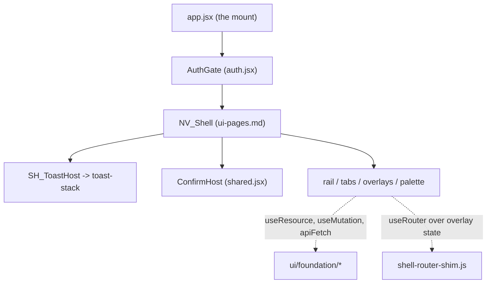
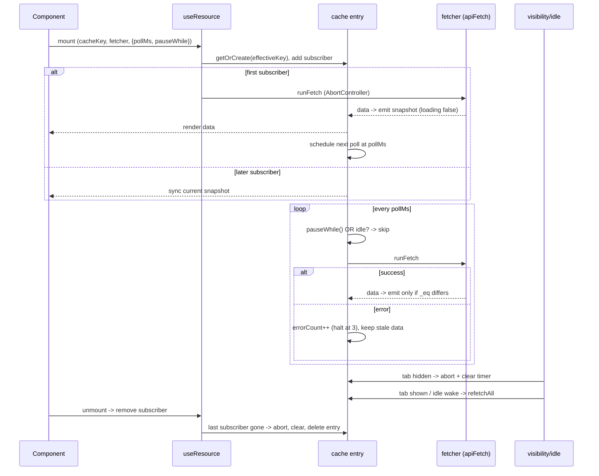

# UI Foundation

## 1. Purpose

The UI foundation is the shared substrate every operator-console page is built on. It is a small set of hand-written browser primitives under `ui/foundation/` plus the shared components, all of which attach to a single global namespace, `window.primerApi`. The foundation owns the cross-cutting concerns so that no page has to reinvent them: HTTP against the REST + ProblemDetails contract (`apiFetch`, `ApiError`), polled read state with dedupe and cancellation (`useResource`), optimistic write state (`useMutation`), the router shim (`useRouter`), the toast queue (`useToast`), client-side preferences (`useTweaks`), idle-pause and viewport breakpoints (`idle.js`, `useViewport`), the shared primitives (`Modal`, `Banner`, `Btn`, `Icon`, `StatusPill`, the toast stack, and the mobile shells), the markdown-directive dispatch, and the theme tokens.

This doc is about the shared foundation only. Per-page composition (dashboard tiles, session detail panels, the graph editor, channel forms, the per-page mobile retrofits) lives in the companion doc [ui-pages.md](ui-pages.md). The foundation is deliberately thin: each module is a self-invoking function with no build step, no imports, and no framework beyond React loaded as a global.

A hard rule the spec set and the code enforces: pages must route all I/O through the hook layer rather than calling `apiFetch` directly, so that polling, cancellation, dedupe, and stale-while-error live in exactly one place.

## 2. Conceptual model

The console is a single-page React app served from the same FastAPI origin as the REST API. There is no bundler and no `package.json`; `ui/index.html` lists every source file as an inert `<script type="text/babel">` tag, and the backend (`primer/api/_jsx_bundle.py`) reads that list at startup, transpiles each file inside an embedded V8 isolate, and serves the concatenated result as a single `/console/_app.js`. The browser only loads three vendored UMD scripts (React, ReactDOM, html2canvas) plus that one bundle. The `text/babel` tags are the source-of-truth bundle order; the browser ignores them.

Every foundation module attaches its public surface to `window.primerApi`. There is no React context provider wrapping the tree; shared state lives at module scope (the `useResource` cache, the toast queue, the tweaks store) so that non-React callers can read and write it too. Modules load in dependency order from `ui/index.html`: `api.js` then `toast.js` then `use-resource.js` then `use-mutation.js` then `capabilities.js` then `tweaks.js` then `idle.js` then `viewport.js`, followed by the shell's own `shell-*.js` modules, the vendor helpers, shared primitives, and page components.

There is no chrome layer any more. `ui/app.jsx` is one mount: `AuthGate` wrapping `NV_Shell`. The shell owns its own regions and its own polling, and the foundation is what it and every re-hosted page share underneath. See [ui-pages.md](ui-pages.md) for the shell itself.

```mermaid
graph TD
    App["app.jsx (the mount)"] --> Auth["AuthGate (auth.jsx)"]
    Auth --> Shell["NV_Shell (ui-pages.md)"]
    Shell --> Toasts["SH_ToastHost -> toast-stack"]
    Shell --> Confirm["ConfirmHost (shared.jsx)"]
    Shell --> Surfaces["rail / tabs / overlays / palette"]
    Surfaces -. "useResource, useMutation, apiFetch" .-> Found["ui/foundation/*"]
    Surfaces -. "useRouter over overlay state" .-> Shim["shell-router-shim.js"]
```

The shell adapts to narrow viewports itself rather than swapping in a separate mobile surface; `useViewport` remains the shared breakpoint primitive that both it and the re-hosted pages read.

## 3. Architecture patterns implemented

- **Same-origin REST client with the ProblemDetails contract.** `apiFetch` (`ui/foundation/api.js`) resolves bare or `/v1`-prefixed paths to `/v1/*`, sets `credentials: "same-origin"`, and parses every error response as an RFC 7807 envelope into an `ApiError` (`type`, `status`, `title`, `detail`, `requestId`, `fieldErrors`). This is the consumer side of the contract documented in [architecture/rest-api.md](../architecture/rest-api.md): the backend emits `application/problem+json` with `extensions.request_id` and `extensions.errors`, and `ApiError` reads exactly those fields. The console's "Copy request id" affordance depends on `requestId` being threaded through on both success and failure.

- **Polling-only reactivity.** There is no SSE or push for read state (the one exception is the workspace tap: a single shared SSE `EventSource` per workspace, `use-workspace-tap.js`). `useResource` is a module-level cache that polls on an interval, dedupes concurrent subscribers behind one fetch, retains stale data on error (stale-while-error), and suppresses re-renders when a poll returns structurally-identical data.

- **Optimistic-write-with-rollback.** `useMutation` snapshots affected cache keys, applies an optimistic transform, awaits the fetcher, refetches the invalidated keys on success, and rolls back plus refetches on error. Destructive or cascading edits skip the optimistic path and wait for the 200.

- **Module-scope state instead of React context.** The cache, toast queue, idle flag, and tweaks store all live at module scope on `window.primerApi`. This lets `useMutation` enqueue an error toast from outside the React tree and lets `idle.js` re-arm every poll on wake without a provider.

- **`useRouter` is a shim over overlay state, not a router.** The hash router and its routes table are gone: the console has one URL grammar, owned by the shell (`ui/foundation/shell-url.js`), and every management surface is an overlay within it. The re-hosted page components still call `window.primerApi.useRouter()` for `params.id` and `navigate`, so `ui/foundation/shell-router-shim.js` publishes the same `{path, params, query, navigate}` contract sourced from the ACTIVE overlay's `<name>:<section>:<id>` segments, and translates `navigate(path)` back into opening an overlay. The hash is still the address, for the same reasons it always was: the backend never rewrites console URLs, and the security-headers middleware needs no special casing.

- **Single bundle, viewport-aware components.** Mobile support is one bundle and one CSS file with viewport-aware components, not a separate mobile SPA. `useViewport` re-emits only when the viewport crosses a band boundary, so placing it in every page is cheap.

## 4. Code layout

The foundation primitives, all self-invoking and all contributing to `window.primerApi`:

- `ui/foundation/api.js` - `apiFetch`, `ApiError`, `readRefusal`, path resolution, the T0103a retry, the 422 humanizer, the network-error envelope, FormData support.
- `ui/foundation/capabilities.js` - `useCapabilities`, `capabilityHint`, `extraInstalled`, `CapabilityGate`, and `EXTRA_FOR_PROVIDER_TYPE`. Wraps `GET /v1/capabilities` so pages render honest not-installed states instead of offering backends the server cannot run; `extraInstalled` treats unknown as installed so a page never flashes the gate while the fetch is in flight. See [modularity](modularity.md).
- `ui/foundation/use-resource.js` - `useResource`, the shared cache `Map`, `_eq` structural equality, the page-wide `visibilitychange` listener, and the internal helpers (`findKeys`, `peekData`, `replaceData`, `refetchKey`, `refetchAll`) exposed under `window.primerApi._resource` and `window.primerApi._refetchAll`.
- `ui/foundation/use-mutation.js` - `useMutation`.
- `ui/foundation/shell-router-shim.js` - `useRouter` over overlay state: `SH_shimPath`, `SH_shimParams`, `SH_shimQuery` (the section slot doubles as a tabbed page's `?tab=`), `SH_shimNavigate`, and `SH_installRouterShim`. It is the only provider of `primerApi.useRouter`, pinned by a flag-day test.
- `ui/foundation/toast.js` - `useToast` plus the module-level `toastPush`/`toastDismiss` entry points.
- `ui/foundation/tweaks.js` - `useTweaks`, the `localStorage` persistence of `theme`, and the synchronous flash-prevention theme apply.
- `ui/foundation/idle.js` - the global idle flag and the wake-up `_refetchAll` call.
- `ui/foundation/escape-stack.js` - `useEscape(handler, active)`: one window `keydown` listener that answers Escape for the top-most registered layer only (the layer that became active last, by render order), so one Escape closes one layer; `Modal`, the overlay panel, the bottom sheet, the command palette, the lightbox and the open menus use it, and an input that handles Escape itself calls `preventDefault`, which the stack respects; so is an Escape that belongs to an IME composition (`isComposing` or `keyCode` 229). The add-step palette, the readiness popover, the reference picker and the Create session binding menu are on it too.
- `ui/foundation/viewport.js` - `useViewport` with the mobile/tablet/desktop bands and the `?force-desktop=1` escape hatch.
- `ui/foundation/focus-trap.js` - `useFocusTrap(ref, active, opts, deps)` and `focusablesOf(node)`: the one focus trap of every dialog (the shared `Modal`, the console overlay panel, the phone's bottom sheet): focus moves in on open, Tab and Shift+Tab wrap inside (from the ends, from a parked non-stop, and from `<body>` through one document listener answered by the top-most open dialog), and focus goes back to the opener on close. `focusablesOf` is what the browser tabs to: no negative `tabindex`, nothing hidden, a radio group once, and contenteditable, summary, iframe and media with controls included. See the dialog-focus paragraph of `ui-pages.md`.

The shared components:

- `ui/components/shared.jsx` - the shared primitives `Icon`, `Btn`, `Modal`, `StatusPill`, `Banner`, plus `Sparkline`/`relativeTime`/`fmtDate`, all attached to `window`. `Modal` reads `window.primerApi.useViewport` and renders as a bottom sheet on mobile.
- `ui/components/shared/` - the mobile shells `bottom-sheet.jsx`, `card-list.jsx`, `mobile-tabs.jsx`, `floating-action.jsx`, and `token-meter.jsx`, loaded after `shared.jsx`.
- `ui/app.jsx` - the mount, and nothing else: `AuthGate` wrapping `NV_Shell`.

The bundling and serving glue lives on the API side (`primer/api/app.py`: `_mount_console`, `_install_console_csp`, `_install_jsx_bundle`, `_install_root_redirect`, `_CachingStaticFiles`; `primer/api/_jsx_bundle.py`: the `JSXBundler`). The vendored dependencies and their audit trail are under `ui/vendor/` with `ui/vendor/MANIFEST.md`.

The markdown layer: the directive dispatch in `ui/vendor/markdown.jsx` (`window.MarkdownDirectives.register`) and the embed registry under `ui/components/docs/` (`embed-registry.jsx`, `embed-preview.jsx`). The in-app docs viewer and the `/v1/user_docs/*` API that fed it were removed; the operator documentation lives in the `primerhq.github.io` Pages site, and the embed registry is what its capture harness drives.

## 5. Data model

Not applicable as a server-persisted data model: the foundation holds no persistent server data of its own. It does hold a small amount of client-side state.

- The `useResource` cache is a module-level `Map` keyed by `cacheKey + "::" + JSON.stringify(deps)`. Each entry is `{data, error, loading, errorCount, subscribers, abortCtrl, timer, fetcher, pollMs, pauseWhile}` plus a `_lastSnap` used by the structural-equality emit gate. Entries are reaped when their subscriber count reaches zero.
- The toast queue is a module-level `{toasts, listeners}` with `MAX_VISIBLE = 5` and FIFO drop.
- The tweaks store is a module-level `{values, listeners, seeded}`; `DEFAULT_DEFAULTS` covers `theme`, `accent`, `density`, `demoState`, `subsystemOn`, `icState`, and `instanceLabel`.
- The `ApiError` shape is the client mirror of the ProblemDetails envelope: `type`, `status`, `title`, `detail`, `requestId` (from `extensions.request_id`), `fieldErrors` (from `extensions.errors`), and the raw `envelope`.

## 6. Lifecycle

The two load-bearing lifecycles are the `useResource` polling loop and the route-to-page dispatch.

A `useResource` consumer mounts, the hook creates or joins the cache entry for its effective key, and the first subscriber triggers an immediate fetch; later subscribers sync to the current snapshot without a new fetch. Each fetch runs under a fresh `AbortController`; a superseded fetch (the entry's `abortCtrl` changed) discards its result. `loading=true` is emitted only on the first fetch for a key, so background polls never flicker the consumer between data and loading. After a successful fetch the entry schedules the next poll at `pollMs`. Polling halts when any of: `pollMs <= 0`, `errorCount >= MAX_ERRORS` (3 consecutive failures), or `pauseWhile()` returns true. `pauseWhile` is OR-ed with the global `window.primerApi.idle` flag, and a single page-wide `visibilitychange` listener aborts inflight fetches and clears timers when the tab hides and refetches every active entry when it shows. `refetch()` clears `errorCount` and fires immediately, which is the operator-driven recovery from the three-error halt. On unmount the subscriber is removed, and the last unmount aborts inflight, clears the timer, and deletes the cache entry.

```mermaid
sequenceDiagram
    participant C as Component
    participant H as useResource
    participant E as cache entry
    participant F as fetcher (apiFetch)
    participant V as visibility/idle

    C->>H: mount (cacheKey, fetcher, {pollMs, pauseWhile})
    H->>E: getOrCreate(effectiveKey), add subscriber
    alt first subscriber
        H->>F: runFetch (AbortController)
        F-->>E: data -> emit snapshot (loading false)
        E-->>C: render data
        E->>E: schedule next poll at pollMs
    else later subscriber
        E-->>C: sync current snapshot
    end
    loop every pollMs
        E->>E: pauseWhile() OR idle? -> skip
        E->>F: runFetch
        alt success
            F-->>E: data -> emit only if _eq differs
        else error
            E->>E: errorCount++ (halt at 3), keep stale data
        end
    end
    V->>E: tab hidden -> abort + clear timer
    V->>E: tab shown / idle wake -> refetchAll
    C->>H: unmount -> remove subscriber
    H->>E: last subscriber gone -> abort, clear, delete entry
```

Address handling: the shell parses `location.hash` into `{wid, doc, overlay, anchor}` and writes it back whenever any of those four change, so every document and overlay is a pasteable link. A re-hosted page component that calls `useRouter().navigate(path)` is not leaving the shell; the shim reads the path as "show me this deeper thing" and opens the corresponding overlay instead. See [ui-pages.md](ui-pages.md) for the grammar.

The bundle lifecycle runs once at server startup: `_install_jsx_bundle` reads the `text/babel` script list from `ui/index.html`, transpiles each file (applying a Babel plugin that rewrites top-level `const`/`let` to `var` so the concatenated files share one global scope), and serves the result at `/console/_app.js` with a strong ETag and a 5-minute `must-revalidate` cache.

## 7. Persistence

The frontend persists no server data. It persists a small set of client preferences to `localStorage`:

- `primer.tweaks` holds the `theme` key only (the persisted subset of the tweaks store). Theme resolution is LIGHT-FIRST (2026-08-23 revamp): an inline script in `index.html` applies, before first paint, the persisted choice if one exists, else the OS `prefers-color-scheme`; the tweaks default is `null` (follow the OS), and a `matchMedia` listener keeps an unpersisted session following OS changes live. The `Toggle Theme` verb (`theme.toggle`) persists an explicit choice. Mockup-era knobs (`demoState`, `subsystemOn`, `icState`) are deliberately not persisted so an operator cannot strand themselves in a broken demo state.

Design tokens (ui/styles.css) carry the revamp's color discipline: `--accent` (blue) is the ONLY interactive color, `--attention` (orange) is RESERVED for needs-attention surfaces (badges, decision chips), and `--green`/`--red` are status semantics; `--font-ui` (Plus Jakarta Sans, self-hosted latin VF) is the UI face while `--font-mono` stays confined to code, diffs and IDs. Both theme blocks are guarded by `tests/ui/test_token_contrast.py`, which parses the oklch tokens per theme and fails CI when any pair in its `PAIRS` manifest drops below WCAG AA (4.5:1); when adding a text/surface token pair, extend `PAIRS` with it. `--warn` (the parked chip, a task that needs a look) and `--danger` (a failed turn, tool call or attachment) are the status TEXT colours. `--warn` is declared in both theme blocks with its own values (the dark value equals the literal the stylesheet used to fall back to, so dark did not change; the light value is darker, because the light `--amber` is only 4.16:1); `--danger` is an alias of `--red` (`var(--red)` in each block), so a failed turn's text is held to AA by `--red`'s own pairs, the ones the parser reads. A second test in that file fails when the stylesheet writes `var(--x, #hex)` for a token declared in no theme block, because such a fallback is one colour in both themes (it was 2.1:1 for the parked chip and 3.0:1 for a failed turn on light). `tests/ui_e2e/test_status_colors_theme_journey.py` measures what the browser paints for each class under each theme. `--warning` and `--bg-0` are declared nowhere, so those inline styles (`ui/components/external-tools.jsx`, `ui/components/session-detail.jsx`) use the declared `--warn` and `--bg` directly, and a second test in that file fails when any `ui/**/*.jsx` inline style writes `var(--x, var(...))` for a `--x` no theme block declares.
- `primer.sidebar.collapsed` (per-group collapsed state) and `primer.sidebar.iconsOnly` (the icons-only collapse mode) hold sidebar layout state.
- `primer.force-desktop` records the `?force-desktop=1` opt-out so it survives navigation.

The `useResource` cache is an in-memory polling cache, not durable storage; it is rebuilt from the API on every page load and reaped per cache key as subscribers unmount.

## 8. Public surfaces

Everything the foundation exposes is on `window.primerApi`:

- `apiFetch(method, path, body?, opts?)` - returns parsed JSON, `null` on 204, throws `ApiError` on any non-ok response. Resolves bare paths to `/v1/*`, sends `credentials: "same-origin"`, honours `opts.signal`, and sends a `FormData` body as multipart (letting fetch set the boundary Content-Type).
- `ApiError` - the thrown error class; consumers read `status`, `type`, `title`, `detail`, `requestId`, `fieldErrors`.
- `readRefusal(err, fallback, options)` - the ONE reader for a refused write: `{code, field, sentence, message}`; `options.codeAfterTitle === false` keeps the last fallback to the HTTP title alone (the trigger banners). A refusal's pieces are in four places and a page must not guess which: `extensions.code` (routers raise `HTTPException(detail={code, message})`, and `detail` is then the message STRING), `extensions.error` (the auth gate, which sends no message so `detail` is the code itself, and the agent/profile pre-write 422s `{error, field, message}`), `extensions.errors[]` (request validation: the first entry's `loc` is the field and, when there is exactly one entry, its `msg` is the `sentence` and the `message` names the field first, `name: Field required`, because "String should have at least 1 character" alone does not say which field and a generic toast has no field to draw it under (not for a bare `body` or `query` location, `body: Field required` names nothing, and not for a location with no string segment after the `body` / `query` / `path` prefix, the character position of a body that is not JSON (`1: JSON decode error`) or `[body, 0, 1]`; a list item of a named field has a string segment, is a field a person can find and is named, `items.2: Input should be a valid string`; both locations are in the table of REAL envelopes); a caller that draws the error under the field uses the bare `sentence`; its `type` is a pydantic type such as `string_too_short` or the name of a check, so a request-validation error has NO code, and an entry that is not an object is ignored) and, for a reference block, only the sentence. `sentence` is the server's own words or `""` (a message equal to the code is not a sentence; one that merely looks like a code is kept when the code is known and different, since a not-found message is a bare id). `message` is what a person reads: the sentence with two code-shaped ones said in words (`in_use_by: 1 agent(s) reference 'p' (first: 'builder')` becomes "'p' is still in use by an agent, for example builder. Remove or change that first."; `Channel with provider_id='a', external_id='b' already exists (id='c')` becomes "A channel with provider_id a and external_id b already exists: c."; a kind such as `tool_approval_policy` is said as words, and a sentence with a second id, a second block or extra words, or a pair list that does not read back as `name='value'` pairs, is left exactly as the server wrote it), else a sentence for the auth gate's bare `auth_required` ("Your session has ended; sign in again.") and `forbidden_role` ("Your role does not allow this."), else for several request-validation errors `ApiError`'s "Missing or invalid: a, b.", else the HTTP title, the error's message, the caller's fallback, with the code after it when there is one ("Forbidden (scope_required)": a title alone tells nobody what was refused); a third argument `{codeAfterTitle: false}` keeps that last step to the title alone, for a banner that must never show a code (the triggers'). The default error toast of `useMutation` shows `message`, and so do the new-channel and new-channel-provider dialogs, which have their own `onError` (a refused duplicate channel reads "A channel with provider_id a and external_id b already exists: c." there, ADM-20; `tests/ui/test_refusal_reader.py` mounts the real dialog with a real `ApiError`). `MC_extractError`, `AT_extractError`, `ADM_extractError`, `SSO_extractError`, `SV_extractError`, `LA_extractError` and the trigger helpers are one-line wrappers over it (they were seven copies that disagreed; `SSO_extractError` still looked for the code in a `detail` object the handler never sends, and the services and linked-accounts copies were missed by the first guard), and `tests/ui/test_refusal_reader.py` fails if any `*.jsx` or `*.js` under `ui/components` reads `.envelope` (the thrown error's problem document) itself: a `.envelope` access, `err["envelope"]` or ``err[`envelope`]``, or a destructuring pattern that names it, quoted or not, anywhere in the pattern (`{ message, envelope }`, over several lines, as an alias, in a parameter list or a loop, in an array pattern such as `[{ envelope }]`). **Limits:** a read is found only through those shapes; an object pattern in the MIDDLE of a parameter list (`(a, { envelope }, b) =>`) is not seen, and neither is the envelope reached through a variable that a rest pattern or a helper handed on. The banner-title rule below sees only a title written inline (`title={...}` or `title:`), not one built in a variable first. The scan reads the whole file with the comments, the strings, the static text of templates and the body of regular-expression literals taken out (`tests/_support/js_source.py`, with its own tests in `tests/ui/test_js_source_lexer.py`; a `/` starts a regex after `( , = : [ ! & | ? { } ;` or `return` / `typeof` / `case` / `of` / `in`, and a literal that does not close on its line is not one), so prose that mentions `.envelope` is not a read, `//` inside a string is not a comment and a backtick or a quote inside a regex is not a template or a string. The lexer RAISES when the text ends inside a template, a placeholder or a string, and `tests/ui/test_refusal_reader.py` runs it over every component file by name, so a file it cannot follow fails instead of being read as less (a regex literal once blanked 16k characters of `knowledge.jsx` and the floors on the whole tree could not see it; an offender appended to that file and to `predicate-builder.jsx` is now a test) (the Python editor's inline registration message, a field the reader does not return, is the one allowlisted reader). A banner TITLE never composes a code (`Save failed`, not `Save failed (auth_required)`; the same test fails in ANY component on a `title={...}` (found by its balanced braces, so a `${name}` placeholder before the code does not end the match) or a `title:` key (up to the end of its value) whose expression names a `code`: a property such as `err.code`, a destructured `code` variable, or `err["code"]`; the words of a title, such as `"Verification code"`, are not a code, and the scan must see at least half of the 445 titles there were when it was written (it was 425 until the lexer learned regex literals and stopped losing the 20 titles of `knowledge.jsx`)): when the server sent no sentence the message carries the code (`Forbidden (scope_required)`). It is tested on the REAL envelopes (`tests/_support/refusal_envelopes.py`: the real error handlers answer the real producers through `TestClient`): the table of real envelopes is the real part, and the cases that vary one thing (a code with no sentence, a malformed entry, a location, the options) are small hand-built envelopes on top of it. The referrer of an `in_use_by` block is named, not linked: the count is the size of a one-row page, so it only means "at least one".
- `useResource(cacheKey, fetcher, {pollMs, pauseWhile, deps})` - returns `{data, error, loading, degraded, refetch}`. A `null` or `undefined` `cacheKey` DISABLES the resource ("nothing to fetch yet", for example while the id the request needs is not known): no cache entry, no subscription, no fetch, and an idle snapshot (`data` undefined, `loading` false). Pass `cond ? "key" : null`; do not pass a placeholder key.
- `useMutation(fetcher, {optimistic, invalidates, onSuccess, onError})` - returns `{mutate, loading, error, data}`; `mutate(body)` returns a promise that resolves with the fetcher's data and REJECTS with its error after the toast (or `onError`) has shown it, so a caller that awaits it knows the write failed (a dialog must not close on a failed save). The returned promise is already marked handled (a rejection handler is attached before `mutate` returns), because most call sites do not await it (`onClick={() => create.mutate(body)}` is 34 of the 57): without that, every 422 or 409 a form handles perfectly well was also an unhandled rejection, one per user mistake, in `window.onerror` / `unhandledrejection` and Playwright's `pageerror` (admin review ADM-18). A caller that awaits and does not catch still raises, as its own async function's rejection. Only THAT promise is marked handled: a chain on it (`create.mutate(body).then(onDone)`, `.finally(fn)`) derives a NEW promise that rejects with the same refusal and has no handler, so it is an unhandled rejection again; end the chain with `.catch(...)` or `.then(onDone, onFail)`, or await it. `tests/ui/test_mutate_chains_end_in_a_rejection_handler.py` scans every `*.js` and `*.jsx` under `ui/` (comments and string contents blanked) and fails a `.mutate(...)` chain that ends in neither, with an `await` or `return` in front of it the one exemption; the count is zero. `tests/ui/test_use_mutation_handled.py` runs the hook in V8 (an ignored promise has a handler; an awaiting caller still sees the rejection; the refusal is still shown; a success still resolves) and `tests/ui_e2e/test_refused_write_leaves_no_uncaught_error_journey.py` watches the real browser event on a 422 and a 409.
- `useRouter()` - returns `{path, params, query, navigate}`. `routes` is the mutable routes array; sub-projects may push entries.
- `useToast()` - returns `{toasts, push, dismiss}`. `toastPush`/`toastDismiss` are the non-hook entry points.
- `useTweaks(defaults?)` - returns `[values, setTweak]`. First caller with a `defaults` map seeds the store.
- `useViewport()` - returns `{width, isMobile, isTablet, isDesktop}` over the 639px / 1023px bands.
- `idle` - the boolean idle flag; `_refetchAll()` re-fires every active entry.

The shared primitives exported as globals are `Icon`, `Btn`, `Modal`, `StatusPill`, `Banner`, plus `Sparkline`/`relativeTime`/`fmtDate`. The mobile shells `CardList`/`Card`, `BottomSheet`, `MobileTabs`, and `Fab` are exposed for page consumption. The markdown layer exposes `window.MarkdownDirectives.register(prefix, handler)` and `window.DocsEmbeds`.

The bundle and console are served at the HTTP level: `GET /console/` serves `ui/index.html`, `GET /console/_app.js` serves the transpiled bundle, `GET /` 307-redirects to `/console/`, and a strict Content-Security-Policy is applied to `/console/*` responses only (never to `/v1/*` JSON).

## 9. Internal contracts

- **Pages route I/O through hooks, never `apiFetch` directly.** The hook layer is where polling, dedupe, cancellation, and stale-while-error live; a page that calls `apiFetch` directly bypasses all of it.
- **`useMutation` coordinates with `useResource` through `window.primerApi._resource`.** `useMutation` calls `findKeys` (prefix-expands a base key to every deps-suffixed variant), `peekData`, `replaceData`, and `refetchKey` to apply optimistic transforms and invalidations without React context.
- **`idle.js` re-arms polls through `window.primerApi._refetchAll`.** The idle flag flipping false does not by itself reschedule polls (they are scheduled per settle); idle.js calls `_refetchAll()` on the first input after idle.
- **The T0103a cold-start retry.** `apiFetch` retries exactly once on a 502 whose envelope `type` is `/errors/provider-error` and whose detail matches `/pg_type_typname_nsp_index|relation .* does not exist/i`. This is the only automatic retry; it covers a known transient CREATE-TABLE race and does not mask other failures.
- **422 humanizing.** Any 422 envelope is reshaped to `title: "Data is incomplete"` and a `detail` of `Missing or invalid: a, b (+N more).` synthesized from the `extensions.errors` loc paths, so form fallbacks show something useful instead of "Validation Error". Modals still read `fieldErrors` for per-field inline display.
- **Network failures become a uniform envelope.** When `fetch()` itself throws (offline, DNS, TLS), `apiFetch` synthesizes an `ApiError` with `type: "/errors/network-error"` and `status: 0` so consumers see one shape regardless of transport failure.
- **The IC-config 404 is the one silently-swallowed error.** The Internal Collections config endpoint 404s when unconfigured, which is the most common operator state, so the console treats 404 as "off" rather than surfacing a toast. Every other 404 is an operator-visible error.
- **`pollMs` changes apply in place.** A second effect updates the entry's cadence without tearing down and rebuilding the cache entry, so a caller that adapts `pollMs` to the response does not loop through `data=undefined` rebuilds.
- **Bundle order is the `index.html` script list.** `ui/index.html` is the single source of truth for transpile and load order; foundation modules must precede the components that consume them, and `viewport.js` plus the four `shared/` primitives must load before any page that branches on `isMobile`.

Known drift carried in the live code, called out so readers do not assume otherwise: two toast pipelines coexist (the foundation `useToast` queue, used by `useMutation`'s error fallback, and a duplicate `toast-stack` state array still in `ui/app.jsx`); `ui/components/predicate-builder.jsx` is still bundled though it has no route or sidebar entry; and the `/console/*` CSP still carries `unsafe-eval` and `unsafe-inline` on `script-src` even though server-side transpiling removed the runtime need for them.

## 10. Testing patterns

Foundation hook coverage is a hand-rolled in-browser runner at `ui/foundation/__tests__/foundation.test.html`: it loads the same foundation modules as production, installs a `window.fetch` stub per test, and asserts apiFetch 7807 parsing plus the T0103a retry, useResource polling/cancel/stale-while-error, and useMutation optimistic rollback. It runs in a real browser; the `scripts/ui/check-foundation.sh` CI shim the spec sketched was never built.

CI coverage of the foundation is therefore indirect. The Python suite under `tests/ui/` checks file invariants rather than runtime behaviour: bundle order (`tests/ui/test_viewport_bundle_order.py`, `tests/ui/test_shared_primitives_bundle_order.py`), the mobile primitives and media block, design tokens, the viewport hook presence, and that `ui/app.jsx` owns the drawer state. The mobile retrofits add per-page static assertions (for example `tests/ui/test_dashboard_mobile.py`, `tests/ui/test_health_mobile.py`). End-to-end journeys under `tests/ui_e2e/` (gated behind `PRIMER_RUN_UI_E2E=1`, driven at a 375x812 mobile viewport for the mobile suites) exercise the foundation through real flows: cache invalidation across pages, poll-cadence gating, idle wake-up, the drawer, list-to-cards, and modal-as-sheet. `scripts/audit_touch_targets.py` parses the mobile CSS block and fails CI if any interactive selector drops below the 44px touch-target floor.

The markdown directives and the embed registry are covered from the website side: `primerhq.github.io/tests/` lints the doc corpus and asserts each directive renders.

## 11. Historical decisions

- **Hash routing was chosen over `history.pushState`.** Why: it needs no server-side rewrite of console URLs to `index.html`, works on `file://` for offline demos, and survives the security-headers middleware unchanged. Spec: docs/superpowers/specs/2026-05-16-ui-foundation-design.md.
- **`useResource` keeps a module-level cache keyed by cacheKey plus serialised deps, dedupes concurrent subscribers, and reaps entries on last unmount.** Why: several cards render the same probe, so without dedupe the poll tick would multiply fetches by consumer count and without reaping the cache would leak across navigations. Spec: docs/superpowers/specs/2026-05-16-ui-foundation-design.md.
- **A `null` or `undefined` `useResource` key means "disabled", and `findKeys` ignores any non-string key.** Why: two screens (the model-profile form's discovered-models probe and the graph builder's run-state poll) pass a conditional `null` key to say "nothing to fetch yet". Treating `null` as an ordinary key ran the fetcher with the missing id (a doomed 404 on every open) and left an entry under `null` in the module cache, after which `findKeys` threw inside `useMutation`'s success path: the write had landed, but `onSuccess` (toast, close, refetch) never ran and the promise rejected unhandled. Found by the 2026-10-08 admin review (ADM-10, ADM-17); pinned by `tests/ui/test_use_resource.py`.
- **Toast and tweaks state live at module scope, not in React context.** Why: it lets `useMutation`'s error fallback enqueue a toast from outside the React tree and avoids wrapping every page in a provider. Spec: docs/superpowers/specs/2026-05-16-ui-foundation-design.md.
- **`loading=true` is emitted only on the first fetch for a key; background polls retain stale data.** Why: flipping loading during a poll flickered the consumer between data and loading twice per cycle. Spec: docs/superpowers/specs/2026-05-15-web-console-implementation-design.md.
- **Polling halts after three consecutive errors until a manual refetch.** Why: a failing endpoint should not keep retrying every cadence; manual refetch is the operator recovery path. Spec: docs/superpowers/specs/2026-05-15-web-console-implementation-design.md.
- **T0103a is the only automatic retry in `apiFetch`.** Why: the cold-start CREATE-TABLE race surfaces as a specific 502 provider-error signature and one retry resolves it without masking other failures. Spec: docs/superpowers/specs/2026-05-15-web-console-implementation-design.md.
- **Pages must not call `apiFetch` directly.** Why: it forces all I/O through the hook layer where polling, cancellation, dedupe, and stale-while-error live. Spec: docs/superpowers/specs/2026-05-15-web-console-implementation-design.md.
- **Idle-pause moved out of the console shell into `ui/foundation/idle.js`.** Why: every `useResource` caller needed it, not just the shell's own polls, so implementing it as a foundation primitive (the global flag plus `_refetchAll`) gave every page the behaviour with zero per-call opt-in. Spec: docs/superpowers/specs/2026-05-16-ui-chrome-design.md.
- **Shell-wide polls are centralised in the root, not inside each surface.** Why: counts and worker stats feed multiple surfaces, so probing once in the parent gives one shared cache key for free and keeps the surfaces testable with prop fixtures. The console that preceded the shell did this in `ui/app.jsx`; the shell does it in its own root, and the reason is unchanged. Spec: docs/superpowers/specs/2026-05-16-ui-chrome-design.md.
- **The IC-config 404 is the only silently-trapped error in the UI.** Why: the IC subsystem deliberately 404s when unconfigured, which is the most common operator state, and surfacing it as an error would crowd out real failures. Spec: docs/superpowers/specs/2026-05-16-ui-chrome-design.md.
- **Only the `theme` tweak is persisted, applied to the document root synchronously at script load.** Why: mockup-era knobs should reset on reload so an operator cannot strand themselves in a broken demo, and the synchronous apply avoids a dark-mode flash on light reload. Spec: docs/superpowers/specs/2026-05-16-ui-foundation-design.md.
- **React, ReactDOM, and Babel were moved off the unpkg CDN and self-hosted under `ui/vendor/` with a sha256 manifest.** Why: a Shai-Hulud-class supply-chain mitigation; zero third-party fetches mean no CDN allowance in the CSP and no install-time or import-time attack surface. Spec: docs/superpowers/specs/2026-05-16-ui-foundation-design.md.
- **JSX is pre-transpiled into one ETagged `/console/_app.js` at server startup rather than transpiled in the browser.** Why: it drops Babel from the page load, keeps `ui/` a clean source tree with no build artefacts, and resolves cross-deploy cache invalidation in one ETag round-trip; the `text/babel` tags in `index.html` double as the bundle's source-of-truth manifest. Spec: docs/superpowers/specs/2026-05-25-ui-reconciliation-design.md.
- **Mobile support shipped as a single viewport-aware bundle, not a separate mobile SPA or code-split bundle.** Why: keeping the desktop CSS and JSX paths byte-identical was worth the modest bundle growth, and a band-memoised `useViewport` makes putting the hook in every page negligible. Spec: docs/superpowers/specs/2026-05-30-mobile-console-design.md.
- **A 44px touch-target floor is enforced by a CI audit rather than per-element review.** Why: WCAG 2.5.5 target size is non-negotiable on mobile, so `scripts/audit_touch_targets.py` plus a `.touch-target` utility guarantee it without trusting hand review. Spec: docs/superpowers/specs/2026-05-30-mobile-console-design.md.
- **The markdown renderer dispatches custom fenced-block directives instead of JSX-only docs.** Why: a non-engineer can write a `.md` file and have it render; unknown info-strings fall through to plain code blocks so the parser stays backwards-compatible. Spec: docs/superpowers/specs/2026-06-04-user-documentation-system-design.md.
- **The in-app docs viewer and its `/v1/user_docs/*` API were removed.** Why: the operator documentation is a published site with its own build and its own lint, and serving a second copy from inside the product meant two corpora to keep in step. The markdown layer stayed, because the site's embed capture drives it.
- **Operator docs hot-reload via a per-request mtime stat rather than a filesystem watcher.** Why: one stat per request avoids an inotify watcher thread while still making dev edits go live on browser reload. Spec: docs/superpowers/specs/2026-06-04-user-documentation-system-design.md.
