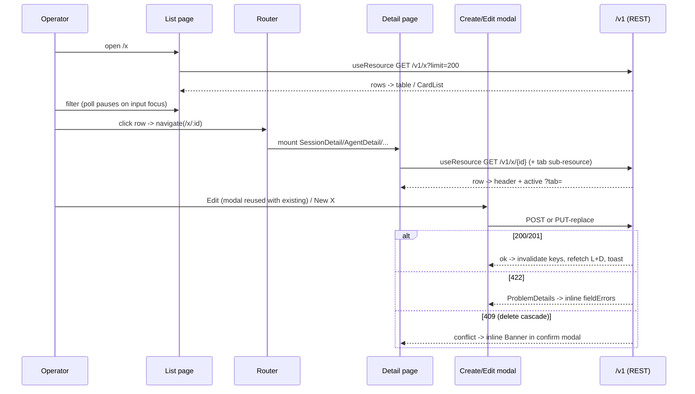

# UI Pages

## 1. Purpose

This doc covers the per-page layer of the operator console: the page components under `ui/components/` that compose the shared foundation primitives into the routed surfaces an operator actually navigates to. It owns the repeating page shapes (the list-bar plus detail-tabs structure on CRUD entities, the find-bar plus table plus create-modal triad, the detail-page tab convention), the loader/error/empty/confirmation conventions every page reuses, and a page-by-page index naming each route, its source file, and its primary REST dependency.

It deliberately does not re-document the primitives these pages build on. The HTTP client, the polled `useResource` cache, optimistic `useMutation`, the hash router, the toast queue, the tweaks store, the idle and viewport hooks, the chrome shell (topbar, sidebar, mobile nav, command palette), and the shared widgets (`Modal`, `Banner`, `Btn`, `Icon`, `StatusPill`, `CardList`, `Fab`, `BottomSheet`, `MobileTabs`) all live in [ui-foundation.md](ui-foundation.md). The pages here are consumers of that contract; the load-bearing rule from the foundation (pages route all I/O through the hook layer, never `apiFetch` directly) is assumed throughout.

The backend REST contract these pages consume (the `/v1/*` CRUD surface, the `make_crud_router` family, RFC 7807 ProblemDetails, the reserved-id and cascade-conflict semantics) is documented in [architecture/rest-api.md](../architecture/rest-api.md). Pages are the UI half of that contract; where a page surfaces a documented anomaly (T0025, T0379, T0711, and similar) the page-level affordance is described here and the backend cause in the relevant subsystem doc.

## 2. Conceptual model

The console is a flat catalogue of routed pages. `ui/app.jsx` reads the resolved path from `useRouter()`, derives a short page name in a single `path.startsWith(...)` match block (for example `/sessions/:id` to `session-detail`, `/providers/llm` to `llm`), and renders the matching `window.<Name>Page` or `window.<Name>Detail` component inside the chrome. Components attach themselves to `window` at module scope rather than being imported, because the bundle shares one global Babel scope; this is also why several pages prefix every top-level binding (workspaces uses `WS_`, triggers `TR_`, internal-collections `IC_`, agents `AG_`, graphs `GR_`, channels its own helpers) to avoid colliding with siblings in that scope.

Almost every entity surface follows one of two anatomies.

A list page is a find-bar (text filter plus entity-specific dropdowns or status chips), a desktop table (with a mobile `CardList` plus `Fab` fallback under `useViewport().isMobile`), and a create modal launched from a "New X" button. Filtering, sorting, and pagination are overwhelmingly client-side over a single `GET /v1/<plural>?limit=200` page; the poll pauses while the filter input is focused so typing is not interrupted.

A detail page is a header (breadcrumb, id, action buttons such as Edit / Delete / Invalidate / Back) over a tab strip whose active tab is carried in the URL as `?tab=` and read back through the router. The create modal is reused in edit mode: the same component takes an `existing` prop, locks the id (and often the type discriminator), pre-fills the form, blanks any masked-secret field so the redaction is never written back, and submits a `PUT`-replace instead of a `POST`.

```mermaid
graph TD
    subgraph ListPage["List page anatomy"]
        FB["find-bar: text filter + chips/selects"] --> TBL["table (desktop) / CardList+Fab (mobile)"]
        TBL -->|row click -> navigate(/x/:id)| DET
        FB -.->|New X button| CM["create modal"]
    end
    subgraph DetailPage["Detail page anatomy"]
        DET["header: crumb + id + Edit/Delete/Back"] --> TABS["tab strip (?tab= in URL)"]
        TABS --> T1["Overview/Config"]
        TABS --> T2["entity tabs (Tools/Sessions/Messages/State/Files/Turn log/...)"]
        DET -.->|Edit button| CM
        DET -.->|Delete button| CONF["confirm modal (+ inline 409 banner)"]
    end
    CM -.->|POST/PUT then invalidate| TBL
```

A handful of surfaces break the mould: the dashboard and health and workers pages are read-only metric boards, the graph detail page is a drag-and-drop canvas editor rather than a tab strip, the chat detail page is a live WebSocket conversation, the internal-collections page is a three-state activation machine, and the docs page is a markdown reader. These are noted individually in the page index.

## 3. Architecture patterns implemented

- **Every page builds on the foundation hook layer, never on raw fetch.** List polls, detail polls, modal submits, and confirmation deletes all go through `useResource` and `useMutation` on `window.primerApi`; cache keys are page-scoped strings (`sessions:list`, `session-detail:{sid}`, `graph-status:{id}`, `workspace-files:{wid}:{path}`, and so on) so a mutation on one surface can invalidate exactly the keys that need refetching. See [ui-foundation.md](ui-foundation.md) for the hook contracts and cache-key conventions.

- **List-bar plus detail-tabs is the default CRUD shape.** A `GET /v1/<plural>?limit=200` list with client-side filter/sort/paginate, a row-click navigation to `/<plural>/:id`, and a tabbed detail page whose tab lives in `?tab=`. Agents, toolsets, providers, semantic-search, channels, triggers, workspaces, collections, and graphs all instantiate this shape with entity-specific tabs.

- **Find-bar plus table plus create-modal triad.** The list bar exposes a text filter plus dropdowns or status chips; the create modal doubles as the edit modal via an `existing` prop and a `POST`-versus-`PUT`-replace switch. `PUT`-replace is the wire shape because the backend `make_crud_router` is full-replace, not PATCH.

- **Reuse-create-modal-for-edit with secret blanking.** Providers, channel-providers, semantic-search, and toolsets all pre-fill the create modal on edit, lock the id and type discriminator, and blank any field still holding the `**********` redaction so the stored secret survives. This mirrors the backend `SecretStr`-on-read masking documented in [architecture/rest-api.md](../architecture/rest-api.md).

- **Optimistic-write only for reversible edits; wait-for-200 for destructive or cascading mutations.** Description / metadata / config edits use the optimistic `useMutation` path; graph `PUT`-replace, workspace destroy, provider invalidate, and any delete wait for the response before refetching. The rationale lives in [ui-foundation.md](ui-foundation.md).

- **Anomaly surfaces are rendered in place, not hidden.** Documented backend quirks get a labelled banner or helper line on the owning page: T0025 model-list-is-static helper text in the provider and collection modals, T0379 provider/config-not-cross-validated warning, T0711 MCP-HTTP 500 banner on the toolsets and agents Tools tabs, T0245/U0014 stdio-allowlist warning in the toolset modal. The backend cause is documented in the matching subsystem doc; the affordance is documented here.

- **Inline-for-input-validation, toast-for-action-outcome.** 422 ProblemDetails responses map `extensions.errors[].loc` to per-field inline errors in modals; non-422 failures and success acknowledgements go through the toast queue. Yielding-tool inputs (AskUser) render their 422/500 inline under the input rather than as a toast.

## 4. Code layout

All page components live under `ui/components/` as self-invoking `<script type="text/babel">` files that attach `window.<Name>Page` / `window.<Name>Detail` globals; `ui/app.jsx` dispatches to them. The workspaces sub-tree (`ui/components/workspaces/`) holds the providers, templates, and shared form-helper files. Page-by-page index (route, source file, primary REST data dependency) follows.

| Route (hash) | Page component | Source file | Primary REST dependency |
| --- | --- | --- | --- |
| `/` | DashboardPage | `dashboard.jsx` | `GET /v1/sessions`, `/v1/workers`, `POST /v1/sessions/find`, `/v1/internal_collections/config` |
| `/sessions` | SessionsListPage | `sessions-list.jsx` | `GET /v1/sessions?limit=200` |
| `/sessions/:id` | SessionDetailPage | `session-detail.jsx` | `GET /v1/sessions/{id}`, `.../turn_log`, workspace-scoped signal POSTs, session WS |
| `/workspaces` | WorkspacesListPage | `workspaces.jsx` | `GET /v1/workspaces?limit=200` |
| `/workspaces/:id[/:tab]` | WorkspaceDetailPage | `workspaces.jsx` | `GET /v1/workspaces/{id}` + files/log/sessions/channels sub-resources |
| `/workspaces/providers[/:id]` | WorkspaceProvidersListPage / Detail | `workspaces/providers.jsx` | `GET /v1/workspace_providers?limit=200` |
| `/workspaces/templates[/:id]` | WorkspaceTemplatesListPage / Detail | `workspaces/templates.jsx` | `GET /v1/workspace_templates?limit=200` |
| `/agents[/:id]` | AgentsListPage / AgentDetailPage | `agents.jsx` | `GET /v1/agents`, `/v1/agents/{id}/status`, `/v1/tools` |
| `/graphs[/:id]` | GraphsListPage / GraphDetailPage | `graphs.jsx` | `GET /v1/graphs`, `/v1/graphs/{id}/status`, `PUT /v1/graphs/{id}` |
| `/knowledge/collections[/:id]` | CollectionsListPage / Detail | `knowledge.jsx` | `GET /v1/collections`, `/collections/{id}/documents`, `/collections/{id}/search` |
| `/knowledge/documents[/:id]` | DocumentsListPage / Detail | `knowledge.jsx` | `GET /v1/documents`, `POST /v1/documents/_convert_file` |
| `/knowledge/search` | SearchBenchPage | `knowledge.jsx` | `POST /v1/{agents,graphs,tools}/search`, `/v1/internal_collections/config` |
| `/toolsets[/:id]` | ToolsetsListPage / ToolsetDetailPage | `toolsets.jsx` | `GET /v1/tools`, `/v1/toolsets/{id}/tools`, `/v1/tool_approval_policies` |
| `/tools` | ToolsListPage | `toolsets.jsx` | `GET /v1/tools/catalogue`, `/v1/tool_approval_policies` |
| `/providers/llm[/:id]` | LlmProvidersListPage / Detail | `providers.jsx` | `GET /v1/llm_providers`, `.../{id}/models`, `POST .../_discover_models` |
| `/providers/embedding[/:id]` | EmbeddingProvidersListPage / Detail | `providers.jsx` | `GET /v1/embedding_providers` |
| `/providers/cross_encoder[/:id]` | CrossEncoderProvidersListPage / Detail | `providers.jsx` | `GET /v1/cross_encoder_providers` |
| `/ssp[/:id]` | SemanticSearchListPage / Detail | `semantic-search.jsx` | `GET /v1/ssp`, `POST /v1/ssp/{id}/invalidate`, `/v1/collections` |
| `/subsystems/internal-collections` | InternalCollectionsPage | `internal-collections.jsx` | `GET/PUT/DELETE /v1/internal_collections/config`, `/bootstrap[/status]` |
| `/chats[/:id]` | ChatsListPage / ChatDetailPage | `chats.jsx` | `GET /v1/chats`, `/chats/{id}/messages`, chat WS |
| `/channels/providers[/:id]` | ChannelProvidersPage / Detail | `channels.jsx` | `GET /v1/channel_providers` |
| `/channels/channels` | ChannelsListPage | `channels.jsx` | `GET /v1/channels` |
| `/channels/associations` | ChannelAssociationsPage | `channels.jsx` | `GET /v1/workspace_channel_associations` |
| `/approvals` | ApprovalsPage | `approvals.jsx` | `POST /v1/sessions/find`, `/v1/chats`, `.../tool_approval/pending`, `/v1/tool_approval_policies` |
| `/triggers[/:id]` | TriggersListPage / TriggerDetailPage | `triggers.jsx` | `GET /v1/triggers`, `.../subscriptions`, `POST .../fire_now` |
| `/harnesses[/:id]` | HarnessesPage | `harnesses.jsx` | `GET /v1/harnesses` (+ harness instance/outbound sub-forms) |
| `/web-search` | WebSearchPage | `web_search.jsx` | `GET /v1/web_search_providers`, `/v1/web_search_active_config` |
| `/settings/api-tokens` | ApiTokensPage | `api_tokens.jsx` | `GET/POST/DELETE /v1/auth/tokens` |
| `/settings/mcp` | McpPage | `mcp.jsx` | `GET/PUT /v1/mcp_exposure`, `/v1/mcp_exposure/available` |
| `/workers` | WorkersPage | `workers.jsx` | `GET /v1/workers`, `POST /v1/workers/{id}/drain` |
| `/health` | HealthPage | `health.jsx` | `GET /v1/health` |
| `/docs[/:section[/:slug]]` | DocsPage | `docs.jsx` | `GET /v1/user_docs/manifest`, `/v1/user_docs/{slug}` |

Supporting files not directly routed: `approvals.jsx` also exports the shared `ApprovalBanner` consumed by `session-detail.jsx` and `chats.jsx`; `workspaces/shared.jsx` exports the form-row and list-editor helpers (`WorkspacePairListEditor`, `WorkspaceEnvPairEditor`, `WorkspaceFileRowEditor`, and siblings) reused by the workspace, template, and provider modals; `auth.jsx`, `harness_form.jsx`, and `harness_outbound_builder.jsx` are mounted by the chrome or other pages rather than by a route. The full route-to-page-name table lives in `ui/foundation/router.js`; the path-to-page-name derivation that picks the `window.*` component lives in `ui/app.jsx`.

## 5. Data model

Not applicable as a server-persisted data model: pages own no durable server data of their own. The entity schemas they render (Agent, Graph, Collection, Toolset, the provider models, WorkspaceSession, Trigger, ApiToken, and so on) are owned by their backend subsystem docs. The only page-held state is ephemeral React state: the active filter/sort/page, the selected row, the open-modal draft and its `fieldErrors` map, and per-page UI-only data such as the graph editor's `x/y` node coordinates (stripped before `PUT`) and the chat detail's WebSocket frame log. Cache keys are page-scoped strings on the foundation `useResource` map, listed per page above; they are an index into the shared cache, not a data model.

## 6. Lifecycle

The dominant lifecycle is the CRUD-page round trip: the list bar mounts and its `useResource` poll loads the page of rows; the operator filters and clicks a row, which `navigate`s to the detail route; the detail page mounts, polls its own key, and renders the active `?tab=`; the operator opens the create/edit modal or a delete confirmation; on submit the `useMutation` fires the `POST`/`PUT`/`DELETE`, invalidates the relevant cache keys, and both surfaces refetch. Success pushes a toast; a 422 maps to inline field errors in the modal; a 409 cascade conflict renders inline inside the delete confirmation as a `Banner` so the operator can resolve the dependency.



Loader, empty, error, and confirmation conventions across pages: on first load a list shows a skeleton table (or simply renders zeros on metric boards); `loading=true` fires only on the first fetch for a key so background polls never flicker (a foundation guarantee). An empty result renders an entity-specific empty-state row or card with a "New X" call to action rather than a blank table. A fetch error retains the last good data (stale-while-error) and surfaces the error title; after three consecutive failures the poll halts until a manual Refresh. Destructive actions always go through a confirmation `Modal` whose body spells out consequences (in-flight counts, idempotency notes, the "second DELETE returns 404" caveat, the list of dependent rows for cascades) before the mutation fires.

A few pages run non-CRUD lifecycles. The session detail page reads the authoritative top-level `GET /v1/sessions/{id}` (never the nested workspace path, which is known to drift) and routes signals through the workspace-scoped POSTs; its five tabs are Overview, Messages, State, Files, and Turn log, and it additionally mounts a live WebSocket stream panel plus the yielding-tool panels (AskUser, WatchFiles, Sleep, ApprovalBanner) and the `TurnLogTab` whose endpoint resolver picks the session route for agent bindings and the graph-run route for graph bindings. The chat detail page replays the message tail over REST then opens a WebSocket and streams tokens, usage, compaction markers, and inline tool-approval cards. The internal-collections page derives one of three states (Inactive / Configured / Active) from a single config probe and drives a phase-aware bootstrap progress panel with adaptive 1s/5s polling. The graph detail page seeds an editable draft, auto-lays-out node coordinates, runs a client-side topology validator that gates Save, and issues a destructive `PUT`-replace.

## 7. Persistence

Pages persist nothing of their own to the server beyond the CRUD mutations enumerated above, and nothing to client storage. The small set of client-persisted preferences (theme, sidebar collapse state, the force-desktop opt-out) is owned by the foundation tweaks store and documented in [ui-foundation.md](ui-foundation.md). One historical client-persistence heuristic was deliberately removed: the internal-collections page once contemplated a `localStorage` "bootstrapped" flag, but the shipped page derives its state from the server-side `activated_at` field on the config row instead, so every client and operator sees the same truth. The `useResource` cache is in-memory and rebuilt from the API on every load.

## 8. Public surfaces

The public surface of this layer is the set of routed pages and the small number of cross-page exports. The routes and their components are the page-by-page index in section 4; the route table itself is `window.primerApi.routes` in `ui/foundation/router.js` and is mutable so sub-projects can append entries. Each page attaches `window.<Name>Page` and, for entities with a detail view, `window.<Name>Detail`; `ui/app.jsx` is the sole dispatcher that maps a resolved path to one of those globals.

Cross-page exports that other pages depend on:

- `window.ApprovalBanner` (from `approvals.jsx`) is embedded by `session-detail.jsx` and `chats.jsx`; all three poll the same `tool-approval:{session|chat}:{id}` cache key, so a respond from any surface refetches the others.
- `window.AG_NewAgentModal` (from `agents.jsx`) is launched inline from the graph editor's new-graph dialog and per-node agent picker so an operator with no agents can create one without leaving the dialog.
- `window.WorkspaceTemplateCreateModal` (from `workspaces/templates.jsx`) is launched inline from the New-Workspace modal when no templates exist.
- The `workspaces/shared.jsx` form-helper widgets are exposed on `window.Workspace*` for reuse by the workspace, template, and provider modals.

Pages do not expose a programmatic API; navigation between them is always `window.primerApi.useRouter().navigate(path, query)`.

## 9. Internal contracts

- **Detail pages carry their active tab in `?tab=`, read back through the router.** This makes tab state linkable and survives reload. Session detail uses `overview/messages/state/turnlog`-style ids; agents use `config/tools/sessions/metadata`; toolsets use `config/tools/sessions`; semantic-search uses `overview/config/collections`; workspaces use `files/sessions/log/channels/config/destroy`.

- **The create modal is the edit modal.** A non-null `existing` prop switches the submit from `POST` to `PUT`-replace, locks the id and type discriminator, and blanks masked-secret fields so the redaction is never round-tripped. Any page that edits an entity follows this, which is why there is no separate edit form to keep in sync.

- **Cache keys are page-scoped and mutations invalidate by key.** List and detail of the same entity use distinct keys (`sessions:list` versus `session-detail:{sid}`) so their independent poll cadences do not stall each other and a mutation can target exactly one surface. Shared keys are used deliberately where two surfaces must stay in lockstep (the tool-approval pending key, the IC config key shared by the sidebar bell, the knowledge OFF banner, and the dashboard tile).

- **422 maps to inline field errors; the loc-to-field mapping must match the backend emission.** Modals read `extensions.errors[].loc`, join it, and key inline errors by that path. Some backends flatten a segment out of the loc tuple (channel-provider config emits `body.{field}` not `body.config.{field}` because the model validator pre-instantiates the inner config), so the matching modal looks up the flattened key. Tool-approval validation forces a `body.*` loc prefix specifically so the approvals modal lights up.

- **409 cascade conflicts render inline in the delete confirmation, never as a bare toast.** Toolset delete blocked by an approval policy, SSP or provider delete referenced by a collection, workspace or template delete referenced by a child, and channel-provider delete all surface the conflict detail in a `Banner` inside the confirm modal so the operator can act on it.

- **Managed rows hide mutation.** Any entity carrying a `harness_id` (agents, toolsets, collections, documents, graphs) renders a "managed by harness" banner and hides the Edit button, mirroring the backend's 409-on-public-CRUD discipline.

- **Session detail pins the authoritative read path.** It always reads top-level `GET /v1/sessions/{id}` (and polls it), never the nested `/v1/workspaces/{wid}/sessions/{sid}` path, which is known to drift after signals; signals themselves still go through the workspace-scoped POSTs.

- **Chat tool-approval is conversational, not a banner.** A chat that hits an approval gate ends its turn with a normal assistant message asking for a yes/no; the operator replies through the normal composer like any other message. There is no inline approval card and no chat `/tool_approval/{pending,respond}` endpoint or `tool_approval_decide` frame. (Session detail still uses the polled banner for sessions.)

## 10. Testing patterns

Per-page coverage is split between Python static-source assertions and gated browser end-to-end journeys. The Python `tests/ui/` suite asserts page invariants without a runtime: that a page opts into `useViewport` and emits its mobile `CardList`/`Fab`/stack class (`test_agents_mobile.py`, `test_sessions_list_mobile.py`, `test_workspaces_mobile.py`, `test_dashboard_mobile.py`, `test_health_mobile.py`, `test_workers_mobile.py`, and siblings), that the graph editor renders its branch/edge/per-kind fields (`test_graphs_*`), that anomaly helper text and tags appear in modals (`test_providers_create_anomaly_helpers.py`), and that the triggers and api-tokens pages render their expected dialogs. The `tests/ui_e2e/` suite (gated behind `PRIMER_RUN_UI_E2E=1`, with mobile suites driven at a 375x812 viewport) drives real Playwright journeys: session create-to-signal lifecycle, agent create happy-path, knowledge collection traversal, workspace file-download and destroy-cascade, channel onboarding and per-platform validation, chat inline-approval and resume, approvals policy modal, and the console-loads smoke test that parametrises over the chrome NAV inventory so any broken nav entry surfaces. Per-feature mutation tests follow the project smoke-test convention of exercising the page against a live `uv run primer api` instance. Backend route behaviour each page depends on is covered by the matching `tests/api/` files (for example `test_turn_log_routes.py`, `test_workers.py`, `test_builtin_toolsets_endpoint.py`).

## 11. Historical decisions

- **Session detail pins the top-level `GET /v1/sessions/{id}` read for both initial fetch and polling, never the nested workspace path.** Why: the nested path drifts after pause/resume/cancel/steer (pinned by T0399/T0555/T0611) and the top-level row is the only authoritative view. Spec: docs/superpowers/specs/2026-05-16-ui-sessions-design.md.

- **List and detail of the same entity use separate `useResource` cache keys with separate poll cadences.** Why: detail is the action surface and polls faster (2s) while the list is a directory view that polls slower (3s to 5s); separate keys keep one from stalling the other and let mutations invalidate either independently. Spec: docs/superpowers/specs/2026-05-16-ui-sessions-design.md.

- **The create modal doubles as the edit modal across every CRUD page, with id/type locked and a `POST`-versus-`PUT`-replace switch.** Why: it avoids duplicating the form schema and the 422 field-error mapping between create and edit, and `PUT`-replace matches the storage-level full-replace contract. Spec: docs/superpowers/specs/2026-05-16-ui-providers-design.md.

- **Edit mode blanks any field still holding the `**********` secret redaction before submit.** Why: round-tripping the literal asterisks would clobber the stored secret; blanking lets the backend keep the existing value when the operator leaves the field untouched. Spec: docs/superpowers/specs/2026-05-25-designer-handoff-ui-spec.md.

- **Documented backend anomalies are surfaced in place rather than hidden.** Why: operators need to see that the model list is static (T0025), that provider config is not cross-validated (T0379), that an MCP-HTTP toolset is leaking a 500 (T0711), and that the stdio allowlist gates at session-open (U0014), so each gets a labelled banner or helper line on the owning page. Spec: docs/superpowers/specs/2026-05-16-ui-toolsets-design.md.

- **The toolsets page is a single unified list of built-in plus user toolsets rather than two sub-views.** Why: operators want one place to see every tool source with its availability state, and a single `/v1/tools` fan-out powers it without maintaining two pagination paths and two empty states. Spec: docs/superpowers/specs/2026-05-16-ui-toolsets-design.md.

- **The graph detail page is a full per-node editor whose Save issues a destructive `PUT`-replace, gated on a client-side topology validator.** Why: graph topology mutations cross-cut nodes, edges, entry, and max-iterations, so a partial update would need an unresolved server-side merge; full replace keeps the server validator the single arbiter, and the local checker mirrors its rules so the operator gets immediate feedback instead of a 422 round trip. Spec: docs/superpowers/specs/2026-05-16-ui-graphs-design.md.

- **A single `TurnLogTab` in `session-detail.jsx` serves both agent and graph runs, with a scope dropdown for per-node graph logs.** Why: graph runs are surfaced through the same session-detail page via the binding discriminator, so a separate turn-log surface on the graphs page would have duplicated the row renderer and polling logic; an endpoint resolver picks the right REST route from the binding. Spec: docs/superpowers/specs/2026-06-05-per-session-turn-log-design.md.

- **The internal-collections page derives its three-state machine from the server-side `activated_at` field, not a `localStorage` flag.** Why: a client-local flag would lie across browsers, clears, and multiple operators, while `activated_at` matches the backend's own truth source for whether the `/search` routes will 503. Spec: docs/superpowers/specs/2026-05-16-ui-internal-collections-design.md.

- **The Approvals "Pending" panel aggregates parked sessions and chats client-side instead of using a dedicated endpoint, and the inline approval card polls rather than listening for WS broadcasts.** Why: there is no aggregate `/tool_approvals/pending` route and the chat WebSocket never emits proactive pending/resolved frames, so the UI fans out `sessions/find` plus the chats list and polls each row's pending endpoint, sharing one cache key across the Approvals page and the session/chat banners. Spec: docs/superpowers/specs/2026-05-24-tool-approval-system-design.md.

- **Channel-provider config 422 errors are looked up by `body.{field}`, not `body.config.{field}`.** Why: the backend coerces the inner config in a `model_validator(mode='before')` that drops the `config` segment from the loc tuple, so the modal must match the flattened emission. Spec: docs/superpowers/specs/2026-05-25-designer-handoff-ui-spec.md.

- **The minted plaintext API token is shown exactly once in a dedicated one-time dialog with a deliberate "I have saved it" close.** Why: the plaintext is the only secret (the backend stores a sha256 hash) and surfacing it only at `POST` with a forced copy step keeps the hash-only design intact. Spec: docs/superpowers/specs/2026-06-02-api-tokens-bearer-auth-design.md.

- **AskUser input errors render inline under the input while action outcomes use toasts.** Why: input validation belongs next to the field the operator is editing, whereas an action's success or failure is a transient acknowledgement; the WatchFiles/Sleep cancels and the SSP create/delete use the inverse split deliberately. Spec: docs/superpowers/specs/2026-05-24-ui-semantic-search-and-yielding-tools-design.md.

- **The web-search and MCP-server pages reuse the list-bar plus stacked-panel shape with a reserved built-in row rendered inert.** Why: the bootstrapped DuckDuckGo web-search row and the MCP exposure singleton are server-owned, so they render with a built-in badge and no Edit/Delete affordance rather than being hidden. Spec: docs/superpowers/specs/2026-06-03-web-search-providers-design.md.
