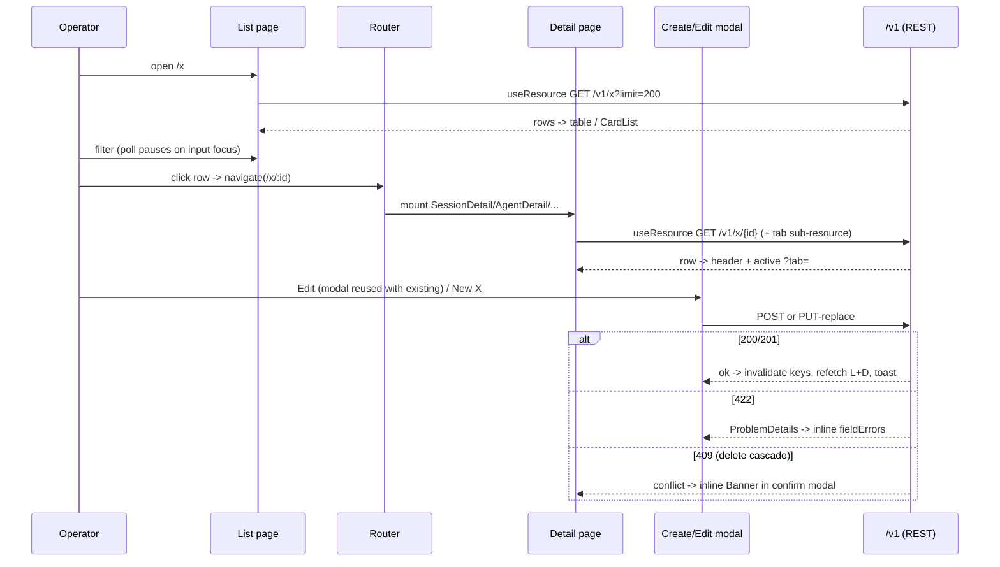

# UI Pages

## 1. Purpose

This doc covers the operator console: the pure shell modules under `ui/foundation/shell-*.js`, the three-view console under `ui/components/console/nv-*.jsx` (plus the two `ui/components/shell/` survivors, `sh-api.jsx` and `sh-activity.jsx`), and the page components under `ui/components/` that it hosts. The console IS the studio. There is no page router, no sidebar and no per-page chrome: one workspace-scoped surface, whose navigation is a verb registry, whose documents are deep-linkable tabs, and whose management surfaces are overlays re-hosting the page components unchanged.

It owns the shell's own model (the URL grammar, the tab semantics, the verb registry, the dual-render rule) and the repeating page shapes those overlays still use: the list-bar plus detail-tabs structure on CRUD entities, the find-bar plus table plus create-modal triad, and the loader/error/empty/confirmation conventions every page reuses.

It deliberately does not re-document the primitives these surfaces build on. The HTTP client, the polled `useResource` cache, optimistic `useMutation`, the router shim, the toast queue, the tweaks store, the idle and viewport hooks, and the shared widgets (`Modal`, `Banner`, `Btn`, `Icon`, `StatusPill`, `CardList`, `Fab`, `BottomSheet`, `MobileTabs`) all live in [ui-foundation.md](ui-foundation.md). The load-bearing rule from the foundation (route all I/O through the hook layer, never `apiFetch` directly) is assumed throughout.

The backend REST contract these pages consume (the `/v1/*` CRUD surface, the `make_crud_router` family, RFC 7807 ProblemDetails, the reserved-id and cascade-conflict semantics) is documented in [architecture/rest-api.md](../architecture/rest-api.md). Pages are the UI half of that contract; where a page surfaces a documented anomaly (T0025, T0379, T0711, and similar) the page-level affordance is described here and the backend cause in the relevant subsystem doc.

## 2. Conceptual model

The console is three views over one URL (the 2026-08-23 designer handoff): STUDIO (the default - a rail of session bands and files, a centre of document tabs, the composer, an optional terminal panel and events sidebar), PLATFORM (grouped nav over per-entity card pages), and SYSTEM (dashboard, users, API keys, SSO, MCP, internal collections, activity, setup, profile - reached from the profile menu). Overlays open above whichever view is active, and a command palette reaches every verb. `ui/app.jsx` is one mount, `AuthGate` wrapping `NV_Shell`, and nothing else.

**The verb registry is the routing table.** Every action a user can take is registered once, with an id, a label, the contexts it applies to and the surfaces it renders on (rail, tab menu, palette, overlay button). A surface renders the verbs the registry gives it rather than hard-coding buttons, which is what makes the dual-render rule checkable: a verb declared for a surface but never rendered from the registry, or a doc kind the URL can address that no verb opens, is an orphan, and a static guard fails on it.

**A document is a tab, and a tab is addressable.** Sessions, files, diffs and wiki pages are the four doc kinds (the trace opens as a split INSIDE the session doc; attention lives in the bands and the System dashboard). Tabs follow VS Code semantics: a preview tab is replaced by the next preview and is promoted to permanent by an edit or a pin, so browsing a file tree does not accumulate tabs.

**A management surface is an overlay, not a page.** The catalogue, agents, graphs, collections, toolsets, workers and the rest re-host their existing page components with no chrome around them. Comparison never goes in an overlay: a trace opens beside its transcript as a tab in a second group, because an overlay cannot be looked at next to anything.

Components attach themselves to `window` at module scope rather than being imported, because the bundle shares one global Babel scope; this is also why several pages prefix every top-level binding (workspaces uses `WS_`, triggers `TR_`, internal-collections `IC_`, agents `AG_`, graphs `GR_`, channels its own helpers) to avoid colliding with siblings in that scope.

The page anatomies below still hold, because the overlays host those same components.

Almost every entity surface follows one of two anatomies.

A list page is a find-bar (text filter plus entity-specific dropdowns or status chips), a desktop table (with a mobile `CardList` plus `Fab` fallback under `useViewport().isMobile`), and a create modal launched from a "New X" button. Filtering, sorting, and pagination are overwhelmingly client-side over a single `GET /v1/<plural>?limit=200` page; the poll pauses while the filter input is focused so typing is not interrupted.

A detail page is a header (breadcrumb, id, action buttons such as Edit / Delete / Invalidate / Back) over a tab strip whose active tab is carried in the URL as `?tab=` and read back through the router. The create modal is reused in edit mode: the same component takes an `existing` prop, locks the id (and often the type discriminator), pre-fills the form, blanks any masked-secret field so the redaction is never written back, and submits a `PUT`-replace instead of a `POST`.

```mermaid
graph TD
    subgraph ListPage["List page anatomy"]
        FB["find-bar: text filter + chips/selects"] --> TBL["table (desktop) / CardList+Fab (mobile)"]
        TBL -->|row click -> navigate(/x/:id)| DET
        FB -.->|New X button| CM["create modal"]
    end
    subgraph DetailPage["Detail page anatomy"]
        DET["header: crumb + id + Edit/Delete/Back"] --> TABS["tab strip (?tab= in URL)"]
        TABS --> T1["Overview/Config"]
        TABS --> T2["entity tabs (Tools/Sessions/Messages/State/Files/Turn log/...)"]
        DET -.->|Edit button| CM
        DET -.->|Delete button| CONF["confirm modal (+ inline 409 banner)"]
    end
    CM -.->|POST/PUT then invalidate| TBL
```

A handful of surfaces break the mould: the dashboard and health and workers pages are read-only metric boards, the graph detail page is a drag-and-drop canvas editor rather than a tab strip, the internal-collections page is a three-state activation machine, and the docs page is a markdown reader. These are noted individually in the page index.

## 3. Architecture patterns implemented

- **The URL is the state.** Four facts are addressable and nothing else is: the workspace, the open document, the open overlay, and an anchor within the document. Palette state, toasts and every other transient are deliberately not representable, so a pasted link restores exactly what the sender was looking at and nothing they were not.

- **Registry-rendered surfaces, checked by the dual-render rule.** Verbs are registered once and each surface renders what the registry hands it. Two static guards enforce the consequences: every declared surface must actually render from the registry, and every addressable doc kind and overlay must be reachable by some verb. An address no verb reaches is a surface the user cannot find; a verb no surface renders is a promise the console does not keep.

- **Overlays re-host page components with no chrome and props only.** An overlay mount passes the component its own props and nothing else. Where a re-hosted page still calls `window.primerApi.useRouter()`, the shim answers from overlay state; see [ui-foundation.md](ui-foundation.md).

- **Every page builds on the foundation hook layer, never on raw fetch.** List polls, detail polls, modal submits, and confirmation deletes all go through `useResource` and `useMutation` on `window.primerApi`; cache keys are page-scoped strings (`sessions:list`, `session-detail:{sid}`, `graph-status:{id}`, `workspace-files:{wid}:{path}`, and so on) so a mutation on one surface can invalidate exactly the keys that need refetching. See [ui-foundation.md](ui-foundation.md) for the hook contracts and cache-key conventions.

- **List-bar plus detail-tabs is the default CRUD shape.** A `GET /v1/<plural>?limit=200` list with client-side filter/sort/paginate, a row-click navigation to `/<plural>/:id`, and a tabbed detail page whose tab lives in `?tab=`. Agents, toolsets, providers, semantic-search, channels, triggers, workspaces, collections, and graphs all instantiate this shape with entity-specific tabs.

- **Find-bar plus table plus create-modal triad.** The list bar exposes a text filter plus dropdowns or status chips; the create modal doubles as the edit modal via an `existing` prop and a `POST`-versus-`PUT`-replace switch. `PUT`-replace is the wire shape because the backend `make_crud_router` is full-replace, not PATCH.

- **Reuse-create-modal-for-edit with secret blanking.** Providers, channel-providers, semantic-search, and toolsets all pre-fill the create modal on edit, lock the id and type discriminator, and blank any field still holding the `**********` redaction so the stored secret survives. This mirrors the backend `SecretStr`-on-read masking documented in [architecture/rest-api.md](../architecture/rest-api.md).

- **Optimistic-write only for reversible edits; wait-for-200 for destructive or cascading mutations.** Description / metadata / config edits use the optimistic `useMutation` path; graph `PUT`-replace, workspace destroy, provider invalidate, and any delete wait for the response before refetching. The rationale lives in [ui-foundation.md](ui-foundation.md).

- **Anomaly surfaces are rendered in place, not hidden.** Documented backend quirks get a labelled banner or helper line on the owning page: T0025 model-list-is-static helper text in the embedding/cross-encoder provider and collection modals (the LLM provider form has no model list at all now -- see below), T0379 provider/config-not-cross-validated warning, T0711 MCP-HTTP 500 banner on the toolsets and agents Tools tabs, T0245/U0014 stdio-allowlist warning in the toolset modal. The backend cause is documented in the matching subsystem doc; the affordance is documented here.

- **Inline-for-input-validation, toast-for-action-outcome.** 422 ProblemDetails responses map `extensions.errors[].loc` to per-field inline errors in modals; non-422 failures and success acknowledgements go through the toast queue. Yielding-tool inputs (AskUser) render their 422/500 inline under the input rather than as a toast.

## 4. Code layout

The shell is split by testability. Pure logic lives in `ui/foundation/shell-*.js` as plain functions with no React and no DOM, so `tests/ui` can execute it in MiniRacer:

- `shell-url.js` - the URL grammar: `SH_parseUrl` / `SH_buildUrl`, `SH_DOC_KINDS`, `SH_OVERLAYS`, anchor parsing.
- `shell-verbs.js` - the verb registry, label lint and ranking.
- `shell-docs.js` - the tab model: open, pin, preview promotion, groups.
- `shell-status.js`, `shell-turns.js` - the status line and the transcript's turn folding.
- `shell-attention.js` - pending yields and approval records to attention items, tiered by consequence.
- `shell-router-shim.js` - `useRouter` over overlay state (see [ui-foundation.md](ui-foundation.md)).

The React surfaces live in `ui/components/console/nv-*.jsx` (the three-view flag day deleted the `sh-*` shell): `nv-shell.jsx` (the root: URL sync, the verb registry and chord dispatcher, the toast and confirm hosts), `nv-chrome.jsx` (activity bar + topbar: workspace menu with settings, search field, panel toggles, profile menu), `nv-palette.jsx`, `nv-studio.jsx` (the studio frame and the pure band sort), `nv-sessions-sidebar.jsx` and `nv-files-sidebar.jsx`, `nv-doc-host.jsx`, `nv-session-doc.jsx` (transcript, binding chip, decision/ask cards, inline artifacts, trace split, composer, voice), `nv-file-docs.jsx`, `nv-terminal.jsx`, `nv-events-sidebar.jsx`, `nv-client-tools.jsx`, `nv-overlays.jsx` (the designer create panels plus the management-surface mount table), `nv-platform.jsx` and `nv-system.jsx`. Two shell-directory files survive: `sh-activity.jsx` (the events console the System view re-hosts) and **`sh-api.jsx`, the only file that names a URL**, so the endpoints the console depends on are enumerable in one place.

**The console has landmarks, a page heading and live regions.** On desktop the activity bar is `role="navigation"` named "Views", the topbar `role="banner"`, the rail `role="navigation"` named "Sessions and workspaces", the Files panel `role="complementary"` named "Files", and the shown view (`.nv-view`) is the one `role="main"`, headed by a visually hidden `h1.nv-sr-only` ("Studio", "Platform" or "System settings"; the overlays and pages keep their own `h1.page-title`). On a phone `.nv-mobile-shell` is the `main` landmark. The toast host draws two sibling live regions inside a stack that is not one itself (`nv-toasts-status`, polite `role="status"`, and `nv-toasts-alert`, assertive `role="alert"` for error toasts; an alert nested in a status region is announced twice by some screen readers). Because they are two regions, toasts of the two kinds are not interleaved in arrival order: within each region they are in arrival order, and the polite region is drawn above the assertive one. In the session document only the WORDS of the running status strip are a live region (`nv-status-live`, `role="status"`; `SH_statusWords`), the elapsed time beside it (`nv-status-clock`) is not, because a status region is atomic and the clock ticks every second; the reconnect note is `role="status"`. A pending approval card (`NV_DecisionCard`, prop `live`) and a failed turn's error card are `role="alert"` only when they ARRIVE while the document is open: `NV_useFirstLoadKeys` freezes the keys the first load of the history and of the pending gates brought (those are history and stay quiet, so opening a session with three past failures fires no announcement), and a card on a session that is over is never an alert (`ended`). The composer's accessible name is its current hint (`composerHint`: "Message <agent>...", "Steer mid-run ...", "Send to reopen this session..."), the same string as its placeholder, which changes with state and is not a name on its own, and the Platform list filters are named "Filter <page>". The streamed reply itself is not announced token by token; the status strip and the settled records are.

**The session state chip says Ready for a session that merely rests.** The served `session_state` is coarse on purpose: `parked` covers every WAITING or PAUSED row that has completed a turn (`WorkspaceSession.session_state`), so labelling it by that word alone told the operator that every session that had simply answered was blocked. The header chip (`NV_SessionStateChip` in `nv-session-doc.jsx`) keeps `data-state` as served (the e2e journeys and tools read it) and decides the label from what the row stores, in `NV_sessionStateChipView`: a `parked_status` is a real park (an approval, an answer or a timer) and reads amber `Parked`, `status: paused` is the operator's pause and reads `Paused`, and any other row that rests reads `Ready` with `data-resting="true"`, drawn neutral. The richer per-reason wording ("Waiting on approval") is `describeSessionState` in `session-state.jsx`.

**A worker that has not reported its load is unknown, not idle.** `GET /v1/workers` rows and `/v1/health` serve `in_flight: null` for a worker from before load reporting, or one that has not yet sent a heartbeat with a load (#484). The Workers page (`workers.jsx`) keeps the null: a row reads "? / 3" and its bar is drawn dashed and empty with the title "Load not reported", the detail panel says "load not reported", the drain dialog says "its in-flight sessions" instead of a count (`WK_inFlightText`), and the "Running now" tile (`WK_fleetLoad`) sums only what was reported and reads "? / <slots>" with "1 worker not reporting its load" or "N workers not reporting their load" (`WK_unreportedText`) while any worker that can run something has not reported (dead workers are tombstones and count for nothing either way). The legacy health page charts nothing and prints "n/a" for an unreported total. The system dashboard already printed "n/a". Before this the page turned the missing number into 0, so an overloaded fleet of old workers read as idle.

**Stop is acknowledged.** `POST .../interrupt` returns before the turn has stopped, so the session document shows a "stopping" state until it has: `SH_isStopping(session)` (`ui/foundation/shell-status.js`) is true while the served `interrupt_requested` flag is set on a live session (the worker clears it when the Stop lands), and it is OR-ed with `stopPending`, the click's own state, so the button disables the instant it is pressed. While stopping, the composer's Stop and the status strip's interrupt button are disabled ("Stopping..."), and the strip says `stopping` (or `stopping: ending <tool>`: a Stop cancels a running tool, except one that must not be cancelled, such as a file write, which it waits for a few seconds, and the strip cannot tell which; `SH_stoppingLine`). Every entry point (the buttons, the `session.interrupt` palette verb, the rail's session menu) goes through `NV_doInterrupt`, which shares the pending request when pressed twice and toasts what actually happened: "Stopping the turn" only when the returned row carries `interrupt_requested: true`; "Nothing to stop: no turn is running" when the server answered 200 as a no-op (it does so on every row that is neither running nor parked: idle, waiting, paused, a turn that just finished), which also clears the click's pending state at once; and an ERROR toast with the request id on a failure. Every entry point is also gated on `SH_canStop(session)` (the server's own condition: a RUNNING row that is not parked): the composer's Stop and the strip's interrupt button render only for such a turn (or while one is stopping), the rail's session menu offers Interrupt only for it, and the `session.interrupt` verb is registered with an `available(ctx)` predicate that the palette's ranker applies to the focused session's row (`NV_focusedSessionRow`; the verb registry keeps `available` on its explicit whitelist, as it does `requiresLive`, which nothing evaluates yet). A Stop's `cancelled` record reads "stopped" in the transcript and a Cancel's reads "cancelled" (`SH_lifecycleLabel`). A pending click clears itself after 5 seconds if the served flag never appears, and the client's pending leg obeys the same parked/ended exclusions as the served flag (`stopPending && SH_canStop(session)`), so a parked row never reads "stopping". A PARKED session is never "stopping": no turn is running while it waits and the server refuses a Stop on it with 409, so the rail's session menu does not offer Interrupt for it, and a Stop that is refused anyway (from the palette verb, or a race) shows the server's reason in the failure toast and clears the click's pending state.

**End, Park and Delete are reachable from every menu a session has, and each says what happened.** `NV_doPark`, `NV_doEnd` and `NV_doDelete` (`nv-session-doc.jsx`, exported on `window` for the rail) back the rail's right-click menu, the session header's overflow menu (the only menu a phone has) and the palette verbs `Park Session` (alias Pause) and `End Session` (alias Close; it was "Close Session" and has always been the hard cancel, never a tab close). Park is the pause route and asks nothing, since sending a message resumes the session; End asks first, naming the action on the button, because it cancels a running turn, and says a message sent later reopens the session; Delete confirms with a Delete button. Each resolves `{ok}`, `{cancelled}` or `{failed}` and never rejects: a success toasts, and a failure is one error toast carrying the server's own reason and the request id (deleting a running session answers 409 and used to show nothing while the turn kept running; a failed End also re-reads the row so a stale chip catches up). Park is gated on one predicate, `NV_canPark` (not for an ended or an already paused session), in the rail row, the overflow row and the palette verb, and End is offered only while the session is live; the rail's Delete refreshes the list but does not close an open tab for the session (the overflow's does); the header's own rename failure is the same shared toast. The header's overflow menu hides Split Right at the phone breakpoint (a phone has one pane). `End` joined the verb allowlist in `shell-verbs.js`.

**An idle session document polls slowly; anything in flight polls fast.** One open session that was doing nothing made about 110 requests a minute (the session row every 2 s, the pending yields and the external-tool banner every 5 s, the session list and the Files tree every 5 s, the workspace list twice every 15 s). `NV_sessionIsCalm` (`nv-session-doc.jsx`) says when the live tap and the refetch on its frames carry every change, so the polls only catch up: the tap is connected, no live status is showing, no send or Stop is waiting for the row, and the row says `turn_status: idle` with no interrupt, pause or cancel requested. The session row, the pending yields and the banner (`pollMs` prop of `ExternalPendingBanner`) then poll every `NV_CALM_POLL_MS` (15 s) instead of 2 to 5 s. The state is reached only after the session has been at rest for `NV_CALM_AFTER_MS` (5 s), because a turn's last frame can arrive before the row shows where the session came to rest, and it is dropped the moment anything stirs; a tap frame (`yielded`, `resumed`, `done`) also refetches the row, so a slow poll never delays one. While a session is calm, a change to its row that sends no tap frame (a rename, or the session ended from another client) takes up to 15 s to show; a frame, a Stop or a send brings the fast cadence back at once. The Files tree polls every 15 s instead of 5 s while no session of its workspace is running (`NV_anySessionRunning` over the shared session list), and the rail, the shell and the Files sidebar read that list through one hook, `NV_useSessionList`, so they cannot disagree about its cadence. The session list itself stays at 5 s on purpose: a session created elsewhere emits no tap frame, so the poll is how it appears in the rail. The shell and the rail used to fetch `GET /v1/workspaces` under two cache keys; it is one (`nv-workspaces`). A hidden tab already stops polling (`use-resource.js`), and the global idle mode still skips every poll that has not opted out. A measured idle session document (30 s, steady state, `tests/ui_e2e/test_idle_session_polling_journey.py`) makes about 27 requests where it made about 55.

**The running strip is the tap's word, checked against the row.** The strip's live status (`thinking`, a tool name) is held by the session store (`ui/foundation/session-store.js`) and comes only from tap frames: a user message or a tool call sets it, a terminal record (`done`, `cancelled`, `error`) clears it. A lost or never-written terminal frame would therefore leave "running" and a Queue button for good, so the session document also reads the polled session row, which is the truth about whether a turn is executing: when the row is ended or serves `turn_status` `idle` for `NV_STALE_STATUS_MS` (4 s, at least two polls of the 2 s detail resource) while a live status is showing, `NV_rowContradictsStatus` marks it stale and `SS_expireStatus` drops it and the document re-reads the durable tail. The `sending` leg of a message in flight is never expired, and a status a newer frame replaced is left alone. A send that fails gives back the status it replaced; it no longer re-arms `thinking`.

**A workspace that cannot be read is said so, not drawn as an empty conversation.** The session document's history read (`GET /v1/sessions/{id}/messages`) answers a typed 503 `/errors/workspace-unreachable` when the session's workspace exists but its runtime does not answer (it used to answer an empty list, which looked like the history was gone). `NV_historyProblem(history.error)` turns that one type into a banner above the transcript (`nv-history-problem`, `role="alert"`: the workspace is unreachable, the conversation is not lost, check the workspace's status, with a "Try again" button that re-reads); the resource keeps polling, so the banner clears on its own once the workspace answers. Any other history failure keeps its old handling. A session whose workspace row is gone (deleted or lost) still reads as an empty log, because its row already says `workspace_lost`.

**The phone's More tab reaches what the desktop menus reach.** A platform section opened from the More tab, or by a pasted `?overlay=<section>` or `?view=platform:<section>` link, fills the screen with its Back button: `NV_MobileMore` hides the profile card, the settings rows and the health cards while `NV_MobilePlatform` reports a section open (before, the list started about 1300px down, below them), and a link to a whole section (no row id) is consumed as soon as the section opens so an early Back tap does not re-open it. The phone shell acts on a platform view when a fresh view object arrives (`goView` hands one over on every call, so running the same link again after Back opens the section again, and a link pasted into an open console arrives the same way as a `hashchange`), and then CONSUMES it: it calls `con.clearView()`, which drops the view from state and, as a replace with no history entry, from the URL. A hashchange or popstate re-parses the URL into a fresh view object too, and on a phone nothing else cleared `?view=platform:<section>`, so an Android back gesture used to re-open the section behind whatever the user had moved on to; with the link consumed there is nothing left to replay. The system view is the screen itself and is not consumed. The Settings rows (`NV_mobileSettingsRows`) are Providers (the existing providers overlay, a sheet on the phone) and, for any role but `restricted` as in the desktop profile menu, System settings, a full-screen takeover (`NV_MobileSystemScreen`, also reached by a `?view=system:<page>` link) that hosts the desktop System pages with the nav as a row of chips; Log out sits in the profile card. The System pages are the desktop ones hosted as they are: a read-mostly phone layout for each is separate work. History on a phone, derived from the code and not tried on a device: the palette's Platform verb calls `goView`, which pushes an entry, and the shell then consumes the view (`clearView`, a replace), so that entry's URL is the plain workspace URL and an Android back gesture from an open section pops to an identical entry and appears to do nothing (the section's own Back button is the way out); a `?view=system:<page>` link is NOT consumed because the screen is the view, so its entry keeps the URL and Back pops it and closes the system screen back to the tabs.

**A failed session says why, and a failed turn is one card.** The end divider (`session ended . <reason>`) gets a note under it from `NV_endedLine` (`nv-session-doc.jsx`): for a failed session the reason in user language and the next step (`ended_detail` `never_started` reads "It never started: the workspace or the agent could not be prepared."; a code the table does not know is shown rather than hidden; the snake_case codes a failed model call carries, `server_error`, `network_error`, `rate_limit`, `auth_error`, `stream_timeout`, `generation_timeout`, `context_overflow_unrecoverable`, `bad_request` and `connect_timeout`, read from one table, `NV_failureWords`, as a plain clause plus a next step specific to that failure), the same for workspace lost and the tool-turn cap, and nothing for the quiet endings (completed, cancelled, deleted). A failed stream writes its error with the cause and then a bare terminal marker (`{reason, terminal}`); `SA_toTranscript` (`session-adapter.jsx`) folds that marker into the cause written earlier in the same turn (a turn is what lies between two user messages), while a marker with no cause in its turn stays so the failure is never invisible. A model that dies mid-answer writes the stream's own Error row and then dispatch's ERROR record with the same message; the later copy from the same node is folded into the first, which carries the specific code. The same rule can fold a crash or reclaim marker into the retried attempt's failure when both carry the same words in one turn; that is accepted, since they say the same thing. The fold leans on the writers' order (the cause is written before its copies and its marker): a copy written before its cause would be the row kept, a marker that came first is removed when the cause arrives, and a row without a node id matches a cause of any node, so two graph nodes failing with the same words stay two cards only when both rows name their node. Parent and subagent failures never fold into each other (`SA_failureScope`: a delegated record carries `delegated` and `delegate_run_id`, or `delegate_tool_call_id` before runs had ids), because a subagent's row is drawn inside its own block and a parent turn that hit the same provider error would otherwise have no card of its own at the top level; a bare marker belongs to the scope that wrote it. A non-fatal error (`fatal: false`, a retry notice) is an error row like any other: it is drawn, and a later fatal row with the same words folds into it, so the one card can carry `fatal: false`. `NV_errorView` states the problem type, or the stream's snake_case code, in words ("The model provider had a server error.") and keeps the provider's own text below it as detail; a fatal stream error with no code at all reads "The model stopped answering part-way through." The header's context meter exists only when there is usage to show and is labelled for assistive tech, and on the mobile session screen the header title is hidden because the screen's top bar already names the session, and the header's overflow menu offers Rename so a phone keeps what click-to-rename gave the desktop.

**A workspace that does not exist says so.** `#/w/<wid>` for a workspace that is not there (deleted, or a mistyped id) used to leave a half-working Studio: the Files sidebar headed `FILES <wid>` and saying "This workspace has no files yet" although its request was a 404, the previous page's session tab kept (reconnecting, red), and seven 404s with nothing naming the cause. `NV_Studio` (`nv-studio.jsx`) now reads the workspace's OWN row (`SH_api.workspace`, cached by id, no poll; no key and so no request without a workspace id) and treats a 404 on it (`NV_isWorkspaceGone`, the status alone: a blip, a refusal or a 5xx is not "gone") as a state of its own: the center shows `NV_WorkspaceGone` ("Workspace '<wid>' was not found", a polite `role="status"`, and up to eight buttons to real workspaces that run `workspace.switch`) in place of the tab groups, and the Files sidebar and the terminal are not mounted, so what polled the missing workspace is gone. The list `GET /v1/workspaces` is deliberately not used for the decision: it is capped at 200 and polled every 15 s, so a workspace created a moment ago would flash as missing. The first render still asks optimistically (a valid link is the common case, so nothing waits on the row); the 404s of that first burst are not suppressed. The phone's Files tab (`NV_MobileFiles`) does the same with the same card; its Inbox and Spaces tabs are not workspace-scoped and are untouched. The rail keeps listing the real workspaces. A link to a missing SESSION is the neighbouring state above.

All page components live under `ui/components/` as self-invoking `<script type="text/babel">` files that attach `window.<Name>Page` / `window.<Name>Detail` globals; the overlay host mounts them. The workspaces sub-tree (`ui/components/workspaces/`) holds the providers, templates, and shared form-helper files.

Three provider files are MOUNTED, not routed. `provider-form.jsx` is the one parameterized provider form: it renders whatever the class's own `_types` endpoint describes, so no field table lives in the console. `provider-aggregated-editor.jsx` is mounted by that form for the aggregated LLM variant, whose ordered member picker a flat field list cannot express. `model-profiles.jsx` now ships only `MP_ProfileModal`, which the catalog's profiles panel opens; its standalone page folded into the catalog.

**Files > History reads `commits`.** `GET /v1/workspaces/{wid}/log` answers `{"commits": [...]}`, not the `{"items": [...]}` list envelope the other routes use. Both Files sidebars (`nv-files-sidebar.jsx` and the mobile Files tab in `nv-mobile-shell.jsx`) take their rows through `SH_api.commitRows(body)` (`ui/components/shell/sh-api.jsx`), so the key is named in one place; reading `items` made History say "No turn commits yet." for every workspace. `tests/ui/test_files_history_reads_the_log_shape.py` feeds the real response shape through the real module, and an items-shaped body is deliberately not a commit log.

Page-by-page index follows. The first column is the overlay target that reaches each surface, in the `<name>[:<section>[:<id>]]` form the URL takes.

| Overlay target | Page component | Source file | Primary REST dependency |
| --- | --- | --- | --- |
| `workspaces` | WorkspacesPage | `workspaces.jsx` | `GET /v1/workspaces?limit=200` |
| `workspaces:detail:<wid>` | WorkspaceDetail | `workspaces.jsx` | `GET /v1/workspaces/{id}` + files/log/sessions/channels sub-resources |
| `workspaces:templates` | WorkspaceTemplatesPage | `workspaces/templates.jsx` | `GET /v1/workspace_templates` |
| `agents[::<id>]` | AgentsPage / AgentDetail | `agents.jsx` | `GET /v1/agents`, `/v1/agents/{id}` |
| `graphs[::<id>]` | GraphsPage / GraphDetail | `graphs.jsx` | `GET /v1/graphs`, `PUT /v1/graphs/{id}` |
| `collections` | CollectionsPage | `knowledge.jsx` | `GET /v1/collections`, `/collections/{id}/documents`, `/collections/{id}/search` |
| `toolsets[::<id>]` | ToolsetsPage / ToolsetDetail | `toolsets.jsx` | `GET /v1/tools`, `/v1/toolsets/{id}/tools`, `/v1/tool_approval_policies` |
| `tools` | ToolsPage | `toolsets.jsx` | `GET /v1/tools/catalogue`, `/v1/tool_approval_policies` |
| `providers[:<class>[:<id>]]` | ProviderCatalog | `provider-catalog.jsx` | `GET /v1/{llm,embedding,cross_encoder,stt,tts,web_search,web_fetch,artifact_storage}_providers`, each class's `_types`, `/v1/model_profiles`, `/v1/speech_active_config`, `/v1/web_search_active_config` |
| `providers:ssp` | SSPListPage | `semantic-search.jsx` | `GET /v1/ssp`, `POST /v1/ssp/{id}/invalidate`, `/v1/collections` |
| `providers:workspace` | WorkspaceProvidersPage | `workspaces/providers.jsx` | `GET /v1/workspace_providers` |
| `providers:channel` | ChannelProvidersPage | `channels.jsx` | `GET /v1/channel_providers` |
| `channels` | ChannelsPage | `channels.jsx` | `GET /v1/channels` |
| `channels:rules` | ChannelRulesPage | `channel_rules.jsx` | `GET` and `POST /v1/triggers` (the `POST` find-or-creates the room's channel trigger; the `GET` lists them with `?kind=channel`), `GET` and `POST /v1/triggers/{id}/subscriptions`, `DELETE /v1/triggers/{id}/subscriptions/{sid}` |
| `approvals` | ApprovalsPage | `approvals.jsx` | `POST /v1/sessions/find`, `.../tool_approval/pending`, `/v1/tool_approval_policies` |
| `triggers[::<id>]` | TR_TriggersPage | `triggers.jsx` | `GET /v1/triggers`, `.../subscriptions`, `POST .../fire_now` |
| `harnesses[::<id>]` | HarnessesPage | `harnesses.jsx` | `GET /v1/harnesses` (+ harness instance/outbound sub-forms) |
| `services[::<id>]` | SV_ServicesPage | `services.jsx` | `GET /v1/services`, `.../versions` |
| `workers` | WorkersPage | `workers.jsx` | `GET /v1/workers`, `POST /v1/workers/{id}/drain` |
| `workers:health` | HealthPage | `health.jsx` | `GET /v1/health` |
| `new-session` | SharedNewSessionForm | `new-session-form.jsx` | `GET /v1/agents`, `/v1/graphs`, `POST .../sessions` |
| `new-workspace` | NV_CreateWorkspaceOverlay | `console/nv-overlays.jsx` | `GET /v1/workspace_templates`, `POST /v1/workspaces` |
| (System view navs) | NV_System re-hosts ADM_AdminUsersPage, AT_ApiTokensPage, SSO_ProvidersPage, MC_McpPage, InternalCollectionsPage, SH_ActivityPanel, SetupWizardSteps | `console/nv-system.jsx` | users, SSO, API tokens, MCP, internal collections, activity, setup, profile |
| `collections` (subsystem view) | InternalCollectionsPage | `internal-collections.jsx` | `GET/PUT/DELETE /v1/internal_collections/config` (the `GET` with `?allow_missing=true`, so "not configured" is a 200 and not a console 404), `/bootstrap[/status]` |

The user docs render at `/docs` outside the shell, served by `ui/components/docs.jsx`; they are a reader, not a console surface.

Supporting files not directly routed: `approvals.jsx` also exports the shared `ApprovalBanner` consumed by `session-detail.jsx`; `workspaces/shared.jsx` exports the form-row and list-editor helpers (`WorkspacePairListEditor`, `WorkspaceEnvPairEditor`, `WorkspaceFileRowEditor`, and siblings) reused by the workspace, template, and provider modals; `auth.jsx` is the boot gate that wraps the whole shell; `harness_form.jsx` and `harness_outbound_builder.jsx` are mounted by the harnesses page. The overlay vocabulary lives in `ui/foundation/shell-url.js` (`SH_OVERLAYS`) and the mount table that picks each `window.*` component lives in `ui/components/console/nv-overlays.jsx`.

**The Inbox says what it asks you to decide, and an inline decision is never blind.** `GET /v1/yields/pending` (the cross-workspace attention aggregate behind the rail's Inbox and the phone's Inbox tab) carries, per row, the parked `tool_call_id` and, for an approval, `approval: {tool_name, arguments, truncated, argument_keys}` (`_approval_preview` in `primer/api/routers/workspaces.py`: a one-line `key=value` preview where the keys that name a target lead, payload keys such as `content` are counted as `<N chars>` instead of shipped, a value is cut at 80 characters and the line at 240, line breaks collapse to a space, and the preview scrubs what it shows (`_redact` and `_scrub_text`): the value of any credential-looking key name (`secret`, `token`, `password`, `api_key`, `authorization`, `auth`, `credential`, `private_key`, `cookie`, `session_token`, a whole-word `key`) at any depth, the value of a name/value pair such as `{"name": "Authorization", "value": ...}` or `["Authorization", ...]` (nested, or the arguments themselves), a JSON document inside a string at any depth, and secret-shaped text in any string or raw-text argument (`Bearer` and `Basic` credentials, `://user:pass@`, the `sk-`, `ghp_`, `gho_`, `xox?-` and `AKIA` prefixes, a JWT, `--password x` flags, `key=value` assignments and any base64 or hex run over 32 characters, a UUID excepted) all show `<redacted>` and mark the preview `truncated`; this is shoulder-surfing protection, not access control (`Show all` and the session's own pending-yields route return the whole call), and the work is bounded by CONSTANTS, not by what a tool call contained, because the route runs synchronously on the event loop for every open console on every poll (8 levels, 50 members per container with a `<N more>` marker for the rest, 2000 characters per string, 12000 characters in one walk, and an ask or wait `prompt` cut to 1000 characters BEFORE it is scrubbed, a cut never ending on the front half of a token (`_bounded` goes back to the whitespace before it); what the walker does not look at is hidden), every scrub pattern is linear (anchored starts and atomic groups; a quadratic one froze the server for minutes on 200 000 characters of the word `token`), an argument NAME is scrubbed like a value (a token used as a key shows as `<redacted>` in the line, in the nested JSON and in the rail's names; two names that scrub to the same text collapse into one displayed member, which only ever hides a member of an already-redacted structure), and `argument_keys` lists the argument NAMES in the same order (at most 12) for the passive rail line; `approval` is `null` when the park does not say what it is waiting on); an approval row also carries `approvers` (the stored `ApproverSpec`, `null` for anyone); for a question or a wait it carries `prompt`, cut to 240. The rail draws one line under the row (`NV_Rail_inboxLine`): the tool and the argument NAMES from `argument_keys`, never a value (the rail is drawn in every open console without anyone asking; an older server that sends no names gets the tool alone), and a question or wait is scrubbed the same way as an argument. The phone's cards (`NV_MobileInboxCard`, own markup) read `NV_mobileInboxView`: a kind label, the session, the tool or question, the arguments in monospace and, when something was left out, `Show all` (`NV_inboxFullCall`: one request for that exact call, only when asked). Approve and Deny are offered only when the card shows the tool, names the call and the user may decide it (`NV_mobileMayDecide` mirrors `ApproverSpec.allows`; a non-approver sees a note instead of buttons, since the route would answer 403); a card with no `approval` (which may not be a real `_approval` gate at all) offers "Open to review". Deny is one tap with no reason. `NV_inboxDecide` posts the card's own `tool_call_id`, so a session that has since parked on something else answers 404 and the card says it moved on and refreshes away, instead of approving whatever the session is parked on now (the old Approve fetched the session's first pending yield after the tap). Every outcome is a toast. An EMPTY phone Inbox (a first-time user's first screen) says what the tab is for and offers "Start a session" (`nv-mob-ib-start`): the shell raises a `startRequested` flag and switches to the Spaces tab, whose panel owns the Create session sheet, opens it and lowers the flag so it does not reopen later The empty state is a claim about the queue, so it needs the queue to have loaded (`loaded={inboxRes.data != null}`): while the first fetch is in flight the panel says "Loading..." (`nv-mob-ib-loading`) and the heading stays blank, and when the first fetch failed it shows the error with Try again (`nv-mob-ib-error`, `nv-mob-ib-retry`) instead of "Nothing needs you"; a poll that fails after a good load keeps what was loaded. (`tests/ui/test_mobile_inbox_empty.py`, `tests/ui_e2e/test_mobile_inbox_empty_journey.py`).

**Dialogs carry no developer annotations, and Create session names its workspace.** The uiv2 mockup labels each panel with its palette verb ("verb: Create Session"); that is a designer's note, not UI, and no component renders it (the overlay panel takes no `verb`, and the agent, workspace and model-profile modals never show one). 
**Dialogs carry no developer annotations, and Create session names its workspace.** The uiv2 mockup labels each panel with its palette verb ("verb: Create Session"); that is a designer's note, not UI, and no component renders it (the overlay panel takes no `verb`, and the agent, workspace and model-profile modals never show one; the provider modal's "schema-driven from /providers/_types" pill was the same kind of note and is gone too). A create dialog acts on the selected workspace, so the Create session overlay says so (`nv-ns-workspace`, "Creating in workspace <name>", from `NV_workspaceLabel`: the workspace's name, else its id). `tests/ui/test_dialogs_have_no_verb_chip.py` scans every component for the chip.

## 5. Data model

The console's own data model is its URL grammar, which is the only thing it persists between loads:

```
#/w/{wid}?doc=<kind>:<ref>&overlay=<name>[:<section>[:<id>]]#<anchor>
```

The grammar also carries the view (`view=platform:<nav>` / `view=system:<nav>`; absent means studio, so every historical URL parses forward). Four doc kinds are addressable: `session`, `file`, `diff`, `wiki`. The overlay names are: `providers`, `collections`, `agents`, `graphs`, `triggers`, `toolsets`, `tools`, `workers`, `approvals`, `harnesses`, `services`, `channels`, `workspaces`, `new-session`, `new-workspace`, `internal-collections`, `activity` (the old `admin` overlay's sections are the System view's navs). An anchor is either `turn-<n>` or an `L<from>[-L<to>]` line range. Both lists are pinned against `ui/fixtures/shell/manifest.json` by a test, so the vocabulary cannot drift from what the designer package documents.

Beyond that, pages own no durable server data of their own. The entity schemas they render (Agent, Graph, Collection, Toolset, the provider models, WorkspaceSession, Trigger, ApiToken, and so on) are owned by their backend subsystem docs. The only page-held state is ephemeral React state: the active filter/sort/page, the selected row, the open-modal draft and its `fieldErrors` map, and per-page UI-only data such as the graph editor's `x/y` node coordinates (stripped before `PUT`). Cache keys are page-scoped strings on the foundation `useResource` map, listed per page above; they are an index into the shared cache, not a data model.

## 6. Lifecycle

**Boot is one gate.** `AuthGate` (`ui/components/auth.jsx`) owns the whole branch: register or login, the forced password change, the restricted screen, and the setup wizard for admins or the waiting screen for everyone else. It returns its children only once the install is complete, and its child is `NV_Shell`. `SetupWizardGate` is a LEAF that renders the wizard and never renders children, so it never appears in the mount chain; nesting the shell inside it would render the wizard forever. The shell used to carry a `setup_complete` branch of its own while both consoles coexisted, and it was removed with the flag day: two gates disagreeing about one decision is how a console strands itself. A FAILED read of `GET /v1/auth/status` is not a status: the gate shows what failed (`AUTH_failureView`: "Cannot reach the server" for a dead connection, which `apiFetch` reports as an `ApiError` with status 0; "The server is not ready" for a 5xx, "The server is busy" for a 408 or 429), retries on its own every few seconds after those (`AUTH_RETRY_MS`; the pending timer is cleared when the gate leaves the tree and when a click starts the next attempt), shows any other 4xx as an answer the server meant and does NOT poll it (it waits for the Try again button, which every failure screen offers), and never guesses that no account exists or that setup is incomplete (it used to, and offered to create the operator account on an install that has users). The wizard's own checklist (`SetupWizardGate` after step 2) never draws the setup state it read BEFORE the wizard ran: finishing step 2 clears the state, so the page says "Loading…" with Enter Primer off until the post-seed read arrives (it used to show a red "LLM provider responds: no LLM provider configured" for a moment right after the provider was configured), and a seed that FAILS still re-reads the state, so the checklist shows what is true with the failure banner and the row's Re-run seed instead of the stale read (`tests/ui_e2e/test_setup_wizard_finish_checks_journey.py`).

**The auth forms are labelled and their errors are announced.** `_PasswordField` (`ui/components/auth.jsx`) takes a required `id`: its `<label htmlFor>` points at the input (clicking the label focuses the field and a screen reader names it), its reveal button is named after the field it reveals (`Show password`, `Show current password`, `Show confirmation`) and reads `Hide ...` once revealed, and an input that has an error carries `aria-invalid` and `aria-describedby` pointing at its `field-err`. A `field-err` and the server banner (`auth-banner`) are `role="alert"` regions, so a failed submit is spoken. The username inputs of the register and sign-in forms follow the same rule. The password inputs on other surfaces (System > Users, the setup wizard's key field, the channel and trigger forms) are not changed by this. (`tests/ui/test_auth_password_field_a11y.py` runs the three forms in V8; `tests/ui_e2e/test_auth_form_accessibility_journey.py` finds the fields by label and reads the errors by role in a browser.)

**Landing.** With a workspace resolved, the shell opens the most recent session as a pinned tab. An empty workspace creates one lazily, bound to the system default agent, so the console is never an empty frame asking what to do.

The dominant lifecycle inside an overlay is the CRUD-page round trip: the list bar mounts and its `useResource` poll loads the page of rows; the operator filters and clicks a row, which `navigate`s to the detail route; the detail page mounts, polls its own key, and renders the active `?tab=`; the operator opens the create/edit modal or a delete confirmation; on submit the `useMutation` fires the `POST`/`PUT`/`DELETE`, invalidates the relevant cache keys, and both surfaces refetch. Success pushes a toast; a 422 maps to inline field errors in the modal; a 409 cascade conflict renders inline inside the delete confirmation as a `Banner` so the operator can resolve the dependency.


```mermaid
sequenceDiagram
    participant Op as Operator
    participant L as List page
    participant R as Router
    participant D as Detail page
    participant M as Create/Edit modal
    participant API as /v1 (REST)

    Op->>L: open /x
    L->>API: useResource GET /v1/x?limit=200
    API-->>L: rows -> table / CardList
    Op->>L: filter (poll pauses on input focus)
    Op->>R: click row -> navigate(/x/:id)
    R->>D: mount SessionDetail/AgentDetail/...
    D->>API: useResource GET /v1/x/{id} (+ tab sub-resource)
    API-->>D: row -> header + active ?tab=
    Op->>M: Edit (modal reused with existing) / New X
    M->>API: POST or PUT-replace
    alt 200/201
        API-->>M: ok -> invalidate keys, refetch L+D, toast
    else 422
        API-->>M: ProblemDetails -> inline fieldErrors
    else 409 (delete cascade)
        API-->>D: conflict -> inline Banner in confirm modal
    end
```

Loader, empty, error, and confirmation conventions across pages: on first load a list shows a skeleton table (or simply renders zeros on metric boards); `loading=true` fires only on the first fetch for a key so background polls never flicker (a foundation guarantee). An empty result renders an entity-specific empty-state row or card with a "New X" call to action rather than a blank table. A fetch error retains the last good data (stale-while-error) and surfaces the error title; after three consecutive failures the poll halts until a manual Refresh. Destructive actions always go through a confirmation `Modal` whose body spells out consequences (in-flight counts, idempotency notes, the "second DELETE returns 404" caveat, the list of dependent rows for cascades) before the mutation fires.

A few pages run non-CRUD lifecycles. The session detail page reads the authoritative top-level `GET /v1/sessions/{id}` (never the nested workspace path, which is known to drift) and routes signals through the workspace-scoped POSTs; its five tabs are Overview, Messages, State, Files, and Turn log, and it additionally mounts a live stream panel fed by the workspace tap (an SSE `EventSource` on `GET /v1/workspaces/{wid}/tap`) plus the yielding-tool panels (AskUser, WatchFiles, Sleep, ApprovalBanner) and the `TurnLogTab` whose endpoint resolver picks the session route for agent bindings and the graph-run route for graph bindings. The internal-collections page derives one of three states (Inactive / Configured / Active) from a single config probe and drives a phase-aware bootstrap progress panel with adaptive 1s/5s polling. The graph detail page seeds an editable draft, auto-lays-out node coordinates, runs a client-side topology validator that gates Save, and issues a destructive `PUT`-replace.

## 7. Persistence

Pages persist nothing of their own to the server beyond the CRUD mutations enumerated above, and nothing to client storage. The small set of client-persisted preferences (theme, sidebar collapse state, the force-desktop opt-out) is owned by the foundation tweaks store and documented in [ui-foundation.md](ui-foundation.md). One historical client-persistence heuristic was deliberately removed: the internal-collections page once contemplated a `localStorage` "bootstrapped" flag, but the shipped page derives its state from the server-side `activated_at` field on the config row instead, so every client and operator sees the same truth. The `useResource` cache is in-memory and rebuilt from the API on every load.

## 8. Public surfaces

The public surface of this layer is the console's globals plus the page components it hosts. The console exports `window.NV_Shell` (the mount), `window.NV_OVERLAY_MOUNTS` and `window.NV_OVERLAY_TITLES` (the overlay table and its headings), and the `NV_*` surfaces each `nv-*.jsx` file attaches. The addressable vocabulary is `SH_DOC_KINDS` and `SH_OVERLAYS` in `ui/foundation/shell-url.js`.

Each page attaches `window.<Name>Page` and, for entities with a detail view, `window.<Name>Detail`; `ui/components/console/nv-overlays.jsx` is the sole dispatcher that maps an overlay target to one of those globals.

Cross-page exports that other pages depend on:

- `window.ApprovalBanner` (from `approvals.jsx`) is embedded by `session-detail.jsx`; both poll the same `tool-approval:session:{id}` cache key, so a respond from either surface refetches the other.
- `window.AG_NewAgentModal` (from `agents.jsx`) is launched inline from the graph editor's new-graph dialog and per-node agent picker so an operator with no agents can create one without leaving the dialog.
- `window.WorkspaceTemplateCreateModal` (from `workspaces/templates.jsx`) is launched inline from the New-Workspace modal when no templates exist.
- The `workspaces/shared.jsx` form-helper widgets are exposed on `window.Workspace*` for reuse by the workspace, template, and provider modals.

Pages do not expose a programmatic API. A page navigates by calling `window.primerApi.useRouter().navigate(path, query)` exactly as before; the shim translates that into opening an overlay rather than changing a route.

## 9. Internal contracts

- **Detail pages carry their active tab in `?tab=`, read back through the router.** This makes tab state linkable and survives reload. Session detail uses `overview/messages/state/turnlog`-style ids; agents use `config/tools/sessions/metadata`; toolsets use `config/tools/sessions`; semantic-search uses `overview/config/collections`; workspaces use `files/sessions/log/channels/config/destroy`.

- **The create modal is the edit modal.** A non-null `existing` prop switches the submit from `POST` to `PUT`-replace, locks the id and type discriminator, and blanks masked-secret fields so the redaction is never round-tripped. Any page that edits an entity follows this, which is why there is no separate edit form to keep in sync.

- **Cache keys are page-scoped and mutations invalidate by key.** List and detail of the same entity use distinct keys (`sessions:list` versus `session-detail:{sid}`) so their independent poll cadences do not stall each other and a mutation can target exactly one surface. Shared keys are used deliberately where two surfaces must stay in lockstep (the tool-approval pending key, the IC config key shared by the sidebar bell, the knowledge OFF banner, and the dashboard tile).

- **422 maps to inline field errors; the loc-to-field mapping must match the backend emission.** Modals read `extensions.errors[].loc`, join it, and key inline errors by that path. Some backends flatten a segment out of the loc tuple (channel-provider config emits `body.{field}` not `body.config.{field}` because the model validator pre-instantiates the inner config), so the matching modal looks up the flattened key. Tool-approval validation forces a `body.*` loc prefix specifically so the approvals modal lights up.

- **409 cascade conflicts render inline in the delete confirmation, never as a bare toast.** Toolset delete blocked by an approval policy, SSP or provider delete referenced by a collection, workspace or template delete referenced by a child, and channel-provider delete all surface the conflict detail in a `Banner` inside the confirm modal so the operator can act on it.

- **Managed rows hide mutation.** Any entity carrying a `harness_id` (agents, toolsets, collections, documents, graphs) renders a "managed by harness" banner and hides the Edit button, mirroring the backend's 409-on-public-CRUD discipline.

- **Session detail pins the authoritative read path.** It always reads top-level `GET /v1/sessions/{id}` (and polls it), never the nested `/v1/workspaces/{wid}/sessions/{sid}` path, which is known to drift after signals; signals themselves still go through the workspace-scoped POSTs.


## 10. Testing patterns

Per-page coverage is split between Python static-source assertions and gated browser end-to-end journeys. The Python `tests/ui/` suite asserts page invariants without a runtime: that a page opts into `useViewport` and emits its mobile `CardList`/`Fab`/stack class (`test_agents_mobile.py`, `test_sessions_list_mobile.py`, `test_workspaces_mobile.py`, `test_dashboard_mobile.py`, `test_health_mobile.py`, `test_workers_mobile.py`, and siblings), that the graph editor renders its branch/edge/per-kind fields (`test_graphs_*`), that anomaly helper text and tags appear in modals (`test_providers_create_anomaly_helpers.py`), and that the triggers and api-tokens pages render their expected dialogs. The shell's pure modules under `ui/foundation/shell-*.js` are executed directly in MiniRacer from `tests/ui`, which is why they hold no React and no DOM. Two static guards replace the retired sidebar-routes guard: the dual-render guard (every declared verb surface renders from the registry; every addressable doc kind and overlay is reachable by a verb) and the deep-link guard (every URL round-trips through `SH_buildUrl` and `SH_parseUrl`). Two more pin the cutover itself: the legacy sweep (no test reads a deleted path, every e2e module navigates through the facade) and the flag day (the deleted set is gone and no reference survives).

The `tests/ui_e2e/` suite (gated behind `PRIMER_RUN_UI_E2E=1`, with mobile suites driven at a 375x812 viewport) drives real Playwright journeys and is the release gate: `test_shell_journeys.py` covers the shell itself, and the older journeys (session create-to-signal lifecycle, agent create happy-path, knowledge collection traversal, workspace file-download and destroy-cascade, channel onboarding and per-platform validation, approvals policy modal) follow the shell through `tests/ui_e2e/_shell_helpers.py`, whose legacy-route table translates each retired route into the overlay that succeeded it. Per-feature mutation tests follow the project smoke-test convention of exercising the page against a live `uv run primer api` instance. Backend route behaviour each page depends on is covered by the matching `tests/api/` files (for example `test_turn_log_routes.py`, `test_workers.py`, `test_builtin_toolsets_endpoint.py`).

## 11. Historical decisions

- **Session detail pins the top-level `GET /v1/sessions/{id}` read for both initial fetch and polling, never the nested workspace path.** Why: the nested path drifts after pause/resume/cancel/steer (pinned by T0399/T0555/T0611) and the top-level row is the only authoritative view. Spec: docs/superpowers/specs/2026-05-16-ui-sessions-design.md.

- **List and detail of the same entity use separate `useResource` cache keys with separate poll cadences.** Why: detail is the action surface and polls faster (2s) while the list is a directory view that polls slower (3s to 5s); separate keys keep one from stalling the other and let mutations invalidate either independently. Spec: docs/superpowers/specs/2026-05-16-ui-sessions-design.md.

- **The create modal doubles as the edit modal across every CRUD page, with id/type locked and a `POST`-versus-`PUT`-replace switch.** Why: it avoids duplicating the form schema and the 422 field-error mapping between create and edit, and `PUT`-replace matches the storage-level full-replace contract. Spec: docs/superpowers/specs/2026-05-16-ui-providers-design.md.

- **Edit mode blanks any field still holding the `**********` secret redaction before submit.** Why: round-tripping the literal asterisks would clobber the stored secret; blanking lets the backend keep the existing value when the operator leaves the field untouched. Spec: docs/superpowers/specs/2026-05-25-designer-handoff-ui-spec.md.

- **The agent create form refuses a bad name and a missing description before it posts, and the agent status strip prints no developer line.** Why: `Bad Name!` was accepted as an agent id (`POST /v1/agents` answered 201, the model has no id pattern) and one press of Create on an empty form made a nameless agent whose description the form had replaced with "(no description)"; an id is permanent and sits in URLs and references, and a description is how OTHER agents find an agent (admin review 2026-10-08, ADM-14). The pure `AG_validateNewAgent(id, description)` (`agents.jsx`) returns refusals under the server's own field paths (`body.id`, `body.description`), so a client refusal and a server 422 share one display (the id field had none for a server error). The id is optional (the backend assigns `agent-<hex>`), but a typed one is lowercase letters, digits, hyphens and underscores, starting with a letter or digit, at most 63 characters; surrounding spaces are dropped and a whitespace-only id is a blank one (it used to be sent as `"  "`, which the server accepts); the description is required, on create AND on edit: clearing the description of an existing agent used to save the literal "(no description)", and what is sent is the trimmed description. An edit passes a blank id to the check (an existing agent's id is locked), so it can only be refused for its description. The backend enforces the same two rules on create (`primer/agent/agent_checks.py`, ticket 01a11c1c: a 422 at `body.id` or `body.description`, which this form's `fieldErrors` already displays; the system tools and the builder answer `validation-error`), and `tests/ui/test_agent_form_validation.py` fails when the form's regex and the backend's `AGENT_ID_PATTERN` differ or when the two disagree about an id; the client check stays so the person is told before the request goes. The status strip under "All references resolve" printed `GET /v1/agents/<id>/status · last checked just now · polled every 30s` (ADM-15: an endpoint and a poll interval, and "just now" was a fixed string); it now says "Checked automatically while this window is open" with the endpoint and interval in a tooltip. `tests/ui/test_agent_form_validation.py` runs the check in MiniRacer and pins how the form uses it; `tests/ui_e2e/test_agent_form_journey.py` drives the real form and the seeded operator's strip.

- **An LLM provider's model registry is its ModelProfile rows, and the console says which of two lists it is showing.** Why: `GET /{id}/models` reports what is REGISTERED here and `GET /{id}/discovered_models` reports what the upstream OFFERS, and an operator who confuses them will think a fetch failed when it merely found nothing new. The LLM provider form therefore has no model table (an LLM provider carries no `models[]`); the detail page's `PR_LlmProfilesPanel` lists the profiles pointing at that provider and turns fetched rows into more of them. Models already registered stay selectable, because a second profile for the same model is the point of the entity.
- **Documented backend anomalies are surfaced in place rather than hidden.** Why: operators need to see that the model list is static for the embedding and cross-encoder families (T0025), that provider config is not cross-validated (T0379), that an MCP-HTTP toolset is leaking a 500 (T0711), and that the stdio allowlist gates at session-open (U0014), so each gets a labelled banner or helper line on the owning page. Spec: docs/superpowers/specs/2026-05-16-ui-toolsets-design.md.

- **The grouped `GET /v1/tools` and the flat `GET /v1/tools/catalogue` take their built-in toolset ids from one list, `providers._BUILTIN_TOOLSETS`.** Why: the flat route (the Tools page and the graph editor) kept a hand-copied tuple "in step" with that list and the copy lacked `trigger`, so the Tools page showed 160 tools where every picker showed 171. `tests/api/test_tools_endpoint.py` pins that the route asks for every built-in toolset and that its id tuple is derived, not copied. The MCP exposure catalogue is a deliberately different universe (`RESERVED_TOOLSET_IDS`, which also covers `crud`, `collections` and `workspace_ext`).
- **Deleting the `operator` or `builder` agent from a Platform card says what it does.** Why: setup completeness is derived live (`primer/bootstrap/setup_state.py`), so with either row gone `GET /v1/auth/status` reports `setup_complete: false`; the console gate then sends admins to the setup checklist and parks every other user on a waiting screen, and the card used to ask the same generic "Permanently delete?" it asks for any entity. The prompt and the confirm-then-DELETE flow are the pure `NV_deleteConfirm` and `NV_deleteRow` in `nv-platform.jsx` (ids in `NV_SETUP_AGENT_IDS`), run through MiniRacer by `tests/ui/test_platform_delete_confirm.py`, which also deletes each seeded agent in a seeded install and asks the real setup predicate which ones reopen setup, so the list cannot drift. The server still allows the delete; the way back is a server restart (the startup ensure pass) or Re-run seed on the setup checklist, which re-creates the agent with its default definition, not the operator's edits.
- **A Platform card's delete prompt for a workspace, collection, trigger or service says what goes with it.** Why: every card asked the same "Permanently delete <id>? Referenced entities refuse deletion." (admin review 2026-10-08, ADM-31), which is not even true of these four (they have no "referenced" refusal) and says nothing of what they hold. `NV_deleteConfirm` now names, per entity, what the code or the docs state: a workspace delete deletes its files and every session's history with it (docker removes the container and its volume, a local provider's root is removed, Kubernetes deletes the PVC; the transcripts live inside the workspace) and ends every open session on it as `workspace_lost`, which cannot be resumed; a workspace whose local provider is refused on this deployment loses only its row and its files stay on disk, and the card cannot tell the two apart, so the prompt says both (`docs/agents/workspaces.md`, `WorkspaceRegistry.destroy`); a collection delete takes every document, its content and the search index with it, with no 409 for a non-empty one, and a new collection with the same id starts empty (`docs/agents/knowledge.md`); a trigger delete cascade-deletes its subscriptions, including the `parked_session` one of a session parked waiting on it, so a fire can no longer wake that session (`docs/agents/triggers-and-subscriptions.md`); a service delete removes every version and its artifacts (`_cascade_versions_and_artifacts` in the services router) and `/svc/<name>/` stops answering (a server process may answer from its name cache for `RESOLVE_TTL_SECONDS`, 5 s), and its prompt gives the service NAME (the URL is built from it) where the card shows the generated id. Every other entity keeps the plain prompt on purpose: only what was checked was changed, and the others' copy is a separate question. `tests/ui/test_platform_delete_confirm.py` runs the prompts in MiniRacer; `tests/ui_e2e/test_platform_delete_consequences_journey.py` drives a throwaway collection and service on the real card (a workspace needs a provider and a template, so it is covered by the unit test only).
- **"New toolset", "New trigger" and "New service" on a Platform page open the entity's own create form on that page, not the legacy list overlay.** Why: the press used to open a second list of the same entities (its own filter, Refresh and "+ New") over the card grid and only a second press opened the form, and three different behaviours existed for the same button across Platform pages (admin review 2026-10-08, ADM-06). The create dialogs (`TS_NewToolsetModal`, `TR_CreateTriggerDialog`, `SV_ServiceModal`) are exported by their pages and mounted by `nv-platform.jsx` the way the model-profile and template forms already are; Cancel leaves the grid and the URL alone, and a created row refetches the cards and opens its detail overlay (`NV_createdRow`), which is where the legacy list sent the operator. To know WHICH row was created the dialog has to say so: `SV_ServiceModal` used to call `onSaved()` with nothing, and now passes the server's answer from the pure `SV_saveService(apiFetch, existing, fields)` (the legacy services list ignores the argument). The legacy list overlays stay reachable by deep link and the card grid is unchanged. `tests/ui/test_platform_create_opens_the_form.py` tabulates what every page's create does (`EXPECTED_CREATE`): the form hosted on the page (profiles, templates, toolsets, triggers, services, collections, channels), the entity's own create overlay (workspaces), the list with the form stacked on top (agents, graphs, approval policies), and still the list first (harnesses), so each remaining surface moves in its own change.
- **"New collection" hosts `KN_NewCollectionModal` on the Platform page, and the host primes `KN_justCreatedCache` before it opens the new collection's detail overlay.** Why: the legacy Collections list primes that module-scope cache with the created row because the overlay's own list fetch may not have caught up and the overlay remounts at exactly the moment it addresses the new row (the u0025 flake; `tests/ui/test_collections_create_addressing.py` is the full story). A host that opened the overlay without priming it would bring the flake back, so `NV_CollectionCreateHost` calls `KN_rememberJustCreated(row)` first (a row with no id is not stored, never under the key "undefined"), and passes the toast function because the dialog confirms "Collection created" only through the `pushToast` it is given. The legacy list's own `onCreate` is unchanged (its source text is pinned by the older test). `tests/ui/test_platform_collection_create.py` pins the hand-off; `tests/ui_e2e/test_platform_collection_create_journey.py` drives it on the real Platform page.
- **"New channel" hosts `NewChannelModal` on the Platform page, and with no channel provider it explains and offers the way out instead of a disabled button.** Why: the legacy Channels list disabled its own "New channel" while no channel provider existed and said "Create a channel provider first." as prose with no way to follow it (admin review 2026-10-08, ADM-07), so a host that merely opened the dialog would have offered a form with an empty provider select. `NV_ChannelCreateHost` fetches `/channel_providers` itself (the dialog needs the list) and the pure `NV_channelCreateState` decides: loading shows nothing, ready hosts the dialog (a background refetch or a failed refetch keeps the dialog it already has), a failed first fetch shows the error, and none shows the explanation with an "Add a channel provider" button that closes the dialog and goes to Platform > Providers (`NV_addChannelProvider`, a view change: the Providers catalogue is mounted inline since the IA restructure and the page addresses no providers overlay, so it opens on every family and the Channels chip is one click away, because the address has no slot for a family on an inline page). Two differences from the other hosted dialogs: `NewChannelModal` calls `onCreated()` with NO row, so the host toasts "Channel created" itself, and the channels overlay draws the list whatever id it is given (there is no per-channel detail), so a created channel opens no overlay and the page just refreshes the cards. A card's own click on the Channels page still opens that list overlay for the same reason. `tests/ui/test_platform_channel_create.py` pins the decisions and the host; `tests/ui_e2e/test_platform_channel_create_journey.py` drives the dead end and a real create.
- **A list that is empty says "No <things> yet." and a filter that hides every row says 'No <things> match "x".', and the count is in the user's noun.** Why: the Platform lists used one phrase for two different states (admin review 2026-10-08, M3). Desktop said "Nothing here yet." while a filter was hiding rows and offered "New agent" as if none existed; the mobile Triggers list said "No matches." with no filter set; the new-session pickers said "No agent or graph matches." when there simply were none; and the header counted "1 entity" / "3 entities", which is the code's word. The wording is two pure functions in `nv-platform.jsx`, `NV_emptyText(noun, query, total)` and `NV_countText(noun, shown, total)`, exported on `window` for the mobile shell and the overlays; every `NV_PLAT_PAGES` entry declares `noun: [singular, plural]` (the Tools page has no create button and once had no noun: the count and the empty text are computed for EVERY page on every render, with no error boundary, so a missing noun blanked the whole console; the test now iterates the table's keys, and a missing or malformed noun degrades to "item" / "items" instead of throwing). The mobile list says nothing is empty while it is loading or after the fetch failed, and shows the error instead. `total` is the row count BEFORE the filter, so a filter over an empty list still says "yet" (there is nothing to match against), and the count reads "3 of 12 agents" while a filter hides rows. When a filter hides everything the desktop empty state offers "Clear filter" instead of "New ...". `tests/ui/test_console_empty_lists.py` drives the two functions under MiniRacer and checks the call sites as source text (this checkout has no render harness for the mobile list or the pickers); `tests/ui_e2e/test_platform_empty_states_journey.py` drives the desktop page.
- **The toolsets page is a single unified list of built-in plus user toolsets rather than two sub-views.** Why: operators want one place to see every tool source with its availability state, and a single `/v1/tools` fan-out powers it without maintaining two pagination paths and two empty states. Spec: docs/superpowers/specs/2026-05-16-ui-toolsets-design.md.
- **A Platform page refetches its card list when an overlay opened from it closes.** Why: a card opens its entity in an overlay over the grid, and the page's list is a `useResource` polled every 15 s that only the page's own delete refetched, so an edit, rename or delete made inside the overlay showed the old values on the card for up to 15 s after the overlay closed (ADM-16 of the 2026-10-08 admin review; closing the graph builder left the deleted graph on screen with no `GET /v1/graphs` issued). `NV_PlatPage` keeps whether an overlay was open in a ref (`!!con.overlay`) and calls `res.refetch()` on the open to closed transition, decided by the pure `NV_overlayClosed(wasOpen, isOpen)` (not on opening, not while an overlay stays open, not on a page mounted with none). Tests: `tests/ui/test_platform_overlay_close_refetch.py` (the transition under MiniRacer on the real source, plus a source check of the ref and effect, since this checkout has no render harness for the page) and `tests/ui_e2e/test_platform_overlay_close_refetch_journey.py` (a service edited through the API while its overlay is open must show on the card within 4 s of closing it; it can pass by chance on the old code if the poll fires inside that window, so the unit tests are the deterministic pin).

- **"Disable" on a System > Users row asks first; "Enable" does not.** Why: the row's Disable fired its `PATCH` at once while Delete opens a thorough confirmation (admin review 2026-10-08, ADM-26), and a disable is not small: `primer/api/middleware/auth.py` treats a disabled account as unauthenticated on the cookie path, the bearer path (an API key resolves to its owner, who is then refused) and over MCP, but it checks ONCE when a request or a connection opens: new requests and connections are refused starting with the very next one, while a connection already open (a terminal, the tap SSE stream, a session WebSocket, an MCP stream) is not cut off until it closes. The disable also writes one field only (`PATCH /admin/users/{id}` sets `disabled`; the session epoch is not bumped), so work already running for the user (their triggers, running sessions, scheduled fires) is not stopped either. The pure `ADM_toggleConfirm(user)` (`admin_users.jsx`) returns the prompt (it says that new requests and connections are refused starting with the very next one, that an API key of theirs stops working too, that a connection already open such as a terminal is not cut off and neither is work already running for them, and that nothing is deleted; it does not claim the session is destroyed, because the middleware refuses the requests and does not end the session, so the existing sign-in works again after Enable) or `null` for an already-disabled account, since Enable only restores access. The pure `ADM_toggleStep(user)` decides a click (ask with that prompt, or send straight away). A double-click on Disable is deliberately not guarded: `confirmDialog` is one global slot, so the second call replaces the first dialog and leaves the first call's promise pending, which duplicates nothing, whereas a guard flag would stay set, and Disable would go dead until the row remounts, if that promise were ever orphaned. The Delete dialog's first bullet says the same about the account's requests (new ones are refused starting with the very next one, so their browser sign-in stops working; a connection already open is not cut off), because its old sentence claimed every session was invalidated on the next request. The anti-lockout refusal for the last enabled admin is unchanged and still shows inline after the confirm. `tests/ui/test_admin_users_disable_confirm.py` runs both decisions in MiniRacer and pins that the handler asks before it patches, that the row holds no guard flag, and the Delete dialog's wording; there is no journey because the Users page needs an admin session and the ui_e2e lane runs with authentication disabled.
- **The graph detail page is a full per-node editor whose Save issues a destructive `PUT`-replace, gated on a client-side topology validator.** Why: graph topology mutations cross-cut nodes, edges, entry, and max-iterations, so a partial update would need an unresolved server-side merge; full replace keeps the server validator the single arbiter, and the local checker mirrors its rules so the operator gets immediate feedback instead of a 422 round trip. Spec: docs/superpowers/specs/2026-05-16-ui-graphs-design.md.
- **A Platform page that has hooks is its own component, keyed on the nav; the chooser (`NV_PlatPage`) calls none of its own.** Why: `NV_PlatPage` returned the Providers page BEFORE it called its `useState`, `useEffect` and `useResource`, so one instance rendered with no hooks on Providers and with a dozen on every other page. React raises nothing for that (a render with no hooks uses the mount path and trips no "fewer hooks" check), but the hooks of the page left behind never run again, so their cleanups never run: the list resource of the page the operator just left kept polling every 15 s while Providers stayed open (a `GET /v1/agents?limit=200` 13.4 s after leaving Agents for Providers, none after leaving it for Graphs; admin review 2026-10-08, hook-order ticket). `NV_PlatPage` now reads the console and chooses (`NV_ProvidersPlatPage`, or `<NV_PlatListPage key={nav} nav={nav} />`), so each nav is an instance that mounts and unmounts whole; the list page takes its nav from the prop and stays between the chooser and `NV_Platform` in the file because other tests slice that region. A section switch is therefore a remount, and that is what resets the filter, the page number, the open form AND the scroll position: no reset-on-nav effect remains (it was dead behind the key), so `test_a_filter_typed_on_one_section_is_empty_on_the_next` in the nav-switch journey is the behavioural guard of the key, and `tests/ui/test_platform_page_hooks.py` also pins that the page's `pollMs: 15000` equals the leak journey's `POLL_SECONDS`, which that journey waits out. `tests/ui/test_platform_page_hooks.py` pins a rule that no component of `nv-platform.jsx` has a top-level `return` before one of its hook calls (its scanner is checked against a synthetic good and bad component so it cannot go vacuous; a scan of `ui/components` found `NV_PlatPage` as the only real instance), and `tests/ui_e2e/test_platform_nav_switch_journey.py` waits out one poll interval after leaving Agents for Providers and fails on any further list request.

- **A single `TurnLogTab` in `session-detail.jsx` serves both agent and graph runs, with a scope dropdown for per-node graph logs.** Why: graph runs are surfaced through the same session-detail page via the binding discriminator, so a separate turn-log surface on the graphs page would have duplicated the row renderer and polling logic; an endpoint resolver picks the right REST route from the binding. Spec: docs/superpowers/specs/2026-06-05-per-session-turn-log-design.md.
- **The first-run wizard's step 1 titles each failure by what failed and shows a bad input under that input.** Why: every probe failure was "Could not reach that provider" and a mistyped address was pydantic's dump with a link (admin review 2026-10-08, ADM-02); the Base URL placeholder was Ollama's address for every type (ADM-03); and "Connect and list models" was disabled while a required field was empty, never saying which (ADM-05). The pure helpers `SW_probeFailure(err, type, apiKey)`, `SW_missingField`, `SW_urlHint`, `SW_keyHint` and `SW_tidy` decide the title, the field and the example (a 401 or 403 with no key sent says the provider needs one, under the key field; credentials in a Base URL are stripped from anything shown), `clearFieldFailure` answers a field failure when the field is edited, the inputs use the existing `auth-field has-err` and `field-err` styles (`setup-url-error`, `setup-key-error`), and the button is only disabled while busy. See `bootstrap-operator.md` for the failure classes and why they are read from the backend's text. `tests/ui/test_setup_wizard_failures.py` runs the helpers on the real backend's wording; `tests/ui_e2e/test_setup_wizard_failures_journey.py` drives System > Setup > Configure provider (three reads stubbed so a shared instance that already has a provider still shows the button; every probe is real and none can succeed, so nothing is saved).

- **The internal-collections page derives its three-state machine from the server-side `activated_at` field, not a `localStorage` flag.** Why: a client-local flag would lie across browsers, clears, and multiple operators, while `activated_at` matches the backend's own truth source for whether the `/search` routes will 503. Spec: docs/superpowers/specs/2026-05-16-ui-internal-collections-design.md.

- **The channel form and the empty Triggers page say "sessions", not "chats".** Why: the form had a section "Chats config" with a toggle "Chats enabled / allow inbound chat messages on this channel", and the empty Triggers page said a trigger dispatches to "chat messages", where the rest of the console says sessions (admin review 2026-10-08, ADM-19). The setting means what `docs/agents/channels.md` says: incoming messages in the room start primer sessions, and the agent they run under comes from the channel trigger's binding, not from the room. The section is now "Inbound messages" and the toggle "Start sessions from inbound messages", with a help line that says both. The config key `chats.enabled` is a code name the docs defend (named for the platform it faces), so it stays in the request body, in the `channel-chats-enabled` test id the journeys click and, for whoever needs it, in a `config.chats` tooltip. The empty Triggers sentence uses the subscription dialog's own words (steer an existing session, start a fresh agent session or a fresh graph session). `tests/ui/test_channel_and_trigger_copy.py` pins the strings; `tests/ui_e2e/test_channels_onboarding_journey.py` asserts them on the real form.

- **The Approvals "Pending" panel aggregates parked sessions client-side instead of using a dedicated endpoint, and the inline approval card polls rather than listening for live frames.** Why: there is no aggregate `/tool_approvals/pending` route and, when this was decided, the live session stream (then a WebSocket, since replaced by the workspace tap) emitted no proactive pending/resolved frames, so the UI fans out `sessions/find` and polls each row's pending endpoint, sharing one cache key across the Approvals surface and the session banner. Spec: docs/superpowers/specs/2026-05-24-tool-approval-system-design.md.

- **System > Activity shows a short local time, with the stored value as a tooltip.** Why: the OCCURRED column printed the storage format of every event, `2026-10-07T20:13:43.972680Z` (microseconds, a `T` and a `Z`, in UTC), where the other tables show a short local time (admin review 2026-10-08, ADM-32). The pure `SH_activityTime(iso, prevIso, offsetOf)` (`shell/sh-activity.jsx`) returns `20:13:43` for an event on the same LOCAL date as the row above and `7 Oct 20:13:43` for the first row and wherever the local date changes, so a window that spans midnight stays readable. `offsetOf(date)` (minutes east of UTC) is asked of each row's own date, so a window across a daylight-saving change does not shift half its rows, and it is injected so the tests do not depend on the machine's zone. A timestamp with no zone is read as UTC (the API always sends one; JS would read it as local time); a missing value is an empty cell and a value that is not a date is shown as it is. `tests/ui/test_activity_times.py` runs it in MiniRacer and `tests/ui_e2e/test_activity_times_journey.py` drives the real page.

- **Channel-provider config 422 errors are looked up by `body.{field}`, not `body.config.{field}`.** Why: the backend coerces the inner config in a `model_validator(mode='before')` that drops the `config` segment from the loc tuple, so the modal must match the flattened emission. Spec: docs/superpowers/specs/2026-05-25-designer-handoff-ui-spec.md.

- **The create-trigger wizard says what is wrong with a schedule on the schedule step, and reads the code from `extensions.code`.** Why: a scheduled trigger's cron was not checked on step 2, so `bad cron` was accepted, named on step 3 and refused only after Create with a generic "Create failed" banner where the cron cannot be edited (admin review 2026-10-08, ADM-21); the wizard also looked for the code in `envelope.detail`, but the API sends `HTTPException(detail={code, message})` as a problem envelope whose `detail` is the message string and whose code is in `extensions.code`. `TR_cronShapeError` (`triggers.jsx`) is a CONSERVATIVE shape check on Next: croniter, the server's validator, accepts the aliases (`@daily`, ...) and 5 to 7 fields, so only another shape is certainly refused and it is named with an example; it is checked against the real croniter never to refuse what the server accepts, and wrong VALUES (`60 * * * *`) stay the server's call. `TR_scheduleFault(err)` turns a `cron_invalid` or `timezone_invalid` refusal into `{field, message}`: the wizard returns to step 2 with the message under that field (`tr-cron-error`, `tr-timezone-error`), step 3 kept, and the message goes when the field is edited; any other refusal (a slug conflict) stays a banner on step 3. The slug hint (ADM-22) is written in words, because `{1,63}` in JSX text is an expression that evaluates to `63`. `tests/ui/test_trigger_wizard_schedule_errors.py` runs both helpers in MiniRacer and `tests/ui_e2e/test_trigger_wizard_schedule_journey.py` drives the real wizard against the real server.

- **The minted plaintext API token is shown exactly once in a dedicated one-time dialog with a deliberate "I have saved it" close.** Why: the plaintext is the only secret (the backend stores a sha256 hash) and surfacing it only at `POST` with a forced copy step keeps the hash-only design intact. Spec: docs/superpowers/specs/2026-06-02-api-tokens-bearer-auth-design.md.

- **System > Profile says a wrong current password in words, and its empty states describe what is there.** Why: `POST /v1/auth/change-password` answers a wrong current password with 401 and the code `invalid_credentials` (the problem envelope's `detail`, repeated in `extensions.error`), and the page printed `err.detail` as it came (admin review 2026-10-08, ADM-25). The pure `NV_passwordChangeMessage` (`nv-system.jsx`) maps the CODE, not the status, to "The current password is not right." with the single-sign-on case named, because the same 401 also answers an account with no password and a lost race with another change, while an expired session answers 401 with another detail and keeps the server's own words; a bare machine code that is not known is never shown as the sentence. The Linked accounts empty state said "Link a single sign-on provider below" when no provider is configured and there is nothing below (ADM-27): the pure `LA_emptyHint(providers, loaded)` says where an administrator adds one (System > SSO), says nothing until the providers read has answered (they load separately, so no flash), and a FAILED read leaves them unknown, so an outage is never reported as "none configured". The API tokens empty state no longer repeats the header's "Create token" button. `tests/ui/test_profile_page_messages.py` runs the two helpers in MiniRacer and pins how the components use them; `tests/ui_e2e/test_profile_page_journey.py` drives the real wrong-password request with the three list reads stubbed.

- **AskUser input errors render inline under the input while action outcomes use toasts.** Why: input validation belongs next to the field the operator is editing, whereas an action's success or failure is a transient acknowledgement; the WatchFiles/Sleep cancels and the SSP create/delete use the inverse split deliberately. Spec: docs/superpowers/specs/2026-05-24-ui-semantic-search-and-yielding-tools-design.md.

- **The web-search and MCP-server pages reuse the list-bar plus stacked-panel shape with a reserved built-in row rendered inert.** Why: the bootstrapped DuckDuckGo web-search row and the MCP exposure singleton are server-owned, so they render with a built-in badge and no Edit/Delete affordance rather than being hidden. Spec: docs/superpowers/specs/2026-06-03-web-search-providers-design.md.

- **Both predecessor consoles were deleted together on flag day, not phased out.** Why: a half-deleted console is worse than either of them alone, because a stale route silently wins and nobody can tell which surface they are looking at. The deletion is pinned by a grep-clean gate rather than by intent.

- **`primerApi.useRouter` survived the deletion of the router.** Why: eight re-hosted page components read `params.id` or call `navigate`, and deleting the name would have broken every one of them the moment its overlay opened. The shim publishes the same contract over overlay state, so the pages did not have to change at all.

- **The console has no page-level chrome, so the toast stack and the confirm host moved into the shell root.** Why: both are cross-cutting. `window.primerApi.toastPush` is what non-React callers such as `useMutation` use to report a failed write, and a queue nothing renders swallows exactly the errors an operator needs to see.

- **The shell reads the address bar before it writes it.** Why: the URL write effect runs after the first render, so a hash that changed between that render and the effects (a link followed while the console boots, or a test that sets `location.hash` right after `goto`) was overwritten with the URL of the stale first-render state before its event could be read, and the navigation was lost for good (the ui-e2e flake on the `channels/rules` and `providers/*` routes). `nv-shell.jsx` keeps the address bar it last read or wrote in `ownHashRef`; when the bar differs from both that and the state's URL, the write effect calls the listener's reader (`readUrlRef`) and writes nothing, so the navigation is applied and the state, not the bar, gives way. Pinned by `tests/ui_e2e/test_shell_reads_an_early_hash_change_journey.py` (the hash moves the instant the shell registers its listener, silently and with an event) and the source pins in `tests/ui/test_shell_url_write_reads_first.py`.

- **A refused webhook-secret write says why.** Why: the server refuses a PUT or a `rotate_token` on a webhook trigger by anyone but its owner or an admin (403 `forbidden_role`, whose `detail` states the rule); the trigger detail page's Clear HMAC swallowed the error, so the secret stayed and nothing said so, and Rotate token and the Set HMAC dialog printed only the title, "Forbidden". `TR_writeErrorText(err, fallback)` in `triggers.jsx` picks the server's `detail` first, then the title, then the fallback, and all three use it; Clear shows the text inline beside its button (`hmac-error`, `role="alert"`), as Rotate token does. A new attempt, and a successful Set, clear a refusal that is no longer true. Pinned by `tests/ui/test_trigger_write_errors.py` and `tests/ui_e2e/test_trigger_secret_refusal_journey.py` (the 403 is answered by the test: auth is off in the ui-e2e lane).

**A failed `ask_user` call is a failed tool call, not an answer.** `NV_toolCallElement` (`nv-session-doc.jsx`) draws an `ask_user` call that has a result as the answered card (`NV_AnsweredAskCard`: the question and the operator's answer, or "Timed out" or "Cancelled", which the tool returns on purpose with `error` false) only when the result is not flagged `error`. A call that failed (for example the model gave a wrong argument name and the result is the tool's validation error) goes to the ordinary tool block, which carries the "failed" tag every failed call has, instead of a green "Resolved" card showing the raw error JSON as the answer (console review C-013). A still-pending `ask_user` call has no result yet and is drawn by the live attention surface, as before.

## Cross-reference: external tools

The shell's session document mounts `window.ExternalPendingBanner`
(`ui/components/external-tools.jsx`), and the agent editor exposes the
`allow_external_tools` toggle. See [external-tools](external-tools.md).
