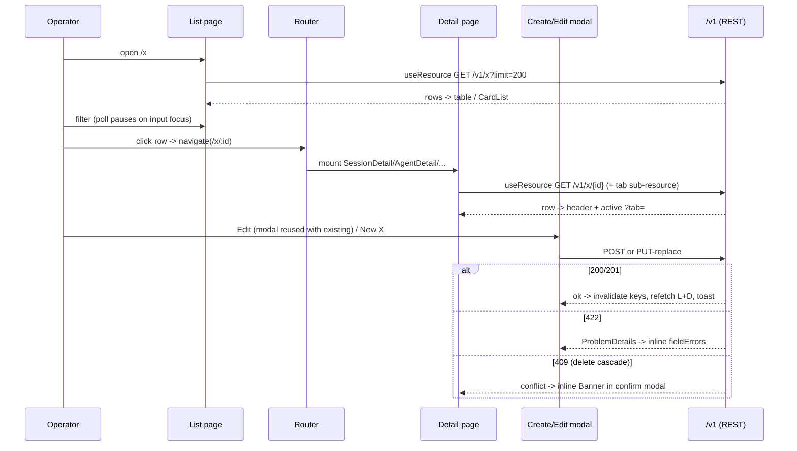

# UI Pages

## 1. Purpose

This doc covers the operator console: the pure shell modules under `ui/foundation/shell-*.js`, the three-view console under `ui/components/console/nv-*.jsx` (plus the two `ui/components/shell/` survivors, `sh-api.jsx` and `sh-activity.jsx`), and the page components under `ui/components/` that it hosts. The console IS the studio. There is no page router, no sidebar and no per-page chrome: one workspace-scoped surface, whose navigation is a verb registry, whose documents are deep-linkable tabs, and whose management surfaces are overlays re-hosting the page components unchanged.

It owns the shell's own model (the URL grammar, the tab semantics, the verb registry, the dual-render rule) and the repeating page shapes those overlays still use: the list-bar plus detail-tabs structure on CRUD entities, the find-bar plus table plus create-modal triad, and the loader/error/empty/confirmation conventions every page reuses.

It deliberately does not re-document the primitives these surfaces build on. The HTTP client, the polled `useResource` cache, optimistic `useMutation`, the router shim, the toast queue, the tweaks store, the idle and viewport hooks, and the shared widgets (`Modal`, `Banner`, `Btn`, `Icon`, `StatusPill`, `CardList`, `Fab`, `BottomSheet`, `MobileTabs`) all live in [ui-foundation.md](ui-foundation.md). The load-bearing rule from the foundation (route all I/O through the hook layer, never `apiFetch` directly) is assumed throughout.

The backend REST contract these pages consume (the `/v1/*` CRUD surface, the `make_crud_router` family, RFC 7807 ProblemDetails, the reserved-id and cascade-conflict semantics) is documented in [architecture/rest-api.md](../architecture/rest-api.md). Pages are the UI half of that contract; where a page surfaces a documented anomaly (T0025, T0379, T0711, and similar) the page-level affordance is described here and the backend cause in the relevant subsystem doc.

## 2. Conceptual model

The console is three views over one URL (the 2026-08-23 designer handoff): STUDIO (the default - a rail of session bands and files, a centre of document tabs, the composer, an optional terminal panel and events sidebar), PLATFORM (grouped nav over per-entity card pages), and SYSTEM (dashboard, users, API keys, SSO, MCP, internal collections, activity, setup, profile - reached from the profile menu). Overlays open above whichever view is active, and a command palette reaches every verb. `ui/app.jsx` is one mount, `AuthGate` wrapping `NV_Shell`, and nothing else.

**The verb registry is the routing table.** Every action a user can take is registered once, with an id, a label, the contexts it applies to and the surfaces it renders on (rail, tab menu, palette, overlay button). A surface renders the verbs the registry gives it rather than hard-coding buttons, which is what makes the dual-render rule checkable: a verb declared for a surface but never rendered from the registry, or a doc kind the URL can address that no verb opens, is an orphan, and a static guard fails on it.

**A document is a tab, and a tab is addressable.** Sessions, files, diffs and wiki pages are the four doc kinds (the trace opens as a split INSIDE the session doc; attention lives in the bands and the System dashboard). Tabs follow VS Code semantics: a preview tab is replaced by the next preview and is promoted to permanent by an edit or a pin, so browsing a file tree does not accumulate tabs.

**A management surface is an overlay, not a page.** The catalogue, agents, graphs, collections, toolsets, workers and the rest re-host their existing page components with no chrome around them. Comparison never goes in an overlay: a trace opens beside its transcript as a tab in a second group, because an overlay cannot be looked at next to anything.

Components attach themselves to `window` at module scope rather than being imported, because the bundle shares one global Babel scope; this is also why several pages prefix every top-level binding (workspaces uses `WS_`, triggers `TR_`, internal-collections `IC_`, agents `AG_`, graphs `GR_`, channels its own helpers) to avoid colliding with siblings in that scope.

The page anatomies below still hold, because the overlays host those same components.

Almost every entity surface follows one of two anatomies.

A list page is a find-bar (text filter plus entity-specific dropdowns or status chips), a desktop table (with a mobile `CardList` plus `Fab` fallback under `useViewport().isMobile`), and a create modal launched from a "New X" button. Filtering, sorting, and pagination are overwhelmingly client-side over a single `GET /v1/<plural>?limit=200` page; the poll pauses while the filter input is focused so typing is not interrupted.

A detail page is a header (breadcrumb, id, action buttons such as Edit / Delete / Invalidate / Back) over a tab strip whose active tab is carried in the URL as `?tab=` and read back through the router. The create modal is reused in edit mode: the same component takes an `existing` prop, locks the id (and often the type discriminator), pre-fills the form, blanks any masked-secret field so the redaction is never written back, and submits a `PUT`-replace instead of a `POST`.

```mermaid
graph TD
    subgraph ListPage["List page anatomy"]
        FB["find-bar: text filter + chips/selects"] --> TBL["table (desktop) / CardList+Fab (mobile)"]
        TBL -->|row click -> navigate(/x/:id)| DET
        FB -.->|New X button| CM["create modal"]
    end
    subgraph DetailPage["Detail page anatomy"]
        DET["header: crumb + id + Edit/Delete/Back"] --> TABS["tab strip (?tab= in URL)"]
        TABS --> T1["Overview/Config"]
        TABS --> T2["entity tabs (Tools/Sessions/Messages/State/Files/Turn log/...)"]
        DET -.->|Edit button| CM
        DET -.->|Delete button| CONF["confirm modal (+ inline 409 banner)"]
    end
    CM -.->|POST/PUT then invalidate| TBL
```

A handful of surfaces break the mould: the dashboard and health and workers pages are read-only metric boards, the graph detail page is a drag-and-drop canvas editor rather than a tab strip, the internal-collections page is a three-state activation machine, and the docs page is a markdown reader. These are noted individually in the page index.

## 3. Architecture patterns implemented

- **The URL is the state.** Four facts are addressable and nothing else is: the workspace, the open document, the open overlay, and an anchor within the document. Palette state, toasts and every other transient are deliberately not representable, so a pasted link restores exactly what the sender was looking at and nothing they were not.

- **Registry-rendered surfaces, checked by the dual-render rule.** Verbs are registered once and each surface renders what the registry hands it. Two static guards enforce the consequences: every declared surface must actually render from the registry, and every addressable doc kind and overlay must be reachable by some verb. An address no verb reaches is a surface the user cannot find; a verb no surface renders is a promise the console does not keep.

- **Overlays re-host page components with no chrome and props only.** An overlay mount passes the component its own props and nothing else. Where a re-hosted page still calls `window.primerApi.useRouter()`, the shim answers from overlay state; see [ui-foundation.md](ui-foundation.md).

- **Every page builds on the foundation hook layer, never on raw fetch.** List polls, detail polls, modal submits, and confirmation deletes all go through `useResource` and `useMutation` on `window.primerApi`; cache keys are page-scoped strings (`sessions:list`, `session-detail:{sid}`, `graph-status:{id}`, `workspace-files:{wid}:{path}`, and so on) so a mutation on one surface can invalidate exactly the keys that need refetching. See [ui-foundation.md](ui-foundation.md) for the hook contracts and cache-key conventions.

- **List-bar plus detail-tabs is the default CRUD shape.** A `GET /v1/<plural>?limit=200` list with client-side filter/sort/paginate, a row-click navigation to `/<plural>/:id`, and a tabbed detail page whose tab lives in `?tab=`. Agents, toolsets, providers, semantic-search, channels, triggers, workspaces, collections, and graphs all instantiate this shape with entity-specific tabs.

- **Find-bar plus table plus create-modal triad.** The list bar exposes a text filter plus dropdowns or status chips; the create modal doubles as the edit modal via an `existing` prop and a `POST`-versus-`PUT`-replace switch. `PUT`-replace is the wire shape because the backend `make_crud_router` is full-replace, not PATCH.

- **Reuse-create-modal-for-edit with secret blanking.** Providers, channel-providers, semantic-search, and toolsets all pre-fill the create modal on edit, lock the id and type discriminator, and blank any field still holding the `**********` redaction so the stored secret survives. This mirrors the backend `SecretStr`-on-read masking documented in [architecture/rest-api.md](../architecture/rest-api.md).

- **Optimistic-write only for reversible edits; wait-for-200 for destructive or cascading mutations.** Description / metadata / config edits use the optimistic `useMutation` path; graph `PUT`-replace, workspace destroy, provider invalidate, and any delete wait for the response before refetching. The rationale lives in [ui-foundation.md](ui-foundation.md).

- **Anomaly surfaces are rendered in place, not hidden.** Documented backend quirks get a labelled banner or helper line on the owning page: T0025 model-list-is-static helper text in the embedding/cross-encoder provider and collection modals (the LLM provider form has no model list at all now -- see below), T0379 provider/config-not-cross-validated warning, T0711 MCP-HTTP 500 banner on the toolsets and agents Tools tabs, T0245/U0014 stdio-allowlist warning in the toolset modal. The backend cause is documented in the matching subsystem doc; the affordance is documented here.

- **Inline-for-input-validation, toast-for-action-outcome.** 422 ProblemDetails responses map `extensions.errors[].loc` to per-field inline errors in modals; non-422 failures and success acknowledgements go through the toast queue. Yielding-tool inputs (AskUser) render their 422/500 inline under the input rather than as a toast.

## 4. Code layout

The shell is split by testability. Pure logic lives in `ui/foundation/shell-*.js` as plain functions with no React and no DOM, so `tests/ui` can execute it in MiniRacer:

- `shell-url.js` - the URL grammar: `SH_parseUrl` / `SH_buildUrl`, `SH_DOC_KINDS`, `SH_OVERLAYS`, anchor parsing.
- `shell-verbs.js` - the verb registry, label lint and ranking.
- `shell-docs.js` - the tab model: open, pin, preview promotion, groups.
- `shell-status.js`, `shell-turns.js` - the status line and the transcript's turn folding.
- `shell-attention.js` - pending yields and approval records to attention items, tiered by consequence.
- `shell-walkthrough.js` - the first-run checklist state.
- `shell-router-shim.js` - `useRouter` over overlay state (see [ui-foundation.md](ui-foundation.md)).

The React surfaces live in `ui/components/console/nv-*.jsx` (the three-view flag day deleted the `sh-*` shell): `nv-shell.jsx` (the root: URL sync, the verb registry and chord dispatcher, the toast and confirm hosts), `nv-chrome.jsx` (activity bar + topbar: workspace menu with settings, search field, panel toggles, profile menu), `nv-palette.jsx`, `nv-studio.jsx` (the studio frame and the pure band sort), `nv-sessions-sidebar.jsx` and `nv-files-sidebar.jsx`, `nv-doc-host.jsx`, `nv-session-doc.jsx` (transcript, binding chip, decision/ask cards, inline artifacts, trace split, composer, voice), `nv-file-docs.jsx`, `nv-terminal.jsx`, `nv-events-sidebar.jsx`, `nv-client-tools.jsx`, `nv-overlays.jsx` (the designer create panels plus the management-surface mount table), `nv-platform.jsx` and `nv-system.jsx`. Two shell-directory files survive: `sh-activity.jsx` (the events console the System view re-hosts) and **`sh-api.jsx`, the only file that names a URL**, so the endpoints the console depends on are enumerable in one place.

**The session state chip says Ready for a session that merely rests.** The served `session_state` is coarse on purpose: `parked` covers every WAITING or PAUSED row that has completed a turn (`WorkspaceSession.session_state`), so labelling it by that word alone told the operator that every session that had simply answered was blocked. The header chip (`NV_SessionStateChip` in `nv-session-doc.jsx`) keeps `data-state` as served (the e2e journeys and tools read it) and decides the label from what the row stores, in `NV_sessionStateChipView`: a `parked_status` is a real park (an approval, an answer or a timer) and reads amber `Parked`, `status: paused` is the operator's pause and reads `Paused`, and any other row that rests reads `Ready` with `data-resting="true"`, drawn neutral. The richer per-reason wording ("Waiting on approval") is `describeSessionState` in `session-state.jsx`.

**A worker that has not reported its load is unknown, not idle.** `GET /v1/workers` rows and `/v1/health` serve `in_flight: null` for a worker from before load reporting, or one that has not yet sent a heartbeat with a load (#484). The Workers page (`workers.jsx`) keeps the null: a row reads "? / 3" and its bar is drawn dashed and empty with the title "Load not reported", the detail panel says "load not reported", the drain dialog says "its in-flight sessions", and the "Running now" tile (`WK_fleetLoad`) sums only what was reported and reads "? / <slots>" with "N workers not reporting its load" while any worker that can run something has not reported (dead workers are tombstones and count for nothing either way). The legacy health page charts nothing and prints "n/a" for an unreported total. The system dashboard already printed "n/a". Before this the page turned the missing number into 0, so an overloaded fleet of old workers read as idle.

**Stop is acknowledged.** `POST .../interrupt` returns before the turn has stopped, so the session document shows a "stopping" state until it has: `SH_isStopping(session)` (`ui/foundation/shell-status.js`) is true while the served `interrupt_requested` flag is set on a live session (the worker clears it when the Stop lands), and it is OR-ed with `stopPending`, the click's own state, so the button disables the instant it is pressed. While stopping, the composer's Stop and the status strip's interrupt button are disabled ("Stopping..."), and the strip says `stopping` (or `stopping: ending <tool>`: a Stop cancels a running tool, except one that must not be cancelled, such as a file write, which it waits for a few seconds, and the strip cannot tell which; `SH_stoppingLine`). Every entry point (the buttons, the `session.interrupt` palette verb, the rail's session menu) goes through `NV_doInterrupt`, which shares the pending request when pressed twice and toasts what actually happened: "Stopping the turn" only when the returned row carries `interrupt_requested: true`; "Nothing to stop: no turn is running" when the server answered 200 as a no-op (it does so on every row that is neither running nor parked: idle, waiting, paused, a turn that just finished), which also clears the click's pending state at once; and an ERROR toast with the request id on a failure. Every entry point is also gated on `SH_canStop(session)` (the server's own condition: a RUNNING row that is not parked): the composer's Stop and the strip's interrupt button render only for such a turn (or while one is stopping), the rail's session menu offers Interrupt only for it, and the `session.interrupt` verb is registered with an `available(ctx)` predicate that the palette's ranker applies to the focused session's row (`NV_focusedSessionRow`; the verb registry keeps `available` on its explicit whitelist, as it does `requiresLive`, which nothing evaluates yet). A Stop's `cancelled` record reads "stopped" in the transcript and a Cancel's reads "cancelled" (`SH_lifecycleLabel`). A pending click clears itself after 5 seconds if the served flag never appears, and the client's pending leg obeys the same parked/ended exclusions as the served flag (`stopPending && SH_canStop(session)`), so a parked row never reads "stopping". A PARKED session is never "stopping": no turn is running while it waits and the server refuses a Stop on it with 409, so the rail's session menu does not offer Interrupt for it, and a Stop that is refused anyway (from the palette verb, or a race) shows the server's reason in the failure toast and clears the click's pending state.

**The running strip is the tap's word, checked against the row.** The strip's live status (`thinking`, a tool name) is held by the session store (`ui/foundation/session-store.js`) and comes only from tap frames: a user message or a tool call sets it, a terminal record (`done`, `cancelled`, `error`) clears it. A lost or never-written terminal frame would therefore leave "running" and a Queue button for good, so the session document also reads the polled session row, which is the truth about whether a turn is executing: when the row is ended or serves `turn_status` `idle` for `NV_STALE_STATUS_MS` (4 s, at least two polls of the 2 s detail resource) while a live status is showing, `NV_rowContradictsStatus` marks it stale and `SS_expireStatus` drops it and the document re-reads the durable tail. The `sending` leg of a message in flight is never expired, and a status a newer frame replaced is left alone. A send that fails gives back the status it replaced; it no longer re-arms `thinking`.

**A workspace that cannot be read is said so, not drawn as an empty conversation.** The session document's history read (`GET /v1/sessions/{id}/messages`) answers a typed 503 `/errors/workspace-unreachable` when the session's workspace exists but its runtime does not answer (it used to answer an empty list, which looked like the history was gone). `NV_historyProblem(history.error)` turns that one type into a banner above the transcript (`nv-history-problem`, `role="alert"`: the workspace is unreachable, the conversation is not lost, check the workspace's status, with a "Try again" button that re-reads); the resource keeps polling, so the banner clears on its own once the workspace answers. Any other history failure keeps its old handling. A session whose workspace row is gone (deleted or lost) still reads as an empty log, because its row already says `workspace_lost`.

**The phone's More tab reaches what the desktop menus reach.** A platform section opened from the More tab, or by a pasted `?overlay=<section>` or `?view=platform:<section>` link, fills the screen with its Back button: `NV_MobileMore` hides the profile card, the settings rows and the health cards while `NV_MobilePlatform` reports a section open (before, the list started about 1300px down, below them), and a link to a whole section (no row id) is consumed as soon as the section opens so an early Back tap does not re-open it. The Settings rows (`NV_mobileSettingsRows`) are Providers (the existing providers overlay, a sheet on the phone) and, for any role but `restricted` as in the desktop profile menu, System settings, a full-screen takeover (`NV_MobileSystemScreen`, also reached by a `?view=system:<page>` link) that hosts the desktop System pages with the nav as a row of chips; Log out sits in the profile card. The System pages are the desktop ones hosted as they are: a read-mostly phone layout for each is separate work.

All page components live under `ui/components/` as self-invoking `<script type="text/babel">` files that attach `window.<Name>Page` / `window.<Name>Detail` globals; the overlay host mounts them. The workspaces sub-tree (`ui/components/workspaces/`) holds the providers, templates, and shared form-helper files.

Three provider files are MOUNTED, not routed. `provider-form.jsx` is the one parameterized provider form: it renders whatever the class's own `_types` endpoint describes, so no field table lives in the console. `provider-aggregated-editor.jsx` is mounted by that form for the aggregated LLM variant, whose ordered member picker a flat field list cannot express. `model-profiles.jsx` now ships only `MP_ProfileModal`, which the catalog's profiles panel opens; its standalone page folded into the catalog.

**Files > History reads `commits`.** `GET /v1/workspaces/{wid}/log` answers `{"commits": [...]}`, not the `{"items": [...]}` list envelope the other routes use. Both Files sidebars (`nv-files-sidebar.jsx` and the mobile Files tab in `nv-mobile-shell.jsx`) take their rows through `SH_api.commitRows(body)` (`ui/components/shell/sh-api.jsx`), so the key is named in one place; reading `items` made History say "No turn commits yet." for every workspace. `tests/ui/test_files_history_reads_the_log_shape.py` feeds the real response shape through the real module, and an items-shaped body is deliberately not a commit log.

Page-by-page index follows. The first column is the overlay target that reaches each surface, in the `<name>[:<section>[:<id>]]` form the URL takes.

| Overlay target | Page component | Source file | Primary REST dependency |
| --- | --- | --- | --- |
| `workspaces` | WorkspacesPage | `workspaces.jsx` | `GET /v1/workspaces?limit=200` |
| `workspaces:detail:<wid>` | WorkspaceDetail | `workspaces.jsx` | `GET /v1/workspaces/{id}` + files/log/sessions/channels sub-resources |
| `workspaces:templates` | WorkspaceTemplatesPage | `workspaces/templates.jsx` | `GET /v1/workspace_templates` |
| `agents[::<id>]` | AgentsPage / AgentDetail | `agents.jsx` | `GET /v1/agents`, `/v1/agents/{id}` |
| `graphs[::<id>]` | GraphsPage / GraphDetail | `graphs.jsx` | `GET /v1/graphs`, `PUT /v1/graphs/{id}` |
| `collections` | CollectionsPage | `knowledge.jsx` | `GET /v1/collections`, `/collections/{id}/documents`, `/collections/{id}/search` |
| `toolsets[::<id>]` | ToolsetsPage / ToolsetDetail | `toolsets.jsx` | `GET /v1/tools`, `/v1/toolsets/{id}/tools`, `/v1/tool_approval_policies` |
| `tools` | ToolsPage | `toolsets.jsx` | `GET /v1/tools/catalogue`, `/v1/tool_approval_policies` |
| `providers[:<class>[:<id>]]` | ProviderCatalog | `provider-catalog.jsx` | `GET /v1/{llm,embedding,cross_encoder,stt,tts,web_search,web_fetch,artifact_storage}_providers`, each class's `_types`, `/v1/model_profiles`, `/v1/speech_active_config`, `/v1/web_search_active_config` |
| `providers:ssp` | SSPListPage | `semantic-search.jsx` | `GET /v1/ssp`, `POST /v1/ssp/{id}/invalidate`, `/v1/collections` |
| `providers:workspace` | WorkspaceProvidersPage | `workspaces/providers.jsx` | `GET /v1/workspace_providers` |
| `providers:channel` | ChannelProvidersPage | `channels.jsx` | `GET /v1/channel_providers` |
| `channels` | ChannelsPage | `channels.jsx` | `GET /v1/channels` |
| `channels:rules` | ChannelRulesPage | `channels.jsx` | `GET /v1/workspace_channel_associations` |
| `approvals` | ApprovalsPage | `approvals.jsx` | `POST /v1/sessions/find`, `.../tool_approval/pending`, `/v1/tool_approval_policies` |
| `triggers[::<id>]` | TR_TriggersPage | `triggers.jsx` | `GET /v1/triggers`, `.../subscriptions`, `POST .../fire_now` |
| `harnesses[::<id>]` | HarnessesPage | `harnesses.jsx` | `GET /v1/harnesses` (+ harness instance/outbound sub-forms) |
| `services[::<id>]` | SV_ServicesPage | `services.jsx` | `GET /v1/services`, `.../versions` |
| `workers` | WorkersPage | `workers.jsx` | `GET /v1/workers`, `POST /v1/workers/{id}/drain` |
| `workers:health` | HealthPage | `health.jsx` | `GET /v1/health` |
| `new-session` | SharedNewSessionForm | `new-session-form.jsx` | `GET /v1/agents`, `/v1/graphs`, `POST .../sessions` |
| `new-workspace` | NV_CreateWorkspaceOverlay | `console/nv-overlays.jsx` | `GET /v1/workspace_templates`, `POST /v1/workspaces` |
| (System view navs) | NV_System re-hosts ADM_AdminUsersPage, AT_ApiTokensPage, SSO_ProvidersPage, MC_McpPage, InternalCollectionsPage, SH_ActivityPanel, SetupWizardSteps | `console/nv-system.jsx` | users, SSO, API tokens, MCP, internal collections, activity, setup, profile |
| `collections` (subsystem view) | InternalCollectionsPage | `internal-collections.jsx` | `GET/PUT/DELETE /v1/internal_collections/config` (the `GET` with `?allow_missing=true`, so "not configured" is a 200 and not a console 404), `/bootstrap[/status]` |

The user docs render at `/docs` outside the shell, served by `ui/components/docs.jsx`; they are a reader, not a console surface.

Supporting files not directly routed: `approvals.jsx` also exports the shared `ApprovalBanner` consumed by `session-detail.jsx`; `workspaces/shared.jsx` exports the form-row and list-editor helpers (`WorkspacePairListEditor`, `WorkspaceEnvPairEditor`, `WorkspaceFileRowEditor`, and siblings) reused by the workspace, template, and provider modals; `auth.jsx` is the boot gate that wraps the whole shell; `harness_form.jsx` and `harness_outbound_builder.jsx` are mounted by the harnesses page. The overlay vocabulary lives in `ui/foundation/shell-url.js` (`SH_OVERLAYS`) and the mount table that picks each `window.*` component lives in `ui/components/console/nv-overlays.jsx`.

**Dialogs carry no developer annotations, and Create session names its workspace.** The uiv2 mockup labels each panel with its palette verb ("verb: Create Session"); that is a designer's note, not UI, and no component renders it (the overlay panel takes no `verb`, and the agent, workspace and model-profile modals never show one). A create dialog acts on the selected workspace, so the Create session overlay says so (`nv-ns-workspace`, "Creating in workspace <name>", from `NV_workspaceLabel`: the workspace's name, else its id). `tests/ui/test_dialogs_have_no_verb_chip.py` scans every component for the chip.

## 5. Data model

The console's own data model is its URL grammar, which is the only thing it persists between loads:

```
#/w/{wid}?doc=<kind>:<ref>&overlay=<name>[:<section>[:<id>]]#<anchor>
```

The grammar also carries the view (`view=platform:<nav>` / `view=system:<nav>`; absent means studio, so every historical URL parses forward). Four doc kinds are addressable: `session`, `file`, `diff`, `wiki`. The overlay names are: `providers`, `collections`, `agents`, `graphs`, `triggers`, `toolsets`, `tools`, `workers`, `approvals`, `harnesses`, `services`, `channels`, `workspaces`, `new-session`, `new-workspace`, `internal-collections`, `activity` (the old `admin` overlay's sections are the System view's navs). An anchor is either `turn-<n>` or an `L<from>[-L<to>]` line range. Both lists are pinned against `ui/fixtures/shell/manifest.json` by a test, so the vocabulary cannot drift from what the designer package documents.

Beyond that, pages own no durable server data of their own. The entity schemas they render (Agent, Graph, Collection, Toolset, the provider models, WorkspaceSession, Trigger, ApiToken, and so on) are owned by their backend subsystem docs. The only page-held state is ephemeral React state: the active filter/sort/page, the selected row, the open-modal draft and its `fieldErrors` map, and per-page UI-only data such as the graph editor's `x/y` node coordinates (stripped before `PUT`). Cache keys are page-scoped strings on the foundation `useResource` map, listed per page above; they are an index into the shared cache, not a data model.

## 6. Lifecycle

**Boot is one gate.** `AuthGate` (`ui/components/auth.jsx`) owns the whole branch: register or login, the forced password change, the restricted screen, and the setup wizard for admins or the waiting screen for everyone else. It returns its children only once the install is complete, and its child is `NV_Shell`. `SetupWizardGate` is a LEAF that renders the wizard and never renders children, so it never appears in the mount chain; nesting the shell inside it would render the wizard forever. The shell used to carry a `setup_complete` branch of its own while both consoles coexisted, and it was removed with the flag day: two gates disagreeing about one decision is how a console strands itself.

**Landing.** With a workspace resolved, the shell opens the most recent session as a pinned tab. An empty workspace creates one lazily, bound to the system default agent, so the console is never an empty frame asking what to do.

The dominant lifecycle inside an overlay is the CRUD-page round trip: the list bar mounts and its `useResource` poll loads the page of rows; the operator filters and clicks a row, which `navigate`s to the detail route; the detail page mounts, polls its own key, and renders the active `?tab=`; the operator opens the create/edit modal or a delete confirmation; on submit the `useMutation` fires the `POST`/`PUT`/`DELETE`, invalidates the relevant cache keys, and both surfaces refetch. Success pushes a toast; a 422 maps to inline field errors in the modal; a 409 cascade conflict renders inline inside the delete confirmation as a `Banner` so the operator can resolve the dependency.


```mermaid
sequenceDiagram
    participant Op as Operator
    participant L as List page
    participant R as Router
    participant D as Detail page
    participant M as Create/Edit modal
    participant API as /v1 (REST)

    Op->>L: open /x
    L->>API: useResource GET /v1/x?limit=200
    API-->>L: rows -> table / CardList
    Op->>L: filter (poll pauses on input focus)
    Op->>R: click row -> navigate(/x/:id)
    R->>D: mount SessionDetail/AgentDetail/...
    D->>API: useResource GET /v1/x/{id} (+ tab sub-resource)
    API-->>D: row -> header + active ?tab=
    Op->>M: Edit (modal reused with existing) / New X
    M->>API: POST or PUT-replace
    alt 200/201
        API-->>M: ok -> invalidate keys, refetch L+D, toast
    else 422
        API-->>M: ProblemDetails -> inline fieldErrors
    else 409 (delete cascade)
        API-->>D: conflict -> inline Banner in confirm modal
    end
```

Loader, empty, error, and confirmation conventions across pages: on first load a list shows a skeleton table (or simply renders zeros on metric boards); `loading=true` fires only on the first fetch for a key so background polls never flicker (a foundation guarantee). An empty result renders an entity-specific empty-state row or card with a "New X" call to action rather than a blank table. A fetch error retains the last good data (stale-while-error) and surfaces the error title; after three consecutive failures the poll halts until a manual Refresh. Destructive actions always go through a confirmation `Modal` whose body spells out consequences (in-flight counts, idempotency notes, the "second DELETE returns 404" caveat, the list of dependent rows for cascades) before the mutation fires.

A few pages run non-CRUD lifecycles. The session detail page reads the authoritative top-level `GET /v1/sessions/{id}` (never the nested workspace path, which is known to drift) and routes signals through the workspace-scoped POSTs; its five tabs are Overview, Messages, State, Files, and Turn log, and it additionally mounts a live stream panel fed by the workspace tap (an SSE `EventSource` on `GET /v1/workspaces/{wid}/tap`) plus the yielding-tool panels (AskUser, WatchFiles, Sleep, ApprovalBanner) and the `TurnLogTab` whose endpoint resolver picks the session route for agent bindings and the graph-run route for graph bindings. The internal-collections page derives one of three states (Inactive / Configured / Active) from a single config probe and drives a phase-aware bootstrap progress panel with adaptive 1s/5s polling. The graph detail page seeds an editable draft, auto-lays-out node coordinates, runs a client-side topology validator that gates Save, and issues a destructive `PUT`-replace.

## 7. Persistence

Pages persist nothing of their own to the server beyond the CRUD mutations enumerated above, and nothing to client storage. The small set of client-persisted preferences (theme, sidebar collapse state, the force-desktop opt-out) is owned by the foundation tweaks store and documented in [ui-foundation.md](ui-foundation.md). One historical client-persistence heuristic was deliberately removed: the internal-collections page once contemplated a `localStorage` "bootstrapped" flag, but the shipped page derives its state from the server-side `activated_at` field on the config row instead, so every client and operator sees the same truth. The `useResource` cache is in-memory and rebuilt from the API on every load.

## 8. Public surfaces

The public surface of this layer is the console's globals plus the page components it hosts. The console exports `window.NV_Shell` (the mount), `window.NV_OVERLAY_MOUNTS` and `window.NV_OVERLAY_TITLES` (the overlay table and its headings), and the `NV_*` surfaces each `nv-*.jsx` file attaches. The addressable vocabulary is `SH_DOC_KINDS` and `SH_OVERLAYS` in `ui/foundation/shell-url.js`.

Each page attaches `window.<Name>Page` and, for entities with a detail view, `window.<Name>Detail`; `ui/components/console/nv-overlays.jsx` is the sole dispatcher that maps an overlay target to one of those globals.

Cross-page exports that other pages depend on:

- `window.ApprovalBanner` (from `approvals.jsx`) is embedded by `session-detail.jsx`; both poll the same `tool-approval:session:{id}` cache key, so a respond from either surface refetches the other.
- `window.AG_NewAgentModal` (from `agents.jsx`) is launched inline from the graph editor's new-graph dialog and per-node agent picker so an operator with no agents can create one without leaving the dialog.
- `window.WorkspaceTemplateCreateModal` (from `workspaces/templates.jsx`) is launched inline from the New-Workspace modal when no templates exist.
- The `workspaces/shared.jsx` form-helper widgets are exposed on `window.Workspace*` for reuse by the workspace, template, and provider modals.

Pages do not expose a programmatic API. A page navigates by calling `window.primerApi.useRouter().navigate(path, query)` exactly as before; the shim translates that into opening an overlay rather than changing a route.

## 9. Internal contracts

- **Detail pages carry their active tab in `?tab=`, read back through the router.** This makes tab state linkable and survives reload. Session detail uses `overview/messages/state/turnlog`-style ids; agents use `config/tools/sessions/metadata`; toolsets use `config/tools/sessions`; semantic-search uses `overview/config/collections`; workspaces use `files/sessions/log/channels/config/destroy`.

- **The create modal is the edit modal.** A non-null `existing` prop switches the submit from `POST` to `PUT`-replace, locks the id and type discriminator, and blanks masked-secret fields so the redaction is never round-tripped. Any page that edits an entity follows this, which is why there is no separate edit form to keep in sync.

- **Cache keys are page-scoped and mutations invalidate by key.** List and detail of the same entity use distinct keys (`sessions:list` versus `session-detail:{sid}`) so their independent poll cadences do not stall each other and a mutation can target exactly one surface. Shared keys are used deliberately where two surfaces must stay in lockstep (the tool-approval pending key, the IC config key shared by the sidebar bell, the knowledge OFF banner, and the dashboard tile).

- **422 maps to inline field errors; the loc-to-field mapping must match the backend emission.** Modals read `extensions.errors[].loc`, join it, and key inline errors by that path. Some backends flatten a segment out of the loc tuple (channel-provider config emits `body.{field}` not `body.config.{field}` because the model validator pre-instantiates the inner config), so the matching modal looks up the flattened key. Tool-approval validation forces a `body.*` loc prefix specifically so the approvals modal lights up.

- **409 cascade conflicts render inline in the delete confirmation, never as a bare toast.** Toolset delete blocked by an approval policy, SSP or provider delete referenced by a collection, workspace or template delete referenced by a child, and channel-provider delete all surface the conflict detail in a `Banner` inside the confirm modal so the operator can act on it.

- **Managed rows hide mutation.** Any entity carrying a `harness_id` (agents, toolsets, collections, documents, graphs) renders a "managed by harness" banner and hides the Edit button, mirroring the backend's 409-on-public-CRUD discipline.

- **Session detail pins the authoritative read path.** It always reads top-level `GET /v1/sessions/{id}` (and polls it), never the nested `/v1/workspaces/{wid}/sessions/{sid}` path, which is known to drift after signals; signals themselves still go through the workspace-scoped POSTs.


## 10. Testing patterns

Per-page coverage is split between Python static-source assertions and gated browser end-to-end journeys. The Python `tests/ui/` suite asserts page invariants without a runtime: that a page opts into `useViewport` and emits its mobile `CardList`/`Fab`/stack class (`test_agents_mobile.py`, `test_sessions_list_mobile.py`, `test_workspaces_mobile.py`, `test_dashboard_mobile.py`, `test_health_mobile.py`, `test_workers_mobile.py`, and siblings), that the graph editor renders its branch/edge/per-kind fields (`test_graphs_*`), that anomaly helper text and tags appear in modals (`test_providers_create_anomaly_helpers.py`), and that the triggers and api-tokens pages render their expected dialogs. The shell's pure modules under `ui/foundation/shell-*.js` are executed directly in MiniRacer from `tests/ui`, which is why they hold no React and no DOM. Two static guards replace the retired sidebar-routes guard: the dual-render guard (every declared verb surface renders from the registry; every addressable doc kind and overlay is reachable by a verb) and the deep-link guard (every URL round-trips through `SH_buildUrl` and `SH_parseUrl`). Two more pin the cutover itself: the legacy sweep (no test reads a deleted path, every e2e module navigates through the facade) and the flag day (the deleted set is gone and no reference survives).

The `tests/ui_e2e/` suite (gated behind `PRIMER_RUN_UI_E2E=1`, with mobile suites driven at a 375x812 viewport) drives real Playwright journeys and is the release gate: `test_shell_journeys.py` covers the shell itself, and the older journeys (session create-to-signal lifecycle, agent create happy-path, knowledge collection traversal, workspace file-download and destroy-cascade, channel onboarding and per-platform validation, approvals policy modal) follow the shell through `tests/ui_e2e/_shell_helpers.py`, whose legacy-route table translates each retired route into the overlay that succeeded it. Per-feature mutation tests follow the project smoke-test convention of exercising the page against a live `uv run primer api` instance. Backend route behaviour each page depends on is covered by the matching `tests/api/` files (for example `test_turn_log_routes.py`, `test_workers.py`, `test_builtin_toolsets_endpoint.py`).

## 11. Historical decisions

- **Session detail pins the top-level `GET /v1/sessions/{id}` read for both initial fetch and polling, never the nested workspace path.** Why: the nested path drifts after pause/resume/cancel/steer (pinned by T0399/T0555/T0611) and the top-level row is the only authoritative view. Spec: docs/superpowers/specs/2026-05-16-ui-sessions-design.md.

- **List and detail of the same entity use separate `useResource` cache keys with separate poll cadences.** Why: detail is the action surface and polls faster (2s) while the list is a directory view that polls slower (3s to 5s); separate keys keep one from stalling the other and let mutations invalidate either independently. Spec: docs/superpowers/specs/2026-05-16-ui-sessions-design.md.

- **The create modal doubles as the edit modal across every CRUD page, with id/type locked and a `POST`-versus-`PUT`-replace switch.** Why: it avoids duplicating the form schema and the 422 field-error mapping between create and edit, and `PUT`-replace matches the storage-level full-replace contract. Spec: docs/superpowers/specs/2026-05-16-ui-providers-design.md.

- **Edit mode blanks any field still holding the `**********` secret redaction before submit.** Why: round-tripping the literal asterisks would clobber the stored secret; blanking lets the backend keep the existing value when the operator leaves the field untouched. Spec: docs/superpowers/specs/2026-05-25-designer-handoff-ui-spec.md.

- **An LLM provider's model registry is its ModelProfile rows, and the console says which of two lists it is showing.** Why: `GET /{id}/models` reports what is REGISTERED here and `GET /{id}/discovered_models` reports what the upstream OFFERS, and an operator who confuses them will think a fetch failed when it merely found nothing new. The LLM provider form therefore has no model table (an LLM provider carries no `models[]`); the detail page's `PR_LlmProfilesPanel` lists the profiles pointing at that provider and turns fetched rows into more of them. Models already registered stay selectable, because a second profile for the same model is the point of the entity.
- **Documented backend anomalies are surfaced in place rather than hidden.** Why: operators need to see that the model list is static for the embedding and cross-encoder families (T0025), that provider config is not cross-validated (T0379), that an MCP-HTTP toolset is leaking a 500 (T0711), and that the stdio allowlist gates at session-open (U0014), so each gets a labelled banner or helper line on the owning page. Spec: docs/superpowers/specs/2026-05-16-ui-toolsets-design.md.

- **The grouped `GET /v1/tools` and the flat `GET /v1/tools/catalogue` take their built-in toolset ids from one list, `providers._BUILTIN_TOOLSETS`.** Why: the flat route (the Tools page and the graph editor) kept a hand-copied tuple "in step" with that list and the copy lacked `trigger`, so the Tools page showed 160 tools where every picker showed 171. `tests/api/test_tools_endpoint.py` pins that the route asks for every built-in toolset and that its id tuple is derived, not copied. The MCP exposure catalogue is a deliberately different universe (`RESERVED_TOOLSET_IDS`, which also covers `crud`, `collections` and `workspace_ext`).
- **Deleting the `operator` or `builder` agent from a Platform card says what it does.** Why: setup completeness is derived live (`primer/bootstrap/setup_state.py`), so with either row gone `GET /v1/auth/status` reports `setup_complete: false`; the console gate then sends admins to the setup checklist and parks every other user on a waiting screen, and the card used to ask the same generic "Permanently delete?" it asks for any entity. The prompt and the confirm-then-DELETE flow are the pure `NV_deleteConfirm` and `NV_deleteRow` in `nv-platform.jsx` (ids in `NV_SETUP_AGENT_IDS`), run through MiniRacer by `tests/ui/test_platform_delete_confirm.py`, which also deletes each seeded agent in a seeded install and asks the real setup predicate which ones reopen setup, so the list cannot drift. The server still allows the delete; the way back is a server restart (the startup ensure pass) or Re-run seed on the setup checklist, which re-creates the agent with its default definition, not the operator's edits.
- **"New toolset" and "New trigger" on a Platform page open the entity's own create form on that page, not the legacy list overlay.** Why: the press used to open a second list of the same entities (its own filter, Refresh and "+ New") over the card grid and only a second press opened the form, and three different behaviours existed for the same button across Platform pages (admin review 2026-10-08, ADM-06). The create dialogs (`TS_NewToolsetModal`, `TR_CreateTriggerDialog`) are exported by their pages and mounted by `nv-platform.jsx` the way the model-profile and template forms already are; Cancel leaves the grid and the URL alone, and a created row refetches the cards and opens its detail overlay (`NV_createdRow`), which is where the legacy list sent the operator. The legacy list overlays stay reachable by deep link and the card grid is unchanged. `tests/ui/test_platform_create_opens_the_form.py` tabulates what every page's create does (`EXPECTED_CREATE`): the form hosted on the page (profiles, templates, toolsets, triggers), the entity's own create overlay (workspaces), the list with the form stacked on top (agents, graphs, approval policies), and still the list first (collections, channels, harnesses, services), so each remaining surface moves in its own change.
- **The toolsets page is a single unified list of built-in plus user toolsets rather than two sub-views.** Why: operators want one place to see every tool source with its availability state, and a single `/v1/tools` fan-out powers it without maintaining two pagination paths and two empty states. Spec: docs/superpowers/specs/2026-05-16-ui-toolsets-design.md.

- **The graph detail page is a full per-node editor whose Save issues a destructive `PUT`-replace, gated on a client-side topology validator.** Why: graph topology mutations cross-cut nodes, edges, entry, and max-iterations, so a partial update would need an unresolved server-side merge; full replace keeps the server validator the single arbiter, and the local checker mirrors its rules so the operator gets immediate feedback instead of a 422 round trip. Spec: docs/superpowers/specs/2026-05-16-ui-graphs-design.md.

- **A single `TurnLogTab` in `session-detail.jsx` serves both agent and graph runs, with a scope dropdown for per-node graph logs.** Why: graph runs are surfaced through the same session-detail page via the binding discriminator, so a separate turn-log surface on the graphs page would have duplicated the row renderer and polling logic; an endpoint resolver picks the right REST route from the binding. Spec: docs/superpowers/specs/2026-06-05-per-session-turn-log-design.md.

- **The internal-collections page derives its three-state machine from the server-side `activated_at` field, not a `localStorage` flag.** Why: a client-local flag would lie across browsers, clears, and multiple operators, while `activated_at` matches the backend's own truth source for whether the `/search` routes will 503. Spec: docs/superpowers/specs/2026-05-16-ui-internal-collections-design.md.

- **The Approvals "Pending" panel aggregates parked sessions client-side instead of using a dedicated endpoint, and the inline approval card polls rather than listening for live frames.** Why: there is no aggregate `/tool_approvals/pending` route and, when this was decided, the live session stream (then a WebSocket, since replaced by the workspace tap) emitted no proactive pending/resolved frames, so the UI fans out `sessions/find` and polls each row's pending endpoint, sharing one cache key across the Approvals surface and the session banner. Spec: docs/superpowers/specs/2026-05-24-tool-approval-system-design.md.

- **Channel-provider config 422 errors are looked up by `body.{field}`, not `body.config.{field}`.** Why: the backend coerces the inner config in a `model_validator(mode='before')` that drops the `config` segment from the loc tuple, so the modal must match the flattened emission. Spec: docs/superpowers/specs/2026-05-25-designer-handoff-ui-spec.md.

- **The minted plaintext API token is shown exactly once in a dedicated one-time dialog with a deliberate "I have saved it" close.** Why: the plaintext is the only secret (the backend stores a sha256 hash) and surfacing it only at `POST` with a forced copy step keeps the hash-only design intact. Spec: docs/superpowers/specs/2026-06-02-api-tokens-bearer-auth-design.md.

- **AskUser input errors render inline under the input while action outcomes use toasts.** Why: input validation belongs next to the field the operator is editing, whereas an action's success or failure is a transient acknowledgement; the WatchFiles/Sleep cancels and the SSP create/delete use the inverse split deliberately. Spec: docs/superpowers/specs/2026-05-24-ui-semantic-search-and-yielding-tools-design.md.

- **The web-search and MCP-server pages reuse the list-bar plus stacked-panel shape with a reserved built-in row rendered inert.** Why: the bootstrapped DuckDuckGo web-search row and the MCP exposure singleton are server-owned, so they render with a built-in badge and no Edit/Delete affordance rather than being hidden. Spec: docs/superpowers/specs/2026-06-03-web-search-providers-design.md.

- **Both predecessor consoles were deleted together on flag day, not phased out.** Why: a half-deleted console is worse than either of them alone, because a stale route silently wins and nobody can tell which surface they are looking at. The deletion is pinned by a grep-clean gate rather than by intent.

- **`primerApi.useRouter` survived the deletion of the router.** Why: eight re-hosted page components read `params.id` or call `navigate`, and deleting the name would have broken every one of them the moment its overlay opened. The shim publishes the same contract over overlay state, so the pages did not have to change at all.

- **The console has no page-level chrome, so the toast stack and the confirm host moved into the shell root.** Why: both are cross-cutting. `window.primerApi.toastPush` is what non-React callers such as `useMutation` use to report a failed write, and a queue nothing renders swallows exactly the errors an operator needs to see.

## Cross-reference: external tools

The shell's session document mounts `window.ExternalPendingBanner`
(`ui/components/external-tools.jsx`), and the agent editor exposes the
`allow_external_tools` toggle. See [external-tools](external-tools.md).
