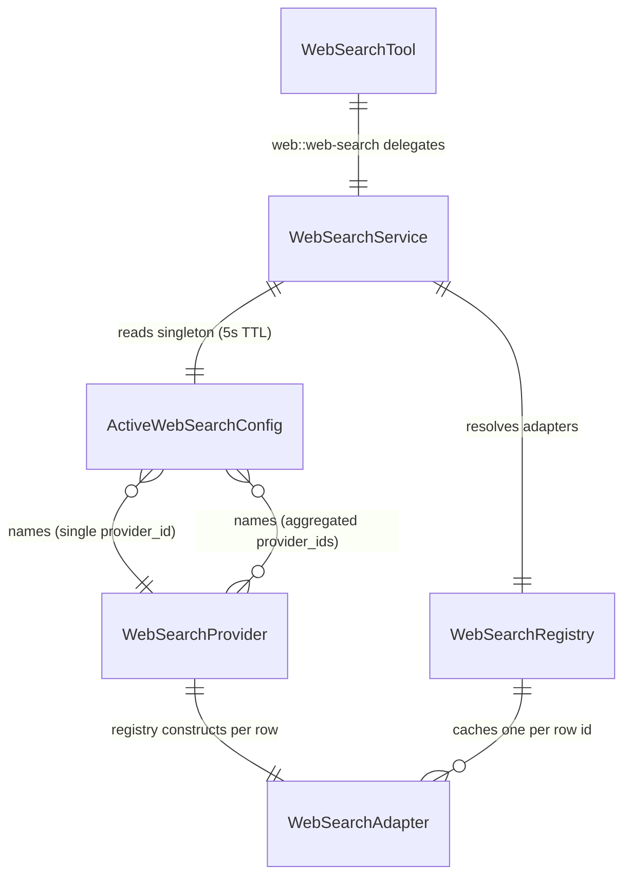
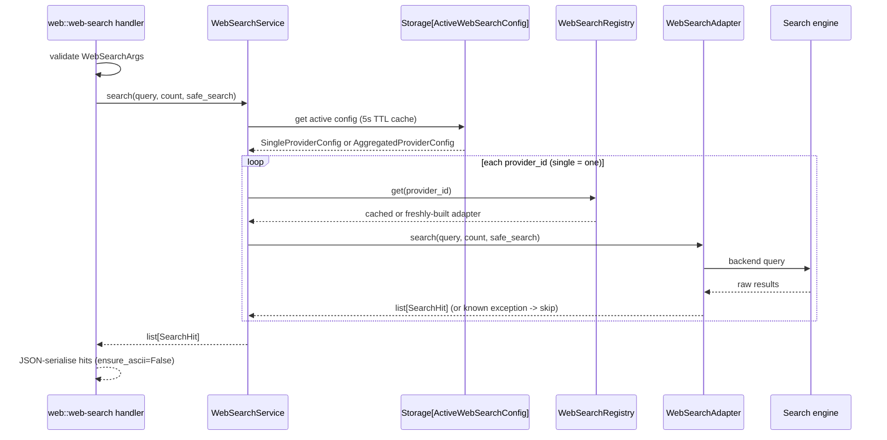

# Web search

## 1. Purpose

The web-search subsystem owns live web retrieval for agents: it turns a free-text
query into a ranked list of `title` / `url` / `snippet` hits drawn from an
external search engine. It covers four concerns:

- The **`WebSearchProvider` entity** and its per-row `WebSearchRegistry`, which
  promote a search backend (DuckDuckGo, Tavily, Firecrawl, Exa) into an
  operator-managed CRUD row rather than a single hard-coded backend.
- The **`ActiveWebSearchConfig` singleton**, which names the live provider (single
  mode) or an ordered fallback chain (aggregated mode) that every search call
  routes through.
- The **`WebSearchService`**, which reads the active-config singleton, resolves the
  provider, and dispatches the query (walking the fallback chain on failure).
- The **`web::web-search` MCP tool** (and its sibling `web::http-request`),
  exposed through the built-in internal `web` toolset that agents call.

The `web` toolset is built by a factory at app lifespan and stamped on
`app.state.web_toolset`; the harness wiring for internal toolsets is documented in
[harness.md](harness.md). This subsystem defines the web-search half of that
toolset and the provider model behind it.

## 2. Conceptual model

A `WebSearchProvider` row describes one backend (a provider-type enum plus a
discriminated config that may carry an API key). The `ActiveWebSearchConfig`
singleton names which provider rows are live: in single mode it points at one
`provider_id`; in aggregated mode it holds an ordered `provider_ids` list tried as
a priority fallback chain. The `web::web-search` tool dispatches every call through
the `WebSearchService`, which consults the active config, resolves each named
provider to a live `WebSearchAdapter` via the `WebSearchRegistry`, and runs the
query.

The entities:

- `WebSearchProvider` (`primer/model/web_search.py`) is `Identifiable` with a
  `provider_type` discriminator (`WebSearchProviderType`: `DUCKDUCKGO`, `TAVILY`,
  `FIRECRAWL`, `EXA`) and a discriminated `config` union (`DuckDuckGoConfig |
  TavilyConfig | FirecrawlConfig | ExaConfig`); a `model_validator` enforces that
  the config kind matches the outer `provider_type`.
- `ActiveWebSearchConfig` (`primer/model/web_search.py`) is the singleton row at id
  `_active_web_search_config`, whose `config` is a discriminated union
  (`SingleProviderConfig | AggregatedProviderConfig`) on `mode`.
- `WebSearchAdapter` (`primer/web_search/adapter.py`) is the backend ABC with an
  abstract async `search(query, count, safe_search)` and a default no-op
  `aclose()`; `SearchHit` (`title`, `url`, `snippet`) is the result type.
- `WebSearchRegistry` (`primer/api/registries/web_search_registry.py`) caches one
  `WebSearchAdapter` per provider row id.
- `WebSearchService` (`primer/web_search/service.py`) is the single dispatch object
  the `web::web-search` tool handler depends on.

## 3. Architecture patterns implemented

- **Provider pattern (registry + factory).** The `WebSearchProvider` entity, the
  `WebSearchRegistry`, and the `default_web_search_factory` follow the same per-row
  cache + lazy-construct + `invalidate` / `aclose` discipline as the LLM and
  semantic-search providers; the registry mirrors `SemanticSearchRegistry`. See
  [provider-pattern.md](../architecture/provider-pattern.md). `WebSearchRegistry`
  runs the storage lookup and factory call outside its `asyncio.Lock` and
  `aclose()`-es the race-loser; `default_web_search_factory` lazy-imports each
  adapter so the API-key-bearing backends stay off the import graph for installs
  that do not use them.
- **Auto-bootstrap.** The reserved `DuckDuckGo` provider row and the
  `ActiveWebSearchConfig` singleton are seeded at first boot (DDG row first, then
  the singleton that references it) so web search works zero-config. See
  [auto-bootstrap.md](../architecture/auto-bootstrap.md).
- **REST API conventions.** Provider CRUD mounts under `/v1/web_search_providers`
  via `make_crud_router` with reserved-id guards and a cascade-block on delete; the
  singleton is a dedicated GET / PUT pair under `/v1/web_search_active_config`. See
  [rest-api.md](../architecture/rest-api.md).
- **Storage abstraction.** Provider rows and the active-config singleton persist
  through the generic `Storage[T]` interface; the registry and service take the
  per-type `Storage` handle (not the `StorageProvider`) at construction.
- **Adjacent subsystem.** The `web` internal toolset (the `web::web-search` and
  `web::http-request` tools and their `InternalToolsetProvider` wiring) is built at
  lifespan and registered through the harness; see [harness.md](harness.md).

## 4. Code layout

- `primer/model/web_search.py`: `WebSearchProviderType`, the four config classes
  (`DuckDuckGoConfig`, `TavilyConfig`, `FirecrawlConfig`, `ExaConfig`), the
  `WebSearchProviderConfig` discriminated union, the `WebSearchProvider` row, the
  `WebSearchMode` / `SingleProviderConfig` / `AggregatedProviderConfig` /
  `ActiveWebSearchConfig` singleton family, and the constants
  `RESERVED_WEB_SEARCH_IDS = {'DuckDuckGo'}` and
  `ACTIVE_WEB_SEARCH_CONFIG_ID = '_active_web_search_config'`.
- `primer/web_search/adapter.py`: the `WebSearchAdapter` ABC, `SearchHit`,
  `SafeSearchLevel`, and the named exceptions `WebSearchUnavailable` /
  `WebSearchProviderError`.
- `primer/web_search/__init__.py`: public re-exports (`SafeSearchLevel`,
  `SearchHit`, `WebSearchAdapter`, the two exceptions).
- `primer/web_search/duckduckgo.py`: `DuckDuckGoAdapter` (keyless, wraps the
  `ddgs` library).
- `primer/web_search/tavily.py`, `primer/web_search/firecrawl.py`,
  `primer/web_search/exa.py`: the three keyed REST adapters.
- `primer/web_search/service.py`: `WebSearchService`.
- `primer/api/registries/web_search_registry.py`: `WebSearchRegistry` and
  `default_web_search_factory`.
- `primer/api/routers/web_search.py`: the CRUD router, the `_test` / `_types`
  helpers router, and the singleton GET / PUT router.
- `primer/toolset/web/__init__.py`: `build_web_toolset` factory.
- `primer/toolset/web/tools.py`: `WebSearchArgs` / `HttpRequestArgs`, the
  descriptor factories, and the async handlers.
- `primer/toolset/internal.py`: `InternalToolsetProvider` (the immutable static
  registry the `web` toolset is built on).
- `primer/api/app.py`: `_bootstrap_web_search` plus the lifespan wiring that
  constructs the registry, service, and toolset.
- `ui/components/web_search.jsx`, `ui/app.jsx`: the `/web-search` console page.

## 5. Data model

- `WebSearchProvider`: `id`, `provider_type` (`WebSearchProviderType`), `config`.
  `provider_type` is a redundant outer copy of `config.type` (easier to query on);
  the `model_validator` rejects a row whose config kind does not match. The config
  union is discriminated on `type`.
- `DuckDuckGoConfig`: empty (no API key); present as a class so the union can
  dispatch on `type`. `TavilyConfig`, `FirecrawlConfig`, `ExaConfig` each carry a
  required `api_key: SecretStr`, so list / get REST responses redact the value
  while the storage round-trip preserves plaintext (the `LLMProvider` pattern).
- `ActiveWebSearchConfig`: singleton row at id `_active_web_search_config`; its
  `config` is a union discriminated on `mode`. `SingleProviderConfig` carries one
  `provider_id` (`min_length=1`); `AggregatedProviderConfig` carries
  `provider_ids` (`min_length=1`) with a `field_validator` that dedupes while
  preserving order, so `['A','B','A']` persists as `['A','B']`.
- `SearchHit` (`primer/web_search/adapter.py`): `title`, `url`, `snippet`
  (defaults to empty). Wire-shape locked: it is exactly what the `web::web-search`
  tool serialises.
- `WebSearchArgs` (`primer/toolset/web/tools.py`): `query` (`min_length=1`),
  `count` (default 5, `ge=1`, `le=25`), `safe_search`
  (`Literal['off','moderate','strict']`, default `moderate`).
- `HttpRequestArgs` (sibling `http-request` tool): `url` (`HttpUrl`), `method`
  (HTTP verb literal, default `GET`), optional `headers` (`dict[str, str]`),
  optional `body` (str), `timeout_seconds` (default 30.0, `gt=0`, `le=300`).
- `RESERVED_WEB_SEARCH_IDS = {'DuckDuckGo'}` gates the router create / delete
  paths; `ACTIVE_WEB_SEARCH_CONFIG_ID = '_active_web_search_config'` is the
  underscore-prefixed singleton id (matching the `_internal_collections_config`
  convention).

## 6. Lifecycle

A web search call enters through the `web::web-search` tool handler, which
validates `WebSearchArgs` and delegates to `WebSearchService.search`. The service
resolves the cached active config (5s TTL), then in single mode routes to one
adapter (errors propagate) or in aggregated mode walks `provider_ids` in priority
order, skipping a provider on `NotFoundError` / `WebSearchProviderError` /
`WebSearchUnavailable` and surfacing a final `WebSearchUnavailable('all N
providers failed: ...')` only when every provider fails with a known class.
Unknown exception classes propagate immediately so programmer bugs are not
swallowed.

Notes on the stages:

- The handler (`make_web_search_handler`, `primer/toolset/web/tools.py`) translates
  argument-validation failures into `BadRequestError`, surfaces
  `WebSearchProviderError` as `ToolCallResult(is_error=True, output='web-search not
  available: ...')` logged at WARN and `WebSearchUnavailable` as
  `ToolCallResult(is_error=True, output='web-search failed: ...')` logged at INFO,
  and JSON-serialises the hits.
- `WebSearchService._load_active_config` uses an `asyncio.Lock` plus a monotonic
  timestamp for the 5s TTL; a missing singleton raises `WebSearchProviderError`.
- Provider lifecycle: `WebSearchRegistry.get(id)` lazy-resolves the row and calls
  the factory outside its lock, caching the adapter; concurrent gets for one id may
  construct twice but only one wins the cache and the loser is `aclose()`-ed.
  `invalidate(id)` and `aclose()` close instances best-effort.
- App lifespan order (`primer/api/app.py`): storage is ready, then
  `_bootstrap_web_search` runs (idempotent: DDG provider row first, then the
  singleton pointing at it via `SingleProviderConfig`), then `WebSearchRegistry`
  and `WebSearchService` are constructed and stashed on
  `app.state.web_search_registry` / `app.state.web_search_service` so router hooks
  can reach them, then `build_web_toolset(web_search_service=...)` is called and
  stamped on `app.state.web_toolset`. Shutdown calls `registry.aclose()`
  best-effort.

## 7. Persistence

Provider rows and the active-config singleton persist through the generic
`Storage[T]` interface with no special semantics. API-key fields are `SecretStr`,
so REST GET / list responses redact the value while the storage round-trip
preserves plaintext. There is no on-disk index or local store for this subsystem:
the adapters call out to external engines on every search; the `WebSearchRegistry`
cache is in-memory only and is dropped on `invalidate` / `aclose` / process
restart. The active-config singleton is the only durable per-deployment selection
state; the `WebSearchService`'s 5s TTL cache is an in-process read-through copy of
it.

## 8. Public surfaces

REST (`primer/api/routers/web_search.py`, all under `/v1`):

- `/v1/web_search_providers`: `WebSearchProvider` CRUD via `make_crud_router`.
  `POST` at the reserved id `DuckDuckGo` returns 409; `DELETE` on it returns 403;
  `DELETE` of a row referenced by the active config returns 409 (`cascade_blocked`,
  `referenced_by=_active_web_search_config`); `on_update` / `on_delete` invalidate
  the registry.
- `POST /v1/web_search_providers/_test`: builds a transient adapter from a draft,
  runs `search(query='primer', count=1, safe_search='moderate')`, returns
  `{ok, hits}` or `{ok=false, error}`.
- `GET /v1/web_search_providers/_types`: returns the per-type `config_fields`
  map for the UI form. The helpers router mounts before the CRUD router so these
  literal paths beat the `{id}` catch-all.
- `GET /v1/web_search_active_config`: reads the singleton; returns 503
  `subsystem_not_bootstrapped` if missing (never lazy-creates).
- `PUT /v1/web_search_active_config`: validates every referenced provider id
  exists (422 `unknown_provider_ids` with the bad-id list otherwise), writes, then
  calls `service.invalidate_active_config()`.

Agent-facing tools: the `web` internal toolset (`build_web_toolset`,
`primer/toolset/web/__init__.py`) exposes `web::web-search` (delegating to the
`WebSearchService`) and `web::http-request` (an `httpx.AsyncClient`-backed fetch
that returns `{status, headers, body, truncated}` with the body capped at 1 MB by
default).

Console: a dedicated `/web-search` page (`ui/components/web_search.jsx`, routed in
`ui/app.jsx`) renders the active-config card plus the providers CRUD table with
built-in badge / Edit / Test / Delete affordances; the page detail lives in the
UI-pages docs.

Python: `WebSearchAdapter`, `SearchHit`, the named exceptions (re-exported from
`primer/web_search/__init__.py`), `WebSearchService`, and `WebSearchRegistry`.

## 9. Internal contracts

- **`WebSearchAdapter` ABC** (`primer/web_search/adapter.py`): abstract async
  `search(query, count, safe_search) -> list[SearchHit]` and a default no-op
  `aclose()`. Concretes raise `WebSearchUnavailable` for transient / quota errors
  and `WebSearchProviderError` for misconfiguration; any other exception class is
  treated as a programmer bug and propagates unchanged.
- **Named-exception dispatch**: `WebSearchUnavailable` and `WebSearchProviderError`
  (both `PrimerError` subclasses) are the only signals the registry and service
  treat specially. The service skips on these (plus `NotFoundError` for a deleted
  row) in aggregated mode and propagates everything else.
- **`safe_search` handling differs per backend**: DuckDuckGo maps the full
  three-tier enum (`off`/`moderate` pass through, `strict` becomes DDG `on`);
  Tavily collapses lossily to a boolean (`off -> false`, `moderate`/`strict ->
  true`); Firecrawl and Exa have no `safe_search` and DEBUG-log the discarded
  value. The tool's three-tier enum stays uniform across backends because each
  collapse happens inside the adapter.
- **`SearchHit` wire contract**: every adapter normalises its engine's result keys
  into `SearchHit(title, url, snippet)` (DDG `href`/`body`, Tavily `content`,
  Firecrawl `description`, Exa `text`). No new fields may be added without bumping
  the `web::web-search` tool's wire schema.
- **Registry race contract**: `WebSearchRegistry.get` constructs outside the lock;
  concurrent gets for the same id may build twice but only one wins the cache and
  the loser is `aclose()`-ed (failure is logged, non-fatal).
- **Active-config cache contract**: `WebSearchService` caches the singleton for 5
  seconds; the PUT route calls the sync `invalidate_active_config()` on success.
  The TTL is the safety net for multi-process deployments where the in-process
  invalidate call does not reach every worker.
- **Reserved ids**: `RESERVED_WEB_SEARCH_IDS = {'DuckDuckGo'}` and the singleton id
  `_active_web_search_config` gate the router create / delete paths and the
  bootstrap writes.
- **Toolset immutability**: `InternalToolsetProvider` takes a defensive copy of its
  registry (`dict(registry)`) at construction, so the `web` toolset cannot be
  mutated through the provider after build.

## 10. Testing patterns

- `tests/web_search/` holds the subsystem unit tests: `test_adapter.py`,
  `test_models.py`, `test_registry.py`, `test_service.py`, plus one adapter file
  per concrete (`test_duckduckgo_adapter.py`, `test_tavily_adapter.py`,
  `test_firecrawl_adapter.py`, `test_exa_adapter.py`). The DDG test patches
  `ddgs.DDGS`; the REST adapter tests assert the per-status error mapping
  (401/403, 402, 429, 5xx, transport, non-JSON), the `safe_search` collapse, and
  the result-key normalisation.
- `tests/api/test_web_search_providers.py` covers the CRUD + `_test` + `_types`
  surface: reserved-id rejection, mismatched `provider_type`/`config.type`
  rejection, registry invalidation on update / delete, cascade-block on delete of a
  referenced row, and the `SecretStr` redaction round-trip.
- `tests/api/test_web_search_active_config.py` covers the singleton GET / PUT:
  bootstrap-seeded value, `unknown_provider_ids` 422, aggregated dedup round-trip,
  empty `provider_ids` rejection, and `service.invalidate_active_config()` being
  called on a successful PUT.
- `tests/api/test_web_search_bootstrap.py` covers bootstrap idempotency: fresh
  storage gets the DDG row plus the single-mode singleton pointing at it,
  re-running does not error or overwrite, and the `web::web-search` wire shape is
  unchanged post-bootstrap.
- `tests/toolset/web/test_factory.py` and `tests/toolset/web/test_tools.py` cover
  the toolset: `list_tools` yielding exactly two ids, dispatch through a fake
  `WebSearchService`, the required `web_search_service` kwarg, the
  `WebSearchProviderError` vs `WebSearchUnavailable` envelope wording, the
  `http-request` round-trip and body truncation, and the zero-byte-cap rejection.

## 11. Historical decisions

- **The default web-search backend shipped as DuckDuckGo via the keyless `ddgs` package, with the sync call wrapped in `asyncio.to_thread`.** Why: Bing Web Search retired and Brave dropped its free tier in 2025, leaving DDG as the only no-key, pure-Python option that needs no headless browser. Spec: docs/superpowers/specs/2026-05-08-web-toolset-design.md.
- **The internal toolset was built by a factory rather than a config row, and `InternalToolsetProvider` took a defensive copy of its registry at construction.** Why: it removed the failure mode where deleting a config row would un-register the tools, making the `web` toolset immutable from the caller's perspective. Spec: docs/superpowers/specs/2026-05-08-web-toolset-design.md.
- **Tool-level failures returned `ToolCallResult(is_error=True)` while argument-validation failures raised `BadRequestError`.** Why: transient upstream errors should let the LLM react on the next turn rather than crash the executor, while programmer-visible misuse should bubble up through the registry. Spec: docs/superpowers/specs/2026-05-08-web-toolset-design.md.
- **The `http-request` response body was hard-capped at a default 1 MB with a boolean `truncated` field rather than an inline marker.** Why: tools driven by LLMs can be coaxed into pulling arbitrarily large bodies, so a fixed byte cap was the cheapest memory-safety defence. Spec: docs/superpowers/specs/2026-05-08-web-toolset-design.md.
- **No SSRF / private-IP guard was added for v1.** Why: the framework targets trusted-agent contexts, so ringfencing was documented as deliberately out of scope for a follow-up. Spec: docs/superpowers/specs/2026-05-08-web-toolset-design.md.
- **The hard-coded DuckDuckGo backend was promoted into a `WebSearchAdapter` ABC with a per-row `WebSearchRegistry`, making web search a first-class peer of the LLM and embedder provider subsystems.** Why: the registry pattern composes uniformly across provider types, so the same per-row cache / invalidate / aclose discipline applies. Spec: docs/superpowers/specs/2026-06-03-web-search-providers-design.md.
- **Aggregated mode used failure-only fallback with explicit priority ordering rather than quota counters or load-balancing.** Why: the simplest correct model of "primary plus fallbacks" is to try the next provider when one errors, and explicit ordering is clearer for operators. Spec: docs/superpowers/specs/2026-06-03-web-search-providers-design.md.
- **The reserved DuckDuckGo provider row and the active-config singleton were auto-bootstrapped at lifespan in that order (DDG first, then the singleton referencing it).** Why: the singleton's reference validation runs at write time, and seeding both makes web search work zero-config and idempotent across restarts. Spec: docs/superpowers/specs/2026-06-03-web-search-providers-design.md.
- **The active-config singleton used a 5-second TTL on the service's read cache.** Why: it is the safety net for multi-process deployments where the PUT route's in-process `invalidate_active_config()` call does not reach every worker. Spec: docs/superpowers/specs/2026-06-03-web-search-providers-design.md.
- **The `web::web-search` tool's wire schema (id, description, args schema, result shape) was kept bit-identical through the provider-model migration.** Why: MCP clients already calling the tool keep working without modification while the dispatch internals moved behind the service. Spec: docs/superpowers/specs/2026-06-03-web-search-providers-design.md.
- **Two extra adapters (Firecrawl and Exa) shipped beyond the spec's Tavily-only roster, and the `WebSearchRegistry` factory parameter became optional defaulting to `default_web_search_factory`.** Why: the additional keyed backends rounded out the provider roster and the default factory removed boilerplate at every construction site. Spec: docs/superpowers/specs/2026-06-03-web-search-providers-design.md.
