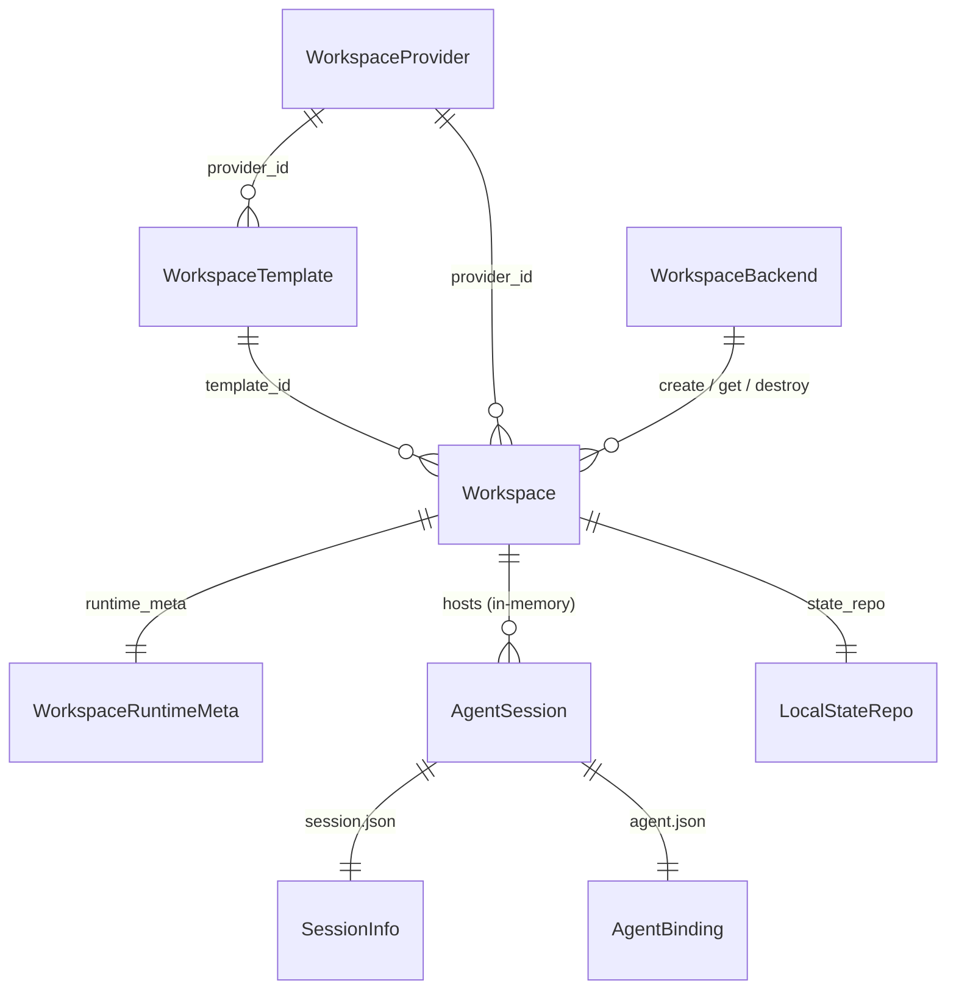
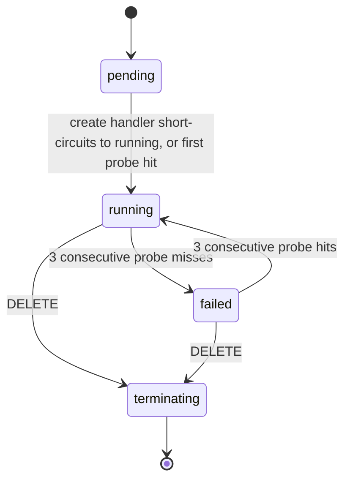
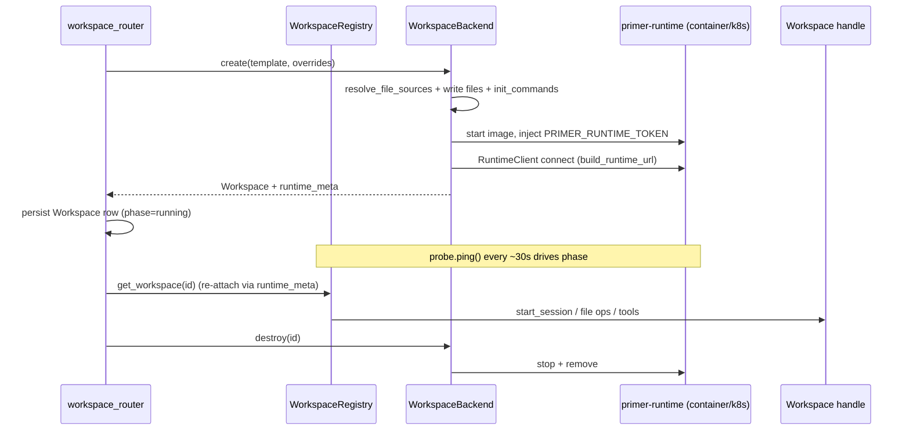

# Workspaces

## 1. Purpose

The workspaces subsystem gives an agent a real place to live: one materialised sandbox with a filesystem, a shell, a git-backed `.state/` history repo, a `.tmp/` truncation cache, the seven workspace tools (`ls`, `read`, `write`, `edit`, `glob`, `grep`, `exec`), and a registry of `AgentSession` handles that run on it. A workspace is backend-agnostic: the same `Workspace` contract is satisfied by ordinary host directories (`LocalWorkspace`), by a long-lived Docker/Podman/containerd container (`SandboxWorkspace` over a container backend), and by a Kubernetes StatefulSet (`SandboxWorkspace` over the k8s backend). A workspace owns both the filesystem and the execution environment; decoupling the two would re-open the host-side execution hole the sandbox closes.

The subsystem is the substrate that the session, agent-runtime, and graph-executor layers build on. It provides the durable state store every turn commits into, the per-session output cache the tools page through, the user-facing file-browse and download surface, and the append primitives (`append_message_line`, `append_state_line`) that the streaming session writer and the turn-log writer use to land per-session `messages.jsonl` and per-turn `turns.jsonl` inside the workspace. This document covers the workspace machinery (templates, providers, backends, the runtime transport, state, cache, tools, and the phase/probe lifecycle). The session scheduler row, the yielding-tool park machine, and the turn-log writer family are owned by neighbouring subsystem docs and are cross-referenced rather than restated here.

## 2. Conceptual model

A `WorkspaceProvider` (`primer/model/workspace.py`) is a persisted, identifiable backend configuration row: a `WorkspaceProviderType` (`LOCAL` / `CONTAINER` / `KUBERNETES`) plus a discriminated `config` carrying only connection and reachability parameters. A `WorkspaceTemplate` is the declarative materialisation recipe; it references a `WorkspaceProvider` by `provider_id` and carries the per-backend `backend` config (`LocalTemplateConfig` / `ContainerTemplateConfig` / `KubernetesTemplateConfig`) that owns the image, resources, mounts, volumes, and overrides. A `Workspace` row is the API-layer bookkeeping for one materialised sandbox: it pins `template_id` + `provider_id`, an optional `overrides` snapshot, the `phase` lifecycle field, and a `WorkspaceRuntimeMeta` (URL + bearer token + reachability coordinates) used to re-attach after a process restart.

At runtime the `Workspace` ABC (`primer/int/workspace.py`) is the live handle. It owns the `LocalStateRepo` (or `SandboxStateRepo`), the `LocalTruncationStore` (or `SandboxTruncationStore`), the seven `WorkspaceTool` instances, and an in-memory registry of `AgentSession` handles. The split between the persisted backend-config (`WorkspaceProvider`) and the lifecycle ABC (`WorkspaceBackend`) is a naming inversion relative to the original spec: the spec called the lifecycle ABC `WorkspaceProvider`, but once backend configs became first-class API rows (mirroring `LLMProvider`) the row took the `WorkspaceProvider` name and the ABC was renamed `WorkspaceBackend`.

## 3. Architecture patterns implemented

- **Provider pattern.** `WorkspaceBackend` is a sibling ABC to `LLM`, `Embedder`, `Storage`, and `VectorStore`. `WorkspaceBackendFactory.create` (`primer/workspace/factory.py`) resolves a persisted `WorkspaceProvider` row to a concrete backend (`LocalWorkspaceBackend`, `ContainerWorkspaceBackend`, or `KubernetesWorkspaceBackend`). See [provider pattern](../architecture/provider-pattern.md).
- **State persistence via git.** The `.state/` repo is a per-workspace git store; one commit per assistant turn on a single linear trunk, with `X-Primer-*` trailers for greppable history. See [storage](../architecture/storage.md).
- **REST resource + sub-resources.** The workspace routes expose `WorkspaceProvider` and `WorkspaceTemplate` CRUD plus a bespoke `Workspace` create/list/get/delete and per-workspace sub-resources for sessions, files, log, and diagnostic. See [rest API](../architecture/rest-api.md).
- **Health probe as a leader-elected background task.** `WorkspaceProbeTask` drives the `phase` machine on a ~30s loop, reconciling sessions on workspace failure. See [observability](../architecture/observability.md).
- **First-boot provisioning.** The `local` `WorkspaceProvider` and a default `WorkspaceTemplate` are written by the bootstrap runner; `local` is a reserved provider id. See [auto-bootstrap](../architecture/auto-bootstrap.md).
- **Persistent WS transport instead of per-op exec.** Container and k8s workspaces drive every file/exec/watch op over one multiplexed WebSocket to an in-container `primer-runtime` server, rather than `docker exec` per op.

## 4. Code layout

| Path | Responsibility |
| --- | --- |
| `primer/int/workspace.py` | The `Workspace` and `WorkspaceBackend` ABCs. `Workspace` carries the tool surface, session lifecycle, file-browse surface, `status` / `ping` / `diagnostic_exec`, the `append_message_line` / `append_state_line` writer protocol, and the `state_repo` / `runtime_meta` / `state_path` properties. |
| `primer/int/sandbox.py` | The `Sandbox` ABC (universal exec + filesystem interface: `exec`, `read_file`, `write_file`, `append_file`, `append_line`, `list_dir`, `stat`, `delete`, `archive`, `inspect`, `stop`, `remove`) plus `ExecResult` / `FileStat` / `SandboxInspectInfo`. |
| `primer/model/workspace.py` | All workspace models: `WorkspaceTemplate`, `FileMount` / `FileSource`, `ResourceLimits`, `WorkspaceTemplateOverrides`, `FileEntry`, `CommitInfo`, `Op`, the discriminated template/provider config unions, `WorkspaceProvider`, `WorkspaceRuntimeMeta`, `WorkspaceStatus`, `WorkspaceDiagnosticResult`, and the persisted `Workspace` row. |
| `primer/model/workspace_session.py` | `SessionStatus`, `SessionInfo`, `AgentBinding`, `WaitingState`, `Instruction`, plus the scheduler-visible `WorkspaceSession` row, `SessionBinding` union, and `SessionMessageRecord` (these belong to the sessions doc). |
| `primer/workspace/session.py` | The concrete `AgentSession`: status transitions, `append_instruction`, `request_pause` / `request_resume` / `request_end`, `set_status` (waiting.json create/delete), `take_pending_messages`, `commit_state`, `cache_output`, `mark_read` / `was_read`, `system_prompt_fragment`, `workspace_tools`. |
| `primer/workspace/tool.py` | The `WorkspaceTool` ABC, `ToolCallContext`, and `ToolResult`. |
| `primer/workspace/local/` | `LocalWorkspaceBackend`, `LocalWorkspace`, `LocalStateRepo`, `LocalTruncationStore`, and `tools/` (the seven host-FS tools). |
| `primer/workspace/sandbox/` | `SandboxWorkspace`, `SandboxStateRepo`, `SandboxTruncationStore`, `FakeSandbox`, and `tools/` (the seven sandbox tools). Shared by container and k8s. |
| `primer/workspace/container/backend.py`, `primer/workspace/k8s/backend.py` | The container and Kubernetes `WorkspaceBackend` implementations. |
| `primer/workspace/runtime/` | The `ContainerRuntimeAdapter` ABC; `docker.py` (real), `podman.py` + `containerd/adapter.py` (stubs that raise `ConfigError`); `WSSandbox`, `RuntimeClient`, `protocol.py`, `url.py`. |
| `primer/workspace/k8s/naming.py` | `k8s_object_name()` hashes long workspace ids to DNS-1123-safe object names. |
| `primer/workspace/files.py` | `resolve_file_sources()` resolves every `FileSource` variant in the platform process before the backend writes the bytes. |
| `primer/workspace/probe.py` | `WorkspaceProbeTask`, the phase-driving health probe. |
| `primer/workspace/factory.py` | `WorkspaceBackendFactory`, provider row to backend dispatch. |
| `primer/workspace/config_compat.py` | Documented legacy-config translation hooks (no-op today). |
| `primer/api/routers/workspaces.py` | `provider_router`, `template_router`, `workspace_router`, plus `sessions_router`, `files_router`, `log_router`. |
| `primer/api/registries/workspace_registry.py` | `WorkspaceRegistry` resolves a persisted `Workspace` row + template to a live backend handle, including re-attach after restart. |
| `runtime/primer_runtime/` | The in-container WebSocket runtime server (built into `primer/workspace-runtime:1.0`); implements the `Sandbox` ops server-side. |

## 5. Data model

`WorkspaceTemplate` (a `Describeable`) carries `provider_id`, a discriminated `backend` config, `files: list[FileMount]`, `env: dict[str, SecretStr]`, `init_commands`, `state_path` (default `.state`), `tmp_path` (default `.tmp`), and `resources: ResourceLimits`. A `model_validator` defaults a missing `backend` to `{kind: 'local'}` and a second `_drop_legacy_packages` validator silently strips the legacy `packages` field with a WARNING log (the image is now the bill of materials). `FileSource` is a discriminated union over `inline` / `url` / `document` / `secret`. The persisted `Workspace` row carries `template_id`, `provider_id`, `overrides`, `created_at`, the `phase` enum, `last_probe_at`, `last_probe_ok`, `failure_reason`, and `runtime_meta`. `WorkspaceRuntimeMeta` holds the `ws[s]://` `url`, a `SecretStr` `token` (redacted on GET), and the reachability coordinates `mapped_host_port` (container/host_port) or `k8s_object_name` (k8s).

`WorkspaceStatus` is the backend-agnostic health snapshot returned from `Workspace.status()`: a universal `state` (`ready` / `starting` / `stopped` / `unreachable` / `destroyed`), a `backend` discriminator, and a free-form `detail` dict. The persisted `Workspace.phase` is a separate, coarser lifecycle field driven by the probe; its state machine:

`POST /v1/workspaces` persists the row directly with `phase='running'` because `WorkspaceBackend.create` already returned a live handle; `pending` survives only as the model default and as a recovery promotion path for rows that bypassed the create handler.

## 6. Lifecycle

`WorkspaceBackend.create(template, overrides)` merges the template and overrides (env overlay, files extend, init_commands extend), resolves every `FileSource` via `resolve_file_sources`, writes the files, runs `init_commands`, and materialises the live `Workspace`. For the local backend this is all host-FS; for container/k8s the backend mints a per-workspace bearer (`secrets.token_urlsafe(32)`), injects it as `PRIMER_RUNTIME_TOKEN`, starts the `primer/workspace-runtime:1.0` image, opens a `RuntimeClient` over the URL `build_runtime_url` derives from the provider's reachability mode, and wraps it in a `WSSandbox` behind a `SandboxWorkspace`. The returned `runtime_meta` is persisted on the row so re-attach after a restart reproduces the connection without re-minting anything. Use happens through `AgentSession` handles and the tool surface; teardown is `Workspace.aclose` (releases the handle, backend decides whether the container/pod survives) or `WorkspaceBackend.destroy` (removes backend resources and state).

## 7. Persistence

Each workspace owns a git-backed `.state/` repo. `LocalStateRepo` (`primer/workspace/local/state.py`) is the host-FS implementation; `SandboxStateRepo` (`primer/workspace/sandbox/state.py`) is the container/k8s twin that dispatches every git op through `Sandbox.exec` in argv form and requires git in the workspace image (failing fast at `initialize()` otherwise). Each session owns the subdirectory `sessions/<session_id>/` holding `session.json` (the `SessionInfo` projection), `agent.json` (the `AgentBinding` snapshot), `messages.jsonl`, and `waiting.json` (present only while `WAITING`). `commit()` stages files under the session slot and writes one commit per assistant turn with `X-Primer-Workspace/Session/Agent/Op/Tool/Call` trailers; a workspace-wide `asyncio.Lock` serialises commits so concurrent sessions never collide on `.git/index.lock`. `delete_files` lets `waiting.json` be removed in the same `status_change` commit that transitions a session out of `WAITING`. `commit_arbitrary()` is the non-session-scoped entry point the graph executor uses for `graphs/<gsid>/` slots, reached through the `Workspace.state_repo` property.

**Subprocess timeout.** Every `git` subprocess spawned by `LocalStateRepo` and every `init_command` shell spawned by `LocalWorkspaceBackend` is bounded by `AppConfig.subprocess_timeout_seconds` (default 120 s, env var `PRIMER_SUBPROCESS_TIMEOUT_SECONDS`, or `subprocess_timeout_seconds:` in `config.yaml`). On breach the subprocess is killed and `SubprocessTimeoutError` is raised, releasing the `asyncio.Lock` commit lock so the event loop is not frozen. The in-container runtime (`primer_runtime/ops.py`) reads the same env var and applies the same kill-on-timeout to every git op dispatched via the WebSocket protocol.

**Cross-process rehydration (parity across all three backends).** The live `Workspace` handle keeps an in-memory `AgentSession` registry, but a session is created in one process (the API allocates the slot via `start_session`) and driven in another (a worker builds the executor and runs the turn), and both must survive a platform restart. The persisted `.state/` repo is the source of truth, so every backend reconstructs a missing handle from it rather than treating the in-memory dict as authoritative:

- **Local** (`LocalWorkspace.get_session`): on an in-memory miss it reloads `session.json` + `agent.json` from `<root>/.state/sessions/<sid>/` and rebuilds the `AgentSession`; `None` only when no slot exists on disk.
- **Container / k8s** (`SandboxWorkspace.get_session` / `list_sessions`): identical contract, but the `.state/` tree is a runtime-managed git repo reached over the WebSocket, so the slot is reloaded via `SandboxStateRepo.load_session_info` / `load_agent_binding` (the `STATE_READ` op). `list_sessions` first enumerates every persisted session via `SandboxStateRepo.list_session_ids`, which collects the distinct, non-empty `Session:` trailers from the `state_history` (`STATE_HISTORY`) commit log (the transport-agnostic parallel to the local backend's on-disk `sessions/` scan) and rebuilds any handle not already cached. `remove_session` unbinds the in-memory handle (the on-disk slot is reaped by the DELETE handler), matching the local backend so a rehydrating `list_sessions` does not re-surface a deleted session. The in-memory fast path is always tried first; rehydration runs only on a miss.

Workspace-handle re-attach (rebuilding the whole `SandboxWorkspace` after a restart, not just one session) needs the live runtime connection back, which means recovering the per-workspace bearer token the platform does not keep in process memory:

- **Container** (`DockerRuntimeAdapter.get_sandbox`): looks the container up by name (`workspace-<id>`), and for a `running` container recovers the token from `docker inspect` (`Config.Env` -> `PRIMER_RUNTIME_TOKEN`, falling back to the `RUNTIME_TOKEN` alias, both injected at create time), reconnects the `RuntimeClient` against the same URL the create path built (host-port vs bridge per the provider's reachability), and returns a live `WSSandbox`. Returns `None` for an absent or non-running container, or when the token cannot be recovered. The recovered token is stashed on the sandbox (`recovered_token`) so `ContainerWorkspaceBackend.get` folds it back into the workspace `runtime_meta`. `ContainerWorkspaceBackend.list` enumerates by the `primer.workspace.id` container label.
- **Kubernetes** (`KubernetesWorkspaceBackend.get` / `list`): `get` recovers the token from the per-workspace Secret (`_read_runtime_token`) and reconnects; `list` enumerates the live StatefulSets by the `app.kubernetes.io/managed-by=primer` label selector and maps each back to its workspace id via the `primer.workspace.id` label (unioned with in-memory handles for workspaces mid-create, with a fallback to the in-memory set on a transient apiserver error), so a workspace materialised by another process or a previous run appears in the listing, at parity with the container label scan and the local backend's on-disk durability.

The `.tmp/` truncation cache (`LocalTruncationStore` / `SandboxTruncationStore`) holds oversized tool output under per-session subdirectories `<root>/<session_id>/tool_<nanos>_<counter>.txt`. The defaults are a 2000-line / 50 KiB threshold with head-or-tail preview; an hourly background sweep enforces 7-day retention by reading the nanos prefix from the filename, and `cleanup_session(session_id)` reaps a session's whole subdirectory immediately on the transition to `ENDED`. Turn-log JSONL (`sessions/<sid>/turns.jsonl`, `graphs/<gsid>/turns.jsonl`) is written via `append_state_line` and deliberately bypasses the git-commit pipeline because it is high-write-rate observability data with no audit-trail value; the turn-log writer family itself lives in the observability subsystem.

## 8. Public surfaces

The REST surface is `primer/api/routers/workspaces.py`. `provider_router` and `template_router` are `make_crud_router` instances (full CRUD; `local` is rejected on create/update/delete with a 409 because it is a reserved bootstrap id). `workspace_router` is bespoke: `GET` list/get, `POST` create (the provider is derived from the template's `provider_id`, never supplied in the body), `DELETE`, plus `POST .../pause` and `POST .../resume` (both wired as 501 stubs) and `POST .../diagnostic`. The diagnostic route whitelists the head command token against `{echo, pwd, whoami, uname, ls}` at the router and returns a `WorkspaceDiagnosticResult`; a `kubernetes` provider with `variant=='agent_sandbox'` returns 501 at workspace create. Sub-resources mount per-workspace: `sessions_router`, `files_router` (list / info / read / download / delete / write), and `log_router` (git log over `.state`, plus single-commit show).

The in-process surface is the `Workspace` ABC: `get_tools()`, `start_session` / `list_sessions` / `get_session` / `remove_session`, the user-facing file mutators (`list_files`, `file_info`, `read_file`, `write_file`, `delete_file`, tar-streamed `download_archive` that excludes `.state` and `.tmp` by default), `log`, `status`, `ping`, `diagnostic_exec`, and the `append_message_line` / `append_state_line` writer protocol. The `AgentSession` surface splits into a user-facing half (`append_instruction`, `request_pause` / `request_resume` / `request_end`) and a runtime-facing half (`set_status`, `commit_state`, `cache_output`, `take_pending_messages`, `mark_read` / `was_read`).

## 9. Internal contracts

The seven workspace tools are workspace-local and are NOT a `ToolsetProvider`: they are not in the global tools collection, and the agent/graph runtime composes them onto the agent's other tools at session start because they require an `AgentSession` for state attribution and tmp-cache scoping. `read` returns offset/limit line-numbered output; `write` enforces read-before-write via `AgentSession.was_read` / `mark_read`; `edit` returns a unified diff and errors on a missing or non-unique `old_string` without `replace_all`; `exec` with `background=true` currently raises `NotImplementedError`. `ToolCallContext` carries `workspace_id` / `session_id` / `agent_id` / `call_id`, an `asyncio.Event` abort flag, the live `AgentSession` handle, and optional `metadata_callback` / `ask_callback` (typed as `Any` until the approval protocol lands).

`AgentSession.set_status` validates every transition through a `_LEGAL_TRANSITIONS` table where `ENDED` is terminal; entering `WAITING` requires a `WaitingState` (persisted to `waiting.json` as a discriminated union of `_UserInputWaiting` / `_ToolApprovalWaiting`) and leaving it deletes the file in the same commit. The `Sandbox` ABC is the lower-layer contract under non-local backends: `SandboxWorkspace` wraps any `Sandbox` into a `Workspace`, and `WSSandbox` is the single `Sandbox` impl that satisfies every container and k8s runtime by delegating over `RuntimeClient` to the in-container server (container lifecycle `stop`/`remove` is delegated to a `ContainerHandle` Protocol the adapter supplies, so the runtime layer stays orchestration-agnostic). `Sandbox.append_line` is the atomic append primitive used for session streaming; `WSSandbox` overrides the default read-modify-write to use the runtime's native `APPEND_LINE` op.

The `WorkspaceProbeTask` contract: it pages `Workspace` rows, calls `handle.ping()` via the registry, drives `phase` on three-strike streak counters held on the task (not the registry), and on a flip to `failed` reconciles every non-`ENDED` `WorkspaceSession` on that workspace as `ENDED` with `ended_reason='workspace_lost'`.

## 10. Testing patterns

`FakeSandbox` (`primer/workspace/sandbox/fake.py`) is an in-process `Sandbox` backed by a host `TemporaryDirectory`; it is the test seam every sandbox unit test shares and is excluded from the coverage gate (the same exemption as `InMemoryScheduler`). The `tests/workspace/` suite covers `LocalStateRepo`, `LocalTruncationStore`, the local-workspace integration, the factory, `config_compat`, file sources, the runtime client/url/protocol, `WSSandbox`, ping/probe, the sandbox contract, container reachability, k8s naming, and the k8s runtime migration; `tests/workspace/tools/` and `tests/workspace/sandbox/` cover the two parallel tool implementations. The Docker backend integration test is gated (skips without a daemon + the `primer/workspace-runtime:1.0` image); it now also covers the `get_sandbox` cross-process re-attach (write through the original handle, drop its `RuntimeClient`, re-attach via the recovered token, read the file back). `tests/workspace/test_docker_get_sandbox_unit.py` exercises the same re-attach contract and the `_token_from_inspect` env recovery with a mocked aiodocker client (no daemon). `tests/workspace/sandbox/test_sandbox_workspace.py` covers session rehydration / `list_sessions` re-enumeration / `remove_session` via two `SandboxWorkspace` wrappers over one `FakeSandbox` (the API/worker split), and `tests/workspace/sandbox/test_sandbox_state.py` covers `SandboxStateRepo.list_session_ids` against a mocked `state_history`. `tests/workspace/k8s/test_k8s_manifest.py` covers `KubernetesWorkspaceBackend.list` label enumeration with a mocked `apps_v1`; `tests/workspace/k8s/test_k8s_list_integration.py` is the gated live-cluster variant (skips without a reachable kubeconfig / in-cluster config). `tests/api/test_workspaces.py` covers the provider/template CRUD round-trips for all three backends, the 422 backend-kind mismatch, reserved-id rejection, the `agent_sandbox` 501, and the diagnostic whitelist; `tests/distributed/` exercises the probe and re-attach paths across two processes.

## 11. Historical decisions

- **The lifecycle ABC was renamed from `WorkspaceProvider` to `WorkspaceBackend` and `WorkspaceProvider` was reused for the persisted backend-config row.** Why: once backend configurations became first-class API rows mirroring `LLMProvider`, the row deserved the `WorkspaceProvider` name and the ABC had to free it. Spec: docs/superpowers/specs/2026-05-02-workspace-design.md.
- **The deferred S3 snapshot mode was abandoned in favour of three real sandbox-style backends, because a workspace must own both the filesystem and the execution environment.** Why: decoupling the filestore from the exec target re-opened the host-side execution hole the sandbox was meant to close. Spec: docs/superpowers/specs/2026-05-11-workspace-backends-design.md.
- **Per-runtime `Sandbox` impls (Docker/Podman/containerd) were dropped for a single `WSSandbox` that talks to an in-container `primer-runtime` over WebSocket.** Why: a uniform wire protocol across runtimes and substrates made the runtime image the only component that knows how to do file ops and exec, so adding a runtime became a lifecycle problem only. Spec: docs/superpowers/specs/2026-05-11-workspace-backends-design.md.
- **A persistent in-container WebSocket runtime replaced per-op `docker exec` for file, exec, and watch operations.** Why: each `docker exec` cost ~50-100ms, ballooning yielding-tool wake latency into the 500-1000ms range; a multiplexed connection returns file ops to sub-millisecond and watches to inotify-push latency. Spec: docs/superpowers/specs/2026-05-27-workspace-runtime-protocol-design.md.
- **Image, resources, mounts, network policy, PVC settings, and pod overrides live on `WorkspaceTemplate`; the provider carries only connection and reachability.** Why: provider config is per-deployment and the recipe is per-template, so one provider can materialise many distinct workspaces and templates can move between providers. Spec: docs/superpowers/specs/2026-05-11-workspace-backends-design.md.
- **Reachability became a first-class provider config field (host_port / bridge_network / in_cluster / ingress) consumed by `build_runtime_url`.** Why: one platform deployment can host any of the four topologies without a rebuild, with URL construction a pure function of reachability mode plus workspace id. Spec: docs/superpowers/specs/2026-05-29-workspace-stack-redesign-design.md.
- **Image-as-BOM: `WorkspaceTemplate` no longer carries a runtime `packages` list, and a validator silently strips the legacy field.** Why: installing packages at materialisation time is slow, racy, and duplicates the image build; baking dependencies into the image keeps materialisation deterministic. Spec: docs/superpowers/specs/2026-05-29-workspace-stack-redesign-design.md.
- **`WaitingState` is a discriminated union persisted to `waiting.json` only while `WAITING` and deleted in the same commit on transition out.** Why: collapsing waiting-input and waiting-approval into one `SessionStatus` value with a forward-compatible union lets new wait kinds be added without enum or storage changes. Spec: docs/superpowers/specs/2026-05-02-workspace-design.md.
- **One commit per assistant turn on a single linear trunk with a workspace-wide commit lock.** Why: per-session history stays greppable via standard git tooling while short commits keep `.git/index.lock` contention between concurrent sessions safe. Spec: docs/superpowers/specs/2026-05-02-workspace-design.md.
- **The truncation cache is per-session with hourly 7-day retention and immediate reap on `ENDED`.** Why: per-session subdirectories keep one session's cache files out of another's listing, make the paths the agent sees self-attributable, and let `ENDED` release disk without waiting for the sweep. Spec: docs/superpowers/specs/2026-05-02-workspace-design.md.
- **Workspace tools are workspace-local and composed onto the agent at session start rather than registered as a `ToolsetProvider`.** Why: they need an `AgentSession` for state attribution and tmp scoping, so their lifetime is the workspace's, not the agent's, and conflating them would pollute the global tools collection. Spec: docs/superpowers/specs/2026-05-02-workspace-design.md.
- **A per-workspace bearer token, lifetime equal to the sandbox, authenticates the runtime hop, persisted as a `SecretStr` on `WorkspaceRuntimeMeta`.** Why: workspace-lifetime tokens avoid a key-rotation control plane while isolating each workspace; mTLS or per-session tokens were over-engineering for a loopback or in-cluster hop. Spec: docs/superpowers/specs/2026-05-27-workspace-runtime-protocol-design.md.
- **K8s `Sandbox.stop` scales the StatefulSet to zero rather than deleting the pod, and override merging rejects a forbidden-keys allowlist.** Why: deleting a StatefulSet pod triggers immediate recreation, so scaling preserves the PVC; the allowlist (`securityContext`, `hostPath`, `hostNetwork`, etc.) stops template authors escalating to host root. Spec: docs/superpowers/specs/2026-05-11-workspace-backends-design.md.
- **The `WorkspaceProbeTask` reconciles non-`ENDED` sessions on a failed workspace as `ENDED/workspace_lost`, a cascade not in the original spec.** Why: without it, sessions on a dead runtime are orphaned forever because the worker can never re-attach to drive them to `ENDED`. Spec: docs/superpowers/specs/2026-05-29-workspace-stack-redesign-design.md.
- **`primer/api/routers/workspaces.py` exposes no Workspace `Update`; contents are mutated through the files and sessions sub-APIs.** Why: a workspace row is bookkeeping and its contents are not re-PUT-able state, so there is no coherent update semantics for the row itself. Spec: docs/superpowers/specs/2026-05-02-workspace-design.md.
