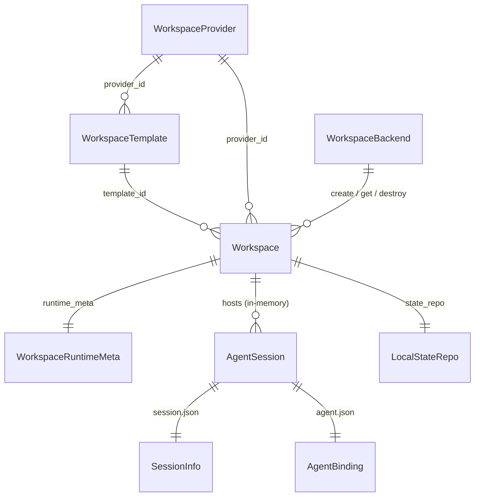
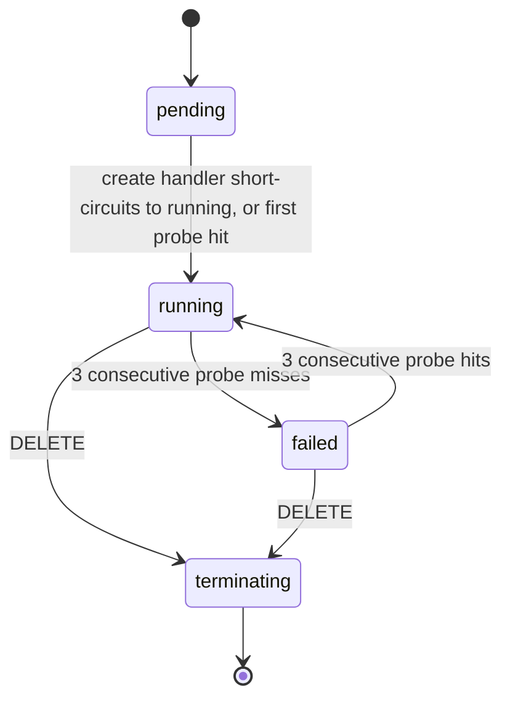
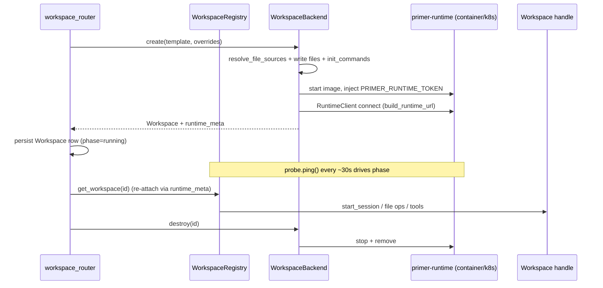

# Workspaces

## 1. Purpose

The workspaces subsystem gives an agent a real place to live: one materialised sandbox with a filesystem, a shell, a git-backed `.state/` history repo, a `.tmp/` truncation cache, the seven workspace tools (`ls`, `read`, `write`, `edit`, `glob`, `grep`, `exec`), and a registry of `AgentSession` handles that run on it. A workspace is backend-agnostic: the same `Workspace` contract is satisfied by ordinary host directories (`LocalWorkspace`), by a long-lived Docker/Podman/containerd container (`SandboxWorkspace` over a container backend), and by a Kubernetes StatefulSet (`SandboxWorkspace` over the k8s backend). A workspace owns both the filesystem and the execution environment; decoupling the two would re-open the host-side execution hole the sandbox closes.

The subsystem is the substrate that the session, agent-runtime, and graph-executor layers build on. It provides the durable state store every turn commits into, the per-session output cache the tools page through, the user-facing file-browse and download surface, and the append primitives (`append_message_line`, `append_state_line`) that the streaming session writer and the turn-log writer use to land per-session `messages.jsonl` and per-turn `turns.jsonl` inside the workspace. This document covers the workspace machinery (templates, providers, backends, the runtime transport, state, cache, tools, and the phase/probe lifecycle). The session scheduler row, the yielding-tool park machine, and the turn-log writer family are owned by neighbouring subsystem docs and are cross-referenced rather than restated here.

## 2. Conceptual model

A `WorkspaceProvider` (`primer/model/workspace.py`) is a persisted, identifiable backend configuration row: a `WorkspaceProviderType` (`LOCAL` / `CONTAINER` / `KUBERNETES`) plus a discriminated `config` carrying only connection and reachability parameters. A `WorkspaceTemplate` is the declarative materialisation recipe; it references a `WorkspaceProvider` by `provider_id` and carries the per-backend `backend` config (`LocalTemplateConfig` / `ContainerTemplateConfig` / `KubernetesTemplateConfig`) that owns the image, resources, mounts, volumes, and overrides. A `Workspace` row is the API-layer bookkeeping for one materialised sandbox: it pins `template_id` + `provider_id`, an optional `overrides` snapshot, the `phase` lifecycle field, and a `WorkspaceRuntimeMeta` (URL + bearer token + reachability coordinates) used to re-attach after a process restart.

At runtime the `Workspace` ABC (`primer/int/workspace.py`) is the live handle. It owns the `LocalStateRepo` (or `SandboxStateRepo`), the `LocalTruncationStore` (or `SandboxTruncationStore`), the seven `WorkspaceTool` instances, and an in-memory registry of `AgentSession` handles. The split between the persisted backend-config (`WorkspaceProvider`) and the lifecycle ABC (`WorkspaceBackend`) is a naming inversion relative to the original spec: the spec called the lifecycle ABC `WorkspaceProvider`, but once backend configs became first-class API rows (mirroring `LLMProvider`) the row took the `WorkspaceProvider` name and the ABC was renamed `WorkspaceBackend`.

```mermaid
erDiagram
    WorkspaceProvider ||--o{ WorkspaceTemplate : "provider_id"
    WorkspaceTemplate ||--o{ Workspace : "template_id"
    WorkspaceProvider ||--o{ Workspace : "provider_id"
    Workspace ||--|| WorkspaceRuntimeMeta : "runtime_meta"
    Workspace ||--o{ AgentSession : "hosts (in-memory)"
    Workspace ||--|| LocalStateRepo : "state_repo"
    AgentSession ||--|| SessionInfo : "session.json"
    AgentSession ||--|| AgentBinding : "agent.json"
    WorkspaceBackend ||--o{ Workspace : "create / get / destroy"
```

## 3. Architecture patterns implemented

- **Provider pattern.** `WorkspaceBackend` is a sibling ABC to `LLM`, `Embedder`, `Storage`, and `VectorStore`. `WorkspaceBackendFactory.create` (`primer/workspace/factory.py`) resolves a persisted `WorkspaceProvider` row to a concrete backend (`LocalWorkspaceBackend`, `ContainerWorkspaceBackend`, or `KubernetesWorkspaceBackend`). See [provider pattern](../architecture/provider-pattern.md).
- **State persistence via git.** The `.state/` repo is a per-workspace git store; one commit per assistant turn on a single linear trunk, with `X-Primer-*` trailers for greppable history. See [storage](../architecture/storage.md).
- **REST resource + sub-resources.** The workspace routes expose `WorkspaceProvider` and `WorkspaceTemplate` CRUD plus a bespoke `Workspace` create/list/get/delete and per-workspace sub-resources for sessions, files, log, and diagnostic. See [rest API](../architecture/rest-api.md).
- **Health probe as a leader-elected background task.** `WorkspaceProbeTask` drives the `phase` machine on a ~30s loop, reconciling sessions on workspace failure. See [observability](../architecture/observability.md).
- **First-boot provisioning.** The `local` `WorkspaceProvider` and a default `WorkspaceTemplate` are written by the bootstrap runner; `local` is a reserved provider id. See [auto-bootstrap](../architecture/auto-bootstrap.md).
- **Persistent WS transport instead of per-op exec.** Container and k8s workspaces drive every file/exec/watch op over one multiplexed WebSocket to an in-container `primer-runtime` server, rather than `docker exec` per op.

## 4. Code layout

| Path | Responsibility |
| --- | --- |
| `primer/int/workspace.py` | The `Workspace` and `WorkspaceBackend` ABCs. `Workspace` carries the tool surface, session lifecycle, file-browse surface, `status` / `ping` / `diagnostic_exec`, the `append_message_line` / `append_state_line` writer protocol, and the `state_repo` / `runtime_meta` / `state_path` properties. |
| `primer/int/sandbox.py` | The `Sandbox` ABC (universal exec + filesystem interface: `exec`, `read_file`, `write_file`, `append_file`, `append_line`, `list_dir`, `stat`, `delete`, `archive`, `inspect`, `stop`, `remove`) plus `ExecResult` / `FileStat` / `SandboxInspectInfo`. |
| `primer/model/workspace.py` | All workspace models: `WorkspaceTemplate`, `FileMount` / `FileSource`, `ResourceLimits`, `WorkspaceTemplateOverrides`, `FileEntry`, `CommitInfo`, `Op`, the discriminated template/provider config unions, `WorkspaceProvider`, `WorkspaceRuntimeMeta`, `WorkspaceStatus`, `WorkspaceDiagnosticResult`, and the persisted `Workspace` row. |
| `primer/model/workspace_session.py` | `SessionStatus`, `SessionInfo`, `AgentBinding`, `WaitingState`, `Instruction`, plus the scheduler-visible `WorkspaceSession` row, `SessionBinding` union, and `SessionMessageRecord` (these belong to the sessions doc). |
| `primer/workspace/session.py` | The concrete `AgentSession`: status transitions, `append_instruction`, `request_pause` / `request_resume` / `request_end`, `set_status` (waiting.json create/delete), `take_pending_messages`, `commit_state`, `cache_output`, `mark_read` / `was_read`, `system_prompt_fragment`, `workspace_tools`. |
| `primer/workspace/tool.py` | The `WorkspaceTool` ABC, `ToolCallContext`, and `ToolResult`. |
| `primer/workspace/local/` | `LocalWorkspaceBackend`, `LocalWorkspace`, `LocalStateRepo`, `LocalTruncationStore`, and `tools/` (the seven host-FS tools). |
| `primer/workspace/sandbox/` | `SandboxWorkspace`, `SandboxStateRepo`, `SandboxTruncationStore`, `FakeSandbox`, and `tools/` (the seven sandbox tools). Shared by container and k8s. |
| `primer/workspace/container/backend.py`, `primer/workspace/k8s/backend.py` | The container and Kubernetes `WorkspaceBackend` implementations. |
| `primer/workspace/runtime/` | The `ContainerRuntimeAdapter` ABC; `docker.py` (real), `podman.py` + `containerd/adapter.py` (stubs that raise `ConfigError`); `WSSandbox`, `RuntimeClient`, `protocol.py`, `url.py`. |
| `primer/workspace/k8s/naming.py` | `k8s_object_name()` hashes long workspace ids to DNS-1123-safe object names. |
| `primer/workspace/files.py` | `resolve_file_sources()` resolves every `FileSource` variant in the platform process before the backend writes the bytes. |
| `primer/workspace/probe.py` | `WorkspaceProbeTask`, the phase-driving health probe. |
| `primer/workspace/factory.py` | `WorkspaceBackendFactory`, provider row to backend dispatch. |
| `primer/workspace/config_compat.py` | Documented legacy-config translation hooks (no-op today). |
| `primer/api/routers/workspaces.py` | `provider_router`, `template_router`, `workspace_router`, plus `sessions_router`, `files_router`, `log_router`. |
| `primer/api/registries/workspace_registry.py` | `WorkspaceRegistry` resolves a persisted `Workspace` row + template to a live backend handle, including re-attach after restart. |
| `runtime/primer_runtime/` | The in-container WebSocket runtime server (built into `primer/workspace-runtime:1.1`); implements the `Sandbox` ops server-side. |

## 5. Data model

`WorkspaceTemplate` (a `Describeable`) carries `provider_id`, a discriminated `backend` config, `files: list[FileMount]`, `env: dict[str, SecretStr]`, `init_commands`, `state_path` (default `.state`), `tmp_path` (default `.tmp`), and `resources: ResourceLimits`. A `model_validator` defaults a missing `backend` to `{kind: 'local'}` and a second `_drop_legacy_packages` validator silently strips the legacy `packages` field with a WARNING log (the image is now the bill of materials). `FileSource` is a discriminated union over `inline` / `url` / `document` / `secret`. The persisted `Workspace` row carries `template_id`, `provider_id`, `overrides`, `created_at`, the `phase` enum, `last_probe_at`, `last_probe_ok`, `failure_reason`, and `runtime_meta`. `WorkspaceRuntimeMeta` holds the `ws[s]://` `url`, a `SecretStr` `token` (redacted on GET), and the reachability coordinates `mapped_host_port` (container/host_port) or `k8s_object_name` (k8s).

`WorkspaceStatus` is the backend-agnostic health snapshot returned from `Workspace.status()`: a universal `state` (`ready` / `starting` / `stopped` / `unreachable` / `destroyed`), a `backend` discriminator, and a free-form `detail` dict. The persisted `Workspace.phase` is a separate, coarser lifecycle field driven by the probe; its state machine:

```mermaid
stateDiagram-v2
    [*] --> pending
    pending --> running : create handler short-circuits to running, or first probe hit
    running --> failed : 3 consecutive probe misses
    failed --> running : 3 consecutive probe hits
    running --> terminating : DELETE
    failed --> terminating : DELETE
    terminating --> [*]
```

`POST /v1/workspaces` persists the row directly with `phase='running'` because `WorkspaceBackend.create` already returned a live handle; `pending` survives only as the model default and as a recovery promotion path for rows that bypassed the create handler.

## 6. Lifecycle

`WorkspaceBackend.create(template, overrides)` merges the template and overrides (env overlay, files extend, init_commands extend), resolves every `FileSource` via `resolve_file_sources`, writes the files, runs `init_commands`, and materialises the live `Workspace`. For the local backend this is all host-FS; for container/k8s the backend mints a per-workspace bearer (`secrets.token_urlsafe(32)`), injects it as `PRIMER_RUNTIME_TOKEN`, starts the `primer/workspace-runtime:1.1` image, opens a `RuntimeClient` over the URL `build_runtime_url` derives from the provider's reachability mode, and wraps it in a `WSSandbox` behind a `SandboxWorkspace`. The returned `runtime_meta` is persisted on the row so re-attach after a restart reproduces the connection without re-minting anything. Use happens through `AgentSession` handles and the tool surface; teardown is `Workspace.aclose` (releases the handle, backend decides whether the container/pod survives) or `WorkspaceBackend.destroy` (removes backend resources and state).

```mermaid
sequenceDiagram
    participant API as workspace_router
    participant Reg as WorkspaceRegistry
    participant Be as WorkspaceBackend
    participant RT as primer-runtime (container/k8s)
    participant WS as Workspace handle

    API->>Be: create(template, overrides)
    Be->>Be: resolve_file_sources + write files + init_commands
    Be->>RT: start image, inject PRIMER_RUNTIME_TOKEN
    Be->>RT: RuntimeClient connect (build_runtime_url)
    Be-->>API: Workspace + runtime_meta
    API->>API: persist Workspace row (phase=running)
    Note over Reg,RT: probe.ping() every ~30s drives phase
    API->>Reg: get_workspace(id) (re-attach via runtime_meta)
    Reg->>WS: start_session / file ops / tools
    API->>Be: destroy(id)
    Be->>RT: stop + remove
```

**The runtime is not listening when its container has started.** A Docker container is waited on through the runtime's ready marker (`/workspace/.runtime.ready`, polled by `_wait_for_ready` for up to 30 s). The marker is plumbing, not the user's file: `GET /v1/workspaces/{id}/files/tree` hides it at the workspace root by default (it shows with `hidden=true`, like `.state`) and `GET .../files` always omits it (`_is_runtime_marker` in `primer/api/routers/workspaces.py`), so it never appears in the Files sidebar; a file of that name below the root is the user's and is listed. The match is on the path, so a directory or a symlink named `.runtime.ready` at the root is hidden too. The flat listing drops the marker before it slices the page (so `total` and the pages ignore it), and a recursive walk asks for one entry more than the page needs so that dropping the marker never leaves a page short. It is hidden in the listing rather than relocated outside `/workspace`, which would be a runtime-protocol change (`PROTOCOL_VERSION`, both protocol copies, the docker adapter's wait). A k8s pod is `Running` as soon as its container has started, which is before the runtime process serves, so `KubernetesWorkspaceBackend._connect_runtime` (used by `create` and by the re-attach after a cache miss) retries the connect with a FRESH `RuntimeClient` per attempt (a failed connect leaves its aiohttp session behind) and a growing pause (0.25 s doubling to 2 s) for up to `_RUNTIME_READY_TIMEOUT_S` (60 s). Only "not serving yet" is retried: a refused or dropped connection, a hello that timed out, a gateway answering 404, 502, 503 or 504; a 401 or 403, a TLS failure or a protocol error fails at once with its own error. A runtime that never answers fails the create with a `ConfigError` naming the workspace, the number of attempts and the last error, and the objects that create made are rolled back, as for a pod that never reaches Running.

## 7. Persistence

Each workspace owns a git-backed `.state/` repo. `LocalStateRepo` (`primer/workspace/local/state.py`) is the host-FS implementation; `SandboxStateRepo` (`primer/workspace/sandbox/state.py`) is the container/k8s twin that dispatches every git op through `Sandbox.exec` in argv form and requires git in the workspace image (failing fast at `initialize()` otherwise). Each session owns the subdirectory `sessions/<session_id>/` holding `session.json` (the `SessionInfo` projection), `agent.json` (the `AgentBinding` snapshot), `messages.jsonl`, and `waiting.json` (present only while `WAITING`). `commit()` stages files under the session slot and writes one commit per assistant turn with `X-Primer-Workspace/Session/Agent/Op/Tool/Call` trailers; a workspace-wide `asyncio.Lock` serialises commits so concurrent sessions never collide on `.git/index.lock`. `delete_files` lets `waiting.json` be removed in the same `status_change` commit that transitions a session out of `WAITING`. `commit_arbitrary()` is the non-session-scoped entry point the graph executor uses for `graphs/<gsid>/` slots, reached through the `Workspace.state_repo` property.

**Subprocess timeout.** Every `git` subprocess spawned by `LocalStateRepo` and every `init_command` shell spawned by `LocalWorkspaceBackend` is bounded by `AppConfig.subprocess_timeout_seconds` (default 120 s, env var `PRIMER_SUBPROCESS_TIMEOUT_SECONDS`, or `subprocess_timeout_seconds:` in `config.yaml`). On breach the subprocess is killed and `SubprocessTimeoutError` is raised, releasing the `asyncio.Lock` commit lock so the event loop is not frozen. The in-container runtime (`primer_runtime/ops.py`) reads the same env var and applies the same kill-on-timeout to every git op dispatched via the WebSocket protocol.

**Killing a command (local backend).** The agent-facing `exec` tool (`primer/workspace/local/tools/exec_.py`) and the local python runner (`LocalHardenedRunner`) start their subprocess in its OWN SESSION (`start_new_session`, `primer.common.process_group.NEW_SESSION`) and, on a timeout and on a cancel (the hard Cancel, a server shutdown), SIGKILL that whole process group (`kill_process_group`), then reap it with a bounded wait. Before, only the shell was killed: `sh -c "sleep 30"` forks (dash), and so does any pipeline or backgrounded job, so its children kept running and held the stdout/stderr pipes open. `proc.wait()` returns only when the pipes close, so the timeout was not a bound (a command with a 0.5 s timeout and a 3 s child returned after 3.0 s), and a cancel killed nothing and released the workspace write lock while the command still ran. Now the lock is released only after the kill. `LocalWorkspace.diagnostic_exec` and the init command already did this for their timeouts. What the group kill does and does not reach: a process the command deliberately DETACHED (`setsid`, a daemon that double-forks and calls `setsid`) is in its own session and survives; `nohup` alone does not detach (it only ignores SIGHUP), so such a job stays in the group and is killed (SIGKILL cannot be ignored); nothing is killed when the command FINISHES, so a job it left running (output redirected) is left alone, as before. To start something that must outlive a call that may time out or be cancelled, detach it AND redirect its output: `setsid cmd >log 2>&1 &` (without the redirect the job holds the call's pipes, so the call itself does not return until the job exits or the timeout fires). That is a behaviour CHANGE for a job that inherited the pipes (`nohup server &`, `npm run dev &`): the call used to wait for the timeout and then hang in `wait()` for the job's whole life (only the shell was killed), and it now returns a timeout error at `timeout_ms` with the job killed along with the group. The kill sends SIGKILL and then waits (at most `REAP_TIMEOUT_S`, 2 s) for the process's OWN exit (`proc.returncode`) and for the group to hold no LIVE member, rather than for `proc.wait()`, because `wait()` also waits for the pipes to close and a detached process that inherited them would hold the kill up; the pipes are closed by the kill itself. A ZOMBIE is not a live member: where primer is PID 1 with no init (the shipped image was, until it started running under tini: `/usr/bin/tini -s --` in the `Dockerfile` ENTRYPOINT, which reaps what is reparented to it; the check below stays for an image that has not been rebuilt, and for a deployment that replaces the ENTRYPOINT: a Kubernetes Deployment of the primer image must set `args:` and NOT `command:`, because a `command:` replaces the ENTRYPOINT and the process then runs without tini (a compose `command:` is fine, it replaces only CMD)), the children the kill takes down are orphaned to a process that never reaps them, and `killpg(pgid, 0)` reports a zombie present for ever; the emptiness check therefore reads each candidate's state from `/proc/<pid>/stat` on Linux (`_live_member_of`, falling back to `killpg` alone where there is no `/proc`), and without it every kill of a forking command would wait out the whole bound and log a false 'stuck in uninterruptible I/O' warning. What the bound does cover is a member that cannot die yet (uninterruptible I/O). The leader itself is signalled with `os.kill` and not `proc.kill()`, whose `Popen.send_signal` polls the child first and would reap a leader the group kill had already taken down, so that asyncio reported exit code 255 instead of -9. The kill runs in a `finally` for ANY way out of the wait that is not the command finishing (the timeout, a cancel, a failure inside the wait), and is keyed on that rather than on the shell being alive, since the shell can be gone while a job it left behind is not. The docker/k8s runtime (`primer_runtime/exec.py`) stops a command the same way, and a primer-side cancel reaches it through the `exec_cancel` op (protocol 1.4); both are described in section 11, "Killing a command (runtime backend)".

**Cross-process rehydration (parity across all three backends).** The live `Workspace` handle keeps an in-memory `AgentSession` registry, but a session is created in one process (the API allocates the slot via `start_session`) and driven in another (a worker builds the executor and runs the turn), and both must survive a platform restart. The persisted `.state/` repo is the source of truth, so every backend reconstructs a missing handle from it rather than treating the in-memory dict as authoritative:

- **Local** (`LocalWorkspace.get_session`): on an in-memory miss it reloads `session.json` + `agent.json` from `<root>/.state/sessions/<sid>/` and rebuilds the `AgentSession`; `None` only when no slot exists on disk.
- **Container / k8s** (`SandboxWorkspace.get_session` / `list_sessions`): identical contract, but the `.state/` tree is a runtime-managed git repo reached over the WebSocket, so the slot is reloaded via `SandboxStateRepo.load_session_info` / `load_agent_binding` (the `STATE_READ` op). `list_sessions` first enumerates every persisted session via `SandboxStateRepo.list_session_ids`, which collects the distinct, non-empty `Session:` trailers from the `state_history` (`STATE_HISTORY`) commit log (the transport-agnostic parallel to the local backend's on-disk `sessions/` scan) and rebuilds any handle not already cached. `remove_session` unbinds the in-memory handle (the on-disk slot is reaped by the DELETE handler), matching the local backend so a rehydrating `list_sessions` does not re-surface a deleted session. The in-memory fast path is always tried first; rehydration runs only on a miss.

Workspace-handle re-attach (rebuilding the whole `SandboxWorkspace` after a restart, not just one session) needs the live runtime connection back, which means recovering the per-workspace bearer token the platform does not keep in process memory:

- **Container** (`DockerRuntimeAdapter.get_sandbox`): looks the container up by name (`workspace-<id>`), and for a `running` container recovers the token from `docker inspect` (`Config.Env` -> `PRIMER_RUNTIME_TOKEN`, falling back to the `RUNTIME_TOKEN` alias, both injected at create time), reconnects the `RuntimeClient` against the same URL the create path built (host-port vs bridge per the provider's reachability), and returns a live `WSSandbox`. Returns `None` for an absent or non-running container, or when the token cannot be recovered. The recovered token is stashed on the sandbox (`recovered_token`) so `ContainerWorkspaceBackend.get` folds it back into the workspace `runtime_meta`. `ContainerWorkspaceBackend.list` enumerates by the `primer.workspace.id` container label.
- **Kubernetes** (`KubernetesWorkspaceBackend.get` / `list`): `get` recovers the token from the per-workspace Secret (`_read_runtime_token`) and reconnects; `list` enumerates the live StatefulSets by the `app.kubernetes.io/managed-by=primer` label selector and maps each back to its workspace id via the `primer.workspace.id` label (unioned with in-memory handles for workspaces mid-create, with a fallback to the in-memory set on a transient apiserver error), so a workspace materialised by another process or a previous run appears in the listing, at parity with the container label scan and the local backend's on-disk durability.

A re-attach (and a k8s `create`) opens a runtime connection (an aiohttp session and a WebSocket) before the workspace is cached, and ends in one of three ways: cached (the connection lives with the workspace), lost to another caller that cached first, or not finished (a failure, a cancel, a caller's `asyncio.timeout`: the relay's bounded read reaches `_reattach` through `registry.get_workspace` on a cache miss). Only the first keeps the connection: the other two close it (`close_shielded` in `primer/workspace/base_backend.py`: the close runs on its own task, so a second cancel does not leave it half released; the caller waits for it for at most `_CLOSE_WAIT_S` (3 seconds) and then carries on while the close finishes in the background, so a silent peer cannot stretch a bounded caller by the close's own timeouts; and a failing close is logged and never replaces the error that ended the build), and `_make_ws_sandbox` does the same for the client it connects before wrapping it. `ContainerRuntimeAdapter.get_sandbox` returns a new sandbox with its own connection on every call and the caller owns it, so the one a re-attach does not cache is the re-attach's to close. A teardown closes the connection the same way: container `destroy` closes the sandbox (the workspace's own, or the new one `get_sandbox` handed out when nothing is cached) after the container and volume are removed, whatever the removal did, and k8s `destroy` ends the workspace's sessions (`end_sessions_shielded`), releases its handle (`aclose`) and closes its sandbox client, each step bounded by `_CLOSE_WAIT_S` (3 seconds), before it deletes the pod, because `stop()` and `remove()` only reach the container daemon and a workspace's own `aclose` only releases the handle, and a client left open keeps reconnecting to something that no longer exists (it gives up only on a 404 handshake). **Against a silent peer that is about 9 seconds in the worst case, not 6**: a session end that was cut at 3 seconds keeps running in the background holding the workspace's lock, so the `aclose` behind it waits out its own 3 seconds for that lock, and the sandbox close takes its own 3. The container `create` rollback and the eviction of a gone cached handle go through `close_shielded` as well, so neither waits without a bound for a peer that may be silent. (The eviction's `aclose` used to end the handle's live sessions with a state commit on the connection that is gone, which was the thing to bound; since A-24 it only releases the handle and attempts nothing on that connection.) A closed `RuntimeClient` (`aclose`, or `gone`: it closed itself when the reconnect loop met a 404 handshake) refuses a request at once with EPROTOCOL and wakes the requests already waiting for a connection, instead of waiting for one it can never get (a client that is only disconnected still waits for its reconnect); so the bounded close of an evicted handle finishes, rather than staying in `_PENDING_CLOSES` holding the handle and its lock. The 3-second bound applies to a HEALTHY pod too: a k8s `destroy` whose session ends take longer is cut short, so the final state commits of those sessions may be lost. Not done: `aclose` of a backend (a shutdown) releases the cached workspaces' handles (it ends no session, A-24) but does not close their connections. **A `create` that does not finish rolls back what it made.** Container `create` (after the adapter returned the sandbox) and k8s `create` (after the first cluster object) undo their work on any `BaseException`: a cancel, a caller's `asyncio.timeout` (the k8s pod wait alone is up to two minutes) or a plain failure. The policy is to roll back rather than record a half-built workspace for a reconciler, because there is no orphan sweep (the REST create path says so for its own post-materialise window, which rolls back the same way) and a caller that did not pin the workspace id never learns the generated one. The rollback (`roll_back_shielded` in `primer/workspace/base_backend.py`, over `primer/common/shielded.py::run_in_background`, which the Discord gateway start also uses) has the contract of `close_shielded`: it runs on its own task so a second cancel cannot leave it half done, the caller waits for it at most `_ROLLBACK_WAIT_S` (10 seconds) and then carries on with the error that ended the build while the rollback finishes, and a step that fails is logged and neither replaces that error nor skips the next step. The container rollback closes the connection, removes the container, then removes the volume (the cache insert is inside the guarded region, so a cancel while waiting for the cache lock is covered; once the workspace is cached it is the caller's). The k8s `create` records each cluster object it makes (`created`: secret, service, statefulset, httproute) and the rollback deletes only those: a `create` with the id of a LIVE workspace gets a 409 from the Secret create, records nothing and deletes nothing; the kind is recorded before the request is awaited, so a cancel that lands while a request is in flight (it may have landed server side) is rolled back, and withdrawn again only when the API server definitively refuses the object (a 4xx status: a client-side timeout, a dropped connection or a 5xx may have been carried out, so the record stays and the delete, which tolerates a 404, is the safe side). The Docker adapter's own `create_sandbox` rolls back too, because the backend's rollback works on the sandbox it returns and a readiness timeout, a failed start or connect, or a cancel from the volume's creation on never returned one: it removes the container BY NAME (the create may have been cancelled before it returned a handle) and the volume, each only if this call made it (a volume that was already there holds the data of an earlier life; the container of a LIVE workspace whose id the create reused is left alone when the create is cancelled or refused before it replaced it), with the flags set before each request is awaited and withdrawn only on a 4xx answer, on the same own-task, bounded `roll_back_shielded`.

**Closing a workspace handle releases it and ends no session; destroying a workspace ends the sessions on it (architecture review A-24).** `Workspace.aclose()` (`LocalWorkspace`, `SandboxWorkspace`) used to call `AgentSession.aclose()` on every cached non-ended session, which commits `session.json` as ENDED / `completed`. It runs whenever a handle is closed: API and worker shutdown (`WorkspaceRegistry.aclose()` through each backend's `aclose`) and every workspace-provider `invalidate`. The durable row is untouched by any of that, so a parked or running session came back with a dead slot: a fresh handle read `ended`, a wake's `append_instruction` raised `ConflictError`, and a reclaimed turn's `WorkspaceAgentExecutor.invoke` would have refused an ENDED slot. `aclose()` now only forgets the cached session handles. The call for a workspace that is going away is `end_all_sessions()` (the old body, tolerant of an already-ended session; the sandbox variant logs one session's failure and goes on to the next), made by name from `LocalWorkspaceBackend.destroy` and from the k8s backend's `destroy` through `end_sessions_shielded` (`primer/workspace/base_backend.py`: its own task, the caller waits at most `_CLOSE_WAIT_S`, a failure is logged and never replaces the teardown's error, because ending a session commits `session.json` over the runtime connection a silent peer would hold open). The container backend's `destroy` never ended sessions and still does not. What a worker shutdown now leaves behind is each live session's slot exactly as it was (RUNNING, WAITING or PAUSED) beside an unchanged row; the claim engine's at-least-once reclaim then runs the turn against a slot that accepts it, where before it found one that refused. `AgentSession.aclose()` itself still ends the session as `completed` (its docstring says so now); only the workspace-level close stopped calling it. Pinned by `TestWorkspaceAclose` in `tests/workspace/test_local.py`, `tests/workspace/sandbox/test_sandbox_workspace.py` and `tests/workspace/test_k8s_destroy_closes_the_runtime_client.py`; the test `test_aclose_ends_running_sessions` that pinned the old behaviour was reversed on purpose.

The `.tmp/` truncation cache (`LocalTruncationStore` / `SandboxTruncationStore`) holds oversized tool output under per-session subdirectories `<root>/<session_id>/tool_<nanos>_<counter>.txt`. The defaults are a 2000-line / 50 KiB threshold with head-or-tail preview; an hourly background sweep enforces 7-day retention by reading the nanos prefix from the filename, and `cleanup_session(session_id)` reaps a session's whole subdirectory immediately on the transition to `ENDED`. Turn-log JSONL (`sessions/<sid>/turns.jsonl`, `graphs/<gsid>/turns.jsonl`) is written via `append_state_line` and deliberately bypasses the git-commit pipeline because it is high-write-rate observability data with no audit-trail value; the turn-log writer family itself lives in the observability subsystem.

## 8. Public surfaces

The REST surface is `primer/api/routers/workspaces.py`. `provider_router` and `template_router` are `make_crud_router` instances (full CRUD; `local` is rejected on create/update/delete with a 409 because it is a reserved bootstrap id). `workspace_router` is bespoke: `GET` list/get, `POST` create (the provider is derived from the template's `provider_id`, never supplied in the body), `DELETE`, plus `POST .../pause` and `POST .../resume` (both wired as 501 stubs) and `POST .../diagnostic`. `POST` accepts an optional caller-supplied `id` on `WorkspaceCreateBody`; when present it is honored end to end. The persisted row AND the live backend instance (`WorkspaceRegistry.materialise(..., workspace_id=body.id)`) are keyed under it, which is what lets a re-attach after cache eviction or a restart resolve the same object instead of 404ing; a conflicting existing id is rejected with 409. When omitted, the backend allocates one. The diagnostic route whitelists the head command token against `{echo, pwd, whoami, uname, ls}` at the router and returns a `WorkspaceDiagnosticResult`; a `kubernetes` provider with `variant=='agent_sandbox'` returns 501 at workspace create. Sub-resources mount per-workspace: `sessions_router`, `files_router` (list / info / read / download / delete / write), and `log_router` (git log over `.state`, plus single-commit show).

**The raw file readers do not serve the runtime's `.state` / `.tmp` trees to non-admins (architecture review A-22).** `.state` holds every session's `messages.jsonl` (including legacy ERROR rows with a traceback), `session.json`, `mounts.json` and the state repo; `.tmp` holds truncated tool outputs. The backends already refuse WRITES there (`_refuse_reserved`) but keep reading them, because the runtime itself does, so the guard sits at the user-facing layer. A path is classified the way the backend RESOLVES it: `primer/workspace/reserved.py::reserved_tree_for` delegates to the backend's `reserved_tree_of(path)`, which runs the same resolver as its reads. `LocalWorkspace` resolves `(root / path).resolve()`, so an absolute path inside the root, `..` and a symlink into `.state` all classify as reserved; `SandboxWorkspace` (docker, k8s) treats `\` as a separator and anchors a leading `/` at the workspace root. An escape raises `BadRequestError` (400), exactly as the read would. The string classifier (`./x`, `a/../x`, `//x`, `/x` and backslash spellings all become `x`) is the fallback for a workspace object without the method, and classifies the root-relative entry paths a listing returns. The sandbox write guard now uses the same resolved classification: it used to compare the raw string, so `./.state/x`, `a/../.state/x` and `.state\x` were writable there. `PUT .../files` checks the reserved trees before its `etag` / `If-Unmodified-Since` stat, so 404-vs-412 no longer tells a caller whether a `.state` file exists.
- REST (`files_router`): `files/read`, `files/download`, `files/info`, `files/tree` and `files` answer 403 `forbidden_role` for a non-admin naming a reserved path. Listings drop reserved entries for a non-admin, `hidden=true` included (it now reveals `.state` / `.tmp` to admins only); a recursive page can come back shorter than `limit` when reserved entries filled part of the capped walk.
- `GET .../commit/{sha}`: the state repo IS the `.state` tree, so a non-admin gets the header (`sha`, `subject`, `body`, `parent`) with `files: []` and `files_hidden: true`. The console's diff views say the changes are admin-only. `GET .../log` is unchanged (commit headers and, with `with_files`, file names and line counts, no content).
- Tools (`workspaces` toolset): `read_workspace_file`, `get_workspace_file_info` and `list_workspace_files` refuse with `type=forbidden` (listings filter) unless the run's `initiated_by` is an admin or the internal `system` / `trigger` actor (`primer.authz._role_allows`). A call with no `ToolContext` (the MCP endpoint dispatches without one) fails closed, so an admin over MCP is refused too.
- Admins keep full access, for debugging. An unknown caller (no user) is not an admin: the REST check fails closed like the tools.
- Limit: the comparison is case-sensitive. On a case-insensitive filesystem (a `local` workspace on macOS or Windows) `.STATE/x` reaches the state tree without classifying as reserved. Linux hosts and the sandbox backends are case-sensitive.
- Not guarded, by design: the session-bound tools (`read`, `ls`, `grep`, `glob`, `exec`, `read_doc_content`) run inside the agent's own workspace, where `.tmp/<sid>/` is the truncation cache the agent is told to read and `.state/shared/` is the documented cross-session handoff; `exec` reaches the whole filesystem anyway, so a read guard there would not be a boundary. `Workspace.download_archive` has no route or tool caller today (the local backend's default member set already skips both trees; the sandbox backend's does not). On the sandbox backends a symlink a user creates (through `exec`) that points into `.state` is not followed by the check (the runtime resolves it in the container); on `local` it is.

**`POST /v1/workspaces/{id}/diagnostic` runs one program, never a shell (architecture review A-06).** The route is user-tier, so it must not be a way to run arbitrary commands: `primer/workspace/diagnostic.py::parse_diagnostic_command` splits the command with `shlex` into an argv LIST, requires `argv[0]` to be one of `echo`, `pwd`, `whoami`, `uname`, `ls` or `printenv` (exactly one variable name, never bare: the env-injection e2e reads a template variable back with it), and refuses any argument containing a shell metacharacter (semicolon, ampersand, pipe, angle brackets, backtick, dollar sign, parentheses, backslash) or a line break, with a 400 (`command_not_whitelisted` names the program and the allowlist; `command_rejected` covers shell syntax, an unterminated quote and an empty command). The route hands the backend the parsed argv, and each backend applies the same parser again (no allowlist) so a backend reached by another caller is safe too: `LocalWorkspace.diagnostic_exec` uses `create_subprocess_exec` with PATH plus the workspace's own env, NOT the primer process's environment (a program reports 126/127 if it cannot run, like a shell would), and `SandboxWorkspace.diagnostic_exec` (which is what the docker and k8s backends materialise) sends `Sandbox.exec` an argv list, because the runtime client wraps any STRING in `/bin/sh -c`. Before this the route checked only the first token and both backends ran the whole string through a shell, so `ls ; echo $(id -u)` ran for any non-admin operator. Out of scope and unchanged: the agent `exec` tool and a template's init command run shell strings by design (the former behind the approval gates, the latter operator-authored).

The in-process surface is the `Workspace` ABC: `get_tools()`, `start_session` / `list_sessions` / `get_session` / `remove_session`, the user-facing file mutators (`list_files`, `file_info`, `read_file`, `write_file`, `delete_file`, tar-streamed `download_archive` that excludes `.state` and `.tmp` by default), `log`, `status`, `ping`, `diagnostic_exec`, and the `append_message_line` / `append_state_line` writer protocol. The `AgentSession` surface splits into a user-facing half (`append_instruction`, `request_pause` / `request_resume` / `request_end`) and a runtime-facing half (`set_status`, `commit_state`, `cache_output`, `take_pending_messages`, `mark_read` / `was_read`).

## 9. Internal contracts

The seven workspace tools are workspace-local and are NOT a `ToolsetProvider`: they are not in the global tools collection, and the agent/graph runtime composes them onto the agent's other tools at session start because they require an `AgentSession` for state attribution and tmp-cache scoping. `read` returns offset/limit line-numbered output; `write` enforces read-before-write via `AgentSession.was_read` / `mark_read`; `edit` returns a unified diff and errors on a missing or non-unique `old_string` without `replace_all`; `exec` with `background=true` currently raises `NotImplementedError`. `ToolCallContext` carries `workspace_id` / `session_id` / `agent_id` / `call_id`, an `asyncio.Event` abort flag, the live `AgentSession` handle, and optional `metadata_callback` / `ask_callback` (typed as `Any` until the approval protocol lands).

`AgentSession.set_status` validates every transition through a `_LEGAL_TRANSITIONS` table where `ENDED` is terminal; entering `WAITING` requires a `WaitingState` (persisted to `waiting.json` as a discriminated union of `_UserInputWaiting` / `_ToolApprovalWaiting`) and leaving it deletes the file in the same commit. The `Sandbox` ABC is the lower-layer contract under non-local backends: `SandboxWorkspace` wraps any `Sandbox` into a `Workspace`, and `WSSandbox` is the single `Sandbox` impl that satisfies every container and k8s runtime by delegating over `RuntimeClient` to the in-container server (container lifecycle `stop`/`remove` is delegated to a `ContainerHandle` Protocol the adapter supplies, so the runtime layer stays orchestration-agnostic). `Sandbox.append_line` is the atomic append primitive used for session streaming; `WSSandbox` overrides the default read-modify-write to use the runtime's native `APPEND_LINE` op.

The `WorkspaceProbeTask` contract: it pages `Workspace` rows, calls `handle.ping()` via the registry, drives `phase` on three-strike streak counters held on the task (not the registry), and on a flip to `failed` reconciles every non-`ENDED` `WorkspaceSession` on that workspace as `ENDED` with `ended_reason='workspace_lost'`.

## 10. Testing patterns

`FakeSandbox` (`primer/workspace/sandbox/fake.py`) is an in-process `Sandbox` backed by a host `TemporaryDirectory`; it is the test seam every sandbox unit test shares and is excluded from the coverage gate (the same exemption as `InMemoryScheduler`). The `tests/workspace/` suite covers `LocalStateRepo`, `LocalTruncationStore`, the local-workspace integration, the factory, `config_compat`, file sources, the runtime client/url/protocol, `WSSandbox`, ping/probe, the sandbox contract, container reachability, k8s naming, and the k8s runtime migration; `tests/workspace/tools/` and `tests/workspace/sandbox/` cover the two parallel tool implementations. The Docker backend integration test is gated (skips without a daemon + the `primer/workspace-runtime:1.1` image); it now also covers the `get_sandbox` cross-process re-attach (write through the original handle, drop its `RuntimeClient`, re-attach via the recovered token, read the file back). `tests/workspace/test_docker_get_sandbox_unit.py` exercises the same re-attach contract and the `_token_from_inspect` env recovery with a mocked aiodocker client (no daemon). `tests/workspace/sandbox/test_sandbox_workspace.py` covers session rehydration / `list_sessions` re-enumeration / `remove_session` via two `SandboxWorkspace` wrappers over one `FakeSandbox` (the API/worker split), and `tests/workspace/sandbox/test_sandbox_state.py` covers `SandboxStateRepo.list_session_ids` against a mocked `state_history`. `tests/workspace/k8s/test_k8s_manifest.py` covers `KubernetesWorkspaceBackend.list` label enumeration with a mocked `apps_v1`; `tests/workspace/k8s/test_k8s_list_integration.py` is the gated live-cluster variant (skips without a reachable kubeconfig / in-cluster config). `tests/api/test_workspaces.py` covers the provider/template CRUD round-trips for all three backends, the 422 backend-kind mismatch, reserved-id rejection, the `agent_sandbox` 501, and the diagnostic whitelist; `tests/distributed/` exercises the probe and re-attach paths across two processes.

## 11. Write safety and locking

Two independent lock tiers guard concurrent mutation of a workspace's filesystem. Both are implemented by a `WorkspaceLockTable`: one copy at `primer/workspace/_locks.py` (local backend), a second, deliberately duplicated copy at `runtime/primer_runtime/locks.py` (the in-container runtime, which must not import `primer.*`). Each keeps two maps of `asyncio.Lock` - one per resolved file path (Tier A) and one per resolved scope string (Tier B) - with a fixed global acquisition order (scope before path; multi-target acquisitions sort their keys) so no caller can deadlock against another.

- **Tier A - per-path tool writes.** `write`, `edit`, and the API-side `write_file` / `delete_file` / `move_file` mutators each acquire `hold_write(scope, path)` (or `hold_multi` for a move's two endpoints) around an atomic write (temp file + `os.replace`), so a concurrent reader never observes a torn file and two writers targeting the same path never interleave.
- **Tier B - workdir-scoped exec.** `exec` acquires one lock for the ENTIRE subprocess lifetime, via `hold_scope` (or `hold_paths` when the caller declares `writes`) rather than a per-output-file lock, because a shell command's write targets are not enumerable ahead of time. `access="read"` skips the lock entirely so read-only commands run fully parallel against everything else.

The scope key is derived IDENTICALLY by the Tier-A tools and the Tier-B exec lock (`_scope_key()` in `LocalWorkspace`, the write/exec tools, and `runtime/primer_runtime/ops.py`), so a `write` to `<D>/x` and an `exec` with `workdir=<D>` contend on the same lock and therefore serialize. This scope key defaults to the resolved parent directory (for a write) or the resolved workdir (for an exec) - the workdir-scoped DEFAULT. `WorkspaceTemplate.strict_write_locking` (default `False`) is the opt-in `strict` mode: when set, every scope key collapses to the resolved workspace root instead of the per-workdir subtree, so every writer in the workspace serializes against every other writer, at the cost of parallelism. Strict mode reaches the container/k8s runtime via the `PRIMER_STRICT_WRITE_LOCKING=1` env var injected by `ContainerWorkspaceBackend` / `KubernetesWorkspaceBackend` when the template opts in; the runtime reads it per-process through `_strict_write_locking()`. Strict collapses only the WORKDIR SCOPE key to the workspace root, and it does NOT override an explicit `writes` declaration: a strict exec that declares `writes` still takes per-path locks (`hold_paths`) rather than the root scope lock, because an explicit caller declaration is more precise than a coarse default and therefore wins.

**Event-loop safety.** Every lock in both `WorkspaceLockTable` copies is an `asyncio.Lock`: acquiring one parks the awaiting coroutine and never blocks the single event loop the API server (or the in-container runtime) runs on. A blocking `threading.Lock` held across an `await` is never used. Mutating filesystem syscalls performed while a lock is held (the atomic write, `mkdir`, `rmtree`, `shutil.move`) run via `asyncio.to_thread`, so a slow disk operation cannot freeze the loop for unrelated coroutines. The cross-process `flock` helper (`hold_flock`) likewise only ever runs its blocking `fcntl.flock` call via `asyncio.to_thread`, never inline on the loop. On the runtime side, each `exec` additionally runs as its own tracked `asyncio.Task` (`ExecRegistry` / `start_exec`), so a long streaming subprocess never blocks the one runtime message loop that also services concurrent file ops and other execs.

**Killing a command (runtime backend).** `run_exec` (`runtime/primer_runtime/exec.py`) starts every command in its own session (`start_new_session=True`, so the shell leads a process group whose id is its pid) and stops the WHOLE group through `runtime/primer_runtime/process_group.py` (the runtime's own copy of the idea in `primer/common/process_group.py`, since the runtime image must not import `primer.*`; keep the two in step). The stop is SIGTERM to the group, a grace period (`TERM_GRACE_S`, 5 s, so a command that cleans up on SIGTERM still can), SIGKILL to the group, then a wait of at most 2 s for the leader to have exited and the group to hold no LIVE member, and the subprocess pipes are always closed. A ZOMBIE is not a live member: the runtime used to be PID 1 in its image with no init, so the children a stop takes down were orphaned to a process that never reaps them, and `killpg(pgid, 0)` reports a zombie present for ever. The image now runs the runtime under tini (`ENTRYPOINT ["/usr/bin/tini", "-s", "--", "python", "-m", "primer_runtime.server"]`; exec form so tini is PID 1 and gets the signals, `-s` so it also reaps as a child subreaper when another init sits above it), which reaps them; that needs the image rebuilt (Docker tag, k8s image), and the Docker backend takes it from the image (it sets no `Cmd` or `Entrypoint` and no `HostConfig.Init`, which would be redundant). The Kubernetes backend always sets a container `command`, which REPLACES the image ENTRYPOINT, so tini never runs in a workspace pod: the pod spec sets `shareProcessNamespace: true` by default (`pod_overrides` can turn it off), which makes the pod's pause container PID 1, and the pause process reaps orphans. Either way the state check stays, because an image or pod that has not been rolled still has the zombies; without the state check (`/proc/<pid>/stat` on Linux, `_live_member_of`) every timeout or cancel of a forking command waited out the whole 5 s grace and then the 2 s kill wait. The leader is reached through the group, ONCE (a command that treats a second SIGTERM as "force quit" must not get two), and is signalled directly with `os.kill` only when it leads no group; `proc.send_signal` is not used, because its poll would reap a leader the group signal had already taken down and asyncio would report exit code 255. Before this, only the direct child (`/bin/sh -c ...`) was signalled, so anything the shell forked kept running, holding the stdout/stderr pipes and the Tier-B write lock. It runs for EVERY way out of the exec except the command finishing, keyed on a `finished` flag in a `finally` and not on `proc.returncode` (the shell can be gone while a job it left in the group is not): the timeout (the stream still ends with `exit` `{"code": -1, "timed_out": true}`), a cancel (WS close, `ExecRegistry.cancel_all`, an exec cancelled while it waits for output), and a generator closed where it is suspended at a `yield` (`GeneratorExit`: a task cancelled while it is blocked in `send` closes it there, and that path used to signal nothing at all). The Tier-B lock is released only after the stop has taken effect, so a stop holds it for at most `TERM_GRACE_S` + `KILL_WAIT_S` (5 s + 2 s = 7 s: a member that cannot die, such as one in uninterruptible I/O); a command that ignores SIGTERM holds it the full 5 s grace, and one that exits on SIGTERM or is a plain fork holds it for a few milliseconds. There is a deliberate exception to "released only after the stop has taken effect": a consumer cancel that ARRIVES while the stop is waiting does not wait it out, whether it is a second cancel after the first started the stop or a cancel after the timeout started it, and whether it lands in the SIGTERM grace or in the kill wait. The SIGKILL is sent in a `finally`, so such a cancel delivers it at once (if it has not gone out yet) and then propagates, and the lock is released as soon as that SIGKILL has been SENT, not once the group is confirmed gone (a SIGKILL cannot be ignored, so only a member that cannot die yet, in uninterruptible I/O, outlives it, but nothing waits to see that: a cancel that interrupts the stop means the caller has stopped waiting). A queued writer can therefore, when a cancel interrupts the stop, start before the killed command's last process has exited: usually by a few milliseconds, and for longer only for a member stuck in uninterruptible I/O. The stdin is fed by a task alongside the two readers, under the same timeout and `finally` as everything else (it used to be written and drained before any of that: a command that did not read a large stdin hung the exec with no timeout, a cancel there left the command running with the lock released, and a command that writes a lot before it reads deadlocked against a writer waiting on it). A process the command deliberately detached (`setsid`, a daemon that double-forks and calls `setsid`) is in another session and survives; `nohup` alone does not detach and is killed with the group; nothing is killed when the command finishes. The stop itself needed no protocol change: it takes effect when the runtime image is rebuilt (Docker tag, k8s image). **A primer-side cancel: `exec_cancel` (protocol 1.4).** Until 1.4 a cancel on the primer side never reached the runtime: `RuntimeClient.exec` dropped its stream and the command ran on, holding the write lock, until its own timeout or until the connection closed. Now, when an `exec` is left before the runtime's exit event (a cancel of the calling task: a Stop of the tool call, the hard Cancel, a server shutdown; or an `abort` that ended the wait), the client sends `exec_cancel` with `target_req_id` set to the exec's req_id, as `watch_cancel` and `pty_close` do. It is fire-and-forget from a SEPARATE task (`RuntimeClient._cancel_exec_in_background`): the task being cancelled never awaits the send, so a second cancel cannot interrupt it and a socket that has stalled cannot hold the cancel up; the send task is kept referenced in `_background_tasks`, removes itself when done, and `aclose` cancels what is left. The connection the exec goes out on is recorded BEFORE its request is sent, and by `_send_raw` itself: it calls the exec's `before_send` callback with the socket in the same synchronous segment as the write (after the connection wait and the liveness check, with no suspension in between), so the socket recorded is the socket written to. `send_str` waits for the socket to drain, a cancel can land while it does, and by then the request is on the wire and the command may be running, so a cancel there still sends `exec_cancel`. (Reading the socket in `exec` and sending through `_send_raw` was a race: the socket an exec had waited for could drop before the exec task resumed and the request then went out on the NEXT socket while the cancel's check still pointed at the dead one, leaving the command running with nothing able to cancel it.) The same callback refuses an exec whose stream a disconnect closed while it waited for the connection (`_close_all_streams` empties `_streams`): sent after the reconnect, the command would run in the runtime with nobody listening and the caller would get exit code -1 with no output, so it fails with `Connection lost` and sends nothing (and records nothing, so no cancel is attempted). The runtime cancels the exec's task (`ExecRegistry.cancel`, the registry is keyed by req_id) and only then answers `ok`; the cancel stops the group as above and releases the Tier-B write lock; an exec still QUEUED on that lock is cancelled before its command ever starts, and one that runs on a different directory is not touched. The registry holds ONE task per req_id, so an `exec` under a req_id that is still in flight (`ExecRegistry.in_flight`: registered and not done) is refused with `EPROTOCOL` before anything is spawned: accepting it would drop the first exec from the registry, out of reach of `exec_cancel` and of the teardown when the connection closes, and it would run on holding its lock after the socket was gone (the refusal carries the same req_id as the exec it refused, which `RuntimeClient` never reuses). The `exec_exited` lifecycle broadcast the task makes after the command ended is shielded (`_announce`, the broadcast runs as its own task held in `_BROADCASTS`), because an `exec_cancel` that lands in that window, a client that left the wait just as the command ended, would otherwise cancel the task in the middle of it and the subscribers would never see the exit; the cancel itself is still answered `ok`. A broadcast to a subscriber whose socket has stalled therefore outlives the exec task, until the socket answers or the loop is torn down. `exec_started` is announced inside the same `try`, so the `finally` always announces `exec_exited` after it: a cancel that lands while the start is being announced (it is not shielded) ends the task before the command starts and may leave that one fan-out half done, but the exit is still announced, so subscribers never see a start with no end. It answers `ENOENT` when no exec is running under that req_id (it finished first) and `EPROTOCOL` when `target_req_id` is not an integer; neither is an error for the client, which does not wait for the answer. A repeated `exec_cancel` is idempotent: the task is cancelled once, because a second cancel of the task is what skips the SIGTERM grace. The client sends it only when the version the SERVER reported in its hello (`negotiated_version`, never the version the client advertised, compared as numbers so "1.10" is above "1.4") is at least 1.4, only on the connection the exec went out on (after a reconnect that exec died with its connection and req_ids mean nothing to the new one), and never for an exec that finished or that the runtime refused. **A runtime image from before 1.4 has to be rebuilt** (Docker tag, k8s image) to get the op: against an older runtime the client sends nothing (it would be answered `EUNSUPPORTED`) and the command runs on until its own timeout or until the connection closes, as it did before. The protocol version is 1.4 in both copies (`primer/workspace/runtime/protocol.py`, `runtime/primer_runtime/protocol.py`) and in the server's hello.

### Residual limitations

1. **Cross-directory and cross-depth overlap is not serialized by default.** Same-directory writers (tool vs. tool, tool vs. exec, exec vs. exec) serialize because they share one scope key, but writers in DIFFERENT directories never contend under the default workdir-scoped mode - including two writers reaching the SAME absolute path from different workdirs, and cross-depth ancestor/descendant overlap (a write to `a/b/f.txt` and an exec with `workdir=a` touch overlapping subtrees but hold different scope keys, so they do not serialize). `strict_write_locking=True` closes this gap by collapsing every scope key to the workspace root, at the cost of workspace-wide serialization.
2. **Shell/exec write-locking is coarse.** The Tier-B lock covers a whole workdir scope, or the caller's agent-declared `writes` paths; the runtime cannot know the actual files an arbitrary shell command writes without kernel-level interception (ptrace, LD_PRELOAD hooks, a FUSE passthrough, etc.), which the privilege-free design deliberately excludes (no `CAP_SYS_ADMIN`, no `/dev/fuse`, no privileged containers, no k8s `securityContext` changes). A command that writes outside its declared workdir/paths is protected only by whatever the coarse scope happens to cover.
3. **Cross-process LOCAL residual.** The local backend's `WorkspaceLockTable` lives in one Python process: its `asyncio.Lock`s fully serialize every writer - tool calls and exec subprocesses alike - within that single API-server process, but they do NOT coordinate across SEPARATE API-server processes materialising the same local filesystem root. A cross-process `flock`-based lock (`WorkspaceLockTable.hold_flock`, backed by a lock file under `.tmp/locks/`) exists and is unit-tested, but it is not wired into the local write path, and is deliberately not leaned on: multi-process-local is not the local backend's deployment model - multi-tenant / multi-replica deployments use the container or k8s runtime backends instead, where the in-container runtime process is itself the single writer. The rule is ENFORCED rather than documented: see "Local workspaces are single-process" below.

### Local workspaces are single-process (ticket 01a1072f)

A deployment is DISTRIBUTED when `runtime_mode` is not `api+worker` (an API-only or worker-only process implies the other role lives elsewhere) OR the scheduler is Postgres (the claim state is shared, so another process may claim a session). It is a static rule, not a count of live workers: a worker can start after the workspace exists. In a distributed deployment, with `local_workspaces.refuse_when_distributed` on (default OFF, so the rule can ship before existing local workspaces are migrated), a workspace on a provider of kind `local` is REFUSED. The one exception an operator can assert is `local_workspaces.single_process: true` (exactly one process runs the API and the worker on a Postgres scheduler, the case the rule would otherwise refuse wrongly); it is logged at boot and shown on `/v1/health`.

`primer/workspace/local_policy.py` holds the rule (`LocalWorkspacePolicy`, built from `AppConfig.local_workspace_policy()`). It is enforced at ONE funnel, `WorkspaceRegistry.get_backend`, before the backend is built, so a refused provider never creates directories on the process's disk and every access path is covered at once: the create route and the `create_workspace` tool (a typed `WorkspaceRefusedError`, a 409 `/errors/workspace-refused` problem, with nothing created), the worker's turn, the relay and file reads. The boot validates `default_workspace_template` (`ConfigError` when it is on a refused provider), because the seed's own failure would only be logged.

A refusal is NOT a loss. Three places had to learn that:

- **The probe** (`probe.py`) counts any other `get_workspace` exception as a miss, and three misses flip the row to `failed` and end every open session `workspace_lost`, which is permanent. A `WorkspaceRefusedError` is neither a hit nor a miss: the row and its streaks are left alone.
- **A turn** that meets a refused workspace fails and leaves its session resumable: `pause_session_for_refused_workspace` sets it PAUSED, writes the reason to `WorkspaceSession.workspace_refusal` (the transcript is inside the refused workspace, so it cannot hold it), clears the turn stamps so nothing re-claims it, and releases the lease with `entity_noop` so the session adapter's release neither clears a park, bumps `turn_no` for a turn that never ran, nor tries to write its error record into the refused workspace. The pool checks the registry (`check_workspace_allowed`) in the resume branch, after the cancel and pause cases and before anything is cleared or reported (the resume handlers emit `session.resumed` before they load the workspace). `/resume` re-arms the session and clears the reason; a turn that starts clears it too.
- **`on_release`** no longer raises when it cannot resolve a refused workspace to write the failure record (it would fail the release transaction and keep the lease from dropping).

`DELETE /v1/workspaces/{id}` on a refused workspace drops its row and ends its sessions `workspace_lost` (an explicit abandon) without building the backend; the files stay on the provider's disk. `/v1/health` reports `workspaces.local` from in-process state only (the count of workspaces on local providers is kept by the probe, which already pages every row), with the switch off too, so an operator can see what turning it on would strand.
4. **Lock-map growth is unbounded in v1.** Both `WorkspaceLockTable` copies keep one permanent `asyncio.Lock` per distinct path/scope string ever touched, for the life of the workspace (or runtime process); entries are never pruned. Accepted for v1 - a `Lock` is tens of bytes and a workspace touches a bounded set of paths in practice - with a refcounted prune deliberately out of scope.

## 12. Historical decisions

- **The lifecycle ABC was renamed from `WorkspaceProvider` to `WorkspaceBackend` and `WorkspaceProvider` was reused for the persisted backend-config row.** Why: once backend configurations became first-class API rows mirroring `LLMProvider`, the row deserved the `WorkspaceProvider` name and the ABC had to free it. Spec: docs/superpowers/specs/2026-05-02-workspace-design.md.
- **The deferred S3 snapshot mode was abandoned in favour of three real sandbox-style backends, because a workspace must own both the filesystem and the execution environment.** Why: decoupling the filestore from the exec target re-opened the host-side execution hole the sandbox was meant to close. Spec: docs/superpowers/specs/2026-05-11-workspace-backends-design.md.
- **Per-runtime `Sandbox` impls (Docker/Podman/containerd) were dropped for a single `WSSandbox` that talks to an in-container `primer-runtime` over WebSocket.** Why: a uniform wire protocol across runtimes and substrates made the runtime image the only component that knows how to do file ops and exec, so adding a runtime became a lifecycle problem only. Spec: docs/superpowers/specs/2026-05-11-workspace-backends-design.md.
- **A persistent in-container WebSocket runtime replaced per-op `docker exec` for file, exec, and watch operations.** Why: each `docker exec` cost ~50-100ms, ballooning yielding-tool wake latency into the 500-1000ms range; a multiplexed connection returns file ops to sub-millisecond and watches to inotify-push latency. Spec: docs/superpowers/specs/2026-05-27-workspace-runtime-protocol-design.md.
- **Image, resources, mounts, network policy, PVC settings, and pod overrides live on `WorkspaceTemplate`; the provider carries only connection and reachability.** Why: provider config is per-deployment and the recipe is per-template, so one provider can materialise many distinct workspaces and templates can move between providers. Spec: docs/superpowers/specs/2026-05-11-workspace-backends-design.md.
- **Reachability became a first-class provider config field (host_port / bridge_network / in_cluster / ingress) consumed by `build_runtime_url`.** Why: one platform deployment can host any of the four topologies without a rebuild, with URL construction a pure function of reachability mode plus workspace id. Spec: docs/superpowers/specs/2026-05-29-workspace-stack-redesign-design.md.
- **Image-as-BOM: `WorkspaceTemplate` no longer carries a runtime `packages` list, and a validator silently strips the legacy field.** Why: installing packages at materialisation time is slow, racy, and duplicates the image build; baking dependencies into the image keeps materialisation deterministic. Spec: docs/superpowers/specs/2026-05-29-workspace-stack-redesign-design.md.
- **`WaitingState` is a discriminated union persisted to `waiting.json` only while `WAITING` and deleted in the same commit on transition out.** Why: collapsing waiting-input and waiting-approval into one `SessionStatus` value with a forward-compatible union lets new wait kinds be added without enum or storage changes. Spec: docs/superpowers/specs/2026-05-02-workspace-design.md.
- **One commit per assistant turn on a single linear trunk with a workspace-wide commit lock.** Why: per-session history stays greppable via standard git tooling while short commits keep `.git/index.lock` contention between concurrent sessions safe. Spec: docs/superpowers/specs/2026-05-02-workspace-design.md.
- **The truncation cache is per-session with hourly 7-day retention and immediate reap on `ENDED`.** Why: per-session subdirectories keep one session's cache files out of another's listing, make the paths the agent sees self-attributable, and let `ENDED` release disk without waiting for the sweep. Spec: docs/superpowers/specs/2026-05-02-workspace-design.md.
- **Workspace tools are workspace-local and composed onto the agent at session start rather than registered as a `ToolsetProvider`.** Why: they need an `AgentSession` for state attribution and tmp scoping, so their lifetime is the workspace's, not the agent's, and conflating them would pollute the global tools collection. Spec: docs/superpowers/specs/2026-05-02-workspace-design.md.
- **A per-workspace bearer token, lifetime equal to the sandbox, authenticates the runtime hop, persisted as a `SecretStr` on `WorkspaceRuntimeMeta`.** Why: workspace-lifetime tokens avoid a key-rotation control plane while isolating each workspace; mTLS or per-session tokens were over-engineering for a loopback or in-cluster hop. Spec: docs/superpowers/specs/2026-05-27-workspace-runtime-protocol-design.md.
- **K8s `Sandbox.stop` scales the StatefulSet to zero rather than deleting the pod, and override merging rejects a forbidden-keys allowlist.** Why: deleting a StatefulSet pod triggers immediate recreation, so scaling preserves the PVC; the allowlist (`securityContext`, `hostPath`, `hostNetwork`, etc.) stops template authors escalating to host root. Spec: docs/superpowers/specs/2026-05-11-workspace-backends-design.md.
- **The `WorkspaceProbeTask` reconciles non-`ENDED` sessions on a failed workspace as `ENDED/workspace_lost`, a cascade not in the original spec.** Why: without it, sessions on a dead runtime are orphaned forever because the worker can never re-attach to drive them to `ENDED`. Spec: docs/superpowers/specs/2026-05-29-workspace-stack-redesign-design.md.
- **`primer/api/routers/workspaces.py` exposes no Workspace `Update`; contents are mutated through the files and sessions sub-APIs.** Why: a workspace row is bookkeeping and its contents are not re-PUT-able state, so there is no coherent update semantics for the row itself. Spec: docs/superpowers/specs/2026-05-02-workspace-design.md.
