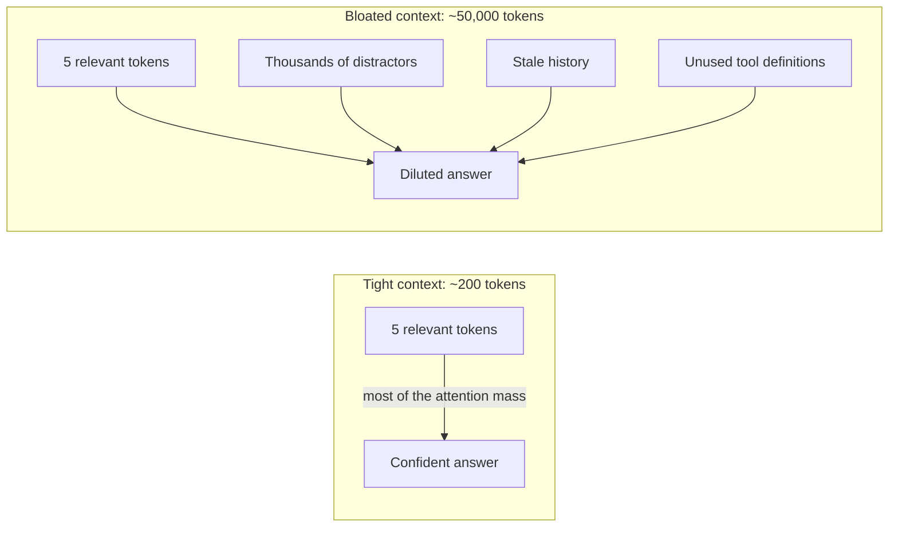

# 1. The constraint and the hypothesis

> Part of the [Microagents Thesis](README.md) series. Next:
> [Microagents](02-microagents.md).

## The constraint that started everything

The whole project starts with one piece of consumer hardware: a small gaming PC with an
Nvidia RTX 5060 Ti and 16 GB of VRAM. The goal was modest and stubborn at the same time:
run open-weight language models locally, on hardware I already owned, and get real work
out of them.

16 GB of VRAM is a hard ceiling. It sets, very precisely, how large a model you can hold
in memory and run at usable speed.

### A worked example of the ceiling

The memory a model needs to run is dominated by its weights, plus a working margin for
the key/value cache that grows with context length. As a rough rule, weight memory is:

```
weight_memory ~= parameter_count * bytes_per_parameter
```

For a 12 billion parameter model at different precisions:

| Precision | Bytes per parameter | Weights for 12B | Fits in 16 GB? |
| --- | --- | --- | --- |
| FP16 (half) | 2.0 | ~24 GB | No |
| Q8 (8-bit) | ~1.0 | ~12 GB | Barely, little room for cache |
| Q4_K_M (4-bit K-quant) | ~0.5 | ~6 GB | Yes, with room for context |

Quantization is the lever that makes a 12B model fit at all. A 4-bit K-quant such as
Q4_K_M stores each weight in about four bits instead of sixteen, trading a small amount
of accuracy for a roughly fourfold memory saving. So the practical envelope on this
hardware is a model of up to about 12B parameters, quantized to 4 bits.

### The uncomfortable fact

Any public benchmark will confirm it: a quantized 12B open-weight model does not compete
with a frontier model like Claude Opus or a GPT-5-class system. Not on reasoning, not on
long-horizon tasks, not on tool use. Parameters and training compute buy capability, and
a small local model has far less of both.

The naive conclusion is to give up and rent a frontier model through an API. The
interesting conclusion, and the one Primer is built on, is different.

## The hypothesis: context quality can stand in for scale

The bet behind Primer is this:

> A small model given the *perfect context* for a single, narrow task can approach the
> task accuracy of a frontier model on that same task.

To see why this is even plausible, look at what a transformer actually does when it reads
a prompt.

### Why attention gets noisier as context grows

A transformer processes a sequence of tokens. For each token it builds a vector, and the
self-attention mechanism updates that vector by mixing in information from every other
token. The amount of influence each other token has is an attention weight, and those
weights come out of a softmax: they are all positive and they sum to one. The model has
exactly one unit of attention to spend per token, and it must spread that single unit
across the entire context.

That detail matters more than it looks. Consider a question whose answer depends on 5
genuinely relevant tokens.

- In a **tight** context of 200 tokens, if the model puts even a modest share of its
  attention on the right 5, each relevant token can carry a large, clean signal, and the
  195 others split what is left.
- In a **bloated** context of 50,000 tokens, those same 5 relevant tokens now compete
  with 49,995 others. Even if each irrelevant token pulls only a tiny attention weight,
  there are so many of them that the long tail of distractor weight rivals the signal.
  The average attention mass available per token falls roughly as one over the sequence
  length, so the layer of attention covering the part that actually matters gets thinner
  the more you pile in.



This is not a fringe claim. The published "lost in the middle" effect shows models
retrieving a fact well when it sits at the start or end of a long input and far worse
when the same fact sits in the middle. The broader pattern, sometimes called context
rot, is that accuracy on a fixed question degrades as you pad the input, even when the
answer is still present in it. The attention-dilution mechanism above is one clean way to
understand why.

### The universal corollary

The important part of the hypothesis is the next step. *Every* transformer suffers from
this, frontier models included. They suffer less, because more parameters and better
training let them allocate attention more sharply and tolerate more noise, but the
dilution is structural, not a defect of small models. A frontier model with a bloated
context is fighting the same headwind as a small one; it just has more horsepower to push
through it.

That has a hopeful consequence: techniques that clean up the context help both. They turn
a small model from unusable to adequate, and they make a frontier model better still.
Optimizing context is not a crutch for weak hardware. It is a lever on the whole class of
models. Capability is not only how large your model is; it is also how well you manage
what it pays attention to.

## What "perfect context" means

If context quality is the lever, the next question is what good context looks like. Primer
commits to a specific, almost austere definition. A perfect context is:

- **Small and bounded.** Every token competes for attention, so tokens are a budget, not
  a free resource.
- **Sufficient and no more.** It contains exactly the information the model needs to
  perform the task, and nothing it does not.
- **Specialized for one task.** It is shaped for a single, narrow job rather than for a
  general assistant that might be asked anything.

A general-purpose chat context is the opposite of all three: it is large, it carries
information for tasks the model is not currently doing, and it is shaped to handle
anything. That generality is exactly what dilutes attention.

This austere definition is visible directly in how a Primer agent is configured. An agent
is not a sprawling assistant; it is a small, declarative record with a focused prompt and
a deliberately short tool list (the full agent shape is covered in
[Microagents](02-microagents.md) and [Tool routing](03-tool-routing.md)). The platform
makes the cheap thing to build a narrow agent and the awkward thing to build a bloated
one.

## Where this goes next

The thesis implies a unit of work: not the large general agent, but the *microagent*, a
model plus a deliberately minimal, single-purpose context. The next chapter,
[Microagents](02-microagents.md), turns that unit into a building strategy and names the
two engineering problems the rest of the series solves.
