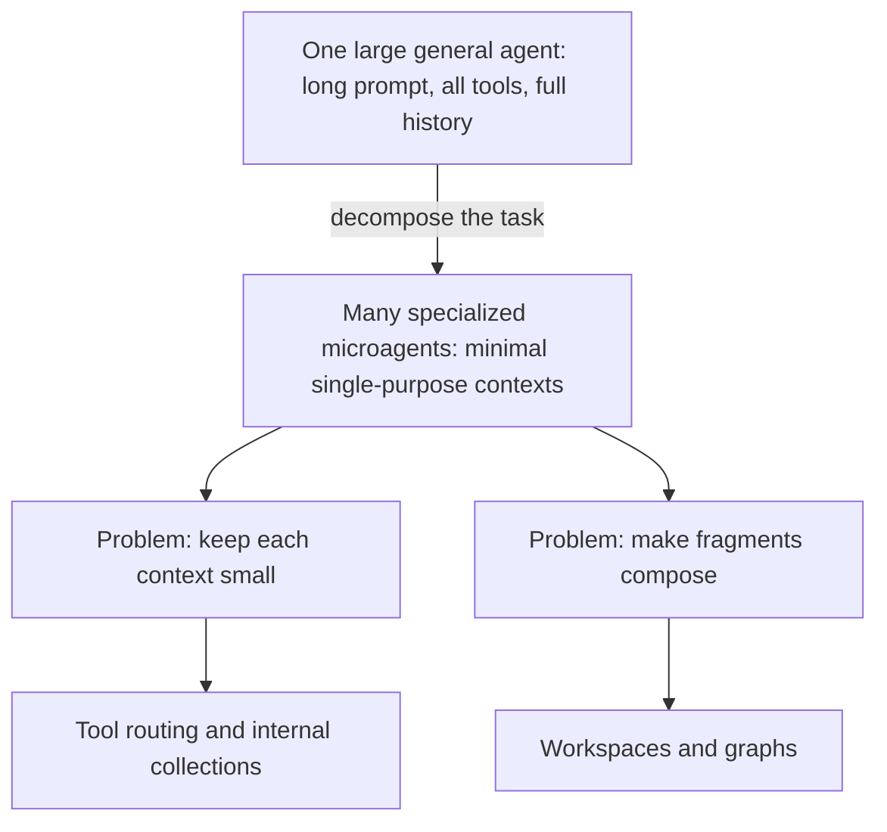
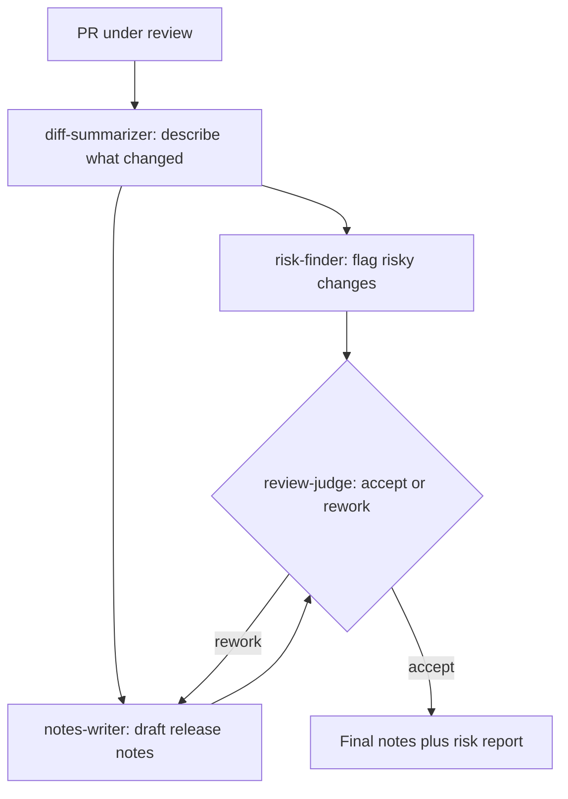

# 2. Microagents

> Part of the [Microagents Thesis](README.md) series. Previous:
> [The constraint and the hypothesis](01-constraint-and-hypothesis.md). Next:
> [Tool routing](03-tool-routing.md).

## From one big agent to many small ones

Committing to the hypothesis reframes the engineering problem. The classic agent design
puts everything in one place: a long system prompt, a large catalog of tools, the full
conversation history, retrieved documents, and scratch reasoning, all in one growing
context that one model carries for the whole task. That design maximizes convenience and
maximizes dilution.

The microagent design inverts it. Decompose the task. Give each fragment its own agent
with its own tight context.



## What a microagent is, concretely

In Primer an agent is a small declarative record, not a program. It is defined by its id,
the model it runs on, a focused system prompt, and a short, explicit tool list. Here is a
realistic agent that does exactly one job: turn a rough bug report into a clean,
reproducible issue.

```json
{
  "id": "bug-triager",
  "description": "Turns a raw bug report into a clean, reproducible issue.",
  "model": {
    "provider_id": "local-llama",
    "model_name": "llama-3.1-12b-instruct-q4"
  },
  "temperature": 0.2,
  "tools": ["workspaces__read", "workspaces__grep"],
  "system_prompt": [
    "You convert a raw bug report into a single well-formed issue.",
    "Read only the files you are pointed at. Do not speculate beyond them.",
    "Output exactly: a title, reproduction steps, expected vs actual, and the most",
    "likely file. Nothing else."
  ],
  "compaction_prompt": [
    "Preserve the title and the most likely file. Drop raw file contents."
  ]
}
```

Notice what is *not* there. No general assistant persona. No catalog of fifty tools. No
instruction to "help the user with anything." The prompt is a few lines, the tool list is
two entries, and both are shaped for one job. That is the austere context from
[chapter 1](01-constraint-and-hypothesis.md) expressed as configuration. The agent
runtime that assembles this into a prompt, streams the model, dispatches tools, and
persists the turn is documented in [agents](../subsystems/agents.md); one run of one
agent on one workspace is a [session](../subsystems/sessions.md).

## Decomposition in practice

Take a task that a single frontier agent might do in one expensive pass: "review this
pull request and write the release notes." A microagent decomposition splits it into
narrow jobs, each with its own tiny context:



Each box is a microagent with a single-purpose prompt and a minimal tool set. The
`diff-summarizer` never sees the release-note style guide; the `notes-writer` never sees
the raw diff, only the summary. No agent carries context for a job it is not doing. The
sequencing and the accept/rework loop are expressed as a [graph](06-graphs.md); the
shared artifacts they pass around live in a [workspace](05-workspaces.md).

## The two problems decomposition forces

Decomposition is not free. The moment you split one agent into many, two problems appear,
and the rest of this series is their solution.

1. **What keeps each context small?** A context accretes things, starting with tool
   definitions. As the set of available tools grows, the tool list alone can bloat a
   context back to the size you were trying to avoid. Solved in
   [Tool routing](03-tool-routing.md) and [The internal Collection
   system](04-internal-collections.md).

2. **How do the fragments add up to a whole?** Independent microagents, each with a
   private minimal context, still have to carry shared state forward and synchronize into
   a coherent result. Solved in [Workspaces](05-workspaces.md) (shared state) and
   [Graphs](06-graphs.md) (sequencing), and made durable for long runs in [Event-driven
   execution](07-event-driven-execution.md).

The microagent is the unit. Everything that follows is the machinery that makes a fleet
of them behave like something larger than the sum of its small contexts.
