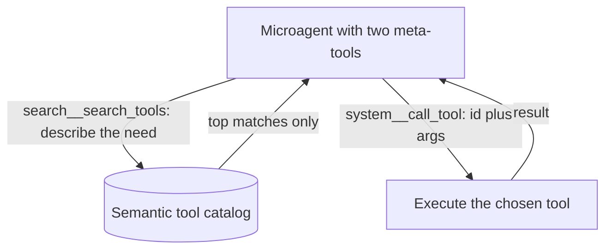

# 3. Tool routing

> Part of the [Microagents Thesis](README.md) series. Previous:
> [Microagents](02-microagents.md). Next:
> [The internal Collection system](04-internal-collections.md).

## The first thing that bloats a context

To let an agent call a tool, you put that tool's definition (its name, description, and
argument schema) into the context. A few tools cost little. But useful systems accumulate
dozens or hundreds of tools, often imported wholesale from MCP servers, and every one of
those definitions is tokens the model must read on every single turn. Worse, the model
now has to choose the right tool out of a long menu, and that choice degrades as the menu
grows. The tool list is a context that bloats by default.

Primer attacks this in two complementary ways.

## Move one: select specific MCP tools

The first move is surgical. When an agent is wired to a tool source, do not import every
tool the source exposes. Select only the specific tools that agent needs. An agent
declares its tools as an explicit list of scoped ids of the form `toolset_id__tool_name`:

```json
{
  "id": "bug-triager",
  "tools": ["workspaces__read", "workspaces__grep"]
}
```

That agent can reach exactly two tools. The rest of the `workspaces` toolset, and every
other toolset, is invisible to it. Both the token cost and the choice space stay small.

For the external MCP server surface (tools Primer exposes *to* outside clients), the same
discipline is enforced by an operator-managed allowlist, the `McpExposure` singleton:

```json
{
  "id": "singleton",
  "enabled": true,
  "allowed_tools": [
    "system__list_agents",
    "system__get_agent",
    "system__call_tool",
    "misc__uuid_v4"
  ],
  "updated_by": "operator@example.com"
}
```

Nothing is exposed unless it is named here. The exposure layer and the safety floor on
top of it are described in [knowledge](../subsystems/knowledge.md) and
[web-search](../subsystems/web-search.md).

## Move two: two meta-tools instead of many tools

The second move is more radical and is where the platform's character first appears.
Instead of registering many tools in a context, register only two meta-tools:

- A **search** tool, `search__search_tools`, that takes a natural-language description of
  what the agent is trying to do and semantically searches the catalog of every tool in
  the system, returning only the best matches.
- A **dispatch** tool, `system__call_tool`, that executes any tool by id with arguments.

With just these two in context, an agent can reach *any* tool in the system without any of
their definitions sitting in its context up front. It searches for the capability it
needs, gets back a small relevant set, and invokes one. The full catalog lives in a vector
index, not in the prompt. The context stays tiny no matter how many tools exist. The
semantic index behind the search is the internal tool collection covered in
[chapter 4](04-internal-collections.md) and [semantic-search](../subsystems/semantic-search.md).



### What a meta-tool call looks like on the wire

A tool call is a `tool_call` part the model emits; the result comes back as a
`tool_result` part. Here is the dispatch tool calling a `misc` utility:

```json
{
  "type": "tool_call",
  "id": "call_ab12",
  "name": "call_tool",
  "arguments": {
    "toolset_id": "misc",
    "tool_name": "uuid_v4",
    "arguments": { "count": 3 }
  }
}
```

And the result that returns:

```json
{
  "type": "tool_result",
  "id": "call_ab12",
  "output": "{\"count\": 3, \"uuids\": [\"550e8400-e29b-41d4-a716-446655440000\", \"...\"]}",
  "error": false
}
```

The `id` correlates the call with its result; `output` is a string (JSON-encoded for
structured data); `error` is true if the tool failed or was denied. Internally the
dispatcher returns a `ToolCallResult` with `output`, `is_error`, and an optional
`extended` field for provider-specific extras.

## The reserved toolsets

The meta-tools live in a fixed set of built-in toolsets, the reserved ids:

| Toolset id | What it is for |
| --- | --- |
| `system` | The platform's own REST API as tools (entity CRUD, and `call_tool` meta-dispatch) |
| `search` | Semantic search over the internal collections of tools, agents, graphs, collections |
| `workspaces` | Workspace lifecycle and file I/O (see [chapter 5](05-workspaces.md)) |
| `misc` | Portable, side-effect-free utilities (datetime, uuid, hashing, arithmetic) |
| `web` | Web search and fetch (see [chapter 9](09-web-search-and-safety.md)) |
| `harness` | Harness install and sync (see [chapter 8](08-harnesses.md)) |
| `trigger` | Scheduled and event-driven execution (see [chapter 7](07-event-driven-execution.md)) |

These are immutable and built once at startup; they bypass the normal toolset-row lookup.

## The tool-runner meta-agent

Put a focused system prompt around the two meta-tools and you get a reusable building
block: a meta-agent whose one specialty is *using tools*. It does not know about any
specific tool in advance; it knows how to discover and invoke whatever the task needs.

```json
{
  "id": "tool-runner",
  "description": "Finds and runs the right tool for a request.",
  "model": {
    "provider_id": "local-llama",
    "model_name": "llama-3.1-12b-instruct-q4"
  },
  "temperature": 0.0,
  "tools": ["search__search_tools", "system__call_tool"],
  "system_prompt": [
    "You accomplish a request by finding and calling tools.",
    "First call search__search_tools with a precise description of the capability",
    "you need. Read the few matches it returns.",
    "Then call system__call_tool with the chosen toolset_id, tool_name, and arguments.",
    "Never guess a tool id you have not seen in a search result.",
    "Stop as soon as the request is satisfied and report the result plainly."
  ]
}
```

The capability "call any tool in the system" has been turned into a small, specialized,
context-clean agent. That is the microagent thesis applied to tooling itself, and it is
the template for the next step: if it works for tools, it works for every other kind of
entity. That generalization is [The internal Collection
system](04-internal-collections.md).
