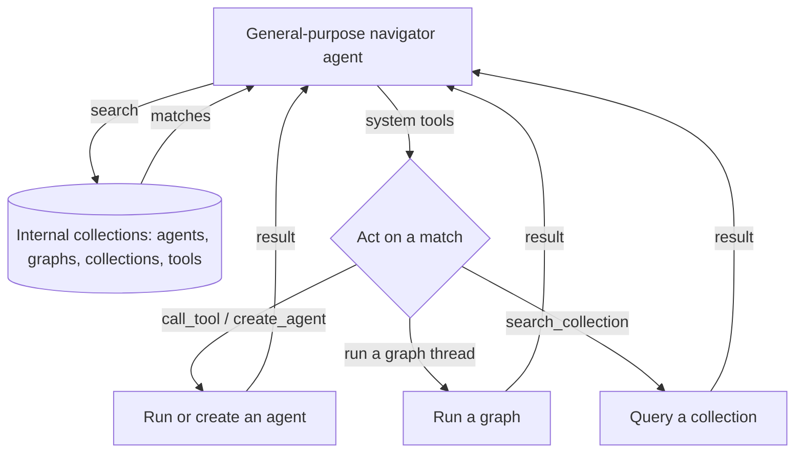

# 4. The internal Collection system

> Part of the [Microagents Thesis](README.md) series. Previous:
> [Tool routing](03-tool-routing.md). Next: [Workspaces](05-workspaces.md).

## Generalizing the tool trick

The tool insight from [chapter 3](03-tool-routing.md) generalizes immediately. If a
growing catalog of tools can be moved out of the context and behind a semantic search,
then so can a growing catalog of *anything* that might otherwise bloat a context.

Primer makes that generalization concrete with the internal Collection system: a set of
system-managed, semantically indexed catalogs of the platform's own entities. It catalogs
not just tools but the other first-class things an agent might want to find and use.

The internal collections are created and maintained by the platform at bootstrap. Their
ids are fixed:

| Entity kind | Internal collection id |
| --- | --- |
| Agents | `_internal_agents` |
| Graphs | `_internal_graphs` |
| Collections | `_internal_collections` |
| Tools | `_internal_tools` |
| Platform docs for agents | `_internal_ai_docs` |

Each entity in the system is embedded into the matching collection and kept in sync as
entities are created, updated, and deleted. The ingestion pipeline that turns an entity
into searchable chunks, and the change-data-capture that keeps the index current, are
documented in [knowledge](../subsystems/knowledge.md); the retrieval pipeline behind the
search is in [semantic-search](../subsystems/semantic-search.md).

## Discovery without bloat

The same pattern that gave us a tool-runner now gives us a whole family of discovery
agents. You can write a specialized agent that searches for *other agents*, or one that
navigates *collections* to find the right body of knowledge, all without carrying those
catalogs in context.

A semantic search over a user collection looks like this:

```json
POST /v1/collections/support-kb/search
{
  "query": "how do refunds work for annual plans",
  "top_k": 5
}
```

and returns ranked hits, each pointing back at a document chunk:

```json
{
  "hits": [
    {
      "document_id": "doc-refunds",
      "chunk_id": "chunk-3",
      "score": 0.87,
      "text": "Annual plans are refundable pro-rata within 30 days ...",
      "meta": { "section": "billing" }
    }
  ]
}
```

The internal collections are searched the same way, through the `search` toolset, so an
agent can ask "what agent knows how to summarize a PDF" and get back a short list of agent
ids rather than a context full of every agent definition.

## System tools: acting on what you find

Searching a catalog is only half of what you want. Once an agent has *found* the right
agent, graph, or collection, it needs to *act* on the result: call that agent, run that
graph, search the embeddings inside that collection, or create a new entity. Primer
exposes these platform operations to agents as the **system tools**, a large toolset that
maps the platform's internal REST API onto callable tools.

The system toolset includes, among roughly seventy tools:

- Full create, read, update, delete, list, and find operations for every managed entity
  (agents, graphs, collections, documents, providers, toolsets, threads, policies,
  channels, and more), as tools like `system__create_agent` or `system__list_graphs`.
- The meta-tools `system__call_tool` and `system__list_toolset_tools`.
- Collection and document helpers such as `system__put_document`,
  `system__get_document_content`, and `system__list_collection_documents`.

With search plus system tools in hand, an agent is no longer limited to a fixed
repertoire. It can discover and then invoke the platform's capabilities at run time.



## A navigator agent

Here is an agent whose job is to find and run the right *agent* for a request, built
entirely from search plus system tools:

```json
{
  "id": "router",
  "description": "Finds the best-matching agent and runs it on the request.",
  "model": {
    "provider_id": "local-llama",
    "model_name": "llama-3.1-12b-instruct-q4"
  },
  "temperature": 0.0,
  "tools": ["search__search_agents", "system__call_tool", "system__create_agent"],
  "system_prompt": [
    "Given a request, find the agent best suited to handle it.",
    "Call search__search_agents with a precise description of the task.",
    "If a good match exists, run it. If none fits, create a narrow agent for the",
    "task with system__create_agent, then run that.",
    "Keep each agent you create single-purpose: a focused prompt and a short tool list."
  ]
}
```

## Recursive navigation

Because collections can catalog collections, and because system tools let an agent act on
what it finds, the structure is recursive. A general-purpose agent optimized to find,
create, or call other agents and tools can walk the catalogs as deep as the task
requires, expanding only the branch it currently needs into its context and leaving the
rest indexed and out of the way. The context stays small while the reachable capability
surface stays large.

This is the same trick as the tool-runner, lifted to the level of the entire platform. It
also sets up the next problem. An agent that discovers and runs *other* agents needs those
agents to share state and hand work to each other. That shared surface is the
[workspace](05-workspaces.md).
