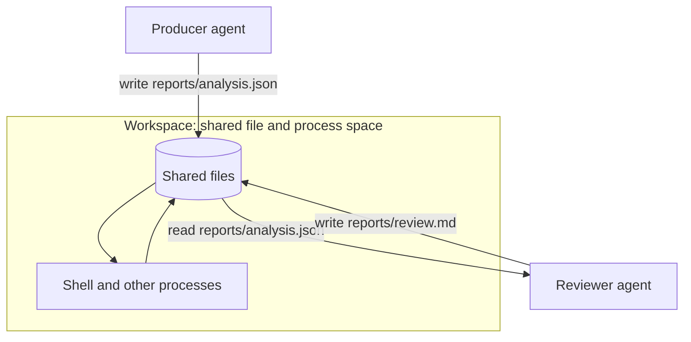

# 5. Workspaces

> Part of the [Microagents Thesis](README.md) series. Previous:
> [The internal Collection system](04-internal-collections.md). Next:
> [Graphs](06-graphs.md).

## The problem decomposition created

Decomposing a task into microagents creates a new problem the moment you try to make them
cooperate. Each agent runs with its own small context, by design. So where does the
shared state of the larger task live? An artifact one agent produces has to be visible to
the next. Two agents working the same problem need a common surface. None of that can
live inside any single agent's private, deliberately minimal context.

This is where workspaces come from.

## Why not a stock sandbox

The obvious candidate was an off-the-shelf sandbox, the kind of agent execution
environment that bundles a filesystem, a shell, and a thick layer of pre-built tooling.
Inspecting them showed the same disease this whole project is trying to cure: they are
riddled with context bloat. They ship large tool surfaces and heavy conventions that land
right back in the agent's context.

So Primer distills the idea down to its essence and calls the result a workspace.

## A workspace is a shared file and process space

A workspace is deliberately minimal. It is a shared file space and a shared process space:

- Agents in the same workspace read and write the same files.
- Agents can run processes, such as a shell, against those files, and those processes
  share the same space.

That is the whole primitive. The concrete backends (local, container, Kubernetes), the
git-backed state history, and the registry of session handles are documented in
[workspaces](../subsystems/workspaces.md); the per-run binding of an agent or graph to a
workspace is a [session](../subsystems/sessions.md).

Agents act on a workspace through a small, fixed set of tools:

| Tool id | Key arguments | Purpose |
| --- | --- | --- |
| `read` | `path`, `offset`, `limit` | Read a file with line-numbered pagination |
| `write` | `path`, `content`, `force` | Create or replace a file |
| `edit` | `path`, `search`, `replace`, `count` | String replace, returning a unified diff |
| `glob` | `pattern`, `recursive` | Find files by glob, newest first |
| `grep` | `pattern`, `path`, `recursive` | Regex search across files |
| `ls` | `path`, `long`, `recursive` | List directory contents |
| `exec` | `command`, `workdir`, `timeout_ms`, `background` | Run a shell command |

The `write` tool enforces a read-before-write rule: an agent must `read` a file before it
may overwrite it, unless it passes `force`. That single rule is what lets several agents
share files without silently clobbering each other's work.

## A producer and a reviewer sharing a file

Here is two microagents collaborating through one workspace file. The producer writes an
analysis; the reviewer reads it.

The producer emits a `write` call:

```json
{
  "type": "tool_call",
  "id": "call_w1",
  "name": "write",
  "arguments": {
    "path": "reports/analysis.json",
    "content": "{\"findings\": [\"n+1 query in list view\", \"missing index on orders.user_id\"]}\n",
    "force": false
  }
}
```

which returns:

```json
{ "type": "tool_result", "id": "call_w1", "output": "wrote 78 bytes to reports/analysis.json", "error": false }
```

Later, a separate reviewer agent in the same workspace reads it back:

```json
{
  "type": "tool_call",
  "id": "call_r1",
  "name": "read",
  "arguments": { "path": "reports/analysis.json" }
}
```

```json
{
  "type": "tool_result",
  "id": "call_r1",
  "output": "1→{\"findings\": [\"n+1 query in list view\", \"missing index on orders.user_id\"]}\n",
  "error": false
}
```

Neither agent carries the other's context. The file is the entire interface between them.



## Tools are just structured file operations

The minimalism pays off in an unexpected way. A lot of the "rich tooling" that fatter
sandboxes provide turns out to be, underneath, just structured reads and writes of a
file. A task list, for example, is a set of operations on a file that holds the list. On a
Primer workspace you do not need a bespoke task-list subsystem; you need the basic file
tools plus a prompt that tells the agent how to keep the list.

For instance, an agent can be told to maintain a plan file:

```markdown
- [x] reproduce the bug
- [ ] find the slow query
- [ ] add the missing index
- [ ] write a regression test
```

It reads that file at the start of each turn, edits one checkbox with `edit`, and writes
it back. The specialized behavior moves out of hard-coded tooling and into context, which
is exactly where the thesis wants it: cheap to vary, easy to specialize, and nothing extra
in the way when it is not needed.

## What workspaces do not do

Workspaces let agents *share* state. They do not, on their own, *sequence* agents.
Sharing a filesystem is a rudimentary form of synchronization; it says nothing about which
agent runs first, what triggers the next one, or when a loop stops. The thesis needs that
control. Supplying it is the job of [graphs](06-graphs.md).
